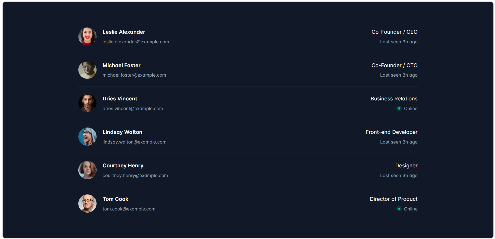
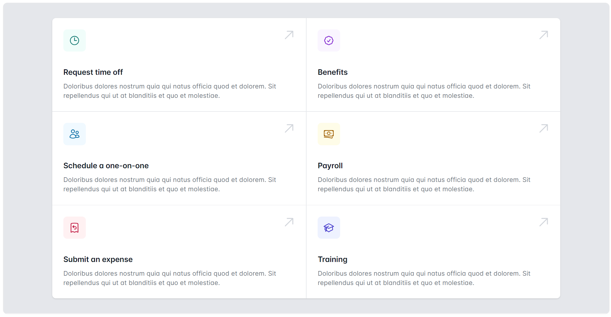
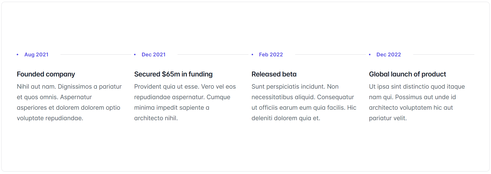
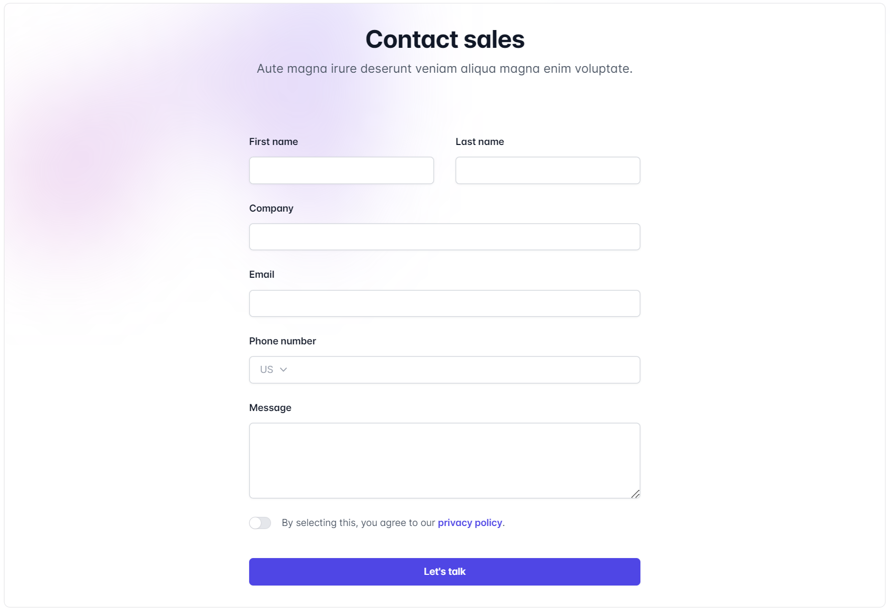

# 1. Tailwind 역사와 특징

**Tailwind 란?**

- Tailwind CSS는 유틸리티-퍼스트(Utility-First) 접근 방식을 사용하는 CSS 프레임워크로, 미리 정의된 클래스를 사용하여 스타일링을 빠르고 효율적으로 할 수 있도록 설계되었습니다.
- Tailwind CSS는 유틸리티-퍼스트 접근 방식을 통해 빠르고 일관성 있는 스타일링을 가능하게 합니다. 설정 가능성과 유연성이 뛰어나며, 반응형 디자인을 쉽게 구현할 수 있습니다. 그러나 HTML 코드의 가독성이 떨어질 수 있고, 초기 학습 곡선이 있을 수 있습니다. 

<br>

**특징**

1. 유틸리티-퍼스트: Tailwind CSS는 미리 정의된 유틸리티 클래스를 사용하여 스타일을 적용합니다. 이는 재사용성과 일관성을 높입니다.
2. 모듈화: 각 클래스는 하나의 스타일링 작업만 수행하며, 이를 조합하여 복잡한 스타일을 만들 수 있습니다.
3. 설정 가능성: Tailwind는 매우 설정 가능하여, 설정 파일을 통해 쉽게 커스터마이징할 수 있습니다.
4. 모던 CSS: 최신 CSS 기능을 적극적으로 활용하며, 개발자에게 익숙한 Flexbox 및 Grid 레이아웃을 기본으로 사용합니다.
5. 미리 처리된 CSS: Tailwind는 PostCSS와 같은 도구와 통합되어, 빌드 단계에서 불필요한 CSS를 제거하고 최적화할 수 있습니다.
6. 반응형 디자인: 반응형 디자인을 쉽게 구현할 수 있도록 다양한 반응형 유틸리티 클래스를 제공합니다.

<br>

**장점**

1. 빠른 개발 속도: 유틸리티 클래스를 사용하여 빠르게 스타일을 적용할 수 있어 개발 속도가 빨라집니다.
2. 일관된 디자인: 모든 스타일이 클래스 기반으로 적용되므로, 프로젝트 전체에서 일관된 디자인을 유지할 수 있습니다.
3. 높은 설정 가능성: Tailwind는 설정 파일을 통해 쉽게 테마, 색상, 폰트 등을 커스터마이징할 수 있어, 프로젝트 요구 사항에 맞출 수 있습니다.
4. 반응형 유틸리티: 반응형 디자인을 위한 유틸리티 클래스가 잘 갖춰져 있어, 다양한 화면 크기에 맞는 디자인을 쉽게 구현할 수 있습니다.
5. 작은 빌드 크기: PurgeCSS와 통합하여 사용하지 않는 CSS를 제거하면, 최종 빌드 크기를 최소화할 수 있습니다.
6. 유연성: 각 유틸리티 클래스가 하나의 스타일링 작업만 수행하기 때문에, 매우 유연하게 스타일을 적용하고 조합할 수 있습니다.

<br>

**단점**

1. 가독성 저하: HTML 파일에 많은 클래스가 포함되기 때문에, HTML 코드의 가독성이 떨어질 수 있습니다.
2. 초기 학습 곡선: 처음 사용하는 개발자에게는 유틸리티 클래스의 사용 방식이 다소 생소할 수 있습니다.
3. 복잡한 커스터마이징: Tailwind의 기본 스타일을 변경하는 것은 쉬우나, 매우 복잡한 커스터마이징이 필요할 경우 설정 파일을 많이 수정해야 할 수 있습니다.
4. HTML에 의존: 스타일이 HTML에 직접 정의되기 때문에, 디자인 변경 시 HTML 파일을 많이 수정해야 할 수 있습니다.
6. 설치 및 설정 필요: Tailwind를 효과적으로 사용하려면 빌드 도구와 통합해야 하며, 이를 위한 초기 설정이 필요합니다.

<br><br>

# 2. Tailwind 의 설치와 도입

## 2-1. Tailwind 설치

- npm을 통해 tailwindcss를 설치하고 tailwind.config.js 파일을 만듭니다.

```shell
# tailwindcss 설치
npm install -D tailwindcss

# tailwind.config.js 생성
npx tailwindcss init
```

<br>

**tailwind.config.js 설정**

- tailwind.config.js 파일의 모든 템플릿 파일에 경로를 추가합니다.

```js
/** @type {import('tailwindcss').Config} */
module.exports = {
  content: ["./src/**/*.{html,js}"],
  theme: {
    extend: {},
  },
  plugins: [],
}
```

<br>

**src/input.css**

- Tailwind의 각 레이어에 대한 @tailwind 지시어를 기본 CSS 파일에 추가합니다.

```css
@tailwind base;
@tailwind components;
@tailwind utilities;
```

<br>

**input.css 파일 빌드하여 output.css 생성**

- CLI 도구를 실행하여 템플릿 파일에서 클래스를 검색하고 CSS를 빌드합니다.

```shell
npx tailwindcss -i ./src/input.css -o ./src/output.css --watch
```

<br>

**index.html에 output.css 적용**

- 컴파일된 CSS 파일을 `<head>`에 추가하고 Tailwind의 유틸리티 클래스를 사용하여 콘텐츠 스타일을 지정합니다.

```html
<!doctype html>
<html>
<head>
  <meta charset="UTF-8">
  <meta name="viewport" content="width=device-width, initial-scale=1.0">
  <link href="./output.css" rel="stylesheet">
</head>
<body>
  <h1 class="text-3xl font-bold underline">
    Hello world!
  </h1>
</body>
</html>
```

<br>

## 2-2. Tailwind PostCSS 설치 및 적용

- Tailwind CSS를 PostCSS 플러그인으로 설치하여 webpack, Rollup, Vite 및 Parcel과 같은 빌드 도구와 통합하게 합니다.

<br>

**Tailwind CSS 설치**

- npm을 통해 tailwindcss 및 해당 피어 종속성을 설치하고 tailwind.config.js 파일을 만듭니다.

```shell
npm install -D tailwindcss postcss autoprefixer
npx tailwindcss init
```

<br>

**Tailwind PostCSS 설정 - postcss.config.js**

- tailwindcss 및 autoprefixer를 postcss.config.js 파일에 추가하거나 프로젝트에서 PostCSS가 구성된 모든 위치에 추가합니다.

```js
module.exports = {
  plugins: {
    tailwindcss: {},
    autoprefixer: {},
  }
}
```

<br>

**Tailwind 설정 - tailwind.config.js**

- tailwind.config.js 파일의 모든 템플릿 파일에 경로를 추가합니다.

```js
/** @type {import('tailwindcss').Config} */
module.exports = {
  content: ["./src/**/*.{html,js}"],
  theme: {
    extend: {},
  },
  plugins: [],
}
```

<br>

**CSS에 Tailwind 지시어 추가 - main.css**

- Tailwind의 각 레이어에 대한 @tailwind 지시어를 기본 CSS 파일에 추가합니다.

```css
@tailwind base;
@tailwind components;
@tailwind utilities;
```

<br>

**프로젝트 빌드 및 실행**

- npm run dev 또는 package.json 파일에 구성된 명령을 사용하여 빌드 프로세스를 실행합니다.

```shell
npm run dev
```

<br>

**빌드된 CSS를 HTML 파일에 적용**

- 컴파일된 CSS가 `<head>`에 포함되어 있는지 확인한 다음 Tailwind의 유틸리티 클래스를 사용하여 콘텐츠 스타일을 지정합니다.

```html
<!doctype html>
<html>
<head>
  <meta charset="UTF-8">
  <meta name="viewport" content="width=device-width, initial-scale=1.0">
  <link href="/dist/main.css" rel="stylesheet">
</head>
<body>
  <h1 class="text-3xl font-bold underline">
    Hello world!
  </h1>
</body>
</html>
```

<br>

## 2-3. Tailwind 설치없이 연결

**CDN 연결**

```html
<!doctype html>
<html>
<head>
  <meta charset="UTF-8">
  <meta name="viewport" content="width=device-width, initial-scale=1.0">
  <script src="https://cdn.tailwindcss.com"></script>
</head>
<body>
  <h1 class="text-3xl font-bold underline">
    Hello world!
  </h1>
</body>
</html>
```

<br>

**tailwind config(설정)**

```html
<!doctype html>
<html>
<head>
  <meta charset="UTF-8">
  <meta name="viewport" content="width=device-width, initial-scale=1.0">
  <script src="https://cdn.tailwindcss.com"></script>
  <script>
    tailwind.config = {
      theme: {
        extend: {
          colors: {
            clifford: '#da373d',
          }
        }
      }
    }
  </script>
</head>
<body>
  <h1 class="text-3xl font-bold underline text-clifford">
    Hello world!
  </h1>
</body>
</html>
```

<br>

**tailwind CSS 사용자 정의**

```html
<!doctype html>
<html>
<head>
  <meta charset="UTF-8">
  <meta name="viewport" content="width=device-width, initial-scale=1.0">
  <script src="https://cdn.tailwindcss.com"></script>
  <style type="text/tailwindcss">
    @layer utilities {
      .content-auto {
        content-visibility: auto;
      }
    }
  </style>
</head>
<body>
  <div class="lg:content-auto">
    <!-- ... -->
  </div>
</body>
</html>
```

<br>

**tailwind 플러그인 연결**

```html
<!doctype html>
<html>
<head>
  <meta charset="UTF-8">
  <meta name="viewport" content="width=device-width, initial-scale=1.0">
  <script src="https://cdn.tailwindcss.com?plugins=forms,typography,aspect-ratio,line-clamp,container-queries"></script>
</head>
<body>
  <div class="prose">
    <!-- ... -->
  </div>
</body>
</html>
```

<br>


## 2-4. Tailwind - Next.js 에 적용

**프로젝트 생성**

- Create Next App을 사용하여 새 Next.js 프로젝트를 생성합니다.

```shell
npx create-next-app@latest my-project --typescript --eslint
cd my-project
```

<br>

**Tailwind 설치 및 설정 파일 생성**

- npm을 통해 tailwindcss 및 해당 피어 종속성을 설치한 다음 init 명령을 실행하여 tailwind.config.js 와 postcss.config.js를 모두 생성합니다.

```shell
npm install -D tailwindcss postcss autoprefixer
npx tailwindcss init -p
```

<br>

**Tailwind의 설정**

- tailwind.config.js 파일에 모든 템플릿 파일에 경로를 추가합니다.

```js
/** @type {import('tailwindcss').Config} */
module.exports = {
  content: [
    "./app/**/*.{js,ts,jsx,tsx,mdx}",
    "./pages/**/*.{js,ts,jsx,tsx,mdx}",
    "./components/**/*.{js,ts,jsx,tsx,mdx}",
 
    // Or if using `src` directory:
    "./src/**/*.{js,ts,jsx,tsx,mdx}",
  ],
  theme: {
    extend: {},
  },
  plugins: [],
}
```

<br>

**Tailwind PostCSS 설정 - postcss.config.js**

- tailwindcss 및 autoprefixer를 postcss.config.js 파일에 추가하거나 프로젝트에서 PostCSS가 구성된 모든 위치에 추가합니다.

```js
module.exports = {
  plugins: {
    tailwindcss: {},
    autoprefixer: {},
  }
}
```

<br>

**CSS에 Tailwind 지시어 추가 - main.css**

- Tailwind의 각 레이어에 대한 @tailwind 지시어를 기본 CSS 파일에 추가합니다.

```css
@tailwind base;
@tailwind components;
@tailwind utilities;
```

<br>

**프로젝트 빌드 및 실행**

- npm run dev 또는 package.json 파일에 구성된 명령을 사용하여 빌드 프로세스를 실행합니다.

```shell
npm run dev
```

<br>

**빌드된 CSS를 View 템플릿 파일에 적용**

- Tailwind의 유틸리티 클래스를 사용하여 콘텐츠 스타일을 지정합니다.

```js
export default function Home() {
  return (
    <h1 className="text-3xl font-bold underline">
      Hello world!
    </h1>
  )
}
```

<br>

## 2-5. Tailwind - React 5 에 적용

**프로젝트 생성**

- Create React App을 사용하여 React 프로젝트를 생성합니다.

```shell
npx create-react-app my-project
cd my-project
```

<br>

**Tailwind 설치 및 설정 파일 생성**

- npm을 통해 tailwindcss 및 해당 피어 종속성을 설치한 다음 init 명령을 실행하여 tailwind.config.js 와 postcss.config.js를 모두 생성합니다.

```shell
npm install -D tailwindcss
npx tailwindcss init
```

<br>

**Tailwind의 설정**

- tailwind.config.js 파일에 모든 템플릿 파일에 경로를 추가합니다.

```js
/** @type {import('tailwindcss').Config} */
module.exports = {
  content: [
    "./src/**/*.{js,jsx,ts,tsx}",
  ],
  theme: {
    extend: {},
  },
  plugins: [],
}
```

<br>

**Tailwind PostCSS 설정 - postcss.config.js**

- tailwindcss 및 autoprefixer를 postcss.config.js 파일에 추가하거나 프로젝트에서 PostCSS가 구성된 모든 위치에 추가합니다.

```js
module.exports = {
  plugins: {
    tailwindcss: {},
    autoprefixer: {},
  }
}
```

<br>

**CSS에 Tailwind 지시어 추가 - main.css**

- Tailwind의 각 레이어에 대한 @tailwind 지시어를 기본 CSS 파일에 추가합니다.

```css
@tailwind base;
@tailwind components;
@tailwind utilities;
```

<br>

**프로젝트 빌드 및 실행**

- npm run start 또는 package.json 파일에 구성된 명령을 사용하여 빌드 프로세스를 실행합니다.

```shell
npm run start
```

<br>

**빌드된 CSS를 View 템플릿 파일에 적용**

- Tailwind의 유틸리티 클래스를 사용하여 콘텐츠 스타일을 지정합니다.

```js
export default function App() {
  return (
    <h1 className="text-3xl font-bold underline">
      Hello world!
    </h1>
  )
}
```

<br>

## 2-6. Tailwind - Vue 에 적용

**프로젝트 생성**

- vue Create을 사용하여 Vue 프로젝트를 생성합니다.

```shell
vue create my-project
cd my-project
```

<br>

**Tailwind 설치 및 설정 파일 생성**

- npm을 통해 tailwindcss 및 해당 피어 종속성을 설치한 다음 init 명령을 실행하여 tailwind.config.js 와 postcss.config.js를 모두 생성합니다.

```shell
npm install -D tailwindcss postcss autoprefixer
npx tailwindcss init -p
```

<br>

**Tailwind의 설정**

- tailwind.config.js 파일에 모든 템플릿 파일에 경로를 추가합니다.

```js
// tailwind.config.js
/** @type {import('tailwindcss').Config} */
export default {
  content: [
    "./index.html",
    "./src/**/*.{vue,js,ts,jsx,tsx}",
  ],
  theme: {
    extend: {},
  },
  plugins: [],
}
```

<br>

**Tailwind PostCSS 설정 - postcss.config.js**

- tailwindcss 및 autoprefixer를 postcss.config.js 파일에 추가하거나 프로젝트에서 PostCSS가 구성된 모든 위치에 추가합니다.

```js
module.exports = {
  plugins: {
    tailwindcss: {},
    autoprefixer: {},
  }
}
```

<br>

**CSS에 Tailwind 지시어 추가 - /src/style.css**

- Tailwind의 각 레이어에 대한 @tailwind 지시어를 기본 CSS 파일에 추가합니다.

```css
/* src/style.css */
@tailwind base;
@tailwind components;
@tailwind utilities;
```

<br>

**프로젝트 빌드 및 실행**

- npm run dev 또는 package.json 파일에 구성된 명령을 사용하여 빌드 프로세스를 실행합니다.

```shell
npm run dev
```

<br>

**빌드된 CSS를 View 템플릿 파일에 적용**

- Tailwind의 유틸리티 클래스를 사용하여 콘텐츠 스타일을 지정합니다.

```vue
<!-- App.vue -->
<template>
  <h1 class="text-3xl font-bold underline">
    Hello world!
  </h1>
</template>
```

<br>

## 2-7. Tailwind - Angular 에 적용

**프로젝트 생성**

- Angular CLI를 사용하여 Angular 프로젝트를 생성합니다.

```shell
ng new my-project
cd my-project
```

<br>

**Tailwind 설치 및 설정 파일 생성**

- npm을 통해 tailwindcss 및 해당 피어 종속성을 설치한 다음 init 명령을 실행하여 tailwind.config.js 와 postcss.config.js를 모두 생성합니다.

```shell
npm install -D tailwindcss postcss autoprefixer
npx tailwindcss init
```

<br>

**Tailwind의 설정**

- tailwind.config.js 파일에 모든 템플릿 파일에 경로를 추가합니다.

```js
// tailwind.config.js
/** @type {import('tailwindcss').Config} */
module.exports = {
  content: [
    "./src/**/*.{html,ts}",
  ],
  theme: {
    extend: {},
  },
  plugins: [],
}
```

<br>

**Tailwind PostCSS 설정 - postcss.config.js**

- tailwindcss 및 autoprefixer를 postcss.config.js 파일에 추가하거나 프로젝트에서 PostCSS가 구성된 모든 위치에 추가합니다.

```js
module.exports = {
  plugins: {
    tailwindcss: {},
    autoprefixer: {},
  }
}
```

<br>

**CSS에 Tailwind 지시어 추가 - /src/style.css**

- Tailwind의 각 레이어에 대한 @tailwind 지시어를 기본 CSS 파일에 추가합니다.

```css
/* src/style.css */
@tailwind base;
@tailwind components;
@tailwind utilities;
```

<br>

**프로젝트 빌드 및 실행**

- ng serve 또는 package.json 파일에 구성된 명령을 사용하여 빌드 프로세스를 실행합니다.

```shell
ng serve
```

<br>

**빌드된 CSS를 View 템플릿 파일에 적용**

- Tailwind의 유틸리티 클래스를 사용하여 콘텐츠 스타일을 지정합니다.

```html
<!-- app.component.html -->
<h1 class="text-3xl font-bold underline">
  Hello world!
</h1>
```

<br>

## 2-7. Tailwind - Nuxt 에 적용

**프로젝트 생성**

- nuxi를 사용하여 Nuxt 프로젝트를 생성합니다.

```shell
npx nuxi init my-project
cd my-project
```

<br>

**Tailwind 설치 및 설정 파일 생성**

- npm을 통해 tailwindcss 및 해당 피어 종속성을 설치한 다음 init 명령을 실행하여 tailwind.config.js 와 postcss.config.js를 모두 생성합니다.

```shell
npm install -D tailwindcss postcss autoprefixer
npx tailwindcss init
```

<br>

**Tailwind의 설정**

- tailwind.config.js 파일에 모든 템플릿 파일에 경로를 추가합니다.

```js
// tailwind.config.js
/** @type {import('tailwindcss').Config} */
module.exports = {
  content: [
    "./components/**/*.{js,vue,ts}",
    "./layouts/**/*.vue",
    "./pages/**/*.vue",
    "./plugins/**/*.{js,ts}",
    "./app.vue",
    "./error.vue",
  ],
  theme: {
    extend: {},
  },
  plugins: [],
}
```

<br>

**Tailwind PostCSS 설정 - postcss.config.js**

- tailwindcss 및 autoprefixer를 postcss.config.js 파일에 추가하거나 프로젝트에서 PostCSS가 구성된 모든 위치에 추가합니다.

```js
module.exports = {
  plugins: {
    tailwindcss: {},
    autoprefixer: {},
  }
}
```

<br>

**CSS에 Tailwind 지시어 추가 - /assets/css/main.css**

- Tailwind의 각 레이어에 대한 @tailwind 지시어를 기본 CSS 파일에 추가합니다.

```css
/* ./assets/css/main.css */
@tailwind base;
@tailwind components;
@tailwind utilities;
```

<br>

**Nuxt 설정 - nuxt.config.js**

- nuxt.config.js 파일의 CSS 배열에 새로 생성된 ./assets/css/main.css를 추가합니다.

```js
//nuxt.config.js
// https://nuxt.com/docs/api/configuration/nuxt-config
export default defineNuxtConfig({
  devtools: { enabled: true },
  css: ['~/assets/css/main.css'],
  postcss: {
    plugins: {
      tailwindcss: {},
      autoprefixer: {},
    },
  },
})
```

<br>

**프로젝트 빌드 및 실행**

- npm run dev 또는 package.json 파일에 구성된 명령을 사용하여 빌드 프로세스를 실행합니다.

```shell
npm run dev
```

<br>

**빌드된 CSS를 View 템플릿 파일에 적용**

- Tailwind의 유틸리티 클래스를 사용하여 콘텐츠 스타일을 지정합니다.

```html
<!-- app.vue -->
<template>
  <h1 class="text-3xl font-bold underline">
    Hello world!
  </h1>
</template>
```

<br><br>

# 3. Tailwind 레이아웃 요소

## 3-1. Breakpoint

| Class     | Breakpoint | Properties           |
|-----------|------------|----------------------|
| container | None       | width: 100%;         |
|  | sm (640px) | max-width: 640px;    |
|  | md (768px) | max-width: 768px;    |
|  | lg (1024px)| max-width: 1024px;   |
|  | xl (1280px)| max-width: 1280px;   |
|  | 2xl (1536px)| max-width: 1536px;  |

<br>

## 3-2. Container

1. 컨테이너 클래스는 현재 중단점의 최소 너비와 일치하도록 요소의 최대 너비를 설정합니다. 이는 완전히 유동적인 뷰포트를 수용하는 대신 고정된 화면 크기 세트에 맞게 디자인하려는 경우에 유용합니다.
2. 다른 프레임워크에서 사용했을 수 있는 컨테이너와 달리 Tailwind의 컨테이너는 자동으로 중앙에 배치되지 않으며 기본 제공 가로 패딩이 없습니다.

<br>

- `.container` : 컨테이너 생성
- `.mx-auto` : 컨테이너를 중앙에 배치
- `.px-*` : 좌우의 패딩 적용

```html
<div class="container mx-auto px-4">
  <!-- ... -->
</div>
```

<br>

**tailwind.config.js를 활용한 적용**

```js
/** @type {import('tailwindcss').Config} */
module.exports = {
  theme: {
    container: {
      center: true,   //가운데 정렬 적용
      padding: {
        DEFAULT: '1rem',  //기본 패딩 적용
        sm: '2rem',   //반응형일 경우 패딩 적용
        lg: '4rem',
        xl: '5rem',
        '2xl': '6rem',
      },
    },
  },
}
```

<br><br>

## 3-3. Columns

| Class          | Properties                     |
|----------------|--------------------------------|
| columns-1      | columns: 1;                    |
| columns-2      | columns: 2;                    |
| columns-3      | columns: 3;                    |
| columns-4      | columns: 4;                    |
| columns-5      | columns: 5;                    |
| columns-6      | columns: 6;                    |
| columns-7      | columns: 7;                    |
| columns-8      | columns: 8;                    |
| columns-9      | columns: 9;                    |
| columns-10     | columns: 10;                   |
| columns-11     | columns: 11;                   |
| columns-12     | columns: 12;                   |
| columns-auto   | columns: auto;                 |
| columns-3xs    | columns: 16rem; /* 256px */    |
| columns-2xs    | columns: 18rem; /* 288px */    |
| columns-xs     | columns: 20rem; /* 320px */    |
| columns-sm     | columns: 24rem; /* 384px */    |
| columns-md     | columns: 28rem; /* 448px */    |
| columns-lg     | columns: 32rem; /* 512px */    |
| columns-xl     | columns: 36rem; /* 576px */    |
| columns-2xl    | columns: 42rem; /* 672px */    |
| columns-3xl    | columns: 48rem; /* 768px */    |
| columns-4xl    | columns: 56rem; /* 896px */    |
| columns-5xl    | columns: 64rem; /* 1024px */   |
| columns-6xl    | columns: 72rem; /* 1152px */   |
| columns-7xl    | columns: 80rem; /* 1280px */   |

<br>

**열 수를 기준으로 추가**

- columns-2 및 columns-3과 같은 유틸리티를 사용하여 요소 내의 콘텐츠에 대해 생성되어야 하는 열 수를 설정합니다. 열 너비는 해당 숫자에 맞게 자동으로 조정됩니다.

```html
<div class="columns-3 ...">
  
  
  <!-- ... -->
</div>
```


<br>

**열 너비를 기준으로 추가**

- columns-xs 및 columns-sm과 같은 유틸리티를 사용하여 요소 내 콘텐츠에 대한 이상적인 열 너비를 설정하고 열 수(개수)는 해당 값에 맞게 자동으로 조정됩니다.
- 이 "티셔츠" 배율은 더 작은 열이 바람직할 수 있으므로 2xs 및 3xs가 추가된 최대 너비 배율과 동일합니다.

```html
<div class="columns-3xs ...">
  
  
  <!-- ... -->
</div>
```


<br>

**열 간격(거터) 설정**

- 열 사이의 너비를 지정하려면 gap-x 유틸리티를 사용할 수 있습니다.

```html
<div class="gap-8 columns-3 ...">
  
  
  <!-- ... -->
</div>
```


<br>

## 3-4. Break After

- 요소 다음에 열이나 페이지를 나누는 방법을 제어하는 ​​유틸리티입니다.

| Class                   | Properties               |
|-------------------------|--------------------------|
| break-after-auto        | break-after: auto;       |
| break-after-avoid       | break-after: avoid;      |
| break-after-all         | break-after: all;        |
| break-after-avoid-page  | break-after: avoid-page; |
| break-after-page        | break-after: page;       |
| break-after-left        | break-after: left;       |
| break-after-right       | break-after: right;      |
| break-after-column      | break-after: column;     |

<br>

**break-after behavior 기본설정**

break-after-* 유틸리티를 사용하여 요소 다음에 열이나 페이지 나누기가 작동하는 방식을 제어합니다. 예를 들어, 요소 뒤에서 열을 강제로 나누려면 break-after-column 유틸리티를 사용하십시오.

```html
<div class="columns-2">
  <p>Well, let me tell you something, ...</p>
  <p class="break-after-column">Sure, go ahead, laugh...</p>
  <p>Maybe we can live without...</p>
  <p>Look. If you think this is...</p>
</div>
```

<br>

**Hover, focus 상태에 따른 변화 적용**

- Tailwind를 사용하면 변형 수정자를 사용하여 다양한 상태에서 유틸리티 클래스를 조건부로 적용할 수 있습니다. 예를 들어 hover:break-after-column을 사용하면 hover 시 break-after-column 유틸리티만 적용할 수 있습니다.

```html
<div class="hover:break-after-column">
  <!-- ... -->
</div>
```

<br>

**Breakpoints 와 미디어쿼리를 사용하는 경우**

- 변형 수정자를 사용하여 반응형 중단점, 다크 모드, 선호 감소 모션 등과 같은 미디어 쿼리를 대상으로 지정할 수도 있습니다. 예를 들어 md:break-after-column을 사용하면 중간 화면 크기 이상에서만 break-after-column 유틸리티를 적용할 수 있습니다.

```html
<div class="md:break-after-column">
  <!-- ... -->
</div>
```

<br>

## 3-5. Break Before

- 열이나 페이지가 요소보다 먼저 구분되는 방식을 제어하는 ​​유틸리티입니다.

| Class                   | Properties                |
|-------------------------|---------------------------|
| break-before-auto       | break-before: auto;       |
| break-before-avoid      | break-before: avoid;      |
| break-before-all        | break-before: all;        |
| break-before-avoid-page | break-before: avoid-page; |
| break-before-page       | break-before: page;       |
| break-before-left       | break-before: left;       |
| break-before-right      | break-before: right;      |
| break-before-column     | break-before: column;     |

<br>

**기본 설정**

- break-before-* 유틸리티를 사용하여 요소 이전에 열 또는 페이지 나누기가 작동하는 방식을 제어합니다. 예를 들어, 요소 앞에서 열을 강제로 나누려면 break-before-column 유틸리티를 사용하십시오.

```html
<div class="columns-2">
  <p>Well, let me tell you something, ...</p>
  <p class="break-before-column">Sure, go ahead, laugh...</p>
  <p>Maybe we can live without...</p>
  <p>Look. If you think this is...</p>
</div>
```

<br>

**Hover, focus 상태에 따른 변화 적용**

- Tailwind를 사용하면 변형 수정자를 사용하여 다양한 상태에서 유틸리티 클래스를 조건부로 적용할 수 있습니다. 예를 들어 hover:break-before-column을 사용하면 hover 시 break-before-column 유틸리티만 적용할 수 있습니다.

```html
<div class="hover:break-before-column">
  <!-- ... -->
</div>
```

<br>

**Breakpoints 와 미디어쿼리를 사용하는 경우**

- 변형 수정자를 사용하여 반응형 중단점, 다크 모드, 선호 감소 모션 등과 같은 미디어 쿼리를 대상으로 지정할 수도 있습니다. 예를 들어 md:break-before-column을 사용하면 중간 화면 크기 이상에서만 break-before-column 유틸리티를 적용할 수 있습니다.

```html
<div class="md:break-before-column">
  <!-- ... -->
</div>
```

<br>

## 3-5. Break Inside

- 요소 내에서 열이나 페이지를 나누는 방법을 제어하는 ​​유틸리티입니다.

| Class                      | Properties                   |
|----------------------------|------------------------------|
| break-inside-auto          | break-inside: auto;          |
| break-inside-avoid         | break-inside: avoid;         |
| break-inside-avoid-page    | break-inside: avoid-page;    |
| break-inside-avoid-column  | break-inside: avoid-column;  |

<br>

**기본 설정**

- 요소 내에서 열 또는 페이지 나누기가 작동하는 방식을 제어하려면 break-inside-* 유틸리티를 사용하십시오. 예를 들어, 요소 내에서 열 나누기를 방지하려면 break-inside-avoid-column 유틸리티를 사용하십시오.

```html
<div class="columns-2">
  <p>Well, let me tell you something, ...</p>
  <p class="break-inside-avoid-column">Sure, go ahead, laugh...</p>
  <p>Maybe we can live without...</p>
  <p>Look. If you think this is...</p>
</div>
```

<br>

**Hover, focus 상태에 따른 변화 적용**

- Tailwind를 사용하면 변형 수정자를 사용하여 다양한 상태에서 유틸리티 클래스를 조건부로 적용할 수 있습니다. 예를 들어 hover:break-inside-avoid-column을 사용하면 호버 시 break-inside-avoid-column 유틸리티만 적용할 수 있습니다.

```html
<div class="hover:break-inside-avoid-column">
  <!-- ... -->
</div>
```


<br>

**Breakpoints 와 미디어쿼리를 사용하는 경우**

- 변형 수정자를 사용하여 반응형 중단점, 다크 모드, 선호 감소 모션 등과 같은 미디어 쿼리를 대상으로 지정할 수도 있습니다. 예를 들어 중간 화면 크기 이상에서만 break-inside-avoid-column 유틸리티를 적용하려면 md:break-inside-avoid-column을 사용하세요.

```html
<div class="md:break-inside-avoid-column">
  <!-- ... -->
</div>
```

<br>

## 3-5. Box Decoration Break

- 여러 줄, 열 또는 페이지에 걸쳐 요소 조각을 렌더링하는 방법을 제어하는 ​​유틸리티입니다.

| Class | Properties |
|--------------------------|----------------------------------------|
| box-decoration-clone	| box-decoration-break: clone; |
| box-decoration-slice	| box-decoration-break: slice; |

<br>

**기본 설정**

- 상자 장식 슬라이스 및 상자 장식 복제 유틸리티를 사용하여 배경, 테두리, 테두리 이미지, 상자 그림자, 클립 경로, 여백 및 패딩과 같은 속성을 요소가 하나의 연속 조각인 것처럼 렌더링해야 하는지 여부를 제어합니다. 또는 별개의 블록입니다.

```html
<span class="box-decoration-slice bg-gradient-to-r from-indigo-600 to-pink-500 text-white px-2 ...">
  Hello<br />
  World
</span>
<span class="box-decoration-clone bg-gradient-to-r from-indigo-600 to-pink-500 text-white px-2 ...">
  Hello<br />
  World
</span>
```

<br>

**Hover, focus 상태에 따른 변화 적용**

- Tailwind를 사용하면 변형 수정자를 사용하여 다양한 상태에서 유틸리티 클래스를 조건부로 적용할 수 있습니다. 예를 들어, 마우스를 올려 놓았을 때 box-장식-슬라이스 유틸리티만 적용하려면 hover:box-장식-슬라이스를 사용하세요.

```html
<div class="box-decoration-clone hover:box-decoration-slice">
  <!-- ... -->
</div>
```

<br>

**Breakpoints 와 미디어쿼리를 사용하는 경우**

- 변형 수정자를 사용하여 반응형 중단점, 다크 모드, 선호 감소 모션 등과 같은 미디어 쿼리를 대상으로 지정할 수도 있습니다. 예를 들어, 중간 화면 크기 이상에서만 box-장식-슬라이스 유틸리티를 적용하려면 md:box-장식-슬라이스를 사용하십시오.

```html
<div class="box-decoration-clone md:box-decoration-slice">
  <!-- ... -->
</div>
```

<br>

## 3-5. Box Sizing

- 브라우저가 요소의 전체 크기를 계산하는 방법을 제어하는 ​​유틸리티입니다.

| Class       | Properties                |
|-------------|---------------------------|
| box-border  | box-sizing: border-box;   |
| box-content | box-sizing: content-box;  |

<br>

**기본 설정**

- box-border 유틸리티를 사용하여 요소의 상자 크기를 border-box로 설정하고 높이나 너비를 지정할 때 요소의 테두리와 패딩을 포함하도록 브라우저에 지시합니다.
- 즉, 테두리가 2px이고 모든 면에 패딩이 4px인 100px × 100px 요소가 내부 콘텐츠 영역이 88px × 88px인 100px × 100px로 렌더링됩니다.
- Tailwind는 이를 프리플라이트 기본 스타일의 모든 요소에 대한 기본값으로 만듭니다.

```html
<div class="box-border h-32 w-32 p-4 border-4 ...">
  <!-- ... -->
</div>
```


<br>

**콘텐츠 박스 설정**

- box-content 유틸리티를 사용하여 요소의 상자 크기를 content-box로 설정하고 브라우저에 요소의 지정된 너비 또는 높이 위에 테두리와 패딩을 추가하도록 지시합니다.
- 이는 2px 테두리와 4px의 패딩이 있는 100px × 100px 요소가 실제로 112px × 112px로 렌더링되고 내부 콘텐츠 영역이 100px × 100px임을 의미합니다.

```html
<div class="box-content h-32 w-32 p-4 border-4 ...">
  <!-- ... -->
</div>
```


<br>

**Hover, focus 상태에 따른 변화 적용**

- Tailwind를 사용하면 변형 수정자를 사용하여 다양한 상태에서 유틸리티 클래스를 조건부로 적용할 수 있습니다. 예를 들어 hover:box-content를 사용하면 마우스를 올려 놓을 때만 box-content 유틸리티를 적용할 수 있습니다.

```html
<div class="box-border hover:box-content">
  <!-- ... -->
</div>
```

<br>

**Breakpoints 와 미디어쿼리를 사용하는 경우**

- 변형 수정자를 사용하여 반응형 중단점, 다크 모드, 선호 감소 모션 등과 같은 미디어 쿼리를 대상으로 지정할 수도 있습니다. 예를 들어 md:box-content를 사용하면 중간 화면 크기 이상에서만 box-content 유틸리티를 적용할 수 있습니다.

```html
<div class="box-border md:box-content">
  <!-- ... -->
</div>
```

<br>

## 3-6. Display

- 요소의 표시 상자 유형을 제어하기 위한 유틸리티입니다.

| Class                | Properties                     |
|----------------------|--------------------------------|
| block                | display: block;                |
| inline-block         | display: inline-block;         |
| inline               | display: inline;               |
| flex                 | display: flex;                 |
| inline-flex          | display: inline-flex;          |
| table                | display: table;                |
| inline-table         | display: inline-table;         |
| table-caption        | display: table-caption;        |
| table-cell           | display: table-cell;           |
| table-column         | display: table-column;         |
| table-column-group   | display: table-column-group;   |
| table-footer-group   | display: table-footer-group;   |
| table-header-group   | display: table-header-group;   |
| table-row-group      | display: table-row-group;      |
| table-row            | display: table-row;            |
| flow-root            | display: flow-root;            |
| grid                 | display: grid;                 |
| inline-grid          | display: inline-grid;          |
| contents             | display: contents;             |
| list-item            | display: list-item;            |
| hidden               | display: none;                 |

<br>

**Block & Inline 설정**

- inline, inline-block 및 block 유틸리티를 사용하여 텍스트와 요소의 흐름을 제어합니다.

```html
<div>
  When controlling the flow of text, using the CSS property
  <span class="inline">display: inline</span>
  will cause the text inside the element to wrap normally.

  While using the property <span class="inline-block">display: inline-block</span>
  will wrap the element to prevent the text inside from extending beyond its parent.

  Lastly, using the property <span class="block">display: block</span>
  will put the element on its own line and fill its parent.
</div>
```


<br>

**Flow Root 설정**

- 자체 블록 형식화 컨텍스트를 사용하여 블록 수준 요소를 생성하려면 flow-root 유틸리티를 사용하십시오.

```html
<div class="p-4">
  <div class="flow-root ...">
    <div class="my-4 ...">Well, let me tell you something, ...</div>
  </div>
  <div class="flow-root ...">
    <div class="my-4 ...">Sure, go ahead, laugh if you want...</div>
  </div>
</div>
```


<br>

**Flex 설정**

- flex 유틸리티를 사용하여 블록 수준 flex 컨테이너를 만듭니다.

```html
<div class="flex items-center">
  
  <div>
    <strong>Andrew Alfred</strong>
    <span>Technical advisor</span>
  </div>
</div>
```


<br>

**Inline Flex 설정**

- inline-flex 유틸리티를 사용하여 텍스트와 함께 흐르는 인라인 flex 컨테이너를 만듭니다.

```html
<p>
  Today I spent most of the day researching ways to ...
  <span class="inline-flex items-baseline">
    
    <span>Kramer</span>
  </span>
  keeps telling me there is no way to make it work, that ...
</p>
```


<br>

**Grid 설정**

- 그리드 유틸리티를 사용하여 그리드 컨테이너를 생성합니다.

```html
<div class="grid gap-4 grid-cols-3 grid-rows-3">
  <!-- ... -->
</div>
```


<br>


**Inline Grid 설정**

- inline-grid 유틸리티를 사용하여 인라인 그리드 컨테이너를 생성합니다.

```html
<span class="inline-grid grid-cols-3 gap-4">
  <span>01</span>
  <span>02</span>
  <span>03</span>
  <span>04</span>
  <span>05</span>
  <span>06</span>
</span>
<span class="inline-grid grid-cols-3 gap-4">
  <span>01</span>
  <span>02</span>
  <span>03</span>
  <span>04</span>
  <span>05</span>
  <span>06</span>
</span>
```


<br>


**Contents 설정**

- 컨텐츠 유틸리티를 사용하여 하위 항목이 상위 항목의 직계 하위 항목처럼 작동하는 "phantom" 가상 컨테이너를 만듭니다.

```html
<div class="flex ...">
  <div class="flex-1 ...">01</div>
  <div class="contents">
    <div class="flex-1 ...">02</div>
    <div class="flex-1 ...">03</div>
  </div>
  <div class="flex-1 ...">04</div>
</div>
```


<br>


**Table 설정**

- table, table-row, table-cell, table-caption, table-column, table-column-group, table-header-group, table-row-group 및 table-footer-group 유틸리티를 사용하여 동작하는 요소를 만듭니다. 각각의 테이블 요소와 같습니다.

```html
<div class="table w-full ...">
  <div class="table-header-group ...">
    <div class="table-row">
      <div class="table-cell text-left ...">Song</div>
      <div class="table-cell text-left ...">Artist</div>
      <div class="table-cell text-left ...">Year</div>
    </div>
  </div>
  <div class="table-row-group">
    <div class="table-row">
      <div class="table-cell ...">The Sliding Mr. Bones (Next Stop, Pottersville)</div>
      <div class="table-cell ...">Malcolm Lockyer</div>
      <div class="table-cell ...">1961</div>
    </div>
    <div class="table-row">
      <div class="table-cell ...">Witchy Woman</div>
      <div class="table-cell ...">The Eagles</div>
      <div class="table-cell ...">1972</div>
    </div>
    <div class="table-row">
      <div class="table-cell ...">Shining Star</div>
      <div class="table-cell ...">Earth, Wind, and Fire</div>
      <div class="table-cell ...">1975</div>
    </div>
  </div>
</div>
```


<br>


**Hidden 설정**

- Hidden 유틸리티를 사용하여 요소를 `display: none` 으로 설정하고 페이지 레이아웃에서 제거합니다

```html
<div class="flex ...">
  <div class="hidden ...">01</div>
  <div>02</div>
  <div>03</div>
</div>
```


<br>


**Hover, focus 상태에 따른 변화 적용**

- Tailwind를 사용하면 변형 수정자를 사용하여 다양한 상태에서 유틸리티 클래스를 조건부로 적용할 수 있습니다. 예를 들어 hover:inline-flex를 사용하면 마우스 오버 시에만 inline-flex 유틸리티를 적용할 수 있습니다.

```html
<div class="flex hover:inline-flex">
  <!-- ... -->
</div>
```

<br>

**Breakpoints 와 미디어쿼리를 사용하는 경우**

- 변형 수정자를 사용하여 반응형 중단점, 다크 모드, 선호 감소 모션 등과 같은 미디어 쿼리를 대상으로 지정할 수도 있습니다. 예를 들어 md:inline-flex를 사용하면 중간 화면 크기 이상에서만 inline-flex 유틸리티를 적용할 수 있습니다.

```html
<div class="flex md:inline-flex">
  <!-- ... -->
</div>
```

<br>

## 3-7. Floats

- 요소 주위의 콘텐츠 래핑을 제어하는 ​​유틸리티입니다.

| Class        | Properties            |
|--------------|-----------------------|
| float-start  | float: inline-start;  |
| float-end    | float: inline-end;    |
| float-right  | float: right;         |
| float-left   | float: left;          |
| float-none   | float: none;          |

<br>

**오른쪽으로 Floating**

- 컨테이너 오른쪽에 요소를 띄우려면 float-right 유틸리티를 사용하세요.

```html

<p>Maybe we can live without libraries, people like you and me. ...</p>
```


<br>


**왼쪽으로 Floating**

- float-left 유틸리티를 사용하면 요소를 컨테이너 왼쪽에 띄울 수 있습니다.

```html

<p>Maybe we can live without libraries, people like you and me. ...</p>
```


<br>


**Floating 해제**

- 요소에 적용되는 부동 소수점을 재설정하려면 float-none 유틸리티를 사용하십시오. 이는 float 속성의 기본값입니다.

```html

<p>Maybe we can live without libraries, people like you and me. ...</p>
```


<br>


**Logical 속성 설정**

- 논리적 속성을 사용하여 텍스트 방향에 따라 왼쪽이나 오른쪽에 매핑하는 float-start 또는 float-end 유틸리티를 사용합니다.

```html

<p>Maybe we can live without libraries, people like you and me. ...</p>


<p dir="rtl">... ربما يمكننا العيش بدون مكتبات، أشخاص مثلي ومثلك. ربما. بالتأكيد </p>
```


<br>

**Hover, focus 상태에 따른 변화 적용**

- Tailwind를 사용하면 변형 수정자를 사용하여 다양한 상태에서 유틸리티 클래스를 조건부로 적용할 수 있습니다. 예를 들어 hover:float-right를 사용하면 마우스 오버 시에만 float-right 유틸리티를 적용할 수 있습니다.

```html

```

<br>

**Breakpoints 와 미디어쿼리를 사용하는 경우**

- 변형 수정자를 사용하여 반응형 중단점, 다크 모드, 선호 감소 모션 등과 같은 미디어 쿼리를 대상으로 지정할 수도 있습니다. 예를 들어, 중간 화면 크기 이상에서만 float-right 유틸리티를 적용하려면 md:float-right를 사용하세요.

```html

```

<br>

## 3-8. Clear

- 요소 주위의 콘텐츠 래핑을 제어하는 ​​유틸리티입니다.

| Class       | Properties           |
|-------------|----------------------|
| clear-start | clear: inline-start; |
| clear-end   | clear: inline-end;   |
| clear-left  | clear: left;         |
| clear-right | clear: right;        |
| clear-both  | clear: both;         |
| clear-none  | clear: none;         |

<br>

**Clearing left-floated elements**

- Clear-Left 유틸리티를 사용하여 이전의 왼쪽 부동 요소 아래에 요소를 배치합니다.

```html
<article>
  
  
  <p class="clear-left ...">Maybe we can live without libraries...</p>
</article>
```


<br>

**Clearing right-floated elements**

- 오른쪽에 떠 있는 이전 요소 아래에 요소를 배치하려면 Clear-right 유틸리티를 사용하세요.

```html
<article>
  
  
  <p class="clear-right ...">Maybe we can live without libraries...</p>
</article>
```


<br>

**Clearing all floated elements**

- 이전의 모든 부동 요소 아래에 요소를 배치하려면 Clear-Both 유틸리티를 사용하십시오.

```html
<article>
  
  
  <p class="clear-both ...">Maybe we can live without libraries...</p>
</article>
```


<br>

**Disabling applied clears**

- 요소에 적용된 지우기를 재설정하려면 Clear-none 유틸리티를 사용하십시오. 이는 Clear 속성의 기본값입니다.

```html
<article>
  
  
  <p class="clear-none ...">Maybe we can live without libraries...</p>
</article>
```


<br>

**Logical 속성 활용**

- 텍스트 방향을 기준으로 왼쪽 또는 오른쪽에 매핑되는 지우기 시작 또는 지우기 끝 논리적 속성을 사용합니다.

```html
<article dir="rtl">
  
  
  <p class="clear-end ...">...ربما يمكننا العيش بدون مكتبات،</p>
</article>
```


<br>

**Hover, focus 상태에 따른 변화 적용**

- ailwind를 사용하면 변형 수정자를 사용하여 다양한 상태에서 유틸리티 클래스를 조건부로 적용할 수 있습니다. 예를 들어 hover:clear-none을 사용하면 마우스 오버 시에만 Clear-None 유틸리티를 적용할 수 있습니다.

```html
<p class="clear-left hover:clear-none">
  <!-- ... -->
</p>
```

<br>

**Breakpoints 와 미디어쿼리를 사용하는 경우**

- 변형 수정자를 사용하여 반응형 중단점, 다크 모드, 선호 감소 모션 등과 같은 미디어 쿼리를 대상으로 지정할 수도 있습니다. 예를 들어 md:clear-none을 사용하면 중간 화면 크기 이상에서만 Clear-none 유틸리티를 적용할 수 있습니다.

```html
<p class="clear-left md:clear-none">
  <!-- ... -->
</p>
```

<br>

## 3-9. Isolation

- 요소가 명시적으로 새 쌓임 컨텍스트를 생성해야 하는지 여부를 제어하는 ​​유틸리티입니다.

| Class          | Properties          |
|----------------|---------------------|
| isolate        | isolation: isolate; |
| isolation-auto | isolation: auto;    |

<br>

**기본 설정**

- 요소가 새 스택 컨텍스트를 명시적으로 생성해야 하는지 여부를 제어하려면 isolate 및isolation-auto 유틸리티를 사용하세요.

```html
<div class="isolate ...">
  <!-- ... -->
</div>
```

<br>

**Hover, focus 상태에 따른 변화 적용**

- Tailwind를 사용하면 변형 수정자를 사용하여 다양한 상태에서 유틸리티 클래스를 조건부로 적용할 수 있습니다. 예를 들어 hover:isolation-auto를 사용하면 호버 시에만 isolation-auto 유틸리티를 적용할 수 있습니다.

```html
<div class="isolate hover:isolation-auto">
  <!-- ... -->
</div>
```

<br>

**Breakpoints 와 미디어쿼리를 사용하는 경우**

- 변형 수정자를 사용하여 반응형 중단점, 다크 모드, 선호 감소 모션 등과 같은 미디어 쿼리를 대상으로 지정할 수도 있습니다. 예를 들어 md:isolation-auto를 사용하면 중간 화면 크기 이상에서만isolation-auto 유틸리티를 적용할 수 있습니다.

```html
<div class="isolate md:isolation-auto">
  <!-- ... -->
</div>
```

<br>

## 3-10. Object Fit

- 대체된 요소의 콘텐츠 크기를 조정하는 방법을 제어하는 ​​유틸리티입니다.

| Class            | Properties                |
|------------------|---------------------------|
| object-contain   | object-fit: contain;       |
| object-cover     | object-fit: cover;         |
| object-fill      | object-fit: fill;          |
| object-none      | object-fit: none;          |
| object-scale-down| object-fit: scale-down;    |

<br>

**컨테이너에 맞게 콘텐츠의 크기를 조정**

- 컨테이너를 덮도록 요소 콘텐츠의 크기를 조정하려면 `object-cover` 유틸리티를 사용하세요.

```html
<div class="bg-indigo-300 ...">
  
</div>
```


<br>

**컨테이너 높이에 맞게 조절**

- 컨테이너 내에 포함되도록 요소의 콘텐츠 크기를 조정하려면 `object-contain` 유틸리티를 사용하세요.

```html
<div class="bg-purple-300 ...">
  
</div>
```


<br>

**컨테이너에 맞게 요소의 콘텐츠를 늘리기**

- 컨테이너에 맞게 요소의 콘텐츠를 늘리려면 `object-fill` 유틸리티를 사용하세요.

```html
<div class="bg-sky-300 ...">
  
</div>
```


<br>

**요소가 컨테이너 크기보다 크면 컨테이너에 맞게 축소**

- 요소의 콘텐츠를 원래 크기로 표시하지만 필요한 경우 컨테이너에 맞게 크기를 축소하려면 `object-scale-down` 유틸리티를 사용하세요.

```html
<div class="bg-cyan-300">
  
</div>
```


<br>

**컨테이너에 맞게 조절**

- 컨테이너 크기를 무시하고 요소의 내용을 원래 크기로 표시하려면 `object-none` 유틸리티를 사용하십시오.

```html
<div class="bg-yellow-300">
  
</div>
```


<br>

**Hover, focus 상태에 따른 변화 적용**

- Tailwind를 사용하면 변형 수정자를 사용하여 다양한 상태에서 유틸리티 클래스를 조건부로 적용할 수 있습니다. 예를 들어 hover:object-scale-down을 사용하면 마우스 오버 시에만 object-scale-down 유틸리티를 적용할 수 있습니다.

```html

```

<br>

**Breakpoints 와 미디어쿼리를 사용하는 경우**

- 변형 수정자를 사용하여 반응형 중단점, 다크 모드, 선호 감소 모션 등과 같은 미디어 쿼리를 대상으로 지정할 수도 있습니다. 예를 들어 md:object-scale-down을 사용하면 중간 화면 크기 이상에서만 object-scale-down 유틸리티를 적용할 수 있습니다.

```html

```

<br>

## 3-11. Object Position

- 대체된 요소의 콘텐츠가 해당 컨테이너 내에 배치되는 방법을 제어하는 ​​유틸리티입니다.

| Class                | Properties                       |
|----------------------|----------------------------------|
| object-bottom        | object-position: bottom;          |
| object-center        | object-position: center;          |
| object-left          | object-position: left;            |
| object-left-bottom   | object-position: left bottom;     |
| object-left-top      | object-position: left top;        |
| object-right         | object-position: right;           |
| object-right-bottom  | object-position: right bottom;    |
| object-right-top     | object-position: right top;       |
| object-top           | object-position: top;             |

<br>

**기본 설정**

- `object-*` 유틸리티를 사용하여 대체된 요소의 콘텐츠가 해당 컨테이너 내에 배치되는 방법을 지정합니다.

```html


```


<br>

**Hover, focus 상태에 따른 변화 적용**

- Tailwind를 사용하면 변형 수정자를 사용하여 다양한 상태에서 유틸리티 클래스를 조건부로 적용할 수 있습니다. 예를 들어 hover:object-top을 사용하면 마우스 오버 시에만 object-top 유틸리티를 적용할 수 있습니다.

```html

```

<br>

**Breakpoints 와 미디어쿼리를 사용하는 경우**

- 변형 수정자를 사용하여 반응형 중단점, 다크 모드, 선호 감소 모션 등과 같은 미디어 쿼리를 대상으로 지정할 수도 있습니다. 예를 들어 md:object-top을 사용하면 중간 화면 크기 이상에서만 object-top 유틸리티를 적용할 수 있습니다.

```html

```

<br>

## 3-12. Overflow

- 요소가 컨테이너에 비해 너무 큰 콘텐츠를 처리하는 방법을 제어하는 ​​유틸리티입니다.

| Class              | Properties                |
|--------------------|---------------------------|
| overflow-auto      | overflow: auto;           |
| overflow-hidden    | overflow: hidden;         |
| overflow-clip      | overflow: clip;           |
| overflow-visible   | overflow: visible;        |
| overflow-scroll    | overflow: scroll;         |
| overflow-x-auto    | overflow-x: auto;         |
| overflow-y-auto    | overflow-y: auto;         |
| overflow-x-hidden  | overflow-x: hidden;       |
| overflow-y-hidden  | overflow-y: hidden;       |
| overflow-x-clip    | overflow-x: clip;         |
| overflow-y-clip    | overflow-y: clip;         |
| overflow-x-visible | overflow-x: visible;      |
| overflow-y-visible | overflow-y: visible;      |
| overflow-x-scroll  | overflow-x: scroll;       |
| overflow-y-scroll  | overflow-y: scroll;       |

<br>

**넘치는 콘텐츠 표시**

- 요소 내의 콘텐츠가 잘리는 것을 방지하려면 `overflow-visible` 유틸리티를 사용하세요. 그러면 요소의 경계를 벗어나는 모든 콘텐츠가 표시됩니다.

```html
<div class="overflow-visible ..."></div>
```


<br>

**넘쳐나는 콘텐츠 숨기기**

- 해당 요소의 경계를 벗어나는 요소 내 콘텐츠를 자르려면 `overflow-hidden` 유틸리티를 사용하세요.

```html
<div class="overflow-hidden ..."></div>
```


<br>

**컨테이너보다 콘텐츠가 더 클 경우 스크롤바 표시**

- 내용이 해당 요소의 경계를 초과하는 경우 Overflow-auto 유틸리티를 사용하여 요소에 스크롤 막대를 추가합니다. 항상 스크롤 막대를 표시하는 Overflow-scroll과 달리 이 유틸리티는 스크롤이 필요한 경우에만 스크롤 막대를 표시합니다.

```html
<div class="overflow-auto ..."></div>
```


<br>

**컨테이너보다 콘텐츠의 너비가 너 클 경우 수평 스크롤바 표시**

- 필요한 경우 수평 스크롤을 허용하려면 `overflow-x-auto` 유틸리티를 사용하십시오.

```html
<div class="overflow-x-auto ..."></div>
```


<br>

**컨테이너보다 콘텐츠의 높이가 너 클 경우 수직 스크롤바 표시**

- 필요한 경우 수직 스크롤을 허용하려면 `overflow-y-auto` 유틸리티를 사용하십시오.

```html
<div class="overflow-y-auto h-32 ..."></div>
```


<br>

**컨테이너에 항상 수평 스크롤바 표시**

- 수평 스크롤을 허용하고 운영 체제에서 항상 표시되는 스크롤 막대를 비활성화하지 않는 한 항상 스크롤 막대를 표시하려면 `overflow-x-scroll` 유틸리티를 사용하십시오.

```html
<div class="overflow-x-scroll ..."></div>
```


<br>

**컨테이너에 항상 수직 스크롤바 표시**

- 수직 스크롤을 허용하고 운영 체제에서 항상 표시되는 스크롤 막대를 비활성화하지 않는 한 항상 스크롤 막대를 표시하려면 `overflow-y-scroll` 유틸리티를 사용하십시오.

```html
<div class="overflow-y-scroll ..."></div>
```


<br>

**콘텐츠의 크기와 관계없이 컨테이너에 항상 수평/수직 스크롤바 표시**

- 요소에 스크롤바를 추가하려면 Overflow-scroll 유틸리티를 사용하세요. 필요한 경우에만 스크롤 막대를 표시하는 `overflow-auto` 와 달리 이 유틸리티는 항상 스크롤 막대를 표시합니다. 

```html
<div class="overflow-scroll ..."></div>
```


<br>

**Hover, focus 상태에 따른 변화 적용**

- Tailwind를 사용하면 변형 수정자를 사용하여 다양한 상태에서 유틸리티 클래스를 조건부로 적용할 수 있습니다. 예를 들어 hover:overflow-scroll을 사용하면 마우스 오버 시에만 오버플로 스크롤 유틸리티를 적용할 수 있습니다.

```html
<div class="overflow-auto hover:overflow-scroll">
  <!-- ... -->
</div>
```

<br>

**Breakpoints 와 미디어쿼리를 사용하는 경우**

- 변형 수정자를 사용하여 반응형 중단점, 다크 모드, 선호 감소 모션 등과 같은 미디어 쿼리를 대상으로 지정할 수도 있습니다. 예를 들어 md:overflow-scroll을 사용하면 중간 화면 크기 이상에서만 오버플로 스크롤 유틸리티를 적용할 수 있습니다.

```html
<div class="overflow-auto md:overflow-scroll">
  <!-- ... -->
</div>
```

<br>

## 3-13. Overscroll Behavior

- 스크롤 영역의 경계에 도달할 때 브라우저가 동작하는 방식을 제어하는 ​​유틸리티입니다.

| Class               | Properties                     |
|---------------------|--------------------------------|
| overscroll-auto     | overscroll-behavior: auto;      |
| overscroll-contain  | overscroll-behavior: contain;   |
| overscroll-none     | overscroll-behavior: none;      |
| overscroll-y-auto   | overscroll-behavior-y: auto;    |
| overscroll-y-contain| overscroll-behavior-y: contain; |
| overscroll-y-none   | overscroll-behavior-y: none;    |
| overscroll-x-auto   | overscroll-behavior-x: auto;    |
| overscroll-x-contain| overscroll-behavior-x: contain; |
| overscroll-x-none   | overscroll-behavior-x: none;    |


<br>

**기본 설정**

- 대상 영역의 스크롤이 상위 요소의 스크롤을 트리거하는 것을 방지하려면 `overscroll-contain` 유틸리티를 사용하십시오. 그러나 이를 지원하는 운영 체제에서 컨테이너 끝을 지나 스크롤할 때 "바운스" 효과는 유지됩니다.
- `overscroll-none` 유틸리티를 사용하면 대상 영역의 스크롤이 상위 요소의 스크롤을 트리거하는 것을 방지하고 컨테이너 끝을 지나 스크롤할 때 "바운스" 효과도 방지할 수 있습니다.
- 사용자가 기본 스크롤 영역의 경계에 도달하면 상위 스크롤 영역을 계속 스크롤할 수 있도록 하려면 `overscroll-auto` 유틸리티를 사용하십시오.


```html
<div class="overscroll-contain ...">Well, let me tell you something, ...</div>
<div class="overscroll-none ...">Well, let me tell you something, ...</div>
<div class="overscroll-auto ...">Well, let me tell you something, ...</div>
```

<br>

**Hover, focus 상태에 따른 변화 적용**

- Tailwind를 사용하면 변형 수정자를 사용하여 다양한 상태에서 유틸리티 클래스를 조건부로 적용할 수 있습니다. 예를 들어, focus:overscroll-contain을 사용하면 포커스에만 overscroll-contain 유틸리티를 적용할 수 있습니다.

```html
<html class="overscroll-auto focus:overscroll-contain">
  <!-- ... -->
</html>
```

<br>

**Breakpoints 와 미디어쿼리를 사용하는 경우**

- 변형 수정자를 사용하여 반응형 중단점, 다크 모드, 선호 감소 모션 등과 같은 미디어 쿼리를 대상으로 지정할 수도 있습니다. 예를 들어 md:overscroll-contain을 사용하면 중간 화면 크기 이상에서만 overscroll-contain 유틸리티를 적용할 수 있습니다.

```html
<html class="overscroll-auto md:overscroll-contain">
  <!-- ... -->
</html>
```

<br>

## 3-14. Position

- DOM에서 요소의 위치를 ​​제어하는 ​​유틸리티입니다.

| Class    | Properties           |
|----------|----------------------|
| static   | position: static;    |
| fixed    | position: fixed;     |
| absolute | position: absolute;  |
| relative | position: relative;  |
| sticky   | position: sticky;    |

<br>

**Static positioning**

- 문서의 일반적인 흐름에 따라 요소를 배치하려면 정적(Static positioning) 유틸리티를 사용하세요.
- 모든 오프셋은 무시되며 요소는 절대 위치에 있는 하위 항목에 대한 위치 참조 역할을 하지 않습니다.

```html
<div class="static ...">
  <p>Static parent</p>
  <div class="absolute bottom-0 left-0 ...">
    <p>Absolute child</p>
  </div>
</div>
```


<br>

**Relative positioning**

- 문서의 일반적인 흐름에 따라 요소를 배치하려면 상대(Relative positioning) 유틸리티를 사용하십시오.
- 모든 오프셋은 요소의 일반 위치를 기준으로 계산되며 요소는 절대(Absolute) 위치에 있는 하위 요소에 대한 위치 참조 역할을 합니다.

```html
<div class="relative ...">
  <p>Relative parent</p>
  <div class="absolute bottom-0 left-0 ...">
    <p>Absolute child</p>
  </div>
</div>
```


<br>

**Absolute positioning**

- 문서의 일반적인 흐름 외부에 요소를 배치하려면 절대(Absolute positioning) 유틸리티를 사용하여 인접 요소가 해당 요소가 존재하지 않는 것처럼 작동하도록 합니다.
- 모든 오프셋은 정적(Static) 위치가 아닌 가장 가까운 상위 항목을 기준으로 계산되며 요소는 절대(Absolute) 위치에 있는 다른 하위 항목에 대한 위치 참조 역할을 합니다.

```html
<div class="static ...">
  <!-- Static parent -->
  <div class="static ..."><p>Static child</p></div>
  <div class="inline-block ..."><p>Static sibling</p></div>
  <!-- Static parent -->
  <div class="absolute ..."><p>Absolute child</p></div>
  <div class="inline-block ..."><p>Static sibling</p></div>
</div>
```


<br>

**Fixed positioning**

- 화면 고정(Fixed positioning) 유틸리티를 사용하여 브라우저 창을 기준으로 요소를 배치합니다.
- 모든 오프셋은 뷰포트를 기준으로 계산되며 요소는 절대 위치에 있는 하위 요소에 대한 위치 참조 역할을 합니다.

```html
<div class="relative">
  <div class="fixed top-0 left-0 right-0">Contacts</div>
  <div>
    <div>
      
      <strong>Andrew Alfred</strong>
    </div>
    <div>
      
      <strong>Debra Houston</strong>
    </div>
    <!-- ... -->
  </div>
</div>
```


<br>

**Sticky positioning**

- 고정(Sticky positioning) 유틸리티를 사용하여 요소가 지정된 임계값을 넘을 때까지 요소를 상대적으로 배치한 다음 상위 항목이 화면에서 벗어날 때까지 고정된 것으로 처리합니다.
- 모든 오프셋은 요소의 일반 위치를 기준으로 계산되며 요소는 절대 위치에 있는 하위 요소에 대한 위치 참조 역할을 합니다.

```html
<div>
  <div>
    <div class="sticky top-0 ...">A</div>
    <div>
      <div>
        
        <strong>Andrew Alfred</strong>
      </div>
      <div>
        
        <strong>Aisha Houston</strong>
      </div>
      <!-- ... -->
    </div>
  </div>
  <div>
    <div class="sticky top-0">B</div>
    <div>
      <div>
        
        <strong>Bob Alfred</strong>
      </div>
      <!-- ... -->
    </div>
  </div>
  <!-- ... -->
</div>
```


<br>


**Hover, focus 상태에 따른 변화 적용**

- Tailwind를 사용하면 변형 수정자를 사용하여 다양한 상태에서 유틸리티 클래스를 조건부로 적용할 수 있습니다. 예를 들어 hover:absolute를 사용하면 마우스 오버 시 절대 유틸리티만 적용할 수 있습니다.

```html
<div class="relative hover:absolute">
  <!-- ... -->
</div>
```

<br>

**Breakpoints 와 미디어쿼리를 사용하는 경우**

- 변형 수정자를 사용하여 반응형 중단점, 다크 모드, 선호 감소 모션 등과 같은 미디어 쿼리를 대상으로 지정할 수도 있습니다. 예를 들어 md:absolute를 사용하면 중간 화면 크기 이상에서만 절대 유틸리티를 적용할 수 있습니다.

```html
<div class="relative md:absolute">
  <!-- ... -->
</div>
```

<br>

## 3-15. Top / Right / Bottom / Left

- 배치된 요소의 배치를 제어하는 ​​유틸리티입니다.

| Class    | Properties                            |
|----------|---------------------------------------|
| inset-0  | inset: 0px;                           |
| inset-x-0| left: 0px;                             |
|          | right: 0px;                            |
| inset-y-0| top: 0px;                              |
|          | bottom: 0px;                           |
| start-0  | inset-inline-start: 0px;               |
| end-0    | inset-inline-end: 0px;                 |
| top-0    | top: 0px;                              |
| right-0  | right: 0px;                            |

<br>

**기본 설정**

- top-*, right-*, Bottom-*, left-* 및 inset-* 유틸리티를 사용하여 위치가 지정된 요소의 가로 또는 세로 위치를 설정합니다.

```html
<!-- Pin to top left corner -->
<div class="relative h-32 w-32 ...">
  <div class="absolute left-0 top-0 h-16 w-16 ...">01</div>
</div>

<!-- Span top edge -->
<div class="relative h-32 w-32 ...">
  <div class="absolute inset-x-0 top-0 h-16 ...">02</div>
</div>

<!-- Pin to top right corner -->
<div class="relative h-32 w-32 ...">
  <div class="absolute top-0 right-0 h-16 w-16 ...">03</div>
</div>

<!-- Span left edge -->
<div class="relative h-32 w-32 ...">
  <div class="absolute inset-y-0 left-0 w-16 ...">04</div>
</div>

<!-- Fill entire parent -->
<div class="relative h-32 w-32 ...">
  <div class="absolute inset-0 ...">05</div>
</div>

<!-- Span right edge -->
<div class="relative h-32 w-32 ...">
  <div class="absolute inset-y-0 right-0 w-16 ...">06</div>
</div>

<!-- Pin to bottom left corner -->
<div class="relative h-32 w-32 ...">
  <div class="absolute bottom-0 left-0 h-16 w-16 ...">07</div>
</div>

<!-- Span bottom edge -->
<div class="relative h-32 w-32 ...">
  <div class="absolute inset-x-0 bottom-0 h-16 ...">08</div>
</div>

<!-- Pin to bottom right corner -->
<div class="relative h-32 w-32 ...">
  <div class="absolute bottom-0 right-0 h-16 w-16 ...">09</div>
</div>
```


<br>

**음수 값 사용**

- 음수 위쪽/오른쪽/아래쪽/왼쪽 값을 사용하려면 클래스 이름 앞에 대시를 붙여 음수 값으로 변환하세요.

```html
<div class="relative h-32 w-32 ...">
  <div class="absolute h-14 w-14 -left-4 -top-4 ..."></div>
</div>
```


<br>

**Logical 적용**

- start-* 및 end-* 유틸리티를 사용하여 텍스트 방향에 따라 왼쪽 또는 오른쪽에 매핑되는 inset-inline-start 및 inset-inline-end 논리 속성을 설정합니다.

```html
<div dir="ltr">
  <div class="relative h-32 w-32 ...">
    <div class="absolute h-14 w-14 top-0 start-0 ..."></div>
  </div>
<div>

<div dir="rtl">
  <div class="relative h-32 w-32 ...">
    <div class="absolute h-14 w-14 top-0 start-0 ..."></div>
  </div>
<div>
```


<br>

**Hover, focus 상태에 따른 변화 적용**

- Tailwind를 사용하면 변형 수정자를 사용하여 다양한 상태에서 유틸리티 클래스를 조건부로 적용할 수 있습니다. 예를 들어 hover:top-6을 사용하면 마우스 오버 시 top-6 유틸리티만 적용할 수 있습니다.

```html
<div class="top-4 hover:top-6">
  <!-- ... -->
</div>
```

<br>

**Breakpoints 와 미디어쿼리를 사용하는 경우**

- 변형 수정자를 사용하여 반응형 중단점, 다크 모드, 선호 감소 모션 등과 같은 미디어 쿼리를 대상으로 지정할 수도 있습니다. 예를 들어 md:top-6을 사용하면 중간 화면 크기 이상에서만 top-6 유틸리티를 적용할 수 있습니다.

```html
<div class="top-4 md:top-6">
  <!-- ... -->
</div>
```

<br>

## 3-16. Visibility

- 요소의 가시성을 제어하는 ​​유틸리티입니다.

| Class     | Properties                  |
|-----------|-----------------------------|
| visible   | visibility: visible;        |
| invisible | visibility: hidden;         |
| collapse  | visibility: collapse;       |

<br>

**요소를 보이지 않게 만들기**

- 보이지 않는 유틸리티를 사용하여 요소를 숨기지만 DOM에서의 위치는 계속 유지하여 다른 요소의 레이아웃에 영향을 미칩니다.

```html
<div class="grid grid-cols-3 gap-4">
  <div>01</div>
  <div class="invisible ...">02</div>
  <div>03</div>
</div>
```


<br>

**요소의 축소**

- 축소 유틸리티를 사용하여 테이블 행, 행 그룹, 열 및 열 그룹을 표시하도록 설정된 것처럼 숨깁니다. 하지만 다른 행과 열의 크기에는 영향을 주지 않습니다.
- 이를 통해 테이블 ​​레이아웃에 영향을 주지 않고 행과 열을 동적으로 전환할 수 있습니다.

```html
<table>
  <thead>
    <tr>
      <th>Invoice #</th>
      <th>Client</th>
      <th>Amount</th>
    </tr>
  </thead>
  <tbody>
    <tr>
      <td>#100</td>
      <td>Pendant Publishing</td>
      <td>$2,000.00</td>
    </tr>
    <tr class="collapse">
      <td>#101</td>
      <td>Kruger Industrial Smoothing</td>
      <td>$545.00</td>
    </tr>
    <tr>
      <td>#102</td>
      <td>J. Peterman</td>
      <td>$10,000.25</td>
    </tr>
  </tbody>
</table>
```


<br>

**요소를 보이게 만들기**

- 요소를 표시하려면 visible 유틸리티를 사용하십시오. 이는 다양한 화면 크기에서 보이지 않는 유틸리티를 실행 취소하는 데 주로 유용합니다.

```html
<div class="grid grid-cols-3 gap-4">
  <div>01</div>
  <div class="visible ...">02</div>
  <div>03</div>
</div>
```


<br>

**Hover, focus 상태에 따른 변화 적용**

- Tailwind를 사용하면 변형 수정자를 사용하여 다양한 상태에서 유틸리티 클래스를 조건부로 적용할 수 있습니다. 예를 들어 hover:invisible을 사용하면 호버 시 보이지 않는 유틸리티만 적용할 수 있습니다.

```html
<div class="visible hover:invisible">
  <!-- ... -->
</div>
```

<br>

**Breakpoints 와 미디어쿼리를 사용하는 경우**

- 변형 수정자를 사용하여 반응형 중단점, 다크 모드, 선호 감소 모션 등과 같은 미디어 쿼리를 대상으로 지정할 수도 있습니다. 예를 들어 md:invisible을 사용하면 중간 화면 크기 이상에서만 보이지 않는 유틸리티를 적용할 수 있습니다.

```html
<div class="visible md:invisible">
  <!-- ... -->
</div>
```

<br>

## 3-17. Z-Index

- 요소의 스택 순서를 제어하는 ​​유틸리티입니다.

| Class  | Properties      |
|--------|-----------------|
| z-0    | z-index: 0;     |
| z-10   | z-index: 10;    |
| z-20   | z-index: 20;    |
| z-30   | z-index: 30;    |
| z-40   | z-index: 40;    |
| z-50   | z-index: 50;    |
| z-auto | z-index: auto;  |

<br>

**z-index 설정**

- z-* 유틸리티를 사용하면 요소가 표시된 순서에 관계없이 요소의 스택 순서를 제어할 수 있습니다.

```html
<div class="z-40 ...">05</div>
<div class="z-30 ...">04</div>
<div class="z-20 ...">03</div>
<div class="z-10 ...">02</div>
<div class="z-0 ...">01</div>
```


<br>

**음수값 설정**

- 음수 Z-인덱스 값을 사용하려면 클래스 이름 앞에 대시를 붙여 음수 값으로 변환하세요.

```html
<div class="-z-50">
  <!-- ... -->
</div>
```

<br>

**Hover, focus 상태에 따른 변화 적용**

- Tailwind를 사용하면 변형 수정자를 사용하여 다양한 상태에서 유틸리티 클래스를 조건부로 적용할 수 있습니다. 예를 들어 hover:z-50을 사용하면 마우스 오버 시에만 z-50 유틸리티를 적용할 수 있습니다.

```html
<div class="z-0 hover:z-50">
  <!-- ... -->
</div>
```

<br>

**Breakpoints 와 미디어쿼리를 사용하는 경우**

- 변형 수정자를 사용하여 반응형 중단점, 다크 모드, 선호 감소 모션 등과 같은 미디어 쿼리를 대상으로 지정할 수도 있습니다. 예를 들어 md:z-50을 사용하면 중간 화면 크기 이상에서만 z-50 유틸리티를 적용할 수 있습니다.

```html
<div class="z-0 md:z-50">
  <!-- ... -->
</div>
```


<br><br>

# 4. Tailwind 콘텐츠 요소

## 4-1. Typograph

- 글꼴 모음(Font-Family) 유틸리티를 사용하여 텍스트의 서체를 제어할 수 있습니다.

| Class     | Properties                            |
|-----------|---------------------------------------------------------------------------------------------------------------------------------------------------------|
| font-sans | font-family: ui-sans-serif, system-ui, sans-serif, "Apple Color Emoji", "Segoe UI Emoji", "Segoe UI Symbol", "Noto Color Emoji";                         |
| font-serif| font-family: ui-serif, Georgia, Cambria, "Times New Roman", Times, serif;                                                                               |
| font-mono | font-family: ui-monospace, SFMono-Regular, Menlo, Monaco, Consolas, "Liberation Mono", "Courier New", monospace;                                         |

```html
<p class="font-sans ...">The quick brown fox ...</p>
<p class="font-serif ...">The quick brown fox ...</p>
<p class="font-mono ...">The quick brown fox ...</p>
```


<br>

**Font Size**

- 요소의 글꼴 크기(Font Size)를 제어하는 ​​유틸리티입니다.

| Class    | Properties                                   |
|----------|----------------------------------------------|
| text-xs  | font-size: 0.75rem; /* 12px */<br>line-height: 1rem; /* 16px */ |
| text-sm  | font-size: 0.875rem; /* 14px */<br>line-height: 1.25rem; /* 20px */ |
| text-base| font-size: 1rem; /* 16px */<br>line-height: 1.5rem; /* 24px */ |
| text-lg  | font-size: 1.125rem; /* 18px */<br>line-height: 1.75rem; /* 28px */ |
| text-xl  | font-size: 1.25rem; /* 20px */<br>line-height: 1.75rem; /* 28px */ |
| text-2xl | font-size: 1.5rem; /* 24px */<br>line-height: 2rem; /* 32px */ |
| text-3xl | font-size: 1.875rem; /* 30px */<br>line-height: 2.25rem; /* 36px */ |
| text-4xl | font-size: 2.25rem; /* 36px */<br>line-height: 2.5rem; /* 40px */ |
| text-5xl | font-size: 3rem; /* 48px */<br>line-height: 1; |
| text-6xl | font-size: 3.75rem; /* 60px */<br>line-height: 1; |
| text-7xl | font-size: 4.5rem; /* 72px */<br>line-height: 1; |
| text-8xl | font-size: 6rem; /* 96px */<br>line-height: 1; |
| text-9xl | font-size: 8rem; /* 128px */<br>line-height: 1; |

- `text-*` 유틸리티를 사용하여 요소의 글꼴 크기를 제어합니다.
- 글꼴 크기(Font Size) 유틸리티에 줄 높이 수정자를 추가하여 글꼴 크기를 설정하는 동시에 요소의 줄 높이를 설정합니다. 예를 들어 `text-xl/8`을 사용하여 글꼴 크기를 1.25rem, 줄 높이를 2rem으로 설정합니다.

```html
<p class="text-sm ...">The quick brown fox ...</p>
<p class="text-base ...">The quick brown fox ...</p>
<p class="text-lg ...">The quick brown fox ...</p>
<p class="text-xl ...">The quick brown fox ...</p>
<p class="text-2xl ...">The quick brown fox ...</p>
```


```html
<p class="text-base/6 ...">So I started to walk into the water...</p>
<p class="text-base/7 ...">So I started to walk into the water...</p>
<p class="text-base/loose ...">So I started to walk into the water...</p>
```


<br>

**Font Smoothing**

- 요소의 글꼴 다듬기(Font Smoothing)를 제어하는 ​​유틸리티입니다.

| Class                | Properties                                         |
|----------------------|----------------------------------------------------|
| antialiased          | -webkit-font-smoothing: antialiased;<br>-moz-osx-font-smoothing: grayscale; |
| subpixel-antialiased | -webkit-font-smoothing: auto;<br>-moz-osx-font-smoothing: auto;            |

- 하위 픽셀 앤티앨리어싱을 사용하여 텍스트를 렌더링하려면 subpixel-antialiased 유틸리티를 사용하고 회색조 앤티앨리어싱을 사용하여 텍스트를 렌더링하려면 앤티앨리어싱 유틸리티를 사용합니다.

```html
<p class="subpixel-antialiased ...">The quick brown fox ...</p>
<p class="antialiased ...">The quick brown fox ...</p>
```


<br>

**Font Style**

- 텍스트 스타일(Font Style)을 제어하는 ​​유틸리티입니다.

| Class       | Properties            |
|-------------|-----------------------|
| italic      | font-style: italic;   |
| not-italic  | font-style: normal;   |

```html
<p class="italic ...">The quick brown fox ...</p>
<p class="not-italic ...">The quick brown fox ...</p>
```


<br>

**Font Weight**

- 요소의 글꼴 두께(Font Weight)를 제어하는 ​​유틸리티입니다.

| Class           | Properties          |
|-----------------|---------------------|
| font-thin       | font-weight: 100;   |
| font-extralight | font-weight: 200;   |
| font-light      | font-weight: 300;   |
| font-normal     | font-weight: 400;   |
| font-medium     | font-weight: 500;   |
| font-semibold   | font-weight: 600;   |
| font-bold       | font-weight: 700;   |
| font-extrabold  | font-weight: 800;   |
| font-black      | font-weight: 900;   |


```html
<p class="font-light ...">The quick brown fox ...</p>
<p class="font-normal ...">The quick brown fox ...</p>
<p class="font-medium ...">The quick brown fox ...</p>
<p class="font-semibold ...">The quick brown fox ...</p>
<p class="font-bold ...">The quick brown fox ...</p>
```


<br>

**Font Variant Numeric**

- 숫자의 변형(Font Variant Numeric)을 제어하는 ​​유틸리티입니다.

| Class                | Properties                      |
|----------------------|---------------------------------|
| normal-nums          | font-variant-numeric: normal;   |
| ordinal              | font-variant-numeric: ordinal;  |
| slashed-zero         | font-variant-numeric: slashed-zero; |
| lining-nums          | font-variant-numeric: lining-nums; |
| oldstyle-nums        | font-variant-numeric: oldstyle-nums; |
| proportional-nums    | font-variant-numeric: proportional-nums; |
| tabular-nums         | font-variant-numeric: tabular-nums; |
| diagonal-fractions   | font-variant-numeric: diagonal-fractions; |
| stacked-fractions    | font-variant-numeric: stacked-fractions; |

```html
<p class="ordinal slashed-zero tabular-nums ...">
  1234567890
</p>
<p class="ordinal ...">1st</p>
<p class="slashed-zero ...">0</p>
<p class="lining-nums ...">
  1234567890
</p>
<p class="oldstyle-nums ...">
  1234567890
</p>
<p class="proportional-nums ...">
  12121
</p>
<p class="proportional-nums ...">
  90909
</p>
<p class="tabular-nums ...">
  12121
</p>
<p class="tabular-nums ...">
  90909
</p>
<p class="diagonal-fractions ...">
  1/2 3/4 5/6
</p>
<p class="stacked-fractions ...">
  1/2 3/4 5/6
</p>
<p class="slashed-zero tabular-nums md:normal-nums ...">
  12345
</p>
```

<br>

**Letter Spacing**

- 요소의 추적(문자 간격)을 제어하는 ​​유틸리티입니다.

| Class              | Properties                     |
|--------------------|--------------------------------|
| tracking-tighter   | letter-spacing: -0.05em;       |
| tracking-tight     | letter-spacing: -0.025em;      |
| tracking-normal    | letter-spacing: 0em;           |
| tracking-wide      | letter-spacing: 0.025em;       |
| tracking-wider     | letter-spacing: 0.05em;        |
| tracking-widest    | letter-spacing: 0.1em;         |

```html
<p class="tracking-tight ...">The quick brown fox ...</p>
<p class="tracking-normal ...">The quick brown fox ...</p>
<p class="tracking-wide ...">The quick brown fox ...</p>
```


<br>

**Line Clamp**

- 특정 줄 수에 텍스트를 고정하는 유틸리티입니다.

| Class          | Properties                                                                 |
|----------------|----------------------------------------------------------------------------|
| line-clamp-1   | overflow: hidden; display: -webkit-box; -webkit-box-orient: vertical; -webkit-line-clamp: 1; |
| line-clamp-2   | overflow: hidden; display: -webkit-box; -webkit-box-orient: vertical; -webkit-line-clamp: 2; |
| line-clamp-3   | overflow: hidden; display: -webkit-box; -webkit-box-orient: vertical; -webkit-line-clamp: 3; |
| line-clamp-4   | overflow: hidden; display: -webkit-box; -webkit-box-orient: vertical; -webkit-line-clamp: 4; |
| line-clamp-5   | overflow: hidden; display: -webkit-box; -webkit-box-orient: vertical; -webkit-line-clamp: 5; |
| line-clamp-6   | overflow: hidden; display: -webkit-box; -webkit-box-orient: vertical; -webkit-line-clamp: 6; |
| line-clamp-none | overflow: visible; display: block; -webkit-box-orient: horizontal; -webkit-line-clamp: none; |


```html
<article>
  <time>Mar 10, 2020</time>
  <h2>Boost your conversion rate</h2>
  <p class="line-clamp-3">Nulla dolor velit adipisicing duis excepteur esse in duis nostrud occaecat mollit incididunt deserunt sunt. Ut ut sunt laborum ex occaecat eu tempor labore enim adipisicing minim ad. Est in quis eu dolore occaecat excepteur fugiat dolore nisi aliqua fugiat enim ut cillum. Labore enim duis nostrud eu. Est ut eiusmod consequat irure quis deserunt ex. Enim laboris dolor magna pariatur. Dolor et ad sint voluptate sunt elit mollit officia ad enim sit consectetur enim.</p>
  <div>
    
    Lindsay Walton
  </div>
</article>
```


<br>

**Line Height**

- 요소의 행간(줄 높이)을 제어하는 ​​유틸리티입니다.

| Class           | Properties                              |
|-----------------|-----------------------------------------|
| leading-3       | line-height: .75rem; /* 12px */         |
| leading-4       | line-height: 1rem; /* 16px */           |
| leading-5       | line-height: 1.25rem; /* 20px */        |
| leading-6       | line-height: 1.5rem; /* 24px */         |
| leading-7       | line-height: 1.75rem; /* 28px */        |
| leading-8       | line-height: 2rem; /* 32px */           |
| leading-9       | line-height: 2.25rem; /* 36px */        |
| leading-10      | line-height: 2.5rem; /* 40px */         |
| leading-none    | line-height: 1;                         |
| leading-tight   | line-height: 1.25;                      |
| leading-snug    | line-height: 1.375;                     |
| leading-normal  | line-height: 1.5;                       |
| leading-relaxed | line-height: 1.625;                     |
| leading-loose   | line-height: 2;                         |


```html
<p class="leading-normal ...">So I started to walk into the water...</p>
<p class="leading-relaxed ...">So I started to walk into the water...</p>
<p class="leading-loose ...">So I started to walk into the water...</p>
<p class="leading-6 ...">So I started to walk into the water...</p>
<p class="leading-7 ...">So I started to walk into the water...</p>
<p class="leading-8 ...">So I started to walk into the water...</p>
```

<br>

**List Style Image**

- 목록 항목의 마커 이미지를 제어하는 ​​유틸리티

| Class | Properties |
|--------------------|------------------------------|
| list-image-none	| list-style-image: none; |

```html
<ul class="list-image-[url(checkmark.png)] ...">
  <li>5 cups chopped Porcini mushrooms</li>
  <!-- ... -->
</ul>
```


<br>

**List Style Position**

- 목록의 글머리 기호/번호 위치를 제어하는 ​​유틸리티입니다.

| Class        | Properties                        |
|--------------|-----------------------------------|
| list-inside  | list-style-position: inside;      |
| list-outside | list-style-position: outside;     |

```html
<ul class="list-inside ...">
  <li>5 cups chopped Porcini mushrooms</li>
  <!-- ... -->
</ul>

<ul class="list-outside ...">
  <li>5 cups chopped Porcini mushrooms</li>
  <!-- ... -->
</ul>
```


<br>

**List Style Type**

- 목록의 글머리 기호/번호 스타일을 제어하는 ​​유틸리티입니다.

| Class       | Properties                   |
|-------------|------------------------------|
| list-none   | list-style-type: none;       |
| list-disc   | list-style-type: disc;       |
| list-decimal| list-style-type: decimal;    |

```html
<ul class="list-disc">
  <li>Now this is a story all about how, my life got flipped-turned upside down</li>
  <!-- ... -->
</ul>

<ol class="list-decimal">
  <li>Now this is a story all about how, my life got flipped-turned upside down</li>
  <!-- ... -->
</ol>

<ul class="list-none">
  <li>Now this is a story all about how, my life got flipped-turned upside down</li>
  <!-- ... -->
</ul>
```


<br>

**Text Align**

- 텍스트 정렬을 제어하는 ​​유틸리티입니다.

| Class        | Properties                   |
|--------------|------------------------------|
| text-left    | text-align: left;             |
| text-center  | text-align: center;           |
| text-right   | text-align: right;            |
| text-justify | text-align: justify;          |
| text-start   | text-align: start;            |
| text-end     | text-align: end;              |


```html
<p class="text-left ...">So I started to walk into the water...</p>
<p class="text-center ...">So I started to walk into the water...</p>
<p class="text-right ...">So I started to walk into the water...</p>
<p class="text-justify ...">So I started to walk into the water...</p>
```

<br>

**Text Color**

- 요소의 텍스트 색상을 제어하는 ​​유틸리티입니다.

| Class           | Properties                 |
|-----------------|----------------------------|
| text-inherit    | color: inherit;            |
| text-current    | color: currentColor;       |
| text-transparent | color: transparent;        |
| text-black      | color: rgb(0 0 0);         |
| text-white      | color: rgb(255 255 255);   |
| text-slate-50   | color: rgb(248 250 252);   |
| text-slate-100  | color: rgb(241 245 249);   |
| text-slate-200  | color: rgb(226 232 240);   |
| text-slate-300  | color: rgb(203 213 225);   |
| text-slate-400  | color: rgb(148 163 184);   |
| text-slate-500  | color: rgb(100 116 139);   |
| text-slate-600  | color: rgb(71 85 105);     |
| text-slate-700  | color: rgb(51 65 85);      |
| text-slate-800  | color: rgb(30 41 59);      |
| text-slate-900  | color: rgb(15 23 42);      |
| text-slate-950  | color: rgb(2 6 23);        |
| text-gray-50    | color: rgb(249 250 251);   |
| text-gray-100   | color: rgb(243 244 246);   |
| text-gray-200   | color: rgb(229 231 235);   |
| text-gray-300   | color: rgb(209 213 219);   |
| text-gray-400   | color: rgb(156 163 175);   |
| text-gray-500   | color: rgb(107 114 128);   |
| text-gray-600   | color: rgb(75 85 99);      |
| text-gray-700   | color: rgb(55 65 81);      |
| text-gray-800   | color: rgb(31 41 55);      |
| text-gray-900   | color: rgb(17 24 39);      |
| text-gray-950   | color: rgb(3 7 18);        |
| text-zinc-50    | color: rgb(250 250 250);   |
| text-zinc-100   | color: rgb(244 244 245);   |
| text-zinc-200   | color: rgb(228 228 231);   |
| text-zinc-300   | color: rgb(212 212 216);   |
| text-zinc-400   | color: rgb(161 161 170);   |
| text-zinc-500   | color: rgb(113 113 122);   |
| text-zinc-600   | color: rgb(82 82 91);      |
| text-zinc-700   | color: rgb(63 63 70);      |
| text-zinc-800   | color: rgb(39 39 42);      |
| text-zinc-900   | color: rgb(24 24 27);      |
| text-zinc-950   | color: rgb(9 9 11);        |
| text-neutral-50 | color: rgb(250 250 250);   |
| text-neutral-100 | color: rgb(245 245 245);   |
| text-neutral-200 | color: rgb(229 229 229);   |
| text-neutral-300 | color: rgb(212 212 212);   |
| text-neutral-400 | color: rgb(163 163 163);   |
| text-neutral-500 | color: rgb(115 115 115);   |
| text-neutral-600 | color: rgb(82 82 82);      |
| text-neutral-700 | color: rgb(64 64 64);      |
| text-neutral-800 | color: rgb(38 38 38);      |
| text-neutral-900 | color: rgb(23 23 23);      |
| text-neutral-950 | color: rgb(10 10 10);      |
| text-stone-50   | color: rgb(250 250 249);   |
| text-stone-100  | color: rgb(245 245 244);   |
| text-stone-200  | color: rgb(231 229 228);   |
| text-stone-300  | color: rgb(214 211 209);   |
| text-stone-400  | color: rgb(168 162 158);   |
| text-stone-500  | color: rgb(120 113 108);   |
| text-stone-600  | color: rgb(87 83 78);      |
| text-stone-700  | color: rgb(68 64 60);      |
| text-stone-800  | color: rgb(41 37 36);      |
| text-stone-900  | color: rgb(28 25 23);      |
| text-stone-950  | color: rgb(12 10 9);       |
| text-red-50     | color: rgb(254 242 242);   |
| text-red-100    | color: rgb(254 226 226);   |
| text-red-200    | color: rgb(254 202 202);   |
| text-red-300    | color: rgb(252 165 165);   |
| text-red-400    | color: rgb(248 113 113);   |
| text-red-500    | color: rgb(239 68 68);     |
| text-red-600    | color: rgb(220 38 38);     |
| text-red-700    | color: rgb(185 28 28);     |
| text-red-800    | color: rgb(153 27 27);     |
| text-red-900    | color: rgb(127 29 29);     |
| text-red-950    | color: rgb(69 10 10);      |
| text-orange-50  | color: rgb(255 247 237);   |
| text-orange-100 | color: rgb(255 237 213);   |
| text-orange-200 | color: rgb(254 215 170);   |
| text-orange-300 | color: rgb(253 186 116);   |
| text-orange-400 | color: rgb(251 146 60);    |
| text-orange-500 | color: rgb(249 115 22);    |
| text-orange-600 | color: rgb(234 88 12);     |
| text-orange-700 | color: rgb(194 65 12);     |
| text-orange-800 | color: rgb(154 52 18);     |
| text-orange-900 | color: rgb(124 45 18);     |
| text-orange-950 | color: rgb(67 20 7);       |
| text-amber-50   | color: rgb(255 251 235);   |
| text-amber-100  | color: rgb(254 243 199);   |
| text-amber-200  | color: rgb(253 230 138);   |
| text-amber-300  | color: rgb(252 211 77);    |
| text-amber-400  | color: rgb(251 191 36);    |
| text-amber-500  | color: rgb(245 158 11);    |
| text-amber-600  | color: rgb(217 119 6);     |
| text-amber-700  | color: rgb(180 83 9);      |
| text-amber-800  | color: rgb(146 64 14);     |
| text-amber-900  | color: rgb(120 53 15);     |
| text-amber-950  | color: rgb(69 26 3);       |
| text-yellow-50  | color: rgb(254 252 232);   |
| text-yellow-100 | color: rgb(254 249 195);   |
| text-yellow-200 | color: rgb(254 240 138);   |
| text-yellow-300 | color: rgb(253 224 71);    |
| text-yellow-400 | color: rgb(250 204 21);    |
| text-yellow-500 | color: rgb(234 179 8);     |
| text-yellow-600 | color: rgb(202 138 4);     |
| text-yellow-700 | color: rgb(161 98 7);      |
| text-yellow-800 | color: rgb(133 77 14);     |
| text-yellow-900 | color: rgb(113 63 18);     |
| text-yellow-950 | color: rgb(66 32 6);       |
| text-lime-50    | color: rgb(247 254 231);   |
| text-lime-100   | color: rgb(236 252 203);   |
| text-lime-200   | color: rgb(217 249 157); |
| text-lime-300      | color: rgb(190 242 100); |
| text-lime-400      | color: rgb(163 230 53);  |
| text-lime-500      | color: rgb(132 204 22);  |
| text-lime-600      | color: rgb(101 163 13);  |
| text-lime-700      | color: rgb(77 124 15);   |
| text-lime-800      | color: rgb(63 98 18);    |
| text-lime-900      | color: rgb(54 83 20);    |
| text-lime-950      | color: rgb(26 46 5);     |
| text-green-50      | color: rgb(240 253 244); |
| text-green-100     | color: rgb(220 252 231); |
| text-green-200     | color: rgb(187 247 208); |
| text-green-300     | color: rgb(134 239 172); |
| text-green-400     | color: rgb(74 222 128);  |
| text-green-500     | color: rgb(34 197 94);   |
| text-green-600     | color: rgb(22 163 74);   |
| text-green-700     | color: rgb(21 128 61);   |
| text-green-800     | color: rgb(22 101 52);   |
| text-green-900     | color: rgb(20 83 45);    |
| text-green-950     | color: rgb(5 46 22);     |
| text-emerald-50    | color: rgb(236 253 245); |
| text-emerald-100   | color: rgb(209 250 229); |
| text-emerald-200   | color: rgb(167 243 208); |
| text-emerald-300   | color: rgb(110 231 183); |
| text-emerald-400   | color: rgb(52 211 153);  |
| text-emerald-500   | color: rgb(16 185 129);  |
| text-emerald-600   | color: rgb(5 150 105);   |
| text-emerald-700   | color: rgb(4 120 87);    |
| text-emerald-800   | color: rgb(6 95 70);     |
| text-emerald-900   | color: rgb(6 78 59);     |
| text-emerald-950   | color: rgb(2 44 34);     |
| text-teal-50       | color: rgb(240 253 250); |
| text-teal-100      | color: rgb(204 251 241); |
| text-teal-200      | color: rgb(153 246 228); |
| text-teal-300      | color: rgb(94 234 212);  |
| text-teal-400      | color: rgb(45 212 191);  |
| text-teal-500      | color: rgb(20 184 166);  |
| text-teal-600      | color: rgb(13 148 136);  |
| text-teal-700      | color: rgb(15 118 110);  |
| text-teal-800      | color: rgb(17 94 89);    |
| text-teal-900      | color: rgb(19 78 74);    |
| text-teal-950      | color: rgb(4 47 46);     |
| text-cyan-50       | color: rgb(236 254 255); |
| text-cyan-100      | color: rgb(207 250 254); |
| text-cyan-200      | color: rgb(165 243 252); |
| text-cyan-300      | color: rgb(103 232 249); |
| text-cyan-400      | color: rgb(34 211 238);  |
| text-cyan-500      | color: rgb(6 182 212);   |
| text-cyan-600      | color: rgb(8 145 178);   |
| text-cyan-700      | color: rgb(14 116 144);  |
| text-cyan-800      | color: rgb(21 94 117);   |
| text-cyan-900      | color: rgb(22 78 99);    |
| text-cyan-950      | color: rgb(8 51 68);     |
| text-sky-50        | color: rgb(240 249 255); |
| text-sky-100       | color: rgb(224 242 254); |
| text-sky-200       | color: rgb(186 230 253); |
| text-sky-300       | color: rgb(125 211 252); |
| text-sky-400       | color: rgb(56 189 248);  |
| text-sky-500       | color: rgb(14 165 233);  |
| text-sky-600       | color: rgb(2 132 199);   |
| text-sky-700       | color: rgb(3 105 161);   |
| text-sky-800       | color: rgb(7 89 133);    |
| text-sky-900       | color: rgb(12 74 110);   |
| text-sky-950       | color: rgb(8 47 73);     |
| text-blue-50       | color: rgb(239 246 255); |
| text-blue-100      | color: rgb(219 234 254); |
| text-blue-200      | color: rgb(191 219 254); |
| text-blue-300      | color: rgb(147 197 253); |
| text-blue-400      | color: rgb(96 165 250);  |
| text-blue-500      | color: rgb(59 130 246);  |
| text-blue-600      | color: rgb(37 99 235);   |
| text-blue-700      | color: rgb(29 78 216);   |
| text-blue-800      | color: rgb(30 64 175);   |
| text-blue-900      | color: rgb(30 58 138);   |
| text-blue-950      | color: rgb(23 37 84);    |
| text-indigo-50     | color: rgb(238 242 255); |
| text-indigo-100    | color: rgb(224 231 255); |
| text-indigo-200    | color: rgb(199 210 254); |
| text-indigo-300    | color: rgb(165 180 252); |
| text-indigo-400    | color: rgb(129 140 248); |
| text-indigo-500    | color: rgb(99 102 241);  |
| text-indigo-600    | color: rgb(79 70 229);   |
| text-indigo-700    | color: rgb(67 56 202);   |
| text-indigo-800    | color: rgb(55 48 163);   |
| text-indigo-900    | color: rgb(49 46 129);   |
| text-indigo-950    | color: rgb(30 27 75);    |
| text-violet-50     | color: rgb(245 243 255); |
| text-violet-100    | color: rgb(237 233 254); |
| text-violet-200    | color: rgb(221 214 254); |
| text-violet-300    | color: rgb(196 181 253); |
| text-violet-400    | color: rgb(167 139 250); |
| text-violet-500    | color: rgb(139 92 246);  |
| text-violet-600    | color: rgb(124 58 237);  |
| text-violet-700    | color: rgb(109 40 217);  |
| text-violet-800    | color: rgb(91 33 182);   |
| text-violet-900    | color: rgb(76 29 149);   |
| text-violet-950    | color: rgb(46 16 101);   |
| text-purple-50     | color: rgb(250 245 255); |
| text-purple-100    | color: rgb(243 232 255); |
| text-purple-200    | color: rgb(233 213 255); |
| text-purple-300    | color: rgb(216 180 254); |
| text-purple-400    | color: rgb(192 132 252); |
| text-purple-500    | color: rgb(168 85 247);  |
| text-purple-600    | color: rgb(147 51 234);  |
| text-purple-700    | color: rgb(126 34 206);  |
| text-purple-800    | color: rgb(107 33 168);  |
| text-purple-900    | color: rgb(88 28 135);   |
| text-purple-950    | color: rgb(59 7 100);    |
| text-fuchsia-50    | color: rgb(253 244 255); |
| text-fuchsia-100   | color: rgb(250 232 255); |
| text-fuchsia-200   | color: rgb(245 208 254); |
| text-fuchsia-300   | color: rgb(240 171 252); |
| text-fuchsia-400   | color: rgb(232 121 249); |
| text-fuchsia-500   | color: rgb(217 70 239);  |
| text-fuchsia-600   | color: rgb(192 38 211);  |
| text-fuchsia-700   | color: rgb(162 28 175);  |
| text-fuchsia-800   | color: rgb(134 25 143);  |
| text-fuchsia-900   | color: rgb(112 26 117);  |
| text-fuchsia-950   | color: rgb(74 4 78);     |
| text-pink-50       | color: rgb(253 242 248); |
| text-pink-100      | color: rgb(252 231 243); |
| text-pink-200      | color: rgb(251 207 232); |
| text-pink-300      | color: rgb(249 168 212); |
| text-pink-400      | color: rgb(244 114 182); |
| text-pink-500      | color: rgb(236 72 153);  |
| text-pink-600      | color: rgb(219 39 119);  |
| text-pink-700      | color: rgb(190 24 93);   |
| text-pink-800      | color: rgb(157 23 77);   |
| text-pink-900      | color: rgb(131 24 67);   |
| text-pink-950      | color: rgb(80 7 36);     |
| text-rose-50       | color: rgb(255 241 242); |
| text-rose-100      | color: rgb(255 228 230); |
| text-rose-200      | color: rgb(254 205 211); |
| text-rose-300      | color: rgb(253 164 175); |
| text-rose-400      | color: rgb(251 113 133); |
| text-rose-500      | color: rgb(244 63 94);   |
| text-rose-600      | color: rgb(225 29 72);   |
| text-rose-700      | color: rgb(190 18 60);   |
| text-rose-800      | color: rgb(159 18 57); |
| text-rose-900      | color: rgb(136 19 55); |
| text-rose-950      | color: rgb(76 5 25);   |

```html
<p class="text-blue-600">The quick brown fox...</p>
<p class="text-blue-600/100">The quick brown fox...</p>
<p class="text-blue-600/75">The quick brown fox...</p>
<p class="text-blue-600/50">The quick brown fox...</p>
<p class="text-blue-600/25">The quick brown fox...</p>
<p class="text-blue-600/0">The quick brown fox...</p>
<p class="text-blue-600/[.06]">The quick brown fox...</p>
```

<br>

**Text Decoration**

- 텍스트 장식을 제어하는 ​​유틸리티입니다.

| Class           | Properties                          |
|-----------------|-------------------------------------|
| underline       | text-decoration-line: underline;     |
| overline        | text-decoration-line: overline;      |
| line-through    | text-decoration-line: line-through;  |
| no-underline    | text-decoration-line: none;          |

```html
<p class="underline ...">The quick brown fox ...</p>
<p class="overline ...">The quick brown fox ...</p>
<p class="line-through ...">The quick brown fox ...</p>
<p class="no-underline ...">The quick brown fox ...</p>
```

<br>

**Text Decoration Color**

- 텍스트 장식의 색상을 제어하는 ​​유틸리티입니다.

| Class                        | Properties                            |
|------------------------------|---------------------------------------|
| decoration-inherit           | text-decoration-color: inherit;        |
| decoration-current           | text-decoration-color: currentColor;   |
| decoration-transparent       | text-decoration-color: transparent;    |
| decoration-black             | text-decoration-color: #000;           |
| decoration-white             | text-decoration-color: #fff;           |
| decoration-slate-50          | text-decoration-color: #f8fafc;        |
| decoration-slate-100         | text-decoration-color: #f1f5f9;        |
| decoration-slate-200         | text-decoration-color: #e2e8f0;        |
| decoration-slate-300         | text-decoration-color: #cbd5e1;        |
| decoration-slate-400         | text-decoration-color: #94a3b8;        |
| decoration-slate-500         | text-decoration-color: #64748b;        |
| decoration-slate-600         | text-decoration-color: #475569;        |
| decoration-slate-700         | text-decoration-color: #334155;        |
| decoration-slate-800         | text-decoration-color: #1e293b;        |
| decoration-slate-900         | text-decoration-color: #0f172a;        |
| decoration-slate-950         | text-decoration-color: #020617;        |
| decoration-gray-50           | text-decoration-color: #f9fafb;        |
| decoration-gray-100          | text-decoration-color: #f3f4f6;        |
| decoration-gray-200          | text-decoration-color: #e5e7eb;        |
| decoration-gray-300          | text-decoration-color: #d1d5db;        |
| decoration-gray-400          | text-decoration-color: #9ca3af;        |
| decoration-gray-500          | text-decoration-color: #6b7280;        |
| decoration-gray-600          | text-decoration-color: #4b5563;        |
| decoration-gray-700          | text-decoration-color: #374151;        |
| decoration-gray-800          | text-decoration-color: #1f2937;        |
| decoration-gray-900          | text-decoration-color: #111827;        |
| decoration-gray-950          | text-decoration-color: #030712;        |
| decoration-zinc-50           | text-decoration-color: #fafafa;        |
| decoration-zinc-100          | text-decoration-color: #f4f4f5;        |
| decoration-zinc-200          | text-decoration-color: #e4e4e7;        |
| decoration-zinc-300          | text-decoration-color: #d4d4d8;        |
| decoration-zinc-400          | text-decoration-color: #a1a1aa;        |
| decoration-zinc-500          | text-decoration-color: #71717a;        |
| decoration-zinc-600          | text-decoration-color: #52525b;        |
| decoration-zinc-700          | text-decoration-color: #3f3f46;        |
| decoration-zinc-800          | text-decoration-color: #27272a;        |
| decoration-zinc-900          | text-decoration-color: #18181b;        |
| decoration-zinc-950          | text-decoration-color: #09090b;        |
| decoration-neutral-50        | text-decoration-color: #fafafa;        |
| decoration-neutral-100       | text-decoration-color: #f5f5f5;        |
| decoration-neutral-200       | text-decoration-color: #e5e5e5;        |
| decoration-neutral-300       | text-decoration-color: #d4d4d4;        |
| decoration-neutral-400       | text-decoration-color: #a3a3a3;        |
| decoration-neutral-500       | text-decoration-color: #737373;        |
| decoration-neutral-600       | text-decoration-color: #525252;        |
| decoration-neutral-700       | text-decoration-color: #404040;        |
| decoration-neutral-800       | text-decoration-color: #262626;        |
| decoration-neutral-900       | text-decoration-color: #171717;        |
| decoration-neutral-950       | text-decoration-color: #0a0a0a;        |
| decoration-stone-50          | text-decoration-color: #fafaf9;        |
| decoration-stone-100         | text-decoration-color: #f5f5f4;        |
| decoration-stone-200         | text-decoration-color: #e7e5e4;        |
| decoration-stone-300         | text-decoration-color: #d6d3d1;        |
| decoration-stone-400         | text-decoration-color: #a8a29e;        |
| decoration-stone-500         | text-decoration-color: #78716c;        |
| decoration-stone-600         | text-decoration-color: #57534e;        |
| decoration-stone-700         | text-decoration-color: #44403c;        |
| decoration-stone-800         | text-decoration-color: #292524;        |
| decoration-stone-900         | text-decoration-color: #1c1917;        |
| decoration-stone-950         | text-decoration-color: #0c0a09;        |
| decoration-red-50            | text-decoration-color: #fef2f2;        |
| decoration-red-100           | text-decoration-color: #fee2e2;        |
| decoration-red-200           | text-decoration-color: #fecaca;        |
| decoration-red-300           | text-decoration-color: #fca5a5;        |
| decoration-red-400           | text-decoration-color: #f87171;        |
| decoration-red-500           | text-decoration-color: #ef4444;        |
| decoration-red-600           | text-decoration-color: #dc2626;        |
| decoration-red-700           | text-decoration-color: #b91c1c;        |
| decoration-red-800           | text-decoration-color: #991b1b;        |
| decoration-red-900           | text-decoration-color: #7f1d1d;        |
| decoration-red-950           | text-decoration-color: #450a0a;        |
| decoration-orange-50         | text-decoration-color: #fff7ed;        |
| decoration-orange-100        | text-decoration-color: #ffedd5;        |
| decoration-orange-200        | text-decoration-color: #fed7aa;        |
| decoration-orange-300        | text-decoration-color: #fdba74;        |
| decoration-orange-400        | text-decoration-color: #fb923c;        |
| decoration-orange-500        | text-decoration-color: #f97316;        |
| decoration-orange-600        | text-decoration-color: #ea580c;        |
| decoration-orange-700        | text-decoration-color: #c2410c;        |
| decoration-orange-800        | text-decoration-color: #9a3412;        |
| decoration-orange-900        | text-decoration-color: #7c2d12;        |
| decoration-orange-950        | text-decoration-color: #431407;        |
| decoration-amber-50          | text-decoration-color: #fffbeb;        |
| decoration-amber-100         | text-decoration-color: #fef3c7;        |
| decoration-amber-200         | text-decoration-color: #fde68a;        |
| decoration-amber-300         | text-decoration-color: #fcd34d;        |
| decoration-amber-400         | text-decoration-color: #fbbf24;        |
| decoration-amber-500         | text-decoration-color: #f59e0b;        |
| decoration-amber-600         | text-decoration-color: #d97706;        |
| decoration-amber-700         | text-decoration-color: #b45309;        |
| decoration-amber-800         | text-decoration-color: #92400e;        |
| decoration-amber-900         | text-decoration-color: #78350f;        |
| decoration-amber-950         | text-decoration-color: #451a03;        |
| decoration-yellow-50         | text-decoration-color: #fefce8;        |
| decoration-yellow-100        | text-decoration-color: #fef9c3;        |
| decoration-yellow-200        | text-decoration-color: #fef08a;        |
| decoration-yellow-300        | text-decoration-color: #fde047;        |
| decoration-yellow-400        | text-decoration-color: #facc15;        |
| decoration-yellow-500        | text-decoration-color: #eab308;        |
| decoration-yellow-600        | text-decoration-color: #ca8a04;        |
| decoration-yellow-700        | text-decoration-color: #a16207;        |
| decoration-yellow-800        | text-decoration-color: #854d0e;        |
| decoration-yellow-900        | text-decoration-color: #713f12;        |
| decoration-yellow-950        | text-decoration-color: #422006;        |
| decoration-lime-50           | text-decoration-color: #f7fee7;        |
| decoration-lime-100          | text-decoration-color: #ecfccb;        |
| decoration-lime-200          | text-decoration-color: #d9f99d;        |
| decoration-lime-300          | text-decoration-color: #bef264;        |
| decoration-lime-400          | text-decoration-color: #a3e635;        |
| decoration-lime-500          | text-decoration-color: #84cc16;        |
| decoration-lime-600          | text-decoration-color: #65a30d;        |
| decoration-lime-700          | text-decoration-color: #4d7c0f;        |
| decoration-lime-800          | text-decoration-color: #3f6212;        |
| decoration-lime-900          | text-decoration-color: #365314;        |
| decoration-lime-950          | text-decoration-color: #1a2e05;        |
| decoration-green-50          | text-decoration-color: #f0fdf4;        |
| decoration-green-100         | text-decoration-color: #dcfce7;        |
| decoration-green-200         | text-decoration-color: #bbf7d0;        |
| decoration-green-300         | text-decoration-color: #86efac;        |
| decoration-green-400         | text-decoration-color: #4ade80;        |
| decoration-green-500         | text-decoration-color: #22c55e;        |
| decoration-green-600         | text-decoration-color: #16a34a;        |
| decoration-green-700         | text-decoration-color: #15803d;        |
| decoration-green-800         | text-decoration-color: #166534;        |
| decoration-green-900         | text-decoration-color: #14532d;        |
| decoration-green-950         | text-decoration-color: #052e16;        |
| decoration-emerald-50        | text-decoration-color: #ecfdf5;        |
| decoration-emerald-100       | text-decoration-color: #d1fae5;        |
| decoration-emerald-200       | text-decoration-color: #a7f3d0;        |
| decoration-emerald-300       | text-decoration-color: #6ee7b7;        |
| decoration-emerald-400       | text-decoration-color: #34d399;        |
| decoration-emerald-500       | text-decoration-color: #10b981;        |
| decoration-emerald-600       | text-decoration-color: #059669;        |
| decoration-emerald-700       | text-decoration-color: #047857;        |
| decoration-emerald-800       | text-decoration-color: #065f46;        |
| decoration-emerald-900       | text-decoration-color: #064e3b;        |
| decoration-emerald-950       | text-decoration-color: #022c22;        |
| decoration-teal-50           | text-decoration-color: #f0fdfa;        |
| decoration-teal-100          | text-decoration-color: #ccfbf1;        |
| decoration-teal-200          | text-decoration-color: #99f6e4;        |
| decoration-teal-300          | text-decoration-color: #5eead4;        |
| decoration-teal-400          | text-decoration-color: #2dd4bf;        |
| decoration-teal-500          | text-decoration-color: #14b8a6;        |
| decoration-teal-600          | text-decoration-color: #0d9488;        |
| decoration-teal-700          | text-decoration-color: #0f766e;        |
| decoration-teal-800          | text-decoration-color: #115e59;        |
| decoration-teal-900          | text-decoration-color: #134e4a;        |
| decoration-teal-950          | text-decoration-color: #042f2e;        |
| decoration-cyan-50           | text-decoration-color: #ecfeff;        |
| decoration-cyan-100          | text-decoration-color: #cffafe;        |
| decoration-cyan-200          | text-decoration-color: #a5f3fc;        |
| decoration-cyan-300          | text-decoration-color: #67e8f9;        |
| decoration-cyan-400          | text-decoration-color: #22d3ee;        |
| decoration-cyan-500          | text-decoration-color: #06b6d4;        |
| decoration-cyan-600          | text-decoration-color: #0891b2;        |
| decoration-cyan-700          | text-decoration-color: #0e7490;        |
| decoration-cyan-800          | text-decoration-color: #155e75;        |
| decoration-cyan-900          | text-decoration-color: #164e63;        |
| decoration-cyan-950          | text-decoration-color: #083344;        |
| decoration-sky-50            | text-decoration-color: #f0f9ff;        |
| decoration-sky-100           | text-decoration-color: #e0f2fe;        |
| decoration-sky-200           | text-decoration-color: #bae6fd;        |
| decoration-sky-300           | text-decoration-color: #7dd3fc;        |
| decoration-sky-400           | text-decoration-color: #38bdf8;        |
| decoration-sky-500           | text-decoration-color: #0ea5e9;        |
| decoration-sky-600           | text-decoration-color: #0284c7;        |
| decoration-sky-700           | text-decoration-color: #0369a1;        |
| decoration-sky-800           | text-decoration-color: #075985;        |
| decoration-sky-900           | text-decoration-color: #0c4a6e;        |
| decoration-sky-950           | text-decoration-color: #082f49;        |
| decoration-blue-50           | text-decoration-color: #eff6ff;        |
| decoration-blue-100          | text-decoration-color: #dbeafe;        |
| decoration-blue-200          | text-decoration-color: #bfdbfe;        |
| decoration-blue-300          | text-decoration-color: #93c5fd;        |
| decoration-blue-400          | text-decoration-color: #60a5fa;        |
| decoration-blue-500          | text-decoration-color: #3b82f6;        |
| decoration-blue-600          | text-decoration-color: #2563eb;        |
| decoration-blue-700          | text-decoration-color: #1d4ed8;        |
| decoration-blue-800          | text-decoration-color: #1e40af;        |
| decoration-blue-900          | text-decoration-color: #1e3a8a;        |
| decoration-blue-950          | text-decoration-color: #172554;        |
| decoration-indigo-50         | text-decoration-color: #eef2ff;        |
| decoration-indigo-100        | text-decoration-color: #e0e7ff;        |
| decoration-indigo-200        | text-decoration-color: #c7d2fe;        |
| decoration-indigo-300        | text-decoration-color: #a5b4fc;        |
| decoration-indigo-400        | text-decoration-color: #818cf8;        |
| decoration-indigo-500        | text-decoration-color: #6366f1;        |
| decoration-indigo-600        | text-decoration-color: #4f46e5;        |
| decoration-indigo-700        | text-decoration-color: #4338ca;        |
| decoration-indigo-800        | text-decoration-color: #3730a3;        |
| decoration-indigo-900        | text-decoration-color: #312e81;        |
| decoration-indigo-950        | text-decoration-color: #1e1b4b;        |
| decoration-violet-50         | text-decoration-color: #f5f3ff;        |
| decoration-violet-100        | text-decoration-color: #ede9fe;        |
| decoration-violet-200        | text-decoration-color: #ddd6fe;        |
| decoration-violet-300        | text-decoration-color: #c4b5fd;        |
| decoration-violet-400        | text-decoration-color: #a78bfa;        |
| decoration-violet-500        | text-decoration-color: #8b5cf6;        |
| decoration-violet-600        | text-decoration-color: #7c3aed;        |
| decoration-violet-700        | text-decoration-color: #6d28d9;        |
| decoration-violet-800        | text-decoration-color: #5b21b6;        |
| decoration-violet-900        | text-decoration-color: #4c1d95;        |
| decoration-violet-950        | text-decoration-color: #2e1065;        |
| decoration-purple-100        | text-decoration-color: #f3e8ff;        |
| decoration-purple-200        | text-decoration-color: #e9d5ff;        |
| decoration-purple-300        | text-decoration-color: #d8b4fe;        |
| decoration-purple-400        | text-decoration-color: #c084fc;        |
| decoration-purple-500        | text-decoration-color: #a855f7;        |
| decoration-purple-600        | text-decoration-color: #9333ea;        |
| decoration-purple-700        | text-decoration-color: #7e22ce;        |
| decoration-purple-800        | text-decoration-color: #6b21a8;        |
| decoration-purple-900        | text-decoration-color: #581c87;        |
| decoration-purple-950        | text-decoration-color: #3b0764;        |
| decoration-fuchsia-50        | text-decoration-color: #fdf4ff;        |
| decoration-fuchsia-100       | text-decoration-color: #fae8ff;        |
| decoration-fuchsia-200       | text-decoration-color: #f5d0fe;        |
| decoration-fuchsia-300       | text-decoration-color: #f0abfc;        |
| decoration-fuchsia-400       | text-decoration-color: #e879f9;        |
| decoration-fuchsia-500       | text-decoration-color: #d946ef;        |
| decoration-fuchsia-600       | text-decoration-color: #c026d3;        |
| decoration-fuchsia-700       | text-decoration-color: #a21caf;        |
| decoration-fuchsia-800       | text-decoration-color: #86198f;        |
| decoration-fuchsia-900       | text-decoration-color: #701a75;        |
| decoration-fuchsia-950       | text-decoration-color: #4a044e;        |
| decoration-pink-50           | text-decoration-color: #fdf2f8;        |
| decoration-pink-100          | text-decoration-color: #fce7f3;        |
| decoration-pink-200          | text-decoration-color: #fbcfe8;        |
| decoration-pink-300          | text-decoration-color: #f9a8d4;        |
| decoration-pink-400          | text-decoration-color: #f472b6;        |
| decoration-pink-500          | text-decoration-color: #ec4899;        |
| decoration-pink-600          | text-decoration-color: #db2777;        |
| decoration-pink-700          | text-decoration-color: #be185d;        |
| decoration-pink-800          | text-decoration-color: #9d174d;        |
| decoration-pink-900          | text-decoration-color: #831843;        |
| decoration-pink-950          | text-decoration-color: #500724;        |
| decoration-rose-50           | text-decoration-color: #fff1f2;        |
| decoration-rose-100          | text-decoration-color: #ffe4e6;        |
| decoration-rose-200          | text-decoration-color: #fecdd3;        |
| decoration-rose-300          | text-decoration-color: #fda4af;        |
| decoration-rose-400          | text-decoration-color: #fb7185;        |
| decoration-rose-500          | text-decoration-color: #f43f5e;        |
| decoration-rose-600          | text-decoration-color: #e11d48;        |
| decoration-rose-700          | text-decoration-color: #be123c;        |
| decoration-rose-800          | text-decoration-color: #9f1239;        |
| decoration-rose-900          | text-decoration-color: #881337;        |
| decoration-rose-950          | text-decoration-color: #4c0519;        |


```html
<div>
  <p>
    I’m Derek, an astro-engineer based in Tattooine. I like to build X-Wings at
    <a class="underline decoration-sky-500">My Company, Inc</a>.
    Outside of work, I like to <a class="underline decoration-pink-500">watch
    pod-racing</a> and have <a class="underline decoration-indigo-500">light-saber</a> fights.
  </p>
</div>
<div>
  <p>
    I’m Derek, an astro-engineer based in Tattooine. I like to build X-Wings at
    <a class="underline decoration-sky-500/30">My Company, Inc</a>.
    Outside of work, I like to <a class="underline decoration-pink-500/30">watch
    pod-racing</a> and have <a class="underline decoration-indigo-500/30">light-saber</a> fights.
  </p>
</div>
```


<br>

**Text Decoration Style**

- 텍스트 장식의 스타일을 제어하는 ​​유틸리티입니다.

| Class                 | Properties                            |
|-----------------------|---------------------------------------|
| decoration-solid      | text-decoration-style: solid;          |
| decoration-double     | text-decoration-style: double;         |
| decoration-dotted     | text-decoration-style: dotted;         |
| decoration-dashed     | text-decoration-style: dashed;         |
| decoration-wavy       | text-decoration-style: wavy;           |

```html
<p class="underline decoration-solid ...">The quick brown fox...</p>
<p class="underline decoration-double ...">The quick brown fox...</p>
<p class="underline decoration-dotted ...">The quick brown fox...</p>
<p class="underline decoration-dashed ...">The quick brown fox...</p>
<p class="underline decoration-wavy ...">The quick brown fox...</p>
```


<br>

**Text Decoration Thickness**

- 텍스트 장식의 두께를 제어하는 ​​유틸리티입니다.

| Class               | Properties                             |
|---------------------|----------------------------------------|
| decoration-auto     | text-decoration-thickness: auto;        |
| decoration-from-font| text-decoration-thickness: from-font;   |
| decoration-0        | text-decoration-thickness: 0px;         |
| decoration-1        | text-decoration-thickness: 1px;         |
| decoration-2        | text-decoration-thickness: 2px;         |
| decoration-4        | text-decoration-thickness: 4px;         |
| decoration-8        | text-decoration-thickness: 8px;         |

```html
<p class="underline decoration-1 ...">The quick brown fox...</p>
<p class="underline decoration-2 ...">The quick brown fox...</p>
<p class="underline decoration-4 ...">The quick brown fox...</p>
```


<br>

**Text Underline Offset**

- 텍스트 밑줄의 오프셋을 제어하는 ​​유틸리티입니다.

| Class                  | Properties                            |
|------------------------|---------------------------------------|
| underline-offset-auto  | text-underline-offset: auto;           |
| underline-offset-0     | text-underline-offset: 0px;            |
| underline-offset-1     | text-underline-offset: 1px;            |
| underline-offset-2     | text-underline-offset: 2px;            |
| underline-offset-4     | text-underline-offset: 4px;            |
| underline-offset-8     | text-underline-offset: 8px;            |

```html
<p class="underline underline-offset-1 ...">The quick brown fox...</p>
<p class="underline underline-offset-2 ...">The quick brown fox...</p>
<p class="underline underline-offset-4 ...">The quick brown fox...</p>
<p class="underline underline-offset-8 ...">The quick brown fox...</p>
```


<br>

**Text Transform**

- 영문 텍스트 대소문자 변환을 제어하는 ​​유틸리티입니다.

| Class        | Properties                     |
|--------------|--------------------------------|
| uppercase    | text-transform: uppercase;      |
| lowercase    | text-transform: lowercase;      |
| capitalize   | text-transform: capitalize;     |
| normal-case  | text-transform: none;           |

```html
<p class="normal-case ...">The quick brown fox ...</p>
<p class="uppercase ...">The quick brown fox ...</p>
<p class="lowercase ...">The quick brown fox ...</p>
<p class="capitalize ...">The quick brown fox ...</p>
```


<br>

**Text Overflow**

- 요소의 텍스트 오버플로를 제어하는 ​​유틸리티입니다.

| Class         | Properties                                |
|---------------|-------------------------------------------|
| truncate      | overflow: hidden;                          |
|               | text-overflow: ellipsis;                   |
|               | white-space: nowrap;                       |
| text-ellipsis | text-overflow: ellipsis;                   |
| text-clip     | text-overflow: clip;                       |


```html
<p class="truncate ...">...</p>
<p class="text-ellipsis overflow-hidden ...">...</p>
<p class="text-clip overflow-hidden ...">...</p>
```

<br>

**Text Wrap**

- 요소 내에서 텍스트 줄 바꿈 방법을 제어하는 ​​유틸리티입니다.

| Class        | Properties                  |
|--------------|-----------------------------|
| text-wrap    | text-wrap: wrap;            |
| text-nowrap  | text-wrap: nowrap;          |
| text-balance | text-wrap: balance;         |
| text-pretty  | text-wrap: pretty;          |

```html
<article class="text-wrap ...">
  <h3>Beloved Manhattan soup stand closes</h3>
  <p>New Yorkers are facing the winter chill...</p>
</article>
<article class="text-nowrap ...">
  <h3>Beloved Manhattan soup stand closes</h3>
  <p>New Yorkers are facing the winter chill...</p>
</article>
<article>
  <h3 class="text-balance ...">Beloved Manhattan soup stand closes</h3>
  <p>New Yorkers are facing the winter chill...</p>
</article>
<article class="text-pretty ...">
  <h3>Beloved Manhattan soup stand closes</h3>
  <p>New Yorkers are facing the winter chill...</p>
</article>
```

<br>

**Text Indent**

- 블록의 텍스트 앞에 표시되는 빈 공간의 양을 제어하는 ​​유틸리티입니다.

| Class     | Properties                       |
|-----------|----------------------------------|
| indent-0  | text-indent: 0px;                |
| indent-px | text-indent: 1px;                |
| indent-0.5 | text-indent: 0.125rem; /* 2px */ |
| indent-1  | text-indent: 0.25rem; /* 4px */  |
| indent-1.5 | text-indent: 0.375rem; /* 6px */ |
| indent-2  | text-indent: 0.5rem; /* 8px */   |
| indent-2.5 | text-indent: 0.625rem; /* 10px */|
| indent-3  | text-indent: 0.75rem; /* 12px */ |
| indent-3.5 | text-indent: 0.875rem; /* 14px */|
| indent-4  | text-indent: 1rem; /* 16px */    |
| indent-5  | text-indent: 1.25rem; /* 20px */ |
| indent-6  | text-indent: 1.5rem; /* 24px */  |
| indent-7  | text-indent: 1.75rem; /* 28px */ |
| indent-8  | text-indent: 2rem; /* 32px */    |
| indent-9  | text-indent: 2.25rem; /* 36px */ |
| indent-10 | text-indent: 2.5rem; /* 40px */  |
| indent-11 | text-indent: 2.75rem; /* 44px */ |
| indent-12 | text-indent: 3rem; /* 48px */    |
| indent-14 | text-indent: 3.5rem; /* 56px */  |
| indent-16 | text-indent: 4rem; /* 64px */    |
| indent-20 | text-indent: 5rem; /* 80px */    |
| indent-24 | text-indent: 6rem; /* 96px */    |
| indent-28 | text-indent: 7rem; /* 112px */   |
| indent-32 | text-indent: 8rem; /* 128px */   |
| indent-36 | text-indent: 9rem; /* 144px */   |
| indent-40 | text-indent: 10rem; /* 160px */  |
| indent-44 | text-indent: 11rem; /* 176px */  |
| indent-48 | text-indent: 12rem; /* 192px */  |
| indent-52 | text-indent: 13rem; /* 208px */  |
| indent-56 | text-indent: 14rem; /* 224px */  |
| indent-60 | text-indent: 15rem; /* 240px */  |
| indent-64 | text-indent: 16rem; /* 256px */  |
| indent-72 | text-indent: 18rem; /* 288px */  |
| indent-80 | text-indent: 20rem; /* 320px */  |
| indent-96 | text-indent: 24rem; /* 384px */  |

```html
<p class="indent-8">
  So I started to walk into the water. I won't lie to you boys, I was
  terrified. But I pressed on, and as I made my way past the breakers
  a strange calm came over me. I don't know if it was divine intervention
  or the kinship of all living things but I tell you Jerry at that moment,
  I <em>was</em> a marine biologist.
</p>
<div class="-indent-8">
  So I started to walk into the water. I won't lie to...
</div>
```

<br>

**Vertical Align**

- 인라인 또는 테이블 셀 상자의 수직 정렬을 제어하는 ​​유틸리티입니다.

| Class              | Properties                     |
|--------------------|--------------------------------|
| align-baseline     | vertical-align: baseline;       |
| align-top          | vertical-align: top;            |
| align-middle       | vertical-align: middle;         |
| align-bottom       | vertical-align: bottom;         |
| align-text-top     | vertical-align: text-top;       |
| align-text-bottom  | vertical-align: text-bottom;    |
| align-sub          | vertical-align: sub;            |
| align-super        | vertical-align: super;          |

```html
<span class="inline-block align-baseline ...">...</span>
<span class="inline-block align-top ...">...</span>
<span class="inline-block align-middle ...">...</span>
<span class="inline-block align-bottom ...">...</span>
<span class="inline-block align-text-top ...">...</span>
<span class="inline-block align-text-bottom ...">...</span>
```

**Whitespace**

- 요소의 공백 속성을 제어하기 위한 유틸리티입니다.

| Class                     | Properties                       |
|---------------------------|----------------------------------|
| whitespace-normal         | white-space: normal;             |
| whitespace-nowrap         | white-space: nowrap;             |
| whitespace-pre            | white-space: pre;                |
| whitespace-pre-line       | white-space: pre-line;           |
| whitespace-pre-wrap       | white-space: pre-wrap;           |
| whitespace-break-spaces   | white-space: break-spaces;       |


```html
<div class="w-3/4 ...">
  <div class="whitespace-normal ...">Hey everyone!

It's almost 2022       and we still don't know if there       is aliens living among us, or do we? Maybe the person writing this is an alien.

You will never know.</div>
</div>
```


<br>

```html
<div class="w-3/4 overflow-x-auto ...">
  <div class="whitespace-nowrap ...">Hey everyone!

It's almost 2022       and we still don't know if there       is aliens living among us, or do we? Maybe the person writing this is an alien.

You will never know.</div>
</div>
```


<br>

```html
<div class="w-3/4 overflow-x-auto ...">
  <div class="whitespace-pre ...">Hey everyone!

It's almost 2022       and we still don't know if there       is aliens living among us, or do we? Maybe the person writing this is an alien.

You will never know.</div>
</div>
```


<br>

```html
<div class="w-3/4 ...">
  <div class="whitespace-pre-line ...">Hey everyone!

It's almost 2022       and we still don't know if there       is aliens living among us, or do we? Maybe the person writing this is an alien.

You will never know.</div>
</div>
```


<br>

```html
<div class="w-3/4 ...">
  <div class="whitespace-pre-wrap ...">Hey everyone!

It's almost 2022       and we still don't know if there       is aliens living among us, or do we? Maybe the person writing this is an alien.

You will never know.</div>
</div>
```


<br>

```html
<div class="w-3/4 ...">
  <div class="whitespace-break-spaces ...">Hey everyone!

It's almost 2022       and we still don't know if there       is aliens living among us, or do we? Maybe the person writing this is an alien.

You will never know.</div>
</div>
```


<br>

**Word Break**

- 요소의 단어 분리를 제어하기 위한 유틸리티입니다.

| Class          | Properties                    |
|----------------|-------------------------------|
| break-normal   | overflow-wrap: normal;         |
|                | word-break: normal;            |
| break-words    | overflow-wrap: break-word;     |
| break-all      | word-break: break-all;         |
| break-keep     | word-break: keep-all;          |

<br>

```html
<p class="break-normal ...">...</p
```


<br>

```html
<p class="break-words ...">...</p>
```


<br>

```html
<p class="break-all ...">...</p>
```


<br>

```html
<p class="break-keep ...">...</p>
```


<br>

**Hyphens**

- 단어에 하이픈을 넣는 방법을 제어하는 ​​유틸리티입니다.

| Class          | Properties            |
|----------------|-----------------------|
| hyphens-none   | hyphens: none;        |
| hyphens-manual | hyphens: manual;      |
| hyphens-auto   | hyphens: auto;        |

<br>

```html
<p class="hyphens-none ...">
  ... Kraftfahrzeug&shy;haftpflichtversicherung is a ...
</p>
```


<br>

```html
<p class="hyphens-manual ...">
  ... Kraftfahrzeug&shy;haftpflichtversicherung is a ...
</p>
```


<br>

```html
<p class="hyphens-auto ..." lang="de">
  ... Kraftfahrzeughaftpflichtversicherung is a ...
</p>
```


<br>

## 4-2. Background

**Background Attachment**

- 스크롤할 때 배경 이미지가 작동하는 방식을 제어하는 ​​유틸리티입니다.

| Class       | Properties                    |
|-------------|-------------------------------|
| bg-fixed    | background-attachment: fixed; |
| bg-local    | background-attachment: local; |
| bg-scroll   | background-attachment: scroll; |

<br>

```html
<div class="bg-fixed ..." style="background-image: url(...)"></div>
<div class="bg-local ..." style="background-image: url(...)"></div>
<div class="bg-scroll ..." style="background-image: url(...)"></div>
```

<br>

**Background Clip**

- 요소 배경의 경계 상자를 제어하기 위한 유틸리티입니다.

| Class            | Properties                      |
|------------------|---------------------------------|
| bg-clip-border   | background-clip: border-box;    |
| bg-clip-padding  | background-clip: padding-box;   |
| bg-clip-content  | background-clip: content-box;   |
| bg-clip-text     | background-clip: text;          |

```html
<div class="bg-clip-border p-6 bg-violet-600 border-4 border-violet-300 border-dashed"></div>
<div class="bg-clip-padding p-6 bg-violet-600 border-4 border-violet-300 border-dashed"></div>
<div class="bg-clip-content p-6 bg-violet-600 border-4 border-violet-300 border-dashed"></div>
```


<br>

**Background Color**

- 요소의 배경색을 제어하는 ​​유틸리티입니다.

| Class               | Properties                          |
|---------------------|-------------------------------------|
| bg-inherit          | background-color: inherit;          |
| bg-current          | background-color: currentColor;     |
| bg-transparent      | background-color: transparent;      |
| bg-black            | background-color: rgb(0 0 0);       |
| bg-white            | background-color: rgb(255 255 255); |
| bg-slate-50         | background-color: rgb(248 250 252); |
| bg-slate-100        | background-color: rgb(241 245 249); |
| bg-slate-200        | background-color: rgb(226 232 240); |
| bg-slate-300        | background-color: rgb(203 213 225); |
| bg-slate-400        | background-color: rgb(148 163 184); |
| bg-slate-500        | background-color: rgb(100 116 139); |
| bg-slate-600        | background-color: rgb(71 85 105);   |
| bg-slate-700        | background-color: rgb(51 65 85);    |
| bg-slate-800        | background-color: rgb(30 41 59);    |
| bg-slate-900        | background-color: rgb(15 23 42);    |
| bg-slate-950        | background-color: rgb(2 6 23);      |
| bg-gray-50          | background-color: rgb(249 250 251); |
| bg-gray-100         | background-color: rgb(243 244 246); |
| bg-gray-200         | background-color: rgb(229 231 235); |
| bg-gray-300         | background-color: rgb(209 213 219); |
| bg-gray-400         | background-color: rgb(156 163 175); |
| bg-gray-500         | background-color: rgb(107 114 128); |
| bg-gray-600         | background-color: rgb(75 85 99);    |
| bg-gray-700         | background-color: rgb(55 65 81);    |
| bg-gray-800         | background-color: rgb(31 41 55);    |
| bg-gray-900         | background-color: rgb(17 24 39);    |
| bg-gray-950         | background-color: rgb(3 7 18);      |
| bg-zinc-50          | background-color: rgb(250 250 250); |
| bg-zinc-100         | background-color: rgb(244 244 245); |
| bg-zinc-200         | background-color: rgb(228 228 231); |
| bg-zinc-300         | background-color: rgb(212 212 216); |
| bg-zinc-400         | background-color: rgb(161 161 170); |
| bg-zinc-500         | background-color: rgb(113 113 122); |
| bg-zinc-600         | background-color: rgb(82 82 91);    |
| bg-zinc-700         | background-color: rgb(63 63 70);    |
| bg-zinc-800         | background-color: rgb(39 39 42);    |
| bg-zinc-900         | background-color: rgb(24 24 27);    |
| bg-zinc-950         | background-color: rgb(9 9 11);      |
| bg-neutral-50       | background-color: rgb(250 250 250); |
| bg-neutral-100      | background-color: rgb(245 245 245); |
| bg-neutral-200      | background-color: rgb(229 229 229); |
| bg-neutral-300      | background-color: rgb(212 212 212); |
| bg-neutral-400      | background-color: rgb(163 163 163); |
| bg-neutral-500      | background-color: rgb(115 115 115); |
| bg-neutral-600      | background-color: rgb(82 82 82);    |
| bg-neutral-700      | background-color: rgb(64 64 64);    |
| bg-neutral-800      | background-color: rgb(38 38 38);    |
| bg-neutral-900      | background-color: rgb(23 23 23);    |
| bg-neutral-950      | background-color: rgb(10 10 10);    |
| bg-stone-50         | background-color: rgb(250 250 249); |
| bg-stone-100        | background-color: rgb(245 245 244); |
| bg-stone-200        | background-color: rgb(231 229 228); |
| bg-stone-300        | background-color: rgb(214 211 209); |
| bg-stone-400        | background-color: rgb(168 162 158); |
| bg-stone-500        | background-color: rgb(120 113 108); |
| bg-stone-600        | background-color: rgb(87 83 78);    |
| bg-stone-700        | background-color: rgb(68 64 60);    |
| bg-stone-800        | background-color: rgb(41 37 36);    |
| bg-stone-900        | background-color: rgb(28 25 23);    |
| bg-stone-950        | background-color: rgb(12 10 9);     |
| bg-red-50           | background-color: rgb(254 242 242); |
| bg-red-100          | background-color: rgb(254 226 226); |
| bg-red-200          | background-color: rgb(254 202 202); |
| bg-red-300          | background-color: rgb(252 165 165); |
| bg-red-400          | background-color: rgb(248 113 113); |
| bg-red-500          | background-color: rgb(239 68 68);   |
| bg-red-600          | background-color: rgb(220 38 38);   |
| bg-red-700          | background-color: rgb(185 28 28);   |
| bg-red-800          | background-color: rgb(153 27 27);   |
| bg-red-900          | background-color: rgb(127 29 29);   |
| bg-red-950          | background-color: rgb(69 10 10);    |
| bg-orange-50        | background-color: rgb(255 247 237); |
| bg-orange-100       | background-color: rgb(255 237 213); |
| bg-orange-200       | background-color: rgb(254 215 170); |
| bg-orange-300       | background-color: rgb(253 186 116); |
| bg-orange-400       | background-color: rgb(251 146 60);  |
| bg-orange-500       | background-color: rgb(249 115 22);  |
| bg-orange-600       | background-color: rgb(234 88 12);   |
| bg-orange-700       | background-color: rgb(194 65 12);   |
| bg-orange-800       | background-color: rgb(154 52 18);   |
| bg-orange-900       | background-color: rgb(124 45 18);   |
| bg-orange-950       | background-color: rgb(67 20 7);     |
| bg-amber-50         | background-color: rgb(255 251 235); |
| bg-amber-100        | background-color: rgb(254 243 199); |
| bg-amber-200        | background-color: rgb(253 230 138); |
| bg-amber-300        | background-color: rgb(252 211 77);  |
| bg-amber-400        | background-color: rgb(251 191 36);  |
| bg-amber-500        | background-color: rgb(245 158 11);  |
| bg-amber-600        | background-color: rgb(217 119 6);   |
| bg-amber-700        | background-color: rgb(180 83 9);    |
| bg-amber-800        | background-color: rgb(146 64 14);   |
| bg-amber-900        | background-color: rgb(120 53 15);   |
| bg-amber-950        | background-color: rgb(69 26 3);     |
| bg-yellow-50        | background-color: rgb(254 252 232); |
| bg-yellow-100       | background-color: rgb(254 249 195); |
| bg-yellow-200       | background-color: rgb(254 240 138); |
| bg-yellow-300       | background-color: rgb(253 224 71);  |
| bg-yellow-400       | background-color: rgb(250 204 21);  |
| bg-yellow-500       | background-color: rgb(234 179 8);   |
| bg-yellow-600       | background-color: rgb(202 138 4);   |
| bg-yellow-700       | background-color: rgb(161 98 7);    |
| bg-yellow-800       | background-color: rgb(133 77 14);   |
| bg-yellow-900       | background-color: rgb(113 63 18);   |
| bg-yellow-950       | background-color: rgb(66 32 6);     |
| bg-lime-50          | background-color: rgb(247 254 231); |
| bg-lime-100         | background-color: rgb(236 252 203); |
| bg-lime-200         | background-color: rgb(217 249 157); |
| bg-lime-300         | background-color: rgb(190 242 100); |
| bg-lime-400         | background-color: rgb(163 230 53);  |
| bg-lime-500         | background-color: rgb(132 204 22);  |
| bg-lime-600         | background-color: rgb(101 163 13);  |
| bg-lime-700         | background-color: rgb(77 124 15);   |
| bg-lime-800         | background-color: rgb(63 98 18);    |
| bg-lime-900         | background-color: rgb(54 83 20);    |
| bg-lime-950         | background-color: rgb(26 46 5);     |
| bg-green-50         | background-color: rgb(240 253 244); |
| bg-green-100        | background-color: rgb(220 252 231); |
| bg-green-200        | background-color: rgb(187 247 208); |
| bg-green-300        | background-color: rgb(134 239 172); |
| bg-green-400        | background-color: rgb(74 222 128);  |
| bg-green-500        | background-color: rgb(34 197 94);   |
| bg-green-600        | background-color: rgb(22 163 74);   |
| bg-green-700        | background-color: rgb(21 128 61);   |
| bg-green-800        | background-color: rgb(22 101 52);   |
| bg-green-900        | background-color: rgb(20 83 45);    |
| bg-green-950        | background-color: rgb(5 46 22);     |
| bg-emerald-50       | background-color: rgb(236 253 245); |
| bg-emerald-100      | background-color: rgb(209 250 229); |
| bg-emerald-200      | background-color: rgb(167 243 208); |
| bg-emerald-300      | background-color: rgb(110 231 183); |
| bg-emerald-400      | background-color: rgb(52 211 153);  |
| bg-emerald-500      | background-color: rgb(16 185 129);  |
| bg-emerald-600      | background-color: rgb(5 150 105);   |
| bg-emerald-700      | background-color: rgb(4 120 87);    |
| bg-emerald-800      | background-color: rgb(6 95 70);     |
| bg-emerald-900      | background-color: rgb(6 78 59);     |
| bg-emerald-950      | background-color: rgb(2 44 34);     |
| bg-teal-50          | background-color: rgb(240 253 250); |
| bg-teal-100         | background-color: rgb(204 251 241); |
| bg-teal-200         | background-color: rgb(153 246 228); |
| bg-teal-300         | background-color: rgb(94 234 212);  |
| bg-teal-400         | background-color: rgb(45 212 191);  |
| bg-teal-500         | background-color: rgb(20 184 166);  |
| bg-teal-600         | background-color: rgb(13 148 136);  |
| bg-teal-700         | background-color: rgb(15 118 110);  |
| bg-teal-800         | background-color: rgb(17 94 89);    |
| bg-teal-900         | background-color: rgb(19 78 74);    |
| bg-teal-950         | background-color: rgb(4 47 46);     |
| bg-cyan-50          | background-color: rgb(236 254 255); |
| bg-cyan-100         | background-color: rgb(207 250 254); |
| bg-cyan-200         | background-color: rgb(165 243 252); |
| bg-cyan-300         | background-color: rgb(103 232 249); |
| bg-cyan-400         | background-color: rgb(34 211 238);  |
| bg-cyan-500         | background-color: rgb(6 182 212);   |
| bg-cyan-600         | background-color: rgb(8 145 178);   |
| bg-cyan-700         | background-color: rgb(14 116 144);  |
| bg-cyan-800         | background-color: rgb(21 94 117);   |
| bg-cyan-900         | background-color: rgb(22 78 99);    |
| bg-cyan-950         | background-color: rgb(8 51 68);     |
| bg-sky-50           | background-color: rgb(240 249 255); |
| bg-sky-100          | background-color: rgb(224 242 254); |
| bg-sky-200          | background-color: rgb(186 230 253); |
| bg-sky-300          | background-color: rgb(125 211 252); |
| bg-sky-400          | background-color: rgb(56 189 248);  |
| bg-sky-500          | background-color: rgb(14 165 233);  |
| bg-sky-600          | background-color: rgb(2 132 199);   |
| bg-sky-700          | background-color: rgb(3 105 161);   |
| bg-sky-800          | background-color: rgb(7 89 133);    |
| bg-sky-900          | background-color: rgb(12 74 110);   |
| bg-sky-950          | background-color: rgb(8 47 73);     |
| bg-blue-50          | background-color: rgb(239 246 255); |
| bg-blue-100         | background-color: rgb(219 234 254); |
| bg-blue-200         | background-color: rgb(191 219 254); |
| bg-blue-300         | background-color: rgb(147 197 253); |
| bg-blue-400         | background-color: rgb(96 165 250);  |
| bg-blue-500         | background-color: rgb(59 130 246);  |
| bg-blue-600         | background-color: rgb(37 99 235);   |
| bg-blue-700         | background-color: rgb(29 78 216);   |
| bg-blue-800         | background-color: rgb(30 64 175);   |
| bg-blue-900         | background-color: rgb(30 58 138);   |
| bg-blue-950         | background-color: rgb(23 37 84);    |
| bg-indigo-50        | background-color: rgb(238 242 255); |
| bg-indigo-100       | background-color: rgb(224 231 255); |
| bg-indigo-200       | background-color: rgb(199 210 254); |
| bg-indigo-300       | background-color: rgb(165 180 252); |
| bg-indigo-400       | background-color: rgb(129 140 248); |
| bg-indigo-500       | background-color: rgb(99 102 241);  |
| bg-indigo-600       | background-color: rgb(79 70 229);   |
| bg-indigo-700       | background-color: rgb(67 56 202);   |
| bg-indigo-800       | background-color: rgb(55 48 163);   |
| bg-indigo-900       | background-color: rgb(49 46 129);   |
| bg-indigo-950       | background-color: rgb(30 27 75);    |
| bg-violet-50        | background-color: rgb(245 243 255); |
| bg-violet-100       | background-color: rgb(237 233 254); |
| bg-violet-200       | background-color: rgb(221 214 254); |
| bg-violet-300       | background-color: rgb(196 181 253); |
| bg-violet-400       | background-color: rgb(167 139 250); |
| bg-violet-500       | background-color: rgb(139 92 246);  |
| bg-violet-600       | background-color: rgb(124 58 237);  |
| bg-violet-700       | background-color: rgb(109 40 217);  |
| bg-violet-800       | background-color: rgb(91 33 182);   |
| bg-violet-900       | background-color: rgb(76 29 149);   |
| bg-violet-950       | background-color: rgb(46 16 101);   |
| bg-purple-50        | background-color: rgb(250 245 255); |
| bg-purple-100       | background-color: rgb(243 232 255); |
| bg-purple-200       | background-color: rgb(233 213 255); |
| bg-purple-300       | background-color: rgb(216 180 254); |
| bg-purple-400       | background-color: rgb(192 132 252); |
| bg-purple-500       | background-color: rgb(168 85 247);  |
| bg-purple-600       | background-color: rgb(147 51 234);  |
| bg-purple-700       | background-color: rgb(126 34 206);  |
| bg-purple-800       | background-color: rgb(107 33 168);  |
| bg-purple-900       | background-color: rgb(88 28 135);   |
| bg-purple-950       | background-color: rgb(59 7 100);    |
| bg-fuchsia-50       | background-color: rgb(253 244 255); |
| bg-fuchsia-100      | background-color: rgb(250 232 255); |
| bg-fuchsia-200      | background-color: rgb(245 208 254); |
| bg-fuchsia-300      | background-color: rgb(240 171 252); |
| bg-fuchsia-400      | background-color: rgb(232 121 249); |
| bg-fuchsia-500      | background-color: rgb(217 70 239);  |
| bg-fuchsia-600      | background-color: rgb(192 38 211);  |
| bg-fuchsia-700      | background-color: rgb(162 28 175);  |
| bg-fuchsia-800      | background-color: rgb(134 25 143);  |
| bg-fuchsia-900      | background-color: rgb(112 26 117);  |
| bg-fuchsia-950      | background-color: rgb(74 4 78);     |
| bg-pink-50          | background-color: rgb(253 242 248); |
| bg-pink-100         | background-color: rgb(252 231 243); |
| bg-pink-200         | background-color: rgb(251 207 232); |
| bg-pink-300         | background-color: rgb(249 168 212); |
| bg-pink-400         | background-color: rgb(244 114 182); |
| bg-pink-500         | background-color: rgb(236 72 153);  |
| bg-pink-600         | background-color: rgb(219 39 119);  |
| bg-pink-700         | background-color: rgb(190 24 93);   |
| bg-pink-800         | background-color: rgb(157 23 77);   |
| bg-pink-900         | background-color: rgb(131 24 67);   |
| bg-pink-950         | background-color: rgb(80 7 36);     |
| bg-rose-50          | background-color: rgb(255 241 242); |
| bg-rose-100         | background-color: rgb(255 228 230); |
| bg-rose-200         | background-color: rgb(254 205 211); |
| bg-rose-300         | background-color: rgb(253 164 175); |
| bg-rose-400         | background-color: rgb(251 113 133); |
| bg-rose-500         | background-color: rgb(244 63 94);   |
| bg-rose-600         | background-color: rgb(225 29 72);   |
| bg-rose-700         | background-color: rgb(190 18 60);   |
| bg-rose-800         | background-color: rgb(159 18 57);   |
| bg-rose-900         | background-color: rgb(136 19 55);   |
| bg-rose-950         | background-color: rgb(76 5 25);     |

```html
<div>
  <button class="bg-indigo-500 ...">
    Save changes
  </button>
</div>
<div>
  <button class="bg-sky-500/100 ..."></button>
  <button class="bg-sky-500/75 ..."></button>
  <button class="bg-sky-500/50 ..."></button>
</div>
<div class="bg-sky-500/[.06] ..."></div>
<div>
  <button class="bg-cyan-500 hover:bg-cyan-600 ...">Subscribe</button>
</div>  
```


<br>

**Background Origin**

- 테두리, 패딩 및 콘텐츠를 기준으로 요소의 배경 위치를 제어하는 ​​유틸리티입니다.

| Class              | Properties                          |
|--------------------|-------------------------------------|
| bg-origin-border   | background-origin: border-box;      |
| bg-origin-padding  | background-origin: padding-box;     |
| bg-origin-content  | background-origin: content-box;     |

```html
<div class="bg-origin-border p-4 border-4 border-dashed ..." style="background-image: url(...)"></div>
<div class="bg-origin-padding p-4 border-4 border-dashed ..." style="background-image: url(...)"></div>
<div class="bg-origin-content p-4 border-4 border-dashed ..." style="background-image: url(...)"></div>
```


<br>

**Background Position**

- 요소의 배경 이미지 위치를 제어하는 ​​유틸리티입니다.

| Class              | Properties                        |
|--------------------|-----------------------------------|
| bg-bottom          | background-position: bottom;      |
| bg-center          | background-position: center;      |
| bg-left            | background-position: left;        |
| bg-left-bottom     | background-position: left bottom; |
| bg-left-top        | background-position: left top;    |
| bg-right           | background-position: right;       |
| bg-right-bottom    | background-position: right bottom; |
| bg-right-top       | background-position: right top;   |
| bg-top             | background-position: top;         |

```html
<div class="bg-no-repeat bg-left-top ..." style="background-image: url(...);"></div>
<div class="bg-no-repeat bg-top ..." style="background-image: url(...);"></div>
<div class="bg-no-repeat bg-right-top ..." style="background-image: url(...);"></div>
<div class="bg-no-repeat bg-left ..." style="background-image: url(...);"></div>
<div class="bg-no-repeat bg-center ..." style="background-image: url(...);"></div>
<div class="bg-no-repeat bg-right ..." style="background-image: url(...);"></div>
<div class="bg-no-repeat bg-left-bottom ..." style="background-image: url(...);"></div>
<div class="bg-no-repeat bg-bottom ..." style="background-image: url(...);"></div>
<div class="bg-no-repeat bg-right-bottom ..." style="background-image: url(...);"></div>
```


<br>

**Background Repeat**

- 요소의 배경 이미지 반복을 제어하는 ​​유틸리티입니다.

| Class             | Properties                   |
|-------------------|------------------------------|
| bg-repeat         | background-repeat: repeat;   |
| bg-no-repeat      | background-repeat: no-repeat;|
| bg-repeat-x       | background-repeat: repeat-x; |
| bg-repeat-y       | background-repeat: repeat-y; |
| bg-repeat-round   | background-repeat: round;    |
| bg-repeat-space   | background-repeat: space;    |


배경이미지 원본


```html
<div class="bg-repeat ..." style="background-image: url(...)"></div>
```


<br>

```html
<div class="bg-no-repeat bg-center ..." style="background-image: url(...)"></div>
```


<br>

```html
<div class="bg-repeat-x bg-center ..." style="background-image: url(...)"></div>
```


<br>

```html
<div class="bg-repeat-y bg-center ..." style="background-image: url(...)"></div>
```


<br>

**Background Size**

- 요소의 배경 이미지의 배경 크기를 제어하는 ​​유틸리티입니다.

| Class       | Properties               |
|-------------|--------------------------|
| bg-auto     | background-size: auto;   |
| bg-cover    | background-size: cover;  |
| bg-contain  | background-size: contain; |

<br>

```html
<div class="bg-auto bg-no-repeat bg-center ..." style="background-image: url(...)"></div>
```


<br>

```html
<div class="bg-cover bg-center ..." style="background-image: url(...)"></div>
```


<br>

```html
<div class="bg-contain bg-center ..." style="background-image: url(...)"></div>
```


<br>

**Background Image**

- 요소의 배경 이미지를 제어하기 위한 유틸리티입니다.

| Class               | Properties                                                                    |
|---------------------|-------------------------------------------------------------------------------|
| bg-none             | background-image: none;                                                       |
| bg-gradient-to-t    | background-image: linear-gradient(to top, var(--tw-gradient-stops));          |
| bg-gradient-to-tr   | background-image: linear-gradient(to top right, var(--tw-gradient-stops));    |
| bg-gradient-to-r    | background-image: linear-gradient(to right, var(--tw-gradient-stops));        |
| bg-gradient-to-br   | background-image: linear-gradient(to bottom right, var(--tw-gradient-stops)); |
| bg-gradient-to-b    | background-image: linear-gradient(to bottom, var(--tw-gradient-stops));       |
| bg-gradient-to-bl   | background-image: linear-gradient(to bottom left, var(--tw-gradient-stops));  |
| bg-gradient-to-l    | background-image: linear-gradient(to left, var(--tw-gradient-stops));         |
| bg-gradient-to-tl   | background-image: linear-gradient(to top left, var(--tw-gradient-stops));     |

```html
<div class="h-14 bg-gradient-to-r from-cyan-500 to-blue-500"></div>
<div class="h-14 bg-gradient-to-r from-sky-500 to-indigo-500"></div>
<div class="h-14 bg-gradient-to-r from-violet-500 to-fuchsia-500"></div>
<div class="h-14 bg-gradient-to-r from-purple-500 to-pink-500"></div>
```


<br>

**Gradient Color Stops**

- 배경 그라데이션의 색상 정지를 제어하는 ​​유틸리티입니다.

| Class  |	Properties |
|-----------------------|-----------------------------------------------------------|
| from-inherit  | --tw-gradient-from: inherit var(--tw-gradient-from-position); <br> --tw-gradient-to: rgb(255 255 255 / 0) var(--tw-gradient-to-position);  <br> --tw-gradient-stops: var(--tw-gradient-from), var(--tw-gradient-to);  | 
| from-current  | --tw-gradient-from: currentColor var(--tw-gradient-from-position); <br> --tw-gradient-to: rgb(255 255 255 / 0) var(--tw-gradient-to-position);  <br> --tw-gradient-stops: var(--tw-gradient-from), var(--tw-gradient-to);  | 
| from-transparent  | --tw-gradient-from: transparent var(--tw-gradient-from-position); <br> --tw-gradient-to: rgb(0 0 0 / 0) var(--tw-gradient-to-position);  <br> --tw-gradient-stops: var(--tw-gradient-from), var(--tw-gradient-to);  |
| from-black  | --tw-gradient-from: #000 var(--tw-gradient-from-position); <br> --tw-gradient-to: rgb(0 0 0 / 0) var(--tw-gradient-to-position);  <br> --tw-gradient-stops: var(--tw-gradient-from), var(--tw-gradient-to);  |
| from-white  | --tw-gradient-from: #fff var(--tw-gradient-from-position); <br> --tw-gradient-to: rgb(255 255 255 / 0) var(--tw-gradient-to-position);  <br> --tw-gradient-stops: var(--tw-gradient-from), var(--tw-gradient-to);  |
| from-slate-50  | --tw-gradient-from: #f8fafc var(--tw-gradient-from-position); <br> --tw-gradient-to: rgb(248 250 252 / 0) var(--tw-gradient-to-position);  <br> --tw-gradient-stops: var(--tw-gradient-from), var(--tw-gradient-to);  |
| from-slate-100  | --tw-gradient-from: #f1f5f9 var(--tw-gradient-from-position); <br> --tw-gradient-to: rgb(241 245 249 / 0) var(--tw-gradient-to-position);  <br> --tw-gradient-stops: var(--tw-gradient-from), var(--tw-gradient-to);  |
| from-slate-200  | --tw-gradient-from: #e2e8f0 var(--tw-gradient-from-position); <br> --tw-gradient-to: rgb(226 232 240 / 0) var(--tw-gradient-to-position);  <br> --tw-gradient-stops: var(--tw-gradient-from), var(--tw-gradient-to);  |
| from-slate-300  | --tw-gradient-from: #cbd5e1 var(--tw-gradient-from-position); <br> --tw-gradient-to: rgb(203 213 225 / 0) var(--tw-gradient-to-position);  <br> --tw-gradient-stops: var(--tw-gradient-from), var(--tw-gradient-to);  |
| from-slate-400  | --tw-gradient-from: #94a3b8 var(--tw-gradient-from-position); <br> --tw-gradient-to: rgb(148 163 184 / 0) var(--tw-gradient-to-position);  <br> --tw-gradient-stops: var(--tw-gradient-from), var(--tw-gradient-to);  |
| from-slate-500  | --tw-gradient-from: #64748b var(--tw-gradient-from-position); <br> --tw-gradient-to: rgb(100 116 139 / 0) var(--tw-gradient-to-position);  <br> --tw-gradient-stops: var(--tw-gradient-from), var(--tw-gradient-to);  |
| from-slate-600  | --tw-gradient-from: #475569 var(--tw-gradient-from-position); <br> --tw-gradient-to: rgb(71 85 105 / 0) var(--tw-gradient-to-position);  <br> --tw-gradient-stops: var(--tw-gradient-from), var(--tw-gradient-to);  |
| from-slate-700  | --tw-gradient-from: #334155 var(--tw-gradient-from-position); <br> --tw-gradient-to: rgb(51 65 85 / 0) var(--tw-gradient-to-position);  <br> --tw-gradient-stops: var(--tw-gradient-from), var(--tw-gradient-to);  |
| from-slate-800  | --tw-gradient-from: #1e293b var(--tw-gradient-from-position); <br> --tw-gradient-to: rgb(30 41 59 / 0) var(--tw-gradient-to-position);  <br> --tw-gradient-stops: var(--tw-gradient-from), var(--tw-gradient-to);  |
| from-slate-900  | --tw-gradient-from: #0f172a var(--tw-gradient-from-position); <br> --tw-gradient-to: rgb(15 23 42 / 0) var(--tw-gradient-to-position);  <br> --tw-gradient-stops: var(--tw-gradient-from), var(--tw-gradient-to);  |
| from-slate-950  | --tw-gradient-from: #020617 var(--tw-gradient-from-position); <br> --tw-gradient-to: rgb(2 6 23 / 0) var(--tw-gradient-to-position);  <br> --tw-gradient-stops: var(--tw-gradient-from), var(--tw-gradient-to);  |
| from-gray-50  | --tw-gradient-from: #f9fafb var(--tw-gradient-from-position); <br> --tw-gradient-to: rgb(249 250 251 / 0) var(--tw-gradient-to-position);  <br> --tw-gradient-stops: var(--tw-gradient-from), var(--tw-gradient-to);  |
| from-gray-100  | --tw-gradient-from: #f3f4f6 var(--tw-gradient-from-position); <br> --tw-gradient-to: rgb(243 244 246 / 0) var(--tw-gradient-to-position);  <br> --tw-gradient-stops: var(--tw-gradient-from), var(--tw-gradient-to);  |
| from-gray-200  | --tw-gradient-from: #e5e7eb var(--tw-gradient-from-position); <br> --tw-gradient-to: rgb(229 231 235 / 0) var(--tw-gradient-to-position);  <br> --tw-gradient-stops: var(--tw-gradient-from), var(--tw-gradient-to);  |
| from-gray-300  | --tw-gradient-from: #d1d5db var(--tw-gradient-from-position); <br> --tw-gradient-to: rgb(209 213 219 / 0) var(--tw-gradient-to-position);  <br> --tw-gradient-stops: var(--tw-gradient-from), var(--tw-gradient-to);  |
| from-gray-400  | --tw-gradient-from: #9ca3af var(--tw-gradient-from-position); <br> --tw-gradient-to: rgb(156 163 175 / 0) var(--tw-gradient-to-position);  <br> --tw-gradient-stops: var(--tw-gradient-from), var(--tw-gradient-to);  |
| from-gray-500  | --tw-gradient-from: #6b7280 var(--tw-gradient-from-position); <br> --tw-gradient-to: rgb(107 114 128 / 0) var(--tw-gradient-to-position);  <br> --tw-gradient-stops: var(--tw-gradient-from), var(--tw-gradient-to);  |
| from-gray-600  | --tw-gradient-from: #4b5563 var(--tw-gradient-from-position); <br> --tw-gradient-to: rgb(75 85 99 / 0) var(--tw-gradient-to-position);  <br> --tw-gradient-stops: var(--tw-gradient-from), var(--tw-gradient-to);  |
| from-gray-700  | --tw-gradient-from: #374151 var(--tw-gradient-from-position); <br> --tw-gradient-to: rgb(55 65 81 / 0) var(--tw-gradient-to-position);  <br> --tw-gradient-stops: var(--tw-gradient-from), var(--tw-gradient-to);  |
| from-gray-800  | --tw-gradient-from: #1f2937 var(--tw-gradient-from-position); <br> --tw-gradient-to: rgb(31 41 55 / 0) var(--tw-gradient-to-position);  <br> --tw-gradient-stops: var(--tw-gradient-from), var(--tw-gradient-to);  |
| from-gray-900  | --tw-gradient-from: #111827 var(--tw-gradient-from-position); <br> --tw-gradient-to: rgb(17 24 39 / 0) var(--tw-gradient-to-position);  <br> --tw-gradient-stops: var(--tw-gradient-from), var(--tw-gradient-to);  |
| from-gray-950  | --tw-gradient-from: #030712 var(--tw-gradient-from-position); <br> --tw-gradient-to: rgb(3 7 18 / 0) var(--tw-gradient-to-position);  <br> --tw-gradient-stops: var(--tw-gradient-from), var(--tw-gradient-to);  |
| from-zinc-50  | --tw-gradient-from: #fafafa var(--tw-gradient-from-position); <br> --tw-gradient-to: rgb(250 250 250 / 0) var(--tw-gradient-to-position);  <br> --tw-gradient-stops: var(--tw-gradient-from), var(--tw-gradient-to);  |
| from-zinc-100  | --tw-gradient-from: #f4f4f5 var(--tw-gradient-from-position); <br> --tw-gradient-to: rgb(244 244 245 / 0) var(--tw-gradient-to-position);  <br> --tw-gradient-stops: var(--tw-gradient-from), var(--tw-gradient-to);  |
| from-zinc-200  | --tw-gradient-from: #e4e4e7 var(--tw-gradient-from-position); <br> --tw-gradient-to: rgb(228 228 231 / 0) var(--tw-gradient-to-position);  <br> --tw-gradient-stops: var(--tw-gradient-from), var(--tw-gradient-to);  |
| from-zinc-300  | --tw-gradient-from: #d4d4d8 var(--tw-gradient-from-position); <br> --tw-gradient-to: rgb(212 212 216 / 0) var(--tw-gradient-to-position);  <br> --tw-gradient-stops: var(--tw-gradient-from), var(--tw-gradient-to);  |
| from-zinc-400  | --tw-gradient-from: #a1a1aa var(--tw-gradient-from-position); <br> --tw-gradient-to: rgb(161 161 170 / 0) var(--tw-gradient-to-position);  <br> --tw-gradient-stops: var(--tw-gradient-from), var(--tw-gradient-to);  |
| from-zinc-500  | --tw-gradient-from: #71717a var(--tw-gradient-from-position); <br> --tw-gradient-to: rgb(113 113 122 / 0) var(--tw-gradient-to-position);  <br> --tw-gradient-stops: var(--tw-gradient-from), var(--tw-gradient-to);  |
| from-zinc-600  | --tw-gradient-from: #52525b var(--tw-gradient-from-position); <br> --tw-gradient-to: rgb(82 82 91 / 0) var(--tw-gradient-to-position);  <br> --tw-gradient-stops: var(--tw-gradient-from), var(--tw-gradient-to);  |
| from-zinc-700  | --tw-gradient-from: #3f3f46 var(--tw-gradient-from-position); <br> --tw-gradient-to: rgb(63 63 70 / 0) var(--tw-gradient-to-position);  <br> --tw-gradient-stops: var(--tw-gradient-from), var(--tw-gradient-to);  |
| from-zinc-800  | --tw-gradient-from: #27272a var(--tw-gradient-from-position); <br> --tw-gradient-to: rgb(39 39 42 / 0) var(--tw-gradient-to-position);  <br> --tw-gradient-stops: var(--tw-gradient-from), var(--tw-gradient-to);  |
| from-zinc-900  | --tw-gradient-from: #18181b var(--tw-gradient-from-position); <br> --tw-gradient-to: rgb(24 24 27 / 0) var(--tw-gradient-to-position);  <br> --tw-gradient-stops: var(--tw-gradient-from), var(--tw-gradient-to);  |
| from-zinc-950  | --tw-gradient-from: #09090b var(--tw-gradient-from-position); <br> --tw-gradient-to: rgb(9 9 11 / 0) var(--tw-gradient-to-position);  <br> --tw-gradient-stops: var(--tw-gradient-from), var(--tw-gradient-to);  |
| from-neutral-50  | --tw-gradient-from: #fafafa var(--tw-gradient-from-position); <br> --tw-gradient-to: rgb(250 250 250 / 0) var(--tw-gradient-to-position);  <br> --tw-gradient-stops: var(--tw-gradient-from), var(--tw-gradient-to);  |
| from-neutral-100  | --tw-gradient-from: #f5f5f5 var(--tw-gradient-from-position); <br> --tw-gradient-to: rgb(245 245 245 / 0) var(--tw-gradient-to-position);  <br> --tw-gradient-stops: var(--tw-gradient-from), var(--tw-gradient-to);  |
| from-neutral-200  | --tw-gradient-from: #e5e5e5 var(--tw-gradient-from-position); <br> --tw-gradient-to: rgb(229 229 229 / 0) var(--tw-gradient-to-position);  <br> --tw-gradient-stops: var(--tw-gradient-from), var(--tw-gradient-to);  |
| from-neutral-300  | --tw-gradient-from: #d4d4d4 var(--tw-gradient-from-position); <br> --tw-gradient-to: rgb(212 212 212 / 0) var(--tw-gradient-to-position);  <br> --tw-gradient-stops: var(--tw-gradient-from), var(--tw-gradient-to);  |
| from-neutral-400  | --tw-gradient-from: #a3a3a3 var(--tw-gradient-from-position); <br> --tw-gradient-to: rgb(163 163 163 / 0) var(--tw-gradient-to-position);  <br> --tw-gradient-stops: var(--tw-gradient-from), var(--tw-gradient-to);  |
| from-neutral-500  | --tw-gradient-from: #737373 var(--tw-gradient-from-position); <br> --tw-gradient-to: rgb(115 115 115 / 0) var(--tw-gradient-to-position);  <br> --tw-gradient-stops: var(--tw-gradient-from), var(--tw-gradient-to);  |
| from-neutral-600  | --tw-gradient-from: #525252 var(--tw-gradient-from-position); <br> --tw-gradient-to: rgb(82 82 82 / 0) var(--tw-gradient-to-position);  <br> --tw-gradient-stops: var(--tw-gradient-from), var(--tw-gradient-to);  |
| from-neutral-700  | --tw-gradient-from: #404040 var(--tw-gradient-from-position); <br> --tw-gradient-to: rgb(64 64 64 / 0) var(--tw-gradient-to-position);  <br> --tw-gradient-stops: var(--tw-gradient-from), var(--tw-gradient-to);  |
| from-neutral-800  | --tw-gradient-from: #262626 var(--tw-gradient-from-position); <br> --tw-gradient-to: rgb(38 38 38 / 0) var(--tw-gradient-to-position);  <br> --tw-gradient-stops: var(--tw-gradient-from), var(--tw-gradient-to);  |
| from-neutral-900  | --tw-gradient-from: #171717 var(--tw-gradient-from-position); <br> --tw-gradient-to: rgb(23 23 23 / 0) var(--tw-gradient-to-position);  <br> --tw-gradient-stops: var(--tw-gradient-from), var(--tw-gradient-to);  |
| from-neutral-950  | --tw-gradient-from: #0a0a0a var(--tw-gradient-from-position); <br> --tw-gradient-to: rgb(10 10 10 / 0) var(--tw-gradient-to-position);  <br> --tw-gradient-stops: var(--tw-gradient-from), var(--tw-gradient-to);  |
| from-stone-50  | --tw-gradient-from: #fafaf9 var(--tw-gradient-from-position); <br> --tw-gradient-to: rgb(250 250 249 / 0) var(--tw-gradient-to-position);  <br> --tw-gradient-stops: var(--tw-gradient-from), var(--tw-gradient-to);  |
| from-stone-100  | --tw-gradient-from: #f5f5f4 var(--tw-gradient-from-position); <br> --tw-gradient-to: rgb(245 245 244 / 0) var(--tw-gradient-to-position);  <br> --tw-gradient-stops: var(--tw-gradient-from), var(--tw-gradient-to);  |
| from-stone-200  | --tw-gradient-from: #e7e5e4 var(--tw-gradient-from-position); <br> --tw-gradient-to: rgb(231 229 228 / 0) var(--tw-gradient-to-position);  <br> --tw-gradient-stops: var(--tw-gradient-from), var(--tw-gradient-to);  |
| from-stone-300  | --tw-gradient-from: #d6d3d1 var(--tw-gradient-from-position); <br> --tw-gradient-to: rgb(214 211 209 / 0) var(--tw-gradient-to-position);  <br> --tw-gradient-stops: var(--tw-gradient-from), var(--tw-gradient-to);  |
| from-stone-400  | --tw-gradient-from: #a8a29e var(--tw-gradient-from-position); <br> --tw-gradient-to: rgb(168 162 158 / 0) var(--tw-gradient-to-position);  <br> --tw-gradient-stops: var(--tw-gradient-from), var(--tw-gradient-to);  |
| from-stone-500  | --tw-gradient-from: #78716c var(--tw-gradient-from-position); <br> --tw-gradient-to: rgb(120 113 108 / 0) var(--tw-gradient-to-position);  <br> --tw-gradient-stops: var(--tw-gradient-from), var(--tw-gradient-to);  |
| from-stone-600  | --tw-gradient-from: #57534e var(--tw-gradient-from-position); <br> --tw-gradient-to: rgb(87 83 78 / 0) var(--tw-gradient-to-position);  <br> --tw-gradient-stops: var(--tw-gradient-from), var(--tw-gradient-to);  |
| from-stone-700  | --tw-gradient-from: #44403c var(--tw-gradient-from-position); <br> --tw-gradient-to: rgb(68 64 60 / 0) var(--tw-gradient-to-position);  <br> --tw-gradient-stops: var(--tw-gradient-from), var(--tw-gradient-to);  |
| from-stone-800  | --tw-gradient-from: #292524 var(--tw-gradient-from-position); <br> --tw-gradient-to: rgb(41 37 36 / 0) var(--tw-gradient-to-position);  <br> --tw-gradient-stops: var(--tw-gradient-from), var(--tw-gradient-to);  |
| from-stone-900  | --tw-gradient-from: #1c1917 var(--tw-gradient-from-position); <br> --tw-gradient-to: rgb(28 25 23 / 0) var(--tw-gradient-to-position);  <br> --tw-gradient-stops: var(--tw-gradient-from), var(--tw-gradient-to);  |
| from-stone-950  | --tw-gradient-from: #0c0a09 var(--tw-gradient-from-position); <br> --tw-gradient-to: rgb(12 10 9 / 0) var(--tw-gradient-to-position);  <br> --tw-gradient-stops: var(--tw-gradient-from), var(--tw-gradient-to);  |
| from-red-50  | --tw-gradient-from: #fef2f2 var(--tw-gradient-from-position); <br> --tw-gradient-to: rgb(254 242 242 / 0) var(--tw-gradient-to-position);  <br> --tw-gradient-stops: var(--tw-gradient-from), var(--tw-gradient-to);  |
| from-red-100  | --tw-gradient-from: #fee2e2 var(--tw-gradient-from-position); <br> --tw-gradient-to: rgb(254 226 226 / 0) var(--tw-gradient-to-position);  <br> --tw-gradient-stops: var(--tw-gradient-from), var(--tw-gradient-to);  |
| from-red-200  | --tw-gradient-from: #fecaca var(--tw-gradient-from-position); <br> --tw-gradient-to: rgb(254 202 202 / 0) var(--tw-gradient-to-position);  <br> --tw-gradient-stops: var(--tw-gradient-from), var(--tw-gradient-to);  |
| from-red-300  | --tw-gradient-from: #fca5a5 var(--tw-gradient-from-position); <br> --tw-gradient-to: rgb(252 165 165 / 0) var(--tw-gradient-to-position);  <br> --tw-gradient-stops: var(--tw-gradient-from), var(--tw-gradient-to);  |
| from-red-400  | --tw-gradient-from: #f87171 var(--tw-gradient-from-position); <br> --tw-gradient-to: rgb(248 113 113 / 0) var(--tw-gradient-to-position);  <br> --tw-gradient-stops: var(--tw-gradient-from), var(--tw-gradient-to);  |
| from-red-500  | --tw-gradient-from: #ef4444 var(--tw-gradient-from-position); <br> --tw-gradient-to: rgb(239 68 68 / 0) var(--tw-gradient-to-position);  <br> --tw-gradient-stops: var(--tw-gradient-from), var(--tw-gradient-to);  |
| from-red-600  | --tw-gradient-from: #dc2626 var(--tw-gradient-from-position); <br> --tw-gradient-to: rgb(220 38 38 / 0) var(--tw-gradient-to-position);  <br> --tw-gradient-stops: var(--tw-gradient-from), var(--tw-gradient-to);  |
| from-red-700  | --tw-gradient-from: #b91c1c var(--tw-gradient-from-position); <br> --tw-gradient-to: rgb(185 28 28 / 0) var(--tw-gradient-to-position);  <br> --tw-gradient-stops: var(--tw-gradient-from), var(--tw-gradient-to);  |
| from-red-800  | --tw-gradient-from: #991b1b var(--tw-gradient-from-position); <br> --tw-gradient-to: rgb(153 27 27 / 0) var(--tw-gradient-to-position);  <br> --tw-gradient-stops: var(--tw-gradient-from), var(--tw-gradient-to);  |
| from-red-900  | --tw-gradient-from: #7f1d1d var(--tw-gradient-from-position); <br> --tw-gradient-to: rgb(127 29 29 / 0) var(--tw-gradient-to-position);  <br> --tw-gradient-stops: var(--tw-gradient-from), var(--tw-gradient-to);  |
| from-red-950  | --tw-gradient-from: #450a0a var(--tw-gradient-from-position); <br> --tw-gradient-to: rgb(69 10 10 / 0) var(--tw-gradient-to-position);  <br> --tw-gradient-stops: var(--tw-gradient-from), var(--tw-gradient-to);  |
| from-orange-50  | --tw-gradient-from: #fff7ed var(--tw-gradient-from-position); <br> --tw-gradient-to: rgb(255 247 237 / 0) var(--tw-gradient-to-position);  <br> --tw-gradient-stops: var(--tw-gradient-from), var(--tw-gradient-to);  |
| from-orange-100  | --tw-gradient-from: #ffedd5 var(--tw-gradient-from-position); <br> --tw-gradient-to: rgb(255 237 213 / 0) var(--tw-gradient-to-position);  <br> --tw-gradient-stops: var(--tw-gradient-from), var(--tw-gradient-to);  |
| from-orange-200  | --tw-gradient-from: #fed7aa var(--tw-gradient-from-position); <br> --tw-gradient-to: rgb(254 215 170 / 0) var(--tw-gradient-to-position);  <br> --tw-gradient-stops: var(--tw-gradient-from), var(--tw-gradient-to);  |
| from-orange-300  | --tw-gradient-from: #fdba74 var(--tw-gradient-from-position); <br> --tw-gradient-to: rgb(253 186 116 / 0) var(--tw-gradient-to-position);  <br> --tw-gradient-stops: var(--tw-gradient-from), var(--tw-gradient-to);  |
| from-orange-400  | --tw-gradient-from: #fb923c var(--tw-gradient-from-position); <br> --tw-gradient-to: rgb(251 146 60 / 0) var(--tw-gradient-to-position);  <br> --tw-gradient-stops: var(--tw-gradient-from), var(--tw-gradient-to);  |
| from-orange-500  | --tw-gradient-from: #f97316 var(--tw-gradient-from-position); <br> --tw-gradient-to: rgb(249 115 22 / 0) var(--tw-gradient-to-position);  <br> --tw-gradient-stops: var(--tw-gradient-from), var(--tw-gradient-to);  |
| from-orange-600  | --tw-gradient-from: #ea580c var(--tw-gradient-from-position); <br> --tw-gradient-to: rgb(234 88 12 / 0) var(--tw-gradient-to-position);  <br> --tw-gradient-stops: var(--tw-gradient-from), var(--tw-gradient-to);  |
| from-orange-700  | --tw-gradient-from: #c2410c var(--tw-gradient-from-position); <br> --tw-gradient-to: rgb(194 65 12 / 0) var(--tw-gradient-to-position);  <br> --tw-gradient-stops: var(--tw-gradient-from), var(--tw-gradient-to);  |
| from-orange-800  | --tw-gradient-from: #9a3412 var(--tw-gradient-from-position); <br> --tw-gradient-to: rgb(154 52 18 / 0) var(--tw-gradient-to-position);  <br> --tw-gradient-stops: var(--tw-gradient-from), var(--tw-gradient-to);  |
| from-orange-900  | --tw-gradient-from: #7c2d12 var(--tw-gradient-from-position); <br> --tw-gradient-to: rgb(124 45 18 / 0) var(--tw-gradient-to-position);  <br> --tw-gradient-stops: var(--tw-gradient-from), var(--tw-gradient-to);  |
| from-orange-950  | --tw-gradient-from: #431407 var(--tw-gradient-from-position); <br> --tw-gradient-to: rgb(67 20 7 / 0) var(--tw-gradient-to-position);  <br> --tw-gradient-stops: var(--tw-gradient-from), var(--tw-gradient-to);  |
| from-amber-50  | --tw-gradient-from: #fffbeb var(--tw-gradient-from-position); <br> --tw-gradient-to: rgb(255 251 235 / 0) var(--tw-gradient-to-position);  <br> --tw-gradient-stops: var(--tw-gradient-from), var(--tw-gradient-to);  |
| from-amber-100  | --tw-gradient-from: #fef3c7 var(--tw-gradient-from-position); <br> --tw-gradient-to: rgb(254 243 199 / 0) var(--tw-gradient-to-position);  <br> --tw-gradient-stops: var(--tw-gradient-from), var(--tw-gradient-to);  |
| from-amber-200  | --tw-gradient-from: #fde68a var(--tw-gradient-from-position); <br> --tw-gradient-to: rgb(253 230 138 / 0) var(--tw-gradient-to-position);  <br> --tw-gradient-stops: var(--tw-gradient-from), var(--tw-gradient-to);  |
| from-amber-300  | --tw-gradient-from: #fcd34d var(--tw-gradient-from-position); <br> --tw-gradient-to: rgb(252 211 77 / 0) var(--tw-gradient-to-position);  <br> --tw-gradient-stops: var(--tw-gradient-from), var(--tw-gradient-to);  |
| from-amber-400  | --tw-gradient-from: #fbbf24 var(--tw-gradient-from-position); <br> --tw-gradient-to: rgb(251 191 36 / 0) var(--tw-gradient-to-position);  <br> --tw-gradient-stops: var(--tw-gradient-from), var(--tw-gradient-to);  |
| from-amber-500  | --tw-gradient-from: #f59e0b var(--tw-gradient-from-position); <br> --tw-gradient-to: rgb(245 158 11 / 0) var(--tw-gradient-to-position);  <br> --tw-gradient-stops: var(--tw-gradient-from), var(--tw-gradient-to);  |
| from-amber-600  | --tw-gradient-from: #d97706 var(--tw-gradient-from-position); <br> --tw-gradient-to: rgb(217 119 6 / 0) var(--tw-gradient-to-position);  <br> --tw-gradient-stops: var(--tw-gradient-from), var(--tw-gradient-to);  |
| from-amber-700  | --tw-gradient-from: #b45309 var(--tw-gradient-from-position); <br> --tw-gradient-to: rgb(180 83 9 / 0) var(--tw-gradient-to-position);  <br> --tw-gradient-stops: var(--tw-gradient-from), var(--tw-gradient-to);  |
| from-amber-800  | --tw-gradient-from: #92400e var(--tw-gradient-from-position); <br> --tw-gradient-to: rgb(146 64 14 / 0) var(--tw-gradient-to-position);  <br> --tw-gradient-stops: var(--tw-gradient-from), var(--tw-gradient-to);  |
| from-amber-900  | --tw-gradient-from: #78350f var(--tw-gradient-from-position); <br> --tw-gradient-to: rgb(120 53 15 / 0) var(--tw-gradient-to-position);  <br> --tw-gradient-stops: var(--tw-gradient-from), var(--tw-gradient-to);  |
| from-amber-950  | --tw-gradient-from: #451a03 var(--tw-gradient-from-position); <br> --tw-gradient-to: rgb(69 26 3 / 0) var(--tw-gradient-to-position);  <br> --tw-gradient-stops: var(--tw-gradient-from), var(--tw-gradient-to);  |
| from-yellow-50  | --tw-gradient-from: #fefce8 var(--tw-gradient-from-position); <br> --tw-gradient-to: rgb(254 252 232 / 0) var(--tw-gradient-to-position);  <br> --tw-gradient-stops: var(--tw-gradient-from), var(--tw-gradient-to);  |
| from-yellow-100  | --tw-gradient-from: #fef9c3 var(--tw-gradient-from-position); <br> --tw-gradient-to: rgb(254 249 195 / 0) var(--tw-gradient-to-position);  <br> --tw-gradient-stops: var(--tw-gradient-from), var(--tw-gradient-to);  |
| from-yellow-200  | --tw-gradient-from: #fef08a var(--tw-gradient-from-position); <br> --tw-gradient-to: rgb(254 240 138 / 0) var(--tw-gradient-to-position);  <br> --tw-gradient-stops: var(--tw-gradient-from), var(--tw-gradient-to);  |
| from-yellow-300  | --tw-gradient-from: #fde047 var(--tw-gradient-from-position); <br> --tw-gradient-to: rgb(253 224 71 / 0) var(--tw-gradient-to-position);  <br> --tw-gradient-stops: var(--tw-gradient-from), var(--tw-gradient-to);  |
| from-yellow-400  | --tw-gradient-from: #facc15 var(--tw-gradient-from-position); <br> --tw-gradient-to: rgb(250 204 21 / 0) var(--tw-gradient-to-position);  <br> --tw-gradient-stops: var(--tw-gradient-from), var(--tw-gradient-to);  |
| from-yellow-500  | --tw-gradient-from: #eab308 var(--tw-gradient-from-position); <br> --tw-gradient-to: rgb(234 179 8 / 0) var(--tw-gradient-to-position);  <br> --tw-gradient-stops: var(--tw-gradient-from), var(--tw-gradient-to);  |
| from-yellow-600  | --tw-gradient-from: #ca8a04 var(--tw-gradient-from-position); <br> --tw-gradient-to: rgb(202 138 4 / 0) var(--tw-gradient-to-position);  <br> --tw-gradient-stops: var(--tw-gradient-from), var(--tw-gradient-to);  |
| from-yellow-700  | --tw-gradient-from: #a16207 var(--tw-gradient-from-position); <br> --tw-gradient-to: rgb(161 98 7 / 0) var(--tw-gradient-to-position);  <br> --tw-gradient-stops: var(--tw-gradient-from), var(--tw-gradient-to);  |
| from-yellow-800  | --tw-gradient-from: #854d0e var(--tw-gradient-from-position); <br> --tw-gradient-to: rgb(133 77 14 / 0) var(--tw-gradient-to-position);  <br> --tw-gradient-stops: var(--tw-gradient-from), var(--tw-gradient-to);  |
| from-yellow-900  | --tw-gradient-from: #713f12 var(--tw-gradient-from-position); <br> --tw-gradient-to: rgb(113 63 18 / 0) var(--tw-gradient-to-position);  <br> --tw-gradient-stops: var(--tw-gradient-from), var(--tw-gradient-to);  |
| from-yellow-950  | --tw-gradient-from: #422006 var(--tw-gradient-from-position); <br> --tw-gradient-to: rgb(66 32 6 / 0) var(--tw-gradient-to-position);  <br> --tw-gradient-stops: var(--tw-gradient-from), var(--tw-gradient-to);  |
| from-lime-50  | --tw-gradient-from: #f7fee7 var(--tw-gradient-from-position); <br> --tw-gradient-to: rgb(247 254 231 / 0) var(--tw-gradient-to-position);  <br> --tw-gradient-stops: var(--tw-gradient-from), var(--tw-gradient-to);  |
| from-lime-100  | --tw-gradient-from: #ecfccb var(--tw-gradient-from-position); <br> --tw-gradient-to: rgb(236 252 203 / 0) var(--tw-gradient-to-position);  <br> --tw-gradient-stops: var(--tw-gradient-from), var(--tw-gradient-to);  |
| from-lime-200  | --tw-gradient-from: #d9f99d var(--tw-gradient-from-position); <br> --tw-gradient-to: rgb(217 249 157 / 0) var(--tw-gradient-to-position);  <br> --tw-gradient-stops: var(--tw-gradient-from), var(--tw-gradient-to);  |
| from-lime-300  | --tw-gradient-from: #bef264 var(--tw-gradient-from-position); <br> --tw-gradient-to: rgb(190 242 100 / 0) var(--tw-gradient-to-position);  <br> --tw-gradient-stops: var(--tw-gradient-from), var(--tw-gradient-to);  |
| from-lime-400  | --tw-gradient-from: #a3e635 var(--tw-gradient-from-position); <br> --tw-gradient-to: rgb(163 230 53 / 0) var(--tw-gradient-to-position);  <br> --tw-gradient-stops: var(--tw-gradient-from), var(--tw-gradient-to);  |
| from-lime-500  | --tw-gradient-from: #84cc16 var(--tw-gradient-from-position); <br> --tw-gradient-to: rgb(132 204 22 / 0) var(--tw-gradient-to-position);  <br> --tw-gradient-stops: var(--tw-gradient-from), var(--tw-gradient-to);  |
| from-lime-600  | --tw-gradient-from: #65a30d var(--tw-gradient-from-position); <br> --tw-gradient-to: rgb(101 163 13 / 0) var(--tw-gradient-to-position);  <br> --tw-gradient-stops: var(--tw-gradient-from), var(--tw-gradient-to);  |
| from-lime-700  | --tw-gradient-from: #4d7c0f var(--tw-gradient-from-position); <br> --tw-gradient-to: rgb(77 124 15 / 0) var(--tw-gradient-to-position);  <br> --tw-gradient-stops: var(--tw-gradient-from), var(--tw-gradient-to);  |
| from-lime-800  | --tw-gradient-from: #3f6212 var(--tw-gradient-from-position); <br> --tw-gradient-to: rgb(63 98 18 / 0) var(--tw-gradient-to-position);  <br> --tw-gradient-stops: var(--tw-gradient-from), var(--tw-gradient-to);  |
| from-lime-900  | --tw-gradient-from: #365314 var(--tw-gradient-from-position); <br> --tw-gradient-to: rgb(54 83 20 / 0) var(--tw-gradient-to-position);  <br> --tw-gradient-stops: var(--tw-gradient-from), var(--tw-gradient-to);  |
| from-lime-950  | --tw-gradient-from: #1a2e05 var(--tw-gradient-from-position); <br> --tw-gradient-to: rgb(26 46 5 / 0) var(--tw-gradient-to-position);  <br> --tw-gradient-stops: var(--tw-gradient-from), var(--tw-gradient-to);  |
| from-green-50  | --tw-gradient-from: #f0fdf4 var(--tw-gradient-from-position); <br> --tw-gradient-to: rgb(240 253 244 / 0) var(--tw-gradient-to-position);  <br> --tw-gradient-stops: var(--tw-gradient-from), var(--tw-gradient-to);  |
| from-green-100  | --tw-gradient-from: #dcfce7 var(--tw-gradient-from-position); <br> --tw-gradient-to: rgb(220 252 231 / 0) var(--tw-gradient-to-position);  <br> --tw-gradient-stops: var(--tw-gradient-from), var(--tw-gradient-to);  |
| from-green-200  | --tw-gradient-from: #bbf7d0 var(--tw-gradient-from-position); <br> --tw-gradient-to: rgb(187 247 208 / 0) var(--tw-gradient-to-position);  <br> --tw-gradient-stops: var(--tw-gradient-from), var(--tw-gradient-to);  |
| from-green-300  | --tw-gradient-from: #86efac var(--tw-gradient-from-position); <br> --tw-gradient-to: rgb(134 239 172 / 0) var(--tw-gradient-to-position);  <br> --tw-gradient-stops: var(--tw-gradient-from), var(--tw-gradient-to);  |
| from-green-400  | --tw-gradient-from: #4ade80 var(--tw-gradient-from-position); <br> --tw-gradient-to: rgb(74 222 128 / 0) var(--tw-gradient-to-position);  <br> --tw-gradient-stops: var(--tw-gradient-from), var(--tw-gradient-to);  |
| from-green-500  | --tw-gradient-from: #22c55e var(--tw-gradient-from-position); <br> --tw-gradient-to: rgb(34 197 94 / 0) var(--tw-gradient-to-position);  <br> --tw-gradient-stops: var(--tw-gradient-from), var(--tw-gradient-to);  |
| from-green-600  | --tw-gradient-from: #16a34a var(--tw-gradient-from-position); <br> --tw-gradient-to: rgb(22 163 74 / 0) var(--tw-gradient-to-position);  <br> --tw-gradient-stops: var(--tw-gradient-from), var(--tw-gradient-to);  |
| from-green-700  | --tw-gradient-from: #15803d var(--tw-gradient-from-position); <br> --tw-gradient-to: rgb(21 128 61 / 0) var(--tw-gradient-to-position);  <br> --tw-gradient-stops: var(--tw-gradient-from), var(--tw-gradient-to);  |
| from-green-800  | --tw-gradient-from: #166534 var(--tw-gradient-from-position); <br> --tw-gradient-to: rgb(22 101 52 / 0) var(--tw-gradient-to-position);  <br> --tw-gradient-stops: var(--tw-gradient-from), var(--tw-gradient-to);  |
| from-green-900  | --tw-gradient-from: #14532d var(--tw-gradient-from-position); <br> --tw-gradient-to: rgb(20 83 45 / 0) var(--tw-gradient-to-position);  <br> --tw-gradient-stops: var(--tw-gradient-from), var(--tw-gradient-to);  |
| from-green-950  | --tw-gradient-from: #052e16 var(--tw-gradient-from-position); <br> --tw-gradient-to: rgb(5 46 22 / 0) var(--tw-gradient-to-position);  <br> --tw-gradient-stops: var(--tw-gradient-from), var(--tw-gradient-to);  |
| from-emerald-50  | --tw-gradient-from: #ecfdf5 var(--tw-gradient-from-position); <br> --tw-gradient-to: rgb(236 253 245 / 0) var(--tw-gradient-to-position);  <br> --tw-gradient-stops: var(--tw-gradient-from), var(--tw-gradient-to);  |
| from-emerald-100  | --tw-gradient-from: #d1fae5 var(--tw-gradient-from-position); <br> --tw-gradient-to: rgb(209 250 229 / 0) var(--tw-gradient-to-position);  <br> --tw-gradient-stops: var(--tw-gradient-from), var(--tw-gradient-to);  |
| from-emerald-200  | --tw-gradient-from: #a7f3d0 var(--tw-gradient-from-position); <br> --tw-gradient-to: rgb(167 243 208 / 0) var(--tw-gradient-to-position);  <br> --tw-gradient-stops: var(--tw-gradient-from), var(--tw-gradient-to);  |
| from-emerald-300  | --tw-gradient-from: #6ee7b7 var(--tw-gradient-from-position); <br> --tw-gradient-to: rgb(110 231 183 / 0) var(--tw-gradient-to-position);  <br> --tw-gradient-stops: var(--tw-gradient-from), var(--tw-gradient-to);  |
| from-emerald-400  | --tw-gradient-from: #34d399 var(--tw-gradient-from-position); <br> --tw-gradient-to: rgb(52 211 153 / 0) var(--tw-gradient-to-position);  <br> --tw-gradient-stops: var(--tw-gradient-from), var(--tw-gradient-to);  |
| from-emerald-500  | --tw-gradient-from: #10b981 var(--tw-gradient-from-position); <br> --tw-gradient-to: rgb(16 185 129 / 0) var(--tw-gradient-to-position);  <br> --tw-gradient-stops: var(--tw-gradient-from), var(--tw-gradient-to);  |
| from-emerald-600  | --tw-gradient-from: #059669 var(--tw-gradient-from-position); <br> --tw-gradient-to: rgb(5 150 105 / 0) var(--tw-gradient-to-position);  <br> --tw-gradient-stops: var(--tw-gradient-from), var(--tw-gradient-to);  |
| from-emerald-700  | --tw-gradient-from: #047857 var(--tw-gradient-from-position); <br> --tw-gradient-to: rgb(4 120 87 / 0) var(--tw-gradient-to-position);  <br> --tw-gradient-stops: var(--tw-gradient-from), var(--tw-gradient-to);  |
| from-emerald-800  | --tw-gradient-from: #065f46 var(--tw-gradient-from-position); <br> --tw-gradient-to: rgb(6 95 70 / 0) var(--tw-gradient-to-position);  <br> --tw-gradient-stops: var(--tw-gradient-from), var(--tw-gradient-to);  |
| from-emerald-900  | --tw-gradient-from: #064e3b var(--tw-gradient-from-position); <br> --tw-gradient-to: rgb(6 78 59 / 0) var(--tw-gradient-to-position);  <br> --tw-gradient-stops: var(--tw-gradient-from), var(--tw-gradient-to);  |
| from-emerald-950  | --tw-gradient-from: #022c22 var(--tw-gradient-from-position); <br> --tw-gradient-to: rgb(2 44 34 / 0) var(--tw-gradient-to-position);  <br> --tw-gradient-stops: var(--tw-gradient-from), var(--tw-gradient-to);  |
| from-teal-50  | --tw-gradient-from: #f0fdfa var(--tw-gradient-from-position); <br> --tw-gradient-to: rgb(240 253 250 / 0) var(--tw-gradient-to-position);  <br> --tw-gradient-stops: var(--tw-gradient-from), var(--tw-gradient-to);  |
| from-teal-100  | --tw-gradient-from: #ccfbf1 var(--tw-gradient-from-position); <br> --tw-gradient-to: rgb(204 251 241 / 0) var(--tw-gradient-to-position);  <br> --tw-gradient-stops: var(--tw-gradient-from), var(--tw-gradient-to);  |
| from-teal-200  | --tw-gradient-from: #99f6e4 var(--tw-gradient-from-position); <br> --tw-gradient-to: rgb(153 246 228 / 0) var(--tw-gradient-to-position);  <br> --tw-gradient-stops: var(--tw-gradient-from), var(--tw-gradient-to);  |
| from-teal-300  | --tw-gradient-from: #5eead4 var(--tw-gradient-from-position); <br> --tw-gradient-to: rgb(94 234 212 / 0) var(--tw-gradient-to-position);  <br> --tw-gradient-stops: var(--tw-gradient-from), var(--tw-gradient-to);  |
| from-teal-400  | --tw-gradient-from: #2dd4bf var(--tw-gradient-from-position); <br> --tw-gradient-to: rgb(45 212 191 / 0) var(--tw-gradient-to-position);  <br> --tw-gradient-stops: var(--tw-gradient-from), var(--tw-gradient-to);  |
| from-teal-500  | --tw-gradient-from: #14b8a6 var(--tw-gradient-from-position); <br> --tw-gradient-to: rgb(20 184 166 / 0) var(--tw-gradient-to-position);  <br> --tw-gradient-stops: var(--tw-gradient-from), var(--tw-gradient-to);  |
| from-teal-600  | --tw-gradient-from: #0d9488 var(--tw-gradient-from-position); <br> --tw-gradient-to: rgb(13 148 136 / 0) var(--tw-gradient-to-position);  <br> --tw-gradient-stops: var(--tw-gradient-from), var(--tw-gradient-to);  |
| from-teal-700  | --tw-gradient-from: #0f766e var(--tw-gradient-from-position); <br> --tw-gradient-to: rgb(15 118 110 / 0) var(--tw-gradient-to-position);  <br> --tw-gradient-stops: var(--tw-gradient-from), var(--tw-gradient-to);  |
| from-teal-800  | --tw-gradient-from: #115e59 var(--tw-gradient-from-position); <br> --tw-gradient-to: rgb(17 94 89 / 0) var(--tw-gradient-to-position);  <br> --tw-gradient-stops: var(--tw-gradient-from), var(--tw-gradient-to);  |
| from-teal-900  | --tw-gradient-from: #134e4a var(--tw-gradient-from-position); <br> --tw-gradient-to: rgb(19 78 74 / 0) var(--tw-gradient-to-position);  <br> --tw-gradient-stops: var(--tw-gradient-from), var(--tw-gradient-to);  |
| from-teal-950  | --tw-gradient-from: #042f2e var(--tw-gradient-from-position); <br> --tw-gradient-to: rgb(4 47 46 / 0) var(--tw-gradient-to-position);  <br> --tw-gradient-stops: var(--tw-gradient-from), var(--tw-gradient-to);  |
| from-cyan-50  | --tw-gradient-from: #ecfeff var(--tw-gradient-from-position); <br> --tw-gradient-to: rgb(236 254 255 / 0) var(--tw-gradient-to-position);  <br> --tw-gradient-stops: var(--tw-gradient-from), var(--tw-gradient-to);  |
| from-cyan-100  | --tw-gradient-from: #cffafe var(--tw-gradient-from-position); <br> --tw-gradient-to: rgb(207 250 254 / 0) var(--tw-gradient-to-position);  <br> --tw-gradient-stops: var(--tw-gradient-from), var(--tw-gradient-to);  |
| from-cyan-200  | --tw-gradient-from: #a5f3fc var(--tw-gradient-from-position); <br> --tw-gradient-to: rgb(165 243 252 / 0) var(--tw-gradient-to-position);  <br> --tw-gradient-stops: var(--tw-gradient-from), var(--tw-gradient-to);  |
| from-cyan-300  | --tw-gradient-from: #67e8f9 var(--tw-gradient-from-position); <br> --tw-gradient-to: rgb(103 232 249 / 0) var(--tw-gradient-to-position);  <br> --tw-gradient-stops: var(--tw-gradient-from), var(--tw-gradient-to);  |
| from-cyan-400  | --tw-gradient-from: #22d3ee var(--tw-gradient-from-position); <br> --tw-gradient-to: rgb(34 211 238 / 0) var(--tw-gradient-to-position);  <br> --tw-gradient-stops: var(--tw-gradient-from), var(--tw-gradient-to);  |
| from-cyan-500  | --tw-gradient-from: #06b6d4 var(--tw-gradient-from-position); <br> --tw-gradient-to: rgb(6 182 212 / 0) var(--tw-gradient-to-position);  <br> --tw-gradient-stops: var(--tw-gradient-from), var(--tw-gradient-to);  |
| from-cyan-600  | --tw-gradient-from: #0891b2 var(--tw-gradient-from-position); <br> --tw-gradient-to: rgb(8 145 178 / 0) var(--tw-gradient-to-position);  <br> --tw-gradient-stops: var(--tw-gradient-from), var(--tw-gradient-to);  |
| from-cyan-700  | --tw-gradient-from: #0e7490 var(--tw-gradient-from-position); <br> --tw-gradient-to: rgb(14 116 144 / 0) var(--tw-gradient-to-position);  <br> --tw-gradient-stops: var(--tw-gradient-from), var(--tw-gradient-to);  |
| from-cyan-800  | --tw-gradient-from: #155e75 var(--tw-gradient-from-position); <br> --tw-gradient-to: rgb(21 94 117 / 0) var(--tw-gradient-to-position);  <br> --tw-gradient-stops: var(--tw-gradient-from), var(--tw-gradient-to);  |
| from-cyan-900  | --tw-gradient-from: #164e63 var(--tw-gradient-from-position); <br> --tw-gradient-to: rgb(22 78 99 / 0) var(--tw-gradient-to-position);  <br> --tw-gradient-stops: var(--tw-gradient-from), var(--tw-gradient-to);  |
| from-cyan-950  | --tw-gradient-from: #083344 var(--tw-gradient-from-position); <br> --tw-gradient-to: rgb(8 51 68 / 0) var(--tw-gradient-to-position);  <br> --tw-gradient-stops: var(--tw-gradient-from), var(--tw-gradient-to);  |
| from-sky-50  | --tw-gradient-from: #f0f9ff var(--tw-gradient-from-position); <br> --tw-gradient-to: rgb(240 249 255 / 0) var(--tw-gradient-to-position);  <br> --tw-gradient-stops: var(--tw-gradient-from), var(--tw-gradient-to);  |
| from-sky-100  | --tw-gradient-from: #e0f2fe var(--tw-gradient-from-position); <br> --tw-gradient-to: rgb(224 242 254 / 0) var(--tw-gradient-to-position);  <br> --tw-gradient-stops: var(--tw-gradient-from), var(--tw-gradient-to);  |
| from-sky-200  | --tw-gradient-from: #bae6fd var(--tw-gradient-from-position); <br> --tw-gradient-to: rgb(186 230 253 / 0) var(--tw-gradient-to-position);  <br> --tw-gradient-stops: var(--tw-gradient-from), var(--tw-gradient-to);  |
| from-sky-300  | --tw-gradient-from: #7dd3fc var(--tw-gradient-from-position); <br> --tw-gradient-to: rgb(125 211 252 / 0) var(--tw-gradient-to-position);  <br> --tw-gradient-stops: var(--tw-gradient-from), var(--tw-gradient-to);  |
| from-sky-400  | --tw-gradient-from: #38bdf8 var(--tw-gradient-from-position); <br> --tw-gradient-to: rgb(56 189 248 / 0) var(--tw-gradient-to-position);  <br> --tw-gradient-stops: var(--tw-gradient-from), var(--tw-gradient-to);  |
| from-sky-500  | --tw-gradient-from: #0ea5e9 var(--tw-gradient-from-position); <br> --tw-gradient-to: rgb(14 165 233 / 0) var(--tw-gradient-to-position);  <br> --tw-gradient-stops: var(--tw-gradient-from), var(--tw-gradient-to);  |
| from-sky-600  | --tw-gradient-from: #0284c7 var(--tw-gradient-from-position); <br> --tw-gradient-to: rgb(2 132 199 / 0) var(--tw-gradient-to-position);  <br> --tw-gradient-stops: var(--tw-gradient-from), var(--tw-gradient-to);  |
| from-sky-700  | --tw-gradient-from: #0369a1 var(--tw-gradient-from-position); <br> --tw-gradient-to: rgb(3 105 161 / 0) var(--tw-gradient-to-position);  <br> --tw-gradient-stops: var(--tw-gradient-from), var(--tw-gradient-to);  |
| from-sky-800  | --tw-gradient-from: #075985 var(--tw-gradient-from-position); <br> --tw-gradient-to: rgb(7 89 133 / 0) var(--tw-gradient-to-position);  <br> --tw-gradient-stops: var(--tw-gradient-from), var(--tw-gradient-to);  |
| from-sky-900  | --tw-gradient-from: #0c4a6e var(--tw-gradient-from-position); <br> --tw-gradient-to: rgb(12 74 110 / 0) var(--tw-gradient-to-position);  <br> --tw-gradient-stops: var(--tw-gradient-from), var(--tw-gradient-to);  |
| from-sky-950  | --tw-gradient-from: #082f49 var(--tw-gradient-from-position); <br> --tw-gradient-to: rgb(8 47 73 / 0) var(--tw-gradient-to-position);  <br> --tw-gradient-stops: var(--tw-gradient-from), var(--tw-gradient-to);  |
| from-blue-50  | --tw-gradient-from: #eff6ff var(--tw-gradient-from-position); <br> --tw-gradient-to: rgb(239 246 255 / 0) var(--tw-gradient-to-position);  <br> --tw-gradient-stops: var(--tw-gradient-from), var(--tw-gradient-to);  |
| from-blue-100  | --tw-gradient-from: #dbeafe var(--tw-gradient-from-position); <br> --tw-gradient-to: rgb(219 234 254 / 0) var(--tw-gradient-to-position);  <br> --tw-gradient-stops: var(--tw-gradient-from), var(--tw-gradient-to);  |
| from-blue-200  | --tw-gradient-from: #bfdbfe var(--tw-gradient-from-position); <br> --tw-gradient-to: rgb(191 219 254 / 0) var(--tw-gradient-to-position);  <br> --tw-gradient-stops: var(--tw-gradient-from), var(--tw-gradient-to);  |
| from-blue-300  | --tw-gradient-from: #93c5fd var(--tw-gradient-from-position); <br> --tw-gradient-to: rgb(147 197 253 / 0) var(--tw-gradient-to-position);  <br> --tw-gradient-stops: var(--tw-gradient-from), var(--tw-gradient-to);  |
| from-blue-400  | --tw-gradient-from: #60a5fa var(--tw-gradient-from-position); <br> --tw-gradient-to: rgb(96 165 250 / 0) var(--tw-gradient-to-position);  <br> --tw-gradient-stops: var(--tw-gradient-from), var(--tw-gradient-to);  |
| from-blue-500  | --tw-gradient-from: #3b82f6 var(--tw-gradient-from-position); <br> --tw-gradient-to: rgb(59 130 246 / 0) var(--tw-gradient-to-position);  <br> --tw-gradient-stops: var(--tw-gradient-from), var(--tw-gradient-to);  |
| from-blue-600  | --tw-gradient-from: #2563eb var(--tw-gradient-from-position); <br> --tw-gradient-to: rgb(37 99 235 / 0) var(--tw-gradient-to-position);  <br> --tw-gradient-stops: var(--tw-gradient-from), var(--tw-gradient-to);  |
| from-blue-700  | --tw-gradient-from: #1d4ed8 var(--tw-gradient-from-position); <br> --tw-gradient-to: rgb(29 78 216 / 0) var(--tw-gradient-to-position);  <br> --tw-gradient-stops: var(--tw-gradient-from), var(--tw-gradient-to);  |
| from-blue-800  | --tw-gradient-from: #1e40af var(--tw-gradient-from-position); <br> --tw-gradient-to: rgb(30 64 175 / 0) var(--tw-gradient-to-position);  <br> --tw-gradient-stops: var(--tw-gradient-from), var(--tw-gradient-to);  |
| from-blue-900  | --tw-gradient-from: #1e3a8a var(--tw-gradient-from-position); <br> --tw-gradient-to: rgb(30 58 138 / 0) var(--tw-gradient-to-position);  <br> --tw-gradient-stops: var(--tw-gradient-from), var(--tw-gradient-to);  |
| from-blue-950  | --tw-gradient-from: #172554 var(--tw-gradient-from-position); <br> --tw-gradient-to: rgb(23 37 84 / 0) var(--tw-gradient-to-position);  <br> --tw-gradient-stops: var(--tw-gradient-from), var(--tw-gradient-to);  |
| from-indigo-50  | --tw-gradient-from: #eef2ff var(--tw-gradient-from-position); <br> --tw-gradient-to: rgb(238 242 255 / 0) var(--tw-gradient-to-position);  <br> --tw-gradient-stops: var(--tw-gradient-from), var(--tw-gradient-to);  |
| from-indigo-100  | --tw-gradient-from: #e0e7ff var(--tw-gradient-from-position); <br> --tw-gradient-to: rgb(224 231 255 / 0) var(--tw-gradient-to-position);  <br> --tw-gradient-stops: var(--tw-gradient-from), var(--tw-gradient-to);  |
| from-indigo-200  | --tw-gradient-from: #c7d2fe var(--tw-gradient-from-position); <br> --tw-gradient-to: rgb(199 210 254 / 0) var(--tw-gradient-to-position);  <br> --tw-gradient-stops: var(--tw-gradient-from), var(--tw-gradient-to);  |
| from-indigo-300  | --tw-gradient-from: #a5b4fc var(--tw-gradient-from-position); <br> --tw-gradient-to: rgb(165 180 252 / 0) var(--tw-gradient-to-position);  <br> --tw-gradient-stops: var(--tw-gradient-from), var(--tw-gradient-to);  |
| from-indigo-400  | --tw-gradient-from: #818cf8 var(--tw-gradient-from-position); <br> --tw-gradient-to: rgb(129 140 248 / 0) var(--tw-gradient-to-position);  <br> --tw-gradient-stops: var(--tw-gradient-from), var(--tw-gradient-to);  |
| from-indigo-500  | --tw-gradient-from: #6366f1 var(--tw-gradient-from-position); <br> --tw-gradient-to: rgb(99 102 241 / 0) var(--tw-gradient-to-position);  <br> --tw-gradient-stops: var(--tw-gradient-from), var(--tw-gradient-to);  |
| from-indigo-600  | --tw-gradient-from: #4f46e5 var(--tw-gradient-from-position); <br> --tw-gradient-to: rgb(79 70 229 / 0) var(--tw-gradient-to-position);  <br> --tw-gradient-stops: var(--tw-gradient-from), var(--tw-gradient-to);  |
| from-indigo-700  | --tw-gradient-from: #4338ca var(--tw-gradient-from-position); <br> --tw-gradient-to: rgb(67 56 202 / 0) var(--tw-gradient-to-position);  <br> --tw-gradient-stops: var(--tw-gradient-from), var(--tw-gradient-to);  |
| from-indigo-800  | --tw-gradient-from: #3730a3 var(--tw-gradient-from-position); <br> --tw-gradient-to: rgb(55 48 163 / 0) var(--tw-gradient-to-position);  <br> --tw-gradient-stops: var(--tw-gradient-from), var(--tw-gradient-to);  |
| from-indigo-900  | --tw-gradient-from: #312e81 var(--tw-gradient-from-position); <br> --tw-gradient-to: rgb(49 46 129 / 0) var(--tw-gradient-to-position);  <br> --tw-gradient-stops: var(--tw-gradient-from), var(--tw-gradient-to);  |
| from-indigo-950  | --tw-gradient-from: #1e1b4b var(--tw-gradient-from-position); <br> --tw-gradient-to: rgb(30 27 75 / 0) var(--tw-gradient-to-position);  <br> --tw-gradient-stops: var(--tw-gradient-from), var(--tw-gradient-to);  |
| from-violet-50  | --tw-gradient-from: #f5f3ff var(--tw-gradient-from-position); <br> --tw-gradient-to: rgb(245 243 255 / 0) var(--tw-gradient-to-position);  <br> --tw-gradient-stops: var(--tw-gradient-from), var(--tw-gradient-to);  |
| from-violet-100  | --tw-gradient-from: #ede9fe var(--tw-gradient-from-position); <br> --tw-gradient-to: rgb(237 233 254 / 0) var(--tw-gradient-to-position);  <br> --tw-gradient-stops: var(--tw-gradient-from), var(--tw-gradient-to);  |
| from-violet-200  | --tw-gradient-from: #ddd6fe var(--tw-gradient-from-position); <br> --tw-gradient-to: rgb(221 214 254 / 0) var(--tw-gradient-to-position);  <br> --tw-gradient-stops: var(--tw-gradient-from), var(--tw-gradient-to);  |
| from-violet-300  | --tw-gradient-from: #c4b5fd var(--tw-gradient-from-position); <br> --tw-gradient-to: rgb(196 181 253 / 0) var(--tw-gradient-to-position);  <br> --tw-gradient-stops: var(--tw-gradient-from), var(--tw-gradient-to);  |
| from-violet-400  | --tw-gradient-from: #a78bfa var(--tw-gradient-from-position); <br> --tw-gradient-to: rgb(167 139 250 / 0) var(--tw-gradient-to-position);  <br> --tw-gradient-stops: var(--tw-gradient-from), var(--tw-gradient-to);  |
| from-violet-500  | --tw-gradient-from: #8b5cf6 var(--tw-gradient-from-position); <br> --tw-gradient-to: rgb(139 92 246 / 0) var(--tw-gradient-to-position);  <br> --tw-gradient-stops: var(--tw-gradient-from), var(--tw-gradient-to);  |
| from-violet-600  | --tw-gradient-from: #7c3aed var(--tw-gradient-from-position); <br> --tw-gradient-to: rgb(124 58 237 / 0) var(--tw-gradient-to-position);  <br> --tw-gradient-stops: var(--tw-gradient-from), var(--tw-gradient-to);  |
| from-violet-700  | --tw-gradient-from: #6d28d9 var(--tw-gradient-from-position); <br> --tw-gradient-to: rgb(109 40 217 / 0) var(--tw-gradient-to-position);  <br> --tw-gradient-stops: var(--tw-gradient-from), var(--tw-gradient-to);  |
| from-violet-800  | --tw-gradient-from: #5b21b6 var(--tw-gradient-from-position); <br> --tw-gradient-to: rgb(91 33 182 / 0) var(--tw-gradient-to-position);  <br> --tw-gradient-stops: var(--tw-gradient-from), var(--tw-gradient-to);  |
| from-violet-900  | --tw-gradient-from: #4c1d95 var(--tw-gradient-from-position); <br> --tw-gradient-to: rgb(76 29 149 / 0) var(--tw-gradient-to-position);  <br> --tw-gradient-stops: var(--tw-gradient-from), var(--tw-gradient-to);  |
| from-violet-950  | --tw-gradient-from: #2e1065 var(--tw-gradient-from-position); <br> --tw-gradient-to: rgb(46 16 101 / 0) var(--tw-gradient-to-position);  <br> --tw-gradient-stops: var(--tw-gradient-from), var(--tw-gradient-to);  |
| from-purple-50  | --tw-gradient-from: #faf5ff var(--tw-gradient-from-position); <br> --tw-gradient-to: rgb(250 245 255 / 0) var(--tw-gradient-to-position);  <br> --tw-gradient-stops: var(--tw-gradient-from), var(--tw-gradient-to);  |
| from-purple-100  | --tw-gradient-from: #f3e8ff var(--tw-gradient-from-position); <br> --tw-gradient-to: rgb(243 232 255 / 0) var(--tw-gradient-to-position);  <br> --tw-gradient-stops: var(--tw-gradient-from), var(--tw-gradient-to);  |
| from-purple-200  | --tw-gradient-from: #e9d5ff var(--tw-gradient-from-position); <br> --tw-gradient-to: rgb(233 213 255 / 0) var(--tw-gradient-to-position);  <br> --tw-gradient-stops: var(--tw-gradient-from), var(--tw-gradient-to);  |
| from-purple-300  | --tw-gradient-from: #d8b4fe var(--tw-gradient-from-position); <br> --tw-gradient-to: rgb(216 180 254 / 0) var(--tw-gradient-to-position);  <br> --tw-gradient-stops: var(--tw-gradient-from), var(--tw-gradient-to);  |
| from-purple-400  | --tw-gradient-from: #c084fc var(--tw-gradient-from-position); <br> --tw-gradient-to: rgb(192 132 252 / 0) var(--tw-gradient-to-position);  <br> --tw-gradient-stops: var(--tw-gradient-from), var(--tw-gradient-to);  |
| from-purple-500  | --tw-gradient-from: #a855f7 var(--tw-gradient-from-position); <br> --tw-gradient-to: rgb(168 85 247 / 0) var(--tw-gradient-to-position);  <br> --tw-gradient-stops: var(--tw-gradient-from), var(--tw-gradient-to);  |
| from-purple-600  | --tw-gradient-from: #9333ea var(--tw-gradient-from-position); <br> --tw-gradient-to: rgb(147 51 234 / 0) var(--tw-gradient-to-position);  <br> --tw-gradient-stops: var(--tw-gradient-from), var(--tw-gradient-to);  |
| from-purple-700  | --tw-gradient-from: #7e22ce var(--tw-gradient-from-position); <br> --tw-gradient-to: rgb(126 34 206 / 0) var(--tw-gradient-to-position);  <br> --tw-gradient-stops: var(--tw-gradient-from), var(--tw-gradient-to);  |
| from-purple-800  | --tw-gradient-from: #6b21a8 var(--tw-gradient-from-position); <br> --tw-gradient-to: rgb(107 33 168 / 0) var(--tw-gradient-to-position);  <br> --tw-gradient-stops: var(--tw-gradient-from), var(--tw-gradient-to);  |
| from-purple-900  | --tw-gradient-from: #581c87 var(--tw-gradient-from-position); <br> --tw-gradient-to: rgb(88 28 135 / 0) var(--tw-gradient-to-position);  <br> --tw-gradient-stops: var(--tw-gradient-from), var(--tw-gradient-to);  |
| from-purple-950  | --tw-gradient-from: #3b0764 var(--tw-gradient-from-position); <br> --tw-gradient-to: rgb(59 7 100 / 0) var(--tw-gradient-to-position);  <br> --tw-gradient-stops: var(--tw-gradient-from), var(--tw-gradient-to);  |
| from-fuchsia-50  | --tw-gradient-from: #fdf4ff var(--tw-gradient-from-position); <br> --tw-gradient-to: rgb(253 244 255 / 0) var(--tw-gradient-to-position);  <br> --tw-gradient-stops: var(--tw-gradient-from), var(--tw-gradient-to);  |
| from-fuchsia-100  | --tw-gradient-from: #fae8ff var(--tw-gradient-from-position); <br> --tw-gradient-to: rgb(250 232 255 / 0) var(--tw-gradient-to-position);  <br> --tw-gradient-stops: var(--tw-gradient-from), var(--tw-gradient-to);  |
| from-fuchsia-200  | --tw-gradient-from: #f5d0fe var(--tw-gradient-from-position); <br> --tw-gradient-to: rgb(245 208 254 / 0) var(--tw-gradient-to-position);  <br> --tw-gradient-stops: var(--tw-gradient-from), var(--tw-gradient-to);  |
| from-fuchsia-300  | --tw-gradient-from: #f0abfc var(--tw-gradient-from-position); <br> --tw-gradient-to: rgb(240 171 252 / 0) var(--tw-gradient-to-position);  <br> --tw-gradient-stops: var(--tw-gradient-from), var(--tw-gradient-to);  |
| from-fuchsia-400  | --tw-gradient-from: #e879f9 var(--tw-gradient-from-position); <br> --tw-gradient-to: rgb(232 121 249 / 0) var(--tw-gradient-to-position);  <br> --tw-gradient-stops: var(--tw-gradient-from), var(--tw-gradient-to);  |
| from-fuchsia-500  | --tw-gradient-from: #d946ef var(--tw-gradient-from-position); <br> --tw-gradient-to: rgb(217 70 239 / 0) var(--tw-gradient-to-position);  <br> --tw-gradient-stops: var(--tw-gradient-from), var(--tw-gradient-to);  |
| from-fuchsia-600  | --tw-gradient-from: #c026d3 var(--tw-gradient-from-position); <br> --tw-gradient-to: rgb(192 38 211 / 0) var(--tw-gradient-to-position);  <br> --tw-gradient-stops: var(--tw-gradient-from), var(--tw-gradient-to);  |
| from-fuchsia-700  | --tw-gradient-from: #a21caf var(--tw-gradient-from-position); <br> --tw-gradient-to: rgb(162 28 175 / 0) var(--tw-gradient-to-position);  <br> --tw-gradient-stops: var(--tw-gradient-from), var(--tw-gradient-to);  |
| from-fuchsia-800  | --tw-gradient-from: #86198f var(--tw-gradient-from-position); <br> --tw-gradient-to: rgb(134 25 143 / 0) var(--tw-gradient-to-position);  <br> --tw-gradient-stops: var(--tw-gradient-from), var(--tw-gradient-to);  |
| from-fuchsia-900  | --tw-gradient-from: #701a75 var(--tw-gradient-from-position); <br> --tw-gradient-to: rgb(112 26 117 / 0) var(--tw-gradient-to-position);  <br> --tw-gradient-stops: var(--tw-gradient-from), var(--tw-gradient-to);  |
| from-fuchsia-950  | --tw-gradient-from: #4a044e var(--tw-gradient-from-position); <br> --tw-gradient-to: rgb(74 4 78 / 0) var(--tw-gradient-to-position);  <br> --tw-gradient-stops: var(--tw-gradient-from), var(--tw-gradient-to);  |
| from-pink-50  | --tw-gradient-from: #fdf2f8 var(--tw-gradient-from-position); <br> --tw-gradient-to: rgb(253 242 248 / 0) var(--tw-gradient-to-position);  <br> --tw-gradient-stops: var(--tw-gradient-from), var(--tw-gradient-to);  |
| from-pink-100  | --tw-gradient-from: #fce7f3 var(--tw-gradient-from-position); <br> --tw-gradient-to: rgb(252 231 243 / 0) var(--tw-gradient-to-position);  <br> --tw-gradient-stops: var(--tw-gradient-from), var(--tw-gradient-to);  |
| from-pink-200  | --tw-gradient-from: #fbcfe8 var(--tw-gradient-from-position); <br> --tw-gradient-to: rgb(251 207 232 / 0) var(--tw-gradient-to-position);  <br> --tw-gradient-stops: var(--tw-gradient-from), var(--tw-gradient-to);  |
| from-pink-300  | --tw-gradient-from: #f9a8d4 var(--tw-gradient-from-position); <br> --tw-gradient-to: rgb(249 168 212 / 0) var(--tw-gradient-to-position);  <br> --tw-gradient-stops: var(--tw-gradient-from), var(--tw-gradient-to);  |
| from-pink-400  | --tw-gradient-from: #f472b6 var(--tw-gradient-from-position); <br> --tw-gradient-to: rgb(244 114 182 / 0) var(--tw-gradient-to-position);  <br> --tw-gradient-stops: var(--tw-gradient-from), var(--tw-gradient-to);  |
| from-pink-500  | --tw-gradient-from: #ec4899 var(--tw-gradient-from-position); <br> --tw-gradient-to: rgb(236 72 153 / 0) var(--tw-gradient-to-position);  <br> --tw-gradient-stops: var(--tw-gradient-from), var(--tw-gradient-to);  |
| from-pink-600  | --tw-gradient-from: #db2777 var(--tw-gradient-from-position); <br> --tw-gradient-to: rgb(219 39 119 / 0) var(--tw-gradient-to-position);  <br> --tw-gradient-stops: var(--tw-gradient-from), var(--tw-gradient-to);  |
| from-pink-700  | --tw-gradient-from: #be185d var(--tw-gradient-from-position); <br> --tw-gradient-to: rgb(190 24 93 / 0) var(--tw-gradient-to-position);  <br> --tw-gradient-stops: var(--tw-gradient-from), var(--tw-gradient-to);  |
| from-pink-800  | --tw-gradient-from: #9d174d var(--tw-gradient-from-position); <br> --tw-gradient-to: rgb(157 23 77 / 0) var(--tw-gradient-to-position);  <br> --tw-gradient-stops: var(--tw-gradient-from), var(--tw-gradient-to);  |
| from-pink-900  | --tw-gradient-from: #831843 var(--tw-gradient-from-position); <br> --tw-gradient-to: rgb(131 24 67 / 0) var(--tw-gradient-to-position);  <br> --tw-gradient-stops: var(--tw-gradient-from), var(--tw-gradient-to);  |
| from-pink-950  | --tw-gradient-from: #500724 var(--tw-gradient-from-position); <br> --tw-gradient-to: rgb(80 7 36 / 0) var(--tw-gradient-to-position);  <br> --tw-gradient-stops: var(--tw-gradient-from), var(--tw-gradient-to);  |
| from-rose-50  | --tw-gradient-from: #fff1f2 var(--tw-gradient-from-position); <br> --tw-gradient-to: rgb(255 241 242 / 0) var(--tw-gradient-to-position);  <br> --tw-gradient-stops: var(--tw-gradient-from), var(--tw-gradient-to);  |
| from-rose-100  | --tw-gradient-from: #ffe4e6 var(--tw-gradient-from-position); <br> --tw-gradient-to: rgb(255 228 230 / 0) var(--tw-gradient-to-position);  <br> --tw-gradient-stops: var(--tw-gradient-from), var(--tw-gradient-to);  |
| from-rose-200  | --tw-gradient-from: #fecdd3 var(--tw-gradient-from-position); <br> --tw-gradient-to: rgb(254 205 211 / 0) var(--tw-gradient-to-position);  <br> --tw-gradient-stops: var(--tw-gradient-from), var(--tw-gradient-to);  |
| from-rose-300  | --tw-gradient-from: #fda4af var(--tw-gradient-from-position); <br> --tw-gradient-to: rgb(253 164 175 / 0) var(--tw-gradient-to-position);  <br> --tw-gradient-stops: var(--tw-gradient-from), var(--tw-gradient-to);  |
| from-rose-400  | --tw-gradient-from: #fb7185 var(--tw-gradient-from-position); <br> --tw-gradient-to: rgb(251 113 133 / 0) var(--tw-gradient-to-position);  <br> --tw-gradient-stops: var(--tw-gradient-from), var(--tw-gradient-to);  |
| from-rose-500  | --tw-gradient-from: #f43f5e var(--tw-gradient-from-position); <br> --tw-gradient-to: rgb(244 63 94 / 0) var(--tw-gradient-to-position);  <br> --tw-gradient-stops: var(--tw-gradient-from), var(--tw-gradient-to);  |
| from-rose-600  | --tw-gradient-from: #e11d48 var(--tw-gradient-from-position); <br> --tw-gradient-to: rgb(225 29 72 / 0) var(--tw-gradient-to-position);  <br> --tw-gradient-stops: var(--tw-gradient-from), var(--tw-gradient-to);  |
| from-rose-700  | --tw-gradient-from: #be123c var(--tw-gradient-from-position); <br> --tw-gradient-to: rgb(190 18 60 / 0) var(--tw-gradient-to-position);  <br> --tw-gradient-stops: var(--tw-gradient-from), var(--tw-gradient-to);  |
| from-rose-800  | --tw-gradient-from: #9f1239 var(--tw-gradient-from-position); <br> --tw-gradient-to: rgb(159 18 57 / 0) var(--tw-gradient-to-position);  <br> --tw-gradient-stops: var(--tw-gradient-from), var(--tw-gradient-to);  |
| from-rose-900  | --tw-gradient-from: #881337 var(--tw-gradient-from-position); <br> --tw-gradient-to: rgb(136 19 55 / 0) var(--tw-gradient-to-position);  <br> --tw-gradient-stops: var(--tw-gradient-from), var(--tw-gradient-to);  |
| from-rose-950  | --tw-gradient-from: #4c0519 var(--tw-gradient-from-position); <br> --tw-gradient-to: rgb(76 5 25 / 0) var(--tw-gradient-to-position);  <br> --tw-gradient-stops: var(--tw-gradient-from), var(--tw-gradient-to);  |
| from-0%	|  --tw-gradient-from-position: 0%;  |
| from-5%	|  --tw-gradient-from-position: 5%;  |
| from-10%	|  --tw-gradient-from-position: 10%;  |
| from-15%	|  --tw-gradient-from-position: 15%;  |
| from-20%	|  --tw-gradient-from-position: 20%;  |
| from-25%	|  --tw-gradient-from-position: 25%;  |
| from-30%	|  --tw-gradient-from-position: 30%;  |
| from-35%	|  --tw-gradient-from-position: 35%;  |
| from-40%	|  --tw-gradient-from-position: 40%;  |
| from-45%	|  --tw-gradient-from-position: 45%;  |
| from-50%	|  --tw-gradient-from-position: 50%;  |
| from-55%	|  --tw-gradient-from-position: 55%;  |
| from-60%	|  --tw-gradient-from-position: 60%;  |
| from-65%	|  --tw-gradient-from-position: 65%;  |
| from-70%	|  --tw-gradient-from-position: 70%;  |
| from-75%	|  --tw-gradient-from-position: 75%;  |
| from-80%	|  --tw-gradient-from-position: 80%;  |
| from-85%	|  --tw-gradient-from-position: 85%;  |
| from-90%	|  --tw-gradient-from-position: 90%;  |
| from-95%	|  --tw-gradient-from-position: 95%;  |
| from-100%	|  --tw-gradient-from-position: 100%;  |
|  via-inherit	|  --tw-gradient-to: rgb(255 255 255 / 0)  var(--tw-gradient-to-position); <br> --tw-gradient-stops: var(--tw-gradient-from), inherit var(--tw-gradient-via-position), var(--tw-gradient-to);  |
|  via-current	|  --tw-gradient-to: rgb(255 255 255 / 0)  var(--tw-gradient-to-position); <br> --tw-gradient-stops: var(--tw-gradient-from), currentColor var(--tw-gradient-via-position), var(--tw-gradient-to);  |
|  via-transparent	|  --tw-gradient-to: rgb(0 0 0 / 0)  var(--tw-gradient-to-position); <br> --tw-gradient-stops: var(--tw-gradient-from), transparent var(--tw-gradient-via-position), var(--tw-gradient-to);  |
|  via-black	|  --tw-gradient-to: rgb(0 0 0 / 0)  var(--tw-gradient-to-position); <br> --tw-gradient-stops: var(--tw-gradient-from), #000 var(--tw-gradient-via-position), var(--tw-gradient-to);  |
|  via-white	|  --tw-gradient-to: rgb(255 255 255 / 0)  var(--tw-gradient-to-position); <br> --tw-gradient-stops: var(--tw-gradient-from), #fff var(--tw-gradient-via-position), var(--tw-gradient-to);  |
|  via-slate-50	|  --tw-gradient-to: rgb(248 250 252 / 0)  var(--tw-gradient-to-position); <br> --tw-gradient-stops: var(--tw-gradient-from), #f8fafc var(--tw-gradient-via-position), var(--tw-gradient-to);  |
|  via-slate-100	|  --tw-gradient-to: rgb(241 245 249 / 0)  var(--tw-gradient-to-position); <br> --tw-gradient-stops: var(--tw-gradient-from), #f1f5f9 var(--tw-gradient-via-position), var(--tw-gradient-to);  |
|  via-slate-200	|  --tw-gradient-to: rgb(226 232 240 / 0)  var(--tw-gradient-to-position); <br> --tw-gradient-stops: var(--tw-gradient-from), #e2e8f0 var(--tw-gradient-via-position), var(--tw-gradient-to);  |
|  via-slate-300	|  --tw-gradient-to: rgb(203 213 225 / 0)  var(--tw-gradient-to-position); <br> --tw-gradient-stops: var(--tw-gradient-from), #cbd5e1 var(--tw-gradient-via-position), var(--tw-gradient-to);  |
|  via-slate-400	|  --tw-gradient-to: rgb(148 163 184 / 0)  var(--tw-gradient-to-position); <br> --tw-gradient-stops: var(--tw-gradient-from), #94a3b8 var(--tw-gradient-via-position), var(--tw-gradient-to);  |
|  via-slate-500	|  --tw-gradient-to: rgb(100 116 139 / 0)  var(--tw-gradient-to-position); <br> --tw-gradient-stops: var(--tw-gradient-from), #64748b var(--tw-gradient-via-position), var(--tw-gradient-to);  |
|  via-slate-600	|  --tw-gradient-to: rgb(71 85 105 / 0)  var(--tw-gradient-to-position); <br> --tw-gradient-stops: var(--tw-gradient-from), #475569 var(--tw-gradient-via-position), var(--tw-gradient-to);  |
|  via-slate-700	|  --tw-gradient-to: rgb(51 65 85 / 0)  var(--tw-gradient-to-position); <br> --tw-gradient-stops: var(--tw-gradient-from), #334155 var(--tw-gradient-via-position), var(--tw-gradient-to);  |
|  via-slate-800	|  --tw-gradient-to: rgb(30 41 59 / 0)  var(--tw-gradient-to-position); <br> --tw-gradient-stops: var(--tw-gradient-from), #1e293b var(--tw-gradient-via-position), var(--tw-gradient-to);  |
|  via-slate-900	|  --tw-gradient-to: rgb(15 23 42 / 0)  var(--tw-gradient-to-position); <br> --tw-gradient-stops: var(--tw-gradient-from), #0f172a var(--tw-gradient-via-position), var(--tw-gradient-to);  |
|  via-slate-950	|  --tw-gradient-to: rgb(2 6 23 / 0)  var(--tw-gradient-to-position); <br> --tw-gradient-stops: var(--tw-gradient-from), #020617 var(--tw-gradient-via-position), var(--tw-gradient-to);  |
|  via-gray-50	|  --tw-gradient-to: rgb(249 250 251 / 0)  var(--tw-gradient-to-position); <br> --tw-gradient-stops: var(--tw-gradient-from), #f9fafb var(--tw-gradient-via-position), var(--tw-gradient-to);  |
|  via-gray-100	|  --tw-gradient-to: rgb(243 244 246 / 0)  var(--tw-gradient-to-position); <br> --tw-gradient-stops: var(--tw-gradient-from), #f3f4f6 var(--tw-gradient-via-position), var(--tw-gradient-to);  |
|  via-gray-200	|  --tw-gradient-to: rgb(229 231 235 / 0)  var(--tw-gradient-to-position); <br> --tw-gradient-stops: var(--tw-gradient-from), #e5e7eb var(--tw-gradient-via-position), var(--tw-gradient-to);  |
|  via-gray-300	|  --tw-gradient-to: rgb(209 213 219 / 0)  var(--tw-gradient-to-position); <br> --tw-gradient-stops: var(--tw-gradient-from), #d1d5db var(--tw-gradient-via-position), var(--tw-gradient-to);  |
|  via-gray-400	|  --tw-gradient-to: rgb(156 163 175 / 0)  var(--tw-gradient-to-position); <br> --tw-gradient-stops: var(--tw-gradient-from), #9ca3af var(--tw-gradient-via-position), var(--tw-gradient-to);  |
|  via-gray-500	|  --tw-gradient-to: rgb(107 114 128 / 0)  var(--tw-gradient-to-position); <br> --tw-gradient-stops: var(--tw-gradient-from), #6b7280 var(--tw-gradient-via-position), var(--tw-gradient-to);  |
|  via-gray-600	|  --tw-gradient-to: rgb(75 85 99 / 0)  var(--tw-gradient-to-position); <br> --tw-gradient-stops: var(--tw-gradient-from), #4b5563 var(--tw-gradient-via-position), var(--tw-gradient-to);  |
|  via-gray-700	|  --tw-gradient-to: rgb(55 65 81 / 0)  var(--tw-gradient-to-position); <br> --tw-gradient-stops: var(--tw-gradient-from), #374151 var(--tw-gradient-via-position), var(--tw-gradient-to);  |
|  via-gray-800	|  --tw-gradient-to: rgb(31 41 55 / 0)  var(--tw-gradient-to-position); <br> --tw-gradient-stops: var(--tw-gradient-from), #1f2937 var(--tw-gradient-via-position), var(--tw-gradient-to);  |
|  via-gray-900	|  --tw-gradient-to: rgb(17 24 39 / 0)  var(--tw-gradient-to-position); <br> --tw-gradient-stops: var(--tw-gradient-from), #111827 var(--tw-gradient-via-position), var(--tw-gradient-to);  |
|  via-gray-950	|  --tw-gradient-to: rgb(3 7 18 / 0)  var(--tw-gradient-to-position); <br> --tw-gradient-stops: var(--tw-gradient-from), #030712 var(--tw-gradient-via-position), var(--tw-gradient-to);  |
|  via-zinc-50	|  --tw-gradient-to: rgb(250 250 250 / 0)  var(--tw-gradient-to-position); <br> --tw-gradient-stops: var(--tw-gradient-from), #fafafa var(--tw-gradient-via-position), var(--tw-gradient-to);  |
|  via-zinc-100	|  --tw-gradient-to: rgb(244 244 245 / 0)  var(--tw-gradient-to-position); <br> --tw-gradient-stops: var(--tw-gradient-from), #f4f4f5 var(--tw-gradient-via-position), var(--tw-gradient-to);  |
|  via-zinc-200	|  --tw-gradient-to: rgb(228 228 231 / 0)  var(--tw-gradient-to-position); <br> --tw-gradient-stops: var(--tw-gradient-from), #e4e4e7 var(--tw-gradient-via-position), var(--tw-gradient-to);  |
|  via-zinc-300	|  --tw-gradient-to: rgb(212 212 216 / 0)  var(--tw-gradient-to-position); <br> --tw-gradient-stops: var(--tw-gradient-from), #d4d4d8 var(--tw-gradient-via-position), var(--tw-gradient-to);  |
|  via-zinc-400	|  --tw-gradient-to: rgb(161 161 170 / 0)  var(--tw-gradient-to-position); <br> --tw-gradient-stops: var(--tw-gradient-from), #a1a1aa var(--tw-gradient-via-position), var(--tw-gradient-to);  |
|  via-zinc-500	|  --tw-gradient-to: rgb(113 113 122 / 0)  var(--tw-gradient-to-position); <br> --tw-gradient-stops: var(--tw-gradient-from), #71717a var(--tw-gradient-via-position), var(--tw-gradient-to);  |
|  via-zinc-600	|  --tw-gradient-to: rgb(82 82 91 / 0)  var(--tw-gradient-to-position); <br> --tw-gradient-stops: var(--tw-gradient-from), #52525b var(--tw-gradient-via-position), var(--tw-gradient-to);  |
|  via-zinc-700	|  --tw-gradient-to: rgb(63 63 70 / 0)  var(--tw-gradient-to-position); <br> --tw-gradient-stops: var(--tw-gradient-from), #3f3f46 var(--tw-gradient-via-position), var(--tw-gradient-to);  |
|  via-zinc-800	|  --tw-gradient-to: rgb(39 39 42 / 0)  var(--tw-gradient-to-position); <br> --tw-gradient-stops: var(--tw-gradient-from), #27272a var(--tw-gradient-via-position), var(--tw-gradient-to);  |
|  via-zinc-900	|  --tw-gradient-to: rgb(24 24 27 / 0)  var(--tw-gradient-to-position); <br> --tw-gradient-stops: var(--tw-gradient-from), #18181b var(--tw-gradient-via-position), var(--tw-gradient-to);  |
|  via-zinc-950	|  --tw-gradient-to: rgb(9 9 11 / 0)  var(--tw-gradient-to-position); <br> --tw-gradient-stops: var(--tw-gradient-from), #09090b var(--tw-gradient-via-position), var(--tw-gradient-to);  |
|  via-neutral-50	|  --tw-gradient-to: rgb(250 250 250 / 0)  var(--tw-gradient-to-position); <br> --tw-gradient-stops: var(--tw-gradient-from), #fafafa var(--tw-gradient-via-position), var(--tw-gradient-to);  |
|  via-neutral-100	|  --tw-gradient-to: rgb(245 245 245 / 0)  var(--tw-gradient-to-position); <br> --tw-gradient-stops: var(--tw-gradient-from), #f5f5f5 var(--tw-gradient-via-position), var(--tw-gradient-to);  |
|  via-neutral-200	|  --tw-gradient-to: rgb(229 229 229 / 0)  var(--tw-gradient-to-position); <br> --tw-gradient-stops: var(--tw-gradient-from), #e5e5e5 var(--tw-gradient-via-position), var(--tw-gradient-to);  |
|  via-neutral-300	|  --tw-gradient-to: rgb(212 212 212 / 0)  var(--tw-gradient-to-position); <br> --tw-gradient-stops: var(--tw-gradient-from), #d4d4d4 var(--tw-gradient-via-position), var(--tw-gradient-to);  |
|  via-neutral-400	|  --tw-gradient-to: rgb(163 163 163 / 0)  var(--tw-gradient-to-position); <br> --tw-gradient-stops: var(--tw-gradient-from), #a3a3a3 var(--tw-gradient-via-position), var(--tw-gradient-to);  |
|  via-neutral-500	|  --tw-gradient-to: rgb(115 115 115 / 0)  var(--tw-gradient-to-position); <br> --tw-gradient-stops: var(--tw-gradient-from), #737373 var(--tw-gradient-via-position), var(--tw-gradient-to);  |
|  via-neutral-600	|  --tw-gradient-to: rgb(82 82 82 / 0)  var(--tw-gradient-to-position); <br> --tw-gradient-stops: var(--tw-gradient-from), #525252 var(--tw-gradient-via-position), var(--tw-gradient-to);  |
|  via-neutral-700	|  --tw-gradient-to: rgb(64 64 64 / 0)  var(--tw-gradient-to-position); <br> --tw-gradient-stops: var(--tw-gradient-from), #404040 var(--tw-gradient-via-position), var(--tw-gradient-to);  |
|  via-neutral-800	|  --tw-gradient-to: rgb(38 38 38 / 0)  var(--tw-gradient-to-position); <br> --tw-gradient-stops: var(--tw-gradient-from), #262626 var(--tw-gradient-via-position), var(--tw-gradient-to);  |
|  via-neutral-900	|  --tw-gradient-to: rgb(23 23 23 / 0)  var(--tw-gradient-to-position); <br> --tw-gradient-stops: var(--tw-gradient-from), #171717 var(--tw-gradient-via-position), var(--tw-gradient-to);  |
|  via-neutral-950	|  --tw-gradient-to: rgb(10 10 10 / 0)  var(--tw-gradient-to-position); <br> --tw-gradient-stops: var(--tw-gradient-from), #0a0a0a var(--tw-gradient-via-position), var(--tw-gradient-to);  |
|  via-stone-50	|  --tw-gradient-to: rgb(250 250 249 / 0)  var(--tw-gradient-to-position); <br> --tw-gradient-stops: var(--tw-gradient-from), #fafaf9 var(--tw-gradient-via-position), var(--tw-gradient-to);  |
|  via-stone-100	|  --tw-gradient-to: rgb(245 245 244 / 0)  var(--tw-gradient-to-position); <br> --tw-gradient-stops: var(--tw-gradient-from), #f5f5f4 var(--tw-gradient-via-position), var(--tw-gradient-to);  |
|  via-stone-200	|  --tw-gradient-to: rgb(231 229 228 / 0)  var(--tw-gradient-to-position); <br> --tw-gradient-stops: var(--tw-gradient-from), #e7e5e4 var(--tw-gradient-via-position), var(--tw-gradient-to);  |
|  via-stone-300	|  --tw-gradient-to: rgb(214 211 209 / 0)  var(--tw-gradient-to-position); <br> --tw-gradient-stops: var(--tw-gradient-from), #d6d3d1 var(--tw-gradient-via-position), var(--tw-gradient-to);  |
|  via-stone-400	|  --tw-gradient-to: rgb(168 162 158 / 0)  var(--tw-gradient-to-position); <br> --tw-gradient-stops: var(--tw-gradient-from), #a8a29e var(--tw-gradient-via-position), var(--tw-gradient-to);  |
|  via-stone-500	|  --tw-gradient-to: rgb(120 113 108 / 0)  var(--tw-gradient-to-position); <br> --tw-gradient-stops: var(--tw-gradient-from), #78716c var(--tw-gradient-via-position), var(--tw-gradient-to);  |
|  via-stone-600	|  --tw-gradient-to: rgb(87 83 78 / 0)  var(--tw-gradient-to-position); <br> --tw-gradient-stops: var(--tw-gradient-from), #57534e var(--tw-gradient-via-position), var(--tw-gradient-to);  |
|  via-stone-700	|  --tw-gradient-to: rgb(68 64 60 / 0)  var(--tw-gradient-to-position); <br> --tw-gradient-stops: var(--tw-gradient-from), #44403c var(--tw-gradient-via-position), var(--tw-gradient-to);  |
|  via-stone-800	|  --tw-gradient-to: rgb(41 37 36 / 0)  var(--tw-gradient-to-position); <br> --tw-gradient-stops: var(--tw-gradient-from), #292524 var(--tw-gradient-via-position), var(--tw-gradient-to);  |
|  via-stone-900	|  --tw-gradient-to: rgb(28 25 23 / 0)  var(--tw-gradient-to-position); <br> --tw-gradient-stops: var(--tw-gradient-from), #1c1917 var(--tw-gradient-via-position), var(--tw-gradient-to);  |
|  via-stone-950	|  --tw-gradient-to: rgb(12 10 9 / 0)  var(--tw-gradient-to-position); <br> --tw-gradient-stops: var(--tw-gradient-from), #0c0a09 var(--tw-gradient-via-position), var(--tw-gradient-to);  |
|  via-red-50	|  --tw-gradient-to: rgb(254 242 242 / 0)  var(--tw-gradient-to-position); <br> --tw-gradient-stops: var(--tw-gradient-from), #fef2f2 var(--tw-gradient-via-position), var(--tw-gradient-to);  |
|  via-red-100	|  --tw-gradient-to: rgb(254 226 226 / 0)  var(--tw-gradient-to-position); <br> --tw-gradient-stops: var(--tw-gradient-from), #fee2e2 var(--tw-gradient-via-position), var(--tw-gradient-to);  |
|  via-red-200	|  --tw-gradient-to: rgb(254 202 202 / 0)  var(--tw-gradient-to-position); <br> --tw-gradient-stops: var(--tw-gradient-from), #fecaca var(--tw-gradient-via-position), var(--tw-gradient-to);  |
|  via-red-300	|  --tw-gradient-to: rgb(252 165 165 / 0)  var(--tw-gradient-to-position); <br> --tw-gradient-stops: var(--tw-gradient-from), #fca5a5 var(--tw-gradient-via-position), var(--tw-gradient-to);  |
|  via-red-400	|  --tw-gradient-to: rgb(248 113 113 / 0)  var(--tw-gradient-to-position); <br> --tw-gradient-stops: var(--tw-gradient-from), #f87171 var(--tw-gradient-via-position), var(--tw-gradient-to);  |
|  via-red-500	|  --tw-gradient-to: rgb(239 68 68 / 0)  var(--tw-gradient-to-position); <br> --tw-gradient-stops: var(--tw-gradient-from), #ef4444 var(--tw-gradient-via-position), var(--tw-gradient-to);  |
|  via-red-600	|  --tw-gradient-to: rgb(220 38 38 / 0)  var(--tw-gradient-to-position); <br> --tw-gradient-stops: var(--tw-gradient-from), #dc2626 var(--tw-gradient-via-position), var(--tw-gradient-to);  |
|  via-red-700	|  --tw-gradient-to: rgb(185 28 28 / 0)  var(--tw-gradient-to-position); <br> --tw-gradient-stops: var(--tw-gradient-from), #b91c1c var(--tw-gradient-via-position), var(--tw-gradient-to);  |
|  via-red-800	|  --tw-gradient-to: rgb(153 27 27 / 0)  var(--tw-gradient-to-position); <br> --tw-gradient-stops: var(--tw-gradient-from), #991b1b var(--tw-gradient-via-position), var(--tw-gradient-to);  |
|  via-red-900	|  --tw-gradient-to: rgb(127 29 29 / 0)  var(--tw-gradient-to-position); <br> --tw-gradient-stops: var(--tw-gradient-from), #7f1d1d var(--tw-gradient-via-position), var(--tw-gradient-to);  |
|  via-red-950	|  --tw-gradient-to: rgb(69 10 10 / 0)  var(--tw-gradient-to-position); <br> --tw-gradient-stops: var(--tw-gradient-from), #450a0a var(--tw-gradient-via-position), var(--tw-gradient-to);  |
|  via-orange-50	|  --tw-gradient-to: rgb(255 247 237 / 0)  var(--tw-gradient-to-position); <br> --tw-gradient-stops: var(--tw-gradient-from), #fff7ed var(--tw-gradient-via-position), var(--tw-gradient-to);  |
|  via-orange-100	|  --tw-gradient-to: rgb(255 237 213 / 0)  var(--tw-gradient-to-position); <br> --tw-gradient-stops: var(--tw-gradient-from), #ffedd5 var(--tw-gradient-via-position), var(--tw-gradient-to);  |
|  via-orange-200	|  --tw-gradient-to: rgb(254 215 170 / 0)  var(--tw-gradient-to-position); <br> --tw-gradient-stops: var(--tw-gradient-from), #fed7aa var(--tw-gradient-via-position), var(--tw-gradient-to);  |
|  via-orange-300	|  --tw-gradient-to: rgb(253 186 116 / 0)  var(--tw-gradient-to-position); <br> --tw-gradient-stops: var(--tw-gradient-from), #fdba74 var(--tw-gradient-via-position), var(--tw-gradient-to);  |
|  via-orange-400	|  --tw-gradient-to: rgb(251 146 60 / 0)  var(--tw-gradient-to-position); <br> --tw-gradient-stops: var(--tw-gradient-from), #fb923c var(--tw-gradient-via-position), var(--tw-gradient-to);  |
|  via-orange-500	|  --tw-gradient-to: rgb(249 115 22 / 0)  var(--tw-gradient-to-position); <br> --tw-gradient-stops: var(--tw-gradient-from), #f97316 var(--tw-gradient-via-position), var(--tw-gradient-to);  |
|  via-orange-600	|  --tw-gradient-to: rgb(234 88 12 / 0)  var(--tw-gradient-to-position); <br> --tw-gradient-stops: var(--tw-gradient-from), #ea580c var(--tw-gradient-via-position), var(--tw-gradient-to);  |
|  via-orange-700	|  --tw-gradient-to: rgb(194 65 12 / 0)  var(--tw-gradient-to-position); <br> --tw-gradient-stops: var(--tw-gradient-from), #c2410c var(--tw-gradient-via-position), var(--tw-gradient-to);  |
|  via-orange-800	|  --tw-gradient-to: rgb(154 52 18 / 0)  var(--tw-gradient-to-position); <br> --tw-gradient-stops: var(--tw-gradient-from), #9a3412 var(--tw-gradient-via-position), var(--tw-gradient-to);  |
|  via-orange-900	|  --tw-gradient-to: rgb(124 45 18 / 0)  var(--tw-gradient-to-position); <br> --tw-gradient-stops: var(--tw-gradient-from), #7c2d12 var(--tw-gradient-via-position), var(--tw-gradient-to);  |
|  via-orange-950	|  --tw-gradient-to: rgb(67 20 7 / 0)  var(--tw-gradient-to-position); <br> --tw-gradient-stops: var(--tw-gradient-from), #431407 var(--tw-gradient-via-position), var(--tw-gradient-to);  |
|  via-amber-50	|  --tw-gradient-to: rgb(255 251 235 / 0)  var(--tw-gradient-to-position); <br> --tw-gradient-stops: var(--tw-gradient-from), #fffbeb var(--tw-gradient-via-position), var(--tw-gradient-to);  |
|  via-amber-100	|  --tw-gradient-to: rgb(254 243 199 / 0)  var(--tw-gradient-to-position); <br> --tw-gradient-stops: var(--tw-gradient-from), #fef3c7 var(--tw-gradient-via-position), var(--tw-gradient-to);  |
|  via-amber-200	|  --tw-gradient-to: rgb(253 230 138 / 0)  var(--tw-gradient-to-position); <br> --tw-gradient-stops: var(--tw-gradient-from), #fde68a var(--tw-gradient-via-position), var(--tw-gradient-to);  |
|  via-amber-300	|  --tw-gradient-to: rgb(252 211 77 / 0)  var(--tw-gradient-to-position); <br> --tw-gradient-stops: var(--tw-gradient-from), #fcd34d var(--tw-gradient-via-position), var(--tw-gradient-to);  |
|  via-amber-400	|  --tw-gradient-to: rgb(251 191 36 / 0)  var(--tw-gradient-to-position); <br> --tw-gradient-stops: var(--tw-gradient-from), #fbbf24 var(--tw-gradient-via-position), var(--tw-gradient-to);  |
|  via-amber-500	|  --tw-gradient-to: rgb(245 158 11 / 0)  var(--tw-gradient-to-position); <br> --tw-gradient-stops: var(--tw-gradient-from), #f59e0b var(--tw-gradient-via-position), var(--tw-gradient-to);  |
|  via-amber-600	|  --tw-gradient-to: rgb(217 119 6 / 0)  var(--tw-gradient-to-position); <br> --tw-gradient-stops: var(--tw-gradient-from), #d97706 var(--tw-gradient-via-position), var(--tw-gradient-to);  |
|  via-amber-700	|  --tw-gradient-to: rgb(180 83 9 / 0)  var(--tw-gradient-to-position); <br> --tw-gradient-stops: var(--tw-gradient-from), #b45309 var(--tw-gradient-via-position), var(--tw-gradient-to);  |
|  via-amber-800	|  --tw-gradient-to: rgb(146 64 14 / 0)  var(--tw-gradient-to-position); <br> --tw-gradient-stops: var(--tw-gradient-from), #92400e var(--tw-gradient-via-position), var(--tw-gradient-to);  |
|  via-amber-900	|  --tw-gradient-to: rgb(120 53 15 / 0)  var(--tw-gradient-to-position); <br> --tw-gradient-stops: var(--tw-gradient-from), #78350f var(--tw-gradient-via-position), var(--tw-gradient-to);  |
|  via-amber-950	|  --tw-gradient-to: rgb(69 26 3 / 0)  var(--tw-gradient-to-position); <br> --tw-gradient-stops: var(--tw-gradient-from), #451a03 var(--tw-gradient-via-position), var(--tw-gradient-to);  |
|  via-yellow-50	|  --tw-gradient-to: rgb(254 252 232 / 0)  var(--tw-gradient-to-position); <br> --tw-gradient-stops: var(--tw-gradient-from), #fefce8 var(--tw-gradient-via-position), var(--tw-gradient-to);  |
|  via-yellow-100	|  --tw-gradient-to: rgb(254 249 195 / 0)  var(--tw-gradient-to-position); <br> --tw-gradient-stops: var(--tw-gradient-from), #fef9c3 var(--tw-gradient-via-position), var(--tw-gradient-to);  |
|  via-yellow-200	|  --tw-gradient-to: rgb(254 240 138 / 0)  var(--tw-gradient-to-position); <br> --tw-gradient-stops: var(--tw-gradient-from), #fef08a var(--tw-gradient-via-position), var(--tw-gradient-to);  |
|  via-yellow-300	|  --tw-gradient-to: rgb(253 224 71 / 0)  var(--tw-gradient-to-position); <br> --tw-gradient-stops: var(--tw-gradient-from), #fde047 var(--tw-gradient-via-position), var(--tw-gradient-to);  |
|  via-yellow-400	|  --tw-gradient-to: rgb(250 204 21 / 0)  var(--tw-gradient-to-position); <br> --tw-gradient-stops: var(--tw-gradient-from), #facc15 var(--tw-gradient-via-position), var(--tw-gradient-to);  |
|  via-yellow-500	|  --tw-gradient-to: rgb(234 179 8 / 0)  var(--tw-gradient-to-position); <br> --tw-gradient-stops: var(--tw-gradient-from), #eab308 var(--tw-gradient-via-position), var(--tw-gradient-to);  |
|  via-yellow-600	|  --tw-gradient-to: rgb(202 138 4 / 0)  var(--tw-gradient-to-position); <br> --tw-gradient-stops: var(--tw-gradient-from), #ca8a04 var(--tw-gradient-via-position), var(--tw-gradient-to);  |
|  via-yellow-700	|  --tw-gradient-to: rgb(161 98 7 / 0)  var(--tw-gradient-to-position); <br> --tw-gradient-stops: var(--tw-gradient-from), #a16207 var(--tw-gradient-via-position), var(--tw-gradient-to);  |
|  via-yellow-800	|  --tw-gradient-to: rgb(133 77 14 / 0)  var(--tw-gradient-to-position); <br> --tw-gradient-stops: var(--tw-gradient-from), #854d0e var(--tw-gradient-via-position), var(--tw-gradient-to);  |
|  via-yellow-900	|  --tw-gradient-to: rgb(113 63 18 / 0)  var(--tw-gradient-to-position); <br> --tw-gradient-stops: var(--tw-gradient-from), #713f12 var(--tw-gradient-via-position), var(--tw-gradient-to);  |
|  via-yellow-950	|  --tw-gradient-to: rgb(66 32 6 / 0)  var(--tw-gradient-to-position); <br> --tw-gradient-stops: var(--tw-gradient-from), #422006 var(--tw-gradient-via-position), var(--tw-gradient-to);  |
|  via-lime-50	|  --tw-gradient-to: rgb(247 254 231 / 0)  var(--tw-gradient-to-position); <br> --tw-gradient-stops: var(--tw-gradient-from), #f7fee7 var(--tw-gradient-via-position), var(--tw-gradient-to);  |
|  via-lime-100	|  --tw-gradient-to: rgb(236 252 203 / 0)  var(--tw-gradient-to-position); <br> --tw-gradient-stops: var(--tw-gradient-from), #ecfccb var(--tw-gradient-via-position), var(--tw-gradient-to);  |
|  via-lime-200	|  --tw-gradient-to: rgb(217 249 157 / 0)  var(--tw-gradient-to-position); <br> --tw-gradient-stops: var(--tw-gradient-from), #d9f99d var(--tw-gradient-via-position), var(--tw-gradient-to);  |
|  via-lime-300	|  --tw-gradient-to: rgb(190 242 100 / 0)  var(--tw-gradient-to-position); <br> --tw-gradient-stops: var(--tw-gradient-from), #bef264 var(--tw-gradient-via-position), var(--tw-gradient-to);  |
|  via-lime-400	|  --tw-gradient-to: rgb(163 230 53 / 0)  var(--tw-gradient-to-position); <br> --tw-gradient-stops: var(--tw-gradient-from), #a3e635 var(--tw-gradient-via-position), var(--tw-gradient-to);  |
|  via-lime-500	|  --tw-gradient-to: rgb(132 204 22 / 0)  var(--tw-gradient-to-position); <br> --tw-gradient-stops: var(--tw-gradient-from), #84cc16 var(--tw-gradient-via-position), var(--tw-gradient-to);  |
|  via-lime-600	|  --tw-gradient-to: rgb(101 163 13 / 0)  var(--tw-gradient-to-position); <br> --tw-gradient-stops: var(--tw-gradient-from), #65a30d var(--tw-gradient-via-position), var(--tw-gradient-to);  |
|  via-lime-700	|  --tw-gradient-to: rgb(77 124 15 / 0)  var(--tw-gradient-to-position); <br> --tw-gradient-stops: var(--tw-gradient-from), #4d7c0f var(--tw-gradient-via-position), var(--tw-gradient-to);  |
|  via-lime-800	|  --tw-gradient-to: rgb(63 98 18 / 0)  var(--tw-gradient-to-position); <br> --tw-gradient-stops: var(--tw-gradient-from), #3f6212 var(--tw-gradient-via-position), var(--tw-gradient-to);  |
|  via-lime-900	|  --tw-gradient-to: rgb(54 83 20 / 0)  var(--tw-gradient-to-position); <br> --tw-gradient-stops: var(--tw-gradient-from), #365314 var(--tw-gradient-via-position), var(--tw-gradient-to);  |
|  via-lime-950	|  --tw-gradient-to: rgb(26 46 5 / 0)  var(--tw-gradient-to-position); <br> --tw-gradient-stops: var(--tw-gradient-from), #1a2e05 var(--tw-gradient-via-position), var(--tw-gradient-to);  |
|  via-green-50	|  --tw-gradient-to: rgb(240 253 244 / 0)  var(--tw-gradient-to-position); <br> --tw-gradient-stops: var(--tw-gradient-from), #f0fdf4 var(--tw-gradient-via-position), var(--tw-gradient-to);  |
|  via-green-100	|  --tw-gradient-to: rgb(220 252 231 / 0)  var(--tw-gradient-to-position); <br> --tw-gradient-stops: var(--tw-gradient-from), #dcfce7 var(--tw-gradient-via-position), var(--tw-gradient-to);  |
|  via-green-200	|  --tw-gradient-to: rgb(187 247 208 / 0)  var(--tw-gradient-to-position); <br> --tw-gradient-stops: var(--tw-gradient-from), #bbf7d0 var(--tw-gradient-via-position), var(--tw-gradient-to);  |
|  via-green-300	|  --tw-gradient-to: rgb(134 239 172 / 0)  var(--tw-gradient-to-position); <br> --tw-gradient-stops: var(--tw-gradient-from), #86efac var(--tw-gradient-via-position), var(--tw-gradient-to);  |
|  via-green-400	|  --tw-gradient-to: rgb(74 222 128 / 0)  var(--tw-gradient-to-position); <br> --tw-gradient-stops: var(--tw-gradient-from), #4ade80 var(--tw-gradient-via-position), var(--tw-gradient-to);  |
|  via-green-500	|  --tw-gradient-to: rgb(34 197 94 / 0)  var(--tw-gradient-to-position); <br> --tw-gradient-stops: var(--tw-gradient-from), #22c55e var(--tw-gradient-via-position), var(--tw-gradient-to);  |
|  via-green-600	|  --tw-gradient-to: rgb(22 163 74 / 0)  var(--tw-gradient-to-position); <br> --tw-gradient-stops: var(--tw-gradient-from), #16a34a var(--tw-gradient-via-position), var(--tw-gradient-to);  |
|  via-green-700	|  --tw-gradient-to: rgb(21 128 61 / 0)  var(--tw-gradient-to-position); <br> --tw-gradient-stops: var(--tw-gradient-from), #15803d var(--tw-gradient-via-position), var(--tw-gradient-to);  |
|  via-green-800	|  --tw-gradient-to: rgb(22 101 52 / 0)  var(--tw-gradient-to-position); <br> --tw-gradient-stops: var(--tw-gradient-from), #166534 var(--tw-gradient-via-position), var(--tw-gradient-to);  |
|  via-green-900	|  --tw-gradient-to: rgb(20 83 45 / 0)  var(--tw-gradient-to-position); <br> --tw-gradient-stops: var(--tw-gradient-from), #14532d var(--tw-gradient-via-position), var(--tw-gradient-to);  |
|  via-green-950	|  --tw-gradient-to: rgb(5 46 22 / 0)  var(--tw-gradient-to-position); <br> --tw-gradient-stops: var(--tw-gradient-from), #052e16 var(--tw-gradient-via-position), var(--tw-gradient-to);  |
|  via-emerald-50	|  --tw-gradient-to: rgb(236 253 245 / 0)  var(--tw-gradient-to-position); <br> --tw-gradient-stops: var(--tw-gradient-from), #ecfdf5 var(--tw-gradient-via-position), var(--tw-gradient-to);  |
|  via-emerald-100	|  --tw-gradient-to: rgb(209 250 229 / 0)  var(--tw-gradient-to-position); <br> --tw-gradient-stops: var(--tw-gradient-from), #d1fae5 var(--tw-gradient-via-position), var(--tw-gradient-to);  |
|  via-emerald-200	|  --tw-gradient-to: rgb(167 243 208 / 0)  var(--tw-gradient-to-position); <br> --tw-gradient-stops: var(--tw-gradient-from), #a7f3d0 var(--tw-gradient-via-position), var(--tw-gradient-to);  |
|  via-emerald-300	|  --tw-gradient-to: rgb(110 231 183 / 0)  var(--tw-gradient-to-position); <br> --tw-gradient-stops: var(--tw-gradient-from), #6ee7b7 var(--tw-gradient-via-position), var(--tw-gradient-to);  |
|  via-emerald-400	|  --tw-gradient-to: rgb(52 211 153 / 0)  var(--tw-gradient-to-position); <br> --tw-gradient-stops: var(--tw-gradient-from), #34d399 var(--tw-gradient-via-position), var(--tw-gradient-to);  |
|  via-emerald-500	|  --tw-gradient-to: rgb(16 185 129 / 0)  var(--tw-gradient-to-position); <br> --tw-gradient-stops: var(--tw-gradient-from), #10b981 var(--tw-gradient-via-position), var(--tw-gradient-to);  |
|  via-emerald-600	|  --tw-gradient-to: rgb(5 150 105 / 0)  var(--tw-gradient-to-position); <br> --tw-gradient-stops: var(--tw-gradient-from), #059669 var(--tw-gradient-via-position), var(--tw-gradient-to);  |
|  via-emerald-700	|  --tw-gradient-to: rgb(4 120 87 / 0)  var(--tw-gradient-to-position); <br> --tw-gradient-stops: var(--tw-gradient-from), #047857 var(--tw-gradient-via-position), var(--tw-gradient-to);  |
|  via-emerald-800	|  --tw-gradient-to: rgb(6 95 70 / 0)  var(--tw-gradient-to-position); <br> --tw-gradient-stops: var(--tw-gradient-from), #065f46 var(--tw-gradient-via-position), var(--tw-gradient-to);  |
|  via-emerald-900	|  --tw-gradient-to: rgb(6 78 59 / 0)  var(--tw-gradient-to-position); <br> --tw-gradient-stops: var(--tw-gradient-from), #064e3b var(--tw-gradient-via-position), var(--tw-gradient-to);  |
|  via-emerald-950	|  --tw-gradient-to: rgb(2 44 34 / 0)  var(--tw-gradient-to-position); <br> --tw-gradient-stops: var(--tw-gradient-from), #022c22 var(--tw-gradient-via-position), var(--tw-gradient-to);  |
|  via-teal-50	|  --tw-gradient-to: rgb(240 253 250 / 0)  var(--tw-gradient-to-position); <br> --tw-gradient-stops: var(--tw-gradient-from), #f0fdfa var(--tw-gradient-via-position), var(--tw-gradient-to);  |
|  via-teal-100	|  --tw-gradient-to: rgb(204 251 241 / 0)  var(--tw-gradient-to-position); <br> --tw-gradient-stops: var(--tw-gradient-from), #ccfbf1 var(--tw-gradient-via-position), var(--tw-gradient-to);  |
|  via-teal-200	|  --tw-gradient-to: rgb(153 246 228 / 0)  var(--tw-gradient-to-position); <br> --tw-gradient-stops: var(--tw-gradient-from), #99f6e4 var(--tw-gradient-via-position), var(--tw-gradient-to);  |
|  via-teal-300	|  --tw-gradient-to: rgb(94 234 212 / 0)  var(--tw-gradient-to-position); <br> --tw-gradient-stops: var(--tw-gradient-from), #5eead4 var(--tw-gradient-via-position), var(--tw-gradient-to);  |
|  via-teal-400	|  --tw-gradient-to: rgb(45 212 191 / 0)  var(--tw-gradient-to-position); <br> --tw-gradient-stops: var(--tw-gradient-from), #2dd4bf var(--tw-gradient-via-position), var(--tw-gradient-to);  |
|  via-teal-500	|  --tw-gradient-to: rgb(20 184 166 / 0)  var(--tw-gradient-to-position); <br> --tw-gradient-stops: var(--tw-gradient-from), #14b8a6 var(--tw-gradient-via-position), var(--tw-gradient-to);  |
|  via-teal-600	|  --tw-gradient-to: rgb(13 148 136 / 0)  var(--tw-gradient-to-position); <br> --tw-gradient-stops: var(--tw-gradient-from), #0d9488 var(--tw-gradient-via-position), var(--tw-gradient-to);  |
|  via-teal-700	|  --tw-gradient-to: rgb(15 118 110 / 0)  var(--tw-gradient-to-position); <br> --tw-gradient-stops: var(--tw-gradient-from), #0f766e var(--tw-gradient-via-position), var(--tw-gradient-to);  |
|  via-teal-800	|  --tw-gradient-to: rgb(17 94 89 / 0)  var(--tw-gradient-to-position); <br> --tw-gradient-stops: var(--tw-gradient-from), #115e59 var(--tw-gradient-via-position), var(--tw-gradient-to);  |
|  via-teal-900	|  --tw-gradient-to: rgb(19 78 74 / 0)  var(--tw-gradient-to-position); <br> --tw-gradient-stops: var(--tw-gradient-from), #134e4a var(--tw-gradient-via-position), var(--tw-gradient-to);  |
|  via-teal-950	|  --tw-gradient-to: rgb(4 47 46 / 0)  var(--tw-gradient-to-position); <br> --tw-gradient-stops: var(--tw-gradient-from), #042f2e var(--tw-gradient-via-position), var(--tw-gradient-to);  |
|  via-cyan-50	|  --tw-gradient-to: rgb(236 254 255 / 0)  var(--tw-gradient-to-position); <br> --tw-gradient-stops: var(--tw-gradient-from), #ecfeff var(--tw-gradient-via-position), var(--tw-gradient-to);  |
|  via-cyan-100	|  --tw-gradient-to: rgb(207 250 254 / 0)  var(--tw-gradient-to-position); <br> --tw-gradient-stops: var(--tw-gradient-from), #cffafe var(--tw-gradient-via-position), var(--tw-gradient-to);  |
|  via-cyan-200	|  --tw-gradient-to: rgb(165 243 252 / 0)  var(--tw-gradient-to-position); <br> --tw-gradient-stops: var(--tw-gradient-from), #a5f3fc var(--tw-gradient-via-position), var(--tw-gradient-to);  |
|  via-cyan-300	|  --tw-gradient-to: rgb(103 232 249 / 0)  var(--tw-gradient-to-position); <br> --tw-gradient-stops: var(--tw-gradient-from), #67e8f9 var(--tw-gradient-via-position), var(--tw-gradient-to);  |
|  via-cyan-400	|  --tw-gradient-to: rgb(34 211 238 / 0)  var(--tw-gradient-to-position); <br> --tw-gradient-stops: var(--tw-gradient-from), #22d3ee var(--tw-gradient-via-position), var(--tw-gradient-to);  |
|  via-cyan-500	|  --tw-gradient-to: rgb(6 182 212 / 0)  var(--tw-gradient-to-position); <br> --tw-gradient-stops: var(--tw-gradient-from), #06b6d4 var(--tw-gradient-via-position), var(--tw-gradient-to);  |
|  via-cyan-600	|  --tw-gradient-to: rgb(8 145 178 / 0)  var(--tw-gradient-to-position); <br> --tw-gradient-stops: var(--tw-gradient-from), #0891b2 var(--tw-gradient-via-position), var(--tw-gradient-to);  |
|  via-cyan-700	|  --tw-gradient-to: rgb(14 116 144 / 0)  var(--tw-gradient-to-position); <br> --tw-gradient-stops: var(--tw-gradient-from), #0e7490 var(--tw-gradient-via-position), var(--tw-gradient-to);  |
|  via-cyan-800	|  --tw-gradient-to: rgb(21 94 117 / 0)  var(--tw-gradient-to-position); <br> --tw-gradient-stops: var(--tw-gradient-from), #155e75 var(--tw-gradient-via-position), var(--tw-gradient-to);  |
|  via-cyan-900	|  --tw-gradient-to: rgb(22 78 99 / 0)  var(--tw-gradient-to-position); <br> --tw-gradient-stops: var(--tw-gradient-from), #164e63 var(--tw-gradient-via-position), var(--tw-gradient-to);  |
|  via-cyan-950	|  --tw-gradient-to: rgb(8 51 68 / 0)  var(--tw-gradient-to-position); <br> --tw-gradient-stops: var(--tw-gradient-from), #083344 var(--tw-gradient-via-position), var(--tw-gradient-to);  |
|  via-sky-50	|  --tw-gradient-to: rgb(240 249 255 / 0)  var(--tw-gradient-to-position); <br> --tw-gradient-stops: var(--tw-gradient-from), #f0f9ff var(--tw-gradient-via-position), var(--tw-gradient-to);  |
|  via-sky-100	|  --tw-gradient-to: rgb(224 242 254 / 0)  var(--tw-gradient-to-position); <br> --tw-gradient-stops: var(--tw-gradient-from), #e0f2fe var(--tw-gradient-via-position), var(--tw-gradient-to);  |
|  via-sky-200	|  --tw-gradient-to: rgb(186 230 253 / 0)  var(--tw-gradient-to-position); <br> --tw-gradient-stops: var(--tw-gradient-from), #bae6fd var(--tw-gradient-via-position), var(--tw-gradient-to);  |
|  via-sky-300	|  --tw-gradient-to: rgb(125 211 252 / 0)  var(--tw-gradient-to-position); <br> --tw-gradient-stops: var(--tw-gradient-from), #7dd3fc var(--tw-gradient-via-position), var(--tw-gradient-to);  |
|  via-sky-400	|  --tw-gradient-to: rgb(56 189 248 / 0)  var(--tw-gradient-to-position); <br> --tw-gradient-stops: var(--tw-gradient-from), #38bdf8 var(--tw-gradient-via-position), var(--tw-gradient-to);  |
|  via-sky-500	|  --tw-gradient-to: rgb(14 165 233 / 0)  var(--tw-gradient-to-position); <br> --tw-gradient-stops: var(--tw-gradient-from), #0ea5e9 var(--tw-gradient-via-position), var(--tw-gradient-to);  |
|  via-sky-600	|  --tw-gradient-to: rgb(2 132 199 / 0)  var(--tw-gradient-to-position); <br> --tw-gradient-stops: var(--tw-gradient-from), #0284c7 var(--tw-gradient-via-position), var(--tw-gradient-to);  |
|  via-sky-700	|  --tw-gradient-to: rgb(3 105 161 / 0)  var(--tw-gradient-to-position); <br> --tw-gradient-stops: var(--tw-gradient-from), #0369a1 var(--tw-gradient-via-position), var(--tw-gradient-to);  |
|  via-sky-800	|  --tw-gradient-to: rgb(7 89 133 / 0)  var(--tw-gradient-to-position); <br> --tw-gradient-stops: var(--tw-gradient-from), #075985 var(--tw-gradient-via-position), var(--tw-gradient-to);  |
|  via-sky-900	|  --tw-gradient-to: rgb(12 74 110 / 0)  var(--tw-gradient-to-position); <br> --tw-gradient-stops: var(--tw-gradient-from), #0c4a6e var(--tw-gradient-via-position), var(--tw-gradient-to);  |
|  via-sky-950	|  --tw-gradient-to: rgb(8 47 73 / 0)  var(--tw-gradient-to-position); <br> --tw-gradient-stops: var(--tw-gradient-from), #082f49 var(--tw-gradient-via-position), var(--tw-gradient-to);  |
|  via-blue-50	|  --tw-gradient-to: rgb(239 246 255 / 0)  var(--tw-gradient-to-position); <br> --tw-gradient-stops: var(--tw-gradient-from), #eff6ff var(--tw-gradient-via-position), var(--tw-gradient-to);  |
|  via-blue-100	|  --tw-gradient-to: rgb(219 234 254 / 0)  var(--tw-gradient-to-position); <br> --tw-gradient-stops: var(--tw-gradient-from), #dbeafe var(--tw-gradient-via-position), var(--tw-gradient-to);  |
|  via-blue-200	|  --tw-gradient-to: rgb(191 219 254 / 0)  var(--tw-gradient-to-position); <br> --tw-gradient-stops: var(--tw-gradient-from), #bfdbfe var(--tw-gradient-via-position), var(--tw-gradient-to);  |
|  via-blue-300	|  --tw-gradient-to: rgb(147 197 253 / 0)  var(--tw-gradient-to-position); <br> --tw-gradient-stops: var(--tw-gradient-from), #93c5fd var(--tw-gradient-via-position), var(--tw-gradient-to);  |
|  via-blue-400	|  --tw-gradient-to: rgb(96 165 250 / 0)  var(--tw-gradient-to-position); <br> --tw-gradient-stops: var(--tw-gradient-from), #60a5fa var(--tw-gradient-via-position), var(--tw-gradient-to);  |
|  via-blue-500	|  --tw-gradient-to: rgb(59 130 246 / 0)  var(--tw-gradient-to-position); <br> --tw-gradient-stops: var(--tw-gradient-from), #3b82f6 var(--tw-gradient-via-position), var(--tw-gradient-to);  |
|  via-blue-600	|  --tw-gradient-to: rgb(37 99 235 / 0)  var(--tw-gradient-to-position); <br> --tw-gradient-stops: var(--tw-gradient-from), #2563eb var(--tw-gradient-via-position), var(--tw-gradient-to);  |
|  via-blue-700	|  --tw-gradient-to: rgb(29 78 216 / 0)  var(--tw-gradient-to-position); <br> --tw-gradient-stops: var(--tw-gradient-from), #1d4ed8 var(--tw-gradient-via-position), var(--tw-gradient-to);  |
|  via-blue-800	|  --tw-gradient-to: rgb(30 64 175 / 0)  var(--tw-gradient-to-position); <br> --tw-gradient-stops: var(--tw-gradient-from), #1e40af var(--tw-gradient-via-position), var(--tw-gradient-to);  |
|  via-blue-900	|  --tw-gradient-to: rgb(30 58 138 / 0)  var(--tw-gradient-to-position); <br> --tw-gradient-stops: var(--tw-gradient-from), #1e3a8a var(--tw-gradient-via-position), var(--tw-gradient-to);  |
|  via-blue-950	|  --tw-gradient-to: rgb(23 37 84 / 0)  var(--tw-gradient-to-position); <br> --tw-gradient-stops: var(--tw-gradient-from), #172554 var(--tw-gradient-via-position), var(--tw-gradient-to);  |
|  via-indigo-50	|  --tw-gradient-to: rgb(238 242 255 / 0)  var(--tw-gradient-to-position); <br> --tw-gradient-stops: var(--tw-gradient-from), #eef2ff var(--tw-gradient-via-position), var(--tw-gradient-to);  |
|  via-indigo-100	|  --tw-gradient-to: rgb(224 231 255 / 0)  var(--tw-gradient-to-position); <br> --tw-gradient-stops: var(--tw-gradient-from), #e0e7ff var(--tw-gradient-via-position), var(--tw-gradient-to);  |
|  via-indigo-200	|  --tw-gradient-to: rgb(199 210 254 / 0)  var(--tw-gradient-to-position); <br> --tw-gradient-stops: var(--tw-gradient-from), #c7d2fe var(--tw-gradient-via-position), var(--tw-gradient-to);  |
|  via-indigo-300	|  --tw-gradient-to: rgb(165 180 252 / 0)  var(--tw-gradient-to-position); <br> --tw-gradient-stops: var(--tw-gradient-from), #a5b4fc var(--tw-gradient-via-position), var(--tw-gradient-to);  |
|  via-indigo-400	|  --tw-gradient-to: rgb(129 140 248 / 0)  var(--tw-gradient-to-position); <br> --tw-gradient-stops: var(--tw-gradient-from), #818cf8 var(--tw-gradient-via-position), var(--tw-gradient-to);  |
|  via-indigo-500	|  --tw-gradient-to: rgb(99 102 241 / 0)  var(--tw-gradient-to-position); <br> --tw-gradient-stops: var(--tw-gradient-from), #6366f1 var(--tw-gradient-via-position), var(--tw-gradient-to);  |
|  via-indigo-600	|  --tw-gradient-to: rgb(79 70 229 / 0)  var(--tw-gradient-to-position); <br> --tw-gradient-stops: var(--tw-gradient-from), #4f46e5 var(--tw-gradient-via-position), var(--tw-gradient-to);  |
|  via-indigo-700	|  --tw-gradient-to: rgb(67 56 202 / 0)  var(--tw-gradient-to-position); <br> --tw-gradient-stops: var(--tw-gradient-from), #4338ca var(--tw-gradient-via-position), var(--tw-gradient-to);  |
|  via-indigo-800	|  --tw-gradient-to: rgb(55 48 163 / 0)  var(--tw-gradient-to-position); <br> --tw-gradient-stops: var(--tw-gradient-from), #3730a3 var(--tw-gradient-via-position), var(--tw-gradient-to);  |
|  via-indigo-900	|  --tw-gradient-to: rgb(49 46 129 / 0)  var(--tw-gradient-to-position); <br> --tw-gradient-stops: var(--tw-gradient-from), #312e81 var(--tw-gradient-via-position), var(--tw-gradient-to);  |
|  via-indigo-950	|  --tw-gradient-to: rgb(30 27 75 / 0)  var(--tw-gradient-to-position); <br> --tw-gradient-stops: var(--tw-gradient-from), #1e1b4b var(--tw-gradient-via-position), var(--tw-gradient-to);  |
|  via-violet-50	|  --tw-gradient-to: rgb(245 243 255 / 0)  var(--tw-gradient-to-position); <br> --tw-gradient-stops: var(--tw-gradient-from), #f5f3ff var(--tw-gradient-via-position), var(--tw-gradient-to);  |
|  via-violet-100	|  --tw-gradient-to: rgb(237 233 254 / 0)  var(--tw-gradient-to-position); <br> --tw-gradient-stops: var(--tw-gradient-from), #ede9fe var(--tw-gradient-via-position), var(--tw-gradient-to);  |
|  via-violet-200	|  --tw-gradient-to: rgb(221 214 254 / 0)  var(--tw-gradient-to-position); <br> --tw-gradient-stops: var(--tw-gradient-from), #ddd6fe var(--tw-gradient-via-position), var(--tw-gradient-to);  |
|  via-violet-300	|  --tw-gradient-to: rgb(196 181 253 / 0)  var(--tw-gradient-to-position); <br> --tw-gradient-stops: var(--tw-gradient-from), #c4b5fd var(--tw-gradient-via-position), var(--tw-gradient-to);  |
|  via-violet-400	|  --tw-gradient-to: rgb(167 139 250 / 0)  var(--tw-gradient-to-position); <br> --tw-gradient-stops: var(--tw-gradient-from), #a78bfa var(--tw-gradient-via-position), var(--tw-gradient-to);  |
|  via-violet-500	|  --tw-gradient-to: rgb(139 92 246 / 0)  var(--tw-gradient-to-position); <br> --tw-gradient-stops: var(--tw-gradient-from), #8b5cf6 var(--tw-gradient-via-position), var(--tw-gradient-to);  |
|  via-violet-600	|  --tw-gradient-to: rgb(124 58 237 / 0)  var(--tw-gradient-to-position); <br> --tw-gradient-stops: var(--tw-gradient-from), #7c3aed var(--tw-gradient-via-position), var(--tw-gradient-to);  |
|  via-violet-700	|  --tw-gradient-to: rgb(109 40 217 / 0)  var(--tw-gradient-to-position); <br> --tw-gradient-stops: var(--tw-gradient-from), #6d28d9 var(--tw-gradient-via-position), var(--tw-gradient-to);  |
|  via-violet-800	|  --tw-gradient-to: rgb(91 33 182 / 0)  var(--tw-gradient-to-position); <br> --tw-gradient-stops: var(--tw-gradient-from), #5b21b6 var(--tw-gradient-via-position), var(--tw-gradient-to);  |
|  via-violet-900	|  --tw-gradient-to: rgb(76 29 149 / 0)  var(--tw-gradient-to-position); <br> --tw-gradient-stops: var(--tw-gradient-from), #4c1d95 var(--tw-gradient-via-position), var(--tw-gradient-to);  |
|  via-violet-950	|  --tw-gradient-to: rgb(46 16 101 / 0)  var(--tw-gradient-to-position); <br> --tw-gradient-stops: var(--tw-gradient-from), #2e1065 var(--tw-gradient-via-position), var(--tw-gradient-to);  |
|  via-purple-50	|  --tw-gradient-to: rgb(250 245 255 / 0)  var(--tw-gradient-to-position); <br> --tw-gradient-stops: var(--tw-gradient-from), #faf5ff var(--tw-gradient-via-position), var(--tw-gradient-to);  |
|  via-purple-100	|  --tw-gradient-to: rgb(243 232 255 / 0)  var(--tw-gradient-to-position); <br> --tw-gradient-stops: var(--tw-gradient-from), #f3e8ff var(--tw-gradient-via-position), var(--tw-gradient-to);  |
|  via-purple-200	|  --tw-gradient-to: rgb(233 213 255 / 0)  var(--tw-gradient-to-position); <br> --tw-gradient-stops: var(--tw-gradient-from), #e9d5ff var(--tw-gradient-via-position), var(--tw-gradient-to);  |
|  via-purple-300	|  --tw-gradient-to: rgb(216 180 254 / 0)  var(--tw-gradient-to-position); <br> --tw-gradient-stops: var(--tw-gradient-from), #d8b4fe var(--tw-gradient-via-position), var(--tw-gradient-to);  |
|  via-purple-400	|  --tw-gradient-to: rgb(192 132 252 / 0)  var(--tw-gradient-to-position); <br> --tw-gradient-stops: var(--tw-gradient-from), #c084fc var(--tw-gradient-via-position), var(--tw-gradient-to);  |
|  via-purple-500	|  --tw-gradient-to: rgb(168 85 247 / 0)  var(--tw-gradient-to-position); <br> --tw-gradient-stops: var(--tw-gradient-from), #a855f7 var(--tw-gradient-via-position), var(--tw-gradient-to);  |
|  via-purple-600	|  --tw-gradient-to: rgb(147 51 234 / 0)  var(--tw-gradient-to-position); <br> --tw-gradient-stops: var(--tw-gradient-from), #9333ea var(--tw-gradient-via-position), var(--tw-gradient-to);  |
|  via-purple-700	|  --tw-gradient-to: rgb(126 34 206 / 0)  var(--tw-gradient-to-position); <br> --tw-gradient-stops: var(--tw-gradient-from), #7e22ce var(--tw-gradient-via-position), var(--tw-gradient-to);  |
|  via-purple-800	|  --tw-gradient-to: rgb(107 33 168 / 0)  var(--tw-gradient-to-position); <br> --tw-gradient-stops: var(--tw-gradient-from), #6b21a8 var(--tw-gradient-via-position), var(--tw-gradient-to);  |
|  via-purple-900	|  --tw-gradient-to: rgb(88 28 135 / 0)  var(--tw-gradient-to-position); <br> --tw-gradient-stops: var(--tw-gradient-from), #581c87 var(--tw-gradient-via-position), var(--tw-gradient-to);  |
|  via-purple-950	|  --tw-gradient-to: rgb(59 7 100 / 0)  var(--tw-gradient-to-position); <br> --tw-gradient-stops: var(--tw-gradient-from), #3b0764 var(--tw-gradient-via-position), var(--tw-gradient-to);  |
|  via-fuchsia-50	|  --tw-gradient-to: rgb(253 244 255 / 0)  var(--tw-gradient-to-position); <br> --tw-gradient-stops: var(--tw-gradient-from), #fdf4ff var(--tw-gradient-via-position), var(--tw-gradient-to);  |
|  via-fuchsia-100	|  --tw-gradient-to: rgb(250 232 255 / 0)  var(--tw-gradient-to-position); <br> --tw-gradient-stops: var(--tw-gradient-from), #fae8ff var(--tw-gradient-via-position), var(--tw-gradient-to);  |
|  via-fuchsia-200	|  --tw-gradient-to: rgb(245 208 254 / 0)  var(--tw-gradient-to-position); <br> --tw-gradient-stops: var(--tw-gradient-from), #f5d0fe var(--tw-gradient-via-position), var(--tw-gradient-to);  |
|  via-fuchsia-300	|  --tw-gradient-to: rgb(240 171 252 / 0)  var(--tw-gradient-to-position); <br> --tw-gradient-stops: var(--tw-gradient-from), #f0abfc var(--tw-gradient-via-position), var(--tw-gradient-to);  |
|  via-fuchsia-400	|  --tw-gradient-to: rgb(232 121 249 / 0)  var(--tw-gradient-to-position); <br> --tw-gradient-stops: var(--tw-gradient-from), #e879f9 var(--tw-gradient-via-position), var(--tw-gradient-to);  |
|  via-fuchsia-500	|  --tw-gradient-to: rgb(217 70 239 / 0)  var(--tw-gradient-to-position); <br> --tw-gradient-stops: var(--tw-gradient-from), #d946ef var(--tw-gradient-via-position), var(--tw-gradient-to);  |
|  via-fuchsia-600	|  --tw-gradient-to: rgb(192 38 211 / 0)  var(--tw-gradient-to-position); <br> --tw-gradient-stops: var(--tw-gradient-from), #c026d3 var(--tw-gradient-via-position), var(--tw-gradient-to);  |
|  via-fuchsia-700	|  --tw-gradient-to: rgb(162 28 175 / 0)  var(--tw-gradient-to-position); <br> --tw-gradient-stops: var(--tw-gradient-from), #a21caf var(--tw-gradient-via-position), var(--tw-gradient-to);  |
|  via-fuchsia-800	|  --tw-gradient-to: rgb(134 25 143 / 0)  var(--tw-gradient-to-position); <br> --tw-gradient-stops: var(--tw-gradient-from), #86198f var(--tw-gradient-via-position), var(--tw-gradient-to);  |
|  via-fuchsia-900	|  --tw-gradient-to: rgb(112 26 117 / 0)  var(--tw-gradient-to-position); <br> --tw-gradient-stops: var(--tw-gradient-from), #701a75 var(--tw-gradient-via-position), var(--tw-gradient-to);  |
|  via-fuchsia-950	|  --tw-gradient-to: rgb(74 4 78 / 0)  var(--tw-gradient-to-position); <br> --tw-gradient-stops: var(--tw-gradient-from), #4a044e var(--tw-gradient-via-position), var(--tw-gradient-to);  |
|  via-pink-50	|  --tw-gradient-to: rgb(253 242 248 / 0)  var(--tw-gradient-to-position); <br> --tw-gradient-stops: var(--tw-gradient-from), #fdf2f8 var(--tw-gradient-via-position), var(--tw-gradient-to);  |
|  via-pink-100	|  --tw-gradient-to: rgb(252 231 243 / 0)  var(--tw-gradient-to-position); <br> --tw-gradient-stops: var(--tw-gradient-from), #fce7f3 var(--tw-gradient-via-position), var(--tw-gradient-to);  |
|  via-pink-200	|  --tw-gradient-to: rgb(251 207 232 / 0)  var(--tw-gradient-to-position); <br> --tw-gradient-stops: var(--tw-gradient-from), #fbcfe8 var(--tw-gradient-via-position), var(--tw-gradient-to);  |
|  via-pink-300	|  --tw-gradient-to: rgb(249 168 212 / 0)  var(--tw-gradient-to-position); <br> --tw-gradient-stops: var(--tw-gradient-from), #f9a8d4 var(--tw-gradient-via-position), var(--tw-gradient-to);  |
|  via-pink-400	|  --tw-gradient-to: rgb(244 114 182 / 0)  var(--tw-gradient-to-position); <br> --tw-gradient-stops: var(--tw-gradient-from), #f472b6 var(--tw-gradient-via-position), var(--tw-gradient-to);  |
|  via-pink-500	|  --tw-gradient-to: rgb(236 72 153 / 0)  var(--tw-gradient-to-position); <br> --tw-gradient-stops: var(--tw-gradient-from), #ec4899 var(--tw-gradient-via-position), var(--tw-gradient-to);  |
|  via-pink-600	|  --tw-gradient-to: rgb(219 39 119 / 0)  var(--tw-gradient-to-position); <br> --tw-gradient-stops: var(--tw-gradient-from), #db2777 var(--tw-gradient-via-position), var(--tw-gradient-to);  |
|  via-pink-700	|  --tw-gradient-to: rgb(190 24 93 / 0)  var(--tw-gradient-to-position); <br> --tw-gradient-stops: var(--tw-gradient-from), #be185d var(--tw-gradient-via-position), var(--tw-gradient-to);  |
|  via-pink-800	|  --tw-gradient-to: rgb(157 23 77 / 0)  var(--tw-gradient-to-position); <br> --tw-gradient-stops: var(--tw-gradient-from), #9d174d var(--tw-gradient-via-position), var(--tw-gradient-to);  |
|  via-pink-900	|  --tw-gradient-to: rgb(131 24 67 / 0)  var(--tw-gradient-to-position); <br> --tw-gradient-stops: var(--tw-gradient-from), #831843 var(--tw-gradient-via-position), var(--tw-gradient-to);  |
|  via-pink-950	|  --tw-gradient-to: rgb(80 7 36 / 0)  var(--tw-gradient-to-position); <br> --tw-gradient-stops: var(--tw-gradient-from), #500724 var(--tw-gradient-via-position), var(--tw-gradient-to);  |
|  via-rose-50	|  --tw-gradient-to: rgb(255 241 242 / 0)  var(--tw-gradient-to-position); <br> --tw-gradient-stops: var(--tw-gradient-from), #fff1f2 var(--tw-gradient-via-position), var(--tw-gradient-to);  |
|  via-rose-100	|  --tw-gradient-to: rgb(255 228 230 / 0)  var(--tw-gradient-to-position); <br> --tw-gradient-stops: var(--tw-gradient-from), #ffe4e6 var(--tw-gradient-via-position), var(--tw-gradient-to);  |
|  via-rose-200	|  --tw-gradient-to: rgb(254 205 211 / 0)  var(--tw-gradient-to-position); <br> --tw-gradient-stops: var(--tw-gradient-from), #fecdd3 var(--tw-gradient-via-position), var(--tw-gradient-to);  |
|  via-rose-300	|  --tw-gradient-to: rgb(253 164 175 / 0)  var(--tw-gradient-to-position); <br> --tw-gradient-stops: var(--tw-gradient-from), #fda4af var(--tw-gradient-via-position), var(--tw-gradient-to);  |
|  via-rose-400	|  --tw-gradient-to: rgb(251 113 133 / 0)  var(--tw-gradient-to-position); <br> --tw-gradient-stops: var(--tw-gradient-from), #fb7185 var(--tw-gradient-via-position), var(--tw-gradient-to);  |
|  via-rose-500	|  --tw-gradient-to: rgb(244 63 94 / 0)  var(--tw-gradient-to-position); <br> --tw-gradient-stops: var(--tw-gradient-from), #f43f5e var(--tw-gradient-via-position), var(--tw-gradient-to);  |
|  via-rose-600	|  --tw-gradient-to: rgb(225 29 72 / 0)  var(--tw-gradient-to-position); <br> --tw-gradient-stops: var(--tw-gradient-from), #e11d48 var(--tw-gradient-via-position), var(--tw-gradient-to);  |
|  via-rose-700	|  --tw-gradient-to: rgb(190 18 60 / 0)  var(--tw-gradient-to-position); <br> --tw-gradient-stops: var(--tw-gradient-from), #be123c var(--tw-gradient-via-position), var(--tw-gradient-to);  |
|  via-rose-800	|  --tw-gradient-to: rgb(159 18 57 / 0)  var(--tw-gradient-to-position); <br> --tw-gradient-stops: var(--tw-gradient-from), #9f1239 var(--tw-gradient-via-position), var(--tw-gradient-to);  |
|  via-rose-900	|  --tw-gradient-to: rgb(136 19 55 / 0)  var(--tw-gradient-to-position); <br> --tw-gradient-stops: var(--tw-gradient-from), #881337 var(--tw-gradient-via-position), var(--tw-gradient-to);  |
|  via-rose-950	|  --tw-gradient-to: rgb(76 5 25 / 0)  var(--tw-gradient-to-position); <br> --tw-gradient-stops: var(--tw-gradient-from), #4c0519 var(--tw-gradient-via-position), var(--tw-gradient-to);  |
|  via-0%	 |  --tw-gradient-via-position: 0%;  |
|  via-5%	 |  --tw-gradient-via-position: 5%;  |
|  via-10%	 |  --tw-gradient-via-position: 10%;  |
|  via-15%	 |  --tw-gradient-via-position: 15%;  |
|  via-20%	 |  --tw-gradient-via-position: 20%;  |
|  via-25%	 |  --tw-gradient-via-position: 25%;  |
|  via-30%	 |  --tw-gradient-via-position: 30%;  |
|  via-35%	 |  --tw-gradient-via-position: 35%;  |
|  via-40%	 |  --tw-gradient-via-position: 40%;  |
|  via-45%	 |  --tw-gradient-via-position: 45%;  |
|  via-50%	 |  --tw-gradient-via-position: 50%;  |
|  via-55%	 |  --tw-gradient-via-position: 55%;  |
|  via-60%	 |  --tw-gradient-via-position: 60%;  |
|  via-65%	 |  --tw-gradient-via-position: 65%;  |
|  via-70%	 |  --tw-gradient-via-position: 70%;  |
|  via-75%	 |  --tw-gradient-via-position: 75%;  |
|  via-80%	 |  --tw-gradient-via-position: 80%;  |
|  via-85%	 |  --tw-gradient-via-position: 85%;  |
|  via-90%	 |  --tw-gradient-via-position: 90%;  |
|  via-95%	 |  --tw-gradient-via-position: 95%;  |
|  via-100%	 |  --tw-gradient-via-position: 100%;  |
| to-inherit	  |  --tw-gradient-to: inherit var(--tw-gradient-to-position);  |
| to-current	  |  --tw-gradient-to: currentColor var(--tw-gradient-to-position);  |
| to-transparent	  |  --tw-gradient-to: transparent var(--tw-gradient-to-position);  |
| to-black	  |  --tw-gradient-to: #000 var(--tw-gradient-to-position);  |
| to-white	  |  --tw-gradient-to: #fff var(--tw-gradient-to-position);  |
| to-slate-50	  |  --tw-gradient-to: #f8fafc var(--tw-gradient-to-position);  |
| to-slate-100	  |  --tw-gradient-to: #f1f5f9 var(--tw-gradient-to-position);  |
| to-slate-200	  |  --tw-gradient-to: #e2e8f0 var(--tw-gradient-to-position);  |
| to-slate-300	  |  --tw-gradient-to: #cbd5e1 var(--tw-gradient-to-position);  |
| to-slate-400	  |  --tw-gradient-to: #94a3b8 var(--tw-gradient-to-position);  |
| to-slate-500	  |  --tw-gradient-to: #64748b var(--tw-gradient-to-position);  |
| to-slate-600	  |  --tw-gradient-to: #475569 var(--tw-gradient-to-position);  |
| to-slate-700	  |  --tw-gradient-to: #334155 var(--tw-gradient-to-position);  |
| to-slate-800	  |  --tw-gradient-to: #1e293b var(--tw-gradient-to-position);  |
| to-slate-900	  |  --tw-gradient-to: #0f172a var(--tw-gradient-to-position);  |
| to-slate-950	  |  --tw-gradient-to: #020617 var(--tw-gradient-to-position);  |
| to-gray-50	  |  --tw-gradient-to: #f9fafb var(--tw-gradient-to-position);  |
| to-gray-100	  |  --tw-gradient-to: #f3f4f6 var(--tw-gradient-to-position);  |
| to-gray-200	  |  --tw-gradient-to: #e5e7eb var(--tw-gradient-to-position);  |
| to-gray-300	  |  --tw-gradient-to: #d1d5db var(--tw-gradient-to-position);  |
| to-gray-400	  |  --tw-gradient-to: #9ca3af var(--tw-gradient-to-position);  |
| to-gray-500	  |  --tw-gradient-to: #6b7280 var(--tw-gradient-to-position);  |
| to-gray-600	  |  --tw-gradient-to: #4b5563 var(--tw-gradient-to-position);  |
| to-gray-700	  |  --tw-gradient-to: #374151 var(--tw-gradient-to-position);  |
| to-gray-800	  |  --tw-gradient-to: #1f2937 var(--tw-gradient-to-position);  |
| to-gray-900	  |  --tw-gradient-to: #111827 var(--tw-gradient-to-position);  |
| to-gray-950	  |  --tw-gradient-to: #030712 var(--tw-gradient-to-position);  |
| to-zinc-50	  |  --tw-gradient-to: #fafafa var(--tw-gradient-to-position);  |
| to-zinc-100	  |  --tw-gradient-to: #f4f4f5 var(--tw-gradient-to-position);  |
| to-zinc-200	  |  --tw-gradient-to: #e4e4e7 var(--tw-gradient-to-position);  |
| to-zinc-300	  |  --tw-gradient-to: #d4d4d8 var(--tw-gradient-to-position);  |
| to-zinc-400	  |  --tw-gradient-to: #a1a1aa var(--tw-gradient-to-position);  |
| to-zinc-500	  |  --tw-gradient-to: #71717a var(--tw-gradient-to-position);  |
| to-zinc-600	  |  --tw-gradient-to: #52525b var(--tw-gradient-to-position);  |
| to-zinc-700	  |  --tw-gradient-to: #3f3f46 var(--tw-gradient-to-position);  |
| to-zinc-800	  |  --tw-gradient-to: #27272a var(--tw-gradient-to-position);  |
| to-zinc-900	  |  --tw-gradient-to: #18181b var(--tw-gradient-to-position);  |
| to-zinc-950	  |  --tw-gradient-to: #09090b var(--tw-gradient-to-position);  |
| to-neutral-50	  |  --tw-gradient-to: #fafafa var(--tw-gradient-to-position);  |
| to-neutral-100	  |  --tw-gradient-to: #f5f5f5 var(--tw-gradient-to-position);  |
| to-neutral-200	  |  --tw-gradient-to: #e5e5e5 var(--tw-gradient-to-position);  |
| to-neutral-300	  |  --tw-gradient-to: #d4d4d4 var(--tw-gradient-to-position);  |
| to-neutral-400	  |  --tw-gradient-to: #a3a3a3 var(--tw-gradient-to-position);  |
| to-neutral-500	  |  --tw-gradient-to: #737373 var(--tw-gradient-to-position);  |
| to-neutral-600	  |  --tw-gradient-to: #525252 var(--tw-gradient-to-position);  |
| to-neutral-700	  |  --tw-gradient-to: #404040 var(--tw-gradient-to-position);  |
| to-neutral-800	  |  --tw-gradient-to: #262626 var(--tw-gradient-to-position);  |
| to-neutral-900	  |  --tw-gradient-to: #171717 var(--tw-gradient-to-position);  |
| to-neutral-950	  |  --tw-gradient-to: #0a0a0a var(--tw-gradient-to-position);  |
| to-stone-50	  |  --tw-gradient-to: #fafaf9 var(--tw-gradient-to-position);  |
| to-stone-100	  |  --tw-gradient-to: #f5f5f4 var(--tw-gradient-to-position);  |
| to-stone-200	  |  --tw-gradient-to: #e7e5e4 var(--tw-gradient-to-position);  |
| to-stone-300	  |  --tw-gradient-to: #d6d3d1 var(--tw-gradient-to-position);  |
| to-stone-400	  |  --tw-gradient-to: #a8a29e var(--tw-gradient-to-position);  |
| to-stone-500	  |  --tw-gradient-to: #78716c var(--tw-gradient-to-position);  |
| to-stone-600	  |  --tw-gradient-to: #57534e var(--tw-gradient-to-position);  |
| to-stone-700	  |  --tw-gradient-to: #44403c var(--tw-gradient-to-position);  |
| to-stone-800	  |  --tw-gradient-to: #292524 var(--tw-gradient-to-position);  |
| to-stone-900	  |  --tw-gradient-to: #1c1917 var(--tw-gradient-to-position);  |
| to-stone-950	  |  --tw-gradient-to: #0c0a09 var(--tw-gradient-to-position);  |
| to-red-50	  |  --tw-gradient-to: #fef2f2 var(--tw-gradient-to-position);  |
| to-red-100	  |  --tw-gradient-to: #fee2e2 var(--tw-gradient-to-position);  |
| to-red-200	  |  --tw-gradient-to: #fecaca var(--tw-gradient-to-position);  |
| to-red-300	  |  --tw-gradient-to: #fca5a5 var(--tw-gradient-to-position);  |
| to-red-400	  |  --tw-gradient-to: #f87171 var(--tw-gradient-to-position);  |
| to-red-500	  |  --tw-gradient-to: #ef4444 var(--tw-gradient-to-position);  |
| to-red-600	  |  --tw-gradient-to: #dc2626 var(--tw-gradient-to-position);  |
| to-red-700	  |  --tw-gradient-to: #b91c1c var(--tw-gradient-to-position);  |
| to-red-800	  |  --tw-gradient-to: #991b1b var(--tw-gradient-to-position);  |
| to-red-900	  |  --tw-gradient-to: #7f1d1d var(--tw-gradient-to-position);  |
| to-red-950	  |  --tw-gradient-to: #450a0a var(--tw-gradient-to-position);  |
| to-orange-50	  |  --tw-gradient-to: #fff7ed var(--tw-gradient-to-position);  |
| to-orange-100	  |  --tw-gradient-to: #ffedd5 var(--tw-gradient-to-position);  |
| to-orange-200	  |  --tw-gradient-to: #fed7aa var(--tw-gradient-to-position);  |
| to-orange-300	  |  --tw-gradient-to: #fdba74 var(--tw-gradient-to-position);  |
| to-orange-400	  |  --tw-gradient-to: #fb923c var(--tw-gradient-to-position);  |
| to-orange-500	  |  --tw-gradient-to: #f97316 var(--tw-gradient-to-position);  |
| to-orange-600	  |  --tw-gradient-to: #ea580c var(--tw-gradient-to-position);  |
| to-orange-700	  |  --tw-gradient-to: #c2410c var(--tw-gradient-to-position);  |
| to-orange-800	  |  --tw-gradient-to: #9a3412 var(--tw-gradient-to-position);  |
| to-orange-900	  |  --tw-gradient-to: #7c2d12 var(--tw-gradient-to-position);  |
| to-orange-950	  |  --tw-gradient-to: #431407 var(--tw-gradient-to-position);  |
| to-amber-50	  |  --tw-gradient-to: #fffbeb var(--tw-gradient-to-position);  |
| to-amber-100	  |  --tw-gradient-to: #fef3c7 var(--tw-gradient-to-position);  |
| to-amber-200	  |  --tw-gradient-to: #fde68a var(--tw-gradient-to-position);  |
| to-amber-300	  |  --tw-gradient-to: #fcd34d var(--tw-gradient-to-position);  |
| to-amber-400	  |  --tw-gradient-to: #fbbf24 var(--tw-gradient-to-position);  |
| to-amber-500	  |  --tw-gradient-to: #f59e0b var(--tw-gradient-to-position);  |
| to-amber-600	  |  --tw-gradient-to: #d97706 var(--tw-gradient-to-position);  |
| to-amber-700	  |  --tw-gradient-to: #b45309 var(--tw-gradient-to-position);  |
| to-amber-800	  |  --tw-gradient-to: #92400e var(--tw-gradient-to-position);  |
| to-amber-900	  |  --tw-gradient-to: #78350f var(--tw-gradient-to-position);  |
| to-amber-950	  |  --tw-gradient-to: #451a03 var(--tw-gradient-to-position);  |
| to-yellow-50	  |  --tw-gradient-to: #fefce8 var(--tw-gradient-to-position);  |
| to-yellow-100	  |  --tw-gradient-to: #fef9c3 var(--tw-gradient-to-position);  |
| to-yellow-200	  |  --tw-gradient-to: #fef08a var(--tw-gradient-to-position);  |
| to-yellow-300	  |  --tw-gradient-to: #fde047 var(--tw-gradient-to-position);  |
| to-yellow-400	  |  --tw-gradient-to: #facc15 var(--tw-gradient-to-position);  |
| to-yellow-500	  |  --tw-gradient-to: #eab308 var(--tw-gradient-to-position);  |
| to-yellow-600	  |  --tw-gradient-to: #ca8a04 var(--tw-gradient-to-position);  |
| to-yellow-700	  |  --tw-gradient-to: #a16207 var(--tw-gradient-to-position);  |
| to-yellow-800	  |  --tw-gradient-to: #854d0e var(--tw-gradient-to-position);  |
| to-yellow-900	  |  --tw-gradient-to: #713f12 var(--tw-gradient-to-position);  |
| to-yellow-950	  |  --tw-gradient-to: #422006 var(--tw-gradient-to-position);  |
| to-lime-50	  |  --tw-gradient-to: #f7fee7 var(--tw-gradient-to-position);  |
| to-lime-100	  |  --tw-gradient-to: #ecfccb var(--tw-gradient-to-position);  |
| to-lime-200	  |  --tw-gradient-to: #d9f99d var(--tw-gradient-to-position);  |
| to-lime-300	  |  --tw-gradient-to: #bef264 var(--tw-gradient-to-position);  |
| to-lime-400	  |  --tw-gradient-to: #a3e635 var(--tw-gradient-to-position);  |
| to-lime-500	  |  --tw-gradient-to: #84cc16 var(--tw-gradient-to-position);  |
| to-lime-600	  |  --tw-gradient-to: #65a30d var(--tw-gradient-to-position);  |
| to-lime-700	  |  --tw-gradient-to: #4d7c0f var(--tw-gradient-to-position);  |
| to-lime-800	  |  --tw-gradient-to: #3f6212 var(--tw-gradient-to-position);  |
| to-lime-900	  |  --tw-gradient-to: #365314 var(--tw-gradient-to-position);  |
| to-lime-950	  |  --tw-gradient-to: #1a2e05 var(--tw-gradient-to-position);  |
| to-green-50	  |  --tw-gradient-to: #f0fdf4 var(--tw-gradient-to-position);  |
| to-green-100	  |  --tw-gradient-to: #dcfce7 var(--tw-gradient-to-position);  |
| to-green-200	  |  --tw-gradient-to: #bbf7d0 var(--tw-gradient-to-position);  |
| to-green-300	  |  --tw-gradient-to: #86efac var(--tw-gradient-to-position);  |
| to-green-400	  |  --tw-gradient-to: #4ade80 var(--tw-gradient-to-position);  |
| to-green-500	  |  --tw-gradient-to: #22c55e var(--tw-gradient-to-position);  |
| to-green-600	  |  --tw-gradient-to: #16a34a var(--tw-gradient-to-position);  |
| to-green-700	  |  --tw-gradient-to: #15803d var(--tw-gradient-to-position);  |
| to-green-800	  |  --tw-gradient-to: #166534 var(--tw-gradient-to-position);  |
| to-green-900	  |  --tw-gradient-to: #14532d var(--tw-gradient-to-position);  |
| to-green-950	  |  --tw-gradient-to: #052e16 var(--tw-gradient-to-position);  |
| to-emerald-50	  |  --tw-gradient-to: #ecfdf5 var(--tw-gradient-to-position);  |
| to-emerald-100	  |  --tw-gradient-to: #d1fae5 var(--tw-gradient-to-position);  |
| to-emerald-200	  |  --tw-gradient-to: #a7f3d0 var(--tw-gradient-to-position);  |
| to-emerald-300	  |  --tw-gradient-to: #6ee7b7 var(--tw-gradient-to-position);  |
| to-emerald-400	  |  --tw-gradient-to: #34d399 var(--tw-gradient-to-position);  |
| to-emerald-500	  |  --tw-gradient-to: #10b981 var(--tw-gradient-to-position);  |
| to-emerald-600	  |  --tw-gradient-to: #059669 var(--tw-gradient-to-position);  |
| to-emerald-700	  |  --tw-gradient-to: #047857 var(--tw-gradient-to-position);  |
| to-emerald-800	  |  --tw-gradient-to: #065f46 var(--tw-gradient-to-position);  |
| to-emerald-900	  |  --tw-gradient-to: #064e3b var(--tw-gradient-to-position);  |
| to-emerald-950	  |  --tw-gradient-to: #022c22 var(--tw-gradient-to-position);  |
| to-teal-50	  |  --tw-gradient-to: #f0fdfa var(--tw-gradient-to-position);  |
| to-teal-100	  |  --tw-gradient-to: #ccfbf1 var(--tw-gradient-to-position);  |
| to-teal-200	  |  --tw-gradient-to: #99f6e4 var(--tw-gradient-to-position);  |
| to-teal-300	  |  --tw-gradient-to: #5eead4 var(--tw-gradient-to-position);  |
| to-teal-400	  |  --tw-gradient-to: #2dd4bf var(--tw-gradient-to-position);  |
| to-teal-500	  |  --tw-gradient-to: #14b8a6 var(--tw-gradient-to-position);  |
| to-teal-600	  |  --tw-gradient-to: #0d9488 var(--tw-gradient-to-position);  |
| to-teal-700	  |  --tw-gradient-to: #0f766e var(--tw-gradient-to-position);  |
| to-teal-800	  |  --tw-gradient-to: #115e59 var(--tw-gradient-to-position);  |
| to-teal-900	  |  --tw-gradient-to: #134e4a var(--tw-gradient-to-position);  |
| to-teal-950	  |  --tw-gradient-to: #042f2e var(--tw-gradient-to-position);  |
| to-cyan-50	  |  --tw-gradient-to: #ecfeff var(--tw-gradient-to-position);  |
| to-cyan-100	  |  --tw-gradient-to: #cffafe var(--tw-gradient-to-position);  |
| to-cyan-200	  |  --tw-gradient-to: #a5f3fc var(--tw-gradient-to-position);  |
| to-cyan-300	  |  --tw-gradient-to: #67e8f9 var(--tw-gradient-to-position);  |
| to-cyan-400	  |  --tw-gradient-to: #22d3ee var(--tw-gradient-to-position);  |
| to-cyan-500	  |  --tw-gradient-to: #06b6d4 var(--tw-gradient-to-position);  |
| to-cyan-600	  |  --tw-gradient-to: #0891b2 var(--tw-gradient-to-position);  |
| to-cyan-700	  |  --tw-gradient-to: #0e7490 var(--tw-gradient-to-position);  |
| to-cyan-800	  |  --tw-gradient-to: #155e75 var(--tw-gradient-to-position);  |
| to-cyan-900	  |  --tw-gradient-to: #164e63 var(--tw-gradient-to-position);  |
| to-cyan-950	  |  --tw-gradient-to: #083344 var(--tw-gradient-to-position);  |
| to-sky-50	  |  --tw-gradient-to: #f0f9ff var(--tw-gradient-to-position);  |
| to-sky-100	  |  --tw-gradient-to: #e0f2fe var(--tw-gradient-to-position);  |
| to-sky-200	  |  --tw-gradient-to: #bae6fd var(--tw-gradient-to-position);  |
| to-sky-300	  |  --tw-gradient-to: #7dd3fc var(--tw-gradient-to-position);  |
| to-sky-400	  |  --tw-gradient-to: #38bdf8 var(--tw-gradient-to-position);  |
| to-sky-500	  |  --tw-gradient-to: #0ea5e9 var(--tw-gradient-to-position);  |
| to-sky-600	  |  --tw-gradient-to: #0284c7 var(--tw-gradient-to-position);  |
| to-sky-700	  |  --tw-gradient-to: #0369a1 var(--tw-gradient-to-position);  |
| to-sky-800	  |  --tw-gradient-to: #075985 var(--tw-gradient-to-position);  |
| to-sky-900	  |  --tw-gradient-to: #0c4a6e var(--tw-gradient-to-position);  |
| to-sky-950	  |  --tw-gradient-to: #082f49 var(--tw-gradient-to-position);  |
| to-blue-50	  |  --tw-gradient-to: #eff6ff var(--tw-gradient-to-position);  |
| to-blue-100	  |  --tw-gradient-to: #dbeafe var(--tw-gradient-to-position);  |
| to-blue-200	  |  --tw-gradient-to: #bfdbfe var(--tw-gradient-to-position);  |
| to-blue-300	  |  --tw-gradient-to: #93c5fd var(--tw-gradient-to-position);  |
| to-blue-400	  |  --tw-gradient-to: #60a5fa var(--tw-gradient-to-position);  |
| to-blue-500	  |  --tw-gradient-to: #3b82f6 var(--tw-gradient-to-position);  |
| to-blue-600	  |  --tw-gradient-to: #2563eb var(--tw-gradient-to-position);  |
| to-blue-700	  |  --tw-gradient-to: #1d4ed8 var(--tw-gradient-to-position);  |
| to-blue-800	  |  --tw-gradient-to: #1e40af var(--tw-gradient-to-position);  |
| to-blue-900	  |  --tw-gradient-to: #1e3a8a var(--tw-gradient-to-position);  |
| to-blue-950	  |  --tw-gradient-to: #172554 var(--tw-gradient-to-position);  |
| to-indigo-50	  |  --tw-gradient-to: #eef2ff var(--tw-gradient-to-position);  |
| to-indigo-100	  |  --tw-gradient-to: #e0e7ff var(--tw-gradient-to-position);  |
| to-indigo-200	  |  --tw-gradient-to: #c7d2fe var(--tw-gradient-to-position);  |
| to-indigo-300	  |  --tw-gradient-to: #a5b4fc var(--tw-gradient-to-position);  |
| to-indigo-400	  |  --tw-gradient-to: #818cf8 var(--tw-gradient-to-position);  |
| to-indigo-500	  |  --tw-gradient-to: #6366f1 var(--tw-gradient-to-position);  |
| to-indigo-600	  |  --tw-gradient-to: #4f46e5 var(--tw-gradient-to-position);  |
| to-indigo-700	  |  --tw-gradient-to: #4338ca var(--tw-gradient-to-position);  |
| to-indigo-800	  |  --tw-gradient-to: #3730a3 var(--tw-gradient-to-position);  |
| to-indigo-900	  |  --tw-gradient-to: #312e81 var(--tw-gradient-to-position);  |
| to-indigo-950	  |  --tw-gradient-to: #1e1b4b var(--tw-gradient-to-position);  |
| to-violet-50	  |  --tw-gradient-to: #f5f3ff var(--tw-gradient-to-position);  |
| to-violet-100	  |  --tw-gradient-to: #ede9fe var(--tw-gradient-to-position);  |
| to-violet-200	  |  --tw-gradient-to: #ddd6fe var(--tw-gradient-to-position);  |
| to-violet-300	  |  --tw-gradient-to: #c4b5fd var(--tw-gradient-to-position);  |
| to-violet-400	  |  --tw-gradient-to: #a78bfa var(--tw-gradient-to-position);  |
| to-violet-500	  |  --tw-gradient-to: #8b5cf6 var(--tw-gradient-to-position);  |
| to-violet-600	  |  --tw-gradient-to: #7c3aed var(--tw-gradient-to-position);  |
| to-violet-700	  |  --tw-gradient-to: #6d28d9 var(--tw-gradient-to-position);  |
| to-violet-800	  |  --tw-gradient-to: #5b21b6 var(--tw-gradient-to-position);  |
| to-violet-900	  |  --tw-gradient-to: #4c1d95 var(--tw-gradient-to-position);  |
| to-violet-950	  |  --tw-gradient-to: #2e1065 var(--tw-gradient-to-position);  |
| to-purple-50	  |  --tw-gradient-to: #faf5ff var(--tw-gradient-to-position);  |
| to-purple-100	  |  --tw-gradient-to: #f3e8ff var(--tw-gradient-to-position);  |
| to-purple-200	  |  --tw-gradient-to: #e9d5ff var(--tw-gradient-to-position);  |
| to-purple-300	  |  --tw-gradient-to: #d8b4fe var(--tw-gradient-to-position);  |
| to-purple-400	  |  --tw-gradient-to: #c084fc var(--tw-gradient-to-position);  |
| to-purple-500	  |  --tw-gradient-to: #a855f7 var(--tw-gradient-to-position);  |
| to-purple-600	  |  --tw-gradient-to: #9333ea var(--tw-gradient-to-position);  |
| to-purple-700	  |  --tw-gradient-to: #7e22ce var(--tw-gradient-to-position);  |
| to-purple-800	  |  --tw-gradient-to: #6b21a8 var(--tw-gradient-to-position);  |
| to-purple-900	  |  --tw-gradient-to: #581c87 var(--tw-gradient-to-position);  |
| to-purple-950	  |  --tw-gradient-to: #3b0764 var(--tw-gradient-to-position);  |
| to-fuchsia-50	  |  --tw-gradient-to: #fdf4ff var(--tw-gradient-to-position);  |
| to-fuchsia-100	  |  --tw-gradient-to: #fae8ff var(--tw-gradient-to-position);  |
| to-fuchsia-200	  |  --tw-gradient-to: #f5d0fe var(--tw-gradient-to-position);  |
| to-fuchsia-300	  |  --tw-gradient-to: #f0abfc var(--tw-gradient-to-position);  |
| to-fuchsia-400	  |  --tw-gradient-to: #e879f9 var(--tw-gradient-to-position);  |
| to-fuchsia-500	  |  --tw-gradient-to: #d946ef var(--tw-gradient-to-position);  |
| to-fuchsia-600	  |  --tw-gradient-to: #c026d3 var(--tw-gradient-to-position);  |
| to-fuchsia-700	  |  --tw-gradient-to: #a21caf var(--tw-gradient-to-position);  |
| to-fuchsia-800	  |  --tw-gradient-to: #86198f var(--tw-gradient-to-position);  |
| to-fuchsia-900	  |  --tw-gradient-to: #701a75 var(--tw-gradient-to-position);  |
| to-fuchsia-950	  |  --tw-gradient-to: #4a044e var(--tw-gradient-to-position);  |
| to-pink-50	  |  --tw-gradient-to: #fdf2f8 var(--tw-gradient-to-position);  |
| to-pink-100	  |  --tw-gradient-to: #fce7f3 var(--tw-gradient-to-position);  |
| to-pink-200	  |  --tw-gradient-to: #fbcfe8 var(--tw-gradient-to-position);  |
| to-pink-300	  |  --tw-gradient-to: #f9a8d4 var(--tw-gradient-to-position);  |
| to-pink-400	  |  --tw-gradient-to: #f472b6 var(--tw-gradient-to-position);  |
| to-pink-500	  |  --tw-gradient-to: #ec4899 var(--tw-gradient-to-position);  |
| to-pink-600	  |  --tw-gradient-to: #db2777 var(--tw-gradient-to-position);  |
| to-pink-700	  |  --tw-gradient-to: #be185d var(--tw-gradient-to-position);  |
| to-pink-800	  |  --tw-gradient-to: #9d174d var(--tw-gradient-to-position);  |
| to-pink-900	  |  --tw-gradient-to: #831843 var(--tw-gradient-to-position);  |
| to-pink-950	  |  --tw-gradient-to: #500724 var(--tw-gradient-to-position);  |
| to-rose-50	  |  --tw-gradient-to: #fff1f2 var(--tw-gradient-to-position);  |
| to-rose-100	  |  --tw-gradient-to: #ffe4e6 var(--tw-gradient-to-position);  |
| to-rose-200	  |  --tw-gradient-to: #fecdd3 var(--tw-gradient-to-position);  |
| to-rose-300	  |  --tw-gradient-to: #fda4af var(--tw-gradient-to-position);  |
| to-rose-400	  |  --tw-gradient-to: #fb7185 var(--tw-gradient-to-position);  |
| to-rose-500	  |  --tw-gradient-to: #f43f5e var(--tw-gradient-to-position);  |
| to-rose-600	  |  --tw-gradient-to: #e11d48 var(--tw-gradient-to-position);  |
| to-rose-700	  |  --tw-gradient-to: #be123c var(--tw-gradient-to-position);  |
| to-rose-800	  |  --tw-gradient-to: #9f1239 var(--tw-gradient-to-position);  |
| to-rose-900	  |  --tw-gradient-to: #881337 var(--tw-gradient-to-position);  |
| to-rose-950	  |  --tw-gradient-to: #4c0519 var(--tw-gradient-to-position);  |
| to-0%	  |  --tw-gradient-to-position: 0%;  |
| to-5%	  |  --tw-gradient-to-position: 5%;  |
| to-10%	  |  --tw-gradient-to-position: 10%;  |
| to-15%	  |  --tw-gradient-to-position: 15%;  |
| to-20%	  |  --tw-gradient-to-position: 20%;  |
| to-25%	  |  --tw-gradient-to-position: 25%;  |
| to-30%	  |  --tw-gradient-to-position: 30%;  |
| to-35%	  |  --tw-gradient-to-position: 35%;  |
| to-40%	  |  --tw-gradient-to-position: 40%;  |
| to-45%	  |  --tw-gradient-to-position: 45%;  |
| to-50%	  |  --tw-gradient-to-position: 50%;  |
| to-55%	  |  --tw-gradient-to-position: 55%;  |
| to-60%	  |  --tw-gradient-to-position: 60%;  |
| to-65%	  |  --tw-gradient-to-position: 65%;  |
| to-70%	  |  --tw-gradient-to-position: 70%;  |
| to-75%	  |  --tw-gradient-to-position: 75%;  |
| to-80%	  |  --tw-gradient-to-position: 80%;  |
| to-85%	  |  --tw-gradient-to-position: 85%;  |
| to-90%	  |  --tw-gradient-to-position: 90%;  |
| to-95%	  |  --tw-gradient-to-position: 95%;  |
| to-100%	  |  --tw-gradient-to-position: 100%;  |


```html
<!-- 시작색 from-* 클래스 -->
<div class="bg-gradient-to-r from-indigo-500 ..."></div>
```


<br>

```html
<!-- 종료색 to-* 클래스 -->
<div class="bg-gradient-to-r from-cyan-500 to-blue-500 ..."></div>
```


<br>

```html
<!-- 중간색 via-* 클래스 -->
<div class="bg-gradient-to-r from-indigo-500 via-purple-500 to-pink-500 ..."></div>
```


<br>

## 4-3. Border

**Border Radius**

- 요소의 테두리 반경을 제어하는 ​​유틸리티입니다.

| Class         | Left-to-right          | Right-to-left          |
|---------------|------------------------|------------------------|
| rounded-s-*   | rounded-l-*            | rounded-r-*            |
| rounded-e-*   | rounded-r-*            | rounded-l-*            |
| rounded-ss-*  | rounded-tl-*           | rounded-tr-*           |
| rounded-se-*  | rounded-tr-*           | rounded-tl-*           |
| rounded-es-*  | rounded-bl-*           | rounded-br-*           |
| rounded-ee-*  | rounded-br-*           | rounded-bl-*           |


| Class           | Properties                                 |
|-----------------|--------------------------------------------|
| rounded-none    | border-radius: 0px;                        |
| rounded-sm      | border-radius: 0.125rem; /* 2px */         |
| rounded         | border-radius: 0.25rem; /* 4px */          |
| rounded-md      | border-radius: 0.375rem; /* 6px */         |
| rounded-lg      | border-radius: 0.5rem; /* 8px */           |
| rounded-xl      | border-radius: 0.75rem; /* 12px */         |
| rounded-2xl     | border-radius: 1rem; /* 16px */            |
| rounded-3xl     | border-radius: 1.5rem; /* 24px */          |
| rounded-full    | border-radius: 9999px;                     |
| rounded-s-none  | border-start-start-radius: 0px; <br> border-end-start-radius: 0px;   |
| rounded-s-sm    | border-start-start-radius: 0.125rem; /* 2px */ <br> border-end-start-radius: 0.125rem; /* 2px */   |
| rounded-s       | border-start-start-radius: 0.25rem; /* 4px */ <br> border-end-start-radius: 0.25rem; /* 4px */     |
| rounded-s-md    | border-start-start-radius: 0.375rem; /* 6px */ <br> border-end-start-radius: 0.375rem; /* 6px */   |
| rounded-s-lg    | border-start-start-radius: 0.5rem; /* 8px */ <br> border-end-start-radius: 0.5rem; /* 8px */       |
| rounded-s-xl    | border-start-start-radius: 0.75rem; /* 12px */ <br> border-end-start-radius: 0.75rem; /* 12px */   |
| rounded-s-2xl   | border-start-start-radius: 1rem; /* 16px */ <br> border-end-start-radius: 1rem; /* 16px */         |
| rounded-s-3xl   | border-start-start-radius: 1.5rem; /* 24px */ <br> border-end-start-radius: 1.5rem; /* 24px */     |
| rounded-s-full  | border-start-start-radius: 9999px; <br> border-end-start-radius: 9999px;   |
| rounded-e-none  | border-start-end-radius: 0px; <br> border-end-end-radius: 0px;   |
| rounded-e-sm    | border-start-end-radius: 0.125rem; /* 2px */ <br> border-end-end-radius: 0.125rem; /* 2px */       |
| rounded-e       | border-start-end-radius: 0.25rem; /* 4px */ <br> border-end-end-radius: 0.25rem; /* 4px */         |
| rounded-e-md    | border-start-end-radius: 0.375rem; /* 6px */ <br> border-end-end-radius: 0.375rem; /* 6px */       |
| rounded-e-lg    | border-start-end-radius: 0.5rem; /* 8px */ <br> border-end-end-radius: 0.5rem; /* 8px */           |
| rounded-e-xl    | border-start-end-radius: 0.75rem; /* 12px */ <br> border-end-end-radius: 0.75rem; /* 12px */       |
| rounded-e-2xl   | border-start-end-radius: 1rem; /* 16px */ <br> border-end-end-radius: 1rem; /* 16px */             |
| rounded-e-3xl   | border-start-end-radius: 1.5rem; /* 24px */ <br> border-end-end-radius: 1.5rem; /* 24px */         |
| rounded-e-full  | border-start-end-radius: 9999px; <br> border-end-end-radius: 9999px;   |
| rounded-t-none  | border-top-left-radius: 0px; <br> border-top-right-radius: 0px;   |
| rounded-t-sm    | border-top-left-radius: 0.125rem; /* 2px */ <br> border-top-right-radius: 0.125rem; /* 2px */       |
| rounded-t       | border-top-left-radius: 0.25rem; /* 4px */ <br> border-top-right-radius: 0.25rem; /* 4px */         |
| rounded-t-md    | border-top-left-radius: 0.375rem; /* 6px */ <br> border-top-right-radius: 0.375rem; /* 6px */       |
| rounded-t-lg    | border-top-left-radius: 0.5rem; /* 8px */ <br> border-top-right-radius: 0.5rem; /* 8px */           |
| rounded-t-xl    | border-top-left-radius: 0.75rem; /* 12px */ <br> border-top-right-radius: 0.75rem; /* 12px */       |
| rounded-t-2xl   | border-top-left-radius: 1rem; /* 16px */ <br> border-top-right-radius: 1rem; /* 16px */             |
| rounded-t-3xl   | border-top-left-radius: 1.5rem; /* 24px */ <br> border-top-right-radius: 1.5rem; /* 24px */         |
| rounded-t-full  | border-top-left-radius: 9999px; <br> border-top-right-radius: 9999px;   |
| rounded-r-none  | border-top-right-radius: 0px; <br> border-bottom-right-radius: 0px;   |
| rounded-r-sm    | border-top-right-radius: 0.125rem; /* 2px */ <br> border-bottom-right-radius: 0.125rem; /* 2px */   |
| rounded-r       | border-top-right-radius: 0.25rem; /* 4px */ <br> border-bottom-right-radius: 0.25rem; /* 4px */     |
| rounded-r-md    | border-top-right-radius: 0.375rem; /* 6px */ <br> border-bottom-right-radius: 0.375rem; /* 6px */   |
| rounded-r-lg    | border-top-right-radius: 0.5rem; /* 8px */ <br> border-bottom-right-radius: 0.5rem; /* 8px */       |
| rounded-r-xl    | border-top-right-radius: 0.75rem; /* 12px */ <br> border-bottom-right-radius: 0.75rem; /* 12px */   |
| rounded-r-2xl   | border-top-right-radius: 1rem; /* 16px */ <br> border-bottom-right-radius: 1rem; /* 16px */         |
| rounded-r-3xl   | border-top-right-radius: 1.5rem; /* 24px */ <br> border-bottom-right-radius: 1.5rem; /* 24px */     |
| rounded-r-full  | border-top-right-radius: 9999px; <br> border-bottom-right-radius: 9999px;   |
| rounded-b-none  | border-bottom-right-radius: 0px; <br> border-bottom-left-radius: 0px;   |
| rounded-b-sm    | border-bottom-right-radius: 0.125rem; /* 2px */ <br> border-bottom-left-radius: 0.125rem; /* 2px */ |
| rounded-b       | border-bottom-right-radius: 0.25rem; /* 4px */ <br> border-bottom-left-radius: 0.25rem; /* 4px */   |
| rounded-b-md    | border-bottom-right-radius: 0.375rem; /* 6px */ <br> border-bottom-left-radius: 0.375rem; /* 6px */ |
| rounded-b-lg    | border-bottom-right-radius: 0.5rem; /* 8px */ <br> border-bottom-left-radius: 0.5rem; /* 8px */     |
| rounded-b-xl    | border-bottom-right-radius: 0.75rem; /* 12px */ <br> border-bottom-left-radius: 0.75rem; /* 12px */ |
| rounded-b-2xl   | border-bottom-right-radius: 1rem; /* 16px */ <br> border-bottom-left-radius: 1rem; /* 16px */       |
| rounded-b-3xl   | border-bottom-right-radius: 1.5rem; /* 24px */ <br> border-bottom-left-radius: 1.5rem; /* 24px */   |
| rounded-b-full  | border-bottom-right-radius: 9999px; <br> border-bottom-left-radius: 9999px;   |
| rounded-l-none  | border-top-left-radius: 0px; <br> border-bottom-left-radius: 0px;   |
| rounded-l       | border-top-left-radius: 0.25rem; /* 4px */ <br> border-bottom-left-radius: 0.25rem; /* 4px */     |
| rounded-l-md    | border-top-left-radius: 0.375rem; /* 6px */ <br> border-bottom-left-radius: 0.375rem; /* 6px */   |
| rounded-l-lg    | border-top-left-radius: 0.5rem; /* 8px */ <br> border-bottom-left-radius: 0.5rem; /* 8px */       |
| rounded-l-xl    | border-top-left-radius: 0.75rem; /* 12px */ <br> border-bottom-left-radius: 0.75rem; /* 12px */   |
| rounded-l-2xl   | border-top-left-radius: 1rem; /* 16px */ <br> border-bottom-left-radius: 1rem; /* 16px */         |
| rounded-l-3xl   | border-top-left-radius: 1.5rem; /* 24px */ <br> border-bottom-left-radius: 1.5rem; /* 24px */     |
| rounded-l-full  | border-top-left-radius: 9999px; <br> border-bottom-left-radius: 9999px;   |
| rounded-ss-none | border-start-start-radius: 0px;            |
| rounded-ss-sm   | border-start-start-radius: 0.125rem; /* 2px */ |
| rounded-ss     | border-start-start-radius: 0.25rem; /* 4px */  |
| rounded-ss-md   | border-start-start-radius: 0.375rem; /* 6px */ |
| rounded-ss-lg   | border-start-start-radius: 0.5rem; /* 8px */  |
| rounded-ss-xl   | border-start-start-radius: 0.75rem; /* 12px */|
| rounded-ss-2xl  | border-start-start-radius: 1rem; /* 16px */  |
| rounded-ss-3xl  | border-start-start-radius: 1.5rem; /* 24px */ |
| rounded-ss-full | border-start-start-radius: 9999px;          |
| rounded-se-none | border-start-end-radius: 0px;               |
| rounded-se-sm   | border-start-end-radius: 0.125rem; /* 2px */ |
| rounded-se     | border-start-end-radius: 0.25rem; /* 4px */  |
| rounded-se-md   | border-start-end-radius: 0.375rem; /* 6px */ |
| rounded-se-lg   | border-start-end-radius: 0.5rem; /* 8px */  |
| rounded-se-xl   | border-start-end-radius: 0.75rem; /* 12px */|
| rounded-se-2xl  | border-start-end-radius: 1rem; /* 16px */  |
| rounded-se-3xl  | border-start-end-radius: 1.5rem; /* 24px */ |
| rounded-se-full | border-start-end-radius: 9999px;            |
| rounded-ee-none | border-end-end-radius: 0px;                 |
| rounded-ee-sm   | border-end-end-radius: 0.125rem; /* 2px */   |
| rounded-ee     | border-end-end-radius: 0.25rem; /* 4px */    |
| rounded-ee-md   | border-end-end-radius: 0.375rem; /* 6px */   |
| rounded-ee-lg   | border-end-end-radius: 0.5rem; /* 8px */    |
| rounded-ee-xl   | border-end-end-radius: 0.75rem; /* 12px */   |
| rounded-ee-2xl  | border-end-end-radius: 1rem; /* 16px */     |
| rounded-ee-3xl  | border-end-end-radius: 1.5rem; /* 24px */   |
| rounded-ee-full | border-end-end-radius: 9999px;              |
| rounded-es-none | border-end-start-radius: 0px;               |
| rounded-es-sm   | border-end-start-radius: 0.125rem; /* 2px */ |
| rounded-es     | border-end-start-radius: 0.25rem; /* 4px */  |
| rounded-es-md   | border-end-start-radius: 0.375rem; /* 6px */ |
| rounded-es-lg   | border-end-start-radius: 0.5rem; /* 8px */  |
| rounded-es-xl   | border-end-start-radius: 0.75rem; /* 12px */|
| rounded-es-2xl  | border-end-start-radius: 1rem; /* 16px */  |
| rounded-es-3xl  | border-end-start-radius: 1.5rem; /* 24px */ |
| rounded-es-full | border-end-start-radius: 9999px;            |
| rounded-tl-none | border-top-left-radius: 0px;                |
| rounded-tl-sm   | border-top-left-radius: 0.125rem; /* 2px */  |
| rounded-tl     | border-top-left-radius: 0.25rem; /* 4px */   |
| rounded-tl-md   | border-top-left-radius: 0.375rem; /* 6px */  |
| rounded-tl-lg   | border-top-left-radius: 0.5rem; /* 8px */   |
| rounded-tl-xl   | border-top-left-radius: 0.75rem; /* 12px */ |
| rounded-tl-2xl  | border-top-left-radius: 1rem; /* 16px */   |
| rounded-tl-3xl  | border-top-left-radius: 1.5rem; /* 24px */  |
| rounded-tl-full | border-top-left-radius: 9999px;             |
| rounded-tr-none | border-top-right-radius: 0px;               |
| rounded-tr-sm   | border-top-right-radius: 0.125rem; /* 2px */ |
| rounded-tr     | border-top-right-radius: 0.25rem; /* 4px */  |
| rounded-tr-md   | border-top-right-radius: 0.375rem; /* 6px */ |
| rounded-tr-lg   | border-top-right-radius: 0.5rem; /* 8px */  |
| rounded-tr-xl   | border-top-right-radius: 0.75rem; /* 12px */ |
| rounded-tr-2xl  | border-top-right-radius: 1rem; /* 16px */   |
| rounded-tr-3xl  | border-top-right-radius: 1.5rem; /* 24px */  |
| rounded-tr-full | border-top-right-radius: 9999px;            |
| rounded-br-none | border-bottom-right-radius: 0px;            |
| rounded-br-sm   | border-bottom-right-radius: 0.125rem; /* 2px */ |
| rounded-br     | border-bottom-right-radius: 0.25rem; /* 4px */  |
| rounded-br-md   | border-bottom-right-radius: 0.375rem; /* 6px */ |
| rounded-br-lg   | border-bottom-right-radius: 0.5rem; /* 8px */  |
| rounded-br-xl   | border-bottom-right-radius: 0.75rem; /* 12px */ |
| rounded-br-2xl  | border-bottom-right-radius: 1rem; /* 16px */   |
| rounded-br-3xl  | border-bottom-right-radius: 1.5rem; /* 24px */  |
| rounded-br-full | border-bottom-right-radius: 9999px;            |
| rounded-bl-none | border-bottom-left-radius: 0px;               |
| rounded-bl-sm   | border-bottom-left-radius: 0.125rem; /* 2px */ |
| rounded-bl     | border-bottom-left-radius: 0.25rem; /* 4px */  |
| rounded-bl-md   | border-bottom-left-radius: 0.375rem; /* 6px */ |
| rounded-bl-lg   | border-bottom-left-radius: 0.5rem; /* 8px */  |
| rounded-bl-xl   | border-bottom-left-radius: 0.75rem; /* 12px */ |
| rounded-bl-2xl  | border-bottom-left-radius: 1rem; /* 16px */   |
| rounded-bl-3xl  | border-bottom-left-radius: 1.5rem; /* 24px */  |
| rounded-bl-full | border-bottom-left-radius: 9999px;            |

<br>

```html
<!-- Radius Size -->
<div class="rounded ..."></div>
<div class="rounded-md ..."></div>
<div class="rounded-lg ..."></div>
<div class="rounded-full ..."></div>
```


<br>

```html
<!-- Radius Full -->
<button class="rounded-full ...">Save Changes</button>
```


<br>

```html
<!-- Radius None -->
<button class="rounded-none ...">Save Changes</button>
```


<br>

```html
<!-- Radius Position -->
<div class="rounded-t-lg ..."></div>
<div class="rounded-r-lg ..."></div>
<div class="rounded-b-lg ..."></div>
<div class="rounded-l-lg ..."></div>
```


<br>

```html
<!-- Radius Corner -->
<div class="rounded-tl-lg ..."></div>
<div class="rounded-tr-lg ..."></div>
<div class="rounded-br-lg ..."></div>
<div class="rounded-bl-lg ..."></div>
```


<br>

```html
<!-- Radius Direction & Size -->
<div dir="ltr">
  <div class="rounded-s-lg ..."></div>
<div>

<div dir="rtl">
  <div class="rounded-s-lg ..."></div>
<div>
```


<br><br>

**Border Width**

- 요소의 테두리 두께를 제어하는 ​​유틸리티입니다.

| Class       | Properties                           |
|-------------|--------------------------------------|
| border-0    | border-width: 0px;                    |
| border-2    | border-width: 2px;                    |
| border-4    | border-width: 4px;                    |
| border-8    | border-width: 8px;                    |
| border      | border-width: 1px;                    |
| border-x-0  | border-left-width: 0px; border-right-width: 0px; |
| border-x-2  | border-left-width: 2px; border-right-width: 2px; |
| border-x-4  | border-left-width: 4px; border-right-width: 4px; |
| border-x-8  | border-left-width: 8px; border-right-width: 8px; |
| border-x    | border-left-width: 1px; border-right-width: 1px; |
| border-y-0  | border-top-width: 0px; border-bottom-width: 0px; |
| border-y-2  | border-top-width: 2px; border-bottom-width: 2px; |
| border-y-4  | border-top-width: 4px; border-bottom-width: 4px; |
| border-y-8  | border-top-width: 8px; border-bottom-width: 8px; |
| border-y    | border-top-width: 1px; border-bottom-width: 1px; |
| border-s-0  | border-inline-start-width: 0px;         |
| border-s-2  | border-inline-start-width: 2px;         |
| border-s-4  | border-inline-start-width: 4px;         |
| border-s-8  | border-inline-start-width: 8px;         |
| border-s    | border-inline-start-width: 1px;         |
| border-e-0  | border-inline-end-width: 0px;           |
| border-e-2  | border-inline-end-width: 2px;           |
| border-e-4  | border-inline-end-width: 4px;           |
| border-e-8  | border-inline-end-width: 8px;           |
| border-e    | border-inline-end-width: 1px;           |
| border-t-0  | border-top-width: 0px;                  |
| border-t-2  | border-top-width: 2px;                  |
| border-t-4  | border-top-width: 4px;                  |
| border-t-8  | border-top-width: 8px;                  |
| border-t    | border-top-width: 1px;                  |
| border-r-0  | border-right-width: 0px;                |
| border-r-2  | border-right-width: 2px;                |
| border-r-4  | border-right-width: 4px;                |
| border-r-8  | border-right-width: 8px;                |
| border-r    | border-right-width: 1px;                |
| border-b-0  | border-bottom-width: 0px;               |
| border-b-2  | border-bottom-width: 2px;               |
| border-b-4  | border-bottom-width: 4px;               |
| border-b-8  | border-bottom-width: 8px;               |
| border-b    | border-bottom-width: 1px;               |
| border-l-0  | border-left-width: 0px;                 |
| border-l-2  | border-left-width: 2px;                 |
| border-l-4  | border-left-width: 4px;                 |
| border-l-8  | border-left-width: 8px;                 |
| border-l    | border-left-width: 1px;                 |

<br>

```html
<!-- 크기별 Border 적용 -->
<div class="border border-indigo-600 ..."></div>
<div class="border-2 border-indigo-600 ..."></div>
<div class="border-4 border-indigo-600 ..."></div>
<div class="border-8 border-indigo-600 ..."></div>
```


<br>

```html
<!-- 위치별 Border 적용 -->
<div class="border-t-4 border-indigo-500 ..."></div>
<div class="border-r-4 border-indigo-500 ..."></div>
<div class="border-b-4 border-indigo-500 ..."></div>
<div class="border-l-4 border-indigo-500 ..."></div>
```


<br>

```html
<!-- 양단 Border 적용 -->
<div class="border-x-4 border-indigo-500 ..."></div>
<div class="border-y-4 border-indigo-500 ..."></div>
```


<br>

```html
<!-- 목록에 적용 -->
<div class="divide-y divide-slate-200 ...">
  <div>01</div>
  <div>02</div>
  <div>03</div>
</div
```


<br>

```html
<div dir="ltr">
  <div class="border-s-4 ..."></div>
<div>

<div dir="rtl">
  <div class="border-s-4 ..."></div>
<div>
```


<br>

**Border Color**

- 요소의 테두리 색상을 제어하는 ​​유틸리티입니다.

|  Class  | Properties  |
|  border-inherit	  |  border-color: inherit; |
|  border-current	  |  border-color: currentColor; |
|  border-transparent	  |  border-color: transparent; |
|  border-black	  |  border-color: rgb(0 0 0);  | |
|  border-white	  |  border-color: rgb(255 255 255);  | |
|  border-slate-50	  |  border-color: rgb(248 250 252);  |
|  border-slate-100	  |  border-color: rgb(241 245 249);  |
|  border-slate-200	  |  border-color: rgb(226 232 240);  |
|  border-slate-300	  |  border-color: rgb(203 213 225);  |
|  border-slate-400	  |  border-color: rgb(148 163 184);  |
|  border-slate-500	  |  border-color: rgb(100 116 139);  |
|  border-slate-600	  |  border-color: rgb(71 85 105);  |
|  border-slate-700	  |  border-color: rgb(51 65 85);  |
|  border-slate-800	  |  border-color: rgb(30 41 59);  |
|  border-slate-900	  |  border-color: rgb(15 23 42);  |
|  border-slate-950	  |  border-color: rgb(2 6 23);  |
|  border-gray-50	  |  border-color: rgb(249 250 251);  |
|  border-gray-100	  |  border-color: rgb(243 244 246);  |
|  border-gray-200	  |  border-color: rgb(229 231 235);  |
|  border-gray-300	  |  border-color: rgb(209 213 219);  |
|  border-gray-400	  |  border-color: rgb(156 163 175);  |
|  border-gray-500	  |  border-color: rgb(107 114 128);  |
|  border-gray-600	  |  border-color: rgb(75 85 99);  |
|  border-gray-700	  |  border-color: rgb(55 65 81);  |
|  border-gray-800	  |  border-color: rgb(31 41 55);  |
|  border-gray-900	  |  border-color: rgb(17 24 39);  |
|  border-gray-950	  |  border-color: rgb(3 7 18);  |
|  border-zinc-50	  |  border-color: rgb(250 250 250);  |
|  border-zinc-100	  |  border-color: rgb(244 244 245);  |
|  border-zinc-200	  |  border-color: rgb(228 228 231);  |
|  border-zinc-300	  |  border-color: rgb(212 212 216);  |
|  border-zinc-400	  |  border-color: rgb(161 161 170);  |
|  border-zinc-500	  |  border-color: rgb(113 113 122);  |
|  border-zinc-600	  |  border-color: rgb(82 82 91);  |
|  border-zinc-700	  |  border-color: rgb(63 63 70);  |
|  border-zinc-800	  |  border-color: rgb(39 39 42);  |
|  border-zinc-900	  |  border-color: rgb(24 24 27);  |
|  border-zinc-950	  |  border-color: rgb(9 9 11);  |
|  border-neutral-50	  |  border-color: rgb(250 250 250);  |
|  border-neutral-100	  |  border-color: rgb(245 245 245);  |
|  border-neutral-200	  |  border-color: rgb(229 229 229);  |
|  border-neutral-300	  |  border-color: rgb(212 212 212);  |
|  border-neutral-400	  |  border-color: rgb(163 163 163);  |
|  border-neutral-500	  |  border-color: rgb(115 115 115);  |
|  border-neutral-600	  |  border-color: rgb(82 82 82);  |
|  border-neutral-700	  |  border-color: rgb(64 64 64);  |
|  border-neutral-800	  |  border-color: rgb(38 38 38);  |
|  border-neutral-900	  |  border-color: rgb(23 23 23);  |
|  border-neutral-950	  |  border-color: rgb(10 10 10);  |
|  border-stone-50	  |  border-color: rgb(250 250 249);  |
|  border-stone-100	  |  border-color: rgb(245 245 244);  |
|  border-stone-200	  |  border-color: rgb(231 229 228);  |
|  border-stone-300	  |  border-color: rgb(214 211 209);  |
|  border-stone-400	  |  border-color: rgb(168 162 158);  |
|  border-stone-500	  |  border-color: rgb(120 113 108);  |
|  border-stone-600	  |  border-color: rgb(87 83 78);  |
|  border-stone-700	  |  border-color: rgb(68 64 60);  |
|  border-stone-800	  |  border-color: rgb(41 37 36);  |
|  border-stone-900	  |  border-color: rgb(28 25 23);  |
|  border-stone-950	  |  border-color: rgb(12 10 9);  |
|  border-red-50	  |  border-color: rgb(254 242 242);  |
|  border-red-100	  |  border-color: rgb(254 226 226);  |
|  border-red-200	  |  border-color: rgb(254 202 202);  |
|  border-red-300	  |  border-color: rgb(252 165 165);  |
|  border-red-400	  |  border-color: rgb(248 113 113);  |
|  border-red-500	  |  border-color: rgb(239 68 68);  |
|  border-red-600	  |  border-color: rgb(220 38 38);  |
|  border-red-700	  |  border-color: rgb(185 28 28);  |
|  border-red-800	  |  border-color: rgb(153 27 27);  |
|  border-red-900	  |  border-color: rgb(127 29 29);  |
|  border-red-950	  |  border-color: rgb(69 10 10);  |
|  border-orange-50	  |  border-color: rgb(255 247 237);  |
|  border-orange-100	  |  border-color: rgb(255 237 213);  |
|  border-orange-200	  |  border-color: rgb(254 215 170);  |
|  border-orange-300	  |  border-color: rgb(253 186 116);  |
|  border-orange-400	  |  border-color: rgb(251 146 60);  |
|  border-orange-500	  |  border-color: rgb(249 115 22);  |
|  border-orange-600	  |  border-color: rgb(234 88 12);  |
|  border-orange-700	  |  border-color: rgb(194 65 12);  |
|  border-orange-800	  |  border-color: rgb(154 52 18);  |
|  border-orange-900	  |  border-color: rgb(124 45 18);  |
|  border-orange-950	  |  border-color: rgb(67 20 7);  |
|  border-amber-50	  |  border-color: rgb(255 251 235);  |
|  border-amber-100	  |  border-color: rgb(254 243 199);  |
|  border-amber-200	  |  border-color: rgb(253 230 138);  |
|  border-amber-300	  |  border-color: rgb(252 211 77);  |
|  border-amber-400	  |  border-color: rgb(251 191 36);  |
|  border-amber-500	  |  border-color: rgb(245 158 11);  |
|  border-amber-600	  |  border-color: rgb(217 119 6);  |
|  border-amber-700	  |  border-color: rgb(180 83 9);  |
|  border-amber-800	  |  border-color: rgb(146 64 14);  |
|  border-amber-900	  |  border-color: rgb(120 53 15);  |
|  border-amber-950	  |  border-color: rgb(69 26 3);  |
|  border-yellow-50	  |  border-color: rgb(254 252 232);  |
|  border-yellow-100	  |  border-color: rgb(254 249 195);  |
|  border-yellow-200	  |  border-color: rgb(254 240 138);  |
|  border-yellow-300	  |  border-color: rgb(253 224 71);  |
|  border-yellow-400	  |  border-color: rgb(250 204 21);  |
|  border-yellow-500	  |  border-color: rgb(234 179 8);  |
|  border-yellow-600	  |  border-color: rgb(202 138 4);  |
|  border-yellow-700	  |  border-color: rgb(161 98 7);  |
|  border-yellow-800	  |  border-color: rgb(133 77 14);  |
|  border-yellow-900	  |  border-color: rgb(113 63 18);  |
|  border-yellow-950	  |  border-color: rgb(66 32 6);  |
|  border-lime-50	  |  border-color: rgb(247 254 231);  |
|  border-lime-100	  |  border-color: rgb(236 252 203);  |
|  border-lime-200	  |  border-color: rgb(217 249 157);  |
|  border-lime-300	  |  border-color: rgb(190 242 100);  |
|  border-lime-400	  |  border-color: rgb(163 230 53);  |
|  border-lime-500	  |  border-color: rgb(132 204 22);  |
|  border-lime-600	  |  border-color: rgb(101 163 13);  |
|  border-lime-700	  |  border-color: rgb(77 124 15);  |
|  border-lime-800	  |  border-color: rgb(63 98 18);  |
|  border-lime-900	  |  border-color: rgb(54 83 20);  |
|  border-lime-950	  |  border-color: rgb(26 46 5);  |
|  border-green-50	  |  border-color: rgb(240 253 244);  |
|  border-green-100	  |  border-color: rgb(220 252 231);  |
|  border-green-200	  |  border-color: rgb(187 247 208);  |
|  border-green-300	  |  border-color: rgb(134 239 172);  |
|  border-green-400	  |  border-color: rgb(74 222 128);  |
|  border-green-500	  |  border-color: rgb(34 197 94);  |
|  border-green-600	  |  border-color: rgb(22 163 74);  |
|  border-green-700	  |  border-color: rgb(21 128 61);  |
|  border-green-800	  |  border-color: rgb(22 101 52);  |
|  border-green-900	  |  border-color: rgb(20 83 45);  |
|  border-green-950	  |  border-color: rgb(5 46 22);  |
|  border-emerald-50	  |  border-color: rgb(236 253 245);  |
|  border-emerald-100	  |  border-color: rgb(209 250 229);  |
|  border-emerald-200	  |  border-color: rgb(167 243 208);  |
|  border-emerald-300	  |  border-color: rgb(110 231 183);  |
|  border-emerald-400	  |  border-color: rgb(52 211 153);  |
|  border-emerald-500	  |  border-color: rgb(16 185 129);  |
|  border-emerald-600	  |  border-color: rgb(5 150 105);  |
|  border-emerald-700	  |  border-color: rgb(4 120 87);  |
|  border-emerald-800	  |  border-color: rgb(6 95 70);  |
|  border-emerald-900	  |  border-color: rgb(6 78 59);  |
|  border-emerald-950	  |  border-color: rgb(2 44 34);  |
|  border-teal-50	  |  border-color: rgb(240 253 250);  |
|  border-teal-100	  |  border-color: rgb(204 251 241);  |
|  border-teal-200	  |  border-color: rgb(153 246 228);  |
|  border-teal-300	  |  border-color: rgb(94 234 212);  |
|  border-teal-400	  |  border-color: rgb(45 212 191);  |
|  border-teal-500	  |  border-color: rgb(20 184 166);  |
|  border-teal-600	  |  border-color: rgb(13 148 136);  |
|  border-teal-700	  |  border-color: rgb(15 118 110);  |
|  border-teal-800	  |  border-color: rgb(17 94 89);  |
|  border-teal-900	  |  border-color: rgb(19 78 74);  |
|  border-teal-950	  |  border-color: rgb(4 47 46);  |
|  border-cyan-50	  |  border-color: rgb(236 254 255);  |
|  border-cyan-100	  |  border-color: rgb(207 250 254);  |
|  border-cyan-200	  |  border-color: rgb(165 243 252);  |
|  border-cyan-300	  |  border-color: rgb(103 232 249);  |
|  border-cyan-400	  |  border-color: rgb(34 211 238);  |
|  border-cyan-500	  |  border-color: rgb(6 182 212);  |
|  border-cyan-600	  |  border-color: rgb(8 145 178);  |
|  border-cyan-700	  |  border-color: rgb(14 116 144);  |
|  border-cyan-800	  |  border-color: rgb(21 94 117);  |
|  border-cyan-900	  |  border-color: rgb(22 78 99);  |
|  border-cyan-950	  |  border-color: rgb(8 51 68);  |
|  border-sky-50	  |  border-color: rgb(240 249 255);  |
|  border-sky-100	  |  border-color: rgb(224 242 254);  |
|  border-sky-200	  |  border-color: rgb(186 230 253);  |
|  border-sky-300	  |  border-color: rgb(125 211 252);  |
|  border-sky-400	  |  border-color: rgb(56 189 248);  |
|  border-sky-500	  |  border-color: rgb(14 165 233);  |
|  border-sky-600	  |  border-color: rgb(2 132 199);  |
|  border-sky-700	  |  border-color: rgb(3 105 161);  |
|  border-sky-800	  |  border-color: rgb(7 89 133);  |
|  border-sky-900	  |  border-color: rgb(12 74 110);  |
|  border-sky-950	  |  border-color: rgb(8 47 73);  |
|  border-blue-50	  |  border-color: rgb(239 246 255);  |
|  border-blue-100	  |  border-color: rgb(219 234 254);  |
|  border-blue-200	  |  border-color: rgb(191 219 254);  |
|  border-blue-300	  |  border-color: rgb(147 197 253);  |
|  border-blue-400	  |  border-color: rgb(96 165 250);  |
|  border-blue-500	  |  border-color: rgb(59 130 246);  |
|  border-blue-600	  |  border-color: rgb(37 99 235);  |
|  border-blue-700	  |  border-color: rgb(29 78 216);  |
|  border-blue-800	  |  border-color: rgb(30 64 175);  |
|  border-blue-900	  |  border-color: rgb(30 58 138);  |
|  border-blue-950	  |  border-color: rgb(23 37 84);  |
|  border-indigo-50	  |  border-color: rgb(238 242 255);  |
|  border-indigo-100	  |  border-color: rgb(224 231 255);  |
|  border-indigo-200	  |  border-color: rgb(199 210 254);  |
|  border-indigo-300	  |  border-color: rgb(165 180 252);  |
|  border-indigo-400	  |  border-color: rgb(129 140 248);  |
|  border-indigo-500	  |  border-color: rgb(99 102 241);  |
|  border-indigo-600	  |  border-color: rgb(79 70 229);  |
|  border-indigo-700	  |  border-color: rgb(67 56 202);  |
|  border-indigo-800	  |  border-color: rgb(55 48 163);  |
|  border-indigo-900	  |  border-color: rgb(49 46 129);  |
|  border-indigo-950	  |  border-color: rgb(30 27 75);  |
|  border-violet-50	  |  border-color: rgb(245 243 255);  |
|  border-violet-100	  |  border-color: rgb(237 233 254);  |
|  border-violet-200	  |  border-color: rgb(221 214 254);  |
|  border-violet-300	  |  border-color: rgb(196 181 253);  |
|  border-violet-400	  |  border-color: rgb(167 139 250);  |
|  border-violet-500	  |  border-color: rgb(139 92 246);  |
|  border-violet-600	  |  border-color: rgb(124 58 237);  |
|  border-violet-700	  |  border-color: rgb(109 40 217);  |
|  border-violet-800	  |  border-color: rgb(91 33 182);  |
|  border-violet-900	  |  border-color: rgb(76 29 149);  |
|  border-violet-950	  |  border-color: rgb(46 16 101);  |
|  border-purple-50	  |  border-color: rgb(250 245 255);  |
|  border-purple-100	  |  border-color: rgb(243 232 255);  |
|  border-purple-200	  |  border-color: rgb(233 213 255);  |
|  border-purple-300	  |  border-color: rgb(216 180 254);  |
|  border-purple-400	  |  border-color: rgb(192 132 252);  |
|  border-purple-500	  |  border-color: rgb(168 85 247);  |
|  border-purple-600	  |  border-color: rgb(147 51 234);  |
|  border-purple-700	  |  border-color: rgb(126 34 206);  |
|  border-purple-800	  |  border-color: rgb(107 33 168);  |
|  border-purple-900	  |  border-color: rgb(88 28 135);  |
|  border-purple-950	  |  border-color: rgb(59 7 100);  |
|  border-fuchsia-50	  |  border-color: rgb(253 244 255);  |
|  border-fuchsia-100	  |  border-color: rgb(250 232 255);  |
|  border-fuchsia-200	  |  border-color: rgb(245 208 254);  |
|  border-fuchsia-300	  |  border-color: rgb(240 171 252);  |
|  border-fuchsia-400	  |  border-color: rgb(232 121 249);  |
|  border-fuchsia-500	  |  border-color: rgb(217 70 239);  |
|  border-fuchsia-600	  |  border-color: rgb(192 38 211);  |
|  border-fuchsia-700	  |  border-color: rgb(162 28 175);  |
|  border-fuchsia-800	  |  border-color: rgb(134 25 143);  |
|  border-fuchsia-900	  |  border-color: rgb(112 26 117);  |
|  border-fuchsia-950	  |  border-color: rgb(74 4 78);  |
|  border-pink-50	  |  border-color: rgb(253 242 248);  |
|  border-pink-100	  |  border-color: rgb(252 231 243);  |
|  border-pink-200	  |  border-color: rgb(251 207 232);  |
|  border-pink-300	  |  border-color: rgb(249 168 212);  |
|  border-pink-400	  |  border-color: rgb(244 114 182);  |
|  border-pink-500	  |  border-color: rgb(236 72 153);  |
|  border-pink-600	  |  border-color: rgb(219 39 119);  |
|  border-pink-700	  |  border-color: rgb(190 24 93);  |
|  border-pink-800	  |  border-color: rgb(157 23 77);  |
|  border-pink-900	  |  border-color: rgb(131 24 67);  |
|  border-pink-950	  |  border-color: rgb(80 7 36);  |
|  border-rose-50	  |  border-color: rgb(255 241 242);  |
|  border-rose-100	  |  border-color: rgb(255 228 230);  |
|  border-rose-200	  |  border-color: rgb(254 205 211);  |
|  border-rose-300	  |  border-color: rgb(253 164 175);  |
|  border-rose-400	  |  border-color: rgb(251 113 133);  |
|  border-rose-500	  |  border-color: rgb(244 63 94);  |
|  border-rose-600	  |  border-color: rgb(225 29 72);  |
|  border-rose-700	  |  border-color: rgb(190 18 60);  |
|  border-rose-800	  |  border-color: rgb(159 18 57);  |
|  border-rose-900	  |  border-color: rgb(136 19 55);  |
|  border-rose-950	  |  border-color: rgb(76 5 25);  |
|  border-x-inherit	border-left-color: inherit;  border-right-color: inherit;
|  border-x-current	border-left-color: currentColor; border-right-color: currentColor;
|  border-x-transparent	border-left-color: transparent; border-right-color: transparent;
|  border-x-black	border-left-color: rgb(0 0 0);  border-right-color: rgb(0 0 0);  |
|  border-x-white	border-left-color: rgb(255 255 255);  border-right-color: rgb(255 255 255);  |
|  border-x-slate-50	border-left-color: rgb(248 250 252);  border-right-color: rgb(248 250 252);  |
|  border-x-slate-100	border-left-color: rgb(241 245 249);  border-right-color: rgb(241 245 249);  |
|  border-x-slate-200	border-left-color: rgb(226 232 240);  border-right-color: rgb(226 232 240);  |
|  border-x-slate-300	border-left-color: rgb(203 213 225);  border-right-color: rgb(203 213 225);  |
|  border-x-slate-400	border-left-color: rgb(148 163 184);  border-right-color: rgb(148 163 184);  |
|  border-x-slate-500	border-left-color: rgb(100 116 139);  border-right-color: rgb(100 116 139);  |
|  border-x-slate-600	border-left-color: rgb(71 85 105);  border-right-color: rgb(71 85 105);  |
|  border-x-slate-700	border-left-color: rgb(51 65 85);  border-right-color: rgb(51 65 85);  |
|  border-x-slate-800	border-left-color: rgb(30 41 59);  border-right-color: rgb(30 41 59);  |
|  border-x-slate-900	border-left-color: rgb(15 23 42);  border-right-color: rgb(15 23 42);  |
|  border-x-slate-950	border-left-color: rgb(2 6 23);  border-right-color: rgb(2 6 23);  |
|  border-x-gray-50	 | border-left-color: rgb(249 250 251);    border-right-color: rgb(249 250 251);  |
|  border-x-gray-100	 | border-left-color: rgb(243 244 246);    border-right-color: rgb(243 244 246);  |
|  border-x-gray-200	 | border-left-color: rgb(229 231 235);    border-right-color: rgb(229 231 235);  |
|  border-x-gray-300	 | border-left-color: rgb(209 213 219);    border-right-color: rgb(209 213 219);  |
|  border-x-gray-400	 | border-left-color: rgb(156 163 175);    border-right-color: rgb(156 163 175);  |
|  border-x-gray-500	 | border-left-color: rgb(107 114 128);    border-right-color: rgb(107 114 128);  |
|  border-x-gray-600	 | border-left-color: rgb(75 85 99);    border-right-color: rgb(75 85 99);  |
|  border-x-gray-700	 | border-left-color: rgb(55 65 81);    border-right-color: rgb(55 65 81);  |
|  border-x-gray-800	 | border-left-color: rgb(31 41 55);    border-right-color: rgb(31 41 55);  |
|  border-x-gray-900	 | border-left-color: rgb(17 24 39);    border-right-color: rgb(17 24 39);  |
|  border-x-gray-950	 | border-left-color: rgb(3 7 18);    border-right-color: rgb(3 7 18);  |
|  border-x-zinc-50	 | border-left-color: rgb(250 250 250);    border-right-color: rgb(250 250 250);  |
|  border-x-zinc-100	 | border-left-color: rgb(244 244 245);    border-right-color: rgb(244 244 245);  |
|  border-x-zinc-200	 | border-left-color: rgb(228 228 231);    border-right-color: rgb(228 228 231);  |
|  border-x-zinc-300	 | border-left-color: rgb(212 212 216);    border-right-color: rgb(212 212 216);  |
|  border-x-zinc-400	 | border-left-color: rgb(161 161 170);    border-right-color: rgb(161 161 170);  |
|  border-x-zinc-500	 | border-left-color: rgb(113 113 122);    border-right-color: rgb(113 113 122);  |
|  border-x-zinc-600	 | border-left-color: rgb(82 82 91);    border-right-color: rgb(82 82 91);  |
|  border-x-zinc-700	 | border-left-color: rgb(63 63 70);    border-right-color: rgb(63 63 70);  |
|  border-x-zinc-800	 | border-left-color: rgb(39 39 42);    border-right-color: rgb(39 39 42);  |
|  border-x-zinc-900	 | border-left-color: rgb(24 24 27);    border-right-color: rgb(24 24 27);  |
|  border-x-zinc-950	 | border-left-color: rgb(9 9 11);    border-right-color: rgb(9 9 11);  |
|  border-x-neutral-50	 | border-left-color: rgb(250 250 250);    border-right-color: rgb(250 250 250);  |
|  border-x-neutral-100	 | border-left-color: rgb(245 245 245);    border-right-color: rgb(245 245 245);  |
|  border-x-neutral-200	 | border-left-color: rgb(229 229 229);    border-right-color: rgb(229 229 229);  |
|  border-x-neutral-300	 | border-left-color: rgb(212 212 212);    border-right-color: rgb(212 212 212);  |
|  border-x-neutral-400	 | border-left-color: rgb(163 163 163);    border-right-color: rgb(163 163 163);  |
|  border-x-neutral-500	 | border-left-color: rgb(115 115 115);    border-right-color: rgb(115 115 115);  |
|  border-x-neutral-600	 | border-left-color: rgb(82 82 82);    border-right-color: rgb(82 82 82);  |
|  border-x-neutral-700	 | border-left-color: rgb(64 64 64);    border-right-color: rgb(64 64 64);  |
|  border-x-neutral-800	 | border-left-color: rgb(38 38 38);    border-right-color: rgb(38 38 38);  |
|  border-x-neutral-900	 | border-left-color: rgb(23 23 23);    border-right-color: rgb(23 23 23);  |
|  border-x-neutral-950	 | border-left-color: rgb(10 10 10);    border-right-color: rgb(10 10 10);  |
|  border-x-stone-50	 | border-left-color: rgb(250 250 249);    border-right-color: rgb(250 250 249);  |
|  border-x-stone-100	 | border-left-color: rgb(245 245 244);    border-right-color: rgb(245 245 244);  |
|  border-x-stone-200	 | border-left-color: rgb(231 229 228);    border-right-color: rgb(231 229 228);  |
|  border-x-stone-300	 | border-left-color: rgb(214 211 209);    border-right-color: rgb(214 211 209);  |
|  border-x-stone-400	 | border-left-color: rgb(168 162 158);    border-right-color: rgb(168 162 158);  |
|  border-x-stone-500	 | border-left-color: rgb(120 113 108);    border-right-color: rgb(120 113 108);  |
|  border-x-stone-600	 | border-left-color: rgb(87 83 78);    border-right-color: rgb(87 83 78);  |
|  border-x-stone-700	 | border-left-color: rgb(68 64 60);    border-right-color: rgb(68 64 60);  |
|  border-x-stone-800	 | border-left-color: rgb(41 37 36);    border-right-color: rgb(41 37 36);  |
|  border-x-stone-900	 | border-left-color: rgb(28 25 23);    border-right-color: rgb(28 25 23);  |
|  border-x-stone-950	 | border-left-color: rgb(12 10 9);    border-right-color: rgb(12 10 9);  |
|  border-x-red-50	 | border-left-color: rgb(254 242 242);    border-right-color: rgb(254 242 242);  |
|  border-x-red-100	 | border-left-color: rgb(254 226 226);    border-right-color: rgb(254 226 226);  |
|  border-x-red-200	 | border-left-color: rgb(254 202 202);    border-right-color: rgb(254 202 202);  |
|  border-x-red-300	 | border-left-color: rgb(252 165 165);    border-right-color: rgb(252 165 165);  |
|  border-x-red-400	 | border-left-color: rgb(248 113 113);    border-right-color: rgb(248 113 113);  |
|  border-x-red-500	 | border-left-color: rgb(239 68 68);    border-right-color: rgb(239 68 68);  |
|  border-x-red-600	 | border-left-color: rgb(220 38 38);    border-right-color: rgb(220 38 38);  |
|  border-x-red-700	 | border-left-color: rgb(185 28 28);    border-right-color: rgb(185 28 28);  |
|  border-x-red-800	 | border-left-color: rgb(153 27 27);    border-right-color: rgb(153 27 27);  |
|  border-x-red-900	 | border-left-color: rgb(127 29 29);    border-right-color: rgb(127 29 29);  |
|  border-x-red-950	 | border-left-color: rgb(69 10 10);    border-right-color: rgb(69 10 10);  |
|  border-x-orange-50	 | border-left-color: rgb(255 247 237);    border-right-color: rgb(255 247 237);  |
|  border-x-orange-100	 | border-left-color: rgb(255 237 213);    border-right-color: rgb(255 237 213);  |
|  border-x-orange-200	 | border-left-color: rgb(254 215 170);    border-right-color: rgb(254 215 170);  |
|  border-x-orange-300	 | border-left-color: rgb(253 186 116);    border-right-color: rgb(253 186 116);  |
|  border-x-orange-400	 | border-left-color: rgb(251 146 60);    border-right-color: rgb(251 146 60);  |
|  border-x-orange-500	 | border-left-color: rgb(249 115 22);    border-right-color: rgb(249 115 22);  |
|  border-x-orange-600	 | border-left-color: rgb(234 88 12);    border-right-color: rgb(234 88 12);  |
|  border-x-orange-700	 | border-left-color: rgb(194 65 12);    border-right-color: rgb(194 65 12);  |
|  border-x-orange-800	 | border-left-color: rgb(154 52 18);    border-right-color: rgb(154 52 18);  |
|  border-x-orange-900	 | border-left-color: rgb(124 45 18);    border-right-color: rgb(124 45 18);  |
|  border-x-orange-950	 | border-left-color: rgb(67 20 7);    border-right-color: rgb(67 20 7);  |
|  border-x-amber-50	 | border-left-color: rgb(255 251 235);    border-right-color: rgb(255 251 235);  |
|  border-x-amber-100	 | border-left-color: rgb(254 243 199);    border-right-color: rgb(254 243 199);  |
|  border-x-amber-200	 | border-left-color: rgb(253 230 138);    border-right-color: rgb(253 230 138);  |
|  border-x-amber-300	 | border-left-color: rgb(252 211 77);    border-right-color: rgb(252 211 77);  |
|  border-x-amber-400	 | border-left-color: rgb(251 191 36);    border-right-color: rgb(251 191 36);  |
|  border-x-amber-500	 | border-left-color: rgb(245 158 11);    border-right-color: rgb(245 158 11);  |
|  border-x-amber-600	 | border-left-color: rgb(217 119 6);    border-right-color: rgb(217 119 6);  |
|  border-x-amber-700	 | border-left-color: rgb(180 83 9);    border-right-color: rgb(180 83 9);  |
|  border-x-amber-800	 | border-left-color: rgb(146 64 14);    border-right-color: rgb(146 64 14);  |
|  border-x-amber-900	 | border-left-color: rgb(120 53 15);    border-right-color: rgb(120 53 15);  |
|  border-x-amber-950	 | border-left-color: rgb(69 26 3);    border-right-color: rgb(69 26 3);  |
|  border-x-yellow-50	 | border-left-color: rgb(254 252 232);    border-right-color: rgb(254 252 232);  |
|  border-x-yellow-100	 | border-left-color: rgb(254 249 195);    border-right-color: rgb(254 249 195);  |
|  border-x-yellow-200	 | border-left-color: rgb(254 240 138);    border-right-color: rgb(254 240 138);  |
|  border-x-yellow-300	 | border-left-color: rgb(253 224 71);    border-right-color: rgb(253 224 71);  |
|  border-x-yellow-400	 | border-left-color: rgb(250 204 21);    border-right-color: rgb(250 204 21);  |
|  border-x-yellow-500	 | border-left-color: rgb(234 179 8);    border-right-color: rgb(234 179 8);  |
|  border-x-yellow-600	 | border-left-color: rgb(202 138 4);    border-right-color: rgb(202 138 4);  |
|  border-x-yellow-700	 | border-left-color: rgb(161 98 7);    border-right-color: rgb(161 98 7);  |
|  border-x-yellow-800	 | border-left-color: rgb(133 77 14);    border-right-color: rgb(133 77 14);  |
|  border-x-yellow-900	 | border-left-color: rgb(113 63 18);    border-right-color: rgb(113 63 18);  |
|  border-x-yellow-950	 | border-left-color: rgb(66 32 6);    border-right-color: rgb(66 32 6);  |
|  border-x-lime-50	 | border-left-color: rgb(247 254 231);    border-right-color: rgb(247 254 231);  |
|  border-x-lime-100	 | border-left-color: rgb(236 252 203);    border-right-color: rgb(236 252 203);  |
|  border-x-lime-200	 | border-left-color: rgb(217 249 157);    border-right-color: rgb(217 249 157);  |
|  border-x-lime-300	 | border-left-color: rgb(190 242 100);    border-right-color: rgb(190 242 100);  |
|  border-x-lime-400	 | border-left-color: rgb(163 230 53);    border-right-color: rgb(163 230 53);  |
|  border-x-lime-500	 | border-left-color: rgb(132 204 22);    border-right-color: rgb(132 204 22);  |
|  border-x-lime-600	 | border-left-color: rgb(101 163 13);    border-right-color: rgb(101 163 13);  |
|  border-x-lime-700	 | border-left-color: rgb(77 124 15);    border-right-color: rgb(77 124 15);  |
|  border-x-lime-800	 | border-left-color: rgb(63 98 18);    border-right-color: rgb(63 98 18);  |
|  border-x-lime-900	 | border-left-color: rgb(54 83 20);    border-right-color: rgb(54 83 20);  |
|  border-x-lime-950	 | border-left-color: rgb(26 46 5);    border-right-color: rgb(26 46 5);  |
|  border-x-green-50	 | border-left-color: rgb(240 253 244);    border-right-color: rgb(240 253 244);  |
|  border-x-green-100	 | border-left-color: rgb(220 252 231);    border-right-color: rgb(220 252 231);  |
|  border-x-green-200	 | border-left-color: rgb(187 247 208);    border-right-color: rgb(187 247 208);  |
|  border-x-green-300	 | border-left-color: rgb(134 239 172);    border-right-color: rgb(134 239 172);  |
|  border-x-green-400	 | border-left-color: rgb(74 222 128);    border-right-color: rgb(74 222 128);  |
|  border-x-green-500	 | border-left-color: rgb(34 197 94);    border-right-color: rgb(34 197 94);  |
|  border-x-green-600	 | border-left-color: rgb(22 163 74);    border-right-color: rgb(22 163 74);  |
|  border-x-green-700	 | border-left-color: rgb(21 128 61);    border-right-color: rgb(21 128 61);  |
|  border-x-green-800	 | border-left-color: rgb(22 101 52);    border-right-color: rgb(22 101 52);  |
|  border-x-green-900	 | border-left-color: rgb(20 83 45);    border-right-color: rgb(20 83 45);  |
|  border-x-green-950	 | border-left-color: rgb(5 46 22);    border-right-color: rgb(5 46 22);  |
|  border-x-emerald-50	 | border-left-color: rgb(236 253 245);    border-right-color: rgb(236 253 245);  |
|  border-x-emerald-100	 | border-left-color: rgb(209 250 229);    border-right-color: rgb(209 250 229);  |
|  border-x-emerald-200	 | border-left-color: rgb(167 243 208);    border-right-color: rgb(167 243 208);  |
|  border-x-emerald-300	 | border-left-color: rgb(110 231 183);    border-right-color: rgb(110 231 183);  |
|  border-x-emerald-400	 | border-left-color: rgb(52 211 153);    border-right-color: rgb(52 211 153);  |
|  border-x-emerald-500	 | border-left-color: rgb(16 185 129);    border-right-color: rgb(16 185 129);  |
|  border-x-emerald-600	 | border-left-color: rgb(5 150 105);    border-right-color: rgb(5 150 105);  |
|  border-x-emerald-700	 | border-left-color: rgb(4 120 87);    border-right-color: rgb(4 120 87);  |
|  border-x-emerald-800	 | border-left-color: rgb(6 95 70);    border-right-color: rgb(6 95 70);  |
|  border-x-emerald-900	 | border-left-color: rgb(6 78 59);    border-right-color: rgb(6 78 59);  |
|  border-x-emerald-950	 | border-left-color: rgb(2 44 34);    border-right-color: rgb(2 44 34);  |
|  border-x-teal-50	 | border-left-color: rgb(240 253 250);    border-right-color: rgb(240 253 250);  |
|  border-x-teal-100	 | border-left-color: rgb(204 251 241);    border-right-color: rgb(204 251 241);  |
|  border-x-teal-200	 | border-left-color: rgb(153 246 228);    border-right-color: rgb(153 246 228);  |
|  border-x-teal-300	 | border-left-color: rgb(94 234 212);    border-right-color: rgb(94 234 212);  |
|  border-x-teal-400	 | border-left-color: rgb(45 212 191);    border-right-color: rgb(45 212 191);  |
|  border-x-teal-500	 | border-left-color: rgb(20 184 166);    border-right-color: rgb(20 184 166);  |
|  border-x-teal-600	 | border-left-color: rgb(13 148 136);    border-right-color: rgb(13 148 136);  |
|  border-x-teal-700	 | border-left-color: rgb(15 118 110);    border-right-color: rgb(15 118 110);  |
|  border-x-teal-800	 | border-left-color: rgb(17 94 89);    border-right-color: rgb(17 94 89);  |
|  border-x-teal-900	 | border-left-color: rgb(19 78 74);    border-right-color: rgb(19 78 74);  |
|  border-x-teal-950	 | border-left-color: rgb(4 47 46);    border-right-color: rgb(4 47 46);  |
|  border-x-cyan-50	 | border-left-color: rgb(236 254 255);    border-right-color: rgb(236 254 255);  |
|  border-x-cyan-100	 | border-left-color: rgb(207 250 254);    border-right-color: rgb(207 250 254);  |
|  border-x-cyan-200	 | border-left-color: rgb(165 243 252);    border-right-color: rgb(165 243 252);  |
|  border-x-cyan-300	 | border-left-color: rgb(103 232 249);    border-right-color: rgb(103 232 249);  |
|  border-x-cyan-400	 | border-left-color: rgb(34 211 238);    border-right-color: rgb(34 211 238);  |
|  border-x-cyan-500	 | border-left-color: rgb(6 182 212);    border-right-color: rgb(6 182 212);  |
|  border-x-cyan-600	 | border-left-color: rgb(8 145 178);    border-right-color: rgb(8 145 178);  |
|  border-x-cyan-700	 | border-left-color: rgb(14 116 144);    border-right-color: rgb(14 116 144);  |
|  border-x-cyan-800	 | border-left-color: rgb(21 94 117);    border-right-color: rgb(21 94 117);  |
|  border-x-cyan-900	 | border-left-color: rgb(22 78 99);    border-right-color: rgb(22 78 99);  |
|  border-x-cyan-950	 | border-left-color: rgb(8 51 68);    border-right-color: rgb(8 51 68);  |
|  border-x-sky-50	 | border-left-color: rgb(240 249 255);    border-right-color: rgb(240 249 255);  |
|  border-x-sky-100	 | border-left-color: rgb(224 242 254);    border-right-color: rgb(224 242 254);  |
|  border-x-sky-200	 | border-left-color: rgb(186 230 253);    border-right-color: rgb(186 230 253);  |
|  border-x-sky-300	 | border-left-color: rgb(125 211 252);    border-right-color: rgb(125 211 252);  |
|  border-x-sky-400	 | border-left-color: rgb(56 189 248);    border-right-color: rgb(56 189 248);  |
|  border-x-sky-500	 | border-left-color: rgb(14 165 233);    border-right-color: rgb(14 165 233);  |
|  border-x-sky-600	 | border-left-color: rgb(2 132 199);    border-right-color: rgb(2 132 199);  |
|  border-x-sky-700	 | border-left-color: rgb(3 105 161);    border-right-color: rgb(3 105 161);  |
|  border-x-sky-800	 | border-left-color: rgb(7 89 133);    border-right-color: rgb(7 89 133);  |
|  border-x-sky-900	 | border-left-color: rgb(12 74 110);    border-right-color: rgb(12 74 110);  |
|  border-x-sky-950	 | border-left-color: rgb(8 47 73);    border-right-color: rgb(8 47 73);  |
|  border-x-blue-50	 | border-left-color: rgb(239 246 255);    border-right-color: rgb(239 246 255);  |
|  border-x-blue-100	 | border-left-color: rgb(219 234 254);    border-right-color: rgb(219 234 254);  |
|  border-x-blue-200	 | border-left-color: rgb(191 219 254);    border-right-color: rgb(191 219 254);  |
|  border-x-blue-300	 | border-left-color: rgb(147 197 253);    border-right-color: rgb(147 197 253);  |
|  border-x-blue-400	 | border-left-color: rgb(96 165 250);    border-right-color: rgb(96 165 250);  |
|  border-x-blue-500	 | border-left-color: rgb(59 130 246);    border-right-color: rgb(59 130 246);  |
|  border-x-blue-600	 | border-left-color: rgb(37 99 235);    border-right-color: rgb(37 99 235);  |
|  border-x-blue-700	 | border-left-color: rgb(29 78 216);    border-right-color: rgb(29 78 216);  |
|  border-x-blue-800	 | border-left-color: rgb(30 64 175);    border-right-color: rgb(30 64 175);  |
|  border-x-blue-900	 | border-left-color: rgb(30 58 138);    border-right-color: rgb(30 58 138);  |
|  border-x-blue-950	 | border-left-color: rgb(23 37 84);    border-right-color: rgb(23 37 84);  |
|  border-x-indigo-50	 | border-left-color: rgb(238 242 255);    border-right-color: rgb(238 242 255);  |
|  border-x-indigo-100	 | border-left-color: rgb(224 231 255);    border-right-color: rgb(224 231 255);  |
|  border-x-indigo-200	 | border-left-color: rgb(199 210 254);    border-right-color: rgb(199 210 254);  |
|  border-x-indigo-300	 | border-left-color: rgb(165 180 252);    border-right-color: rgb(165 180 252);  |
|  border-x-indigo-400	 | border-left-color: rgb(129 140 248);    border-right-color: rgb(129 140 248);  |
|  border-x-indigo-500	 | border-left-color: rgb(99 102 241);    border-right-color: rgb(99 102 241);  |
|  border-x-indigo-600	 | border-left-color: rgb(79 70 229);    border-right-color: rgb(79 70 229);  |
|  border-x-indigo-700	 | border-left-color: rgb(67 56 202);    border-right-color: rgb(67 56 202);  |
|  border-x-indigo-800	 | border-left-color: rgb(55 48 163);    border-right-color: rgb(55 48 163);  |
|  border-x-indigo-900	 | border-left-color: rgb(49 46 129);    border-right-color: rgb(49 46 129);  |
|  border-x-indigo-950	 | border-left-color: rgb(30 27 75);    border-right-color: rgb(30 27 75);  |
|  border-x-violet-50	 | border-left-color: rgb(245 243 255);    border-right-color: rgb(245 243 255);  |
|  border-x-violet-100	 | border-left-color: rgb(237 233 254);    border-right-color: rgb(237 233 254);  |
|  border-x-violet-200	 | border-left-color: rgb(221 214 254);    border-right-color: rgb(221 214 254);  |
|  border-x-violet-300	 | border-left-color: rgb(196 181 253);    border-right-color: rgb(196 181 253);  |
|  border-x-violet-400	 | border-left-color: rgb(167 139 250);    border-right-color: rgb(167 139 250);  |
|  border-x-violet-500	 | border-left-color: rgb(139 92 246);    border-right-color: rgb(139 92 246);  |
|  border-x-violet-600	 | border-left-color: rgb(124 58 237);    border-right-color: rgb(124 58 237);  |
|  border-x-violet-700	 | border-left-color: rgb(109 40 217);    border-right-color: rgb(109 40 217);  |
|  border-x-violet-800	 | border-left-color: rgb(91 33 182);    border-right-color: rgb(91 33 182);  |
|  border-x-violet-900	 | border-left-color: rgb(76 29 149);    border-right-color: rgb(76 29 149);  |
|  border-x-violet-950	 | border-left-color: rgb(46 16 101);    border-right-color: rgb(46 16 101);  |
|  border-x-purple-50	 | border-left-color: rgb(250 245 255);    border-right-color: rgb(250 245 255);  |
|  border-x-purple-100	 | border-left-color: rgb(243 232 255);    border-right-color: rgb(243 232 255);  |
|  border-x-purple-200	 | border-left-color: rgb(233 213 255);    border-right-color: rgb(233 213 255);  |
|  border-x-purple-300	 | border-left-color: rgb(216 180 254);    border-right-color: rgb(216 180 254);  |
|  border-x-purple-400	 | border-left-color: rgb(192 132 252);    border-right-color: rgb(192 132 252);  |
|  border-x-purple-500	 | border-left-color: rgb(168 85 247);    border-right-color: rgb(168 85 247);  |
|  border-x-purple-600	 | border-left-color: rgb(147 51 234);    border-right-color: rgb(147 51 234);  |
|  border-x-purple-700	 | border-left-color: rgb(126 34 206);    border-right-color: rgb(126 34 206);  |
|  border-x-purple-800	 | border-left-color: rgb(107 33 168);    border-right-color: rgb(107 33 168);  |
|  border-x-purple-900	 | border-left-color: rgb(88 28 135);    border-right-color: rgb(88 28 135);  |
|  border-x-purple-950	 | border-left-color: rgb(59 7 100);    border-right-color: rgb(59 7 100);  |
|  border-x-fuchsia-50	 | border-left-color: rgb(253 244 255);    border-right-color: rgb(253 244 255);  |
|  border-x-fuchsia-100	 | border-left-color: rgb(250 232 255);    border-right-color: rgb(250 232 255);  |
|  border-x-fuchsia-200	 | border-left-color: rgb(245 208 254);    border-right-color: rgb(245 208 254);  |
|  border-x-fuchsia-300	 | border-left-color: rgb(240 171 252);    border-right-color: rgb(240 171 252);  |
|  border-x-fuchsia-400	 | border-left-color: rgb(232 121 249);    border-right-color: rgb(232 121 249);  |
|  border-x-fuchsia-500	 | border-left-color: rgb(217 70 239);    border-right-color: rgb(217 70 239);  |
|  border-x-fuchsia-600	 | border-left-color: rgb(192 38 211);    border-right-color: rgb(192 38 211);  |
|  border-x-fuchsia-700	 | border-left-color: rgb(162 28 175);    border-right-color: rgb(162 28 175);  |
|  border-x-fuchsia-800	 | border-left-color: rgb(134 25 143);    border-right-color: rgb(134 25 143);  |
|  border-x-fuchsia-900	 | border-left-color: rgb(112 26 117);    border-right-color: rgb(112 26 117);  |
|  border-x-fuchsia-950	 | border-left-color: rgb(74 4 78);    border-right-color: rgb(74 4 78);  |
|  border-x-pink-50	 | border-left-color: rgb(253 242 248);    border-right-color: rgb(253 242 248);  |
|  border-x-pink-100	 | border-left-color: rgb(252 231 243);    border-right-color: rgb(252 231 243);  |
|  border-x-pink-200	 | border-left-color: rgb(251 207 232);    border-right-color: rgb(251 207 232);  |
|  border-x-pink-300	 | border-left-color: rgb(249 168 212);    border-right-color: rgb(249 168 212);  |
|  border-x-pink-400	 | border-left-color: rgb(244 114 182);    border-right-color: rgb(244 114 182);  |
|  border-x-pink-500	 | border-left-color: rgb(236 72 153);    border-right-color: rgb(236 72 153);  |
|  border-x-pink-600	 | border-left-color: rgb(219 39 119);    border-right-color: rgb(219 39 119);  |
|  border-x-pink-700	 | border-left-color: rgb(190 24 93);    border-right-color: rgb(190 24 93);  |
|  border-x-pink-800	 | border-left-color: rgb(157 23 77);    border-right-color: rgb(157 23 77);  |
|  border-x-pink-900	 | border-left-color: rgb(131 24 67);    border-right-color: rgb(131 24 67);  |
|  border-x-pink-950	 | border-left-color: rgb(80 7 36);    border-right-color: rgb(80 7 36);  |
|  border-x-rose-50	 | border-left-color: rgb(255 241 242);    border-right-color: rgb(255 241 242);  |
|  border-x-rose-100	 | border-left-color: rgb(255 228 230);    border-right-color: rgb(255 228 230);  |
|  border-x-rose-200	 | border-left-color: rgb(254 205 211);    border-right-color: rgb(254 205 211);  |
|  border-x-rose-300	 | border-left-color: rgb(253 164 175);    border-right-color: rgb(253 164 175);  |
|  border-x-rose-400	 | border-left-color: rgb(251 113 133);    border-right-color: rgb(251 113 133);  |
|  border-x-rose-500	 | border-left-color: rgb(244 63 94);    border-right-color: rgb(244 63 94);  |
|  border-x-rose-600	 | border-left-color: rgb(225 29 72);    border-right-color: rgb(225 29 72);  |
|  border-x-rose-700	 | border-left-color: rgb(190 18 60);    border-right-color: rgb(190 18 60);  |
|  border-x-rose-800	 | border-left-color: rgb(159 18 57);    border-right-color: rgb(159 18 57);  |
|  border-x-rose-900	 | border-left-color: rgb(136 19 55);    border-right-color: rgb(136 19 55);  |
|  border-x-rose-950	 | border-left-color: rgb(76 5 25);    border-right-color: rgb(76 5 25);  |
|  border-y-inherit	  |  border-top-color: inherit;  border-bottom-color: inherit;  |
|  border-y-current	  |  border-top-color: currentColor;  border-bottom-color: currentColor;  |
|  border-y-transparent	  |  border-top-color: transparent;  border-bottom-color: transparent;  |
|  border-y-black	  |  border-top-color: rgb(0 0 0);  |  border-bottom-color: rgb(0 0 0);  |
|  border-y-white	  |  border-top-color: rgb(255 255 255);  |  border-bottom-color: rgb(255 255 255);  |
|  border-y-slate-50	  |  border-top-color: rgb(248 250 252);  |  border-bottom-color: rgb(248 250 252);  |
|  border-y-slate-100	  |  border-top-color: rgb(241 245 249);  |  border-bottom-color: rgb(241 245 249);  |
|  border-y-slate-200	  |  border-top-color: rgb(226 232 240);  |  border-bottom-color: rgb(226 232 240);  |
|  border-y-slate-300	  |  border-top-color: rgb(203 213 225);  |  border-bottom-color: rgb(203 213 225);  |
|  border-y-slate-400	  |  border-top-color: rgb(148 163 184);  |  border-bottom-color: rgb(148 163 184);  |
|  border-y-slate-500	  |  border-top-color: rgb(100 116 139);  |  border-bottom-color: rgb(100 116 139);  |
|  border-y-slate-600	  |  border-top-color: rgb(71 85 105);  |  border-bottom-color: rgb(71 85 105);  |
|  border-y-slate-700	  |  border-top-color: rgb(51 65 85);  |  border-bottom-color: rgb(51 65 85);  |
|  border-y-slate-800	  |  border-top-color: rgb(30 41 59);  |  border-bottom-color: rgb(30 41 59);  |
|  border-y-slate-900	  |  border-top-color: rgb(15 23 42);  |  border-bottom-color: rgb(15 23 42);  |
|  border-y-slate-950	  |  border-top-color: rgb(2 6 23);  |  border-bottom-color: rgb(2 6 23);  |
|  border-y-gray-50	  |  border-top-color: rgb(249 250 251);  |  border-bottom-color: rgb(249 250 251);  |
|  border-y-gray-100	  |  border-top-color: rgb(243 244 246);  |  border-bottom-color: rgb(243 244 246);  |
|  border-y-gray-200	  |  border-top-color: rgb(229 231 235);  |  border-bottom-color: rgb(229 231 235);  |
|  border-y-gray-300	  |  border-top-color: rgb(209 213 219);  |  border-bottom-color: rgb(209 213 219);  |
|  border-y-gray-400	  |  border-top-color: rgb(156 163 175);  |  border-bottom-color: rgb(156 163 175);  |
|  border-y-gray-500	  |  border-top-color: rgb(107 114 128);  |  border-bottom-color: rgb(107 114 128);  |
|  border-y-gray-600	  |  border-top-color: rgb(75 85 99);  |  border-bottom-color: rgb(75 85 99);  |
|  border-y-gray-700	  |  border-top-color: rgb(55 65 81);  |  border-bottom-color: rgb(55 65 81);  |
|  border-y-gray-800	  |  border-top-color: rgb(31 41 55);  |  border-bottom-color: rgb(31 41 55);  |
|  border-y-gray-900	  |  border-top-color: rgb(17 24 39);  |  border-bottom-color: rgb(17 24 39);  |
|  border-y-gray-950	  |  border-top-color: rgb(3 7 18);  |  border-bottom-color: rgb(3 7 18);  |
|  border-y-zinc-50	  |  border-top-color: rgb(250 250 250);  |  border-bottom-color: rgb(250 250 250);  |
|  border-y-zinc-100	  |  border-top-color: rgb(244 244 245);  |  border-bottom-color: rgb(244 244 245);  |
|  border-y-zinc-200	  |  border-top-color: rgb(228 228 231);  |  border-bottom-color: rgb(228 228 231);  |
|  border-y-zinc-300	  |  border-top-color: rgb(212 212 216);  |  border-bottom-color: rgb(212 212 216);  |
|  border-y-zinc-400	  |  border-top-color: rgb(161 161 170);  |  border-bottom-color: rgb(161 161 170);  |
|  border-y-zinc-500	  |  border-top-color: rgb(113 113 122);  |  border-bottom-color: rgb(113 113 122);  |
|  border-y-zinc-600	  |  border-top-color: rgb(82 82 91);  |  border-bottom-color: rgb(82 82 91);  |
|  border-y-zinc-700	  |  border-top-color: rgb(63 63 70);  |  border-bottom-color: rgb(63 63 70);  |
|  border-y-zinc-800	  |  border-top-color: rgb(39 39 42);  |  border-bottom-color: rgb(39 39 42);  |
|  border-y-zinc-900	  |  border-top-color: rgb(24 24 27);  |  border-bottom-color: rgb(24 24 27);  |
|  border-y-zinc-950	  |  border-top-color: rgb(9 9 11);  |  border-bottom-color: rgb(9 9 11);  |
|  border-y-neutral-50	  |  border-top-color: rgb(250 250 250);  |  border-bottom-color: rgb(250 250 250);  |
|  border-y-neutral-100	  |  border-top-color: rgb(245 245 245);  |  border-bottom-color: rgb(245 245 245);  |
|  border-y-neutral-200	  |  border-top-color: rgb(229 229 229);  |  border-bottom-color: rgb(229 229 229);  |
|  border-y-neutral-300	  |  border-top-color: rgb(212 212 212);  |  border-bottom-color: rgb(212 212 212);  |
|  border-y-neutral-400	  |  border-top-color: rgb(163 163 163);  |  border-bottom-color: rgb(163 163 163);  |
|  border-y-neutral-500	  |  border-top-color: rgb(115 115 115);  |  border-bottom-color: rgb(115 115 115);  |
|  border-y-neutral-600	  |  border-top-color: rgb(82 82 82);  |  border-bottom-color: rgb(82 82 82);  |
|  border-y-neutral-700	  |  border-top-color: rgb(64 64 64);  |  border-bottom-color: rgb(64 64 64);  |
|  border-y-neutral-800	  |  border-top-color: rgb(38 38 38);  |  border-bottom-color: rgb(38 38 38);  |
|  border-y-neutral-900	  |  border-top-color: rgb(23 23 23);  |  border-bottom-color: rgb(23 23 23);  |
|  border-y-neutral-950	  |  border-top-color: rgb(10 10 10);  |  border-bottom-color: rgb(10 10 10);  |
|  border-y-stone-50	  |  border-top-color: rgb(250 250 249);  |  border-bottom-color: rgb(250 250 249);  |
|  border-y-stone-100	  |  border-top-color: rgb(245 245 244);  |  border-bottom-color: rgb(245 245 244);  |
|  border-y-stone-200	  |  border-top-color: rgb(231 229 228);  |  border-bottom-color: rgb(231 229 228);  |
|  border-y-stone-300	  |  border-top-color: rgb(214 211 209);  |  border-bottom-color: rgb(214 211 209);  |
|  border-y-stone-400	  |  border-top-color: rgb(168 162 158);  |  border-bottom-color: rgb(168 162 158);  |
|  border-y-stone-500	  |  border-top-color: rgb(120 113 108);  |  border-bottom-color: rgb(120 113 108);  |
|  border-y-stone-600	  |  border-top-color: rgb(87 83 78);  |  border-bottom-color: rgb(87 83 78);  |
|  border-y-stone-700	  |  border-top-color: rgb(68 64 60);  |  border-bottom-color: rgb(68 64 60);  |
|  border-y-stone-800	  |  border-top-color: rgb(41 37 36);  |  border-bottom-color: rgb(41 37 36);  |
|  border-y-stone-900	  |  border-top-color: rgb(28 25 23);  |  border-bottom-color: rgb(28 25 23);  |
|  border-y-stone-950	  |  border-top-color: rgb(12 10 9);  |  border-bottom-color: rgb(12 10 9);  |
|  border-y-red-50	  |  border-top-color: rgb(254 242 242);  |  border-bottom-color: rgb(254 242 242);  |
|  border-y-red-100	  |  border-top-color: rgb(254 226 226);  |  border-bottom-color: rgb(254 226 226);  |
|  border-y-red-200	  |  border-top-color: rgb(254 202 202);  |  border-bottom-color: rgb(254 202 202);  |
|  border-y-red-300	  |  border-top-color: rgb(252 165 165);  |  border-bottom-color: rgb(252 165 165);  |
|  border-y-red-400	  |  border-top-color: rgb(248 113 113);  |  border-bottom-color: rgb(248 113 113);  |
|  border-y-red-500	  |  border-top-color: rgb(239 68 68);  |  border-bottom-color: rgb(239 68 68);  |
|  border-y-red-600	  |  border-top-color: rgb(220 38 38);  |  border-bottom-color: rgb(220 38 38);  |
|  border-y-red-700	  |  border-top-color: rgb(185 28 28);  |  border-bottom-color: rgb(185 28 28);  |
|  border-y-red-800	  |  border-top-color: rgb(153 27 27);  |  border-bottom-color: rgb(153 27 27);  |
|  border-y-red-900	  |  border-top-color: rgb(127 29 29);  |  border-bottom-color: rgb(127 29 29);  |
|  border-y-red-950	  |  border-top-color: rgb(69 10 10);  |  border-bottom-color: rgb(69 10 10);  |
|  border-y-orange-50	  |  border-top-color: rgb(255 247 237);  |  border-bottom-color: rgb(255 247 237);  |
|  border-y-orange-100	  |  border-top-color: rgb(255 237 213);  |  border-bottom-color: rgb(255 237 213);  |
|  border-y-orange-200	  |  border-top-color: rgb(254 215 170);  |  border-bottom-color: rgb(254 215 170);  |
|  border-y-orange-300	  |  border-top-color: rgb(253 186 116);  |  border-bottom-color: rgb(253 186 116);  |
|  border-y-orange-400	  |  border-top-color: rgb(251 146 60);  |  border-bottom-color: rgb(251 146 60);  |
|  border-y-orange-500	  |  border-top-color: rgb(249 115 22);  |  border-bottom-color: rgb(249 115 22);  |
|  border-y-orange-600	  |  border-top-color: rgb(234 88 12);  |  border-bottom-color: rgb(234 88 12);  |
|  border-y-orange-700	  |  border-top-color: rgb(194 65 12);  |  border-bottom-color: rgb(194 65 12);  |
|  border-y-orange-800	  |  border-top-color: rgb(154 52 18);  |  border-bottom-color: rgb(154 52 18);  |
|  border-y-orange-900	  |  border-top-color: rgb(124 45 18);  |  border-bottom-color: rgb(124 45 18);  |
|  border-y-orange-950	  |  border-top-color: rgb(67 20 7);  |  border-bottom-color: rgb(67 20 7);  |
|  border-y-amber-50	  |  border-top-color: rgb(255 251 235);  |  border-bottom-color: rgb(255 251 235);  |
|  border-y-amber-100	  |  border-top-color: rgb(254 243 199);  |  border-bottom-color: rgb(254 243 199);  |
|  border-y-amber-200	  |  border-top-color: rgb(253 230 138);  |  border-bottom-color: rgb(253 230 138);  |
|  border-y-amber-300	  |  border-top-color: rgb(252 211 77);  |  border-bottom-color: rgb(252 211 77);  |
|  border-y-amber-400	  |  border-top-color: rgb(251 191 36);  |  border-bottom-color: rgb(251 191 36);  |
|  border-y-amber-500	  |  border-top-color: rgb(245 158 11);  |  border-bottom-color: rgb(245 158 11);  |
|  border-y-amber-600	  |  border-top-color: rgb(217 119 6);  |  border-bottom-color: rgb(217 119 6);  |
|  border-y-amber-700	  |  border-top-color: rgb(180 83 9);  |  border-bottom-color: rgb(180 83 9);  |
|  border-y-amber-800	  |  border-top-color: rgb(146 64 14);  |  border-bottom-color: rgb(146 64 14);  |
|  border-y-amber-900	  |  border-top-color: rgb(120 53 15);  |  border-bottom-color: rgb(120 53 15);  |
|  border-y-amber-950	  |  border-top-color: rgb(69 26 3);  |  border-bottom-color: rgb(69 26 3);  |
|  border-y-yellow-50	  |  border-top-color: rgb(254 252 232);  |  border-bottom-color: rgb(254 252 232);  |
|  border-y-yellow-100	  |  border-top-color: rgb(254 249 195);  |  border-bottom-color: rgb(254 249 195);  |
|  border-y-yellow-200	  |  border-top-color: rgb(254 240 138);  |  border-bottom-color: rgb(254 240 138);  |
|  border-y-yellow-300	  |  border-top-color: rgb(253 224 71);  |  border-bottom-color: rgb(253 224 71);  |
|  border-y-yellow-400	  |  border-top-color: rgb(250 204 21);  |  border-bottom-color: rgb(250 204 21);  |
|  border-y-yellow-500	  |  border-top-color: rgb(234 179 8);  |  border-bottom-color: rgb(234 179 8);  |
|  border-y-yellow-600	  |  border-top-color: rgb(202 138 4);  |  border-bottom-color: rgb(202 138 4);  |
|  border-y-yellow-700	  |  border-top-color: rgb(161 98 7);  |  border-bottom-color: rgb(161 98 7);  |
|  border-y-yellow-800	  |  border-top-color: rgb(133 77 14);  |  border-bottom-color: rgb(133 77 14);  |
|  border-y-yellow-900	  |  border-top-color: rgb(113 63 18);  |  border-bottom-color: rgb(113 63 18);  |
|  border-y-yellow-950	  |  border-top-color: rgb(66 32 6);  |  border-bottom-color: rgb(66 32 6);  |
|  border-y-lime-50	  |  border-top-color: rgb(247 254 231);  |  border-bottom-color: rgb(247 254 231);  |
|  border-y-lime-100	  |  border-top-color: rgb(236 252 203);  |  border-bottom-color: rgb(236 252 203);  |
|  border-y-lime-200	  |  border-top-color: rgb(217 249 157);  |  border-bottom-color: rgb(217 249 157);  |
|  border-y-lime-300	  |  border-top-color: rgb(190 242 100);  |  border-bottom-color: rgb(190 242 100);  |
|  border-y-lime-400	  |  border-top-color: rgb(163 230 53);  |  border-bottom-color: rgb(163 230 53);  |
|  border-y-lime-500	  |  border-top-color: rgb(132 204 22);  |  border-bottom-color: rgb(132 204 22);  |
|  border-y-lime-600	  |  border-top-color: rgb(101 163 13);  |  border-bottom-color: rgb(101 163 13);  |
|  border-y-lime-700	  |  border-top-color: rgb(77 124 15);  |  border-bottom-color: rgb(77 124 15);  |
|  border-y-lime-800	  |  border-top-color: rgb(63 98 18);  |  border-bottom-color: rgb(63 98 18);  |
|  border-y-lime-900	  |  border-top-color: rgb(54 83 20);  |  border-bottom-color: rgb(54 83 20);  |
|  border-y-lime-950	  |  border-top-color: rgb(26 46 5);  |  border-bottom-color: rgb(26 46 5);  |
|  border-y-green-50	  |  border-top-color: rgb(240 253 244);  |  border-bottom-color: rgb(240 253 244);  |
|  border-y-green-100	  |  border-top-color: rgb(220 252 231);  |  border-bottom-color: rgb(220 252 231);  |
|  border-y-green-200	  |  border-top-color: rgb(187 247 208);  |  border-bottom-color: rgb(187 247 208);  |
|  border-y-green-300	  |  border-top-color: rgb(134 239 172);  |  border-bottom-color: rgb(134 239 172);  |
|  border-y-green-400	  |  border-top-color: rgb(74 222 128);  |  border-bottom-color: rgb(74 222 128);  |
|  border-y-green-500	  |  border-top-color: rgb(34 197 94);  |  border-bottom-color: rgb(34 197 94);  |
|  border-y-green-600	  |  border-top-color: rgb(22 163 74);  |  border-bottom-color: rgb(22 163 74);  |
|  border-y-green-700	  |  border-top-color: rgb(21 128 61);  |  border-bottom-color: rgb(21 128 61);  |
|  border-y-green-800	  |  border-top-color: rgb(22 101 52);  |  border-bottom-color: rgb(22 101 52);  |
|  border-y-green-900	  |  border-top-color: rgb(20 83 45);  |  border-bottom-color: rgb(20 83 45);  |
|  border-y-green-950	  |  border-top-color: rgb(5 46 22);  |  border-bottom-color: rgb(5 46 22);  |
|  border-y-emerald-50	  |  border-top-color: rgb(236 253 245);  |  border-bottom-color: rgb(236 253 245);  |
|  border-y-emerald-100	  |  border-top-color: rgb(209 250 229);  |  border-bottom-color: rgb(209 250 229);  |
|  border-y-emerald-200	  |  border-top-color: rgb(167 243 208);  |  border-bottom-color: rgb(167 243 208);  |
|  border-y-emerald-300	  |  border-top-color: rgb(110 231 183);  |  border-bottom-color: rgb(110 231 183);  |
|  border-y-emerald-400	  |  border-top-color: rgb(52 211 153);  |  border-bottom-color: rgb(52 211 153);  |
|  border-y-emerald-500	  |  border-top-color: rgb(16 185 129);  |  border-bottom-color: rgb(16 185 129);  |
|  border-y-emerald-600	  |  border-top-color: rgb(5 150 105);  |  border-bottom-color: rgb(5 150 105);  |
|  border-y-emerald-700	  |  border-top-color: rgb(4 120 87);  |  border-bottom-color: rgb(4 120 87);  |
|  border-y-emerald-800	  |  border-top-color: rgb(6 95 70);  |  border-bottom-color: rgb(6 95 70);  |
|  border-y-emerald-900	  |  border-top-color: rgb(6 78 59);  |  border-bottom-color: rgb(6 78 59);  |
|  border-y-emerald-950	  |  border-top-color: rgb(2 44 34);  |  border-bottom-color: rgb(2 44 34);  |
|  border-y-teal-50	  |  border-top-color: rgb(240 253 250);  |  border-bottom-color: rgb(240 253 250);  |
|  border-y-teal-100	  |  border-top-color: rgb(204 251 241);  |  border-bottom-color: rgb(204 251 241);  |
|  border-y-teal-200	  |  border-top-color: rgb(153 246 228);  |  border-bottom-color: rgb(153 246 228);  |
|  border-y-teal-300	  |  border-top-color: rgb(94 234 212);  |  border-bottom-color: rgb(94 234 212);  |
|  border-y-teal-400	  |  border-top-color: rgb(45 212 191);  |  border-bottom-color: rgb(45 212 191);  |
|  border-y-teal-500	  |  border-top-color: rgb(20 184 166);  |  border-bottom-color: rgb(20 184 166);  |
|  border-y-teal-600	  |  border-top-color: rgb(13 148 136);  |  border-bottom-color: rgb(13 148 136);  |
|  border-y-teal-700	  |  border-top-color: rgb(15 118 110);  |  border-bottom-color: rgb(15 118 110);  |
|  border-y-teal-800	  |  border-top-color: rgb(17 94 89);  |  border-bottom-color: rgb(17 94 89);  |
|  border-y-teal-900	  |  border-top-color: rgb(19 78 74);  |  border-bottom-color: rgb(19 78 74);  |
|  border-y-teal-950	  |  border-top-color: rgb(4 47 46);  |  border-bottom-color: rgb(4 47 46);  |
|  border-y-cyan-50	  |  border-top-color: rgb(236 254 255);  |  border-bottom-color: rgb(236 254 255);  |
|  border-y-cyan-100	  |  border-top-color: rgb(207 250 254);  |  border-bottom-color: rgb(207 250 254);  |
|  border-y-cyan-200	  |  border-top-color: rgb(165 243 252);  |  border-bottom-color: rgb(165 243 252);  |
|  border-y-cyan-300	  |  border-top-color: rgb(103 232 249);  |  border-bottom-color: rgb(103 232 249);  |
|  border-y-cyan-400	  |  border-top-color: rgb(34 211 238);  |  border-bottom-color: rgb(34 211 238);  |
|  border-y-cyan-500	  |  border-top-color: rgb(6 182 212);  |  border-bottom-color: rgb(6 182 212);  |
|  border-y-cyan-600	  |  border-top-color: rgb(8 145 178);  |  border-bottom-color: rgb(8 145 178);  |
|  border-y-cyan-700	  |  border-top-color: rgb(14 116 144);  |  border-bottom-color: rgb(14 116 144);  |
|  border-y-cyan-800	  |  border-top-color: rgb(21 94 117);  |  border-bottom-color: rgb(21 94 117);  |
|  border-y-cyan-900	  |  border-top-color: rgb(22 78 99);  |  border-bottom-color: rgb(22 78 99);  |
|  border-y-cyan-950	  |  border-top-color: rgb(8 51 68);  |  border-bottom-color: rgb(8 51 68);  |
|  border-y-sky-50	  |  border-top-color: rgb(240 249 255);  |  border-bottom-color: rgb(240 249 255);  |
|  border-y-sky-100	  |  border-top-color: rgb(224 242 254);  |  border-bottom-color: rgb(224 242 254);  |
|  border-y-sky-200	  |  border-top-color: rgb(186 230 253);  |  border-bottom-color: rgb(186 230 253);  |
|  border-y-sky-300	  |  border-top-color: rgb(125 211 252);  |  border-bottom-color: rgb(125 211 252);  |
|  border-y-sky-400	  |  border-top-color: rgb(56 189 248);  |  border-bottom-color: rgb(56 189 248);  |
|  border-y-sky-500	  |  border-top-color: rgb(14 165 233);  |  border-bottom-color: rgb(14 165 233);  |
|  border-y-sky-600	  |  border-top-color: rgb(2 132 199);  |  border-bottom-color: rgb(2 132 199);  |
|  border-y-sky-700	  |  border-top-color: rgb(3 105 161);  |  border-bottom-color: rgb(3 105 161);  |
|  border-y-sky-800	  |  border-top-color: rgb(7 89 133);  |  border-bottom-color: rgb(7 89 133);  |
|  border-y-sky-900	  |  border-top-color: rgb(12 74 110);  |  border-bottom-color: rgb(12 74 110);  |
|  border-y-sky-950	  |  border-top-color: rgb(8 47 73);  |  border-bottom-color: rgb(8 47 73);  |
|  border-y-blue-50	  |  border-top-color: rgb(239 246 255);  |  border-bottom-color: rgb(239 246 255);  |
|  border-y-blue-100	  |  border-top-color: rgb(219 234 254);  |  border-bottom-color: rgb(219 234 254);  |
|  border-y-blue-200	  |  border-top-color: rgb(191 219 254);  |  border-bottom-color: rgb(191 219 254);  |
|  border-y-blue-300	  |  border-top-color: rgb(147 197 253);  |  border-bottom-color: rgb(147 197 253);  |
|  border-y-blue-400	  |  border-top-color: rgb(96 165 250);  |  border-bottom-color: rgb(96 165 250);  |
|  border-y-blue-500	  |  border-top-color: rgb(59 130 246);  |  border-bottom-color: rgb(59 130 246);  |
|  border-y-blue-600	  |  border-top-color: rgb(37 99 235);  |  border-bottom-color: rgb(37 99 235);  |
|  border-y-blue-700	  |  border-top-color: rgb(29 78 216);  |  border-bottom-color: rgb(29 78 216);  |
|  border-y-blue-800	  |  border-top-color: rgb(30 64 175);  |  border-bottom-color: rgb(30 64 175);  |
|  border-y-blue-900	  |  border-top-color: rgb(30 58 138);  |  border-bottom-color: rgb(30 58 138);  |
|  border-y-blue-950	  |  border-top-color: rgb(23 37 84);  |  border-bottom-color: rgb(23 37 84);  |
|  border-y-indigo-50	  |  border-top-color: rgb(238 242 255);  |  border-bottom-color: rgb(238 242 255);  |
|  border-y-indigo-100	  |  border-top-color: rgb(224 231 255);  |  border-bottom-color: rgb(224 231 255);  |
|  border-y-indigo-200	  |  border-top-color: rgb(199 210 254);  |  border-bottom-color: rgb(199 210 254);  |
|  border-y-indigo-300	  |  border-top-color: rgb(165 180 252);  |  border-bottom-color: rgb(165 180 252);  |
|  border-y-indigo-400	  |  border-top-color: rgb(129 140 248);  |  border-bottom-color: rgb(129 140 248);  |
|  border-y-indigo-500	  |  border-top-color: rgb(99 102 241);  |  border-bottom-color: rgb(99 102 241);  |
|  border-y-indigo-600	  |  border-top-color: rgb(79 70 229);  |  border-bottom-color: rgb(79 70 229);  |
|  border-y-indigo-700	  |  border-top-color: rgb(67 56 202);  |  border-bottom-color: rgb(67 56 202);  |
|  border-y-indigo-800	  |  border-top-color: rgb(55 48 163);  |  border-bottom-color: rgb(55 48 163);  |
|  border-y-indigo-900	  |  border-top-color: rgb(49 46 129);  |  border-bottom-color: rgb(49 46 129);  |
|  border-y-indigo-950	  |  border-top-color: rgb(30 27 75);  |  border-bottom-color: rgb(30 27 75);  |
|  border-y-violet-50	  |  border-top-color: rgb(245 243 255);  |  border-bottom-color: rgb(245 243 255);  |
|  border-y-violet-100	  |  border-top-color: rgb(237 233 254);  |  border-bottom-color: rgb(237 233 254);  |
|  border-y-violet-200	  |  border-top-color: rgb(221 214 254);  |  border-bottom-color: rgb(221 214 254);  |
|  border-y-violet-300	  |  border-top-color: rgb(196 181 253);  |  border-bottom-color: rgb(196 181 253);  |
|  border-y-violet-400	  |  border-top-color: rgb(167 139 250);  |  border-bottom-color: rgb(167 139 250);  |
|  border-y-violet-500	  |  border-top-color: rgb(139 92 246);  |  border-bottom-color: rgb(139 92 246);  |
|  border-y-violet-600	  |  border-top-color: rgb(124 58 237);  |  border-bottom-color: rgb(124 58 237);  |
|  border-y-violet-700	  |  border-top-color: rgb(109 40 217);  |  border-bottom-color: rgb(109 40 217);  |
|  border-y-violet-800	  |  border-top-color: rgb(91 33 182);  |  border-bottom-color: rgb(91 33 182);  |
|  border-y-violet-900	  |  border-top-color: rgb(76 29 149);  |  border-bottom-color: rgb(76 29 149);  |
|  border-y-violet-950	  |  border-top-color: rgb(46 16 101);  |  border-bottom-color: rgb(46 16 101);  |
|  border-y-purple-50	  |  border-top-color: rgb(250 245 255);  |  border-bottom-color: rgb(250 245 255);  |
|  border-y-purple-100	  |  border-top-color: rgb(243 232 255);  |  border-bottom-color: rgb(243 232 255);  |
|  border-y-purple-200	  |  border-top-color: rgb(233 213 255);  |  border-bottom-color: rgb(233 213 255);  |
|  border-y-purple-300	  |  border-top-color: rgb(216 180 254);  |  border-bottom-color: rgb(216 180 254);  |
|  border-y-purple-400	  |  border-top-color: rgb(192 132 252);  |  border-bottom-color: rgb(192 132 252);  |
|  border-y-purple-500	  |  border-top-color: rgb(168 85 247);  |  border-bottom-color: rgb(168 85 247);  |
|  border-y-purple-600	  |  border-top-color: rgb(147 51 234);  |  border-bottom-color: rgb(147 51 234);  |
|  border-y-purple-700	  |  border-top-color: rgb(126 34 206);  |  border-bottom-color: rgb(126 34 206);  |
|  border-y-purple-800	  |  border-top-color: rgb(107 33 168);  |  border-bottom-color: rgb(107 33 168);  |
|  border-y-purple-900	  |  border-top-color: rgb(88 28 135);  |  border-bottom-color: rgb(88 28 135);  |
|  border-y-purple-950	  |  border-top-color: rgb(59 7 100);  |  border-bottom-color: rgb(59 7 100);  |
|  border-y-fuchsia-50	  |  border-top-color: rgb(253 244 255);  |  border-bottom-color: rgb(253 244 255);  |
|  border-y-fuchsia-100	  |  border-top-color: rgb(250 232 255);  |  border-bottom-color: rgb(250 232 255);  |
|  border-y-fuchsia-200	  |  border-top-color: rgb(245 208 254);  |  border-bottom-color: rgb(245 208 254);  |
|  border-y-fuchsia-300	  |  border-top-color: rgb(240 171 252);  |  border-bottom-color: rgb(240 171 252);  |
|  border-y-fuchsia-400	  |  border-top-color: rgb(232 121 249);  |  border-bottom-color: rgb(232 121 249);  |
|  border-y-fuchsia-500	  |  border-top-color: rgb(217 70 239);  |  border-bottom-color: rgb(217 70 239);  |
|  border-y-fuchsia-600	  |  border-top-color: rgb(192 38 211);  |  border-bottom-color: rgb(192 38 211);  |
|  border-y-fuchsia-700	  |  border-top-color: rgb(162 28 175);  |  border-bottom-color: rgb(162 28 175);  |
|  border-y-fuchsia-800	  |  border-top-color: rgb(134 25 143);  |  border-bottom-color: rgb(134 25 143);  |
|  border-y-fuchsia-900	  |  border-top-color: rgb(112 26 117);  |  border-bottom-color: rgb(112 26 117);  |
|  border-y-fuchsia-950	  |  border-top-color: rgb(74 4 78);  |  border-bottom-color: rgb(74 4 78);  |
|  border-y-pink-50	  |  border-top-color: rgb(253 242 248);  |  border-bottom-color: rgb(253 242 248);  |
|  border-y-pink-100	  |  border-top-color: rgb(252 231 243);  |  border-bottom-color: rgb(252 231 243);  |
|  border-y-pink-200	  |  border-top-color: rgb(251 207 232);  |  border-bottom-color: rgb(251 207 232);  |
|  border-y-pink-300	  |  border-top-color: rgb(249 168 212);  |  border-bottom-color: rgb(249 168 212);  |
|  border-y-pink-400	  |  border-top-color: rgb(244 114 182);  |  border-bottom-color: rgb(244 114 182);  |
|  border-y-pink-500	  |  border-top-color: rgb(236 72 153);  |  border-bottom-color: rgb(236 72 153);  |
|  border-y-pink-600	  |  border-top-color: rgb(219 39 119);  |  border-bottom-color: rgb(219 39 119);  |
|  border-y-pink-700	  |  border-top-color: rgb(190 24 93);  |  border-bottom-color: rgb(190 24 93);  |
|  border-y-pink-800	  |  border-top-color: rgb(157 23 77);  |  border-bottom-color: rgb(157 23 77);  |
|  border-y-pink-900	  |  border-top-color: rgb(131 24 67);  |  border-bottom-color: rgb(131 24 67);  |
|  border-y-pink-950	  |  border-top-color: rgb(80 7 36);  |  border-bottom-color: rgb(80 7 36);  |
|  border-y-rose-50	  |  border-top-color: rgb(255 241 242);  |  border-bottom-color: rgb(255 241 242);  |
|  border-y-rose-100	  |  border-top-color: rgb(255 228 230);  |  border-bottom-color: rgb(255 228 230);  |
|  border-y-rose-200	  |  border-top-color: rgb(254 205 211);  |  border-bottom-color: rgb(254 205 211);  |
|  border-y-rose-300	  |  border-top-color: rgb(253 164 175);  |  border-bottom-color: rgb(253 164 175);  |
|  border-y-rose-400	  |  border-top-color: rgb(251 113 133);  |  border-bottom-color: rgb(251 113 133);  |
|  border-y-rose-500	  |  border-top-color: rgb(244 63 94);  |  border-bottom-color: rgb(244 63 94);  |
|  border-y-rose-600	  |  border-top-color: rgb(225 29 72);  |  border-bottom-color: rgb(225 29 72);  |
|  border-y-rose-700	  |  border-top-color: rgb(190 18 60);  |  border-bottom-color: rgb(190 18 60);  |
|  border-y-rose-800	  |  border-top-color: rgb(159 18 57);  |  border-bottom-color: rgb(159 18 57);  |
|  border-y-rose-900	  |  border-top-color: rgb(136 19 55);  |  border-bottom-color: rgb(136 19 55);  |
|  border-y-rose-950	  |  border-top-color: rgb(76 5 25);  |  border-bottom-color: rgb(76 5 25);  |
|  border-s-inherit	  |  border-inline-start-color: inherit;  |
|  border-s-current	  |  border-inline-start-color: currentColor;  |
|  border-s-transparent	  |  border-inline-start-color: transparent;  |
|  border-s-black	  |  border-inline-start-color: rgb(0 0 0);  |
|  border-s-white	  |  border-inline-start-color: rgb(255 255 255);  |
|  border-s-slate-50	  |  border-inline-start-color: rgb(248 250 252);  |
|  border-s-slate-100	  |  border-inline-start-color: rgb(241 245 249);  |
|  border-s-slate-200	  |  border-inline-start-color: rgb(226 232 240);  |
|  border-s-slate-300	  |  border-inline-start-color: rgb(203 213 225);  |
|  border-s-slate-400	  |  border-inline-start-color: rgb(148 163 184);  |
|  border-s-slate-500	  |  border-inline-start-color: rgb(100 116 139);  |
|  border-s-slate-600	  |  border-inline-start-color: rgb(71 85 105);  |
|  border-s-slate-700	  |  border-inline-start-color: rgb(51 65 85);  |
|  border-s-slate-800	  |  border-inline-start-color: rgb(30 41 59);  |
|  border-s-slate-900	  |  border-inline-start-color: rgb(15 23 42);  |
|  border-s-slate-950	  |  border-inline-start-color: rgb(2 6 23);  |
|  border-s-gray-50	  |  border-inline-start-color: rgb(249 250 251);  |
|  border-s-gray-100	  |  border-inline-start-color: rgb(243 244 246);  |
|  border-s-gray-200	  |  border-inline-start-color: rgb(229 231 235);  |
|  border-s-gray-300	  |  border-inline-start-color: rgb(209 213 219);  |
|  border-s-gray-400	  |  border-inline-start-color: rgb(156 163 175);  |
|  border-s-gray-500	  |  border-inline-start-color: rgb(107 114 128);  |
|  border-s-gray-600	  |  border-inline-start-color: rgb(75 85 99);  |
|  border-s-gray-700	  |  border-inline-start-color: rgb(55 65 81);  |
|  border-s-gray-800	  |  border-inline-start-color: rgb(31 41 55);  |
|  border-s-gray-900	  |  border-inline-start-color: rgb(17 24 39);  |
|  border-s-gray-950	  |  border-inline-start-color: rgb(3 7 18);  |
|  border-s-zinc-50	  |  border-inline-start-color: rgb(250 250 250);  |
|  border-s-zinc-100	  |  border-inline-start-color: rgb(244 244 245);  |
|  border-s-zinc-200	  |  border-inline-start-color: rgb(228 228 231);  |
|  border-s-zinc-300	  |  border-inline-start-color: rgb(212 212 216);  |
|  border-s-zinc-400	  |  border-inline-start-color: rgb(161 161 170);  |
|  border-s-zinc-500	  |  border-inline-start-color: rgb(113 113 122);  |
|  border-s-zinc-600	  |  border-inline-start-color: rgb(82 82 91);  |
|  border-s-zinc-700	  |  border-inline-start-color: rgb(63 63 70);  |
|  border-s-zinc-800	  |  border-inline-start-color: rgb(39 39 42);  |
|  border-s-zinc-900	  |  border-inline-start-color: rgb(24 24 27);  |
|  border-s-zinc-950	  |  border-inline-start-color: rgb(9 9 11);  |
|  border-s-neutral-50	  |  border-inline-start-color: rgb(250 250 250);  |
|  border-s-neutral-100	  |  border-inline-start-color: rgb(245 245 245);  |
|  border-s-neutral-200	  |  border-inline-start-color: rgb(229 229 229);  |
|  border-s-neutral-300	  |  border-inline-start-color: rgb(212 212 212);  |
|  border-s-neutral-400	  |  border-inline-start-color: rgb(163 163 163);  |
|  border-s-neutral-500	  |  border-inline-start-color: rgb(115 115 115);  |
|  border-s-neutral-600	  |  border-inline-start-color: rgb(82 82 82);  |
|  border-s-neutral-700	  |  border-inline-start-color: rgb(64 64 64);  |
|  border-s-neutral-800	  |  border-inline-start-color: rgb(38 38 38);  |
|  border-s-neutral-900	  |  border-inline-start-color: rgb(23 23 23);  |
|  border-s-neutral-950	  |  border-inline-start-color: rgb(10 10 10);  |
|  border-s-stone-50	  |  border-inline-start-color: rgb(250 250 249);  |
|  border-s-stone-100	  |  border-inline-start-color: rgb(245 245 244);  |
|  border-s-stone-200	  |  border-inline-start-color: rgb(231 229 228);  |
|  border-s-stone-300	  |  border-inline-start-color: rgb(214 211 209);  |
|  border-s-stone-400	  |  border-inline-start-color: rgb(168 162 158);  |
|  border-s-stone-500	  |  border-inline-start-color: rgb(120 113 108);  |
|  border-s-stone-600	  |  border-inline-start-color: rgb(87 83 78);  |
|  border-s-stone-700	  |  border-inline-start-color: rgb(68 64 60);  |
|  border-s-stone-800	  |  border-inline-start-color: rgb(41 37 36);  |
|  border-s-stone-900	  |  border-inline-start-color: rgb(28 25 23);  |
|  border-s-stone-950	  |  border-inline-start-color: rgb(12 10 9);  |
|  border-s-red-50	  |  border-inline-start-color: rgb(254 242 242);  |
|  border-s-red-100	  |  border-inline-start-color: rgb(254 226 226);  |
|  border-s-red-200	  |  border-inline-start-color: rgb(254 202 202);  |
|  border-s-red-300	  |  border-inline-start-color: rgb(252 165 165);  |
|  border-s-red-400	  |  border-inline-start-color: rgb(248 113 113);  |
|  border-s-red-500	  |  border-inline-start-color: rgb(239 68 68);  |
|  border-s-red-600	  |  border-inline-start-color: rgb(220 38 38);  |
|  border-s-red-700	  |  border-inline-start-color: rgb(185 28 28);  |
|  border-s-red-800	  |  border-inline-start-color: rgb(153 27 27);  |
|  border-s-red-900	  |  border-inline-start-color: rgb(127 29 29);  |
|  border-s-red-950	  |  border-inline-start-color: rgb(69 10 10);  |
|  border-s-orange-50	  |  border-inline-start-color: rgb(255 247 237);  |
|  border-s-orange-100	  |  border-inline-start-color: rgb(255 237 213);  |
|  border-s-orange-200	  |  border-inline-start-color: rgb(254 215 170);  |
|  border-s-orange-300	  |  border-inline-start-color: rgb(253 186 116);  |
|  border-s-orange-400	  |  border-inline-start-color: rgb(251 146 60);  |
|  border-s-orange-500	  |  border-inline-start-color: rgb(249 115 22);  |
|  border-s-orange-600	  |  border-inline-start-color: rgb(234 88 12);  |
|  border-s-orange-700	  |  border-inline-start-color: rgb(194 65 12);  |
|  border-s-orange-800	  |  border-inline-start-color: rgb(154 52 18);  |
|  border-s-orange-900	  |  border-inline-start-color: rgb(124 45 18);  |
|  border-s-orange-950	  |  border-inline-start-color: rgb(67 20 7);  |
|  border-s-amber-50	  |  border-inline-start-color: rgb(255 251 235);  |
|  border-s-amber-100	  |  border-inline-start-color: rgb(254 243 199);  |
|  border-s-amber-200	  |  border-inline-start-color: rgb(253 230 138);  |
|  border-s-amber-300	  |  border-inline-start-color: rgb(252 211 77);  |
|  border-s-amber-400	  |  border-inline-start-color: rgb(251 191 36);  |
|  border-s-amber-500	  |  border-inline-start-color: rgb(245 158 11);  |
|  border-s-amber-600	  |  border-inline-start-color: rgb(217 119 6);  |
|  border-s-amber-700	  |  border-inline-start-color: rgb(180 83 9);  |
|  border-s-amber-800	  |  border-inline-start-color: rgb(146 64 14);  |
|  border-s-amber-900	  |  border-inline-start-color: rgb(120 53 15);  |
|  border-s-amber-950	  |  border-inline-start-color: rgb(69 26 3);  |
|  border-s-yellow-50	  |  border-inline-start-color: rgb(254 252 232);  |
|  border-s-yellow-100	  |  border-inline-start-color: rgb(254 249 195);  |
|  border-s-yellow-200	  |  border-inline-start-color: rgb(254 240 138);  |
|  border-s-yellow-300	  |  border-inline-start-color: rgb(253 224 71);  |
|  border-s-yellow-400	  |  border-inline-start-color: rgb(250 204 21);  |
|  border-s-yellow-500	  |  border-inline-start-color: rgb(234 179 8);  |
|  border-s-yellow-600	  |  border-inline-start-color: rgb(202 138 4);  |
|  border-s-yellow-700	  |  border-inline-start-color: rgb(161 98 7);  |
|  border-s-yellow-800	  |  border-inline-start-color: rgb(133 77 14);  |
|  border-s-yellow-900	  |  border-inline-start-color: rgb(113 63 18);  |
|  border-s-yellow-950	  |  border-inline-start-color: rgb(66 32 6);  |
|  border-s-lime-50	  |  border-inline-start-color: rgb(247 254 231);  |
|  border-s-lime-100	  |  border-inline-start-color: rgb(236 252 203);  |
|  border-s-lime-200	  |  border-inline-start-color: rgb(217 249 157);  |
|  border-s-lime-300	  |  border-inline-start-color: rgb(190 242 100);  |
|  border-s-lime-400	  |  border-inline-start-color: rgb(163 230 53);  |
|  border-s-lime-500	  |  border-inline-start-color: rgb(132 204 22);  |
|  border-s-lime-600	  |  border-inline-start-color: rgb(101 163 13);  |
|  border-s-lime-700	  |  border-inline-start-color: rgb(77 124 15);  |
|  border-s-lime-800	  |  border-inline-start-color: rgb(63 98 18);  |
|  border-s-lime-900	  |  border-inline-start-color: rgb(54 83 20);  |
|  border-s-lime-950	  |  border-inline-start-color: rgb(26 46 5);  |
|  border-s-green-50	  |  border-inline-start-color: rgb(240 253 244);  |
|  border-s-green-100	  |  border-inline-start-color: rgb(220 252 231);  |
|  border-s-green-200	  |  border-inline-start-color: rgb(187 247 208);  |
|  border-s-green-300	  |  border-inline-start-color: rgb(134 239 172);  |
|  border-s-green-400	  |  border-inline-start-color: rgb(74 222 128);  |
|  border-s-green-500	  |  border-inline-start-color: rgb(34 197 94);  |
|  border-s-green-600	  |  border-inline-start-color: rgb(22 163 74);  |
|  border-s-green-700	  |  border-inline-start-color: rgb(21 128 61);  |
|  border-s-green-800	  |  border-inline-start-color: rgb(22 101 52);  |
|  border-s-green-900	  |  border-inline-start-color: rgb(20 83 45);  |
|  border-s-green-950	  |  border-inline-start-color: rgb(5 46 22);  |
|  border-s-emerald-50	  |  border-inline-start-color: rgb(236 253 245);  |
|  border-s-emerald-100	  |  border-inline-start-color: rgb(209 250 229);  |
|  border-s-emerald-200	  |  border-inline-start-color: rgb(167 243 208);  |
|  border-s-emerald-300	  |  border-inline-start-color: rgb(110 231 183);  |
|  border-s-emerald-400	  |  border-inline-start-color: rgb(52 211 153);  |
|  border-s-emerald-500	  |  border-inline-start-color: rgb(16 185 129);  |
|  border-s-emerald-600	  |  border-inline-start-color: rgb(5 150 105);  |
|  border-s-emerald-700	  |  border-inline-start-color: rgb(4 120 87);  |
|  border-s-emerald-800	  |  border-inline-start-color: rgb(6 95 70);  |
|  border-s-emerald-900	  |  border-inline-start-color: rgb(6 78 59);  |
|  border-s-emerald-950	  |  border-inline-start-color: rgb(2 44 34);  |
|  border-s-teal-50	  |  border-inline-start-color: rgb(240 253 250);  |
|  border-s-teal-100	  |  border-inline-start-color: rgb(204 251 241);  |
|  border-s-teal-200	  |  border-inline-start-color: rgb(153 246 228);  |
|  border-s-teal-300	  |  border-inline-start-color: rgb(94 234 212);  |
|  border-s-teal-400	  |  border-inline-start-color: rgb(45 212 191);  |
|  border-s-teal-500	  |  border-inline-start-color: rgb(20 184 166);  |
|  border-s-teal-600	  |  border-inline-start-color: rgb(13 148 136);  |
|  border-s-teal-700	  |  border-inline-start-color: rgb(15 118 110);  |
|  border-s-teal-800	  |  border-inline-start-color: rgb(17 94 89);  |
|  border-s-teal-900	  |  border-inline-start-color: rgb(19 78 74);  |
|  border-s-teal-950	  |  border-inline-start-color: rgb(4 47 46);  |
|  border-s-cyan-50	  |  border-inline-start-color: rgb(236 254 255);  |
|  border-s-cyan-100	  |  border-inline-start-color: rgb(207 250 254);  |
|  border-s-cyan-200	  |  border-inline-start-color: rgb(165 243 252);  |
|  border-s-cyan-300	  |  border-inline-start-color: rgb(103 232 249);  |
|  border-s-cyan-400	  |  border-inline-start-color: rgb(34 211 238);  |
|  border-s-cyan-500	  |  border-inline-start-color: rgb(6 182 212);  |
|  border-s-cyan-600	  |  border-inline-start-color: rgb(8 145 178);  |
|  border-s-cyan-700	  |  border-inline-start-color: rgb(14 116 144);  |
|  border-s-cyan-800	  |  border-inline-start-color: rgb(21 94 117);  |
|  border-s-cyan-900	  |  border-inline-start-color: rgb(22 78 99);  |
|  border-s-cyan-950	  |  border-inline-start-color: rgb(8 51 68);  |
|  border-s-sky-50	  |  border-inline-start-color: rgb(240 249 255);  |
|  border-s-sky-100	  |  border-inline-start-color: rgb(224 242 254);  |
|  border-s-sky-200	  |  border-inline-start-color: rgb(186 230 253);  |
|  border-s-sky-300	  |  border-inline-start-color: rgb(125 211 252);  |
|  border-s-sky-400	  |  border-inline-start-color: rgb(56 189 248);  |
|  border-s-sky-500	  |  border-inline-start-color: rgb(14 165 233);  |
|  border-s-sky-600	  |  border-inline-start-color: rgb(2 132 199);  |
|  border-s-sky-700	  |  border-inline-start-color: rgb(3 105 161);  |
|  border-s-sky-800	  |  border-inline-start-color: rgb(7 89 133);  |
|  border-s-sky-900	  |  border-inline-start-color: rgb(12 74 110);  |
|  border-s-sky-950	  |  border-inline-start-color: rgb(8 47 73);  |
|  border-s-blue-50	  |  border-inline-start-color: rgb(239 246 255);  |
|  border-s-blue-100	  |  border-inline-start-color: rgb(219 234 254);  |
|  border-s-blue-200	  |  border-inline-start-color: rgb(191 219 254);  |
|  border-s-blue-300	  |  border-inline-start-color: rgb(147 197 253);  |
|  border-s-blue-400	  |  border-inline-start-color: rgb(96 165 250);  |
|  border-s-blue-500	  |  border-inline-start-color: rgb(59 130 246);  |
|  border-s-blue-600	  |  border-inline-start-color: rgb(37 99 235);  |
|  border-s-blue-700	  |  border-inline-start-color: rgb(29 78 216);  |
|  border-s-blue-800	  |  border-inline-start-color: rgb(30 64 175);  |
|  border-s-blue-900	  |  border-inline-start-color: rgb(30 58 138);  |
|  border-s-blue-950	  |  border-inline-start-color: rgb(23 37 84);  |
|  border-s-indigo-50	  |  border-inline-start-color: rgb(238 242 255);  |
|  border-s-indigo-100	  |  border-inline-start-color: rgb(224 231 255);  |
|  border-s-indigo-200	  |  border-inline-start-color: rgb(199 210 254);  |
|  border-s-indigo-300	  |  border-inline-start-color: rgb(165 180 252);  |
|  border-s-indigo-400	  |  border-inline-start-color: rgb(129 140 248);  |
|  border-s-indigo-500	  |  border-inline-start-color: rgb(99 102 241);  |
|  border-s-indigo-600	  |  border-inline-start-color: rgb(79 70 229);  |
|  border-s-indigo-700	  |  border-inline-start-color: rgb(67 56 202);  |
|  border-s-indigo-800	  |  border-inline-start-color: rgb(55 48 163);  |
|  border-s-indigo-900	  |  border-inline-start-color: rgb(49 46 129);  |
|  border-s-indigo-950	  |  border-inline-start-color: rgb(30 27 75);  |
|  border-s-violet-50	  |  border-inline-start-color: rgb(245 243 255);  |
|  border-s-violet-100	  |  border-inline-start-color: rgb(237 233 254);  |
|  border-s-violet-200	  |  border-inline-start-color: rgb(221 214 254);  |
|  border-s-violet-300	  |  border-inline-start-color: rgb(196 181 253);  |
|  border-s-violet-400	  |  border-inline-start-color: rgb(167 139 250);  |
|  border-s-violet-500	  |  border-inline-start-color: rgb(139 92 246);  |
|  border-s-violet-600	  |  border-inline-start-color: rgb(124 58 237);  |
|  border-s-violet-700	  |  border-inline-start-color: rgb(109 40 217);  |
|  border-s-violet-800	  |  border-inline-start-color: rgb(91 33 182);  |
|  border-s-violet-900	  |  border-inline-start-color: rgb(76 29 149);  |
|  border-s-violet-950	  |  border-inline-start-color: rgb(46 16 101);  |
|  border-s-purple-50	  |  border-inline-start-color: rgb(250 245 255);  |
|  border-s-purple-100	  |  border-inline-start-color: rgb(243 232 255);  |
|  border-s-purple-200	  |  border-inline-start-color: rgb(233 213 255);  |
|  border-s-purple-300	  |  border-inline-start-color: rgb(216 180 254);  |
|  border-s-purple-400	  |  border-inline-start-color: rgb(192 132 252);  |
|  border-s-purple-500	  |  border-inline-start-color: rgb(168 85 247);  |
|  border-s-purple-600	  |  border-inline-start-color: rgb(147 51 234);  |
|  border-s-purple-700	  |  border-inline-start-color: rgb(126 34 206);  |
|  border-s-purple-800	  |  border-inline-start-color: rgb(107 33 168);  |
|  border-s-purple-900	  |  border-inline-start-color: rgb(88 28 135);  |
|  border-s-purple-950	  |  border-inline-start-color: rgb(59 7 100);  |
|  border-s-fuchsia-50	  |  border-inline-start-color: rgb(253 244 255);  |
|  border-s-fuchsia-100	  |  border-inline-start-color: rgb(250 232 255);  |
|  border-s-fuchsia-200	  |  border-inline-start-color: rgb(245 208 254);  |
|  border-s-fuchsia-300	  |  border-inline-start-color: rgb(240 171 252);  |
|  border-s-fuchsia-400	  |  border-inline-start-color: rgb(232 121 249);  |
|  border-s-fuchsia-500	  |  border-inline-start-color: rgb(217 70 239);  |
|  border-s-fuchsia-600	  |  border-inline-start-color: rgb(192 38 211);  |
|  border-s-fuchsia-700	  |  border-inline-start-color: rgb(162 28 175);  |
|  border-s-fuchsia-800	  |  border-inline-start-color: rgb(134 25 143);  |
|  border-s-fuchsia-900	  |  border-inline-start-color: rgb(112 26 117);  |
|  border-s-fuchsia-950	  |  border-inline-start-color: rgb(74 4 78);  |
|  border-s-pink-50	  |  border-inline-start-color: rgb(253 242 248);  |
|  border-s-pink-100	  |  border-inline-start-color: rgb(252 231 243);  |
|  border-s-pink-200	  |  border-inline-start-color: rgb(251 207 232);  |
|  border-s-pink-300	  |  border-inline-start-color: rgb(249 168 212);  |
|  border-s-pink-400	  |  border-inline-start-color: rgb(244 114 182);  |
|  border-s-pink-500	  |  border-inline-start-color: rgb(236 72 153);  |
|  border-s-pink-600	  |  border-inline-start-color: rgb(219 39 119);  |
|  border-s-pink-700	  |  border-inline-start-color: rgb(190 24 93);  |
|  border-s-pink-800	  |  border-inline-start-color: rgb(157 23 77);  |
|  border-s-pink-900	  |  border-inline-start-color: rgb(131 24 67);  |
|  border-s-pink-950	  |  border-inline-start-color: rgb(80 7 36);  |
|  border-s-rose-50	  |  border-inline-start-color: rgb(255 241 242);  |
|  border-s-rose-100	  |  border-inline-start-color: rgb(255 228 230);  |
|  border-s-rose-200	  |  border-inline-start-color: rgb(254 205 211);  |
|  border-s-rose-300	  |  border-inline-start-color: rgb(253 164 175);  |
|  border-s-rose-400	  |  border-inline-start-color: rgb(251 113 133);  |
|  border-s-rose-500	  |  border-inline-start-color: rgb(244 63 94);  |
|  border-s-rose-600	  |  border-inline-start-color: rgb(225 29 72);  |
|  border-s-rose-700	  |  border-inline-start-color: rgb(190 18 60);  |
|  border-s-rose-800	  |  border-inline-start-color: rgb(159 18 57);  |
|  border-s-rose-900	  |  border-inline-start-color: rgb(136 19 55);  |
|  border-s-rose-950	  |  border-inline-start-color: rgb(76 5 25);  |
|  border-e-inherit	  | border-inline-end-color: inherit;  |
|  border-e-current	  | border-inline-end-color: currentColor;  |
|  border-e-transparent	  | border-inline-end-color: transparent;  |
|  border-e-black	  | border-inline-end-color: rgb(0 0 0);  |
|  border-e-white	  | border-inline-end-color: rgb(255 255 255);  |
|  border-e-slate-50	  | border-inline-end-color: rgb(248 250 252);  |
|  border-e-slate-100	  | border-inline-end-color: rgb(241 245 249);  |
|  border-e-slate-200	  | border-inline-end-color: rgb(226 232 240);  |
|  border-e-slate-300	  | border-inline-end-color: rgb(203 213 225);  |
|  border-e-slate-400	  | border-inline-end-color: rgb(148 163 184);  |
|  border-e-slate-500	  | border-inline-end-color: rgb(100 116 139);  |
|  border-e-slate-600	  | border-inline-end-color: rgb(71 85 105);  |
|  border-e-slate-700	  | border-inline-end-color: rgb(51 65 85);  |
|  border-e-slate-800	  | border-inline-end-color: rgb(30 41 59);  |
|  border-e-slate-900	  | border-inline-end-color: rgb(15 23 42);  |
|  border-e-slate-950	  | border-inline-end-color: rgb(2 6 23);  |
|  border-e-gray-50	  | border-inline-end-color: rgb(249 250 251);  |
|  border-e-gray-100	  | border-inline-end-color: rgb(243 244 246);  |
|  border-e-gray-200	  | border-inline-end-color: rgb(229 231 235);  |
|  border-e-gray-300	  | border-inline-end-color: rgb(209 213 219);  |
|  border-e-gray-400	  | border-inline-end-color: rgb(156 163 175);  |
|  border-e-gray-500	  | border-inline-end-color: rgb(107 114 128);  |
|  border-e-gray-600	  | border-inline-end-color: rgb(75 85 99);  |
|  border-e-gray-700	  | border-inline-end-color: rgb(55 65 81);  |
|  border-e-gray-800	  | border-inline-end-color: rgb(31 41 55);  |
|  border-e-gray-900	  | border-inline-end-color: rgb(17 24 39);  |
|  border-e-gray-950	  | border-inline-end-color: rgb(3 7 18);  |
|  border-e-zinc-50	  | border-inline-end-color: rgb(250 250 250);  |
|  border-e-zinc-100	  | border-inline-end-color: rgb(244 244 245);  |
|  border-e-zinc-200	  | border-inline-end-color: rgb(228 228 231);  |
|  border-e-zinc-300	  | border-inline-end-color: rgb(212 212 216);  |
|  border-e-zinc-400	  | border-inline-end-color: rgb(161 161 170);  |
|  border-e-zinc-500	  | border-inline-end-color: rgb(113 113 122);  |
|  border-e-zinc-600	  | border-inline-end-color: rgb(82 82 91);  |
|  border-e-zinc-700	  | border-inline-end-color: rgb(63 63 70);  |
|  border-e-zinc-800	  | border-inline-end-color: rgb(39 39 42);  |
|  border-e-zinc-900	  | border-inline-end-color: rgb(24 24 27);  |
|  border-e-zinc-950	  | border-inline-end-color: rgb(9 9 11);  |
|  border-e-neutral-50	  | border-inline-end-color: rgb(250 250 250);  |
|  border-e-neutral-100	  | border-inline-end-color: rgb(245 245 245);  |
|  border-e-neutral-200	  | border-inline-end-color: rgb(229 229 229);  |
|  border-e-neutral-300	  | border-inline-end-color: rgb(212 212 212);  |
|  border-e-neutral-400	  | border-inline-end-color: rgb(163 163 163);  |
|  border-e-neutral-500	  | border-inline-end-color: rgb(115 115 115);  |
|  border-e-neutral-600	  | border-inline-end-color: rgb(82 82 82);  |
|  border-e-neutral-700	  | border-inline-end-color: rgb(64 64 64);  |
|  border-e-neutral-800	  | border-inline-end-color: rgb(38 38 38);  |
|  border-e-neutral-900	  | border-inline-end-color: rgb(23 23 23);  |
|  border-e-neutral-950	  | border-inline-end-color: rgb(10 10 10);  |
|  border-e-stone-50	  | border-inline-end-color: rgb(250 250 249);  |
|  border-e-stone-100	  | border-inline-end-color: rgb(245 245 244);  |
|  border-e-stone-200	  | border-inline-end-color: rgb(231 229 228);  |
|  border-e-stone-300	  | border-inline-end-color: rgb(214 211 209);  |
|  border-e-stone-400	  | border-inline-end-color: rgb(168 162 158);  |
|  border-e-stone-500	  | border-inline-end-color: rgb(120 113 108);  |
|  border-e-stone-600	  | border-inline-end-color: rgb(87 83 78);  |
|  border-e-stone-700	  | border-inline-end-color: rgb(68 64 60);  |
|  border-e-stone-800	  | border-inline-end-color: rgb(41 37 36);  |
|  border-e-stone-900	  | border-inline-end-color: rgb(28 25 23);  |
|  border-e-stone-950	  | border-inline-end-color: rgb(12 10 9);  |
|  border-e-red-50	  | border-inline-end-color: rgb(254 242 242);  |
|  border-e-red-100	  | border-inline-end-color: rgb(254 226 226);  |
|  border-e-red-200	  | border-inline-end-color: rgb(254 202 202);  |
|  border-e-red-300	  | border-inline-end-color: rgb(252 165 165);  |
|  border-e-red-400	  | border-inline-end-color: rgb(248 113 113);  |
|  border-e-red-500	  | border-inline-end-color: rgb(239 68 68);  |
|  border-e-red-600	  | border-inline-end-color: rgb(220 38 38);  |
|  border-e-red-700	  | border-inline-end-color: rgb(185 28 28);  |
|  border-e-red-800	  | border-inline-end-color: rgb(153 27 27);  |
|  border-e-red-900	  | border-inline-end-color: rgb(127 29 29);  |
|  border-e-red-950	  | border-inline-end-color: rgb(69 10 10);  |
|  border-e-orange-50	  | border-inline-end-color: rgb(255 247 237);  |
|  border-e-orange-100	  | border-inline-end-color: rgb(255 237 213);  |
|  border-e-orange-200	  | border-inline-end-color: rgb(254 215 170);  |
|  border-e-orange-300	  | border-inline-end-color: rgb(253 186 116);  |
|  border-e-orange-400	  | border-inline-end-color: rgb(251 146 60);  |
|  border-e-orange-500	  | border-inline-end-color: rgb(249 115 22);  |
|  border-e-orange-600	  | border-inline-end-color: rgb(234 88 12);  |
|  border-e-orange-700	  | border-inline-end-color: rgb(194 65 12);  |
|  border-e-orange-800	  | border-inline-end-color: rgb(154 52 18);  |
|  border-e-orange-900	  | border-inline-end-color: rgb(124 45 18);  |
|  border-e-orange-950	  | border-inline-end-color: rgb(67 20 7);  |
|  border-e-amber-50	  | border-inline-end-color: rgb(255 251 235);  |
|  border-e-amber-100	  | border-inline-end-color: rgb(254 243 199);  |
|  border-e-amber-200	  | border-inline-end-color: rgb(253 230 138);  |
|  border-e-amber-300	  | border-inline-end-color: rgb(252 211 77);  |
|  border-e-amber-400	  | border-inline-end-color: rgb(251 191 36);  |
|  border-e-amber-500	  | border-inline-end-color: rgb(245 158 11);  |
|  border-e-amber-600	  | border-inline-end-color: rgb(217 119 6);  |
|  border-e-amber-700	  | border-inline-end-color: rgb(180 83 9);  |
|  border-e-amber-800	  | border-inline-end-color: rgb(146 64 14);  |
|  border-e-amber-900	  | border-inline-end-color: rgb(120 53 15);  |
|  border-e-amber-950	  | border-inline-end-color: rgb(69 26 3);  |
|  border-e-yellow-50	  | border-inline-end-color: rgb(254 252 232);  |
|  border-e-yellow-100	  | border-inline-end-color: rgb(254 249 195);  |
|  border-e-yellow-200	  | border-inline-end-color: rgb(254 240 138);  |
|  border-e-yellow-300	  | border-inline-end-color: rgb(253 224 71);  |
|  border-e-yellow-400	  | border-inline-end-color: rgb(250 204 21);  |
|  border-e-yellow-500	  | border-inline-end-color: rgb(234 179 8);  |
|  border-e-yellow-600	  | border-inline-end-color: rgb(202 138 4);  |
|  border-e-yellow-700	  | border-inline-end-color: rgb(161 98 7);  |
|  border-e-yellow-800	  | border-inline-end-color: rgb(133 77 14);  |
|  border-e-yellow-900	  | border-inline-end-color: rgb(113 63 18);  |
|  border-e-yellow-950	  | border-inline-end-color: rgb(66 32 6);  |
|  border-e-lime-50	  | border-inline-end-color: rgb(247 254 231);  |
|  border-e-lime-100	  | border-inline-end-color: rgb(236 252 203);  |
|  border-e-lime-200	  | border-inline-end-color: rgb(217 249 157);  |
|  border-e-lime-300	  | border-inline-end-color: rgb(190 242 100);  |
|  border-e-lime-400	  | border-inline-end-color: rgb(163 230 53);  |
|  border-e-lime-500	  | border-inline-end-color: rgb(132 204 22);  |
|  border-e-lime-600	  | border-inline-end-color: rgb(101 163 13);  |
|  border-e-lime-700	  | border-inline-end-color: rgb(77 124 15);  |
|  border-e-lime-800	  | border-inline-end-color: rgb(63 98 18);  |
|  border-e-lime-900	  | border-inline-end-color: rgb(54 83 20);  |
|  border-e-lime-950	  | border-inline-end-color: rgb(26 46 5);  |
|  border-e-green-50	  | border-inline-end-color: rgb(240 253 244);  |
|  border-e-green-100	  | border-inline-end-color: rgb(220 252 231);  |
|  border-e-green-200	  | border-inline-end-color: rgb(187 247 208);  |
|  border-e-green-300	  | border-inline-end-color: rgb(134 239 172);  |
|  border-e-green-400	  | border-inline-end-color: rgb(74 222 128);  |
|  border-e-green-500	  | border-inline-end-color: rgb(34 197 94);  |
|  border-e-green-600	  | border-inline-end-color: rgb(22 163 74);  |
|  border-e-green-700	  | border-inline-end-color: rgb(21 128 61);  |
|  border-e-green-800	  | border-inline-end-color: rgb(22 101 52);  |
|  border-e-green-900	  | border-inline-end-color: rgb(20 83 45);  |
|  border-e-green-950	  | border-inline-end-color: rgb(5 46 22);  |
|  border-e-emerald-50	  | border-inline-end-color: rgb(236 253 245);  |
|  border-e-emerald-100	  | border-inline-end-color: rgb(209 250 229);  |
|  border-e-emerald-200	  | border-inline-end-color: rgb(167 243 208);  |
|  border-e-emerald-300	  | border-inline-end-color: rgb(110 231 183);  |
|  border-e-emerald-400	  | border-inline-end-color: rgb(52 211 153);  |
|  border-e-emerald-500	  | border-inline-end-color: rgb(16 185 129);  |
|  border-e-emerald-600	  | border-inline-end-color: rgb(5 150 105);  |
|  border-e-emerald-700	  | border-inline-end-color: rgb(4 120 87);  |
|  border-e-emerald-800	  | border-inline-end-color: rgb(6 95 70);  |
|  border-e-emerald-900	  | border-inline-end-color: rgb(6 78 59);  |
|  border-e-emerald-950	  | border-inline-end-color: rgb(2 44 34);  |
|  border-e-teal-50	  | border-inline-end-color: rgb(240 253 250);  |
|  border-e-teal-100	  | border-inline-end-color: rgb(204 251 241);  |
|  border-e-teal-200	  | border-inline-end-color: rgb(153 246 228);  |
|  border-e-teal-300	  | border-inline-end-color: rgb(94 234 212);  |
|  border-e-teal-400	  | border-inline-end-color: rgb(45 212 191);  |
|  border-e-teal-500	  | border-inline-end-color: rgb(20 184 166);  |
|  border-e-teal-600	  | border-inline-end-color: rgb(13 148 136);  |
|  border-e-teal-700	  | border-inline-end-color: rgb(15 118 110);  |
|  border-e-teal-800	  | border-inline-end-color: rgb(17 94 89);  |
|  border-e-teal-900	  | border-inline-end-color: rgb(19 78 74);  |
|  border-e-teal-950	  | border-inline-end-color: rgb(4 47 46);  |
|  border-e-cyan-50	  | border-inline-end-color: rgb(236 254 255);  |
|  border-e-cyan-100	  | border-inline-end-color: rgb(207 250 254);  |
|  border-e-cyan-200	  | border-inline-end-color: rgb(165 243 252);  |
|  border-e-cyan-300	  | border-inline-end-color: rgb(103 232 249);  |
|  border-e-cyan-400	  | border-inline-end-color: rgb(34 211 238);  |
|  border-e-cyan-500	  | border-inline-end-color: rgb(6 182 212);  |
|  border-e-cyan-600	  | border-inline-end-color: rgb(8 145 178);  |
|  border-e-cyan-700	  | border-inline-end-color: rgb(14 116 144);  |
|  border-e-cyan-800	  | border-inline-end-color: rgb(21 94 117);  |
|  border-e-cyan-900	  | border-inline-end-color: rgb(22 78 99);  |
|  border-e-cyan-950	  | border-inline-end-color: rgb(8 51 68);  |
|  border-e-sky-50	  | border-inline-end-color: rgb(240 249 255);  |
|  border-e-sky-100	  | border-inline-end-color: rgb(224 242 254);  |
|  border-e-sky-200	  | border-inline-end-color: rgb(186 230 253);  |
|  border-e-sky-300	  | border-inline-end-color: rgb(125 211 252);  |
|  border-e-sky-400	  | border-inline-end-color: rgb(56 189 248);  |
|  border-e-sky-500	  | border-inline-end-color: rgb(14 165 233);  |
|  border-e-sky-600	  | border-inline-end-color: rgb(2 132 199);  |
|  border-e-sky-700	  | border-inline-end-color: rgb(3 105 161);  |
|  border-e-sky-800	  | border-inline-end-color: rgb(7 89 133);  |
|  border-e-sky-900	  | border-inline-end-color: rgb(12 74 110);  |
|  border-e-sky-950	  | border-inline-end-color: rgb(8 47 73);  |
|  border-e-blue-50	  | border-inline-end-color: rgb(239 246 255);  |
|  border-e-blue-100	  | border-inline-end-color: rgb(219 234 254);  |
|  border-e-blue-200	  | border-inline-end-color: rgb(191 219 254);  |
|  border-e-blue-300	  | border-inline-end-color: rgb(147 197 253);  |
|  border-e-blue-400	  | border-inline-end-color: rgb(96 165 250);  |
|  border-e-blue-500	  | border-inline-end-color: rgb(59 130 246);  |
|  border-e-blue-600	  | border-inline-end-color: rgb(37 99 235);  |
|  border-e-blue-700	  | border-inline-end-color: rgb(29 78 216);  |
|  border-e-blue-800	  | border-inline-end-color: rgb(30 64 175);  |
|  border-e-blue-900	  | border-inline-end-color: rgb(30 58 138);  |
|  border-e-blue-950	  | border-inline-end-color: rgb(23 37 84);  |
|  border-e-indigo-50	  | border-inline-end-color: rgb(238 242 255);  |
|  border-e-indigo-100	  | border-inline-end-color: rgb(224 231 255);  |
|  border-e-indigo-200	  | border-inline-end-color: rgb(199 210 254);  |
|  border-e-indigo-300	  | border-inline-end-color: rgb(165 180 252);  |
|  border-e-indigo-400	  | border-inline-end-color: rgb(129 140 248);  |
|  border-e-indigo-500	  | border-inline-end-color: rgb(99 102 241);  |
|  border-e-indigo-600	  | border-inline-end-color: rgb(79 70 229);  |
|  border-e-indigo-700	  | border-inline-end-color: rgb(67 56 202);  |
|  border-e-indigo-800	  | border-inline-end-color: rgb(55 48 163);  |
|  border-e-indigo-900	  | border-inline-end-color: rgb(49 46 129);  |
|  border-e-indigo-950	  | border-inline-end-color: rgb(30 27 75);  |
|  border-e-violet-50	  | border-inline-end-color: rgb(245 243 255);  |
|  border-e-violet-100	  | border-inline-end-color: rgb(237 233 254);  |
|  border-e-violet-200	  | border-inline-end-color: rgb(221 214 254);  |
|  border-e-violet-300	  | border-inline-end-color: rgb(196 181 253);  |
|  border-e-violet-400	  | border-inline-end-color: rgb(167 139 250);  |
|  border-e-violet-500	  | border-inline-end-color: rgb(139 92 246);  |
|  border-e-violet-600	  | border-inline-end-color: rgb(124 58 237);  |
|  border-e-violet-700	  | border-inline-end-color: rgb(109 40 217);  |
|  border-e-violet-800	  | border-inline-end-color: rgb(91 33 182);  |
|  border-e-violet-900	  | border-inline-end-color: rgb(76 29 149);  |
|  border-e-violet-950	  | border-inline-end-color: rgb(46 16 101);  |
|  border-e-purple-50	  | border-inline-end-color: rgb(250 245 255);  |
|  border-e-purple-100	  | border-inline-end-color: rgb(243 232 255);  |
|  border-e-purple-200	  | border-inline-end-color: rgb(233 213 255);  |
|  border-e-purple-300	  | border-inline-end-color: rgb(216 180 254);  |
|  border-e-purple-400	  | border-inline-end-color: rgb(192 132 252);  |
|  border-e-purple-500	  | border-inline-end-color: rgb(168 85 247);  |
|  border-e-purple-600	  | border-inline-end-color: rgb(147 51 234);  |
|  border-e-purple-700	  | border-inline-end-color: rgb(126 34 206);  |
|  border-e-purple-800	  | border-inline-end-color: rgb(107 33 168);  |
|  border-e-purple-900	  | border-inline-end-color: rgb(88 28 135);  |
|  border-e-purple-950	  | border-inline-end-color: rgb(59 7 100);  |
|  border-e-fuchsia-50	  | border-inline-end-color: rgb(253 244 255);  |
|  border-e-fuchsia-100	  | border-inline-end-color: rgb(250 232 255);  |
|  border-e-fuchsia-200	  | border-inline-end-color: rgb(245 208 254);  |
|  border-e-fuchsia-300	  | border-inline-end-color: rgb(240 171 252);  |
|  border-e-fuchsia-400	  | border-inline-end-color: rgb(232 121 249);  |
|  border-e-fuchsia-500	  | border-inline-end-color: rgb(217 70 239);  |
|  border-e-fuchsia-600	  | border-inline-end-color: rgb(192 38 211);  |
|  border-e-fuchsia-700	  | border-inline-end-color: rgb(162 28 175);  |
|  border-e-fuchsia-800	  | border-inline-end-color: rgb(134 25 143);  |
|  border-e-fuchsia-900	  | border-inline-end-color: rgb(112 26 117);  |
|  border-e-fuchsia-950	  | border-inline-end-color: rgb(74 4 78);  |
|  border-e-pink-50	  | border-inline-end-color: rgb(253 242 248);  |
|  border-e-pink-100	  | border-inline-end-color: rgb(252 231 243);  |
|  border-e-pink-200	  | border-inline-end-color: rgb(251 207 232);  |
|  border-e-pink-300	  | border-inline-end-color: rgb(249 168 212);  |
|  border-e-pink-400	  | border-inline-end-color: rgb(244 114 182);  |
|  border-e-pink-500	  | border-inline-end-color: rgb(236 72 153);  |
|  border-e-pink-600	  | border-inline-end-color: rgb(219 39 119);  |
|  border-e-pink-700	  | border-inline-end-color: rgb(190 24 93);  |
|  border-e-pink-800	  | border-inline-end-color: rgb(157 23 77);  |
|  border-e-pink-900	  | border-inline-end-color: rgb(131 24 67);  |
|  border-e-pink-950	  | border-inline-end-color: rgb(80 7 36);  |
|  border-e-rose-50	  | border-inline-end-color: rgb(255 241 242);  |
|  border-e-rose-100	  | border-inline-end-color: rgb(255 228 230);  |
|  border-e-rose-200	  | border-inline-end-color: rgb(254 205 211);  |
|  border-e-rose-300	  | border-inline-end-color: rgb(253 164 175);  |
|  border-e-rose-400	  | border-inline-end-color: rgb(251 113 133);  |
|  border-e-rose-500	  | border-inline-end-color: rgb(244 63 94);  |
|  border-e-rose-600	  | border-inline-end-color: rgb(225 29 72);  |
|  border-e-rose-700	  | border-inline-end-color: rgb(190 18 60);  |
|  border-e-rose-800	  | border-inline-end-color: rgb(159 18 57);  |
|  border-e-rose-900	  | border-inline-end-color: rgb(136 19 55);  |
|  border-e-rose-950	  | border-inline-end-color: rgb(76 5 25);  |
|  border-t-inherit	  | border-top-color: inherit;  |
|  border-t-current	  | border-top-color: currentColor;  |
|  border-t-transparent	  | border-top-color: transparent;  |
|  border-t-black	  | border-top-color: rgb(0 0 0);  |
|  border-t-white	  | border-top-color: rgb(255 255 255);  |
|  border-t-slate-50	  | border-top-color: rgb(248 250 252);  |
|  border-t-slate-100	  | border-top-color: rgb(241 245 249);  |
|  border-t-slate-200	  | border-top-color: rgb(226 232 240);  |
|  border-t-slate-300	  | border-top-color: rgb(203 213 225);  |
|  border-t-slate-400	  | border-top-color: rgb(148 163 184);  |
|  border-t-slate-500	  | border-top-color: rgb(100 116 139);  |
|  border-t-slate-600	  | border-top-color: rgb(71 85 105);  |
|  border-t-slate-700	  | border-top-color: rgb(51 65 85);  |
|  border-t-slate-800	  | border-top-color: rgb(30 41 59);  |
|  border-t-slate-900	  | border-top-color: rgb(15 23 42);  |
|  border-t-slate-950	  | border-top-color: rgb(2 6 23);  |
|  border-t-gray-50	  | border-top-color: rgb(249 250 251);  |
|  border-t-gray-100	  | border-top-color: rgb(243 244 246);  |
|  border-t-gray-200	  | border-top-color: rgb(229 231 235);  |
|  border-t-gray-300	  | border-top-color: rgb(209 213 219);  |
|  border-t-gray-400	  | border-top-color: rgb(156 163 175);  |
|  border-t-gray-500	  | border-top-color: rgb(107 114 128);  |
|  border-t-gray-600	  | border-top-color: rgb(75 85 99);  |
|  border-t-gray-700	  | border-top-color: rgb(55 65 81);  |
|  border-t-gray-800	  | border-top-color: rgb(31 41 55);  |
|  border-t-gray-900	  | border-top-color: rgb(17 24 39);  |
|  border-t-gray-950	  | border-top-color: rgb(3 7 18);  |
|  border-t-zinc-50	  | border-top-color: rgb(250 250 250);  |
|  border-t-zinc-100	  | border-top-color: rgb(244 244 245);  |
|  border-t-zinc-200	  | border-top-color: rgb(228 228 231);  |
|  border-t-zinc-300	  | border-top-color: rgb(212 212 216);  |
|  border-t-zinc-400	  | border-top-color: rgb(161 161 170);  |
|  border-t-zinc-500	  | border-top-color: rgb(113 113 122);  |
|  border-t-zinc-600	  | border-top-color: rgb(82 82 91);  |
|  border-t-zinc-700	  | border-top-color: rgb(63 63 70);  |
|  border-t-zinc-800	  | border-top-color: rgb(39 39 42);  |
|  border-t-zinc-900	  | border-top-color: rgb(24 24 27);  |
|  border-t-zinc-950	  | border-top-color: rgb(9 9 11);  |
|  border-t-neutral-50	  | border-top-color: rgb(250 250 250);  |
|  border-t-neutral-100	  | border-top-color: rgb(245 245 245);  |
|  border-t-neutral-200	  | border-top-color: rgb(229 229 229);  |
|  border-t-neutral-300	  | border-top-color: rgb(212 212 212);  |
|  border-t-neutral-400	  | border-top-color: rgb(163 163 163);  |
|  border-t-neutral-500	  | border-top-color: rgb(115 115 115);  |
|  border-t-neutral-600	  | border-top-color: rgb(82 82 82);  |
|  border-t-neutral-700	  | border-top-color: rgb(64 64 64);  |
|  border-t-neutral-800	  | border-top-color: rgb(38 38 38);  |
|  border-t-neutral-900	  | border-top-color: rgb(23 23 23);  |
|  border-t-neutral-950	  | border-top-color: rgb(10 10 10);  |
|  border-t-stone-50	  | border-top-color: rgb(250 250 249);  |
|  border-t-stone-100	  | border-top-color: rgb(245 245 244);  |
|  border-t-stone-200	  | border-top-color: rgb(231 229 228);  |
|  border-t-stone-300	  | border-top-color: rgb(214 211 209);  |
|  border-t-stone-400	  | border-top-color: rgb(168 162 158);  |
|  border-t-stone-500	  | border-top-color: rgb(120 113 108);  |
|  border-t-stone-600	  | border-top-color: rgb(87 83 78);  |
|  border-t-stone-700	  | border-top-color: rgb(68 64 60);  |
|  border-t-stone-800	  | border-top-color: rgb(41 37 36);  |
|  border-t-stone-900	  | border-top-color: rgb(28 25 23);  |
|  border-t-stone-950	  | border-top-color: rgb(12 10 9);  |
|  border-t-red-50	  | border-top-color: rgb(254 242 242);  |
|  border-t-red-100	  | border-top-color: rgb(254 226 226);  |
|  border-t-red-200	  | border-top-color: rgb(254 202 202);  |
|  border-t-red-300	  | border-top-color: rgb(252 165 165);  |
|  border-t-red-400	  | border-top-color: rgb(248 113 113);  |
|  border-t-red-500	  | border-top-color: rgb(239 68 68);  |
|  border-t-red-600	  | border-top-color: rgb(220 38 38);  |
|  border-t-red-700	  | border-top-color: rgb(185 28 28);  |
|  border-t-red-800	  | border-top-color: rgb(153 27 27);  |
|  border-t-red-900	  | border-top-color: rgb(127 29 29);  |
|  border-t-red-950	  | border-top-color: rgb(69 10 10);  |
|  border-t-orange-50	  | border-top-color: rgb(255 247 237);  |
|  border-t-orange-100	  | border-top-color: rgb(255 237 213);  |
|  border-t-orange-200	  | border-top-color: rgb(254 215 170);  |
|  border-t-orange-300	  | border-top-color: rgb(253 186 116);  |
|  border-t-orange-400	  | border-top-color: rgb(251 146 60);  |
|  border-t-orange-500	  | border-top-color: rgb(249 115 22);  |
|  border-t-orange-600	  | border-top-color: rgb(234 88 12);  |
|  border-t-orange-700	  | border-top-color: rgb(194 65 12);  |
|  border-t-orange-800	  | border-top-color: rgb(154 52 18);  |
|  border-t-orange-900	  | border-top-color: rgb(124 45 18);  |
|  border-t-orange-950	  | border-top-color: rgb(67 20 7);  |
|  border-t-amber-50	  | border-top-color: rgb(255 251 235);  |
|  border-t-amber-100	  | border-top-color: rgb(254 243 199);  |
|  border-t-amber-200	  | border-top-color: rgb(253 230 138);  |
|  border-t-amber-300	  | border-top-color: rgb(252 211 77);  |
|  border-t-amber-400	  | border-top-color: rgb(251 191 36);  |
|  border-t-amber-500	  | border-top-color: rgb(245 158 11);  |
|  border-t-amber-600	  | border-top-color: rgb(217 119 6);  |
|  border-t-amber-700	  | border-top-color: rgb(180 83 9);  |
|  border-t-amber-800	  | border-top-color: rgb(146 64 14);  |
|  border-t-amber-900	  | border-top-color: rgb(120 53 15);  |
|  border-t-amber-950	  | border-top-color: rgb(69 26 3);  |
|  border-t-yellow-50	  | border-top-color: rgb(254 252 232);  |
|  border-t-yellow-100	  | border-top-color: rgb(254 249 195);  |
|  border-t-yellow-200	  | border-top-color: rgb(254 240 138);  |
|  border-t-yellow-300	  | border-top-color: rgb(253 224 71);  |
|  border-t-yellow-400	  | border-top-color: rgb(250 204 21);  |
|  border-t-yellow-500	  | border-top-color: rgb(234 179 8);  |
|  border-t-yellow-600	  | border-top-color: rgb(202 138 4);  |
|  border-t-yellow-700	  | border-top-color: rgb(161 98 7);  |
|  border-t-yellow-800	  | border-top-color: rgb(133 77 14);  |
|  border-t-yellow-900	  | border-top-color: rgb(113 63 18);  |
|  border-t-yellow-950	  | border-top-color: rgb(66 32 6);  |
|  border-t-lime-50	  | border-top-color: rgb(247 254 231);  |
|  border-t-lime-100	  | border-top-color: rgb(236 252 203);  |
|  border-t-lime-200	  | border-top-color: rgb(217 249 157);  |
|  border-t-lime-300	  | border-top-color: rgb(190 242 100);  |
|  border-t-lime-400	  | border-top-color: rgb(163 230 53);  |
|  border-t-lime-500	  | border-top-color: rgb(132 204 22);  |
|  border-t-lime-600	  | border-top-color: rgb(101 163 13);  |
|  border-t-lime-700	  | border-top-color: rgb(77 124 15);  |
|  border-t-lime-800	  | border-top-color: rgb(63 98 18);  |
|  border-t-lime-900	  | border-top-color: rgb(54 83 20);  |
|  border-t-lime-950	  | border-top-color: rgb(26 46 5);  |
|  border-t-green-50	  | border-top-color: rgb(240 253 244);  |
|  border-t-green-100	  | border-top-color: rgb(220 252 231);  |
|  border-t-green-200	  | border-top-color: rgb(187 247 208);  |
|  border-t-green-300	  | border-top-color: rgb(134 239 172);  |
|  border-t-green-400	  | border-top-color: rgb(74 222 128);  |
|  border-t-green-500	  | border-top-color: rgb(34 197 94);  |
|  border-t-green-600	  | border-top-color: rgb(22 163 74);  |
|  border-t-green-700	  | border-top-color: rgb(21 128 61);  |
|  border-t-green-800	  | border-top-color: rgb(22 101 52);  |
|  border-t-green-900	  | border-top-color: rgb(20 83 45);  |
|  border-t-green-950	  | border-top-color: rgb(5 46 22);  |
|  border-t-emerald-50	  | border-top-color: rgb(236 253 245);  |
|  border-t-emerald-100	  | border-top-color: rgb(209 250 229);  |
|  border-t-emerald-200	  | border-top-color: rgb(167 243 208);  |
|  border-t-emerald-300	  | border-top-color: rgb(110 231 183);  |
|  border-t-emerald-400	  | border-top-color: rgb(52 211 153);  |
|  border-t-emerald-500	  | border-top-color: rgb(16 185 129);  |
|  border-t-emerald-600	  | border-top-color: rgb(5 150 105);  |
|  border-t-emerald-700	  | border-top-color: rgb(4 120 87);  |
|  border-t-emerald-800	  | border-top-color: rgb(6 95 70);  |
|  border-t-emerald-900	  | border-top-color: rgb(6 78 59);  |
|  border-t-emerald-950	  | border-top-color: rgb(2 44 34);  |
|  border-t-teal-50	  | border-top-color: rgb(240 253 250);  |
|  border-t-teal-100	  | border-top-color: rgb(204 251 241);  |
|  border-t-teal-200	  | border-top-color: rgb(153 246 228);  |
|  border-t-teal-300	  | border-top-color: rgb(94 234 212);  |
|  border-t-teal-400	  | border-top-color: rgb(45 212 191);  |
|  border-t-teal-500	  | border-top-color: rgb(20 184 166);  |
|  border-t-teal-600	  | border-top-color: rgb(13 148 136);  |
|  border-t-teal-700	  | border-top-color: rgb(15 118 110);  |
|  border-t-teal-800	  | border-top-color: rgb(17 94 89);  |
|  border-t-teal-900	  | border-top-color: rgb(19 78 74);  |
|  border-t-teal-950	  | border-top-color: rgb(4 47 46);  |
|  border-t-cyan-50	  | border-top-color: rgb(236 254 255);  |
|  border-t-cyan-100	  | border-top-color: rgb(207 250 254);  |
|  border-t-cyan-200	  | border-top-color: rgb(165 243 252);  |
|  border-t-cyan-300	  | border-top-color: rgb(103 232 249);  |
|  border-t-cyan-400	  | border-top-color: rgb(34 211 238);  |
|  border-t-cyan-500	  | border-top-color: rgb(6 182 212);  |
|  border-t-cyan-600	  | border-top-color: rgb(8 145 178);  |
|  border-t-cyan-700	  | border-top-color: rgb(14 116 144);  |
|  border-t-cyan-800	  | border-top-color: rgb(21 94 117);  |
|  border-t-cyan-900	  | border-top-color: rgb(22 78 99);  |
|  border-t-cyan-950	  | border-top-color: rgb(8 51 68);  |
|  border-t-sky-50	  | border-top-color: rgb(240 249 255);  |
|  border-t-sky-100	  | border-top-color: rgb(224 242 254);  |
|  border-t-sky-200	  | border-top-color: rgb(186 230 253);  |
|  border-t-sky-300	  | border-top-color: rgb(125 211 252);  |
|  border-t-sky-400	  | border-top-color: rgb(56 189 248);  |
|  border-t-sky-500	  | border-top-color: rgb(14 165 233);  |
|  border-t-sky-600	  | border-top-color: rgb(2 132 199);  |
|  border-t-sky-700	  | border-top-color: rgb(3 105 161);  |
|  border-t-sky-800	  | border-top-color: rgb(7 89 133);  |
|  border-t-sky-900	  | border-top-color: rgb(12 74 110);  |
|  border-t-sky-950	  | border-top-color: rgb(8 47 73);  |
|  border-t-blue-50	  | border-top-color: rgb(239 246 255);  |
|  border-t-blue-100	  | border-top-color: rgb(219 234 254);  |
|  border-t-blue-200	  | border-top-color: rgb(191 219 254);  |
|  border-t-blue-300	  | border-top-color: rgb(147 197 253);  |
|  border-t-blue-400	  | border-top-color: rgb(96 165 250);  |
|  border-t-blue-500	  | border-top-color: rgb(59 130 246);  |
|  border-t-blue-600	  | border-top-color: rgb(37 99 235);  |
|  border-t-blue-700	  | border-top-color: rgb(29 78 216);  |
|  border-t-blue-800	  | border-top-color: rgb(30 64 175);  |
|  border-t-blue-900	  | border-top-color: rgb(30 58 138);  |
|  border-t-blue-950	  | border-top-color: rgb(23 37 84);  |
|  border-t-indigo-50	  | border-top-color: rgb(238 242 255);  |
|  border-t-indigo-100	  | border-top-color: rgb(224 231 255);  |
|  border-t-indigo-200	  | border-top-color: rgb(199 210 254);  |
|  border-t-indigo-300	  | border-top-color: rgb(165 180 252);  |
|  border-t-indigo-400	  | border-top-color: rgb(129 140 248);  |
|  border-t-indigo-500	  | border-top-color: rgb(99 102 241);  |
|  border-t-indigo-600	  | border-top-color: rgb(79 70 229);  |
|  border-t-indigo-700	  | border-top-color: rgb(67 56 202);  |
|  border-t-indigo-800	  | border-top-color: rgb(55 48 163);  |
|  border-t-indigo-900	  | border-top-color: rgb(49 46 129);  |
|  border-t-indigo-950	  | border-top-color: rgb(30 27 75);  |
|  border-t-violet-50	  | border-top-color: rgb(245 243 255);  |
|  border-t-violet-100	  | border-top-color: rgb(237 233 254);  |
|  border-t-violet-200	  | border-top-color: rgb(221 214 254);  |
|  border-t-violet-300	  | border-top-color: rgb(196 181 253);  |
|  border-t-violet-400	  | border-top-color: rgb(167 139 250);  |
|  border-t-violet-500	  | border-top-color: rgb(139 92 246);  |
|  border-t-violet-600	  | border-top-color: rgb(124 58 237);  |
|  border-t-violet-700	  | border-top-color: rgb(109 40 217);  |
|  border-t-violet-800	  | border-top-color: rgb(91 33 182);  |
|  border-t-violet-900	  | border-top-color: rgb(76 29 149);  |
|  border-t-violet-950	  | border-top-color: rgb(46 16 101);  |
|  border-t-purple-50	  | border-top-color: rgb(250 245 255);  |
|  border-t-purple-100	  | border-top-color: rgb(243 232 255);  |
|  border-t-purple-200	  | border-top-color: rgb(233 213 255);  |
|  border-t-purple-300	  | border-top-color: rgb(216 180 254);  |
|  border-t-purple-400	  | border-top-color: rgb(192 132 252);  |
|  border-t-purple-500	  | border-top-color: rgb(168 85 247);  |
|  border-t-purple-600	  | border-top-color: rgb(147 51 234);  |
|  border-t-purple-700	  | border-top-color: rgb(126 34 206);  |
|  border-t-purple-800	  | border-top-color: rgb(107 33 168);  |
|  border-t-purple-900	  | border-top-color: rgb(88 28 135);  |
|  border-t-purple-950	  | border-top-color: rgb(59 7 100);  |
|  border-t-fuchsia-50	  | border-top-color: rgb(253 244 255);  |
|  border-t-fuchsia-100	  | border-top-color: rgb(250 232 255);  |
|  border-t-fuchsia-200	  | border-top-color: rgb(245 208 254);  |
|  border-t-fuchsia-300	  | border-top-color: rgb(240 171 252);  |
|  border-t-fuchsia-400	  | border-top-color: rgb(232 121 249);  |
|  border-t-fuchsia-500	  | border-top-color: rgb(217 70 239);  |
|  border-t-fuchsia-600	  | border-top-color: rgb(192 38 211);  |
|  border-t-fuchsia-700	  | border-top-color: rgb(162 28 175);  |
|  border-t-fuchsia-800	  | border-top-color: rgb(134 25 143);  |
|  border-t-fuchsia-900	  | border-top-color: rgb(112 26 117);  |
|  border-t-fuchsia-950	  | border-top-color: rgb(74 4 78);  |
|  border-t-pink-50	  | border-top-color: rgb(253 242 248);  |
|  border-t-pink-100	  | border-top-color: rgb(252 231 243);  |
|  border-t-pink-200	  | border-top-color: rgb(251 207 232);  |
|  border-t-pink-300	  | border-top-color: rgb(249 168 212);  |
|  border-t-pink-400	  | border-top-color: rgb(244 114 182);  |
|  border-t-pink-500	  | border-top-color: rgb(236 72 153);  |
|  border-t-pink-600	  | border-top-color: rgb(219 39 119);  |
|  border-t-pink-700	  | border-top-color: rgb(190 24 93);  |
|  border-t-pink-800	  | border-top-color: rgb(157 23 77);  |
|  border-t-pink-900	  | border-top-color: rgb(131 24 67);  |
|  border-t-pink-950	  | border-top-color: rgb(80 7 36);  |
|  border-t-rose-50	  | border-top-color: rgb(255 241 242);  |
|  border-t-rose-100	  | border-top-color: rgb(255 228 230);  |
|  border-t-rose-200	  | border-top-color: rgb(254 205 211);  |
|  border-t-rose-300	  | border-top-color: rgb(253 164 175);  |
|  border-t-rose-400	  | border-top-color: rgb(251 113 133);  |
|  border-t-rose-500	  | border-top-color: rgb(244 63 94);  |
|  border-t-rose-600	  | border-top-color: rgb(225 29 72);  |
|  border-t-rose-700	  | border-top-color: rgb(190 18 60);  |
|  border-t-rose-800	  | border-top-color: rgb(159 18 57);  |
|  border-t-rose-900	  | border-top-color: rgb(136 19 55);  |
|  border-t-rose-950	  | border-top-color: rgb(76 5 25);  |
|  border-r-inherit	  | border-right-color: inherit;  |
|  border-r-current	  | border-right-color: currentColor;  |
|  border-r-transparent	  | border-right-color: transparent;  |
|  border-r-black	  | border-right-color: rgb(0 0 0);  |
|  border-r-white	  | border-right-color: rgb(255 255 255);  |
|  border-r-slate-50	  | border-right-color: rgb(248 250 252);  |
|  border-r-slate-100	  | border-right-color: rgb(241 245 249);  |
|  border-r-slate-200	  | border-right-color: rgb(226 232 240);  |
|  border-r-slate-300	  | border-right-color: rgb(203 213 225);  |
|  border-r-slate-400	  | border-right-color: rgb(148 163 184);  |
|  border-r-slate-500	  | border-right-color: rgb(100 116 139);  |
|  border-r-slate-600	  | border-right-color: rgb(71 85 105);  |
|  border-r-slate-700	  | border-right-color: rgb(51 65 85);  |
|  border-r-slate-800	  | border-right-color: rgb(30 41 59);  |
|  border-r-slate-900	  | border-right-color: rgb(15 23 42);  |
|  border-r-slate-950	  | border-right-color: rgb(2 6 23);  |
|  border-r-gray-50	  | border-right-color: rgb(249 250 251);  |
|  border-r-gray-100	  | border-right-color: rgb(243 244 246);  |
|  border-r-gray-200	  | border-right-color: rgb(229 231 235);  |
|  border-r-gray-300	  | border-right-color: rgb(209 213 219);  |
|  border-r-gray-400	  | border-right-color: rgb(156 163 175);  |
|  border-r-gray-500	  | border-right-color: rgb(107 114 128);  |
|  border-r-gray-600	  | border-right-color: rgb(75 85 99);  |
|  border-r-gray-700	  | border-right-color: rgb(55 65 81);  |
|  border-r-gray-800	  | border-right-color: rgb(31 41 55);  |
|  border-r-gray-900	  | border-right-color: rgb(17 24 39);  |
|  border-r-gray-950	  | border-right-color: rgb(3 7 18);  |
|  border-r-zinc-50	  | border-right-color: rgb(250 250 250);  |
|  border-r-zinc-100	  | border-right-color: rgb(244 244 245);  |
|  border-r-zinc-200	  | border-right-color: rgb(228 228 231);  |
|  border-r-zinc-300	  | border-right-color: rgb(212 212 216);  |
|  border-r-zinc-400	  | border-right-color: rgb(161 161 170);  |
|  border-r-zinc-500	  | border-right-color: rgb(113 113 122);  |
|  border-r-zinc-600	  | border-right-color: rgb(82 82 91);  |
|  border-r-zinc-700	  | border-right-color: rgb(63 63 70);  |
|  border-r-zinc-800	  | border-right-color: rgb(39 39 42);  |
|  border-r-zinc-900	  | border-right-color: rgb(24 24 27);  |
|  border-r-zinc-950	  | border-right-color: rgb(9 9 11);  |
|  border-r-neutral-50	  | border-right-color: rgb(250 250 250);  |
|  border-r-neutral-100	  | border-right-color: rgb(245 245 245);  |
|  border-r-neutral-200	  | border-right-color: rgb(229 229 229);  |
|  border-r-neutral-300	  | border-right-color: rgb(212 212 212);  |
|  border-r-neutral-400	  | border-right-color: rgb(163 163 163);  |
|  border-r-neutral-500	  | border-right-color: rgb(115 115 115);  |
|  border-r-neutral-600	  | border-right-color: rgb(82 82 82);  |
|  border-r-neutral-700	  | border-right-color: rgb(64 64 64);  |
|  border-r-neutral-800	  | border-right-color: rgb(38 38 38);  |
|  border-r-neutral-900	  | border-right-color: rgb(23 23 23);  |
|  border-r-neutral-950	  | border-right-color: rgb(10 10 10);  |
|  border-r-stone-50	  | border-right-color: rgb(250 250 249);  |
|  border-r-stone-100	  | border-right-color: rgb(245 245 244);  |
|  border-r-stone-200	  | border-right-color: rgb(231 229 228);  |
|  border-r-stone-300	  | border-right-color: rgb(214 211 209);  |
|  border-r-stone-400	  | border-right-color: rgb(168 162 158);  |
|  border-r-stone-500	  | border-right-color: rgb(120 113 108);  |
|  border-r-stone-600	  | border-right-color: rgb(87 83 78);  |
|  border-r-stone-700	  | border-right-color: rgb(68 64 60);  |
|  border-r-stone-800	  | border-right-color: rgb(41 37 36);  |
|  border-r-stone-900	  | border-right-color: rgb(28 25 23);  |
|  border-r-stone-950	  | border-right-color: rgb(12 10 9);  |
|  border-r-red-50	  | border-right-color: rgb(254 242 242);  |
|  border-r-red-100	  | border-right-color: rgb(254 226 226);  |
|  border-r-red-200	  | border-right-color: rgb(254 202 202);  |
|  border-r-red-300	  | border-right-color: rgb(252 165 165);  |
|  border-r-red-400	  | border-right-color: rgb(248 113 113);  |
|  border-r-red-500	  | border-right-color: rgb(239 68 68);  |
|  border-r-red-600	  | border-right-color: rgb(220 38 38);  |
|  border-r-red-700	  | border-right-color: rgb(185 28 28);  |
|  border-r-red-800	  | border-right-color: rgb(153 27 27);  |
|  border-r-red-900	  | border-right-color: rgb(127 29 29);  |
|  border-r-red-950	  | border-right-color: rgb(69 10 10);  |
|  border-r-orange-50	  | border-right-color: rgb(255 247 237);  |
|  border-r-orange-100	  | border-right-color: rgb(255 237 213);  |
|  border-r-orange-200	  | border-right-color: rgb(254 215 170);  |
|  border-r-orange-300	  | border-right-color: rgb(253 186 116);  |
|  border-r-orange-400	  | border-right-color: rgb(251 146 60);  |
|  border-r-orange-500	  | border-right-color: rgb(249 115 22);  |
|  border-r-orange-600	  | border-right-color: rgb(234 88 12);  |
|  border-r-orange-700	  | border-right-color: rgb(194 65 12);  |
|  border-r-orange-800	  | border-right-color: rgb(154 52 18);  |
|  border-r-orange-900	  | border-right-color: rgb(124 45 18);  |
|  border-r-orange-950	  | border-right-color: rgb(67 20 7);  |
|  border-r-amber-50	  | border-right-color: rgb(255 251 235);  |
|  border-r-amber-100	  | border-right-color: rgb(254 243 199);  |
|  border-r-amber-200	  | border-right-color: rgb(253 230 138);  |
|  border-r-amber-300	  | border-right-color: rgb(252 211 77);  |
|  border-r-amber-400	  | border-right-color: rgb(251 191 36);  |
|  border-r-amber-500	  | border-right-color: rgb(245 158 11);  |
|  border-r-amber-600	  | border-right-color: rgb(217 119 6);  |
|  border-r-amber-700	  | border-right-color: rgb(180 83 9);  |
|  border-r-amber-800	  | border-right-color: rgb(146 64 14);  |
|  border-r-amber-900	  | border-right-color: rgb(120 53 15);  |
|  border-r-amber-950	  | border-right-color: rgb(69 26 3);  |
|  border-r-yellow-50	  | border-right-color: rgb(254 252 232);  |
|  border-r-yellow-100	  | border-right-color: rgb(254 249 195);  |
|  border-r-yellow-200	  | border-right-color: rgb(254 240 138);  |
|  border-r-yellow-300	  | border-right-color: rgb(253 224 71);  |
|  border-r-yellow-400	  | border-right-color: rgb(250 204 21);  |
|  border-r-yellow-500	  | border-right-color: rgb(234 179 8);  |
|  border-r-yellow-600	  | border-right-color: rgb(202 138 4);  |
|  border-r-yellow-700	  | border-right-color: rgb(161 98 7);  |
|  border-r-yellow-800	  | border-right-color: rgb(133 77 14);  |
|  border-r-yellow-900	  | border-right-color: rgb(113 63 18);  |
|  border-r-yellow-950	  | border-right-color: rgb(66 32 6);  |
|  border-r-lime-50	  | border-right-color: rgb(247 254 231);  |
|  border-r-lime-100	  | border-right-color: rgb(236 252 203);  |
|  border-r-lime-200	  | border-right-color: rgb(217 249 157);  |
|  border-r-lime-300	  | border-right-color: rgb(190 242 100);  |
|  border-r-lime-400	  | border-right-color: rgb(163 230 53);  |
|  border-r-lime-500	  | border-right-color: rgb(132 204 22);  |
|  border-r-lime-600	  | border-right-color: rgb(101 163 13);  |
|  border-r-lime-700	  | border-right-color: rgb(77 124 15);  |
|  border-r-lime-800	  | border-right-color: rgb(63 98 18);  |
|  border-r-lime-900	  | border-right-color: rgb(54 83 20);  |
|  border-r-lime-950	  | border-right-color: rgb(26 46 5);  |
|  border-r-green-50	  | border-right-color: rgb(240 253 244);  |
|  border-r-green-100	  | border-right-color: rgb(220 252 231);  |
|  border-r-green-200	  | border-right-color: rgb(187 247 208);  |
|  border-r-green-300	  | border-right-color: rgb(134 239 172);  |
|  border-r-green-400	  | border-right-color: rgb(74 222 128);  |
|  border-r-green-500	  | border-right-color: rgb(34 197 94);  |
|  border-r-green-600	  | border-right-color: rgb(22 163 74);  |
|  border-r-green-700	  | border-right-color: rgb(21 128 61);  |
|  border-r-green-800	  | border-right-color: rgb(22 101 52);  |
|  border-r-green-900	  | border-right-color: rgb(20 83 45);  |
|  border-r-green-950	  | border-right-color: rgb(5 46 22);  |
|  border-r-emerald-50	  | border-right-color: rgb(236 253 245);  |
|  border-r-emerald-100	  | border-right-color: rgb(209 250 229);  |
|  border-r-emerald-200	  | border-right-color: rgb(167 243 208);  |
|  border-r-emerald-300	  | border-right-color: rgb(110 231 183);  |
|  border-r-emerald-400	  | border-right-color: rgb(52 211 153);  |
|  border-r-emerald-500	  | border-right-color: rgb(16 185 129);  |
|  border-r-emerald-600	  | border-right-color: rgb(5 150 105);  |
|  border-r-emerald-700	  | border-right-color: rgb(4 120 87);  |
|  border-r-emerald-800	  | border-right-color: rgb(6 95 70);  |
|  border-r-emerald-900	  | border-right-color: rgb(6 78 59);  |
|  border-r-emerald-950	  | border-right-color: rgb(2 44 34);  |
|  border-r-teal-50	  | border-right-color: rgb(240 253 250);  |
|  border-r-teal-100	  | border-right-color: rgb(204 251 241);  |
|  border-r-teal-200	  | border-right-color: rgb(153 246 228);  |
|  border-r-teal-300	  | border-right-color: rgb(94 234 212);  |
|  border-r-teal-400	  | border-right-color: rgb(45 212 191);  |
|  border-r-teal-500	  | border-right-color: rgb(20 184 166);  |
|  border-r-teal-600	  | border-right-color: rgb(13 148 136);  |
|  border-r-teal-700	  | border-right-color: rgb(15 118 110);  |
|  border-r-teal-800	  | border-right-color: rgb(17 94 89);  |
|  border-r-teal-900	  | border-right-color: rgb(19 78 74);  |
|  border-r-teal-950	  | border-right-color: rgb(4 47 46);  |
|  border-r-cyan-50	  | border-right-color: rgb(236 254 255);  |
|  border-r-cyan-100	  | border-right-color: rgb(207 250 254);  |
|  border-r-cyan-200	  | border-right-color: rgb(165 243 252);  |
|  border-r-cyan-300	  | border-right-color: rgb(103 232 249);  |
|  border-r-cyan-400	  | border-right-color: rgb(34 211 238);  |
|  border-r-cyan-500	  | border-right-color: rgb(6 182 212);  |
|  border-r-cyan-600	  | border-right-color: rgb(8 145 178);  |
|  border-r-cyan-700	  | border-right-color: rgb(14 116 144);  |
|  border-r-cyan-800	  | border-right-color: rgb(21 94 117);  |
|  border-r-cyan-900	  | border-right-color: rgb(22 78 99);  |
|  border-r-cyan-950	  | border-right-color: rgb(8 51 68);  |
|  border-r-sky-50	  | border-right-color: rgb(240 249 255);  |
|  border-r-sky-100	  | border-right-color: rgb(224 242 254);  |
|  border-r-sky-200	  | border-right-color: rgb(186 230 253);  |
|  border-r-sky-300	  | border-right-color: rgb(125 211 252);  |
|  border-r-sky-400	  | border-right-color: rgb(56 189 248);  |
|  border-r-sky-500	  | border-right-color: rgb(14 165 233);  |
|  border-r-sky-600	  | border-right-color: rgb(2 132 199);  |
|  border-r-sky-700	  | border-right-color: rgb(3 105 161);  |
|  border-r-sky-800	  | border-right-color: rgb(7 89 133);  |
|  border-r-sky-900	  | border-right-color: rgb(12 74 110);  |
|  border-r-sky-950	  | border-right-color: rgb(8 47 73);  |
|  border-r-blue-50	  | border-right-color: rgb(239 246 255);  |
|  border-r-blue-100	  | border-right-color: rgb(219 234 254);  |
|  border-r-blue-200	  | border-right-color: rgb(191 219 254);  |
|  border-r-blue-300	  | border-right-color: rgb(147 197 253);  |
|  border-r-blue-400	  | border-right-color: rgb(96 165 250);  |
|  border-r-blue-500	  | border-right-color: rgb(59 130 246);  |
|  border-r-blue-600	  | border-right-color: rgb(37 99 235);  |
|  border-r-blue-700	  | border-right-color: rgb(29 78 216);  |
|  border-r-blue-800	  | border-right-color: rgb(30 64 175);  |
|  border-r-blue-900	  | border-right-color: rgb(30 58 138);  |
|  border-r-blue-950	  | border-right-color: rgb(23 37 84);  |
|  border-r-indigo-50	  | border-right-color: rgb(238 242 255);  |
|  border-r-indigo-100	  | border-right-color: rgb(224 231 255);  |
|  border-r-indigo-200	  | border-right-color: rgb(199 210 254);  |
|  border-r-indigo-300	  | border-right-color: rgb(165 180 252);  |
|  border-r-indigo-400	  | border-right-color: rgb(129 140 248);  |
|  border-r-indigo-500	  | border-right-color: rgb(99 102 241);  |
|  border-r-indigo-600	  | border-right-color: rgb(79 70 229);  |
|  border-r-indigo-700	  | border-right-color: rgb(67 56 202);  |
|  border-r-indigo-800	  | border-right-color: rgb(55 48 163);  |
|  border-r-indigo-900	  | border-right-color: rgb(49 46 129);  |
|  border-r-indigo-950	  | border-right-color: rgb(30 27 75);  |
|  border-r-violet-50	  | border-right-color: rgb(245 243 255);  |
|  border-r-violet-100	  | border-right-color: rgb(237 233 254);  |
|  border-r-violet-200	  | border-right-color: rgb(221 214 254);  |
|  border-r-violet-300	  | border-right-color: rgb(196 181 253);  |
|  border-r-violet-400	  | border-right-color: rgb(167 139 250);  |
|  border-r-violet-500	  | border-right-color: rgb(139 92 246);  |
|  border-r-violet-600	  | border-right-color: rgb(124 58 237);  |
|  border-r-violet-700	  | border-right-color: rgb(109 40 217);  |
|  border-r-violet-800	  | border-right-color: rgb(91 33 182);  |
|  border-r-violet-900	  | border-right-color: rgb(76 29 149);  |
|  border-r-violet-950	  | border-right-color: rgb(46 16 101);  |
|  border-r-purple-50	  | border-right-color: rgb(250 245 255);  |
|  border-r-purple-100	  | border-right-color: rgb(243 232 255);  |
|  border-r-purple-200	  | border-right-color: rgb(233 213 255);  |
|  border-r-purple-300	  | border-right-color: rgb(216 180 254);  |
|  border-r-purple-400	  | border-right-color: rgb(192 132 252);  |
|  border-r-purple-500	  | border-right-color: rgb(168 85 247);  |
|  border-r-purple-600	  | border-right-color: rgb(147 51 234);  |
|  border-r-purple-700	  | border-right-color: rgb(126 34 206);  |
|  border-r-purple-800	  | border-right-color: rgb(107 33 168);  |
|  border-r-purple-900	  | border-right-color: rgb(88 28 135);  |
|  border-r-purple-950	  | border-right-color: rgb(59 7 100);  |
|  border-r-fuchsia-50	  | border-right-color: rgb(253 244 255);  |
|  border-r-fuchsia-100	  | border-right-color: rgb(250 232 255);  |
|  border-r-fuchsia-200	  | border-right-color: rgb(245 208 254);  |
|  border-r-fuchsia-300	  | border-right-color: rgb(240 171 252);  |
|  border-r-fuchsia-400	  | border-right-color: rgb(232 121 249);  |
|  border-r-fuchsia-500	  | border-right-color: rgb(217 70 239);  |
|  border-r-fuchsia-600	  | border-right-color: rgb(192 38 211);  |
|  border-r-fuchsia-700	  | border-right-color: rgb(162 28 175);  |
|  border-r-fuchsia-800	  | border-right-color: rgb(134 25 143);  |
|  border-r-fuchsia-900	  | border-right-color: rgb(112 26 117);  |
|  border-r-fuchsia-950	  | border-right-color: rgb(74 4 78);  |
|  border-r-pink-50	  | border-right-color: rgb(253 242 248);  |
|  border-r-pink-100	  | border-right-color: rgb(252 231 243);  |
|  border-r-pink-200	  | border-right-color: rgb(251 207 232);  |
|  border-r-pink-300	  | border-right-color: rgb(249 168 212);  |
|  border-r-pink-400	  | border-right-color: rgb(244 114 182);  |
|  border-r-pink-500	  | border-right-color: rgb(236 72 153);  |
|  border-r-pink-600	  | border-right-color: rgb(219 39 119);  |
|  border-r-pink-700	  | border-right-color: rgb(190 24 93);  |
|  border-r-pink-800	  | border-right-color: rgb(157 23 77);  |
|  border-r-pink-900	  | border-right-color: rgb(131 24 67);  |
|  border-r-pink-950	  | border-right-color: rgb(80 7 36);  |
|  border-r-rose-50	  | border-right-color: rgb(255 241 242);  |
|  border-r-rose-100	  | border-right-color: rgb(255 228 230);  |
|  border-r-rose-200	  | border-right-color: rgb(254 205 211);  |
|  border-r-rose-300	  | border-right-color: rgb(253 164 175);  |
|  border-r-rose-400	  | border-right-color: rgb(251 113 133);  |
|  border-r-rose-500	  | border-right-color: rgb(244 63 94);  |
|  border-r-rose-600	  | border-right-color: rgb(225 29 72);  |
|  border-r-rose-700	  | border-right-color: rgb(190 18 60);  |
|  border-r-rose-800	  | border-right-color: rgb(159 18 57);  |
|  border-r-rose-900	  | border-right-color: rgb(136 19 55);  |
|  border-r-rose-950	  | border-right-color: rgb(76 5 25);  |
|  border-b-inherit	  | border-bottom-color:  inherit;  |
|  border-b-current	  | border-bottom-color:  currentColor;  |
|  border-b-transparent	  | border-bottom-color:  transparent;  |
|  border-b-black	  | border-bottom-color:  rgb(0 0 0);  |
|  border-b-white	  | border-bottom-color:  rgb(255 255 255);  |
|  border-b-slate-50	  | border-bottom-color:  rgb(248 250 252);  |
|  border-b-slate-100	  | border-bottom-color:  rgb(241 245 249);  |
|  border-b-slate-200	  | border-bottom-color:  rgb(226 232 240);  |
|  border-b-slate-300	  | border-bottom-color:  rgb(203 213 225);  |
|  border-b-slate-400	  | border-bottom-color:  rgb(148 163 184);  |
|  border-b-slate-500	  | border-bottom-color:  rgb(100 116 139);  |
|  border-b-slate-600	  | border-bottom-color:  rgb(71 85 105);  |
|  border-b-slate-700	  | border-bottom-color:  rgb(51 65 85);  |
|  border-b-slate-800	  | border-bottom-color:  rgb(30 41 59);  |
|  border-b-slate-900	  | border-bottom-color:  rgb(15 23 42);  |
|  border-b-slate-950	  | border-bottom-color:  rgb(2 6 23);  |
|  border-b-gray-50	  | border-bottom-color:  rgb(249 250 251);  |
|  border-b-gray-100	  | border-bottom-color:  rgb(243 244 246);  |
|  border-b-gray-200	  | border-bottom-color:  rgb(229 231 235);  |
|  border-b-gray-300	  | border-bottom-color:  rgb(209 213 219);  |
|  border-b-gray-400	  | border-bottom-color:  rgb(156 163 175);  |
|  border-b-gray-500	  | border-bottom-color:  rgb(107 114 128);  |
|  border-b-gray-600	  | border-bottom-color:  rgb(75 85 99);  |
|  border-b-gray-700	  | border-bottom-color:  rgb(55 65 81);  |
|  border-b-gray-800	  | border-bottom-color:  rgb(31 41 55);  |
|  border-b-gray-900	  | border-bottom-color:  rgb(17 24 39);  |
|  border-b-gray-950	  | border-bottom-color:  rgb(3 7 18);  |
|  border-b-zinc-50	  | border-bottom-color:  rgb(250 250 250);  |
|  border-b-zinc-100	  | border-bottom-color:  rgb(244 244 245);  |
|  border-b-zinc-200	  | border-bottom-color:  rgb(228 228 231);  |
|  border-b-zinc-300	  | border-bottom-color:  rgb(212 212 216);  |
|  border-b-zinc-400	  | border-bottom-color:  rgb(161 161 170);  |
|  border-b-zinc-500	  | border-bottom-color:  rgb(113 113 122);  |
|  border-b-zinc-600	  | border-bottom-color:  rgb(82 82 91);  |
|  border-b-zinc-700	  | border-bottom-color:  rgb(63 63 70);  |
|  border-b-zinc-800	  | border-bottom-color:  rgb(39 39 42);  |
|  border-b-zinc-900	  | border-bottom-color:  rgb(24 24 27);  |
|  border-b-zinc-950	  | border-bottom-color:  rgb(9 9 11);  |
|  border-b-neutral-50	  | border-bottom-color:  rgb(250 250 250);  |
|  border-b-neutral-100	  | border-bottom-color:  rgb(245 245 245);  |
|  border-b-neutral-200	  | border-bottom-color:  rgb(229 229 229);  |
|  border-b-neutral-300	  | border-bottom-color:  rgb(212 212 212);  |
|  border-b-neutral-400	  | border-bottom-color:  rgb(163 163 163);  |
|  border-b-neutral-500	  | border-bottom-color:  rgb(115 115 115);  |
|  border-b-neutral-600	  | border-bottom-color:  rgb(82 82 82);  |
|  border-b-neutral-700	  | border-bottom-color:  rgb(64 64 64);  |
|  border-b-neutral-800	  | border-bottom-color:  rgb(38 38 38);  |
|  border-b-neutral-900	  | border-bottom-color:  rgb(23 23 23);  |
|  border-b-neutral-950	  | border-bottom-color:  rgb(10 10 10);  |
|  border-b-stone-50	  | border-bottom-color:  rgb(250 250 249);  |
|  border-b-stone-100	  | border-bottom-color:  rgb(245 245 244);  |
|  border-b-stone-200	  | border-bottom-color:  rgb(231 229 228);  |
|  border-b-stone-300	  | border-bottom-color:  rgb(214 211 209);  |
|  border-b-stone-400	  | border-bottom-color:  rgb(168 162 158);  |
|  border-b-stone-500	  | border-bottom-color:  rgb(120 113 108);  |
|  border-b-stone-600	  | border-bottom-color:  rgb(87 83 78);  |
|  border-b-stone-700	  | border-bottom-color:  rgb(68 64 60);  |
|  border-b-stone-800	  | border-bottom-color:  rgb(41 37 36);  |
|  border-b-stone-900	  | border-bottom-color:  rgb(28 25 23);  |
|  border-b-stone-950	  | border-bottom-color:  rgb(12 10 9);  |
|  border-b-red-50	  | border-bottom-color:  rgb(254 242 242);  |
|  border-b-red-100	  | border-bottom-color:  rgb(254 226 226);  |
|  border-b-red-200	  | border-bottom-color:  rgb(254 202 202);  |
|  border-b-red-300	  | border-bottom-color:  rgb(252 165 165);  |
|  border-b-red-400	  | border-bottom-color:  rgb(248 113 113);  |
|  border-b-red-500	  | border-bottom-color:  rgb(239 68 68);  |
|  border-b-red-600	  | border-bottom-color:  rgb(220 38 38);  |
|  border-b-red-700	  | border-bottom-color:  rgb(185 28 28);  |
|  border-b-red-800	  | border-bottom-color:  rgb(153 27 27);  |
|  border-b-red-900	  | border-bottom-color:  rgb(127 29 29);  |
|  border-b-red-950	  | border-bottom-color:  rgb(69 10 10);  |
|  border-b-orange-50	  | border-bottom-color:  rgb(255 247 237);  |
|  border-b-orange-100	  | border-bottom-color:  rgb(255 237 213);  |
|  border-b-orange-200	  | border-bottom-color:  rgb(254 215 170);  |
|  border-b-orange-300	  | border-bottom-color:  rgb(253 186 116);  |
|  border-b-orange-400	  | border-bottom-color:  rgb(251 146 60);  |
|  border-b-orange-500	  | border-bottom-color:  rgb(249 115 22);  |
|  border-b-orange-600	  | border-bottom-color:  rgb(234 88 12);  |
|  border-b-orange-700	  | border-bottom-color:  rgb(194 65 12);  |
|  border-b-orange-800	  | border-bottom-color:  rgb(154 52 18);  |
|  border-b-orange-900	  | border-bottom-color:  rgb(124 45 18);  |
|  border-b-orange-950	  | border-bottom-color:  rgb(67 20 7);  |
|  border-b-amber-50	  | border-bottom-color:  rgb(255 251 235);  |
|  border-b-amber-100	  | border-bottom-color:  rgb(254 243 199);  |
|  border-b-amber-200	  | border-bottom-color:  rgb(253 230 138);  |
|  border-b-amber-300	  | border-bottom-color:  rgb(252 211 77);  |
|  border-b-amber-400	  | border-bottom-color:  rgb(251 191 36);  |
|  border-b-amber-500	  | border-bottom-color:  rgb(245 158 11);  |
|  border-b-amber-600	  | border-bottom-color:  rgb(217 119 6);  |
|  border-b-amber-700	  | border-bottom-color:  rgb(180 83 9);  |
|  border-b-amber-800	  | border-bottom-color:  rgb(146 64 14);  |
|  border-b-amber-900	  | border-bottom-color:  rgb(120 53 15);  |
|  border-b-amber-950	  | border-bottom-color:  rgb(69 26 3);  |
|  border-b-yellow-50	  | border-bottom-color:  rgb(254 252 232);  |
|  border-b-yellow-100	  | border-bottom-color:  rgb(254 249 195);  |
|  border-b-yellow-200	  | border-bottom-color:  rgb(254 240 138);  |
|  border-b-yellow-300	  | border-bottom-color:  rgb(253 224 71);  |
|  border-b-yellow-400	  | border-bottom-color:  rgb(250 204 21);  |
|  border-b-yellow-500	  | border-bottom-color:  rgb(234 179 8);  |
|  border-b-yellow-600	  | border-bottom-color:  rgb(202 138 4);  |
|  border-b-yellow-700	  | border-bottom-color:  rgb(161 98 7);  |
|  border-b-yellow-800	  | border-bottom-color:  rgb(133 77 14);  |
|  border-b-yellow-900	  | border-bottom-color:  rgb(113 63 18);  |
|  border-b-yellow-950	  | border-bottom-color:  rgb(66 32 6);  |
|  border-b-lime-50	  | border-bottom-color:  rgb(247 254 231);  |
|  border-b-lime-100	  | border-bottom-color:  rgb(236 252 203);  |
|  border-b-lime-200	  | border-bottom-color:  rgb(217 249 157);  |
|  border-b-lime-300	  | border-bottom-color:  rgb(190 242 100);  |
|  border-b-lime-400	  | border-bottom-color:  rgb(163 230 53);  |
|  border-b-lime-500	  | border-bottom-color:  rgb(132 204 22);  |
|  border-b-lime-600	  | border-bottom-color:  rgb(101 163 13);  |
|  border-b-lime-700	  | border-bottom-color:  rgb(77 124 15);  |
|  border-b-lime-800	  | border-bottom-color:  rgb(63 98 18);  |
|  border-b-lime-900	  | border-bottom-color:  rgb(54 83 20);  |
|  border-b-lime-950	  | border-bottom-color:  rgb(26 46 5);  |
|  border-b-green-50	  | border-bottom-color:  rgb(240 253 244);  |
|  border-b-green-100	  | border-bottom-color:  rgb(220 252 231);  |
|  border-b-green-200	  | border-bottom-color:  rgb(187 247 208);  |
|  border-b-green-300	  | border-bottom-color:  rgb(134 239 172);  |
|  border-b-green-400	  | border-bottom-color:  rgb(74 222 128);  |
|  border-b-green-500	  | border-bottom-color:  rgb(34 197 94);  |
|  border-b-green-600	  | border-bottom-color:  rgb(22 163 74);  |
|  border-b-green-700	  | border-bottom-color:  rgb(21 128 61);  |
|  border-b-green-800	  | border-bottom-color:  rgb(22 101 52);  |
|  border-b-green-900	  | border-bottom-color:  rgb(20 83 45);  |
|  border-b-green-950	  | border-bottom-color:  rgb(5 46 22);  |
|  border-b-emerald-50	  | border-bottom-color:  rgb(236 253 245);  |
|  border-b-emerald-100	  | border-bottom-color:  rgb(209 250 229);  |
|  border-b-emerald-200	  | border-bottom-color:  rgb(167 243 208);  |
|  border-b-emerald-300	  | border-bottom-color:  rgb(110 231 183);  |
|  border-b-emerald-400	  | border-bottom-color:  rgb(52 211 153);  |
|  border-b-emerald-500	  | border-bottom-color:  rgb(16 185 129);  |
|  border-b-emerald-600	  | border-bottom-color:  rgb(5 150 105);  |
|  border-b-emerald-700	  | border-bottom-color:  rgb(4 120 87);  |
|  border-b-emerald-800	  | border-bottom-color:  rgb(6 95 70);  |
|  border-b-emerald-900	  | border-bottom-color:  rgb(6 78 59);  |
|  border-b-emerald-950	  | border-bottom-color:  rgb(2 44 34);  |
|  border-b-teal-50	  | border-bottom-color:  rgb(240 253 250);  |
|  border-b-teal-100	  | border-bottom-color:  rgb(204 251 241);  |
|  border-b-teal-200	  | border-bottom-color:  rgb(153 246 228);  |
|  border-b-teal-300	  | border-bottom-color:  rgb(94 234 212);  |
|  border-b-teal-400	  | border-bottom-color:  rgb(45 212 191);  |
|  border-b-teal-500	  | border-bottom-color:  rgb(20 184 166);  |
|  border-b-teal-600	  | border-bottom-color:  rgb(13 148 136);  |
|  border-b-teal-700	  | border-bottom-color:  rgb(15 118 110);  |
|  border-b-teal-800	  | border-bottom-color:  rgb(17 94 89);  |
|  border-b-teal-900	  | border-bottom-color:  rgb(19 78 74);  |
|  border-b-teal-950	  | border-bottom-color:  rgb(4 47 46);  |
|  border-b-cyan-50	  | border-bottom-color:  rgb(236 254 255);  |
|  border-b-cyan-100	  | border-bottom-color:  rgb(207 250 254);  |
|  border-b-cyan-200	  | border-bottom-color:  rgb(165 243 252);  |
|  border-b-cyan-300	  | border-bottom-color:  rgb(103 232 249);  |
|  border-b-cyan-400	  | border-bottom-color:  rgb(34 211 238);  |
|  border-b-cyan-500	  | border-bottom-color:  rgb(6 182 212);  |
|  border-b-cyan-600	  | border-bottom-color:  rgb(8 145 178);  |
|  border-b-cyan-700	  | border-bottom-color:  rgb(14 116 144);  |
|  border-b-cyan-800	  | border-bottom-color:  rgb(21 94 117);  |
|  border-b-cyan-900	  | border-bottom-color:  rgb(22 78 99);  |
|  border-b-cyan-950	  | border-bottom-color:  rgb(8 51 68);  |
|  border-b-sky-50	  | border-bottom-color:  rgb(240 249 255);  |
|  border-b-sky-100	  | border-bottom-color:  rgb(224 242 254);  |
|  border-b-sky-200	  | border-bottom-color:  rgb(186 230 253);  |
|  border-b-sky-300	  | border-bottom-color:  rgb(125 211 252);  |
|  border-b-sky-400	  | border-bottom-color:  rgb(56 189 248);  |
|  border-b-sky-500	  | border-bottom-color:  rgb(14 165 233);  |
|  border-b-sky-600	  | border-bottom-color:  rgb(2 132 199);  |
|  border-b-sky-700	  | border-bottom-color:  rgb(3 105 161);  |
|  border-b-sky-800	  | border-bottom-color:  rgb(7 89 133);  |
|  border-b-sky-900	  | border-bottom-color:  rgb(12 74 110);  |
|  border-b-sky-950	  | border-bottom-color:  rgb(8 47 73);  |
|  border-b-blue-50	  | border-bottom-color:  rgb(239 246 255);  |
|  border-b-blue-100	  | border-bottom-color:  rgb(219 234 254);  |
|  border-b-blue-200	  | border-bottom-color:  rgb(191 219 254);  |
|  border-b-blue-300	  | border-bottom-color:  rgb(147 197 253);  |
|  border-b-blue-400	  | border-bottom-color:  rgb(96 165 250);  |
|  border-b-blue-500	  | border-bottom-color:  rgb(59 130 246);  |
|  border-b-blue-600	  | border-bottom-color:  rgb(37 99 235);  |
|  border-b-blue-700	  | border-bottom-color:  rgb(29 78 216);  |
|  border-b-blue-800	  | border-bottom-color:  rgb(30 64 175);  |
|  border-b-blue-900	  | border-bottom-color:  rgb(30 58 138);  |
|  border-b-blue-950	  | border-bottom-color:  rgb(23 37 84);  |
|  border-b-indigo-50	  | border-bottom-color:  rgb(238 242 255);  |
|  border-b-indigo-100	  | border-bottom-color:  rgb(224 231 255);  |
|  border-b-indigo-200	  | border-bottom-color:  rgb(199 210 254);  |
|  border-b-indigo-300	  | border-bottom-color:  rgb(165 180 252);  |
|  border-b-indigo-400	  | border-bottom-color:  rgb(129 140 248);  |
|  border-b-indigo-500	  | border-bottom-color:  rgb(99 102 241);  |
|  border-b-indigo-600	  | border-bottom-color:  rgb(79 70 229);  |
|  border-b-indigo-700	  | border-bottom-color:  rgb(67 56 202);  |
|  border-b-indigo-800	  | border-bottom-color:  rgb(55 48 163);  |
|  border-b-indigo-900	  | border-bottom-color:  rgb(49 46 129);  |
|  border-b-indigo-950	  | border-bottom-color:  rgb(30 27 75);  |
|  border-b-violet-50	  | border-bottom-color:  rgb(245 243 255);  |
|  border-b-violet-100	  | border-bottom-color:  rgb(237 233 254);  |
|  border-b-violet-200	  | border-bottom-color:  rgb(221 214 254);  |
|  border-b-violet-300	  | border-bottom-color:  rgb(196 181 253);  |
|  border-b-violet-400	  | border-bottom-color:  rgb(167 139 250);  |
|  border-b-violet-500	  | border-bottom-color:  rgb(139 92 246);  |
|  border-b-violet-600	  | border-bottom-color:  rgb(124 58 237);  |
|  border-b-violet-700	  | border-bottom-color:  rgb(109 40 217);  |
|  border-b-violet-800	  | border-bottom-color:  rgb(91 33 182);  |
|  border-b-violet-900	  | border-bottom-color:  rgb(76 29 149);  |
|  border-b-violet-950	  | border-bottom-color:  rgb(46 16 101);  |
|  border-b-purple-50	  | border-bottom-color:  rgb(250 245 255);  |
|  border-b-purple-100	  | border-bottom-color:  rgb(243 232 255);  |
|  border-b-purple-200	  | border-bottom-color:  rgb(233 213 255);  |
|  border-b-purple-300	  | border-bottom-color:  rgb(216 180 254);  |
|  border-b-purple-400	  | border-bottom-color:  rgb(192 132 252);  |
|  border-b-purple-500	  | border-bottom-color:  rgb(168 85 247);  |
|  border-b-purple-600	  | border-bottom-color:  rgb(147 51 234);  |
|  border-b-purple-700	  | border-bottom-color:  rgb(126 34 206);  |
|  border-b-purple-800	  | border-bottom-color:  rgb(107 33 168);  |
|  border-b-purple-900	  | border-bottom-color:  rgb(88 28 135);  |
|  border-b-purple-950	  | border-bottom-color:  rgb(59 7 100);  |
|  border-b-fuchsia-50	  | border-bottom-color:  rgb(253 244 255);  |
|  border-b-fuchsia-100	  | border-bottom-color:  rgb(250 232 255);  |
|  border-b-fuchsia-200	  | border-bottom-color:  rgb(245 208 254);  |
|  border-b-fuchsia-300	  | border-bottom-color:  rgb(240 171 252);  |
|  border-b-fuchsia-400	  | border-bottom-color:  rgb(232 121 249);  |
|  border-b-fuchsia-500	  | border-bottom-color:  rgb(217 70 239);  |
|  border-b-fuchsia-600	  | border-bottom-color:  rgb(192 38 211);  |
|  border-b-fuchsia-700	  | border-bottom-color:  rgb(162 28 175);  |
|  border-b-fuchsia-800	  | border-bottom-color:  rgb(134 25 143);  |
|  border-b-fuchsia-900	  | border-bottom-color:  rgb(112 26 117);  |
|  border-b-fuchsia-950	  | border-bottom-color:  rgb(74 4 78);  |
|  border-b-pink-50	  | border-bottom-color:  rgb(253 242 248);  |
|  border-b-pink-100	  | border-bottom-color:  rgb(252 231 243);  |
|  border-b-pink-200	  | border-bottom-color:  rgb(251 207 232);  |
|  border-b-pink-300	  | border-bottom-color:  rgb(249 168 212);  |
|  border-b-pink-400	  | border-bottom-color:  rgb(244 114 182);  |
|  border-b-pink-500	  | border-bottom-color:  rgb(236 72 153);  |
|  border-b-pink-600	  | border-bottom-color:  rgb(219 39 119);  |
|  border-b-pink-700	  | border-bottom-color:  rgb(190 24 93);  |
|  border-b-pink-800	  | border-bottom-color:  rgb(157 23 77);  |
|  border-b-pink-900	  | border-bottom-color:  rgb(131 24 67);  |
|  border-b-pink-950	  | border-bottom-color:  rgb(80 7 36);  |
|  border-b-rose-50	  | border-bottom-color:  rgb(255 241 242);  |
|  border-b-rose-100	  | border-bottom-color:  rgb(255 228 230);  |
|  border-b-rose-200	  | border-bottom-color:  rgb(254 205 211);  |
|  border-b-rose-300	  | border-bottom-color:  rgb(253 164 175);  |
|  border-b-rose-400	  | border-bottom-color:  rgb(251 113 133);  |
|  border-b-rose-500	  | border-bottom-color:  rgb(244 63 94);  |
|  border-b-rose-600	  | border-bottom-color:  rgb(225 29 72);  |
|  border-b-rose-700	  | border-bottom-color:  rgb(190 18 60);  |
|  border-b-rose-800	  | border-bottom-color:  rgb(159 18 57);  |
|  border-b-rose-900	  | border-bottom-color:  rgb(136 19 55);  |
|  border-b-rose-950	  | border-bottom-color:  rgb(76 5 25);  |
|  border-l-inherit	  |  border-left-color: inherit;  |
|  border-l-current	  |  border-left-color: currentColor;  |
|  border-l-transparent	  |  border-left-color: transparent;  |
|  border-l-black	  |  border-left-color: rgb(0 0 0);  |
|  border-l-white	  |  border-left-color: rgb(255 255 255);  |
|  border-l-slate-50	  |  border-left-color: rgb(248 250 252);  |
|  border-l-slate-100	  |  border-left-color: rgb(241 245 249);  |
|  border-l-slate-200	  |  border-left-color: rgb(226 232 240);  |
|  border-l-slate-300	  |  border-left-color: rgb(203 213 225);  |
|  border-l-slate-400	  |  border-left-color: rgb(148 163 184);  |
|  border-l-slate-500	  |  border-left-color: rgb(100 116 139);  |
|  border-l-slate-600	  |  border-left-color: rgb(71 85 105);  |
|  border-l-slate-700	  |  border-left-color: rgb(51 65 85);  |
|  border-l-slate-800	  |  border-left-color: rgb(30 41 59);  |
|  border-l-slate-900	  |  border-left-color: rgb(15 23 42);  |
|  border-l-slate-950	  |  border-left-color: rgb(2 6 23);  |
|  border-l-gray-50	  |  border-left-color: rgb(249 250 251);  |
|  border-l-gray-100	  |  border-left-color: rgb(243 244 246);  |
|  border-l-gray-200	  |  border-left-color: rgb(229 231 235);  |
|  border-l-gray-300	  |  border-left-color: rgb(209 213 219);  |
|  border-l-gray-400	  |  border-left-color: rgb(156 163 175);  |
|  border-l-gray-500	  |  border-left-color: rgb(107 114 128);  |
|  border-l-gray-600	  |  border-left-color: rgb(75 85 99);  |
|  border-l-gray-700	  |  border-left-color: rgb(55 65 81);  |
|  border-l-gray-800	  |  border-left-color: rgb(31 41 55);  |
|  border-l-gray-900	  |  border-left-color: rgb(17 24 39);  |
|  border-l-gray-950	  |  border-left-color: rgb(3 7 18);  |
|  border-l-zinc-50	  |  border-left-color: rgb(250 250 250);  |
|  border-l-zinc-100	  |  border-left-color: rgb(244 244 245);  |
|  border-l-zinc-200	  |  border-left-color: rgb(228 228 231);  |
|  border-l-zinc-300	  |  border-left-color: rgb(212 212 216);  |
|  border-l-zinc-400	  |  border-left-color: rgb(161 161 170);  |
|  border-l-zinc-500	  |  border-left-color: rgb(113 113 122);  |
|  border-l-zinc-600	  |  border-left-color: rgb(82 82 91);  |
|  border-l-zinc-700	  |  border-left-color: rgb(63 63 70);  |
|  border-l-zinc-800	  |  border-left-color: rgb(39 39 42);  |
|  border-l-zinc-900	  |  border-left-color: rgb(24 24 27);  |
|  border-l-zinc-950	  |  border-left-color: rgb(9 9 11);  |
|  border-l-neutral-50	  |  border-left-color: rgb(250 250 250);  |
|  border-l-neutral-100	  |  border-left-color: rgb(245 245 245);  |
|  border-l-neutral-200	  |  border-left-color: rgb(229 229 229);  |
|  border-l-neutral-300	  |  border-left-color: rgb(212 212 212);  |
|  border-l-neutral-400	  |  border-left-color: rgb(163 163 163);  |
|  border-l-neutral-500	  |  border-left-color: rgb(115 115 115);  |
|  border-l-neutral-600	  |  border-left-color: rgb(82 82 82);  |
|  border-l-neutral-700	  |  border-left-color: rgb(64 64 64);  |
|  border-l-neutral-800	  |  border-left-color: rgb(38 38 38);  |
|  border-l-neutral-900	  |  border-left-color: rgb(23 23 23);  |
|  border-l-neutral-950	  |  border-left-color: rgb(10 10 10);  |
|  border-l-stone-50	  |  border-left-color: rgb(250 250 249);  |
|  border-l-stone-100	  |  border-left-color: rgb(245 245 244);  |
|  border-l-stone-200	  |  border-left-color: rgb(231 229 228);  |
|  border-l-stone-300	  |  border-left-color: rgb(214 211 209);  |
|  border-l-stone-400	  |  border-left-color: rgb(168 162 158);  |
|  border-l-stone-500	  |  border-left-color: rgb(120 113 108);  |
|  border-l-stone-600	  |  border-left-color: rgb(87 83 78);  |
|  border-l-stone-700	  |  border-left-color: rgb(68 64 60);  |
|  border-l-stone-800	  |  border-left-color: rgb(41 37 36);  |
|  border-l-stone-900	  |  border-left-color: rgb(28 25 23);  |
|  border-l-stone-950	  |  border-left-color: rgb(12 10 9);  |
|  border-l-red-50	  |  border-left-color: rgb(254 242 242);  |
|  border-l-red-100	  |  border-left-color: rgb(254 226 226);  |
|  border-l-red-200	  |  border-left-color: rgb(254 202 202);  |
|  border-l-red-300	  |  border-left-color: rgb(252 165 165);  |
|  border-l-red-400	  |  border-left-color: rgb(248 113 113);  |
|  border-l-red-500	  |  border-left-color: rgb(239 68 68);  |
|  border-l-red-600	  |  border-left-color: rgb(220 38 38);  |
|  border-l-red-700	  |  border-left-color: rgb(185 28 28);  |
|  border-l-red-800	  |  border-left-color: rgb(153 27 27);  |
|  border-l-red-900	  |  border-left-color: rgb(127 29 29);  |
|  border-l-red-950	  |  border-left-color: rgb(69 10 10);  |
|  border-l-orange-50	  |  border-left-color: rgb(255 247 237);  |
|  border-l-orange-100	  |  border-left-color: rgb(255 237 213);  |
|  border-l-orange-200	  |  border-left-color: rgb(254 215 170);  |
|  border-l-orange-300	  |  border-left-color: rgb(253 186 116);  |
|  border-l-orange-400	  |  border-left-color: rgb(251 146 60);  |
|  border-l-orange-500	  |  border-left-color: rgb(249 115 22);  |
|  border-l-orange-600	  |  border-left-color: rgb(234 88 12);  |
|  border-l-orange-700	  |  border-left-color: rgb(194 65 12);  |
|  border-l-orange-800	  |  border-left-color: rgb(154 52 18);  |
|  border-l-orange-900	  |  border-left-color: rgb(124 45 18);  |
|  border-l-orange-950	  |  border-left-color: rgb(67 20 7);  |
|  border-l-amber-50	  |  border-left-color: rgb(255 251 235);  |
|  border-l-amber-100	  |  border-left-color: rgb(254 243 199);  |
|  border-l-amber-200	  |  border-left-color: rgb(253 230 138);  |
|  border-l-amber-300	  |  border-left-color: rgb(252 211 77);  |
|  border-l-amber-400	  |  border-left-color: rgb(251 191 36);  |
|  border-l-amber-500	  |  border-left-color: rgb(245 158 11);  |
|  border-l-amber-600	  |  border-left-color: rgb(217 119 6);  |
|  border-l-amber-700	  |  border-left-color: rgb(180 83 9);  |
|  border-l-amber-800	  |  border-left-color: rgb(146 64 14);  |
|  border-l-amber-900	  |  border-left-color: rgb(120 53 15);  |
|  border-l-amber-950	  |  border-left-color: rgb(69 26 3);  |
|  border-l-yellow-50	  |  border-left-color: rgb(254 252 232);  |
|  border-l-yellow-100	  |  border-left-color: rgb(254 249 195);  |
|  border-l-yellow-200	  |  border-left-color: rgb(254 240 138);  |
|  border-l-yellow-300	  |  border-left-color: rgb(253 224 71);  |
|  border-l-yellow-400	  |  border-left-color: rgb(250 204 21);  |
|  border-l-yellow-500	  |  border-left-color: rgb(234 179 8);  |
|  border-l-yellow-600	  |  border-left-color: rgb(202 138 4);  |
|  border-l-yellow-700	  |  border-left-color: rgb(161 98 7);  |
|  border-l-yellow-800	  |  border-left-color: rgb(133 77 14);  |
|  border-l-yellow-900	  |  border-left-color: rgb(113 63 18);  |
|  border-l-yellow-950	  |  border-left-color: rgb(66 32 6);  |
|  border-l-lime-50	  |  border-left-color: rgb(247 254 231);  |
|  border-l-lime-100	  |  border-left-color: rgb(236 252 203);  |
|  border-l-lime-200	  |  border-left-color: rgb(217 249 157);  |
|  border-l-lime-300	  |  border-left-color: rgb(190 242 100);  |
|  border-l-lime-400	  |  border-left-color: rgb(163 230 53);  |
|  border-l-lime-500	  |  border-left-color: rgb(132 204 22);  |
|  border-l-lime-600	  |  border-left-color: rgb(101 163 13);  |
|  border-l-lime-700	  |  border-left-color: rgb(77 124 15);  |
|  border-l-lime-800	  |  border-left-color: rgb(63 98 18);  |
|  border-l-lime-900	  |  border-left-color: rgb(54 83 20);  |
|  border-l-lime-950	  |  border-left-color: rgb(26 46 5);  |
|  border-l-green-50	  |  border-left-color: rgb(240 253 244);  |
|  border-l-green-100	  |  border-left-color: rgb(220 252 231);  |
|  border-l-green-200	  |  border-left-color: rgb(187 247 208);  |
|  border-l-green-300	  |  border-left-color: rgb(134 239 172);  |
|  border-l-green-400	  |  border-left-color: rgb(74 222 128);  |
|  border-l-green-500	  |  border-left-color: rgb(34 197 94);  |
|  border-l-green-600	  |  border-left-color: rgb(22 163 74);  |
|  border-l-green-700	  |  border-left-color: rgb(21 128 61);  |
|  border-l-green-800	  |  border-left-color: rgb(22 101 52);  |
|  border-l-green-900	  |  border-left-color: rgb(20 83 45);  |
|  border-l-green-950	  |  border-left-color: rgb(5 46 22);  |
|  border-l-emerald-50	  |  border-left-color: rgb(236 253 245);  |
|  border-l-emerald-100	  |  border-left-color: rgb(209 250 229);  |
|  border-l-emerald-200	  |  border-left-color: rgb(167 243 208);  |
|  border-l-emerald-300	  |  border-left-color: rgb(110 231 183);  |
|  border-l-emerald-400	  |  border-left-color: rgb(52 211 153);  |
|  border-l-emerald-500	  |  border-left-color: rgb(16 185 129);  |
|  border-l-emerald-600	  |  border-left-color: rgb(5 150 105);  |
|  border-l-emerald-700	  |  border-left-color: rgb(4 120 87);  |
|  border-l-emerald-800	  |  border-left-color: rgb(6 95 70);  |
|  border-l-emerald-900	  |  border-left-color: rgb(6 78 59);  |
|  border-l-emerald-950	  |  border-left-color: rgb(2 44 34);  |
|  border-l-teal-50	  |  border-left-color: rgb(240 253 250);  |
|  border-l-teal-100	  |  border-left-color: rgb(204 251 241);  |
|  border-l-teal-200	  |  border-left-color: rgb(153 246 228);  |
|  border-l-teal-300	  |  border-left-color: rgb(94 234 212);  |
|  border-l-teal-400	  |  border-left-color: rgb(45 212 191);  |
|  border-l-teal-500	  |  border-left-color: rgb(20 184 166);  |
|  border-l-teal-600	  |  border-left-color: rgb(13 148 136);  |
|  border-l-teal-700	  |  border-left-color: rgb(15 118 110);  |
|  border-l-teal-800	  |  border-left-color: rgb(17 94 89);  |
|  border-l-teal-900	  |  border-left-color: rgb(19 78 74);  |
|  border-l-teal-950	  |  border-left-color: rgb(4 47 46);  |
|  border-l-cyan-50	  |  border-left-color: rgb(236 254 255);  |
|  border-l-cyan-100	  |  border-left-color: rgb(207 250 254);  |
|  border-l-cyan-200	  |  border-left-color: rgb(165 243 252);  |
|  border-l-cyan-300	  |  border-left-color: rgb(103 232 249);  |
|  border-l-cyan-400	  |  border-left-color: rgb(34 211 238);  |
|  border-l-cyan-500	  |  border-left-color: rgb(6 182 212);  |
|  border-l-cyan-600	  |  border-left-color: rgb(8 145 178);  |
|  border-l-cyan-700	  |  border-left-color: rgb(14 116 144);  |
|  border-l-cyan-800	  |  border-left-color: rgb(21 94 117);  |
|  border-l-cyan-900	  |  border-left-color: rgb(22 78 99);  |
|  border-l-cyan-950	  |  border-left-color: rgb(8 51 68);  |
|  border-l-sky-50	  |  border-left-color: rgb(240 249 255);  |
|  border-l-sky-100	  |  border-left-color: rgb(224 242 254);  |
|  border-l-sky-200	  |  border-left-color: rgb(186 230 253);  |
|  border-l-sky-300	  |  border-left-color: rgb(125 211 252);  |
|  border-l-sky-400	  |  border-left-color: rgb(56 189 248);  |
|  border-l-sky-500	  |  border-left-color: rgb(14 165 233);  |
|  border-l-sky-600	  |  border-left-color: rgb(2 132 199);  |
|  border-l-sky-700	  |  border-left-color: rgb(3 105 161);  |
|  border-l-sky-800	  |  border-left-color: rgb(7 89 133);  |
|  border-l-sky-900	  |  border-left-color: rgb(12 74 110);  |
|  border-l-sky-950	  |  border-left-color: rgb(8 47 73);  |
|  border-l-blue-50	  |  border-left-color: rgb(239 246 255);  |
|  border-l-blue-100	  |  border-left-color: rgb(219 234 254);  |
|  border-l-blue-200	  |  border-left-color: rgb(191 219 254);  |
|  border-l-blue-300	  |  border-left-color: rgb(147 197 253);  |
|  border-l-blue-400	  |  border-left-color: rgb(96 165 250);  |
|  border-l-blue-500	  |  border-left-color: rgb(59 130 246);  |
|  border-l-blue-600	  |  border-left-color: rgb(37 99 235);  |
|  border-l-blue-700	  |  border-left-color: rgb(29 78 216);  |
|  border-l-blue-800	  |  border-left-color: rgb(30 64 175);  |
|  border-l-blue-900	  |  border-left-color: rgb(30 58 138);  |
|  border-l-blue-950	  |  border-left-color: rgb(23 37 84);  |
|  border-l-indigo-50	  |  border-left-color: rgb(238 242 255);  |
|  border-l-indigo-100	  |  border-left-color: rgb(224 231 255);  |
|  border-l-indigo-200	  |  border-left-color: rgb(199 210 254);  |
|  border-l-indigo-300	  |  border-left-color: rgb(165 180 252);  |
|  border-l-indigo-400	  |  border-left-color: rgb(129 140 248);  |
|  border-l-indigo-500	  |  border-left-color: rgb(99 102 241);  |
|  border-l-indigo-600	  |  border-left-color: rgb(79 70 229);  |
|  border-l-indigo-700	  |  border-left-color: rgb(67 56 202);  |
|  border-l-indigo-800	  |  border-left-color: rgb(55 48 163);  |
|  border-l-indigo-900	  |  border-left-color: rgb(49 46 129);  |
|  border-l-indigo-950	  |  border-left-color: rgb(30 27 75);  |
|  border-l-violet-50	  |  border-left-color: rgb(245 243 255);  |
|  border-l-violet-100	  |  border-left-color: rgb(237 233 254);  |
|  border-l-violet-200	  |  border-left-color: rgb(221 214 254);  |
|  border-l-violet-300	  |  border-left-color: rgb(196 181 253);  |
|  border-l-violet-400	  |  border-left-color: rgb(167 139 250);  |
|  border-l-violet-500	  |  border-left-color: rgb(139 92 246);  |
|  border-l-violet-600	  |  border-left-color: rgb(124 58 237);  |
|  border-l-violet-700	  |  border-left-color: rgb(109 40 217);  |
|  border-l-violet-800	  |  border-left-color: rgb(91 33 182);  |
|  border-l-violet-900	  |  border-left-color: rgb(76 29 149);  |
|  border-l-violet-950	  |  border-left-color: rgb(46 16 101);  |
|  border-l-purple-50	  |  border-left-color: rgb(250 245 255);  |
|  border-l-purple-100	  |  border-left-color: rgb(243 232 255);  |
|  border-l-purple-200	  |  border-left-color: rgb(233 213 255);  |
|  border-l-purple-300	  |  border-left-color: rgb(216 180 254);  |
|  border-l-purple-400	  |  border-left-color: rgb(192 132 252);  |
|  border-l-purple-500	  |  border-left-color: rgb(168 85 247);  |
|  border-l-purple-600	  |  border-left-color: rgb(147 51 234);  |
|  border-l-purple-700	  |  border-left-color: rgb(126 34 206);  |
|  border-l-purple-800	  |  border-left-color: rgb(107 33 168);  |
|  border-l-purple-900	  |  border-left-color: rgb(88 28 135);  |
|  border-l-purple-950	  |  border-left-color: rgb(59 7 100);  |
|  border-l-fuchsia-50	  |  border-left-color: rgb(253 244 255);  |
|  border-l-fuchsia-100	  |  border-left-color: rgb(250 232 255);  |
|  border-l-fuchsia-200	  |  border-left-color: rgb(245 208 254);  |
|  border-l-fuchsia-300	  |  border-left-color: rgb(240 171 252);  |
|  border-l-fuchsia-400	  |  border-left-color: rgb(232 121 249);  |
|  border-l-fuchsia-500	  |  border-left-color: rgb(217 70 239);  |
|  border-l-fuchsia-600	  |  border-left-color: rgb(192 38 211);  |
|  border-l-fuchsia-700	  |  border-left-color: rgb(162 28 175);  |
|  border-l-fuchsia-800	  |  border-left-color: rgb(134 25 143);  |
|  border-l-fuchsia-900	  |  border-left-color: rgb(112 26 117);  |
|  border-l-fuchsia-950	  |  border-left-color: rgb(74 4 78);  |
|  border-l-pink-50	  |  border-left-color: rgb(253 242 248);  |
|  border-l-pink-100	  |  border-left-color: rgb(252 231 243);  |
|  border-l-pink-200	  |  border-left-color: rgb(251 207 232);  |
|  border-l-pink-300	  |  border-left-color: rgb(249 168 212);  |
|  border-l-pink-400	  |  border-left-color: rgb(244 114 182);  |
|  border-l-pink-500	  |  border-left-color: rgb(236 72 153);  |
|  border-l-pink-600	  |  border-left-color: rgb(219 39 119);  |
|  border-l-pink-700	  |  border-left-color: rgb(190 24 93);  |
|  border-l-pink-800	  |  border-left-color: rgb(157 23 77);  |
|  border-l-pink-900	  |  border-left-color: rgb(131 24 67);  |
|  border-l-pink-950	  |  border-left-color: rgb(80 7 36);  |
|  border-l-rose-50	  |  border-left-color: rgb(255 241 242);  |
|  border-l-rose-100	  |  border-left-color: rgb(255 228 230);  |
|  border-l-rose-200	  |  border-left-color: rgb(254 205 211);  |
|  border-l-rose-300	  |  border-left-color: rgb(253 164 175);  |
|  border-l-rose-400	  |  border-left-color: rgb(251 113 133);  |
|  border-l-rose-500	  |  border-left-color: rgb(244 63 94);  |
|  border-l-rose-600	  |  border-left-color: rgb(225 29 72);  |
|  border-l-rose-700	  |  border-left-color: rgb(190 18 60);  |
|  border-l-rose-800	  |  border-left-color: rgb(159 18 57);  |
|  border-l-rose-900	  |  border-left-color: rgb(136 19 55);  |
|  border-l-rose-950	  |  border-left-color: rgb(76 5 25);  |

<br>

```html
<input class="border-2 border-rose-600 ...">
```


<br>

```html
<div class="border-4 border-indigo-500/100 ..."></div>
<div class="border-4 border-indigo-500/75 ..."></div>
<div class="border-4 border-indigo-500/50 ..."></div>
```


<br>

```html
<div class="border-4 border-indigo-200 border-t-indigo-500 ..."></div>
<div class="border-4 border-indigo-200 border-r-indigo-500 ..."></div>
<div class="border-4 border-indigo-200 border-b-indigo-500 ..."></div>
<div class="border-4 border-indigo-200 border-l-indigo-500 ..."></div>
```


<br>

```html
<div class="border-4 border-indigo-200 border-x-indigo-500 ..."></div>
<div class="border-4 border-indigo-200 border-y-indigo-500 ..."></div>
```


<br>

```html
<div dir="ltr">
  <div class="border-s-indigo-500 ..."></div>
<div>

<div dir="rtl">
  <div class="border-s-indigo-500 ..."></div>
<div>
```


<br>

**Border Style**

- 요소의 테두리 스타일을 제어하는 ​​유틸리티입니다.

| Class         | Properties            |
|---------------|-----------------------|
| border-solid  | border-style: solid;  |
| border-dashed | border-style: dashed; |
| border-dotted | border-style: dotted; |
| border-double | border-style: double; |
| border-hidden | border-style: hidden; |
| border-none   | border-style: none;   |

```html
<div class="border-solid border-2 border-indigo-600 ..."></div>
<div class="border-dashed border-2 border-indigo-600 ..."></div>
<div class="border-dotted border-2 border-indigo-600 ..."></div>
<div class="border-double border-4 border-indigo-600 ..."></div>
```


<br>

**Divide Width**

- 요소 사이의 테두리 두께를 제어하는 ​​유틸리티입니다.

| Class                  | Properties                                        |
|------------------------|---------------------------------------------------|
| divide-x-0 > * + *     | border-right-width: 0px; border-left-width: 0px;  |
| divide-x-2 > * + *     | border-right-width: 0px; border-left-width: 2px;  |
| divide-x-4 > * + *     | border-right-width: 0px; border-left-width: 4px;  |
| divide-x-8 > * + *     | border-right-width: 0px; border-left-width: 8px;  |
| divide-x > * + *       | border-right-width: 0px; border-left-width: 1px;  |
| divide-y-0 > * + *     | border-top-width: 0px; border-bottom-width: 0px;  |
| divide-y-2 > * + *     | border-top-width: 2px; border-bottom-width: 0px;  |
| divide-y-4 > * + *     | border-top-width: 4px; border-bottom-width: 0px;  |
| divide-y-8 > * + *     | border-top-width: 8px; border-bottom-width: 0px;  |
| divide-y > * + *       | border-top-width: 1px; border-bottom-width: 0px;  |
| divide-y-reverse > * + * | --tw-divide-y-reverse: 1;                        |
| divide-x-reverse > * + * | --tw-divide-x-reverse: 1;                        |

<br>

```html
<div class="grid grid-cols-3 divide-x">
  <div>01</div>
  <div>02</div>
  <div>03</div>
</div>
```


<br>

```html
<div class="grid grid-cols-1 divide-y">
  <div>01</div>
  <div>02</div>
  <div>03</div>
</div>
```


<br>

```html
<div class="flex flex-col-reverse divide-y divide-y-reverse">
  <div>01</div>
  <div>02</div>
  <div>03</div>
</div>
```


<br>

**Divide Color**

- 요소 사이의 테두리 색상을 제어하는 ​​유틸리티입니다.

|  Class  |  Properties  |
|-----------------------------|----------------------------------------|
|  `divide-inherit > * + *`	|  border-color: inherit;  |
|  `divide-current > * + *`	|  border-color: currentColor;  |
|  `divide-transparent > * + *`	|  border-color: transparent;  |
|  `divide-black > * + *`	|  border-color: rgb(0 0 0);  |
|  `divide-white > * + *`	|  border-color: rgb(255 255 255);  |
|  `divide-slate-50 > * + *`	|  border-color: rgb(248 250 252);  |
|  `divide-slate-100 > * + *`	|  border-color: rgb(241 245 249);  |
|  `divide-slate-200 > * + *`	|  border-color: rgb(226 232 240);  |
|  `divide-slate-300 > * + *`	|  border-color: rgb(203 213 225);  |
|  `divide-slate-400 > * + *`	|  border-color: rgb(148 163 184);  |
|  `divide-slate-500 > * + *`	|  border-color: rgb(100 116 139);  |
|  `divide-slate-600 > * + *`	|  border-color: rgb(71 85 105);  |
|  `divide-slate-700 > * + *`	|  border-color: rgb(51 65 85);  |
|  `divide-slate-800 > * + *`	|  border-color: rgb(30 41 59);  |
|  `divide-slate-900 > * + *`	|  border-color: rgb(15 23 42);  |
|  `divide-slate-950 > * + *`	|  border-color: rgb(2 6 23);  |
|  `divide-gray-50 > * + *`	|  border-color: rgb(249 250 251);  |
|  `divide-gray-100 > * + *`	|  border-color: rgb(243 244 246);  |
|  `divide-gray-200 > * + *`	|  border-color: rgb(229 231 235);  |
|  `divide-gray-300 > * + *`	|  border-color: rgb(209 213 219);  |
|  `divide-gray-400 > * + *`	|  border-color: rgb(156 163 175);  |
|  `divide-gray-500 > * + *`	|  border-color: rgb(107 114 128);  |
|  `divide-gray-600 > * + *`	|  border-color: rgb(75 85 99);  |
|  `divide-gray-700 > * + *`	|  border-color: rgb(55 65 81);  |
|  `divide-gray-800 > * + *`	|  border-color: rgb(31 41 55);  |
|  `divide-gray-900 > * + *`	|  border-color: rgb(17 24 39);  |
|  `divide-gray-950 > * + *`	|  border-color: rgb(3 7 18);  |
|  `divide-zinc-50 > * + *`	|  border-color: rgb(250 250 250);  |
|  `divide-zinc-100 > * + *`	|  border-color: rgb(244 244 245);  |
|  `divide-zinc-200 > * + *`	|  border-color: rgb(228 228 231);  |
|  `divide-zinc-300 > * + *`	|  border-color: rgb(212 212 216);  |
|  `divide-zinc-400 > * + *`	|  border-color: rgb(161 161 170);  |
|  `divide-zinc-500 > * + *`	|  border-color: rgb(113 113 122);  |
|  `divide-zinc-600 > * + *`	|  border-color: rgb(82 82 91);  |
|  `divide-zinc-700 > * + *`	|  border-color: rgb(63 63 70);  |
|  `divide-zinc-800 > * + *`	|  border-color: rgb(39 39 42);  |
|  `divide-zinc-900 > * + *`	|  border-color: rgb(24 24 27);  |
|  `divide-zinc-950 > * + *`	|  border-color: rgb(9 9 11);  |
|  `divide-neutral-50 > * + *`	|  border-color: rgb(250 250 250);  |
|  `divide-neutral-100 > * + *`	|  border-color: rgb(245 245 245);  |
|  `divide-neutral-200 > * + *`	|  border-color: rgb(229 229 229);  |
|  `divide-neutral-300 > * + *`	|  border-color: rgb(212 212 212);  |
|  `divide-neutral-400 > * + *`	|  border-color: rgb(163 163 163);  |
|  `divide-neutral-500 > * + *`	|  border-color: rgb(115 115 115);  |
|  `divide-neutral-600 > * + *`	|  border-color: rgb(82 82 82);  |
|  `divide-neutral-700 > * + *`	|  border-color: rgb(64 64 64);  |
|  `divide-neutral-800 > * + *`	|  border-color: rgb(38 38 38);  |
|  `divide-neutral-900 > * + *`	|  border-color: rgb(23 23 23);  |
|  `divide-neutral-950 > * + *`	|  border-color: rgb(10 10 10);  |
|  `divide-stone-50 > * + *`	|  border-color: rgb(250 250 249);  |
|  `divide-stone-100 > * + *`	|  border-color: rgb(245 245 244);  |
|  `divide-stone-200 > * + *`	|  border-color: rgb(231 229 228);  |
|  `divide-stone-300 > * + *`	|  border-color: rgb(214 211 209);  |
|  `divide-stone-400 > * + *`	|  border-color: rgb(168 162 158);  |
|  `divide-stone-500 > * + *`	|  border-color: rgb(120 113 108);  |
|  `divide-stone-600 > * + *`	|  border-color: rgb(87 83 78);  |
|  `divide-stone-700 > * + *`	|  border-color: rgb(68 64 60);  |
|  `divide-stone-800 > * + *`	|  border-color: rgb(41 37 36);  |
|  `divide-stone-900 > * + *`	|  border-color: rgb(28 25 23);  |
|  `divide-stone-950 > * + *`	|  border-color: rgb(12 10 9);  |
|  `divide-red-50 > * + *`	|  border-color: rgb(254 242 242);  |
|  `divide-red-100 > * + *`	|  border-color: rgb(254 226 226);  |
|  `divide-red-200 > * + *`	|  border-color: rgb(254 202 202);  |
|  `divide-red-300 > * + *`	|  border-color: rgb(252 165 165);  |
|  `divide-red-400 > * + *`	|  border-color: rgb(248 113 113);  |
|  `divide-red-500 > * + *`	|  border-color: rgb(239 68 68);  |
|  `divide-red-600 > * + *`	|  border-color: rgb(220 38 38);  |
|  `divide-red-700 > * + *`	|  border-color: rgb(185 28 28);  |
|  `divide-red-800 > * + *`	|  border-color: rgb(153 27 27);  |
|  `divide-red-900 > * + *`	|  border-color: rgb(127 29 29);  |
|  `divide-red-950 > * + *`	|  border-color: rgb(69 10 10);  |
|  `divide-orange-50 > * + *`	|  border-color: rgb(255 247 237);  |
|  `divide-orange-100 > * + *`	|  border-color: rgb(255 237 213);  |
|  `divide-orange-200 > * + *`	|  border-color: rgb(254 215 170);  |
|  `divide-orange-300 > * + *`	|  border-color: rgb(253 186 116);  |
|  `divide-orange-400 > * + *`	|  border-color: rgb(251 146 60);  |
|  `divide-orange-500 > * + *`	|  border-color: rgb(249 115 22);  |
|  `divide-orange-600 > * + *`	|  border-color: rgb(234 88 12);  |
|  `divide-orange-700 > * + *`	|  border-color: rgb(194 65 12);  |
|  `divide-orange-800 > * + *`	|  border-color: rgb(154 52 18);  |
|  `divide-orange-900 > * + *`	|  border-color: rgb(124 45 18);  |
|  `divide-orange-950 > * + *`	|  border-color: rgb(67 20 7);  |
|  `divide-amber-50 > * + *`	|  border-color: rgb(255 251 235);  |
|  `divide-amber-100 > * + *`	|  border-color: rgb(254 243 199);  |
|  `divide-amber-200 > * + *`	|  border-color: rgb(253 230 138);  |
|  `divide-amber-300 > * + *`	|  border-color: rgb(252 211 77);  |
|  `divide-amber-400 > * + *`	|  border-color: rgb(251 191 36);  |
|  `divide-amber-500 > * + *`	|  border-color: rgb(245 158 11);  |
|  `divide-amber-600 > * + *`	|  border-color: rgb(217 119 6);  |
|  `divide-amber-700 > * + *`	|  border-color: rgb(180 83 9);  |
|  `divide-amber-800 > * + *`	|  border-color: rgb(146 64 14);  |
|  `divide-amber-900 > * + *`	|  border-color: rgb(120 53 15);  |
|  `divide-amber-950 > * + *`	|  border-color: rgb(69 26 3);  |
|  `divide-yellow-50 > * + *`	|  border-color: rgb(254 252 232);  |
|  `divide-yellow-100 > * + *`	|  border-color: rgb(254 249 195);  |
|  `divide-yellow-200 > * + *`	|  border-color: rgb(254 240 138);  |
|  `divide-yellow-300 > * + *`	|  border-color: rgb(253 224 71);  |
|  `divide-yellow-400 > * + *`	|  border-color: rgb(250 204 21);  |
|  `divide-yellow-500 > * + *`	|  border-color: rgb(234 179 8);  |
|  `divide-yellow-600 > * + *`	|  border-color: rgb(202 138 4);  |
|  `divide-yellow-700 > * + *`	|  border-color: rgb(161 98 7);  |
|  `divide-yellow-800 > * + *`	|  border-color: rgb(133 77 14);  |
|  `divide-yellow-900 > * + *`	|  border-color: rgb(113 63 18);  |
|  `divide-yellow-950 > * + *`	|  border-color: rgb(66 32 6);  |
|  `divide-lime-50 > * + *`	|  border-color: rgb(247 254 231);  |
|  `divide-lime-100 > * + *`	|  border-color: rgb(236 252 203);  |
|  `divide-lime-200 > * + *`	|  border-color: rgb(217 249 157);  |
|  `divide-lime-300 > * + *`	|  border-color: rgb(190 242 100);  |
|  `divide-lime-400 > * + *`	|  border-color: rgb(163 230 53);  |
|  `divide-lime-500 > * + *`	|  border-color: rgb(132 204 22);  |
|  `divide-lime-600 > * + *`	|  border-color: rgb(101 163 13);  |
|  `divide-lime-700 > * + *`	|  border-color: rgb(77 124 15);  |
|  `divide-lime-800 > * + *`	|  border-color: rgb(63 98 18);  |
|  `divide-lime-900 > * + *`	|  border-color: rgb(54 83 20);  |
|  `divide-lime-950 > * + *`	|  border-color: rgb(26 46 5);  |
|  `divide-green-50 > * + *`	|  border-color: rgb(240 253 244);  |
|  `divide-green-100 > * + *`	|  border-color: rgb(220 252 231);  |
|  `divide-green-200 > * + *`	|  border-color: rgb(187 247 208);  |
|  `divide-green-300 > * + *`	|  border-color: rgb(134 239 172);  |
|  `divide-green-400 > * + *`	|  border-color: rgb(74 222 128);  |
|  `divide-green-500 > * + *`	|  border-color: rgb(34 197 94);  |
|  `divide-green-600 > * + *`	|  border-color: rgb(22 163 74);  |
|  `divide-green-700 > * + *`	|  border-color: rgb(21 128 61);  |
|  `divide-green-800 > * + *`	|  border-color: rgb(22 101 52);  |
|  `divide-green-900 > * + *`	|  border-color: rgb(20 83 45);  |
|  `divide-green-950 > * + *`	|  border-color: rgb(5 46 22);  |
|  `divide-emerald-50 > * + *`	|  border-color: rgb(236 253 245);  |
|  `divide-emerald-100 > * + *`	|  border-color: rgb(209 250 229);  |
|  `divide-emerald-200 > * + *`	|  border-color: rgb(167 243 208);  |
|  `divide-emerald-300 > * + *`	|  border-color: rgb(110 231 183);  |
|  `divide-emerald-400 > * + *`	|  border-color: rgb(52 211 153);  |
|  `divide-emerald-500 > * + *`	|  border-color: rgb(16 185 129);  |
|  `divide-emerald-600 > * + *`	|  border-color: rgb(5 150 105);  |
|  `divide-emerald-700 > * + *`	|  border-color: rgb(4 120 87);  |
|  `divide-emerald-800 > * + *`	|  border-color: rgb(6 95 70);  |
|  `divide-emerald-900 > * + *`	|  border-color: rgb(6 78 59);  |
|  `divide-emerald-950 > * + *`	|  border-color: rgb(2 44 34);  |
|  `divide-teal-50 > * + *`	|  border-color: rgb(240 253 250);  |
|  `divide-teal-100 > * + *`	|  border-color: rgb(204 251 241);  |
|  `divide-teal-200 > * + *`	|  border-color: rgb(153 246 228);  |
|  `divide-teal-300 > * + *`	|  border-color: rgb(94 234 212);  |
|  `divide-teal-400 > * + *`	|  border-color: rgb(45 212 191);  |
|  `divide-teal-500 > * + *`	|  border-color: rgb(20 184 166);  |
|  `divide-teal-600 > * + *`	|  border-color: rgb(13 148 136);  |
|  `divide-teal-700 > * + *`	|  border-color: rgb(15 118 110);  |
|  `divide-teal-800 > * + *`	|  border-color: rgb(17 94 89);  |
|  `divide-teal-900 > * + *`	|  border-color: rgb(19 78 74);  |
|  `divide-teal-950 > * + *`	|  border-color: rgb(4 47 46);  |
|  `divide-cyan-50 > * + *`	|  border-color: rgb(236 254 255);  |
|  `divide-cyan-100 > * + *`	|  border-color: rgb(207 250 254);  |
|  `divide-cyan-200 > * + *`	|  border-color: rgb(165 243 252);  |
|  `divide-cyan-300 > * + *`	|  border-color: rgb(103 232 249);  |
|  `divide-cyan-400 > * + *`	|  border-color: rgb(34 211 238);  |
|  `divide-cyan-500 > * + *`	|  border-color: rgb(6 182 212);  |
|  `divide-cyan-600 > * + *`	|  border-color: rgb(8 145 178);  |
|  `divide-cyan-700 > * + *`	|  border-color: rgb(14 116 144);  |
|  `divide-cyan-800 > * + *`	|  border-color: rgb(21 94 117);  |
|  `divide-cyan-900 > * + *`	|  border-color: rgb(22 78 99);  |
|  `divide-cyan-950 > * + *`	|  border-color: rgb(8 51 68);  |
|  `divide-sky-50 > * + *`	|  border-color: rgb(240 249 255);  |
|  `divide-sky-100 > * + *`	|  border-color: rgb(224 242 254);  |
|  `divide-sky-200 > * + *`	|  border-color: rgb(186 230 253);  |
|  `divide-sky-300 > * + *`	|  border-color: rgb(125 211 252);  |
|  `divide-sky-400 > * + *`	|  border-color: rgb(56 189 248);  |
|  `divide-sky-500 > * + *`	|  border-color: rgb(14 165 233);  |
|  `divide-sky-600 > * + *`	|  border-color: rgb(2 132 199);  |
|  `divide-sky-700 > * + *`	|  border-color: rgb(3 105 161);  |
|  `divide-sky-800 > * + *`	|  border-color: rgb(7 89 133);  |
|  `divide-sky-900 > * + *`	|  border-color: rgb(12 74 110);  |
|  `divide-sky-950 > * + *`	|  border-color: rgb(8 47 73);  |
|  `divide-blue-50 > * + *`	|  border-color: rgb(239 246 255);  |
|  `divide-blue-100 > * + *`	|  border-color: rgb(219 234 254);  |
|  `divide-blue-200 > * + *`	|  border-color: rgb(191 219 254);  |
|  `divide-blue-300 > * + *`	|  border-color: rgb(147 197 253);  |
|  `divide-blue-400 > * + *`	|  border-color: rgb(96 165 250);  |
|  `divide-blue-500 > * + *`	|  border-color: rgb(59 130 246);  |
|  `divide-blue-600 > * + *`	|  border-color: rgb(37 99 235);  |
|  `divide-blue-700 > * + *`	|  border-color: rgb(29 78 216);  |
|  `divide-blue-800 > * + *`	|  border-color: rgb(30 64 175);  |
|  `divide-blue-900 > * + *`	|  border-color: rgb(30 58 138);  |
|  `divide-blue-950 > * + *`	|  border-color: rgb(23 37 84);  |
|  `divide-indigo-50 > * + *`	|  border-color: rgb(238 242 255);  |
|  `divide-indigo-100 > * + *`	|  border-color: rgb(224 231 255);  |
|  `divide-indigo-200 > * + *`	|  border-color: rgb(199 210 254);  |
|  `divide-indigo-300 > * + *`	|  border-color: rgb(165 180 252);  |
|  `divide-indigo-400 > * + *`	|  border-color: rgb(129 140 248);  |
|  `divide-indigo-500 > * + *`	|  border-color: rgb(99 102 241);  |
|  `divide-indigo-600 > * + *`	|  border-color: rgb(79 70 229);  |
|  `divide-indigo-700 > * + *`	|  border-color: rgb(67 56 202);  |
|  `divide-indigo-800 > * + *`	|  border-color: rgb(55 48 163);  |
|  `divide-indigo-900 > * + *`	|  border-color: rgb(49 46 129);  |
|  `divide-indigo-950 > * + *`	|  border-color: rgb(30 27 75);  |
|  `divide-violet-50 > * + *`	|  border-color: rgb(245 243 255);  |
|  `divide-violet-100 > * + *`	|  border-color: rgb(237 233 254);  |
|  `divide-violet-200 > * + *`	|  border-color: rgb(221 214 254);  |
|  `divide-violet-300 > * + *`	|  border-color: rgb(196 181 253);  |
|  `divide-violet-400 > * + *`	|  border-color: rgb(167 139 250);  |
|  `divide-violet-500 > * + *`	|  border-color: rgb(139 92 246);  |
|  `divide-violet-600 > * + *`	|  border-color: rgb(124 58 237);  |
|  `divide-violet-700 > * + *`	|  border-color: rgb(109 40 217);  |
|  `divide-violet-800 > * + *`	|  border-color: rgb(91 33 182);  |
|  `divide-violet-900 > * + *`	|  border-color: rgb(76 29 149);  |
|  `divide-violet-950 > * + *`	|  border-color: rgb(46 16 101);  |
|  `divide-purple-50 > * + *`	|  border-color: rgb(250 245 255);  |
|  `divide-purple-100 > * + *`	|  border-color: rgb(243 232 255);  |
|  `divide-purple-200 > * + *`	|  border-color: rgb(233 213 255);  |
|  `divide-purple-300 > * + *`	|  border-color: rgb(216 180 254);  |
|  `divide-purple-400 > * + *`	|  border-color: rgb(192 132 252);  |
|  `divide-purple-500 > * + *`	|  border-color: rgb(168 85 247);  |
|  `divide-purple-600 > * + *`	|  border-color: rgb(147 51 234);  |
|  `divide-purple-700 > * + *`	|  border-color: rgb(126 34 206);  |
|  `divide-purple-800 > * + *`	|  border-color: rgb(107 33 168);  |
|  `divide-purple-900 > * + *`	|  border-color: rgb(88 28 135);  |
|  `divide-purple-950 > * + *`	|  border-color: rgb(59 7 100);  |
|  `divide-fuchsia-50 > * + *`	|  border-color: rgb(253 244 255);  |
|  `divide-fuchsia-100 > * + *`	|  border-color: rgb(250 232 255);  |
|  `divide-fuchsia-200 > * + *`	|  border-color: rgb(245 208 254);  |
|  `divide-fuchsia-300 > * + *`	|  border-color: rgb(240 171 252);  |
|  `divide-fuchsia-400 > * + *`	|  border-color: rgb(232 121 249);  |
|  `divide-fuchsia-500 > * + *`	|  border-color: rgb(217 70 239);  |
|  `divide-fuchsia-600 > * + *`	|  border-color: rgb(192 38 211);  |
|  `divide-fuchsia-700 > * + *`	|  border-color: rgb(162 28 175);  |
|  `divide-fuchsia-800 > * + *`	|  border-color: rgb(134 25 143);  |
|  `divide-fuchsia-900 > * + *`	|  border-color: rgb(112 26 117);  |
|  `divide-fuchsia-950 > * + *`	|  border-color: rgb(74 4 78);  |
|  `divide-pink-50 > * + *`	|  border-color: rgb(253 242 248);  |
|  `divide-pink-100 > * + *`	|  border-color: rgb(252 231 243);  |
|  `divide-pink-200 > * + *`	|  border-color: rgb(251 207 232);  |
|  `divide-pink-300 > * + *`	|  border-color: rgb(249 168 212);  |
|  `divide-pink-400 > * + *`	|  border-color: rgb(244 114 182);  |
|  `divide-pink-500 > * + *`	|  border-color: rgb(236 72 153);  |
|  `divide-pink-600 > * + *`	|  border-color: rgb(219 39 119);  |
|  `divide-pink-700 > * + *`	|  border-color: rgb(190 24 93);  |
|  `divide-pink-800 > * + *`	|  border-color: rgb(157 23 77);  |
|  `divide-pink-900 > * + *`	|  border-color: rgb(131 24 67);  |
|  `divide-pink-950 > * + *`	|  border-color: rgb(80 7 36);  |
|  `divide-rose-50 > * + *`	|  border-color: rgb(255 241 242);  |
|  `divide-rose-100 > * + *`	|  border-color: rgb(255 228 230);  |
|  `divide-rose-200 > * + *`	|  border-color: rgb(254 205 211);  |
|  `divide-rose-300 > * + *`	|  border-color: rgb(253 164 175);  |
|  `divide-rose-400 > * + *`	|  border-color: rgb(251 113 133);  |
|  `divide-rose-500 > * + *`	|  border-color: rgb(244 63 94);  |
|  `divide-rose-600 > * + *`	|  border-color: rgb(225 29 72);  |
|  `divide-rose-700 > * + *`	|  border-color: rgb(190 18 60);  |
|  `divide-rose-800 > * + *`	|  border-color: rgb(159 18 57);  |
|  `divide-rose-900 > * + *`	|  border-color: rgb(136 19 55);  |
|  `divide-rose-950 > * + *`	|  border-color: rgb(76 5 25);  |

<br>

```html
<div class="divide-y divide-blue-200">
  <div>01</div>
  <div>02</div>
  <div>03</div>
</div>
```


<br>

```html
<div class="divide-y-4 divide-slate-400/25 ...">
  <!-- ... -->
</div>
```


<br>

**Divide Style**

- 요소 사이의 테두리 스타일을 제어하는 ​​유틸리티입니다.

| Class                  | Properties               |
|------------------------|--------------------------|
| `divide-solid > * + *`   | border-style: solid;     |
| `divide-dashed > * + *`  | border-style: dashed;    |
| `divide-dotted > * + *`  | border-style: dotted;    |
| `divide-double > * + *`  | border-style: double;    |
| `divide-none > * + *`    | border-style: none;      |

```html
<div class="divide-y divide-dashed">
  <div>01</div>
  <div>02</div>
  <div>03</div>
</div>
```


<br>

**Outline Width**

- 요소 외곽선의 너비를 제어하는 ​​유틸리티입니다.

| Class      | Properties           |
|------------|----------------------|
| outline-0  | outline-width: 0px;  |
| outline-1  | outline-width: 1px;  |
| outline-2  | outline-width: 2px;  |
| outline-4  | outline-width: 4px;  |
| outline-8  | outline-width: 8px;  |


```html
<button class="outline outline-offset-2 outline-1 ...">Button A</button>
<button class="outline outline-offset-2 outline-2 ...">Button B</button>
<button class="outline outline-offset-2 outline-4 ...">Button C</button>
```


<br>

**Outline Color**

- 요소 외곽선의 색상을 제어하는 ​​유틸리티입니다.

|  Class  |  Properties  |
|----------------------|------------------------------------|
| outline-inherit	| outline-color: inherit;  |
| outline-current	| outline-color: currentColor;  |
| outline-transparent	| outline-color: transparent;  |
| outline-black	| outline-color: #000;  |
| outline-white	| outline-color: #fff;  |
| outline-slate-50	| outline-color: #f8fafc;  |
| outline-slate-100	| outline-color: #f1f5f9;  |
| outline-slate-200	| outline-color: #e2e8f0;  |
| outline-slate-300	| outline-color: #cbd5e1;  |
| outline-slate-400	| outline-color: #94a3b8;  |
| outline-slate-500	| outline-color: #64748b;  |
| outline-slate-600	| outline-color: #475569;  |
| outline-slate-700	| outline-color: #334155;  |
| outline-slate-800	| outline-color: #1e293b;  |
| outline-slate-900	| outline-color: #0f172a;  |
| outline-slate-950	| outline-color: #020617;  |
| outline-gray-50	| outline-color: #f9fafb;  |
| outline-gray-100	| outline-color: #f3f4f6;  |
| outline-gray-200	| outline-color: #e5e7eb;  |
| outline-gray-300	| outline-color: #d1d5db;  |
| outline-gray-400	| outline-color: #9ca3af;  |
| outline-gray-500	| outline-color: #6b7280;  |
| outline-gray-600	| outline-color: #4b5563;  |
| outline-gray-700	| outline-color: #374151;  |
| outline-gray-800	| outline-color: #1f2937;  |
| outline-gray-900	| outline-color: #111827;  |
| outline-gray-950	| outline-color: #030712;  |
| outline-zinc-50	| outline-color: #fafafa;  |
| outline-zinc-100	| outline-color: #f4f4f5;  |
| outline-zinc-200	| outline-color: #e4e4e7;  |
| outline-zinc-300	| outline-color: #d4d4d8;  |
| outline-zinc-400	| outline-color: #a1a1aa;  |
| outline-zinc-500	| outline-color: #71717a;  |
| outline-zinc-600	| outline-color: #52525b;  |
| outline-zinc-700	| outline-color: #3f3f46;  |
| outline-zinc-800	| outline-color: #27272a;  |
| outline-zinc-900	| outline-color: #18181b;  |
| outline-zinc-950	| outline-color: #09090b;  |
| outline-neutral-50	| outline-color: #fafafa;  |
| outline-neutral-100	| outline-color: #f5f5f5;  |
| outline-neutral-200	| outline-color: #e5e5e5;  |
| outline-neutral-300	| outline-color: #d4d4d4;  |
| outline-neutral-400	| outline-color: #a3a3a3;  |
| outline-neutral-500	| outline-color: #737373;  |
| outline-neutral-600	| outline-color: #525252;  |
| outline-neutral-700	| outline-color: #404040;  |
| outline-neutral-800	| outline-color: #262626;  |
| outline-neutral-900	| outline-color: #171717;  |
| outline-neutral-950	| outline-color: #0a0a0a;  |
| outline-stone-50	| outline-color: #fafaf9;  |
| outline-stone-100	| outline-color: #f5f5f4;  |
| outline-stone-200	| outline-color: #e7e5e4;  |
| outline-stone-300	| outline-color: #d6d3d1;  |
| outline-stone-400	| outline-color: #a8a29e;  |
| outline-stone-500	| outline-color: #78716c;  |
| outline-stone-600	| outline-color: #57534e;  |
| outline-stone-700	| outline-color: #44403c;  |
| outline-stone-800	| outline-color: #292524;  |
| outline-stone-900	| outline-color: #1c1917;  |
| outline-stone-950	| outline-color: #0c0a09;  |
| outline-red-50	| outline-color: #fef2f2;  |
| outline-red-100	| outline-color: #fee2e2;  |
| outline-red-200	| outline-color: #fecaca;  |
| outline-red-300	| outline-color: #fca5a5;  |
| outline-red-400	| outline-color: #f87171;  |
| outline-red-500	| outline-color: #ef4444;  |
| outline-red-600	| outline-color: #dc2626;  |
| outline-red-700	| outline-color: #b91c1c;  |
| outline-red-800	| outline-color: #991b1b;  |
| outline-red-900	| outline-color: #7f1d1d;  |
| outline-red-950	| outline-color: #450a0a;  |
| outline-orange-50	| outline-color: #fff7ed;  |
| outline-orange-100	| outline-color: #ffedd5;  |
| outline-orange-200	| outline-color: #fed7aa;  |
| outline-orange-300	| outline-color: #fdba74;  |
| outline-orange-400	| outline-color: #fb923c;  |
| outline-orange-500	| outline-color: #f97316;  |
| outline-orange-600	| outline-color: #ea580c;  |
| outline-orange-700	| outline-color: #c2410c;  |
| outline-orange-800	| outline-color: #9a3412;  |
| outline-orange-900	| outline-color: #7c2d12;  |
| outline-orange-950	| outline-color: #431407;  |
| outline-amber-50	| outline-color: #fffbeb;  |
| outline-amber-100	| outline-color: #fef3c7;  |
| outline-amber-200	| outline-color: #fde68a;  |
| outline-amber-300	| outline-color: #fcd34d;  |
| outline-amber-400	| outline-color: #fbbf24;  |
| outline-amber-500	| outline-color: #f59e0b;  |
| outline-amber-600	| outline-color: #d97706;  |
| outline-amber-700	| outline-color: #b45309;  |
| outline-amber-800	| outline-color: #92400e;  |
| outline-amber-900	| outline-color: #78350f;  |
| outline-amber-950	| outline-color: #451a03;  |
| outline-yellow-50	| outline-color: #fefce8;  |
| outline-yellow-100	| outline-color: #fef9c3;  |
| outline-yellow-200	| outline-color: #fef08a;  |
| outline-yellow-300	| outline-color: #fde047;  |
| outline-yellow-400	| outline-color: #facc15;  |
| outline-yellow-500	| outline-color: #eab308;  |
| outline-yellow-600	| outline-color: #ca8a04;  |
| outline-yellow-700	| outline-color: #a16207;  |
| outline-yellow-800	| outline-color: #854d0e;  |
| outline-yellow-900	| outline-color: #713f12;  |
| outline-yellow-950	| outline-color: #422006;  |
| outline-lime-50	| outline-color: #f7fee7;  |
| outline-lime-100	| outline-color: #ecfccb;  |
| outline-lime-200	| outline-color: #d9f99d;  |
| outline-lime-300	| outline-color: #bef264;  |
| outline-lime-400	| outline-color: #a3e635;  |
| outline-lime-500	| outline-color: #84cc16;  |
| outline-lime-600	| outline-color: #65a30d;  |
| outline-lime-700	| outline-color: #4d7c0f;  |
| outline-lime-800	| outline-color: #3f6212;  |
| outline-lime-900	| outline-color: #365314;  |
| outline-lime-950	| outline-color: #1a2e05;  |
| outline-green-50	| outline-color: #f0fdf4;  |
| outline-green-100	| outline-color: #dcfce7;  |
| outline-green-200	| outline-color: #bbf7d0;  |
| outline-green-300	| outline-color: #86efac;  |
| outline-green-400	| outline-color: #4ade80;  |
| outline-green-500	| outline-color: #22c55e;  |
| outline-green-600	| outline-color: #16a34a;  |
| outline-green-700	| outline-color: #15803d;  |
| outline-green-800	| outline-color: #166534;  |
| outline-green-900	| outline-color: #14532d;  |
| outline-green-950	| outline-color: #052e16;  |
| outline-emerald-50	| outline-color: #ecfdf5;  |
| outline-emerald-100	| outline-color: #d1fae5;  |
| outline-emerald-200	| outline-color: #a7f3d0;  |
| outline-emerald-300	| outline-color: #6ee7b7;  |
| outline-emerald-400	| outline-color: #34d399;  |
| outline-emerald-500	| outline-color: #10b981;  |
| outline-emerald-600	| outline-color: #059669;  |
| outline-emerald-700	| outline-color: #047857;  |
| outline-emerald-800	| outline-color: #065f46;  |
| outline-emerald-900	| outline-color: #064e3b;  |
| outline-emerald-950	| outline-color: #022c22;  |
| outline-teal-50	| outline-color: #f0fdfa;  |
| outline-teal-100	| outline-color: #ccfbf1;  |
| outline-teal-200	| outline-color: #99f6e4;  |
| outline-teal-300	| outline-color: #5eead4;  |
| outline-teal-400	| outline-color: #2dd4bf;  |
| outline-teal-500	| outline-color: #14b8a6;  |
| outline-teal-600	| outline-color: #0d9488;  |
| outline-teal-700	| outline-color: #0f766e;  |
| outline-teal-800	| outline-color: #115e59;  |
| outline-teal-900	| outline-color: #134e4a;  |
| outline-teal-950	| outline-color: #042f2e;  |
| outline-cyan-50	| outline-color: #ecfeff;  |
| outline-cyan-100	| outline-color: #cffafe;  |
| outline-cyan-200	| outline-color: #a5f3fc;  |
| outline-cyan-300	| outline-color: #67e8f9;  |
| outline-cyan-400	| outline-color: #22d3ee;  |
| outline-cyan-500	| outline-color: #06b6d4;  |
| outline-cyan-600	| outline-color: #0891b2;  |
| outline-cyan-700	| outline-color: #0e7490;  |
| outline-cyan-800	| outline-color: #155e75;  |
| outline-cyan-900	| outline-color: #164e63;  |
| outline-cyan-950	| outline-color: #083344;  |
| outline-sky-50	| outline-color: #f0f9ff;  |
| outline-sky-100	| outline-color: #e0f2fe;  |
| outline-sky-200	| outline-color: #bae6fd;  |
| outline-sky-300	| outline-color: #7dd3fc;  |
| outline-sky-400	| outline-color: #38bdf8;  |
| outline-sky-500	| outline-color: #0ea5e9;  |
| outline-sky-600	| outline-color: #0284c7;  |
| outline-sky-700	| outline-color: #0369a1;  |
| outline-sky-800	| outline-color: #075985;  |
| outline-sky-900	| outline-color: #0c4a6e;  |
| outline-sky-950	| outline-color: #082f49;  |
| outline-blue-50	| outline-color: #eff6ff;  |
| outline-blue-100	| outline-color: #dbeafe;  |
| outline-blue-200	| outline-color: #bfdbfe;  |
| outline-blue-300	| outline-color: #93c5fd;  |
| outline-blue-400	| outline-color: #60a5fa;  |
| outline-blue-500	| outline-color: #3b82f6;  |
| outline-blue-600	| outline-color: #2563eb;  |
| outline-blue-700	| outline-color: #1d4ed8;  |
| outline-blue-800	| outline-color: #1e40af;  |
| outline-blue-900	| outline-color: #1e3a8a;  |
| outline-blue-950	| outline-color: #172554;  |
| outline-indigo-50	| outline-color: #eef2ff;  |
| outline-indigo-100	| outline-color: #e0e7ff;  |
| outline-indigo-200	| outline-color: #c7d2fe;  |
| outline-indigo-300	| outline-color: #a5b4fc;  |
| outline-indigo-400	| outline-color: #818cf8;  |
| outline-indigo-500	| outline-color: #6366f1;  |
| outline-indigo-600	| outline-color: #4f46e5;  |
| outline-indigo-700	| outline-color: #4338ca;  |
| outline-indigo-800	| outline-color: #3730a3;  |
| outline-indigo-900	| outline-color: #312e81;  |
| outline-indigo-950	| outline-color: #1e1b4b;  |
| outline-violet-50	| outline-color: #f5f3ff;  |
| outline-violet-100	| outline-color: #ede9fe;  |
| outline-violet-200	| outline-color: #ddd6fe;  |
| outline-violet-300	| outline-color: #c4b5fd;  |
| outline-violet-400	| outline-color: #a78bfa;  |
| outline-violet-500	| outline-color: #8b5cf6;  |
| outline-violet-600	| outline-color: #7c3aed;  |
| outline-violet-700	| outline-color: #6d28d9;  |
| outline-violet-800	| outline-color: #5b21b6;  |
| outline-violet-900	| outline-color: #4c1d95;  |
| outline-violet-950	| outline-color: #2e1065;  |
| outline-purple-50	| outline-color: #faf5ff;  |
| outline-purple-100	| outline-color: #f3e8ff;  |
| outline-purple-200	| outline-color: #e9d5ff;  |
| outline-purple-300	| outline-color: #d8b4fe;  |
| outline-purple-400	| outline-color: #c084fc;  |
| outline-purple-500	| outline-color: #a855f7;  |
| outline-purple-600	| outline-color: #9333ea;  |
| outline-purple-700	| outline-color: #7e22ce;  |
| outline-purple-800	| outline-color: #6b21a8;  |
| outline-purple-900	| outline-color: #581c87;  |
| outline-purple-950	| outline-color: #3b0764;  |
| outline-fuchsia-50	| outline-color: #fdf4ff;  |
| outline-fuchsia-100	| outline-color: #fae8ff;  |
| outline-fuchsia-200	| outline-color: #f5d0fe;  |
| outline-fuchsia-300	| outline-color: #f0abfc;  |
| outline-fuchsia-400	| outline-color: #e879f9;  |
| outline-fuchsia-500	| outline-color: #d946ef;  |
| outline-fuchsia-600	| outline-color: #c026d3;  |
| outline-fuchsia-700	| outline-color: #a21caf;  |
| outline-fuchsia-800	| outline-color: #86198f;  |
| outline-fuchsia-900	| outline-color: #701a75;  |
| outline-fuchsia-950	| outline-color: #4a044e;  |
| outline-pink-50	| outline-color: #fdf2f8;  |
| outline-pink-100	| outline-color: #fce7f3;  |
| outline-pink-200	| outline-color: #fbcfe8;  |
| outline-pink-300	| outline-color: #f9a8d4;  |
| outline-pink-400	| outline-color: #f472b6;  |
| outline-pink-500	| outline-color: #ec4899;  |
| outline-pink-600	| outline-color: #db2777;  |
| outline-pink-700	| outline-color: #be185d;  |
| outline-pink-800	| outline-color: #9d174d;  |
| outline-pink-900	| outline-color: #831843;  |
| outline-pink-950	| outline-color: #500724;  |
| outline-rose-50	| outline-color: #fff1f2;  |
| outline-rose-100	| outline-color: #ffe4e6;  |
| outline-rose-200	| outline-color: #fecdd3;  |
| outline-rose-300	| outline-color: #fda4af;  |
| outline-rose-400	| outline-color: #fb7185;  |
| outline-rose-500	| outline-color: #f43f5e;  |
| outline-rose-600	| outline-color: #e11d48;  |
| outline-rose-700	| outline-color: #be123c;  |
| outline-rose-800	| outline-color: #9f1239;  |
| outline-rose-900	| outline-color: #881337;  |
| outline-rose-950	| outline-color: #4c0519;  |

<br>

```html
<button class="outline outline-offset-2 outline-blue-500 ...">Button A</button>
<button class="outline outline-offset-2 outline-cyan-500 ...">Button B</button>
<button class="outline outline-offset-2 outline-pink-500 ...">Button C</button>
```


<br>

```html
<button class="outline-2 outline-blue-500/50 ...">Save Changes</button>
```


<br>

**Outline Style**

- 요소의 윤곽선 스타일을 제어하는 ​​유틸리티입니다.

| Class          | Properties                             |
|----------------|----------------------------------------|
| outline-none   | outline: 2px solid transparent;        |
|                | outline-offset: 2px;                   |
| outline        | outline-style: solid;                  |
| outline-dashed | outline-style: dashed;                 |
| outline-dotted | outline-style: dotted;                 |
| outline-double | outline-style: double;                 |


```html
<button class="outline outline-2 outline-offset-2 ...">Button A</button>
<button class="outline-dashed outline-2 outline-offset-2 ...">Button B</button>
<button class="outline-dotted outline-2 outline-offset-2 ...">Button C</button>
<button class="outline-double outline-3 outline-offset-2 ...">Button D</button>
```


<br>

```html
<input type="text"
  placeholder="Default focus style"
  class="..." />

<input type="text"
  placeholder="Custom focus style"
  class="focus:outline-none focus:ring focus:border-blue-500 ..." />
```


<br>

**Outline Offset**

- 요소 외곽선의 오프셋을 제어하는 ​​유틸리티입니다.

| Class              | Properties            |
|--------------------|-----------------------|
| outline-offset-0   | outline-offset: 0px;  |
| outline-offset-1   | outline-offset: 1px;  |
| outline-offset-2   | outline-offset: 2px;  |
| outline-offset-4   | outline-offset: 4px;  |
| outline-offset-8   | outline-offset: 8px;  |


```html
<button class="outline outline-offset-0 ...">Button A</button>
<button class="outline outline-offset-2 ...">Button B</button>
<button class="outline outline-offset-4 ...">Button C</button>
```


<br>

**Ring Width**

- Box Shadow를 사용하여 윤곽선 링을 생성하는 유틸리티입니다.

| Class       | Properties                                                                                     |
|-------------|------------------------------------------------------------------------------------------------|
| ring-0      | box-shadow: var(--tw-ring-inset) 0 0 0 calc(0px + var(--tw-ring-offset-width)) var(--tw-ring-color);  |
| ring-1      | box-shadow: var(--tw-ring-inset) 0 0 0 calc(1px + var(--tw-ring-offset-width)) var(--tw-ring-color);  |
| ring-2      | box-shadow: var(--tw-ring-inset) 0 0 0 calc(2px + var(--tw-ring-offset-width)) var(--tw-ring-color);  |
| ring        | box-shadow: var(--tw-ring-inset) 0 0 0 calc(3px + var(--tw-ring-offset-width)) var(--tw-ring-color);  |
| ring-4      | box-shadow: var(--tw-ring-inset) 0 0 0 calc(4px + var(--tw-ring-offset-width)) var(--tw-ring-color);  |
| ring-8      | box-shadow: var(--tw-ring-inset) 0 0 0 calc(8px + var(--tw-ring-offset-width)) var(--tw-ring-color);  |
| ring-inset  | --tw-ring-inset: inset;                                                                          |


```html
<button class="... ring-offset-2 ring-2">Button A</button>
<button class="... ring-offset-2 ring">Button B</button>
<button class="... ring-offset-2 ring-4">Button C</button>
```


<br>

**Ring Color**

- 윤곽선의 색상을 설정하는 유틸리티입니다.

|  Class  |  Properties  |
|----------------------|--------------------------------------------|
|  ring-inherit	  |  --tw-ring-color: inherit;  |
|  ring-current	  |  --tw-ring-color: currentColor;  |
|  ring-transparent	  |  --tw-ring-color: transparent;  |
|  ring-black	  |  --tw-ring-color: rgb(0 0 0);  |
|  ring-white	  |  --tw-ring-color: rgb(255 255 255);  |
|  ring-slate-50	  |  --tw-ring-color: rgb(248 250 252);  |
|  ring-slate-100	  |  --tw-ring-color: rgb(241 245 249);  |
|  ring-slate-200	  |  --tw-ring-color: rgb(226 232 240);  |
|  ring-slate-300	  |  --tw-ring-color: rgb(203 213 225);  |
|  ring-slate-400	  |  --tw-ring-color: rgb(148 163 184);  |
|  ring-slate-500	  |  --tw-ring-color: rgb(100 116 139);  |
|  ring-slate-600	  |  --tw-ring-color: rgb(71 85 105);  |
|  ring-slate-700	  |  --tw-ring-color: rgb(51 65 85);  |
|  ring-slate-800	  |  --tw-ring-color: rgb(30 41 59);  |
|  ring-slate-900	  |  --tw-ring-color: rgb(15 23 42);  |
|  ring-slate-950	  |  --tw-ring-color: rgb(2 6 23);  |
|  ring-gray-50	  |  --tw-ring-color: rgb(249 250 251);  |
|  ring-gray-100	  |  --tw-ring-color: rgb(243 244 246);  |
|  ring-gray-200	  |  --tw-ring-color: rgb(229 231 235);  |
|  ring-gray-300	  |  --tw-ring-color: rgb(209 213 219);  |
|  ring-gray-400	  |  --tw-ring-color: rgb(156 163 175);  |
|  ring-gray-500	  |  --tw-ring-color: rgb(107 114 128);  |
|  ring-gray-600	  |  --tw-ring-color: rgb(75 85 99);  |
|  ring-gray-700	  |  --tw-ring-color: rgb(55 65 81);  |
|  ring-gray-800	  |  --tw-ring-color: rgb(31 41 55);  |
|  ring-gray-900	  |  --tw-ring-color: rgb(17 24 39);  |
|  ring-gray-950	  |  --tw-ring-color: rgb(3 7 18);  |
|  ring-zinc-50	  |  --tw-ring-color: rgb(250 250 250);  |
|  ring-zinc-100	  |  --tw-ring-color: rgb(244 244 245);  |
|  ring-zinc-200	  |  --tw-ring-color: rgb(228 228 231);  |
|  ring-zinc-300	  |  --tw-ring-color: rgb(212 212 216);  |
|  ring-zinc-400	  |  --tw-ring-color: rgb(161 161 170);  |
|  ring-zinc-500	  |  --tw-ring-color: rgb(113 113 122);  |
|  ring-zinc-600	  |  --tw-ring-color: rgb(82 82 91);  |
|  ring-zinc-700	  |  --tw-ring-color: rgb(63 63 70);  |
|  ring-zinc-800	  |  --tw-ring-color: rgb(39 39 42);  |
|  ring-zinc-900	  |  --tw-ring-color: rgb(24 24 27);  |
|  ring-zinc-950	  |  --tw-ring-color: rgb(9 9 11);  |
|  ring-neutral-50	  |  --tw-ring-color: rgb(250 250 250);  |
|  ring-neutral-100	  |  --tw-ring-color: rgb(245 245 245);  |
|  ring-neutral-200	  |  --tw-ring-color: rgb(229 229 229);  |
|  ring-neutral-300	  |  --tw-ring-color: rgb(212 212 212);  |
|  ring-neutral-400	  |  --tw-ring-color: rgb(163 163 163);  |
|  ring-neutral-500	  |  --tw-ring-color: rgb(115 115 115);  |
|  ring-neutral-600	  |  --tw-ring-color: rgb(82 82 82);  |
|  ring-neutral-700	  |  --tw-ring-color: rgb(64 64 64);  |
|  ring-neutral-800	  |  --tw-ring-color: rgb(38 38 38);  |
|  ring-neutral-900	  |  --tw-ring-color: rgb(23 23 23);  |
|  ring-neutral-950	  |  --tw-ring-color: rgb(10 10 10);  |
|  ring-stone-50	  |  --tw-ring-color: rgb(250 250 249);  |
|  ring-stone-100	  |  --tw-ring-color: rgb(245 245 244);  |
|  ring-stone-200	  |  --tw-ring-color: rgb(231 229 228);  |
|  ring-stone-300	  |  --tw-ring-color: rgb(214 211 209);  |
|  ring-stone-400	  |  --tw-ring-color: rgb(168 162 158);  |
|  ring-stone-500	  |  --tw-ring-color: rgb(120 113 108);  |
|  ring-stone-600	  |  --tw-ring-color: rgb(87 83 78);  |
|  ring-stone-700	  |  --tw-ring-color: rgb(68 64 60);  |
|  ring-stone-800	  |  --tw-ring-color: rgb(41 37 36);  |
|  ring-stone-900	  |  --tw-ring-color: rgb(28 25 23);  |
|  ring-stone-950	  |  --tw-ring-color: rgb(12 10 9);  |
|  ring-red-50	  |  --tw-ring-color: rgb(254 242 242);  |
|  ring-red-100	  |  --tw-ring-color: rgb(254 226 226);  |
|  ring-red-200	  |  --tw-ring-color: rgb(254 202 202);  |
|  ring-red-300	  |  --tw-ring-color: rgb(252 165 165);  |
|  ring-red-400	  |  --tw-ring-color: rgb(248 113 113);  |
|  ring-red-500	  |  --tw-ring-color: rgb(239 68 68);  |
|  ring-red-600	  |  --tw-ring-color: rgb(220 38 38);  |
|  ring-red-700	  |  --tw-ring-color: rgb(185 28 28);  |
|  ring-red-800	  |  --tw-ring-color: rgb(153 27 27);  |
|  ring-red-900	  |  --tw-ring-color: rgb(127 29 29);  |
|  ring-red-950	  |  --tw-ring-color: rgb(69 10 10);  |
|  ring-orange-50	  |  --tw-ring-color: rgb(255 247 237);  |
|  ring-orange-100	  |  --tw-ring-color: rgb(255 237 213);  |
|  ring-orange-200	  |  --tw-ring-color: rgb(254 215 170);  |
|  ring-orange-300	  |  --tw-ring-color: rgb(253 186 116);  |
|  ring-orange-400	  |  --tw-ring-color: rgb(251 146 60);  |
|  ring-orange-500	  |  --tw-ring-color: rgb(249 115 22);  |
|  ring-orange-600	  |  --tw-ring-color: rgb(234 88 12);  |
|  ring-orange-700	  |  --tw-ring-color: rgb(194 65 12);  |
|  ring-orange-800	  |  --tw-ring-color: rgb(154 52 18);  |
|  ring-orange-900	  |  --tw-ring-color: rgb(124 45 18);  |
|  ring-orange-950	  |  --tw-ring-color: rgb(67 20 7);  |
|  ring-amber-50	  |  --tw-ring-color: rgb(255 251 235);  |
|  ring-amber-100	  |  --tw-ring-color: rgb(254 243 199);  |
|  ring-amber-200	  |  --tw-ring-color: rgb(253 230 138);  |
|  ring-amber-300	  |  --tw-ring-color: rgb(252 211 77);  |
|  ring-amber-400	  |  --tw-ring-color: rgb(251 191 36);  |
|  ring-amber-500	  |  --tw-ring-color: rgb(245 158 11);  |
|  ring-amber-600	  |  --tw-ring-color: rgb(217 119 6);  |
|  ring-amber-700	  |  --tw-ring-color: rgb(180 83 9);  |
|  ring-amber-800	  |  --tw-ring-color: rgb(146 64 14);  |
|  ring-amber-900	  |  --tw-ring-color: rgb(120 53 15);  |
|  ring-amber-950	  |  --tw-ring-color: rgb(69 26 3);  |
|  ring-yellow-50	  |  --tw-ring-color: rgb(254 252 232);  |
|  ring-yellow-100	  |  --tw-ring-color: rgb(254 249 195);  |
|  ring-yellow-200	  |  --tw-ring-color: rgb(254 240 138);  |
|  ring-yellow-300	  |  --tw-ring-color: rgb(253 224 71);  |
|  ring-yellow-400	  |  --tw-ring-color: rgb(250 204 21);  |
|  ring-yellow-500	  |  --tw-ring-color: rgb(234 179 8);  |
|  ring-yellow-600	  |  --tw-ring-color: rgb(202 138 4);  |
|  ring-yellow-700	  |  --tw-ring-color: rgb(161 98 7);  |
|  ring-yellow-800	  |  --tw-ring-color: rgb(133 77 14);  |
|  ring-yellow-900	  |  --tw-ring-color: rgb(113 63 18);  |
|  ring-yellow-950	  |  --tw-ring-color: rgb(66 32 6);  |
|  ring-lime-50	  |  --tw-ring-color: rgb(247 254 231);  |
|  ring-lime-100	  |  --tw-ring-color: rgb(236 252 203);  |
|  ring-lime-200	  |  --tw-ring-color: rgb(217 249 157);  |
|  ring-lime-300	  |  --tw-ring-color: rgb(190 242 100);  |
|  ring-lime-400	  |  --tw-ring-color: rgb(163 230 53);  |
|  ring-lime-500	  |  --tw-ring-color: rgb(132 204 22);  |
|  ring-lime-600	  |  --tw-ring-color: rgb(101 163 13);  |
|  ring-lime-700	  |  --tw-ring-color: rgb(77 124 15);  |
|  ring-lime-800	  |  --tw-ring-color: rgb(63 98 18);  |
|  ring-lime-900	  |  --tw-ring-color: rgb(54 83 20);  |
|  ring-lime-950	  |  --tw-ring-color: rgb(26 46 5);  |
|  ring-green-50	  |  --tw-ring-color: rgb(240 253 244);  |
|  ring-green-100	  |  --tw-ring-color: rgb(220 252 231);  |
|  ring-green-200	  |  --tw-ring-color: rgb(187 247 208);  |
|  ring-green-300	  |  --tw-ring-color: rgb(134 239 172);  |
|  ring-green-400	  |  --tw-ring-color: rgb(74 222 128);  |
|  ring-green-500	  |  --tw-ring-color: rgb(34 197 94);  |
|  ring-green-600	  |  --tw-ring-color: rgb(22 163 74);  |
|  ring-green-700	  |  --tw-ring-color: rgb(21 128 61);  |
|  ring-green-800	  |  --tw-ring-color: rgb(22 101 52);  |
|  ring-green-900	  |  --tw-ring-color: rgb(20 83 45);  |
|  ring-green-950	  |  --tw-ring-color: rgb(5 46 22);  |
|  ring-emerald-50	  |  --tw-ring-color: rgb(236 253 245);  |
|  ring-emerald-100	  |  --tw-ring-color: rgb(209 250 229);  |
|  ring-emerald-200	  |  --tw-ring-color: rgb(167 243 208);  |
|  ring-emerald-300	  |  --tw-ring-color: rgb(110 231 183);  |
|  ring-emerald-400	  |  --tw-ring-color: rgb(52 211 153);  |
|  ring-emerald-500	  |  --tw-ring-color: rgb(16 185 129);  |
|  ring-emerald-600	  |  --tw-ring-color: rgb(5 150 105);  |
|  ring-emerald-700	  |  --tw-ring-color: rgb(4 120 87);  |
|  ring-emerald-800	  |  --tw-ring-color: rgb(6 95 70);  |
|  ring-emerald-900	  |  --tw-ring-color: rgb(6 78 59);  |
|  ring-emerald-950	  |  --tw-ring-color: rgb(2 44 34);  |
|  ring-teal-50	  |  --tw-ring-color: rgb(240 253 250);  |
|  ring-teal-100	  |  --tw-ring-color: rgb(204 251 241);  |
|  ring-teal-200	  |  --tw-ring-color: rgb(153 246 228);  |
|  ring-teal-300	  |  --tw-ring-color: rgb(94 234 212);  |
|  ring-teal-400	  |  --tw-ring-color: rgb(45 212 191);  |
|  ring-teal-500	  |  --tw-ring-color: rgb(20 184 166);  |
|  ring-teal-600	  |  --tw-ring-color: rgb(13 148 136);  |
|  ring-teal-700	  |  --tw-ring-color: rgb(15 118 110);  |
|  ring-teal-800	  |  --tw-ring-color: rgb(17 94 89);  |
|  ring-teal-900	  |  --tw-ring-color: rgb(19 78 74);  |
|  ring-teal-950	  |  --tw-ring-color: rgb(4 47 46);  |
|  ring-cyan-50	  |  --tw-ring-color: rgb(236 254 255);  |
|  ring-cyan-100	  |  --tw-ring-color: rgb(207 250 254);  |
|  ring-cyan-200	  |  --tw-ring-color: rgb(165 243 252);  |
|  ring-cyan-300	  |  --tw-ring-color: rgb(103 232 249);  |
|  ring-cyan-400	  |  --tw-ring-color: rgb(34 211 238);  |
|  ring-cyan-500	  |  --tw-ring-color: rgb(6 182 212);  |
|  ring-cyan-600	  |  --tw-ring-color: rgb(8 145 178);  |
|  ring-cyan-700	  |  --tw-ring-color: rgb(14 116 144);  |
|  ring-cyan-800	  |  --tw-ring-color: rgb(21 94 117);  |
|  ring-cyan-900	  |  --tw-ring-color: rgb(22 78 99);  |
|  ring-cyan-950	  |  --tw-ring-color: rgb(8 51 68);  |
|  ring-sky-50	  |  --tw-ring-color: rgb(240 249 255);  |
|  ring-sky-100	  |  --tw-ring-color: rgb(224 242 254);  |
|  ring-sky-200	  |  --tw-ring-color: rgb(186 230 253);  |
|  ring-sky-300	  |  --tw-ring-color: rgb(125 211 252);  |
|  ring-sky-400	  |  --tw-ring-color: rgb(56 189 248);  |
|  ring-sky-500	  |  --tw-ring-color: rgb(14 165 233);  |
|  ring-sky-600	  |  --tw-ring-color: rgb(2 132 199);  |
|  ring-sky-700	  |  --tw-ring-color: rgb(3 105 161);  |
|  ring-sky-800	  |  --tw-ring-color: rgb(7 89 133);  |
|  ring-sky-900	  |  --tw-ring-color: rgb(12 74 110);  |
|  ring-sky-950	  |  --tw-ring-color: rgb(8 47 73);  |
|  ring-blue-50	  |  --tw-ring-color: rgb(239 246 255);  |
|  ring-blue-100	  |  --tw-ring-color: rgb(219 234 254);  |
|  ring-blue-200	  |  --tw-ring-color: rgb(191 219 254);  |
|  ring-blue-300	  |  --tw-ring-color: rgb(147 197 253);  |
|  ring-blue-400	  |  --tw-ring-color: rgb(96 165 250);  |
|  ring-blue-500	  |  --tw-ring-color: rgb(59 130 246);  |
|  ring-blue-600	  |  --tw-ring-color: rgb(37 99 235);  |
|  ring-blue-700	  |  --tw-ring-color: rgb(29 78 216);  |
|  ring-blue-800	  |  --tw-ring-color: rgb(30 64 175);  |
|  ring-blue-900	  |  --tw-ring-color: rgb(30 58 138);  |
|  ring-blue-950	  |  --tw-ring-color: rgb(23 37 84);  |
|  ring-indigo-50	  |  --tw-ring-color: rgb(238 242 255);  |
|  ring-indigo-100	  |  --tw-ring-color: rgb(224 231 255);  |
|  ring-indigo-200	  |  --tw-ring-color: rgb(199 210 254);  |
|  ring-indigo-300	  |  --tw-ring-color: rgb(165 180 252);  |
|  ring-indigo-400	  |  --tw-ring-color: rgb(129 140 248);  |
|  ring-indigo-500	  |  --tw-ring-color: rgb(99 102 241);  |
|  ring-indigo-600	  |  --tw-ring-color: rgb(79 70 229);  |
|  ring-indigo-700	  |  --tw-ring-color: rgb(67 56 202);  |
|  ring-indigo-800	  |  --tw-ring-color: rgb(55 48 163);  |
|  ring-indigo-900	  |  --tw-ring-color: rgb(49 46 129);  |
|  ring-indigo-950	  |  --tw-ring-color: rgb(30 27 75);  |
|  ring-violet-50	  |  --tw-ring-color: rgb(245 243 255);  |
|  ring-violet-100	  |  --tw-ring-color: rgb(237 233 254);  |
|  ring-violet-200	  |  --tw-ring-color: rgb(221 214 254);  |
|  ring-violet-300	  |  --tw-ring-color: rgb(196 181 253);  |
|  ring-violet-400	  |  --tw-ring-color: rgb(167 139 250);  |
|  ring-violet-500	  |  --tw-ring-color: rgb(139 92 246);  |
|  ring-violet-600	  |  --tw-ring-color: rgb(124 58 237);  |
|  ring-violet-700	  |  --tw-ring-color: rgb(109 40 217);  |
|  ring-violet-800	  |  --tw-ring-color: rgb(91 33 182);  |
|  ring-violet-900	  |  --tw-ring-color: rgb(76 29 149);  |
|  ring-violet-950	  |  --tw-ring-color: rgb(46 16 101);  |
|  ring-purple-50	  |  --tw-ring-color: rgb(250 245 255);  |
|  ring-purple-100	  |  --tw-ring-color: rgb(243 232 255);  |
|  ring-purple-200	  |  --tw-ring-color: rgb(233 213 255);  |
|  ring-purple-300	  |  --tw-ring-color: rgb(216 180 254);  |
|  ring-purple-400	  |  --tw-ring-color: rgb(192 132 252);  |
|  ring-purple-500	  |  --tw-ring-color: rgb(168 85 247);  |
|  ring-purple-600	  |  --tw-ring-color: rgb(147 51 234);  |
|  ring-purple-700	  |  --tw-ring-color: rgb(126 34 206);  |
|  ring-purple-800	  |  --tw-ring-color: rgb(107 33 168);  |
|  ring-purple-900	  |  --tw-ring-color: rgb(88 28 135);  |
|  ring-purple-950	  |  --tw-ring-color: rgb(59 7 100);  |
|  ring-fuchsia-50	  |  --tw-ring-color: rgb(253 244 255);  |
|  ring-fuchsia-100	  |  --tw-ring-color: rgb(250 232 255);  |
|  ring-fuchsia-200	  |  --tw-ring-color: rgb(245 208 254);  |
|  ring-fuchsia-300	  |  --tw-ring-color: rgb(240 171 252);  |
|  ring-fuchsia-400	  |  --tw-ring-color: rgb(232 121 249);  |
|  ring-fuchsia-500	  |  --tw-ring-color: rgb(217 70 239);  |
|  ring-fuchsia-600	  |  --tw-ring-color: rgb(192 38 211);  |
|  ring-fuchsia-700	  |  --tw-ring-color: rgb(162 28 175);  |
|  ring-fuchsia-800	  |  --tw-ring-color: rgb(134 25 143);  |
|  ring-fuchsia-900	  |  --tw-ring-color: rgb(112 26 117);  |
|  ring-fuchsia-950	  |  --tw-ring-color: rgb(74 4 78);  |
|  ring-pink-50	  |  --tw-ring-color: rgb(253 242 248);  |
|  ring-pink-100	  |  --tw-ring-color: rgb(252 231 243);  |
|  ring-pink-200	  |  --tw-ring-color: rgb(251 207 232);  |
|  ring-pink-300	  |  --tw-ring-color: rgb(249 168 212);  |
|  ring-pink-400	  |  --tw-ring-color: rgb(244 114 182);  |
|  ring-pink-500	  |  --tw-ring-color: rgb(236 72 153);  |
|  ring-pink-600	  |  --tw-ring-color: rgb(219 39 119);  |
|  ring-pink-700	  |  --tw-ring-color: rgb(190 24 93);  |
|  ring-pink-800	  |  --tw-ring-color: rgb(157 23 77);  |
|  ring-pink-900	  |  --tw-ring-color: rgb(131 24 67);  |
|  ring-pink-950	  |  --tw-ring-color: rgb(80 7 36);  |
|  ring-rose-50	  |  --tw-ring-color: rgb(255 241 242);  |
|  ring-rose-100	  |  --tw-ring-color: rgb(255 228 230);  |
|  ring-rose-200	  |  --tw-ring-color: rgb(254 205 211);  |
|  ring-rose-300	  |  --tw-ring-color: rgb(253 164 175);  |
|  ring-rose-400	  |  --tw-ring-color: rgb(251 113 133);  |
|  ring-rose-500	  |  --tw-ring-color: rgb(244 63 94);  |
|  ring-rose-600	  |  --tw-ring-color: rgb(225 29 72);  |
|  ring-rose-700	  |  --tw-ring-color: rgb(190 18 60);  |
|  ring-rose-800	  |  --tw-ring-color: rgb(159 18 57);  |
|  ring-rose-900	  |  --tw-ring-color: rgb(136 19 55);  |
|  ring-rose-950	  |  --tw-ring-color: rgb(76 5 25);  |

```html
<button class="... ring-2 ring-blue-500">
  Create account
</button>
<button class="... ring-2 ring-blue-500/50">Subscribe</button>
```


<br>

**Ring Offset Width**

- Outline Ring(외곽선 링)을 추가할 때 오프셋을 시뮬레이션하기 위한 유틸리티입니다.

| Class            | Properties                                                                                                  |
|------------------|-------------------------------------------------------------------------------------------------------------|
| ring-offset-0    | --tw-ring-offset-width: 0px; box-shadow: 0 0 0 var(--tw-ring-offset-width) var(--tw-ring-offset-color), var(--tw-ring-shadow);  |
| ring-offset-1    | --tw-ring-offset-width: 1px; box-shadow: 0 0 0 var(--tw-ring-offset-width) var(--tw-ring-offset-color), var(--tw-ring-shadow);  |
| ring-offset-2    | --tw-ring-offset-width: 2px; box-shadow: 0 0 0 var(--tw-ring-offset-width) var(--tw-ring-offset-color), var(--tw-ring-shadow);  |
| ring-offset-4    | --tw-ring-offset-width: 4px; box-shadow: 0 0 0 var(--tw-ring-offset-width) var(--tw-ring-offset-color), var(--tw-ring-shadow);  |
| ring-offset-8    | --tw-ring-offset-width: 8px; box-shadow: 0 0 0 var(--tw-ring-offset-width) var(--tw-ring-offset-color), var(--tw-ring-shadow);  |


```html
<button class="... ring ring-pink-500 ring-offset-0">Button A</button>
<button class="... ring ring-pink-500 ring-offset-2">Button B</button>
<button class="... ring ring-pink-500 ring-offset-4">Button C</button>
```


<br>

**Ring Offset Color**

- 외곽선 링 오프셋(Outline Ring Offset)의 색상을 설정하는 유틸리티입니다.

|  Class  |  Properties  |
|------------------------|------------------------------------------------------------------------|
|  ring-offset-inherit	  |  --tw-ring-offset-color: inherit; box-shadow: 0 0 0 var(--tw-ring-offset-width) var(--tw-ring-offset-color), var(--tw-ring-shadow);  |
|  ring-offset-current	  |  --tw-ring-offset-color: currentColor; box-shadow: 0 0 0 var(--tw-ring-offset-width) var(--tw-ring-offset-color), var(--tw-ring-shadow);  |
|  ring-offset-transparent	  |  --tw-ring-offset-color: transparent; box-shadow: 0 0 0 var(--tw-ring-offset-width) var(--tw-ring-offset-color), var(--tw-ring-shadow);  |
|  ring-offset-black	  |  --tw-ring-offset-color: #000; box-shadow: 0 0 0 var(--tw-ring-offset-width) var(--tw-ring-offset-color), var(--tw-ring-shadow);  |
|  ring-offset-white	  |  --tw-ring-offset-color: #fff; box-shadow: 0 0 0 var(--tw-ring-offset-width) var(--tw-ring-offset-color), var(--tw-ring-shadow);  |
|  ring-offset-slate-50	  |  --tw-ring-offset-color: #f8fafc; box-shadow: 0 0 0 var(--tw-ring-offset-width) var(--tw-ring-offset-color), var(--tw-ring-shadow);  |
|  ring-offset-slate-100	  |  --tw-ring-offset-color: #f1f5f9; box-shadow: 0 0 0 var(--tw-ring-offset-width) var(--tw-ring-offset-color), var(--tw-ring-shadow);  |
|  ring-offset-slate-200	  |  --tw-ring-offset-color: #e2e8f0; box-shadow: 0 0 0 var(--tw-ring-offset-width) var(--tw-ring-offset-color), var(--tw-ring-shadow);  |
|  ring-offset-slate-300	  |  --tw-ring-offset-color: #cbd5e1; box-shadow: 0 0 0 var(--tw-ring-offset-width) var(--tw-ring-offset-color), var(--tw-ring-shadow);  |
|  ring-offset-slate-400	  |  --tw-ring-offset-color: #94a3b8; box-shadow: 0 0 0 var(--tw-ring-offset-width) var(--tw-ring-offset-color), var(--tw-ring-shadow);  |
|  ring-offset-slate-500	  |  --tw-ring-offset-color: #64748b; box-shadow: 0 0 0 var(--tw-ring-offset-width) var(--tw-ring-offset-color), var(--tw-ring-shadow);  |
|  ring-offset-slate-600	  |  --tw-ring-offset-color: #475569; box-shadow: 0 0 0 var(--tw-ring-offset-width) var(--tw-ring-offset-color), var(--tw-ring-shadow);  |
|  ring-offset-slate-700	  |  --tw-ring-offset-color: #334155; box-shadow: 0 0 0 var(--tw-ring-offset-width) var(--tw-ring-offset-color), var(--tw-ring-shadow);  |
|  ring-offset-slate-800	  |  --tw-ring-offset-color: #1e293b; box-shadow: 0 0 0 var(--tw-ring-offset-width) var(--tw-ring-offset-color), var(--tw-ring-shadow);  |
|  ring-offset-slate-900	  |  --tw-ring-offset-color: #0f172a; box-shadow: 0 0 0 var(--tw-ring-offset-width) var(--tw-ring-offset-color), var(--tw-ring-shadow);  |
|  ring-offset-slate-950	  |  --tw-ring-offset-color: #020617; box-shadow: 0 0 0 var(--tw-ring-offset-width) var(--tw-ring-offset-color), var(--tw-ring-shadow);  |
|  ring-offset-gray-50	  |  --tw-ring-offset-color: #f9fafb; box-shadow: 0 0 0 var(--tw-ring-offset-width) var(--tw-ring-offset-color), var(--tw-ring-shadow);  |
|  ring-offset-gray-100	  |  --tw-ring-offset-color: #f3f4f6; box-shadow: 0 0 0 var(--tw-ring-offset-width) var(--tw-ring-offset-color), var(--tw-ring-shadow);  |
|  ring-offset-gray-200	  |  --tw-ring-offset-color: #e5e7eb; box-shadow: 0 0 0 var(--tw-ring-offset-width) var(--tw-ring-offset-color), var(--tw-ring-shadow);  |
|  ring-offset-gray-300	  |  --tw-ring-offset-color: #d1d5db; box-shadow: 0 0 0 var(--tw-ring-offset-width) var(--tw-ring-offset-color), var(--tw-ring-shadow);  |
|  ring-offset-gray-400	  |  --tw-ring-offset-color: #9ca3af; box-shadow: 0 0 0 var(--tw-ring-offset-width) var(--tw-ring-offset-color), var(--tw-ring-shadow);  |
|  ring-offset-gray-500	  |  --tw-ring-offset-color: #6b7280; box-shadow: 0 0 0 var(--tw-ring-offset-width) var(--tw-ring-offset-color), var(--tw-ring-shadow);  |
|  ring-offset-gray-600	  |  --tw-ring-offset-color: #4b5563; box-shadow: 0 0 0 var(--tw-ring-offset-width) var(--tw-ring-offset-color), var(--tw-ring-shadow);  |
|  ring-offset-gray-700	  |  --tw-ring-offset-color: #374151; box-shadow: 0 0 0 var(--tw-ring-offset-width) var(--tw-ring-offset-color), var(--tw-ring-shadow);  |
|  ring-offset-gray-800	  |  --tw-ring-offset-color: #1f2937; box-shadow: 0 0 0 var(--tw-ring-offset-width) var(--tw-ring-offset-color), var(--tw-ring-shadow);  |
|  ring-offset-gray-900	  |  --tw-ring-offset-color: #111827; box-shadow: 0 0 0 var(--tw-ring-offset-width) var(--tw-ring-offset-color), var(--tw-ring-shadow);  |
|  ring-offset-gray-950	  |  --tw-ring-offset-color: #030712; box-shadow: 0 0 0 var(--tw-ring-offset-width) var(--tw-ring-offset-color), var(--tw-ring-shadow);  |
|  ring-offset-zinc-50	  |  --tw-ring-offset-color: #fafafa; box-shadow: 0 0 0 var(--tw-ring-offset-width) var(--tw-ring-offset-color), var(--tw-ring-shadow);  |
|  ring-offset-zinc-100	  |  --tw-ring-offset-color: #f4f4f5; box-shadow: 0 0 0 var(--tw-ring-offset-width) var(--tw-ring-offset-color), var(--tw-ring-shadow);  |
|  ring-offset-zinc-200	  |  --tw-ring-offset-color: #e4e4e7; box-shadow: 0 0 0 var(--tw-ring-offset-width) var(--tw-ring-offset-color), var(--tw-ring-shadow);  |
|  ring-offset-zinc-300	  |  --tw-ring-offset-color: #d4d4d8; box-shadow: 0 0 0 var(--tw-ring-offset-width) var(--tw-ring-offset-color), var(--tw-ring-shadow);  |
|  ring-offset-zinc-400	  |  --tw-ring-offset-color: #a1a1aa; box-shadow: 0 0 0 var(--tw-ring-offset-width) var(--tw-ring-offset-color), var(--tw-ring-shadow);  |
|  ring-offset-zinc-500	  |  --tw-ring-offset-color: #71717a; box-shadow: 0 0 0 var(--tw-ring-offset-width) var(--tw-ring-offset-color), var(--tw-ring-shadow);  |
|  ring-offset-zinc-600	  |  --tw-ring-offset-color: #52525b; box-shadow: 0 0 0 var(--tw-ring-offset-width) var(--tw-ring-offset-color), var(--tw-ring-shadow);  |
|  ring-offset-zinc-700	  |  --tw-ring-offset-color: #3f3f46; box-shadow: 0 0 0 var(--tw-ring-offset-width) var(--tw-ring-offset-color), var(--tw-ring-shadow);  |
|  ring-offset-zinc-800	  |  --tw-ring-offset-color: #27272a; box-shadow: 0 0 0 var(--tw-ring-offset-width) var(--tw-ring-offset-color), var(--tw-ring-shadow);  |
|  ring-offset-zinc-900	  |  --tw-ring-offset-color: #18181b; box-shadow: 0 0 0 var(--tw-ring-offset-width) var(--tw-ring-offset-color), var(--tw-ring-shadow);  |
|  ring-offset-zinc-950	  |  --tw-ring-offset-color: #09090b; box-shadow: 0 0 0 var(--tw-ring-offset-width) var(--tw-ring-offset-color), var(--tw-ring-shadow);  |
|  ring-offset-neutral-50	  |  --tw-ring-offset-color: #fafafa; box-shadow: 0 0 0 var(--tw-ring-offset-width) var(--tw-ring-offset-color), var(--tw-ring-shadow);  |
|  ring-offset-neutral-100	  |  --tw-ring-offset-color: #f5f5f5; box-shadow: 0 0 0 var(--tw-ring-offset-width) var(--tw-ring-offset-color), var(--tw-ring-shadow);  |
|  ring-offset-neutral-200	  |  --tw-ring-offset-color: #e5e5e5; box-shadow: 0 0 0 var(--tw-ring-offset-width) var(--tw-ring-offset-color), var(--tw-ring-shadow);  |
|  ring-offset-neutral-300	  |  --tw-ring-offset-color: #d4d4d4; box-shadow: 0 0 0 var(--tw-ring-offset-width) var(--tw-ring-offset-color), var(--tw-ring-shadow);  |
|  ring-offset-neutral-400	  |  --tw-ring-offset-color: #a3a3a3; box-shadow: 0 0 0 var(--tw-ring-offset-width) var(--tw-ring-offset-color), var(--tw-ring-shadow);  |
|  ring-offset-neutral-500	  |  --tw-ring-offset-color: #737373; box-shadow: 0 0 0 var(--tw-ring-offset-width) var(--tw-ring-offset-color), var(--tw-ring-shadow);  |
|  ring-offset-neutral-600	  |  --tw-ring-offset-color: #525252; box-shadow: 0 0 0 var(--tw-ring-offset-width) var(--tw-ring-offset-color), var(--tw-ring-shadow);  |
|  ring-offset-neutral-700	  |  --tw-ring-offset-color: #404040; box-shadow: 0 0 0 var(--tw-ring-offset-width) var(--tw-ring-offset-color), var(--tw-ring-shadow);  |
|  ring-offset-neutral-800	  |  --tw-ring-offset-color: #262626; box-shadow: 0 0 0 var(--tw-ring-offset-width) var(--tw-ring-offset-color), var(--tw-ring-shadow);  |
|  ring-offset-neutral-900	  |  --tw-ring-offset-color: #171717; box-shadow: 0 0 0 var(--tw-ring-offset-width) var(--tw-ring-offset-color), var(--tw-ring-shadow);  |
|  ring-offset-neutral-950	  |  --tw-ring-offset-color: #0a0a0a; box-shadow: 0 0 0 var(--tw-ring-offset-width) var(--tw-ring-offset-color), var(--tw-ring-shadow);  |
|  ring-offset-stone-50	  |  --tw-ring-offset-color: #fafaf9; box-shadow: 0 0 0 var(--tw-ring-offset-width) var(--tw-ring-offset-color), var(--tw-ring-shadow);  |
|  ring-offset-stone-100	  |  --tw-ring-offset-color: #f5f5f4; box-shadow: 0 0 0 var(--tw-ring-offset-width) var(--tw-ring-offset-color), var(--tw-ring-shadow);  |
|  ring-offset-stone-200	  |  --tw-ring-offset-color: #e7e5e4; box-shadow: 0 0 0 var(--tw-ring-offset-width) var(--tw-ring-offset-color), var(--tw-ring-shadow);  |
|  ring-offset-stone-300	  |  --tw-ring-offset-color: #d6d3d1; box-shadow: 0 0 0 var(--tw-ring-offset-width) var(--tw-ring-offset-color), var(--tw-ring-shadow);  |
|  ring-offset-stone-400	  |  --tw-ring-offset-color: #a8a29e; box-shadow: 0 0 0 var(--tw-ring-offset-width) var(--tw-ring-offset-color), var(--tw-ring-shadow);  |
|  ring-offset-stone-500	  |  --tw-ring-offset-color: #78716c; box-shadow: 0 0 0 var(--tw-ring-offset-width) var(--tw-ring-offset-color), var(--tw-ring-shadow);  |
|  ring-offset-stone-600	  |  --tw-ring-offset-color: #57534e; box-shadow: 0 0 0 var(--tw-ring-offset-width) var(--tw-ring-offset-color), var(--tw-ring-shadow);  |
|  ring-offset-stone-700	  |  --tw-ring-offset-color: #44403c; box-shadow: 0 0 0 var(--tw-ring-offset-width) var(--tw-ring-offset-color), var(--tw-ring-shadow);  |
|  ring-offset-stone-800	  |  --tw-ring-offset-color: #292524; box-shadow: 0 0 0 var(--tw-ring-offset-width) var(--tw-ring-offset-color), var(--tw-ring-shadow);  |
|  ring-offset-stone-900	  |  --tw-ring-offset-color: #1c1917; box-shadow: 0 0 0 var(--tw-ring-offset-width) var(--tw-ring-offset-color), var(--tw-ring-shadow);  |
|  ring-offset-stone-950	  |  --tw-ring-offset-color: #0c0a09; box-shadow: 0 0 0 var(--tw-ring-offset-width) var(--tw-ring-offset-color), var(--tw-ring-shadow);  |
|  ring-offset-red-50	  |  --tw-ring-offset-color: #fef2f2; box-shadow: 0 0 0 var(--tw-ring-offset-width) var(--tw-ring-offset-color), var(--tw-ring-shadow);  |
|  ring-offset-red-100	  |  --tw-ring-offset-color: #fee2e2; box-shadow: 0 0 0 var(--tw-ring-offset-width) var(--tw-ring-offset-color), var(--tw-ring-shadow);  |
|  ring-offset-red-200	  |  --tw-ring-offset-color: #fecaca; box-shadow: 0 0 0 var(--tw-ring-offset-width) var(--tw-ring-offset-color), var(--tw-ring-shadow);  |
|  ring-offset-red-300	  |  --tw-ring-offset-color: #fca5a5; box-shadow: 0 0 0 var(--tw-ring-offset-width) var(--tw-ring-offset-color), var(--tw-ring-shadow);  |
|  ring-offset-red-400	  |  --tw-ring-offset-color: #f87171; box-shadow: 0 0 0 var(--tw-ring-offset-width) var(--tw-ring-offset-color), var(--tw-ring-shadow);  |
|  ring-offset-red-500	  |  --tw-ring-offset-color: #ef4444; box-shadow: 0 0 0 var(--tw-ring-offset-width) var(--tw-ring-offset-color), var(--tw-ring-shadow);  |
|  ring-offset-red-600	  |  --tw-ring-offset-color: #dc2626; box-shadow: 0 0 0 var(--tw-ring-offset-width) var(--tw-ring-offset-color), var(--tw-ring-shadow);  |
|  ring-offset-red-700	  |  --tw-ring-offset-color: #b91c1c; box-shadow: 0 0 0 var(--tw-ring-offset-width) var(--tw-ring-offset-color), var(--tw-ring-shadow);  |
|  ring-offset-red-800	  |  --tw-ring-offset-color: #991b1b; box-shadow: 0 0 0 var(--tw-ring-offset-width) var(--tw-ring-offset-color), var(--tw-ring-shadow);  |
|  ring-offset-red-900	  |  --tw-ring-offset-color: #7f1d1d; box-shadow: 0 0 0 var(--tw-ring-offset-width) var(--tw-ring-offset-color), var(--tw-ring-shadow);  |
|  ring-offset-red-950	  |  --tw-ring-offset-color: #450a0a; box-shadow: 0 0 0 var(--tw-ring-offset-width) var(--tw-ring-offset-color), var(--tw-ring-shadow);  |
|  ring-offset-orange-50	  |  --tw-ring-offset-color: #fff7ed; box-shadow: 0 0 0 var(--tw-ring-offset-width) var(--tw-ring-offset-color), var(--tw-ring-shadow);  |
|  ring-offset-orange-100	  |  --tw-ring-offset-color: #ffedd5; box-shadow: 0 0 0 var(--tw-ring-offset-width) var(--tw-ring-offset-color), var(--tw-ring-shadow);  |
|  ring-offset-orange-200	  |  --tw-ring-offset-color: #fed7aa; box-shadow: 0 0 0 var(--tw-ring-offset-width) var(--tw-ring-offset-color), var(--tw-ring-shadow);  |
|  ring-offset-orange-300	  |  --tw-ring-offset-color: #fdba74; box-shadow: 0 0 0 var(--tw-ring-offset-width) var(--tw-ring-offset-color), var(--tw-ring-shadow);  |
|  ring-offset-orange-400	  |  --tw-ring-offset-color: #fb923c; box-shadow: 0 0 0 var(--tw-ring-offset-width) var(--tw-ring-offset-color), var(--tw-ring-shadow);  |
|  ring-offset-orange-500	  |  --tw-ring-offset-color: #f97316; box-shadow: 0 0 0 var(--tw-ring-offset-width) var(--tw-ring-offset-color), var(--tw-ring-shadow);  |
|  ring-offset-orange-600	  |  --tw-ring-offset-color: #ea580c; box-shadow: 0 0 0 var(--tw-ring-offset-width) var(--tw-ring-offset-color), var(--tw-ring-shadow);  |
|  ring-offset-orange-700	  |  --tw-ring-offset-color: #c2410c; box-shadow: 0 0 0 var(--tw-ring-offset-width) var(--tw-ring-offset-color), var(--tw-ring-shadow);  |
|  ring-offset-orange-800	  |  --tw-ring-offset-color: #9a3412; box-shadow: 0 0 0 var(--tw-ring-offset-width) var(--tw-ring-offset-color), var(--tw-ring-shadow);  |
|  ring-offset-orange-900	  |  --tw-ring-offset-color: #7c2d12; box-shadow: 0 0 0 var(--tw-ring-offset-width) var(--tw-ring-offset-color), var(--tw-ring-shadow);  |
|  ring-offset-orange-950	  |  --tw-ring-offset-color: #431407; box-shadow: 0 0 0 var(--tw-ring-offset-width) var(--tw-ring-offset-color), var(--tw-ring-shadow);  |
|  ring-offset-amber-50	  |  --tw-ring-offset-color: #fffbeb; box-shadow: 0 0 0 var(--tw-ring-offset-width) var(--tw-ring-offset-color), var(--tw-ring-shadow);  |
|  ring-offset-amber-100	  |  --tw-ring-offset-color: #fef3c7; box-shadow: 0 0 0 var(--tw-ring-offset-width) var(--tw-ring-offset-color), var(--tw-ring-shadow);  |
|  ring-offset-amber-200	  |  --tw-ring-offset-color: #fde68a; box-shadow: 0 0 0 var(--tw-ring-offset-width) var(--tw-ring-offset-color), var(--tw-ring-shadow);  |
|  ring-offset-amber-300	  |  --tw-ring-offset-color: #fcd34d; box-shadow: 0 0 0 var(--tw-ring-offset-width) var(--tw-ring-offset-color), var(--tw-ring-shadow);  |
|  ring-offset-amber-400	  |  --tw-ring-offset-color: #fbbf24; box-shadow: 0 0 0 var(--tw-ring-offset-width) var(--tw-ring-offset-color), var(--tw-ring-shadow);  |
|  ring-offset-amber-500	  |  --tw-ring-offset-color: #f59e0b; box-shadow: 0 0 0 var(--tw-ring-offset-width) var(--tw-ring-offset-color), var(--tw-ring-shadow);  |
|  ring-offset-amber-600	  |  --tw-ring-offset-color: #d97706; box-shadow: 0 0 0 var(--tw-ring-offset-width) var(--tw-ring-offset-color), var(--tw-ring-shadow);  |
|  ring-offset-amber-700	  |  --tw-ring-offset-color: #b45309; box-shadow: 0 0 0 var(--tw-ring-offset-width) var(--tw-ring-offset-color), var(--tw-ring-shadow);  |
|  ring-offset-amber-800	  |  --tw-ring-offset-color: #92400e; box-shadow: 0 0 0 var(--tw-ring-offset-width) var(--tw-ring-offset-color), var(--tw-ring-shadow);  |
|  ring-offset-amber-900	  |  --tw-ring-offset-color: #78350f; box-shadow: 0 0 0 var(--tw-ring-offset-width) var(--tw-ring-offset-color), var(--tw-ring-shadow);  |
|  ring-offset-amber-950	  |  --tw-ring-offset-color: #451a03; box-shadow: 0 0 0 var(--tw-ring-offset-width) var(--tw-ring-offset-color), var(--tw-ring-shadow);  |
|  ring-offset-yellow-50	  |  --tw-ring-offset-color: #fefce8; box-shadow: 0 0 0 var(--tw-ring-offset-width) var(--tw-ring-offset-color), var(--tw-ring-shadow);  |
|  ring-offset-yellow-100	  |  --tw-ring-offset-color: #fef9c3; box-shadow: 0 0 0 var(--tw-ring-offset-width) var(--tw-ring-offset-color), var(--tw-ring-shadow);  |
|  ring-offset-yellow-200	  |  --tw-ring-offset-color: #fef08a; box-shadow: 0 0 0 var(--tw-ring-offset-width) var(--tw-ring-offset-color), var(--tw-ring-shadow);  |
|  ring-offset-yellow-300	  |  --tw-ring-offset-color: #fde047; box-shadow: 0 0 0 var(--tw-ring-offset-width) var(--tw-ring-offset-color), var(--tw-ring-shadow);  |
|  ring-offset-yellow-400	  |  --tw-ring-offset-color: #facc15; box-shadow: 0 0 0 var(--tw-ring-offset-width) var(--tw-ring-offset-color), var(--tw-ring-shadow);  |
|  ring-offset-yellow-500	  |  --tw-ring-offset-color: #eab308; box-shadow: 0 0 0 var(--tw-ring-offset-width) var(--tw-ring-offset-color), var(--tw-ring-shadow);  |
|  ring-offset-yellow-600	  |  --tw-ring-offset-color: #ca8a04; box-shadow: 0 0 0 var(--tw-ring-offset-width) var(--tw-ring-offset-color), var(--tw-ring-shadow);  |
|  ring-offset-yellow-700	  |  --tw-ring-offset-color: #a16207; box-shadow: 0 0 0 var(--tw-ring-offset-width) var(--tw-ring-offset-color), var(--tw-ring-shadow);  |
|  ring-offset-yellow-800	  |  --tw-ring-offset-color: #854d0e; box-shadow: 0 0 0 var(--tw-ring-offset-width) var(--tw-ring-offset-color), var(--tw-ring-shadow);  |
|  ring-offset-yellow-900	  |  --tw-ring-offset-color: #713f12; box-shadow: 0 0 0 var(--tw-ring-offset-width) var(--tw-ring-offset-color), var(--tw-ring-shadow);  |
|  ring-offset-yellow-950	  |  --tw-ring-offset-color: #422006; box-shadow: 0 0 0 var(--tw-ring-offset-width) var(--tw-ring-offset-color), var(--tw-ring-shadow);  |
|  ring-offset-lime-50	  |  --tw-ring-offset-color: #f7fee7; box-shadow: 0 0 0 var(--tw-ring-offset-width) var(--tw-ring-offset-color), var(--tw-ring-shadow);  |
|  ring-offset-lime-100	  |  --tw-ring-offset-color: #ecfccb; box-shadow: 0 0 0 var(--tw-ring-offset-width) var(--tw-ring-offset-color), var(--tw-ring-shadow);  |
|  ring-offset-lime-200	  |  --tw-ring-offset-color: #d9f99d; box-shadow: 0 0 0 var(--tw-ring-offset-width) var(--tw-ring-offset-color), var(--tw-ring-shadow);  |
|  ring-offset-lime-300	  |  --tw-ring-offset-color: #bef264; box-shadow: 0 0 0 var(--tw-ring-offset-width) var(--tw-ring-offset-color), var(--tw-ring-shadow);  |
|  ring-offset-lime-400	  |  --tw-ring-offset-color: #a3e635; box-shadow: 0 0 0 var(--tw-ring-offset-width) var(--tw-ring-offset-color), var(--tw-ring-shadow);  |
|  ring-offset-lime-500	  |  --tw-ring-offset-color: #84cc16; box-shadow: 0 0 0 var(--tw-ring-offset-width) var(--tw-ring-offset-color), var(--tw-ring-shadow);  |
|  ring-offset-lime-600	  |  --tw-ring-offset-color: #65a30d; box-shadow: 0 0 0 var(--tw-ring-offset-width) var(--tw-ring-offset-color), var(--tw-ring-shadow);  |
|  ring-offset-lime-700	  |  --tw-ring-offset-color: #4d7c0f; box-shadow: 0 0 0 var(--tw-ring-offset-width) var(--tw-ring-offset-color), var(--tw-ring-shadow);  |
|  ring-offset-lime-800	  |  --tw-ring-offset-color: #3f6212; box-shadow: 0 0 0 var(--tw-ring-offset-width) var(--tw-ring-offset-color), var(--tw-ring-shadow);  |
|  ring-offset-lime-900	  |  --tw-ring-offset-color: #365314; box-shadow: 0 0 0 var(--tw-ring-offset-width) var(--tw-ring-offset-color), var(--tw-ring-shadow);  |
|  ring-offset-lime-950	  |  --tw-ring-offset-color: #1a2e05; box-shadow: 0 0 0 var(--tw-ring-offset-width) var(--tw-ring-offset-color), var(--tw-ring-shadow);  |
|  ring-offset-green-50	  |  --tw-ring-offset-color: #f0fdf4; box-shadow: 0 0 0 var(--tw-ring-offset-width) var(--tw-ring-offset-color), var(--tw-ring-shadow);  |
|  ring-offset-green-100	  |  --tw-ring-offset-color: #dcfce7; box-shadow: 0 0 0 var(--tw-ring-offset-width) var(--tw-ring-offset-color), var(--tw-ring-shadow);  |
|  ring-offset-green-200	  |  --tw-ring-offset-color: #bbf7d0; box-shadow: 0 0 0 var(--tw-ring-offset-width) var(--tw-ring-offset-color), var(--tw-ring-shadow);  |
|  ring-offset-green-300	  |  --tw-ring-offset-color: #86efac; box-shadow: 0 0 0 var(--tw-ring-offset-width) var(--tw-ring-offset-color), var(--tw-ring-shadow);  |
|  ring-offset-green-400	  |  --tw-ring-offset-color: #4ade80; box-shadow: 0 0 0 var(--tw-ring-offset-width) var(--tw-ring-offset-color), var(--tw-ring-shadow);  |
|  ring-offset-green-500	  |  --tw-ring-offset-color: #22c55e; box-shadow: 0 0 0 var(--tw-ring-offset-width) var(--tw-ring-offset-color), var(--tw-ring-shadow);  |
|  ring-offset-green-600	  |  --tw-ring-offset-color: #16a34a; box-shadow: 0 0 0 var(--tw-ring-offset-width) var(--tw-ring-offset-color), var(--tw-ring-shadow);  |
|  ring-offset-green-700	  |  --tw-ring-offset-color: #15803d; box-shadow: 0 0 0 var(--tw-ring-offset-width) var(--tw-ring-offset-color), var(--tw-ring-shadow);  |
|  ring-offset-green-800	  |  --tw-ring-offset-color: #166534; box-shadow: 0 0 0 var(--tw-ring-offset-width) var(--tw-ring-offset-color), var(--tw-ring-shadow);  |
|  ring-offset-green-900	  |  --tw-ring-offset-color: #14532d; box-shadow: 0 0 0 var(--tw-ring-offset-width) var(--tw-ring-offset-color), var(--tw-ring-shadow);  |
|  ring-offset-green-950	  |  --tw-ring-offset-color: #052e16; box-shadow: 0 0 0 var(--tw-ring-offset-width) var(--tw-ring-offset-color), var(--tw-ring-shadow);  |
|  ring-offset-emerald-50	  |  --tw-ring-offset-color: #ecfdf5; box-shadow: 0 0 0 var(--tw-ring-offset-width) var(--tw-ring-offset-color), var(--tw-ring-shadow);  |
|  ring-offset-emerald-100	  |  --tw-ring-offset-color: #d1fae5; box-shadow: 0 0 0 var(--tw-ring-offset-width) var(--tw-ring-offset-color), var(--tw-ring-shadow);  |
|  ring-offset-emerald-200	  |  --tw-ring-offset-color: #a7f3d0; box-shadow: 0 0 0 var(--tw-ring-offset-width) var(--tw-ring-offset-color), var(--tw-ring-shadow);  |
|  ring-offset-emerald-300	  |  --tw-ring-offset-color: #6ee7b7; box-shadow: 0 0 0 var(--tw-ring-offset-width) var(--tw-ring-offset-color), var(--tw-ring-shadow);  |
|  ring-offset-emerald-400	  |  --tw-ring-offset-color: #34d399; box-shadow: 0 0 0 var(--tw-ring-offset-width) var(--tw-ring-offset-color), var(--tw-ring-shadow);  |
|  ring-offset-emerald-500	  |  --tw-ring-offset-color: #10b981; box-shadow: 0 0 0 var(--tw-ring-offset-width) var(--tw-ring-offset-color), var(--tw-ring-shadow);  |
|  ring-offset-emerald-600	  |  --tw-ring-offset-color: #059669; box-shadow: 0 0 0 var(--tw-ring-offset-width) var(--tw-ring-offset-color), var(--tw-ring-shadow);  |
|  ring-offset-emerald-700	  |  --tw-ring-offset-color: #047857; box-shadow: 0 0 0 var(--tw-ring-offset-width) var(--tw-ring-offset-color), var(--tw-ring-shadow);  |
|  ring-offset-emerald-800	  |  --tw-ring-offset-color: #065f46; box-shadow: 0 0 0 var(--tw-ring-offset-width) var(--tw-ring-offset-color), var(--tw-ring-shadow);  |
|  ring-offset-emerald-900	  |  --tw-ring-offset-color: #064e3b; box-shadow: 0 0 0 var(--tw-ring-offset-width) var(--tw-ring-offset-color), var(--tw-ring-shadow);  |
|  ring-offset-emerald-950	  |  --tw-ring-offset-color: #022c22; box-shadow: 0 0 0 var(--tw-ring-offset-width) var(--tw-ring-offset-color), var(--tw-ring-shadow);  |
|  ring-offset-teal-50	  |  --tw-ring-offset-color: #f0fdfa; box-shadow: 0 0 0 var(--tw-ring-offset-width) var(--tw-ring-offset-color), var(--tw-ring-shadow);  |
|  ring-offset-teal-100	  |  --tw-ring-offset-color: #ccfbf1; box-shadow: 0 0 0 var(--tw-ring-offset-width) var(--tw-ring-offset-color), var(--tw-ring-shadow);  |
|  ring-offset-teal-200	  |  --tw-ring-offset-color: #99f6e4; box-shadow: 0 0 0 var(--tw-ring-offset-width) var(--tw-ring-offset-color), var(--tw-ring-shadow);  |
|  ring-offset-teal-300	  |  --tw-ring-offset-color: #5eead4; box-shadow: 0 0 0 var(--tw-ring-offset-width) var(--tw-ring-offset-color), var(--tw-ring-shadow);  |
|  ring-offset-teal-400	  |  --tw-ring-offset-color: #2dd4bf; box-shadow: 0 0 0 var(--tw-ring-offset-width) var(--tw-ring-offset-color), var(--tw-ring-shadow);  |
|  ring-offset-teal-500	  |  --tw-ring-offset-color: #14b8a6; box-shadow: 0 0 0 var(--tw-ring-offset-width) var(--tw-ring-offset-color), var(--tw-ring-shadow);  |
|  ring-offset-teal-600	  |  --tw-ring-offset-color: #0d9488; box-shadow: 0 0 0 var(--tw-ring-offset-width) var(--tw-ring-offset-color), var(--tw-ring-shadow);  |
|  ring-offset-teal-700	  |  --tw-ring-offset-color: #0f766e; box-shadow: 0 0 0 var(--tw-ring-offset-width) var(--tw-ring-offset-color), var(--tw-ring-shadow);  |
|  ring-offset-teal-800	  |  --tw-ring-offset-color: #115e59; box-shadow: 0 0 0 var(--tw-ring-offset-width) var(--tw-ring-offset-color), var(--tw-ring-shadow);  |
|  ring-offset-teal-900	  |  --tw-ring-offset-color: #134e4a; box-shadow: 0 0 0 var(--tw-ring-offset-width) var(--tw-ring-offset-color), var(--tw-ring-shadow);  |
|  ring-offset-teal-950	  |  --tw-ring-offset-color: #042f2e; box-shadow: 0 0 0 var(--tw-ring-offset-width) var(--tw-ring-offset-color), var(--tw-ring-shadow);  |
|  ring-offset-cyan-50	  |  --tw-ring-offset-color: #ecfeff; box-shadow: 0 0 0 var(--tw-ring-offset-width) var(--tw-ring-offset-color), var(--tw-ring-shadow);  |
|  ring-offset-cyan-100	  |  --tw-ring-offset-color: #cffafe; box-shadow: 0 0 0 var(--tw-ring-offset-width) var(--tw-ring-offset-color), var(--tw-ring-shadow);  |
|  ring-offset-cyan-200	  |  --tw-ring-offset-color: #a5f3fc; box-shadow: 0 0 0 var(--tw-ring-offset-width) var(--tw-ring-offset-color), var(--tw-ring-shadow);  |
|  ring-offset-cyan-300	  |  --tw-ring-offset-color: #67e8f9; box-shadow: 0 0 0 var(--tw-ring-offset-width) var(--tw-ring-offset-color), var(--tw-ring-shadow);  |
|  ring-offset-cyan-400	  |  --tw-ring-offset-color: #22d3ee; box-shadow: 0 0 0 var(--tw-ring-offset-width) var(--tw-ring-offset-color), var(--tw-ring-shadow);  |
|  ring-offset-cyan-500	  |  --tw-ring-offset-color: #06b6d4; box-shadow: 0 0 0 var(--tw-ring-offset-width) var(--tw-ring-offset-color), var(--tw-ring-shadow);  |
|  ring-offset-cyan-600	  |  --tw-ring-offset-color: #0891b2; box-shadow: 0 0 0 var(--tw-ring-offset-width) var(--tw-ring-offset-color), var(--tw-ring-shadow);  |
|  ring-offset-cyan-700	  |  --tw-ring-offset-color: #0e7490; box-shadow: 0 0 0 var(--tw-ring-offset-width) var(--tw-ring-offset-color), var(--tw-ring-shadow);  |
|  ring-offset-cyan-800	  |  --tw-ring-offset-color: #155e75; box-shadow: 0 0 0 var(--tw-ring-offset-width) var(--tw-ring-offset-color), var(--tw-ring-shadow);  |
|  ring-offset-cyan-900	  |  --tw-ring-offset-color: #164e63; box-shadow: 0 0 0 var(--tw-ring-offset-width) var(--tw-ring-offset-color), var(--tw-ring-shadow);  |
|  ring-offset-cyan-950	  |  --tw-ring-offset-color: #083344; box-shadow: 0 0 0 var(--tw-ring-offset-width) var(--tw-ring-offset-color), var(--tw-ring-shadow);  |
|  ring-offset-sky-50	  |  --tw-ring-offset-color: #f0f9ff; box-shadow: 0 0 0 var(--tw-ring-offset-width) var(--tw-ring-offset-color), var(--tw-ring-shadow);  |
|  ring-offset-sky-100	  |  --tw-ring-offset-color: #e0f2fe; box-shadow: 0 0 0 var(--tw-ring-offset-width) var(--tw-ring-offset-color), var(--tw-ring-shadow);  |
|  ring-offset-sky-200	  |  --tw-ring-offset-color: #bae6fd; box-shadow: 0 0 0 var(--tw-ring-offset-width) var(--tw-ring-offset-color), var(--tw-ring-shadow);  |
|  ring-offset-sky-300	  |  --tw-ring-offset-color: #7dd3fc; box-shadow: 0 0 0 var(--tw-ring-offset-width) var(--tw-ring-offset-color), var(--tw-ring-shadow);  |
|  ring-offset-sky-400	  |  --tw-ring-offset-color: #38bdf8; box-shadow: 0 0 0 var(--tw-ring-offset-width) var(--tw-ring-offset-color), var(--tw-ring-shadow);  |
|  ring-offset-sky-500	  |  --tw-ring-offset-color: #0ea5e9; box-shadow: 0 0 0 var(--tw-ring-offset-width) var(--tw-ring-offset-color), var(--tw-ring-shadow);  |
|  ring-offset-sky-600	  |  --tw-ring-offset-color: #0284c7; box-shadow: 0 0 0 var(--tw-ring-offset-width) var(--tw-ring-offset-color), var(--tw-ring-shadow);  |
|  ring-offset-sky-700	  |  --tw-ring-offset-color: #0369a1; box-shadow: 0 0 0 var(--tw-ring-offset-width) var(--tw-ring-offset-color), var(--tw-ring-shadow);  |
|  ring-offset-sky-800	  |  --tw-ring-offset-color: #075985; box-shadow: 0 0 0 var(--tw-ring-offset-width) var(--tw-ring-offset-color), var(--tw-ring-shadow);  |
|  ring-offset-sky-900	  |  --tw-ring-offset-color: #0c4a6e; box-shadow: 0 0 0 var(--tw-ring-offset-width) var(--tw-ring-offset-color), var(--tw-ring-shadow);  |
|  ring-offset-sky-950	  |  --tw-ring-offset-color: #082f49; box-shadow: 0 0 0 var(--tw-ring-offset-width) var(--tw-ring-offset-color), var(--tw-ring-shadow);  |
|  ring-offset-blue-50	  |  --tw-ring-offset-color: #eff6ff; box-shadow: 0 0 0 var(--tw-ring-offset-width) var(--tw-ring-offset-color), var(--tw-ring-shadow);  |
|  ring-offset-blue-100	  |  --tw-ring-offset-color: #dbeafe; box-shadow: 0 0 0 var(--tw-ring-offset-width) var(--tw-ring-offset-color), var(--tw-ring-shadow);  |
|  ring-offset-blue-200	  |  --tw-ring-offset-color: #bfdbfe; box-shadow: 0 0 0 var(--tw-ring-offset-width) var(--tw-ring-offset-color), var(--tw-ring-shadow);  |
|  ring-offset-blue-300	  |  --tw-ring-offset-color: #93c5fd; box-shadow: 0 0 0 var(--tw-ring-offset-width) var(--tw-ring-offset-color), var(--tw-ring-shadow);  |
|  ring-offset-blue-400	  |  --tw-ring-offset-color: #60a5fa; box-shadow: 0 0 0 var(--tw-ring-offset-width) var(--tw-ring-offset-color), var(--tw-ring-shadow);  |
|  ring-offset-blue-500	  |  --tw-ring-offset-color: #3b82f6; box-shadow: 0 0 0 var(--tw-ring-offset-width) var(--tw-ring-offset-color), var(--tw-ring-shadow);  |
|  ring-offset-blue-600	  |  --tw-ring-offset-color: #2563eb; box-shadow: 0 0 0 var(--tw-ring-offset-width) var(--tw-ring-offset-color), var(--tw-ring-shadow);  |
|  ring-offset-blue-700	  |  --tw-ring-offset-color: #1d4ed8; box-shadow: 0 0 0 var(--tw-ring-offset-width) var(--tw-ring-offset-color), var(--tw-ring-shadow);  |
|  ring-offset-blue-800	  |  --tw-ring-offset-color: #1e40af; box-shadow: 0 0 0 var(--tw-ring-offset-width) var(--tw-ring-offset-color), var(--tw-ring-shadow);  |
|  ring-offset-blue-900	  |  --tw-ring-offset-color: #1e3a8a; box-shadow: 0 0 0 var(--tw-ring-offset-width) var(--tw-ring-offset-color), var(--tw-ring-shadow);  |
|  ring-offset-blue-950	  |  --tw-ring-offset-color: #172554; box-shadow: 0 0 0 var(--tw-ring-offset-width) var(--tw-ring-offset-color), var(--tw-ring-shadow);  |
|  ring-offset-indigo-50	  |  --tw-ring-offset-color: #eef2ff; box-shadow: 0 0 0 var(--tw-ring-offset-width) var(--tw-ring-offset-color), var(--tw-ring-shadow);  |
|  ring-offset-indigo-100	  |  --tw-ring-offset-color: #e0e7ff; box-shadow: 0 0 0 var(--tw-ring-offset-width) var(--tw-ring-offset-color), var(--tw-ring-shadow);  |
|  ring-offset-indigo-200	  |  --tw-ring-offset-color: #c7d2fe; box-shadow: 0 0 0 var(--tw-ring-offset-width) var(--tw-ring-offset-color), var(--tw-ring-shadow);  |
|  ring-offset-indigo-300	  |  --tw-ring-offset-color: #a5b4fc; box-shadow: 0 0 0 var(--tw-ring-offset-width) var(--tw-ring-offset-color), var(--tw-ring-shadow);  |
|  ring-offset-indigo-400	  |  --tw-ring-offset-color: #818cf8; box-shadow: 0 0 0 var(--tw-ring-offset-width) var(--tw-ring-offset-color), var(--tw-ring-shadow);  |
|  ring-offset-indigo-500	  |  --tw-ring-offset-color: #6366f1; box-shadow: 0 0 0 var(--tw-ring-offset-width) var(--tw-ring-offset-color), var(--tw-ring-shadow);  |
|  ring-offset-indigo-600	  |  --tw-ring-offset-color: #4f46e5; box-shadow: 0 0 0 var(--tw-ring-offset-width) var(--tw-ring-offset-color), var(--tw-ring-shadow);  |
|  ring-offset-indigo-700	  |  --tw-ring-offset-color: #4338ca; box-shadow: 0 0 0 var(--tw-ring-offset-width) var(--tw-ring-offset-color), var(--tw-ring-shadow);  |
|  ring-offset-indigo-800	  |  --tw-ring-offset-color: #3730a3; box-shadow: 0 0 0 var(--tw-ring-offset-width) var(--tw-ring-offset-color), var(--tw-ring-shadow);  |
|  ring-offset-indigo-900	  |  --tw-ring-offset-color: #312e81; box-shadow: 0 0 0 var(--tw-ring-offset-width) var(--tw-ring-offset-color), var(--tw-ring-shadow);  |
|  ring-offset-indigo-950	  |  --tw-ring-offset-color: #1e1b4b; box-shadow: 0 0 0 var(--tw-ring-offset-width) var(--tw-ring-offset-color), var(--tw-ring-shadow);  |
|  ring-offset-violet-50	  |  --tw-ring-offset-color: #f5f3ff; box-shadow: 0 0 0 var(--tw-ring-offset-width) var(--tw-ring-offset-color), var(--tw-ring-shadow);  |
|  ring-offset-violet-100	  |  --tw-ring-offset-color: #ede9fe; box-shadow: 0 0 0 var(--tw-ring-offset-width) var(--tw-ring-offset-color), var(--tw-ring-shadow);  |
|  ring-offset-violet-200	  |  --tw-ring-offset-color: #ddd6fe; box-shadow: 0 0 0 var(--tw-ring-offset-width) var(--tw-ring-offset-color), var(--tw-ring-shadow);  |
|  ring-offset-violet-300	  |  --tw-ring-offset-color: #c4b5fd; box-shadow: 0 0 0 var(--tw-ring-offset-width) var(--tw-ring-offset-color), var(--tw-ring-shadow);  |
|  ring-offset-violet-400	  |  --tw-ring-offset-color: #a78bfa; box-shadow: 0 0 0 var(--tw-ring-offset-width) var(--tw-ring-offset-color), var(--tw-ring-shadow);  |
|  ring-offset-violet-500	  |  --tw-ring-offset-color: #8b5cf6; box-shadow: 0 0 0 var(--tw-ring-offset-width) var(--tw-ring-offset-color), var(--tw-ring-shadow);  |
|  ring-offset-violet-600	  |  --tw-ring-offset-color: #7c3aed; box-shadow: 0 0 0 var(--tw-ring-offset-width) var(--tw-ring-offset-color), var(--tw-ring-shadow);  |
|  ring-offset-violet-700	  |  --tw-ring-offset-color: #6d28d9; box-shadow: 0 0 0 var(--tw-ring-offset-width) var(--tw-ring-offset-color), var(--tw-ring-shadow);  |
|  ring-offset-violet-800	  |  --tw-ring-offset-color: #5b21b6; box-shadow: 0 0 0 var(--tw-ring-offset-width) var(--tw-ring-offset-color), var(--tw-ring-shadow);  |
|  ring-offset-violet-900	  |  --tw-ring-offset-color: #4c1d95; box-shadow: 0 0 0 var(--tw-ring-offset-width) var(--tw-ring-offset-color), var(--tw-ring-shadow);  |
|  ring-offset-violet-950	  |  --tw-ring-offset-color: #2e1065; box-shadow: 0 0 0 var(--tw-ring-offset-width) var(--tw-ring-offset-color), var(--tw-ring-shadow);  |
|  ring-offset-purple-50	  |  --tw-ring-offset-color: #faf5ff; box-shadow: 0 0 0 var(--tw-ring-offset-width) var(--tw-ring-offset-color), var(--tw-ring-shadow);  |
|  ring-offset-purple-100	  |  --tw-ring-offset-color: #f3e8ff; box-shadow: 0 0 0 var(--tw-ring-offset-width) var(--tw-ring-offset-color), var(--tw-ring-shadow);  |
|  ring-offset-purple-200	  |  --tw-ring-offset-color: #e9d5ff; box-shadow: 0 0 0 var(--tw-ring-offset-width) var(--tw-ring-offset-color), var(--tw-ring-shadow);  |
|  ring-offset-purple-300	  |  --tw-ring-offset-color: #d8b4fe; box-shadow: 0 0 0 var(--tw-ring-offset-width) var(--tw-ring-offset-color), var(--tw-ring-shadow);  |
|  ring-offset-purple-400	  |  --tw-ring-offset-color: #c084fc; box-shadow: 0 0 0 var(--tw-ring-offset-width) var(--tw-ring-offset-color), var(--tw-ring-shadow);  |
|  ring-offset-purple-500	  |  --tw-ring-offset-color: #a855f7; box-shadow: 0 0 0 var(--tw-ring-offset-width) var(--tw-ring-offset-color), var(--tw-ring-shadow);  |
|  ring-offset-purple-600	  |  --tw-ring-offset-color: #9333ea; box-shadow: 0 0 0 var(--tw-ring-offset-width) var(--tw-ring-offset-color), var(--tw-ring-shadow);  |
|  ring-offset-purple-700	  |  --tw-ring-offset-color: #7e22ce; box-shadow: 0 0 0 var(--tw-ring-offset-width) var(--tw-ring-offset-color), var(--tw-ring-shadow);  |
|  ring-offset-purple-800	  |  --tw-ring-offset-color: #6b21a8; box-shadow: 0 0 0 var(--tw-ring-offset-width) var(--tw-ring-offset-color), var(--tw-ring-shadow);  |
|  ring-offset-purple-900	  |  --tw-ring-offset-color: #581c87; box-shadow: 0 0 0 var(--tw-ring-offset-width) var(--tw-ring-offset-color), var(--tw-ring-shadow);  |
|  ring-offset-purple-950	  |  --tw-ring-offset-color: #3b0764; box-shadow: 0 0 0 var(--tw-ring-offset-width) var(--tw-ring-offset-color), var(--tw-ring-shadow);  |
|  ring-offset-fuchsia-50	  |  --tw-ring-offset-color: #fdf4ff; box-shadow: 0 0 0 var(--tw-ring-offset-width) var(--tw-ring-offset-color), var(--tw-ring-shadow);  |
|  ring-offset-fuchsia-100	  |  --tw-ring-offset-color: #fae8ff; box-shadow: 0 0 0 var(--tw-ring-offset-width) var(--tw-ring-offset-color), var(--tw-ring-shadow);  |
|  ring-offset-fuchsia-200	  |  --tw-ring-offset-color: #f5d0fe; box-shadow: 0 0 0 var(--tw-ring-offset-width) var(--tw-ring-offset-color), var(--tw-ring-shadow);  |
|  ring-offset-fuchsia-300	  |  --tw-ring-offset-color: #f0abfc; box-shadow: 0 0 0 var(--tw-ring-offset-width) var(--tw-ring-offset-color), var(--tw-ring-shadow);  |
|  ring-offset-fuchsia-400	  |  --tw-ring-offset-color: #e879f9; box-shadow: 0 0 0 var(--tw-ring-offset-width) var(--tw-ring-offset-color), var(--tw-ring-shadow);  |
|  ring-offset-fuchsia-500	  |  --tw-ring-offset-color: #d946ef; box-shadow: 0 0 0 var(--tw-ring-offset-width) var(--tw-ring-offset-color), var(--tw-ring-shadow);  |
|  ring-offset-fuchsia-600	  |  --tw-ring-offset-color: #c026d3; box-shadow: 0 0 0 var(--tw-ring-offset-width) var(--tw-ring-offset-color), var(--tw-ring-shadow);  |
|  ring-offset-fuchsia-700	  |  --tw-ring-offset-color: #a21caf; box-shadow: 0 0 0 var(--tw-ring-offset-width) var(--tw-ring-offset-color), var(--tw-ring-shadow);  |
|  ring-offset-fuchsia-800	  |  --tw-ring-offset-color: #86198f; box-shadow: 0 0 0 var(--tw-ring-offset-width) var(--tw-ring-offset-color), var(--tw-ring-shadow);  |
|  ring-offset-fuchsia-900	  |  --tw-ring-offset-color: #701a75; box-shadow: 0 0 0 var(--tw-ring-offset-width) var(--tw-ring-offset-color), var(--tw-ring-shadow);  |
|  ring-offset-fuchsia-950	  |  --tw-ring-offset-color: #4a044e; box-shadow: 0 0 0 var(--tw-ring-offset-width) var(--tw-ring-offset-color), var(--tw-ring-shadow);  |
|  ring-offset-pink-50	  |  --tw-ring-offset-color: #fdf2f8; box-shadow: 0 0 0 var(--tw-ring-offset-width) var(--tw-ring-offset-color), var(--tw-ring-shadow);  |
|  ring-offset-pink-100	  |  --tw-ring-offset-color: #fce7f3; box-shadow: 0 0 0 var(--tw-ring-offset-width) var(--tw-ring-offset-color), var(--tw-ring-shadow);  |
|  ring-offset-pink-200	  |  --tw-ring-offset-color: #fbcfe8; box-shadow: 0 0 0 var(--tw-ring-offset-width) var(--tw-ring-offset-color), var(--tw-ring-shadow);  |
|  ring-offset-pink-300	  |  --tw-ring-offset-color: #f9a8d4; box-shadow: 0 0 0 var(--tw-ring-offset-width) var(--tw-ring-offset-color), var(--tw-ring-shadow);  |
|  ring-offset-pink-400	  |  --tw-ring-offset-color: #f472b6; box-shadow: 0 0 0 var(--tw-ring-offset-width) var(--tw-ring-offset-color), var(--tw-ring-shadow);  |
|  ring-offset-pink-500	  |  --tw-ring-offset-color: #ec4899; box-shadow: 0 0 0 var(--tw-ring-offset-width) var(--tw-ring-offset-color), var(--tw-ring-shadow);  |
|  ring-offset-pink-600	  |  --tw-ring-offset-color: #db2777; box-shadow: 0 0 0 var(--tw-ring-offset-width) var(--tw-ring-offset-color), var(--tw-ring-shadow);  |
|  ring-offset-pink-700	  |  --tw-ring-offset-color: #be185d; box-shadow: 0 0 0 var(--tw-ring-offset-width) var(--tw-ring-offset-color), var(--tw-ring-shadow);  |
|  ring-offset-pink-800	  |  --tw-ring-offset-color: #9d174d; box-shadow: 0 0 0 var(--tw-ring-offset-width) var(--tw-ring-offset-color), var(--tw-ring-shadow);  |
|  ring-offset-pink-900	  |  --tw-ring-offset-color: #831843; box-shadow: 0 0 0 var(--tw-ring-offset-width) var(--tw-ring-offset-color), var(--tw-ring-shadow);  |
|  ring-offset-pink-950	  |  --tw-ring-offset-color: #500724; box-shadow: 0 0 0 var(--tw-ring-offset-width) var(--tw-ring-offset-color), var(--tw-ring-shadow);  |
|  ring-offset-rose-50	  |  --tw-ring-offset-color: #fff1f2; box-shadow: 0 0 0 var(--tw-ring-offset-width) var(--tw-ring-offset-color), var(--tw-ring-shadow);  |
|  ring-offset-rose-100	  |  --tw-ring-offset-color: #ffe4e6; box-shadow: 0 0 0 var(--tw-ring-offset-width) var(--tw-ring-offset-color), var(--tw-ring-shadow);  |
|  ring-offset-rose-200	  |  --tw-ring-offset-color: #fecdd3; box-shadow: 0 0 0 var(--tw-ring-offset-width) var(--tw-ring-offset-color), var(--tw-ring-shadow);  |
|  ring-offset-rose-300	  |  --tw-ring-offset-color: #fda4af; box-shadow: 0 0 0 var(--tw-ring-offset-width) var(--tw-ring-offset-color), var(--tw-ring-shadow);  |
|  ring-offset-rose-400	  |  --tw-ring-offset-color: #fb7185; box-shadow: 0 0 0 var(--tw-ring-offset-width) var(--tw-ring-offset-color), var(--tw-ring-shadow);  |
|  ring-offset-rose-500	  |  --tw-ring-offset-color: #f43f5e; box-shadow: 0 0 0 var(--tw-ring-offset-width) var(--tw-ring-offset-color), var(--tw-ring-shadow);  |
|  ring-offset-rose-600	  |  --tw-ring-offset-color: #e11d48; box-shadow: 0 0 0 var(--tw-ring-offset-width) var(--tw-ring-offset-color), var(--tw-ring-shadow);  |
|  ring-offset-rose-700	  |  --tw-ring-offset-color: #be123c; box-shadow: 0 0 0 var(--tw-ring-offset-width) var(--tw-ring-offset-color), var(--tw-ring-shadow);  |
|  ring-offset-rose-800	  |  --tw-ring-offset-color: #9f1239; box-shadow: 0 0 0 var(--tw-ring-offset-width) var(--tw-ring-offset-color), var(--tw-ring-shadow);  |
|  ring-offset-rose-900	  |  --tw-ring-offset-color: #881337; box-shadow: 0 0 0 var(--tw-ring-offset-width) var(--tw-ring-offset-color), var(--tw-ring-shadow);  |
|  ring-offset-rose-950	  |  --tw-ring-offset-color: #4c0519; box-shadow: 0 0 0 var(--tw-ring-offset-width) var(--tw-ring-offset-color), var(--tw-ring-shadow);  |


```html
<button class="ring-2 ring-purple-500 ring-offset-4 ring-offset-slate-50 dark:ring-offset-slate-900 ...">
  Save Changes
</button>
```


<br><br>

## 4-4. Effects

**Box Shadow**

- 요소의 상자 그림자를 제어하기 위한 유틸리티입니다.

| Class        | Properties                                                                                          |
|--------------|-----------------------------------------------------------------------------------------------------|
| shadow-sm    | box-shadow: 0 1px 2px 0 rgb(0 0 0 / 0.05);                                                          |
| shadow       | box-shadow: 0 1px 3px 0 rgb(0 0 0 / 0.1), 0 1px 2px -1px rgb(0 0 0 / 0.1);                          |
| shadow-md    | box-shadow: 0 4px 6px -1px rgb(0 0 0 / 0.1), 0 2px 4px -2px rgb(0 0 0 / 0.1);                       |
| shadow-lg    | box-shadow: 0 10px 15px -3px rgb(0 0 0 / 0.1), 0 4px 6px -4px rgb(0 0 0 / 0.1);                     |
| shadow-xl    | box-shadow: 0 20px 25px -5px rgb(0 0 0 / 0.1), 0 8px 10px -6px rgb(0 0 0 / 0.1);                     |
| shadow-2xl   | box-shadow: 0 25px 50px -12px rgb(0 0 0 / 0.25);                                                    |
| shadow-inner | box-shadow: inset 0 2px 4px 0 rgb(0 0 0 / 0.05);                                                    |
| shadow-none  | box-shadow: 0 0 #0000;                                                                              |


```html
<div class="shadow-md ..."></div>
<div class="shadow-lg ..."></div>
<div class="shadow-xl ..."></div>
<div class="shadow-2xl ..."></div>
```


<br>

**Box Shadow Color**

- 상자 그림자의 색상을 제어하는 ​​유틸리티입니다.

|  Class  | Properties  |
|------------------------|---------------------------------------------|
|  shadow-inherit	  |  --tw-shadow-color: inherit;  |
|  shadow-current	  |  --tw-shadow-color: currentColor;  |
|  shadow-transparent	  |  --tw-shadow-color: transparent;  |
|  shadow-black	  |  --tw-shadow-color: #000;  |
|  shadow-white	  |  --tw-shadow-color: #fff;  |
|  shadow-slate-50	  |  --tw-shadow-color: #f8fafc;  |
|  shadow-slate-100	  |  --tw-shadow-color: #f1f5f9;  |
|  shadow-slate-200	  |  --tw-shadow-color: #e2e8f0;  |
|  shadow-slate-300	  |  --tw-shadow-color: #cbd5e1;  |
|  shadow-slate-400	  |  --tw-shadow-color: #94a3b8;  |
|  shadow-slate-500	  |  --tw-shadow-color: #64748b;  |
|  shadow-slate-600	  |  --tw-shadow-color: #475569;  |
|  shadow-slate-700	  |  --tw-shadow-color: #334155;  |
|  shadow-slate-800	  |  --tw-shadow-color: #1e293b;  |
|  shadow-slate-900	  |  --tw-shadow-color: #0f172a;  |
|  shadow-slate-950	  |  --tw-shadow-color: #020617;  |
|  shadow-gray-50	  |  --tw-shadow-color: #f9fafb;  |
|  shadow-gray-100	  |  --tw-shadow-color: #f3f4f6;  |
|  shadow-gray-200	  |  --tw-shadow-color: #e5e7eb;  |
|  shadow-gray-300	  |  --tw-shadow-color: #d1d5db;  |
|  shadow-gray-400	  |  --tw-shadow-color: #9ca3af;  |
|  shadow-gray-500	  |  --tw-shadow-color: #6b7280;  |
|  shadow-gray-600	  |  --tw-shadow-color: #4b5563;  |
|  shadow-gray-700	  |  --tw-shadow-color: #374151;  |
|  shadow-gray-800	  |  --tw-shadow-color: #1f2937;  |
|  shadow-gray-900	  |  --tw-shadow-color: #111827;  |
|  shadow-gray-950	  |  --tw-shadow-color: #030712;  |
|  shadow-zinc-50	  |  --tw-shadow-color: #fafafa;  |
|  shadow-zinc-100	  |  --tw-shadow-color: #f4f4f5;  |
|  shadow-zinc-200	  |  --tw-shadow-color: #e4e4e7;  |
|  shadow-zinc-300	  |  --tw-shadow-color: #d4d4d8;  |
|  shadow-zinc-400	  |  --tw-shadow-color: #a1a1aa;  |
|  shadow-zinc-500	  |  --tw-shadow-color: #71717a;  |
|  shadow-zinc-600	  |  --tw-shadow-color: #52525b;  |
|  shadow-zinc-700	  |  --tw-shadow-color: #3f3f46;  |
|  shadow-zinc-800	  |  --tw-shadow-color: #27272a;  |
|  shadow-zinc-900	  |  --tw-shadow-color: #18181b;  |
|  shadow-zinc-950	  |  --tw-shadow-color: #09090b;  |
|  shadow-neutral-50	  |  --tw-shadow-color: #fafafa;  |
|  shadow-neutral-100	  |  --tw-shadow-color: #f5f5f5;  |
|  shadow-neutral-200	  |  --tw-shadow-color: #e5e5e5;  |
|  shadow-neutral-300	  |  --tw-shadow-color: #d4d4d4;  |
|  shadow-neutral-400	  |  --tw-shadow-color: #a3a3a3;  |
|  shadow-neutral-500	  |  --tw-shadow-color: #737373;  |
|  shadow-neutral-600	  |  --tw-shadow-color: #525252;  |
|  shadow-neutral-700	  |  --tw-shadow-color: #404040;  |
|  shadow-neutral-800	  |  --tw-shadow-color: #262626;  |
|  shadow-neutral-900	  |  --tw-shadow-color: #171717;  |
|  shadow-neutral-950	  |  --tw-shadow-color: #0a0a0a;  |
|  shadow-stone-50	  |  --tw-shadow-color: #fafaf9;  |
|  shadow-stone-100	  |  --tw-shadow-color: #f5f5f4;  |
|  shadow-stone-200	  |  --tw-shadow-color: #e7e5e4;  |
|  shadow-stone-300	  |  --tw-shadow-color: #d6d3d1;  |
|  shadow-stone-400	  |  --tw-shadow-color: #a8a29e;  |
|  shadow-stone-500	  |  --tw-shadow-color: #78716c;  |
|  shadow-stone-600	  |  --tw-shadow-color: #57534e;  |
|  shadow-stone-700	  |  --tw-shadow-color: #44403c;  |
|  shadow-stone-800	  |  --tw-shadow-color: #292524;  |
|  shadow-stone-900	  |  --tw-shadow-color: #1c1917;  |
|  shadow-stone-950	  |  --tw-shadow-color: #0c0a09;  |
|  shadow-red-50	  |  --tw-shadow-color: #fef2f2;  |
|  shadow-red-100	  |  --tw-shadow-color: #fee2e2;  |
|  shadow-red-200	  |  --tw-shadow-color: #fecaca;  |
|  shadow-red-300	  |  --tw-shadow-color: #fca5a5;  |
|  shadow-red-400	  |  --tw-shadow-color: #f87171;  |
|  shadow-red-500	  |  --tw-shadow-color: #ef4444;  |
|  shadow-red-600	  |  --tw-shadow-color: #dc2626;  |
|  shadow-red-700	  |  --tw-shadow-color: #b91c1c;  |
|  shadow-red-800	  |  --tw-shadow-color: #991b1b;  |
|  shadow-red-900	  |  --tw-shadow-color: #7f1d1d;  |
|  shadow-red-950	  |  --tw-shadow-color: #450a0a;  |
|  shadow-orange-50	  |  --tw-shadow-color: #fff7ed;  |
|  shadow-orange-100	  |  --tw-shadow-color: #ffedd5;  |
|  shadow-orange-200	  |  --tw-shadow-color: #fed7aa;  |
|  shadow-orange-300	  |  --tw-shadow-color: #fdba74;  |
|  shadow-orange-400	  |  --tw-shadow-color: #fb923c;  |
|  shadow-orange-500	  |  --tw-shadow-color: #f97316;  |
|  shadow-orange-600	  |  --tw-shadow-color: #ea580c;  |
|  shadow-orange-700	  |  --tw-shadow-color: #c2410c;  |
|  shadow-orange-800	  |  --tw-shadow-color: #9a3412;  |
|  shadow-orange-900	  |  --tw-shadow-color: #7c2d12;  |
|  shadow-orange-950	  |  --tw-shadow-color: #431407;  |
|  shadow-amber-50	  |  --tw-shadow-color: #fffbeb;  |
|  shadow-amber-100	  |  --tw-shadow-color: #fef3c7;  |
|  shadow-amber-200	  |  --tw-shadow-color: #fde68a;  |
|  shadow-amber-300	  |  --tw-shadow-color: #fcd34d;  |
|  shadow-amber-400	  |  --tw-shadow-color: #fbbf24;  |
|  shadow-amber-500	  |  --tw-shadow-color: #f59e0b;  |
|  shadow-amber-600	  |  --tw-shadow-color: #d97706;  |
|  shadow-amber-700	  |  --tw-shadow-color: #b45309;  |
|  shadow-amber-800	  |  --tw-shadow-color: #92400e;  |
|  shadow-amber-900	  |  --tw-shadow-color: #78350f;  |
|  shadow-amber-950	  |  --tw-shadow-color: #451a03;  |
|  shadow-yellow-50	  |  --tw-shadow-color: #fefce8;  |
|  shadow-yellow-100	  |  --tw-shadow-color: #fef9c3;  |
|  shadow-yellow-200	  |  --tw-shadow-color: #fef08a;  |
|  shadow-yellow-300	  |  --tw-shadow-color: #fde047;  |
|  shadow-yellow-400	  |  --tw-shadow-color: #facc15;  |
|  shadow-yellow-500	  |  --tw-shadow-color: #eab308;  |
|  shadow-yellow-600	  |  --tw-shadow-color: #ca8a04;  |
|  shadow-yellow-700	  |  --tw-shadow-color: #a16207;  |
|  shadow-yellow-800	  |  --tw-shadow-color: #854d0e;  |
|  shadow-yellow-900	  |  --tw-shadow-color: #713f12;  |
|  shadow-yellow-950	  |  --tw-shadow-color: #422006;  |
|  shadow-lime-50	  |  --tw-shadow-color: #f7fee7;  |
|  shadow-lime-100	  |  --tw-shadow-color: #ecfccb;  |
|  shadow-lime-200	  |  --tw-shadow-color: #d9f99d;  |
|  shadow-lime-300	  |  --tw-shadow-color: #bef264;  |
|  shadow-lime-400	  |  --tw-shadow-color: #a3e635;  |
|  shadow-lime-500	  |  --tw-shadow-color: #84cc16;  |
|  shadow-lime-600	  |  --tw-shadow-color: #65a30d;  |
|  shadow-lime-700	  |  --tw-shadow-color: #4d7c0f;  |
|  shadow-lime-800	  |  --tw-shadow-color: #3f6212;  |
|  shadow-lime-900	  |  --tw-shadow-color: #365314;  |
|  shadow-lime-950	  |  --tw-shadow-color: #1a2e05;  |
|  shadow-green-50	  |  --tw-shadow-color: #f0fdf4;  |
|  shadow-green-100	  |  --tw-shadow-color: #dcfce7;  |
|  shadow-green-200	  |  --tw-shadow-color: #bbf7d0;  |
|  shadow-green-300	  |  --tw-shadow-color: #86efac;  |
|  shadow-green-400	  |  --tw-shadow-color: #4ade80;  |
|  shadow-green-500	  |  --tw-shadow-color: #22c55e;  |
|  shadow-green-600	  |  --tw-shadow-color: #16a34a;  |
|  shadow-green-700	  |  --tw-shadow-color: #15803d;  |
|  shadow-green-800	  |  --tw-shadow-color: #166534;  |
|  shadow-green-900	  |  --tw-shadow-color: #14532d;  |
|  shadow-green-950	  |  --tw-shadow-color: #052e16;  |
|  shadow-emerald-50	  |  --tw-shadow-color: #ecfdf5;  |
|  shadow-emerald-100	  |  --tw-shadow-color: #d1fae5;  |
|  shadow-emerald-200	  |  --tw-shadow-color: #a7f3d0;  |
|  shadow-emerald-300	  |  --tw-shadow-color: #6ee7b7;  |
|  shadow-emerald-400	  |  --tw-shadow-color: #34d399;  |
|  shadow-emerald-500	  |  --tw-shadow-color: #10b981;  |
|  shadow-emerald-600	  |  --tw-shadow-color: #059669;  |
|  shadow-emerald-700	  |  --tw-shadow-color: #047857;  |
|  shadow-emerald-800	  |  --tw-shadow-color: #065f46;  |
|  shadow-emerald-900	  |  --tw-shadow-color: #064e3b;  |
|  shadow-emerald-950	  |  --tw-shadow-color: #022c22;  |
|  shadow-teal-50	  |  --tw-shadow-color: #f0fdfa;  |
|  shadow-teal-100	  |  --tw-shadow-color: #ccfbf1;  |
|  shadow-teal-200	  |  --tw-shadow-color: #99f6e4;  |
|  shadow-teal-300	  |  --tw-shadow-color: #5eead4;  |
|  shadow-teal-400	  |  --tw-shadow-color: #2dd4bf;  |
|  shadow-teal-500	  |  --tw-shadow-color: #14b8a6;  |
|  shadow-teal-600	  |  --tw-shadow-color: #0d9488;  |
|  shadow-teal-700	  |  --tw-shadow-color: #0f766e;  |
|  shadow-teal-800	  |  --tw-shadow-color: #115e59;  |
|  shadow-teal-900	  |  --tw-shadow-color: #134e4a;  |
|  shadow-teal-950	  |  --tw-shadow-color: #042f2e;  |
|  shadow-cyan-50	  |  --tw-shadow-color: #ecfeff;  |
|  shadow-cyan-100	  |  --tw-shadow-color: #cffafe;  |
|  shadow-cyan-200	  |  --tw-shadow-color: #a5f3fc;  |
|  shadow-cyan-300	  |  --tw-shadow-color: #67e8f9;  |
|  shadow-cyan-400	  |  --tw-shadow-color: #22d3ee;  |
|  shadow-cyan-500	  |  --tw-shadow-color: #06b6d4;  |
|  shadow-cyan-600	  |  --tw-shadow-color: #0891b2;  |
|  shadow-cyan-700	  |  --tw-shadow-color: #0e7490;  |
|  shadow-cyan-800	  |  --tw-shadow-color: #155e75;  |
|  shadow-cyan-900	  |  --tw-shadow-color: #164e63;  |
|  shadow-cyan-950	  |  --tw-shadow-color: #083344;  |
|  shadow-sky-50	  |  --tw-shadow-color: #f0f9ff;  |
|  shadow-sky-100	  |  --tw-shadow-color: #e0f2fe;  |
|  shadow-sky-200	  |  --tw-shadow-color: #bae6fd;  |
|  shadow-sky-300	  |  --tw-shadow-color: #7dd3fc;  |
|  shadow-sky-400	  |  --tw-shadow-color: #38bdf8;  |
|  shadow-sky-500	  |  --tw-shadow-color: #0ea5e9;  |
|  shadow-sky-600	  |  --tw-shadow-color: #0284c7;  |
|  shadow-sky-700	  |  --tw-shadow-color: #0369a1;  |
|  shadow-sky-800	  |  --tw-shadow-color: #075985;  |
|  shadow-sky-900	  |  --tw-shadow-color: #0c4a6e;  |
|  shadow-sky-950	  |  --tw-shadow-color: #082f49;  |
|  shadow-blue-50	  |  --tw-shadow-color: #eff6ff;  |
|  shadow-blue-100	  |  --tw-shadow-color: #dbeafe;  |
|  shadow-blue-200	  |  --tw-shadow-color: #bfdbfe;  |
|  shadow-blue-300	  |  --tw-shadow-color: #93c5fd;  |
|  shadow-blue-400	  |  --tw-shadow-color: #60a5fa;  |
|  shadow-blue-500	  |  --tw-shadow-color: #3b82f6;  |
|  shadow-blue-600	  |  --tw-shadow-color: #2563eb;  |
|  shadow-blue-700	  |  --tw-shadow-color: #1d4ed8;  |
|  shadow-blue-800	  |  --tw-shadow-color: #1e40af;  |
|  shadow-blue-900	  |  --tw-shadow-color: #1e3a8a;  |
|  shadow-blue-950	  |  --tw-shadow-color: #172554;  |
|  shadow-indigo-50	  |  --tw-shadow-color: #eef2ff;  |
|  shadow-indigo-100	  |  --tw-shadow-color: #e0e7ff;  |
|  shadow-indigo-200	  |  --tw-shadow-color: #c7d2fe;  |
|  shadow-indigo-300	  |  --tw-shadow-color: #a5b4fc;  |
|  shadow-indigo-400	  |  --tw-shadow-color: #818cf8;  |
|  shadow-indigo-500	  |  --tw-shadow-color: #6366f1;  |
|  shadow-indigo-600	  |  --tw-shadow-color: #4f46e5;  |
|  shadow-indigo-700	  |  --tw-shadow-color: #4338ca;  |
|  shadow-indigo-800	  |  --tw-shadow-color: #3730a3;  |
|  shadow-indigo-900	  |  --tw-shadow-color: #312e81;  |
|  shadow-indigo-950	  |  --tw-shadow-color: #1e1b4b;  |
|  shadow-violet-50	  |  --tw-shadow-color: #f5f3ff;  |
|  shadow-violet-100	  |  --tw-shadow-color: #ede9fe;  |
|  shadow-violet-200	  |  --tw-shadow-color: #ddd6fe;  |
|  shadow-violet-300	  |  --tw-shadow-color: #c4b5fd;  |
|  shadow-violet-400	  |  --tw-shadow-color: #a78bfa;  |
|  shadow-violet-500	  |  --tw-shadow-color: #8b5cf6;  |
|  shadow-violet-600	  |  --tw-shadow-color: #7c3aed;  |
|  shadow-violet-700	  |  --tw-shadow-color: #6d28d9;  |
|  shadow-violet-800	  |  --tw-shadow-color: #5b21b6;  |
|  shadow-violet-900	  |  --tw-shadow-color: #4c1d95;  |
|  shadow-violet-950	  |  --tw-shadow-color: #2e1065;  |
|  shadow-purple-50	  |  --tw-shadow-color: #faf5ff;  |
|  shadow-purple-100	  |  --tw-shadow-color: #f3e8ff;  |
|  shadow-purple-200	  |  --tw-shadow-color: #e9d5ff;  |
|  shadow-purple-300	  |  --tw-shadow-color: #d8b4fe;  |
|  shadow-purple-400	  |  --tw-shadow-color: #c084fc;  |
|  shadow-purple-500	  |  --tw-shadow-color: #a855f7;  |
|  shadow-purple-600	  |  --tw-shadow-color: #9333ea;  |
|  shadow-purple-700	  |  --tw-shadow-color: #7e22ce;  |
|  shadow-purple-800	  |  --tw-shadow-color: #6b21a8;  |
|  shadow-purple-900	  |  --tw-shadow-color: #581c87;  |
|  shadow-purple-950	  |  --tw-shadow-color: #3b0764;  |
|  shadow-fuchsia-50	  |  --tw-shadow-color: #fdf4ff;  |
|  shadow-fuchsia-100	  |  --tw-shadow-color: #fae8ff;  |
|  shadow-fuchsia-200	  |  --tw-shadow-color: #f5d0fe;  |
|  shadow-fuchsia-300	  |  --tw-shadow-color: #f0abfc;  |
|  shadow-fuchsia-400	  |  --tw-shadow-color: #e879f9;  |
|  shadow-fuchsia-500	  |  --tw-shadow-color: #d946ef;  |
|  shadow-fuchsia-600	  |  --tw-shadow-color: #c026d3;  |
|  shadow-fuchsia-700	  |  --tw-shadow-color: #a21caf;  |
|  shadow-fuchsia-800	  |  --tw-shadow-color: #86198f;  |
|  shadow-fuchsia-900	  |  --tw-shadow-color: #701a75;  |
|  shadow-fuchsia-950	  |  --tw-shadow-color: #4a044e;  |
|  shadow-pink-50	  |  --tw-shadow-color: #fdf2f8;  |
|  shadow-pink-100	  |  --tw-shadow-color: #fce7f3;  |
|  shadow-pink-200	  |  --tw-shadow-color: #fbcfe8;  |
|  shadow-pink-300	  |  --tw-shadow-color: #f9a8d4;  |
|  shadow-pink-400	  |  --tw-shadow-color: #f472b6;  |
|  shadow-pink-500	  |  --tw-shadow-color: #ec4899;  |
|  shadow-pink-600	  |  --tw-shadow-color: #db2777;  |
|  shadow-pink-700	  |  --tw-shadow-color: #be185d;  |
|  shadow-pink-800	  |  --tw-shadow-color: #9d174d;  |
|  shadow-pink-900	  |  --tw-shadow-color: #831843;  |
|  shadow-pink-950	  |  --tw-shadow-color: #500724;  |
|  shadow-rose-50	  |  --tw-shadow-color: #fff1f2;  |
|  shadow-rose-100	  |  --tw-shadow-color: #ffe4e6;  |
|  shadow-rose-200	  |  --tw-shadow-color: #fecdd3;  |
|  shadow-rose-300	  |  --tw-shadow-color: #fda4af;  |
|  shadow-rose-400	  |  --tw-shadow-color: #fb7185;  |
|  shadow-rose-500	  |  --tw-shadow-color: #f43f5e;  |
|  shadow-rose-600	  |  --tw-shadow-color: #e11d48;  |
|  shadow-rose-700	  |  --tw-shadow-color: #be123c;  |
|  shadow-rose-800	  |  --tw-shadow-color: #9f1239;  |
|  shadow-rose-900	  |  --tw-shadow-color: #881337;  |
|  shadow-rose-950	  |  --tw-shadow-color: #4c0519;  |

<br>

```html
<div>
  <button class="bg-cyan-500 shadow-lg shadow-cyan-500/50 ...">Subscribe</button>
  <button class="bg-blue-500 shadow-lg shadow-blue-500/50 ...">Subscribe</button>
  <button class="bg-indigo-500 shadow-lg shadow-indigo-500/50 ...">Subscribe</button>
</div>
<div>
  <!-- Default shadow-->
  <button class="shadow-lg">Subscribe</button>
  <!-- Colored shadow-->
  <button class="shadow-lg shadow-indigo-500/40 ...">Subscribe</button>
</div>
```


<br>

**Opacity**

- 요소의 불투명도를 제어하는 ​​유틸리티입니다.

| Class       | Properties  |
|-------------|-------------|
| opacity-0   | opacity: 0;   |
| opacity-5   | opacity: 0.05;|
| opacity-10  | opacity: 0.1; |
| opacity-15  | opacity: 0.15;|
| opacity-20  | opacity: 0.2; |
| opacity-25  | opacity: 0.25;|
| opacity-30  | opacity: 0.3; |
| opacity-35  | opacity: 0.35;|
| opacity-40  | opacity: 0.4; |
| opacity-45  | opacity: 0.45;|
| opacity-50  | opacity: 0.5; |
| opacity-55  | opacity: 0.55;|
| opacity-60  | opacity: 0.6; |
| opacity-65  | opacity: 0.65;|
| opacity-70  | opacity: 0.7; |
| opacity-75  | opacity: 0.75;|
| opacity-80  | opacity: 0.8; |
| opacity-85  | opacity: 0.85;|
| opacity-90  | opacity: 0.9; |
| opacity-95  | opacity: 0.95;|
| opacity-100 | opacity: 1;   |

```html
<button class="bg-indigo-500 opacity-100 ..."></button>
<button class="bg-indigo-500 opacity-75 ..."></button>
<button class="bg-indigo-500 opacity-50 ..."></button>
<button class="bg-indigo-500 opacity-25 ..."></button>
```


<br>

**Mix Blend Mode**

- 요소가 배경과 혼합되는 방식을 제어하는 ​​유틸리티입니다.

| Class                  | Properties                       |
|------------------------|----------------------------------|
| mix-blend-normal       | mix-blend-mode: normal;          |
| mix-blend-multiply     | mix-blend-mode: multiply;        |
| mix-blend-screen       | mix-blend-mode: screen;          |
| mix-blend-overlay      | mix-blend-mode: overlay;         |
| mix-blend-darken       | mix-blend-mode: darken;          |
| mix-blend-lighten      | mix-blend-mode: lighten;         |
| mix-blend-color-dodge  | mix-blend-mode: color-dodge;     |
| mix-blend-color-burn   | mix-blend-mode: color-burn;      |
| mix-blend-hard-light   | mix-blend-mode: hard-light;      |
| mix-blend-soft-light   | mix-blend-mode: soft-light;      |
| mix-blend-difference   | mix-blend-mode: difference;      |
| mix-blend-exclusion    | mix-blend-mode: exclusion;       |
| mix-blend-hue          | mix-blend-mode: hue;             |
| mix-blend-saturation   | mix-blend-mode: saturation;      |
| mix-blend-color        | mix-blend-mode: color;           |
| mix-blend-luminosity   | mix-blend-mode: luminosity;      |
| mix-blend-plus-darker  | mix-blend-mode: plus-darker;     |
| mix-blend-plus-lighter | mix-blend-mode: plus-lighter;    |


```html
<div class="flex justify-center -space-x-14">
  <div class="mix-blend-multiply bg-blue-400 ..."></div>
  <div class="mix-blend-multiply bg-pink-400 ..."></div>
</div>
```


<br>

**Background Blend Mode**

- 요소의 배경 이미지가 배경 색상과 혼합되는 방식을 제어하는 ​​유틸리티입니다.

| Class                 | Properties                            |
|-----------------------|---------------------------------------|
| bg-blend-normal       | background-blend-mode: normal;        |
| bg-blend-multiply     | background-blend-mode: multiply;      |
| bg-blend-screen       | background-blend-mode: screen;        |
| bg-blend-overlay      | background-blend-mode: overlay;       |
| bg-blend-darken       | background-blend-mode: darken;        |
| bg-blend-lighten      | background-blend-mode: lighten;       |
| bg-blend-color-dodge  | background-blend-mode: color-dodge;   |
| bg-blend-color-burn   | background-blend-mode: color-burn;    |
| bg-blend-hard-light   | background-blend-mode: hard-light;    |
| bg-blend-soft-light   | background-blend-mode: soft-light;    |
| bg-blend-difference   | background-blend-mode: difference;    |
| bg-blend-exclusion    | background-blend-mode: exclusion;     |
| bg-blend-hue          | background-blend-mode: hue;           |
| bg-blend-saturation   | background-blend-mode: saturation;    |
| bg-blend-color        | background-blend-mode: color;         |
| bg-blend-luminosity   | background-blend-mode: luminosity;    |


```html
<div class="bg-blend-multiply ...">
  <!-- ... -->
</div>
<div class="bg-blend-lighten hover:bg-blend-darken">
  <!-- ... -->
</div>
<div class="bg-blend-lighten md:bg-blend-darken">
  <!-- ... -->
</div>
```

<br><br>

## 4-5. Filters

**Blur**

- 요소에 흐림 필터를 적용하는 유틸리티입니다.

| Class    | Properties           |
|----------|----------------------|
| blur-none| filter: blur(0);     |
| blur-sm  | filter: blur(4px);   |
| blur     | filter: blur(8px);   |
| blur-md  | filter: blur(12px);  |
| blur-lg  | filter: blur(16px);  |
| blur-xl  | filter: blur(24px);  |
| blur-2xl | filter: blur(40px);  |
| blur-3xl | filter: blur(64px);  |

```html
<div class="blur-none ...">
  <!-- ... -->
</div>
<div class="blur-sm ...">
  <!-- ... -->
</div>
<div class="blur-lg ...">
  <!-- ... -->
</div>
<div class="blur-2xl ...">
  <!-- ... -->
</div>
```


<br>

**Brightness**

- 요소에 밝기 필터를 적용하는 유틸리티입니다.

| Class          | Properties               |
|----------------|--------------------------|
| brightness-0   | filter: brightness(0);   |
| brightness-50  | filter: brightness(.5);  |
| brightness-75  | filter: brightness(.75); |
| brightness-90  | filter: brightness(.9);  |
| brightness-95  | filter: brightness(.95); |
| brightness-100 | filter: brightness(1);   |
| brightness-105 | filter: brightness(1.05);|
| brightness-110 | filter: brightness(1.1); |
| brightness-125 | filter: brightness(1.25);|
| brightness-150 | filter: brightness(1.5); |
| brightness-200 | filter: brightness(2);   |

```html
<div class="brightness-50 ...">
  <!-- ... -->
</div>
<div class="brightness-100 ...">
  <!-- ... -->
</div>
<div class="brightness-125 ...">
  <!-- ... -->
</div>
<div class="brightness-200 ...">
  <!-- ... -->
</div>
```


<br>

**Contrast**

- 요소에 대비 필터를 적용하는 유틸리티입니다.

| Class        | Properties             |
|--------------|------------------------|
| contrast-0   | filter: contrast(0);   |
| contrast-50  | filter: contrast(.5);  |
| contrast-75  | filter: contrast(.75); |
| contrast-100 | filter: contrast(1);   |
| contrast-125 | filter: contrast(1.25);|
| contrast-150 | filter: contrast(1.5); |
| contrast-200 | filter: contrast(2);   |


```html
<div class="contrast-50 ...">
  <!-- ... -->
</div>
<div class="contrast-100 ...">
  <!-- ... -->
</div>
<div class="contrast-125 ...">
  <!-- ... -->
</div>
<div class="contrast-200 ...">
  <!-- ... -->
</div>
```


<br>

**Drop Shadow**

- 요소에 그림자 필터를 적용하기 위한 유틸리티입니다.

| Class            | Properties                                                                            |
|------------------|---------------------------------------------------------------------------------------|
| drop-shadow-sm   | filter: drop-shadow(0 1px 1px rgb(0 0 0 / 0.05));                                      |
| drop-shadow      | filter: drop-shadow(0 1px 2px rgb(0 0 0 / 0.1)) drop-shadow(0 1px 1px rgb(0 0 0 / 0.06));  |
| drop-shadow-md   | filter: drop-shadow(0 4px 3px rgb(0 0 0 / 0.07)) drop-shadow(0 2px 2px rgb(0 0 0 / 0.06)); |
| drop-shadow-lg   | filter: drop-shadow(0 10px 8px rgb(0 0 0 / 0.04)) drop-shadow(0 4px 3px rgb(0 0 0 / 0.1)); |
| drop-shadow-xl   | filter: drop-shadow(0 20px 13px rgb(0 0 0 / 0.03)) drop-shadow(0 8px 5px rgb(0 0 0 / 0.08)); |
| drop-shadow-2xl  | filter: drop-shadow(0 25px 25px rgb(0 0 0 / 0.15));                                     |
| drop-shadow-none | filter: drop-shadow(0 0 #0000);                                                        |


```html
<div class="drop-shadow-md ...">
  <!-- ... -->
</div>
<div class="drop-shadow-lg ...">
  <!-- ... -->
</div>
<div class="drop-shadow-xl ...">
  <!-- ... -->
</div>
<div class="drop-shadow-2xl ...">
  <!-- ... -->
</div>
```


<br>


**Grayscale**

- 요소에 회색조 필터를 적용하기 위한 유틸리티입니다.

 Class      | Properties              |
|------------|-------------------------|
| grayscale-0 | filter: grayscale(0);   |
| grayscale  | filter: grayscale(100%); |

```html
<div class="grayscale-0 ...">
  <!-- ... -->
</div>
<div class="grayscale ...">
  <!-- ... -->
</div>
```


<br>

**Hue Rotate**

- 요소에 색상 회전 필터를 적용하기 위한 유틸리티입니다.

| Class         | Properties                  |
|---------------|-----------------------------|
| hue-rotate-0  | filter: hue-rotate(0deg);   |
| hue-rotate-15 | filter: hue-rotate(15deg);  |
| hue-rotate-30 | filter: hue-rotate(30deg);  |
| hue-rotate-60 | filter: hue-rotate(60deg);  |
| hue-rotate-90 | filter: hue-rotate(90deg);  |
| hue-rotate-180| filter: hue-rotate(180deg); |

```html
<div class="hue-rotate-15 ...">
  <!-- ... -->
</div>
<div class="hue-rotate-90 ...">
  <!-- ... -->
</div>
<div class="hue-rotate-180 ...">
  <!-- ... -->
</div>
<div class="-hue-rotate-60 ...">
  <!-- ... -->
</div>
```


<br>

**Invert**

- 요소에 반전 필터를 적용하기 위한 유틸리티입니다.

| Class    | Properties            |
|----------|-----------------------|
| invert-0 | filter: invert(0);    |
| invert   | filter: invert(100%); |

```html
<div class="invert-0 ...">
  <!-- ... -->
</div>
<div class="invert ...">
  <!-- ... -->
</div>
```


<br>

**Saturate**

- 요소에 포화 필터를 적용하기 위한 유틸리티입니다.

| Class       | Properties               |
|-------------|--------------------------|
| saturate-0  | filter: saturate(0);     |
| saturate-50 | filter: saturate(0.5);   |
| saturate-100| filter: saturate(1);     |
| saturate-150| filter: saturate(1.5);   |
| saturate-200| filter: saturate(2);     |

```html
<div class="saturate-50 ...">
  <!-- ... -->
</div>
<div class="saturate-100 ...">
  <!-- ... -->
</div>
<div class="saturate-150 ...">
  <!-- ... -->
</div>
<div class="saturate-200 ...">
  <!-- ... -->
</div>
```


<br>

**Sepia**

- 요소에 세피아 필터를 적용하는 유틸리티입니다.

| Class   | Properties          |
|---------|---------------------|
| sepia-0 | filter: sepia(0);   |
| sepia   | filter: sepia(100%); |

```html
<div class="sepia-0 ...">
  <!-- ... -->
</div>
<div class="sepia ...">
  <!-- ... -->
</div>
```


<br>

**Backdrop Blur**

- 요소에 배경 흐림 필터를 적용하기 위한 유틸리티입니다.

| Class               | Properties                       |
|---------------------|----------------------------------|
| backdrop-blur-none  | backdrop-filter: blur(0);         |
| backdrop-blur-sm    | backdrop-filter: blur(4px);       |
| backdrop-blur       | backdrop-filter: blur(8px);       |
| backdrop-blur-md    | backdrop-filter: blur(12px);      |
| backdrop-blur-lg    | backdrop-filter: blur(16px);      |
| backdrop-blur-xl    | backdrop-filter: blur(24px);      |
| backdrop-blur-2xl   | backdrop-filter: blur(40px);      |
| backdrop-blur-3xl   | backdrop-filter: blur(64px);      |


```html
<div class="backdrop-blur-sm bg-white/30 ...">
  <!-- ... -->
</div>
<div class="backdrop-blur-md bg-white/30 ...">
  <!-- ... -->
</div>
<div class="backdrop-blur-xl bg-white/30 ...">
  <!-- ... -->
</div>
```


<br>

**Backdrop Brightness**

- 요소에 배경 밝기 필터를 적용하기 위한 유틸리티입니다.

| Class                        | Properties                               |
|------------------------------|------------------------------------------|
| backdrop-brightness-0        | backdrop-filter: brightness(0);           |
| backdrop-brightness-50       | backdrop-filter: brightness(.5);          |
| backdrop-brightness-75       | backdrop-filter: brightness(.75);         |
| backdrop-brightness-90       | backdrop-filter: brightness(.9);          |
| backdrop-brightness-95       | backdrop-filter: brightness(.95);         |
| backdrop-brightness-100      | backdrop-filter: brightness(1);           |
| backdrop-brightness-105      | backdrop-filter: brightness(1.05);        |
| backdrop-brightness-110      | backdrop-filter: brightness(1.1);         |
| backdrop-brightness-125      | backdrop-filter: brightness(1.25);        |
| backdrop-brightness-150      | backdrop-filter: brightness(1.5);         |
| backdrop-brightness-200      | backdrop-filter: brightness(2);           |


```html
<div class="backdrop-brightness-50 bg-white/30 ...">
  <!-- ... -->
</div>
<div class="backdrop-brightness-125 bg-white/30 ...">
  <!-- ... -->
</div>
<div class="backdrop-brightness-200 bg-white/30 ...">
  <!-- ... -->
</div>
```


<br>

**Backdrop Contrast**

- 요소에 배경 대비 필터를 적용하기 위한 유틸리티입니다.

| Class                  | Properties                           |
|------------------------|--------------------------------------|
| backdrop-contrast-0    | backdrop-filter: contrast(0);         |
| backdrop-contrast-50   | backdrop-filter: contrast(.5);        |
| backdrop-contrast-75   | backdrop-filter: contrast(.75);       |
| backdrop-contrast-100  | backdrop-filter: contrast(1);         |
| backdrop-contrast-125  | backdrop-filter: contrast(1.25);      |
| backdrop-contrast-150  | backdrop-filter: contrast(1.5);       |
| backdrop-contrast-200  | backdrop-filter: contrast(2);         |


```html
<div class="backdrop-contrast-50 bg-white/30 ...">
  <!-- ... -->
</div>
<div class="backdrop-contrast-125 bg-white/30 ...">
  <!-- ... -->
</div>
<div class="backdrop-contrast-200 bg-white/30 ...">
  <!-- ... -->
</div>
```


<br>

**Backdrop Grayscale**

- 배경 회색조 필터를 요소에 적용하기 위한 유틸리티입니다.

| Class                   | Properties                            |
|-------------------------|---------------------------------------|
| backdrop-grayscale-0    | backdrop-filter: grayscale(0);         |
| backdrop-grayscale      | backdrop-filter: grayscale(100%);      |


```html
<div class="backdrop-grayscale-0 bg-white/30 ...">
  <!-- ... -->
</div>
<div class="backdrop-grayscale bg-white/30 ...">
  <!-- ... -->
</div>
```


<br>

**Backdrop Hue Rotate**

- 배경 색상 회전 필터를 요소에 적용하기 위한 유틸리티입니다.

| Class                       | Properties                               |
|-----------------------------|------------------------------------------|
| backdrop-hue-rotate-0       | backdrop-filter: hue-rotate(0deg);        |
| backdrop-hue-rotate-15      | backdrop-filter: hue-rotate(15deg);       |
| backdrop-hue-rotate-30      | backdrop-filter: hue-rotate(30deg);       |
| backdrop-hue-rotate-60      | backdrop-filter: hue-rotate(60deg);       |
| backdrop-hue-rotate-90      | backdrop-filter: hue-rotate(90deg);       |
| backdrop-hue-rotate-180     | backdrop-filter: hue-rotate(180deg);      |


```html
<div class="backdrop-hue-rotate-90 bg-white/30 ...">
  <!-- ... -->
</div>
<div class="backdrop-hue-rotate-180 bg-white/30 ...">
  <!-- ... -->
</div>
<div class="-backdrop-hue-rotate-60 bg-white/30 ...">
  <!-- ... -->
</div>
```


<br>

**Backdrop Invert**

- 요소에 배경 반전 필터를 적용하기 위한 유틸리티입니다.

| Class                   | Properties                           |
|-------------------------|--------------------------------------|
| backdrop-invert-0       | backdrop-filter: invert(0);           |
| backdrop-invert         | backdrop-filter: invert(100%);        |

```html
<div class="backdrop-invert-0 bg-white/30 ...">
  <!-- ... -->
</div>
<div class="backdrop-invert bg-white/30 ...">
  <!-- ... -->
</div>
```


<br>

**Backdrop Opacity**

- 요소에 배경 불투명도 필터를 적용하기 위한 유틸리티입니다.

| Class                   | Properties                                |
|-------------------------|-------------------------------------------|
| backdrop-opacity-0      | backdrop-filter: opacity(0);               |
| backdrop-opacity-5      | backdrop-filter: opacity(0.05);            |
| backdrop-opacity-10     | backdrop-filter: opacity(0.1);             |
| backdrop-opacity-15     | backdrop-filter: opacity(0.15);            |
| backdrop-opacity-20     | backdrop-filter: opacity(0.2);             |
| backdrop-opacity-25     | backdrop-filter: opacity(0.25);            |
| backdrop-opacity-30     | backdrop-filter: opacity(0.3);             |
| backdrop-opacity-35     | backdrop-filter: opacity(0.35);            |
| backdrop-opacity-40     | backdrop-filter: opacity(0.4);             |
| backdrop-opacity-45     | backdrop-filter: opacity(0.45);            |
| backdrop-opacity-50     | backdrop-filter: opacity(0.5);             |
| backdrop-opacity-55     | backdrop-filter: opacity(0.55);            |
| backdrop-opacity-60     | backdrop-filter: opacity(0.6);             |
| backdrop-opacity-65     | backdrop-filter: opacity(0.65);            |
| backdrop-opacity-70     | backdrop-filter: opacity(0.7);             |
| backdrop-opacity-75     | backdrop-filter: opacity(0.75);            |
| backdrop-opacity-80     | backdrop-filter: opacity(0.8);             |
| backdrop-opacity-85     | backdrop-filter: opacity(0.85);            |
| backdrop-opacity-90     | backdrop-filter: opacity(0.9);             |
| backdrop-opacity-95     | backdrop-filter: opacity(0.95);            |
| backdrop-opacity-100    | backdrop-filter: opacity(1);               |

```html
<div class="backdrop-opacity-10 backdrop-invert bg-white/30 ...">
  <!-- ... -->
</div>
<div class="backdrop-opacity-60 backdrop-invert bg-white/30 ...">
  <!-- ... -->
</div>
<div class="backdrop-opacity-95 backdrop-invert bg-white/30 ...">
  <!-- ... -->
</div>
```


<br>

**Backdrop Saturate**

- 요소에 배경 채도 필터를 적용하기 위한 유틸리티입니다.

| Class                   | Properties                                |
|-------------------------|-------------------------------------------|
| backdrop-saturate-0     | backdrop-filter: saturate(0);              |
| backdrop-saturate-50    | backdrop-filter: saturate(0.5);            |
| backdrop-saturate-100   | backdrop-filter: saturate(1);              |
| backdrop-saturate-150   | backdrop-filter: saturate(1.5);            |
| backdrop-saturate-200   | backdrop-filter: saturate(2);              |


```html
<div class="backdrop-saturate-50 bg-white/30 ...">
  <!-- ... -->
</div>
<div class="backdrop-saturate-125 bg-white/30 ...">
  <!-- ... -->
</div>
<div class="backdrop-saturate-200 bg-white/30 ...">
  <!-- ... -->
</div>
```


<br>

**Backdrop Sepia**

- 요소에 배경 세피아 필터를 적용하기 위한 유틸리티입니다.

| Class                | Properties                           |
|----------------------|--------------------------------------|
| backdrop-sepia-0     | backdrop-filter: sepia(0);            |
| backdrop-sepia       | backdrop-filter: sepia(100%);         |

```html
<div class="backdrop-sepia-0 bg-white/30 ...">
  <!-- ... -->
</div>
<div class="backdrop-sepia bg-white/30 ...">
  <!-- ... -->
</div>
```


<br><br>

## 4-6. Tables

**Border Collapse**

- 테이블 테두리를 접거나 분리해야 하는지 제어하는 ​​유틸리티입니다.

| Class            | Properties                        |
|------------------|-----------------------------------|
| border-collapse  | border-collapse: collapse;         |
| border-separate  | border-collapse: separate;         |

<br>

```html
table class="border-collapse border border-slate-400 ...">
  <thead>
    <tr>
      <th class="border border-slate-300 ...">State</th>
      <th class="border border-slate-300 ...">City</th>
    </tr>
  </thead>
  <tbody>
    <tr>
      <td class="border border-slate-300 ...">Indiana</td>
      <td class="border border-slate-300 ...">Indianapolis</td>
    </tr>
    <tr>
      <td class="border border-slate-300 ...">Ohio</td>
      <td class="border border-slate-300 ...">Columbus</td>
    </tr>
    <tr>
      <td class="border border-slate-300 ...">Michigan</td>
      <td class="border border-slate-300 ...">Detroit</td>
    </tr>
  </tbody>
</table>
```


<br>

```html
<table class="border-separate border border-slate-400 ...">
  <thead>
    <tr>
      <th class="border border-slate-300 ...">State</th>
      <th class="border border-slate-300 ...">City</th>
    </tr>
  </thead>
  <tbody>
    <tr>
      <td class="border border-slate-300 ...">Indiana</td>
      <td class="border border-slate-300 ...">Indianapolis</td>
    </tr>
    <tr>
      <td class="border border-slate-300 ...">Ohio</td>
      <td class="border border-slate-300 ...">Columbus</td>
    </tr>
    <tr>
      <td class="border border-slate-300 ...">Michigan</td>
      <td class="border border-slate-300 ...">Detroit</td>
    </tr>
  </tbody>
</table>
```


<br>

**Border Spacing**

- 표 테두리 사이의 간격을 제어하는 ​​유틸리티입니다.

| Class              | Properties                                |
|--------------------|-------------------------------------------|
| border-spacing-0   | border-spacing: 0px 0px;                   |
| border-spacing-x-0 | border-spacing: 0px var(--tw-border-spacing-y); |
| border-spacing-y-0 | border-spacing: var(--tw-border-spacing-x) 0px; |
| border-spacing-px  | border-spacing: 1px 1px;                   |
| border-spacing-x-px | border-spacing: 1px var(--tw-border-spacing-y); |
| border-spacing-y-px | border-spacing: var(--tw-border-spacing-x) 1px; |
| border-spacing-0.5 | border-spacing: 0.125rem 0.125rem;         |
| border-spacing-x-0.5 | border-spacing: 0.125rem var(--tw-border-spacing-y); |
| border-spacing-y-0.5 | border-spacing: var(--tw-border-spacing-x) 0.125rem; |
| border-spacing-1   | border-spacing: 0.25rem 0.25rem;           |
| border-spacing-x-1 | border-spacing: 0.25rem var(--tw-border-spacing-y); |
| border-spacing-y-1 | border-spacing: var(--tw-border-spacing-x) 0.25rem; |
| border-spacing-1.5 | border-spacing: 0.375rem 0.375rem;         |
| border-spacing-x-1.5 | border-spacing: 0.375rem var(--tw-border-spacing-y); |
| border-spacing-y-1.5 | border-spacing: var(--tw-border-spacing-x) 0.375rem; |
| border-spacing-2   | border-spacing: 0.5rem 0.5rem;             |
| border-spacing-x-2 | border-spacing: 0.5rem var(--tw-border-spacing-y); |
| border-spacing-y-2 | border-spacing: var(--tw-border-spacing-x) 0.5rem; |
| border-spacing-2.5 | border-spacing: 0.625rem 0.625rem;         |
| border-spacing-x-2.5 | border-spacing: 0.625rem var(--tw-border-spacing-y); |
| border-spacing-y-2.5 | border-spacing: var(--tw-border-spacing-x) 0.625rem; |
| border-spacing-3   | border-spacing: 0.75rem 0.75rem;           |
| border-spacing-x-3 | border-spacing: 0.75rem var(--tw-border-spacing-y); |
| border-spacing-y-3 | border-spacing: var(--tw-border-spacing-x) 0.75rem; |
| border-spacing-3.5 | border-spacing: 0.875rem 0.875rem;         |
| border-spacing-x-3.5 | border-spacing: 0.875rem var(--tw-border-spacing-y); |
| border-spacing-y-3.5 | border-spacing: var(--tw-border-spacing-x) 0.875rem; |
| border-spacing-4   | border-spacing: 1rem 1rem;                 |
| border-spacing-x-4 | border-spacing: 1rem var(--tw-border-spacing-y); |
| border-spacing-y-4 | border-spacing: var(--tw-border-spacing-x) 1rem; |
| border-spacing-5   | border-spacing: 1.25rem 1.25rem;           |
| border-spacing-x-5 | border-spacing: 1.25rem var(--tw-border-spacing-y); |
| border-spacing-y-5 | border-spacing: var(--tw-border-spacing-x) 1.25rem; |
| border-spacing-6   | border-spacing: 1.5rem 1.5rem;             |
| border-spacing-x-6 | border-spacing: 1.5rem var(--tw-border-spacing-y); |
| border-spacing-y-6 | border-spacing: var(--tw-border-spacing-x) 1.5rem; |
| border-spacing-7   | border-spacing: 1.75rem 1.75rem;           |
| border-spacing-x-7 | border-spacing: 1.75rem var(--tw-border-spacing-y); |
| border-spacing-y-7 | border-spacing: var(--tw-border-spacing-x) 1.75rem; |
| border-spacing-8   | border-spacing: 2rem 2rem;                 |
| border-spacing-x-8 | border-spacing: 2rem var(--tw-border-spacing-y); |
| border-spacing-y-8 | border-spacing: var(--tw-border-spacing-x) 2rem; |
| border-spacing-9   | border-spacing: 2.25rem 2.25rem;           |
| border-spacing-x-9 | border-spacing: 2.25rem var(--tw-border-spacing-y); |
| border-spacing-y-9 | border-spacing: var(--tw-border-spacing-x) 2.25rem; |
| border-spacing-10  | border-spacing: 2.5rem 2.5rem;             |
| border-spacing-x-10 | border-spacing: 2.5rem var(--tw-border-spacing-y); |
| border-spacing-y-10 | border-spacing: var(--tw-border-spacing-x) 2.5rem; |
| border-spacing-11  | border-spacing: 2.75rem 2.75rem;           |
| border-spacing-x-11 | border-spacing: 2.75rem var(--tw-border-spacing-y); |
| border-spacing-y-11 | border-spacing: var(--tw-border-spacing-x) 2.75rem; |
| border-spacing-12  | border-spacing: 3rem 3rem;                 |
| border-spacing-x-12 | border-spacing: 3rem var(--tw-border-spacing-y); |
| border-spacing-y-12 | border-spacing: var(--tw-border-spacing-x) 3rem; |
| border-spacing-14  | border-spacing: 3.5rem 3.5rem;             |
| border-spacing-x-14 | border-spacing: 3.5rem var(--tw-border-spacing-y); |
| border-spacing-y-14 | border-spacing: var(--tw-border-spacing-x) 3.5rem; |
| border-spacing-16  | border-spacing: 4rem 4rem;                 |
| border-spacing-x-16 | border-spacing: 4rem var(--tw-border-spacing-y); |
| border-spacing-y-16 | border-spacing: var(--tw-border-spacing-x) 4rem; |
| border-spacing-20  | border-spacing: 5rem 5rem;                 |
| border-spacing-x-20 | border-spacing: 5rem var(--tw-border-spacing-y); |
| border-spacing-y-20 | border-spacing: var(--tw-border-spacing-x) 5rem; |
| border-spacing-24  | border-spacing: 6rem 6rem;                 |
| border-spacing-x-24 | border-spacing: 6rem var(--tw-border-spacing-y); |
| border-spacing-y-24 | border-spacing: var(--tw-border-spacing-x) 6rem; |
| border-spacing-28  | border-spacing: 7rem 7rem;                 |
| border-spacing-x-28 | border-spacing: 7rem var(--tw-border-spacing-y); |
| border-spacing-y-28 | border-spacing: var(--tw-border-spacing-x) 7rem; |
| border-spacing-32  | border-spacing: 8rem 8rem;                 |
| border-spacing-x-32 | border-spacing: 8rem var(--tw-border-spacing-y); |
| border-spacing-y-32 | border-spacing: var(--tw-border-spacing-x) 8rem; |
| border-spacing-36  | border-spacing: 9rem 9rem;                 |
| border-spacing-x-36 | border-spacing: 9rem var(--tw-border-spacing-y); |
| border-spacing-y-36 | border-spacing: var(--tw-border-spacing-x) 9rem; |
| border-spacing-40  | border-spacing: 10rem 10rem;               |
| border-spacing-x-40 | border-spacing: 10rem var(--tw-border-spacing-y); |
| border-spacing-y-40 | border-spacing: var(--tw-border-spacing-x) 10rem; |
| border-spacing-44  | border-spacing: 11rem 11rem;               |
| border-spacing-x-44 | border-spacing: 11rem var(--tw-border-spacing-y); |
| border-spacing-y-44 | border-spacing: var(--tw-border-spacing-x) 11rem; |
| border-spacing-48  | border-spacing: 12rem 12rem;               |
| border-spacing-x-48 | border-spacing: 12rem var(--tw-border-spacing-y); |
| border-spacing-y-48 | border-spacing: var(--tw-border-spacing-x) 12rem; |
| border-spacing-52  | border-spacing: 13rem 13rem;               |
| border-spacing-x-52 | border-spacing: 13rem var(--tw-border-spacing-y); |
| border-spacing-y-52 | border-spacing: var(--tw-border-spacing-x) 13rem; |
| border-spacing-56  | border-spacing: 14rem 14rem;               |
| border-spacing-x-56 | border-spacing: 14rem var(--tw-border-spacing-y); |
| border-spacing-y-56 | border-spacing: var(--tw-border-spacing-x) 14rem; |
| border-spacing-60  | border-spacing: 15rem 15rem;               |
| border-spacing-x-60 |  border-spacing: 15rem var(--tw-border-spacing-y);   |
| border-spacing-y-60 | border-spacing: var(--tw-border-spacing-x) 15rem; |
| border-spacing-64  | border-spacing: 16rem 16rem;               |
| border-spacing-x-64 | border-spacing: 16rem var(--tw-border-spacing-y); |
| border-spacing-y-64 | border-spacing: var(--tw-border-spacing-x) 16rem; |
| border-spacing-72  | border-spacing: 18rem 18rem;               |
| border-spacing-x-72 | border-spacing: 18rem var(--tw-border-spacing-y); |
| border-spacing-y-72 | border-spacing: var(--tw-border-spacing-x) 18rem; |
| border-spacing-80  | border-spacing: 20rem 20rem;               |
| border-spacing-x-80 | border-spacing: 20rem var(--tw-border-spacing-y); |
| border-spacing-y-80 | border-spacing: var(--tw-border-spacing-x) 20rem; |
| border-spacing-96  | border-spacing: 24rem 24rem;               |
| border-spacing-x-96 | border-spacing: 24rem var(--tw-border-spacing-y); |
| border-spacing-y-96 | border-spacing: var(--tw-border-spacing-x) 24rem; |

```html
<table class="border-separate border-spacing-2 border border-slate-400 ...">
  <thead>
    <tr>
      <th class="border border-slate-300 ...">State</th>
      <th class="border border-slate-300 ...">City</th>
    </tr>
  </thead>
  <tbody>
    <tr>
      <td class="border border-slate-300 ...">Indiana</td>
      <td class="border border-slate-300 ...">Indianapolis</td>
    </tr>
    <tr>
      <td class="border border-slate-300 ...">Ohio</td>
      <td class="border border-slate-300 ...">Columbus</td>
    </tr>
    <tr>
      <td class="border border-slate-300 ...">Michigan</td>
      <td class="border border-slate-300 ...">Detroit</td>
    </tr>
  </tbody>
</table>
```


<br>

**Table Layout**

- 테이블 레이아웃 알고리즘을 제어하는 ​​유틸리티입니다.

| Class        | Properties               |
|--------------|--------------------------|
| table-auto   | table-layout: auto;      |
| table-fixed  | table-layout: fixed;     |

<br>

```html
<table class="table-auto">
  <thead>
    <tr>
      <th>Song</th>
      <th>Artist</th>
      <th>Year</th>
    </tr>
  </thead>
  <tbody>
    <tr>
      <td>The Sliding Mr. Bones (Next Stop, Pottersville)</td>
      <td>Malcolm Lockyer</td>
      <td>1961</td>
    </tr>
    <tr>
      <td>Witchy Woman</td>
      <td>The Eagles</td>
      <td>1972</td>
    </tr>
    <tr>
      <td>Shining Star</td>
      <td>Earth, Wind, and Fire</td>
      <td>1975</td>
    </tr>
  </tbody>
</table>
```


<br>

```html
<table class="table-fixed">
  <thead>
    <tr>
      <th>Song</th>
      <th>Artist</th>
      <th>Year</th>
    </tr>
  </thead>
  <tbody>
    <tr>
      <td>The Sliding Mr. Bones (Next Stop, Pottersville)</td>
      <td>Malcolm Lockyer</td>
      <td>1961</td>
    </tr>
    <tr>
      <td>Witchy Woman</td>
      <td>The Eagles</td>
      <td>1972</td>
    </tr>
    <tr>
      <td>Shining Star</td>
      <td>Earth, Wind, and Fire</td>
      <td>1975</td>
    </tr>
  </tbody>
</table>
```


<br>

**Caption Side**

- 테이블 내부의 캡션 요소 정렬을 제어하는 ​​유틸리티입니다.

```html
<table>
  <caption class="caption-top">
    Table 3.1: Professional wrestlers and their signature moves.
  </caption>
  <thead>
    <tr>
      <th>Wrestler</th>
      <th>Signature Move(s)</th>
    </tr>
  </thead>
  <tbody>
    <tr>
      <td>"Stone Cold" Steve Austin</td>
      <td>Stone Cold Stunner, Lou Thesz Press</td>
    </tr>
    <tr>
      <td>Bret "The Hitman" Hart</td>
      <td >The Sharpshooter</td>
    </tr>
    <tr>
      <td>Razor Ramon</td>
      <td>Razor's Edge, Fallaway Slam</td>
    </tr>
  </tbody>
</table>
```


<br>

```html
<table>
  <caption class="caption-bottom">
    Table 3.1: Professional wrestlers and their signature moves.
  </caption>
  <thead>
    <tr>
      <th>Wrestler</th>
      <th>Signature Move(s)</th>
    </tr>
  </thead>
  <tbody>
    <tr>
      <td>"Stone Cold" Steve Austin</td>
      <td>Stone Cold Stunner, Lou Thesz Press</td>
    </tr>
    <tr>
      <td>Bret "The Hitman" Hart</td>
      <td >The Sharpshooter</td>
    </tr>
    <tr>
      <td>Razor Ramon</td>
      <td>Razor's Edge, Fallaway Slam</td>
    </tr>
  </tbody>
</table>
```


<br><br>

## 4-7. Transitions & Animation

**Transition Property**

- CSS 속성 전환을 제어하는 ​​유틸리티입니다.

| Class                  | Properties                                                                                          |
|------------------------|-----------------------------------------------------------------------------------------------------|
| transition-none        | transition-property: none;                                                                          |
| transition-all         | transition-property: all;                                                                           |
|                        | transition-timing-function: cubic-bezier(0.4, 0, 0.2, 1);                                            |
|                        | transition-duration: 150ms;                                                                         |
| transition             | transition-property: color, background-color, border-color, text-decoration-color, fill, stroke,   |
|                        | opacity, box-shadow, transform, filter, backdrop-filter;                                              |
|                        | transition-timing-function: cubic-bezier(0.4, 0, 0.2, 1);                                            |
|                        | transition-duration: 150ms;                                                                         |
| transition-colors      | transition-property: color, background-color, border-color, text-decoration-color, fill, stroke;     |
|                        | transition-timing-function: cubic-bezier(0.4, 0, 0.2, 1);                                            |
|                        | transition-duration: 150ms;                                                                         |
| transition-opacity     | transition-property: opacity;                                                                       |
|                        | transition-timing-function: cubic-bezier(0.4, 0, 0.2, 1);                                            |
|                        | transition-duration: 150ms;                                                                         |
| transition-shadow      | transition-property: box-shadow;                                                                    |
|                        | transition-timing-function: cubic-bezier(0.4, 0, 0.2, 1);                                            |
|                        | transition-duration: 150ms;                                                                         |
| transition-transform   | transition-property: transform;                                                                     |
|                        | transition-timing-function: cubic-bezier(0.4, 0, 0.2, 1);                                            |
|                        | transition-duration: 150ms;                                                                         |

<br>

```html
<button class="transition ease-in-out delay-150 bg-blue-500 hover:-translate-y-1 hover:scale-110 hover:bg-indigo-500 duration-300 ...">
  Save Changes
</button>
```

**Transion 전**


**Transion 후**


<br>

**Transition Duration**

- CSS 전환 기간을 제어하는 ​​유틸리티

| Class         | Properties                        |
|---------------|-----------------------------------|
| duration-0    | transition-duration: 0s;          |
| duration-75   | transition-duration: 75ms;        |
| duration-100  | transition-duration: 100ms;       |
| duration-150  | transition-duration: 150ms;       |
| duration-200  | transition-duration: 200ms;       |
| duration-300  | transition-duration: 300ms;       |
| duration-500  | transition-duration: 500ms;       |
| duration-700  | transition-duration: 700ms;       |
| duration-1000 | transition-duration: 1000ms;      |

```html
<button class="transition duration-150 ease-in-out ...">Button A</button>
<button class="transition duration-300 ease-in-out ...">Button B</button>
<button class="transition duration-700 ease-in-out ...">Button C</button>
```


<br>

**Transition Timing Function**

- CSS 전환 완화를 제어하는 ​​유틸리티입니다.

| Class        | Properties                                 |
|--------------|--------------------------------------------|
| ease-linear  | transition-timing-function: linear;         |
| ease-in      | transition-timing-function: cubic-bezier(0.4, 0, 1, 1);   |
| ease-out     | transition-timing-function: cubic-bezier(0, 0, 0.2, 1);     |
| ease-in-out  | transition-timing-function: cubic-bezier(0.4, 0, 0.2, 1);   |

```html
<button class="ease-in duration-300 ...">Button A</button>
<button class="ease-out duration-300 ...">Button B</button>
<button class="ease-in-out duration-300 ...">Button C</button>
```


<br>

**Transition Delay**

- CSS 전환 지연을 제어하는 ​​유틸리티입니다.

| Class      | Properties                     |
|------------|--------------------------------|
| delay-0    | transition-delay: 0s;           |
| delay-75   | transition-delay: 75ms;         |
| delay-100  | transition-delay: 100ms;        |
| delay-150  | transition-delay: 150ms;        |
| delay-200  | transition-delay: 200ms;        |
| delay-300  | transition-delay: 300ms;        |
| delay-500  | transition-delay: 500ms;        |
| delay-700  | transition-delay: 700ms;        |
| delay-1000 | transition-delay: 1000ms;       |

```html
<button class="transition delay-150 duration-300 ease-in-out ...">Button A</button>
<button class="transition delay-300 duration-300 ease-in-out ...">Button B</button>
<button class="transition delay-700 duration-300 ease-in-out ...">Button C</button>
```


<br>

**Animation**

- CSS 애니메이션으로 요소에 애니메이션을 적용하기 위한 유틸리티입니다.

| Class          | Properties                                   |
|----------------|----------------------------------------------|
| animate-none   | animation: none;                              |
| animate-spin   | animation: spin 1s linear infinite;    <br> <br> @keyframes spin { <br>   from  <br>     transform: rotate(0deg); <br>   } <br>   to { <br>     transform: rotate(360deg);  <br>   } <br> }  |
| animate-ping   | animation: ping 1s cubic-bezier(0, 0, 0.2, 1) infinite; <br><br> @keyframes ping { <br>   75%, 100% { <br>    transform: scale(2); <br>    opacity: 0; <br>  } <br> }  |
| animate-pulse  | animation: pulse 2s cubic-bezier(0.4, 0, 0.6, 1) infinite; <br><br> @keyframes pulse { <br>   0%, 100% {  <br>    opacity: 1;  <br>  }  <br>  50% {  <br>    opacity: .5;  <br>  }  <br> }  |
| animate-bounce | animation: bounce 1s infinite;  <br><br> @keyframes bounce { <br>   0%, 100% { <br>     transform: translateY(-25%); <br>     animation-timing-function: cubic-bezier(0.8, 0, 1, 1); <br>   } <br>   50% { <br>     transform: translateY(0); <br>     animation-timing-function: cubic-bezier(0, 0, 0.2, 1); <br>   } <br> }  |

<br>

**Spin**

```html
<button type="button" class="bg-indigo-500 ..." disabled>
  <svg class="animate-spin h-5 w-5 mr-3 ..." viewBox="0 0 24 24">
    <!-- ... -->
  </svg>
  Processing...
</button>
```

<br>

**Ping**

```html
<span class="relative flex h-3 w-3">
  <span class="animate-ping absolute inline-flex h-full w-full rounded-full bg-sky-400 opacity-75"></span>
  <span class="relative inline-flex rounded-full h-3 w-3 bg-sky-500"></span>
</span>
```

<br>

**Pulse**

```html
<div class="border border-blue-300 shadow rounded-md p-4 max-w-sm w-full mx-auto">
  <div class="animate-pulse flex space-x-4">
    <div class="rounded-full bg-slate-200 h-10 w-10"></div>
    <div class="flex-1 space-y-6 py-1">
      <div class="h-2 bg-slate-200 rounded"></div>
      <div class="space-y-3">
        <div class="grid grid-cols-3 gap-4">
          <div class="h-2 bg-slate-200 rounded col-span-2"></div>
          <div class="h-2 bg-slate-200 rounded col-span-1"></div>
        </div>
        <div class="h-2 bg-slate-200 rounded"></div>
      </div>
    </div>
  </div>
</div>
```

<br>

**Bounce**

```html
<button type="button" class="bg-indigo-500 ..." disabled>
  <svg class="animate-bounce w-6 h-6 ...">
    <!-- ... -->
  </svg>
</button>
```

<br><br>

## 4-8. Transforms

**Scale**

- Transform(변환)을 통해 요소 크기를 조정하는 유틸리티입니다.

| Class        | Properties                     |
|--------------|--------------------------------|
| scale-0      | transform: scale(0);            |
| scale-x-0    | transform: scaleX(0);           |
| scale-y-0    | transform: scaleY(0);           |
| scale-50     | transform: scale(.5);           |
| scale-x-50   | transform: scaleX(.5);          |
| scale-y-50   | transform: scaleY(.5);          |
| scale-75     | transform: scale(.75);          |
| scale-x-75   | transform: scaleX(.75);         |
| scale-y-75   | transform: scaleY(.75);         |
| scale-90     | transform: scale(.9);           |
| scale-x-90   | transform: scaleX(.9);          |
| scale-y-90   | transform: scaleY(.9);          |
| scale-95     | transform: scale(.95);          |
| scale-x-95   | transform: scaleX(.95);         |
| scale-y-95   | transform: scaleY(.95);         |
| scale-100    | transform: scale(1);            |
| scale-x-100  | transform: scaleX(1);           |
| scale-y-100  | transform: scaleY(1);           |
| scale-105    | transform: scale(1.05);         |
| scale-x-105  | transform: scaleX(1.05);        |
| scale-y-105  | transform: scaleY(1.05);        |
| scale-110    | transform: scale(1.1);          |
| scale-x-110  | transform: scaleX(1.1);         |
| scale-y-110  | transform: scaleY(1.1);         |
| scale-125    | transform: scale(1.25);         |
| scale-x-125  | transform: scaleX(1.25);        |
| scale-y-125  | transform: scaleY(1.25);        |
| scale-150    | transform: scale(1.5);          |
| scale-x-150  | transform: scaleX(1.5);         |
| scale-y-150  | transform: scaleY(1.5);         |

```html


```


<br>

**Rotate**

- Transform(변환)을 통해 요소를 회전하는 유틸리티입니다.

| Class      | Properties               |
|------------|--------------------------|
| rotate-0   | transform: rotate(0deg);  |
| rotate-1   | transform: rotate(1deg);  |
| rotate-2   | transform: rotate(2deg);  |
| rotate-3   | transform: rotate(3deg);  |
| rotate-6   | transform: rotate(6deg);  |
| rotate-12  | transform: rotate(12deg); |
| rotate-45  | transform: rotate(45deg); |
| rotate-90  | transform: rotate(90deg); |
| rotate-180 | transform: rotate(180deg); |

```html


```


<br>

**Translate**

- transform(변환)을 통해 요소를 변환하는 유틸리티입니다.

| Class           | Properties                      |
|-----------------|---------------------------------|
| translate-x-0   | transform: translateX(0px);      |
| translate-y-0   | transform: translateY(0px);      |
| translate-x-px  | transform: translateX(1px);      |
| translate-y-px  | transform: translateY(1px);      |
| translate-x-0.5 | transform: translateX(0.125rem); |
| translate-y-0.5 | transform: translateY(0.125rem); |
| translate-x-1   | transform: translateX(0.25rem);  |
| translate-y-1   | transform: translateY(0.25rem);  |
| translate-x-1.5 | transform: translateX(0.375rem); |
| translate-y-1.5 | transform: translateY(0.375rem); |
| translate-x-2   | transform: translateX(0.5rem);   |
| translate-y-2   | transform: translateY(0.5rem);   |
| translate-x-2.5 | transform: translateX(0.625rem); |
| translate-y-2.5 | transform: translateY(0.625rem); |
| translate-x-3   | transform: translateX(0.75rem);  |
| translate-y-3   | transform: translateY(0.75rem);  |
| translate-x-3.5 | transform: translateX(0.875rem); |
| translate-y-3.5 | transform: translateY(0.875rem); |
| translate-x-4   | transform: translateX(1rem);     |
| translate-y-4   | transform: translateY(1rem);     |
| translate-x-5   | transform: translateX(1.25rem);  |
| translate-y-5   | transform: translateY(1.25rem);  |
| translate-x-6   | transform: translateX(1.5rem);   |
| translate-y-6   | transform: translateY(1.5rem);   |
| translate-x-7   | transform: translateX(1.75rem);  |
| translate-y-7   | transform: translateY(1.75rem);  |
| translate-x-8   | transform: translateX(2rem);     |
| translate-y-8   | transform: translateY(2rem);     |
| translate-x-9   | transform: translateX(2.25rem);  |
| translate-y-9   | transform: translateY(2.25rem);  |
| translate-x-10  | transform: translateX(2.5rem);   |
| translate-y-10  | transform: translateY(2.5rem);   |
| translate-x-11  | transform: translateX(2.75rem);  |
| translate-y-11  | transform: translateY(2.75rem);  |
| translate-x-12  | transform: translateX(3rem);     |
| translate-y-12  | transform: translateY(3rem);     |
| translate-x-14  | transform: translateX(3.5rem);   |
| translate-y-14  | transform: translateY(3.5rem);   |
| translate-x-16  | transform: translateX(4rem);     |
| translate-y-16  | transform: translateY(4rem);     |
| translate-x-20  | transform: translateX(5rem);     |
| translate-y-20  | transform: translateY(5rem);     |
| translate-x-24  | transform: translateX(6rem);     |
| translate-y-24  | transform: translateY(6rem);     |
| translate-x-28  | transform: translateX(7rem);     |
| translate-y-28  | transform: translateY(7rem);     |
| translate-x-32  | transform: translateX(8rem);     |
| translate-y-32  | transform: translateY(8rem);     |
| translate-x-36  | transform: translateX(9rem);     |
| translate-y-36  | transform: translateY(9rem);     |
| translate-x-40  | transform: translateX(10rem);    |
| translate-y-40  | transform: translateY(10rem);    |
| translate-x-44  | transform: translateX(11rem);    |
| translate-y-44  | transform: translateY(11rem);    |
| translate-x-48  | transform: translateX(12rem);    |
| translate-y-48  | transform: translateY(12rem);    |
| translate-x-52  | transform: translateX(13rem);    |
| translate-y-52  | transform: translateY(13rem);    |
| translate-x-56  | transform: translateX(14rem);    |
| translate-y-56  | transform: translateY(14rem);    |
| translate-x-60  | transform: translateX(15rem);    |
| translate-y-60  | transform: translateY(15rem);    |
| translate-x-64  | transform: translateX(16rem);    |
| translate-y-64  | transform: translateY(16rem);    |
| translate-x-72  | transform: translateX(18rem);    |
| translate-y-72  | transform: translateY(18rem);    |
| translate-x-80  | transform: translateX(20rem);    |
| translate-y-80  | transform: translateY(20rem);    |
| translate-x-96  | transform: translateX(24rem);    |
| translate-y-96  | transform: translateY(24rem);    |
| translate-x-1/2 | transform: translateX(50%);      |
| translate-x-1/3 | transform: translateX(33.333333%);|
| translate-x-2/3 | transform: translateX(66.666667%);|
| translate-x-1/4 | transform: translateX(25%);      |
| translate-x-2/4 | transform: translateX(50%);      |
| translate-x-3/4 | transform: translateX(75%);      |
| translate-x-full| transform: translateX(100%);     |
| translate-y-1/2 | transform: translateY(50%);      |
| translate-y-1/3 | transform: translateY(33.333333%);|
| translate-y-2/3 | transform: translateY(66.666667%);|
| translate-y-1/4 | transform: translateY(25%);      |
| translate-y-2/4 | transform: translateY(50%);      |
| translate-y-3/4 | transform: translateY(75%);      |
| translate-y-full| transform: translateY(100%);     |


```html


```


<br>

**Skew**

- transform(변환)을 통해 요소를 기울이는 유틸리티입니다.

| Class      | Properties             |
|------------|------------------------|
| skew-x-0   | transform: skewX(0deg); |
| skew-y-0   | transform: skewY(0deg); |
| skew-x-1   | transform: skewX(1deg); |
| skew-y-1   | transform: skewY(1deg); |
| skew-x-2   | transform: skewX(2deg); |
| skew-y-2   | transform: skewY(2deg); |
| skew-x-3   | transform: skewX(3deg); |
| skew-y-3   | transform: skewY(3deg); |
| skew-x-6   | transform: skewX(6deg); |
| skew-y-6   | transform: skewY(6deg); |
| skew-x-12  | transform: skewX(12deg);|
| skew-y-12  | transform: skewY(12deg);|


```html


```


<br>

**Transform Origin**

- 요소 변환(Transform)의 원점(Origin)을 지정하는 유틸리티입니다.

| Class              | Properties                   |
|--------------------|------------------------------|
| origin-center      | transform-origin: center;    |
| origin-top         | transform-origin: top;       |
| origin-top-right   | transform-origin: top right; |
| origin-right       | transform-origin: right;     |
| origin-bottom-right| transform-origin: bottom right; |
| origin-bottom      | transform-origin: bottom;    |
| origin-bottom-left | transform-origin: bottom left; |
| origin-left        | transform-origin: left;      |
| origin-top-left    | transform-origin: top left;  |


```html


```


<br><br>

## 4-9. Interactivity

**Accent Color**

- 양식 컨트롤의 강조 색상을 제어하는 ​​유틸리티입니다.

| Class                  | Properties                |
|------------------------|---------------------------|
| accent-inherit         | accent-color: inherit;    |
| accent-current         | accent-color: currentColor;|
| accent-transparent     | accent-color: transparent;|
| accent-black           | accent-color: #000;       |
| accent-white           | accent-color: #fff;       |
| accent-slate-50        | accent-color: #f8fafc;    |
| accent-slate-100       | accent-color: #f1f5f9;    |
| accent-slate-200       | accent-color: #e2e8f0;    |
| accent-slate-300       | accent-color: #cbd5e1;    |
| accent-slate-400       | accent-color: #94a3b8;    |
| accent-slate-500       | accent-color: #64748b;    |
| accent-slate-600       | accent-color: #475569;    |
| accent-slate-700       | accent-color: #334155;    |
| accent-slate-800       | accent-color: #1e293b;    |
| accent-slate-900       | accent-color: #0f172a;    |
| accent-slate-950       | accent-color: #020617;    |
| accent-gray-50         | accent-color: #f9fafb;    |
| accent-gray-100        | accent-color: #f3f4f6;    |
| accent-gray-200        | accent-color: #e5e7eb;    |
| accent-gray-300        | accent-color: #d1d5db;    |
| accent-gray-400        | accent-color: #9ca3af;    |
| accent-gray-500        | accent-color: #6b7280;    |
| accent-gray-600        | accent-color: #4b5563;    |
| accent-gray-700        | accent-color: #374151;    |
| accent-gray-800        | accent-color: #1f2937;    |
| accent-gray-900        | accent-color: #111827;    |
| accent-gray-950        | accent-color: #030712;    |
| accent-zinc-50         | accent-color: #fafafa;    |
| accent-zinc-100        | accent-color: #f4f4f5;    |
| accent-zinc-200        | accent-color: #e4e4e7;    |
| accent-zinc-300        | accent-color: #d4d4d8;    |
| accent-zinc-400        | accent-color: #a1a1aa;    |
| accent-zinc-500        | accent-color: #71717a;    |
| accent-zinc-600        | accent-color: #52525b;    |
| accent-zinc-700        | accent-color: #3f3f46;    |
| accent-zinc-800        | accent-color: #27272a;    |
| accent-zinc-900        | accent-color: #18181b;    |
| accent-zinc-950        | accent-color: #09090b;    |
| accent-neutral-50      | accent-color: #fafafa;    |
| accent-neutral-100     | accent-color: #f5f5f5;    |
| accent-neutral-200     | accent-color: #e5e5e5;    |
| accent-neutral-300     | accent-color: #d4d4d4;    |
| accent-neutral-400     | accent-color: #a3a3a3;    |
| accent-neutral-500     | accent-color: #737373;    |
| accent-neutral-600     | accent-color: #525252;    |
| accent-neutral-700     | accent-color: #404040;    |
| accent-neutral-800     | accent-color: #262626;    |
| accent-neutral-900     | accent-color: #171717;    |
| accent-neutral-950     | accent-color: #0a0a0a;    |
| accent-stone-50        | accent-color: #fafaf9;    |
| accent-stone-100       | accent-color: #f5f5f4;    |
| accent-stone-200       | accent-color: #e7e5e4;    |
| accent-stone-300       | accent-color: #d6d3d1;    |
| accent-stone-400       | accent-color: #a8a29e;    |
| accent-stone-500       | accent-color: #78716c;    |
| accent-stone-600       | accent-color: #57534e;    |
| accent-stone-700       | accent-color: #44403c;    |
| accent-stone-800       | accent-color: #292524;    |
| accent-stone-900       | accent-color: #1c1917;    |
| accent-stone-950       | accent-color: #0c0a09;    |
| accent-red-50          | accent-color: #fef2f2;    |
| accent-red-100         | accent-color: #fee2e2;    |
| accent-red-200         | accent-color: #fecaca;    |
| accent-red-300         | accent-color: #fca5a5;    |
| accent-red-400         | accent-color: #f87171;    |
| accent-red-500         | accent-color: #ef4444;    |
| accent-red-600         | accent-color: #dc2626;    |
| accent-red-700         | accent-color: #b91c1c;    |
| accent-red-800         | accent-color: #991b1b;    |
| accent-red-900         | accent-color: #7f1d1d;    |
| accent-red-950         | accent-color: #450a0a;    |
| accent-orange-50       | accent-color: #fff7ed;    |
| accent-orange-100      | accent-color: #ffedd5;    |
| accent-orange-200      | accent-color: #fed7aa;    |
| accent-orange-300      | accent-color: #fdba74;    |
| accent-orange-400      | accent-color: #fb923c;    |
| accent-orange-500      | accent-color: #f97316;    |
| accent-orange-600      | accent-color: #ea580c;    |
| accent-orange-700      | accent-color: #c2410c;    |
| accent-orange-800      | accent-color: #9a3412;    |
| accent-orange-900      | accent-color: #7c2d12;    |
| accent-orange-950      | accent-color: #431407;    |
| accent-amber-50        | accent-color: #fffbeb;    |
| accent-amber-100       | accent-color: #fef3c7;    |
| accent-amber-200       | accent-color: #fde68a;    |
| accent-amber-300       | accent-color: #fcd34d;    |
| accent-amber-400       | accent-color: #fbbf24;    |
| accent-amber-500       | accent-color: #f59e0b;    |
| accent-amber-600       | accent-color: #d97706;    |
| accent-amber-700       | accent-color: #b45309;    |
| accent-amber-800       | accent-color: #92400e;    |
| accent-amber-900       | accent-color: #78350f;    |
| accent-amber-950       | accent-color: #451a03;    |
| accent-yellow-50       | accent-color: #fefce8;    |
| accent-yellow-100      | accent-color: #fef9c3;    |
| accent-yellow-200      | accent-color: #fef08a;    |
| accent-yellow-300      | accent-color: #fde047;    |
| accent-yellow-400      | accent-color: #facc15;    |
| accent-yellow-500      | accent-color: #eab308;    |
| accent-yellow-600      | accent-color: #ca8a04;    |
| accent-yellow-700      | accent-color: #a16207;    |
| accent-yellow-800      | accent-color: #854d0e;    |
| accent-yellow-900      | accent-color: #713f12;    |
| accent-yellow-950      | accent-color: #422006;    |
| accent-lime-50         | accent-color: #f7fee7;    |
| accent-lime-100        | accent-color: #ecfccb;    |
| accent-lime-200        | accent-color: #d9f99d;    |
| accent-lime-300        | accent-color: #bef264;    |
| accent-lime-400        | accent-color: #a3e635;    |
| accent-lime-500        | accent-color: #84cc16;    |
| accent-lime-600        | accent-color: #65a30d;    |
| accent-lime-700        | accent-color: #4d7c0f;    |
| accent-lime-800        | accent-color: #3f6212;    |
| accent-lime-900        | accent-color: #365314;    |
| accent-lime-950        | accent-color: #1a2e05;    |
| accent-green-50        | accent-color: #f0fdf4;    |
| accent-green-100       | accent-color: #dcfce7;    |
| accent-green-200       | accent-color: #bbf7d0;    |
| accent-green-300       | accent-color: #86efac;    |
| accent-green-400       | accent-color: #4ade80;    |
| accent-green-500       | accent-color: #22c55e;    |
| accent-green-600       | accent-color: #16a34a;    |
| accent-green-700       | accent-color: #15803d;    |
| accent-green-800       | accent-color: #166534;    |
| accent-green-900       | accent-color: #14532d;    |
| accent-green-950       | accent-color: #052e16;    |
| accent-emerald-50      | accent-color: #ecfdf5;    |
| accent-emerald-100     | accent-color: #d1fae5;    |
| accent-emerald-200     | accent-color: #a7f3d0;    |
| accent-emerald-300     | accent-color: #6ee7b7;    |
| accent-emerald-400     | accent-color: #34d399;    |
| accent-emerald-500     | accent-color: #10b981;    |
| accent-emerald-600     | accent-color: #059669;    |
| accent-emerald-700     | accent-color: #047857;    |
| accent-emerald-800     | accent-color: #065f46;    |
| accent-emerald-900     | accent-color: #064e3b;    |
| accent-emerald-950     | accent-color: #022c22;    |
| accent-teal-50         | accent-color: #f0fdfa;    |
| accent-teal-100        | accent-color: #ccfbf1;    |
| accent-teal-200        | accent-color: #99f6e4;    |
| accent-teal-300        | accent-color: #5eead4;    |
| accent-teal-400        | accent-color: #2dd4bf;    |
| accent-teal-500        | accent-color: #14b8a6;    |
| accent-teal-600        | accent-color: #0d9488;    |
| accent-teal-700        | accent-color: #0f766e;    |
| accent-teal-800        | accent-color: #115e59;    |
| accent-teal-900        | accent-color: #134e4a;    |
| accent-teal-950        | accent-color: #042f2e;    |
| accent-cyan-50         | accent-color: #ecfeff;    |
| accent-cyan-100        | accent-color: #cffafe;    |
| accent-cyan-200        | accent-color: #a5f3fc;    |
| accent-cyan-300        | accent-color: #67e8f9;    |
| accent-cyan-400        | accent-color: #22d3ee;    |
| accent-cyan-500        | accent-color: #06b6d4;    |
| accent-cyan-600        | accent-color: #0891b2;    |
| accent-cyan-700        | accent-color: #0e7490;    |
| accent-cyan-800        | accent-color: #155e75;    |
| accent-cyan-900        | accent-color: #164e63;    |
| accent-cyan-950        | accent-color: #083344;    |
| accent-sky-50          | accent-color: #f0f9ff;    |
| accent-sky-100         | accent-color: #e0f2fe;    |
| accent-sky-200         | accent-color: #bae6fd;    |
| accent-sky-300         | accent-color: #7dd3fc;    |
| accent-sky-400         | accent-color: #38bdf8;    |
| accent-sky-500         | accent-color: #0ea5e9;    |
| accent-sky-600         | accent-color: #0284c7;    |
| accent-sky-700         | accent-color: #0369a1;    |
| accent-sky-800         | accent-color: #075985;    |
| accent-sky-900         | accent-color: #0c4a6e;    |
| accent-sky-950         | accent-color: #082f49;    |
| accent-blue-50         | accent-color: #eff6ff;    |
| accent-blue-100        | accent-color: #dbeafe;    |
| accent-blue-200        | accent-color: #bfdbfe;    |
| accent-blue-300        | accent-color: #93c5fd;    |
| accent-blue-400        | accent-color: #60a5fa;    |
| accent-blue-500        | accent-color: #3b82f6;    |
| accent-blue-600        | accent-color: #2563eb;    |
| accent-blue-700        | accent-color: #1d4ed8;    |
| accent-blue-800        | accent-color: #1e40af;    |
| accent-blue-900        | accent-color: #1e3a8a;    |
| accent-blue-950        | accent-color: #172554;    |
| accent-indigo-50       | accent-color: #eef2ff;    |
| accent-indigo-100      | accent-color: #e0e7ff;    |
| accent-indigo-200      | accent-color: #c7d2fe;    |
| accent-indigo-300      | accent-color: #a5b4fc;    |
| accent-indigo-400      | accent-color: #818cf8;    |
| accent-indigo-500      | accent-color: #6366f1;    |
| accent-indigo-600      | accent-color: #4f46e5;    |
| accent-indigo-700      | accent-color: #4338ca;    |
| accent-indigo-800      | accent-color: #3730a3;    |
| accent-indigo-900      | accent-color: #312e81;    |
| accent-indigo-950      | accent-color: #1e1b4b;    |
| accent-violet-50       | accent-color: #f5f3ff;    |
| accent-violet-100      | accent-color: #ede9fe;    |
| accent-violet-200      | accent-color: #ddd6fe;    |
| accent-violet-300      | accent-color: #c4b5fd;    |
| accent-violet-400      | accent-color: #a78bfa;    |
| accent-violet-500      | accent-color: #8b5cf6;    |
| accent-violet-600      | accent-color: #7c3aed;    |
| accent-violet-700      | accent-color: #6d28d9;    |
| accent-violet-800      | accent-color: #5b21b6;    |
| accent-violet-900      | accent-color: #4c1d95;    |
| accent-violet-950      | accent-color: #2e1065;    |
| accent-purple-50       | accent-color: #faf5ff;    |
| accent-purple-100      | accent-color: #f3e8ff;    |
| accent-purple-200      | accent-color: #e9d5ff;    |
| accent-purple-300      | accent-color: #d8b4fe;    |
| accent-purple-400      | accent-color: #c084fc;    |
| accent-purple-500      | accent-color: #a855f7;    |
| accent-purple-600      | accent-color: #9333ea;    |
| accent-purple-700      | accent-color: #7e22ce;    |
| accent-purple-800      | accent-color: #6b21a8;    |
| accent-purple-900      | accent-color: #581c87;    |
| accent-purple-950      | accent-color: #3b0764;    |
| accent-fuchsia-50      | accent-color: #fdf4ff;    |
| accent-fuchsia-100     | accent-color: #fae8ff;    |
| accent-fuchsia-200     | accent-color: #f5d0fe;    |
| accent-fuchsia-300     | accent-color: #f0abfc;    |
| accent-fuchsia-400     | accent-color: #e879f9;    |
| accent-fuchsia-500     | accent-color: #d946ef;    |
| accent-fuchsia-600     | accent-color: #c026d3;    |
| accent-fuchsia-700     | accent-color: #a21caf;    |
| accent-fuchsia-800     | accent-color: #86198f;    |
| accent-fuchsia-900     | accent-color: #701a75;    |
| accent-fuchsia-950     | accent-color: #4a044e;    |
| accent-pink-50         | accent-color: #fdf2f8;    |
| accent-pink-100        | accent-color: #fce7f3;    |
| accent-pink-200        | accent-color: #fbcfe8;    |
| accent-pink-300        | accent-color: #f9a8d4;    |
| accent-pink-400        | accent-color: #f472b6;    |
| accent-pink-500        | accent-color: #ec4899;    |
| accent-pink-600        | accent-color: #db2777;    |
| accent-pink-700        | accent-color: #be185d;    |
| accent-pink-800        | accent-color: #9d174d;    |
| accent-pink-900        | accent-color: #831843;    |
| accent-pink-950        | accent-color: #500724;    |
| accent-rose-50         | accent-color: #fff1f2;    |
| accent-rose-100        | accent-color: #ffe4e6;    |
| accent-rose-200        | accent-color: #fecdd3;    |
| accent-rose-300        | accent-color: #fda4af;    |
| accent-rose-400        | accent-color: #fb7185;    |
| accent-rose-500        | accent-color: #f43f5e;    |
| accent-rose-600        | accent-color: #e11d48;    |
| accent-rose-700        | accent-color: #be123c;    |
| accent-rose-800        | accent-color: #9f1239;    |
| accent-rose-900        | accent-color: #881337;    |
| accent-rose-950        | accent-color: #4c0519;    |

```html
<label>
  <input type="checkbox" checked> Browser default
</label>
<label>
  <input type="checkbox" class="accent-pink-500" checked> Customized
</label>
```


<br>

**Appearance**

- 기본 양식 컨트롤 스타일을 억제하는 유틸리티입니다.

| Class             | Properties           |
|-------------------|----------------------|
| appearance-none   | appearance: none;    |
| appearance-auto   | appearance: auto;    |

```html
<select>
  <option>Yes</option>
  <option>No</option>
  <option>Maybe</option>
</select>

<div class="grid">
  <select class="appearance-none row-start-1 col-start-1 bg-slate-50 dark:bg-slate-800 ...">
    <option>Yes</option>
    <option>No</option>
    <option>Maybe</option>
  </select>
  <svg class="pointer-events-none row-start-1 col-start-1 ...">
    <!-- ... -->
  </svg>
</div>
```


<br>

**Cursor**

- 요소 위로 마우스를 가져갈 때 커서 스타일을 제어하는 ​​유틸리티입니다.

| Class                  | Properties           |
|------------------------|----------------------|
| cursor-auto            | cursor: auto;        |
| cursor-default         | cursor: default;     |
| cursor-pointer         | cursor: pointer;     |
| cursor-wait            | cursor: wait;        |
| cursor-text            | cursor: text;        |
| cursor-move            | cursor: move;        |
| cursor-help            | cursor: help;        |
| cursor-not-allowed     | cursor: not-allowed; |
| cursor-none            | cursor: none;        |
| cursor-context-menu    | cursor: context-menu;|
| cursor-progress        | cursor: progress;    |
| cursor-cell            | cursor: cell;        |
| cursor-crosshair       | cursor: crosshair;   |
| cursor-vertical-text   | cursor: vertical-text;|
| cursor-alias           | cursor: alias;       |
| cursor-copy            | cursor: copy;        |
| cursor-no-drop         | cursor: no-drop;     |
| cursor-grab            | cursor: grab;        |
| cursor-grabbing        | cursor: grabbing;    |
| cursor-all-scroll      | cursor: all-scroll;  |
| cursor-col-resize      | cursor: col-resize;  |
| cursor-row-resize      | cursor: row-resize;  |
| cursor-n-resize        | cursor: n-resize;    |
| cursor-e-resize        | cursor: e-resize;    |
| cursor-s-resize        | cursor: s-resize;    |
| cursor-w-resize        | cursor: w-resize;    |
| cursor-ne-resize       | cursor: ne-resize;   |
| cursor-nw-resize       | cursor: nw-resize;   |
| cursor-se-resize       | cursor: se-resize;   |
| cursor-sw-resize       | cursor: sw-resize;   |
| cursor-ew-resize       | cursor: ew-resize;   |
| cursor-ns-resize       | cursor: ns-resize;   |
| cursor-nesw-resize     | cursor: nesw-resize; |
| cursor-nwse-resize     | cursor: nwse-resize; |
| cursor-zoom-in         | cursor: zoom-in;     |
| cursor-zoom-out        | cursor: zoom-out;    |

```html
<button type="button" class="cursor-pointer ...">
  Submit
</button>
<button type="button" class="cursor-progress ...">
  Saving...
</button>
<button type="button" disabled class="cursor-not-allowed ...">
  Confirm
</button>
```


<br>

**Caret Color**

- 텍스트 입력 커서의 색상을 제어하는 ​​유틸리티입니다.

| Class               | Properties                   |
|---------------------|------------------------------|
| caret-inherit       | caret-color: inherit;        |
| caret-current       | caret-color: currentColor;   |
| caret-transparent   | caret-color: transparent;    |
| caret-black         | caret-color: #000;           |
| caret-white         | caret-color: #fff;           |
| caret-slate-50      | caret-color: #f8fafc;        |
| caret-slate-100     | caret-color: #f1f5f9;        |
| caret-slate-200     | caret-color: #e2e8f0;        |
| caret-slate-300     | caret-color: #cbd5e1;        |
| caret-slate-400     | caret-color: #94a3b8;        |
| caret-slate-500     | caret-color: #64748b;        |
| caret-slate-600     | caret-color: #475569;        |
| caret-slate-700     | caret-color: #334155;        |
| caret-slate-800     | caret-color: #1e293b;        |
| caret-slate-900     | caret-color: #0f172a;        |
| caret-slate-950     | caret-color: #020617;        |
| caret-gray-50       | caret-color: #f9fafb;        |
| caret-gray-100      | caret-color: #f3f4f6;        |
| caret-gray-200      | caret-color: #e5e7eb;        |
| caret-gray-300      | caret-color: #d1d5db;        |
| caret-gray-400      | caret-color: #9ca3af;        |
| caret-gray-500      | caret-color: #6b7280;        |
| caret-gray-600      | caret-color: #4b5563;        |
| caret-gray-700      | caret-color: #374151;        |
| caret-gray-800      | caret-color: #1f2937;        |
| caret-gray-900      | caret-color: #111827;        |
| caret-gray-950      | caret-color: #030712;        |
| caret-zinc-50       | caret-color: #fafafa;        |
| caret-zinc-100      | caret-color: #f4f4f5;        |
| caret-zinc-200      | caret-color: #e4e4e7;        |
| caret-zinc-300      | caret-color: #d4d4d8;        |
| caret-zinc-400      | caret-color: #a1a1aa;        |
| caret-zinc-500      | caret-color: #71717a;        |
| caret-zinc-600      | caret-color: #52525b;        |
| caret-zinc-700      | caret-color: #3f3f46;        |
| caret-zinc-800      | caret-color: #27272a;        |
| caret-zinc-900      | caret-color: #18181b;        |
| caret-zinc-950      | caret-color: #09090b;        |
| caret-neutral-50    | caret-color: #fafafa;        |
| caret-neutral-100   | caret-color: #f5f5f5;        |
| caret-neutral-200   | caret-color: #e5e5e5;        |
| caret-neutral-300   | caret-color: #d4d4d4;        |
| caret-neutral-400   | caret-color: #a3a3a3;        |
| caret-neutral-500   | caret-color: #737373;        |
| caret-neutral-600   | caret-color: #525252;        |
| caret-neutral-700   | caret-color: #404040;        |
| caret-neutral-800   | caret-color: #262626;        |
| caret-neutral-900   | caret-color: #171717;        |
| caret-neutral-950   | caret-color: #0a0a0a;        |
| caret-stone-50      | caret-color: #fafaf9;        |
| caret-stone-100     | caret-color: #f5f5f4;        |
| caret-stone-200     | caret-color: #e7e5e4;        |
| caret-stone-300     | caret-color: #d6d3d1;        |
| caret-stone-400     | caret-color: #a8a29e;        |
| caret-stone-500     | caret-color: #78716c;        |
| caret-stone-600     | caret-color: #57534e;        |
| caret-stone-700     | caret-color: #44403c;        |
| caret-stone-800     | caret-color: #292524;        |
| caret-stone-900     | caret-color: #1c1917;        |
| caret-stone-950     | caret-color: #0c0a09;        |
| caret-red-50        | caret-color: #fef2f2;        |
| caret-red-100       | caret-color: #fee2e2;        |
| caret-red-200       | caret-color: #fecaca;        |
| caret-red-300       | caret-color: #fca5a5;        |
| caret-red-400       | caret-color: #f87171;        |
| caret-red-500       | caret-color: #ef4444;        |
| caret-red-600       | caret-color: #dc2626;        |
| caret-red-700       | caret-color: #b91c1c;        |
| caret-red-800       | caret-color: #991b1b;        |
| caret-red-900       | caret-color: #7f1d1d;        |
| caret-red-950       | caret-color: #450a0a;        |
| caret-orange-50     | caret-color: #fff7ed;        |
| caret-orange-100    | caret-color: #ffedd5;        |
| caret-orange-200    | caret-color: #fed7aa;        |
| caret-orange-300    | caret-color: #fdba74;        |
| caret-orange-400    | caret-color: #fb923c;        |
| caret-orange-500    | caret-color: #f97316;        |
| caret-orange-600    | caret-color: #ea580c;        |
| caret-orange-700    | caret-color: #c2410c;        |
| caret-orange-800    | caret-color: #9a3412;        |
| caret-orange-900    | caret-color: #7c2d12;        |
| caret-orange-950    | caret-color: #431407;        |
| caret-amber-50      | caret-color: #fffbeb;        |
| caret-amber-100     | caret-color: #fef3c7;        |
| caret-amber-200     | caret-color: #fde68a;        |
| caret-amber-300     | caret-color: #fcd34d;        |
| caret-amber-400     | caret-color: #fbbf24;        |
| caret-amber-500     | caret-color: #f59e0b;        |
| caret-amber-600     | caret-color: #d97706;        |
| caret-amber-700     | caret-color: #b45309;        |
| caret-amber-800     | caret-color: #92400e;        |
| caret-amber-900     | caret-color: #78350f;        |
| caret-amber-950     | caret-color: #451a03;        |
| caret-yellow-50     | caret-color: #fefce8;        |
| caret-yellow-100    | caret-color: #fef9c3;        |
| caret-yellow-200    | caret-color: #fef08a;        |
| caret-yellow-300    | caret-color: #fde047;        |
| caret-yellow-400    | caret-color: #facc15;        |
| caret-yellow-500    | caret-color: #eab308;        |
| caret-yellow-600    | caret-color: #ca8a04;        |
| caret-yellow-700    | caret-color: #a16207;        |
| caret-yellow-800    | caret-color: #854d0e;        |
| caret-yellow-900    | caret-color: #713f12;        |
| caret-yellow-950    | caret-color: #422006;        |
| caret-lime-50       | caret-color: #f7fee7;        |
| caret-lime-100      | caret-color: #ecfccb;        |
| caret-lime-200      | caret-color: #d9f99d;        |
| caret-lime-300      | caret-color: #bef264;        |
| caret-lime-400      | caret-color: #a3e635;        |
| caret-lime-500      | caret-color: #84cc16;        |
| caret-lime-600      | caret-color: #65a30d;        |
| caret-lime-700      | caret-color: #4d7c0f;        |
| caret-lime-800      | caret-color: #3f6212;        |
| caret-lime-900      | caret-color: #365314;        |
| caret-lime-950      | caret-color: #1a2e05;        |
| caret-green-50      | caret-color: #f0fdf4;        |
| caret-green-100     | caret-color: #dcfce7;        |
| caret-green-200     | caret-color: #bbf7d0;        |
| caret-green-300     | caret-color: #86efac;        |
| caret-green-400     | caret-color: #4ade80;        |
| caret-green-500     | caret-color: #22c55e;        |
| caret-green-600     | caret-color: #16a34a;        |
| caret-green-700     | caret-color: #15803d;        |
| caret-green-800     | caret-color: #166534;        |
| caret-green-900     | caret-color: #14532d;        |
| caret-green-950     | caret-color: #052e16;        |
| caret-emerald-50    | caret-color: #ecfdf5;        |
| caret-emerald-100   | caret-color: #d1fae5;        |
| caret-emerald-200   | caret-color: #a7f3d0;        |
| caret-emerald-300   | caret-color: #6ee7b7;        |
| caret-emerald-400   | caret-color: #34d399;        |
| caret-emerald-500   | caret-color: #10b981;        |
| caret-emerald-600   | caret-color: #059669;        |
| caret-emerald-700   | caret-color: #047857;        |
| caret-emerald-800   | caret-color: #065f46;        |
| caret-emerald-900   | caret-color: #064e3b;        |
| caret-emerald-950   | caret-color: #022c22;        |
| caret-teal-50       | caret-color: #f0fdfa;        |
| caret-teal-100      | caret-color: #ccfbf1;        |
| caret-teal-200      | caret-color: #99f6e4;        |
| caret-teal-300      | caret-color: #5eead4;        |
| caret-teal-400      | caret-color: #2dd4bf;        |
| caret-teal-500      | caret-color: #14b8a6;        |
| caret-teal-600      | caret-color: #0d9488;        |
| caret-teal-700      | caret-color: #0f766e;        |
| caret-teal-800      | caret-color: #115e59;        |
| caret-teal-900      | caret-color: #134e4a;        |
| caret-teal-950      | caret-color: #042f2e;        |
| caret-cyan-50       | caret-color: #ecfeff;        |
| caret-cyan-100      | caret-color: #cffafe;        |
| caret-cyan-200      | caret-color: #a5f3fc;        |
| caret-cyan-300      | caret-color: #67e8f9;        |
| caret-cyan-400      | caret-color: #22d3ee;        |
| caret-cyan-500      | caret-color: #06b6d4;        |
| caret-cyan-600      | caret-color: #0891b2;        |
| caret-cyan-700      | caret-color: #0e7490;        |
| caret-cyan-800      | caret-color: #155e75;        |
| caret-cyan-900      | caret-color: #164e63;        |
| caret-cyan-950      | caret-color: #083344;        |
| caret-sky-50        | caret-color: #f0f9ff;        |
| caret-sky-100       | caret-color: #e0f2fe;        |
| caret-sky-200       | caret-color: #bae6fd;        |
| caret-sky-300       | caret-color: #7dd3fc;        |
| caret-sky-400       | caret-color: #38bdf8;        |
| caret-sky-500       | caret-color: #0ea5e9;        |
| caret-sky-600       | caret-color: #0284c7;        |
| caret-sky-700       | caret-color: #0369a1;        |
| caret-sky-800       | caret-color: #075985;        |
| caret-sky-900       | caret-color: #0c4a6e;        |
| caret-sky-950       | caret-color: #082f49;        |
| caret-blue-50       | caret-color: #eff6ff;        |
| caret-blue-100      | caret-color: #dbeafe;        |
| caret-blue-200      | caret-color: #bfdbfe;        |
| caret-blue-300      | caret-color: #93c5fd;        |
| caret-blue-400      | caret-color: #60a5fa;        |
| caret-blue-500      | caret-color: #3b82f6;        |
| caret-blue-600      | caret-color: #2563eb;        |
| caret-blue-700      | caret-color: #1d4ed8;        |
| caret-blue-800      | caret-color: #1e40af;        |
| caret-blue-900      | caret-color: #1e3a8a;        |
| caret-blue-950      | caret-color: #172554;        |
| caret-indigo-50     | caret-color: #eef2ff;        |
| caret-indigo-100    | caret-color: #e0e7ff;        |
| caret-indigo-200    | caret-color: #c7d2fe;        |
| caret-indigo-300    | caret-color: #a5b4fc;        |
| caret-indigo-400    | caret-color: #818cf8;        |
| caret-indigo-500    | caret-color: #6366f1;        |
| caret-indigo-600    | caret-color: #4f46e5;        |
| caret-indigo-700    | caret-color: #4338ca;        |
| caret-indigo-800    | caret-color: #3730a3;        |
| caret-indigo-900    | caret-color: #312e81;        |
| caret-indigo-950    | caret-color: #1e1b4b;        |
| caret-violet-50     | caret-color: #f5f3ff;        |
| caret-violet-100    | caret-color: #ede9fe;        |
| caret-violet-200    | caret-color: #ddd6fe;        |
| caret-violet-300    | caret-color: #c4b5fd;        |
| caret-violet-400    | caret-color: #a78bfa;        |
| caret-violet-500    | caret-color: #8b5cf6;        |
| caret-violet-600    | caret-color: #7c3aed;        |
| caret-violet-700    | caret-color: #6d28d9;        |
| caret-violet-800    | caret-color: #5b21b6;        |
| caret-violet-900    | caret-color: #4c1d95;        |
| caret-violet-950    | caret-color: #2e1065;        |
| caret-purple-50     | caret-color: #faf5ff;        |
| caret-purple-100    | caret-color: #f3e8ff;        |
| caret-purple-200    | caret-color: #e9d5ff;        |
| caret-purple-300    | caret-color: #d8b4fe;        |
| caret-purple-400    | caret-color: #c084fc;        |
| caret-purple-500    | caret-color: #a855f7;        |
| caret-purple-600    | caret-color: #9333ea;        |
| caret-purple-700    | caret-color: #7e22ce;        |
| caret-purple-800    | caret-color: #6b21a8;        |
| caret-purple-900    | caret-color: #581c87;        |
| caret-purple-950    | caret-color: #3b0764;        |
| caret-fuchsia-50    | caret-color: #fdf4ff;        |
| caret-fuchsia-100   | caret-color: #fae8ff;        |
| caret-fuchsia-200   | caret-color: #f5d0fe;        |
| caret-fuchsia-300   | caret-color: #f0abfc;        |
| caret-fuchsia-400   | caret-color: #e879f9;        |
| caret-fuchsia-500   | caret-color: #d946ef;        |
| caret-fuchsia-600   | caret-color: #c026d3;        |
| caret-fuchsia-700   | caret-color: #a21caf;        |
| caret-fuchsia-800   | caret-color: #86198f;        |
| caret-fuchsia-900   | caret-color: #701a75;        |
| caret-fuchsia-950   | caret-color: #4a044e;        |
| caret-pink-50       | caret-color: #fdf2f8;        |
| caret-pink-100      | caret-color: #fce7f3;        |
| caret-pink-200      | caret-color: #fbcfe8;        |
| caret-pink-300      | caret-color: #f9a8d4;        |
| caret-pink-400      | caret-color: #f472b6;        |
| caret-pink-500      | caret-color: #ec4899;        |
| caret-pink-600      | caret-color: #db2777;        |
| caret-pink-700      | caret-color: #be185d;        |
| caret-pink-800      | caret-color: #9d174d;        |
| caret-pink-900      | caret-color: #831843;        |
| caret-pink-950      | caret-color: #500724;        |
| caret-rose-50       | caret-color: #fff1f2;        |
| caret-rose-100      | caret-color: #ffe4e6;        |
| caret-rose-200      | caret-color: #fecdd3;        |
| caret-rose-300      | caret-color: #fda4af;        |
| caret-rose-400      | caret-color: #fb7185;        |
| caret-rose-500      | caret-color: #f43f5e;        |
| caret-rose-600      | caret-color: #e11d48;        |
| caret-rose-700      | caret-color: #be123c;        |
| caret-rose-800      | caret-color: #9f1239;        |
| caret-rose-900      | caret-color: #881337;        |
| caret-rose-950      | caret-color: #4c0519;        |


```html
<textarea class="caret-pink-500 ..."></textarea>
```


<br>

**Pointer Events**

- 요소가 포인터 이벤트에 응답하는지 여부를 제어하는 ​​유틸리티입니다.

| Class                | Properties              |
|----------------------|-------------------------|
| pointer-events-none  | `pointer-events: none;` |
| pointer-events-auto  | `pointer-events: auto;` |

```html
<div class="relative ...">
  <div class="absolute pointer-events-auto ...">
    <svg class="absolute text-slate-400 h-5 w-5" viewBox="0 0 20 20" fill="currentColor">
      <path fill-rule="evenodd" d="M8 4a4 4 0 100 8 4 4 0 000-8zM2 8a6 6 0 1110.89 3.476l4.817 4.817a1 1 0 01-1.414 1.414l-4.816-4.816A6 6 0 012 8z" clip-rule="evenodd" />
    </svg>
  </div>
  <input type="text" placeholder="Search" class="...">
</div>

<div class="relative ...">
  <div class="absolute pointer-events-none ...">
    <svg class="absolute text-slate-400 h-5 w-5" viewBox="0 0 20 20" fill="currentColor">
      <path fill-rule="evenodd" d="M8 4a4 4 0 100 8 4 4 0 000-8zM2 8a6 6 0 1110.89 3.476l4.817 4.817a1 1 0 01-1.414 1.414l-4.816-4.816A6 6 0 012 8z" clip-rule="evenodd" />
    </svg>
  </div>
  <input type="text" placeholder="Search" class="...">
</div>
```


<br>

**Resize**

- 요소의 크기를 조정하는 방법을 제어하는 ​​유틸리티입니다.

| Class        | Properties           |
|--------------|----------------------|
| resize-none  | `resize: none;`      |
| resize-y     | `resize: vertical;`  |
| resize-x     | `resize: horizontal;` |
| resize       | `resize: both;`      |

```html
<textarea class="resize rounded-md"></textarea>
```


<br>

**Scroll Behavior**

- 요소의 스크롤 동작을 제어하기 위한 유틸리티입니다.

| Class          | Properties                  |
|----------------|-----------------------------|
| scroll-auto    | `scroll-behavior: auto;`    |
| scroll-smooth  | `scroll-behavior: smooth;`  |

```html
<html class="scroll-smooth">
  <!-- ... -->
</html>
```

<br>

**Scroll Margin**

- 스냅 컨테이너에 있는 항목 주위의 스크롤 오프셋을 제어하기 위한 유틸리티입니다.

| 클래스         | CSS 속성                         | 설명                   |
|----------------|----------------------------------|------------------------|
| scroll-m-0     | scroll-margin: 0px;               | 마진 없음              |
| scroll-mx-0    | scroll-margin-left: 0px;          | 가로 방향 마진 없음    |
|                | scroll-margin-right: 0px;         |                        |
| scroll-my-0    | scroll-margin-top: 0px;           | 세로 방향 마진 없음    |
|                | scroll-margin-bottom: 0px;        |                        |
| scroll-ms-0    | scroll-margin-inline-start: 0px;  | 시작 방향 마진 없음    |
| scroll-me-0    | scroll-margin-inline-end: 0px;    | 끝 방향 마진 없음      |
| scroll-mt-0    | scroll-margin-top: 0px;           | 위쪽 마진 없음         |
| scroll-mr-0    | scroll-margin-right: 0px;         | 오른쪽 마진 없음       |
| scroll-mb-0    | scroll-margin-bottom: 0px;        | 아래쪽 마진 없음       |
| scroll-ml-0    | scroll-margin-left: 0px;          | 왼쪽 마진 없음         |
| scroll-m-px    | scroll-margin: 1px;               | 마진 1px               |
| scroll-mx-px   | scroll-margin-left: 1px;          | 가로 방향 마진 1px     |
|                | scroll-margin-right: 1px;         |                        |
| scroll-my-px   | scroll-margin-top: 1px;           | 세로 방향 마진 1px     |
|                | scroll-margin-bottom: 1px;        |                        |
| scroll-ms-px   | scroll-margin-inline-start: 1px;  | 시작 방향 마진 1px     |
| scroll-me-px   | scroll-margin-inline-end: 1px;    | 끝 방향 마진 1px       |
| scroll-mt-px   | scroll-margin-top: 1px;           | 위쪽 마진 1px          |
| scroll-mr-px   | scroll-margin-right: 1px;         | 오른쪽 마진 1px        |
| scroll-mb-px   | scroll-margin-bottom: 1px;        | 아래쪽 마진 1px        |
| scroll-ml-px   | scroll-margin-left: 1px;          | 왼쪽 마진 1px          |
| scroll-m-0.5   | scroll-margin: 0.125rem;          | 마진 0.125rem (2px)    |
| scroll-mx-0.5  | scroll-margin-left: 0.125rem;     | 가로 방향 마진 0.125rem |
|                | scroll-margin-right: 0.125rem;    |                        |
| scroll-my-0.5  | scroll-margin-top: 0.125rem;      | 세로 방향 마진 0.125rem |
|                | scroll-margin-bottom: 0.125rem;   |                        |
| scroll-ms-0.5  | scroll-margin-inline-start: 0.125rem; | 시작 방향 마진 0.125rem |
| scroll-me-0.5  | scroll-margin-inline-end: 0.125rem;   | 끝 방향 마진 0.125rem   |
| scroll-mt-0.5  | scroll-margin-top: 0.125rem;      | 위쪽 마진 0.125rem     |
| scroll-mr-0.5  | scroll-margin-right: 0.125rem;    | 오른쪽 마진 0.125rem   |
| scroll-mb-0.5  | scroll-margin-bottom: 0.125rem;   | 아래쪽 마진 0.125rem   |
| scroll-ml-0.5  | scroll-margin-left: 0.125rem;     | 왼쪽 마진 0.125rem     |
| scroll-m-1     | scroll-margin: 0.25rem;           | 마진 0.25rem (4px)     |
| scroll-mx-1    | scroll-margin-left: 0.25rem;      | 가로 방향 마진 0.25rem  |
|                | scroll-margin-right: 0.25rem;     |                        |
| scroll-my-1    | scroll-margin-top: 0.25rem;       | 세로 방향 마진 0.25rem  |
|                | scroll-margin-bottom: 0.25rem;    |                        |
| scroll-ms-1    | scroll-margin-inline-start: 0.25rem; | 시작 방향 마진 0.25rem |
| scroll-me-1    | scroll-margin-inline-end: 0.25rem;   | 끝 방향 마진 0.25rem   |
| scroll-mt-1    | scroll-margin-top: 0.25rem;       | 위쪽 마진 0.25rem      |
| scroll-mr-1    | scroll-margin-right: 0.25rem;     | 오른쪽 마진 0.25rem    |
| scroll-mb-1    | scroll-margin-bottom: 0.25rem;    | 아래쪽 마진 0.25rem    |
| scroll-ml-1    | scroll-margin-left: 0.25rem;      | 왼쪽 마진 0.25rem      |
| scroll-m-1.5   | scroll-margin: 0.375rem;          | 마진 0.375rem (6px)    |
| scroll-mx-1.5  | scroll-margin-left: 0.375rem;     | 가로 방향 마진 0.375rem |
|                | scroll-margin-right: 0.375rem;    |                        |
| scroll-my-1.5  | scroll-margin-top: 0.375rem;      | 세로 방향 마진 0.375rem |
|                | scroll-margin-bottom: 0.375rem;   |                        |
| scroll-ms-1.5  | scroll-margin-inline-start: 0.375rem; | 시작 방향 마진 0.375rem |
| scroll-me-1.5  | scroll-margin-inline-end: 0.375rem;   | 끝 방향 마진 0.375rem   |
| scroll-mt-1.5  | scroll-margin-top: 0.375rem;      | 위쪽 마진 0.375rem     |
| scroll-mr-1.5  | scroll-margin-right: 0.375rem;    | 오른쪽 마진 0.375rem   |
| scroll-mb-1.5  | scroll-margin-bottom: 0.375rem;   | 아래쪽 마진 0.375rem   |
| scroll-ml-1.5  | scroll-margin-left: 0.375rem;     | 왼쪽 마진 0.375rem     |
| scroll-m-2     | scroll-margin: 0.5rem;            | 마진 0.5rem (8px)      |
| scroll-mx-2    | scroll-margin-left: 0.5rem;       | 가로 방향 마진 0.5rem   |
|                | scroll-margin-right: 0.5rem;      |                        |
| scroll-my-2    | scroll-margin-top: 0.5rem;        | 세로 방향 마진 0.5rem   |
|                | scroll-margin-bottom: 0.5rem;     |                        |
| scroll-ms-2    | scroll-margin-inline-start: 0.5rem; | 시작 방향 마진 0.5rem   |
| scroll-me-2    | scroll-margin-inline-end: 0.5rem; | 끝 방향 마진 0.5rem     |
| scroll-mt-2    | scroll-margin-top: 0.5rem;        | 위쪽 마진 0.5rem       |
| scroll-mr-2    | scroll-margin-right: 0.5rem;      | 오른쪽 마진 0.5rem     |
| scroll-mb-2    | scroll-margin-bottom: 0.5rem;     | 아래쪽 마진 0.5rem     |
| scroll-ml-2    | scroll-margin-left: 0.5rem;       | 왼쪽 마진 0.5rem       |
| scroll-m-2.5   | scroll-margin: 0.625rem;          | 마진 0.625rem (10px)   |
| scroll-mx-2.5  | scroll-margin-left: 0.625rem;     | 가로 방향 마진 0.625rem |
|                | scroll-margin-right: 0.625rem;    |                        |
| scroll-my-2.5  | scroll-margin-top: 0.625rem;      | 세로 방향 마진 0.625rem |
|                | scroll-margin-bottom: 0.625rem;   |                        |
| scroll-ms-2.5  | scroll-margin-inline-start: 0.625rem; | 시작 방향 마진 0.625rem |
| scroll-me-2.5  | scroll-margin-inline-end: 0.625rem; | 끝 방향 마진 0.625rem   |
| scroll-mt-2.5  | scroll-margin-top: 0.625rem;      | 위쪽 마진 0.625rem     |
| scroll-mr-2.5  | scroll-margin-right: 0.625rem;    | 오른쪽 마진 0.625rem   |
| scroll-mb-2.5  | scroll-margin-bottom: 0.625rem;   | 아래쪽 마진 0.625rem   |
| scroll-ml-2.5  | scroll-margin-left: 0.625rem;     | 왼쪽 마진 0.625rem     |
| scroll-m-3     | scroll-margin: 0.75rem;           | 마진 0.75rem (12px)    |
| scroll-mx-3    | scroll-margin-left: 0.75rem;      | 가로 방향 마진 0.75rem  |
|                | scroll-margin-right: 0.75rem;     |                        |
| scroll-my-3    | scroll-margin-top: 0.75rem;       | 세로 방향 마진 0.75rem  |
|                | scroll-margin-bottom: 0.75rem;    |                        |
| scroll-ms-3    | scroll-margin-inline-start: 0.75rem; | 시작 방향 마진 0.75rem |
| scroll-me-3    | scroll-margin-inline-end: 0.75rem; | 끝 방향 마진 0.75rem   |
| scroll-mt-3    | scroll-margin-top: 0.75rem;       | 위쪽 마진 0.75rem      |
| scroll-mr-3    | scroll-margin-right: 0.75rem;     | 오른쪽 마진 0.75rem    |
| scroll-mb-3    | scroll-margin-bottom: 0.75rem;    | 아래쪽 마진 0.75rem    |
| scroll-ml-3    | scroll-margin-left: 0.75rem;      | 왼쪽 마진 0.75rem      |
| scroll-m-3.5   | scroll-margin: 0.875rem;          | 마진 0.875rem (14px)   |
| scroll-mx-3.5  | scroll-margin-left: 0.875rem;     | 가로 방향 마진 0.875rem |
|                | scroll-margin-right: 0.875rem;    |                        |
| scroll-my-3.5  | scroll-margin-top: 0.875rem;      | 세로 방향 마진 0.875rem |
|                | scroll-margin-bottom: 0.875rem;   |                        |
| scroll-ms-3.5  | scroll-margin-inline-start: 0.875rem; | 시작 방향 마진 0.875rem |
| scroll-me-3.5  | scroll-margin-inline-end: 0.875rem; | 끝 방향 마진 0.875rem   |
| scroll-mt-3.5  | scroll-margin-top: 0.875rem;      | 위쪽 마진 0.875rem     |
| scroll-mr-3.5  | scroll-margin-right: 0.875rem;    | 오른쪽 마진 0.875rem   |
| scroll-mb-3.5  | scroll-margin-bottom: 0.875rem;   | 아래쪽 마진 0.875rem   |
| scroll-ml-3.5  | scroll-margin-left: 0.875rem;     | 왼쪽 마진 0.875rem     |
| scroll-m-4     | scroll-margin: 1rem;              | 마진 1rem (16px)       |
| scroll-mx-4    | scroll-margin-left: 1rem;         | 가로 방향 마진 1rem     |
|                | scroll-margin-right: 1rem;        |                        |
| scroll-my-4    | scroll-margin-top: 1rem;          | 세로 방향 마진 1rem     |
|                | scroll-margin-bottom: 1rem;       |                        |
| scroll-ms-4    | scroll-margin-inline-start: 1rem; | 시작 방향 마진 1rem     |
| scroll-me-4    | scroll-margin-inline-end: 1rem;   | 끝 방향 마진 1rem       |
| scroll-mt-4    | scroll-margin-top: 1rem;          | 위쪽 마진 1rem         |
| scroll-mr-4    | scroll-margin-right: 1rem;        | 오른쪽 마진 1rem       |
| scroll-mb-4    | scroll-margin-bottom: 1rem;       | 아래쪽 마진 1rem       |
| scroll-ml-4    | scroll-margin-left: 1rem;         | 왼쪽 마진 1rem         |
| scroll-m-5     | scroll-margin: 1.25rem;           | 마진 1.25rem (20px)    |
| scroll-mx-5    | scroll-margin-left: 1.25rem;      | 가로 방향 마진 1.25rem  |
| scroll-margin-right: 1.25rem;     |                          |
| scroll-my-5    | scroll-margin-top: 1.25rem;       | 세로 방향 마진 1.25rem  |
| scroll-margin-bottom: 1.25rem;    |                          |


```html
<div class="snap-x ...">
  <div class="scroll-ml-6 snap-start ...">
    
  </div>
  <div class="scroll-ml-6 snap-start ...">
    
  </div>
  <div class="scroll-ml-6 snap-start ...">
    
  </div>
  <div class="scroll-ml-6 snap-start ...">
    
  </div>
  <div class="scroll-ml-6 snap-start ...">
    
  </div>
</div>
```


<br>

**Scroll Padding**

- 스냅 컨테이너 내에서 요소의 스크롤 오프셋을 제어하기 위한 유틸리티입니다.

| Class      | Properties                                 |
|------------|--------------------------------------------|
| scroll-p-0 | scroll-padding: 0px;                        |
| scroll-px-0 | scroll-padding-left: 0px;                   |
|            | scroll-padding-right: 0px;                  |
| scroll-py-0 | scroll-padding-top: 0px;                    |
|            | scroll-padding-bottom: 0px;                 |
| scroll-ps-0 | scroll-padding-inline-start: 0px;           |
| scroll-pe-0 | scroll-padding-inline-end: 0px;             |
| scroll-pt-0 | scroll-padding-top: 0px;                    |
| scroll-pr-0 | scroll-padding-right: 0px;                  |
| scroll-pb-0 | scroll-padding-bottom: 0px;                 |
| scroll-pl-0 | scroll-padding-left: 0px;                   |
| scroll-p-px | scroll-padding: 1px;                        |
| scroll-px-px | scroll-padding-left: 1px;                   |
|            | scroll-padding-right: 1px;                  |
| scroll-py-px | scroll-padding-top: 1px;                    |
|            | scroll-padding-bottom: 1px;                 |
| scroll-ps-px | scroll-padding-inline-start: 1px;           |
| scroll-pe-px | scroll-padding-inline-end: 1px;             |
| scroll-pt-px | scroll-padding-top: 1px;                    |
| scroll-pr-px | scroll-padding-right: 1px;                  |
| scroll-pb-px | scroll-padding-bottom: 1px;                 |
| scroll-pl-px | scroll-padding-left: 1px;                   |
| scroll-p-0.5 | scroll-padding: 0.125rem; /* 2px */         |
| scroll-px-0.5 | scroll-padding-left: 0.125rem; /* 2px */    |
|            | scroll-padding-right: 0.125rem; /* 2px */   |
| scroll-py-0.5 | scroll-padding-top: 0.125rem; /* 2px */     |
|            | scroll-padding-bottom: 0.125rem; /* 2px */  |
| scroll-ps-0.5 | scroll-padding-inline-start: 0.125rem; /* 2px */ |
| scroll-pe-0.5 | scroll-padding-inline-end: 0.125rem; /* 2px */   |
| scroll-pt-0.5 | scroll-padding-top: 0.125rem; /* 2px */     |
| scroll-pr-0.5 | scroll-padding-right: 0.125rem; /* 2px */   |
| scroll-pb-0.5 | scroll-padding-bottom: 0.125rem; /* 2px */  |
| scroll-pl-0.5 | scroll-padding-left: 0.125rem; /* 2px */    |
| scroll-p-1   | scroll-padding: 0.25rem; /* 4px */          |
| scroll-px-1  | scroll-padding-left: 0.25rem; /* 4px */     |
|            | scroll-padding-right: 0.25rem; /* 4px */    |
| scroll-py-1  | scroll-padding-top: 0.25rem; /* 4px */      |
|            | scroll-padding-bottom: 0.25rem; /* 4px */   |
| scroll-ps-1  | scroll-padding-inline-start: 0.25rem; /* 4px */ |
| scroll-pe-1  | scroll-padding-inline-end: 0.25rem; /* 4px */ |
| scroll-pt-1  | scroll-padding-top: 0.25rem; /* 4px */      |
| scroll-pr-1  | scroll-padding-right: 0.25rem; /* 4px */    |
| scroll-pb-1  | scroll-padding-bottom: 0.25rem; /* 4px */   |
| scroll-pl-1  | scroll-padding-left: 0.25rem; /* 4px */     |
| scroll-p-1.5 | scroll-padding: 0.375rem; /* 6px */         |
| scroll-px-1.5 | scroll-padding-left: 0.375rem; /* 6px */    |
|            | scroll-padding-right: 0.375rem; /* 6px */   |
| scroll-py-1.5 | scroll-padding-top: 0.375rem; /* 6px */     |
|            | scroll-padding-bottom: 0.375rem; /* 6px */  |
| scroll-ps-1.5 | scroll-padding-inline-start: 0.375rem; /* 6px */ |
| scroll-pe-1.5 | scroll-padding-inline-end: 0.375rem; /* 6px */   |
| scroll-pt-1.5 | scroll-padding-top: 0.375rem; /* 6px */     |
| scroll-pr-1.5 | scroll-padding-right: 0.375rem; /* 6px */   |
| scroll-pb-1.5 | scroll-padding-bottom: 0.375rem; /* 6px */  |
| scroll-pl-1.5 | scroll-padding-left: 0.375rem; /* 6px */    |
| scroll-p-2   | scroll-padding: 0.5rem; /* 8px */           |
| scroll-px-2  | scroll-padding-left: 0.5rem; /* 8px */      |
|            | scroll-padding-right: 0.5rem; /* 8px */     |
| scroll-py-2  | scroll-padding-top: 0.5rem; /* 8px */       |
|            | scroll-padding-bottom: 0.5rem; /* 8px */    |
| scroll-ps-2  | scroll-padding-inline-start: 0.5rem; /* 8px */ |
| scroll-pe-2  | scroll-padding-inline-end: 0.5rem; /* 8px */ |
| scroll-pt-2  | scroll-padding-top: 0.5rem; /* 8px */       |
| scroll-pr-2  | scroll-padding-right: 0.5rem; /* 8px */     |
| scroll-pb-2  | scroll-padding-bottom: 0.5rem; /* 8px */    |
| scroll-pl-2  | scroll-padding-left: 0.5rem; /* 8px */      |
| scroll-p-2.5 | scroll-padding: 0.625rem; /* 10px */        |
| scroll-px-2.5 | scroll-padding-left: 0.625rem; /* 10px */   |
|            | scroll-padding-right: 0.625rem; /* 10px */  |
| scroll-py-2.5 | scroll-padding-top: 0.625rem; /* 10px */    |
|            | scroll-padding-bottom: 0.625rem; /* 10px */ |
| scroll-ps-2.5 | scroll-padding-inline-start: 0.625rem; /* 10px */ |
| scroll-pe-2.5 | scroll-padding-inline-end: 0.625rem; /* 10px */   |
| scroll-pt-2.5 | scroll-padding-top: 0.625rem; /* 10px */    |
| scroll-pr-2.5 | scroll-padding-right: 0.625rem; /* 10px */  |
| scroll-pb-2.5 | scroll-padding-bottom: 0.625rem; /* 10px */ |
| scroll-pl-2.5 | scroll-padding-left: 0.625rem; /* 10px */   |
| scroll-p-3   | scroll-padding: 0.75rem; /* 12px */         |
| scroll-px-3  | scroll-padding-left: 0.75rem; /* 12px */    |
|            | scroll-padding-right: 0.75rem; /* 12px */   |
| scroll-py-3  | scroll-padding-top: 0.75rem; /* 12px */     |
|            | scroll-padding-bottom: 0.75rem; /* 12px */  |
| scroll-ps-3  | scroll-padding-inline-start: 0.75rem; /* 12px */ |
| scroll-pe-3  | scroll-padding-inline-end: 0.75rem; /* 12px */ |
| scroll-pt-3  | scroll-padding-top: 0.75rem; /* 12px */     |
| scroll-pr-3  | scroll-padding-right: 0.75rem; /* 12px */   |
| scroll-pb-3  | scroll-padding-bottom: 0.75rem; /* 12px */  |
| scroll-pl-3  | scroll-padding-left: 0.75rem; /* 12px */    |
| scroll-p-3.5 | scroll-padding: 0.875rem; /* 14px */        |
| scroll-px-3.5 | scroll-padding-left: 0.875rem; /* 14px */   |
|            | scroll-padding-right: 0.875rem; /* 14px */  |
| scroll-p-3.5 | scroll-padding-top: 0.875rem; /* 14px */    |
|            | scroll-padding-bottom: 0.875rem; /* 14px */ |
| scroll-ps-3.5 | scroll-padding-inline-start: 0.875rem; /* 14px */ |
| scroll-pe-3.5 | scroll-padding-inline-end: 0.875rem; /* 14px */   |
| scroll-pt-3.5 | scroll-padding-top: 0.875rem; /* 14px */    |
| scroll-pr-3.5 | scroll-padding-right: 0.875rem; /* 14px */  |
| scroll-pb-3.5 | scroll-padding-bottom: 0.875rem; /* 14px */ |
| scroll-pl-3.5 | scroll-padding-left: 0.875rem; /* 14px */   |
| scroll-p-4   | scroll-padding: 1rem; /* 16px */            |
| scroll-px-4  | scroll-padding-left: 1rem; /* 16px */       |
|            | scroll-padding-right: 1rem; /* 16px */      |
| scroll-py-4  | scroll-padding-top: 1rem; /* 16px */        |
|            | scroll-padding-bottom: 1rem; /* 16px */     |
| scroll-ps-4  | scroll-padding-inline-start: 1rem; /* 16px */ |
| scroll-pe-4  | scroll-padding-inline-end: 1rem; /* 16px */ |
| scroll-pt-4  | scroll-padding-top: 1rem; /* 16px */        |
| scroll-pr-4  | scroll-padding-right: 1rem; /* 16px */      |
| scroll-pb-4  | scroll-padding-bottom: 1rem; /* 16px */     |
| scroll-pl-4  | scroll-padding-left: 1rem; /* 16px */       |
| scroll-p-5   | scroll-padding: 1.25rem; /* 20px */         |
| scroll-px-5  | scroll-padding-left: 1.25rem; /* 20px */    |
|            | scroll-padding-right: 1.25rem; /* 20px */   |
| scroll-py-5  | scroll-padding-top: 1.25rem; /* 20px */     |
|            | scroll-padding-bottom: 1.25rem; /* 20px */  |
| scroll-ps-5  | scroll-padding-inline-start: 1.25rem; /* 20px */ |
| scroll-pe-5  | scroll-padding-inline-end: 1.25rem; /* 20px */ |
| scroll-pt-5  | scroll-padding-top: 1.25rem; /* 20px */     |
| scroll-pr-5  | scroll-padding-right: 1.25rem; /* 20px */   |
| scroll-pb-5  | scroll-padding-bottom: 1.25rem; /* 20px */  |
| scroll-pl-5  | scroll-padding-left: 1.25rem; /* 20px */    |
| scroll-p-6   | scroll-padding: 1.5rem; /* 24px */          |
| scroll-px-6  | scroll-padding-left: 1.5rem; /* 24px */     |
|            | scroll-padding-right: 1.5rem; /* 24px */    |
| scroll-py-6  | scroll-padding-top: 1.5rem; /* 24px */      |
|            | scroll-padding-bottom: 1.5rem; /* 24px */   |
| scroll-ps-6  | scroll-padding-inline-start: 1.5rem; /* 24px */ |
| scroll-pe-6  | scroll-padding-inline-end: 1.5rem; /* 24px */ |
| scroll-pt-6  | scroll-padding-top: 1.5rem; /* 24px */      |
| scroll-pr-6  | scroll-padding-right: 1.5rem; /* 24px */    |
| scroll-pb-6  | scroll-padding-bottom: 1.5rem; /* 24px */   |
| scroll-pl-6  | scroll-padding-left: 1.5rem; /* 24px */     |
| scroll-p-7   | scroll-padding: 1.75rem; /* 28px */         |
| scroll-px-7  | scroll-padding-left: 1.75rem; /* 28px */    |
|            | scroll-padding-right: 1.75rem; /* 28px */   |
| scroll-py-7  | scroll-padding-top: 1.75rem; /* 28px */     |
|            | scroll-padding-bottom: 1.75rem; /* 28px */  |
| scroll-ps-7  | scroll-padding-inline-start: 1.75rem; /* 28px */ |
| scroll-pe-7  | scroll-padding-inline-end: 1.75rem; /* 28px */ |
| scroll-pt-7  | scroll-padding-top: 1.75rem; /* 28px */     |
| scroll-pr-7  | scroll-padding-right: 1.75rem; /* 28px */   |
| scroll-pb-7  | scroll-padding-bottom: 1.75rem; /* 28px */  |
| scroll-pl-7  | scroll-padding-left: 1.75rem; /* 28px */    |
| scroll-p-8   | scroll-padding: 2rem; /* 32px */           |
| scroll-px-8  | scroll-padding-left: 2rem; /* 32px */      |
|            | scroll-padding-right: 2rem; /* 32px */     |
| scroll-py-8  | scroll-padding-top: 2rem; /* 32px */       |
|            | scroll-padding-bottom: 2rem; /* 32px */    |
| scroll-ps-8  | scroll-padding-inline-start: 2rem; /* 32px */ |
| scroll-pe-8  | scroll-padding-inline-end: 2rem; /* 32px */ |
| scroll-pt-8  | scroll-padding-top: 2rem; /* 32px */       |
| scroll-pr-8  | scroll-padding-right: 2rem; /* 32px */     |
| scroll-pb-8  | scroll-padding-bottom: 2rem; /* 32px */    |
| scroll-pl-8  | scroll-padding-left: 2rem; /* 32px */      |
| scroll-p-9   | scroll-padding: 2.25rem; /* 36px */         |
| scroll-px-9  | scroll-padding-left: 2.25rem; /* 36px */    |
|            | scroll-padding-right: 2.25rem; /* 36px */   |
| scroll-py-9  | scroll-padding-top: 2.25rem; /* 36px */     |
|            | scroll-padding-bottom: 2.25rem; /* 36px */  |
| scroll-ps-9  | scroll-padding-inline-start: 2.25rem; /* 36px */ |
| scroll-pe-9  | scroll-padding-inline-end: 2.25rem; /* 36px */ |
| scroll-pt-9  | scroll-padding-top: 2.25rem; /* 36px */     |
| scroll-pr-9  | scroll-padding-right: 2.25rem; /* 36px */   |
| scroll-pb-9  | scroll-padding-bottom: 2.25rem; /* 36px */  |
| scroll-pl-9  | scroll-padding-left: 2.25rem; /* 36px */    |
| scroll-p-10  | scroll-padding: 2.5rem; /* 40px */         |
| scroll-px-10 | scroll-padding-left: 2.5rem; /* 40px */    |
|            | scroll-padding-right: 2.5rem; /* 40px */   |
| scroll-py-10 | scroll-padding-top: 2.5rem; /* 40px */     |
|            | scroll-padding-bottom: 2.5rem; /* 40px */  |
| scroll-ps-10 | scroll-padding-inline-start: 2.5rem; /* 40px */ |
| scroll-pe-10 | scroll-padding-inline-end: 2.5rem; /* 40px */ |
| scroll-pt-10 | scroll-padding-top: 2.5rem; /* 40px */     |
| scroll-pr-10 | scroll-padding-right: 2.5rem; /* 40px */   |
| scroll-pb-10 | scroll-padding-bottom: 2.5rem; /* 40px */  |
| scroll-pl-10 | scroll-padding-left: 2.5rem; /* 40px */    |

```html
<div class="scroll-pl-6 snap-x ...">
  <div class="snap-start ...">
    
  </div>
  <div class="snap-start ...">
    
  </div>
  <div class="snap-start ...">
    
  </div>
  <div class="snap-start ...">
    
  </div>
  <div class="snap-start ...">
    
  </div>
</div>
<hr>
<div dir="ltr">
  <div class="scroll-ps-6 snap-x ...">
    <!-- ... -->
  </div>
</div>

<div dir="rtl">
  <div class="scroll-ps-6 snap-x ...">
    <!-- ... -->
  </div>
</div>
```


<br>

**Scroll Snap Align**

- 요소의 스크롤 스냅 정렬을 제어하는 ​​유틸리티입니다.

| Class           | Properties                      |
|-----------------|---------------------------------|
| snap-start      | scroll-snap-align: start;        |
| snap-end        | scroll-snap-align: end;          |
| snap-center     | scroll-snap-align: center;       |
| snap-align-none | scroll-snap-align: none;         |

```html
<div class="snap-x ...">
  <div class="snap-center ...">
    
  </div>
  <div class="snap-center ...">
    
  </div>
  <div class="snap-center ...">
    
  </div>
  <div class="snap-center ...">
    
  </div>
  <div class="snap-center ...">
    
  </div>
  <div class="snap-center ...">
    
  </div>
</div>
<hr>
<div class="snap-x ...">
  <div class="snap-start ...">
    
  </div>
  <div class="snap-start ...">
    
  </div>
  <div class="snap-start ...">
    
  </div>
  <div class="snap-start ...">
    
  </div>
  <div class="snap-start ...">
    
  </div>
  <div class="snap-start ...">
    
  </div>
</div>
<hr>
<div class="snap-x ...">
  <div class="snap-end ...">
    
  </div>
  <div class="snap-end ...">
    
  </div>
  <div class="snap-end ...">
    
  </div>
  <div class="snap-end ...">
    
  </div>
  <div class="snap-end ...">
    
  </div>
  <div class="snap-end ...">
    
  </div>
</div>
```


<br>

**Scroll Snap Stop**

- 가능한 스냅 위치를 건너뛸 수 있는지 여부를 제어하는 ​​유틸리티입니다.

| Class        | Properties                  |
|--------------|-----------------------------|
| snap-normal  | scroll-snap-stop: normal;    |
| snap-always  | scroll-snap-stop: always;    |

```html
<div class="snap-x snap-mandatory ...">
  <div class="snap-always snap-center ...">
    
  </div>
  <div class="snap-always snap-center ...">
    
  </div>
  <div class="snap-always snap-center ...">
    
  </div>
  <div class="snap-always snap-center ...">
    
  </div>
  <div class="snap-always snap-center ...">
    
  </div>
  <div class="snap-always snap-center ...">
    
  </div>
</div>
```


<br>

**Scroll Snap Type**

- 스냅 컨테이너에서 스냅 지점이 얼마나 엄격하게 적용되는지 제어하는 ​​유틸리티입니다.

| Class           | Properties                                      |
|-----------------|-------------------------------------------------|
| snap-none       | scroll-snap-type: none;                         |
| snap-x          | scroll-snap-type: x var(--tw-scroll-snap-strictness); |
| snap-y          | scroll-snap-type: y var(--tw-scroll-snap-strictness); |
| snap-both       | scroll-snap-type: both var(--tw-scroll-snap-strictness); |
| snap-mandatory  | --tw-scroll-snap-strictness: mandatory;         |
| snap-proximity  | --tw-scroll-snap-strictness: proximity;         |

```html
<div class="snap-x ...">
  <div class="snap-center ...">
    
  </div>
  <div class="snap-center ...">
    
  </div>
  <div class="snap-center ...">
    
  </div>
  <div class="snap-center ...">
    
  </div>
  <div class="snap-center ...">
    
  </div>
  <div class="snap-center ...">
    
  </div>
</div>
```


<br>

**Touch Action**

- 터치스크린에서 요소를 스크롤하고 확대/축소하는 방법을 제어하는 ​​유틸리티입니다.

| Class              | Properties                    |
|--------------------|-------------------------------|
| touch-auto         | touch-action: auto;           |
| touch-none         | touch-action: none;           |
| touch-pan-x        | touch-action: pan-x;          |
| touch-pan-left     | touch-action: pan-left;       |
| touch-pan-right    | touch-action: pan-right;      |
| touch-pan-y        | touch-action: pan-y;          |
| touch-pan-up       | touch-action: pan-up;         |
| touch-pan-down     | touch-action: pan-down;       |
| touch-pinch-zoom   | touch-action: pinch-zoom;     |
| touch-manipulation | touch-action: manipulation;   |

```html
<div class="w-full h-48 overflow-auto touch-auto ...">
  
</div>
<div class="w-full h-48 overflow-auto touch-none ...">
  
</div>
<div class="w-full h-48 overflow-auto touch-pan-x ...">
  
</div>
<div class="w-full h-48 overflow-auto touch-pan-y ...">
  
</div>
```


<br>

**User Select**

- 사용자가 요소에서 텍스트를 선택할 수 있는지 여부를 제어하는 ​​유틸리티입니다.

| Class       | Properties             |
|-------------|------------------------|
| select-none | user-select: none;     |
| select-text | user-select: text;     |
| select-all  | user-select: all;      |
| select-auto | user-select: auto;     |

```html
<div class="select-none ...">
  The quick brown fox jumps over the lazy dog.
</div>
<div class="select-text ...">
  The quick brown fox jumps over the lazy dog.
</div>
<div class="select-all ...">
  The quick brown fox jumps over the lazy dog.
</div>
```


<br>

**Will Change**

- 변경될 것으로 예상되는 요소의 향후 애니메이션을 최적화하기 위한 유틸리티입니다.

| Class                | Properties                    |
|----------------------|-------------------------------|
| will-change-auto     | will-change: auto;            |
| will-change-scroll   | will-change: scroll-position; |
| will-change-contents | will-change: contents;        |
| will-change-transform| will-change: transform;       |

```html
<div class="overflow-auto will-change-scroll">
  <!-- ... -->
</div>
```

<br><br>

# 5. Tailwind 폼 요소

## 5-1. 폼 컨트롤 요소

**Text Field**

```html
<div>
  <label for="id" class="block text-sm font-medium leading-6 text-gray-900">ID</label>
  <div class="mt-2">
    <input id="id" name="id" type="text" autocomplete="id" required="" class="block w-full rounded-md border-0 py-1.5 text-gray-900 shadow-sm ring-1 ring-inset ring-gray-300 placeholder:text-gray-400 focus:ring-2 focus:ring-inset focus:ring-indigo-600 sm:text-sm sm:leading-6">
  </div>
</div>
```


<br>

**Password Field**

```html
<div>
  <div class="flex items-center justify-between">
    <label for="password" class="block text-sm font-medium leading-6 text-gray-900">Password</label>
    <div class="text-sm">
      <a href="#" class="font-semibold text-indigo-600 hover:text-indigo-500">Forgot password?</a>
    </div>
  </div>
  <div class="mt-2">
    <input id="password" name="password" type="password" autocomplete="current-password" required="" class="block w-full rounded-md border-0 py-1.5 text-gray-900 shadow-sm ring-1 ring-inset ring-gray-300 placeholder:text-gray-400 focus:ring-2 focus:ring-inset focus:ring-indigo-600 sm:text-sm sm:leading-6">
  </div>
</div>
```


<br>

**Email Field**

```html
<div class="lx zg zl alt arc"><div class="gx tu us">
  <div>
    <label for="email" class="lu awg awk awv ayb">Email</label>
    <div class="ab lb aeb bbt">
      <div class="u aa as cg lx zg ats">
        <svg xmlns="http://www.w3.org/2000/svg" viewBox="0 0 20 20" fill="currentColor" aria-hidden="true" class="of si axv">
          <path d="M3 4a2 2 0 00-2 2v1.161l8.441 4.221a1.25 1.25 0 001.118 0L19 7.162V6a2 2 0 00-2-2H3z"></path>
          <path d="M19 8.839l-7.77 3.885a2.75 2.75 0 01-2.46 0L1 8.839V14a2 2 0 002 2h14a2 2 0 002-2V8.839z"></path>
        </svg>
      </div>
      <input type="email" name="email" id="email" class="lu tu aeb afh arw atm ayb bbz bcd bcl bgg bnh bni bnu cjg cji" placeholder="you@example.com">
    </div>
  </div>
</div>
```


<br>

**Number Field**

```html
<div class="lx zg zl alt arc">
  <div class="gx tu us">
    <div>
      <label for="amount" class="lu awg awk awv ayb">Amount</label>
      <div class="lb">
        <input type="number" name="amount" id="amount" class="lu tu aeb afh arw ayb bbt bbz bcd bcl bgg bnh bni bnu cjg cji" placeholder="">
      </div>
    </div>
  </div>
</div>
```


<br>

**Tel Field**

```html
<div class="lx zg zl alt arc"><div class="gx tu us">
  <div>
    <label for="tel" class="lu awg awk awv ayb">Tel number</label>
    <div class="ab lb aeb bbt">
      <input type="tel" name="tel" id="tel" class="lu tu aeb afh arw auc ayb bbz bcd bcl bgg bnh bni bnu cjg cji" placeholder="000-0000-0000">
      <div class="u aa as de lx zg aui">
        <svg xmlns="http://www.w3.org/2000/svg" viewBox="0 0 20 20" fill="currentColor" aria-hidden="true" class="of si axv">
          <path fill-rule="evenodd" d="M18 10a8 8 0 11-16 0 8 8 0 0116 0zM8.94 6.94a.75.75 0 11-1.061-1.061 3 3 0 112.871 5.026v.345a.75.75 0 01-1.5 0v-.5c0-.72.57-1.172 1.081-1.287A1.5 1.5 0 108.94 6.94zM10 15a1 1 0 100-2 1 1 0 000 2z" clip-rule="evenodd"></path>
        </svg>
      </div>
    </div>
  </div>
</div>
```


<br>

**URL Field**

```html
<div class="lx zg zl alt arc">
  <div class="gx tu us">
    <div>
      <label for="company-website" class="lu awg awk awv ayb">Website</label>
      <div class="lb lx aeb bbt">
        <span class="ly zg aek afg afs agc arl axx cjg">http://</span>
        <input type="url" name="company-website" id="company-website" class="lu tu tx ut aec aeo afh arw ayb bbz bcd bcl bgg bnh bni bnu cjg cji" placeholder="www.example.com">
      </div>
    </div>
  </div>
</div>
```


<br>

**Search Field**

```html
<div class="lx zg zl alt arc">
  <div class="gx tu uq">
    <div>
      <label for="email" class="lu awg awk awv ayb">Search candidates</label>
      <div class="lb lx aeb bbt">
        <div class="ab lx uz zi bgq">
          <div class="u aa as cg lx zg ats">
            <svg xmlns="http://www.w3.org/2000/svg" viewBox="0 0 20 20" fill="currentColor" aria-hidden="true" class="of si axv"><path d="M7 8a3 3 0 100-6 3 3 0 000 6zM14.5 9a2.5 2.5 0 100-5 2.5 2.5 0 000 5zM1.615 16.428a1.224 1.224 0 01-.569-1.175 6.002 6.002 0 0111.908 0c.058.467-.172.92-.57 1.174A9.953 9.953 0 017 18a9.953 9.953 0 01-5.385-1.572zM14.5 16h-.106c.07-.297.088-.611.048-.933a7.47 7.47 0 00-1.588-3.755 4.502 4.502 0 015.874 2.636.818.818 0 01-.36.98A7.465 7.465 0 0114.5 16z"></path></svg>
          </div>
          <input type="email" name="email" id="email" class="lu tu aec aek afh arw atm ayb bbz bcd bcl bgg bnh bni bnu cjg cji" placeholder="John Smith">
        </div>
        <button type="button" class="ab ia ly zg aaf aeo arl asb awg awm ayb bbz bcd bcl bik">
          <svg xmlns="http://www.w3.org/2000/svg" viewBox="0 0 20 20" fill="currentColor" aria-hidden="true" class="hm of si axv"><path fill-rule="evenodd" d="M2 3.75A.75.75 0 012.75 3h11.5a.75.75 0 010 1.5H2.75A.75.75 0 012 3.75zM2 7.5a.75.75 0 01.75-.75h6.365a.75.75 0 010 1.5H2.75A.75.75 0 012 7.5zM14 7a.75.75 0 01.55.24l3.25 3.5a.75.75 0 11-1.1 1.02l-1.95-2.1v6.59a.75.75 0 01-1.5 0V9.66l-1.95 2.1a.75.75 0 11-1.1-1.02l3.25-3.5A.75.75 0 0114 7zM2 11.25a.75.75 0 01.75-.75H7A.75.75 0 017 12H2.75a.75.75 0 01-.75-.75z" clip-rule="evenodd"></path></svg>
          Sort
        </button>
      </div>
    </div>
  </div>
</div>
```


<br>

**Textarea Field**

```html
<div class="alt arc">
  <div class="gx tu ul">
    <div>
      <label for="comment" class="lu awg awk awv ayb">Add your comment</label>
      <div class="lb">
        <textarea rows="4" name="comment" id="comment" class="lu tu aeb afh arw ayb bbt bbz bcd bcl bgg bnh bni bnu cjg cji"></textarea>
      </div>
    </div>
  </div>
</div>
```


<br>

**Checkbox Field**

```html
<div class="lx zg zl alt aro ary">
  <div class="gx tu uj">
    <fieldset>
      <legend class="t">Notifications</legend>
      <div class="ace">
        <div class="ab lx ze">
          <div class="lx oi zg">
            <input id="comments" aria-describedby="comments-description" name="comments" type="checkbox" class="oc se adw agc ayn bnu">
          </div>
          <div class="jw awg awv">
            <label for="comments" class="awk ayb">Comments</label>
            <p id="comments-description" class="axx">Get notified when someones posts a comment on a posting.</p>
          </div>
        </div>
        <div class="ab lx ze">
          <div class="lx oi zg">
            <input id="candidates" aria-describedby="candidates-description" name="candidates" type="checkbox" class="oc se adw agc ayn bnu">
          </div>
          <div class="jw awg awv">
            <label for="candidates" class="awk ayb">Candidates</label>
            <p id="candidates-description" class="axx">Get notified when a candidate applies for a job.</p>
          </div>
        </div>
        <div class="ab lx ze">
          <div class="lx oi zg">
            <input id="offers" aria-describedby="offers-description" name="offers" type="checkbox" class="oc se adw agc ayn bnu">
          </div>
          <div class="jw awg awv">
            <label for="offers" class="awk ayb">Offers</label>
            <p id="offers-description" class="axx">Get notified when a candidate accepts or rejects an offer.</p>
          </div>
        </div>
      </div>
    </fieldset>
  </div>
</div>
```


<br>

**Radio Button Field**

```html
<div class="lx zl alt ars ary">
  <fieldset>
    <legend class="awg awm awv ayb">Notifications</legend>
    <p class="ku awg awv axy">How do you prefer to receive notifications?</p>
    <div class="lk acf">
      <div class="lx zg">
        <input id="email" name="notification-method" type="radio" class="oc se agc ayn bnu" checked="">
        <label for="email" class="jw lu awg awk awv ayb">Email</label>
      </div>
      <div class="lx zg">
        <input id="sms" name="notification-method" type="radio" class="oc se agc ayn bnu">
        <label for="sms" class="jw lu awg awk awv ayb">Phone (SMS)</label>
      </div>
      <div class="lx zg"><input id="push" name="notification-method" type="radio" class="oc se agc ayn bnu">
        <label for="push" class="jw lu awg awk awv ayb">Push notification</label>
      </div>
    </div>
  </fieldset>
</div>
```


<br>


**Select Menu Field**

```html
<div class="lx zl aio arc" style="min-height: 600px;">
  <div class="gx tu us">
    <label class="lu awg awk awv ayb" for="headlessui-listbox-button-:r3:" id="headlessui-label-:r2:" data-headlessui-state="open" data-open="" aria-hidden="true" inert="">Assigned to</label>
    <div class="ab lb">
      <button class="ab tu xr aeb alt arw ats auc avq ayb bbt bbz bcd bcl bnc bnh bnu cjg cji" id="headlessui-listbox-button-:r3:" type="button" aria-haspopup="listbox" aria-expanded="true" data-headlessui-state="open active" aria-labelledby="headlessui-label-:r2: headlessui-listbox-button-:r3:" data-open="" data-active="" aria-controls="headlessui-listbox-options-:r4:">
        <span class="lu ads">Tom Cook</span>
        <span class="u aa as de lx zg aug">
          <svg xmlns="http://www.w3.org/2000/svg" viewBox="0 0 20 20" fill="currentColor" aria-hidden="true" class="of si axv"><path fill-rule="evenodd" d="M10 3a.75.75 0 01.55.24l3.25 3.5a.75.75 0 11-1.1 1.02L10 4.852 7.3 7.76a.75.75 0 01-1.1-1.02l3.25-3.5A.75.75 0 0110 3zm-3.76 9.2a.75.75 0 011.06.04l2.7 2.908 2.7-2.908a.75.75 0 111.1 1.02l-3.25 3.5a.75.75 0 01-1.1 0l-3.25-3.5a.75.75 0 01.04-1.06z" clip-rule="evenodd"></path></svg>
        </span>
      </button>
      <div class="aa eg ku pr tu adm aeb alt arv awe bbr bbz bce bdy bnc bte btg btl btq cjg" id="headlessui-listbox-options-:r4:" aria-labelledby="headlessui-listbox-button-:r3:" aria-orientation="vertical" role="listbox" tabindex="0" data-headlessui-state="open" data-open="" style="--button-width: 320px;">
        <div class="ayb ab xr xy asb ats aup" id="headlessui-listbox-option-:r7:" role="option" tabindex="-1" aria-selected="false" data-headlessui-state="">
          <span class="awl lu ads">Wade Cooper</span>
        </div>
        <div class="ayb ab xr xy asb ats aup" id="headlessui-listbox-option-:r8:" role="option" tabindex="-1" aria-selected="false" data-headlessui-state="">
          <span class="awl lu ads">Arlene Mccoy</span>
        </div>
        <div class="ayb ab xr xy asb ats aup" id="headlessui-listbox-option-:r9:" role="option" tabindex="-1" aria-selected="false" data-headlessui-state="">
          <span class="awl lu ads">Devon Webb</span>
        </div>
        <div class="ayb ab xr xy asb ats aup" id="headlessui-listbox-option-:ra:" role="option" tabindex="-1" aria-selected="true" data-headlessui-state="selected" data-selected="">
          <span class="awm lu ads">Tom Cook</span>
          <span class="ayn aa as de lx zg auk">
            <svg xmlns="http://www.w3.org/2000/svg" viewBox="0 0 20 20" fill="currentColor" aria-hidden="true" class="of si"><path fill-rule="evenodd" d="M16.704 4.153a.75.75 0 01.143 1.052l-8 10.5a.75.75 0 01-1.127.075l-4.5-4.5a.75.75 0 011.06-1.06l3.894 3.893 7.48-9.817a.75.75 0 011.05-.143z" clip-rule="evenodd"></path></svg>
          </span>
        </div>
        <div class="ayb ab xr xy asb ats aup" id="headlessui-listbox-option-:rb:" role="option" tabindex="-1" aria-selected="false" data-headlessui-state="">
          <span class="awl lu ads">Tanya Fox</span>
        </div>
        <div class="ayb ab xr xy asb ats aup" id="headlessui-listbox-option-:rc:" role="option" tabindex="-1" aria-selected="false" data-headlessui-state="">
          <span class="awl lu ads">Hellen Schmidt</span>
        </div>
        <div class="ayb ab xr xy asb ats aup" id="headlessui-listbox-option-:rd:" role="option" tabindex="-1" aria-selected="false" data-headlessui-state="">
          <span class="awl lu ads">Caroline Schultz</span>
        </div>
        <div class="ayb ab xr xy asb ats aup" id="headlessui-listbox-option-:re:" role="option" tabindex="-1" aria-selected="false" data-headlessui-state="">
          <span class="awl lu ads">Mason Heaney</span>
        </div>
        <div class="ayb ab xr xy asb ats aup" id="headlessui-listbox-option-:rf:" role="option" tabindex="-1" aria-selected="false" data-headlessui-state="">
          <span class="awl lu ads">Claudie Smitham</span>
        </div>
        <div class="ayb ab xr xy asb ats aup" id="headlessui-listbox-option-:rg:" role="option" tabindex="-1" aria-selected="false" data-headlessui-state="">
          <span class="awl lu ads">Emil Schaefer</span>
        </div>
      </div>
    </div>
  </div>
</div>
```


<br>


**Button**

```html
<div class="alt aro asl">
    <div class="gx lx ud yy zg zj acd cce cck ccs cdu"><button type="button" class="adw ajw arj arv awi awm ban bbt biv bpb bpc bpe bpl">Button text</button><button type="button" class="adw ajw arj arv awg awm ban bbt biv bpb bpc bpe bpl">Button text</button><button type="button" class="aeb ajw ark arw awg awm ban bbt biv bpb bpc bpe bpl">Button text</button><button type="button" class="aeb ajw arl asb awg awm ban bbt biv bpb bpc bpe bpl">Button text</button><button type="button" class="aeb ajw arm asc awg awm ban bbt biv bpb bpc bpe bpl">Button text</button></div>
    <br><hr><br>
<div class="gx lx ud yy zg zj acd cce cck ccs cdu"><button type="button" class="adw alt arj arv awi awm ayb bbt bbz bcd bcl bik">Button text</button><button type="button" class="adw alt arj arv awg awm ayb bbt bbz bcd bcl bik">Button text</button><button type="button" class="aeb alt ark arw awg awm ayb bbt bbz bcd bcl bik">Button text</button><button type="button" class="aeb alt arl asb awg awm ayb bbt bbz bcd bcl bik">Button text</button><button type="button" class="aeb alt arm asc awg awm ayb bbt bbz bcd bcl bik">Button text</button></div><br>
<hr>
<br>
<div class="gx lx ud yy zg zj acd cce cck ccs cdu" style="background:#222; padding:10px;"><button type="button" class="adw alu arj arv awi awm ban bbt bkc">Button text</button><button type="button" class="adw alu arj arv awg awm ban bbt bkc">Button text</button><button type="button" class="aeb alu ark arw awg awm ban bbt bkc">Button text</button><button type="button" class="aeb alu arl asb awg awm ban bbt bkc">Button text</button><button type="button" class="aeb alu arm asc awg awm ban bbt bkc">Button text</button></div>
</div>
<div class="gx lx ud yy zg zj acd cce cck ccs cdu" style="padding: 10px;"><button type="button" class="adw ajt arj arv awi awm ayn bbt bis">Button text</button><button type="button" class="adw ajt arj arv awg awm ayn bbt bis">Button text</button><button type="button" class="aeb ajt ark arw awg awm ayn bbt bis">Button text</button><button type="button" class="aeb ajt arl asb awg awm ayn bbt bis">Button text</button><button type="button" class="aeb ajt arm asc awg awm ayn bbt bis">Button text</button></div>
<div class="gx lx ud yy zg zj acd cce cck ccs cdu" style="padding: 10px;"><button type="button" class="ly zg aaf aeb ajw ark arw awg awm ban bbt biv bpb bpc bpe bpl">Button text<svg xmlns="http://www.w3.org/2000/svg" viewBox="0 0 20 20" fill="currentColor" aria-hidden="true" class="ic of si"><path fill-rule="evenodd" d="M10 18a8 8 0 100-16 8 8 0 000 16zm3.857-9.809a.75.75 0 00-1.214-.882l-3.483 4.79-1.88-1.88a.75.75 0 10-1.06 1.061l2.5 2.5a.75.75 0 001.137-.089l4-5.5z" clip-rule="evenodd"></path></svg></button><button type="button" class="ly zg aaf aeb ajw arl asb awg awm ban bbt biv bpb bpc bpe bpl">Button text<svg xmlns="http://www.w3.org/2000/svg" viewBox="0 0 20 20" fill="currentColor" aria-hidden="true" class="ic of si"><path fill-rule="evenodd" d="M10 18a8 8 0 100-16 8 8 0 000 16zm3.857-9.809a.75.75 0 00-1.214-.882l-3.483 4.79-1.88-1.88a.75.75 0 10-1.06 1.061l2.5 2.5a.75.75 0 001.137-.089l4-5.5z" clip-rule="evenodd"></path></svg></button><button type="button" class="ly zg aaj aeb ajw arm asc awg awm ban bbt biv bpb bpc bpe bpl">Button text<svg xmlns="http://www.w3.org/2000/svg" viewBox="0 0 20 20" fill="currentColor" aria-hidden="true" class="ic of si"><path fill-rule="evenodd" d="M10 18a8 8 0 100-16 8 8 0 000 16zm3.857-9.809a.75.75 0 00-1.214-.882l-3.483 4.79-1.88-1.88a.75.75 0 10-1.06 1.061l2.5 2.5a.75.75 0 001.137-.089l4-5.5z" clip-rule="evenodd"></path></svg></button></div>
<div class="gx lx ud yy zg zj acd cce cck ccs cdu" style="padding: 24px;"><button type="button" class="adz ajw ark arv awi awm ban bbt biv bpb bpc bpe bpl">Button text</button><button type="button" class="adz ajw ark arv awg awm ban bbt biv bpb bpc bpe bpl">Button text</button><button type="button" class="adz ajw arl arw awg awm ban bbt biv bpb bpc bpe bpl">Button text</button><button type="button" class="adz ajw arm asb awg awm ban bbt biv bpb bpc bpe bpl">Button text</button><button type="button" class="adz ajw aro asc awg awm ban bbt biv bpb bpc bpe bpl">Button text</button></div>
<div class="gx lx ud yy zg zj acd cce cck ccs cdu" style="padding:10px;"><button type="button" class="adz ajw aqs ban bbt biv bpb bpc bpe bpl"><svg xmlns="http://www.w3.org/2000/svg" viewBox="0 0 20 20" fill="currentColor" aria-hidden="true" class="of si"><path d="M10.75 4.75a.75.75 0 00-1.5 0v4.5h-4.5a.75.75 0 000 1.5h4.5v4.5a.75.75 0 001.5 0v-4.5h4.5a.75.75 0 000-1.5h-4.5v-4.5z"></path></svg></button><button type="button" class="adz ajw aqt ban bbt biv bpb bpc bpe bpl"><svg xmlns="http://www.w3.org/2000/svg" viewBox="0 0 20 20" fill="currentColor" aria-hidden="true" class="of si"><path d="M10.75 4.75a.75.75 0 00-1.5 0v4.5h-4.5a.75.75 0 000 1.5h4.5v4.5a.75.75 0 001.5 0v-4.5h4.5a.75.75 0 000-1.5h-4.5v-4.5z"></path></svg></button><button type="button" class="adz ajw aqw ban bbt biv bpb bpc bpe bpl"><svg xmlns="http://www.w3.org/2000/svg" viewBox="0 0 20 20" fill="currentColor" aria-hidden="true" class="of si"><path d="M10.75 4.75a.75.75 0 00-1.5 0v4.5h-4.5a.75.75 0 000 1.5h4.5v4.5a.75.75 0 001.5 0v-4.5h4.5a.75.75 0 000-1.5h-4.5v-4.5z"></path></svg></button></div>
```


<br>

**Toggle Slider**

```html
<div class="lx zg zl alt arc"><button class="ajw ab ly oi rr uw xx adz afi ahf beq bev bfa bnc bnh bnu boj" id="headlessui-switch-:r0:" role="switch" type="button" tabindex="0" aria-checked="true" data-headlessui-state="checked" data-checked=""><span class="t">Use setting</span><span aria-hidden="true" class="wj u lv of si xo adz alt bbo bby beo bev bfa"></span></button></div>
```


<br>

**Radio Color**

```html
<div class="lx zl alt ars ary"><fieldset><legend class="lu awg awm awv ayb">Choose a label color</legend><div class="lk lx zg abp" id="headlessui-radiogroup-:r0:" role="radiogroup"><span aria-label="Pink" class="ayx bca ab fp lx xx zg zl adz aqr bci bnc" id="headlessui-radio-:r1:" role="radio" aria-checked="true" tabindex="0" data-headlessui-state="checked" data-checked=""><span aria-hidden="true" class="om sq adz afg afy ahr aid"></span></span><span aria-label="Purple" class="azc ab fp lx xx zg zl adz aqr bci bnc" id="headlessui-radio-:r2:" role="radio" aria-checked="false" tabindex="-1" data-headlessui-state=""><span aria-hidden="true" class="om sq adz afg afy ahr aid"></span></span><span aria-label="Blue" class="axi ab fp lx xx zg zl adz aqr bci bnc" id="headlessui-radio-:r3:" role="radio" aria-checked="false" tabindex="-1" data-headlessui-state=""><span aria-hidden="true" class="om sq adz afg afy ahr aid"></span></span><span aria-label="Green" class="ayd ab fp lx xx zg zl adz aqr bci bnc" id="headlessui-radio-:r4:" role="radio" aria-checked="false" tabindex="-1" data-headlessui-state=""><span aria-hidden="true" class="om sq adz afg afy ahr aid"></span></span><span aria-label="Yellow" class="bas ab fp lx xx zg zl adz aqr bci bnc" id="headlessui-radio-:r5:" role="radio" aria-checked="false" tabindex="-1" data-headlessui-state=""><span aria-hidden="true" class="om sq adz afg afy ahr aid"></span></span></div></fieldset></div>
```


<br><br>

## 5-2. 폼 컨트롤 그룹

**Action Panel**

```html
<div class="gx uh ary cgf det"><div class="gx ud"><div class="alt bbo cem"><div class="aro asj cft"><h3 class="awe awm awv ayb">Manage subscription</h3><div class="lb ur awg axx"><p>Lorem ipsum dolor sit amet consectetur adipisicing elit. Recusandae voluptatibus corrupti atque repudiandae nam.</p></div><div class="lj"><button type="button" class="ly zg aeb ajw arl asb awg awm ban bbt biv bpb bpc bpe bpk">Change plan</button></div></div></div></div></div>
```


<br>

**Card Number Set**

```html
<div class="lx zg zl alt arc"><div class="gx tu us">
  <div>
    <fieldset>
      <legend class="lu awg awk awv ayb">Card Details</legend>
      <div class="lb abj aeb alt bbt">
          <div>
            <label for="card-number" class="t">Card number</label>
            <input type="text" name="card-number" id="card-number" class="ab lu tu aec aer afh alr arw ayb bbz bcd bcl bgg bmk bnh bni bnu cjg cji" placeholder="Card number">
          </div>
          <div class="lx abi"><div class="rn tx ut">
            <label for="card-expiration-date" class="t">Expiration date</label>
            <input type="text" name="card-expiration-date" id="card-expiration-date" class="ab lu tu aec aew afh alr arw ayb bbz bcd bcl bgg bmk bnh bni bnu cjg cji" placeholder="MM / YY">
          </div>
          <div class="tx ut">
            <label for="card-cvc" class="t">CVC</label>
            <input type="text" name="card-cvc" id="card-cvc" class="ab lu tu aec aez afh alr arw ayb bbz bcd bcl bgg bmk bnh bni bnu cjg cji" placeholder="CVC">
          </div>
        </div>
      </div>
    </fieldset>
  </div>
</div>
```


<br>

**Billing address Set**

```html
<div class="lx zg zl alt arc"><div class="gx tu us">
  <div>
    <fieldset class="lk alt">
      <legend class="lu awg awk awv ayb">Billing address</legend>
      <div class="lb abj aeb bbt">
        <div>
          <label for="country" class="t">Country</label>
          <select id="country" name="country" autocomplete="country-name" class="ab lu tu aec aer afh alr arw ayb bbz bcd bcl bmk bnh bni bnu cjg cji">
            <option>United States</option>
            <option>Korea</option>
            <option>Canada</option>
            <option>Mexico</option>
          </select>
        </div>
        <div>
          <label for="postal-code" class="t">ZIP / Postal code</label>
          <input type="text" name="postal-code" id="postal-code" autocomplete="postal-code" class="ab lu tu aec aeg afh alr arw ayb bbz bcd bcl bgg bmk bnh bni bnu cjg cji" placeholder="ZIP / Postal code">
        </div>
      </div>
    </fieldset>
  </div>
</div>    
```


<br>

**Review Set**

```html
<div class="alt arc">
  <div class="gx tu ur">
    <form action="#">
      <div>
        <div class="lx zg" role="tablist" aria-orientation="horizontal">
          <button class="aio ayb big aeb afg ahf arl arw awg awk" id="headlessui-tabs-tab-:r0:" role="tab" type="button" aria-selected="true" tabindex="0" data-headlessui-state="selected" aria-controls="headlessui-tabs-panel-:r4:" data-selected="">Write</button>
          <button class="alt axx bif ble jt aeb afg ahf arl arw awg awk" id="headlessui-tabs-tab-:r2:" role="tab" type="button" aria-selected="false" tabindex="-1" data-headlessui-state="" aria-controls="headlessui-tabs-panel-:r6:">Preview</button>
          <div class="ke lx zg abr">
            <div class="lx zg">
              <button type="button" class="ft ly nn rq zg zl adz axv bla">
                <span class="t">Insert link</span>
                <svg xmlns="http://www.w3.org/2000/svg" viewBox="0 0 20 20" fill="currentColor" aria-hidden="true" class="of si"><path d="M12.232 4.232a2.5 2.5 0 013.536 3.536l-1.225 1.224a.75.75 0 001.061 1.06l1.224-1.224a4 4 0 00-5.656-5.656l-3 3a4 4 0 00.225 5.865.75.75 0 00.977-1.138 2.5 2.5 0 01-.142-3.667l3-3z"></path><path d="M11.603 7.963a.75.75 0 00-.977 1.138 2.5 2.5 0 01.142 3.667l-3 3a2.5 2.5 0 01-3.536-3.536l1.225-1.224a.75.75 0 00-1.061-1.06l-1.224 1.224a4 4 0 105.656 5.656l3-3a4 4 0 00-.225-5.865z"></path></svg>
              </button>
            </div>
            <div class="lx zg">
              <button type="button" class="ft ly nn rq zg zl adz axv bla">
                <span class="t">Insert code</span>
                <svg xmlns="http://www.w3.org/2000/svg" viewBox="0 0 20 20" fill="currentColor" aria-hidden="true" class="of si"><path fill-rule="evenodd" d="M6.28 5.22a.75.75 0 010 1.06L2.56 10l3.72 3.72a.75.75 0 01-1.06 1.06L.97 10.53a.75.75 0 010-1.06l4.25-4.25a.75.75 0 011.06 0zm7.44 0a.75.75 0 011.06 0l4.25 4.25a.75.75 0 010 1.06l-4.25 4.25a.75.75 0 01-1.06-1.06L17.44 10l-3.72-3.72a.75.75 0 010-1.06zM11.377 2.011a.75.75 0 01.612.867l-2.5 14.5a.75.75 0 01-1.478-.255l2.5-14.5a.75.75 0 01.866-.612z" clip-rule="evenodd"></path></svg>
              </button>
            </div>
            <div class="lx zg">
              <button type="button" class="ft ly nn rq zg zl adz axv bla">
                <span class="t">Mention someone</span>
                <svg xmlns="http://www.w3.org/2000/svg" viewBox="0 0 20 20" fill="currentColor" aria-hidden="true" class="of si"><path fill-rule="evenodd" d="M5.404 14.596A6.5 6.5 0 1116.5 10a1.25 1.25 0 01-2.5 0 4 4 0 10-.571 2.06A2.75 2.75 0 0018 10a8 8 0 10-2.343 5.657.75.75 0 00-1.06-1.06 6.5 6.5 0 01-9.193 0zM10 7.5a2.5 2.5 0 100 5 2.5 2.5 0 000-5z" clip-rule="evenodd"></path></svg>
              </button>
            </div>
          </div>
        </div>
        <div class="lb">
          <div class="fp aea aqr" id="headlessui-tabs-panel-:r4:" role="tabpanel" aria-labelledby="headlessui-tabs-tab-:r0:" tabindex="0" data-headlessui-state="selected" data-selected="">
            <label for="comment" class="t">Comment</label>
            <div>
              <textarea rows="5" name="comment" id="comment" class="lu tu aeb afh arw ayb bbt bbz bcd bcl bgg bnh bni bnu cjg cji" placeholder="Add your comment..."></textarea>
            </div>
          </div>
          <span aria-hidden="true" id="headlessui-tabs-panel-:r6:" role="tabpanel" aria-labelledby="headlessui-tabs-tab-:r2:" tabindex="-1" style="position: fixed; top: 1px; left: 1px; width: 1px; height: 0px; padding: 0px; margin: -1px; overflow: hidden; clip: rect(0px, 0px, 0px, 0px); white-space: nowrap; border-width: 0px;"></span>
        </div>
      </div>
      <div class="lb lx zk">
        <button type="submit" class="ly zg aeb ajw arl asb awg awm ban bbt biv bpb bpc bpe bpl">Post</button>
      </div>
    </form>
  </div>
</div>
```


<br>

**File Attachment Message**

```html
<div class="oz alt arc">
  <div class="gx tu ur">
    <form action="#" class="ab">
      <div class="adn aea afg agc bbt bgs bhb bhg">
        <label for="title" class="t">Title</label>
        <input type="text" name="title" id="title" class="lu tu afh ava awf awk bgg bnf" placeholder="Title">
        <label for="description" class="t">Description</label>
        <textarea rows="2" name="description" id="description" class="lu tu ya afh art ayb bgg bnf cjg cji" placeholder="Write a description..."></textarea>
        <div aria-hidden="true">
          <div class="asb">
            <div class="oo"></div>
          </div>
          <div class="po"></div>
          <div class="asb">
            <div class="asm">
              <div class="oo"></div>
            </div>
          </div>
        </div>
      </div>
      <div class="aa ar cc">
        <div class="lx zc zk abn arj asb cgc">
          <div class="uw" data-headlessui-state="">
            <label class="t" for="headlessui-listbox-button-:r3:" id="headlessui-label-:r2:" data-headlessui-state="">Assign</label>
            <div class="ab">
              <button class="ab ly zg adt adz aiv arj asb awg awk axx bif cgc" id="headlessui-listbox-button-:r3:" type="button" aria-haspopup="listbox" aria-expanded="false" data-headlessui-state="" aria-labelledby="headlessui-label-:r2: headlessui-listbox-button-:r3:">
                <svg xmlns="http://www.w3.org/2000/svg" viewBox="0 0 20 20" fill="currentColor" aria-hidden="true" class="of si uw axu bwm"><path fill-rule="evenodd" d="M18 10a8 8 0 11-16 0 8 8 0 0116 0zm-5.5-2.5a2.5 2.5 0 11-5 0 2.5 2.5 0 015 0zM10 12a5.99 5.99 0 00-4.793 2.39A6.483 6.483 0 0010 16.5a6.483 6.483 0 004.793-2.11A5.99 5.99 0 0010 12z" clip-rule="evenodd"></path></svg>
                <span class="md ads bxi byq">Assign</span>
              </button>
            </div>
          </div>
          <div class="uw" data-headlessui-state="">
            <label class="t" for="headlessui-listbox-button-:ra:" id="headlessui-label-:r9:" data-headlessui-state="">Add a label</label>
            <div class="ab">
              <button class="ab ly zg adt adz aiv arj asb awg awk axx bif cgc" id="headlessui-listbox-button-:ra:" type="button" aria-haspopup="listbox" aria-expanded="false" data-headlessui-state="" aria-labelledby="headlessui-label-:r9: headlessui-listbox-button-:ra:">
                <svg xmlns="http://www.w3.org/2000/svg" viewBox="0 0 20 20" fill="currentColor" aria-hidden="true" class="axu of si uw bwm"><path fill-rule="evenodd" d="M5.5 3A2.5 2.5 0 003 5.5v2.879a2.5 2.5 0 00.732 1.767l6.5 6.5a2.5 2.5 0 003.536 0l2.878-2.878a2.5 2.5 0 000-3.536l-6.5-6.5A2.5 2.5 0 008.38 3H5.5zM6 7a1 1 0 100-2 1 1 0 000 2z" clip-rule="evenodd"></path></svg>
                <span class="md ads bxi byq">Label</span>
              </button>
            </div>
          </div>
          <div class="uw" data-headlessui-state="">
            <label class="t" for="headlessui-listbox-button-:rh:" id="headlessui-label-:rg:" data-headlessui-state="">Add a due date</label>
            <div class="ab">
              <button class="ab ly zg adt adz aiv arj asb awg awk axx bif cgc" id="headlessui-listbox-button-:rh:" type="button" aria-haspopup="listbox" aria-expanded="false" data-headlessui-state="" aria-labelledby="headlessui-label-:rg: headlessui-listbox-button-:rh:">
                <svg xmlns="http://www.w3.org/2000/svg" viewBox="0 0 20 20" fill="currentColor" aria-hidden="true" class="axu of si uw bwm"><path fill-rule="evenodd" d="M5.75 2a.75.75 0 01.75.75V4h7V2.75a.75.75 0 011.5 0V4h.25A2.75 2.75 0 0118 6.75v8.5A2.75 2.75 0 0115.25 18H4.75A2.75 2.75 0 012 15.25v-8.5A2.75 2.75 0 014.75 4H5V2.75A.75.75 0 015.75 2zm-1 5.5c-.69 0-1.25.56-1.25 1.25v6.5c0 .69.56 1.25 1.25 1.25h10.5c.69 0 1.25-.56 1.25-1.25v-6.5c0-.69-.56-1.25-1.25-1.25H4.75z" clip-rule="evenodd"></path></svg>
                <span class="md ads bxi byq">Due date</span>
              </button>
            </div>
          </div>
        </div>
        <div class="lx zg zm abp aft agb arj asb cgc">
          <div class="lx">
            <label for="file" class="bqi gl hs ly zg adz arl asb avq axv">
              <svg xmlns="http://www.w3.org/2000/svg" viewBox="0 0 20 20" fill="currentColor" aria-hidden="true" class="hn km of si bro"><path fill-rule="evenodd" d="M15.621 4.379a3 3 0 00-4.242 0l-7 7a3 3 0 004.241 4.243h.001l.497-.5a.75.75 0 011.064 1.057l-.498.501-.002.002a4.5 4.5 0 01-6.364-6.364l7-7a4.5 4.5 0 016.368 6.36l-3.455 3.553A2.625 2.625 0 119.52 9.52l3.45-3.451a.75.75 0 111.061 1.06l-3.45 3.451a1.125 1.125 0 001.587 1.595l3.454-3.553a3 3 0 000-4.242z" clip-rule="evenodd"></path></svg>
              <span class="awg awp axx brp">Attach a file</span>
            </label>
            <input type="file" name="file" id="file" style="display:none">
          </div>
          <div class="uw">
            <button type="submit" class="ly zg aeb ajw arl asb awg awm ban bbt biv bpb bpc bpe bpl">Create</button>
          </div>
        </div>
      </div>
    </form>
  </div>
</div>
```


<br>

**Horizontal Select List**

```html
<div class="lx zl alt ars ary"><fieldset><legend class="awg awm awv ayb">Select a mailing list</legend><div class="lk mb yn abb cbx cdb" id="headlessui-radiogroup-:r0:" role="radiogroup"><span aria-label="Newsletter" aria-description="Last message sent an hour ago to 621 users" class="agc ab lx xx aea afg alt aqz bbt bnc" id="headlessui-radio-:r1:" role="radio" aria-checked="true" tabindex="0" data-headlessui-state="checked" data-checked=""><span class="lx ut"><span class="lx yy"><span class="lu awg awk ayb">Newsletter</span><span class="ku lx zg awg axx">Last message sent an hour ago</span><span class="lk awg awk ayb">621 users</span></span></span><svg xmlns="http://www.w3.org/2000/svg" viewBox="0 0 20 20" fill="currentColor" aria-hidden="true" class="of si ayn"><path fill-rule="evenodd" d="M10 18a8 8 0 100-16 8 8 0 000 16zm3.857-9.809a.75.75 0 00-1.214-.882l-3.483 4.79-1.88-1.88a.75.75 0 10-1.06 1.061l2.5 2.5a.75.75 0 001.137-.089l4-5.5z" clip-rule="evenodd"></path></svg><span class="ago afi u aa aj aea" aria-hidden="true"></span></span><span aria-label="Existing Customers" aria-description="Last message sent 2 weeks ago to 1200 users" class="agc ab lx xx aea afg alt aqz bbt bnc" id="headlessui-radio-:r2:" role="radio" aria-checked="false" tabindex="-1" data-headlessui-state=""><span class="lx ut"><span class="lx yy"><span class="lu awg awk ayb">Existing Customers</span><span class="ku lx zg awg axx">Last message sent 2 weeks ago</span><span class="lk awg awk ayb">1200 users</span></span></span><svg xmlns="http://www.w3.org/2000/svg" viewBox="0 0 20 20" fill="currentColor" aria-hidden="true" class="x of si ayn"><path fill-rule="evenodd" d="M10 18a8 8 0 100-16 8 8 0 000 16zm3.857-9.809a.75.75 0 00-1.214-.882l-3.483 4.79-1.88-1.88a.75.75 0 10-1.06 1.061l2.5 2.5a.75.75 0 001.137-.089l4-5.5z" clip-rule="evenodd"></path></svg><span class="ahf afi u aa aj aea" aria-hidden="true"></span></span><span aria-label="Trial Users" aria-description="Last message sent 4 days ago to 2740 users" class="agc ab lx xx aea afg alt aqz bbt bnc" id="headlessui-radio-:r3:" role="radio" aria-checked="false" tabindex="-1" data-headlessui-state=""><span class="lx ut"><span class="lx yy"><span class="lu awg awk ayb">Trial Users</span><span class="ku lx zg awg axx">Last message sent 4 days ago</span><span class="lk awg awk ayb">2740 users</span></span></span><svg xmlns="http://www.w3.org/2000/svg" viewBox="0 0 20 20" fill="currentColor" aria-hidden="true" class="x of si ayn"><path fill-rule="evenodd" d="M10 18a8 8 0 100-16 8 8 0 000 16zm3.857-9.809a.75.75 0 00-1.214-.882l-3.483 4.79-1.88-1.88a.75.75 0 10-1.06 1.061l2.5 2.5a.75.75 0 001.137-.089l4-5.5z" clip-rule="evenodd"></path></svg><span class="ahf afi u aa aj aea" aria-hidden="true"></span></span></div></fieldset></div>
```


<br>

**Select Stack Card List**

```html
<div class="gx tu ur"><fieldset aria-label="Server size"><div class="acd" id="headlessui-radiogroup-:r0:" role="radiogroup"><span aria-label="Hobby" aria-description="8GB, 4 CPUs, 160 GB SSD disk, $40 per month" class="agc ab lu xx aea afg alt arq asi bbt bnc byt ccr" id="headlessui-radio-:r1:" role="radio" aria-checked="true" tabindex="0" data-headlessui-state="checked" data-checked=""><span class="lx zg"><span class="lx yy awg"><span class="awk ayb">Hobby</span><span class="axx"><span class="lu bys">8GB / 4 CPUs</span> <span class="md bwc bys" aria-hidden="true">·</span> <span class="lu bys">160 GB SSD disk</span></span></span></span><span class="lb lx awg bxl bxx ccg cix"><span class="awk ayb">$40</span><span class="jp axx bxf">/mo</span></span><span class="ago afi u aa aj aea" aria-hidden="true"></span></span><span aria-label="Startup" aria-description="12GB, 6 CPUs, 256 GB SSD disk, $80 per month" class="agc ab lu xx aea afg alt arq asi bbt bnc byt ccr" id="headlessui-radio-:r2:" role="radio" aria-checked="false" tabindex="-1" data-headlessui-state=""><span class="lx zg"><span class="lx yy awg"><span class="awk ayb">Startup</span><span class="axx"><span class="lu bys">12GB / 6 CPUs</span> <span class="md bwc bys" aria-hidden="true">·</span> <span class="lu bys">256 GB SSD disk</span></span></span></span><span class="lb lx awg bxl bxx ccg cix"><span class="awk ayb">$80</span><span class="jp axx bxf">/mo</span></span><span class="ahf afi u aa aj aea" aria-hidden="true"></span></span><span aria-label="Business" aria-description="16GB, 8 CPUs, 512 GB SSD disk, $160 per month" class="agc ab lu xx aea afg alt arq asi bbt bnc byt ccr" id="headlessui-radio-:r3:" role="radio" aria-checked="false" tabindex="-1" data-headlessui-state=""><span class="lx zg"><span class="lx yy awg"><span class="awk ayb">Business</span><span class="axx"><span class="lu bys">16GB / 8 CPUs</span> <span class="md bwc bys" aria-hidden="true">·</span> <span class="lu bys">512 GB SSD disk</span></span></span></span><span class="lb lx awg bxl bxx ccg cix"><span class="awk ayb">$160</span><span class="jp axx bxf">/mo</span></span><span class="ahf afi u aa aj aea" aria-hidden="true"></span></span><span aria-label="Enterprise" aria-description="32GB, 12 CPUs, 1024 GB SSD disk, $240 per month" class="agc ab lu xx aea afg alt arq asi bbt bnc byt ccr" id="headlessui-radio-:r4:" role="radio" aria-checked="false" tabindex="-1" data-headlessui-state=""><span class="lx zg"><span class="lx yy awg"><span class="awk ayb">Enterprise</span><span class="axx"><span class="lu bys">32GB / 12 CPUs</span> <span class="md bwc bys" aria-hidden="true">·</span> <span class="lu bys">1024 GB SSD disk</span></span></span></span><span class="lb lx awg bxl bxx ccg cix"><span class="awk ayb">$240</span><span class="jp axx bxf">/mo</span></span><span class="ahf afi u aa aj aea" aria-hidden="true"></span></span></div></fieldset></div>
```


<br>

**Select Radio Table**

```html
<div class="gx tu ud"><fieldset aria-label="Pricing plans"><div class="ab abj aeb alt" id="headlessui-radiogroup-:r0:" role="radiogroup"><span aria-label="Startup" aria-description="$29 per month, $290 per year, Up to 5 active job postings" class="afc aff eg agk ajt ab lx xx yy afg aqz bnc cmu cod cqo cqs" id="headlessui-radio-:r1:" role="radio" aria-checked="true" tabindex="0" data-headlessui-state="checked" data-checked=""><span class="lx zg awg"><span class="ahf ajw lx oc se zg zl adz afg" aria-hidden="true"><span class="nk rm adz alt"></span></span><span class="ayq jw awk">Startup</span></span><span class="jz atk awg clx cqk cqx"><span class="ayq awk">$29 / mo</span> <span class="ayo">($290 / yr)</span></span><span class="ayo jz atk awg clx cqk cqy">Up to 5 active job postings</span></span><span aria-label="Business" aria-description="$99 per month, $990 per year, Up to 25 active job postings" class="agb ab lx xx yy afg aqz bnc cmu cod cqo cqs" id="headlessui-radio-:r2:" role="radio" aria-checked="false" tabindex="-1" data-headlessui-state=""><span class="lx zg awg"><span class="agc alt lx oc se zg zl adz afg" aria-hidden="true"><span class="nk rm adz alt"></span></span><span class="ayb jw awk">Business</span></span><span class="jz atk awg clx cqk cqx"><span class="ayb awk">$99 / mo</span> <span class="axx">($990 / yr)</span></span><span class="axx jz atk awg clx cqk cqy">Up to 25 active job postings</span></span><span aria-label="Enterprise" aria-description="$249 per month, $2490 per year, Unlimited active job postings" class="aew aez agb ab lx xx yy afg aqz bnc cmu cod cqo cqs" id="headlessui-radio-:r3:" role="radio" aria-checked="false" tabindex="-1" data-headlessui-state=""><span class="lx zg awg"><span class="agc alt lx oc se zg zl adz afg" aria-hidden="true"><span class="nk rm adz alt"></span></span><span class="ayb jw awk">Enterprise</span></span><span class="jz atk awg clx cqk cqx"><span class="ayb awk">$249 / mo</span> <span class="axx">($2490 / yr)</span></span><span class="axx jz atk awg clx cqk cqy">Unlimited active job postings</span></span></div></fieldset></div>
```


<br>

**Radio Select List Panel**

```html
<div class="gx tu ud"><fieldset aria-label="Privacy setting"><div class="abj aeb alt" id="headlessui-radiogroup-:r0:" role="radiogroup"><span aria-label="Public access" aria-description="This project would be available to anyone who has the link" class="afc aff eg agk ajt ab lx xx afg aqz bnc" id="headlessui-radio-:r1:" role="radio" aria-checked="true" tabindex="0" data-headlessui-state="checked" data-checked=""><span class="ahf ajw kt lx oc se uy xx zg zl adz afg" aria-hidden="true"><span class="nk rm adz alt"></span></span><span class="jw lx yy"><span class="ayq lu awg awk">Public access</span><span class="ayo lu awg">This project would be available to anyone who has the link</span></span></span><span aria-label="Private to Project Members" aria-description="Only members of this project would be able to access" class="agb ab lx xx afg aqz bnc" id="headlessui-radio-:r2:" role="radio" aria-checked="false" tabindex="-1" data-headlessui-state=""><span class="agc alt kt lx oc se uy xx zg zl adz afg" aria-hidden="true"><span class="nk rm adz alt"></span></span><span class="jw lx yy"><span class="ayb lu awg awk">Private to Project Members</span><span class="axx lu awg">Only members of this project would be able to access</span></span></span><span aria-label="Private to you" aria-description="You are the only one able to access this project" class="aew aez agb ab lx xx afg aqz bnc" id="headlessui-radio-:r3:" role="radio" aria-checked="false" tabindex="-1" data-headlessui-state=""><span class="agc alt kt lx oc se uy xx zg zl adz afg" aria-hidden="true"><span class="nk rm adz alt"></span></span><span class="jw lx yy"><span class="ayb lu awg awk">Private to you</span><span class="axx lu awg">You are the only one able to access this project</span></span></span></div></fieldset></div>
```


<br><br>

## 5-3. 폼 컨트롤 레이아웃

**Login Form**

```html
<div class="flex min-h-full flex-1 flex-col justify-center px-6 py-12 lg:px-8">
    <div class="sm:mx-auto sm:w-full sm:max-w-sm">
      
      <h2 class="mt-10 text-center text-2xl font-bold leading-9 tracking-tight text-gray-900">Sign in to your account</h2>
    </div>

    <div class="mt-10 sm:mx-auto sm:w-full sm:max-w-sm">
      <form class="space-y-6" action="#" method="POST">
        <div>
          <label for="id" class="block text-sm font-medium leading-6 text-gray-900">ID</label>
          <div class="mt-2">
            <input id="id" name="id" type="text" autocomplete="id" required="" class="block w-full rounded-md border-0 py-1.5 text-gray-900 shadow-sm ring-1 ring-inset ring-gray-300 placeholder:text-gray-400 focus:ring-2 focus:ring-inset focus:ring-indigo-600 sm:text-sm sm:leading-6">
          </div>
        </div>

        <div>
          <div class="flex items-center justify-between">
            <label for="password" class="block text-sm font-medium leading-6 text-gray-900">Password</label>
            <div class="text-sm">
              <a href="#" class="font-semibold text-indigo-600 hover:text-indigo-500">Forgot password?</a>
            </div>
          </div>
          <div class="mt-2">
            <input id="password" name="password" type="password" autocomplete="current-password" required="" class="block w-full rounded-md border-0 py-1.5 text-gray-900 shadow-sm ring-1 ring-inset ring-gray-300 placeholder:text-gray-400 focus:ring-2 focus:ring-inset focus:ring-indigo-600 sm:text-sm sm:leading-6">
          </div>
        </div>

        <div>
          <button type="submit" class="flex w-full justify-center rounded-md bg-indigo-600 px-3 py-1.5 text-sm font-semibold leading-6 text-white shadow-sm hover:bg-indigo-500 focus-visible:outline focus-visible:outline-2 focus-visible:outline-offset-2 focus-visible:outline-indigo-600">Sign in</button>
        </div>
      </form>

      <p class="mt-10 text-center text-sm text-gray-500">
        Not a member?
        <!-- space -->
        <a href="#" class="font-semibold leading-6 text-indigo-600 hover:text-indigo-500">Start a 14 day free trial</a>
      </p>
    </div>
  </div>
```


<br>

**Siginin Form**

```html
<div class="lx re yy alt"><div class="lx ri ut"><div class="lx ut yy zl aro ary cgf cze dep dnp"><div class="gx tu uq cyh"><div><h2 class="lm avx awj awy axd ayb">Sign in to your account</h2><p class="lb awg awv axx">Not a member? <a href="#" class="awm ayn bli">Start a 14 day free trial</a></p></div><div class="kw"><div><form action="#" method="POST" class="acf"><div><label for="email" class="lu awg awk awv ayb">Email address</label><div class="lb"><input id="email" name="email" type="email" autocomplete="email" required="" class="lu tu aeb afh arw bbt bbz bcd bcl bgg bnh bni bnu cjg cji"></div></div><div><label for="password" class="lu awg awk awv ayb">Password</label><div class="lb"><input id="password" name="password" type="password" autocomplete="current-password" required="" class="lu tu aeb afh arw bbt bbz bcd bcl bgg bnh bni bnu cjg cji"></div></div><div class="lx zg zm"><div class="lx zg"><input id="remember-me" name="remember-me" type="checkbox" class="oc se adw agc ayn bnu"><label for="remember-me" class="jw lu awg awv axz">Remember me</label></div><div class="awg awv"><a href="#" class="awm ayn bli">Forgot password?</a></div></div><div><button type="submit" class="lx tu zl aeb ajw arl arw awg awm awv ban bbt biv bpb bpc bpe bpl">Sign in</button></div></form></div><div class="kw"><div class="ab"><div class="aa ak lx zg" aria-hidden="true"><div class="tu aft agb"></div></div><div class="ab lx zl awg awk awv"><span class="alt arq ayb">Or continue with</span></div></div><div class="lk mb yp zw"><a href="#" class="lx tu zg zl zv aeb alt arl asb awg awm ayb bbt bbz bcd bcl bik bpt"><svg class="of si" aria-hidden="true" viewBox="0 0 24 24"><path d="M12.0003 4.75C13.7703 4.75 15.3553 5.36002 16.6053 6.54998L20.0303 3.125C17.9502 1.19 15.2353 0 12.0003 0C7.31028 0 3.25527 2.69 1.28027 6.60998L5.27028 9.70498C6.21525 6.86002 8.87028 4.75 12.0003 4.75Z" fill="#EA4335"></path><path d="M23.49 12.275C23.49 11.49 23.415 10.73 23.3 10H12V14.51H18.47C18.18 15.99 17.34 17.25 16.08 18.1L19.945 21.1C22.2 19.01 23.49 15.92 23.49 12.275Z" fill="#4285F4"></path><path d="M5.26498 14.2949C5.02498 13.5699 4.88501 12.7999 4.88501 11.9999C4.88501 11.1999 5.01998 10.4299 5.26498 9.7049L1.275 6.60986C0.46 8.22986 0 10.0599 0 11.9999C0 13.9399 0.46 15.7699 1.28 17.3899L5.26498 14.2949Z" fill="#FBBC05"></path><path d="M12.0004 24.0001C15.2404 24.0001 17.9654 22.935 19.9454 21.095L16.0804 18.095C15.0054 18.82 13.6204 19.245 12.0004 19.245C8.8704 19.245 6.21537 17.135 5.2654 14.29L1.27539 17.385C3.25539 21.31 7.3104 24.0001 12.0004 24.0001Z" fill="#34A853"></path></svg><span class="awg awm awv">Google</span></a><a href="#" class="lx tu zg zl zv aeb alt arl asb awg awm ayb bbt bbz bcd bcl bik bpt"><svg class="of si aop" aria-hidden="true" fill="currentColor" viewBox="0 0 20 20"><path fill-rule="evenodd" d="M10 0C4.477 0 0 4.484 0 10.017c0 4.425 2.865 8.18 6.839 9.504.5.092.682-.217.682-.483 0-.237-.008-.868-.013-1.703-2.782.605-3.369-1.343-3.369-1.343-.454-1.158-1.11-1.466-1.11-1.466-.908-.62.069-.608.069-.608 1.003.07 1.531 1.032 1.531 1.032.892 1.53 2.341 1.088 2.91.832.092-.647.35-1.088.636-1.338-2.22-.253-4.555-1.113-4.555-4.951 0-1.093.39-1.988 1.029-2.688-.103-.253-.446-1.272.098-2.65 0 0 .84-.27 2.75 1.026A9.564 9.564 0 0110 4.844c.85.004 1.705.115 2.504.337 1.909-1.296 2.747-1.027 2.747-1.027.546 1.379.203 2.398.1 2.651.64.7 1.028 1.595 1.028 2.688 0 3.848-2.339 4.695-4.566 4.942.359.31.678.921.678 1.856 0 1.338-.012 2.419-.012 2.747 0 .268.18.58.688.482A10.019 10.019 0 0020 10.017C20 4.484 15.522 0 10 0z" clip-rule="evenodd"></path></svg><span class="awg awm awv">GitHub</span></a></div></div></div></div></div><div class="ab md rj ut cwi"></div></div></div>
```


<br>

**Light Form**

```html
<!--
  This example requires some changes to your config:
  
  ```
  // tailwind.config.js
  module.exports = {
    // ...
    plugins: [
      // ...
      require('@tailwindcss/forms'),
    ],
  }
  ```
-->
<form>
  <div class="space-y-12">
    <div class="border-b border-gray-900/10 pb-12">
      <h2 class="text-base font-semibold leading-7 text-gray-900">Profile</h2>
      <p class="mt-1 text-sm leading-6 text-gray-600">This information will be displayed publicly so be careful what you share.</p>

      <div class="mt-10 grid grid-cols-1 gap-x-6 gap-y-8 sm:grid-cols-6">
        <div class="sm:col-span-4">
          <label for="username" class="block text-sm font-medium leading-6 text-gray-900">Username</label>
          <div class="mt-2">
            <div class="flex rounded-md shadow-sm ring-1 ring-inset ring-gray-300 focus-within:ring-2 focus-within:ring-inset focus-within:ring-indigo-600 sm:max-w-md">
              <span class="flex select-none items-center pl-3 text-gray-500 sm:text-sm">workcation.com/</span>
              <input type="text" name="username" id="username" autocomplete="username" class="block flex-1 border-0 bg-transparent py-1.5 pl-1 text-gray-900 placeholder:text-gray-400 focus:ring-0 sm:text-sm sm:leading-6" placeholder="janesmith">
            </div>
          </div>
        </div>

        <div class="col-span-full">
          <label for="about" class="block text-sm font-medium leading-6 text-gray-900">About</label>
          <div class="mt-2">
            <textarea id="about" name="about" rows="3" class="block w-full rounded-md border-0 py-1.5 text-gray-900 shadow-sm ring-1 ring-inset ring-gray-300 placeholder:text-gray-400 focus:ring-2 focus:ring-inset focus:ring-indigo-600 sm:text-sm sm:leading-6"></textarea>
          </div>
          <p class="mt-3 text-sm leading-6 text-gray-600">Write a few sentences about yourself.</p>
        </div>

        <div class="col-span-full">
          <label for="photo" class="block text-sm font-medium leading-6 text-gray-900">Photo</label>
          <div class="mt-2 flex items-center gap-x-3">
            <svg class="h-12 w-12 text-gray-300" viewBox="0 0 24 24" fill="currentColor" aria-hidden="true">
              <path fill-rule="evenodd" d="M18.685 19.097A9.723 9.723 0 0021.75 12c0-5.385-4.365-9.75-9.75-9.75S2.25 6.615 2.25 12a9.723 9.723 0 003.065 7.097A9.716 9.716 0 0012 21.75a9.716 9.716 0 006.685-2.653zm-12.54-1.285A7.486 7.486 0 0112 15a7.486 7.486 0 015.855 2.812A8.224 8.224 0 0112 20.25a8.224 8.224 0 01-5.855-2.438zM15.75 9a3.75 3.75 0 11-7.5 0 3.75 3.75 0 017.5 0z" clip-rule="evenodd" />
            </svg>
            <button type="button" class="rounded-md bg-white px-2.5 py-1.5 text-sm font-semibold text-gray-900 shadow-sm ring-1 ring-inset ring-gray-300 hover:bg-gray-50">Change</button>
          </div>
        </div>

        <div class="col-span-full">
          <label for="cover-photo" class="block text-sm font-medium leading-6 text-gray-900">Cover photo</label>
          <div class="mt-2 flex justify-center rounded-lg border border-dashed border-gray-900/25 px-6 py-10">
            <div class="text-center">
              <svg class="mx-auto h-12 w-12 text-gray-300" viewBox="0 0 24 24" fill="currentColor" aria-hidden="true">
                <path fill-rule="evenodd" d="M1.5 6a2.25 2.25 0 012.25-2.25h16.5A2.25 2.25 0 0122.5 6v12a2.25 2.25 0 01-2.25 2.25H3.75A2.25 2.25 0 011.5 18V6zM3 16.06V18c0 .414.336.75.75.75h16.5A.75.75 0 0021 18v-1.94l-2.69-2.689a1.5 1.5 0 00-2.12 0l-.88.879.97.97a.75.75 0 11-1.06 1.06l-5.16-5.159a1.5 1.5 0 00-2.12 0L3 16.061zm10.125-7.81a1.125 1.125 0 112.25 0 1.125 1.125 0 01-2.25 0z" clip-rule="evenodd" />
              </svg>
              <div class="mt-4 flex text-sm leading-6 text-gray-600">
                <label for="file-upload" class="relative cursor-pointer rounded-md bg-white font-semibold text-indigo-600 focus-within:outline-none focus-within:ring-2 focus-within:ring-indigo-600 focus-within:ring-offset-2 hover:text-indigo-500">
                  <span>Upload a file</span>
                  <input id="file-upload" name="file-upload" type="file" class="sr-only">
                </label>
                <p class="pl-1">or drag and drop</p>
              </div>
              <p class="text-xs leading-5 text-gray-600">PNG, JPG, GIF up to 10MB</p>
            </div>
          </div>
        </div>
      </div>
    </div>

    <div class="border-b border-gray-900/10 pb-12">
      <h2 class="text-base font-semibold leading-7 text-gray-900">Personal Information</h2>
      <p class="mt-1 text-sm leading-6 text-gray-600">Use a permanent address where you can receive mail.</p>

      <div class="mt-10 grid grid-cols-1 gap-x-6 gap-y-8 sm:grid-cols-6">
        <div class="sm:col-span-3">
          <label for="first-name" class="block text-sm font-medium leading-6 text-gray-900">First name</label>
          <div class="mt-2">
            <input type="text" name="first-name" id="first-name" autocomplete="given-name" class="block w-full rounded-md border-0 py-1.5 text-gray-900 shadow-sm ring-1 ring-inset ring-gray-300 placeholder:text-gray-400 focus:ring-2 focus:ring-inset focus:ring-indigo-600 sm:text-sm sm:leading-6">
          </div>
        </div>

        <div class="sm:col-span-3">
          <label for="last-name" class="block text-sm font-medium leading-6 text-gray-900">Last name</label>
          <div class="mt-2">
            <input type="text" name="last-name" id="last-name" autocomplete="family-name" class="block w-full rounded-md border-0 py-1.5 text-gray-900 shadow-sm ring-1 ring-inset ring-gray-300 placeholder:text-gray-400 focus:ring-2 focus:ring-inset focus:ring-indigo-600 sm:text-sm sm:leading-6">
          </div>
        </div>

        <div class="sm:col-span-4">
          <label for="email" class="block text-sm font-medium leading-6 text-gray-900">Email address</label>
          <div class="mt-2">
            <input id="email" name="email" type="email" autocomplete="email" class="block w-full rounded-md border-0 py-1.5 text-gray-900 shadow-sm ring-1 ring-inset ring-gray-300 placeholder:text-gray-400 focus:ring-2 focus:ring-inset focus:ring-indigo-600 sm:text-sm sm:leading-6">
          </div>
        </div>

        <div class="sm:col-span-3">
          <label for="country" class="block text-sm font-medium leading-6 text-gray-900">Country</label>
          <div class="mt-2">
            <select id="country" name="country" autocomplete="country-name" class="block w-full rounded-md border-0 py-1.5 text-gray-900 shadow-sm ring-1 ring-inset ring-gray-300 focus:ring-2 focus:ring-inset focus:ring-indigo-600 sm:max-w-xs sm:text-sm sm:leading-6">
              <option>United States</option>
              <option>Canada</option>
              <option>Mexico</option>
            </select>
          </div>
        </div>

        <div class="col-span-full">
          <label for="street-address" class="block text-sm font-medium leading-6 text-gray-900">Street address</label>
          <div class="mt-2">
            <input type="text" name="street-address" id="street-address" autocomplete="street-address" class="block w-full rounded-md border-0 py-1.5 text-gray-900 shadow-sm ring-1 ring-inset ring-gray-300 placeholder:text-gray-400 focus:ring-2 focus:ring-inset focus:ring-indigo-600 sm:text-sm sm:leading-6">
          </div>
        </div>

        <div class="sm:col-span-2 sm:col-start-1">
          <label for="city" class="block text-sm font-medium leading-6 text-gray-900">City</label>
          <div class="mt-2">
            <input type="text" name="city" id="city" autocomplete="address-level2" class="block w-full rounded-md border-0 py-1.5 text-gray-900 shadow-sm ring-1 ring-inset ring-gray-300 placeholder:text-gray-400 focus:ring-2 focus:ring-inset focus:ring-indigo-600 sm:text-sm sm:leading-6">
          </div>
        </div>

        <div class="sm:col-span-2">
          <label for="region" class="block text-sm font-medium leading-6 text-gray-900">State / Province</label>
          <div class="mt-2">
            <input type="text" name="region" id="region" autocomplete="address-level1" class="block w-full rounded-md border-0 py-1.5 text-gray-900 shadow-sm ring-1 ring-inset ring-gray-300 placeholder:text-gray-400 focus:ring-2 focus:ring-inset focus:ring-indigo-600 sm:text-sm sm:leading-6">
          </div>
        </div>

        <div class="sm:col-span-2">
          <label for="postal-code" class="block text-sm font-medium leading-6 text-gray-900">ZIP / Postal code</label>
          <div class="mt-2">
            <input type="text" name="postal-code" id="postal-code" autocomplete="postal-code" class="block w-full rounded-md border-0 py-1.5 text-gray-900 shadow-sm ring-1 ring-inset ring-gray-300 placeholder:text-gray-400 focus:ring-2 focus:ring-inset focus:ring-indigo-600 sm:text-sm sm:leading-6">
          </div>
        </div>
      </div>
    </div>

    <div class="border-b border-gray-900/10 pb-12">
      <h2 class="text-base font-semibold leading-7 text-gray-900">Notifications</h2>
      <p class="mt-1 text-sm leading-6 text-gray-600">We'll always let you know about important changes, but you pick what else you want to hear about.</p>

      <div class="mt-10 space-y-10">
        <fieldset>
          <legend class="text-sm font-semibold leading-6 text-gray-900">By Email</legend>
          <div class="mt-6 space-y-6">
            <div class="relative flex gap-x-3">
              <div class="flex h-6 items-center">
                <input id="comments" name="comments" type="checkbox" class="h-4 w-4 rounded border-gray-300 text-indigo-600 focus:ring-indigo-600">
              </div>
              <div class="text-sm leading-6">
                <label for="comments" class="font-medium text-gray-900">Comments</label>
                <p class="text-gray-500">Get notified when someones posts a comment on a posting.</p>
              </div>
            </div>
            <div class="relative flex gap-x-3">
              <div class="flex h-6 items-center">
                <input id="candidates" name="candidates" type="checkbox" class="h-4 w-4 rounded border-gray-300 text-indigo-600 focus:ring-indigo-600">
              </div>
              <div class="text-sm leading-6">
                <label for="candidates" class="font-medium text-gray-900">Candidates</label>
                <p class="text-gray-500">Get notified when a candidate applies for a job.</p>
              </div>
            </div>
            <div class="relative flex gap-x-3">
              <div class="flex h-6 items-center">
                <input id="offers" name="offers" type="checkbox" class="h-4 w-4 rounded border-gray-300 text-indigo-600 focus:ring-indigo-600">
              </div>
              <div class="text-sm leading-6">
                <label for="offers" class="font-medium text-gray-900">Offers</label>
                <p class="text-gray-500">Get notified when a candidate accepts or rejects an offer.</p>
              </div>
            </div>
          </div>
        </fieldset>
        <fieldset>
          <legend class="text-sm font-semibold leading-6 text-gray-900">Push Notifications</legend>
          <p class="mt-1 text-sm leading-6 text-gray-600">These are delivered via SMS to your mobile phone.</p>
          <div class="mt-6 space-y-6">
            <div class="flex items-center gap-x-3">
              <input id="push-everything" name="push-notifications" type="radio" class="h-4 w-4 border-gray-300 text-indigo-600 focus:ring-indigo-600">
              <label for="push-everything" class="block text-sm font-medium leading-6 text-gray-900">Everything</label>
            </div>
            <div class="flex items-center gap-x-3">
              <input id="push-email" name="push-notifications" type="radio" class="h-4 w-4 border-gray-300 text-indigo-600 focus:ring-indigo-600">
              <label for="push-email" class="block text-sm font-medium leading-6 text-gray-900">Same as email</label>
            </div>
            <div class="flex items-center gap-x-3">
              <input id="push-nothing" name="push-notifications" type="radio" class="h-4 w-4 border-gray-300 text-indigo-600 focus:ring-indigo-600">
              <label for="push-nothing" class="block text-sm font-medium leading-6 text-gray-900">No push notifications</label>
            </div>
          </div>
        </fieldset>
      </div>
    </div>
  </div>

  <div class="mt-6 flex items-center justify-end gap-x-6">
    <button type="button" class="text-sm font-semibold leading-6 text-gray-900">Cancel</button>
    <button type="submit" class="rounded-md bg-indigo-600 px-3 py-2 text-sm font-semibold text-white shadow-sm hover:bg-indigo-500 focus-visible:outline focus-visible:outline-2 focus-visible:outline-offset-2 focus-visible:outline-indigo-600">Save</button>
  </div>
</form>
```

<br><br>

# 6. Tailwind 컴포넌트 요소

## 6-1. Navigation Bar

**Basic Navigation Bar Component**

```html
<div class="bg-gray-100" style="min-height: 192px">
    
  <nav x-data="{ open: false }" class="bg-gray-800">
    <div class="mx-auto max-w-7xl px-2 sm:px-6 lg:px-8">
      <div class="relative flex h-16 items-center justify-between">
        <div class="absolute inset-y-0 left-0 flex items-center sm:hidden">
          <!-- Mobile menu button-->
          <button type="button" class="relative inline-flex items-center justify-center rounded-md p-2 text-gray-400 hover:bg-gray-700 hover:text-white focus:outline-none focus:ring-2 focus:ring-inset focus:ring-white" aria-controls="mobile-menu" @click="open = !open" aria-expanded="false" x-bind:aria-expanded="open.toString()">
            <span class="absolute -inset-0.5"></span>
            <span class="sr-only">Open main menu</span>
            <svg x-description="Icon when menu is closed." x-state:on="Menu open" x-state:off="Menu closed" class="block h-6 w-6" :class="{ 'hidden': open, 'block': !(open) }" fill="none" viewBox="0 0 24 24" stroke-width="1.5" stroke="currentColor" aria-hidden="true">
  <path stroke-linecap="round" stroke-linejoin="round" d="M3.75 6.75h16.5M3.75 12h16.5m-16.5 5.25h16.5"></path>
</svg>
            <svg x-description="Icon when menu is open." x-state:on="Menu open" x-state:off="Menu closed" class="hidden h-6 w-6" :class="{ 'block': open, 'hidden': !(open) }" fill="none" viewBox="0 0 24 24" stroke-width="1.5" stroke="currentColor" aria-hidden="true">
  <path stroke-linecap="round" stroke-linejoin="round" d="M6 18L18 6M6 6l12 12"></path>
</svg>
          </button>
        </div>
        <div class="flex flex-1 items-center justify-center sm:items-stretch sm:justify-start">
          <div class="flex flex-shrink-0 items-center">
            
          </div>
          <div class="hidden sm:ml-6 sm:block">
            <div class="flex space-x-4">
              <a href="#" class="bg-gray-900 text-white rounded-md px-3 py-2 text-sm font-medium" x-state:on="Current" x-state:off="Default" aria-current="page" x-state-description="Current: &quot;bg-gray-900 text-white&quot;, Default: &quot;text-gray-300 hover:bg-gray-700 hover:text-white&quot;">Dashboard</a>
              <a href="#" class="text-gray-300 hover:bg-gray-700 hover:text-white rounded-md px-3 py-2 text-sm font-medium" x-state-description="undefined: &quot;bg-gray-900 text-white&quot;, undefined: &quot;text-gray-300 hover:bg-gray-700 hover:text-white&quot;">Team</a>
              <a href="#" class="text-gray-300 hover:bg-gray-700 hover:text-white rounded-md px-3 py-2 text-sm font-medium" x-state-description="undefined: &quot;bg-gray-900 text-white&quot;, undefined: &quot;text-gray-300 hover:bg-gray-700 hover:text-white&quot;">Projects</a>
              <a href="#" class="text-gray-300 hover:bg-gray-700 hover:text-white rounded-md px-3 py-2 text-sm font-medium" x-state-description="undefined: &quot;bg-gray-900 text-white&quot;, undefined: &quot;text-gray-300 hover:bg-gray-700 hover:text-white&quot;">Calendar</a>
              
            </div>
          </div>
        </div>
        <div class="absolute inset-y-0 right-0 flex items-center pr-2 sm:static sm:inset-auto sm:ml-6 sm:pr-0">
          <button type="button" class="relative rounded-full bg-gray-800 p-1 text-gray-400 hover:text-white focus:outline-none focus:ring-2 focus:ring-white focus:ring-offset-2 focus:ring-offset-gray-800">
            <span class="absolute -inset-1.5"></span>
            <span class="sr-only">View notifications</span>
            <svg class="h-6 w-6" fill="none" viewBox="0 0 24 24" stroke-width="1.5" stroke="currentColor" aria-hidden="true">
  <path stroke-linecap="round" stroke-linejoin="round" d="M14.857 17.082a23.848 23.848 0 005.454-1.31A8.967 8.967 0 0118 9.75v-.7V9A6 6 0 006 9v.75a8.967 8.967 0 01-2.312 6.022c1.733.64 3.56 1.085 5.455 1.31m5.714 0a24.255 24.255 0 01-5.714 0m5.714 0a3 3 0 11-5.714 0"></path>
</svg>
          </button>

          <!-- Profile dropdown -->
          <div x-data="Components.menu({ open: false })" x-init="init()" @keydown.escape.stop="open = false; focusButton()" @click.away="onClickAway($event)" class="relative ml-3">
            <div>
              <button type="button" class="relative flex rounded-full bg-gray-800 text-sm focus:outline-none focus:ring-2 focus:ring-white focus:ring-offset-2 focus:ring-offset-gray-800" id="user-menu-button" x-ref="button" @click="onButtonClick()" @keyup.space.prevent="onButtonEnter()" @keydown.enter.prevent="onButtonEnter()" aria-expanded="false" aria-haspopup="true" x-bind:aria-expanded="open.toString()" @keydown.arrow-up.prevent="onArrowUp()" @keydown.arrow-down.prevent="onArrowDown()">
                <span class="absolute -inset-1.5"></span>
                <span class="sr-only">Open user menu</span>
                
              </button>
            </div>
            
              <div x-show="open" x-transition:enter="transition ease-out duration-100" x-transition:enter-start="transform opacity-0 scale-95" x-transition:enter-end="transform opacity-100 scale-100" x-transition:leave="transition ease-in duration-75" x-transition:leave-start="transform opacity-100 scale-100" x-transition:leave-end="transform opacity-0 scale-95" class="absolute right-0 z-10 mt-2 w-48 origin-top-right rounded-md bg-white py-1 shadow-lg ring-1 ring-black ring-opacity-5 focus:outline-none" x-ref="menu-items" x-description="Dropdown menu, show/hide based on menu state." x-bind:aria-activedescendant="activeDescendant" role="menu" aria-orientation="vertical" aria-labelledby="user-menu-button" tabindex="-1" @keydown.arrow-up.prevent="onArrowUp()" @keydown.arrow-down.prevent="onArrowDown()" @keydown.tab="open = false" @keydown.enter.prevent="open = false; focusButton()" @keyup.space.prevent="open = false; focusButton()" style="display: none;">
                <a href="#" class="block px-4 py-2 text-sm text-gray-700" x-state:on="Active" x-state:off="Not Active" :class="{ 'bg-gray-100': activeIndex === 0 }" role="menuitem" tabindex="-1" id="user-menu-item-0" @mouseenter="onMouseEnter($event)" @mousemove="onMouseMove($event, 0)" @mouseleave="onMouseLeave($event)" @click="open = false; focusButton()">Your Profile</a>
                <a href="#" class="block px-4 py-2 text-sm text-gray-700" :class="{ 'bg-gray-100': activeIndex === 1 }" role="menuitem" tabindex="-1" id="user-menu-item-1" @mouseenter="onMouseEnter($event)" @mousemove="onMouseMove($event, 1)" @mouseleave="onMouseLeave($event)" @click="open = false; focusButton()">Settings</a>
                <a href="#" class="block px-4 py-2 text-sm text-gray-700" :class="{ 'bg-gray-100': activeIndex === 2 }" role="menuitem" tabindex="-1" id="user-menu-item-2" @mouseenter="onMouseEnter($event)" @mousemove="onMouseMove($event, 2)" @mouseleave="onMouseLeave($event)" @click="open = false; focusButton()">Sign out</a>
              </div>
            
          </div>
        </div>
      </div>
    </div>

    <div x-description="Mobile menu, show/hide based on menu state." class="sm:hidden" id="mobile-menu" x-show="open" style="display: none;">
      <div class="space-y-1 px-2 pb-3 pt-2">
        <a href="#" class="bg-gray-900 text-white block rounded-md px-3 py-2 text-base font-medium" x-state:on="Current" x-state:off="Default" aria-current="page" x-state-description="Current: &quot;bg-gray-900 text-white&quot;, Default: &quot;text-gray-300 hover:bg-gray-700 hover:text-white&quot;">Dashboard</a>
        <a href="#" class="text-gray-300 hover:bg-gray-700 hover:text-white block rounded-md px-3 py-2 text-base font-medium" x-state-description="undefined: &quot;bg-gray-900 text-white&quot;, undefined: &quot;text-gray-300 hover:bg-gray-700 hover:text-white&quot;">Team</a>
        <a href="#" class="text-gray-300 hover:bg-gray-700 hover:text-white block rounded-md px-3 py-2 text-base font-medium" x-state-description="undefined: &quot;bg-gray-900 text-white&quot;, undefined: &quot;text-gray-300 hover:bg-gray-700 hover:text-white&quot;">Projects</a>
        <a href="#" class="text-gray-300 hover:bg-gray-700 hover:text-white block rounded-md px-3 py-2 text-base font-medium" x-state-description="undefined: &quot;bg-gray-900 text-white&quot;, undefined: &quot;text-gray-300 hover:bg-gray-700 hover:text-white&quot;">Calendar</a>
        
      </div>
    </div>
  </nav>

  </div>
```


<br>

**Lightness Tone Navigation Bar**

```html
<div class="aio" style="min-height: 192px;">
<nav class="alt bbo" data-headlessui-state=""><div class="gx uh aro cgf det"><div class="lx nr zm"><div class="lx"><div class="hs km lx zg cmv"><button class="ab ly zg zl aeb aqw axv bif bla bnc bnh bni bnt" id="headlessui-disclosure-button-:r0:" type="button" aria-expanded="false" data-headlessui-state=""><span class="aa ae"></span><span class="t">Open main menu</span><svg xmlns="http://www.w3.org/2000/svg" fill="none" viewBox="0 0 24 24" stroke-width="1.5" stroke="currentColor" aria-hidden="true" class="lu oi sl"><path stroke-linecap="round" stroke-linejoin="round" d="M3.75 6.75h16.5M3.75 12h16.5m-16.5 5.25h16.5"></path></svg></button></div><div class="lx uw zg"></div><div class="md cmc cmr cpe"><a href="#" class="ly zg afo agn arg aus awg awk ayb">Dashboard</a><a href="#" class="ly zg afo ahf arg aus awg awk axx bhp blc">Team</a><a href="#" class="ly zg afo ahf arg aus awg awk axx bhp blc">Projects</a><a href="#" class="ly zg afo ahf arg aus awg awk axx bhp blc">Calendar</a></div></div><div class="lx zg"><div class="uw"><button type="button" class="ab ly zg aaf aeb ajw arl asb awg awm ban bbt biv bpb bpc bpe bpl"><svg xmlns="http://www.w3.org/2000/svg" viewBox="0 0 20 20" fill="currentColor" aria-hidden="true" class="hm of si"><path d="M10.75 4.75a.75.75 0 00-1.5 0v4.5h-4.5a.75.75 0 000 1.5h4.5v4.5a.75.75 0 001.5 0v-4.5h4.5a.75.75 0 000-1.5h-4.5v-4.5z"></path></svg>New Job</button></div><div class="md cmb cmr cnr cok"><button type="button" class="ab adz alt aqs axv bla bnc bnh bnt boj"><span class="aa ag"></span><span class="t">View notifications</span><svg xmlns="http://www.w3.org/2000/svg" fill="none" viewBox="0 0 24 24" stroke-width="1.5" stroke="currentColor" aria-hidden="true" class="oi sl"><path stroke-linecap="round" stroke-linejoin="round" d="M14.857 17.082a23.848 23.848 0 005.454-1.31A8.967 8.967 0 0118 9.75v-.7V9A6 6 0 006 9v.75a8.967 8.967 0 01-2.312 6.022c1.733.64 3.56 1.085 5.455 1.31m5.714 0a24.255 24.255 0 01-5.714 0m5.714 0a3 3 0 11-5.714 0"></path></svg></button><div class="ab jw" data-headlessui-state=""><div><button class="ab lx adz alt awg bnc bnh bnt boj" id="headlessui-menu-button-:r3:" type="button" aria-haspopup="menu" aria-expanded="false" data-headlessui-state=""><span class="aa ag"></span><span class="t">Open user menu</span></button></div></div></div></div></div></div></nav></div>
```


<br>

**Darkness Tone Navigation On Right Position Search**

```html
<div class="aio" style="min-height: 192px;"><nav class="ajb" data-headlessui-state=""><div class="gx uh arj cge det"><div class="ab lx nr zg zm"><div class="lx zg arj dem"><div class="uw"></div><div class="md cvq cwi"><div class="lx abq"><a href="#" class="aeb aje arl asb awg awk ban">Dashboard</a><a href="#" class="aeb arl asb awg awk axu bim blx">Team</a><a href="#" class="aeb arl asb awg awk axu bim blx">Projects</a><a href="#" class="aeb arl asb awg awk axu bim blx">Calendar</a></div></div></div><div class="lx ut zl arj cvq dav"><div class="tu uj czb"><label for="search" class="t">Search</label><div class="ab"><div class="u aa as cg lx zg ats"><svg xmlns="http://www.w3.org/2000/svg" viewBox="0 0 20 20" fill="currentColor" aria-hidden="true" class="of si axv"><path fill-rule="evenodd" d="M9 3.5a5.5 5.5 0 100 11 5.5 5.5 0 000-11zM2 9a7 7 0 1112.452 4.391l3.328 3.329a.75.75 0 11-1.06 1.06l-3.329-3.328A7 7 0 012 9z" clip-rule="evenodd"></path></svg></div><input id="search" name="search" class="lu tu aeb afh aiy arw atm aui axu bgg bmy bmz bnf cjg cji" placeholder="Search" type="search"></div></div></div><div class="lx cwo"><button class="ab ly zg zl aeb aqw axv bim blx bnc bnh bni boe" id="headlessui-disclosure-button-:r0:" type="button" aria-expanded="false" data-headlessui-state=""><span class="aa ae"></span><span class="t">Open main menu</span><svg xmlns="http://www.w3.org/2000/svg" fill="none" viewBox="0 0 24 24" stroke-width="1.5" stroke="currentColor" aria-hidden="true" class="lu oi sl"><path stroke-linecap="round" stroke-linejoin="round" d="M3.75 6.75h16.5M3.75 12h16.5m-16.5 5.25h16.5"></path></svg></button></div><div class="md cvp cwi"><div class="lx zg"><button type="button" class="ab uw adz ajb aqs axv blx bnc bnh boe boj boo"><span class="aa ag"></span><span class="t">View notifications</span><svg xmlns="http://www.w3.org/2000/svg" fill="none" viewBox="0 0 24 24" stroke-width="1.5" stroke="currentColor" aria-hidden="true" class="oi sl"><path stroke-linecap="round" stroke-linejoin="round" d="M14.857 17.082a23.848 23.848 0 005.454-1.31A8.967 8.967 0 0118 9.75v-.7V9A6 6 0 006 9v.75a8.967 8.967 0 01-2.312 6.022c1.733.64 3.56 1.085 5.455 1.31m5.714 0a24.255 24.255 0 01-5.714 0m5.714 0a3 3 0 11-5.714 0"></path></svg></button><div class="ab jx uw" data-headlessui-state=""><div><button class="ab lx adz ajb awg ban bnc bnh boe boj boo" id="headlessui-menu-button-:r3:" type="button" aria-haspopup="menu" aria-expanded="false" data-headlessui-state=""><span class="aa ag"></span><span class="t">Open user menu</span></button></div></div></div></div></div></div></nav></div>
```


<br>

**Lightness Tone Navigation On Right Position Search**

```html
<div class="aio" style="min-height: 192px;"><nav class="alt bbo" data-headlessui-state=""><div class="gx uh arj cge det"><div class="lx nr zm"><div class="lx arj dem"><div class="lx uw zg"></div><div class="md cvq cwk dby"><a href="#" class="ly zg afo agn arg aus awg awk ayb">Dashboard</a><a href="#" class="ly zg afo ahf arg aus awg awk axx bhp blc">Team</a><a href="#" class="ly zg afo ahf arg aus awg awk axx bhp blc">Projects</a><a href="#" class="ly zg afo ahf arg aus awg awk axx bhp blc">Calendar</a></div></div><div class="lx ut zg zl arj cvq dav"><div class="tu uj czb"><label for="search" class="t">Search</label><div class="ab"><div class="u aa as cg lx zg ats"><svg xmlns="http://www.w3.org/2000/svg" viewBox="0 0 20 20" fill="currentColor" aria-hidden="true" class="of si axv"><path fill-rule="evenodd" d="M9 3.5a5.5 5.5 0 100 11 5.5 5.5 0 000-11zM2 9a7 7 0 1112.452 4.391l3.328 3.329a.75.75 0 11-1.06 1.06l-3.329-3.328A7 7 0 012 9z" clip-rule="evenodd"></path></svg></div><input id="search" name="search" class="lu tu aeb afh alt arw atm aui ayb bbz bcd bcl bgg bnh bni bnu cjg cji" placeholder="Search" type="search"></div></div></div><div class="lx zg cwo"><button class="ab ly zg zl aeb aqw axv bif bla bnc bnh bni bnt" id="headlessui-disclosure-button-:r0:" type="button" aria-expanded="false" data-headlessui-state=""><span class="aa ae"></span><span class="t">Open main menu</span><svg xmlns="http://www.w3.org/2000/svg" fill="none" viewBox="0 0 24 24" stroke-width="1.5" stroke="currentColor" aria-hidden="true" class="lu oi sl"><path stroke-linecap="round" stroke-linejoin="round" d="M3.75 6.75h16.5M3.75 12h16.5m-16.5 5.25h16.5"></path></svg></button></div><div class="md cvp cwk das"><button type="button" class="ab uw adz alt aqs axv bla bnc bnh bnt boj"><span class="aa ag"></span><span class="t">View notifications</span><svg xmlns="http://www.w3.org/2000/svg" fill="none" viewBox="0 0 24 24" stroke-width="1.5" stroke="currentColor" aria-hidden="true" class="oi sl"><path stroke-linecap="round" stroke-linejoin="round" d="M14.857 17.082a23.848 23.848 0 005.454-1.31A8.967 8.967 0 0118 9.75v-.7V9A6 6 0 006 9v.75a8.967 8.967 0 01-2.312 6.022c1.733.64 3.56 1.085 5.455 1.31m5.714 0a24.255 24.255 0 01-5.714 0m5.714 0a3 3 0 11-5.714 0"></path></svg></button><div class="ab jx uw" data-headlessui-state=""><div><button class="ab lx adz alt awg bnc bnh bnt boj" id="headlessui-menu-button-:r3:" type="button" aria-haspopup="menu" aria-expanded="false" data-headlessui-state=""><span class="aa ag"></span><span class="t">Open user menu</span></button></div></div></div></div></div></nav></div>
```


<br>

**Darkness Tone Navigation On Center Position Search**

```html
<div class="aio" style="min-height: 192px;"><header class="ajb" data-headlessui-state=""><div class="gx uh arj cge dce dch det"><div class="ab lx nr zm"><div class="ab eg lx arj dem"><div class="lx uw zg"></div></div><div class="ab ef lx ut zg zl arj btu btw"><div class="tu caz"><label for="search" class="t">Search</label><div class="ab"><div class="u aa as cg lx zg ats"><svg xmlns="http://www.w3.org/2000/svg" viewBox="0 0 20 20" fill="currentColor" aria-hidden="true" class="of si axv"><path fill-rule="evenodd" d="M9 3.5a5.5 5.5 0 100 11 5.5 5.5 0 000-11zM2 9a7 7 0 1112.452 4.391l3.328 3.329a.75.75 0 11-1.06 1.06l-3.329-3.328A7 7 0 012 9z" clip-rule="evenodd"></path></svg></div><input id="search" name="search" class="lu tu aeb afh aiy arw atm aui axu bgg bmy bmz bnf boz cjg cji" placeholder="Search" type="search"></div></div></div><div class="ab eg lx zg cwo"><button class="ab ly zg zl aeb aqw axv bim blx bnc bnh bni boe" id="headlessui-disclosure-button-:r0:" type="button" aria-expanded="false" data-headlessui-state=""><span class="aa ae"></span><span class="t">Open menu</span><svg xmlns="http://www.w3.org/2000/svg" fill="none" viewBox="0 0 24 24" stroke-width="1.5" stroke="currentColor" aria-hidden="true" class="lu oi sl"><path stroke-linecap="round" stroke-linejoin="round" d="M3.75 6.75h16.5M3.75 12h16.5m-16.5 5.25h16.5"></path></svg></button></div><div class="md crr ctc cvp cwk das"><button type="button" class="ab uw adz ajb aqs axv blx bnc bnh boe boj boo"><span class="aa ag"></span><span class="t">View notifications</span><svg xmlns="http://www.w3.org/2000/svg" fill="none" viewBox="0 0 24 24" stroke-width="1.5" stroke="currentColor" aria-hidden="true" class="oi sl"><path stroke-linecap="round" stroke-linejoin="round" d="M14.857 17.082a23.848 23.848 0 005.454-1.31A8.967 8.967 0 0118 9.75v-.7V9A6 6 0 006 9v.75a8.967 8.967 0 01-2.312 6.022c1.733.64 3.56 1.085 5.455 1.31m5.714 0a24.255 24.255 0 01-5.714 0m5.714 0a3 3 0 11-5.714 0"></path></svg></button><div class="ab jx uw" data-headlessui-state=""><div><button class="ab lx adz ajb awg ban bnc bnh boe boj boo" id="headlessui-menu-button-:r3:" type="button" aria-haspopup="menu" aria-expanded="false" data-headlessui-state=""><span class="aa ag"></span><span class="t">Open user menu</span></button></div></div></div></div><nav class="md cwk dby dex" aria-label="Global"><a href="#" class="aje ban ly zg aeb arl asb awg awk" aria-current="page">Dashboard</a><a href="#" class="axu bim blx ly zg aeb arl asb awg awk">Team</a><a href="#" class="axu bim blx ly zg aeb arl asb awg awk">Projects</a><a href="#" class="axu bim blx ly zg aeb arl asb awg awk">Calendar</a></nav></div></header></div>
```


<br>

**Lightness Tone Navigation On Center Position Search**

```html
<div class="aio" style="min-height: 192px;"><header class="alt bbo" data-headlessui-state=""><div class="gx uh arj cge dce dcg det"><div class="ab lx nr zm"><div class="ab eg lx arj dem"><div class="lx uw zg"></div></div><div class="ab ef lx ut zg zl arj btu btw"><div class="tu caz"><label for="search" class="t">Search</label><div class="ab"><div class="u aa as cg lx zg ats"><svg xmlns="http://www.w3.org/2000/svg" viewBox="0 0 20 20" fill="currentColor" aria-hidden="true" class="of si axv"><path fill-rule="evenodd" d="M9 3.5a5.5 5.5 0 100 11 5.5 5.5 0 000-11zM2 9a7 7 0 1112.452 4.391l3.328 3.329a.75.75 0 11-1.06 1.06l-3.329-3.328A7 7 0 012 9z" clip-rule="evenodd"></path></svg></div><input id="search" name="search" class="lu tu aeb afh alt arw atm aui ayb bbz bcd bcl bgg bnh bni bnu cjg cji" placeholder="Search" type="search"></div></div></div><div class="ab eg lx zg cwo"><button class="ab ly zg zl aeb aqw axv bif bla bnc bnh bni bnt" id="headlessui-disclosure-button-:r0:" type="button" aria-expanded="false" data-headlessui-state=""><span class="aa ae"></span><span class="t">Open menu</span><svg xmlns="http://www.w3.org/2000/svg" fill="none" viewBox="0 0 24 24" stroke-width="1.5" stroke="currentColor" aria-hidden="true" class="lu oi sl"><path stroke-linecap="round" stroke-linejoin="round" d="M3.75 6.75h16.5M3.75 12h16.5m-16.5 5.25h16.5"></path></svg></button></div><div class="md crr ctc cvp cwk das"><button type="button" class="ab uw adz alt aqs axv bla bnc bnh bnt boj"><span class="aa ag"></span><span class="t">View notifications</span><svg xmlns="http://www.w3.org/2000/svg" fill="none" viewBox="0 0 24 24" stroke-width="1.5" stroke="currentColor" aria-hidden="true" class="oi sl"><path stroke-linecap="round" stroke-linejoin="round" d="M14.857 17.082a23.848 23.848 0 005.454-1.31A8.967 8.967 0 0118 9.75v-.7V9A6 6 0 006 9v.75a8.967 8.967 0 01-2.312 6.022c1.733.64 3.56 1.085 5.455 1.31m5.714 0a24.255 24.255 0 01-5.714 0m5.714 0a3 3 0 11-5.714 0"></path></svg></button><div class="ab jx uw" data-headlessui-state=""><div><button class="ab lx adz alt bnc bnh bnt boj" id="headlessui-menu-button-:r3:" type="button" aria-haspopup="menu" aria-expanded="false" data-headlessui-state=""><span class="aa ag"></span><span class="t">Open user menu</span></button></div></div></div></div><nav class="md cwk dby dex" aria-label="Global"><a href="#" class="aio ayb ly zg aeb arl asb awg awk" aria-current="page">Dashboard</a><a href="#" class="ayb bik ble ly zg aeb arl asb awg awk">Team</a><a href="#" class="ayb bik ble ly zg aeb arl asb awg awk">Projects</a><a href="#" class="ayb bik ble ly zg aeb arl asb awg awk">Calendar</a></nav></div></header></div>
```


<br>

**Lightness Tone Navigation On Long Search Form**

```html
<div class="qc aio"><header class="alt bbt cro dcp" data-headlessui-state=""><div class="gx uh aro cgf det"><div class="ab lx zm dbc dkk dlt"><div class="lx ckn cko ckr cro div"><div class="lx uw zg"><a href="#"></a></div></div><div class="tx ut cqa dem diy"><div class="lx zg arq asi clp cnm cus cyy dnj"><div class="tu"><label for="search" class="t">Search</label><div class="ab"><div class="u aa as cg lx zg ats"><svg xmlns="http://www.w3.org/2000/svg" viewBox="0 0 20 20" fill="currentColor" aria-hidden="true" class="of si axv"><path fill-rule="evenodd" d="M9 3.5a5.5 5.5 0 100 11 5.5 5.5 0 000-11zM2 9a7 7 0 1112.452 4.391l3.328 3.329a.75.75 0 11-1.06 1.06l-3.329-3.328A7 7 0 012 9z" clip-rule="evenodd"></path></svg></div><input id="search" name="search" class="lu tu aeb afh alt arw atm aui ayb bbz bcd bcl bgg bnh bni bnt cjg cji" placeholder="Search" type="search"></div></div></div></div><div class="lx zg ckn cko ckt cwo"><button class="ab ga ly zg zl aeb aqw axv bif bla bnc bnh bni bnt" type="button" aria-expanded="false" data-headlessui-state="" id="headlessui-popover-button-:r2:"><span class="aa ae"></span><span class="t">Open menu</span><svg xmlns="http://www.w3.org/2000/svg" fill="none" viewBox="0 0 24 24" stroke-width="1.5" stroke="currentColor" aria-hidden="true" class="lu oi sl"><path stroke-linecap="round" stroke-linejoin="round" d="M3.75 6.75h16.5M3.75 12h16.5m-16.5 5.25h16.5"></path></svg></button></div><div class="md cwk das dav dix"><button type="button" class="ab jy uw adz alt aqs axv bla bnc bnh bnt boj"><span class="aa ag"></span><span class="t">View notifications</span><svg xmlns="http://www.w3.org/2000/svg" fill="none" viewBox="0 0 24 24" stroke-width="1.5" stroke="currentColor" aria-hidden="true" class="oi sl"><path stroke-linecap="round" stroke-linejoin="round" d="M14.857 17.082a23.848 23.848 0 005.454-1.31A8.967 8.967 0 0118 9.75v-.7V9A6 6 0 006 9v.75a8.967 8.967 0 01-2.312 6.022c1.733.64 3.56 1.085 5.455 1.31m5.714 0a24.255 24.255 0 01-5.714 0m5.714 0a3 3 0 11-5.714 0"></path></svg></button><div class="ab jy uw" data-headlessui-state=""><div><button class="ab lx adz alt bnc bnh bnt boj" id="headlessui-menu-button-:r6:" type="button" aria-haspopup="menu" aria-expanded="false" data-headlessui-state=""><span class="aa ag"></span><span class="t">Open user menu</span></button></div></div><a href="#" class="jz ly zg aeb ajw arl asb awg awm ban bbt biv bpb bpc bpe bpl">New Project</a></div></div></div></header><div hidden="" style="position: fixed; top: 1px; left: 1px; width: 1px; height: 0px; padding: 0px; margin: -1px; overflow: hidden; clip: rect(0px, 0px, 0px, 0px); white-space: nowrap; border-width: 0px; display: none;"></div></div>
```


<br><br>

## 6-2. Header

**Header Section**

```html
<div>
  <div class="relative isolate overflow-hidden bg-gray-900 py-24 sm:py-32">
    
    <div class="hidden sm:absolute sm:-top-10 sm:right-1/2 sm:-z-10 sm:mr-10 sm:block sm:transform-gpu sm:blur-3xl" aria-hidden="true">
      <div class="aspect-[1097/845] w-[68.5625rem] bg-gradient-to-tr from-[#ff4694] to-[#776fff] opacity-20" style="clip-path: polygon(74.1% 44.1%, 100% 61.6%, 97.5% 26.9%, 85.5% 0.1%, 80.7% 2%, 72.5% 32.5%, 60.2% 62.4%, 52.4% 68.1%, 47.5% 58.3%, 45.2% 34.5%, 27.5% 76.7%, 0.1% 64.9%, 17.9% 100%, 27.6% 76.8%, 76.1% 97.7%, 74.1% 44.1%)"></div>
    </div>
    <div class="absolute -top-52 left-1/2 -z-10 -translate-x-1/2 transform-gpu blur-3xl sm:top-[-28rem] sm:ml-16 sm:translate-x-0 sm:transform-gpu" aria-hidden="true">
      <div class="aspect-[1097/845] w-[68.5625rem] bg-gradient-to-tr from-[#ff4694] to-[#776fff] opacity-20" style="clip-path: polygon(74.1% 44.1%, 100% 61.6%, 97.5% 26.9%, 85.5% 0.1%, 80.7% 2%, 72.5% 32.5%, 60.2% 62.4%, 52.4% 68.1%, 47.5% 58.3%, 45.2% 34.5%, 27.5% 76.7%, 0.1% 64.9%, 17.9% 100%, 27.6% 76.8%, 76.1% 97.7%, 74.1% 44.1%)"></div>
    </div>
    <div class="mx-auto max-w-7xl px-6 lg:px-8">
      <div class="mx-auto max-w-2xl lg:mx-0">
        <h2 class="text-4xl font-bold tracking-tight text-white sm:text-6xl">Work with us</h2>
        <p class="mt-6 text-lg leading-8 text-gray-300">Anim aute id magna aliqua ad ad non deserunt sunt. Qui irure qui lorem cupidatat commodo. Elit sunt amet fugiat veniam occaecat fugiat aliqua.</p>
      </div>
      <div class="mx-auto mt-10 max-w-2xl lg:mx-0 lg:max-w-none">
        <div class="grid grid-cols-1 gap-x-8 gap-y-6 text-base font-semibold leading-7 text-white sm:grid-cols-2 md:flex lg:gap-x-10">
          <a href="#">Open roles <span aria-hidden="true">→</span></a>
          <a href="#">Internship program <span aria-hidden="true">→</span></a>
          <a href="#">Our values <span aria-hidden="true">→</span></a>
          <a href="#">Meet our leadership <span aria-hidden="true">→</span></a>
          
        </div>
        <dl class="mt-16 grid grid-cols-1 gap-8 sm:mt-20 sm:grid-cols-2 lg:grid-cols-4">
          <div class="flex flex-col-reverse">
              <dt class="text-base leading-7 text-gray-300">Offices worldwide</dt>
              <dd class="text-2xl font-bold leading-9 tracking-tight text-white">12</dd>
            </div>
          <div class="flex flex-col-reverse">
              <dt class="text-base leading-7 text-gray-300">Full-time colleagues</dt>
              <dd class="text-2xl font-bold leading-9 tracking-tight text-white">300+</dd>
            </div>
          <div class="flex flex-col-reverse">
              <dt class="text-base leading-7 text-gray-300">Hours per week</dt>
              <dd class="text-2xl font-bold leading-9 tracking-tight text-white">40</dd>
            </div>
          <div class="flex flex-col-reverse">
              <dt class="text-base leading-7 text-gray-300">Paid time off</dt>
              <dd class="text-2xl font-bold leading-9 tracking-tight text-white">Unlimited</dd>
            </div>
          
        </dl>
      </div>
    </div>
  </div>
</div>
```


<br>

**Header Navigation**

```html
<!DOCTYPE html>
<html lang="en">
<head>
  <meta charset="UTF-8">
  <meta name="viewport" content="width=device-width, initial-scale=1.0">
  <title>Responsive Header with Tailwind CSS</title>
  <link href="https://cdn.jsdelivr.net/npm/tailwindcss@2.2.19/dist/tailwind.min.css" rel="stylesheet">
  <style>
    /* Custom dropdown styles */
    .dropdown {
      height: 200px;
    }
    .dropdown:hover .dropdown-menu {
      display: block;
    }
  </style>
</head>
<body class="bg-gray-100">
  <header class="bg-white shadow-md">
    <div class="container mx-auto px-6 py-4 flex justify-between items-center">
      <!-- Logo -->
      <a href="#" class="text-xl font-bold text-gray-800">
        
      </a>
      <!-- Top Menu -->
      <nav class="hidden md:flex space-x-4">
        <a href="#" class="text-gray-800 hover:text-blue-600">Home</a>
        <a href="#" class="text-gray-800 hover:text-blue-600">About</a>
        <a href="#" class="text-gray-800 hover:text-blue-600">Services</a>
        <a href="#" class="text-gray-800 hover:text-blue-600">Contact</a>
      </nav>
      <!-- Mobile Menu Button -->
      <div class="md:hidden flex items-center">
        <button class="mobile-menu-button text-gray-800 hover:text-blue-600">
          <svg xmlns="http://www.w3.org/2000/svg" class="h-6 w-6" fill="none" viewBox="0 0 24 24" stroke="currentColor">
            <path stroke-linecap="round" stroke-linejoin="round" stroke-width="2" d="M4 6h16M4 12h16M4 18h16" />
          </svg>
        </button>
      </div>
    </div>
    <!-- Main Menu with Dropdown -->
    <nav class="bg-gray-50 hidden md:block">
      <div class="container mx-auto px-6 py-2">
        <ul class="flex space-x-4">
          <li class="relative group dropdown">
            <a href="#" class="text-gray-800 hover:text-blue-600">Products</a>
            <div class="absolute left-0 mt-2 w-48 bg-white shadow-lg rounded-md hidden group-hover:block dropdown-menu">
              <a href="#" class="block px-4 py-2 text-gray-800 hover:bg-gray-100">Product 1</a>
              <a href="#" class="block px-4 py-2 text-gray-800 hover:bg-gray-100">Product 2</a>
              <a href="#" class="block px-4 py-2 text-gray-800 hover:bg-gray-100">Product 3</a>
            </div>
          </li>
          <li class="relative group dropdown">
            <a href="#" class="text-gray-800 hover:text-blue-600">Resources</a>
            <div class="absolute left-0 mt-2 w-48 bg-white shadow-lg rounded-md hidden group-hover:block dropdown-menu">
              <a href="#" class="block px-4 py-2 text-gray-800 hover:bg-gray-100">Resource 1</a>
              <a href="#" class="block px-4 py-2 text-gray-800 hover:bg-gray-100">Resource 2</a>
              <a href="#" class="block px-4 py-2 text-gray-800 hover:bg-gray-100">Resource 3</a>
            </div>
          </li>
          <li class="relative group dropdown">
            <a href="#" class="text-gray-800 hover:text-blue-600">More</a>
            <div class="absolute left-0 mt-2 w-48 bg-white shadow-lg rounded-md hidden group-hover:block dropdown-menu">
              <a href="#" class="block px-4 py-2 text-gray-800 hover:bg-gray-100">More 1</a>
              <a href="#" class="block px-4 py-2 text-gray-800 hover:bg-gray-100">More 2</a>
              <a href="#" class="block px-4 py-2 text-gray-800 hover:bg-gray-100">More 3</a>
            </div>
          </li>
        </ul>
      </div>
    </nav>
  </header>
  <!-- Mobile Menu -->
  <div class="mobile-menu hidden md:hidden">
    <a href="#" class="block px-4 py-2 text-gray-800 hover:bg-gray-100">Home</a>
    <a href="#" class="block px-4 py-2 text-gray-800 hover:bg-gray-100">About</a>
    <a href="#" class="block px-4 py-2 text-gray-800 hover:bg-gray-100">Services</a>
    <a href="#" class="block px-4 py-2 text-gray-800 hover:bg-gray-100">Contact</a>
  </div>
  <script>
    const btn = document.querySelector("button.mobile-menu-button");
    const menu = document.querySelector(".mobile-menu");

    btn.addEventListener("click", () => {
      menu.classList.toggle("hidden");
    });
  </script>
</body>
</html>
```

<br>

**Light Header Basic Flyout Menu**

```html
<div class="" style="">
  <div class="min-h-[640px] bg-white">
    <header x-data="{ open: false }" @keydown.window.escape="open = false" class="bg-white">
      <nav class="mx-auto flex max-w-7xl items-center justify-between p-6 lg:px-8" aria-label="Global">
        <div class="flex lg:flex-1">
          <a href="#" class="-m-1.5 p-1.5">
            <span class="sr-only">Your Company</span>
            
          </a>
        </div>
        <div class="flex lg:hidden">
          <button type="button" class="-m-2.5 inline-flex items-center justify-center rounded-md p-2.5 text-gray-700"
            @click="open = true">
            <span class="sr-only">Open main menu</span>
            <svg class="h-6 w-6" fill="none" viewBox="0 0 24 24" stroke-width="1.5" stroke="currentColor"
              aria-hidden="true">
              <path stroke-linecap="round" stroke-linejoin="round" d="M3.75 6.75h16.5M3.75 12h16.5m-16.5 5.25h16.5">
              </path>
            </svg>
          </button>
        </div>
        <div class="hidden lg:flex lg:gap-x-12" x-data="Components.popoverGroup()" x-init="init()">
          <div class="relative" x-data="Components.popover({ open: true, focus: false })" x-init="init()"
            @keydown.escape="onEscape" @close-popover-group.window="onClosePopoverGroup">
            <button type="button" class="flex items-center gap-x-1 text-sm font-semibold leading-6 text-gray-900"
              @click="toggle" @mousedown="if (open) $event.preventDefault()" aria-expanded="true"
              :aria-expanded="open.toString()">
              Product
              <svg class="h-5 w-5 flex-none text-gray-400" viewBox="0 0 20 20" fill="currentColor" aria-hidden="true">
                <path fill-rule="evenodd"
                  d="M5.23 7.21a.75.75 0 011.06.02L10 11.168l3.71-3.938a.75.75 0 111.08 1.04l-4.25 4.5a.75.75 0 01-1.08 0l-4.25-4.5a.75.75 0 01.02-1.06z"
                  clip-rule="evenodd"></path>
              </svg>
            </button>


            <div x-show="open" x-transition:enter="transition ease-out duration-200"
              x-transition:enter-start="opacity-0 translate-y-1" x-transition:enter-end="opacity-100 translate-y-0"
              x-transition:leave="transition ease-in duration-150" x-transition:leave-start="opacity-100 translate-y-0"
              x-transition:leave-end="opacity-0 translate-y-1"
              x-description="'Product' flyout menu, show/hide based on flyout menu state."
              class="absolute -left-8 top-full z-10 mt-3 w-screen max-w-md overflow-hidden rounded-3xl bg-white shadow-lg ring-1 ring-gray-900/5"
              x-ref="panel" @click.away="open = false">
              <div class="p-4">
                <div class="group relative flex items-center gap-x-6 rounded-lg p-4 text-sm leading-6 hover:bg-gray-50">
                  <div
                    class="flex h-11 w-11 flex-none items-center justify-center rounded-lg bg-gray-50 group-hover:bg-white">
                    <svg class="h-6 w-6 text-gray-600 group-hover:text-indigo-600" fill="none" viewBox="0 0 24 24"
                      stroke-width="1.5" stroke="currentColor" aria-hidden="true">
                      <path stroke-linecap="round" stroke-linejoin="round" d="M10.5 6a7.5 7.5 0 107.5 7.5h-7.5V6z">
                      </path>
                      <path stroke-linecap="round" stroke-linejoin="round" d="M13.5 10.5H21A7.5 7.5 0 0013.5 3v7.5z">
                      </path>
                    </svg>
                  </div>
                  <div class="flex-auto">
                    <a href="#" class="block font-semibold text-gray-900">
                      Analytics
                      <span class="absolute inset-0"></span>
                    </a>
                    <p class="mt-1 text-gray-600">Get a better understanding of your traffic</p>
                  </div>
                </div>
                <div class="group relative flex items-center gap-x-6 rounded-lg p-4 text-sm leading-6 hover:bg-gray-50">
                  <div
                    class="flex h-11 w-11 flex-none items-center justify-center rounded-lg bg-gray-50 group-hover:bg-white">
                    <svg class="h-6 w-6 text-gray-600 group-hover:text-indigo-600" fill="none" viewBox="0 0 24 24"
                      stroke-width="1.5" stroke="currentColor" aria-hidden="true">
                      <path stroke-linecap="round" stroke-linejoin="round"
                        d="M15.042 21.672L13.684 16.6m0 0l-2.51 2.225.569-9.47 5.227 7.917-3.286-.672zM12 2.25V4.5m5.834.166l-1.591 1.591M20.25 10.5H18M7.757 14.743l-1.59 1.59M6 10.5H3.75m4.007-4.243l-1.59-1.59">
                      </path>
                    </svg>
                  </div>
                  <div class="flex-auto">
                    <a href="#" class="block font-semibold text-gray-900">
                      Engagement
                      <span class="absolute inset-0"></span>
                    </a>
                    <p class="mt-1 text-gray-600">Speak directly to your customers</p>
                  </div>
                </div>
                <div class="group relative flex items-center gap-x-6 rounded-lg p-4 text-sm leading-6 hover:bg-gray-50">
                  <div
                    class="flex h-11 w-11 flex-none items-center justify-center rounded-lg bg-gray-50 group-hover:bg-white">
                    <svg class="h-6 w-6 text-gray-600 group-hover:text-indigo-600" fill="none" viewBox="0 0 24 24"
                      stroke-width="1.5" stroke="currentColor" aria-hidden="true">
                      <path stroke-linecap="round" stroke-linejoin="round"
                        d="M7.864 4.243A7.5 7.5 0 0119.5 10.5c0 2.92-.556 5.709-1.568 8.268M5.742 6.364A7.465 7.465 0 004.5 10.5a7.464 7.464 0 01-1.15 3.993m1.989 3.559A11.209 11.209 0 008.25 10.5a3.75 3.75 0 117.5 0c0 .527-.021 1.049-.064 1.565M12 10.5a14.94 14.94 0 01-3.6 9.75m6.633-4.596a18.666 18.666 0 01-2.485 5.33">
                      </path>
                    </svg>
                  </div>
                  <div class="flex-auto">
                    <a href="#" class="block font-semibold text-gray-900">
                      Security
                      <span class="absolute inset-0"></span>
                    </a>
                    <p class="mt-1 text-gray-600">Your customers’ data will be safe and secure</p>
                  </div>
                </div>
                <div class="group relative flex items-center gap-x-6 rounded-lg p-4 text-sm leading-6 hover:bg-gray-50">
                  <div
                    class="flex h-11 w-11 flex-none items-center justify-center rounded-lg bg-gray-50 group-hover:bg-white">
                    <svg class="h-6 w-6 text-gray-600 group-hover:text-indigo-600" fill="none" viewBox="0 0 24 24"
                      stroke-width="1.5" stroke="currentColor" aria-hidden="true">
                      <path stroke-linecap="round" stroke-linejoin="round"
                        d="M13.5 16.875h3.375m0 0h3.375m-3.375 0V13.5m0 3.375v3.375M6 10.5h2.25a2.25 2.25 0 002.25-2.25V6a2.25 2.25 0 00-2.25-2.25H6A2.25 2.25 0 003.75 6v2.25A2.25 2.25 0 006 10.5zm0 9.75h2.25A2.25 2.25 0 0010.5 18v-2.25a2.25 2.25 0 00-2.25-2.25H6a2.25 2.25 0 00-2.25 2.25V18A2.25 2.25 0 006 20.25zm9.75-9.75H18a2.25 2.25 0 002.25-2.25V6A2.25 2.25 0 0018 3.75h-2.25A2.25 2.25 0 0013.5 6v2.25a2.25 2.25 0 002.25 2.25z">
                      </path>
                    </svg>
                  </div>
                  <div class="flex-auto">
                    <a href="#" class="block font-semibold text-gray-900">
                      Integrations
                      <span class="absolute inset-0"></span>
                    </a>
                    <p class="mt-1 text-gray-600">Connect with third-party tools</p>
                  </div>
                </div>
                <div class="group relative flex items-center gap-x-6 rounded-lg p-4 text-sm leading-6 hover:bg-gray-50">
                  <div
                    class="flex h-11 w-11 flex-none items-center justify-center rounded-lg bg-gray-50 group-hover:bg-white">
                    <svg class="h-6 w-6 text-gray-600 group-hover:text-indigo-600" fill="none" viewBox="0 0 24 24"
                      stroke-width="1.5" stroke="currentColor" aria-hidden="true">
                      <path stroke-linecap="round" stroke-linejoin="round"
                        d="M16.023 9.348h4.992v-.001M2.985 19.644v-4.992m0 0h4.992m-4.993 0l3.181 3.183a8.25 8.25 0 0013.803-3.7M4.031 9.865a8.25 8.25 0 0113.803-3.7l3.181 3.182m0-4.991v4.99">
                      </path>
                    </svg>
                  </div>
                  <div class="flex-auto">
                    <a href="#" class="block font-semibold text-gray-900">
                      Automations
                      <span class="absolute inset-0"></span>
                    </a>
                    <p class="mt-1 text-gray-600">Build strategic funnels that will convert</p>
                  </div>
                </div>

              </div>
              <div class="grid grid-cols-2 divide-x divide-gray-900/5 bg-gray-50">
                <a href="#"
                  class="flex items-center justify-center gap-x-2.5 p-3 text-sm font-semibold leading-6 text-gray-900 hover:bg-gray-100">
                  <svg class="h-5 w-5 flex-none text-gray-400" viewBox="0 0 20 20" fill="currentColor"
                    aria-hidden="true">
                    <path fill-rule="evenodd"
                      d="M2 10a8 8 0 1116 0 8 8 0 01-16 0zm6.39-2.908a.75.75 0 01.766.027l3.5 2.25a.75.75 0 010 1.262l-3.5 2.25A.75.75 0 018 12.25v-4.5a.75.75 0 01.39-.658z"
                      clip-rule="evenodd"></path>
                  </svg>
                  Watch demo
                </a>
                <a href="#"
                  class="flex items-center justify-center gap-x-2.5 p-3 text-sm font-semibold leading-6 text-gray-900 hover:bg-gray-100">
                  <svg class="h-5 w-5 flex-none text-gray-400" viewBox="0 0 20 20" fill="currentColor"
                    aria-hidden="true">
                    <path fill-rule="evenodd"
                      d="M2 3.5A1.5 1.5 0 013.5 2h1.148a1.5 1.5 0 011.465 1.175l.716 3.223a1.5 1.5 0 01-1.052 1.767l-.933.267c-.41.117-.643.555-.48.95a11.542 11.542 0 006.254 6.254c.395.163.833-.07.95-.48l.267-.933a1.5 1.5 0 011.767-1.052l3.223.716A1.5 1.5 0 0118 15.352V16.5a1.5 1.5 0 01-1.5 1.5H15c-1.149 0-2.263-.15-3.326-.43A13.022 13.022 0 012.43 8.326 13.019 13.019 0 012 5V3.5z"
                      clip-rule="evenodd"></path>
                  </svg>
                  Contact sales
                </a>

              </div>
            </div>

          </div>

          <a href="#" class="text-sm font-semibold leading-6 text-gray-900">Features</a>
          <a href="#" class="text-sm font-semibold leading-6 text-gray-900">Marketplace</a>
          <a href="#" class="text-sm font-semibold leading-6 text-gray-900">Company</a>
        </div>
        <div class="hidden lg:flex lg:flex-1 lg:justify-end">
          <a href="#" class="text-sm font-semibold leading-6 text-gray-900">Log in <span aria-hidden="true">→</span></a>
        </div>
      </nav>
      <div x-description="Mobile menu, show/hide based on menu open state." class="lg:hidden" x-ref="dialog"
        x-show="open" aria-modal="true" style="display: none;">
        <div x-description="Background backdrop, show/hide based on slide-over state." class="fixed inset-0 z-10"></div>
        <div
          class="fixed inset-y-0 right-0 z-10 w-full overflow-y-auto bg-white px-6 py-6 sm:max-w-sm sm:ring-1 sm:ring-gray-900/10"
          @click.away="open = false">
          <div class="flex items-center justify-between">
            <a href="#" class="-m-1.5 p-1.5">
              <span class="sr-only">Your Company</span>
              
            </a>
            <button type="button" class="-m-2.5 rounded-md p-2.5 text-gray-700" @click="open = false">
              <span class="sr-only">Close menu</span>
              <svg class="h-6 w-6" fill="none" viewBox="0 0 24 24" stroke-width="1.5" stroke="currentColor"
                aria-hidden="true">
                <path stroke-linecap="round" stroke-linejoin="round" d="M6 18L18 6M6 6l12 12"></path>
              </svg>
            </button>
          </div>
          <div class="mt-6 flow-root">
            <div class="-my-6 divide-y divide-gray-500/10">
              <div class="space-y-2 py-6">
                <div x-data="{ open: false }" class="-mx-3">
                  <button type="button"
                    class="flex w-full items-center justify-between rounded-lg py-2 pl-3 pr-3.5 text-base font-semibold leading-7 text-gray-900 hover:bg-gray-50"
                    aria-controls="disclosure-1" @click="open = !open" aria-expanded="false"
                    x-bind:aria-expanded="open.toString()">
                    Product
                    <svg class="h-5 w-5 flex-none"
                      x-description="Expand/collapse icon, toggle classes based on menu open state." x-state:on="Open"
                      x-state:off="Closed" :class="{ 'rotate-180': open }" viewBox="0 0 20 20" fill="currentColor"
                      aria-hidden="true">
                      <path fill-rule="evenodd"
                        d="M5.23 7.21a.75.75 0 011.06.02L10 11.168l3.71-3.938a.75.75 0 111.08 1.04l-4.25 4.5a.75.75 0 01-1.08 0l-4.25-4.5a.75.75 0 01.02-1.06z"
                        clip-rule="evenodd"></path>
                    </svg>
                  </button>
                  <div class="mt-2 space-y-2" x-description="'Product' sub-menu, show/hide based on menu state."
                    id="disclosure-1" x-show="open" style="display: none;">
                    <a href="#"
                      class="block rounded-lg py-2 pl-6 pr-3 text-sm font-semibold leading-7 text-gray-900 hover:bg-gray-50">Analytics</a>
                    <a href="#"
                      class="block rounded-lg py-2 pl-6 pr-3 text-sm font-semibold leading-7 text-gray-900 hover:bg-gray-50">Engagement</a>
                    <a href="#"
                      class="block rounded-lg py-2 pl-6 pr-3 text-sm font-semibold leading-7 text-gray-900 hover:bg-gray-50">Security</a>
                    <a href="#"
                      class="block rounded-lg py-2 pl-6 pr-3 text-sm font-semibold leading-7 text-gray-900 hover:bg-gray-50">Integrations</a>
                    <a href="#"
                      class="block rounded-lg py-2 pl-6 pr-3 text-sm font-semibold leading-7 text-gray-900 hover:bg-gray-50">Automations</a>
                    <a href="#"
                      class="block rounded-lg py-2 pl-6 pr-3 text-sm font-semibold leading-7 text-gray-900 hover:bg-gray-50">Watch
                      demo</a>
                    <a href="#"
                      class="block rounded-lg py-2 pl-6 pr-3 text-sm font-semibold leading-7 text-gray-900 hover:bg-gray-50">Contact
                      sales</a>

                  </div>
                </div>
                <a href="#"
                  class="-mx-3 block rounded-lg px-3 py-2 text-base font-semibold leading-7 text-gray-900 hover:bg-gray-50">Features</a>
                <a href="#"
                  class="-mx-3 block rounded-lg px-3 py-2 text-base font-semibold leading-7 text-gray-900 hover:bg-gray-50">Marketplace</a>
                <a href="#"
                  class="-mx-3 block rounded-lg px-3 py-2 text-base font-semibold leading-7 text-gray-900 hover:bg-gray-50">Company</a>
              </div>
              <div class="py-6">
                <a href="#"
                  class="-mx-3 block rounded-lg px-3 py-2.5 text-base font-semibold leading-7 text-gray-900 hover:bg-gray-50">Log
                  in</a>
              </div>
            </div>
          </div>
        </div>
      </div>
    </header>
  </div>
</div>
```


<br>

**Dark Header Basic Flyout Menu**

```html
<div class="qe aje" style="min-height:650px">
  <header class="aje">
    <nav class="gx lx uh zg zm arb det" aria-label="Global">
      <div class="lx czc"><a href="#" class="fr aqt"><span class="t">Your Company</span></a></div>
      <div class="lx cwo"><button type="button" class="ft ly zg zl aeb aqx axv"><span class="t">Open main
            menu</span><svg xmlns="http://www.w3.org/2000/svg" fill="none" viewBox="0 0 24 24" stroke-width="1.5"
            stroke="currentColor" aria-hidden="true" class="oi sl">
            <path stroke-linecap="round" stroke-linejoin="round" d="M3.75 6.75h16.5M3.75 12h16.5m-16.5 5.25h16.5">
            </path>
          </svg></button></div>
      <div class="md cwk dbf">
        <div class="ab" data-headlessui-state="open" data-open=""><button class="lx zg aae awg awm awv ayb ban"
            type="button" aria-expanded="true" data-headlessui-state="open active hover" data-open="" data-active=""
            aria-controls="headlessui-popover-panel-:r4:" id="headlessui-popover-button-:r2:" data-hover="">Product<svg
              xmlns="http://www.w3.org/2000/svg" viewBox="0 0 20 20" fill="currentColor" aria-hidden="true"
              class="of si uv axv">
              <path fill-rule="evenodd"
                d="M5.23 7.21a.75.75 0 011.06.02L10 11.168l3.71-3.938a.75.75 0 111.08 1.04l-4.25 4.5a.75.75 0 01-1.08 0l-4.25-4.5a.75.75 0 01.02-1.06z"
                clip-rule="evenodd"></path>
            </svg></button>
          <div class="aa bg eb eg lf tw ul adn ady alt bbr bbz bcv beo bsu btf btj btm btp btq"
            id="headlessui-popover-panel-:r4:" tabindex="-1" data-headlessui-state="open" data-open=""
            style="--button-width: 77.5px;">
            <div class="aqz">
              <div class="bqi ab lx aap aea aqz awg awv bik">
                <div class="ku lx no rr uv zg zl aea aiv bqs"><svg xmlns="http://www.w3.org/2000/svg" fill="none"
                    viewBox="0 0 24 24" stroke-width="1.5" stroke="currentColor" aria-hidden="true"
                    class="oi sl axy bru">
                    <path stroke-linecap="round" stroke-linejoin="round" d="M10.5 6a7.5 7.5 0 107.5 7.5h-7.5V6z"></path>
                    <path stroke-linecap="round" stroke-linejoin="round" d="M13.5 10.5H21A7.5 7.5 0 0013.5 3v7.5z">
                    </path>
                  </svg></div>
                <div class="uu"><a href="#" class="lu awm ayb">Analytics<span class="aa ak"></span></a>
                  <p class="ku axy">Get a better understanding of your traffic</p>
                </div>
              </div>
              <div class="bqi ab lx aap aea aqz awg awv bik">
                <div class="ku lx no rr uv zg zl aea aiv bqs"><svg xmlns="http://www.w3.org/2000/svg" fill="none"
                    viewBox="0 0 24 24" stroke-width="1.5" stroke="currentColor" aria-hidden="true"
                    class="oi sl axy bru">
                    <path stroke-linecap="round" stroke-linejoin="round"
                      d="M15.042 21.672L13.684 16.6m0 0l-2.51 2.225.569-9.47 5.227 7.917-3.286-.672zM12 2.25V4.5m5.834.166l-1.591 1.591M20.25 10.5H18M7.757 14.743l-1.59 1.59M6 10.5H3.75m4.007-4.243l-1.59-1.59">
                    </path>
                  </svg></div>
                <div class="uu"><a href="#" class="lu awm ayb">Engagement<span class="aa ak"></span></a>
                  <p class="ku axy">Speak directly to your customers</p>
                </div>
              </div>
              <div class="bqi ab lx aap aea aqz awg awv bik">
                <div class="ku lx no rr uv zg zl aea aiv bqs"><svg xmlns="http://www.w3.org/2000/svg" fill="none"
                    viewBox="0 0 24 24" stroke-width="1.5" stroke="currentColor" aria-hidden="true"
                    class="oi sl axy bru">
                    <path stroke-linecap="round" stroke-linejoin="round"
                      d="M7.864 4.243A7.5 7.5 0 0119.5 10.5c0 2.92-.556 5.709-1.568 8.268M5.742 6.364A7.465 7.465 0 004.5 10.5a7.464 7.464 0 01-1.15 3.993m1.989 3.559A11.209 11.209 0 008.25 10.5a3.75 3.75 0 117.5 0c0 .527-.021 1.049-.064 1.565M12 10.5a14.94 14.94 0 01-3.6 9.75m6.633-4.596a18.666 18.666 0 01-2.485 5.33">
                    </path>
                  </svg></div>
                <div class="uu"><a href="#" class="lu awm ayb">Security<span class="aa ak"></span></a>
                  <p class="ku axy">Your customers’ data will be safe and secure</p>
                </div>
              </div>
              <div class="bqi ab lx aap aea aqz awg awv bik">
                <div class="ku lx no rr uv zg zl aea aiv bqs"><svg xmlns="http://www.w3.org/2000/svg" fill="none"
                    viewBox="0 0 24 24" stroke-width="1.5" stroke="currentColor" aria-hidden="true"
                    class="oi sl axy bru">
                    <path stroke-linecap="round" stroke-linejoin="round"
                      d="M13.5 16.875h3.375m0 0h3.375m-3.375 0V13.5m0 3.375v3.375M6 10.5h2.25a2.25 2.25 0 002.25-2.25V6a2.25 2.25 0 00-2.25-2.25H6A2.25 2.25 0 003.75 6v2.25A2.25 2.25 0 006 10.5zm0 9.75h2.25A2.25 2.25 0 0010.5 18v-2.25a2.25 2.25 0 00-2.25-2.25H6a2.25 2.25 0 00-2.25 2.25V18A2.25 2.25 0 006 20.25zm9.75-9.75H18a2.25 2.25 0 002.25-2.25V6A2.25 2.25 0 0018 3.75h-2.25A2.25 2.25 0 0013.5 6v2.25a2.25 2.25 0 002.25 2.25z">
                    </path>
                  </svg></div>
                <div class="uu"><a href="#" class="lu awm ayb">Integrations<span class="aa ak"></span></a>
                  <p class="ku axy">Connect with third-party tools</p>
                </div>
              </div>
              <div class="bqi ab lx aap aea aqz awg awv bik">
                <div class="ku lx no rr uv zg zl aea aiv bqs"><svg xmlns="http://www.w3.org/2000/svg" fill="none"
                    viewBox="0 0 24 24" stroke-width="1.5" stroke="currentColor" aria-hidden="true"
                    class="oi sl axy bru">
                    <path stroke-linecap="round" stroke-linejoin="round"
                      d="M16.023 9.348h4.992v-.001M2.985 19.644v-4.992m0 0h4.992m-4.993 0l3.181 3.183a8.25 8.25 0 0013.803-3.7M4.031 9.865a8.25 8.25 0 0113.803-3.7l3.181 3.182m0-4.991v4.99">
                    </path>
                  </svg></div>
                <div class="uu"><a href="#" class="lu awm ayb">Automations<span class="aa ak"></span></a>
                  <p class="ku axy">Build strategic funnels that will convert</p>
                </div>
              </div>
            </div>
            <div class="mb yp aci acw aiv"><a href="#" class="lx zg zl aak aqy awg awm awv ayb bif"><svg
                  xmlns="http://www.w3.org/2000/svg" viewBox="0 0 20 20" fill="currentColor" aria-hidden="true"
                  class="of si uv axv">
                  <path fill-rule="evenodd"
                    d="M2 10a8 8 0 1116 0 8 8 0 01-16 0zm6.39-2.908a.75.75 0 01.766.027l3.5 2.25a.75.75 0 010 1.262l-3.5 2.25A.75.75 0 018 12.25v-4.5a.75.75 0 01.39-.658z"
                    clip-rule="evenodd"></path>
                </svg>Watch demo</a><a href="#" class="lx zg zl aak aqy awg awm awv ayb bif"><svg
                  xmlns="http://www.w3.org/2000/svg" viewBox="0 0 20 20" fill="currentColor" aria-hidden="true"
                  class="of si uv axv">
                  <path fill-rule="evenodd"
                    d="M2 3.5A1.5 1.5 0 013.5 2h1.148a1.5 1.5 0 011.465 1.175l.716 3.223a1.5 1.5 0 01-1.052 1.767l-.933.267c-.41.117-.643.555-.48.95a11.542 11.542 0 006.254 6.254c.395.163.833-.07.95-.48l.267-.933a1.5 1.5 0 011.767-1.052l3.223.716A1.5 1.5 0 0118 15.352V16.5a1.5 1.5 0 01-1.5 1.5H15c-1.149 0-2.263-.15-3.326-.43A13.022 13.022 0 012.43 8.326 13.019 13.019 0 012 5V3.5z"
                    clip-rule="evenodd"></path>
                </svg>Contact sales</a></div>
          </div>
        </div><a href="#" class="lx zg aae awg awm awv ayb ban">Features</a><a href="#"
          class="lx zg aae awg awm awv ayb ban">Marketplace</a>
        <div class="ab" data-headlessui-state=""><button class="lx zg aae awg awm awv ayb ban" type="button"
            aria-expanded="false" data-headlessui-state="" id="headlessui-popover-button-:r8:">Company<svg
              xmlns="http://www.w3.org/2000/svg" viewBox="0 0 20 20" fill="currentColor" aria-hidden="true"
              class="of si uv axv">
              <path fill-rule="evenodd"
                d="M5.23 7.21a.75.75 0 011.06.02L10 11.168l3.71-3.938a.75.75 0 111.08 1.04l-4.25 4.5a.75.75 0 01-1.08 0l-4.25-4.5a.75.75 0 01.02-1.06z"
                clip-rule="evenodd"></path>
            </svg></button></div>
      </div>
      <div class="md cwk czc dav"><a href="#" class="awg awm awv ban">Log in <span aria-hidden="true">→</span></a></div>
    </nav>
  </header>
</div>
```


<br>

**Blue Header Basic Flyout Menu**

```html
<div class="qe ajw" style="min-height:650px">
  <header class="ajw">
    <nav class="gx lx uh zg zm arb det" aria-label="Global">
      <div class="lx czc"><a href="#" class="fr aqt"><span class="t">Your Company</span></a></div>
      <div class="lx cwo"><button type="button" class="ft ly zg zl aeb aqx ayj"><span class="t">Open main
            menu</span><svg xmlns="http://www.w3.org/2000/svg" fill="none" viewBox="0 0 24 24" stroke-width="1.5"
            stroke="currentColor" aria-hidden="true" class="oi sl">
            <path stroke-linecap="round" stroke-linejoin="round" d="M3.75 6.75h16.5M3.75 12h16.5m-16.5 5.25h16.5">
            </path>
          </svg></button></div>
      <div class="md cwk dbf">
        <div class="ab" data-headlessui-state="open" data-open=""><button class="lx zg aae awg awm awv ayb ban"
            type="button" aria-expanded="true" data-headlessui-state="open active hover" data-open="" data-active=""
            aria-controls="headlessui-popover-panel-:r4:" id="headlessui-popover-button-:r2:" data-hover="">Product<svg
              xmlns="http://www.w3.org/2000/svg" viewBox="0 0 20 20" fill="currentColor" aria-hidden="true"
              class="of si uv axv">
              <path fill-rule="evenodd"
                d="M5.23 7.21a.75.75 0 011.06.02L10 11.168l3.71-3.938a.75.75 0 111.08 1.04l-4.25 4.5a.75.75 0 01-1.08 0l-4.25-4.5a.75.75 0 01.02-1.06z"
                clip-rule="evenodd"></path>
            </svg></button>
          <div class="aa bg eb eg lf tw ul adn ady alt bbr bbz bcv beo bsu btf btj btm btp btq"
            id="headlessui-popover-panel-:r4:" tabindex="-1" data-headlessui-state="open" data-open=""
            style="--button-width: 77.5px;">
            <div class="aqz">
              <div class="bqi ab lx aap aea aqz awg awv bik">
                <div class="ku lx no rr uv zg zl aea aiv bqs"><svg xmlns="http://www.w3.org/2000/svg" fill="none"
                    viewBox="0 0 24 24" stroke-width="1.5" stroke="currentColor" aria-hidden="true"
                    class="oi sl axy bru">
                    <path stroke-linecap="round" stroke-linejoin="round" d="M10.5 6a7.5 7.5 0 107.5 7.5h-7.5V6z"></path>
                    <path stroke-linecap="round" stroke-linejoin="round" d="M13.5 10.5H21A7.5 7.5 0 0013.5 3v7.5z">
                    </path>
                  </svg></div>
                <div class="uu"><a href="#" class="lu awm ayb">Analytics<span class="aa ak"></span></a>
                  <p class="ku axy">Get a better understanding of your traffic</p>
                </div>
              </div>
              <div class="bqi ab lx aap aea aqz awg awv bik">
                <div class="ku lx no rr uv zg zl aea aiv bqs"><svg xmlns="http://www.w3.org/2000/svg" fill="none"
                    viewBox="0 0 24 24" stroke-width="1.5" stroke="currentColor" aria-hidden="true"
                    class="oi sl axy bru">
                    <path stroke-linecap="round" stroke-linejoin="round"
                      d="M15.042 21.672L13.684 16.6m0 0l-2.51 2.225.569-9.47 5.227 7.917-3.286-.672zM12 2.25V4.5m5.834.166l-1.591 1.591M20.25 10.5H18M7.757 14.743l-1.59 1.59M6 10.5H3.75m4.007-4.243l-1.59-1.59">
                    </path>
                  </svg></div>
                <div class="uu"><a href="#" class="lu awm ayb">Engagement<span class="aa ak"></span></a>
                  <p class="ku axy">Speak directly to your customers</p>
                </div>
              </div>
              <div class="bqi ab lx aap aea aqz awg awv bik">
                <div class="ku lx no rr uv zg zl aea aiv bqs"><svg xmlns="http://www.w3.org/2000/svg" fill="none"
                    viewBox="0 0 24 24" stroke-width="1.5" stroke="currentColor" aria-hidden="true"
                    class="oi sl axy bru">
                    <path stroke-linecap="round" stroke-linejoin="round"
                      d="M7.864 4.243A7.5 7.5 0 0119.5 10.5c0 2.92-.556 5.709-1.568 8.268M5.742 6.364A7.465 7.465 0 004.5 10.5a7.464 7.464 0 01-1.15 3.993m1.989 3.559A11.209 11.209 0 008.25 10.5a3.75 3.75 0 117.5 0c0 .527-.021 1.049-.064 1.565M12 10.5a14.94 14.94 0 01-3.6 9.75m6.633-4.596a18.666 18.666 0 01-2.485 5.33">
                    </path>
                  </svg></div>
                <div class="uu"><a href="#" class="lu awm ayb">Security<span class="aa ak"></span></a>
                  <p class="ku axy">Your customers’ data will be safe and secure</p>
                </div>
              </div>
              <div class="bqi ab lx aap aea aqz awg awv bik">
                <div class="ku lx no rr uv zg zl aea aiv bqs"><svg xmlns="http://www.w3.org/2000/svg" fill="none"
                    viewBox="0 0 24 24" stroke-width="1.5" stroke="currentColor" aria-hidden="true"
                    class="oi sl axy bru">
                    <path stroke-linecap="round" stroke-linejoin="round"
                      d="M13.5 16.875h3.375m0 0h3.375m-3.375 0V13.5m0 3.375v3.375M6 10.5h2.25a2.25 2.25 0 002.25-2.25V6a2.25 2.25 0 00-2.25-2.25H6A2.25 2.25 0 003.75 6v2.25A2.25 2.25 0 006 10.5zm0 9.75h2.25A2.25 2.25 0 0010.5 18v-2.25a2.25 2.25 0 00-2.25-2.25H6a2.25 2.25 0 00-2.25 2.25V18A2.25 2.25 0 006 20.25zm9.75-9.75H18a2.25 2.25 0 002.25-2.25V6A2.25 2.25 0 0018 3.75h-2.25A2.25 2.25 0 0013.5 6v2.25a2.25 2.25 0 002.25 2.25z">
                    </path>
                  </svg></div>
                <div class="uu"><a href="#" class="lu awm ayb">Integrations<span class="aa ak"></span></a>
                  <p class="ku axy">Connect with third-party tools</p>
                </div>
              </div>
              <div class="bqi ab lx aap aea aqz awg awv bik">
                <div class="ku lx no rr uv zg zl aea aiv bqs"><svg xmlns="http://www.w3.org/2000/svg" fill="none"
                    viewBox="0 0 24 24" stroke-width="1.5" stroke="currentColor" aria-hidden="true"
                    class="oi sl axy bru">
                    <path stroke-linecap="round" stroke-linejoin="round"
                      d="M16.023 9.348h4.992v-.001M2.985 19.644v-4.992m0 0h4.992m-4.993 0l3.181 3.183a8.25 8.25 0 0013.803-3.7M4.031 9.865a8.25 8.25 0 0113.803-3.7l3.181 3.182m0-4.991v4.99">
                    </path>
                  </svg></div>
                <div class="uu"><a href="#" class="lu awm ayb">Automations<span class="aa ak"></span></a>
                  <p class="ku axy">Build strategic funnels that will convert</p>
                </div>
              </div>
            </div>
            <div class="mb yp aci acw aiv"><a href="#" class="lx zg zl aak aqy awg awm awv ayb bif"><svg
                  xmlns="http://www.w3.org/2000/svg" viewBox="0 0 20 20" fill="currentColor" aria-hidden="true"
                  class="of si uv axv">
                  <path fill-rule="evenodd"
                    d="M2 10a8 8 0 1116 0 8 8 0 01-16 0zm6.39-2.908a.75.75 0 01.766.027l3.5 2.25a.75.75 0 010 1.262l-3.5 2.25A.75.75 0 018 12.25v-4.5a.75.75 0 01.39-.658z"
                    clip-rule="evenodd"></path>
                </svg>Watch demo</a><a href="#" class="lx zg zl aak aqy awg awm awv ayb bif"><svg
                  xmlns="http://www.w3.org/2000/svg" viewBox="0 0 20 20" fill="currentColor" aria-hidden="true"
                  class="of si uv axv">
                  <path fill-rule="evenodd"
                    d="M2 3.5A1.5 1.5 0 013.5 2h1.148a1.5 1.5 0 011.465 1.175l.716 3.223a1.5 1.5 0 01-1.052 1.767l-.933.267c-.41.117-.643.555-.48.95a11.542 11.542 0 006.254 6.254c.395.163.833-.07.95-.48l.267-.933a1.5 1.5 0 011.767-1.052l3.223.716A1.5 1.5 0 0118 15.352V16.5a1.5 1.5 0 01-1.5 1.5H15c-1.149 0-2.263-.15-3.326-.43A13.022 13.022 0 012.43 8.326 13.019 13.019 0 012 5V3.5z"
                    clip-rule="evenodd"></path>
                </svg>Contact sales</a></div>
          </div>
        </div><a href="#" class="lx zg aae awg awm awv ayb ban">Features</a><a href="#"
          class="lx zg aae awg awm awv ayb ban">Marketplace</a>
        <div class="ab" data-headlessui-state=""><button class="lx zg aae awg awm awv ayb ban" type="button"
            aria-expanded="false" data-headlessui-state="" id="headlessui-popover-button-:r8:">Company<svg
              xmlns="http://www.w3.org/2000/svg" viewBox="0 0 20 20" fill="currentColor" aria-hidden="true"
              class="of si uv axv">
              <path fill-rule="evenodd"
                d="M5.23 7.21a.75.75 0 011.06.02L10 11.168l3.71-3.938a.75.75 0 111.08 1.04l-4.25 4.5a.75.75 0 01-1.08 0l-4.25-4.5a.75.75 0 01.02-1.06z"
                clip-rule="evenodd"></path>
            </svg></button></div>
      </div>
      <div class="md cwk czc dav"><a href="#" class="awg awm awv ban">Log in <span aria-hidden="true">→</span></a></div>
    </nav>
  </header>
</div>
```


<br>

**Light Header Full Width Flyout Menu**

```html
<div class="qe alt" style="min-height:700px">
  <header class="ab ec eg alt">
    <nav class="gx lx uh zg zm arb det" aria-label="Global">
      <div class="lx czc"><a href="#" class="fr aqt"><span class="t">Your Company</span></a></div>
      <div class="lx cwo"><button type="button" class="ft ly zg zl aeb aqx axz"><span class="t">Open main
            menu</span><svg xmlns="http://www.w3.org/2000/svg" fill="none" viewBox="0 0 24 24" stroke-width="1.5"
            stroke="currentColor" aria-hidden="true" class="oi sl">
            <path stroke-linecap="round" stroke-linejoin="round" d="M3.75 6.75h16.5M3.75 12h16.5m-16.5 5.25h16.5">
            </path>
          </svg></button></div>
      <div class="md cwk dbf">
        <div data-headlessui-state="open" data-open=""><button class="lx zg aae awg awm awv ayb" type="button"
            aria-expanded="true" data-headlessui-state="open active" id="headlessui-popover-button-:r2:" data-open=""
            data-active="" aria-controls="headlessui-popover-panel-:r4:">Product<svg xmlns="http://www.w3.org/2000/svg"
              viewBox="0 0 20 20" fill="currentColor" aria-hidden="true" class="of si uv axv">
              <path fill-rule="evenodd"
                d="M5.23 7.21a.75.75 0 011.06.02L10 11.168l3.71-3.938a.75.75 0 111.08 1.04l-4.25 4.5a.75.75 0 01-1.08 0l-4.25-4.5a.75.75 0 01.02-1.06z"
                clip-rule="evenodd"></path>
            </svg></button>
          <div class="aa ao dn ed alt aux bbr bbz bcv beo bsr btf btj btm btp btq" id="headlessui-popover-panel-:r4:"
            tabindex="-1" data-headlessui-state="open" data-open="" style="--button-width: 77.5px;">
            <div class="gx mb uh yr aan arq arx det dmm">
              <div class="bqi ab aea arb awg awv bik">
                <div class="lx no rr zg zl aea aiv bqs"><svg xmlns="http://www.w3.org/2000/svg" fill="none"
                    viewBox="0 0 24 24" stroke-width="1.5" stroke="currentColor" aria-hidden="true"
                    class="oi sl axy bru">
                    <path stroke-linecap="round" stroke-linejoin="round" d="M10.5 6a7.5 7.5 0 107.5 7.5h-7.5V6z"></path>
                    <path stroke-linecap="round" stroke-linejoin="round" d="M13.5 10.5H21A7.5 7.5 0 0013.5 3v7.5z">
                    </path>
                  </svg></div><a href="#" class="lk lu awm ayb">Analytics<span class="aa ak"></span></a>
                <p class="ku axy">Get a better understanding where your traffic is coming from</p>
              </div>
              <div class="bqi ab aea arb awg awv bik">
                <div class="lx no rr zg zl aea aiv bqs"><svg xmlns="http://www.w3.org/2000/svg" fill="none"
                    viewBox="0 0 24 24" stroke-width="1.5" stroke="currentColor" aria-hidden="true"
                    class="oi sl axy bru">
                    <path stroke-linecap="round" stroke-linejoin="round"
                      d="M15.042 21.672L13.684 16.6m0 0l-2.51 2.225.569-9.47 5.227 7.917-3.286-.672zM12 2.25V4.5m5.834.166l-1.591 1.591M20.25 10.5H18M7.757 14.743l-1.59 1.59M6 10.5H3.75m4.007-4.243l-1.59-1.59">
                    </path>
                  </svg></div><a href="#" class="lk lu awm ayb">Engagement<span class="aa ak"></span></a>
                <p class="ku axy">Speak directly to your customers with our engagement tool</p>
              </div>
              <div class="bqi ab aea arb awg awv bik">
                <div class="lx no rr zg zl aea aiv bqs"><svg xmlns="http://www.w3.org/2000/svg" fill="none"
                    viewBox="0 0 24 24" stroke-width="1.5" stroke="currentColor" aria-hidden="true"
                    class="oi sl axy bru">
                    <path stroke-linecap="round" stroke-linejoin="round"
                      d="M7.864 4.243A7.5 7.5 0 0119.5 10.5c0 2.92-.556 5.709-1.568 8.268M5.742 6.364A7.465 7.465 0 004.5 10.5a7.464 7.464 0 01-1.15 3.993m1.989 3.559A11.209 11.209 0 008.25 10.5a3.75 3.75 0 117.5 0c0 .527-.021 1.049-.064 1.565M12 10.5a14.94 14.94 0 01-3.6 9.75m6.633-4.596a18.666 18.666 0 01-2.485 5.33">
                    </path>
                  </svg></div><a href="#" class="lk lu awm ayb">Security<span class="aa ak"></span></a>
                <p class="ku axy">Your customers’ data will be safe and secure</p>
              </div>
              <div class="bqi ab aea arb awg awv bik">
                <div class="lx no rr zg zl aea aiv bqs"><svg xmlns="http://www.w3.org/2000/svg" fill="none"
                    viewBox="0 0 24 24" stroke-width="1.5" stroke="currentColor" aria-hidden="true"
                    class="oi sl axy bru">
                    <path stroke-linecap="round" stroke-linejoin="round"
                      d="M13.5 16.875h3.375m0 0h3.375m-3.375 0V13.5m0 3.375v3.375M6 10.5h2.25a2.25 2.25 0 002.25-2.25V6a2.25 2.25 0 00-2.25-2.25H6A2.25 2.25 0 003.75 6v2.25A2.25 2.25 0 006 10.5zm0 9.75h2.25A2.25 2.25 0 0010.5 18v-2.25a2.25 2.25 0 00-2.25-2.25H6a2.25 2.25 0 00-2.25 2.25V18A2.25 2.25 0 006 20.25zm9.75-9.75H18a2.25 2.25 0 002.25-2.25V6A2.25 2.25 0 0018 3.75h-2.25A2.25 2.25 0 0013.5 6v2.25a2.25 2.25 0 002.25 2.25z">
                    </path>
                  </svg></div><a href="#" class="lk lu awm ayb">Integrations<span class="aa ak"></span></a>
                <p class="ku axy">Your customers’ data will be safe and secure</p>
              </div>
            </div>
            <div class="aiv">
              <div class="gx uh arq det">
                <div class="mb yq aci acw afk agj"><a href="#" class="lx zg zl aak aqy awg awm awv ayb bif"><svg
                      xmlns="http://www.w3.org/2000/svg" viewBox="0 0 20 20" fill="currentColor" aria-hidden="true"
                      class="of si uv axv">
                      <path fill-rule="evenodd"
                        d="M2 10a8 8 0 1116 0 8 8 0 01-16 0zm6.39-2.908a.75.75 0 01.766.027l3.5 2.25a.75.75 0 010 1.262l-3.5 2.25A.75.75 0 018 12.25v-4.5a.75.75 0 01.39-.658z"
                        clip-rule="evenodd"></path>
                    </svg>Watch demo</a><a href="#" class="lx zg zl aak aqy awg awm awv ayb bif"><svg
                      xmlns="http://www.w3.org/2000/svg" viewBox="0 0 20 20" fill="currentColor" aria-hidden="true"
                      class="of si uv axv">
                      <path fill-rule="evenodd"
                        d="M2 3.5A1.5 1.5 0 013.5 2h1.148a1.5 1.5 0 011.465 1.175l.716 3.223a1.5 1.5 0 01-1.052 1.767l-.933.267c-.41.117-.643.555-.48.95a11.542 11.542 0 006.254 6.254c.395.163.833-.07.95-.48l.267-.933a1.5 1.5 0 011.767-1.052l3.223.716A1.5 1.5 0 0118 15.352V16.5a1.5 1.5 0 01-1.5 1.5H15c-1.149 0-2.263-.15-3.326-.43A13.022 13.022 0 012.43 8.326 13.019 13.019 0 012 5V3.5z"
                        clip-rule="evenodd"></path>
                    </svg>Contact sales</a><a href="#" class="lx zg zl aak aqy awg awm awv ayb bif"><svg
                      xmlns="http://www.w3.org/2000/svg" viewBox="0 0 20 20" fill="currentColor" aria-hidden="true"
                      class="of si uv axv">
                      <path fill-rule="evenodd"
                        d="M2.5 3A1.5 1.5 0 001 4.5v4A1.5 1.5 0 002.5 10h6A1.5 1.5 0 0010 8.5v-4A1.5 1.5 0 008.5 3h-6zm11 2A1.5 1.5 0 0012 6.5v7a1.5 1.5 0 001.5 1.5h4a1.5 1.5 0 001.5-1.5v-7A1.5 1.5 0 0017.5 5h-4zm-10 7A1.5 1.5 0 002 13.5v2A1.5 1.5 0 003.5 17h6a1.5 1.5 0 001.5-1.5v-2A1.5 1.5 0 009.5 12h-6z"
                        clip-rule="evenodd"></path>
                    </svg>View all products</a></div>
              </div>
            </div>
          </div>
        </div><a href="#" class="awg awm awv ayb">Features</a><a href="#" class="awg awm awv ayb">Marketplace</a><a
          href="#" class="awg awm awv ayb">Company</a>
      </div>
      <div hidden=""
        style="position: fixed; top: 1px; left: 1px; width: 1px; height: 0px; padding: 0px; margin: -1px; overflow: hidden; clip: rect(0px, 0px, 0px, 0px); white-space: nowrap; border-width: 0px; display: none;">
      </div>
      <div class="md cwk czc dav"><a href="#" class="awg awm awv ayb">Log in <span aria-hidden="true">→</span></a></div>
    </nav>
  </header>
</div>
```


<br>

**Light Header With LogIn/SignUp Flyout Menu**

```html
<div class="qe alt" style="min-height:650px">
  <header class="alt">
    <nav class="gx lx uh zg zm aap arb det" aria-label="Global">
      <div class="lx czc"><a href="#" class="fr aqt"><span class="t">Your Company</span></a></div>
      <div class="md cwk dbf">
        <div class="ab" data-headlessui-state="open" data-open=""><button class="lx zg aae awg awm awv ayb"
            type="button" aria-expanded="true" data-headlessui-state="open active hover" data-open="" data-active=""
            aria-controls="headlessui-popover-panel-:r4:" id="headlessui-popover-button-:r2:" data-hover="">Product<svg
              xmlns="http://www.w3.org/2000/svg" viewBox="0 0 20 20" fill="currentColor" aria-hidden="true"
              class="of si uv axv">
              <path fill-rule="evenodd"
                d="M5.23 7.21a.75.75 0 011.06.02L10 11.168l3.71-3.938a.75.75 0 111.08 1.04l-4.25 4.5a.75.75 0 01-1.08 0l-4.25-4.5a.75.75 0 01.02-1.06z"
                clip-rule="evenodd"></path>
            </svg></button>
          <div class="aa bg eb eg lf tw ul adn ady alt bbr bbz bcv beo bsu btf btj btm btp btq"
            id="headlessui-popover-panel-:r4:" tabindex="-1" data-headlessui-state="open" data-open=""
            style="--button-width: 77.5px;">
            <div class="aqz">
              <div class="bqi ab lx aap aea aqz awg awv bik">
                <div class="ku lx no rr uv zg zl aea aiv bqs"><svg xmlns="http://www.w3.org/2000/svg" fill="none"
                    viewBox="0 0 24 24" stroke-width="1.5" stroke="currentColor" aria-hidden="true"
                    class="oi sl axy bru">
                    <path stroke-linecap="round" stroke-linejoin="round" d="M10.5 6a7.5 7.5 0 107.5 7.5h-7.5V6z"></path>
                    <path stroke-linecap="round" stroke-linejoin="round" d="M13.5 10.5H21A7.5 7.5 0 0013.5 3v7.5z">
                    </path>
                  </svg></div>
                <div class="uu"><a href="#" class="lu awm ayb">Analytics<span class="aa ak"></span></a>
                  <p class="ku axy">Get a better understanding of your traffic</p>
                </div>
              </div>
              <div class="bqi ab lx aap aea aqz awg awv bik">
                <div class="ku lx no rr uv zg zl aea aiv bqs"><svg xmlns="http://www.w3.org/2000/svg" fill="none"
                    viewBox="0 0 24 24" stroke-width="1.5" stroke="currentColor" aria-hidden="true"
                    class="oi sl axy bru">
                    <path stroke-linecap="round" stroke-linejoin="round"
                      d="M15.042 21.672L13.684 16.6m0 0l-2.51 2.225.569-9.47 5.227 7.917-3.286-.672zM12 2.25V4.5m5.834.166l-1.591 1.591M20.25 10.5H18M7.757 14.743l-1.59 1.59M6 10.5H3.75m4.007-4.243l-1.59-1.59">
                    </path>
                  </svg></div>
                <div class="uu"><a href="#" class="lu awm ayb">Engagement<span class="aa ak"></span></a>
                  <p class="ku axy">Speak directly to your customers</p>
                </div>
              </div>
              <div class="bqi ab lx aap aea aqz awg awv bik">
                <div class="ku lx no rr uv zg zl aea aiv bqs"><svg xmlns="http://www.w3.org/2000/svg" fill="none"
                    viewBox="0 0 24 24" stroke-width="1.5" stroke="currentColor" aria-hidden="true"
                    class="oi sl axy bru">
                    <path stroke-linecap="round" stroke-linejoin="round"
                      d="M7.864 4.243A7.5 7.5 0 0119.5 10.5c0 2.92-.556 5.709-1.568 8.268M5.742 6.364A7.465 7.465 0 004.5 10.5a7.464 7.464 0 01-1.15 3.993m1.989 3.559A11.209 11.209 0 008.25 10.5a3.75 3.75 0 117.5 0c0 .527-.021 1.049-.064 1.565M12 10.5a14.94 14.94 0 01-3.6 9.75m6.633-4.596a18.666 18.666 0 01-2.485 5.33">
                    </path>
                  </svg></div>
                <div class="uu"><a href="#" class="lu awm ayb">Security<span class="aa ak"></span></a>
                  <p class="ku axy">Your customers’ data will be safe and secure</p>
                </div>
              </div>
              <div class="bqi ab lx aap aea aqz awg awv bik">
                <div class="ku lx no rr uv zg zl aea aiv bqs"><svg xmlns="http://www.w3.org/2000/svg" fill="none"
                    viewBox="0 0 24 24" stroke-width="1.5" stroke="currentColor" aria-hidden="true"
                    class="oi sl axy bru">
                    <path stroke-linecap="round" stroke-linejoin="round"
                      d="M13.5 16.875h3.375m0 0h3.375m-3.375 0V13.5m0 3.375v3.375M6 10.5h2.25a2.25 2.25 0 002.25-2.25V6a2.25 2.25 0 00-2.25-2.25H6A2.25 2.25 0 003.75 6v2.25A2.25 2.25 0 006 10.5zm0 9.75h2.25A2.25 2.25 0 0010.5 18v-2.25a2.25 2.25 0 00-2.25-2.25H6a2.25 2.25 0 00-2.25 2.25V18A2.25 2.25 0 006 20.25zm9.75-9.75H18a2.25 2.25 0 002.25-2.25V6A2.25 2.25 0 0018 3.75h-2.25A2.25 2.25 0 0013.5 6v2.25a2.25 2.25 0 002.25 2.25z">
                    </path>
                  </svg></div>
                <div class="uu"><a href="#" class="lu awm ayb">Integrations<span class="aa ak"></span></a>
                  <p class="ku axy">Connect with third-party tools</p>
                </div>
              </div>
              <div class="bqi ab lx aap aea aqz awg awv bik">
                <div class="ku lx no rr uv zg zl aea aiv bqs"><svg xmlns="http://www.w3.org/2000/svg" fill="none"
                    viewBox="0 0 24 24" stroke-width="1.5" stroke="currentColor" aria-hidden="true"
                    class="oi sl axy bru">
                    <path stroke-linecap="round" stroke-linejoin="round"
                      d="M16.023 9.348h4.992v-.001M2.985 19.644v-4.992m0 0h4.992m-4.993 0l3.181 3.183a8.25 8.25 0 0013.803-3.7M4.031 9.865a8.25 8.25 0 0113.803-3.7l3.181 3.182m0-4.991v4.99">
                    </path>
                  </svg></div>
                <div class="uu"><a href="#" class="lu awm ayb">Automations<span class="aa ak"></span></a>
                  <p class="ku axy">Build strategic funnels that will convert</p>
                </div>
              </div>
            </div>
            <div class="mb yp aci acw aiv"><a href="#" class="lx zg zl aak aqy awg awm awv ayb bif"><svg
                  xmlns="http://www.w3.org/2000/svg" viewBox="0 0 20 20" fill="currentColor" aria-hidden="true"
                  class="of si uv axv">
                  <path fill-rule="evenodd"
                    d="M2 10a8 8 0 1116 0 8 8 0 01-16 0zm6.39-2.908a.75.75 0 01.766.027l3.5 2.25a.75.75 0 010 1.262l-3.5 2.25A.75.75 0 018 12.25v-4.5a.75.75 0 01.39-.658z"
                    clip-rule="evenodd"></path>
                </svg>Watch demo</a><a href="#" class="lx zg zl aak aqy awg awm awv ayb bif"><svg
                  xmlns="http://www.w3.org/2000/svg" viewBox="0 0 20 20" fill="currentColor" aria-hidden="true"
                  class="of si uv axv">
                  <path fill-rule="evenodd"
                    d="M2 3.5A1.5 1.5 0 013.5 2h1.148a1.5 1.5 0 011.465 1.175l.716 3.223a1.5 1.5 0 01-1.052 1.767l-.933.267c-.41.117-.643.555-.48.95a11.542 11.542 0 006.254 6.254c.395.163.833-.07.95-.48l.267-.933a1.5 1.5 0 011.767-1.052l3.223.716A1.5 1.5 0 0118 15.352V16.5a1.5 1.5 0 01-1.5 1.5H15c-1.149 0-2.263-.15-3.326-.43A13.022 13.022 0 012.43 8.326 13.019 13.019 0 012 5V3.5z"
                    clip-rule="evenodd"></path>
                </svg>Contact sales</a></div>
          </div>
        </div><a href="#" class="awg awm awv ayb">Features</a><a href="#" class="awg awm awv ayb">Marketplace</a>
        <div class="ab" data-headlessui-state=""><button class="lx zg aae awg awm awv ayb" type="button"
            aria-expanded="false" data-headlessui-state="" id="headlessui-popover-button-:r8:">Company<svg
              xmlns="http://www.w3.org/2000/svg" viewBox="0 0 20 20" fill="currentColor" aria-hidden="true"
              class="of si uv axv">
              <path fill-rule="evenodd"
                d="M5.23 7.21a.75.75 0 011.06.02L10 11.168l3.71-3.938a.75.75 0 111.08 1.04l-4.25 4.5a.75.75 0 01-1.08 0l-4.25-4.5a.75.75 0 01.02-1.06z"
                clip-rule="evenodd"></path>
            </svg></button></div>
      </div>
      <div class="lx ut zg zk aap"><a href="#" class="md cwi dhl dhm dhn dho">Log in</a><a href="#"
          class="aeb ajw arl asb awg awm ban bbt biv bpb bpc bpe bpl">Sign up</a></div>
      <div class="lx cwo"><button type="button" class="ft ly zg zl aeb aqx axz"><span class="t">Open main
            menu</span><svg xmlns="http://www.w3.org/2000/svg" fill="none" viewBox="0 0 24 24" stroke-width="1.5"
            stroke="currentColor" aria-hidden="true" class="oi sl">
            <path stroke-linecap="round" stroke-linejoin="round" d="M3.75 6.75h16.5M3.75 12h16.5m-16.5 5.25h16.5">
            </path>
          </svg></button></div>
    </nav>
  </header>
</div>
```


<br>

**Light Header Product&Company Flyout Menu**

```html
<div class="qm alt">
  <header class="alt">
    <nav class="gx lx uh zg zm arb det" aria-label="Global">
      <div class="lx czc"><a href="#" class="fr aqt"><span class="t">Your Company</span></a></div>
      <div class="lx cwo"><button type="button" class="ft ly zg zl aeb aqx axz"><span class="t">Open main
            menu</span><svg xmlns="http://www.w3.org/2000/svg" fill="none" viewBox="0 0 24 24" stroke-width="1.5"
            stroke="currentColor" aria-hidden="true" class="oi sl">
            <path stroke-linecap="round" stroke-linejoin="round" d="M3.75 6.75h16.5M3.75 12h16.5m-16.5 5.25h16.5">
            </path>
          </svg></button></div>
      <div class="md cwk dbf">
        <div class="ab" data-headlessui-state="open" data-open=""><button class="lx zg aae awg awm awv ayb"
            type="button" aria-expanded="true" data-headlessui-state="open active" id="headlessui-popover-button-:r2:"
            data-open="" data-active="" aria-controls="headlessui-popover-panel-:r4:">Product<svg
              xmlns="http://www.w3.org/2000/svg" viewBox="0 0 20 20" fill="currentColor" aria-hidden="true"
              class="of si uv axv">
              <path fill-rule="evenodd"
                d="M5.23 7.21a.75.75 0 011.06.02L10 11.168l3.71-3.938a.75.75 0 111.08 1.04l-4.25 4.5a.75.75 0 01-1.08 0l-4.25-4.5a.75.75 0 01.02-1.06z"
                clip-rule="evenodd"></path>
            </svg></button>
          <div class="aa bg eb eg lf tw ul adn ady alt bbr bbz bcv beo bsu btf btj btm btp btq"
            id="headlessui-popover-panel-:r4:" tabindex="-1" data-headlessui-state="open" data-open=""
            style="--button-width: 77.5px;">
            <div class="aqz">
              <div class="bqi ab lx aap aea aqz awg awv bik">
                <div class="ku lx no rr uv zg zl aea aiv bqs"><svg xmlns="http://www.w3.org/2000/svg" fill="none"
                    viewBox="0 0 24 24" stroke-width="1.5" stroke="currentColor" aria-hidden="true"
                    class="oi sl axy bru">
                    <path stroke-linecap="round" stroke-linejoin="round" d="M10.5 6a7.5 7.5 0 107.5 7.5h-7.5V6z"></path>
                    <path stroke-linecap="round" stroke-linejoin="round" d="M13.5 10.5H21A7.5 7.5 0 0013.5 3v7.5z">
                    </path>
                  </svg></div>
                <div class="uu"><a href="#" class="lu awm ayb">Analytics<span class="aa ak"></span></a>
                  <p class="ku axy">Get a better understanding of your traffic</p>
                </div>
              </div>
              <div class="bqi ab lx aap aea aqz awg awv bik">
                <div class="ku lx no rr uv zg zl aea aiv bqs"><svg xmlns="http://www.w3.org/2000/svg" fill="none"
                    viewBox="0 0 24 24" stroke-width="1.5" stroke="currentColor" aria-hidden="true"
                    class="oi sl axy bru">
                    <path stroke-linecap="round" stroke-linejoin="round"
                      d="M15.042 21.672L13.684 16.6m0 0l-2.51 2.225.569-9.47 5.227 7.917-3.286-.672zM12 2.25V4.5m5.834.166l-1.591 1.591M20.25 10.5H18M7.757 14.743l-1.59 1.59M6 10.5H3.75m4.007-4.243l-1.59-1.59">
                    </path>
                  </svg></div>
                <div class="uu"><a href="#" class="lu awm ayb">Engagement<span class="aa ak"></span></a>
                  <p class="ku axy">Speak directly to your customers</p>
                </div>
              </div>
              <div class="bqi ab lx aap aea aqz awg awv bik">
                <div class="ku lx no rr uv zg zl aea aiv bqs"><svg xmlns="http://www.w3.org/2000/svg" fill="none"
                    viewBox="0 0 24 24" stroke-width="1.5" stroke="currentColor" aria-hidden="true"
                    class="oi sl axy bru">
                    <path stroke-linecap="round" stroke-linejoin="round"
                      d="M7.864 4.243A7.5 7.5 0 0119.5 10.5c0 2.92-.556 5.709-1.568 8.268M5.742 6.364A7.465 7.465 0 004.5 10.5a7.464 7.464 0 01-1.15 3.993m1.989 3.559A11.209 11.209 0 008.25 10.5a3.75 3.75 0 117.5 0c0 .527-.021 1.049-.064 1.565M12 10.5a14.94 14.94 0 01-3.6 9.75m6.633-4.596a18.666 18.666 0 01-2.485 5.33">
                    </path>
                  </svg></div>
                <div class="uu"><a href="#" class="lu awm ayb">Security<span class="aa ak"></span></a>
                  <p class="ku axy">Your customers’ data will be safe and secure</p>
                </div>
              </div>
              <div class="bqi ab lx aap aea aqz awg awv bik">
                <div class="ku lx no rr uv zg zl aea aiv bqs"><svg xmlns="http://www.w3.org/2000/svg" fill="none"
                    viewBox="0 0 24 24" stroke-width="1.5" stroke="currentColor" aria-hidden="true"
                    class="oi sl axy bru">
                    <path stroke-linecap="round" stroke-linejoin="round"
                      d="M13.5 16.875h3.375m0 0h3.375m-3.375 0V13.5m0 3.375v3.375M6 10.5h2.25a2.25 2.25 0 002.25-2.25V6a2.25 2.25 0 00-2.25-2.25H6A2.25 2.25 0 003.75 6v2.25A2.25 2.25 0 006 10.5zm0 9.75h2.25A2.25 2.25 0 0010.5 18v-2.25a2.25 2.25 0 00-2.25-2.25H6a2.25 2.25 0 00-2.25 2.25V18A2.25 2.25 0 006 20.25zm9.75-9.75H18a2.25 2.25 0 002.25-2.25V6A2.25 2.25 0 0018 3.75h-2.25A2.25 2.25 0 0013.5 6v2.25a2.25 2.25 0 002.25 2.25z">
                    </path>
                  </svg></div>
                <div class="uu"><a href="#" class="lu awm ayb">Integrations<span class="aa ak"></span></a>
                  <p class="ku axy">Connect with third-party tools</p>
                </div>
              </div>
              <div class="bqi ab lx aap aea aqz awg awv bik">
                <div class="ku lx no rr uv zg zl aea aiv bqs"><svg xmlns="http://www.w3.org/2000/svg" fill="none"
                    viewBox="0 0 24 24" stroke-width="1.5" stroke="currentColor" aria-hidden="true"
                    class="oi sl axy bru">
                    <path stroke-linecap="round" stroke-linejoin="round"
                      d="M16.023 9.348h4.992v-.001M2.985 19.644v-4.992m0 0h4.992m-4.993 0l3.181 3.183a8.25 8.25 0 0013.803-3.7M4.031 9.865a8.25 8.25 0 0113.803-3.7l3.181 3.182m0-4.991v4.99">
                    </path>
                  </svg></div>
                <div class="uu"><a href="#" class="lu awm ayb">Automations<span class="aa ak"></span></a>
                  <p class="ku axy">Build strategic funnels that will convert</p>
                </div>
              </div>
            </div>
            <div class="mb yp aci acw aiv"><a href="#" class="lx zg zl aak aqy awg awm awv ayb bif"><svg
                  xmlns="http://www.w3.org/2000/svg" viewBox="0 0 20 20" fill="currentColor" aria-hidden="true"
                  class="of si uv axv">
                  <path fill-rule="evenodd"
                    d="M2 10a8 8 0 1116 0 8 8 0 01-16 0zm6.39-2.908a.75.75 0 01.766.027l3.5 2.25a.75.75 0 010 1.262l-3.5 2.25A.75.75 0 018 12.25v-4.5a.75.75 0 01.39-.658z"
                    clip-rule="evenodd"></path>
                </svg>Watch demo</a><a href="#" class="lx zg zl aak aqy awg awm awv ayb bif"><svg
                  xmlns="http://www.w3.org/2000/svg" viewBox="0 0 20 20" fill="currentColor" aria-hidden="true"
                  class="of si uv axv">
                  <path fill-rule="evenodd"
                    d="M2 3.5A1.5 1.5 0 013.5 2h1.148a1.5 1.5 0 011.465 1.175l.716 3.223a1.5 1.5 0 01-1.052 1.767l-.933.267c-.41.117-.643.555-.48.95a11.542 11.542 0 006.254 6.254c.395.163.833-.07.95-.48l.267-.933a1.5 1.5 0 011.767-1.052l3.223.716A1.5 1.5 0 0118 15.352V16.5a1.5 1.5 0 01-1.5 1.5H15c-1.149 0-2.263-.15-3.326-.43A13.022 13.022 0 012.43 8.326 13.019 13.019 0 012 5V3.5z"
                    clip-rule="evenodd"></path>
                </svg>Contact sales</a></div>
          </div>
        </div><a href="#" class="awg awm awv ayb">Features</a><a href="#" class="awg awm awv ayb">Marketplace</a>
        <div class="ab" data-headlessui-state=""><button class="lx zg aae awg awm awv ayb" type="button"
            aria-expanded="false" data-headlessui-state="" id="headlessui-popover-button-:r8:">Company<svg
              xmlns="http://www.w3.org/2000/svg" viewBox="0 0 20 20" fill="currentColor" aria-hidden="true"
              class="of si uv axv">
              <path fill-rule="evenodd"
                d="M5.23 7.21a.75.75 0 011.06.02L10 11.168l3.71-3.938a.75.75 0 111.08 1.04l-4.25 4.5a.75.75 0 01-1.08 0l-4.25-4.5a.75.75 0 01.02-1.06z"
                clip-rule="evenodd"></path>
            </svg></button></div>
      </div>
      <div hidden=""
        style="position: fixed; top: 1px; left: 1px; width: 1px; height: 0px; padding: 0px; margin: -1px; overflow: hidden; clip: rect(0px, 0px, 0px, 0px); white-space: nowrap; border-width: 0px; display: none;">
      </div>
      <div class="md cwk czc dav"><a href="#" class="awg awm awv ayb">Log in <span aria-hidden="true">→</span></a></div>
    </nav>
  </header>
</div>
```


<br>

**Light Header Left Aligned Flyout Menu**

```html
<div class="qe alt" style="min-height:700px">
  <header class="alt">
    <nav class="gx lx uh zg zm arb det" aria-label="Global">
      <div class="lx zg aag"><a href="#" class="fr aqt"><span class="t">Your Company</span></a>
        <div class="md cwk dbf">
          <div class="ab" data-headlessui-state="open" data-open=""><button class="lx zg aae awg awm awv ayb"
              type="button" aria-expanded="true" data-headlessui-state="open active hover" data-open="" data-active=""
              aria-controls="headlessui-popover-panel-:r4:" id="headlessui-popover-button-:r2:"
              data-hover="">Product<svg xmlns="http://www.w3.org/2000/svg" viewBox="0 0 20 20" fill="currentColor"
                aria-hidden="true" class="of si uv axv">
                <path fill-rule="evenodd"
                  d="M5.23 7.21a.75.75 0 011.06.02L10 11.168l3.71-3.938a.75.75 0 111.08 1.04l-4.25 4.5a.75.75 0 01-1.08 0l-4.25-4.5a.75.75 0 01.02-1.06z"
                  clip-rule="evenodd"></path>
              </svg></button>
            <div class="aa bg eb eg lf tw ul adn ady alt bbr bbz bcv beo bsu btf btj btm btp btq"
              id="headlessui-popover-panel-:r4:" tabindex="-1" data-headlessui-state="open" data-open=""
              style="--button-width: 77.5px;">
              <div class="aqz">
                <div class="bqi ab lx aap aea aqz awg awv bik">
                  <div class="ku lx no rr uv zg zl aea aiv bqs"><svg xmlns="http://www.w3.org/2000/svg" fill="none"
                      viewBox="0 0 24 24" stroke-width="1.5" stroke="currentColor" aria-hidden="true"
                      class="oi sl axy bru">
                      <path stroke-linecap="round" stroke-linejoin="round" d="M10.5 6a7.5 7.5 0 107.5 7.5h-7.5V6z">
                      </path>
                      <path stroke-linecap="round" stroke-linejoin="round" d="M13.5 10.5H21A7.5 7.5 0 0013.5 3v7.5z">
                      </path>
                    </svg></div>
                  <div class="uu"><a href="#" class="lu awm ayb">Analytics<span class="aa ak"></span></a>
                    <p class="ku axy">Get a better understanding of your traffic</p>
                  </div>
                </div>
                <div class="bqi ab lx aap aea aqz awg awv bik">
                  <div class="ku lx no rr uv zg zl aea aiv bqs"><svg xmlns="http://www.w3.org/2000/svg" fill="none"
                      viewBox="0 0 24 24" stroke-width="1.5" stroke="currentColor" aria-hidden="true"
                      class="oi sl axy bru">
                      <path stroke-linecap="round" stroke-linejoin="round"
                        d="M15.042 21.672L13.684 16.6m0 0l-2.51 2.225.569-9.47 5.227 7.917-3.286-.672zM12 2.25V4.5m5.834.166l-1.591 1.591M20.25 10.5H18M7.757 14.743l-1.59 1.59M6 10.5H3.75m4.007-4.243l-1.59-1.59">
                      </path>
                    </svg></div>
                  <div class="uu"><a href="#" class="lu awm ayb">Engagement<span class="aa ak"></span></a>
                    <p class="ku axy">Speak directly to your customers</p>
                  </div>
                </div>
                <div class="bqi ab lx aap aea aqz awg awv bik">
                  <div class="ku lx no rr uv zg zl aea aiv bqs"><svg xmlns="http://www.w3.org/2000/svg" fill="none"
                      viewBox="0 0 24 24" stroke-width="1.5" stroke="currentColor" aria-hidden="true"
                      class="oi sl axy bru">
                      <path stroke-linecap="round" stroke-linejoin="round"
                        d="M7.864 4.243A7.5 7.5 0 0119.5 10.5c0 2.92-.556 5.709-1.568 8.268M5.742 6.364A7.465 7.465 0 004.5 10.5a7.464 7.464 0 01-1.15 3.993m1.989 3.559A11.209 11.209 0 008.25 10.5a3.75 3.75 0 117.5 0c0 .527-.021 1.049-.064 1.565M12 10.5a14.94 14.94 0 01-3.6 9.75m6.633-4.596a18.666 18.666 0 01-2.485 5.33">
                      </path>
                    </svg></div>
                  <div class="uu"><a href="#" class="lu awm ayb">Security<span class="aa ak"></span></a>
                    <p class="ku axy">Your customers’ data will be safe and secure</p>
                  </div>
                </div>
                <div class="bqi ab lx aap aea aqz awg awv bik">
                  <div class="ku lx no rr uv zg zl aea aiv bqs"><svg xmlns="http://www.w3.org/2000/svg" fill="none"
                      viewBox="0 0 24 24" stroke-width="1.5" stroke="currentColor" aria-hidden="true"
                      class="oi sl axy bru">
                      <path stroke-linecap="round" stroke-linejoin="round"
                        d="M13.5 16.875h3.375m0 0h3.375m-3.375 0V13.5m0 3.375v3.375M6 10.5h2.25a2.25 2.25 0 002.25-2.25V6a2.25 2.25 0 00-2.25-2.25H6A2.25 2.25 0 003.75 6v2.25A2.25 2.25 0 006 10.5zm0 9.75h2.25A2.25 2.25 0 0010.5 18v-2.25a2.25 2.25 0 00-2.25-2.25H6a2.25 2.25 0 00-2.25 2.25V18A2.25 2.25 0 006 20.25zm9.75-9.75H18a2.25 2.25 0 002.25-2.25V6A2.25 2.25 0 0018 3.75h-2.25A2.25 2.25 0 0013.5 6v2.25a2.25 2.25 0 002.25 2.25z">
                      </path>
                    </svg></div>
                  <div class="uu"><a href="#" class="lu awm ayb">Integrations<span class="aa ak"></span></a>
                    <p class="ku axy">Connect with third-party tools</p>
                  </div>
                </div>
                <div class="bqi ab lx aap aea aqz awg awv bik">
                  <div class="ku lx no rr uv zg zl aea aiv bqs"><svg xmlns="http://www.w3.org/2000/svg" fill="none"
                      viewBox="0 0 24 24" stroke-width="1.5" stroke="currentColor" aria-hidden="true"
                      class="oi sl axy bru">
                      <path stroke-linecap="round" stroke-linejoin="round"
                        d="M16.023 9.348h4.992v-.001M2.985 19.644v-4.992m0 0h4.992m-4.993 0l3.181 3.183a8.25 8.25 0 0013.803-3.7M4.031 9.865a8.25 8.25 0 0113.803-3.7l3.181 3.182m0-4.991v4.99">
                      </path>
                    </svg></div>
                  <div class="uu"><a href="#" class="lu awm ayb">Automations<span class="aa ak"></span></a>
                    <p class="ku axy">Build strategic funnels that will convert</p>
                  </div>
                </div>
              </div>
              <div class="mb yp aci acw aiv"><a href="#" class="lx zg zl aak aqy awg awm awv ayb bif"><svg
                    xmlns="http://www.w3.org/2000/svg" viewBox="0 0 20 20" fill="currentColor" aria-hidden="true"
                    class="of si uv axv">
                    <path fill-rule="evenodd"
                      d="M2 10a8 8 0 1116 0 8 8 0 01-16 0zm6.39-2.908a.75.75 0 01.766.027l3.5 2.25a.75.75 0 010 1.262l-3.5 2.25A.75.75 0 018 12.25v-4.5a.75.75 0 01.39-.658z"
                      clip-rule="evenodd"></path>
                  </svg>Watch demo</a><a href="#" class="lx zg zl aak aqy awg awm awv ayb bif"><svg
                    xmlns="http://www.w3.org/2000/svg" viewBox="0 0 20 20" fill="currentColor" aria-hidden="true"
                    class="of si uv axv">
                    <path fill-rule="evenodd"
                      d="M2 3.5A1.5 1.5 0 013.5 2h1.148a1.5 1.5 0 011.465 1.175l.716 3.223a1.5 1.5 0 01-1.052 1.767l-.933.267c-.41.117-.643.555-.48.95a11.542 11.542 0 006.254 6.254c.395.163.833-.07.95-.48l.267-.933a1.5 1.5 0 011.767-1.052l3.223.716A1.5 1.5 0 0118 15.352V16.5a1.5 1.5 0 01-1.5 1.5H15c-1.149 0-2.263-.15-3.326-.43A13.022 13.022 0 012.43 8.326 13.019 13.019 0 012 5V3.5z"
                      clip-rule="evenodd"></path>
                  </svg>Contact sales</a></div>
            </div>
          </div><a href="#" class="awg awm awv ayb">Features</a><a href="#" class="awg awm awv ayb">Marketplace</a>
          <div class="ab" data-headlessui-state=""><button class="lx zg aae awg awm awv ayb" type="button"
              aria-expanded="false" data-headlessui-state="" id="headlessui-popover-button-:r8:">Company<svg
                xmlns="http://www.w3.org/2000/svg" viewBox="0 0 20 20" fill="currentColor" aria-hidden="true"
                class="of si uv axv">
                <path fill-rule="evenodd"
                  d="M5.23 7.21a.75.75 0 011.06.02L10 11.168l3.71-3.938a.75.75 0 111.08 1.04l-4.25 4.5a.75.75 0 01-1.08 0l-4.25-4.5a.75.75 0 01.02-1.06z"
                  clip-rule="evenodd"></path>
              </svg></button></div>
        </div>
      </div>
      <div class="lx cwo"><button type="button" class="ft ly zg zl aeb aqx axz"><span class="t">Open main
            menu</span><svg xmlns="http://www.w3.org/2000/svg" fill="none" viewBox="0 0 24 24" stroke-width="1.5"
            stroke="currentColor" aria-hidden="true" class="oi sl">
            <path stroke-linecap="round" stroke-linejoin="round" d="M3.75 6.75h16.5M3.75 12h16.5m-16.5 5.25h16.5">
            </path>
          </svg></button></div>
      <div class="md cwk"><a href="#" class="awg awm awv ayb">Log in <span aria-hidden="true">→</span></a></div>
    </nav>
  </header>
</div>
```


<br>

**Light Header Right Aligned Flyout Menu**

```html
<div class="qe alt" style="min-height:650px">
  <header class="alt">
    <nav class="gx lx uh zg zm arb det" aria-label="Global"><a href="#" class="fr aqt"><span class="t">Your
          Company</span></a>
      <div class="lx cwo"><button type="button" class="ft ly zg zl aeb aqx axz"><span class="t">Open main
            menu</span><svg xmlns="http://www.w3.org/2000/svg" fill="none" viewBox="0 0 24 24" stroke-width="1.5"
            stroke="currentColor" aria-hidden="true" class="oi sl">
            <path stroke-linecap="round" stroke-linejoin="round" d="M3.75 6.75h16.5M3.75 12h16.5m-16.5 5.25h16.5">
            </path>
          </svg></button></div>
      <div class="md cwk dbf">
        <div class="ab" data-headlessui-state="open" data-open=""><button class="lx zg aae awg awm awv ayb"
            type="button" aria-expanded="true" data-headlessui-state="open active hover" data-open="" data-active=""
            aria-controls="headlessui-popover-panel-:r4:" id="headlessui-popover-button-:r2:" data-hover="">Product<svg
              xmlns="http://www.w3.org/2000/svg" viewBox="0 0 20 20" fill="currentColor" aria-hidden="true"
              class="of si uv axv">
              <path fill-rule="evenodd"
                d="M5.23 7.21a.75.75 0 011.06.02L10 11.168l3.71-3.938a.75.75 0 111.08 1.04l-4.25 4.5a.75.75 0 01-1.08 0l-4.25-4.5a.75.75 0 01.02-1.06z"
                clip-rule="evenodd"></path>
            </svg></button>
          <div class="aa bg eb eg lf tw ul adn ady alt bbr bbz bcv beo bsu btf btj btm btp btq"
            id="headlessui-popover-panel-:r4:" tabindex="-1" data-headlessui-state="open" data-open=""
            style="--button-width: 77.5px;">
            <div class="aqz">
              <div class="bqi ab lx aap aea aqz awg awv bik">
                <div class="ku lx no rr uv zg zl aea aiv bqs"><svg xmlns="http://www.w3.org/2000/svg" fill="none"
                    viewBox="0 0 24 24" stroke-width="1.5" stroke="currentColor" aria-hidden="true"
                    class="oi sl axy bru">
                    <path stroke-linecap="round" stroke-linejoin="round" d="M10.5 6a7.5 7.5 0 107.5 7.5h-7.5V6z"></path>
                    <path stroke-linecap="round" stroke-linejoin="round" d="M13.5 10.5H21A7.5 7.5 0 0013.5 3v7.5z">
                    </path>
                  </svg></div>
                <div class="uu"><a href="#" class="lu awm ayb">Analytics<span class="aa ak"></span></a>
                  <p class="ku axy">Get a better understanding of your traffic</p>
                </div>
              </div>
              <div class="bqi ab lx aap aea aqz awg awv bik">
                <div class="ku lx no rr uv zg zl aea aiv bqs"><svg xmlns="http://www.w3.org/2000/svg" fill="none"
                    viewBox="0 0 24 24" stroke-width="1.5" stroke="currentColor" aria-hidden="true"
                    class="oi sl axy bru">
                    <path stroke-linecap="round" stroke-linejoin="round"
                      d="M15.042 21.672L13.684 16.6m0 0l-2.51 2.225.569-9.47 5.227 7.917-3.286-.672zM12 2.25V4.5m5.834.166l-1.591 1.591M20.25 10.5H18M7.757 14.743l-1.59 1.59M6 10.5H3.75m4.007-4.243l-1.59-1.59">
                    </path>
                  </svg></div>
                <div class="uu"><a href="#" class="lu awm ayb">Engagement<span class="aa ak"></span></a>
                  <p class="ku axy">Speak directly to your customers</p>
                </div>
              </div>
              <div class="bqi ab lx aap aea aqz awg awv bik">
                <div class="ku lx no rr uv zg zl aea aiv bqs"><svg xmlns="http://www.w3.org/2000/svg" fill="none"
                    viewBox="0 0 24 24" stroke-width="1.5" stroke="currentColor" aria-hidden="true"
                    class="oi sl axy bru">
                    <path stroke-linecap="round" stroke-linejoin="round"
                      d="M7.864 4.243A7.5 7.5 0 0119.5 10.5c0 2.92-.556 5.709-1.568 8.268M5.742 6.364A7.465 7.465 0 004.5 10.5a7.464 7.464 0 01-1.15 3.993m1.989 3.559A11.209 11.209 0 008.25 10.5a3.75 3.75 0 117.5 0c0 .527-.021 1.049-.064 1.565M12 10.5a14.94 14.94 0 01-3.6 9.75m6.633-4.596a18.666 18.666 0 01-2.485 5.33">
                    </path>
                  </svg></div>
                <div class="uu"><a href="#" class="lu awm ayb">Security<span class="aa ak"></span></a>
                  <p class="ku axy">Your customers’ data will be safe and secure</p>
                </div>
              </div>
              <div class="bqi ab lx aap aea aqz awg awv bik">
                <div class="ku lx no rr uv zg zl aea aiv bqs"><svg xmlns="http://www.w3.org/2000/svg" fill="none"
                    viewBox="0 0 24 24" stroke-width="1.5" stroke="currentColor" aria-hidden="true"
                    class="oi sl axy bru">
                    <path stroke-linecap="round" stroke-linejoin="round"
                      d="M13.5 16.875h3.375m0 0h3.375m-3.375 0V13.5m0 3.375v3.375M6 10.5h2.25a2.25 2.25 0 002.25-2.25V6a2.25 2.25 0 00-2.25-2.25H6A2.25 2.25 0 003.75 6v2.25A2.25 2.25 0 006 10.5zm0 9.75h2.25A2.25 2.25 0 0010.5 18v-2.25a2.25 2.25 0 00-2.25-2.25H6a2.25 2.25 0 00-2.25 2.25V18A2.25 2.25 0 006 20.25zm9.75-9.75H18a2.25 2.25 0 002.25-2.25V6A2.25 2.25 0 0018 3.75h-2.25A2.25 2.25 0 0013.5 6v2.25a2.25 2.25 0 002.25 2.25z">
                    </path>
                  </svg></div>
                <div class="uu"><a href="#" class="lu awm ayb">Integrations<span class="aa ak"></span></a>
                  <p class="ku axy">Connect with third-party tools</p>
                </div>
              </div>
              <div class="bqi ab lx aap aea aqz awg awv bik">
                <div class="ku lx no rr uv zg zl aea aiv bqs"><svg xmlns="http://www.w3.org/2000/svg" fill="none"
                    viewBox="0 0 24 24" stroke-width="1.5" stroke="currentColor" aria-hidden="true"
                    class="oi sl axy bru">
                    <path stroke-linecap="round" stroke-linejoin="round"
                      d="M16.023 9.348h4.992v-.001M2.985 19.644v-4.992m0 0h4.992m-4.993 0l3.181 3.183a8.25 8.25 0 0013.803-3.7M4.031 9.865a8.25 8.25 0 0113.803-3.7l3.181 3.182m0-4.991v4.99">
                    </path>
                  </svg></div>
                <div class="uu"><a href="#" class="lu awm ayb">Automations<span class="aa ak"></span></a>
                  <p class="ku axy">Build strategic funnels that will convert</p>
                </div>
              </div>
            </div>
            <div class="mb yp aci acw aiv"><a href="#" class="lx zg zl aak aqy awg awm awv ayb bif"><svg
                  xmlns="http://www.w3.org/2000/svg" viewBox="0 0 20 20" fill="currentColor" aria-hidden="true"
                  class="of si uv axv">
                  <path fill-rule="evenodd"
                    d="M2 10a8 8 0 1116 0 8 8 0 01-16 0zm6.39-2.908a.75.75 0 01.766.027l3.5 2.25a.75.75 0 010 1.262l-3.5 2.25A.75.75 0 018 12.25v-4.5a.75.75 0 01.39-.658z"
                    clip-rule="evenodd"></path>
                </svg>Watch demo</a><a href="#" class="lx zg zl aak aqy awg awm awv ayb bif"><svg
                  xmlns="http://www.w3.org/2000/svg" viewBox="0 0 20 20" fill="currentColor" aria-hidden="true"
                  class="of si uv axv">
                  <path fill-rule="evenodd"
                    d="M2 3.5A1.5 1.5 0 013.5 2h1.148a1.5 1.5 0 011.465 1.175l.716 3.223a1.5 1.5 0 01-1.052 1.767l-.933.267c-.41.117-.643.555-.48.95a11.542 11.542 0 006.254 6.254c.395.163.833-.07.95-.48l.267-.933a1.5 1.5 0 011.767-1.052l3.223.716A1.5 1.5 0 0118 15.352V16.5a1.5 1.5 0 01-1.5 1.5H15c-1.149 0-2.263-.15-3.326-.43A13.022 13.022 0 012.43 8.326 13.019 13.019 0 012 5V3.5z"
                    clip-rule="evenodd"></path>
                </svg>Contact sales</a></div>
          </div>
        </div><a href="#" class="awg awm awv ayb">Features</a><a href="#" class="awg awm awv ayb">Marketplace</a>
        <div class="ab" data-headlessui-state=""><button class="lx zg aae awg awm awv ayb" type="button"
            aria-expanded="false" data-headlessui-state="" id="headlessui-popover-button-:r8:">Company<svg
              xmlns="http://www.w3.org/2000/svg" viewBox="0 0 20 20" fill="currentColor" aria-hidden="true"
              class="of si uv axv">
              <path fill-rule="evenodd"
                d="M5.23 7.21a.75.75 0 011.06.02L10 11.168l3.71-3.938a.75.75 0 111.08 1.04l-4.25 4.5a.75.75 0 01-1.08 0l-4.25-4.5a.75.75 0 01.02-1.06z"
                clip-rule="evenodd"></path>
            </svg></button></div>
      </div>
    </nav>
  </header>
</div>
```


<br>

**Light Header Center Logo Flyout Menu**

```html
<div class="qe alt" style="min-height:650px">
  <header class="alt">
    <nav class="gx lx uh zg zm arb det" aria-label="Global">
      <div class="lx ut">
        <div class="md cwk dbf">
          <div class="ab" data-headlessui-state="open" data-open=""><button class="lx zg aae awg awm awv ayb"
              type="button" aria-expanded="true" data-headlessui-state="open active hover" data-open="" data-active=""
              aria-controls="headlessui-popover-panel-:r4:" id="headlessui-popover-button-:r2:"
              data-hover="">Product<svg xmlns="http://www.w3.org/2000/svg" viewBox="0 0 20 20" fill="currentColor"
                aria-hidden="true" class="of si uv axv">
                <path fill-rule="evenodd"
                  d="M5.23 7.21a.75.75 0 011.06.02L10 11.168l3.71-3.938a.75.75 0 111.08 1.04l-4.25 4.5a.75.75 0 01-1.08 0l-4.25-4.5a.75.75 0 01.02-1.06z"
                  clip-rule="evenodd"></path>
              </svg></button>
            <div class="aa bg eb eg lf tw ul adn ady alt bbr bbz bcv beo bsu btf btj btm btp btq"
              id="headlessui-popover-panel-:r4:" tabindex="-1" data-headlessui-state="open" data-open=""
              style="--button-width: 77.5px;">
              <div class="aqz">
                <div class="bqi ab lx aap aea aqz awg awv bik">
                  <div class="ku lx no rr uv zg zl aea aiv bqs"><svg xmlns="http://www.w3.org/2000/svg" fill="none"
                      viewBox="0 0 24 24" stroke-width="1.5" stroke="currentColor" aria-hidden="true"
                      class="oi sl axy bru">
                      <path stroke-linecap="round" stroke-linejoin="round" d="M10.5 6a7.5 7.5 0 107.5 7.5h-7.5V6z">
                      </path>
                      <path stroke-linecap="round" stroke-linejoin="round" d="M13.5 10.5H21A7.5 7.5 0 0013.5 3v7.5z">
                      </path>
                    </svg></div>
                  <div class="uu"><a href="#" class="lu awm ayb">Analytics<span class="aa ak"></span></a>
                    <p class="ku axy">Get a better understanding of your traffic</p>
                  </div>
                </div>
                <div class="bqi ab lx aap aea aqz awg awv bik">
                  <div class="ku lx no rr uv zg zl aea aiv bqs"><svg xmlns="http://www.w3.org/2000/svg" fill="none"
                      viewBox="0 0 24 24" stroke-width="1.5" stroke="currentColor" aria-hidden="true"
                      class="oi sl axy bru">
                      <path stroke-linecap="round" stroke-linejoin="round"
                        d="M15.042 21.672L13.684 16.6m0 0l-2.51 2.225.569-9.47 5.227 7.917-3.286-.672zM12 2.25V4.5m5.834.166l-1.591 1.591M20.25 10.5H18M7.757 14.743l-1.59 1.59M6 10.5H3.75m4.007-4.243l-1.59-1.59">
                      </path>
                    </svg></div>
                  <div class="uu"><a href="#" class="lu awm ayb">Engagement<span class="aa ak"></span></a>
                    <p class="ku axy">Speak directly to your customers</p>
                  </div>
                </div>
                <div class="bqi ab lx aap aea aqz awg awv bik">
                  <div class="ku lx no rr uv zg zl aea aiv bqs"><svg xmlns="http://www.w3.org/2000/svg" fill="none"
                      viewBox="0 0 24 24" stroke-width="1.5" stroke="currentColor" aria-hidden="true"
                      class="oi sl axy bru">
                      <path stroke-linecap="round" stroke-linejoin="round"
                        d="M7.864 4.243A7.5 7.5 0 0119.5 10.5c0 2.92-.556 5.709-1.568 8.268M5.742 6.364A7.465 7.465 0 004.5 10.5a7.464 7.464 0 01-1.15 3.993m1.989 3.559A11.209 11.209 0 008.25 10.5a3.75 3.75 0 117.5 0c0 .527-.021 1.049-.064 1.565M12 10.5a14.94 14.94 0 01-3.6 9.75m6.633-4.596a18.666 18.666 0 01-2.485 5.33">
                      </path>
                    </svg></div>
                  <div class="uu"><a href="#" class="lu awm ayb">Security<span class="aa ak"></span></a>
                    <p class="ku axy">Your customers’ data will be safe and secure</p>
                  </div>
                </div>
                <div class="bqi ab lx aap aea aqz awg awv bik">
                  <div class="ku lx no rr uv zg zl aea aiv bqs"><svg xmlns="http://www.w3.org/2000/svg" fill="none"
                      viewBox="0 0 24 24" stroke-width="1.5" stroke="currentColor" aria-hidden="true"
                      class="oi sl axy bru">
                      <path stroke-linecap="round" stroke-linejoin="round"
                        d="M13.5 16.875h3.375m0 0h3.375m-3.375 0V13.5m0 3.375v3.375M6 10.5h2.25a2.25 2.25 0 002.25-2.25V6a2.25 2.25 0 00-2.25-2.25H6A2.25 2.25 0 003.75 6v2.25A2.25 2.25 0 006 10.5zm0 9.75h2.25A2.25 2.25 0 0010.5 18v-2.25a2.25 2.25 0 00-2.25-2.25H6a2.25 2.25 0 00-2.25 2.25V18A2.25 2.25 0 006 20.25zm9.75-9.75H18a2.25 2.25 0 002.25-2.25V6A2.25 2.25 0 0018 3.75h-2.25A2.25 2.25 0 0013.5 6v2.25a2.25 2.25 0 002.25 2.25z">
                      </path>
                    </svg></div>
                  <div class="uu"><a href="#" class="lu awm ayb">Integrations<span class="aa ak"></span></a>
                    <p class="ku axy">Connect with third-party tools</p>
                  </div>
                </div>
                <div class="bqi ab lx aap aea aqz awg awv bik">
                  <div class="ku lx no rr uv zg zl aea aiv bqs"><svg xmlns="http://www.w3.org/2000/svg" fill="none"
                      viewBox="0 0 24 24" stroke-width="1.5" stroke="currentColor" aria-hidden="true"
                      class="oi sl axy bru">
                      <path stroke-linecap="round" stroke-linejoin="round"
                        d="M16.023 9.348h4.992v-.001M2.985 19.644v-4.992m0 0h4.992m-4.993 0l3.181 3.183a8.25 8.25 0 0013.803-3.7M4.031 9.865a8.25 8.25 0 0113.803-3.7l3.181 3.182m0-4.991v4.99">
                      </path>
                    </svg></div>
                  <div class="uu"><a href="#" class="lu awm ayb">Automations<span class="aa ak"></span></a>
                    <p class="ku axy">Build strategic funnels that will convert</p>
                  </div>
                </div>
              </div>
              <div class="mb yp aci acw aiv"><a href="#" class="lx zg zl aak aqy awg awm awv ayb bif"><svg
                    xmlns="http://www.w3.org/2000/svg" viewBox="0 0 20 20" fill="currentColor" aria-hidden="true"
                    class="of si uv axv">
                    <path fill-rule="evenodd"
                      d="M2 10a8 8 0 1116 0 8 8 0 01-16 0zm6.39-2.908a.75.75 0 01.766.027l3.5 2.25a.75.75 0 010 1.262l-3.5 2.25A.75.75 0 018 12.25v-4.5a.75.75 0 01.39-.658z"
                      clip-rule="evenodd"></path>
                  </svg>Watch demo</a><a href="#" class="lx zg zl aak aqy awg awm awv ayb bif"><svg
                    xmlns="http://www.w3.org/2000/svg" viewBox="0 0 20 20" fill="currentColor" aria-hidden="true"
                    class="of si uv axv">
                    <path fill-rule="evenodd"
                      d="M2 3.5A1.5 1.5 0 013.5 2h1.148a1.5 1.5 0 011.465 1.175l.716 3.223a1.5 1.5 0 01-1.052 1.767l-.933.267c-.41.117-.643.555-.48.95a11.542 11.542 0 006.254 6.254c.395.163.833-.07.95-.48l.267-.933a1.5 1.5 0 011.767-1.052l3.223.716A1.5 1.5 0 0118 15.352V16.5a1.5 1.5 0 01-1.5 1.5H15c-1.149 0-2.263-.15-3.326-.43A13.022 13.022 0 012.43 8.326 13.019 13.019 0 012 5V3.5z"
                      clip-rule="evenodd"></path>
                  </svg>Contact sales</a></div>
            </div>
          </div><a href="#" class="awg awm awv ayb">Features</a><a href="#" class="awg awm awv ayb">Marketplace</a>
          <div class="ab" data-headlessui-state=""><button class="lx zg aae awg awm awv ayb" type="button"
              aria-expanded="false" data-headlessui-state="" id="headlessui-popover-button-:r8:">Company<svg
                xmlns="http://www.w3.org/2000/svg" viewBox="0 0 20 20" fill="currentColor" aria-hidden="true"
                class="of si uv axv">
                <path fill-rule="evenodd"
                  d="M5.23 7.21a.75.75 0 011.06.02L10 11.168l3.71-3.938a.75.75 0 111.08 1.04l-4.25 4.5a.75.75 0 01-1.08 0l-4.25-4.5a.75.75 0 01.02-1.06z"
                  clip-rule="evenodd"></path>
              </svg></button></div>
        </div>
        <div class="lx cwo"><button type="button" class="ft ly zg zl aeb aqx axz"><span class="t">Open main
              menu</span><svg xmlns="http://www.w3.org/2000/svg" fill="none" viewBox="0 0 24 24" stroke-width="1.5"
              stroke="currentColor" aria-hidden="true" class="oi sl">
              <path stroke-linecap="round" stroke-linejoin="round" d="M3.75 6.75h16.5M3.75 12h16.5m-16.5 5.25h16.5">
              </path>
            </svg></button></div>
      </div><a href="#" class="fr aqt"><span class="t">Your Company</span></a>
      <div class="lx ut zk"><a href="#" class="awg awm awv ayb">Log in <span aria-hidden="true">→</span></a></div>
    </nav>
  </header>
</div>
```


<br>

**Light Header Two Column Flyout Menu**

```html
<div class="aiv" style="min-height:650px;">
  <div class="ab ec ek bbo" data-headlessui-state="open" data-open="">
    <div class="alt asj">
      <div class="gx uh arq det"><button class="ly zg aae awg awm awv ayb" type="button" aria-expanded="true"
          data-headlessui-state="open active" id="headlessui-popover-button-:r2:" data-open="" data-active=""
          aria-controls="headlessui-popover-panel-:r4:">Solutions<svg xmlns="http://www.w3.org/2000/svg"
            viewBox="0 0 20 20" fill="currentColor" aria-hidden="true" class="of si">
            <path fill-rule="evenodd"
              d="M5.23 7.21a.75.75 0 011.06.02L10 11.168l3.71-3.938a.75.75 0 111.08 1.04l-4.25 4.5a.75.75 0 01-1.08 0l-4.25-4.5a.75.75 0 01.02-1.06z"
              clip-rule="evenodd"></path>
          </svg></button></div>
    </div>
    <div class="aa ao dn ed alt auy bbr bbz bcv beo bsr btf btj btm btp btq" id="headlessui-popover-panel-:r4:"
      tabindex="-1" data-headlessui-state="open" data-open="" style="--button-width: 87.470703125px;">
      <div class="gx mb uh yn aaq aas arq arx dad det">
        <div class="mb yp aap cdd">
          <div>
            <h3 class="awg awk awv axx">Engagement</h3>
            <div class="lk ma">
              <div class="gl"><a href="#" class="lx aan asb awg awm awv ayb"><svg xmlns="http://www.w3.org/2000/svg"
                    fill="none" viewBox="0 0 24 24" stroke-width="1.5" stroke="currentColor" aria-hidden="true"
                    class="oi sl uv axv">
                    <path stroke-linecap="round" stroke-linejoin="round"
                      d="M11.25 11.25l.041-.02a.75.75 0 011.063.852l-.708 2.836a.75.75 0 001.063.853l.041-.021M21 12a9 9 0 11-18 0 9 9 0 0118 0zm-9-3.75h.008v.008H12V8.25z">
                    </path>
                  </svg>About</a><a href="#" class="lx aan asb awg awm awv ayb"><svg xmlns="http://www.w3.org/2000/svg"
                    fill="none" viewBox="0 0 24 24" stroke-width="1.5" stroke="currentColor" aria-hidden="true"
                    class="oi sl uv axv">
                    <path stroke-linecap="round" stroke-linejoin="round"
                      d="M15 19.128a9.38 9.38 0 002.625.372 9.337 9.337 0 004.121-.952 4.125 4.125 0 00-7.533-2.493M15 19.128v-.003c0-1.113-.285-2.16-.786-3.07M15 19.128v.106A12.318 12.318 0 018.624 21c-2.331 0-4.512-.645-6.374-1.766l-.001-.109a6.375 6.375 0 0111.964-3.07M12 6.375a3.375 3.375 0 11-6.75 0 3.375 3.375 0 016.75 0zm8.25 2.25a2.625 2.625 0 11-5.25 0 2.625 2.625 0 015.25 0z">
                    </path>
                  </svg>Customers</a><a href="#" class="lx aan asb awg awm awv ayb"><svg
                    xmlns="http://www.w3.org/2000/svg" fill="none" viewBox="0 0 24 24" stroke-width="1.5"
                    stroke="currentColor" aria-hidden="true" class="oi sl uv axv">
                    <path stroke-linecap="round" stroke-linejoin="round"
                      d="M12 7.5h1.5m-1.5 3h1.5m-7.5 3h7.5m-7.5 3h7.5m3-9h3.375c.621 0 1.125.504 1.125 1.125V18a2.25 2.25 0 01-2.25 2.25M16.5 7.5V18a2.25 2.25 0 002.25 2.25M16.5 7.5V4.875c0-.621-.504-1.125-1.125-1.125H4.125C3.504 3.75 3 4.254 3 4.875V18a2.25 2.25 0 002.25 2.25h13.5M6 7.5h3v3H6v-3z">
                    </path>
                  </svg>Press</a><a href="#" class="lx aan asb awg awm awv ayb"><svg xmlns="http://www.w3.org/2000/svg"
                    fill="none" viewBox="0 0 24 24" stroke-width="1.5" stroke="currentColor" aria-hidden="true"
                    class="oi sl uv axv">
                    <path stroke-linecap="round" stroke-linejoin="round"
                      d="M20.25 14.15v4.25c0 1.094-.787 2.036-1.872 2.18-2.087.277-4.216.42-6.378.42s-4.291-.143-6.378-.42c-1.085-.144-1.872-1.086-1.872-2.18v-4.25m16.5 0a2.18 2.18 0 00.75-1.661V8.706c0-1.081-.768-2.015-1.837-2.175a48.114 48.114 0 00-3.413-.387m4.5 8.006c-.194.165-.42.295-.673.38A23.978 23.978 0 0112 15.75c-2.648 0-5.195-.429-7.577-1.22a2.016 2.016 0 01-.673-.38m0 0A2.18 2.18 0 013 12.489V8.706c0-1.081.768-2.015 1.837-2.175a48.111 48.111 0 013.413-.387m7.5 0V5.25A2.25 2.25 0 0013.5 3h-3a2.25 2.25 0 00-2.25 2.25v.894m7.5 0a48.667 48.667 0 00-7.5 0M12 12.75h.008v.008H12v-.008z">
                    </path>
                  </svg>Careers</a><a href="#" class="lx aan asb awg awm awv ayb"><svg
                    xmlns="http://www.w3.org/2000/svg" fill="none" viewBox="0 0 24 24" stroke-width="1.5"
                    stroke="currentColor" aria-hidden="true" class="oi sl uv axv">
                    <path stroke-linecap="round" stroke-linejoin="round"
                      d="M9 12.75L11.25 15 15 9.75m-3-7.036A11.959 11.959 0 013.598 6 11.99 11.99 0 003 9.749c0 5.592 3.824 10.29 9 11.623 5.176-1.332 9-6.03 9-11.622 0-1.31-.21-2.571-.598-3.751h-.152c-3.196 0-6.1-1.248-8.25-3.285z">
                    </path>
                  </svg>Privacy</a></div>
            </div>
          </div>
          <div>
            <h3 class="awg awk awv axx">Resources</h3>
            <div class="lk ma">
              <div class="gl"><a href="#" class="lx aan asb awg awm awv ayb"><svg xmlns="http://www.w3.org/2000/svg"
                    fill="none" viewBox="0 0 24 24" stroke-width="1.5" stroke="currentColor" aria-hidden="true"
                    class="oi sl uv axv">
                    <path stroke-linecap="round" stroke-linejoin="round"
                      d="M18 18.72a9.094 9.094 0 003.741-.479 3 3 0 00-4.682-2.72m.94 3.198l.001.031c0 .225-.012.447-.037.666A11.944 11.944 0 0112 21c-2.17 0-4.207-.576-5.963-1.584A6.062 6.062 0 016 18.719m12 0a5.971 5.971 0 00-.941-3.197m0 0A5.995 5.995 0 0012 12.75a5.995 5.995 0 00-5.058 2.772m0 0a3 3 0 00-4.681 2.72 8.986 8.986 0 003.74.477m.94-3.197a5.971 5.971 0 00-.94 3.197M15 6.75a3 3 0 11-6 0 3 3 0 016 0zm6 3a2.25 2.25 0 11-4.5 0 2.25 2.25 0 014.5 0zm-13.5 0a2.25 2.25 0 11-4.5 0 2.25 2.25 0 014.5 0z">
                    </path>
                  </svg>Community</a><a href="#" class="lx aan asb awg awm awv ayb"><svg
                    xmlns="http://www.w3.org/2000/svg" fill="none" viewBox="0 0 24 24" stroke-width="1.5"
                    stroke="currentColor" aria-hidden="true" class="oi sl uv axv">
                    <path stroke-linecap="round" stroke-linejoin="round"
                      d="M12 21a9.004 9.004 0 008.716-6.747M12 21a9.004 9.004 0 01-8.716-6.747M12 21c2.485 0 4.5-4.03 4.5-9S14.485 3 12 3m0 18c-2.485 0-4.5-4.03-4.5-9S9.515 3 12 3m0 0a8.997 8.997 0 017.843 4.582M12 3a8.997 8.997 0 00-7.843 4.582m15.686 0A11.953 11.953 0 0112 10.5c-2.998 0-5.74-1.1-7.843-2.918m15.686 0A8.959 8.959 0 0121 12c0 .778-.099 1.533-.284 2.253m0 0A17.919 17.919 0 0112 16.5c-3.162 0-6.133-.815-8.716-2.247m0 0A9.015 9.015 0 013 12c0-1.605.42-3.113 1.157-4.418">
                    </path>
                  </svg>Partners</a><a href="#" class="lx aan asb awg awm awv ayb"><svg
                    xmlns="http://www.w3.org/2000/svg" fill="none" viewBox="0 0 24 24" stroke-width="1.5"
                    stroke="currentColor" aria-hidden="true" class="oi sl uv axv">
                    <path stroke-linecap="round" stroke-linejoin="round"
                      d="M12 6.042A8.967 8.967 0 006 3.75c-1.052 0-2.062.18-3 .512v14.25A8.987 8.987 0 016 18c2.305 0 4.408.867 6 2.292m0-14.25a8.966 8.966 0 016-2.292c1.052 0 2.062.18 3 .512v14.25A8.987 8.987 0 0018 18a8.967 8.967 0 00-6 2.292m0-14.25v14.25">
                    </path>
                  </svg>Guides</a><a href="#" class="lx aan asb awg awm awv ayb"><svg xmlns="http://www.w3.org/2000/svg"
                    fill="none" viewBox="0 0 24 24" stroke-width="1.5" stroke="currentColor" aria-hidden="true"
                    class="oi sl uv axv">
                    <path stroke-linecap="round"
                      d="M15.75 10.5l4.72-4.72a.75.75 0 011.28.53v11.38a.75.75 0 01-1.28.53l-4.72-4.72M4.5 18.75h9a2.25 2.25 0 002.25-2.25v-9a2.25 2.25 0 00-2.25-2.25h-9A2.25 2.25 0 002.25 7.5v9a2.25 2.25 0 002.25 2.25z">
                    </path>
                  </svg>Webinars</a></div>
            </div>
          </div>
        </div>
        <div class="mb yn zr ccy dad">
          <h3 class="t">Recent posts</h3>
          <article class="ab ec lx uc yy aaq abb cce ccj dap dat">
            <div class="ab uv">
              <div class="aa ak aea bbz bcd bcu"></div>
            </div>
            <div>
              <div class="lx zg aan"><time datetime="2023-03-16" class="awg awv axy">Mar 16, 2023</time><a href="#"
                  class="ab eg adz aiv arl arw awi awk axy bif">Marketing</a></div>
              <h4 class="lb awg awm awv ayb"><a href="#"><span class="aa ak"></span>Boost your conversion rate</a></h4>
              <p class="lb awg awv axy">Et et dolore officia quis nostrud esse aute cillum irure do esse. Eiusmod ad
                deserunt cupidatat est magna Lorem.</p>
            </div>
          </article>
          <article class="ab ec lx uc yy aaq abb cce ccj dap dat">
            <div class="ab uv">
              <div class="aa ak aea bbz bcd bcu"></div>
            </div>
            <div>
              <div class="lx zg aan"><time datetime="2023-03-10" class="awg awv axy">Mar 10, 2023</time><a href="#"
                  class="ab eg adz aiv arl arw awi awk axy bif">Sales</a></div>
              <h4 class="lb awg awm awv ayb"><a href="#"><span class="aa ak"></span>How to use search engine
                  optimization to drive sales</a></h4>
              <p class="lb awg awv axy">Optio cum necessitatibus dolor voluptatum provident commodi et.</p>
            </div>
          </article>
        </div>
      </div>
    </div>
  </div>
  <div hidden=""
    style="position: fixed; top: 1px; left: 1px; width: 1px; height: 0px; padding: 0px; margin: -1px; overflow: hidden; clip: rect(0px, 0px, 0px, 0px); white-space: nowrap; border-width: 0px; display: none;">
  </div>
</div>
```


<br><br>

## 6-3. Footer

**Dark 4-column Menu Footer**

```html
<footer class="aje" aria-labelledby="footer-heading">
  <h2 id="footer-heading" class="t">Footer</h2>
  <div class="gx uh arq ate auy cik det dgw">
    <div class="dkk dlv dmh">
      <div class="acg">
        <p class="awg awv axu">Making the world a better place through constructing elegant hierarchies.</p>
        <div class="lx abs"><a href="#" class="axx bkz"><span class="t">Facebook</span><svg fill="currentColor"
              viewBox="0 0 24 24" class="oi sl" aria-hidden="true">
              <path fill-rule="evenodd"
                d="M22 12c0-5.523-4.477-10-10-10S2 6.477 2 12c0 4.991 3.657 9.128 8.438 9.878v-6.987h-2.54V12h2.54V9.797c0-2.506 1.492-3.89 3.777-3.89 1.094 0 2.238.195 2.238.195v2.46h-1.26c-1.243 0-1.63.771-1.63 1.562V12h2.773l-.443 2.89h-2.33v6.988C18.343 21.128 22 16.991 22 12z"
                clip-rule="evenodd"></path>
            </svg></a><a href="#" class="axx bkz"><span class="t">Instagram</span><svg fill="currentColor"
              viewBox="0 0 24 24" class="oi sl" aria-hidden="true">
              <path fill-rule="evenodd"
                d="M12.315 2c2.43 0 2.784.013 3.808.06 1.064.049 1.791.218 2.427.465a4.902 4.902 0 011.772 1.153 4.902 4.902 0 011.153 1.772c.247.636.416 1.363.465 2.427.048 1.067.06 1.407.06 4.123v.08c0 2.643-.012 2.987-.06 4.043-.049 1.064-.218 1.791-.465 2.427a4.902 4.902 0 01-1.153 1.772 4.902 4.902 0 01-1.772 1.153c-.636.247-1.363.416-2.427.465-1.067.048-1.407.06-4.123.06h-.08c-2.643 0-2.987-.012-4.043-.06-1.064-.049-1.791-.218-2.427-.465a4.902 4.902 0 01-1.772-1.153 4.902 4.902 0 01-1.153-1.772c-.247-.636-.416-1.363-.465-2.427-.047-1.024-.06-1.379-.06-3.808v-.63c0-2.43.013-2.784.06-3.808.049-1.064.218-1.791.465-2.427a4.902 4.902 0 011.153-1.772A4.902 4.902 0 015.45 2.525c.636-.247 1.363-.416 2.427-.465C8.901 2.013 9.256 2 11.685 2h.63zm-.081 1.802h-.468c-2.456 0-2.784.011-3.807.058-.975.045-1.504.207-1.857.344-.467.182-.8.398-1.15.748-.35.35-.566.683-.748 1.15-.137.353-.3.882-.344 1.857-.047 1.023-.058 1.351-.058 3.807v.468c0 2.456.011 2.784.058 3.807.045.975.207 1.504.344 1.857.182.466.399.8.748 1.15.35.35.683.566 1.15.748.353.137.882.3 1.857.344 1.054.048 1.37.058 4.041.058h.08c2.597 0 2.917-.01 3.96-.058.976-.045 1.505-.207 1.858-.344.466-.182.8-.398 1.15-.748.35-.35.566-.683.748-1.15.137-.353.3-.882.344-1.857.048-1.055.058-1.37.058-4.041v-.08c0-2.597-.01-2.917-.058-3.96-.045-.976-.207-1.505-.344-1.858a3.097 3.097 0 00-.748-1.15 3.098 3.098 0 00-1.15-.748c-.353-.137-.882-.3-1.857-.344-1.023-.047-1.351-.058-3.807-.058zM12 6.865a5.135 5.135 0 110 10.27 5.135 5.135 0 010-10.27zm0 1.802a3.333 3.333 0 100 6.666 3.333 3.333 0 000-6.666zm5.338-3.205a1.2 1.2 0 110 2.4 1.2 1.2 0 010-2.4z"
                clip-rule="evenodd"></path>
            </svg></a><a href="#" class="axx bkz"><span class="t">X</span><svg fill="currentColor" viewBox="0 0 24 24"
              class="oi sl" aria-hidden="true">
              <path
                d="M13.6823 10.6218L20.2391 3H18.6854L12.9921 9.61788L8.44486 3H3.2002L10.0765 13.0074L3.2002 21H4.75404L10.7663 14.0113L15.5685 21H20.8131L13.6819 10.6218H13.6823ZM11.5541 13.0956L10.8574 12.0991L5.31391 4.16971H7.70053L12.1742 10.5689L12.8709 11.5655L18.6861 19.8835H16.2995L11.5541 13.096V13.0956Z">
              </path>
            </svg></a><a href="#" class="axx bkz"><span class="t">GitHub</span><svg fill="currentColor"
              viewBox="0 0 24 24" class="oi sl" aria-hidden="true">
              <path fill-rule="evenodd"
                d="M12 2C6.477 2 2 6.484 2 12.017c0 4.425 2.865 8.18 6.839 9.504.5.092.682-.217.682-.483 0-.237-.008-.868-.013-1.703-2.782.605-3.369-1.343-3.369-1.343-.454-1.158-1.11-1.466-1.11-1.466-.908-.62.069-.608.069-.608 1.003.07 1.531 1.032 1.531 1.032.892 1.53 2.341 1.088 2.91.832.092-.647.35-1.088.636-1.338-2.22-.253-4.555-1.113-4.555-4.951 0-1.093.39-1.988 1.029-2.688-.103-.253-.446-1.272.098-2.65 0 0 .84-.27 2.75 1.026A9.564 9.564 0 0112 6.844c.85.004 1.705.115 2.504.337 1.909-1.296 2.747-1.027 2.747-1.027.546 1.379.202 2.398.1 2.651.64.7 1.028 1.595 1.028 2.688 0 3.848-2.339 4.695-4.566 4.943.359.309.678.92.678 1.855 0 1.338-.012 2.419-.012 2.747 0 .268.18.58.688.482A10.019 10.019 0 0022 12.017C22 6.484 17.522 2 12 2z"
                clip-rule="evenodd"></path>
            </svg></a><a href="#" class="axx bkz"><span class="t">YouTube</span><svg fill="currentColor"
              viewBox="0 0 24 24" class="oi sl" aria-hidden="true">
              <path fill-rule="evenodd"
                d="M19.812 5.418c.861.23 1.538.907 1.768 1.768C21.998 8.746 22 12 22 12s0 3.255-.418 4.814a2.504 2.504 0 0 1-1.768 1.768c-1.56.419-7.814.419-7.814.419s-6.255 0-7.814-.419a2.505 2.505 0 0 1-1.768-1.768C2 15.255 2 12 2 12s0-3.255.417-4.814a2.507 2.507 0 0 1 1.768-1.768C5.744 5 11.998 5 11.998 5s6.255 0 7.814.418ZM15.194 12 10 15V9l5.194 3Z"
                clip-rule="evenodd"></path>
            </svg></a></div>
      </div>
      <div class="la mb yp aaa div dkc">
        <div class="cmu coc cos">
          <div>
            <h3 class="awg awm awv ban">Solutions</h3>
            <ul role="list" class="lk acd">
              <li><a href="#" class="awg awv axu blx">Marketing</a></li>
              <li><a href="#" class="awg awv axu blx">Analytics</a></li>
              <li><a href="#" class="awg awv axu blx">Commerce</a></li>
              <li><a href="#" class="awg awv axu blx">Insights</a></li>
            </ul>
          </div>
          <div class="kw cmf">
            <h3 class="awg awm awv ban">Support</h3>
            <ul role="list" class="lk acd">
              <li><a href="#" class="awg awv axu blx">Pricing</a></li>
              <li><a href="#" class="awg awv axu blx">Documentation</a></li>
              <li><a href="#" class="awg awv axu blx">Guides</a></li>
              <li><a href="#" class="awg awv axu blx">API Status</a></li>
            </ul>
          </div>
        </div>
        <div class="cmu coc cos">
          <div>
            <h3 class="awg awm awv ban">Company</h3>
            <ul role="list" class="lk acd">
              <li><a href="#" class="awg awv axu blx">About</a></li>
              <li><a href="#" class="awg awv axu blx">Blog</a></li>
              <li><a href="#" class="awg awv axu blx">Jobs</a></li>
              <li><a href="#" class="awg awv axu blx">Press</a></li>
              <li><a href="#" class="awg awv axu blx">Partners</a></li>
            </ul>
          </div>
          <div class="kw cmf">
            <h3 class="awg awm awv ban">Legal</h3>
            <ul role="list" class="lk acd">
              <li><a href="#" class="awg awv axu blx">Claim</a></li>
              <li><a href="#" class="awg awv axu blx">Privacy</a></li>
              <li><a href="#" class="awg awv axu blx">Terms</a></li>
            </ul>
          </div>
        </div>
      </div>
    </div>
    <div class="la aft ahh avm bye cvz">
      <p class="awi awu axv">© 2020 Your Company, Inc. All rights reserved.</p>
    </div>
  </div>
</footer>
```


<br>

**Light 4-column Menu Footer**

```html
<footer class="alt" aria-labelledby="footer-heading">
  <h2 id="footer-heading" class="t">Footer</h2>
  <div class="gx uh arq ate auy cik det dgw">
    <div class="dkk dlv dmh">
      <div class="acg">
        <p class="awg awv axy">Making the world a better place through constructing elegant hierarchies.</p>
        <div class="lx abs"><a href="#" class="axv bla"><span class="t">Facebook</span><svg fill="currentColor"
              viewBox="0 0 24 24" class="oi sl" aria-hidden="true">
              <path fill-rule="evenodd"
                d="M22 12c0-5.523-4.477-10-10-10S2 6.477 2 12c0 4.991 3.657 9.128 8.438 9.878v-6.987h-2.54V12h2.54V9.797c0-2.506 1.492-3.89 3.777-3.89 1.094 0 2.238.195 2.238.195v2.46h-1.26c-1.243 0-1.63.771-1.63 1.562V12h2.773l-.443 2.89h-2.33v6.988C18.343 21.128 22 16.991 22 12z"
                clip-rule="evenodd"></path>
            </svg></a><a href="#" class="axv bla"><span class="t">Instagram</span><svg fill="currentColor"
              viewBox="0 0 24 24" class="oi sl" aria-hidden="true">
              <path fill-rule="evenodd"
                d="M12.315 2c2.43 0 2.784.013 3.808.06 1.064.049 1.791.218 2.427.465a4.902 4.902 0 011.772 1.153 4.902 4.902 0 011.153 1.772c.247.636.416 1.363.465 2.427.048 1.067.06 1.407.06 4.123v.08c0 2.643-.012 2.987-.06 4.043-.049 1.064-.218 1.791-.465 2.427a4.902 4.902 0 01-1.153 1.772 4.902 4.902 0 01-1.772 1.153c-.636.247-1.363.416-2.427.465-1.067.048-1.407.06-4.123.06h-.08c-2.643 0-2.987-.012-4.043-.06-1.064-.049-1.791-.218-2.427-.465a4.902 4.902 0 01-1.772-1.153 4.902 4.902 0 01-1.153-1.772c-.247-.636-.416-1.363-.465-2.427-.047-1.024-.06-1.379-.06-3.808v-.63c0-2.43.013-2.784.06-3.808.049-1.064.218-1.791.465-2.427a4.902 4.902 0 011.153-1.772A4.902 4.902 0 015.45 2.525c.636-.247 1.363-.416 2.427-.465C8.901 2.013 9.256 2 11.685 2h.63zm-.081 1.802h-.468c-2.456 0-2.784.011-3.807.058-.975.045-1.504.207-1.857.344-.467.182-.8.398-1.15.748-.35.35-.566.683-.748 1.15-.137.353-.3.882-.344 1.857-.047 1.023-.058 1.351-.058 3.807v.468c0 2.456.011 2.784.058 3.807.045.975.207 1.504.344 1.857.182.466.399.8.748 1.15.35.35.683.566 1.15.748.353.137.882.3 1.857.344 1.054.048 1.37.058 4.041.058h.08c2.597 0 2.917-.01 3.96-.058.976-.045 1.505-.207 1.858-.344.466-.182.8-.398 1.15-.748.35-.35.566-.683.748-1.15.137-.353.3-.882.344-1.857.048-1.055.058-1.37.058-4.041v-.08c0-2.597-.01-2.917-.058-3.96-.045-.976-.207-1.505-.344-1.858a3.097 3.097 0 00-.748-1.15 3.098 3.098 0 00-1.15-.748c-.353-.137-.882-.3-1.857-.344-1.023-.047-1.351-.058-3.807-.058zM12 6.865a5.135 5.135 0 110 10.27 5.135 5.135 0 010-10.27zm0 1.802a3.333 3.333 0 100 6.666 3.333 3.333 0 000-6.666zm5.338-3.205a1.2 1.2 0 110 2.4 1.2 1.2 0 010-2.4z"
                clip-rule="evenodd"></path>
            </svg></a><a href="#" class="axv bla"><span class="t">X</span><svg fill="currentColor" viewBox="0 0 24 24"
              class="oi sl" aria-hidden="true">
              <path
                d="M13.6823 10.6218L20.2391 3H18.6854L12.9921 9.61788L8.44486 3H3.2002L10.0765 13.0074L3.2002 21H4.75404L10.7663 14.0113L15.5685 21H20.8131L13.6819 10.6218H13.6823ZM11.5541 13.0956L10.8574 12.0991L5.31391 4.16971H7.70053L12.1742 10.5689L12.8709 11.5655L18.6861 19.8835H16.2995L11.5541 13.096V13.0956Z">
              </path>
            </svg></a><a href="#" class="axv bla"><span class="t">GitHub</span><svg fill="currentColor"
              viewBox="0 0 24 24" class="oi sl" aria-hidden="true">
              <path fill-rule="evenodd"
                d="M12 2C6.477 2 2 6.484 2 12.017c0 4.425 2.865 8.18 6.839 9.504.5.092.682-.217.682-.483 0-.237-.008-.868-.013-1.703-2.782.605-3.369-1.343-3.369-1.343-.454-1.158-1.11-1.466-1.11-1.466-.908-.62.069-.608.069-.608 1.003.07 1.531 1.032 1.531 1.032.892 1.53 2.341 1.088 2.91.832.092-.647.35-1.088.636-1.338-2.22-.253-4.555-1.113-4.555-4.951 0-1.093.39-1.988 1.029-2.688-.103-.253-.446-1.272.098-2.65 0 0 .84-.27 2.75 1.026A9.564 9.564 0 0112 6.844c.85.004 1.705.115 2.504.337 1.909-1.296 2.747-1.027 2.747-1.027.546 1.379.202 2.398.1 2.651.64.7 1.028 1.595 1.028 2.688 0 3.848-2.339 4.695-4.566 4.943.359.309.678.92.678 1.855 0 1.338-.012 2.419-.012 2.747 0 .268.18.58.688.482A10.019 10.019 0 0022 12.017C22 6.484 17.522 2 12 2z"
                clip-rule="evenodd"></path>
            </svg></a><a href="#" class="axv bla"><span class="t">YouTube</span><svg fill="currentColor"
              viewBox="0 0 24 24" class="oi sl" aria-hidden="true">
              <path fill-rule="evenodd"
                d="M19.812 5.418c.861.23 1.538.907 1.768 1.768C21.998 8.746 22 12 22 12s0 3.255-.418 4.814a2.504 2.504 0 0 1-1.768 1.768c-1.56.419-7.814.419-7.814.419s-6.255 0-7.814-.419a2.505 2.505 0 0 1-1.768-1.768C2 15.255 2 12 2 12s0-3.255.417-4.814a2.507 2.507 0 0 1 1.768-1.768C5.744 5 11.998 5 11.998 5s6.255 0 7.814.418ZM15.194 12 10 15V9l5.194 3Z"
                clip-rule="evenodd"></path>
            </svg></a></div>
      </div>
      <div class="la mb yp aaa div dkc">
        <div class="cmu coc cos">
          <div>
            <h3 class="awg awm awv ayb">Solutions</h3>
            <ul role="list" class="lk acd">
              <li><a href="#" class="awg awv axy ble">Marketing</a></li>
              <li><a href="#" class="awg awv axy ble">Analytics</a></li>
              <li><a href="#" class="awg awv axy ble">Commerce</a></li>
              <li><a href="#" class="awg awv axy ble">Insights</a></li>
            </ul>
          </div>
          <div class="kw cmf">
            <h3 class="awg awm awv ayb">Support</h3>
            <ul role="list" class="lk acd">
              <li><a href="#" class="awg awv axy ble">Pricing</a></li>
              <li><a href="#" class="awg awv axy ble">Documentation</a></li>
              <li><a href="#" class="awg awv axy ble">Guides</a></li>
              <li><a href="#" class="awg awv axy ble">API Status</a></li>
            </ul>
          </div>
        </div>
        <div class="cmu coc cos">
          <div>
            <h3 class="awg awm awv ayb">Company</h3>
            <ul role="list" class="lk acd">
              <li><a href="#" class="awg awv axy ble">About</a></li>
              <li><a href="#" class="awg awv axy ble">Blog</a></li>
              <li><a href="#" class="awg awv axy ble">Jobs</a></li>
              <li><a href="#" class="awg awv axy ble">Press</a></li>
              <li><a href="#" class="awg awv axy ble">Partners</a></li>
            </ul>
          </div>
          <div class="kw cmf">
            <h3 class="awg awm awv ayb">Legal</h3>
            <ul role="list" class="lk acd">
              <li><a href="#" class="awg awv axy ble">Claim</a></li>
              <li><a href="#" class="awg awv axy ble">Privacy</a></li>
              <li><a href="#" class="awg awv axy ble">Terms</a></li>
            </ul>
          </div>
        </div>
      </div>
    </div>
    <div class="la aft agh avm bye cvz">
      <p class="awi awu axx">© 2020 Your Company, Inc. All rights reserved.</p>
    </div>
  </div>
</footer>
```


<br>

**Dark 4-column Menu & Newsletter Footer**

```html
<footer class="aje" aria-labelledby="footer-heading">
  <h2 id="footer-heading" class="t">Footer</h2>
  <div class="gx uh arq ate avb cik det dgw">
    <div class="dkk dlv dmh">
      <div class="mb yp aaa div">
        <div class="cmu coc cos">
          <div>
            <h3 class="awg awm awv ban">Solutions</h3>
            <ul role="list" class="lk acd">
              <li><a href="#" class="awg awv axu blx">Marketing</a></li>
              <li><a href="#" class="awg awv axu blx">Analytics</a></li>
              <li><a href="#" class="awg awv axu blx">Commerce</a></li>
              <li><a href="#" class="awg awv axu blx">Insights</a></li>
            </ul>
          </div>
          <div class="kw cmf">
            <h3 class="awg awm awv ban">Support</h3>
            <ul role="list" class="lk acd">
              <li><a href="#" class="awg awv axu blx">Pricing</a></li>
              <li><a href="#" class="awg awv axu blx">Documentation</a></li>
              <li><a href="#" class="awg awv axu blx">Guides</a></li>
              <li><a href="#" class="awg awv axu blx">API Status</a></li>
            </ul>
          </div>
        </div>
        <div class="cmu coc cos">
          <div>
            <h3 class="awg awm awv ban">Company</h3>
            <ul role="list" class="lk acd">
              <li><a href="#" class="awg awv axu blx">About</a></li>
              <li><a href="#" class="awg awv axu blx">Blog</a></li>
              <li><a href="#" class="awg awv axu blx">Jobs</a></li>
              <li><a href="#" class="awg awv axu blx">Press</a></li>
              <li><a href="#" class="awg awv axu blx">Partners</a></li>
            </ul>
          </div>
          <div class="kw cmf">
            <h3 class="awg awm awv ban">Legal</h3>
            <ul role="list" class="lk acd">
              <li><a href="#" class="awg awv axu blx">Claim</a></li>
              <li><a href="#" class="awg awv axu blx">Privacy</a></li>
              <li><a href="#" class="awg awv axu blx">Terms</a></li>
            </ul>
          </div>
        </div>
      </div>
      <div class="kw dkc">
        <h3 class="awg awm awv ban">Subscribe to our newsletter</h3>
        <p class="lb awg awv axu">The latest news, articles, and resources, sent to your inbox weekly.</p>
        <form class="lk byt cav"><label for="email-address" class="t">Email address</label><input type="email"
            name="email-address" id="email-address" autocomplete="email" required=""
            class="tu tx yj aeb afh alw arl arw awe ban bbt bbz bcd bds bgh bnh bni bnt cag cjg cji dkz"
            placeholder="Enter your email">
          <div class="lh bxl bxx cbd"><button type="submit"
              class="lx tu zg zl aeb aju arl asb awg awm ban bbt bit bpb bpc bpe bpk">Subscribe</button></div>
        </form>
      </div>
    </div>
    <div class="la aft ahh avm bye cmr cok coq cvz">
      <div class="lx abs ckz"><a href="#" class="axx bkz"><span class="t">Facebook</span><svg fill="currentColor"
            viewBox="0 0 24 24" class="oi sl" aria-hidden="true">
            <path fill-rule="evenodd"
              d="M22 12c0-5.523-4.477-10-10-10S2 6.477 2 12c0 4.991 3.657 9.128 8.438 9.878v-6.987h-2.54V12h2.54V9.797c0-2.506 1.492-3.89 3.777-3.89 1.094 0 2.238.195 2.238.195v2.46h-1.26c-1.243 0-1.63.771-1.63 1.562V12h2.773l-.443 2.89h-2.33v6.988C18.343 21.128 22 16.991 22 12z"
              clip-rule="evenodd"></path>
          </svg></a><a href="#" class="axx bkz"><span class="t">Instagram</span><svg fill="currentColor"
            viewBox="0 0 24 24" class="oi sl" aria-hidden="true">
            <path fill-rule="evenodd"
              d="M12.315 2c2.43 0 2.784.013 3.808.06 1.064.049 1.791.218 2.427.465a4.902 4.902 0 011.772 1.153 4.902 4.902 0 011.153 1.772c.247.636.416 1.363.465 2.427.048 1.067.06 1.407.06 4.123v.08c0 2.643-.012 2.987-.06 4.043-.049 1.064-.218 1.791-.465 2.427a4.902 4.902 0 01-1.153 1.772 4.902 4.902 0 01-1.772 1.153c-.636.247-1.363.416-2.427.465-1.067.048-1.407.06-4.123.06h-.08c-2.643 0-2.987-.012-4.043-.06-1.064-.049-1.791-.218-2.427-.465a4.902 4.902 0 01-1.772-1.153 4.902 4.902 0 01-1.153-1.772c-.247-.636-.416-1.363-.465-2.427-.047-1.024-.06-1.379-.06-3.808v-.63c0-2.43.013-2.784.06-3.808.049-1.064.218-1.791.465-2.427a4.902 4.902 0 011.153-1.772A4.902 4.902 0 015.45 2.525c.636-.247 1.363-.416 2.427-.465C8.901 2.013 9.256 2 11.685 2h.63zm-.081 1.802h-.468c-2.456 0-2.784.011-3.807.058-.975.045-1.504.207-1.857.344-.467.182-.8.398-1.15.748-.35.35-.566.683-.748 1.15-.137.353-.3.882-.344 1.857-.047 1.023-.058 1.351-.058 3.807v.468c0 2.456.011 2.784.058 3.807.045.975.207 1.504.344 1.857.182.466.399.8.748 1.15.35.35.683.566 1.15.748.353.137.882.3 1.857.344 1.054.048 1.37.058 4.041.058h.08c2.597 0 2.917-.01 3.96-.058.976-.045 1.505-.207 1.858-.344.466-.182.8-.398 1.15-.748.35-.35.566-.683.748-1.15.137-.353.3-.882.344-1.857.048-1.055.058-1.37.058-4.041v-.08c0-2.597-.01-2.917-.058-3.96-.045-.976-.207-1.505-.344-1.858a3.097 3.097 0 00-.748-1.15 3.098 3.098 0 00-1.15-.748c-.353-.137-.882-.3-1.857-.344-1.023-.047-1.351-.058-3.807-.058zM12 6.865a5.135 5.135 0 110 10.27 5.135 5.135 0 010-10.27zm0 1.802a3.333 3.333 0 100 6.666 3.333 3.333 0 000-6.666zm5.338-3.205a1.2 1.2 0 110 2.4 1.2 1.2 0 010-2.4z"
              clip-rule="evenodd"></path>
          </svg></a><a href="#" class="axx bkz"><span class="t">X</span><svg fill="currentColor" viewBox="0 0 24 24"
            class="oi sl" aria-hidden="true">
            <path
              d="M13.6823 10.6218L20.2391 3H18.6854L12.9921 9.61788L8.44486 3H3.2002L10.0765 13.0074L3.2002 21H4.75404L10.7663 14.0113L15.5685 21H20.8131L13.6819 10.6218H13.6823ZM11.5541 13.0956L10.8574 12.0991L5.31391 4.16971H7.70053L12.1742 10.5689L12.8709 11.5655L18.6861 19.8835H16.2995L11.5541 13.096V13.0956Z">
            </path>
          </svg></a><a href="#" class="axx bkz"><span class="t">GitHub</span><svg fill="currentColor"
            viewBox="0 0 24 24" class="oi sl" aria-hidden="true">
            <path fill-rule="evenodd"
              d="M12 2C6.477 2 2 6.484 2 12.017c0 4.425 2.865 8.18 6.839 9.504.5.092.682-.217.682-.483 0-.237-.008-.868-.013-1.703-2.782.605-3.369-1.343-3.369-1.343-.454-1.158-1.11-1.466-1.11-1.466-.908-.62.069-.608.069-.608 1.003.07 1.531 1.032 1.531 1.032.892 1.53 2.341 1.088 2.91.832.092-.647.35-1.088.636-1.338-2.22-.253-4.555-1.113-4.555-4.951 0-1.093.39-1.988 1.029-2.688-.103-.253-.446-1.272.098-2.65 0 0 .84-.27 2.75 1.026A9.564 9.564 0 0112 6.844c.85.004 1.705.115 2.504.337 1.909-1.296 2.747-1.027 2.747-1.027.546 1.379.202 2.398.1 2.651.64.7 1.028 1.595 1.028 2.688 0 3.848-2.339 4.695-4.566 4.943.359.309.678.92.678 1.855 0 1.338-.012 2.419-.012 2.747 0 .268.18.58.688.482A10.019 10.019 0 0022 12.017C22 6.484 17.522 2 12 2z"
              clip-rule="evenodd"></path>
          </svg></a><a href="#" class="axx bkz"><span class="t">YouTube</span><svg fill="currentColor"
            viewBox="0 0 24 24" class="oi sl" aria-hidden="true">
            <path fill-rule="evenodd"
              d="M19.812 5.418c.861.23 1.538.907 1.768 1.768C21.998 8.746 22 12 22 12s0 3.255-.418 4.814a2.504 2.504 0 0 1-1.768 1.768c-1.56.419-7.814.419-7.814.419s-6.255 0-7.814-.419a2.505 2.505 0 0 1-1.768-1.768C2 15.255 2 12 2 12s0-3.255.417-4.814a2.507 2.507 0 0 1 1.768-1.768C5.744 5 11.998 5 11.998 5s6.255 0 7.814.418ZM15.194 12 10 15V9l5.194 3Z"
              clip-rule="evenodd"></path>
          </svg></a></div>
      <p class="lm awi awu axv cky cmf">© 2020 Your Company, Inc. All rights reserved.</p>
    </div>
  </div>
</footer>
```


<br>

**Light 4-column Menu & Newsletter Footer**

```html
<footer class="alt" aria-labelledby="footer-heading">
  <h2 id="footer-heading" class="t">Footer</h2>
  <div class="gx uh arq ate avb cik det dgw">
    <div class="dkk dlv dmh">
      <div class="mb yp aaa div">
        <div class="cmu coc cos">
          <div>
            <h3 class="awg awm awv ayb">Solutions</h3>
            <ul role="list" class="lk acd">
              <li><a href="#" class="awg awv axy ble">Marketing</a></li>
              <li><a href="#" class="awg awv axy ble">Analytics</a></li>
              <li><a href="#" class="awg awv axy ble">Commerce</a></li>
              <li><a href="#" class="awg awv axy ble">Insights</a></li>
            </ul>
          </div>
          <div class="kw cmf">
            <h3 class="awg awm awv ayb">Support</h3>
            <ul role="list" class="lk acd">
              <li><a href="#" class="awg awv axy ble">Pricing</a></li>
              <li><a href="#" class="awg awv axy ble">Documentation</a></li>
              <li><a href="#" class="awg awv axy ble">Guides</a></li>
              <li><a href="#" class="awg awv axy ble">API Status</a></li>
            </ul>
          </div>
        </div>
        <div class="cmu coc cos">
          <div>
            <h3 class="awg awm awv ayb">Company</h3>
            <ul role="list" class="lk acd">
              <li><a href="#" class="awg awv axy ble">About</a></li>
              <li><a href="#" class="awg awv axy ble">Blog</a></li>
              <li><a href="#" class="awg awv axy ble">Jobs</a></li>
              <li><a href="#" class="awg awv axy ble">Press</a></li>
              <li><a href="#" class="awg awv axy ble">Partners</a></li>
            </ul>
          </div>
          <div class="kw cmf">
            <h3 class="awg awm awv ayb">Legal</h3>
            <ul role="list" class="lk acd">
              <li><a href="#" class="awg awv axy ble">Claim</a></li>
              <li><a href="#" class="awg awv axy ble">Privacy</a></li>
              <li><a href="#" class="awg awv axy ble">Terms</a></li>
            </ul>
          </div>
        </div>
      </div>
      <div class="kw dkc">
        <h3 class="awg awm awv ayb">Subscribe to our newsletter</h3>
        <p class="lb awg awv axy">The latest news, articles, and resources, sent to your inbox weekly.</p>
        <form class="lk byt cav"><label for="email-address" class="t">Email address</label><input type="email"
            name="email-address" id="email-address" autocomplete="email" required=""
            class="tu tx yj aeb afh alt arl arw awe ayb bbt bbz bcd bcl bgg bnh bni bnu cag cjg cji dkz"
            placeholder="Enter your email">
          <div class="lh bxl bxx cbd"><button type="submit"
              class="lx tu zg zl aeb ajw arl asb awg awm ban bbt biv bpb bpc bpe bpl">Subscribe</button></div>
        </form>
      </div>
    </div>
    <div class="la aft agh avm bye cmr cok coq cvz">
      <div class="lx abs ckz"><a href="#" class="axv bla"><span class="t">Facebook</span><svg fill="currentColor"
            viewBox="0 0 24 24" class="oi sl" aria-hidden="true">
            <path fill-rule="evenodd"
              d="M22 12c0-5.523-4.477-10-10-10S2 6.477 2 12c0 4.991 3.657 9.128 8.438 9.878v-6.987h-2.54V12h2.54V9.797c0-2.506 1.492-3.89 3.777-3.89 1.094 0 2.238.195 2.238.195v2.46h-1.26c-1.243 0-1.63.771-1.63 1.562V12h2.773l-.443 2.89h-2.33v6.988C18.343 21.128 22 16.991 22 12z"
              clip-rule="evenodd"></path>
          </svg></a><a href="#" class="axv bla"><span class="t">Instagram</span><svg fill="currentColor"
            viewBox="0 0 24 24" class="oi sl" aria-hidden="true">
            <path fill-rule="evenodd"
              d="M12.315 2c2.43 0 2.784.013 3.808.06 1.064.049 1.791.218 2.427.465a4.902 4.902 0 011.772 1.153 4.902 4.902 0 011.153 1.772c.247.636.416 1.363.465 2.427.048 1.067.06 1.407.06 4.123v.08c0 2.643-.012 2.987-.06 4.043-.049 1.064-.218 1.791-.465 2.427a4.902 4.902 0 01-1.153 1.772 4.902 4.902 0 01-1.772 1.153c-.636.247-1.363.416-2.427.465-1.067.048-1.407.06-4.123.06h-.08c-2.643 0-2.987-.012-4.043-.06-1.064-.049-1.791-.218-2.427-.465a4.902 4.902 0 01-1.772-1.153 4.902 4.902 0 01-1.153-1.772c-.247-.636-.416-1.363-.465-2.427-.047-1.024-.06-1.379-.06-3.808v-.63c0-2.43.013-2.784.06-3.808.049-1.064.218-1.791.465-2.427a4.902 4.902 0 011.153-1.772A4.902 4.902 0 015.45 2.525c.636-.247 1.363-.416 2.427-.465C8.901 2.013 9.256 2 11.685 2h.63zm-.081 1.802h-.468c-2.456 0-2.784.011-3.807.058-.975.045-1.504.207-1.857.344-.467.182-.8.398-1.15.748-.35.35-.566.683-.748 1.15-.137.353-.3.882-.344 1.857-.047 1.023-.058 1.351-.058 3.807v.468c0 2.456.011 2.784.058 3.807.045.975.207 1.504.344 1.857.182.466.399.8.748 1.15.35.35.683.566 1.15.748.353.137.882.3 1.857.344 1.054.048 1.37.058 4.041.058h.08c2.597 0 2.917-.01 3.96-.058.976-.045 1.505-.207 1.858-.344.466-.182.8-.398 1.15-.748.35-.35.566-.683.748-1.15.137-.353.3-.882.344-1.857.048-1.055.058-1.37.058-4.041v-.08c0-2.597-.01-2.917-.058-3.96-.045-.976-.207-1.505-.344-1.858a3.097 3.097 0 00-.748-1.15 3.098 3.098 0 00-1.15-.748c-.353-.137-.882-.3-1.857-.344-1.023-.047-1.351-.058-3.807-.058zM12 6.865a5.135 5.135 0 110 10.27 5.135 5.135 0 010-10.27zm0 1.802a3.333 3.333 0 100 6.666 3.333 3.333 0 000-6.666zm5.338-3.205a1.2 1.2 0 110 2.4 1.2 1.2 0 010-2.4z"
              clip-rule="evenodd"></path>
          </svg></a><a href="#" class="axv bla"><span class="t">X</span><svg fill="currentColor" viewBox="0 0 24 24"
            class="oi sl" aria-hidden="true">
            <path
              d="M13.6823 10.6218L20.2391 3H18.6854L12.9921 9.61788L8.44486 3H3.2002L10.0765 13.0074L3.2002 21H4.75404L10.7663 14.0113L15.5685 21H20.8131L13.6819 10.6218H13.6823ZM11.5541 13.0956L10.8574 12.0991L5.31391 4.16971H7.70053L12.1742 10.5689L12.8709 11.5655L18.6861 19.8835H16.2995L11.5541 13.096V13.0956Z">
            </path>
          </svg></a><a href="#" class="axv bla"><span class="t">GitHub</span><svg fill="currentColor"
            viewBox="0 0 24 24" class="oi sl" aria-hidden="true">
            <path fill-rule="evenodd"
              d="M12 2C6.477 2 2 6.484 2 12.017c0 4.425 2.865 8.18 6.839 9.504.5.092.682-.217.682-.483 0-.237-.008-.868-.013-1.703-2.782.605-3.369-1.343-3.369-1.343-.454-1.158-1.11-1.466-1.11-1.466-.908-.62.069-.608.069-.608 1.003.07 1.531 1.032 1.531 1.032.892 1.53 2.341 1.088 2.91.832.092-.647.35-1.088.636-1.338-2.22-.253-4.555-1.113-4.555-4.951 0-1.093.39-1.988 1.029-2.688-.103-.253-.446-1.272.098-2.65 0 0 .84-.27 2.75 1.026A9.564 9.564 0 0112 6.844c.85.004 1.705.115 2.504.337 1.909-1.296 2.747-1.027 2.747-1.027.546 1.379.202 2.398.1 2.651.64.7 1.028 1.595 1.028 2.688 0 3.848-2.339 4.695-4.566 4.943.359.309.678.92.678 1.855 0 1.338-.012 2.419-.012 2.747 0 .268.18.58.688.482A10.019 10.019 0 0022 12.017C22 6.484 17.522 2 12 2z"
              clip-rule="evenodd"></path>
          </svg></a><a href="#" class="axv bla"><span class="t">YouTube</span><svg fill="currentColor"
            viewBox="0 0 24 24" class="oi sl" aria-hidden="true">
            <path fill-rule="evenodd"
              d="M19.812 5.418c.861.23 1.538.907 1.768 1.768C21.998 8.746 22 12 22 12s0 3.255-.418 4.814a2.504 2.504 0 0 1-1.768 1.768c-1.56.419-7.814.419-7.814.419s-6.255 0-7.814-.419a2.505 2.505 0 0 1-1.768-1.768C2 15.255 2 12 2 12s0-3.255.417-4.814a2.507 2.507 0 0 1 1.768-1.768C5.744 5 11.998 5 11.998 5s6.255 0 7.814.418ZM15.194 12 10 15V9l5.194 3Z"
              clip-rule="evenodd"></path>
          </svg></a></div>
      <p class="lm awi awu axx cky cmf">© 2020 Your Company, Inc. All rights reserved.</p>
    </div>
  </div>
</footer>
```


<br>

**Light 4-column Menu & Newsletter Below Footer**

```html
<footer class="aje" aria-labelledby="footer-heading">
  <h2 id="footer-heading" class="t">Footer</h2>
  <div class="gx uh arq ate auy cik det dgw">
    <div class="dkk dlv dmh">
      <div class="la mb yp aaa div dkc">
        <div class="cmu coc cos">
          <div>
            <h3 class="awg awm awv ban">Solutions</h3>
            <ul role="list" class="lk acd">
              <li><a href="#" class="awg awv axu blx">Marketing</a></li>
              <li><a href="#" class="awg awv axu blx">Analytics</a></li>
              <li><a href="#" class="awg awv axu blx">Commerce</a></li>
              <li><a href="#" class="awg awv axu blx">Insights</a></li>
            </ul>
          </div>
          <div class="kw cmf">
            <h3 class="awg awm awv ban">Support</h3>
            <ul role="list" class="lk acd">
              <li><a href="#" class="awg awv axu blx">Pricing</a></li>
              <li><a href="#" class="awg awv axu blx">Documentation</a></li>
              <li><a href="#" class="awg awv axu blx">Guides</a></li>
              <li><a href="#" class="awg awv axu blx">API Status</a></li>
            </ul>
          </div>
        </div>
        <div class="cmu coc cos">
          <div>
            <h3 class="awg awm awv ban">Company</h3>
            <ul role="list" class="lk acd">
              <li><a href="#" class="awg awv axu blx">About</a></li>
              <li><a href="#" class="awg awv axu blx">Blog</a></li>
              <li><a href="#" class="awg awv axu blx">Jobs</a></li>
              <li><a href="#" class="awg awv axu blx">Press</a></li>
              <li><a href="#" class="awg awv axu blx">Partners</a></li>
            </ul>
          </div>
          <div class="kw cmf">
            <h3 class="awg awm awv ban">Legal</h3>
            <ul role="list" class="lk acd">
              <li><a href="#" class="awg awv axu blx">Claim</a></li>
              <li><a href="#" class="awg awv axu blx">Privacy</a></li>
              <li><a href="#" class="awg awv axu blx">Terms</a></li>
            </ul>
          </div>
        </div>
      </div>
    </div>
    <div class="la aft ahh avm bye cvz cwk das dax">
      <div>
        <h3 class="awg awm awv ban">Subscribe to our newsletter</h3>
        <p class="lb awg awv axu">The latest news, articles, and resources, sent to your inbox weekly.</p>
      </div>
      <form class="lk byt cav cvu"><label for="email-address" class="t">Email address</label><input type="email"
          name="email-address" id="email-address" autocomplete="email" required=""
          class="tu tx yj aeb afh alw arl arw awe ban bbt bbz bcd bds bgh bnh bni bnt caf cjg cji"
          placeholder="Enter your email">
        <div class="lh bxl bxx cbd"><button type="submit"
            class="lx tu zg zl aeb aju arl asb awg awm ban bbt bit bpb bpc bpe bpk">Subscribe</button></div>
      </form>
    </div>
    <div class="lm aft ahh avm cmr cok coq">
      <div class="lx abs ckz"><a href="#" class="axx bkz"><span class="t">Facebook</span><svg fill="currentColor"
            viewBox="0 0 24 24" class="oi sl" aria-hidden="true">
            <path fill-rule="evenodd"
              d="M22 12c0-5.523-4.477-10-10-10S2 6.477 2 12c0 4.991 3.657 9.128 8.438 9.878v-6.987h-2.54V12h2.54V9.797c0-2.506 1.492-3.89 3.777-3.89 1.094 0 2.238.195 2.238.195v2.46h-1.26c-1.243 0-1.63.771-1.63 1.562V12h2.773l-.443 2.89h-2.33v6.988C18.343 21.128 22 16.991 22 12z"
              clip-rule="evenodd"></path>
          </svg></a><a href="#" class="axx bkz"><span class="t">Instagram</span><svg fill="currentColor"
            viewBox="0 0 24 24" class="oi sl" aria-hidden="true">
            <path fill-rule="evenodd"
              d="M12.315 2c2.43 0 2.784.013 3.808.06 1.064.049 1.791.218 2.427.465a4.902 4.902 0 011.772 1.153 4.902 4.902 0 011.153 1.772c.247.636.416 1.363.465 2.427.048 1.067.06 1.407.06 4.123v.08c0 2.643-.012 2.987-.06 4.043-.049 1.064-.218 1.791-.465 2.427a4.902 4.902 0 01-1.153 1.772 4.902 4.902 0 01-1.772 1.153c-.636.247-1.363.416-2.427.465-1.067.048-1.407.06-4.123.06h-.08c-2.643 0-2.987-.012-4.043-.06-1.064-.049-1.791-.218-2.427-.465a4.902 4.902 0 01-1.772-1.153 4.902 4.902 0 01-1.153-1.772c-.247-.636-.416-1.363-.465-2.427-.047-1.024-.06-1.379-.06-3.808v-.63c0-2.43.013-2.784.06-3.808.049-1.064.218-1.791.465-2.427a4.902 4.902 0 011.153-1.772A4.902 4.902 0 015.45 2.525c.636-.247 1.363-.416 2.427-.465C8.901 2.013 9.256 2 11.685 2h.63zm-.081 1.802h-.468c-2.456 0-2.784.011-3.807.058-.975.045-1.504.207-1.857.344-.467.182-.8.398-1.15.748-.35.35-.566.683-.748 1.15-.137.353-.3.882-.344 1.857-.047 1.023-.058 1.351-.058 3.807v.468c0 2.456.011 2.784.058 3.807.045.975.207 1.504.344 1.857.182.466.399.8.748 1.15.35.35.683.566 1.15.748.353.137.882.3 1.857.344 1.054.048 1.37.058 4.041.058h.08c2.597 0 2.917-.01 3.96-.058.976-.045 1.505-.207 1.858-.344.466-.182.8-.398 1.15-.748.35-.35.566-.683.748-1.15.137-.353.3-.882.344-1.857.048-1.055.058-1.37.058-4.041v-.08c0-2.597-.01-2.917-.058-3.96-.045-.976-.207-1.505-.344-1.858a3.097 3.097 0 00-.748-1.15 3.098 3.098 0 00-1.15-.748c-.353-.137-.882-.3-1.857-.344-1.023-.047-1.351-.058-3.807-.058zM12 6.865a5.135 5.135 0 110 10.27 5.135 5.135 0 010-10.27zm0 1.802a3.333 3.333 0 100 6.666 3.333 3.333 0 000-6.666zm5.338-3.205a1.2 1.2 0 110 2.4 1.2 1.2 0 010-2.4z"
              clip-rule="evenodd"></path>
          </svg></a><a href="#" class="axx bkz"><span class="t">X</span><svg fill="currentColor" viewBox="0 0 24 24"
            class="oi sl" aria-hidden="true">
            <path
              d="M13.6823 10.6218L20.2391 3H18.6854L12.9921 9.61788L8.44486 3H3.2002L10.0765 13.0074L3.2002 21H4.75404L10.7663 14.0113L15.5685 21H20.8131L13.6819 10.6218H13.6823ZM11.5541 13.0956L10.8574 12.0991L5.31391 4.16971H7.70053L12.1742 10.5689L12.8709 11.5655L18.6861 19.8835H16.2995L11.5541 13.096V13.0956Z">
            </path>
          </svg></a><a href="#" class="axx bkz"><span class="t">GitHub</span><svg fill="currentColor"
            viewBox="0 0 24 24" class="oi sl" aria-hidden="true">
            <path fill-rule="evenodd"
              d="M12 2C6.477 2 2 6.484 2 12.017c0 4.425 2.865 8.18 6.839 9.504.5.092.682-.217.682-.483 0-.237-.008-.868-.013-1.703-2.782.605-3.369-1.343-3.369-1.343-.454-1.158-1.11-1.466-1.11-1.466-.908-.62.069-.608.069-.608 1.003.07 1.531 1.032 1.531 1.032.892 1.53 2.341 1.088 2.91.832.092-.647.35-1.088.636-1.338-2.22-.253-4.555-1.113-4.555-4.951 0-1.093.39-1.988 1.029-2.688-.103-.253-.446-1.272.098-2.65 0 0 .84-.27 2.75 1.026A9.564 9.564 0 0112 6.844c.85.004 1.705.115 2.504.337 1.909-1.296 2.747-1.027 2.747-1.027.546 1.379.202 2.398.1 2.651.64.7 1.028 1.595 1.028 2.688 0 3.848-2.339 4.695-4.566 4.943.359.309.678.92.678 1.855 0 1.338-.012 2.419-.012 2.747 0 .268.18.58.688.482A10.019 10.019 0 0022 12.017C22 6.484 17.522 2 12 2z"
              clip-rule="evenodd"></path>
          </svg></a><a href="#" class="axx bkz"><span class="t">YouTube</span><svg fill="currentColor"
            viewBox="0 0 24 24" class="oi sl" aria-hidden="true">
            <path fill-rule="evenodd"
              d="M19.812 5.418c.861.23 1.538.907 1.768 1.768C21.998 8.746 22 12 22 12s0 3.255-.418 4.814a2.504 2.504 0 0 1-1.768 1.768c-1.56.419-7.814.419-7.814.419s-6.255 0-7.814-.419a2.505 2.505 0 0 1-1.768-1.768C2 15.255 2 12 2 12s0-3.255.417-4.814a2.507 2.507 0 0 1 1.768-1.768C5.744 5 11.998 5 11.998 5s6.255 0 7.814.418ZM15.194 12 10 15V9l5.194 3Z"
              clip-rule="evenodd"></path>
          </svg></a></div>
      <p class="lm awi awu axv cky cmf">© 2020 Your Company, Inc. All rights reserved.</p>
    </div>
  </div>
</footer>
```


<br>

**One Line Menu & Icon List Footer**

```html
<footer class="alt">
  <div class="gx uh adn arq asd cgn det">
    <nav class="hi yk byt ccq cdo" aria-label="Footer">
      <div class="atc"><a href="#" class="awg awv axy ble">About</a></div>
      <div class="atc"><a href="#" class="awg awv axy ble">Blog</a></div>
      <div class="atc"><a href="#" class="awg awv axy ble">Jobs</a></div>
      <div class="atc"><a href="#" class="awg awv axy ble">Press</a></div>
      <div class="atc"><a href="#" class="awg awv axy ble">Accessibility</a></div>
      <div class="atc"><a href="#" class="awg awv axy ble">Partners</a></div>
    </nav>
    <div class="kw lx zl abl"><a href="#" class="axv bla"><span class="t">Facebook</span><svg fill="currentColor"
          viewBox="0 0 24 24" class="oi sl" aria-hidden="true">
          <path fill-rule="evenodd"
            d="M22 12c0-5.523-4.477-10-10-10S2 6.477 2 12c0 4.991 3.657 9.128 8.438 9.878v-6.987h-2.54V12h2.54V9.797c0-2.506 1.492-3.89 3.777-3.89 1.094 0 2.238.195 2.238.195v2.46h-1.26c-1.243 0-1.63.771-1.63 1.562V12h2.773l-.443 2.89h-2.33v6.988C18.343 21.128 22 16.991 22 12z"
            clip-rule="evenodd"></path>
        </svg></a><a href="#" class="axv bla"><span class="t">Instagram</span><svg fill="currentColor"
          viewBox="0 0 24 24" class="oi sl" aria-hidden="true">
          <path fill-rule="evenodd"
            d="M12.315 2c2.43 0 2.784.013 3.808.06 1.064.049 1.791.218 2.427.465a4.902 4.902 0 011.772 1.153 4.902 4.902 0 011.153 1.772c.247.636.416 1.363.465 2.427.048 1.067.06 1.407.06 4.123v.08c0 2.643-.012 2.987-.06 4.043-.049 1.064-.218 1.791-.465 2.427a4.902 4.902 0 01-1.153 1.772 4.902 4.902 0 01-1.772 1.153c-.636.247-1.363.416-2.427.465-1.067.048-1.407.06-4.123.06h-.08c-2.643 0-2.987-.012-4.043-.06-1.064-.049-1.791-.218-2.427-.465a4.902 4.902 0 01-1.772-1.153 4.902 4.902 0 01-1.153-1.772c-.247-.636-.416-1.363-.465-2.427-.047-1.024-.06-1.379-.06-3.808v-.63c0-2.43.013-2.784.06-3.808.049-1.064.218-1.791.465-2.427a4.902 4.902 0 011.153-1.772A4.902 4.902 0 015.45 2.525c.636-.247 1.363-.416 2.427-.465C8.901 2.013 9.256 2 11.685 2h.63zm-.081 1.802h-.468c-2.456 0-2.784.011-3.807.058-.975.045-1.504.207-1.857.344-.467.182-.8.398-1.15.748-.35.35-.566.683-.748 1.15-.137.353-.3.882-.344 1.857-.047 1.023-.058 1.351-.058 3.807v.468c0 2.456.011 2.784.058 3.807.045.975.207 1.504.344 1.857.182.466.399.8.748 1.15.35.35.683.566 1.15.748.353.137.882.3 1.857.344 1.054.048 1.37.058 4.041.058h.08c2.597 0 2.917-.01 3.96-.058.976-.045 1.505-.207 1.858-.344.466-.182.8-.398 1.15-.748.35-.35.566-.683.748-1.15.137-.353.3-.882.344-1.857.048-1.055.058-1.37.058-4.041v-.08c0-2.597-.01-2.917-.058-3.96-.045-.976-.207-1.505-.344-1.858a3.097 3.097 0 00-.748-1.15 3.098 3.098 0 00-1.15-.748c-.353-.137-.882-.3-1.857-.344-1.023-.047-1.351-.058-3.807-.058zM12 6.865a5.135 5.135 0 110 10.27 5.135 5.135 0 010-10.27zm0 1.802a3.333 3.333 0 100 6.666 3.333 3.333 0 000-6.666zm5.338-3.205a1.2 1.2 0 110 2.4 1.2 1.2 0 010-2.4z"
            clip-rule="evenodd"></path>
        </svg></a><a href="#" class="axv bla"><span class="t">X</span><svg fill="currentColor" viewBox="0 0 24 24"
          class="oi sl" aria-hidden="true">
          <path
            d="M13.6823 10.6218L20.2391 3H18.6854L12.9921 9.61788L8.44486 3H3.2002L10.0765 13.0074L3.2002 21H4.75404L10.7663 14.0113L15.5685 21H20.8131L13.6819 10.6218H13.6823ZM11.5541 13.0956L10.8574 12.0991L5.31391 4.16971H7.70053L12.1742 10.5689L12.8709 11.5655L18.6861 19.8835H16.2995L11.5541 13.096V13.0956Z">
          </path>
        </svg></a><a href="#" class="axv bla"><span class="t">GitHub</span><svg fill="currentColor" viewBox="0 0 24 24"
          class="oi sl" aria-hidden="true">
          <path fill-rule="evenodd"
            d="M12 2C6.477 2 2 6.484 2 12.017c0 4.425 2.865 8.18 6.839 9.504.5.092.682-.217.682-.483 0-.237-.008-.868-.013-1.703-2.782.605-3.369-1.343-3.369-1.343-.454-1.158-1.11-1.466-1.11-1.466-.908-.62.069-.608.069-.608 1.003.07 1.531 1.032 1.531 1.032.892 1.53 2.341 1.088 2.91.832.092-.647.35-1.088.636-1.338-2.22-.253-4.555-1.113-4.555-4.951 0-1.093.39-1.988 1.029-2.688-.103-.253-.446-1.272.098-2.65 0 0 .84-.27 2.75 1.026A9.564 9.564 0 0112 6.844c.85.004 1.705.115 2.504.337 1.909-1.296 2.747-1.027 2.747-1.027.546 1.379.202 2.398.1 2.651.64.7 1.028 1.595 1.028 2.688 0 3.848-2.339 4.695-4.566 4.943.359.309.678.92.678 1.855 0 1.338-.012 2.419-.012 2.747 0 .268.18.58.688.482A10.019 10.019 0 0022 12.017C22 6.484 17.522 2 12 2z"
            clip-rule="evenodd"></path>
        </svg></a><a href="#" class="axv bla"><span class="t">YouTube</span><svg fill="currentColor" viewBox="0 0 24 24"
          class="oi sl" aria-hidden="true">
          <path fill-rule="evenodd"
            d="M19.812 5.418c.861.23 1.538.907 1.768 1.768C21.998 8.746 22 12 22 12s0 3.255-.418 4.814a2.504 2.504 0 0 1-1.768 1.768c-1.56.419-7.814.419-7.814.419s-6.255 0-7.814-.419a2.505 2.505 0 0 1-1.768-1.768C2 15.255 2 12 2 12s0-3.255.417-4.814a2.507 2.507 0 0 1 1.768-1.768C5.744 5 11.998 5 11.998 5s6.255 0 7.814.418ZM15.194 12 10 15V9l5.194 3Z"
            clip-rule="evenodd"></path>
        </svg></a></div>
    <p class="kw avr awi awu axx">© 2020 Your Company, Inc. All rights reserved.</p>
  </div>
</footer>
```


<br>

**Copyright & Icon List Footer**

```html
<footer class="alt">
  <div class="gx uh arq ary cmr cok coq det">
    <div class="lx zl abs ckz"><a href="#" class="axv bla"><span class="t">Facebook</span><svg fill="currentColor"
          viewBox="0 0 24 24" class="oi sl" aria-hidden="true">
          <path fill-rule="evenodd"
            d="M22 12c0-5.523-4.477-10-10-10S2 6.477 2 12c0 4.991 3.657 9.128 8.438 9.878v-6.987h-2.54V12h2.54V9.797c0-2.506 1.492-3.89 3.777-3.89 1.094 0 2.238.195 2.238.195v2.46h-1.26c-1.243 0-1.63.771-1.63 1.562V12h2.773l-.443 2.89h-2.33v6.988C18.343 21.128 22 16.991 22 12z"
            clip-rule="evenodd"></path>
        </svg></a><a href="#" class="axv bla"><span class="t">Instagram</span><svg fill="currentColor"
          viewBox="0 0 24 24" class="oi sl" aria-hidden="true">
          <path fill-rule="evenodd"
            d="M12.315 2c2.43 0 2.784.013 3.808.06 1.064.049 1.791.218 2.427.465a4.902 4.902 0 011.772 1.153 4.902 4.902 0 011.153 1.772c.247.636.416 1.363.465 2.427.048 1.067.06 1.407.06 4.123v.08c0 2.643-.012 2.987-.06 4.043-.049 1.064-.218 1.791-.465 2.427a4.902 4.902 0 01-1.153 1.772 4.902 4.902 0 01-1.772 1.153c-.636.247-1.363.416-2.427.465-1.067.048-1.407.06-4.123.06h-.08c-2.643 0-2.987-.012-4.043-.06-1.064-.049-1.791-.218-2.427-.465a4.902 4.902 0 01-1.772-1.153 4.902 4.902 0 01-1.153-1.772c-.247-.636-.416-1.363-.465-2.427-.047-1.024-.06-1.379-.06-3.808v-.63c0-2.43.013-2.784.06-3.808.049-1.064.218-1.791.465-2.427a4.902 4.902 0 011.153-1.772A4.902 4.902 0 015.45 2.525c.636-.247 1.363-.416 2.427-.465C8.901 2.013 9.256 2 11.685 2h.63zm-.081 1.802h-.468c-2.456 0-2.784.011-3.807.058-.975.045-1.504.207-1.857.344-.467.182-.8.398-1.15.748-.35.35-.566.683-.748 1.15-.137.353-.3.882-.344 1.857-.047 1.023-.058 1.351-.058 3.807v.468c0 2.456.011 2.784.058 3.807.045.975.207 1.504.344 1.857.182.466.399.8.748 1.15.35.35.683.566 1.15.748.353.137.882.3 1.857.344 1.054.048 1.37.058 4.041.058h.08c2.597 0 2.917-.01 3.96-.058.976-.045 1.505-.207 1.858-.344.466-.182.8-.398 1.15-.748.35-.35.566-.683.748-1.15.137-.353.3-.882.344-1.857.048-1.055.058-1.37.058-4.041v-.08c0-2.597-.01-2.917-.058-3.96-.045-.976-.207-1.505-.344-1.858a3.097 3.097 0 00-.748-1.15 3.098 3.098 0 00-1.15-.748c-.353-.137-.882-.3-1.857-.344-1.023-.047-1.351-.058-3.807-.058zM12 6.865a5.135 5.135 0 110 10.27 5.135 5.135 0 010-10.27zm0 1.802a3.333 3.333 0 100 6.666 3.333 3.333 0 000-6.666zm5.338-3.205a1.2 1.2 0 110 2.4 1.2 1.2 0 010-2.4z"
            clip-rule="evenodd"></path>
        </svg></a><a href="#" class="axv bla"><span class="t">X</span><svg fill="currentColor" viewBox="0 0 24 24"
          class="oi sl" aria-hidden="true">
          <path
            d="M13.6823 10.6218L20.2391 3H18.6854L12.9921 9.61788L8.44486 3H3.2002L10.0765 13.0074L3.2002 21H4.75404L10.7663 14.0113L15.5685 21H20.8131L13.6819 10.6218H13.6823ZM11.5541 13.0956L10.8574 12.0991L5.31391 4.16971H7.70053L12.1742 10.5689L12.8709 11.5655L18.6861 19.8835H16.2995L11.5541 13.096V13.0956Z">
          </path>
        </svg></a><a href="#" class="axv bla"><span class="t">GitHub</span><svg fill="currentColor" viewBox="0 0 24 24"
          class="oi sl" aria-hidden="true">
          <path fill-rule="evenodd"
            d="M12 2C6.477 2 2 6.484 2 12.017c0 4.425 2.865 8.18 6.839 9.504.5.092.682-.217.682-.483 0-.237-.008-.868-.013-1.703-2.782.605-3.369-1.343-3.369-1.343-.454-1.158-1.11-1.466-1.11-1.466-.908-.62.069-.608.069-.608 1.003.07 1.531 1.032 1.531 1.032.892 1.53 2.341 1.088 2.91.832.092-.647.35-1.088.636-1.338-2.22-.253-4.555-1.113-4.555-4.951 0-1.093.39-1.988 1.029-2.688-.103-.253-.446-1.272.098-2.65 0 0 .84-.27 2.75 1.026A9.564 9.564 0 0112 6.844c.85.004 1.705.115 2.504.337 1.909-1.296 2.747-1.027 2.747-1.027.546 1.379.202 2.398.1 2.651.64.7 1.028 1.595 1.028 2.688 0 3.848-2.339 4.695-4.566 4.943.359.309.678.92.678 1.855 0 1.338-.012 2.419-.012 2.747 0 .268.18.58.688.482A10.019 10.019 0 0022 12.017C22 6.484 17.522 2 12 2z"
            clip-rule="evenodd"></path>
        </svg></a><a href="#" class="axv bla"><span class="t">YouTube</span><svg fill="currentColor" viewBox="0 0 24 24"
          class="oi sl" aria-hidden="true">
          <path fill-rule="evenodd"
            d="M19.812 5.418c.861.23 1.538.907 1.768 1.768C21.998 8.746 22 12 22 12s0 3.255-.418 4.814a2.504 2.504 0 0 1-1.768 1.768c-1.56.419-7.814.419-7.814.419s-6.255 0-7.814-.419a2.505 2.505 0 0 1-1.768-1.768C2 15.255 2 12 2 12s0-3.255.417-4.814a2.507 2.507 0 0 1 1.768-1.768C5.744 5 11.998 5 11.998 5s6.255 0 7.814.418ZM15.194 12 10 15V9l5.194 3Z"
            clip-rule="evenodd"></path>
        </svg></a></div>
    <div class="lm cky cmf">
      <p class="avr awi awu axx">© 2020 Your Company, Inc. All rights reserved.</p>
    </div>
  </div>
</footer>
```


<br><br>

## 6-4. List

**Light Stacked Thumbnail Image List**

```html
<div class="" style="">
  <div class="bg-white px-4 py-12 sm:px-6 lg:px-8">
    <div class="mx-auto max-w-4xl">
      <ul role="list" class="divide-y divide-gray-100">
        <li class="flex justify-between gap-x-6 py-5">
          <div class="flex min-w-0 gap-x-4">
            
            <div class="min-w-0 flex-auto">
              <p class="text-sm font-semibold leading-6 text-gray-900">Leslie Alexander</p>
              <p class="mt-1 truncate text-xs leading-5 text-gray-500">leslie.alexander@example.com</p>
            </div>
          </div>
          <div class="hidden shrink-0 sm:flex sm:flex-col sm:items-end">
            <p class="text-sm leading-6 text-gray-900">Co-Founder / CEO</p>
            <p class="mt-1 text-xs leading-5 text-gray-500">Last seen <time datetime="2023-01-23T13:23Z">3h ago</time>
            </p>
          </div>
        </li>
        <li class="flex justify-between gap-x-6 py-5">
          <div class="flex min-w-0 gap-x-4">
            
            <div class="min-w-0 flex-auto">
              <p class="text-sm font-semibold leading-6 text-gray-900">Michael Foster</p>
              <p class="mt-1 truncate text-xs leading-5 text-gray-500">michael.foster@example.com</p>
            </div>
          </div>
          <div class="hidden shrink-0 sm:flex sm:flex-col sm:items-end">
            <p class="text-sm leading-6 text-gray-900">Co-Founder / CTO</p>
            <p class="mt-1 text-xs leading-5 text-gray-500">Last seen <time datetime="2023-01-23T13:23Z">3h ago</time>
            </p>
          </div>
        </li>
        <li class="flex justify-between gap-x-6 py-5">
          <div class="flex min-w-0 gap-x-4">
            
            <div class="min-w-0 flex-auto">
              <p class="text-sm font-semibold leading-6 text-gray-900">Dries Vincent</p>
              <p class="mt-1 truncate text-xs leading-5 text-gray-500">dries.vincent@example.com</p>
            </div>
          </div>
          <div class="hidden shrink-0 sm:flex sm:flex-col sm:items-end">
            <p class="text-sm leading-6 text-gray-900">Business Relations</p>
            <div class="mt-1 flex items-center gap-x-1.5">
              <div class="flex-none rounded-full bg-emerald-500/20 p-1">
                <div class="h-1.5 w-1.5 rounded-full bg-emerald-500"></div>
              </div>
              <p class="text-xs leading-5 text-gray-500">Online</p>
            </div>
          </div>
        </li>
        <li class="flex justify-between gap-x-6 py-5">
          <div class="flex min-w-0 gap-x-4">
            
            <div class="min-w-0 flex-auto">
              <p class="text-sm font-semibold leading-6 text-gray-900">Lindsay Walton</p>
              <p class="mt-1 truncate text-xs leading-5 text-gray-500">lindsay.walton@example.com</p>
            </div>
          </div>
          <div class="hidden shrink-0 sm:flex sm:flex-col sm:items-end">
            <p class="text-sm leading-6 text-gray-900">Front-end Developer</p>
            <p class="mt-1 text-xs leading-5 text-gray-500">Last seen <time datetime="2023-01-23T13:23Z">3h ago</time>
            </p>
          </div>
        </li>
        <li class="flex justify-between gap-x-6 py-5">
          <div class="flex min-w-0 gap-x-4">
            
            <div class="min-w-0 flex-auto">
              <p class="text-sm font-semibold leading-6 text-gray-900">Courtney Henry</p>
              <p class="mt-1 truncate text-xs leading-5 text-gray-500">courtney.henry@example.com</p>
            </div>
          </div>
          <div class="hidden shrink-0 sm:flex sm:flex-col sm:items-end">
            <p class="text-sm leading-6 text-gray-900">Designer</p>
            <p class="mt-1 text-xs leading-5 text-gray-500">Last seen <time datetime="2023-01-23T13:23Z">3h ago</time>
            </p>
          </div>
        </li>
        <li class="flex justify-between gap-x-6 py-5">
          <div class="flex min-w-0 gap-x-4">
            
            <div class="min-w-0 flex-auto">
              <p class="text-sm font-semibold leading-6 text-gray-900">Tom Cook</p>
              <p class="mt-1 truncate text-xs leading-5 text-gray-500">tom.cook@example.com</p>
            </div>
          </div>
          <div class="hidden shrink-0 sm:flex sm:flex-col sm:items-end">
            <p class="text-sm leading-6 text-gray-900">Director of Product</p>
            <div class="mt-1 flex items-center gap-x-1.5">
              <div class="flex-none rounded-full bg-emerald-500/20 p-1">
                <div class="h-1.5 w-1.5 rounded-full bg-emerald-500"></div>
              </div>
              <p class="text-xs leading-5 text-gray-500">Online</p>
            </div>
          </div>
        </li>
      </ul>
    </div>
  </div>
</div>
```


<br>

**Dark Stacked Thumbnail Image List**

```html
<div class="aje aro ary cgf det">
  <div class="gx ue">
    <ul role="list" class="acj acu">
      <li class="lx zm aap asj">
        <div class="lx tx aan">
          <div class="tx uu">
            <p class="awg awm awv ban">Leslie Alexander</p>
            <p class="ku ads awi awu axv">leslie.alexander@example.com</p>
          </div>
        </div>
        <div class="md uy byt ccg cck">
          <p class="awg awv ban">Co-Founder / CEO</p>
          <p class="ku awi awu axv">Last seen <time datetime="2023-01-23T13:23Z">3h ago</time></p>
        </div>
      </li>
      <li class="lx zm aap asj">
        <div class="lx tx aan">
          <div class="tx uu">
            <p class="awg awm awv ban">Michael Foster</p>
            <p class="ku ads awi awu axv">michael.foster@example.com</p>
          </div>
        </div>
        <div class="md uy byt ccg cck">
          <p class="awg awv ban">Co-Founder / CTO</p>
          <p class="ku awi awu axv">Last seen <time datetime="2023-01-23T13:23Z">3h ago</time></p>
        </div>
      </li>
      <li class="lx zm aap asj">
        <div class="lx tx aan">
          <div class="tx uu">
            <p class="awg awm awv ban">Dries Vincent</p>
            <p class="ku ads awi awu axv">dries.vincent@example.com</p>
          </div>
        </div>
        <div class="md uy byt ccg cck">
          <p class="awg awv ban">Business Relations</p>
          <div class="ku lx zg aaf">
            <div class="uv adz aim aqs">
              <div class="nk rm adz ail"></div>
            </div>
            <p class="awi awu axv">Online</p>
          </div>
        </div>
      </li>
      <li class="lx zm aap asj">
        <div class="lx tx aan">
          <div class="tx uu">
            <p class="awg awm awv ban">Lindsay Walton</p>
            <p class="ku ads awi awu axv">lindsay.walton@example.com</p>
          </div>
        </div>
        <div class="md uy byt ccg cck">
          <p class="awg awv ban">Front-end Developer</p>
          <p class="ku awi awu axv">Last seen <time datetime="2023-01-23T13:23Z">3h ago</time></p>
        </div>
      </li>
      <li class="lx zm aap asj">
        <div class="lx tx aan">
          <div class="tx uu">
            <p class="awg awm awv ban">Courtney Henry</p>
            <p class="ku ads awi awu axv">courtney.henry@example.com</p>
          </div>
        </div>
        <div class="md uy byt ccg cck">
          <p class="awg awv ban">Designer</p>
          <p class="ku awi awu axv">Last seen <time datetime="2023-01-23T13:23Z">3h ago</time></p>
        </div>
      </li>
      <li class="lx zm aap asj">
        <div class="lx tx aan">
          <div class="tx uu">
            <p class="awg awm awv ban">Tom Cook</p>
            <p class="ku ads awi awu axv">tom.cook@example.com</p>
          </div>
        </div>
        <div class="md uy byt ccg cck">
          <p class="awg awv ban">Director of Product</p>
          <div class="ku lx zg aaf">
            <div class="uv adz aim aqs">
              <div class="nk rm adz ail"></div>
            </div>
            <p class="awi awu axv">Online</p>
          </div>
        </div>
      </li>
    </ul>
  </div>
</div>
```


<br>

**Light Table List**

```html
<div class="alt arx">
  <div class="gx uh">
    <div class="aro cgf det">
      <div class="byt ccl">
        <div class="cbb">
          <h1 class="awe awm awv ayb">Users</h1>
          <p class="lb awg axz">A list of all the users in your account including their name, title, email and role.</p>
        </div>
        <div class="lh bxh bxx cbc"><button type="button"
            class="lu aeb ajw arl asb avr awg awm ban bbt biv bpb bpc bpe bpl">Add user</button></div>
      </div>
      <div class="lm ma">
        <div class="gc gl adp bvy cuq">
          <div class="lv tz asb avu cgf det">
            <table class="tz acj aco">
              <thead>
                <tr>
                  <th scope="col" class="asg att aui avq awg awm ayb chl">Name</th>
                  <th scope="col" class="arl asg avq awg awm ayb">Title</th>
                  <th scope="col" class="arl asg avq awg awm ayb">Email</th>
                  <th scope="col" class="arl asg avq awg awm ayb">Role</th>
                  <th scope="col" class="ab asg ats auk chs"><span class="t">Edit</span></th>
                </tr>
              </thead>
              <tbody class="acj acn">
                <tr>
                  <td class="adt asi att aui awg awk ayb chl">Lindsay Walton</td>
                  <td class="adt arl asi awg axx">Front-end Developer</td>
                  <td class="adt arl asi awg axx">lindsay.walton@example.com</td>
                  <td class="adt arl asi awg axx">Member</td>
                  <td class="ab adt asi ats auk avs awg awk chs"><a href="#" class="ayn bll">Edit<span class="t">,
                        Lindsay Walton</span></a></td>
                </tr>
                <tr>
                  <td class="adt asi att aui awg awk ayb chl">Courtney Henry</td>
                  <td class="adt arl asi awg axx">Designer</td>
                  <td class="adt arl asi awg axx">courtney.henry@example.com</td>
                  <td class="adt arl asi awg axx">Admin</td>
                  <td class="ab adt asi ats auk avs awg awk chs"><a href="#" class="ayn bll">Edit<span class="t">,
                        Courtney Henry</span></a></td>
                </tr>
                <tr>
                  <td class="adt asi att aui awg awk ayb chl">Tom Cook</td>
                  <td class="adt arl asi awg axx">Director of Product</td>
                  <td class="adt arl asi awg axx">tom.cook@example.com</td>
                  <td class="adt arl asi awg axx">Member</td>
                  <td class="ab adt asi ats auk avs awg awk chs"><a href="#" class="ayn bll">Edit<span class="t">, Tom
                        Cook</span></a></td>
                </tr>
                <tr>
                  <td class="adt asi att aui awg awk ayb chl">Whitney Francis</td>
                  <td class="adt arl asi awg axx">Copywriter</td>
                  <td class="adt arl asi awg axx">whitney.francis@example.com</td>
                  <td class="adt arl asi awg axx">Admin</td>
                  <td class="ab adt asi ats auk avs awg awk chs"><a href="#" class="ayn bll">Edit<span class="t">,
                        Whitney Francis</span></a></td>
                </tr>
                <tr>
                  <td class="adt asi att aui awg awk ayb chl">Leonard Krasner</td>
                  <td class="adt arl asi awg axx">Senior Designer</td>
                  <td class="adt arl asi awg axx">leonard.krasner@example.com</td>
                  <td class="adt arl asi awg axx">Owner</td>
                  <td class="ab adt asi ats auk avs awg awk chs"><a href="#" class="ayn bll">Edit<span class="t">,
                        Leonard Krasner</span></a></td>
                </tr>
                <tr>
                  <td class="adt asi att aui awg awk ayb chl">Floyd Miles</td>
                  <td class="adt arl asi awg axx">Principal Designer</td>
                  <td class="adt arl asi awg axx">floyd.miles@example.com</td>
                  <td class="adt arl asi awg axx">Member</td>
                  <td class="ab adt asi ats auk avs awg awk chs"><a href="#" class="ayn bll">Edit<span class="t">, Floyd
                        Miles</span></a></td>
                </tr>
              </tbody>
            </table>
          </div>
        </div>
      </div>
    </div>
  </div>
</div>
```


<br>

**Dark Table List**

```html
<div class="aje">
  <div class="gx uh">
    <div class="aje arx">
      <div class="aro cgf det">
        <div class="byt ccl">
          <div class="cbb">
            <h1 class="awe awm awv ban">Users</h1>
            <p class="lb awg axu">A list of all the users in your account including their name, title, email and role.
            </p>
          </div>
          <div class="lh bxh bxx cbc"><button type="button"
              class="lu aeb aju arl asb avr awg awm ban bit bpb bpc bpe bpk">Add user</button></div>
        </div>
        <div class="lm ma">
          <div class="gc gl adp bvy cuq">
            <div class="lv tz asb avu cgf det">
              <table class="tz acj act">
                <thead>
                  <tr>
                    <th scope="col" class="asg att aui avq awg awm ban chl">Name</th>
                    <th scope="col" class="arl asg avq awg awm ban">Title</th>
                    <th scope="col" class="arl asg avq awg awm ban">Email</th>
                    <th scope="col" class="arl asg avq awg awm ban">Role</th>
                    <th scope="col" class="ab asg ats auk chs"><span class="t">Edit</span></th>
                  </tr>
                </thead>
                <tbody class="acj acu">
                  <tr>
                    <td class="adt asi att aui awg awk ban chl">Lindsay Walton</td>
                    <td class="adt arl asi awg axu">Front-end Developer</td>
                    <td class="adt arl asi awg axu">lindsay.walton@example.com</td>
                    <td class="adt arl asi awg axu">Member</td>
                    <td class="ab adt asi ats auk avs awg awk chs"><a href="#" class="ayk blg">Edit<span class="t">,
                          Lindsay Walton</span></a></td>
                  </tr>
                  <tr>
                    <td class="adt asi att aui awg awk ban chl">Courtney Henry</td>
                    <td class="adt arl asi awg axu">Designer</td>
                    <td class="adt arl asi awg axu">courtney.henry@example.com</td>
                    <td class="adt arl asi awg axu">Admin</td>
                    <td class="ab adt asi ats auk avs awg awk chs"><a href="#" class="ayk blg">Edit<span class="t">,
                          Courtney Henry</span></a></td>
                  </tr>
                  <tr>
                    <td class="adt asi att aui awg awk ban chl">Tom Cook</td>
                    <td class="adt arl asi awg axu">Director of Product</td>
                    <td class="adt arl asi awg axu">tom.cook@example.com</td>
                    <td class="adt arl asi awg axu">Member</td>
                    <td class="ab adt asi ats auk avs awg awk chs"><a href="#" class="ayk blg">Edit<span class="t">, Tom
                          Cook</span></a></td>
                  </tr>
                  <tr>
                    <td class="adt asi att aui awg awk ban chl">Whitney Francis</td>
                    <td class="adt arl asi awg axu">Copywriter</td>
                    <td class="adt arl asi awg axu">whitney.francis@example.com</td>
                    <td class="adt arl asi awg axu">Admin</td>
                    <td class="ab adt asi ats auk avs awg awk chs"><a href="#" class="ayk blg">Edit<span class="t">,
                          Whitney Francis</span></a></td>
                  </tr>
                  <tr>
                    <td class="adt asi att aui awg awk ban chl">Leonard Krasner</td>
                    <td class="adt arl asi awg axu">Senior Designer</td>
                    <td class="adt arl asi awg axu">leonard.krasner@example.com</td>
                    <td class="adt arl asi awg axu">Owner</td>
                    <td class="ab adt asi ats auk avs awg awk chs"><a href="#" class="ayk blg">Edit<span class="t">,
                          Leonard Krasner</span></a></td>
                  </tr>
                  <tr>
                    <td class="adt asi att aui awg awk ban chl">Floyd Miles</td>
                    <td class="adt arl asi awg axu">Principal Designer</td>
                    <td class="adt arl asi awg axu">floyd.miles@example.com</td>
                    <td class="adt arl asi awg axu">Member</td>
                    <td class="ab adt asi ats auk avs awg awk chs"><a href="#" class="ayk blg">Edit<span class="t">,
                          Floyd Miles</span></a></td>
                  </tr>
                </tbody>
              </table>
            </div>
          </div>
        </div>
      </div>
    </div>
  </div>
</div>
```


<br>

**Gray Tone Table List**

```html
<div class="aio arx">
  <div class="gx uh">
    <div class="aro cgf det">
      <div class="byt ccl">
        <div class="cbb">
          <h1 class="awe awm awv ayb">Users</h1>
          <p class="lb awg axz">A list of all the users in your account including their name, title, email and role.</p>
        </div>
        <div class="lh bxh bxx cbc"><button type="button"
            class="lu aeb ajw arl asb avr awg awm ban bbt biv bpb bpc bpe bpl">Add user</button></div>
      </div>
      <div class="lm ma">
        <div class="gc gl adp bvy cuq">
          <div class="lv tz asb avu cgf det">
            <div class="adn bbo bbz bce bdy cem">
              <table class="tz acj aco">
                <thead class="aiv">
                  <tr>
                    <th scope="col" class="asg att aui avq awg awm ayb chr">Name</th>
                    <th scope="col" class="arl asg avq awg awm ayb">Title</th>
                    <th scope="col" class="arl asg avq awg awm ayb">Email</th>
                    <th scope="col" class="arl asg avq awg awm ayb">Role</th>
                    <th scope="col" class="ab asg ats auk chz"><span class="t">Edit</span></th>
                  </tr>
                </thead>
                <tbody class="acj acn alt">
                  <tr>
                    <td class="adt asi att aui awg awk ayb chr">Lindsay Walton</td>
                    <td class="adt arl asi awg axx">Front-end Developer</td>
                    <td class="adt arl asi awg axx">lindsay.walton@example.com</td>
                    <td class="adt arl asi awg axx">Member</td>
                    <td class="ab adt asi ats auk avs awg awk chz"><a href="#" class="ayn bll">Edit<span class="t">,
                          Lindsay Walton</span></a></td>
                  </tr>
                  <tr>
                    <td class="adt asi att aui awg awk ayb chr">Courtney Henry</td>
                    <td class="adt arl asi awg axx">Designer</td>
                    <td class="adt arl asi awg axx">courtney.henry@example.com</td>
                    <td class="adt arl asi awg axx">Admin</td>
                    <td class="ab adt asi ats auk avs awg awk chz"><a href="#" class="ayn bll">Edit<span class="t">,
                          Courtney Henry</span></a></td>
                  </tr>
                  <tr>
                    <td class="adt asi att aui awg awk ayb chr">Tom Cook</td>
                    <td class="adt arl asi awg axx">Director of Product</td>
                    <td class="adt arl asi awg axx">tom.cook@example.com</td>
                    <td class="adt arl asi awg axx">Member</td>
                    <td class="ab adt asi ats auk avs awg awk chz"><a href="#" class="ayn bll">Edit<span class="t">, Tom
                          Cook</span></a></td>
                  </tr>
                  <tr>
                    <td class="adt asi att aui awg awk ayb chr">Whitney Francis</td>
                    <td class="adt arl asi awg axx">Copywriter</td>
                    <td class="adt arl asi awg axx">whitney.francis@example.com</td>
                    <td class="adt arl asi awg axx">Admin</td>
                    <td class="ab adt asi ats auk avs awg awk chz"><a href="#" class="ayn bll">Edit<span class="t">,
                          Whitney Francis</span></a></td>
                  </tr>
                  <tr>
                    <td class="adt asi att aui awg awk ayb chr">Leonard Krasner</td>
                    <td class="adt arl asi awg axx">Senior Designer</td>
                    <td class="adt arl asi awg axx">leonard.krasner@example.com</td>
                    <td class="adt arl asi awg axx">Owner</td>
                    <td class="ab adt asi ats auk avs awg awk chz"><a href="#" class="ayn bll">Edit<span class="t">,
                          Leonard Krasner</span></a></td>
                  </tr>
                  <tr>
                    <td class="adt asi att aui awg awk ayb chr">Floyd Miles</td>
                    <td class="adt arl asi awg axx">Principal Designer</td>
                    <td class="adt arl asi awg axx">floyd.miles@example.com</td>
                    <td class="adt arl asi awg axx">Member</td>
                    <td class="ab adt asi ats auk avs awg awk chz"><a href="#" class="ayn bll">Edit<span class="t">,
                          Floyd Miles</span></a></td>
                  </tr>
                </tbody>
              </table>
            </div>
          </div>
        </div>
      </div>
    </div>
  </div>
</div>
```


<br>

**Striped Row Table List**

```html
<div class="alt arx">
  <div class="gx uh">
    <div class="aro cgf det">
      <div class="byt ccl">
        <div class="cbb">
          <h1 class="awe awm awv ayb">Users</h1>
          <p class="lb awg axz">A list of all the users in your account including their name, title, email and role.</p>
        </div>
        <div class="lh bxh bxx cbc"><button type="button"
            class="lu aeb ajw arl asb avr awg awm ban bbt biv bpb bpc bpe bpl">Add user</button></div>
      </div>
      <div class="lm ma">
        <div class="gc gl adp bvy cuq">
          <div class="lv tz asb avu cgf det">
            <table class="tz acj aco">
              <thead>
                <tr>
                  <th scope="col" class="asg att aui avq awg awm ayb cho">Name</th>
                  <th scope="col" class="arl asg avq awg awm ayb">Title</th>
                  <th scope="col" class="arl asg avq awg awm ayb">Email</th>
                  <th scope="col" class="arl asg avq awg awm ayb">Role</th>
                  <th scope="col" class="ab asg ats auk chw"><span class="t">Edit</span></th>
                </tr>
              </thead>
              <tbody class="alt">
                <tr class="bgp">
                  <td class="adt asi att aui awg awk ayb cho">Lindsay Walton</td>
                  <td class="adt arl asi awg axx">Front-end Developer</td>
                  <td class="adt arl asi awg axx">lindsay.walton@example.com</td>
                  <td class="adt arl asi awg axx">Member</td>
                  <td class="ab adt asi ats auk avs awg awk chw"><a href="#" class="ayn bll">Edit<span class="t">,
                        Lindsay Walton</span></a></td>
                </tr>
                <tr class="bgp">
                  <td class="adt asi att aui awg awk ayb cho">Courtney Henry</td>
                  <td class="adt arl asi awg axx">Designer</td>
                  <td class="adt arl asi awg axx">courtney.henry@example.com</td>
                  <td class="adt arl asi awg axx">Admin</td>
                  <td class="ab adt asi ats auk avs awg awk chw"><a href="#" class="ayn bll">Edit<span class="t">,
                        Courtney Henry</span></a></td>
                </tr>
                <tr class="bgp">
                  <td class="adt asi att aui awg awk ayb cho">Tom Cook</td>
                  <td class="adt arl asi awg axx">Director of Product</td>
                  <td class="adt arl asi awg axx">tom.cook@example.com</td>
                  <td class="adt arl asi awg axx">Member</td>
                  <td class="ab adt asi ats auk avs awg awk chw"><a href="#" class="ayn bll">Edit<span class="t">, Tom
                        Cook</span></a></td>
                </tr>
                <tr class="bgp">
                  <td class="adt asi att aui awg awk ayb cho">Whitney Francis</td>
                  <td class="adt arl asi awg axx">Copywriter</td>
                  <td class="adt arl asi awg axx">whitney.francis@example.com</td>
                  <td class="adt arl asi awg axx">Admin</td>
                  <td class="ab adt asi ats auk avs awg awk chw"><a href="#" class="ayn bll">Edit<span class="t">,
                        Whitney Francis</span></a></td>
                </tr>
                <tr class="bgp">
                  <td class="adt asi att aui awg awk ayb cho">Leonard Krasner</td>
                  <td class="adt arl asi awg axx">Senior Designer</td>
                  <td class="adt arl asi awg axx">leonard.krasner@example.com</td>
                  <td class="adt arl asi awg axx">Owner</td>
                  <td class="ab adt asi ats auk avs awg awk chw"><a href="#" class="ayn bll">Edit<span class="t">,
                        Leonard Krasner</span></a></td>
                </tr>
                <tr class="bgp">
                  <td class="adt asi att aui awg awk ayb cho">Floyd Miles</td>
                  <td class="adt arl asi awg axx">Principal Designer</td>
                  <td class="adt arl asi awg axx">floyd.miles@example.com</td>
                  <td class="adt arl asi awg axx">Member</td>
                  <td class="ab adt asi ats auk avs awg awk chw"><a href="#" class="ayn bll">Edit<span class="t">, Floyd
                        Miles</span></a></td>
                </tr>
              </tbody>
            </table>
          </div>
        </div>
      </div>
    </div>
  </div>
</div>
```


<br>

**Multiline Thumbnail Image Table List**

```html
<div class="alt arx">
  <div class="gx uh">
    <div class="aro cgf det">
      <div class="byt ccl">
        <div class="cbb">
          <h1 class="awe awm awv ayb">Users</h1>
          <p class="lb awg axz">A list of all the users in your account including their name, title, email and role.</p>
        </div>
        <div class="lh bxh bxx cbc"><button type="button"
            class="lu aeb ajw arl asb avr awg awm ban bbt biv bpb bpc bpe bpl">Add user</button></div>
      </div>
      <div class="lm ma">
        <div class="gc gl adp bvy cuq">
          <div class="lv tz asb avu cgf det">
            <table class="tz acj aco">
              <thead>
                <tr>
                  <th scope="col" class="asg att aui avq awg awm ayb chl">Name</th>
                  <th scope="col" class="arl asg avq awg awm ayb">Title</th>
                  <th scope="col" class="arl asg avq awg awm ayb">Status</th>
                  <th scope="col" class="arl asg avq awg awm ayb">Role</th>
                  <th scope="col" class="ab asg ats auk chs"><span class="t">Edit</span></th>
                </tr>
              </thead>
              <tbody class="acj acn alt">
                <tr>
                  <td class="adt asj att aui awg chl">
                    <div class="lx zg">
                      <div class="no rr uw"></div>
                      <div class="jx">
                        <div class="awk ayb">Lindsay Walton</div>
                        <div class="ku axx">lindsay.walton@example.com</div>
                      </div>
                    </div>
                  </td>
                  <td class="adt arl asj awg axx">
                    <div class="ayb">Front-end Developer</div>
                    <div class="ku axx">Optimization</div>
                  </td>
                  <td class="adt arl asj awg axx"><span
                      class="ly zg aeb ajm arj arv awi awk ayf bbz bcd bcx">Active</span></td>
                  <td class="adt arl asj awg axx">Member</td>
                  <td class="ab adt asj ats auk avs awg awk chs"><a href="#" class="ayn bll">Edit<span class="t">,
                        Lindsay Walton</span></a></td>
                </tr>
                <tr>
                  <td class="adt asj att aui awg chl">
                    <div class="lx zg">
                      <div class="no rr uw"></div>
                      <div class="jx">
                        <div class="awk ayb">Courtney Henry</div>
                        <div class="ku axx">courtney.henry@example.com</div>
                      </div>
                    </div>
                  </td>
                  <td class="adt arl asj awg axx">
                    <div class="ayb">Designer</div>
                    <div class="ku axx">Intranet</div>
                  </td>
                  <td class="adt arl asj awg axx"><span
                      class="ly zg aeb ajm arj arv awi awk ayf bbz bcd bcx">Active</span></td>
                  <td class="adt arl asj awg axx">Admin</td>
                  <td class="ab adt asj ats auk avs awg awk chs"><a href="#" class="ayn bll">Edit<span class="t">,
                        Courtney Henry</span></a></td>
                </tr>
                <tr>
                  <td class="adt asj att aui awg chl">
                    <div class="lx zg">
                      <div class="no rr uw"></div>
                      <div class="jx">
                        <div class="awk ayb">Tom Cook</div>
                        <div class="ku axx">tom.cook@example.com</div>
                      </div>
                    </div>
                  </td>
                  <td class="adt arl asj awg axx">
                    <div class="ayb">Director of Product</div>
                    <div class="ku axx">Directives</div>
                  </td>
                  <td class="adt arl asj awg axx"><span
                      class="ly zg aeb ajm arj arv awi awk ayf bbz bcd bcx">Active</span></td>
                  <td class="adt arl asj awg axx">Member</td>
                  <td class="ab adt asj ats auk avs awg awk chs"><a href="#" class="ayn bll">Edit<span class="t">, Tom
                        Cook</span></a></td>
                </tr>
                <tr>
                  <td class="adt asj att aui awg chl">
                    <div class="lx zg">
                      <div class="no rr uw"></div>
                      <div class="jx">
                        <div class="awk ayb">Whitney Francis</div>
                        <div class="ku axx">whitney.francis@example.com</div>
                      </div>
                    </div>
                  </td>
                  <td class="adt arl asj awg axx">
                    <div class="ayb">Copywriter</div>
                    <div class="ku axx">Program</div>
                  </td>
                  <td class="adt arl asj awg axx"><span
                      class="ly zg aeb ajm arj arv awi awk ayf bbz bcd bcx">Active</span></td>
                  <td class="adt arl asj awg axx">Admin</td>
                  <td class="ab adt asj ats auk avs awg awk chs"><a href="#" class="ayn bll">Edit<span class="t">,
                        Whitney Francis</span></a></td>
                </tr>
                <tr>
                  <td class="adt asj att aui awg chl">
                    <div class="lx zg">
                      <div class="no rr uw"></div>
                      <div class="jx">
                        <div class="awk ayb">Leonard Krasner</div>
                        <div class="ku axx">leonard.krasner@example.com</div>
                      </div>
                    </div>
                  </td>
                  <td class="adt arl asj awg axx">
                    <div class="ayb">Senior Designer</div>
                    <div class="ku axx">Mobility</div>
                  </td>
                  <td class="adt arl asj awg axx"><span
                      class="ly zg aeb ajm arj arv awi awk ayf bbz bcd bcx">Active</span></td>
                  <td class="adt arl asj awg axx">Owner</td>
                  <td class="ab adt asj ats auk avs awg awk chs"><a href="#" class="ayn bll">Edit<span class="t">,
                        Leonard Krasner</span></a></td>
                </tr>
                <tr>
                  <td class="adt asj att aui awg chl">
                    <div class="lx zg">
                      <div class="no rr uw"></div>
                      <div class="jx">
                        <div class="awk ayb">Floyd Miles</div>
                        <div class="ku axx">floyd.miles@example.com</div>
                      </div>
                    </div>
                  </td>
                  <td class="adt arl asj awg axx">
                    <div class="ayb">Principal Designer</div>
                    <div class="ku axx">Security</div>
                  </td>
                  <td class="adt arl asj awg axx"><span
                      class="ly zg aeb ajm arj arv awi awk ayf bbz bcd bcx">Active</span></td>
                  <td class="adt arl asj awg axx">Member</td>
                  <td class="ab adt asj ats auk avs awg awk chs"><a href="#" class="ayn bll">Edit<span class="t">, Floyd
                        Miles</span></a></td>
                </tr>
              </tbody>
            </table>
          </div>
        </div>
      </div>
    </div>
  </div>
</div>
```


<br>

**Small Portrait Card Grid List**

```html
<div class="aio asl">
  <div class="gx uh aro cgf det">
    <ul role="list" class="mb yn zy cbw dae">
      <li class="eq acj acn aea alt bbo">
        <div class="lx tu zg zm abs arb">
          <div class="ut ads">
            <div class="lx zg abp">
              <h3 class="ads awg awk ayb">Jane Cooper</h3><span
                class="ly uw zg adz ajm arh aru awi awk ayf bbz bcd bcx">Admin</span>
            </div>
            <p class="ku ads awg axx">Regional Paradigm Technician</p>
          </div>
        </div>
        <div>
          <div class="jf lx aci acn">
            <div class="lx rj ut"><a href="mailto:janecooper@example.com"
                class="ab io ly rj ut zg zl aam aev afg ahf asi awg awm ayb"><svg xmlns="http://www.w3.org/2000/svg"
                  viewBox="0 0 20 20" fill="currentColor" aria-hidden="true" class="of si axv">
                  <path d="M3 4a2 2 0 00-2 2v1.161l8.441 4.221a1.25 1.25 0 001.118 0L19 7.162V6a2 2 0 00-2-2H3z"></path>
                  <path d="M19 8.839l-7.77 3.885a2.75 2.75 0 01-2.46 0L1 8.839V14a2 2 0 002 2h14a2 2 0 002-2V8.839z">
                  </path>
                </svg>Email</a></div>
            <div class="ia lx rj ut"><a href="tel:+1-202-555-0170"
                class="ab ly rj ut zg zl aam aey afg ahf asi awg awm ayb"><svg xmlns="http://www.w3.org/2000/svg"
                  viewBox="0 0 20 20" fill="currentColor" aria-hidden="true" class="of si axv">
                  <path fill-rule="evenodd"
                    d="M2 3.5A1.5 1.5 0 013.5 2h1.148a1.5 1.5 0 011.465 1.175l.716 3.223a1.5 1.5 0 01-1.052 1.767l-.933.267c-.41.117-.643.555-.48.95a11.542 11.542 0 006.254 6.254c.395.163.833-.07.95-.48l.267-.933a1.5 1.5 0 011.767-1.052l3.223.716A1.5 1.5 0 0118 15.352V16.5a1.5 1.5 0 01-1.5 1.5H15c-1.149 0-2.263-.15-3.326-.43A13.022 13.022 0 012.43 8.326 13.019 13.019 0 012 5V3.5z"
                    clip-rule="evenodd"></path>
                </svg>Call</a></div>
          </div>
        </div>
      </li>
      <li class="eq acj acn aea alt bbo">
        <div class="lx tu zg zm abs arb">
          <div class="ut ads">
            <div class="lx zg abp">
              <h3 class="ads awg awk ayb">Cody Fisher</h3><span
                class="ly uw zg adz ajm arh aru awi awk ayf bbz bcd bcx">Admin</span>
            </div>
            <p class="ku ads awg axx">Product Directives Officer</p>
          </div>
        </div>
        <div>
          <div class="jf lx aci acn">
            <div class="lx rj ut"><a href="mailto:codyfisher@example.com"
                class="ab io ly rj ut zg zl aam aev afg ahf asi awg awm ayb"><svg xmlns="http://www.w3.org/2000/svg"
                  viewBox="0 0 20 20" fill="currentColor" aria-hidden="true" class="of si axv">
                  <path d="M3 4a2 2 0 00-2 2v1.161l8.441 4.221a1.25 1.25 0 001.118 0L19 7.162V6a2 2 0 00-2-2H3z"></path>
                  <path d="M19 8.839l-7.77 3.885a2.75 2.75 0 01-2.46 0L1 8.839V14a2 2 0 002 2h14a2 2 0 002-2V8.839z">
                  </path>
                </svg>Email</a></div>
            <div class="ia lx rj ut"><a href="tel:+1-202-555-0114"
                class="ab ly rj ut zg zl aam aey afg ahf asi awg awm ayb"><svg xmlns="http://www.w3.org/2000/svg"
                  viewBox="0 0 20 20" fill="currentColor" aria-hidden="true" class="of si axv">
                  <path fill-rule="evenodd"
                    d="M2 3.5A1.5 1.5 0 013.5 2h1.148a1.5 1.5 0 011.465 1.175l.716 3.223a1.5 1.5 0 01-1.052 1.767l-.933.267c-.41.117-.643.555-.48.95a11.542 11.542 0 006.254 6.254c.395.163.833-.07.95-.48l.267-.933a1.5 1.5 0 011.767-1.052l3.223.716A1.5 1.5 0 0118 15.352V16.5a1.5 1.5 0 01-1.5 1.5H15c-1.149 0-2.263-.15-3.326-.43A13.022 13.022 0 012.43 8.326 13.019 13.019 0 012 5V3.5z"
                    clip-rule="evenodd"></path>
                </svg>Call</a></div>
          </div>
        </div>
      </li>
      <li class="eq acj acn aea alt bbo">
        <div class="lx tu zg zm abs arb">
          <div class="ut ads">
            <div class="lx zg abp">
              <h3 class="ads awg awk ayb">Esther Howard</h3><span
                class="ly uw zg adz ajm arh aru awi awk ayf bbz bcd bcx">Admin</span>
            </div>
            <p class="ku ads awg axx">Forward Response Developer</p>
          </div>
        </div>
        <div>
          <div class="jf lx aci acn">
            <div class="lx rj ut"><a href="mailto:estherhoward@example.com"
                class="ab io ly rj ut zg zl aam aev afg ahf asi awg awm ayb"><svg xmlns="http://www.w3.org/2000/svg"
                  viewBox="0 0 20 20" fill="currentColor" aria-hidden="true" class="of si axv">
                  <path d="M3 4a2 2 0 00-2 2v1.161l8.441 4.221a1.25 1.25 0 001.118 0L19 7.162V6a2 2 0 00-2-2H3z"></path>
                  <path d="M19 8.839l-7.77 3.885a2.75 2.75 0 01-2.46 0L1 8.839V14a2 2 0 002 2h14a2 2 0 002-2V8.839z">
                  </path>
                </svg>Email</a></div>
            <div class="ia lx rj ut"><a href="tel:+1-202-555-0143"
                class="ab ly rj ut zg zl aam aey afg ahf asi awg awm ayb"><svg xmlns="http://www.w3.org/2000/svg"
                  viewBox="0 0 20 20" fill="currentColor" aria-hidden="true" class="of si axv">
                  <path fill-rule="evenodd"
                    d="M2 3.5A1.5 1.5 0 013.5 2h1.148a1.5 1.5 0 011.465 1.175l.716 3.223a1.5 1.5 0 01-1.052 1.767l-.933.267c-.41.117-.643.555-.48.95a11.542 11.542 0 006.254 6.254c.395.163.833-.07.95-.48l.267-.933a1.5 1.5 0 011.767-1.052l3.223.716A1.5 1.5 0 0118 15.352V16.5a1.5 1.5 0 01-1.5 1.5H15c-1.149 0-2.263-.15-3.326-.43A13.022 13.022 0 012.43 8.326 13.019 13.019 0 012 5V3.5z"
                    clip-rule="evenodd"></path>
                </svg>Call</a></div>
          </div>
        </div>
      </li>
      <li class="eq acj acn aea alt bbo">
        <div class="lx tu zg zm abs arb">
          <div class="ut ads">
            <div class="lx zg abp">
              <h3 class="ads awg awk ayb">Jenny Wilson</h3><span
                class="ly uw zg adz ajm arh aru awi awk ayf bbz bcd bcx">Admin</span>
            </div>
            <p class="ku ads awg axx">Central Security Manager</p>
          </div>
        </div>
        <div>
          <div class="jf lx aci acn">
            <div class="lx rj ut"><a href="mailto:jennywilson@example.com"
                class="ab io ly rj ut zg zl aam aev afg ahf asi awg awm ayb"><svg xmlns="http://www.w3.org/2000/svg"
                  viewBox="0 0 20 20" fill="currentColor" aria-hidden="true" class="of si axv">
                  <path d="M3 4a2 2 0 00-2 2v1.161l8.441 4.221a1.25 1.25 0 001.118 0L19 7.162V6a2 2 0 00-2-2H3z"></path>
                  <path d="M19 8.839l-7.77 3.885a2.75 2.75 0 01-2.46 0L1 8.839V14a2 2 0 002 2h14a2 2 0 002-2V8.839z">
                  </path>
                </svg>Email</a></div>
            <div class="ia lx rj ut"><a href="tel:+1-202-555-0184"
                class="ab ly rj ut zg zl aam aey afg ahf asi awg awm ayb"><svg xmlns="http://www.w3.org/2000/svg"
                  viewBox="0 0 20 20" fill="currentColor" aria-hidden="true" class="of si axv">
                  <path fill-rule="evenodd"
                    d="M2 3.5A1.5 1.5 0 013.5 2h1.148a1.5 1.5 0 011.465 1.175l.716 3.223a1.5 1.5 0 01-1.052 1.767l-.933.267c-.41.117-.643.555-.48.95a11.542 11.542 0 006.254 6.254c.395.163.833-.07.95-.48l.267-.933a1.5 1.5 0 011.767-1.052l3.223.716A1.5 1.5 0 0118 15.352V16.5a1.5 1.5 0 01-1.5 1.5H15c-1.149 0-2.263-.15-3.326-.43A13.022 13.022 0 012.43 8.326 13.019 13.019 0 012 5V3.5z"
                    clip-rule="evenodd"></path>
                </svg>Call</a></div>
          </div>
        </div>
      </li>
      <li class="eq acj acn aea alt bbo">
        <div class="lx tu zg zm abs arb">
          <div class="ut ads">
            <div class="lx zg abp">
              <h3 class="ads awg awk ayb">Kristin Watson</h3><span
                class="ly uw zg adz ajm arh aru awi awk ayf bbz bcd bcx">Admin</span>
            </div>
            <p class="ku ads awg axx">Lead Implementation Liaison</p>
          </div>
        </div>
        <div>
          <div class="jf lx aci acn">
            <div class="lx rj ut"><a href="mailto:kristinwatson@example.com"
                class="ab io ly rj ut zg zl aam aev afg ahf asi awg awm ayb"><svg xmlns="http://www.w3.org/2000/svg"
                  viewBox="0 0 20 20" fill="currentColor" aria-hidden="true" class="of si axv">
                  <path d="M3 4a2 2 0 00-2 2v1.161l8.441 4.221a1.25 1.25 0 001.118 0L19 7.162V6a2 2 0 00-2-2H3z"></path>
                  <path d="M19 8.839l-7.77 3.885a2.75 2.75 0 01-2.46 0L1 8.839V14a2 2 0 002 2h14a2 2 0 002-2V8.839z">
                  </path>
                </svg>Email</a></div>
            <div class="ia lx rj ut"><a href="tel:+1-202-555-0191"
                class="ab ly rj ut zg zl aam aey afg ahf asi awg awm ayb"><svg xmlns="http://www.w3.org/2000/svg"
                  viewBox="0 0 20 20" fill="currentColor" aria-hidden="true" class="of si axv">
                  <path fill-rule="evenodd"
                    d="M2 3.5A1.5 1.5 0 013.5 2h1.148a1.5 1.5 0 011.465 1.175l.716 3.223a1.5 1.5 0 01-1.052 1.767l-.933.267c-.41.117-.643.555-.48.95a11.542 11.542 0 006.254 6.254c.395.163.833-.07.95-.48l.267-.933a1.5 1.5 0 011.767-1.052l3.223.716A1.5 1.5 0 0118 15.352V16.5a1.5 1.5 0 01-1.5 1.5H15c-1.149 0-2.263-.15-3.326-.43A13.022 13.022 0 012.43 8.326 13.019 13.019 0 012 5V3.5z"
                    clip-rule="evenodd"></path>
                </svg>Call</a></div>
          </div>
        </div>
      </li>
      <li class="eq acj acn aea alt bbo">
        <div class="lx tu zg zm abs arb">
          <div class="ut ads">
            <div class="lx zg abp">
              <h3 class="ads awg awk ayb">Cameron Williamson</h3><span
                class="ly uw zg adz ajm arh aru awi awk ayf bbz bcd bcx">Admin</span>
            </div>
            <p class="ku ads awg axx">Internal Applications Engineer</p>
          </div>
        </div>
        <div>
          <div class="jf lx aci acn">
            <div class="lx rj ut"><a href="mailto:cameronwilliamson@example.com"
                class="ab io ly rj ut zg zl aam aev afg ahf asi awg awm ayb"><svg xmlns="http://www.w3.org/2000/svg"
                  viewBox="0 0 20 20" fill="currentColor" aria-hidden="true" class="of si axv">
                  <path d="M3 4a2 2 0 00-2 2v1.161l8.441 4.221a1.25 1.25 0 001.118 0L19 7.162V6a2 2 0 00-2-2H3z"></path>
                  <path d="M19 8.839l-7.77 3.885a2.75 2.75 0 01-2.46 0L1 8.839V14a2 2 0 002 2h14a2 2 0 002-2V8.839z">
                  </path>
                </svg>Email</a></div>
            <div class="ia lx rj ut"><a href="tel:+1-202-555-0108"
                class="ab ly rj ut zg zl aam aey afg ahf asi awg awm ayb"><svg xmlns="http://www.w3.org/2000/svg"
                  viewBox="0 0 20 20" fill="currentColor" aria-hidden="true" class="of si axv">
                  <path fill-rule="evenodd"
                    d="M2 3.5A1.5 1.5 0 013.5 2h1.148a1.5 1.5 0 011.465 1.175l.716 3.223a1.5 1.5 0 01-1.052 1.767l-.933.267c-.41.117-.643.555-.48.95a11.542 11.542 0 006.254 6.254c.395.163.833-.07.95-.48l.267-.933a1.5 1.5 0 011.767-1.052l3.223.716A1.5 1.5 0 0118 15.352V16.5a1.5 1.5 0 01-1.5 1.5H15c-1.149 0-2.263-.15-3.326-.43A13.022 13.022 0 012.43 8.326 13.019 13.019 0 012 5V3.5z"
                    clip-rule="evenodd"></path>
                </svg>Call</a></div>
          </div>
        </div>
      </li>
    </ul>
  </div>
</div>
```


<br>

**Thumbnail Image Card Grid List**

```html
<div class="aio asl">
  <div class="gx uh aro cgf det">
    <ul role="list" class="mb yn zy cbw cod daf">
      <li class="eq lx yy acj acn aea alt avr bbo">
        <div class="lx ut yy arc">
          <h3 class="lk awg awk ayb">Jane Cooper</h3>
          <dl class="ku lx uz yy zm">
            <dt class="t">Title</dt>
            <dd class="awg axx">Paradigm Representative</dd>
            <dt class="t">Role</dt>
            <dd class="lf"><span class="ly zg adz ajm arj arv awi awk ayf bbz bcd bcx">Admin</span></dd>
          </dl>
        </div>
        <div>
          <div class="jf lx aci acn">
            <div class="lx rj ut"><a href="mailto:janecooper@example.com"
                class="ab io ly rj ut zg zl aam aev afg ahf asi awg awm ayb"><svg xmlns="http://www.w3.org/2000/svg"
                  viewBox="0 0 20 20" fill="currentColor" aria-hidden="true" class="of si axv">
                  <path d="M3 4a2 2 0 00-2 2v1.161l8.441 4.221a1.25 1.25 0 001.118 0L19 7.162V6a2 2 0 00-2-2H3z"></path>
                  <path d="M19 8.839l-7.77 3.885a2.75 2.75 0 01-2.46 0L1 8.839V14a2 2 0 002 2h14a2 2 0 002-2V8.839z">
                  </path>
                </svg>Email</a></div>
            <div class="ia lx rj ut"><a href="tel:+1-202-555-0170"
                class="ab ly rj ut zg zl aam aey afg ahf asi awg awm ayb"><svg xmlns="http://www.w3.org/2000/svg"
                  viewBox="0 0 20 20" fill="currentColor" aria-hidden="true" class="of si axv">
                  <path fill-rule="evenodd"
                    d="M2 3.5A1.5 1.5 0 013.5 2h1.148a1.5 1.5 0 011.465 1.175l.716 3.223a1.5 1.5 0 01-1.052 1.767l-.933.267c-.41.117-.643.555-.48.95a11.542 11.542 0 006.254 6.254c.395.163.833-.07.95-.48l.267-.933a1.5 1.5 0 011.767-1.052l3.223.716A1.5 1.5 0 0118 15.352V16.5a1.5 1.5 0 01-1.5 1.5H15c-1.149 0-2.263-.15-3.326-.43A13.022 13.022 0 012.43 8.326 13.019 13.019 0 012 5V3.5z"
                    clip-rule="evenodd"></path>
                </svg>Call</a></div>
          </div>
        </div>
      </li>
      <li class="eq lx yy acj acn aea alt avr bbo">
        <div class="lx ut yy arc">
          <h3 class="lk awg awk ayb">Cody Fisher</h3>
          <dl class="ku lx uz yy zm">
            <dt class="t">Title</dt>
            <dd class="awg axx">Lead Security Associate</dd>
            <dt class="t">Role</dt>
            <dd class="lf"><span class="ly zg adz ajm arj arv awi awk ayf bbz bcd bcx">Admin</span></dd>
          </dl>
        </div>
        <div>
          <div class="jf lx aci acn">
            <div class="lx rj ut"><a href="mailto:codyfisher@example.com"
                class="ab io ly rj ut zg zl aam aev afg ahf asi awg awm ayb"><svg xmlns="http://www.w3.org/2000/svg"
                  viewBox="0 0 20 20" fill="currentColor" aria-hidden="true" class="of si axv">
                  <path d="M3 4a2 2 0 00-2 2v1.161l8.441 4.221a1.25 1.25 0 001.118 0L19 7.162V6a2 2 0 00-2-2H3z"></path>
                  <path d="M19 8.839l-7.77 3.885a2.75 2.75 0 01-2.46 0L1 8.839V14a2 2 0 002 2h14a2 2 0 002-2V8.839z">
                  </path>
                </svg>Email</a></div>
            <div class="ia lx rj ut"><a href="tel:+1-202-555-0114"
                class="ab ly rj ut zg zl aam aey afg ahf asi awg awm ayb"><svg xmlns="http://www.w3.org/2000/svg"
                  viewBox="0 0 20 20" fill="currentColor" aria-hidden="true" class="of si axv">
                  <path fill-rule="evenodd"
                    d="M2 3.5A1.5 1.5 0 013.5 2h1.148a1.5 1.5 0 011.465 1.175l.716 3.223a1.5 1.5 0 01-1.052 1.767l-.933.267c-.41.117-.643.555-.48.95a11.542 11.542 0 006.254 6.254c.395.163.833-.07.95-.48l.267-.933a1.5 1.5 0 011.767-1.052l3.223.716A1.5 1.5 0 0118 15.352V16.5a1.5 1.5 0 01-1.5 1.5H15c-1.149 0-2.263-.15-3.326-.43A13.022 13.022 0 012.43 8.326 13.019 13.019 0 012 5V3.5z"
                    clip-rule="evenodd"></path>
                </svg>Call</a></div>
          </div>
        </div>
      </li>
      <li class="eq lx yy acj acn aea alt avr bbo">
        <div class="lx ut yy arc">
          <h3 class="lk awg awk ayb">Esther Howard</h3>
          <dl class="ku lx uz yy zm">
            <dt class="t">Title</dt>
            <dd class="awg axx">Assurance Administrator</dd>
            <dt class="t">Role</dt>
            <dd class="lf"><span class="ly zg adz ajm arj arv awi awk ayf bbz bcd bcx">Admin</span></dd>
          </dl>
        </div>
        <div>
          <div class="jf lx aci acn">
            <div class="lx rj ut"><a href="mailto:estherhoward@example.com"
                class="ab io ly rj ut zg zl aam aev afg ahf asi awg awm ayb"><svg xmlns="http://www.w3.org/2000/svg"
                  viewBox="0 0 20 20" fill="currentColor" aria-hidden="true" class="of si axv">
                  <path d="M3 4a2 2 0 00-2 2v1.161l8.441 4.221a1.25 1.25 0 001.118 0L19 7.162V6a2 2 0 00-2-2H3z"></path>
                  <path d="M19 8.839l-7.77 3.885a2.75 2.75 0 01-2.46 0L1 8.839V14a2 2 0 002 2h14a2 2 0 002-2V8.839z">
                  </path>
                </svg>Email</a></div>
            <div class="ia lx rj ut"><a href="tel:+1-202-555-0143"
                class="ab ly rj ut zg zl aam aey afg ahf asi awg awm ayb"><svg xmlns="http://www.w3.org/2000/svg"
                  viewBox="0 0 20 20" fill="currentColor" aria-hidden="true" class="of si axv">
                  <path fill-rule="evenodd"
                    d="M2 3.5A1.5 1.5 0 013.5 2h1.148a1.5 1.5 0 011.465 1.175l.716 3.223a1.5 1.5 0 01-1.052 1.767l-.933.267c-.41.117-.643.555-.48.95a11.542 11.542 0 006.254 6.254c.395.163.833-.07.95-.48l.267-.933a1.5 1.5 0 011.767-1.052l3.223.716A1.5 1.5 0 0118 15.352V16.5a1.5 1.5 0 01-1.5 1.5H15c-1.149 0-2.263-.15-3.326-.43A13.022 13.022 0 012.43 8.326 13.019 13.019 0 012 5V3.5z"
                    clip-rule="evenodd"></path>
                </svg>Call</a></div>
          </div>
        </div>
      </li>
      <li class="eq lx yy acj acn aea alt avr bbo">
        <div class="lx ut yy arc">
          <h3 class="lk awg awk ayb">Jenny Wilson</h3>
          <dl class="ku lx uz yy zm">
            <dt class="t">Title</dt>
            <dd class="awg axx">Chief Accountability Analyst</dd>
            <dt class="t">Role</dt>
            <dd class="lf"><span class="ly zg adz ajm arj arv awi awk ayf bbz bcd bcx">Admin</span></dd>
          </dl>
        </div>
        <div>
          <div class="jf lx aci acn">
            <div class="lx rj ut"><a href="mailto:jennywilson@example.com"
                class="ab io ly rj ut zg zl aam aev afg ahf asi awg awm ayb"><svg xmlns="http://www.w3.org/2000/svg"
                  viewBox="0 0 20 20" fill="currentColor" aria-hidden="true" class="of si axv">
                  <path d="M3 4a2 2 0 00-2 2v1.161l8.441 4.221a1.25 1.25 0 001.118 0L19 7.162V6a2 2 0 00-2-2H3z"></path>
                  <path d="M19 8.839l-7.77 3.885a2.75 2.75 0 01-2.46 0L1 8.839V14a2 2 0 002 2h14a2 2 0 002-2V8.839z">
                  </path>
                </svg>Email</a></div>
            <div class="ia lx rj ut"><a href="tel:+1-202-555-0184"
                class="ab ly rj ut zg zl aam aey afg ahf asi awg awm ayb"><svg xmlns="http://www.w3.org/2000/svg"
                  viewBox="0 0 20 20" fill="currentColor" aria-hidden="true" class="of si axv">
                  <path fill-rule="evenodd"
                    d="M2 3.5A1.5 1.5 0 013.5 2h1.148a1.5 1.5 0 011.465 1.175l.716 3.223a1.5 1.5 0 01-1.052 1.767l-.933.267c-.41.117-.643.555-.48.95a11.542 11.542 0 006.254 6.254c.395.163.833-.07.95-.48l.267-.933a1.5 1.5 0 011.767-1.052l3.223.716A1.5 1.5 0 0118 15.352V16.5a1.5 1.5 0 01-1.5 1.5H15c-1.149 0-2.263-.15-3.326-.43A13.022 13.022 0 012.43 8.326 13.019 13.019 0 012 5V3.5z"
                    clip-rule="evenodd"></path>
                </svg>Call</a></div>
          </div>
        </div>
      </li>
      <li class="eq lx yy acj acn aea alt avr bbo">
        <div class="lx ut yy arc">
          <h3 class="lk awg awk ayb">Kristin Watson</h3>
          <dl class="ku lx uz yy zm">
            <dt class="t">Title</dt>
            <dd class="awg axx">Investor Data Orchestrator</dd>
            <dt class="t">Role</dt>
            <dd class="lf"><span class="ly zg adz ajm arj arv awi awk ayf bbz bcd bcx">Admin</span></dd>
          </dl>
        </div>
        <div>
          <div class="jf lx aci acn">
            <div class="lx rj ut"><a href="mailto:kristinwatson@example.com"
                class="ab io ly rj ut zg zl aam aev afg ahf asi awg awm ayb"><svg xmlns="http://www.w3.org/2000/svg"
                  viewBox="0 0 20 20" fill="currentColor" aria-hidden="true" class="of si axv">
                  <path d="M3 4a2 2 0 00-2 2v1.161l8.441 4.221a1.25 1.25 0 001.118 0L19 7.162V6a2 2 0 00-2-2H3z"></path>
                  <path d="M19 8.839l-7.77 3.885a2.75 2.75 0 01-2.46 0L1 8.839V14a2 2 0 002 2h14a2 2 0 002-2V8.839z">
                  </path>
                </svg>Email</a></div>
            <div class="ia lx rj ut"><a href="tel:+1-202-555-0191"
                class="ab ly rj ut zg zl aam aey afg ahf asi awg awm ayb"><svg xmlns="http://www.w3.org/2000/svg"
                  viewBox="0 0 20 20" fill="currentColor" aria-hidden="true" class="of si axv">
                  <path fill-rule="evenodd"
                    d="M2 3.5A1.5 1.5 0 013.5 2h1.148a1.5 1.5 0 011.465 1.175l.716 3.223a1.5 1.5 0 01-1.052 1.767l-.933.267c-.41.117-.643.555-.48.95a11.542 11.542 0 006.254 6.254c.395.163.833-.07.95-.48l.267-.933a1.5 1.5 0 011.767-1.052l3.223.716A1.5 1.5 0 0118 15.352V16.5a1.5 1.5 0 01-1.5 1.5H15c-1.149 0-2.263-.15-3.326-.43A13.022 13.022 0 012.43 8.326 13.019 13.019 0 012 5V3.5z"
                    clip-rule="evenodd"></path>
                </svg>Call</a></div>
          </div>
        </div>
      </li>
      <li class="eq lx yy acj acn aea alt avr bbo">
        <div class="lx ut yy arc">
          <h3 class="lk awg awk ayb">Cameron Williamson</h3>
          <dl class="ku lx uz yy zm">
            <dt class="t">Title</dt>
            <dd class="awg axx">Product Infrastructure Executive</dd>
            <dt class="t">Role</dt>
            <dd class="lf"><span class="ly zg adz ajm arj arv awi awk ayf bbz bcd bcx">Admin</span></dd>
          </dl>
        </div>
        <div>
          <div class="jf lx aci acn">
            <div class="lx rj ut"><a href="mailto:cameronwilliamson@example.com"
                class="ab io ly rj ut zg zl aam aev afg ahf asi awg awm ayb"><svg xmlns="http://www.w3.org/2000/svg"
                  viewBox="0 0 20 20" fill="currentColor" aria-hidden="true" class="of si axv">
                  <path d="M3 4a2 2 0 00-2 2v1.161l8.441 4.221a1.25 1.25 0 001.118 0L19 7.162V6a2 2 0 00-2-2H3z"></path>
                  <path d="M19 8.839l-7.77 3.885a2.75 2.75 0 01-2.46 0L1 8.839V14a2 2 0 002 2h14a2 2 0 002-2V8.839z">
                  </path>
                </svg>Email</a></div>
            <div class="ia lx rj ut"><a href="tel:+1-202-555-0108"
                class="ab ly rj ut zg zl aam aey afg ahf asi awg awm ayb"><svg xmlns="http://www.w3.org/2000/svg"
                  viewBox="0 0 20 20" fill="currentColor" aria-hidden="true" class="of si axv">
                  <path fill-rule="evenodd"
                    d="M2 3.5A1.5 1.5 0 013.5 2h1.148a1.5 1.5 0 011.465 1.175l.716 3.223a1.5 1.5 0 01-1.052 1.767l-.933.267c-.41.117-.643.555-.48.95a11.542 11.542 0 006.254 6.254c.395.163.833-.07.95-.48l.267-.933a1.5 1.5 0 011.767-1.052l3.223.716A1.5 1.5 0 0118 15.352V16.5a1.5 1.5 0 01-1.5 1.5H15c-1.149 0-2.263-.15-3.326-.43A13.022 13.022 0 012.43 8.326 13.019 13.019 0 012 5V3.5z"
                    clip-rule="evenodd"></path>
                </svg>Call</a></div>
          </div>
        </div>
      </li>
      <li class="eq lx yy acj acn aea alt avr bbo">
        <div class="lx ut yy arc">
          <h3 class="lk awg awk ayb">Courtney Henry</h3>
          <dl class="ku lx uz yy zm">
            <dt class="t">Title</dt>
            <dd class="awg axx">Investor Factors Associate</dd>
            <dt class="t">Role</dt>
            <dd class="lf"><span class="ly zg adz ajm arj arv awi awk ayf bbz bcd bcx">Admin</span></dd>
          </dl>
        </div>
        <div>
          <div class="jf lx aci acn">
            <div class="lx rj ut"><a href="mailto:courtneyhenry@example.com"
                class="ab io ly rj ut zg zl aam aev afg ahf asi awg awm ayb"><svg xmlns="http://www.w3.org/2000/svg"
                  viewBox="0 0 20 20" fill="currentColor" aria-hidden="true" class="of si axv">
                  <path d="M3 4a2 2 0 00-2 2v1.161l8.441 4.221a1.25 1.25 0 001.118 0L19 7.162V6a2 2 0 00-2-2H3z"></path>
                  <path d="M19 8.839l-7.77 3.885a2.75 2.75 0 01-2.46 0L1 8.839V14a2 2 0 002 2h14a2 2 0 002-2V8.839z">
                  </path>
                </svg>Email</a></div>
            <div class="ia lx rj ut"><a href="tel:+1-202-555-0104"
                class="ab ly rj ut zg zl aam aey afg ahf asi awg awm ayb"><svg xmlns="http://www.w3.org/2000/svg"
                  viewBox="0 0 20 20" fill="currentColor" aria-hidden="true" class="of si axv">
                  <path fill-rule="evenodd"
                    d="M2 3.5A1.5 1.5 0 013.5 2h1.148a1.5 1.5 0 011.465 1.175l.716 3.223a1.5 1.5 0 01-1.052 1.767l-.933.267c-.41.117-.643.555-.48.95a11.542 11.542 0 006.254 6.254c.395.163.833-.07.95-.48l.267-.933a1.5 1.5 0 011.767-1.052l3.223.716A1.5 1.5 0 0118 15.352V16.5a1.5 1.5 0 01-1.5 1.5H15c-1.149 0-2.263-.15-3.326-.43A13.022 13.022 0 012.43 8.326 13.019 13.019 0 012 5V3.5z"
                    clip-rule="evenodd"></path>
                </svg>Call</a></div>
          </div>
        </div>
      </li>
      <li class="eq lx yy acj acn aea alt avr bbo">
        <div class="lx ut yy arc">
          <h3 class="lk awg awk ayb">Theresa Webb</h3>
          <dl class="ku lx uz yy zm">
            <dt class="t">Title</dt>
            <dd class="awg axx">Global Division Officer</dd>
            <dt class="t">Role</dt>
            <dd class="lf"><span class="ly zg adz ajm arj arv awi awk ayf bbz bcd bcx">Admin</span></dd>
          </dl>
        </div>
        <div>
          <div class="jf lx aci acn">
            <div class="lx rj ut"><a href="mailto:theresawebb@example.com"
                class="ab io ly rj ut zg zl aam aev afg ahf asi awg awm ayb"><svg xmlns="http://www.w3.org/2000/svg"
                  viewBox="0 0 20 20" fill="currentColor" aria-hidden="true" class="of si axv">
                  <path d="M3 4a2 2 0 00-2 2v1.161l8.441 4.221a1.25 1.25 0 001.118 0L19 7.162V6a2 2 0 00-2-2H3z"></path>
                  <path d="M19 8.839l-7.77 3.885a2.75 2.75 0 01-2.46 0L1 8.839V14a2 2 0 002 2h14a2 2 0 002-2V8.839z">
                  </path>
                </svg>Email</a></div>
            <div class="ia lx rj ut"><a href="tel:+1-202-555-0138"
                class="ab ly rj ut zg zl aam aey afg ahf asi awg awm ayb"><svg xmlns="http://www.w3.org/2000/svg"
                  viewBox="0 0 20 20" fill="currentColor" aria-hidden="true" class="of si axv">
                  <path fill-rule="evenodd"
                    d="M2 3.5A1.5 1.5 0 013.5 2h1.148a1.5 1.5 0 011.465 1.175l.716 3.223a1.5 1.5 0 01-1.052 1.767l-.933.267c-.41.117-.643.555-.48.95a11.542 11.542 0 006.254 6.254c.395.163.833-.07.95-.48l.267-.933a1.5 1.5 0 011.767-1.052l3.223.716A1.5 1.5 0 0118 15.352V16.5a1.5 1.5 0 01-1.5 1.5H15c-1.149 0-2.263-.15-3.326-.43A13.022 13.022 0 012.43 8.326 13.019 13.019 0 012 5V3.5z"
                    clip-rule="evenodd"></path>
                </svg>Call</a></div>
          </div>
        </div>
      </li>
    </ul>
  </div>
</div>
```


<br>

**Linkbar Four Column Grid List**

```html
<div class="aio asl">
  <div class="gx uh aro cgf det">
    <div>
      <h2 class="awg awk axx">Pinned Projects</h2>
      <ul role="list" class="lf mb yn zx cbw ccx daf">
        <li class="eq lx aeb bbt">
          <div class="akj lx ru uw zg zl aek awg awk ban">GA</div>
          <div class="lx ut zg zm ads aeo afm afr aft agb alt">
            <div class="ut ads aro asb awg"><a href="#" class="awk ayb blb">Graph API</a>
              <p class="axx">16 Members</p>
            </div>
            <div class="uw aug"><button type="button" class="ly om sq zg zl adz alr alt axv bla bnc bnh bnt boj"><span
                  class="t">Open options</span><svg xmlns="http://www.w3.org/2000/svg" viewBox="0 0 20 20"
                  fill="currentColor" aria-hidden="true" class="of si">
                  <path
                    d="M10 3a1.5 1.5 0 110 3 1.5 1.5 0 010-3zM10 8.5a1.5 1.5 0 110 3 1.5 1.5 0 010-3zM11.5 15.5a1.5 1.5 0 10-3 0 1.5 1.5 0 003 0z">
                  </path>
                </svg></button></div>
          </div>
        </li>
        <li class="eq lx aeb bbt">
          <div class="akp lx ru uw zg zl aek awg awk ban">CD</div>
          <div class="lx ut zg zm ads aeo afm afr aft agb alt">
            <div class="ut ads aro asb awg"><a href="#" class="awk ayb blb">Component Design</a>
              <p class="axx">12 Members</p>
            </div>
            <div class="uw aug"><button type="button" class="ly om sq zg zl adz alr alt axv bla bnc bnh bnt boj"><span
                  class="t">Open options</span><svg xmlns="http://www.w3.org/2000/svg" viewBox="0 0 20 20"
                  fill="currentColor" aria-hidden="true" class="of si">
                  <path
                    d="M10 3a1.5 1.5 0 110 3 1.5 1.5 0 010-3zM10 8.5a1.5 1.5 0 110 3 1.5 1.5 0 010-3zM11.5 15.5a1.5 1.5 0 10-3 0 1.5 1.5 0 003 0z">
                  </path>
                </svg></button></div>
          </div>
        </li>
        <li class="eq lx aeb bbt">
          <div class="amc lx ru uw zg zl aek awg awk ban">T</div>
          <div class="lx ut zg zm ads aeo afm afr aft agb alt">
            <div class="ut ads aro asb awg"><a href="#" class="awk ayb blb">Templates</a>
              <p class="axx">16 Members</p>
            </div>
            <div class="uw aug"><button type="button" class="ly om sq zg zl adz alr alt axv bla bnc bnh bnt boj"><span
                  class="t">Open options</span><svg xmlns="http://www.w3.org/2000/svg" viewBox="0 0 20 20"
                  fill="currentColor" aria-hidden="true" class="of si">
                  <path
                    d="M10 3a1.5 1.5 0 110 3 1.5 1.5 0 010-3zM10 8.5a1.5 1.5 0 110 3 1.5 1.5 0 010-3zM11.5 15.5a1.5 1.5 0 10-3 0 1.5 1.5 0 003 0z">
                  </path>
                </svg></button></div>
          </div>
        </li>
        <li class="eq lx aeb bbt">
          <div class="ajn lx ru uw zg zl aek awg awk ban">RC</div>
          <div class="lx ut zg zm ads aeo afm afr aft agb alt">
            <div class="ut ads aro asb awg"><a href="#" class="awk ayb blb">React Components</a>
              <p class="axx">8 Members</p>
            </div>
            <div class="uw aug"><button type="button" class="ly om sq zg zl adz alr alt axv bla bnc bnh bnt boj"><span
                  class="t">Open options</span><svg xmlns="http://www.w3.org/2000/svg" viewBox="0 0 20 20"
                  fill="currentColor" aria-hidden="true" class="of si">
                  <path
                    d="M10 3a1.5 1.5 0 110 3 1.5 1.5 0 010-3zM10 8.5a1.5 1.5 0 110 3 1.5 1.5 0 010-3zM11.5 15.5a1.5 1.5 0 10-3 0 1.5 1.5 0 003 0z">
                  </path>
                </svg></button></div>
          </div>
        </li>
      </ul>
    </div>
  </div>
</div>
```


<br>

**Linkbar Two Column Grid List**

```html
<div class="aio asl">
  <div class="gx uh aro cgf det">
    <div class="mb yn zw cbw">
      <div class="ab lx zg abp aea afg agc alt arq asj bbt bhc bhg bhk bhq">
        <div class="uw"></div>
        <div class="tx ut"><a href="#" class="bnc"><span class="aa ak" aria-hidden="true"></span>
            <p class="awg awk ayb">Leslie Alexander</p>
            <p class="ads awg axx">Co-Founder / CEO</p>
          </a></div>
      </div>
      <div class="ab lx zg abp aea afg agc alt arq asj bbt bhc bhg bhk bhq">
        <div class="uw"></div>
        <div class="tx ut"><a href="#" class="bnc"><span class="aa ak" aria-hidden="true"></span>
            <p class="awg awk ayb">Michael Foster</p>
            <p class="ads awg axx">Co-Founder / CTO</p>
          </a></div>
      </div>
      <div class="ab lx zg abp aea afg agc alt arq asj bbt bhc bhg bhk bhq">
        <div class="uw"></div>
        <div class="tx ut"><a href="#" class="bnc"><span class="aa ak" aria-hidden="true"></span>
            <p class="awg awk ayb">Dries Vincent</p>
            <p class="ads awg axx">Business Relations</p>
          </a></div>
      </div>
      <div class="ab lx zg abp aea afg agc alt arq asj bbt bhc bhg bhk bhq">
        <div class="uw"></div>
        <div class="tx ut"><a href="#" class="bnc"><span class="aa ak" aria-hidden="true"></span>
            <p class="awg awk ayb">Lindsay Walton</p>
            <p class="ads awg axx">Front-end Developer</p>
          </a></div>
      </div>
    </div>
  </div>
</div>
```


<br>

**Two Column Multiline Icon Grid List**

```html
<div class="aiq asl">
  <div class="gx ug aro cgf det">
    <div class="acj acn adn aea aiq bbo byw cbw ccz ced">
      <div class="afb afe cew bqi ab alt arb bhc bhd bhg">
        <div><span class="alp bal ly aea aqy bcb bdr"><svg xmlns="http://www.w3.org/2000/svg" fill="none"
              viewBox="0 0 24 24" stroke-width="1.5" stroke="currentColor" aria-hidden="true" class="oi sl">
              <path stroke-linecap="round" stroke-linejoin="round" d="M12 6v6h4.5m4.5 0a9 9 0 11-18 0 9 9 0 0118 0z">
              </path>
            </svg></span></div>
        <div class="lm">
          <h3 class="awe awm awv ayb"><a href="#" class="bnc"><span class="aa ak" aria-hidden="true"></span>Request time
              off</a></h3>
          <p class="lb awg axx">Doloribus dolores nostrum quia qui natus officia quod et dolorem. Sit repellendus qui ut
            at blanditiis et quo et molestiae.</p>
        </div><span class="u aa dj dw axu brn" aria-hidden="true"><svg class="oi sl" fill="currentColor"
            viewBox="0 0 24 24">
            <path
              d="M20 4h1a1 1 0 00-1-1v1zm-1 12a1 1 0 102 0h-2zM8 3a1 1 0 000 2V3zM3.293 19.293a1 1 0 101.414 1.414l-1.414-1.414zM19 4v12h2V4h-2zm1-1H8v2h12V3zm-.707.293l-16 16 1.414 1.414 16-16-1.414-1.414z">
            </path>
          </svg></span>
      </div>
      <div class="cev bqi ab alt arb bhc bhd bhg">
        <div><span class="akn aze ly aea aqy bcb bdr"><svg xmlns="http://www.w3.org/2000/svg" fill="none"
              viewBox="0 0 24 24" stroke-width="1.5" stroke="currentColor" aria-hidden="true" class="oi sl">
              <path stroke-linecap="round" stroke-linejoin="round"
                d="M9 12.75L11.25 15 15 9.75M21 12c0 1.268-.63 2.39-1.593 3.068a3.745 3.745 0 01-1.043 3.296 3.745 3.745 0 01-3.296 1.043A3.745 3.745 0 0112 21c-1.268 0-2.39-.63-3.068-1.593a3.746 3.746 0 01-3.296-1.043 3.745 3.745 0 01-1.043-3.296A3.745 3.745 0 013 12c0-1.268.63-2.39 1.593-3.068a3.745 3.745 0 011.043-3.296 3.746 3.746 0 013.296-1.043A3.746 3.746 0 0112 3c1.268 0 2.39.63 3.068 1.593a3.746 3.746 0 013.296 1.043 3.746 3.746 0 011.043 3.296A3.745 3.745 0 0121 12z">
              </path>
            </svg></span></div>
        <div class="lm">
          <h3 class="awe awm awv ayb"><a href="#" class="bnc"><span class="aa ak" aria-hidden="true"></span>Benefits</a>
          </h3>
          <p class="lb awg axx">Doloribus dolores nostrum quia qui natus officia quod et dolorem. Sit repellendus qui ut
            at blanditiis et quo et molestiae.</p>
        </div><span class="u aa dj dw axu brn" aria-hidden="true"><svg class="oi sl" fill="currentColor"
            viewBox="0 0 24 24">
            <path
              d="M20 4h1a1 1 0 00-1-1v1zm-1 12a1 1 0 102 0h-2zM8 3a1 1 0 000 2V3zM3.293 19.293a1 1 0 101.414 1.414l-1.414-1.414zM19 4v12h2V4h-2zm1-1H8v2h12V3zm-.707.293l-16 16 1.414 1.414 16-16-1.414-1.414z">
            </path>
          </svg></span>
      </div>
      <div class="bqi ab alt arb bhc bhd bhg">
        <div><span class="alb azv ly aea aqy bcb bdr"><svg xmlns="http://www.w3.org/2000/svg" fill="none"
              viewBox="0 0 24 24" stroke-width="1.5" stroke="currentColor" aria-hidden="true" class="oi sl">
              <path stroke-linecap="round" stroke-linejoin="round"
                d="M15 19.128a9.38 9.38 0 002.625.372 9.337 9.337 0 004.121-.952 4.125 4.125 0 00-7.533-2.493M15 19.128v-.003c0-1.113-.285-2.16-.786-3.07M15 19.128v.106A12.318 12.318 0 018.624 21c-2.331 0-4.512-.645-6.374-1.766l-.001-.109a6.375 6.375 0 0111.964-3.07M12 6.375a3.375 3.375 0 11-6.75 0 3.375 3.375 0 016.75 0zm8.25 2.25a2.625 2.625 0 11-5.25 0 2.625 2.625 0 015.25 0z">
              </path>
            </svg></span></div>
        <div class="lm">
          <h3 class="awe awm awv ayb"><a href="#" class="bnc"><span class="aa ak" aria-hidden="true"></span>Schedule a
              one-on-one</a></h3>
          <p class="lb awg axx">Doloribus dolores nostrum quia qui natus officia quod et dolorem. Sit repellendus qui ut
            at blanditiis et quo et molestiae.</p>
        </div><span class="u aa dj dw axu brn" aria-hidden="true"><svg class="oi sl" fill="currentColor"
            viewBox="0 0 24 24">
            <path
              d="M20 4h1a1 1 0 00-1-1v1zm-1 12a1 1 0 102 0h-2zM8 3a1 1 0 000 2V3zM3.293 19.293a1 1 0 101.414 1.414l-1.414-1.414zM19 4v12h2V4h-2zm1-1H8v2h12V3zm-.707.293l-16 16 1.414 1.414 16-16-1.414-1.414z">
            </path>
          </svg></span>
      </div>
      <div class="bqi ab alt arb bhc bhd bhg">
        <div><span class="amb bat ly aea aqy bcb bdr"><svg xmlns="http://www.w3.org/2000/svg" fill="none"
              viewBox="0 0 24 24" stroke-width="1.5" stroke="currentColor" aria-hidden="true" class="oi sl">
              <path stroke-linecap="round" stroke-linejoin="round"
                d="M2.25 18.75a60.07 60.07 0 0115.797 2.101c.727.198 1.453-.342 1.453-1.096V18.75M3.75 4.5v.75A.75.75 0 013 6h-.75m0 0v-.375c0-.621.504-1.125 1.125-1.125H20.25M2.25 6v9m18-10.5v.75c0 .414.336.75.75.75h.75m-1.5-1.5h.375c.621 0 1.125.504 1.125 1.125v9.75c0 .621-.504 1.125-1.125 1.125h-.375m1.5-1.5H21a.75.75 0 00-.75.75v.75m0 0H3.75m0 0h-.375a1.125 1.125 0 01-1.125-1.125V15m1.5 1.5v-.75A.75.75 0 003 15h-.75M15 10.5a3 3 0 11-6 0 3 3 0 016 0zm3 0h.008v.008H18V10.5zm-12 0h.008v.008H6V10.5z">
              </path>
            </svg></span></div>
        <div class="lm">
          <h3 class="awe awm awv ayb"><a href="#" class="bnc"><span class="aa ak" aria-hidden="true"></span>Payroll</a>
          </h3>
          <p class="lb awg axx">Doloribus dolores nostrum quia qui natus officia quod et dolorem. Sit repellendus qui ut
            at blanditiis et quo et molestiae.</p>
        </div><span class="u aa dj dw axu brn" aria-hidden="true"><svg class="oi sl" fill="currentColor"
            viewBox="0 0 24 24">
            <path
              d="M20 4h1a1 1 0 00-1-1v1zm-1 12a1 1 0 102 0h-2zM8 3a1 1 0 000 2V3zM3.293 19.293a1 1 0 101.414 1.414l-1.414-1.414zM19 4v12h2V4h-2zm1-1H8v2h12V3zm-.707.293l-16 16 1.414 1.414 16-16-1.414-1.414z">
            </path>
          </svg></span>
      </div>
      <div class="cet bqi ab alt arb bhc bhd bhg">
        <div><span class="akx azr ly aea aqy bcb bdr"><svg xmlns="http://www.w3.org/2000/svg" fill="none"
              viewBox="0 0 24 24" stroke-width="1.5" stroke="currentColor" aria-hidden="true" class="oi sl">
              <path stroke-linecap="round" stroke-linejoin="round"
                d="M8.25 9.75h4.875a2.625 2.625 0 010 5.25H12M8.25 9.75L10.5 7.5M8.25 9.75L10.5 12m9-7.243V21.75l-3.75-1.5-3.75 1.5-3.75-1.5-3.75 1.5V4.757c0-1.108.806-2.057 1.907-2.185a48.507 48.507 0 0111.186 0c1.1.128 1.907 1.077 1.907 2.185z">
              </path>
            </svg></span></div>
        <div class="lm">
          <h3 class="awe awm awv ayb"><a href="#" class="bnc"><span class="aa ak" aria-hidden="true"></span>Submit an
              expense</a></h3>
          <p class="lb awg axx">Doloribus dolores nostrum quia qui natus officia quod et dolorem. Sit repellendus qui ut
            at blanditiis et quo et molestiae.</p>
        </div><span class="u aa dj dw axu brn" aria-hidden="true"><svg class="oi sl" fill="currentColor"
            viewBox="0 0 24 24">
            <path
              d="M20 4h1a1 1 0 00-1-1v1zm-1 12a1 1 0 102 0h-2zM8 3a1 1 0 000 2V3zM3.293 19.293a1 1 0 101.414 1.414l-1.414-1.414zM19 4v12h2V4h-2zm1-1H8v2h12V3zm-.707.293l-16 16 1.414 1.414 16-16-1.414-1.414z">
            </path>
          </svg></span>
      </div>
      <div class="aev aey ceu bqi ab alt arb bhc bhd bhg">
        <div><span class="ajt ayo ly aea aqy bcb bdr"><svg xmlns="http://www.w3.org/2000/svg" fill="none"
              viewBox="0 0 24 24" stroke-width="1.5" stroke="currentColor" aria-hidden="true" class="oi sl">
              <path stroke-linecap="round" stroke-linejoin="round"
                d="M4.26 10.147a60.436 60.436 0 00-.491 6.347A48.627 48.627 0 0112 20.904a48.627 48.627 0 018.232-4.41 60.46 60.46 0 00-.491-6.347m-15.482 0a50.57 50.57 0 00-2.658-.813A59.905 59.905 0 0112 3.493a59.902 59.902 0 0110.399 5.84c-.896.248-1.783.52-2.658.814m-15.482 0A50.697 50.697 0 0112 13.489a50.702 50.702 0 017.74-3.342M6.75 15a.75.75 0 100-1.5.75.75 0 000 1.5zm0 0v-3.675A55.378 55.378 0 0112 8.443m-7.007 11.55A5.981 5.981 0 006.75 15.75v-1.5">
              </path>
            </svg></span></div>
        <div class="lm">
          <h3 class="awe awm awv ayb"><a href="#" class="bnc"><span class="aa ak" aria-hidden="true"></span>Training</a>
          </h3>
          <p class="lb awg axx">Doloribus dolores nostrum quia qui natus officia quod et dolorem. Sit repellendus qui ut
            at blanditiis et quo et molestiae.</p>
        </div><span class="u aa dj dw axu brn" aria-hidden="true"><svg class="oi sl" fill="currentColor"
            viewBox="0 0 24 24">
            <path
              d="M20 4h1a1 1 0 00-1-1v1zm-1 12a1 1 0 102 0h-2zM8 3a1 1 0 000 2V3zM3.293 19.293a1 1 0 101.414 1.414l-1.414-1.414zM19 4v12h2V4h-2zm1-1H8v2h12V3zm-.707.293l-16 16 1.414 1.414 16-16-1.414-1.414z">
            </path>
          </svg></span>
      </div>
    </div>
  </div>
</div>
```



<br>

**Four Column Image Card Grid List**

```html
<div class="aio">
  <div class="gx uh aro asl cgf det">
    <ul role="list" class="mb yp aan abd cbx cdc daf dmm">
      <li class="ab">
        <div class="bqi h j lu tu adn aea aio bhc bhg bhk bhl"><button type="button" class="aa ak bnc"><span class="t">View details for
              IMG_4985.HEIC</span></button></div>
        <p class="u lb lu ads awg awk ayb">IMG_4985.HEIC</p>
        <p class="u lu awg awk axx">3.9 MB</p>
      </li>
      <li class="ab">
        <div class="bqi h j lu tu adn aea aio bhc bhg bhk bhl"><button type="button" class="aa ak bnc"><span class="t">View details for
              IMG_5214.HEIC</span></button></div>
        <p class="u lb lu ads awg awk ayb">IMG_5214.HEIC</p>
        <p class="u lu awg awk axx">4 MB</p>
      </li>
      <li class="ab">
        <div class="bqi h j lu tu adn aea aio bhc bhg bhk bhl"><button type="button" class="aa ak bnc"><span class="t">View details for
              IMG_3851.HEIC</span></button></div>
        <p class="u lb lu ads awg awk ayb">IMG_3851.HEIC</p>
        <p class="u lu awg awk axx">3.8 MB</p>
      </li>
      <li class="ab">
        <div class="bqi h j lu tu adn aea aio bhc bhg bhk bhl"><button type="button" class="aa ak bnc"><span class="t">View details for
              IMG_4278.HEIC</span></button></div>
        <p class="u lb lu ads awg awk ayb">IMG_4278.HEIC</p>
        <p class="u lu awg awk axx">4.1 MB</p>
      </li>
      <li class="ab">
        <div class="bqi h j lu tu adn aea aio bhc bhg bhk bhl"><button type="button" class="aa ak bnc"><span class="t">View details for
              IMG_6842.HEIC</span></button></div>
        <p class="u lb lu ads awg awk ayb">IMG_6842.HEIC</p>
        <p class="u lu awg awk axx">4 MB</p>
      </li>
      <li class="ab">
        <div class="bqi h j lu tu adn aea aio bhc bhg bhk bhl"><button type="button" class="aa ak bnc"><span class="t">View details for
              IMG_3284.HEIC</span></button></div>
        <p class="u lb lu ads awg awk ayb">IMG_3284.HEIC</p>
        <p class="u lu awg awk axx">3.9 MB</p>
      </li>
      <li class="ab">
        <div class="bqi h j lu tu adn aea aio bhc bhg bhk bhl"><button type="button" class="aa ak bnc"><span class="t">View details for
              IMG_4841.HEIC</span></button></div>
        <p class="u lb lu ads awg awk ayb">IMG_4841.HEIC</p>
        <p class="u lu awg awk axx">3.8 MB</p>
      </li>
      <li class="ab">
        <div class="bqi h j lu tu adn aea aio bhc bhg bhk bhl"><button type="button" class="aa ak bnc"><span class="t">View details for
              IMG_5644.HEIC</span></button></div>
        <p class="u lb lu ads awg awk ayb">IMG_5644.HEIC</p>
        <p class="u lu awg awk axx">4 MB</p>
      </li>
    </ul>
  </div>
</div>
```


<br>

**Three Column Icon Card Grid List**

```html
<div class="alt">
  <div class="gx uh aro ary cgf det">
    <ul role="list" class="mb yn aap abd dae dmm">
      <li class="adn aee afg agb">
        <div class="lx zg aan afm agj aiv arb">
          <div class="awg awk awv ayb">Tuple</div>
          <div class="ab ke" data-headlessui-state=""><button class="ft lu aqx axv bla" id="headlessui-menu-button-:r2:"
              type="button" aria-haspopup="menu" aria-expanded="false" data-headlessui-state=""><span class="t">Open
                options</span><svg xmlns="http://www.w3.org/2000/svg" viewBox="0 0 20 20" fill="currentColor"
                aria-hidden="true" class="of si">
                <path
                  d="M3 10a1.5 1.5 0 113 0 1.5 1.5 0 01-3 0zM8.5 10a1.5 1.5 0 113 0 1.5 1.5 0 01-3 0zM15.5 8.5a1.5 1.5 0 100 3 1.5 1.5 0 000-3z">
                </path>
              </svg></button></div>
        </div>
        <dl class="gm acj acm arq asi awg awv">
          <div class="lx zm aan asf">
            <dt class="axx">Last invoice</dt>
            <dd class="axz"><time datetime="2022-12-13">December 13, 2022</time></dd>
          </div>
          <div class="lx zm aan asf">
            <dt class="axx">Amount</dt>
            <dd class="lx ze aaj">
              <div class="awk ayb">$2,000.00</div>
              <div class="azj akt bdn aeb arj arv awi awk bbz bcd">Overdue</div>
            </dd>
          </div>
        </dl>
      </li>
      <li class="adn aee afg agb">
        <div class="lx zg aan afm agj aiv arb">
          <div class="awg awk awv ayb">SavvyCal</div>
          <div class="ab ke" data-headlessui-state=""><button class="ft lu aqx axv bla" id="headlessui-menu-button-:r8:"
              type="button" aria-haspopup="menu" aria-expanded="false" data-headlessui-state=""><span class="t">Open
                options</span><svg xmlns="http://www.w3.org/2000/svg" viewBox="0 0 20 20" fill="currentColor"
                aria-hidden="true" class="of si">
                <path
                  d="M3 10a1.5 1.5 0 113 0 1.5 1.5 0 01-3 0zM8.5 10a1.5 1.5 0 113 0 1.5 1.5 0 01-3 0zM15.5 8.5a1.5 1.5 0 100 3 1.5 1.5 0 000-3z">
                </path>
              </svg></button></div>
        </div>
        <dl class="gm acj acm arq asi awg awv">
          <div class="lx zm aan asf">
            <dt class="axx">Last invoice</dt>
            <dd class="axz"><time datetime="2023-01-22">January 22, 2023</time></dd>
          </div>
          <div class="lx zm aan asf">
            <dt class="axx">Amount</dt>
            <dd class="lx ze aaj">
              <div class="awk ayb">$14,000.00</div>
              <div class="ayf ajm bcx aeb arj arv awi awk bbz bcd">Paid</div>
            </dd>
          </div>
        </dl>
      </li>
      <li class="adn aee afg agb">
        <div class="lx zg aan afm agj aiv arb">
          <div class="awg awk awv ayb">Reform</div>
          <div class="ab ke" data-headlessui-state=""><button class="ft lu aqx axv bla" id="headlessui-menu-button-:re:"
              type="button" aria-haspopup="menu" aria-expanded="false" data-headlessui-state=""><span class="t">Open
                options</span><svg xmlns="http://www.w3.org/2000/svg" viewBox="0 0 20 20" fill="currentColor"
                aria-hidden="true" class="of si">
                <path
                  d="M3 10a1.5 1.5 0 113 0 1.5 1.5 0 01-3 0zM8.5 10a1.5 1.5 0 113 0 1.5 1.5 0 01-3 0zM15.5 8.5a1.5 1.5 0 100 3 1.5 1.5 0 000-3z">
                </path>
              </svg></button></div>
        </div>
        <dl class="gm acj acm arq asi awg awv">
          <div class="lx zm aan asf">
            <dt class="axx">Last invoice</dt>
            <dd class="axz"><time datetime="2023-01-23">January 23, 2023</time></dd>
          </div>
          <div class="lx zm aan asf">
            <dt class="axx">Amount</dt>
            <dd class="lx ze aaj">
              <div class="awk ayb">$7,600.00</div>
              <div class="ayf ajm bcx aeb arj arv awi awk bbz bcd">Paid</div>
            </dd>
          </div>
        </dl>
      </li>
    </ul>
  </div>
</div>
```


<br><br>

## 6-5. Breadcrumb

**Basic wedge Breadcrumb**

```html
<div class="aio">
  <div class="gx uc aro ary cgh dez">
    <nav class="lx" aria-label="Breadcrumb">
      <ol role="list" class="lx abq aeb alt arq bbo">
        <li class="lx">
          <div class="lx zg"><a href="#" class="axv bla"><svg xmlns="http://www.w3.org/2000/svg" viewBox="0 0 20 20"
                fill="currentColor" aria-hidden="true" class="of si uw">
                <path fill-rule="evenodd"
                  d="M9.293 2.293a1 1 0 011.414 0l7 7A1 1 0 0117 11h-1v6a1 1 0 01-1 1h-2a1 1 0 01-1-1v-3a1 1 0 00-1-1H9a1 1 0 00-1 1v3a1 1 0 01-1 1H5a1 1 0 01-1-1v-6H3a1 1 0 01-.707-1.707l7-7z"
                  clip-rule="evenodd"></path>
              </svg><span class="t">Home</span></a></div>
        </li>
        <li class="lx">
          <div class="lx zg"><svg class="pn sl uw axt" viewBox="0 0 24 44" preserveAspectRatio="none"
              fill="currentColor" aria-hidden="true">
              <path d="M.293 0l22 22-22 22h1.414l22-22-22-22H.293z"></path>
            </svg><a href="#" class="jx awg awk axx blc">Projects</a></div>
        </li>
        <li class="lx">
          <div class="lx zg"><svg class="pn sl uw axt" viewBox="0 0 24 44" preserveAspectRatio="none"
              fill="currentColor" aria-hidden="true">
              <path d="M.293 0l22 22-22 22h1.414l22-22-22-22H.293z"></path>
            </svg><a href="#" class="jx awg awk axx blc" aria-current="page">Project Nero</a></div>
        </li>
      </ol>
    </nav>
  </div>
</div>
```


<br>

**Full Width wedge Breadcrumb**

```html
<div class="aio">
  <div class="ary dez">
    <nav class="lx afm agb alt" aria-label="Breadcrumb">
      <ol role="list" class="gx lx tu up abq aro cgf det">
        <li class="lx">
          <div class="lx zg"><a href="#" class="axv bla"><svg xmlns="http://www.w3.org/2000/svg" viewBox="0 0 20 20"
                fill="currentColor" aria-hidden="true" class="of si uw">
                <path fill-rule="evenodd"
                  d="M9.293 2.293a1 1 0 011.414 0l7 7A1 1 0 0117 11h-1v6a1 1 0 01-1 1h-2a1 1 0 01-1-1v-3a1 1 0 00-1-1H9a1 1 0 00-1 1v3a1 1 0 01-1 1H5a1 1 0 01-1-1v-6H3a1 1 0 01-.707-1.707l7-7z"
                  clip-rule="evenodd"></path>
              </svg><span class="t">Home</span></a></div>
        </li>
        <li class="lx">
          <div class="lx zg"><svg class="pn sl uw axt" viewBox="0 0 24 44" preserveAspectRatio="none"
              fill="currentColor" aria-hidden="true">
              <path d="M.293 0l22 22-22 22h1.414l22-22-22-22H.293z"></path>
            </svg><a href="#" class="jx awg awk axx blc">Projects</a></div>
        </li>
        <li class="lx">
          <div class="lx zg"><svg class="pn sl uw axt" viewBox="0 0 24 44" preserveAspectRatio="none"
              fill="currentColor" aria-hidden="true">
              <path d="M.293 0l22 22-22 22h1.414l22-22-22-22H.293z"></path>
            </svg><a href="#" class="jx awg awk axx blc" aria-current="page">Project Nero</a></div>
        </li>
      </ol>
    </nav>
  </div>
</div>
```


<br>

**Arrow Chevrons Breadcrumb**

```html
<div class="alt">
  <div class="gx uj aro ary cgf det dez">
    <nav class="lx" aria-label="Breadcrumb">
      <ol role="list" class="lx zg abq">
        <li>
          <div><a href="#" class="axv bla"><svg xmlns="http://www.w3.org/2000/svg" viewBox="0 0 20 20"
                fill="currentColor" aria-hidden="true" class="of si uw">
                <path fill-rule="evenodd"
                  d="M9.293 2.293a1 1 0 011.414 0l7 7A1 1 0 0117 11h-1v6a1 1 0 01-1 1h-2a1 1 0 01-1-1v-3a1 1 0 00-1-1H9a1 1 0 00-1 1v3a1 1 0 01-1 1H5a1 1 0 01-1-1v-6H3a1 1 0 01-.707-1.707l7-7z"
                  clip-rule="evenodd"></path>
              </svg><span class="t">Home</span></a></div>
        </li>
        <li>
          <div class="lx zg"><svg xmlns="http://www.w3.org/2000/svg" viewBox="0 0 20 20" fill="currentColor"
              aria-hidden="true" class="of si uw axv">
              <path fill-rule="evenodd"
                d="M7.21 14.77a.75.75 0 01.02-1.06L11.168 10 7.23 6.29a.75.75 0 111.04-1.08l4.5 4.25a.75.75 0 010 1.08l-4.5 4.25a.75.75 0 01-1.06-.02z"
                clip-rule="evenodd"></path>
            </svg><a href="#" class="jx awg awk axx blc">Projects</a></div>
        </li>
        <li>
          <div class="lx zg"><svg xmlns="http://www.w3.org/2000/svg" viewBox="0 0 20 20" fill="currentColor"
              aria-hidden="true" class="of si uw axv">
              <path fill-rule="evenodd"
                d="M7.21 14.77a.75.75 0 01.02-1.06L11.168 10 7.23 6.29a.75.75 0 111.04-1.08l4.5 4.25a.75.75 0 010 1.08l-4.5 4.25a.75.75 0 01-1.06-.02z"
                clip-rule="evenodd"></path>
            </svg><a href="#" class="jx awg awk axx blc" aria-current="page">Project Nero</a></div>
        </li>
      </ol>
    </nav>
  </div>
</div>
```


<br>

**Slashes Breadcrumb**

```html
<div class="alt">
  <div class="gx uj aro ary cgf det dez">
    <nav class="lx" aria-label="Breadcrumb">
      <ol role="list" class="lx zg abq">
        <li>
          <div><a href="#" class="axv bla"><svg xmlns="http://www.w3.org/2000/svg" viewBox="0 0 20 20"
                fill="currentColor" aria-hidden="true" class="of si uw">
                <path fill-rule="evenodd"
                  d="M9.293 2.293a1 1 0 011.414 0l7 7A1 1 0 0117 11h-1v6a1 1 0 01-1 1h-2a1 1 0 01-1-1v-3a1 1 0 00-1-1H9a1 1 0 00-1 1v3a1 1 0 01-1 1H5a1 1 0 01-1-1v-6H3a1 1 0 01-.707-1.707l7-7z"
                  clip-rule="evenodd"></path>
              </svg><span class="t">Home</span></a></div>
        </li>
        <li>
          <div class="lx zg"><svg class="of si uw axu" fill="currentColor" viewBox="0 0 20 20" aria-hidden="true">
              <path d="M5.555 17.776l8-16 .894.448-8 16-.894-.448z"></path>
            </svg><a href="#" class="jx awg awk axx blc">Projects</a></div>
        </li>
        <li>
          <div class="lx zg"><svg class="of si uw axu" fill="currentColor" viewBox="0 0 20 20" aria-hidden="true">
              <path d="M5.555 17.776l8-16 .894.448-8 16-.894-.448z"></path>
            </svg><a href="#" class="jx awg awk axx blc" aria-current="page">Project Nero</a></div>
        </li>
      </ol>
    </nav>
  </div>
</div>
```


<br><br>

## 6-6. Tabs 

**Underline Button Tabs**

```html
<div class="container mx-auto px-4 py-6">
  <!-- Tab Buttons -->
  <div class="mb-4">
    <nav class="hk lx abu" aria-label="Tabs">
      <button class="ahf axx bhp blc adt afo arg asi awg awk" id="tab-1-btn">My Account</button>
      <button class="ahf axx bhp blc adt afo arg asi awg awk" id="tab-2-btn">Company</button>
      <button class="agn ayn adt afo arg asi awg awk" aria-current="page" id="tab-3-btn">Team Members</button>
      <button class="ahf axx bhp blc adt afo arg asi awg awk" id="tab-4-btn">Billing</button>
    </nav>
  </div>
  <!-- Tab Contents -->
  <div id="tab-1-content" class="hidden px-14 py-14 bg-cyan-100">
    <h2 class="text-xl font-bold mb-4">My Account</h2>
    <p>This is the My Account content.</p>
  </div>
  <div id="tab-2-content" class="hidden px-14 py-14 bg-cyan-100">
    <h2 class="text-xl font-bold mb-4">Company</h2>
    <p>This is the Company content.</p>
  </div>
  <div id="tab-3-content" class="px-14 py-14 bg-cyan-100">
    <h2 class="text-xl font-bold mb-4">Team Members</h2>
    <p>This is the Team Members content.</p>
  </div>
  <div id="tab-4-content" class="hidden px-14 py-14 bg-cyan-100">
    <h2 class="text-xl font-bold mb-4">Billing</h2>
    <p>This is the Billing content.</p>
  </div>
</div>
```


<br>

**Underline & Icon Button Tabs**

```html
<div class="container mx-auto px-4 py-6">
  <!-- Tab Buttons -->
  <div class="mb-4">
    <nav class="hk lx abu" aria-label="Tabs">
      <button class="ahf axx bhp blc adt afo arg asi awg awk" id="tab-1-btn">
          <svg xmlns="http://www.w3.org/2000/svg" viewBox="0 0 20 20" fill="currentColor" aria-hidden="true" class="axv bro hm km of si">
              <path d="M10 8a3 3 0 100-6 3 3 0 000 6zM3.465 14.493a1.23 1.23 0 00.41 1.412A9.957 9.957 0 0010 18c2.31 0 4.438-.784 6.131-2.1.43-.333.604-.903.408-1.41a7.002 7.002 0 00-13.074.003z">
              </path>
          </svg>
          <span>My Account</span>
      </button>
      <button class="ahf axx bhp blc adt afo arg asi awg awk" id="tab-2-btn">
          <svg xmlns="http://www.w3.org/2000/svg" viewBox="0 0 20 20" fill="currentColor" aria-hidden="true" class="axv bro hm km of si"><path fill-rule="evenodd" d="M4 16.5v-13h-.25a.75.75 0 010-1.5h12.5a.75.75 0 010 1.5H16v13h.25a.75.75 0 010 1.5h-3.5a.75.75 0 01-.75-.75v-2.5a.75.75 0 00-.75-.75h-2.5a.75.75 0 00-.75.75v2.5a.75.75 0 01-.75.75h-3.5a.75.75 0 010-1.5H4zm3-11a.5.5 0 01.5-.5h1a.5.5 0 01.5.5v1a.5.5 0 01-.5.5h-1a.5.5 0 01-.5-.5v-1zM7.5 9a.5.5 0 00-.5.5v1a.5.5 0 00.5.5h1a.5.5 0 00.5-.5v-1a.5.5 0 00-.5-.5h-1zM11 5.5a.5.5 0 01.5-.5h1a.5.5 0 01.5.5v1a.5.5 0 01-.5.5h-1a.5.5 0 01-.5-.5v-1zm.5 3.5a.5.5 0 00-.5.5v1a.5.5 0 00.5.5h1a.5.5 0 00.5-.5v-1a.5.5 0 00-.5-.5h-1z" clip-rule="evenodd"></path></svg>
          <span>Company</span>
      </button>
      <button class="agn ayn adt afo arg asi awg awk" aria-current="page" id="tab-3-btn">
          <svg xmlns="http://www.w3.org/2000/svg" viewBox="0 0 20 20" fill="currentColor" aria-hidden="true" class="aym hm km of si"><path d="M7 8a3 3 0 100-6 3 3 0 000 6zM14.5 9a2.5 2.5 0 100-5 2.5 2.5 0 000 5zM1.615 16.428a1.224 1.224 0 01-.569-1.175 6.002 6.002 0 0111.908 0c.058.467-.172.92-.57 1.174A9.953 9.953 0 017 18a9.953 9.953 0 01-5.385-1.572zM14.5 16h-.106c.07-.297.088-.611.048-.933a7.47 7.47 0 00-1.588-3.755 4.502 4.502 0 015.874 2.636.818.818 0 01-.36.98A7.465 7.465 0 0114.5 16z"></path></svg>
          <span>Team Members</span>
      </button>
      <button class="ahf axx bhp blc adt afo arg asi awg awk" id="tab-4-btn">
          <svg xmlns="http://www.w3.org/2000/svg" viewBox="0 0 20 20" fill="currentColor" aria-hidden="true" class="axv bro hm km of si"><path fill-rule="evenodd" d="M2.5 4A1.5 1.5 0 001 5.5V6h18v-.5A1.5 1.5 0 0017.5 4h-15zM19 8.5H1v6A1.5 1.5 0 002.5 16h15a1.5 1.5 0 001.5-1.5v-6zM3 13.25a.75.75 0 01.75-.75h1.5a.75.75 0 010 1.5h-1.5a.75.75 0 01-.75-.75zm4.75-.75a.75.75 0 000 1.5h3.5a.75.75 0 000-1.5h-3.5z" clip-rule="evenodd"></path></svg>
          <span>Billing</span>
      </button>
    </nav>
  </div>
  <!-- Tab Contents -->
  <div id="tab-1-content" class="hidden px-14 py-14 bg-blue-300">
    <h2 class="text-xl font-bold mb-4">My Account</h2>
    <p>This is the My Account content.</p>
  </div>
  <div id="tab-2-content" class="hidden px-14 py-14 bg-blue-300">
    <h2 class="text-xl font-bold mb-4">Company</h2>
    <p>This is the Company content.</p>
  </div>
  <div id="tab-3-content" class="px-14 py-14 bg-blue-300">
    <h2 class="text-xl font-bold mb-4">Team Members</h2>
    <p>This is the Team Members content.</p>
  </div>
  <div id="tab-4-content" class="hidden px-14 py-14 bg-blue-300">
    <h2 class="text-xl font-bold mb-4">Billing</h2>
    <p>This is the Billing content.</p>
  </div>
</div>
```


<br>

**Full-width Underline Button Tabs**

```html
<div class="container mx-auto px-4 py-6">
  <!-- Tab Buttons -->
  <div class="mb-4">
    <nav class="hk lx abu" aria-label="Tabs">
      <button class="ro ahf axx bhp blc adt afo arg asi awg awk" id="tab-1-btn">
          <span>My Account</span>
      </button>
      <button class="ro ahf axx bhp blc adt afo arg asi awg awk" id="tab-2-btn">
          <span>Company</span>
      </button>
      <button class="ro agn ayn adt afo arg asi awg awk" aria-current="page" id="tab-3-btn">
          <span>Team Members</span>
      </button>
      <button class="ro ahf axx bhp blc adt afo arg asi awg awk" id="tab-4-btn">
          <span>Billing</span>
      </button>
    </nav>
  </div>
  <!-- Tab Contents -->
  <div id="tab-1-content" class="hidden px-14 py-14 bg-blue-300">
    <h2 class="text-xl font-bold mb-4">My Account</h2>
    <p>This is the My Account content.</p>
  </div>
  <div id="tab-2-content" class="hidden px-14 py-14 bg-blue-300">
    <h2 class="text-xl font-bold mb-4">Company</h2>
    <p>This is the Company content.</p>
  </div>
  <div id="tab-3-content" class="px-14 py-14 bg-blue-300">
    <h2 class="text-xl font-bold mb-4">Team Members</h2>
    <p>This is the Team Members content.</p>
  </div>
  <div id="tab-4-content" class="hidden px-14 py-14 bg-blue-300">
    <h2 class="text-xl font-bold mb-4">Billing</h2>
    <p>This is the Billing content.</p>
  </div>
</div>
```


<br>

**Button Group Style Tabs**

```html
<div class="container mx-auto px-4 py-6">
  <!-- Tab Buttons -->
  <div class="mb-4">
    <nav class="flex space-x-4" aria-label="Tabs">
      <button class="px-3 py-2 text-gray-800 bg-gray-200 rounded-md" id="tab-1-btn">My Account</button>
      <button class="px-3 py-2 text-gray-800 bg-gray-200 rounded-md" id="tab-2-btn">Company</button>
      <button class="px-3 py-2 text-white bg-blue-500 rounded-md" id="tab-3-btn">Team Members</button>
      <button class="px-3 py-2 text-gray-800 bg-gray-200 rounded-md" id="tab-4-btn">Billing</button>
    </nav>
  </div>
  <!-- Tab Contents -->
  <div id="tab-1-content" class="hidden px-14 py-14">
    <h2 class="text-xl font-bold mb-4">My Account</h2>
    <p>This is the My Account content.</p>
  </div>
  <div id="tab-2-content" class="hidden px-14 py-14">
    <h2 class="text-xl font-bold mb-4">Company</h2>
    <p>This is the Company content.</p>
  </div>
  <div id="tab-3-content" class="px-14 py-14">
    <h2 class="text-xl font-bold mb-4">Team Members</h2>
    <p>This is the Team Members content.</p>
  </div>
  <div id="tab-4-content" class="hidden px-14 py-14">
    <h2 class="text-xl font-bold mb-4">Billing</h2>
    <p>This is the Billing content.</p>
  </div>
</div>
```


<br>

**Navigation Bar Style Tabs**

```html
<div class="container md byq mx-auto px-1 py-1" style="width:850px;">
  <!-- Tab Buttons -->
  <div class="mx-auto px-2 py-2" style="background-color: beige;">
      <div class="ec lx aci acn aea bbo mx-auto my-2" style="width: 620px;">
      <nav class="flex space-x-0" aria-label="Tabs">
          <button class="btn px-3 py-2 ayb bqi ab tx ut adn alt aro asi avr awg awk bik bmk rounded-l-lg" id="tab-1-btn" aria-current="page">My Account</button>
          <button class="btn px-3 py-2 axx blc bqi ab tx ut adn alt aro asi avr awg awk bik bmk" id="tab-2-btn">Company</button>
          <button class="btn px-3 py-2 axx blc bqi ab tx ut adn alt aro asi avr awg awk bik bmk" id="tab-3-btn">Team Members</button>
          <button class="btn px-3 py-2 axx blc bqi ab tx ut adn alt aro asi avr awg awk bik bmk rounded-r-lg" id="tab-4-btn">Billing</button>
      </nav>
      </div>
  </div>
  <!-- Tab Contents -->
  <div id="tab-1-content" class="px-8 py-8 tab-content bg-yellow-100">
    <h2 class="text-xl font-bold mb-4">My Account</h2>
    <p>This is the My Account content.</p>
  </div>
  <div id="tab-2-content" class="hidden px-8 py-8 tab-content bg-yellow-100">
    <h2 class="text-xl font-bold mb-4">Company</h2>
    <p>This is the Company content.</p>
  </div>
  <div id="tab-3-content" class="hidden px-8 py-8 tab-content bg-yellow-100">
    <h2 class="text-xl font-bold mb-4">Team Members</h2>
    <p>This is the Team Members content.</p>
  </div>
  <div id="tab-4-content" class="hidden px-8 py-8 tab-content bg-yellow-100">
    <h2 class="text-xl font-bold mb-4">Billing</h2>
    <p>This is the Billing content.</p>
  </div>
</div>
```


<br><br>

## 6-7. Progress Bars

**Basic Progressbar**

```html
<div class="alt">
  <div class="gx uh arb">
    <nav aria-label="Progress">
      <ol role="list" class="acd cmr cpe cpf">
        <li class="cnq"><a href="#" class="bqi lx yy afq ago asb att bhr cpl cpo cqi cqk cqv"><span
              class="awg awk ayn brw">Step 1</span><span class="awg awk">Job details</span></a></li>
        <li class="cnq"><a href="#" class="lx yy afq ago asb att cpl cpo cqi cqk cqv" aria-current="step"><span
              class="awg awk ayn">Step 2</span><span class="awg awk">Application form</span></a></li>
        <li class="cnq"><a href="#" class="bqi lx yy afq agb asb att bhp cpl cpo cqi cqk cqv"><span
              class="awg awk axx brq">Step 3</span><span class="awg awk">Preview</span></a></li>
      </ol>
    </nav>
  </div>
</div>
```


<br>

**Wedge Style Progressbar**

```html
<div class="alt">
  <div class="gx uh aro asi cgf cqa">
    <nav aria-label="Progress">
      <ol role="list" class="acj aco aeb afg agc cmr cph">
        <li class="ab cmr cnq"><a href="#" class="bqi lx tu zg"><span class="lx zg arq asi awg awk"><span
                class="lx nn rq uw zg zl adz ajw bqr"><svg xmlns="http://www.w3.org/2000/svg" viewBox="0 0 24 24"
                  fill="currentColor" aria-hidden="true" class="oi sl ban">
                  <path fill-rule="evenodd"
                    d="M19.916 4.626a.75.75 0 01.208 1.04l-9 13.5a.75.75 0 01-1.154.114l-6-6a.75.75 0 011.06-1.06l5.353 5.353 8.493-12.739a.75.75 0 011.04-.208z"
                    clip-rule="evenodd"></path>
                </svg></span><span class="jx awg awk ayb">Job details</span></span></a>
          <div class="aa de dn md pn si cmo" aria-hidden="true"><svg class="pn tu axu" viewBox="0 0 22 80" fill="none"
              preserveAspectRatio="none">
              <path d="M0 -2L20 40L0 82" vector-effect="non-scaling-stroke" stroke="currentcolor"
                stroke-linejoin="round"></path>
            </svg></div>
        </li>
        <li class="ab cmr cnq"><a href="#" class="lx zg arq asi awg awk" aria-current="step"><span
              class="lx nn rq uw zg zl adz afi ago"><span class="ayn">02</span></span><span
              class="jx awg awk ayn">Application form</span></a>
          <div class="aa de dn md pn si cmo" aria-hidden="true"><svg class="pn tu axu" viewBox="0 0 22 80" fill="none"
              preserveAspectRatio="none">
              <path d="M0 -2L20 40L0 82" vector-effect="non-scaling-stroke" stroke="currentcolor"
                stroke-linejoin="round"></path>
            </svg></div>
        </li>
        <li class="ab cmr cnq"><a href="#" class="bqi lx zg"><span class="lx zg arq asi awg awk"><span
                class="lx nn rq uw zg zl adz afi agc bqk"><span class="axx brs">03</span></span><span
                class="jx awg awk axx brs">Preview</span></span></a></li>
      </ol>
    </nav>
  </div>
</div>
```


<br>

**Horizontal Dots Bullets Progressbar**

```html
<div class="alt">
  <div class="gx ary">
    <nav class="lx zg zl" aria-label="Progress">
      <p class="awg awk">Step 2 of 4</p>
      <ol role="list" class="ka lx zg abr">
        <li><a href="#" class="lu nt rw adz ajw bja"><span class="t">Step 1</span></a></li>
        <li><a href="#" class="ab lx zg zl" aria-current="step"><span class="aa lx of si ard" aria-hidden="true"><span
                class="pn tu adz ajq"></span></span><span class="ab lu nt rw adz ajw" aria-hidden="true"></span><span
              class="t">Step 2</span></a></li>
        <li><a href="#" class="lu nt rw adz aiq bii"><span class="t">Step 3</span></a></li>
        <li><a href="#" class="lu nt rw adz aiq bii"><span class="t">Step 4</span></a></li>
      </ol>
    </nav>
  </div>
</div>
```


<br>

**Panel Style Progressbar**

```html
<div class="alt">
  <div class="asi dev">
    <div class="ddi ddl ddo">
      <nav class="gx uh aro cgf det" aria-label="Progress">
        <ol role="list" class="adn aeb cwk dcu ddj ddk ddo">
          <li class="ab adn czc">
            <div class="aer afn adn afg agb ddh"><a href="#" class="bqi"><span
                  class="aa cg dn pn rl alr bqm csc cta cwt cyl" aria-hidden="true"></span><span
                  class="lx ze arq asj awg awk"><span class="uw"><span class="lx nn rq zg zl adz ajw"><svg
                        xmlns="http://www.w3.org/2000/svg" viewBox="0 0 24 24" fill="currentColor" aria-hidden="true"
                        class="oi sl ban">
                        <path fill-rule="evenodd"
                          d="M19.916 4.626a.75.75 0 01.208 1.04l-9 13.5a.75.75 0 01-1.154.114l-6-6a.75.75 0 011.06-1.06l5.353 5.353 8.493-12.739a.75.75 0 011.04-.208z"
                          clip-rule="evenodd"></path>
                      </svg></span></span><span class="jx kt lx tx yy"><span class="awg awk">Job Details</span><span
                      class="awg awk axx">Vitae sed mi luctus laoreet.</span></span></span></a></div>
          </li>
          <li class="ab adn czc">
            <div class="adn afg agb ddh"><a href="#" aria-current="step"><span
                  class="aa cg dn pn rl ajw csc cta cwt cyl" aria-hidden="true"></span><span
                  class="dgg lx ze arq asj awg awk"><span class="uw"><span class="lx nn rq zg zl adz afi ago"><span
                        class="ayn">02</span></span></span><span class="jx kt lx tx yy"><span
                      class="awg awk ayn">Application form</span><span class="awg awk axx">Cursus semper
                      viverra.</span></span></span></a>
              <div class="aa ak cg dn md sa cwi" aria-hidden="true"><svg class="pn tu axu" viewBox="0 0 12 82"
                  fill="none" preserveAspectRatio="none">
                  <path d="M0.5 0V31L10.5 41L0.5 51V82" stroke="currentcolor" vector-effect="non-scaling-stroke"></path>
                </svg></div>
            </div>
          </li>
          <li class="ab adn czc">
            <div class="aeg afu adn afg agb ddh"><a href="#" class="bqi"><span
                  class="aa cg dn pn rl alr bqm csc cta cwt cyl" aria-hidden="true"></span><span
                  class="dgg lx ze arq asj awg awk"><span class="uw"><span class="lx nn rq zg zl adz afi agc"><span
                        class="axx">03</span></span></span><span class="jx kt lx tx yy"><span
                      class="awg awk axx">Preview</span><span class="awg awk axx">Penatibus eu quis
                      ante.</span></span></span></a>
              <div class="aa ak cg dn md sa cwi" aria-hidden="true"><svg class="pn tu axu" viewBox="0 0 12 82"
                  fill="none" preserveAspectRatio="none">
                  <path d="M0.5 0V31L10.5 41L0.5 51V82" stroke="currentcolor" vector-effect="non-scaling-stroke"></path>
                </svg></div>
            </div>
          </li>
        </ol>
      </nav>
    </div>
  </div>
</div>
```


<br>

**Vertical Dots Bullets Progressbar**

```html
<div class="alt">
  <div class="aro ary cgf det">
    <nav class="lx zl" aria-label="Progress">
      <ol role="list" class="acf">
        <li><a href="#" class="bqi"><span class="lx ze"><span class="ab lx of si uw zg zl"><svg
                  xmlns="http://www.w3.org/2000/svg" viewBox="0 0 20 20" fill="currentColor" aria-hidden="true"
                  class="pn tu ayn brw">
                  <path fill-rule="evenodd"
                    d="M10 18a8 8 0 100-16 8 8 0 000 16zm3.857-9.809a.75.75 0 00-1.214-.882l-3.483 4.79-1.88-1.88a.75.75 0 10-1.06 1.061l2.5 2.5a.75.75 0 001.137-.089l4-5.5z"
                    clip-rule="evenodd"></path>
                </svg></span><span class="jw awg awk axx brs">Create account</span></span></a></li>
        <li><a href="#" class="lx ze" aria-current="step"><span class="ab lx of si uw zg zl" aria-hidden="true"><span
                class="aa oc se adz ajq"></span><span class="ab lu ns rv adz ajw"></span></span><span
              class="jw awg awk ayn">Profile information</span></a></li>
        <li><a href="#" class="bqi">
            <div class="lx ze">
              <div class="ab lx of si uw zg zl" aria-hidden="true">
                <div class="ns rv adz air bqo"></div>
              </div>
              <p class="jw awg awk axx brs">Theme</p>
            </div>
          </a></li>
        <li><a href="#" class="bqi">
            <div class="lx ze">
              <div class="ab lx of si uw zg zl" aria-hidden="true">
                <div class="ns rv adz air bqo"></div>
              </div>
              <p class="jw awg awk axx brs">Preview</p>
            </div>
          </a></li>
      </ol>
    </nav>
  </div>
</div>
```


<br>

**Circles Vertical Progressbar**

```html
<div class="alt">
  <div class="lx zl aro ary cgf det">
    <div class="tx">
      <nav aria-label="Progress">
        <ol role="list" class="adn">
          <li class="asq ab">
            <div class="aa cq du ia kt pn rk ajw" aria-hidden="true"></div><a href="#" class="bqi ab lx ze"><span
                class="lx oo zg"><span class="ab eg lx om sq zg zl adz ajw bqr"><svg xmlns="http://www.w3.org/2000/svg"
                    viewBox="0 0 20 20" fill="currentColor" aria-hidden="true" class="of si ban">
                    <path fill-rule="evenodd"
                      d="M16.704 4.153a.75.75 0 01.143 1.052l-8 10.5a.75.75 0 01-1.127.075l-4.5-4.5a.75.75 0 011.06-1.06l3.894 3.893 7.48-9.817a.75.75 0 011.05-.143z"
                      clip-rule="evenodd"></path>
                  </svg></span></span><span class="jx lx tx yy"><span class="awg awk">Create account</span><span
                  class="awg axx">Vitae sed mi luctus laoreet.</span></span></a>
          </li>
          <li class="asq ab">
            <div class="aa cq du ia kt pn rk air" aria-hidden="true"></div><a href="#" class="bqi ab lx ze"
              aria-current="step"><span class="lx oo zg" aria-hidden="true"><span
                  class="ab eg lx om sq zg zl adz afi ago alt"><span class="nt rw adz ajw"></span></span></span><span
                class="jx lx tx yy"><span class="awg awk ayn">Profile information</span><span class="awg axx">Cursus
                  semper viverra facilisis et et some more.</span></span></a>
          </li>
          <li class="asq ab">
            <div class="aa cq du ia kt pn rk air" aria-hidden="true"></div><a href="#" class="bqi ab lx ze"><span
                class="lx oo zg" aria-hidden="true"><span class="ab eg lx om sq zg zl adz afi agc alt bqk"><span
                    class="nt rw adz alr bqn"></span></span></span><span class="jx lx tx yy"><span
                  class="awg awk axx">Business information</span><span class="awg axx">Penatibus eu quis
                  ante.</span></span></a>
          </li>
          <li class="asq ab">
            <div class="aa cq du ia kt pn rk air" aria-hidden="true"></div><a href="#" class="bqi ab lx ze"><span
                class="lx oo zg" aria-hidden="true"><span class="ab eg lx om sq zg zl adz afi agc alt bqk"><span
                    class="nt rw adz alr bqn"></span></span></span><span class="jx lx tx yy"><span
                  class="awg awk axx">Theme</span><span class="awg axx">Faucibus nec enim leo et.</span></span></a>
          </li>
          <li class="ab"><a href="#" class="bqi ab lx ze"><span class="lx oo zg" aria-hidden="true"><span
                  class="ab eg lx om sq zg zl adz afi agc alt bqk"><span
                    class="nt rw adz alr bqn"></span></span></span><span class="jx lx tx yy"><span
                  class="awg awk axx">Preview</span><span class="awg axx">Iusto et officia maiores porro ad non
                  quas.</span></span></a></li>
        </ol>
      </nav>
    </div>
  </div>
</div>
```


<br>

**One Line Progressbar**

```html
<div class="alt aro ary cgf det">
  <div>
    <h4 class="t">Status</h4>
    <p class="awg awk ayb">Migrating MySQL database...</p>
    <div class="lk" aria-hidden="true">
      <div class="adn adz aiq">
        <div class="ns adz ajw" style="width: 37.5%;"></div>
      </div>
      <div class="lk md yr awg awk axy byw">
        <div class="ayn">Copying files</div>
        <div class="avr ayn">Migrating database</div>
        <div class="avr">Compiling assets</div>
        <div class="avs">Deployed</div>
      </div>
    </div>
  </div>
</div>
```


<br>

**Circle Style Progressbar**

```html
<div class="alt">
  <div class="gx lx zl ary">
    <nav aria-label="Progress">
      <ol role="list" class="lx zg">
        <li class="auo chv ab">
          <div class="aa ak lx zg" aria-hidden="true">
            <div class="ni tu ajw"></div>
          </div><a href="#" class="ab lx om sq zg zl adz ajw bja"><svg xmlns="http://www.w3.org/2000/svg"
              viewBox="0 0 20 20" fill="currentColor" aria-hidden="true" class="of si ban">
              <path fill-rule="evenodd"
                d="M16.704 4.153a.75.75 0 01.143 1.052l-8 10.5a.75.75 0 01-1.127.075l-4.5-4.5a.75.75 0 011.06-1.06l3.894 3.893 7.48-9.817a.75.75 0 011.05-.143z"
                clip-rule="evenodd"></path>
            </svg><span class="t">Step 1</span></a>
        </li>
        <li class="auo chv ab">
          <div class="aa ak lx zg" aria-hidden="true">
            <div class="ni tu ajw"></div>
          </div><a href="#" class="ab lx om sq zg zl adz ajw bja"><svg xmlns="http://www.w3.org/2000/svg"
              viewBox="0 0 20 20" fill="currentColor" aria-hidden="true" class="of si ban">
              <path fill-rule="evenodd"
                d="M16.704 4.153a.75.75 0 01.143 1.052l-8 10.5a.75.75 0 01-1.127.075l-4.5-4.5a.75.75 0 011.06-1.06l3.894 3.893 7.48-9.817a.75.75 0 011.05-.143z"
                clip-rule="evenodd"></path>
            </svg><span class="t">Step 2</span></a>
        </li>
        <li class="auo chv ab">
          <div class="aa ak lx zg" aria-hidden="true">
            <div class="ni tu aiq"></div>
          </div><a href="#" class="ab lx om sq zg zl adz afi ago alt" aria-current="step"><span class="nt rw adz ajw"
              aria-hidden="true"></span><span class="t">Step 3</span></a>
        </li>
        <li class="auo chv ab">
          <div class="aa ak lx zg" aria-hidden="true">
            <div class="ni tu aiq"></div>
          </div><a href="#" class="bqi ab lx om sq zg zl adz afi agc alt bhq"><span class="nt rw adz alr bqn"
              aria-hidden="true"></span><span class="t">Step 4</span></a>
        </li>
        <li class="ab">
          <div class="aa ak lx zg" aria-hidden="true">
            <div class="ni tu aiq"></div>
          </div><a href="#" class="bqi ab lx om sq zg zl adz afi agc alt bhq"><span class="nt rw adz alr bqn"
              aria-hidden="true"></span><span class="t">Step 5</span></a>
        </li>
      </ol>
    </nav>
  </div>
</div>
```


<br><br>


## 6-8. Pagination

**Footer Position Button Type Pagination**

```html
<div class="bg-gray-100">
    <div class="mx-auto max-w-7xl py-6 sm:px-6 lg:px-8">
      <div class="mx-auto max-w-none">
        <div class="overflow-hidden bg-white shadow sm:rounded-lg">
          <ul role="list" class="divide-y divide-gray-200 opacity-25">
            <li>
                <a href="#" class="block hover:bg-gray-50">
                  <div class="px-4 py-4 sm:px-6">
                    <div class="flex items-center justify-between">
                      <div class="truncate text-sm font-medium text-indigo-600">Back End Developer</div>
                      <div class="ml-2 flex flex-shrink-0">
                        <span class="inline-flex items-center rounded-full bg-green-50 px-2 py-1 text-xs font-medium text-green-700 ring-1 ring-inset ring-green-600/20">Full-time</span>
                      </div>
                    </div>
                    <div class="mt-2 flex justify-between">
                      <div class="sm:flex">
                        <div class="mr-6 flex items-center text-sm text-gray-500">
                          <svg class="mr-1.5 h-5 w-5 flex-shrink-0 text-gray-400" viewBox="0 0 20 20" fill="currentColor" aria-hidden="true">
  <path d="M7 8a3 3 0 100-6 3 3 0 000 6zM14.5 9a2.5 2.5 0 100-5 2.5 2.5 0 000 5zM1.615 16.428a1.224 1.224 0 01-.569-1.175 6.002 6.002 0 0111.908 0c.058.467-.172.92-.57 1.174A9.953 9.953 0 017 18a9.953 9.953 0 01-5.385-1.572zM14.5 16h-.106c.07-.297.088-.611.048-.933a7.47 7.47 0 00-1.588-3.755 4.502 4.502 0 015.874 2.636.818.818 0 01-.36.98A7.465 7.465 0 0114.5 16z"></path>
</svg>
                          Engineering
                        </div>
                      </div>
                      <div class="flex items-center text-sm text-gray-500">
                        <svg class="mr-1.5 h-5 w-5 flex-shrink-0 text-gray-400" viewBox="0 0 20 20" fill="currentColor" aria-hidden="true">
  <path fill-rule="evenodd" d="M9.69 18.933l.003.001C9.89 19.02 10 19 10 19s.11.02.308-.066l.002-.001.006-.003.018-.008a5.741 5.741 0 00.281-.14c.186-.096.446-.24.757-.433.62-.384 1.445-.966 2.274-1.765C15.302 14.988 17 12.493 17 9A7 7 0 103 9c0 3.492 1.698 5.988 3.355 7.584a13.731 13.731 0 002.273 1.765 11.842 11.842 0 00.976.544l.062.029.018.008.006.003zM10 11.25a2.25 2.25 0 100-4.5 2.25 2.25 0 000 4.5z" clip-rule="evenodd"></path>
</svg>
                        Remote
                      </div>
                    </div>
                  </div>
                </a>
              </li>
            <li>
                <a href="#" class="block hover:bg-gray-50">
                  <div class="px-4 py-4 sm:px-6">
                    <div class="flex items-center justify-between">
                      <div class="truncate text-sm font-medium text-indigo-600">Front End Developer</div>
                      <div class="ml-2 flex flex-shrink-0">
                        <span class="inline-flex items-center rounded-full bg-green-50 px-2 py-1 text-xs font-medium text-green-700 ring-1 ring-inset ring-green-600/20">Full-time</span>
                      </div>
                    </div>
                    <div class="mt-2 flex justify-between">
                      <div class="sm:flex">
                        <div class="mr-6 flex items-center text-sm text-gray-500">
                          <svg class="mr-1.5 h-5 w-5 flex-shrink-0 text-gray-400" viewBox="0 0 20 20" fill="currentColor" aria-hidden="true">
  <path d="M7 8a3 3 0 100-6 3 3 0 000 6zM14.5 9a2.5 2.5 0 100-5 2.5 2.5 0 000 5zM1.615 16.428a1.224 1.224 0 01-.569-1.175 6.002 6.002 0 0111.908 0c.058.467-.172.92-.57 1.174A9.953 9.953 0 017 18a9.953 9.953 0 01-5.385-1.572zM14.5 16h-.106c.07-.297.088-.611.048-.933a7.47 7.47 0 00-1.588-3.755 4.502 4.502 0 015.874 2.636.818.818 0 01-.36.98A7.465 7.465 0 0114.5 16z"></path>
</svg>
                          Engineering
                        </div>
                      </div>
                      <div class="flex items-center text-sm text-gray-500">
                        <svg class="mr-1.5 h-5 w-5 flex-shrink-0 text-gray-400" viewBox="0 0 20 20" fill="currentColor" aria-hidden="true">
  <path fill-rule="evenodd" d="M9.69 18.933l.003.001C9.89 19.02 10 19 10 19s.11.02.308-.066l.002-.001.006-.003.018-.008a5.741 5.741 0 00.281-.14c.186-.096.446-.24.757-.433.62-.384 1.445-.966 2.274-1.765C15.302 14.988 17 12.493 17 9A7 7 0 103 9c0 3.492 1.698 5.988 3.355 7.584a13.731 13.731 0 002.273 1.765 11.842 11.842 0 00.976.544l.062.029.018.008.006.003zM10 11.25a2.25 2.25 0 100-4.5 2.25 2.25 0 000 4.5z" clip-rule="evenodd"></path>
</svg>
                        Remote
                      </div>
                    </div>
                  </div>
                </a>
              </li>
            <li>
                <a href="#" class="block hover:bg-gray-50">
                  <div class="px-4 py-4 sm:px-6">
                    <div class="flex items-center justify-between">
                      <div class="truncate text-sm font-medium text-indigo-600">User Interface Designer</div>
                      <div class="ml-2 flex flex-shrink-0">
                        <span class="inline-flex items-center rounded-full bg-green-50 px-2 py-1 text-xs font-medium text-green-700 ring-1 ring-inset ring-green-600/20">Full-time</span>
                      </div>
                    </div>
                    <div class="mt-2 flex justify-between">
                      <div class="sm:flex">
                        <div class="mr-6 flex items-center text-sm text-gray-500">
                          <svg class="mr-1.5 h-5 w-5 flex-shrink-0 text-gray-400" viewBox="0 0 20 20" fill="currentColor" aria-hidden="true">
  <path d="M7 8a3 3 0 100-6 3 3 0 000 6zM14.5 9a2.5 2.5 0 100-5 2.5 2.5 0 000 5zM1.615 16.428a1.224 1.224 0 01-.569-1.175 6.002 6.002 0 0111.908 0c.058.467-.172.92-.57 1.174A9.953 9.953 0 017 18a9.953 9.953 0 01-5.385-1.572zM14.5 16h-.106c.07-.297.088-.611.048-.933a7.47 7.47 0 00-1.588-3.755 4.502 4.502 0 015.874 2.636.818.818 0 01-.36.98A7.465 7.465 0 0114.5 16z"></path>
</svg>
                          Design
                        </div>
                      </div>
                      <div class="flex items-center text-sm text-gray-500">
                        <svg class="mr-1.5 h-5 w-5 flex-shrink-0 text-gray-400" viewBox="0 0 20 20" fill="currentColor" aria-hidden="true">
  <path fill-rule="evenodd" d="M9.69 18.933l.003.001C9.89 19.02 10 19 10 19s.11.02.308-.066l.002-.001.006-.003.018-.008a5.741 5.741 0 00.281-.14c.186-.096.446-.24.757-.433.62-.384 1.445-.966 2.274-1.765C15.302 14.988 17 12.493 17 9A7 7 0 103 9c0 3.492 1.698 5.988 3.355 7.584a13.731 13.731 0 002.273 1.765 11.842 11.842 0 00.976.544l.062.029.018.008.006.003zM10 11.25a2.25 2.25 0 100-4.5 2.25 2.25 0 000 4.5z" clip-rule="evenodd"></path>
</svg>
                        Remote
                      </div>
                    </div>
                  </div>
                </a>
              </li>
            
          </ul>
          
  <div class="flex items-center justify-between border-t border-gray-200 bg-white px-4 py-3 sm:px-6">
    <div class="flex flex-1 justify-between sm:hidden">
      <a href="#" class="relative inline-flex items-center rounded-md border border-gray-300 bg-white px-4 py-2 text-sm font-medium text-gray-700 hover:bg-gray-50">Previous</a>
      <a href="#" class="relative ml-3 inline-flex items-center rounded-md border border-gray-300 bg-white px-4 py-2 text-sm font-medium text-gray-700 hover:bg-gray-50">Next</a>
    </div>
    <div class="hidden sm:flex sm:flex-1 sm:items-center sm:justify-between">
      <div>
        <p class="text-sm text-gray-700">
          Showing
          <!-- space -->
          <span class="font-medium">1</span>
          <!-- space -->
          to
          <!-- space -->
          <span class="font-medium">10</span>
          <!-- space -->
          of
          <!-- space -->
          <span class="font-medium">97</span>
          <!-- space -->
          results
        </p>
      </div>
      <div>
        <nav class="isolate inline-flex -space-x-px rounded-md shadow-sm" aria-label="Pagination">
          <a href="#" class="relative inline-flex items-center rounded-l-md px-2 py-2 text-gray-400 ring-1 ring-inset ring-gray-300 hover:bg-gray-50 focus:z-20 focus:outline-offset-0">
            <span class="sr-only">Previous</span>
            <svg class="h-5 w-5" viewBox="0 0 20 20" fill="currentColor" aria-hidden="true">
  <path fill-rule="evenodd" d="M12.79 5.23a.75.75 0 01-.02 1.06L8.832 10l3.938 3.71a.75.75 0 11-1.04 1.08l-4.5-4.25a.75.75 0 010-1.08l4.5-4.25a.75.75 0 011.06.02z" clip-rule="evenodd"></path>
</svg>
          </a>
          <!-- Current: "z-10 bg-indigo-600 text-white focus-visible:outline focus-visible:outline-2 focus-visible:outline-offset-2 focus-visible:outline-indigo-600", Default: "text-gray-900 ring-1 ring-inset ring-gray-300 hover:bg-gray-50 focus:outline-offset-0" -->
          <a href="#" aria-current="page" class="relative z-10 inline-flex items-center bg-indigo-600 px-4 py-2 text-sm font-semibold text-white focus:z-20 focus-visible:outline focus-visible:outline-2 focus-visible:outline-offset-2 focus-visible:outline-indigo-600">1</a>
          <a href="#" class="relative inline-flex items-center px-4 py-2 text-sm font-semibold text-gray-900 ring-1 ring-inset ring-gray-300 hover:bg-gray-50 focus:z-20 focus:outline-offset-0">2</a>
          <a href="#" class="relative hidden items-center px-4 py-2 text-sm font-semibold text-gray-900 ring-1 ring-inset ring-gray-300 hover:bg-gray-50 focus:z-20 focus:outline-offset-0 md:inline-flex">3</a>
          <span class="relative inline-flex items-center px-4 py-2 text-sm font-semibold text-gray-700 ring-1 ring-inset ring-gray-300 focus:outline-offset-0">...</span>
          <a href="#" class="relative hidden items-center px-4 py-2 text-sm font-semibold text-gray-900 ring-1 ring-inset ring-gray-300 hover:bg-gray-50 focus:z-20 focus:outline-offset-0 md:inline-flex">8</a>
          <a href="#" class="relative inline-flex items-center px-4 py-2 text-sm font-semibold text-gray-900 ring-1 ring-inset ring-gray-300 hover:bg-gray-50 focus:z-20 focus:outline-offset-0">9</a>
          <a href="#" class="relative inline-flex items-center px-4 py-2 text-sm font-semibold text-gray-900 ring-1 ring-inset ring-gray-300 hover:bg-gray-50 focus:z-20 focus:outline-offset-0">10</a>
          <a href="#" class="relative inline-flex items-center rounded-r-md px-2 py-2 text-gray-400 ring-1 ring-inset ring-gray-300 hover:bg-gray-50 focus:z-20 focus:outline-offset-0">
            <span class="sr-only">Next</span>
            <svg class="h-5 w-5" viewBox="0 0 20 20" fill="currentColor" aria-hidden="true">
  <path fill-rule="evenodd" d="M7.21 14.77a.75.75 0 01.02-1.06L11.168 10 7.23 6.29a.75.75 0 111.04-1.08l4.5 4.25a.75.75 0 010 1.08l-4.5 4.25a.75.75 0 01-1.06-.02z" clip-rule="evenodd"></path>
</svg>
          </a>
        </nav>
      </div>
    </div>
  </div>

        </div>
      </div>
    </div>
  </div>
```


<br>

**Center Position Type Pagination**

```html
<div class="alt"><div class="gx uh asl cgf det"><nav class="lx zg zm aft agb aro cfv"><div class="jf lx rj ut"><a href="#" class="ly zg afv ahf aua avh awg awk axx bhp blc"><svg xmlns="http://www.w3.org/2000/svg" viewBox="0 0 20 20" fill="currentColor" aria-hidden="true" class="kn of si axv"><path fill-rule="evenodd" d="M18 10a.75.75 0 01-.75.75H4.66l2.1 1.95a.75.75 0 11-1.02 1.1l-3.5-3.25a.75.75 0 010-1.1l3.5-3.25a.75.75 0 111.02 1.1l-2.1 1.95h12.59A.75.75 0 0118 10z" clip-rule="evenodd"></path></svg>Previous</a></div><div class="md clv cmr"><a href="#" class="ly zg afv ahf aro avh awg awk axx bhp blc">1</a><a href="#" class="ly zg afv agn aro avh awg awk ayn" aria-current="page">2</a><a href="#" class="ly zg afv ahf aro avh awg awk axx bhp blc">3</a><span class="ly zg afv ahf aro avh awg awk axx">...</span><a href="#" class="ly zg afv ahf aro avh awg awk axx bhp blc">8</a><a href="#" class="ly zg afv ahf aro avh awg awk axx bhp blc">9</a><a href="#" class="ly zg afv ahf aro avh awg awk axx bhp blc">10</a></div><div class="jf lx rj ut zk"><a href="#" class="ly zg afv ahf atk avh awg awk axx bhp blc">Next<svg xmlns="http://www.w3.org/2000/svg" viewBox="0 0 20 20" fill="currentColor" aria-hidden="true" class="jw of si axv"><path fill-rule="evenodd" d="M2 10a.75.75 0 01.75-.75h12.59l-2.1-1.95a.75.75 0 111.02-1.1l3.5 3.25a.75.75 0 010 1.1l-3.5 3.25a.75.75 0 11-1.02-1.1l2.1-1.95H2.75A.75.75 0 012 10z" clip-rule="evenodd"></path></svg></a></div></nav></div></div>
```


**Footer Position Previous/Next Button Type Pagination**

```html
<div class="aio"><div class="gx uh ask cgf det"><div class="gx un"><div class="adn alt bbo cem"><ul role="list" class="bbg"><li><a href="#" class="lu bik"><div class="aro asi cgf"><div class="lx zg zm"><div class="ads awg awk ayn">Back End Developer</div><div class="jt lx uw"><span class="ly zg adz ajm arj arv awi awk ayf bbz bcd bcx">Full-time</span></div></div><div class="lb lx zm"><div class="byt"><div class="kp lx zg awg axx"><svg xmlns="http://www.w3.org/2000/svg" viewBox="0 0 20 20" fill="currentColor" aria-hidden="true" class="kj of si uw axv"><path d="M7 8a3 3 0 100-6 3 3 0 000 6zM14.5 9a2.5 2.5 0 100-5 2.5 2.5 0 000 5zM1.615 16.428a1.224 1.224 0 01-.569-1.175 6.002 6.002 0 0111.908 0c.058.467-.172.92-.57 1.174A9.953 9.953 0 017 18a9.953 9.953 0 01-5.385-1.572zM14.5 16h-.106c.07-.297.088-.611.048-.933a7.47 7.47 0 00-1.588-3.755 4.502 4.502 0 015.874 2.636.818.818 0 01-.36.98A7.465 7.465 0 0114.5 16z"></path></svg>Engineering</div></div><div class="lx zg awg axx"><svg xmlns="http://www.w3.org/2000/svg" viewBox="0 0 20 20" fill="currentColor" aria-hidden="true" class="kj of si uw axv"><path fill-rule="evenodd" d="M9.69 18.933l.003.001C9.89 19.02 10 19 10 19s.11.02.308-.066l.002-.001.006-.003.018-.008a5.741 5.741 0 00.281-.14c.186-.096.446-.24.757-.433.62-.384 1.445-.966 2.274-1.765C15.302 14.988 17 12.493 17 9A7 7 0 103 9c0 3.492 1.698 5.988 3.355 7.584a13.731 13.731 0 002.273 1.765 11.842 11.842 0 00.976.544l.062.029.018.008.006.003zM10 11.25a2.25 2.25 0 100-4.5 2.25 2.25 0 000 4.5z" clip-rule="evenodd"></path></svg>Remote</div></div></div></a></li><li><a href="#" class="lu bik"><div class="aro asi cgf"><div class="lx zg zm"><div class="ads awg awk ayn">Front End Developer</div><div class="jt lx uw"><span class="ly zg adz ajm arj arv awi awk ayf bbz bcd bcx">Full-time</span></div></div><div class="lb lx zm"><div class="byt"><div class="kp lx zg awg axx"><svg xmlns="http://www.w3.org/2000/svg" viewBox="0 0 20 20" fill="currentColor" aria-hidden="true" class="kj of si uw axv"><path d="M7 8a3 3 0 100-6 3 3 0 000 6zM14.5 9a2.5 2.5 0 100-5 2.5 2.5 0 000 5zM1.615 16.428a1.224 1.224 0 01-.569-1.175 6.002 6.002 0 0111.908 0c.058.467-.172.92-.57 1.174A9.953 9.953 0 017 18a9.953 9.953 0 01-5.385-1.572zM14.5 16h-.106c.07-.297.088-.611.048-.933a7.47 7.47 0 00-1.588-3.755 4.502 4.502 0 015.874 2.636.818.818 0 01-.36.98A7.465 7.465 0 0114.5 16z"></path></svg>Engineering</div></div><div class="lx zg awg axx"><svg xmlns="http://www.w3.org/2000/svg" viewBox="0 0 20 20" fill="currentColor" aria-hidden="true" class="kj of si uw axv"><path fill-rule="evenodd" d="M9.69 18.933l.003.001C9.89 19.02 10 19 10 19s.11.02.308-.066l.002-.001.006-.003.018-.008a5.741 5.741 0 00.281-.14c.186-.096.446-.24.757-.433.62-.384 1.445-.966 2.274-1.765C15.302 14.988 17 12.493 17 9A7 7 0 103 9c0 3.492 1.698 5.988 3.355 7.584a13.731 13.731 0 002.273 1.765 11.842 11.842 0 00.976.544l.062.029.018.008.006.003zM10 11.25a2.25 2.25 0 100-4.5 2.25 2.25 0 000 4.5z" clip-rule="evenodd"></path></svg>Remote</div></div></div></a></li><li><a href="#" class="lu bik"><div class="aro asi cgf"><div class="lx zg zm"><div class="ads awg awk ayn">User Interface Designer</div><div class="jt lx uw"><span class="ly zg adz ajm arj arv awi awk ayf bbz bcd bcx">Full-time</span></div></div><div class="lb lx zm"><div class="byt"><div class="kp lx zg awg axx"><svg xmlns="http://www.w3.org/2000/svg" viewBox="0 0 20 20" fill="currentColor" aria-hidden="true" class="kj of si uw axv"><path d="M7 8a3 3 0 100-6 3 3 0 000 6zM14.5 9a2.5 2.5 0 100-5 2.5 2.5 0 000 5zM1.615 16.428a1.224 1.224 0 01-.569-1.175 6.002 6.002 0 0111.908 0c.058.467-.172.92-.57 1.174A9.953 9.953 0 017 18a9.953 9.953 0 01-5.385-1.572zM14.5 16h-.106c.07-.297.088-.611.048-.933a7.47 7.47 0 00-1.588-3.755 4.502 4.502 0 015.874 2.636.818.818 0 01-.36.98A7.465 7.465 0 0114.5 16z"></path></svg>Design</div></div><div class="lx zg awg axx"><svg xmlns="http://www.w3.org/2000/svg" viewBox="0 0 20 20" fill="currentColor" aria-hidden="true" class="kj of si uw axv"><path fill-rule="evenodd" d="M9.69 18.933l.003.001C9.89 19.02 10 19 10 19s.11.02.308-.066l.002-.001.006-.003.018-.008a5.741 5.741 0 00.281-.14c.186-.096.446-.24.757-.433.62-.384 1.445-.966 2.274-1.765C15.302 14.988 17 12.493 17 9A7 7 0 103 9c0 3.492 1.698 5.988 3.355 7.584a13.731 13.731 0 002.273 1.765 11.842 11.842 0 00.976.544l.062.029.018.008.006.003zM10 11.25a2.25 2.25 0 100-4.5 2.25 2.25 0 000 4.5z" clip-rule="evenodd"></path></svg>Remote</div></div></div></a></li></ul><nav class="lx zg zm aft agb alt aro asf cgf" aria-label="Pagination"><div class="md byq"><p class="awg axz">Showing <span class="awk">1</span> to <span class="awk">10</span> of <span class="awk">20</span> results</p></div><div class="lx ut zm ccp"><a href="#" class="ab ly zg aeb alt arl asb awg awm ayb bbz bcd bcl bik bpd">Previous</a><a href="#" class="ab jw ly zg aeb alt arl asb awg awm ayb bbz bcd bcl bik bpd">Next</a></div></nav></div></div></div></div>
```


<br><br>

## 6-9. Sidebar Navigation

**Basic Sidebar Navigation**

```html
<div class="lx qs alt"><div class="lx sp yy"><div class="lx va yy aba adq ajw arq"><div class="lx nr uy zg"></div><nav class="lx ut yy"><ul role="list" class="lx ut yy abc"><li><ul role="list" class="ga abv"><li><a href="#" class="ajy ban bqi lx aam aeb aqw awg awm awv"><svg xmlns="http://www.w3.org/2000/svg" fill="none" viewBox="0 0 24 24" stroke-width="1.5" stroke="currentColor" aria-hidden="true" class="ban oi sl uy"><path stroke-linecap="round" stroke-linejoin="round" d="M2.25 12l8.954-8.955c.44-.439 1.152-.439 1.591 0L21.75 12M4.5 9.75v10.125c0 .621.504 1.125 1.125 1.125H9.75v-4.875c0-.621.504-1.125 1.125-1.125h2.25c.621 0 1.125.504 1.125 1.125V21h4.125c.621 0 1.125-.504 1.125-1.125V9.75M8.25 21h8.25"></path></svg>Dashboard<span class="ke ss ua adt adz ajw ark aru avr awi awk awu ban bbz bcd bdb" aria-hidden="true">5</span></a></li><li><a href="#" class="ayi biy blx bqi lx aam aeb aqw awg awm awv"><svg xmlns="http://www.w3.org/2000/svg" fill="none" viewBox="0 0 24 24" stroke-width="1.5" stroke="currentColor" aria-hidden="true" class="ayi bsd oi sl uy"><path stroke-linecap="round" stroke-linejoin="round" d="M15 19.128a9.38 9.38 0 002.625.372 9.337 9.337 0 004.121-.952 4.125 4.125 0 00-7.533-2.493M15 19.128v-.003c0-1.113-.285-2.16-.786-3.07M15 19.128v.106A12.318 12.318 0 018.624 21c-2.331 0-4.512-.645-6.374-1.766l-.001-.109a6.375 6.375 0 0111.964-3.07M12 6.375a3.375 3.375 0 11-6.75 0 3.375 3.375 0 016.75 0zm8.25 2.25a2.625 2.625 0 11-5.25 0 2.625 2.625 0 015.25 0z"></path></svg>Team</a></li><li><a href="#" class="ayi biy blx bqi lx aam aeb aqw awg awm awv"><svg xmlns="http://www.w3.org/2000/svg" fill="none" viewBox="0 0 24 24" stroke-width="1.5" stroke="currentColor" aria-hidden="true" class="ayi bsd oi sl uy"><path stroke-linecap="round" stroke-linejoin="round" d="M2.25 12.75V12A2.25 2.25 0 014.5 9.75h15A2.25 2.25 0 0121.75 12v.75m-8.69-6.44l-2.12-2.12a1.5 1.5 0 00-1.061-.44H4.5A2.25 2.25 0 002.25 6v12a2.25 2.25 0 002.25 2.25h15A2.25 2.25 0 0021.75 18V9a2.25 2.25 0 00-2.25-2.25h-5.379a1.5 1.5 0 01-1.06-.44z"></path></svg>Projects<span class="ke ss ua adt adz ajw ark aru avr awi awk awu ban bbz bcd bdb" aria-hidden="true">12</span></a></li><li><a href="#" class="ayi biy blx bqi lx aam aeb aqw awg awm awv"><svg xmlns="http://www.w3.org/2000/svg" fill="none" viewBox="0 0 24 24" stroke-width="1.5" stroke="currentColor" aria-hidden="true" class="ayi bsd oi sl uy"><path stroke-linecap="round" stroke-linejoin="round" d="M6.75 3v2.25M17.25 3v2.25M3 18.75V7.5a2.25 2.25 0 012.25-2.25h13.5A2.25 2.25 0 0121 7.5v11.25m-18 0A2.25 2.25 0 005.25 21h13.5A2.25 2.25 0 0021 18.75m-18 0v-7.5A2.25 2.25 0 015.25 9h13.5A2.25 2.25 0 0121 11.25v7.5"></path></svg>Calendar<span class="ke ss ua adt adz ajw ark aru avr awi awk awu ban bbz bcd bdb" aria-hidden="true">20+</span></a></li><li><a href="#" class="ayi biy blx bqi lx aam aeb aqw awg awm awv"><svg xmlns="http://www.w3.org/2000/svg" fill="none" viewBox="0 0 24 24" stroke-width="1.5" stroke="currentColor" aria-hidden="true" class="ayi bsd oi sl uy"><path stroke-linecap="round" stroke-linejoin="round" d="M15.75 17.25v3.375c0 .621-.504 1.125-1.125 1.125h-9.75a1.125 1.125 0 01-1.125-1.125V7.875c0-.621.504-1.125 1.125-1.125H6.75a9.06 9.06 0 011.5.124m7.5 10.376h3.375c.621 0 1.125-.504 1.125-1.125V11.25c0-4.46-3.243-8.161-7.5-8.876a9.06 9.06 0 00-1.5-.124H9.375c-.621 0-1.125.504-1.125 1.125v3.5m7.5 10.375H9.375a1.125 1.125 0 01-1.125-1.125v-9.25m12 6.625v-1.875a3.375 3.375 0 00-3.375-3.375h-1.5a1.125 1.125 0 01-1.125-1.125v-1.5a3.375 3.375 0 00-3.375-3.375H9.75"></path></svg>Documents</a></li><li><a href="#" class="ayi biy blx bqi lx aam aeb aqw awg awm awv"><svg xmlns="http://www.w3.org/2000/svg" fill="none" viewBox="0 0 24 24" stroke-width="1.5" stroke="currentColor" aria-hidden="true" class="ayi bsd oi sl uy"><path stroke-linecap="round" stroke-linejoin="round" d="M10.5 6a7.5 7.5 0 107.5 7.5h-7.5V6z"></path><path stroke-linecap="round" stroke-linejoin="round" d="M13.5 10.5H21A7.5 7.5 0 0013.5 3v7.5z"></path></svg>Reports</a></li></ul></li><li><div class="awi awm awv ayi">Your teams</div><ul role="list" class="ga lb abv"><li><a href="#" class="ayi biy blx bqi lx aam aeb aqw awg awm awv"><span class="lx oi sl uy zg zl aea afg agm aju awc awk ban">H</span><span class="ads">Heroicons</span></a></li><li><a href="#" class="ayi biy blx bqi lx aam aeb aqw awg awm awv"><span class="lx oi sl uy zg zl aea afg agm aju awc awk ban">T</span><span class="ads">Tailwind Labs</span></a></li><li><a href="#" class="ayi biy blx bqi lx aam aeb aqw awg awm awv"><span class="lx oi sl uy zg zl aea afg agm aju awc awk ban">W</span><span class="ads">Workcation</span></a></li></ul></li><li class="ge lp"><a href="#" class="lx zg aan arq asf awg awm awv ban biy"><span class="t">Your profile</span><span aria-hidden="true">Tom Cook</span></a></li></ul></nav></div></div></div>
```


<br>

**Dark Sidebar Navigation**

```html
<div class="lx qs alt"><div class="lx sp yy"><div class="lx va yy aba adq aje arq"><div class="lx nr uy zg"></div><nav class="lx ut yy"><ul role="list" class="lx ut yy abc"><li><ul role="list" class="ga abv"><li><a href="#" class="ajb ban bqi lx aam aeb aqw awg awm awv"><svg xmlns="http://www.w3.org/2000/svg" fill="none" viewBox="0 0 24 24" stroke-width="1.5" stroke="currentColor" aria-hidden="true" class="oi sl uy"><path stroke-linecap="round" stroke-linejoin="round" d="M2.25 12l8.954-8.955c.44-.439 1.152-.439 1.591 0L21.75 12M4.5 9.75v10.125c0 .621.504 1.125 1.125 1.125H9.75v-4.875c0-.621.504-1.125 1.125-1.125h2.25c.621 0 1.125.504 1.125 1.125V21h4.125c.621 0 1.125-.504 1.125-1.125V9.75M8.25 21h8.25"></path></svg>Dashboard<span class="ke ss ua adt adz aje ark aru avr awi awk awu ban bbz bcd bcr" aria-hidden="true">5</span></a></li><li><a href="#" class="axv bin blx bqi lx aam aeb aqw awg awm awv"><svg xmlns="http://www.w3.org/2000/svg" fill="none" viewBox="0 0 24 24" stroke-width="1.5" stroke="currentColor" aria-hidden="true" class="oi sl uy"><path stroke-linecap="round" stroke-linejoin="round" d="M15 19.128a9.38 9.38 0 002.625.372 9.337 9.337 0 004.121-.952 4.125 4.125 0 00-7.533-2.493M15 19.128v-.003c0-1.113-.285-2.16-.786-3.07M15 19.128v.106A12.318 12.318 0 018.624 21c-2.331 0-4.512-.645-6.374-1.766l-.001-.109a6.375 6.375 0 0111.964-3.07M12 6.375a3.375 3.375 0 11-6.75 0 3.375 3.375 0 016.75 0zm8.25 2.25a2.625 2.625 0 11-5.25 0 2.625 2.625 0 015.25 0z"></path></svg>Team</a></li><li><a href="#" class="axv bin blx bqi lx aam aeb aqw awg awm awv"><svg xmlns="http://www.w3.org/2000/svg" fill="none" viewBox="0 0 24 24" stroke-width="1.5" stroke="currentColor" aria-hidden="true" class="oi sl uy"><path stroke-linecap="round" stroke-linejoin="round" d="M2.25 12.75V12A2.25 2.25 0 014.5 9.75h15A2.25 2.25 0 0121.75 12v.75m-8.69-6.44l-2.12-2.12a1.5 1.5 0 00-1.061-.44H4.5A2.25 2.25 0 002.25 6v12a2.25 2.25 0 002.25 2.25h15A2.25 2.25 0 0021.75 18V9a2.25 2.25 0 00-2.25-2.25h-5.379a1.5 1.5 0 01-1.06-.44z"></path></svg>Projects<span class="ke ss ua adt adz aje ark aru avr awi awk awu ban bbz bcd bcr" aria-hidden="true">12</span></a></li><li><a href="#" class="axv bin blx bqi lx aam aeb aqw awg awm awv"><svg xmlns="http://www.w3.org/2000/svg" fill="none" viewBox="0 0 24 24" stroke-width="1.5" stroke="currentColor" aria-hidden="true" class="oi sl uy"><path stroke-linecap="round" stroke-linejoin="round" d="M6.75 3v2.25M17.25 3v2.25M3 18.75V7.5a2.25 2.25 0 012.25-2.25h13.5A2.25 2.25 0 0121 7.5v11.25m-18 0A2.25 2.25 0 005.25 21h13.5A2.25 2.25 0 0021 18.75m-18 0v-7.5A2.25 2.25 0 015.25 9h13.5A2.25 2.25 0 0121 11.25v7.5"></path></svg>Calendar<span class="ke ss ua adt adz aje ark aru avr awi awk awu ban bbz bcd bcr" aria-hidden="true">20+</span></a></li><li><a href="#" class="axv bin blx bqi lx aam aeb aqw awg awm awv"><svg xmlns="http://www.w3.org/2000/svg" fill="none" viewBox="0 0 24 24" stroke-width="1.5" stroke="currentColor" aria-hidden="true" class="oi sl uy"><path stroke-linecap="round" stroke-linejoin="round" d="M15.75 17.25v3.375c0 .621-.504 1.125-1.125 1.125h-9.75a1.125 1.125 0 01-1.125-1.125V7.875c0-.621.504-1.125 1.125-1.125H6.75a9.06 9.06 0 011.5.124m7.5 10.376h3.375c.621 0 1.125-.504 1.125-1.125V11.25c0-4.46-3.243-8.161-7.5-8.876a9.06 9.06 0 00-1.5-.124H9.375c-.621 0-1.125.504-1.125 1.125v3.5m7.5 10.375H9.375a1.125 1.125 0 01-1.125-1.125v-9.25m12 6.625v-1.875a3.375 3.375 0 00-3.375-3.375h-1.5a1.125 1.125 0 01-1.125-1.125v-1.5a3.375 3.375 0 00-3.375-3.375H9.75"></path></svg>Documents</a></li><li><a href="#" class="axv bin blx bqi lx aam aeb aqw awg awm awv"><svg xmlns="http://www.w3.org/2000/svg" fill="none" viewBox="0 0 24 24" stroke-width="1.5" stroke="currentColor" aria-hidden="true" class="oi sl uy"><path stroke-linecap="round" stroke-linejoin="round" d="M10.5 6a7.5 7.5 0 107.5 7.5h-7.5V6z"></path><path stroke-linecap="round" stroke-linejoin="round" d="M13.5 10.5H21A7.5 7.5 0 0013.5 3v7.5z"></path></svg>Reports</a></li></ul></li><li><div class="awi awm awv axv">Your teams</div><ul role="list" class="ga lb abv"><li><a href="#" class="axv bin blx bqi lx aam aeb aqw awg awm awv"><span class="lx oi sl uy zg zl aea afg agf ajb awc awk axv bsd">H</span><span class="ads">Heroicons</span></a></li><li><a href="#" class="axv bin blx bqi lx aam aeb aqw awg awm awv"><span class="lx oi sl uy zg zl aea afg agf ajb awc awk axv bsd">T</span><span class="ads">Tailwind Labs</span></a></li><li><a href="#" class="axv bin blx bqi lx aam aeb aqw awg awm awv"><span class="lx oi sl uy zg zl aea afg agf ajb awc awk axv bsd">W</span><span class="ads">Workcation</span></a></li></ul></li><li class="ge lp"><a href="#" class="lx zg aan arq asf awg awm awv ban bin"><span class="t">Your profile</span><span aria-hidden="true">Tom Cook</span></a></li></ul></nav></div></div></div>
```


<br>

**Light Sidebar Navigation**

```html
<div class="lx qs alt"><div class="lx sp yy"><div class="lx va yy aba adq afr agb alt arq"><div class="lx nr uy zg"></div><nav class="lx ut yy"><ul role="list" class="lx ut yy abc"><li><ul role="list" class="ga abv"><li><a href="#" class="aiv ayn bqi lx aam aeb aqw awg awm awv"><svg xmlns="http://www.w3.org/2000/svg" fill="none" viewBox="0 0 24 24" stroke-width="1.5" stroke="currentColor" aria-hidden="true" class="ayn oi sl uy"><path stroke-linecap="round" stroke-linejoin="round" d="M2.25 12l8.954-8.955c.44-.439 1.152-.439 1.591 0L21.75 12M4.5 9.75v10.125c0 .621.504 1.125 1.125 1.125H9.75v-4.875c0-.621.504-1.125 1.125-1.125h2.25c.621 0 1.125.504 1.125 1.125V21h4.125c.621 0 1.125-.504 1.125-1.125V9.75M8.25 21h8.25"></path></svg>Dashboard<span class="ke ss ua adt adz alt ark aru avr awi awk awu axy bbz bcd bck" aria-hidden="true">5</span></a></li><li><a href="#" class="axz bik blj bqi lx aam aeb aqw awg awm awv"><svg xmlns="http://www.w3.org/2000/svg" fill="none" viewBox="0 0 24 24" stroke-width="1.5" stroke="currentColor" aria-hidden="true" class="axv bru oi sl uy"><path stroke-linecap="round" stroke-linejoin="round" d="M15 19.128a9.38 9.38 0 002.625.372 9.337 9.337 0 004.121-.952 4.125 4.125 0 00-7.533-2.493M15 19.128v-.003c0-1.113-.285-2.16-.786-3.07M15 19.128v.106A12.318 12.318 0 018.624 21c-2.331 0-4.512-.645-6.374-1.766l-.001-.109a6.375 6.375 0 0111.964-3.07M12 6.375a3.375 3.375 0 11-6.75 0 3.375 3.375 0 016.75 0zm8.25 2.25a2.625 2.625 0 11-5.25 0 2.625 2.625 0 015.25 0z"></path></svg>Team</a></li><li><a href="#" class="axz bik blj bqi lx aam aeb aqw awg awm awv"><svg xmlns="http://www.w3.org/2000/svg" fill="none" viewBox="0 0 24 24" stroke-width="1.5" stroke="currentColor" aria-hidden="true" class="axv bru oi sl uy"><path stroke-linecap="round" stroke-linejoin="round" d="M2.25 12.75V12A2.25 2.25 0 014.5 9.75h15A2.25 2.25 0 0121.75 12v.75m-8.69-6.44l-2.12-2.12a1.5 1.5 0 00-1.061-.44H4.5A2.25 2.25 0 002.25 6v12a2.25 2.25 0 002.25 2.25h15A2.25 2.25 0 0021.75 18V9a2.25 2.25 0 00-2.25-2.25h-5.379a1.5 1.5 0 01-1.06-.44z"></path></svg>Projects<span class="ke ss ua adt adz alt ark aru avr awi awk awu axy bbz bcd bck" aria-hidden="true">12</span></a></li><li><a href="#" class="axz bik blj bqi lx aam aeb aqw awg awm awv"><svg xmlns="http://www.w3.org/2000/svg" fill="none" viewBox="0 0 24 24" stroke-width="1.5" stroke="currentColor" aria-hidden="true" class="axv bru oi sl uy"><path stroke-linecap="round" stroke-linejoin="round" d="M6.75 3v2.25M17.25 3v2.25M3 18.75V7.5a2.25 2.25 0 012.25-2.25h13.5A2.25 2.25 0 0121 7.5v11.25m-18 0A2.25 2.25 0 005.25 21h13.5A2.25 2.25 0 0021 18.75m-18 0v-7.5A2.25 2.25 0 015.25 9h13.5A2.25 2.25 0 0121 11.25v7.5"></path></svg>Calendar<span class="ke ss ua adt adz alt ark aru avr awi awk awu axy bbz bcd bck" aria-hidden="true">20+</span></a></li><li><a href="#" class="axz bik blj bqi lx aam aeb aqw awg awm awv"><svg xmlns="http://www.w3.org/2000/svg" fill="none" viewBox="0 0 24 24" stroke-width="1.5" stroke="currentColor" aria-hidden="true" class="axv bru oi sl uy"><path stroke-linecap="round" stroke-linejoin="round" d="M15.75 17.25v3.375c0 .621-.504 1.125-1.125 1.125h-9.75a1.125 1.125 0 01-1.125-1.125V7.875c0-.621.504-1.125 1.125-1.125H6.75a9.06 9.06 0 011.5.124m7.5 10.376h3.375c.621 0 1.125-.504 1.125-1.125V11.25c0-4.46-3.243-8.161-7.5-8.876a9.06 9.06 0 00-1.5-.124H9.375c-.621 0-1.125.504-1.125 1.125v3.5m7.5 10.375H9.375a1.125 1.125 0 01-1.125-1.125v-9.25m12 6.625v-1.875a3.375 3.375 0 00-3.375-3.375h-1.5a1.125 1.125 0 01-1.125-1.125v-1.5a3.375 3.375 0 00-3.375-3.375H9.75"></path></svg>Documents</a></li><li><a href="#" class="axz bik blj bqi lx aam aeb aqw awg awm awv"><svg xmlns="http://www.w3.org/2000/svg" fill="none" viewBox="0 0 24 24" stroke-width="1.5" stroke="currentColor" aria-hidden="true" class="axv bru oi sl uy"><path stroke-linecap="round" stroke-linejoin="round" d="M10.5 6a7.5 7.5 0 107.5 7.5h-7.5V6z"></path><path stroke-linecap="round" stroke-linejoin="round" d="M13.5 10.5H21A7.5 7.5 0 0013.5 3v7.5z"></path></svg>Reports</a></li></ul></li><li><div class="awi awm awv axv">Your teams</div><ul role="list" class="ga lb abv"><li><a href="#" class="axz bik blj bqi lx aam aeb aqw awg awm awv"><span class="agb axv bql bru lx oi sl uy zg zl aea afg alt awc awk">H</span><span class="ads">Heroicons</span></a></li><li><a href="#" class="axz bik blj bqi lx aam aeb aqw awg awm awv"><span class="agb axv bql bru lx oi sl uy zg zl aea afg alt awc awk">T</span><span class="ads">Tailwind Labs</span></a></li><li><a href="#" class="axz bik blj bqi lx aam aeb aqw awg awm awv"><span class="agb axv bql bru lx oi sl uy zg zl aea afg alt awc awk">W</span><span class="ads">Workcation</span></a></li></ul></li><li class="ge lp"><a href="#" class="lx zg aan arq asf awg awm awv ayb bik"><span class="t">Your profile</span><span aria-hidden="true">Tom Cook</span></a></li></ul></nav></div></div></div>
```


<br>

**Menu Collapsible Sidebar Navigation**

```html
<div class="lx qs alt"><div class="lx sp yy"><div class="lx va yy aba adq afr agb alt arq"><div class="lx nr uy zg"></div><nav class="lx ut yy"><ul role="list" class="lx ut yy abc"><li><ul role="list" class="ga abv"><li><a href="#" class="aiv lu aeb asb atm aug awg awm awv axz">Dashboard</a></li><li><div data-headlessui-state=""><button class="bik lx tu zg aam aeb aqw avq awg awm awv axz" id="headlessui-disclosure-button-:r0:" type="button" aria-expanded="false" data-headlessui-state=""><svg xmlns="http://www.w3.org/2000/svg" viewBox="0 0 20 20" fill="currentColor" aria-hidden="true" class="axv of si uy"><path fill-rule="evenodd" d="M7.21 14.77a.75.75 0 01.02-1.06L11.168 10 7.23 6.29a.75.75 0 111.04-1.08l4.5 4.25a.75.75 0 010 1.08l-4.5 4.25a.75.75 0 01-1.06-.02z" clip-rule="evenodd"></path></svg>Teams</button></div></li><li><div data-headlessui-state=""><button class="bik lx tu zg aam aeb aqw avq awg awm awv axz" id="headlessui-disclosure-button-:r2:" type="button" aria-expanded="false" data-headlessui-state=""><svg xmlns="http://www.w3.org/2000/svg" viewBox="0 0 20 20" fill="currentColor" aria-hidden="true" class="axv of si uy"><path fill-rule="evenodd" d="M7.21 14.77a.75.75 0 01.02-1.06L11.168 10 7.23 6.29a.75.75 0 111.04-1.08l4.5 4.25a.75.75 0 010 1.08l-4.5 4.25a.75.75 0 01-1.06-.02z" clip-rule="evenodd"></path></svg>Projects</button></div></li><li><a href="#" class="bik lu aeb asb atm aug awg awm awv axz">Calendar</a></li><li><a href="#" class="bik lu aeb asb atm aug awg awm awv axz">Documents</a></li><li><a href="#" class="bik lu aeb asb atm aug awg awm awv axz">Reports</a></li></ul></li><li class="ge lp"><a href="#" class="lx zg aan arq asf awg awm awv ayb bik"><span class="t">Your profile</span><span aria-hidden="true">Tom Cook</span></a></li></ul></nav></div></div></div>
```


<br>

**Icon Menu Collapsible Sidebar Navigation**

```html
<div class="lx qs alt"><div class="lx sp yy"><div class="lx va yy aba adq afr agb alt arq"><div class="lx nr uy zg"></div><nav class="lx ut yy"><ul role="list" class="lx ut yy abc"><li><ul role="list" class="ga abv"><li><a href="#" class="aiv bqi lx aam aeb aqw awg awm awv axz"><svg xmlns="http://www.w3.org/2000/svg" fill="none" viewBox="0 0 24 24" stroke-width="1.5" stroke="currentColor" aria-hidden="true" class="oi sl uy axv"><path stroke-linecap="round" stroke-linejoin="round" d="M2.25 12l8.954-8.955c.44-.439 1.152-.439 1.591 0L21.75 12M4.5 9.75v10.125c0 .621.504 1.125 1.125 1.125H9.75v-4.875c0-.621.504-1.125 1.125-1.125h2.25c.621 0 1.125.504 1.125 1.125V21h4.125c.621 0 1.125-.504 1.125-1.125V9.75M8.25 21h8.25"></path></svg>Dashboard</a></li><li><div data-headlessui-state=""><button class="bik lx tu zg aam aeb aqw avq awg awm awv axz" id="headlessui-disclosure-button-:r0:" type="button" aria-expanded="false" data-headlessui-state=""><svg xmlns="http://www.w3.org/2000/svg" fill="none" viewBox="0 0 24 24" stroke-width="1.5" stroke="currentColor" aria-hidden="true" class="oi sl uy axv"><path stroke-linecap="round" stroke-linejoin="round" d="M15 19.128a9.38 9.38 0 002.625.372 9.337 9.337 0 004.121-.952 4.125 4.125 0 00-7.533-2.493M15 19.128v-.003c0-1.113-.285-2.16-.786-3.07M15 19.128v.106A12.318 12.318 0 018.624 21c-2.331 0-4.512-.645-6.374-1.766l-.001-.109a6.375 6.375 0 0111.964-3.07M12 6.375a3.375 3.375 0 11-6.75 0 3.375 3.375 0 016.75 0zm8.25 2.25a2.625 2.625 0 11-5.25 0 2.625 2.625 0 015.25 0z"></path></svg>Teams<svg xmlns="http://www.w3.org/2000/svg" viewBox="0 0 20 20" fill="currentColor" aria-hidden="true" class="axv ke of si uy"><path fill-rule="evenodd" d="M7.21 14.77a.75.75 0 01.02-1.06L11.168 10 7.23 6.29a.75.75 0 111.04-1.08l4.5 4.25a.75.75 0 010 1.08l-4.5 4.25a.75.75 0 01-1.06-.02z" clip-rule="evenodd"></path></svg></button></div></li><li><div data-headlessui-state=""><button class="bik lx tu zg aam aeb aqw avq awg awm awv axz" id="headlessui-disclosure-button-:r2:" type="button" aria-expanded="false" data-headlessui-state=""><svg xmlns="http://www.w3.org/2000/svg" fill="none" viewBox="0 0 24 24" stroke-width="1.5" stroke="currentColor" aria-hidden="true" class="oi sl uy axv"><path stroke-linecap="round" stroke-linejoin="round" d="M2.25 12.75V12A2.25 2.25 0 014.5 9.75h15A2.25 2.25 0 0121.75 12v.75m-8.69-6.44l-2.12-2.12a1.5 1.5 0 00-1.061-.44H4.5A2.25 2.25 0 002.25 6v12a2.25 2.25 0 002.25 2.25h15A2.25 2.25 0 0021.75 18V9a2.25 2.25 0 00-2.25-2.25h-5.379a1.5 1.5 0 01-1.06-.44z"></path></svg>Projects<svg xmlns="http://www.w3.org/2000/svg" viewBox="0 0 20 20" fill="currentColor" aria-hidden="true" class="axv ke of si uy"><path fill-rule="evenodd" d="M7.21 14.77a.75.75 0 01.02-1.06L11.168 10 7.23 6.29a.75.75 0 111.04-1.08l4.5 4.25a.75.75 0 010 1.08l-4.5 4.25a.75.75 0 01-1.06-.02z" clip-rule="evenodd"></path></svg></button></div></li><li><a href="#" class="bik bqi lx aam aeb aqw awg awm awv axz"><svg xmlns="http://www.w3.org/2000/svg" fill="none" viewBox="0 0 24 24" stroke-width="1.5" stroke="currentColor" aria-hidden="true" class="oi sl uy axv"><path stroke-linecap="round" stroke-linejoin="round" d="M6.75 3v2.25M17.25 3v2.25M3 18.75V7.5a2.25 2.25 0 012.25-2.25h13.5A2.25 2.25 0 0121 7.5v11.25m-18 0A2.25 2.25 0 005.25 21h13.5A2.25 2.25 0 0021 18.75m-18 0v-7.5A2.25 2.25 0 015.25 9h13.5A2.25 2.25 0 0121 11.25v7.5"></path></svg>Calendar</a></li><li><a href="#" class="bik bqi lx aam aeb aqw awg awm awv axz"><svg xmlns="http://www.w3.org/2000/svg" fill="none" viewBox="0 0 24 24" stroke-width="1.5" stroke="currentColor" aria-hidden="true" class="oi sl uy axv"><path stroke-linecap="round" stroke-linejoin="round" d="M15.75 17.25v3.375c0 .621-.504 1.125-1.125 1.125h-9.75a1.125 1.125 0 01-1.125-1.125V7.875c0-.621.504-1.125 1.125-1.125H6.75a9.06 9.06 0 011.5.124m7.5 10.376h3.375c.621 0 1.125-.504 1.125-1.125V11.25c0-4.46-3.243-8.161-7.5-8.876a9.06 9.06 0 00-1.5-.124H9.375c-.621 0-1.125.504-1.125 1.125v3.5m7.5 10.375H9.375a1.125 1.125 0 01-1.125-1.125v-9.25m12 6.625v-1.875a3.375 3.375 0 00-3.375-3.375h-1.5a1.125 1.125 0 01-1.125-1.125v-1.5a3.375 3.375 0 00-3.375-3.375H9.75"></path></svg>Documents</a></li><li><a href="#" class="bik bqi lx aam aeb aqw awg awm awv axz"><svg xmlns="http://www.w3.org/2000/svg" fill="none" viewBox="0 0 24 24" stroke-width="1.5" stroke="currentColor" aria-hidden="true" class="oi sl uy axv"><path stroke-linecap="round" stroke-linejoin="round" d="M10.5 6a7.5 7.5 0 107.5 7.5h-7.5V6z"></path><path stroke-linecap="round" stroke-linejoin="round" d="M13.5 10.5H21A7.5 7.5 0 0013.5 3v7.5z"></path></svg>Reports</a></li></ul></li><li class="ge lp"><a href="#" class="lx zg aan arq asf awg awm awv ayb bik"><span class="t">Your profile</span><span aria-hidden="true">Tom Cook</span></a></li></ul></nav></div></div></div>
```


<br><br>

## 6-10. Command Palette

**Basic Command Palette**

```html
<div><div id="app1"><div class="ql air aol aon" style="background-image: url(&quot;https://images.unsplash.com/photo-1454496522488-7a8e488e8606?ixlib=rb-1.2.1&amp;ixid=MnwxMjA3fDB8MHxwaG90by1wYWdlfHx8fGVufDB8fHx8&amp;auto=format&amp;fit=crop&amp;w=3276&amp;q=80&quot;);"><div hidden="" style="position: fixed; top: 1px; left: 1px; width: 1px; height: 0px; padding: 0px; margin: -1px; overflow: hidden; clip: rect(0px, 0px, 0px, 0px); white-space: nowrap; border-width: 0px; display: none;"></div></div></div><div id="headlessui-portal-root"><div data-headlessui-portal=""><div><div class="ab eg" id="headlessui-dialog-:r0:" role="dialog" tabindex="-1" data-headlessui-state="open" data-open=""><div class="z ak aiw amf ber btf btk btn btp btq" aria-hidden="true" data-headlessui-state="open" data-open="" inert="" style=""></div><div class="z ak eg tw adq aqz cft cps"><div class="gx ur xo acj acm adn aee alt bbp bbz bce bdy bep bta btf btk btn btp btq" id="headlessui-dialog-panel-:r7:" data-headlessui-state="open" data-open="" style=""><div class="ab"><svg xmlns="http://www.w3.org/2000/svg" viewBox="0 0 20 20" fill="currentColor" aria-hidden="true" class="u aa cq dt of si axv"><path fill-rule="evenodd" d="M9 3.5a5.5 5.5 0 100 11 5.5 5.5 0 000-11zM2 9a7 7 0 1112.452 4.391l3.328 3.329a.75.75 0 11-1.06 1.06l-3.329-3.328A7 7 0 012 9z" clip-rule="evenodd"></path></svg><input class="np tu afh alr atn auk ayb bgg bnf cjg" placeholder="Search..." id="headlessui-combobox-input-:ra:" role="combobox" type="text" aria-expanded="true" aria-autocomplete="list" data-headlessui-state="open" data-open="" value="se" aria-controls="headlessui-combobox-options-:rb:"></div><div class="ps yd adq asb awg aya" aria-labelledby="" role="listbox" id="headlessui-combobox-options-:rb:" data-headlessui-state="open" data-open="" style="--input-width: 547.199951171875px; --button-width: 0px;"><div class="xr xy aro asb" id="headlessui-combobox-option-:re:" role="option" tabindex="-1" aria-selected="false" data-headlessui-state="">Emily Selman</div><div class="xr xy aro asb" id="headlessui-combobox-option-:rf:" role="option" tabindex="-1" aria-selected="false" data-headlessui-state="">Emma Dorsey</div><div class="xr xy aro asb" id="headlessui-combobox-option-:rg:" role="option" tabindex="-1" aria-selected="false" data-headlessui-state="">Benjamin Russel</div><div class="xr xy aro asb" id="headlessui-combobox-option-:rh:" role="option" tabindex="-1" aria-selected="false" data-headlessui-state="">Chelsea Hagon</div></div></div></div></div></div></div></div></div>
```


<br>

**Padding Apply Command Palette**

```html
<div><div id="app2"><div class="ql air aol aon" style="background-image: url(&quot;https://images.unsplash.com/photo-1637846959991-18e54d6e2035?ixlib=rb-1.2.1&amp;ixid=MnwxMjA3fDB8MHxwaG90by1wYWdlfHx8fGVufDB8fHx8&amp;auto=format&amp;fit=crop&amp;w=3131&amp;q=80&quot;);"><div hidden="" style="position: fixed; top: 1px; left: 1px; width: 1px; height: 0px; padding: 0px; margin: -1px; overflow: hidden; clip: rect(0px, 0px, 0px, 0px); white-space: nowrap; border-width: 0px; display: none;"></div></div></div><div id="headlessui-portal-root"><div data-headlessui-portal=""><div><div class="ab eg" id="headlessui-dialog-:r0:" role="dialog" tabindex="-1" data-headlessui-state="open" data-open=""><div class="z ak aiw amf ber btf btk btn btp btq" aria-hidden="true" data-headlessui-state="open" data-open="" inert="" style=""></div><div class="z ak eg tw adq aqz cft cps"><div class="gx ur xo aee alt aqw bbp bbz bce bdy bep bta btf btk btn btp btq" id="headlessui-dialog-panel-:r7:" data-headlessui-state="open" data-open="" style=""><input class="tu aeb afh aio aro asc ayb bnf cjg" placeholder="Search..." id="headlessui-combobox-input-:ra:" role="combobox" type="text" aria-expanded="true" aria-autocomplete="list" data-headlessui-state="open" data-open="" value="se" aria-controls="headlessui-combobox-options-:rb:"><div class="hf ps yd adq asb awg aya" aria-labelledby="" role="listbox" id="headlessui-combobox-options-:rb:" data-headlessui-state="open" data-open="" style="--input-width: 532px; --button-width: 0px;"><div class="xr xy aeb aro asb" id="headlessui-combobox-option-:re:" role="option" tabindex="-1" aria-selected="false" data-headlessui-state="">Emily Selman</div><div class="xr xy aeb aro asb" id="headlessui-combobox-option-:rf:" role="option" tabindex="-1" aria-selected="false" data-headlessui-state="">Emma Dorsey</div><div class="xr xy aeb aro asb" id="headlessui-combobox-option-:rg:" role="option" tabindex="-1" aria-selected="false" data-headlessui-state="">Benjamin Russel</div><div class="xr xy aeb aro asb" id="headlessui-combobox-option-:rh:" role="option" tabindex="-1" aria-selected="false" data-headlessui-state="">Chelsea Hagon</div></div></div></div></div></div></div></div></div>
```


<br>

**RollOver Command Palette**

```html
<div><div id="app3"><div class="ql air aol aon" style="background-image: url(&quot;https://images.unsplash.com/photo-1554629947-334ff61d85dc?ixid=MnwxMjA3fDB8MHxwaG90by1wYWdlfHx8fGVufDB8fHx8&amp;ixlib=rb-1.2.1&amp;auto=format&amp;fit=crop&amp;w=3000&amp;h=2000&amp;q=90&quot;);"><div hidden="" style="position: fixed; top: 1px; left: 1px; width: 1px; height: 0px; padding: 0px; margin: -1px; overflow: hidden; clip: rect(0px, 0px, 0px, 0px); white-space: nowrap; border-width: 0px; display: none;"></div></div></div><div id="headlessui-portal-root"><div data-headlessui-portal=""><div><div class="ab eg" id="headlessui-dialog-:r0:" role="dialog" tabindex="-1" data-headlessui-state="open" data-open=""><div class="z ak aiw amf ber btf btk btn btp btq" aria-hidden="true" data-headlessui-state="open" data-open="" inert="" style=""></div><div class="z ak eg tw adq aqz cft cps"><div class="gx ud xo acj acm adn aee alt bbp bbz bce bdy bep bta btf btk btn btp btq" id="headlessui-dialog-panel-:r7:" data-headlessui-state="open" data-open="" style=""><div class="ab"><svg xmlns="http://www.w3.org/2000/svg" viewBox="0 0 20 20" fill="currentColor" aria-hidden="true" class="u aa cq dt of si axv"><path fill-rule="evenodd" d="M9 3.5a5.5 5.5 0 100 11 5.5 5.5 0 000-11zM2 9a7 7 0 1112.452 4.391l3.328 3.329a.75.75 0 11-1.06 1.06l-3.329-3.328A7 7 0 012 9z" clip-rule="evenodd"></path></svg><input class="np tu afh alr atn auk ayb bgg bnf cjg" placeholder="Search..." id="headlessui-combobox-input-:ra:" role="combobox" type="text" aria-expanded="true" aria-autocomplete="list" data-headlessui-state="open" data-open="" value="se" aria-controls="headlessui-combobox-options-:rb:" aria-activedescendant="headlessui-combobox-option-:rh:"></div><div class="lx xp aci acm" aria-labelledby="" role="listbox" id="headlessui-combobox-options-:rb:" data-headlessui-state="open" data-open="" style="--input-width: 729.5999755859375px; --button-width: 0px;"><div class="pu tx uu yf adq arq asi bzo" role="none"><div class="ga awg axz" role="none"><div class="lx xr xy zg aeb aqw" id="headlessui-combobox-option-:re:" role="option" tabindex="-1" aria-selected="false" data-headlessui-state=""><span class="jw uu ads">Emily Selman</span></div><div class="lx xr xy zg aeb aqw" id="headlessui-combobox-option-:rf:" role="option" tabindex="-1" aria-selected="false" data-headlessui-state=""><span class="jw uu ads">Emma Dorsey</span></div><div class="lx xr xy zg aeb aqw" id="headlessui-combobox-option-:rg:" role="option" tabindex="-1" aria-selected="false" data-headlessui-state=""><span class="jw uu ads">Benjamin Russel</span></div><div class="lx xr xy zg aeb aqw aio ayb" id="headlessui-combobox-option-:rh:" role="option" tabindex="-1" aria-selected="false" data-headlessui-state="active focus" data-active="" data-focus=""><span class="jw uu ads">Chelsea Hagon</span><svg xmlns="http://www.w3.org/2000/svg" viewBox="0 0 20 20" fill="currentColor" aria-hidden="true" class="jw of si uv axv"><path fill-rule="evenodd" d="M7.21 14.77a.75.75 0 01.02-1.06L11.168 10 7.23 6.29a.75.75 0 111.04-1.08l4.5 4.25a.75.75 0 010 1.08l-4.5 4.25a.75.75 0 01-1.06-.02z" clip-rule="evenodd"></path></svg></div></div></div><div class="md op rn uv yy acj acm adq byt" role="none"><div class="uv arb avr" role="none"><h2 class="lf awm ayb" role="none">Chelsea Hagon</h2><p class="awg awv axx" role="none">Human Resources Manager</p></div><div class="lx uu yy zm arb" role="none"><dl class="mb yn aap aay awg axz" role="none"><dt class="fg awm ayb" role="none">Phone</dt><dd role="none">343-829-4718</dd><dt class="fg awm ayb" role="none">URL</dt><dd class="ads" role="none"><a href="https://example.com" class="ayn bay" role="none">https://example.com</a></dd><dt class="fg awm ayb" role="none">Email</dt><dd class="ads" role="none"><a href="mailto:chelseahagon@example.com" class="ayn bay" role="none">chelseahagon@example.com</a></dd></dl><button type="button" class="lk tu aeb ajw arl asb awg awm ban bbt biv bpb bpc bpe bpl" role="none">Send message</button></div></div></div></div></div></div></div></div></div></div>
```


<br>

**Image Thumbnail Hover Command Palette**

```html
<div><div id="app4"><div class="ql air aol aon" style="background-image: url(&quot;https://images.unsplash.com/46/iYvDeqVGRbebiQv2PIJi_DSC_8407.JPG?ixlib=rb-1.2.1&amp;ixid=MnwxMjA3fDB8MHxwaG90by1wYWdlfHx8fGVufDB8fHx8&amp;auto=format&amp;fit=crop&amp;w=4288&amp;q=80&quot;);"><div hidden="" style="position: fixed; top: 1px; left: 1px; width: 1px; height: 0px; padding: 0px; margin: -1px; overflow: hidden; clip: rect(0px, 0px, 0px, 0px); white-space: nowrap; border-width: 0px; display: none;"></div></div></div><div id="headlessui-portal-root"><div data-headlessui-portal=""><div><div class="ab eg" id="headlessui-dialog-:r0:" role="dialog" tabindex="-1" data-headlessui-state="open" data-open=""><div class="z ak aiw amf ber btf btk btn btp btq" aria-hidden="true" data-headlessui-state="open" data-open="" inert="" style=""></div><div class="z ak eg tw adq aqz cft cps"><div class="gx ur xo acj acm adn aee alt bbp bbz bce bdy bep bta btf btk btn btp btq" id="headlessui-dialog-panel-:r7:" data-headlessui-state="open" data-open="" style=""><div class="ab"><svg xmlns="http://www.w3.org/2000/svg" viewBox="0 0 20 20" fill="currentColor" aria-hidden="true" class="u aa cq dt of si axv"><path fill-rule="evenodd" d="M9 3.5a5.5 5.5 0 100 11 5.5 5.5 0 000-11zM2 9a7 7 0 1112.452 4.391l3.328 3.329a.75.75 0 11-1.06 1.06l-3.329-3.328A7 7 0 012 9z" clip-rule="evenodd"></path></svg><input class="np tu afh alr atn auk ayb bgg bnf cjg" placeholder="Search..." id="headlessui-combobox-input-:ra:" role="combobox" type="text" aria-expanded="true" aria-autocomplete="list" data-headlessui-state="open" data-open="" value="e" aria-controls="headlessui-combobox-options-:rb:"></div><div class="pu xp ye adq aqy" aria-labelledby="" role="listbox" id="headlessui-combobox-options-:rb:" data-headlessui-state="open" data-open="" style="--input-width: 547.199951171875px; --button-width: 0px;"><div class="lx xr xy aee aqy" id="headlessui-combobox-option-:re:" role="option" tabindex="-1" aria-selected="false" data-headlessui-state=""><div class="lx nn rq uv zg zl aea aju"><svg xmlns="http://www.w3.org/2000/svg" fill="none" viewBox="0 0 24 24" stroke-width="1.5" stroke="currentColor" aria-hidden="true" class="oi sl ban"><path stroke-linecap="round" stroke-linejoin="round" d="M16.862 4.487l1.687-1.688a1.875 1.875 0 112.652 2.652L10.582 16.07a4.5 4.5 0 01-1.897 1.13L6 18l.8-2.685a4.5 4.5 0 011.13-1.897l8.932-8.931zm0 0L19.5 7.125M18 14v4.75A2.25 2.25 0 0115.75 21H5.25A2.25 2.25 0 013 18.75V8.25A2.25 2.25 0 015.25 6H10"></path></svg></div><div class="jx uu"><p class="awg awk axz">Text</p><p class="awg axx">Add freeform text with basic formatting options.</p></div></div><div class="lx xr xy aee aqy" id="headlessui-combobox-option-:rf:" role="option" tabindex="-1" aria-selected="false" data-headlessui-state=""><div class="lx nn rq uv zg zl aea ahz"><svg xmlns="http://www.w3.org/2000/svg" fill="none" viewBox="0 0 24 24" stroke-width="1.5" stroke="currentColor" aria-hidden="true" class="oi sl ban"><path stroke-linecap="round" d="M15.75 10.5l4.72-4.72a.75.75 0 011.28.53v11.38a.75.75 0 01-1.28.53l-4.72-4.72M4.5 18.75h9a2.25 2.25 0 002.25-2.25v-9a2.25 2.25 0 00-2.25-2.25h-9A2.25 2.25 0 002.25 7.5v9a2.25 2.25 0 002.25 2.25z"></path></svg></div><div class="jx uu"><p class="awg awk axz">Video</p><p class="awg axx">Add a video from YouTube, Vimeo or other services.</p></div></div><div class="lx xr xy aee aqy" id="headlessui-combobox-option-:rg:" role="option" tabindex="-1" aria-selected="false" data-headlessui-state=""><div class="lx nn rq uv zg zl aea als"><svg xmlns="http://www.w3.org/2000/svg" fill="none" viewBox="0 0 24 24" stroke-width="1.5" stroke="currentColor" aria-hidden="true" class="oi sl ban"><path stroke-linecap="round" stroke-linejoin="round" d="M19.5 14.25v-2.625a3.375 3.375 0 00-3.375-3.375h-1.5A1.125 1.125 0 0113.5 7.125v-1.5a3.375 3.375 0 00-3.375-3.375H8.25m2.25 0H5.625c-.621 0-1.125.504-1.125 1.125v17.25c0 .621.504 1.125 1.125 1.125h12.75c.621 0 1.125-.504 1.125-1.125V11.25a9 9 0 00-9-9z"></path></svg></div><div class="jx uu"><p class="awg awk axz">Page</p><p class="awg axx">Add a new blank page to your project.</p></div></div><div class="lx xr xy aee aqy" id="headlessui-combobox-option-:rh:" role="option" tabindex="-1" aria-selected="false" data-headlessui-state=""><div class="lx nn rq uv zg zl aea alq"><svg xmlns="http://www.w3.org/2000/svg" fill="none" viewBox="0 0 24 24" stroke-width="1.5" stroke="currentColor" aria-hidden="true" class="oi sl ban"><path stroke-linecap="round" stroke-linejoin="round" d="M6.75 3v2.25M17.25 3v2.25M3 18.75V7.5a2.25 2.25 0 012.25-2.25h13.5A2.25 2.25 0 0121 7.5v11.25m-18 0A2.25 2.25 0 005.25 21h13.5A2.25 2.25 0 0021 18.75m-18 0v-7.5A2.25 2.25 0 015.25 9h13.5A2.25 2.25 0 0121 11.25v7.5"></path></svg></div><div class="jx uu"><p class="awg awk axz">Calendar</p><p class="awg axx">Add a full month calendar or a week view calendar.</p></div></div><div class="lx xr xy aee aqy" id="headlessui-combobox-option-:ri:" role="option" tabindex="-1" aria-selected="false" data-headlessui-state=""><div class="lx nn rq uv zg zl aea aih"><svg xmlns="http://www.w3.org/2000/svg" fill="none" viewBox="0 0 24 24" stroke-width="1.5" stroke="currentColor" aria-hidden="true" class="oi sl ban"><path stroke-linecap="round" stroke-linejoin="round" d="M3.375 19.5h17.25m-17.25 0a1.125 1.125 0 01-1.125-1.125M3.375 19.5h7.5c.621 0 1.125-.504 1.125-1.125m-9.75 0V5.625m0 12.75v-1.5c0-.621.504-1.125 1.125-1.125m18.375 2.625V5.625m0 12.75c0 .621-.504 1.125-1.125 1.125m1.125-1.125v-1.5c0-.621-.504-1.125-1.125-1.125m0 3.75h-7.5A1.125 1.125 0 0112 18.375m9.75-12.75c0-.621-.504-1.125-1.125-1.125H3.375c-.621 0-1.125.504-1.125 1.125m19.5 0v1.5c0 .621-.504 1.125-1.125 1.125M2.25 5.625v1.5c0 .621.504 1.125 1.125 1.125m0 0h17.25m-17.25 0h7.5c.621 0 1.125.504 1.125 1.125M3.375 8.25c-.621 0-1.125.504-1.125 1.125v1.5c0 .621.504 1.125 1.125 1.125m17.25-3.75h-7.5c-.621 0-1.125.504-1.125 1.125m8.625-1.125c.621 0 1.125.504 1.125 1.125v1.5c0 .621-.504 1.125-1.125 1.125m-17.25 0h7.5m-7.5 0c-.621 0-1.125.504-1.125 1.125v1.5c0 .621.504 1.125 1.125 1.125M12 10.875v-1.5m0 1.5c0 .621-.504 1.125-1.125 1.125M12 10.875c0 .621.504 1.125 1.125 1.125m-2.25 0c.621 0 1.125.504 1.125 1.125M13.125 12h7.5m-7.5 0c-.621 0-1.125.504-1.125 1.125M20.625 12c.621 0 1.125.504 1.125 1.125v1.5c0 .621-.504 1.125-1.125 1.125m-17.25 0h7.5M12 14.625v-1.5m0 1.5c0 .621-.504 1.125-1.125 1.125M12 14.625c0 .621.504 1.125 1.125 1.125m-2.25 0c.621 0 1.125.504 1.125 1.125m0 1.5v-1.5m0 0c0-.621.504-1.125 1.125-1.125m0 0h7.5"></path></svg></div><div class="jx uu"><p class="awg awk axz">Table</p><p class="awg axx">Add a table for displaying larger sets of data.</p></div></div><div class="lx xr xy aee aqy" id="headlessui-combobox-option-:rj:" role="option" tabindex="-1" aria-selected="false" data-headlessui-state=""><div class="lx nn rq uv zg zl aea ako"><svg xmlns="http://www.w3.org/2000/svg" fill="none" viewBox="0 0 24 24" stroke-width="1.5" stroke="currentColor" aria-hidden="true" class="oi sl ban"><path stroke-linecap="round" stroke-linejoin="round" d="M17.25 6.75L22.5 12l-5.25 5.25m-10.5 0L1.5 12l5.25-5.25m7.5-3l-4.5 16.5"></path></svg></div><div class="jx uu"><p class="awg awk axz">Code</p><p class="awg axx">Add raw HTML, JavaScript or CSS code.</p></div></div><div class="lx xr xy aee aqy" id="headlessui-combobox-option-:rk:" role="option" tabindex="-1" aria-selected="false" data-headlessui-state=""><div class="lx nn rq uv zg zl aea aky"><svg xmlns="http://www.w3.org/2000/svg" fill="none" viewBox="0 0 24 24" stroke-width="1.5" stroke="currentColor" aria-hidden="true" class="oi sl ban"><path stroke-linecap="round" stroke-linejoin="round" d="M2.25 15.75l5.159-5.159a2.25 2.25 0 013.182 0l5.159 5.159m-1.5-1.5l1.409-1.409a2.25 2.25 0 013.182 0l2.909 2.909m-18 3.75h16.5a1.5 1.5 0 001.5-1.5V6a1.5 1.5 0 00-1.5-1.5H3.75A1.5 1.5 0 002.25 6v12a1.5 1.5 0 001.5 1.5zm10.5-11.25h.008v.008h-.008V8.25zm.375 0a.375.375 0 11-.75 0 .375.375 0 01.75 0z"></path></svg></div><div class="jx uu"><p class="awg awk axz">Image</p><p class="awg axx">Add a simple image or a photo gallery.</p></div></div></div></div></div></div></div></div></div></div>
```


<br>

**Icon Hover Command Palette**

```html
<div><div id="app5"><div class="ql air aol aon" style="background-image: url(&quot;https://images.unsplash.com/photo-1454496522488-7a8e488e8606?ixlib=rb-1.2.1&amp;ixid=MnwxMjA3fDB8MHxwaG90by1wYWdlfHx8fGVufDB8fHx8&amp;auto=format&amp;fit=crop&amp;w=3276&amp;q=80&quot;);"><div hidden="" style="position: fixed; top: 1px; left: 1px; width: 1px; height: 0px; padding: 0px; margin: -1px; overflow: hidden; clip: rect(0px, 0px, 0px, 0px); white-space: nowrap; border-width: 0px; display: none;"></div></div></div><div id="headlessui-portal-root"><div data-headlessui-portal=""><div><div class="ab eg" id="headlessui-dialog-:r0:" role="dialog" tabindex="-1" data-headlessui-state="open" data-open=""><div class="z ak aiw amf ber btf btk btn btp btq" aria-hidden="true" data-headlessui-state="open" data-open="" inert="" style=""></div><div class="z ak eg tw adq aqz cft cps"><div class="gx uc xo acj acm adn aee alt bbp bbz bce bdy bep bta btf btk btn btp btq" id="headlessui-dialog-panel-:r7:" data-headlessui-state="open" data-open="" style=""><div class="ab"><svg xmlns="http://www.w3.org/2000/svg" viewBox="0 0 20 20" fill="currentColor" aria-hidden="true" class="u aa cq dt of si axv"><path fill-rule="evenodd" d="M9 3.5a5.5 5.5 0 100 11 5.5 5.5 0 000-11zM2 9a7 7 0 1112.452 4.391l3.328 3.329a.75.75 0 11-1.06 1.06l-3.329-3.328A7 7 0 012 9z" clip-rule="evenodd"></path></svg><input class="np tu afh alr atn auk ayb bgg bnf cjg" placeholder="Search..." id="headlessui-combobox-input-:ra:" role="combobox" type="text" aria-expanded="true" aria-autocomplete="list" data-headlessui-state="open" data-open="" value="" aria-controls="headlessui-combobox-options-:rb:"></div><ul class="pt yd acj acm adq" aria-labelledby="" role="listbox" id="headlessui-combobox-options-:rb:" data-headlessui-state="open" data-open="" style="--input-width: 638.39990234375px; --button-width: 0px;"><li class="aqw" role="none"><h2 class="jh lh arl awi awm axx" role="none">Recent searches</h2><ul class="awg axz" role="none"><li class="lx xr xy zg aeb arl asb" id="headlessui-combobox-option-:re:" role="option" tabindex="-1" aria-selected="false" data-headlessui-state=""><svg xmlns="http://www.w3.org/2000/svg" fill="none" viewBox="0 0 24 24" stroke-width="1.5" stroke="currentColor" aria-hidden="true" class="oi sl uv axv"><path stroke-linecap="round" stroke-linejoin="round" d="M2.25 12.75V12A2.25 2.25 0 014.5 9.75h15A2.25 2.25 0 0121.75 12v.75m-8.69-6.44l-2.12-2.12a1.5 1.5 0 00-1.061-.44H4.5A2.25 2.25 0 002.25 6v12a2.25 2.25 0 002.25 2.25h15A2.25 2.25 0 0021.75 18V9a2.25 2.25 0 00-2.25-2.25h-5.379a1.5 1.5 0 01-1.06-.44z"></path></svg><span class="jw uu ads">Workflow Inc. / Website Redesign</span></li></ul></li><li class="aqw" role="none"><h2 class="t" role="none">Quick actions</h2><ul class="awg axz" role="none"><li class="lx xr xy zg aeb arl asb" id="headlessui-combobox-option-:rf:" role="option" tabindex="-1" aria-selected="false" data-headlessui-state=""><svg xmlns="http://www.w3.org/2000/svg" fill="none" viewBox="0 0 24 24" stroke-width="1.5" stroke="currentColor" aria-hidden="true" class="oi sl uv axv"><path stroke-linecap="round" stroke-linejoin="round" d="M19.5 14.25v-2.625a3.375 3.375 0 00-3.375-3.375h-1.5A1.125 1.125 0 0113.5 7.125v-1.5a3.375 3.375 0 00-3.375-3.375H8.25m3.75 9v6m3-3H9m1.5-12H5.625c-.621 0-1.125.504-1.125 1.125v17.25c0 .621.504 1.125 1.125 1.125h12.75c.621 0 1.125-.504 1.125-1.125V11.25a9 9 0 00-9-9z"></path></svg><span class="jw uu ads">Add new file...</span><span class="jw uv awi awm axv"><kbd class="avw">⌘</kbd><kbd class="avw">N</kbd></span></li><li class="lx xr xy zg aeb arl asb" id="headlessui-combobox-option-:rg:" role="option" tabindex="-1" aria-selected="false" data-headlessui-state=""><svg xmlns="http://www.w3.org/2000/svg" fill="none" viewBox="0 0 24 24" stroke-width="1.5" stroke="currentColor" aria-hidden="true" class="oi sl uv axv"><path stroke-linecap="round" stroke-linejoin="round" d="M12 10.5v6m3-3H9m4.06-7.19l-2.12-2.12a1.5 1.5 0 00-1.061-.44H4.5A2.25 2.25 0 002.25 6v12a2.25 2.25 0 002.25 2.25h15A2.25 2.25 0 0021.75 18V9a2.25 2.25 0 00-2.25-2.25h-5.379a1.5 1.5 0 01-1.06-.44z"></path></svg><span class="jw uu ads">Add new folder...</span><span class="jw uv awi awm axv"><kbd class="avw">⌘</kbd><kbd class="avw">F</kbd></span></li><li class="lx xr xy zg aeb arl asb" id="headlessui-combobox-option-:rh:" role="option" tabindex="-1" aria-selected="false" data-headlessui-state=""><svg xmlns="http://www.w3.org/2000/svg" fill="none" viewBox="0 0 24 24" stroke-width="1.5" stroke="currentColor" aria-hidden="true" class="oi sl uv axv"><path stroke-linecap="round" stroke-linejoin="round" d="M5.25 8.25h15m-16.5 7.5h15m-1.8-13.5l-3.9 19.5m-2.1-19.5l-3.9 19.5"></path></svg><span class="jw uu ads">Add hashtag...</span><span class="jw uv awi awm axv"><kbd class="avw">⌘</kbd><kbd class="avw">H</kbd></span></li><li class="lx xr xy zg aeb arl asb" id="headlessui-combobox-option-:ri:" role="option" tabindex="-1" aria-selected="false" data-headlessui-state=""><svg xmlns="http://www.w3.org/2000/svg" fill="none" viewBox="0 0 24 24" stroke-width="1.5" stroke="currentColor" aria-hidden="true" class="oi sl uv axv"><path stroke-linecap="round" stroke-linejoin="round" d="M9.568 3H5.25A2.25 2.25 0 003 5.25v4.318c0 .597.237 1.17.659 1.591l9.581 9.581c.699.699 1.78.872 2.607.33a18.095 18.095 0 005.223-5.223c.542-.827.369-1.908-.33-2.607L11.16 3.66A2.25 2.25 0 009.568 3z"></path><path stroke-linecap="round" stroke-linejoin="round" d="M6 6h.008v.008H6V6z"></path></svg><span class="jw uu ads">Add label...</span><span class="jw uv awi awm axv"><kbd class="avw">⌘</kbd><kbd class="avw">L</kbd></span></li></ul></li></ul></div></div></div></div></div></div></div>
```


<br>

**Dark Icon Hover Command Palette**

```html
<div><div id="app6"><div class="ql air aol aon" style="background-image: url(&quot;https://images.unsplash.com/photo-1637928114342-05b15ee4034e?ixlib=rb-1.2.1&amp;ixid=MnwxMjA3fDB8MHxwaG90by1wYWdlfHx8fGVufDB8fHx8&amp;auto=format&amp;fit=crop&amp;w=3870&amp;q=80&quot;);"><div hidden="" style="position: fixed; top: 1px; left: 1px; width: 1px; height: 0px; padding: 0px; margin: -1px; overflow: hidden; clip: rect(0px, 0px, 0px, 0px); white-space: nowrap; border-width: 0px; display: none;"></div></div></div><div id="headlessui-portal-root"><div data-headlessui-portal=""><div><div class="ab eg" id="headlessui-dialog-:r0:" role="dialog" tabindex="-1" data-headlessui-state="open" data-open=""><div class="z ak aiw amf ber btf btk btn btp btq" aria-hidden="true" data-headlessui-state="open" data-open="" inert="" style=""></div><div class="z ak eg tw adq aqz cft cps"><div class="gx uc xo acj acq adg adn aee aje bbp bep bta btf btk btn btp btq" id="headlessui-dialog-panel-:r7:" data-headlessui-state="open" data-open="" style=""><div class="ab"><svg xmlns="http://www.w3.org/2000/svg" viewBox="0 0 20 20" fill="currentColor" aria-hidden="true" class="u aa cq dt of si axx"><path fill-rule="evenodd" d="M9 3.5a5.5 5.5 0 100 11 5.5 5.5 0 000-11zM2 9a7 7 0 1112.452 4.391l3.328 3.329a.75.75 0 11-1.06 1.06l-3.329-3.328A7 7 0 012 9z" clip-rule="evenodd"></path></svg><input class="np tu afh alr atn auk ban bnf cjg" placeholder="Search..." id="headlessui-combobox-input-:ra:" role="combobox" type="text" aria-expanded="true" aria-autocomplete="list" data-headlessui-state="open" data-open="" value="" aria-controls="headlessui-combobox-options-:rb:"></div><ul class="pt yd acj acq adg adq" aria-labelledby="" role="listbox" id="headlessui-combobox-options-:rb:" data-headlessui-state="open" data-open="" style="--input-width: 638.39990234375px; --button-width: 0px;"><li class="aqw" role="none"><h2 class="jh lh arl awi awm axt" role="none">Recent searches</h2><ul class="awg axv" role="none"><div class="lx xr xy zg aeb arl asb" id="headlessui-combobox-option-:re:" role="option" tabindex="-1" aria-selected="false" data-headlessui-state=""><svg xmlns="http://www.w3.org/2000/svg" fill="none" viewBox="0 0 24 24" stroke-width="1.5" stroke="currentColor" aria-hidden="true" class="oi sl uv axx"><path stroke-linecap="round" stroke-linejoin="round" d="M2.25 12.75V12A2.25 2.25 0 014.5 9.75h15A2.25 2.25 0 0121.75 12v.75m-8.69-6.44l-2.12-2.12a1.5 1.5 0 00-1.061-.44H4.5A2.25 2.25 0 002.25 6v12a2.25 2.25 0 002.25 2.25h15A2.25 2.25 0 0021.75 18V9a2.25 2.25 0 00-2.25-2.25h-5.379a1.5 1.5 0 01-1.06-.44z"></path></svg><span class="jw uu ads">Workflow Inc. / Website Redesign</span></div></ul></li><li class="aqw" role="none"><h2 class="t" role="none">Quick actions</h2><ul class="awg axv" role="none"><div class="lx xr xy zg aeb arl asb" id="headlessui-combobox-option-:rf:" role="option" tabindex="-1" aria-selected="false" data-headlessui-state=""><svg xmlns="http://www.w3.org/2000/svg" fill="none" viewBox="0 0 24 24" stroke-width="1.5" stroke="currentColor" aria-hidden="true" class="oi sl uv axx"><path stroke-linecap="round" stroke-linejoin="round" d="M19.5 14.25v-2.625a3.375 3.375 0 00-3.375-3.375h-1.5A1.125 1.125 0 0113.5 7.125v-1.5a3.375 3.375 0 00-3.375-3.375H8.25m3.75 9v6m3-3H9m1.5-12H5.625c-.621 0-1.125.504-1.125 1.125v17.25c0 .621.504 1.125 1.125 1.125h12.75c.621 0 1.125-.504 1.125-1.125V11.25a9 9 0 00-9-9z"></path></svg><span class="jw uu ads">Add new file...</span><span class="jw uv awi awm axv"><kbd class="avw">⌘</kbd><kbd class="avw">N</kbd></span></div><div class="lx xr xy zg aeb arl asb" id="headlessui-combobox-option-:rg:" role="option" tabindex="-1" aria-selected="false" data-headlessui-state=""><svg xmlns="http://www.w3.org/2000/svg" fill="none" viewBox="0 0 24 24" stroke-width="1.5" stroke="currentColor" aria-hidden="true" class="oi sl uv axx"><path stroke-linecap="round" stroke-linejoin="round" d="M12 10.5v6m3-3H9m4.06-7.19l-2.12-2.12a1.5 1.5 0 00-1.061-.44H4.5A2.25 2.25 0 002.25 6v12a2.25 2.25 0 002.25 2.25h15A2.25 2.25 0 0021.75 18V9a2.25 2.25 0 00-2.25-2.25h-5.379a1.5 1.5 0 01-1.06-.44z"></path></svg><span class="jw uu ads">Add new folder...</span><span class="jw uv awi awm axv"><kbd class="avw">⌘</kbd><kbd class="avw">F</kbd></span></div><div class="lx xr xy zg aeb arl asb" id="headlessui-combobox-option-:rh:" role="option" tabindex="-1" aria-selected="false" data-headlessui-state=""><svg xmlns="http://www.w3.org/2000/svg" fill="none" viewBox="0 0 24 24" stroke-width="1.5" stroke="currentColor" aria-hidden="true" class="oi sl uv axx"><path stroke-linecap="round" stroke-linejoin="round" d="M5.25 8.25h15m-16.5 7.5h15m-1.8-13.5l-3.9 19.5m-2.1-19.5l-3.9 19.5"></path></svg><span class="jw uu ads">Add hashtag...</span><span class="jw uv awi awm axv"><kbd class="avw">⌘</kbd><kbd class="avw">H</kbd></span></div><div class="lx xr xy zg aeb arl asb" id="headlessui-combobox-option-:ri:" role="option" tabindex="-1" aria-selected="false" data-headlessui-state=""><svg xmlns="http://www.w3.org/2000/svg" fill="none" viewBox="0 0 24 24" stroke-width="1.5" stroke="currentColor" aria-hidden="true" class="oi sl uv axx"><path stroke-linecap="round" stroke-linejoin="round" d="M9.568 3H5.25A2.25 2.25 0 003 5.25v4.318c0 .597.237 1.17.659 1.591l9.581 9.581c.699.699 1.78.872 2.607.33a18.095 18.095 0 005.223-5.223c.542-.827.369-1.908-.33-2.607L11.16 3.66A2.25 2.25 0 009.568 3z"></path><path stroke-linecap="round" stroke-linejoin="round" d="M6 6h.008v.008H6V6z"></path></svg><span class="jw uu ads">Add label...</span><span class="jw uv awi awm axv"><kbd class="avw">⌘</kbd><kbd class="avw">L</kbd></span></div></ul></li></ul></div></div></div></div></div></div></div>
```


<br>

**Grouping Command Palette**

```html
<div><div id="app7"><div class="ql air aol aon" style="background-image: url(&quot;https://images.unsplash.com/photo-1637846959991-18e54d6e2035?ixlib=rb-1.2.1&amp;ixid=MnwxMjA3fDB8MHxwaG90by1wYWdlfHx8fGVufDB8fHx8&amp;auto=format&amp;fit=crop&amp;w=3131&amp;q=80&quot;);"><div hidden="" style="position: fixed; top: 1px; left: 1px; width: 1px; height: 0px; padding: 0px; margin: -1px; overflow: hidden; clip: rect(0px, 0px, 0px, 0px); white-space: nowrap; border-width: 0px; display: none;"></div></div></div><div id="headlessui-portal-root"><div data-headlessui-portal=""><div><div class="ab eg" id="headlessui-dialog-:r0:" role="dialog" tabindex="-1" data-headlessui-state="open" data-open=""><div class="z ak aiw amf ber btf btk btn btp btq" aria-hidden="true" data-headlessui-state="open" data-open="" inert=""></div><div class="z ak eg tw adq aqz cft cps"><div class="gx ur xo adn aee alt bbp bbz bce bdy bep bta btf btk btn btp btq" id="headlessui-dialog-panel-:r7:" data-headlessui-state="open" data-open=""><div class="ab"><svg xmlns="http://www.w3.org/2000/svg" viewBox="0 0 20 20" fill="currentColor" aria-hidden="true" class="u aa cq dt of si axv"><path fill-rule="evenodd" d="M9 3.5a5.5 5.5 0 100 11 5.5 5.5 0 000-11zM2 9a7 7 0 1112.452 4.391l3.328 3.329a.75.75 0 11-1.06 1.06l-3.329-3.328A7 7 0 012 9z" clip-rule="evenodd"></path></svg><input class="np tu afh alr atn auk ayb bgg bnf cjg" placeholder="Search..." id="headlessui-combobox-input-:ra:" role="combobox" type="text" aria-expanded="true" aria-autocomplete="list" data-headlessui-state="open" data-open="" value="wo" aria-controls="headlessui-combobox-options-:rb:"></div><ul class="pt yg yh abz adq asu" aria-labelledby="" role="listbox" id="headlessui-combobox-options-:rb:" data-headlessui-state="open" data-open="" style="--input-width: 576px; --button-width: 0px;"><li role="none"><h2 class="aio aro asc awi awm ayb" role="none">Clients</h2><ul class="lb awg aya" role="none"><div class="xr xy aro asb" id="headlessui-combobox-option-:re:" role="option" tabindex="-1" aria-selected="false" data-headlessui-state="">Workflow Inc.</div></ul></li><li role="none"><h2 class="aio aro asc awi awm ayb" role="none">Projects</h2><ul class="lb awg aya" role="none"><div class="xr xy aro asb" id="headlessui-combobox-option-:rf:" role="option" tabindex="-1" aria-selected="false" data-headlessui-state="">Workflow Inc. / Website Redesign</div><div class="xr xy aro asb" id="headlessui-combobox-option-:rg:" role="option" tabindex="-1" aria-selected="false" data-headlessui-state="">Workflow Inc. / Open Graph Image</div><div class="xr xy aro asb" id="headlessui-combobox-option-:rh:" role="option" tabindex="-1" aria-selected="false" data-headlessui-state="">Workflow Inc. / Logo Design</div><div class="xr xy aro asb" id="headlessui-combobox-option-:ri:" role="option" tabindex="-1" aria-selected="false" data-headlessui-state="">Workflow Inc. / Advertising Campaign</div></ul></li></ul></div></div></div></div></div></div></div>
```


<br>

**Footer Insertion Command Palette**

```html
<div><div id="app"><div class="ql air aol aon" style="background-image: url(&quot;https://images.unsplash.com/46/iYvDeqVGRbebiQv2PIJi_DSC_8407.JPG?ixlib=rb-1.2.1&amp;ixid=MnwxMjA3fDB8MHxwaG90by1wYWdlfHx8fGVufDB8fHx8&amp;auto=format&amp;fit=crop&amp;w=4288&amp;q=80&quot;);"><div hidden="" style="position: fixed; top: 1px; left: 1px; width: 1px; height: 0px; padding: 0px; margin: -1px; overflow: hidden; clip: rect(0px, 0px, 0px, 0px); white-space: nowrap; border-width: 0px; display: none;"></div></div></div><div id="headlessui-portal-root"><div data-headlessui-portal=""><div><div class="ab eg" id="headlessui-dialog-:r0:" role="dialog" tabindex="-1" data-headlessui-state="open" data-open=""><div class="z ak aiw amf ber btf btk btn btp btq" aria-hidden="true" data-headlessui-state="open" data-open="" inert="" style=""></div><div class="z ak eg tw adq aqz cft cps"><div class="gx ur xo acj acm adn aee alt bbp bbz bce bdy bep bta btf btk btn btp btq" id="headlessui-dialog-panel-:r7:" data-headlessui-state="open" data-open="" style=""><div class="ab"><svg xmlns="http://www.w3.org/2000/svg" viewBox="0 0 20 20" fill="currentColor" aria-hidden="true" class="u aa cq dt of si axv"><path fill-rule="evenodd" d="M9 3.5a5.5 5.5 0 100 11 5.5 5.5 0 000-11zM2 9a7 7 0 1112.452 4.391l3.328 3.329a.75.75 0 11-1.06 1.06l-3.329-3.328A7 7 0 012 9z" clip-rule="evenodd"></path></svg><input class="np tu afh alr atn auk ayb bgg bnf cjg" placeholder="Search..." id="headlessui-combobox-input-:ra:" role="combobox" type="text" aria-expanded="true" aria-autocomplete="list" data-headlessui-state="open" data-open="" value="#design" aria-controls="headlessui-combobox-options-:rb:"></div><ul class="pt xp yc yg acd adq aqz asu" aria-labelledby="" role="listbox" id="headlessui-combobox-options-:rb:" data-headlessui-state="open" data-open="" style="--input-width: 547.199951171875px; --button-width: 0px;"><li role="none"><h2 class="awi awm ayb" role="none">Projects</h2><ul class="gc lb awg axz" role="none"><li class="lx xr xy zg aro asb" id="headlessui-combobox-option-:re:" role="option" tabindex="-1" aria-selected="false" data-headlessui-state=""><svg xmlns="http://www.w3.org/2000/svg" fill="none" viewBox="0 0 24 24" stroke-width="1.5" stroke="currentColor" aria-hidden="true" class="oi sl uv axv"><path stroke-linecap="round" stroke-linejoin="round" d="M2.25 12.75V12A2.25 2.25 0 014.5 9.75h15A2.25 2.25 0 0121.75 12v.75m-8.69-6.44l-2.12-2.12a1.5 1.5 0 00-1.061-.44H4.5A2.25 2.25 0 002.25 6v12a2.25 2.25 0 002.25 2.25h15A2.25 2.25 0 0021.75 18V9a2.25 2.25 0 00-2.25-2.25h-5.379a1.5 1.5 0 01-1.06-.44z"></path></svg><span class="jw uu ads">Workflow Inc. / Website Redesign</span></li><li class="lx xr xy zg aro asb" id="headlessui-combobox-option-:rf:" role="option" tabindex="-1" aria-selected="false" data-headlessui-state=""><svg xmlns="http://www.w3.org/2000/svg" fill="none" viewBox="0 0 24 24" stroke-width="1.5" stroke="currentColor" aria-hidden="true" class="oi sl uv axv"><path stroke-linecap="round" stroke-linejoin="round" d="M2.25 12.75V12A2.25 2.25 0 014.5 9.75h15A2.25 2.25 0 0121.75 12v.75m-8.69-6.44l-2.12-2.12a1.5 1.5 0 00-1.061-.44H4.5A2.25 2.25 0 002.25 6v12a2.25 2.25 0 002.25 2.25h15A2.25 2.25 0 0021.75 18V9a2.25 2.25 0 00-2.25-2.25h-5.379a1.5 1.5 0 01-1.06-.44z"></path></svg><span class="jw uu ads">Workflow Inc. / Logo Design</span></li><li class="lx xr xy zg aro asb" id="headlessui-combobox-option-:rg:" role="option" tabindex="-1" aria-selected="false" data-headlessui-state=""><svg xmlns="http://www.w3.org/2000/svg" fill="none" viewBox="0 0 24 24" stroke-width="1.5" stroke="currentColor" aria-hidden="true" class="oi sl uv axv"><path stroke-linecap="round" stroke-linejoin="round" d="M2.25 12.75V12A2.25 2.25 0 014.5 9.75h15A2.25 2.25 0 0121.75 12v.75m-8.69-6.44l-2.12-2.12a1.5 1.5 0 00-1.061-.44H4.5A2.25 2.25 0 002.25 6v12a2.25 2.25 0 002.25 2.25h15A2.25 2.25 0 0021.75 18V9a2.25 2.25 0 00-2.25-2.25h-5.379a1.5 1.5 0 01-1.06-.44z"></path></svg><span class="jw uu ads">Conglomerate Inc. / Product Design</span></li></ul></li></ul><div class="lx za zg aiv aro asc awi axz" aria-hidden="true" inert="">Type <kbd class="gt lx of si zg zl adw afg alt awm bwd ago ayn">#</kbd> <span class="byy">for projects,</span><span class="md bys">to access projects,</span><kbd class="gt lx of si zg zl adw afg alt awm bwd agd ayb">&gt;</kbd> for users, and <kbd class="gt lx of si zg zl adw afg alt awm bwd agd ayb">?</kbd> for help.</div></div></div></div></div></div></div></div>
```


<br><br>

## 6-11. Modal & Dialog

**Basic Modal & Dialog**

```html
<div class="bg-gray-300" style="height: 560px">
    
  
    <div x-data="{ open: true }" @keydown.window.escape="open = false" x-init="$watch(&quot;open&quot;, o => !o &amp;&amp; window.setTimeout(() => (open = true), 1000))" x-show="open" class="relative z-10" aria-labelledby="modal-title" x-ref="dialog" aria-modal="true">
      
        <div x-show="open" x-transition:enter="ease-out duration-300" x-transition:enter-start="opacity-0" x-transition:enter-end="opacity-100" x-transition:leave="ease-in duration-200" x-transition:leave-start="opacity-100" x-transition:leave-end="opacity-0" x-description="Background backdrop, show/hide based on modal state." class="fixed inset-0 bg-gray-500 bg-opacity-75 transition-opacity" aria-hidden="true"></div>
      

      <div class="fixed inset-0 z-10 w-screen overflow-y-auto">
        <div class="flex min-h-full items-end justify-center p-4 text-center sm:items-center sm:p-0">
          
            <div x-show="open" x-transition:enter="ease-out duration-300" x-transition:enter-start="opacity-0 translate-y-4 sm:translate-y-0 sm:scale-95" x-transition:enter-end="opacity-100 translate-y-0 sm:scale-100" x-transition:leave="ease-in duration-200" x-transition:leave-start="opacity-100 translate-y-0 sm:scale-100" x-transition:leave-end="opacity-0 translate-y-4 sm:translate-y-0 sm:scale-95" x-description="Modal panel, show/hide based on modal state." class="relative transform overflow-hidden rounded-lg bg-white text-left shadow-xl transition-all sm:my-8 sm:w-full sm:max-w-lg" @click.away="open = false">
              <div class="bg-white px-4 pb-4 pt-5 sm:p-6 sm:pb-4">
                <div class="sm:flex sm:items-start">
                  <div class="mx-auto flex h-12 w-12 flex-shrink-0 items-center justify-center rounded-full bg-red-100 sm:mx-0 sm:h-10 sm:w-10">
                    <svg class="h-6 w-6 text-red-600" fill="none" viewBox="0 0 24 24" stroke-width="1.5" stroke="currentColor" aria-hidden="true">
  <path stroke-linecap="round" stroke-linejoin="round" d="M12 9v3.75m-9.303 3.376c-.866 1.5.217 3.374 1.948 3.374h14.71c1.73 0 2.813-1.874 1.948-3.374L13.949 3.378c-.866-1.5-3.032-1.5-3.898 0L2.697 16.126zM12 15.75h.007v.008H12v-.008z"></path>
</svg>
                  </div>
                  <div class="mt-3 text-center sm:ml-4 sm:mt-0 sm:text-left">
                    <h3 class="text-base font-semibold leading-6 text-gray-900" id="modal-title">Deactivate account</h3>
                    <div class="mt-2">
                      <p class="text-sm text-gray-500">Are you sure you want to deactivate your account? All of your data will be permanently removed. This action cannot be undone.</p>
                    </div>
                  </div>
                </div>
              </div>
              <div class="bg-gray-50 px-4 py-3 sm:flex sm:flex-row-reverse sm:px-6">
                <button type="button" class="inline-flex w-full justify-center rounded-md bg-red-600 px-3 py-2 text-sm font-semibold text-white shadow-sm hover:bg-red-500 sm:ml-3 sm:w-auto" @click="open = false">Deactivate</button>
                <button type="button" class="mt-3 inline-flex w-full justify-center rounded-md bg-white px-3 py-2 text-sm font-semibold text-gray-900 shadow-sm ring-1 ring-inset ring-gray-300 hover:bg-gray-50 sm:mt-0 sm:w-auto" @click="open = false">Cancel</button>
              </div>
            </div>
          
        </div>
      </div>
    </div>
  

  </div>
```


<br>

**Success Modal & Dialog**

```html
<div><div id="app2" aria-hidden="true" inert=""><div class="air" style="height: 560px;"><div hidden="" style="position: fixed; top: 1px; left: 1px; width: 1px; height: 0px; padding: 0px; margin: -1px; overflow: hidden; clip: rect(0px, 0px, 0px, 0px); white-space: nowrap; border-width: 0px; display: none;"></div></div></div><div id="headlessui-portal-root"><div data-headlessui-portal=""><button type="button" data-headlessui-focus-guard="true" aria-hidden="true" style="position: fixed; top: 1px; left: 1px; width: 1px; height: 0px; padding: 0px; margin: -1px; overflow: hidden; clip: rect(0px, 0px, 0px, 0px); white-space: nowrap; border-width: 0px;"></button><div><div class="ab eg" id="headlessui-dialog-:r0:" role="dialog" tabindex="-1" aria-modal="true" data-headlessui-state="open" data-open="" aria-labelledby="headlessui-dialog-title-:r8:"><div class="z ak aiw amk ber btf btk btn btp btq" aria-hidden="true" data-headlessui-state="open" data-open="" style=""></div><div class="z ak eg tw adq"><div class="lx ri zf zl aqz avr ccl cfo"><div class="ab xo adn aea alt aro ata avj avq bbu bep bsv btf btk btn btp btq bwi cam cax cft ckj ckl" id="headlessui-dialog-panel-:r7:" data-headlessui-state="open" data-open="" style=""><div><div class="gx lx np rs zg zl adz ajj"><svg xmlns="http://www.w3.org/2000/svg" fill="none" viewBox="0 0 24 24" stroke-width="1.5" stroke="currentColor" aria-hidden="true" class="oi sl aye"><path stroke-linecap="round" stroke-linejoin="round" d="M4.5 12.75l6 6 9-13.5"></path></svg></div><div class="lf avr byl"><h3 class="awe awm awv ayb" id="headlessui-dialog-title-:r8:" data-headlessui-state="open" data-open="">Payment successful</h3><div class="lb"><p class="awg axx">Lorem ipsum dolor sit amet consectetur adipisicing elit. Consequatur amet labore.</p></div></div></div><div class="lj byn"><button type="button" class="ly tu zl aeb ajw arl asb awg awm ban bbt biv bpb bpc bpe bpl">Go back to dashboard</button></div></div></div></div></div></div><button type="button" data-headlessui-focus-guard="true" aria-hidden="true" style="position: fixed; top: 1px; left: 1px; width: 1px; height: 0px; padding: 0px; margin: -1px; overflow: hidden; clip: rect(0px, 0px, 0px, 0px); white-space: nowrap; border-width: 0px;"></button></div></div></div>
```


<br>

**Two Buttons Modal & Dialog**

```html
<div><div id="app3" aria-hidden="true" inert=""><div class="air" style="height: 560px;"><div hidden="" style="position: fixed; top: 1px; left: 1px; width: 1px; height: 0px; padding: 0px; margin: -1px; overflow: hidden; clip: rect(0px, 0px, 0px, 0px); white-space: nowrap; border-width: 0px; display: none;"></div></div></div><div id="headlessui-portal-root"><div data-headlessui-portal=""><button type="button" data-headlessui-focus-guard="true" aria-hidden="true" style="position: fixed; top: 1px; left: 1px; width: 1px; height: 0px; padding: 0px; margin: -1px; overflow: hidden; clip: rect(0px, 0px, 0px, 0px); white-space: nowrap; border-width: 0px;"></button><div><div class="ab eg" id="headlessui-dialog-:r0:" role="dialog" tabindex="-1" aria-modal="true" data-headlessui-state="open" data-open="" aria-labelledby="headlessui-dialog-title-:r8:"><div class="z ak aiw amk ber btf btk btn btp btq" aria-hidden="true" data-headlessui-state="open" data-open="" style=""></div><div class="z ak eg tw adq"><div class="lx ri zf zl aqz avr ccl cfo"><div class="ab xo adn aea alt aro ata avj avq bbu bep bsv btf btk btn btp btq bwi cam cau cft ckj ckl" id="headlessui-dialog-panel-:r7:" data-headlessui-state="open" data-open="" style=""><div><div class="gx lx np rs zg zl adz ajj"><svg xmlns="http://www.w3.org/2000/svg" fill="none" viewBox="0 0 24 24" stroke-width="1.5" stroke="currentColor" aria-hidden="true" class="oi sl aye"><path stroke-linecap="round" stroke-linejoin="round" d="M4.5 12.75l6 6 9-13.5"></path></svg></div><div class="lf avr byl"><h3 class="awe awm awv ayb" id="headlessui-dialog-title-:r8:" data-headlessui-state="open" data-open="">Payment successful</h3><div class="lb"><p class="awg axx">Lorem ipsum, dolor sit amet consectetur adipisicing elit. Eius aliquam laudantium explicabo pariatur iste dolorem animi vitae error totam. At sapiente aliquam accusamus facere veritatis.</p></div></div></div><div class="lj byn byw cbu cbw ccu"><button type="button" class="ly tu zl aeb ajw arl asb awg awm ban bbt biv bpb bpc bpe bpl bvp">Deactivate</button><button type="button" class="lf ly tu zl aeb alt arl asb awg awm ayb bbt bbz bcd bcl bik bvo bxx" data-autofocus="true">Cancel</button></div></div></div></div></div></div><button type="button" data-headlessui-focus-guard="true" aria-hidden="true" style="position: fixed; top: 1px; left: 1px; width: 1px; height: 0px; padding: 0px; margin: -1px; overflow: hidden; clip: rect(0px, 0px, 0px, 0px); white-space: nowrap; border-width: 0px;"></button></div></div></div>
```


<br>

**Dismiss Right Position Buttons Modal & Dialog**

```html
<div><div id="app4" aria-hidden="true" inert=""><div class="air" style="height: 560px;"><div hidden="" style="position: fixed; top: 1px; left: 1px; width: 1px; height: 0px; padding: 0px; margin: -1px; overflow: hidden; clip: rect(0px, 0px, 0px, 0px); white-space: nowrap; border-width: 0px; display: none;"></div></div></div><div id="headlessui-portal-root"><div data-headlessui-portal=""><button type="button" data-headlessui-focus-guard="true" aria-hidden="true" style="position: fixed; top: 1px; left: 1px; width: 1px; height: 0px; padding: 0px; margin: -1px; overflow: hidden; clip: rect(0px, 0px, 0px, 0px); white-space: nowrap; border-width: 0px;"></button><div><div class="ab eg" id="headlessui-dialog-:r0:" role="dialog" tabindex="-1" aria-modal="true" data-headlessui-state="open" data-open="" aria-labelledby="headlessui-dialog-title-:r8:"><div class="z ak aiw amk ber btf btk btn btp btq" aria-hidden="true" data-headlessui-state="open" data-open="" style=""></div><div class="z ak eg tw adq"><div class="lx ri zf zl aqz avr ccl cfo"><div class="ab xo adn aea alt aro ata avj avq bbu bep bsv btf btk btn btp btq bwi cam cau cft ckj ckl" id="headlessui-dialog-panel-:r7:" data-headlessui-state="open" data-open="" style=""><div class="aa de dn md auk avh byq"><button type="button" class="aeb alt axv bla bnc bnh bnt boj"><span class="t">Close</span><svg xmlns="http://www.w3.org/2000/svg" fill="none" viewBox="0 0 24 24" stroke-width="1.5" stroke="currentColor" aria-hidden="true" class="oi sl"><path stroke-linecap="round" stroke-linejoin="round" d="M6 18L18 6M6 6l12 12"></path></svg></button></div><div class="byt ccj"><div class="gx lx np rs uw zg zl adz akq bwb bzb bzw"><svg xmlns="http://www.w3.org/2000/svg" fill="none" viewBox="0 0 24 24" stroke-width="1.5" stroke="currentColor" aria-hidden="true" class="oi sl azi"><path stroke-linecap="round" stroke-linejoin="round" d="M12 9v3.75m-9.303 3.376c-.866 1.5.217 3.374 1.948 3.374h14.71c1.73 0 2.813-1.874 1.948-3.374L13.949 3.378c-.866-1.5-3.032-1.5-3.898 0L2.697 16.126zM12 15.75h.007v.008H12v-.008z"></path></svg></div><div class="lf avr bxl bxx civ"><h3 class="awe awm awv ayb" id="headlessui-dialog-title-:r8:" data-headlessui-state="open" data-open="">Deactivate account</h3><div class="lb"><p class="awg axx">Are you sure you want to deactivate your account? All of your data will be permanently removed from our servers forever. This action cannot be undone.</p></div></div></div><div class="lj byi byt ccf"><button type="button" class="ly tu zl aeb akv arl asb awg awm ban bbt bjl bxj cal">Deactivate</button><button type="button" class="lf ly tu zl aeb alt arl asb awg awm ayb bbt bbz bcd bcl bik bxx cal">Cancel</button></div></div></div></div></div></div><button type="button" data-headlessui-focus-guard="true" aria-hidden="true" style="position: fixed; top: 1px; left: 1px; width: 1px; height: 0px; padding: 0px; margin: -1px; overflow: hidden; clip: rect(0px, 0px, 0px, 0px); white-space: nowrap; border-width: 0px;"></button></div></div></div>
```


<br>

**Dismiss Left Position Buttons Modal & Dialog**

```html
<div><div id="app" aria-hidden="true" inert=""><div class="air" style="height: 560px;"><div hidden="" style="position: fixed; top: 1px; left: 1px; width: 1px; height: 0px; padding: 0px; margin: -1px; overflow: hidden; clip: rect(0px, 0px, 0px, 0px); white-space: nowrap; border-width: 0px; display: none;"></div></div></div><div id="headlessui-portal-root"><div data-headlessui-portal=""><button type="button" data-headlessui-focus-guard="true" aria-hidden="true" style="position: fixed; top: 1px; left: 1px; width: 1px; height: 0px; padding: 0px; margin: -1px; overflow: hidden; clip: rect(0px, 0px, 0px, 0px); white-space: nowrap; border-width: 0px;"></button><div><div class="ab eg" id="headlessui-dialog-:r0:" role="dialog" tabindex="-1" aria-modal="true" data-headlessui-state="open" data-open="" aria-labelledby="headlessui-dialog-title-:r8:"><div class="z ak aiw amk ber btf btk btn btp btq" aria-hidden="true" data-headlessui-state="open" data-open="" style=""></div><div class="z ak eg tw adq"><div class="lx ri zf zl aqz avr ccl cfo"><div class="ab xo adn aea alt aro ata avj avq bbu bep bsv btf btk btn btp btq bwi cam cau cft ckj ckl" id="headlessui-dialog-panel-:r7:" data-headlessui-state="open" data-open="" style=""><div class="byt ccj"><div class="gx lx np rs uw zg zl adz akq bwb bzb bzw"><svg xmlns="http://www.w3.org/2000/svg" fill="none" viewBox="0 0 24 24" stroke-width="1.5" stroke="currentColor" aria-hidden="true" class="oi sl azi"><path stroke-linecap="round" stroke-linejoin="round" d="M12 9v3.75m-9.303 3.376c-.866 1.5.217 3.374 1.948 3.374h14.71c1.73 0 2.813-1.874 1.948-3.374L13.949 3.378c-.866-1.5-3.032-1.5-3.898 0L2.697 16.126zM12 15.75h.007v.008H12v-.008z"></path></svg></div><div class="lf avr bxl bxx civ"><h3 class="awe awm awv ayb" id="headlessui-dialog-title-:r8:" data-headlessui-state="open" data-open="">Deactivate account</h3><div class="lb"><p class="awg axx">Are you sure you want to deactivate your account? All of your data will be permanently removed from our servers forever. This action cannot be undone.</p></div></div></div><div class="lj bxg byi byt chp"><button type="button" class="ly tu zl aeb akv arl asb awg awm ban bbt bjl cal">Deactivate</button><button type="button" class="lf ly tu zl aeb alt arl asb awg awm ayb bbt bbz bcd bcl bik bxj bxx cal" data-autofocus="true">Cancel</button></div></div></div></div></div></div><button type="button" data-headlessui-focus-guard="true" aria-hidden="true" style="position: fixed; top: 1px; left: 1px; width: 1px; height: 0px; padding: 0px; margin: -1px; overflow: hidden; clip: rect(0px, 0px, 0px, 0px); white-space: nowrap; border-width: 0px;"></button></div></div></div>
```


<br><br>


## 6-12. Feature

**Light Feature**

```html
<div class="" style="">
  
  <div class="bg-white py-24 sm:py-32">
    <div class="mx-auto max-w-7xl px-6 lg:px-8">
      <div class="mx-auto max-w-2xl lg:text-center">
        <h2 class="text-base font-semibold leading-7 text-indigo-600">Deploy faster</h2>
        <p class="mt-2 text-3xl font-bold tracking-tight text-gray-900 sm:text-4xl">Everything you need to deploy your app</p>
        <p class="mt-6 text-lg leading-8 text-gray-600">Quis tellus eget adipiscing convallis sit sit eget aliquet quis. Suspendisse eget egestas a elementum pulvinar et feugiat blandit at. In mi viverra elit nunc.</p>
      </div>
      <div class="mx-auto mt-16 max-w-2xl sm:mt-20 lg:mt-24 lg:max-w-4xl">
        <dl class="grid max-w-xl grid-cols-1 gap-x-8 gap-y-10 lg:max-w-none lg:grid-cols-2 lg:gap-y-16">
          <div class="relative pl-16">
              <dt class="text-base font-semibold leading-7 text-gray-900">
                <div class="absolute left-0 top-0 flex h-10 w-10 items-center justify-center rounded-lg bg-indigo-600">
                  <svg class="h-6 w-6 text-white" fill="none" viewBox="0 0 24 24" stroke-width="1.5" stroke="currentColor" aria-hidden="true">
  <path stroke-linecap="round" stroke-linejoin="round" d="M12 16.5V9.75m0 0l3 3m-3-3l-3 3M6.75 19.5a4.5 4.5 0 01-1.41-8.775 5.25 5.25 0 0110.233-2.33 3 3 0 013.758 3.848A3.752 3.752 0 0118 19.5H6.75z"></path>
</svg>
                </div>
                Push to deploy
              </dt>
              <dd class="mt-2 text-base leading-7 text-gray-600">Morbi viverra dui mi arcu sed. Tellus semper adipiscing suspendisse semper morbi. Odio urna massa nunc massa.</dd>
            </div>
          <div class="relative pl-16">
              <dt class="text-base font-semibold leading-7 text-gray-900">
                <div class="absolute left-0 top-0 flex h-10 w-10 items-center justify-center rounded-lg bg-indigo-600">
                  <svg class="h-6 w-6 text-white" fill="none" viewBox="0 0 24 24" stroke-width="1.5" stroke="currentColor" aria-hidden="true">
  <path stroke-linecap="round" stroke-linejoin="round" d="M16.5 10.5V6.75a4.5 4.5 0 10-9 0v3.75m-.75 11.25h10.5a2.25 2.25 0 002.25-2.25v-6.75a2.25 2.25 0 00-2.25-2.25H6.75a2.25 2.25 0 00-2.25 2.25v6.75a2.25 2.25 0 002.25 2.25z"></path>
</svg>
                </div>
                SSL certificates
              </dt>
              <dd class="mt-2 text-base leading-7 text-gray-600">Sit quis amet rutrum tellus ullamcorper ultricies libero dolor eget. Sem sodales gravida quam turpis enim lacus amet.</dd>
            </div>
          <div class="relative pl-16">
              <dt class="text-base font-semibold leading-7 text-gray-900">
                <div class="absolute left-0 top-0 flex h-10 w-10 items-center justify-center rounded-lg bg-indigo-600">
                  <svg class="h-6 w-6 text-white" fill="none" viewBox="0 0 24 24" stroke-width="1.5" stroke="currentColor" aria-hidden="true">
  <path stroke-linecap="round" stroke-linejoin="round" d="M16.023 9.348h4.992v-.001M2.985 19.644v-4.992m0 0h4.992m-4.993 0l3.181 3.183a8.25 8.25 0 0013.803-3.7M4.031 9.865a8.25 8.25 0 0113.803-3.7l3.181 3.182m0-4.991v4.99"></path>
</svg>
                </div>
                Simple queues
              </dt>
              <dd class="mt-2 text-base leading-7 text-gray-600">Quisque est vel vulputate cursus. Risus proin diam nunc commodo. Lobortis auctor congue commodo diam neque.</dd>
            </div>
          <div class="relative pl-16">
              <dt class="text-base font-semibold leading-7 text-gray-900">
                <div class="absolute left-0 top-0 flex h-10 w-10 items-center justify-center rounded-lg bg-indigo-600">
                  <svg class="h-6 w-6 text-white" fill="none" viewBox="0 0 24 24" stroke-width="1.5" stroke="currentColor" aria-hidden="true">
  <path stroke-linecap="round" stroke-linejoin="round" d="M7.864 4.243A7.5 7.5 0 0119.5 10.5c0 2.92-.556 5.709-1.568 8.268M5.742 6.364A7.465 7.465 0 004.5 10.5a7.464 7.464 0 01-1.15 3.993m1.989 3.559A11.209 11.209 0 008.25 10.5a3.75 3.75 0 117.5 0c0 .527-.021 1.049-.064 1.565M12 10.5a14.94 14.94 0 01-3.6 9.75m6.633-4.596a18.666 18.666 0 01-2.485 5.33"></path>
</svg>
                </div>
                Advanced security
              </dt>
              <dd class="mt-2 text-base leading-7 text-gray-600">Arcu egestas dolor vel iaculis in ipsum mauris. Tincidunt mattis aliquet hac quis. Id hac maecenas ac donec pharetra eget.</dd>
            </div>
          
        </dl>
      </div>
    </div>
  </div>

</div>
```


<br>

**Dark Feature**

```html
<div class="" style="">
<div class="aje ase cgp"><div class="gx uh arq det"><div class="gx uc dhg"><h2 class="awe awm aww ayk">Deploy faster</h2><p class="lb avy awj axd ban cja">Everything you need to deploy your app</p><p class="lk awf awx axu">Quis tellus eget adipiscing convallis sit sit eget aliquet quis. Suspendisse eget egestas a elementum pulvinar et feugiat blandit at. In mi viverra elit nunc.</p></div><div class="gx la uc bye cvz cyy"><dl class="mb ur yn aaq aav cyy dae"><div class="lx yy"><dt class="lx zg aam awe awm aww ban"><svg xmlns="http://www.w3.org/2000/svg" viewBox="0 0 20 20" fill="currentColor" aria-hidden="true" class="of si uv ayk"><path fill-rule="evenodd" d="M5.5 17a4.5 4.5 0 01-1.44-8.765 4.5 4.5 0 018.302-3.046 3.5 3.5 0 014.504 4.272A4 4 0 0115 17H5.5zm3.75-2.75a.75.75 0 001.5 0V9.66l1.95 2.1a.75.75 0 101.1-1.02l-3.25-3.5a.75.75 0 00-1.1 0l-3.25 3.5a.75.75 0 101.1 1.02l1.95-2.1v4.59z" clip-rule="evenodd"></path></svg>Push to deploy</dt><dd class="lh lx uu yy awe aww axu"><p class="uu">Commodo nec sagittis tortor mauris sed. Turpis tortor quis scelerisque diam id accumsan nullam tempus. Pulvinar etiam lacus volutpat eu. Phasellus praesent ligula sit faucibus.</p><p class="lk"><a href="#" class="awg awm awv ayk">Learn more <span aria-hidden="true">→</span></a></p></dd></div><div class="lx yy"><dt class="lx zg aam awe awm aww ban"><svg xmlns="http://www.w3.org/2000/svg" viewBox="0 0 20 20" fill="currentColor" aria-hidden="true" class="of si uv ayk"><path fill-rule="evenodd" d="M10 1a4.5 4.5 0 00-4.5 4.5V9H5a2 2 0 00-2 2v6a2 2 0 002 2h10a2 2 0 002-2v-6a2 2 0 00-2-2h-.5V5.5A4.5 4.5 0 0010 1zm3 8V5.5a3 3 0 10-6 0V9h6z" clip-rule="evenodd"></path></svg>SSL certificates</dt><dd class="lh lx uu yy awe aww axu"><p class="uu">Pellentesque enim a commodo malesuada turpis eleifend risus. Facilisis donec placerat sapien consequat tempor fermentum nibh.</p><p class="lk"><a href="#" class="awg awm awv ayk">Learn more <span aria-hidden="true">→</span></a></p></dd></div><div class="lx yy"><dt class="lx zg aam awe awm aww ban"><svg xmlns="http://www.w3.org/2000/svg" viewBox="0 0 20 20" fill="currentColor" aria-hidden="true" class="of si uv ayk"><path fill-rule="evenodd" d="M15.312 11.424a5.5 5.5 0 01-9.201 2.466l-.312-.311h2.433a.75.75 0 000-1.5H3.989a.75.75 0 00-.75.75v4.242a.75.75 0 001.5 0v-2.43l.31.31a7 7 0 0011.712-3.138.75.75 0 00-1.449-.39zm1.23-3.723a.75.75 0 00.219-.53V2.929a.75.75 0 00-1.5 0V5.36l-.31-.31A7 7 0 003.239 8.188a.75.75 0 101.448.389A5.5 5.5 0 0113.89 6.11l.311.31h-2.432a.75.75 0 000 1.5h4.243a.75.75 0 00.53-.219z" clip-rule="evenodd"></path></svg>Simple queues</dt><dd class="lh lx uu yy awe aww axu"><p class="uu">Pellentesque sit elit congue ante nec amet. Dolor aenean curabitur viverra suspendisse iaculis eget. Nec mollis placerat ultricies euismod ut condimentum.</p><p class="lk"><a href="#" class="awg awm awv ayk">Learn more <span aria-hidden="true">→</span></a></p></dd></div></dl></div></div></div>
</div>
```


<br><br>

## 6-13. no-tricks pricing

```html
<div class="" style="">
  
  <div class="bg-white py-24 sm:py-32">
    <div class="mx-auto max-w-7xl px-6 lg:px-8">
      <div class="mx-auto max-w-2xl sm:text-center">
        <h2 class="text-3xl font-bold tracking-tight text-gray-900 sm:text-4xl">Simple no-tricks pricing</h2>
        <p class="mt-6 text-lg leading-8 text-gray-600">Distinctio et nulla eum soluta et neque labore quibusdam. Saepe et quasi iusto modi velit ut non voluptas in. Explicabo id ut laborum.</p>
      </div>
      <div class="mx-auto mt-16 max-w-2xl rounded-3xl ring-1 ring-gray-200 sm:mt-20 lg:mx-0 lg:flex lg:max-w-none">
        <div class="p-8 sm:p-10 lg:flex-auto">
          <h3 class="text-2xl font-bold tracking-tight text-gray-900">Lifetime membership</h3>
          <p class="mt-6 text-base leading-7 text-gray-600">Lorem ipsum dolor sit amet consect etur adipisicing elit. Itaque amet indis perferendis blanditiis repellendus etur quidem assumenda.</p>
          <div class="mt-10 flex items-center gap-x-4">
            <h4 class="flex-none text-sm font-semibold leading-6 text-indigo-600">What’s included</h4>
            <div class="h-px flex-auto bg-gray-100"></div>
          </div>
          <ul role="list" class="mt-8 grid grid-cols-1 gap-4 text-sm leading-6 text-gray-600 sm:grid-cols-2 sm:gap-6">
            <li class="flex gap-x-3">
                <svg class="h-6 w-5 flex-none text-indigo-600" viewBox="0 0 20 20" fill="currentColor" aria-hidden="true">
  <path fill-rule="evenodd" d="M16.704 4.153a.75.75 0 01.143 1.052l-8 10.5a.75.75 0 01-1.127.075l-4.5-4.5a.75.75 0 011.06-1.06l3.894 3.893 7.48-9.817a.75.75 0 011.05-.143z" clip-rule="evenodd"></path>
</svg>
                Private forum access
              </li>
            <li class="flex gap-x-3">
                <svg class="h-6 w-5 flex-none text-indigo-600" viewBox="0 0 20 20" fill="currentColor" aria-hidden="true">
  <path fill-rule="evenodd" d="M16.704 4.153a.75.75 0 01.143 1.052l-8 10.5a.75.75 0 01-1.127.075l-4.5-4.5a.75.75 0 011.06-1.06l3.894 3.893 7.48-9.817a.75.75 0 011.05-.143z" clip-rule="evenodd"></path>
</svg>
                Member resources
              </li>
            <li class="flex gap-x-3">
                <svg class="h-6 w-5 flex-none text-indigo-600" viewBox="0 0 20 20" fill="currentColor" aria-hidden="true">
  <path fill-rule="evenodd" d="M16.704 4.153a.75.75 0 01.143 1.052l-8 10.5a.75.75 0 01-1.127.075l-4.5-4.5a.75.75 0 011.06-1.06l3.894 3.893 7.48-9.817a.75.75 0 011.05-.143z" clip-rule="evenodd"></path>
</svg>
                Entry to annual conference
              </li>
            <li class="flex gap-x-3">
                <svg class="h-6 w-5 flex-none text-indigo-600" viewBox="0 0 20 20" fill="currentColor" aria-hidden="true">
  <path fill-rule="evenodd" d="M16.704 4.153a.75.75 0 01.143 1.052l-8 10.5a.75.75 0 01-1.127.075l-4.5-4.5a.75.75 0 011.06-1.06l3.894 3.893 7.48-9.817a.75.75 0 011.05-.143z" clip-rule="evenodd"></path>
</svg>
                Official member t-shirt
              </li>
            
          </ul>
        </div>
        <div class="-mt-2 p-2 lg:mt-0 lg:w-full lg:max-w-md lg:flex-shrink-0">
          <div class="rounded-2xl bg-gray-50 py-10 text-center ring-1 ring-inset ring-gray-900/5 lg:flex lg:flex-col lg:justify-center lg:py-16">
            <div class="mx-auto max-w-xs px-8">
              <p class="text-base font-semibold text-gray-600">Pay once, own it forever</p>
              <p class="mt-6 flex items-baseline justify-center gap-x-2">
                <span class="text-5xl font-bold tracking-tight text-gray-900">$349</span>
                <span class="text-sm font-semibold leading-6 tracking-wide text-gray-600">USD</span>
              </p>
              <a href="#" class="mt-10 block w-full rounded-md bg-indigo-600 px-3 py-2 text-center text-sm font-semibold text-white shadow-sm hover:bg-indigo-500 focus-visible:outline focus-visible:outline-2 focus-visible:outline-offset-2 focus-visible:outline-indigo-600">Get access</a>
              <p class="mt-6 text-xs leading-5 text-gray-600">Invoices and receipts available for easy company reimbursement</p>
            </div>
          </div>
        </div>
      </div>
    </div>
  </div>

</div>
```


<br><br>

## 6-14. Newsletter Section

**Dark Newsletter**

```html
<div class="" style="">
  
  <div class="relative isolate overflow-hidden bg-gray-900 py-16 sm:py-24 lg:py-32">
    <div class="mx-auto max-w-7xl px-6 lg:px-8">
      <div class="mx-auto grid max-w-2xl grid-cols-1 gap-x-8 gap-y-16 lg:max-w-none lg:grid-cols-2">
        <div class="max-w-xl lg:max-w-lg">
          <h2 class="text-3xl font-bold tracking-tight text-white sm:text-4xl">Subscribe to our newsletter.</h2>
          <p class="mt-4 text-lg leading-8 text-gray-300">Nostrud amet eu ullamco nisi aute in ad minim nostrud adipisicing velit quis. Duis tempor incididunt dolore.</p>
          <div class="mt-6 flex max-w-md gap-x-4">
            <label for="email-address" class="sr-only">Email address</label>
            <input id="email-address" name="email" type="email" autocomplete="email" required="" class="min-w-0 flex-auto rounded-md border-0 bg-white/5 px-3.5 py-2 text-white shadow-sm ring-1 ring-inset ring-white/10 focus:ring-2 focus:ring-inset focus:ring-indigo-500 sm:text-sm sm:leading-6" placeholder="Enter your email">
            <button type="submit" class="flex-none rounded-md bg-indigo-500 px-3.5 py-2.5 text-sm font-semibold text-white shadow-sm hover:bg-indigo-400 focus-visible:outline focus-visible:outline-2 focus-visible:outline-offset-2 focus-visible:outline-indigo-500">Subscribe</button>
          </div>
        </div>
        <dl class="grid grid-cols-1 gap-x-8 gap-y-10 sm:grid-cols-2 lg:pt-2">
          <div class="flex flex-col items-start">
            <div class="rounded-md bg-white/5 p-2 ring-1 ring-white/10">
              <svg class="h-6 w-6 text-white" fill="none" viewBox="0 0 24 24" stroke-width="1.5" stroke="currentColor" aria-hidden="true">
  <path stroke-linecap="round" stroke-linejoin="round" d="M6.75 3v2.25M17.25 3v2.25M3 18.75V7.5a2.25 2.25 0 012.25-2.25h13.5A2.25 2.25 0 0121 7.5v11.25m-18 0A2.25 2.25 0 005.25 21h13.5A2.25 2.25 0 0021 18.75m-18 0v-7.5A2.25 2.25 0 015.25 9h13.5A2.25 2.25 0 0121 11.25v7.5m-9-6h.008v.008H12v-.008zM12 15h.008v.008H12V15zm0 2.25h.008v.008H12v-.008zM9.75 15h.008v.008H9.75V15zm0 2.25h.008v.008H9.75v-.008zM7.5 15h.008v.008H7.5V15zm0 2.25h.008v.008H7.5v-.008zm6.75-4.5h.008v.008h-.008v-.008zm0 2.25h.008v.008h-.008V15zm0 2.25h.008v.008h-.008v-.008zm2.25-4.5h.008v.008H16.5v-.008zm0 2.25h.008v.008H16.5V15z"></path>
</svg>
            </div>
            <dt class="mt-4 font-semibold text-white">Weekly articles</dt>
            <dd class="mt-2 leading-7 text-gray-400">Non laboris consequat cupidatat laborum magna. Eiusmod non irure cupidatat duis commodo amet.</dd>
          </div>
          <div class="flex flex-col items-start">
            <div class="rounded-md bg-white/5 p-2 ring-1 ring-white/10">
              <svg class="h-6 w-6 text-white" fill="none" viewBox="0 0 24 24" stroke-width="1.5" stroke="currentColor" aria-hidden="true">
  <path stroke-linecap="round" stroke-linejoin="round" d="M10.05 4.575a1.575 1.575 0 10-3.15 0v3m3.15-3v-1.5a1.575 1.575 0 013.15 0v1.5m-3.15 0l.075 5.925m3.075.75V4.575m0 0a1.575 1.575 0 013.15 0V15M6.9 7.575a1.575 1.575 0 10-3.15 0v8.175a6.75 6.75 0 006.75 6.75h2.018a5.25 5.25 0 003.712-1.538l1.732-1.732a5.25 5.25 0 001.538-3.712l.003-2.024a.668.668 0 01.198-.471 1.575 1.575 0 10-2.228-2.228 3.818 3.818 0 00-1.12 2.687M6.9 7.575V12m6.27 4.318A4.49 4.49 0 0116.35 15m.002 0h-.002"></path>
</svg>
            </div>
            <dt class="mt-4 font-semibold text-white">No spam</dt>
            <dd class="mt-2 leading-7 text-gray-400">Officia excepteur ullamco ut sint duis proident non adipisicing. Voluptate incididunt anim.</dd>
          </div>
        </dl>
      </div>
    </div>
    <div class="absolute left-1/2 top-0 -z-10 -translate-x-1/2 blur-3xl xl:-top-6" aria-hidden="true">
      <div class="aspect-[1155/678] w-[72.1875rem] bg-gradient-to-tr from-[#ff80b5] to-[#9089fc] opacity-30" style="clip-path: polygon(74.1% 44.1%, 100% 61.6%, 97.5% 26.9%, 85.5% 0.1%, 80.7% 2%, 72.5% 32.5%, 60.2% 62.4%, 52.4% 68.1%, 47.5% 58.3%, 45.2% 34.5%, 27.5% 76.7%, 0.1% 64.9%, 17.9% 100%, 27.6% 76.8%, 76.1% 97.7%, 74.1% 44.1%)"></div>
    </div>
  </div>

</div>
```


<br>

**Light Newsletter**

```html
<div id="app2">
  <div class="alt asa cgn dfa"><div class="gx uh arq det"><div class="uc avy awj axd ayb cja"><h2 class="lw byq">Want product news and updates?</h2> <p class="lw byq">Sign up for our newsletter.</p></div><form class="kw ul"><div class="lx aan"><label for="email-address" class="t">Email address</label><input id="email-address" name="email" type="email" autocomplete="email" required="" class="tx uu aeb afh arm asb ayb bbt bbz bcd bcl bgg bnh bni bnu cjg cji" placeholder="Enter your email"><button type="submit" class="uv aeb ajw arm asc awg awm ban bbt biv bpb bpc bpe bpl">Subscribe</button></div><p class="lh awg awv ayb">We care about your data. Read our <a href="#" class="awm ayn bli">privacy&nbsp;policy</a>.</p></form></div></div>
</div>
```


<br>

**Blue Newsletter**

```html
<div id="app3">
  <div class="ajy asa cgn dfa"><div class="gx mb uh yn zr arq dac dbc det"><div class="ur avy awj axd ban cja ctn"><h2 class="lw byq cwj dkh">Want product news and updates?</h2> <p class="lw byq cwj dkh">Sign up for our newsletter.</p></div><form class="tu ul ctl dgt"><div class="lx aan"><label for="email-address" class="t">Email address</label><input id="email-address" name="email" type="email" autocomplete="email" required="" class="tx uu aeb afh alu arm asb ban bbt bbz bcd bds bgn bnh bni boe cjg cji" placeholder="Enter your email"><button type="submit" class="uv aeb alt arm asc awg awm ayn bbt biu bpb bpc bpe bpq">Subscribe</button></div><p class="lh awg awv axu">We care about your data. Read our <a href="#" class="awm ban blh">privacy&nbsp;policy</a>.</p></form></div></div>
</div>
```


<br><br>

## 6-15. Testimonial

**Basic Testimonials**

```html
<div id="app1">
  
  <section class="relative isolate overflow-hidden bg-white px-6 py-24 sm:py-32 lg:px-8">
    <div class="absolute inset-0 -z-10 bg-[radial-gradient(45rem_50rem_at_top,theme(colors.indigo.100),white)] opacity-20"></div>
    <div class="absolute inset-y-0 right-1/2 -z-10 mr-16 w-[200%] origin-bottom-left skew-x-[-30deg] bg-white shadow-xl shadow-indigo-600/10 ring-1 ring-indigo-50 sm:mr-28 lg:mr-0 xl:mr-16 xl:origin-center"></div>
    <div class="mx-auto max-w-2xl lg:max-w-4xl">
      
      <figure class="mt-10">
        <blockquote class="text-center text-xl font-semibold leading-8 text-gray-900 sm:text-2xl sm:leading-9">
          <p>“Lorem ipsum dolor sit amet consectetur adipisicing elit. Nemo expedita voluptas culpa sapiente alias molestiae. Numquam corrupti in laborum sed rerum et corporis.”</p>
        </blockquote>
        <figcaption class="mt-10">
          
          <div class="mt-4 flex items-center justify-center space-x-3 text-base">
            <div class="font-semibold text-gray-900">Judith Black</div>
            <svg viewBox="0 0 2 2" width="3" height="3" aria-hidden="true" class="fill-gray-900">
              <circle cx="1" cy="1" r="1"></circle>
            </svg>
            <div class="text-gray-600">CEO of Workcation</div>
          </div>
        </figcaption>
      </figure>
    </div>
  </section>

</div>
```


<br>

**Large Avatar Testimonials**

```html
<div id="app2"><section class="ec adn alt arq det"><div class="ab gx uc ase cgp cys"><div class="aa ci dn ed pc ts vm amo bbf csh"></div><div class="aa as df ed kk sv vf xi alt bbu bbv bbz bda bxt cme csr cvc czm"></div><figure class="mb yn zg aap abd dbe"><div class="ab es ctq cui"><svg viewBox="0 0 162 128" fill="none" aria-hidden="true" class="aa bp cg ed oa aps"><path id="b56e9dab-6ccb-4d32-ad02-6b4bb5d9bbeb" d="M65.5697 118.507L65.8918 118.89C68.9503 116.314 71.367 113.253 73.1386 109.71C74.9162 106.155 75.8027 102.28 75.8027 98.0919C75.8027 94.237 75.16 90.6155 73.8708 87.2314C72.5851 83.8565 70.8137 80.9533 68.553 78.5292C66.4529 76.1079 63.9476 74.2482 61.0407 72.9536C58.2795 71.4949 55.276 70.767 52.0386 70.767C48.9935 70.767 46.4686 71.1668 44.4872 71.9924L44.4799 71.9955L44.4726 71.9988C42.7101 72.7999 41.1035 73.6831 39.6544 74.6492C38.2407 75.5916 36.8279 76.455 35.4159 77.2394L35.4047 77.2457L35.3938 77.2525C34.2318 77.9787 32.6713 78.3634 30.6736 78.3634C29.0405 78.3634 27.5131 77.2868 26.1274 74.8257C24.7483 72.2185 24.0519 69.2166 24.0519 65.8071C24.0519 60.0311 25.3782 54.4081 28.0373 48.9335C30.703 43.4454 34.3114 38.345 38.8667 33.6325C43.5812 28.761 49.0045 24.5159 55.1389 20.8979C60.1667 18.0071 65.4966 15.6179 71.1291 13.7305C73.8626 12.8145 75.8027 10.2968 75.8027 7.38572C75.8027 3.6497 72.6341 0.62247 68.8814 1.1527C61.1635 2.2432 53.7398 4.41426 46.6119 7.66522C37.5369 11.6459 29.5729 17.0612 22.7236 23.9105C16.0322 30.6019 10.618 38.4859 6.47981 47.558L6.47976 47.558L6.47682 47.5647C2.4901 56.6544 0.5 66.6148 0.5 77.4391C0.5 84.2996 1.61702 90.7679 3.85425 96.8404L3.8558 96.8445C6.08991 102.749 9.12394 108.02 12.959 112.654L12.959 112.654L12.9646 112.661C16.8027 117.138 21.2829 120.739 26.4034 123.459L26.4033 123.459L26.4144 123.465C31.5505 126.033 37.0873 127.316 43.0178 127.316C47.5035 127.316 51.6783 126.595 55.5376 125.148L55.5376 125.148L55.5477 125.144C59.5516 123.542 63.0052 121.456 65.9019 118.881L65.5697 118.507Z"></path><use href="#b56e9dab-6ccb-4d32-ad02-6b4bb5d9bbeb" x="86"></use></svg><blockquote class="awh awm awx ayb ciy cjl"><p>Commodo amet fugiat excepteur sunt qui ea elit cupidatat ullamco consectetur ipsum elit consequat. Elit sunt proident ea nulla ad nulla dolore ad pariatur tempor non. Sint veniam minim et ea.</p></blockquote></div><div class="fg ru cug cyf"></div><figcaption class="awe ctq cuj"><div class="awm ayb">Judith Black</div><div class="ku axx">CEO of Workcation</div></figcaption></figure></div></section></div>
```


<br>

**Overapping Image Testimonials**

```html
<div id="app3"><div class="alt ast avc chc cil dob"><div class="aje asv chc dnx"><div class="gx lx uh yy zg aaq aas arq cdl det dma dme"><div class="jc tu uc djo dkx dli"><div class="ab mp pn cln djm dkn"></div></div><div class="tu uc dlf dlh dnm dnu"><figure class="ab ec avk cig"><svg viewBox="0 0 162 128" fill="none" aria-hidden="true" class="aa cg dn ed oa aqf"><path id="b56e9dab-6ccb-4d32-ad02-6b4bb5d9bbeb" d="M65.5697 118.507L65.8918 118.89C68.9503 116.314 71.367 113.253 73.1386 109.71C74.9162 106.155 75.8027 102.28 75.8027 98.0919C75.8027 94.237 75.16 90.6155 73.8708 87.2314C72.5851 83.8565 70.8137 80.9533 68.553 78.5292C66.4529 76.1079 63.9476 74.2482 61.0407 72.9536C58.2795 71.4949 55.276 70.767 52.0386 70.767C48.9935 70.767 46.4686 71.1668 44.4872 71.9924L44.4799 71.9955L44.4726 71.9988C42.7101 72.7999 41.1035 73.6831 39.6544 74.6492C38.2407 75.5916 36.8279 76.455 35.4159 77.2394L35.4047 77.2457L35.3938 77.2525C34.2318 77.9787 32.6713 78.3634 30.6736 78.3634C29.0405 78.3634 27.5131 77.2868 26.1274 74.8257C24.7483 72.2185 24.0519 69.2166 24.0519 65.8071C24.0519 60.0311 25.3782 54.4081 28.0373 48.9335C30.703 43.4454 34.3114 38.345 38.8667 33.6325C43.5812 28.761 49.0045 24.5159 55.1389 20.8979C60.1667 18.0071 65.4966 15.6179 71.1291 13.7305C73.8626 12.8145 75.8027 10.2968 75.8027 7.38572C75.8027 3.6497 72.6341 0.62247 68.8814 1.1527C61.1635 2.2432 53.7398 4.41426 46.6119 7.66522C37.5369 11.6459 29.5729 17.0612 22.7236 23.9105C16.0322 30.6019 10.618 38.4859 6.47981 47.558L6.47976 47.558L6.47682 47.5647C2.4901 56.6544 0.5 66.6148 0.5 77.4391C0.5 84.2996 1.61702 90.7679 3.85425 96.8404L3.8558 96.8445C6.08991 102.749 9.12394 108.02 12.959 112.654L12.959 112.654L12.9646 112.661C16.8027 117.138 21.2829 120.739 26.4034 123.459L26.4033 123.459L26.4144 123.465C31.5505 126.033 37.0873 127.316 43.0178 127.316C47.5035 127.316 51.6783 126.595 55.5376 125.148L55.5376 125.148L55.5477 125.144C59.5516 123.542 63.0052 121.456 65.9019 118.881L65.5697 118.507Z"></path><use href="#b56e9dab-6ccb-4d32-ad02-6b4bb5d9bbeb" x="86"></use></svg><blockquote class="awh awm awx ban ciy cjl"><p>Gravida quam mi erat tortor neque molestie. Auctor aliquet at porttitor a enim nunc suscipit tincidunt nunc. Et non lorem tortor posuere. Nunc eu scelerisque interdum eget tellus non nibh scelerisque bibendum.</p></blockquote><figcaption class="lm awe"><div class="awm ban">Judith Black</div><div class="ku axv">CEO of Workcation</div></figcaption></figure></div></div></div></div></div>
```


<br>

**Background Image Testimonials**

```html
<div id="app4"><div class="alt asa cgn"><div class="gx uh cgf det"><div class="ab adn aje arq asd bbu cel cfw cgn cpw dep"><div class="aa ak aji bbn"></div><div class="aa bh by xp bec" aria-hidden="true"><div class="mf ti ams amy anw bbm" style="clip-path: polygon(74.1% 44.1%, 100% 61.6%, 97.5% 26.9%, 85.5% 0.1%, 80.7% 2%, 72.5% 32.5%, 60.2% 62.4%, 52.4% 68.1%, 47.5% 58.3%, 45.2% 34.5%, 27.5% 76.7%, 0.1% 64.9%, 17.9% 100%, 27.6% 76.8%, 76.1% 97.7%, 74.1% 44.1%);"></div></div><div class="md ckn ckq cks cmo cny cri" aria-hidden="true"><div class="mf ti ams amy anw bbg" style="clip-path: polygon(74.1% 44.1%, 100% 61.6%, 97.5% 26.9%, 85.5% 0.1%, 80.7% 2%, 72.5% 32.5%, 60.2% 62.4%, 52.4% 68.1%, 47.5% 58.3%, 45.2% 34.5%, 27.5% 76.7%, 0.1% 64.9%, 17.9% 100%, 27.6% 76.8%, 76.1% 97.7%, 74.1% 44.1%);"></div></div><div class="ab gx uc cus"><figure><blockquote class="lk awf awm ban cjh cjk"><p>“Lorem ipsum dolor sit amet consectetur adipisicing elit. Nemo expedita voluptas culpa sapiente alias molestiae. Numquam corrupti in laborum sed rerum et corporis.”</p></blockquote><figcaption class="lk awe ban"><div class="awm">Judith Black</div><div class="ku">CEO of Workcation</div></figcaption></figure></div></div></div></div></div>
```


<br>

**Two Column Light Testimonials**

```html
<div id="app5"><section class="alt ase cgp"><div class="gx uh arq det"><div class="gx mb uc yn cus cyy dad"><div class="lx yy asq cha dfi dgm doq"><figure class="kw lx uu yy zm"><blockquote class="awf awx ayb"><p>“Amet amet eget scelerisque tellus sit neque faucibus non eleifend. Integer eu praesent at a. Ornare arcu gravida natoque erat et cursus tortor consequat at. Vulputate gravida sociis enim nullam ultricies habitant malesuada lorem ac. Tincidunt urna dui pellentesque sagittis.”</p></blockquote><figcaption class="kw lx zg aap"><div class="awe"><div class="awm ayb">Judith Black</div><div class="ku axx">CEO of Tuple</div></div></figcaption></figure></div><div class="lx yy aft agh auu cii ddj ddm dgf dgo dof"><figure class="kw lx uu yy zm"><blockquote class="awf awx ayb"><p>“Excepteur veniam labore ullamco eiusmod. Pariatur consequat proident duis dolore nulla veniam reprehenderit nisi officia voluptate incididunt exercitation exercitation elit. Nostrud veniam sint dolor nisi ullamco.”</p></blockquote><figcaption class="kw lx zg aap"><div class="awe"><div class="awm ayb">Joseph Rodriguez</div><div class="ku axx">CEO of Reform</div></div></figcaption></figure></div></div></div></section></div>
```


<br>

**Two Column Dark Testimonials**

```html
<div id="app6"><section class="aje ase cgp"><div class="gx uh arq det"><div class="gx mb uc yn cus cyy dad"><div class="lx yy asq cha dfi dgm doq"><figure class="kw lx uu yy zm"><blockquote class="awf awx ban"><p>“Amet amet eget scelerisque tellus sit neque faucibus non eleifend. Integer eu praesent at a. Ornare arcu gravida natoque erat et cursus tortor consequat at. Vulputate gravida sociis enim nullam ultricies habitant malesuada lorem ac. Tincidunt urna dui pellentesque sagittis.”</p></blockquote><figcaption class="kw lx zg aap"><div class="awe"><div class="awm ban">Judith Black</div><div class="ku axv">CEO of Tuple</div></div></figcaption></figure></div><div class="lx yy aft ahh auu cii ddj ddm dgf dgo dof"><figure class="kw lx uu yy zm"><blockquote class="awf awx ban"><p>“Excepteur veniam labore ullamco eiusmod. Pariatur consequat proident duis dolore nulla veniam reprehenderit nisi officia voluptate incididunt exercitation exercitation elit. Nostrud veniam sint dolor nisi ullamco.”</p></blockquote><figcaption class="kw lx zg aap"><div class="awe"><div class="awm ban">Joseph Rodriguez</div><div class="ku axv">CEO of Reform</div></div></figcaption></figure></div></div></div></section></div>
```


<br>

**Starating Testimonials**

```html
<div id="app7"><section class="alt arq ase cgp det"><figure class="gx uc"><p class="t">5 out of 5 stars</p><div class="lx aae ayn"><svg xmlns="http://www.w3.org/2000/svg" viewBox="0 0 20 20" fill="currentColor" aria-hidden="true" class="of si uv"><path fill-rule="evenodd" d="M10.868 2.884c-.321-.772-1.415-.772-1.736 0l-1.83 4.401-4.753.381c-.833.067-1.171 1.107-.536 1.651l3.62 3.102-1.106 4.637c-.194.813.691 1.456 1.405 1.02L10 15.591l4.069 2.485c.713.436 1.598-.207 1.404-1.02l-1.106-4.637 3.62-3.102c.635-.544.297-1.584-.536-1.65l-4.752-.382-1.831-4.401z" clip-rule="evenodd"></path></svg><svg xmlns="http://www.w3.org/2000/svg" viewBox="0 0 20 20" fill="currentColor" aria-hidden="true" class="of si uv"><path fill-rule="evenodd" d="M10.868 2.884c-.321-.772-1.415-.772-1.736 0l-1.83 4.401-4.753.381c-.833.067-1.171 1.107-.536 1.651l3.62 3.102-1.106 4.637c-.194.813.691 1.456 1.405 1.02L10 15.591l4.069 2.485c.713.436 1.598-.207 1.404-1.02l-1.106-4.637 3.62-3.102c.635-.544.297-1.584-.536-1.65l-4.752-.382-1.831-4.401z" clip-rule="evenodd"></path></svg><svg xmlns="http://www.w3.org/2000/svg" viewBox="0 0 20 20" fill="currentColor" aria-hidden="true" class="of si uv"><path fill-rule="evenodd" d="M10.868 2.884c-.321-.772-1.415-.772-1.736 0l-1.83 4.401-4.753.381c-.833.067-1.171 1.107-.536 1.651l3.62 3.102-1.106 4.637c-.194.813.691 1.456 1.405 1.02L10 15.591l4.069 2.485c.713.436 1.598-.207 1.404-1.02l-1.106-4.637 3.62-3.102c.635-.544.297-1.584-.536-1.65l-4.752-.382-1.831-4.401z" clip-rule="evenodd"></path></svg><svg xmlns="http://www.w3.org/2000/svg" viewBox="0 0 20 20" fill="currentColor" aria-hidden="true" class="of si uv"><path fill-rule="evenodd" d="M10.868 2.884c-.321-.772-1.415-.772-1.736 0l-1.83 4.401-4.753.381c-.833.067-1.171 1.107-.536 1.651l3.62 3.102-1.106 4.637c-.194.813.691 1.456 1.405 1.02L10 15.591l4.069 2.485c.713.436 1.598-.207 1.404-1.02l-1.106-4.637 3.62-3.102c.635-.544.297-1.584-.536-1.65l-4.752-.382-1.831-4.401z" clip-rule="evenodd"></path></svg><svg xmlns="http://www.w3.org/2000/svg" viewBox="0 0 20 20" fill="currentColor" aria-hidden="true" class="of si uv"><path fill-rule="evenodd" d="M10.868 2.884c-.321-.772-1.415-.772-1.736 0l-1.83 4.401-4.753.381c-.833.067-1.171 1.107-.536 1.651l3.62 3.102-1.106 4.637c-.194.813.691 1.456 1.405 1.02L10 15.591l4.069 2.485c.713.436 1.598-.207 1.404-1.02l-1.106-4.637 3.62-3.102c.635-.544.297-1.584-.536-1.65l-4.752-.382-1.831-4.401z" clip-rule="evenodd"></path></svg></div><blockquote class="kw awh awm awx axd ayb ciy cjl"><p>“Qui dolor enim consectetur do et non ex amet culpa sint in ea non dolore. Enim minim magna anim id minim eu cillum sunt dolore aliquip. Amet elit laborum culpa irure incididunt adipisicing culpa amet officia exercitation. Eu non aute velit id velit Lorem elit anim pariatur.”</p></blockquote><figcaption class="kw lx zg aap"><div class="awg awv"><div class="awm ayb">Judith Black</div><div class="kt axy">CEO of Workcation</div></div></figcaption></figure></section></div>
```


<br><br>

## 6-16. Logo Clouds

**Baisc Light Logo Clouds**

```html
<div class="bg-white py-24 sm:py-32">
    <div class="mx-auto max-w-7xl px-6 lg:px-8">
      <h2 class="text-center text-lg font-semibold leading-8 text-gray-900">Trusted by the world’s most innovative teams</h2>
      <div class="mx-auto mt-10 grid max-w-lg grid-cols-4 items-center gap-x-8 gap-y-10 sm:max-w-xl sm:grid-cols-6 sm:gap-x-10 lg:mx-0 lg:max-w-none lg:grid-cols-5">
        
        
        
        
        
      </div>
    </div>
  </div>
```


<br>

**Basic Dark Logo Clouds**

```html
<div class="aje ase cgp"><div class="gx uh arq det"><h2 class="avr awf awm awx ban">Trusted by the world’s most innovative teams</h2><div class="gx kw mb uj yr zg aaq aas cay cbz cda cus cyy dag"></div></div></div>
```


<br>

**Light Left Text Clouds**

```html
<div class="alt ase cgp"><div class="gx uh arq det"><div class="gx uc cyy"><h2 class="awf awm awx ayb">Trusted by the world’s most innovative teams</h2><div class="gx kw mb yr ze aaq aas cbz cda cus dag"></div></div></div></div>
```


<br>

**Dark Left Text Clouds**

```html
<div class="aje ase cgp"><div class="gx uh arq det"><div class="gx uc cyy"><h2 class="awf awm awx ban">Trusted by the world’s most innovative teams</h2><div class="gx kw mb yr ze aaq aas cbz cda cus dag"></div></div></div></div>
```


<br>

**Light Logo On right Clouds**

```html
<div class="alt ase cgp"><div class="gx uh arq det"><div class="mb yn zg aaq aav dad"><div class="gx tu ur cus"><h2 class="avy awj axd ayb">Trusted by the most innovative teams</h2><p class="lk awf awx axy">Lorem ipsum dolor sit amet, consectetur adipiscing elit. Et, egestas tempus tellus etiam sed. Quam a scelerisque amet ullamcorper eu enim et fermentum, augue.</p><div class="lm lx zg aap"><a href="#" class="aeb ajw arm asc awg awm ban bbt biv bpb bpc bpe bpl">Create account</a><a href="#" class="awg awm ayb">Contact us <span aria-hidden="true">→</span></a></div></div><div class="gx mb tu ur yp zg aat cdh cus cyy dgf"></div></div></div></div>
```


<br>

**Dark Logo On right Clouds**

```html
<div class="aje ase cgp"><div class="gx uh arq det"><div class="mb yn zg aaq aav dad"><div class="gx tu ur cus"><h2 class="avy awj axd ban">Trusted by the most innovative teams</h2><p class="lk awf awx axu">Lorem ipsum dolor sit amet, consectetur adipiscing elit. Et, egestas tempus tellus etiam sed. Quam a scelerisque amet ullamcorper eu enim et fermentum, augue.</p><div class="lm lx zg aap"><a href="#" class="aeb aju arm asc awg awm ban bbt bit bpb bpc bpe bpk">Create account</a><a href="#" class="awg awm ban">Contact us <span aria-hidden="true">→</span></a></div></div><div class="gx mb tu ur yp zg aat cdh cus cyy dgf"></div></div></div></div>
```


<br>

**Grid Logo Clouds**

```html
<div class="alt ase cgp"><div class="gx uh arq det"><div class="ge mb yp zq adn bwb cek cod"><div class="aiu arc cfp"></div><div class="aiu arb cfp"></div><div class="aiu arb cfp"></div><div class="aiu arb cfp"></div><div class="aiu arb cfp"></div><div class="aiu arb cfp"></div></div></div></div>
```


<br><br>

## 6-17. FAQs

**Light Collapsible FAQs**

```html
<div class="alt"><div class="gx uh arq ase cgp det dfb"><div class="gx ue acj acv"><h2 class="avx awj aws axd ayb">Frequently asked questions</h2><dl class="kw acf acj acv"><div class="avk" data-headlessui-state="open" data-open=""><dt><button class="lx tu ze zm avq ayb" id="headlessui-disclosure-button-:r0:" type="button" aria-expanded="true" data-headlessui-state="open" data-open="" aria-controls="headlessui-disclosure-panel-:r1:"><span class="awe awm aww">What's the best thing about Switzerland?</span><span class="jz lx ok zg"><svg xmlns="http://www.w3.org/2000/svg" fill="none" viewBox="0 0 24 24" stroke-width="1.5" stroke="currentColor" aria-hidden="true" class="oi sl"><path stroke-linecap="round" stroke-linejoin="round" d="M18 12H6"></path></svg></span></button></dt><dd class="lb aud" id="headlessui-disclosure-panel-:r1:" data-headlessui-state="open" data-open=""><p class="awe aww axy">I don't know, but the flag is a big plus. Lorem ipsum dolor sit amet consectetur adipisicing elit. Quas cupiditate laboriosam fugiat.</p></dd></div><div class="avk" data-headlessui-state=""><dt><button class="lx tu ze zm avq ayb" id="headlessui-disclosure-button-:r2:" type="button" aria-expanded="false" data-headlessui-state=""><span class="awe awm aww">How do you make holy water?</span><span class="jz lx ok zg"><svg xmlns="http://www.w3.org/2000/svg" fill="none" viewBox="0 0 24 24" stroke-width="1.5" stroke="currentColor" aria-hidden="true" class="oi sl"><path stroke-linecap="round" stroke-linejoin="round" d="M12 6v12m6-6H6"></path></svg></span></button></dt></div><div class="avk" data-headlessui-state=""><dt><button class="lx tu ze zm avq ayb" id="headlessui-disclosure-button-:r4:" type="button" aria-expanded="false" data-headlessui-state=""><span class="awe awm aww">What do you call someone with no body and no nose?</span><span class="jz lx ok zg"><svg xmlns="http://www.w3.org/2000/svg" fill="none" viewBox="0 0 24 24" stroke-width="1.5" stroke="currentColor" aria-hidden="true" class="oi sl"><path stroke-linecap="round" stroke-linejoin="round" d="M12 6v12m6-6H6"></path></svg></span></button></dt></div><div class="avk" data-headlessui-state=""><dt><button class="lx tu ze zm avq ayb" id="headlessui-disclosure-button-:r6:" type="button" aria-expanded="false" data-headlessui-state=""><span class="awe awm aww">Why do you never see elephants hiding in trees?</span><span class="jz lx ok zg"><svg xmlns="http://www.w3.org/2000/svg" fill="none" viewBox="0 0 24 24" stroke-width="1.5" stroke="currentColor" aria-hidden="true" class="oi sl"><path stroke-linecap="round" stroke-linejoin="round" d="M12 6v12m6-6H6"></path></svg></span></button></dt></div><div class="avk" data-headlessui-state=""><dt><button class="lx tu ze zm avq ayb" id="headlessui-disclosure-button-:r8:" type="button" aria-expanded="false" data-headlessui-state=""><span class="awe awm aww">Why can't you hear a pterodactyl go to the bathroom?</span><span class="jz lx ok zg"><svg xmlns="http://www.w3.org/2000/svg" fill="none" viewBox="0 0 24 24" stroke-width="1.5" stroke="currentColor" aria-hidden="true" class="oi sl"><path stroke-linecap="round" stroke-linejoin="round" d="M12 6v12m6-6H6"></path></svg></span></button></dt></div><div class="avk" data-headlessui-state=""><dt><button class="lx tu ze zm avq ayb" id="headlessui-disclosure-button-:ra:" type="button" aria-expanded="false" data-headlessui-state=""><span class="awe awm aww">Why did the invisible man turn down the job offer?</span><span class="jz lx ok zg"><svg xmlns="http://www.w3.org/2000/svg" fill="none" viewBox="0 0 24 24" stroke-width="1.5" stroke="currentColor" aria-hidden="true" class="oi sl"><path stroke-linecap="round" stroke-linejoin="round" d="M12 6v12m6-6H6"></path></svg></span></button></dt></div></dl></div></div></div>
```


<br>

**Dark Collapsible FAQs**

```html
<div class="aje"><div class="gx uh arq ase cgp det dfb"><div class="gx ue acj add"><h2 class="avx awj aws axd ban">Frequently asked questions</h2><dl class="kw acf acj add"><div class="avk" data-headlessui-state="open" data-open=""><dt><button class="lx tu ze zm avq ban" id="headlessui-disclosure-button-:r0:" type="button" aria-expanded="true" data-headlessui-state="open" data-open="" aria-controls="headlessui-disclosure-panel-:r1:"><span class="awe awm aww">What's the best thing about Switzerland?</span><span class="jz lx ok zg"><svg xmlns="http://www.w3.org/2000/svg" fill="none" viewBox="0 0 24 24" stroke-width="1.5" stroke="currentColor" aria-hidden="true" class="oi sl"><path stroke-linecap="round" stroke-linejoin="round" d="M18 12H6"></path></svg></span></button></dt><dd class="lb aud" id="headlessui-disclosure-panel-:r1:" data-headlessui-state="open" data-open=""><p class="awe aww axu">I don't know, but the flag is a big plus. Lorem ipsum dolor sit amet consectetur adipisicing elit. Quas cupiditate laboriosam fugiat.</p></dd></div><div class="avk" data-headlessui-state=""><dt><button class="lx tu ze zm avq ban" id="headlessui-disclosure-button-:r2:" type="button" aria-expanded="false" data-headlessui-state=""><span class="awe awm aww">How do you make holy water?</span><span class="jz lx ok zg"><svg xmlns="http://www.w3.org/2000/svg" fill="none" viewBox="0 0 24 24" stroke-width="1.5" stroke="currentColor" aria-hidden="true" class="oi sl"><path stroke-linecap="round" stroke-linejoin="round" d="M12 6v12m6-6H6"></path></svg></span></button></dt></div><div class="avk" data-headlessui-state=""><dt><button class="lx tu ze zm avq ban" id="headlessui-disclosure-button-:r4:" type="button" aria-expanded="false" data-headlessui-state=""><span class="awe awm aww">What do you call someone with no body and no nose?</span><span class="jz lx ok zg"><svg xmlns="http://www.w3.org/2000/svg" fill="none" viewBox="0 0 24 24" stroke-width="1.5" stroke="currentColor" aria-hidden="true" class="oi sl"><path stroke-linecap="round" stroke-linejoin="round" d="M12 6v12m6-6H6"></path></svg></span></button></dt></div><div class="avk" data-headlessui-state=""><dt><button class="lx tu ze zm avq ban" id="headlessui-disclosure-button-:r6:" type="button" aria-expanded="false" data-headlessui-state=""><span class="awe awm aww">Why do you never see elephants hiding in trees?</span><span class="jz lx ok zg"><svg xmlns="http://www.w3.org/2000/svg" fill="none" viewBox="0 0 24 24" stroke-width="1.5" stroke="currentColor" aria-hidden="true" class="oi sl"><path stroke-linecap="round" stroke-linejoin="round" d="M12 6v12m6-6H6"></path></svg></span></button></dt></div><div class="avk" data-headlessui-state=""><dt><button class="lx tu ze zm avq ban" id="headlessui-disclosure-button-:r8:" type="button" aria-expanded="false" data-headlessui-state=""><span class="awe awm aww">Why can't you hear a pterodactyl go to the bathroom?</span><span class="jz lx ok zg"><svg xmlns="http://www.w3.org/2000/svg" fill="none" viewBox="0 0 24 24" stroke-width="1.5" stroke="currentColor" aria-hidden="true" class="oi sl"><path stroke-linecap="round" stroke-linejoin="round" d="M12 6v12m6-6H6"></path></svg></span></button></dt></div><div class="avk" data-headlessui-state=""><dt><button class="lx tu ze zm avq ban" id="headlessui-disclosure-button-:ra:" type="button" aria-expanded="false" data-headlessui-state=""><span class="awe awm aww">Why did the invisible man turn down the job offer?</span><span class="jz lx ok zg"><svg xmlns="http://www.w3.org/2000/svg" fill="none" viewBox="0 0 24 24" stroke-width="1.5" stroke="currentColor" aria-hidden="true" class="oi sl"><path stroke-linecap="round" stroke-linejoin="round" d="M12 6v12m6-6H6"></path></svg></span></button></dt></div></dl></div></div></div>
```


<br>

**Two Column FAQs**

```html
<div class="alt"><div class="gx uh acj acv arq ase cgp det dfb"><h2 class="avx awj aws axd ayb">Frequently asked questions</h2><dl class="kw acg acj acv"><div class="avm cwm dac dbc"><dt class="awe awm aww ayb ctl">What's the best thing about Switzerland?</dt><dd class="lh ctn cvu"><p class="awe aww axy">I don't know, but the flag is a big plus. Lorem ipsum dolor sit amet consectetur adipisicing elit. Quas cupiditate laboriosam fugiat.</p></dd></div><div class="avm cwm dac dbc"><dt class="awe awm aww ayb ctl">How do you make holy water?</dt><dd class="lh ctn cvu"><p class="awe aww axy">You boil the hell out of it. Lorem ipsum dolor sit amet consectetur adipisicing elit. Magnam aut tempora vitae odio inventore fuga aliquam nostrum quod porro. Delectus quia facere id sequi expedita natus.</p></dd></div><div class="avm cwm dac dbc"><dt class="awe awm aww ayb ctl">What do you call someone with no body and no nose?</dt><dd class="lh ctn cvu"><p class="awe aww axy">Nobody knows. Lorem ipsum dolor sit amet consectetur adipisicing elit. Culpa, voluptas ipsa quia excepturi, quibusdam natus exercitationem sapiente tempore labore voluptatem.</p></dd></div><div class="avm cwm dac dbc"><dt class="awe awm aww ayb ctl">Why do you never see elephants hiding in trees?</dt><dd class="lh ctn cvu"><p class="awe aww axy">Because they're so good at it. Lorem ipsum dolor sit amet consectetur adipisicing elit. Quas cupiditate laboriosam fugiat.</p></dd></div><div class="avm cwm dac dbc"><dt class="awe awm aww ayb ctl">Why can't you hear a pterodactyl go to the bathroom?</dt><dd class="lh ctn cvu"><p class="awe aww axy">Because the pee is silent. Lorem ipsum dolor sit amet, consectetur adipisicing elit. Ipsam, quas voluptatibus ex culpa ipsum, aspernatur blanditiis fugiat ullam magnam suscipit deserunt illum natus facilis atque vero consequatur! Quisquam, debitis error.</p></dd></div><div class="avm cwm dac dbc"><dt class="awe awm aww ayb ctl">Why did the invisible man turn down the job offer?</dt><dd class="lh ctn cvu"><p class="awe aww axy">He couldn't see himself doing it. Lorem ipsum dolor sit, amet consectetur adipisicing elit. Eveniet perspiciatis officiis corrupti tenetur. Temporibus ut voluptatibus, perferendis sed unde rerum deserunt eius.</p></dd></div></dl></div></div>
```


<br>

**Light Three Column FAQs**

```html
<div class="alt"><div class="gx uh arq asa cgn det"><h2 class="avx awj aws axd ayb">Frequently asked questions</h2><p class="lk uc awe aww axy">Have a different question and can’t find the answer you’re looking for? Reach out to our support team by <a href="#" class="awm ayn bli">sending us an email</a> and we’ll get back to you as soon as we can.</p><div class="ld"><dl class="aby byw cbw cdc cdi cdu dae dbe"><div><dt class="awe awm aww ayb">What's the best thing about Switzerland?</dt><dd class="lb awe aww axy">I don't know, but the flag is a big plus. Lorem ipsum dolor sit amet consectetur adipisicing elit. Quas cupiditate laboriosam fugiat.</dd></div><div><dt class="awe awm aww ayb">How do you make holy water?</dt><dd class="lb awe aww axy">You boil the hell out of it. Lorem ipsum dolor sit amet consectetur adipisicing elit. Quas cupiditate laboriosam fugiat.</dd></div><div><dt class="awe awm aww ayb">Why do you never see elephants hiding in trees?</dt><dd class="lb awe aww axy">Because they're so good at it. Lorem ipsum dolor sit amet consectetur adipisicing elit. Quas cupiditate laboriosam fugiat.</dd></div><div><dt class="awe awm aww ayb">What do you call someone with no body and no nose?</dt><dd class="lb awe aww axy">Nobody knows. Lorem ipsum dolor sit amet consectetur adipisicing elit. Quas cupiditate laboriosam fugiat.</dd></div><div><dt class="awe awm aww ayb">Why can't you hear a pterodactyl go to the bathroom?</dt><dd class="lb awe aww axy">Because the pee is silent. Lorem ipsum dolor sit amet consectetur adipisicing elit. Quas cupiditate laboriosam fugiat.</dd></div><div><dt class="awe awm aww ayb">Why did the invisible man turn down the job offer?</dt><dd class="lb awe aww axy">He couldn't see himself doing it. Lorem ipsum dolor sit amet consectetur adipisicing elit. Quas cupiditate laboriosam fugiat.</dd></div></dl></div></div></div>
```


<br>

**Dark Three Column FAQs**

```html
<div class="aje"><div class="gx uh arq asa cgn det"><h2 class="avx awj aws axd ban">Frequently asked questions</h2><p class="lk uc awe aww axu">Have a different question and can’t find the answer you’re looking for? Reach out to our support team by <a href="#" class="awm ayk blg">sending us an email</a> and we’ll get back to you as soon as we can.</p><div class="ld"><dl class="aby byw cbw cdc cdi cdu dae dbe"><div><dt class="awe awm aww ban">What's the best thing about Switzerland?</dt><dd class="lb awe aww axu">I don't know, but the flag is a big plus. Lorem ipsum dolor sit amet consectetur adipisicing elit. Quas cupiditate laboriosam fugiat.</dd></div><div><dt class="awe awm aww ban">How do you make holy water?</dt><dd class="lb awe aww axu">You boil the hell out of it. Lorem ipsum dolor sit amet consectetur adipisicing elit. Quas cupiditate laboriosam fugiat.</dd></div><div><dt class="awe awm aww ban">Why do you never see elephants hiding in trees?</dt><dd class="lb awe aww axu">Because they're so good at it. Lorem ipsum dolor sit amet consectetur adipisicing elit. Quas cupiditate laboriosam fugiat.</dd></div><div><dt class="awe awm aww ban">What do you call someone with no body and no nose?</dt><dd class="lb awe aww axu">Nobody knows. Lorem ipsum dolor sit amet consectetur adipisicing elit. Quas cupiditate laboriosam fugiat.</dd></div><div><dt class="awe awm aww ban">Why can't you hear a pterodactyl go to the bathroom?</dt><dd class="lb awe aww axu">Because the pee is silent. Lorem ipsum dolor sit amet consectetur adipisicing elit. Quas cupiditate laboriosam fugiat.</dd></div><div><dt class="awe awm aww ban">Why did the invisible man turn down the job offer?</dt><dd class="lb awe aww axu">He couldn't see himself doing it. Lorem ipsum dolor sit amet consectetur adipisicing elit. Quas cupiditate laboriosam fugiat.</dd></div></dl></div></div></div>
```


<br>

**Center Title Two Column FAQs**

```html
<div class="alt"><div class="gx uh arq asa cgn det"><div class="gx uc avr"><h2 class="avx awj aws axd ayb">Frequently asked questions</h2><p class="lk awe aww axy">Have a different question and can’t find the answer you’re looking for? Reach out to our support team by <a href="#" class="awm ayn bli">sending us an email</a> and we’ll get back to you as soon as we can.</p></div><div class="ld"><dl class="aby byw cbw cdc cdi cdu dae dbe"><div><dt class="awe awm aww ayb">What's the best thing about Switzerland?</dt><dd class="lb awe aww axy">I don't know, but the flag is a big plus. Lorem ipsum dolor sit amet consectetur adipisicing elit. Quas cupiditate laboriosam fugiat.</dd></div><div><dt class="awe awm aww ayb">How do you make holy water?</dt><dd class="lb awe aww axy">You boil the hell out of it. Lorem ipsum dolor sit amet consectetur adipisicing elit. Quas cupiditate laboriosam fugiat.</dd></div><div><dt class="awe awm aww ayb">Why do you never see elephants hiding in trees?</dt><dd class="lb awe aww axy">Because they're so good at it. Lorem ipsum dolor sit amet consectetur adipisicing elit. Quas cupiditate laboriosam fugiat.</dd></div><div><dt class="awe awm aww ayb">What do you call someone with no body and no nose?</dt><dd class="lb awe aww axy">Nobody knows. Lorem ipsum dolor sit amet consectetur adipisicing elit. Quas cupiditate laboriosam fugiat.</dd></div><div><dt class="awe awm aww ayb">Why can't you hear a pterodactyl go to the bathroom?</dt><dd class="lb awe aww axy">Because the pee is silent. Lorem ipsum dolor sit amet consectetur adipisicing elit. Quas cupiditate laboriosam fugiat.</dd></div><div><dt class="awe awm aww ayb">Why did the invisible man turn down the job offer?</dt><dd class="lb awe aww axy">He couldn't see himself doing it. Lorem ipsum dolor sit amet consectetur adipisicing elit. Quas cupiditate laboriosam fugiat.</dd></div></dl></div></div></div>
```


<br><br>


## 6-18. Hero Section

**Light Center Hero**

```html
<div class="overflow-hidden"><div class="bg-white"><header class="absolute inset-x-0 top-0 z-50"><nav class="flex items-center justify-between p-6 lg:px-8" aria-label="Global"><div class="flex lg:flex-1"><a href="#" class="-m-1.5 p-1.5"><span class="sr-only">Your Company</span></a></div><div class="flex lg:hidden"><button type="button" class="-m-2.5 inline-flex items-center justify-center rounded-md p-2.5 text-gray-700"><span class="sr-only">Open main menu</span><svg xmlns="http://www.w3.org/2000/svg" fill="none" viewBox="0 0 24 24" stroke-width="1.5" stroke="currentColor" aria-hidden="true" class="h-6 w-6"><path stroke-linecap="round" stroke-linejoin="round" d="M3.75 6.75h16.5M3.75 12h16.5m-16.5 5.25h16.5"></path></svg></button></div><div class="hidden lg:flex lg:gap-x-12"><a href="#" class="text-sm font-semibold leading-6 text-gray-900">Product</a><a href="#" class="text-sm font-semibold leading-6 text-gray-900">Features</a><a href="#" class="text-sm font-semibold leading-6 text-gray-900">Marketplace</a><a href="#" class="text-sm font-semibold leading-6 text-gray-900">Company</a></div><div class="hidden lg:flex lg:flex-1 lg:justify-end"><a href="#" class="text-sm font-semibold leading-6 text-gray-900">Log in <span aria-hidden="true">→</span></a></div></nav></header><div class="relative isolate px-6 pt-14 lg:px-8"><div class="absolute inset-x-0 -top-40 -z-10 transform-gpu overflow-hidden blur-3xl sm:-top-80" aria-hidden="true"><div class="relative left-[calc(50%-11rem)] aspect-[1155/678] w-[36.125rem] -translate-x-1/2 rotate-[30deg] bg-gradient-to-tr from-[#ff80b5] to-[#9089fc] opacity-30 sm:left-[calc(50%-30rem)] sm:w-[72.1875rem]" style="clip-path: polygon(74.1% 44.1%, 100% 61.6%, 97.5% 26.9%, 85.5% 0.1%, 80.7% 2%, 72.5% 32.5%, 60.2% 62.4%, 52.4% 68.1%, 47.5% 58.3%, 45.2% 34.5%, 27.5% 76.7%, 0.1% 64.9%, 17.9% 100%, 27.6% 76.8%, 76.1% 97.7%, 74.1% 44.1%);"></div></div><div class="mx-auto max-w-2xl py-32 sm:py-48 lg:py-56"><div class="hidden sm:mb-8 sm:flex sm:justify-center"><div class="relative rounded-full px-3 py-1 text-sm leading-6 text-gray-600 ring-1 ring-gray-900/10 hover:ring-gray-900/20">Announcing our next round of funding. <a href="#" class="font-semibold text-indigo-600"><span class="absolute inset-0" aria-hidden="true"></span>Read more <span aria-hidden="true">→</span></a></div></div><div class="text-center"><h1 class="text-4xl font-bold tracking-tight text-gray-900 sm:text-6xl">Data to enrich your online business</h1><p class="mt-6 text-lg leading-8 text-gray-600">Anim aute id magna aliqua ad ad non deserunt sunt. Qui irure qui lorem cupidatat commodo. Elit sunt amet fugiat veniam occaecat fugiat aliqua.</p><div class="mt-10 flex items-center justify-center gap-x-6"><a href="#" class="rounded-md bg-indigo-600 px-3.5 py-2.5 text-sm font-semibold text-white shadow-sm hover:bg-indigo-500 focus-visible:outline focus-visible:outline-2 focus-visible:outline-offset-2 focus-visible:outline-indigo-600">Get started</a><a href="#" class="text-sm font-semibold leading-6 text-gray-900">Learn more <span aria-hidden="true">→</span></a></div></div></div><div class="absolute inset-x-0 top-[calc(100%-13rem)] -z-10 transform-gpu overflow-hidden blur-3xl sm:top-[calc(100%-30rem)]" aria-hidden="true"><div class="relative left-[calc(50%+3rem)] aspect-[1155/678] w-[36.125rem] -translate-x-1/2 bg-gradient-to-tr from-[#ff80b5] to-[#9089fc] opacity-30 sm:left-[calc(50%+36rem)] sm:w-[72.1875rem]" style="clip-path: polygon(74.1% 44.1%, 100% 61.6%, 97.5% 26.9%, 85.5% 0.1%, 80.7% 2%, 72.5% 32.5%, 60.2% 62.4%, 52.4% 68.1%, 47.5% 58.3%, 45.2% 34.5%, 27.5% 76.7%, 0.1% 64.9%, 17.9% 100%, 27.6% 76.8%, 76.1% 97.7%, 74.1% 44.1%);"></div></div></div></div></div>
```


<br>

**Dark Center Hero**

```html
<div class="aje"><header class="aa ao dn ek"><nav class="lx zg zm arb det" aria-label="Global"><div class="lx czc"><a href="#" class="fr aqt"><span class="t">Your Company</span></a></div><div class="lx cwo"><button type="button" class="ft ly zg zl aeb aqx axv"><span class="t">Open main menu</span><svg xmlns="http://www.w3.org/2000/svg" fill="none" viewBox="0 0 24 24" stroke-width="1.5" stroke="currentColor" aria-hidden="true" class="oi sl"><path stroke-linecap="round" stroke-linejoin="round" d="M3.75 6.75h16.5M3.75 12h16.5m-16.5 5.25h16.5"></path></svg></button></div><div class="md cwk dbf"><a href="#" class="awg awm awv ban">Product</a><a href="#" class="awg awm awv ban">Features</a><a href="#" class="awg awm awv ban">Marketplace</a><a href="#" class="awg awm awv ban">Company</a></div><div class="md cwk czc dav"><a href="#" class="awg awm awv ban">Log in <span aria-hidden="true">→</span></a></div></nav></header><div class="ab ec adn aux"><div class="aa ao bw ed xp adn bec bud" aria-hidden="true"><div class="ab cw mi tb vm xh amu amz any bbf buj cak" style="clip-path: polygon(74.1% 44.1%, 100% 61.6%, 97.5% 26.9%, 85.5% 0.1%, 80.7% 2%, 72.5% 32.5%, 60.2% 62.4%, 52.4% 68.1%, 47.5% 58.3%, 45.2% 34.5%, 27.5% 76.7%, 0.1% 64.9%, 17.9% 100%, 27.6% 76.8%, 76.1% 97.7%, 74.1% 44.1%);"></div></div><div class="gx uc ash cgs dfe"><div class="md bxe byt ccq"><div class="ab adz arl arv awg awv axv bbz bds bmi">Announcing our next round of funding. <a href="#" class="awm ban"><span class="aa ak" aria-hidden="true"></span>Read more <span aria-hidden="true">→</span></a></div></div><div class="avr"><h1 class="avz awj axd ban cjc">Data to enrich your online business</h1><p class="lk awf awx axu">Anim aute id magna aliqua ad ad non deserunt sunt. Qui irure qui lorem cupidatat commodo. Elit sunt amet fugiat veniam occaecat fugiat aliqua.</p><div class="kw lx zg zl aap"><a href="#" class="aeb aju arm asc awg awm ban bbt bit bpb bpc bpe bpj">Get started</a><a href="#" class="awg awm awv ban">Learn more <span aria-hidden="true">→</span></a></div></div></div><div class="aa ao dz ed xp adn bec buw" aria-hidden="true"><div class="ab cv mi tb vm amu amz any bbf buh cak" style="clip-path: polygon(74.1% 44.1%, 100% 61.6%, 97.5% 26.9%, 85.5% 0.1%, 80.7% 2%, 72.5% 32.5%, 60.2% 62.4%, 52.4% 68.1%, 47.5% 58.3%, 45.2% 34.5%, 27.5% 76.7%, 0.1% 64.9%, 17.9% 100%, 27.6% 76.8%, 76.1% 97.7%, 74.1% 44.1%);"></div></div></div></div>
```


<br>

**Split Image Column Hero**

```html
<div class="ab alt"><div class="gx uh cwm dac dbl det"><div class="arq asw auu chd ctn dem dft dha diy"><div class="gx uc cus"><div class="md byh byt cvw"><div class="ab adz arl arv awg awv axx bbz bcu bmf">Anim aute id magna aliqua ad ad non deserunt sunt. <a href="#" class="adt awm ayn"><span class="aa ak" aria-hidden="true"></span>Read more <span aria-hidden="true">→</span></a></div></div><h1 class="le avz awj axd ayb bya cjc">Data to enrich your online business</h1><p class="lk awf awx axy">Anim aute id magna aliqua ad ad non deserunt sunt. Qui irure qui lorem cupidatat commodo. Elit sunt amet fugiat veniam occaecat fugiat aliqua.</p><div class="kw lx zg aap"><a href="#" class="aeb ajw arm asc awg awm ban bbt biv bpb bpc bpe bpl">Get started</a><a href="#" class="awg awm awv ayb">Learn more <span aria-hidden="true">→</span></a></div></div></div><div class="ab ctl cve dia dic dii djz"></div></div></div>
```


<br>

**Split Angled Image Column Hero**

```html
<div class="alt"><header class="aa ao dn ek"><div class="gx uh"><div class="arq avk cyq dgf dgh"><nav class="lx zg zm dau" aria-label="Global"><a href="#" class="fr aqt"><span class="t">Your Company</span></a><button type="button" class="ft aeb aqx axz cwo"><span class="t">Open main menu</span><svg xmlns="http://www.w3.org/2000/svg" fill="none" viewBox="0 0 24 24" stroke-width="1.5" stroke="currentColor" aria-hidden="true" class="oi sl"><path stroke-linecap="round" stroke-linejoin="round" d="M3.75 6.75h16.5M3.75 12h16.5m-16.5 5.25h16.5"></path></svg></button><div class="md cvl cwk dbg"><a href="#" class="awg awm awv ayb">Product</a><a href="#" class="awg awm awv ayb">Features</a><a href="#" class="awg awm awv ayb">Marketplace</a><a href="#" class="awg awm awv ayb">Company</a><a href="#" class="awg awm awv ayb">Log in</a></div></nav></div></div></header><div class="ab"><div class="gx uh"><div class="ab eg aux cyl cyq"><svg class="aa as dk md pn sr wf xo api cwi" viewBox="0 0 100 100" preserveAspectRatio="none" aria-hidden="true"><polygon points="0,0 90,0 50,100 0,100"></polygon></svg><div class="ab arq ash cgr det dfe dgh"><div class="gx uc cus cza"><div class="md bxb byt"><div class="ab adz arl arv awg awv axx bbz bcu bmf">Anim aute id magna aliqua ad ad non deserunt sunt. <a href="#" class="adt awm ayn"><span class="aa ak" aria-hidden="true"></span>Read more <span aria-hidden="true">→</span></a></div></div><h1 class="avz awj axd ayb cjc">Data to enrich your online business</h1><p class="lk awf awx axy">Anim aute id magna aliqua ad ad non deserunt sunt. Qui irure qui lorem cupidatat commodo. Elit sunt amet fugiat veniam occaecat fugiat aliqua.</p><div class="kw lx zg aap"><a href="#" class="aeb ajw arm asc awg awm ban bbt biv bpb bpc bpe bpl">Get started</a><a href="#" class="awg awm awv ayb">Learn more <span aria-hidden="true">→</span></a></div></div></div></div></div><div class="aiv crq crw csn cxx"></div></div></div>
```


<br>

**Split Image Tile Hero**

```html
<div class="adn"><div class="alt"><header class="aa ao dn ek"><nav class="gx lx uh zg zm arb det" aria-label="Global"><div class="lx czc"><a href="#" class="fr aqt"><span class="t">Your Company</span></a></div><div class="lx cwo"><button type="button" class="ft ly zg zl aeb aqx axz"><span class="t">Open main menu</span><svg xmlns="http://www.w3.org/2000/svg" fill="none" viewBox="0 0 24 24" stroke-width="1.5" stroke="currentColor" aria-hidden="true" class="oi sl"><path stroke-linecap="round" stroke-linejoin="round" d="M3.75 6.75h16.5M3.75 12h16.5m-16.5 5.25h16.5"></path></svg></button></div><div class="md cwk dbf"><a href="#" class="awg awm awv ayb">Product</a><a href="#" class="awg awm awv ayb">Features</a><a href="#" class="awg awm awv ayb">Marketplace</a><a href="#" class="awg awm awv ayb">Company</a></div><div class="md cwk czc dav"><a href="#" class="awg awm awv ayb">Log in <span aria-hidden="true">→</span></a></div></nav></header><main><div class="ab ec"><svg class="aa ao dn ed pf tu apo bff" aria-hidden="true"><defs><pattern id="1f932ae7-37de-4c0a-a8b0-a6e3b4d44b84" width="200" height="200" x="50%" y="-1" patternUnits="userSpaceOnUse"><path d="M.5 200V.5H200" fill="none"></path></pattern></defs><svg x="50%" y="-1" class="ado aov"><path d="M-200 0h201v201h-201Z M600 0h201v201h-201Z M-400 600h201v201h-201Z M200 800h201v201h-201Z" stroke-width="0"></path></svg><rect width="100%" height="100%" stroke-width="0" fill="url(#1f932ae7-37de-4c0a-a8b0-a6e3b4d44b84)"></rect></svg><div class="aa ci de dn ed hu xp adn bec cvn djw" aria-hidden="true"><div class="my te amu amz any bbh" style="clip-path: polygon(63.1% 29.5%, 100% 17.1%, 76.6% 3%, 48.4% 0%, 44.6% 4.7%, 54.5% 25.3%, 59.8% 49%, 55.2% 57.8%, 44.4% 57.2%, 27.8% 47.9%, 35.1% 81.5%, 0% 97.7%, 39.2% 100%, 35.2% 81.4%, 97.2% 52.8%, 63.1% 29.5%);"></div></div><div class="adn"><div class="gx uh arq asy avg cis det dgw"><div class="gx uc aah cus cwk cyy das"><div class="ab tu ur czh dla"><h1 class="avz awj axd ayb cjc">We’re changing the way people connect.</h1><p class="lk awf awx axy cav cyy">Cupidatat minim id magna ipsum sint dolor qui. Sunt sit in quis cupidatat mollit aute velit. Et labore commodo nulla aliqua proident mollit ullamco exercitation tempor. Sint aliqua anim nulla sunt mollit id pariatur in voluptate cillum.</p><div class="kw lx zg aap"><a href="#" class="aeb ajw arm asc awg awm ban bbt biv bpb bpc bpe bpl">Get started</a><a href="#" class="awg awm awv ayb">Live demo <span aria-hidden="true">→</span></a></div></div><div class="kz lx zk aaa bwy cco chn cvu dfv"><div class="ke sg uv acg avf bxf ciu ctf dgx dis doy"><div class="ab"><div class="u aa ak aee bbz bcd bcu"></div></div></div><div class="kr sg uv acg bxr ciq dgx"><div class="ab"><div class="u aa ak aee bbz bcd bcu"></div></div><div class="ab"><div class="u aa ak aee bbz bcd bcu"></div></div></div><div class="sg uv acg avf cic"><div class="ab"><div class="u aa ak aee bbz bcd bcu"></div></div><div class="ab"><div class="u aa ak aee bbz bcd bcu"></div></div></div></div></div></div></div></div></main></div></div>
```


<br><br>

## 6-19. CTA Section

**Light Simple CTA Section**

```html
<div class="alt"><div class="gx uh arq ase cgp det"><h2 class="avy awj axd ayb cja">Boost your productivity.<br>Start using our app today.</h2><div class="kw lx zg aap"><a href="#" class="aeb ajw arm asc awg awm ban bbt biv bpb bpc bpe bpl">Get started</a><a href="#" class="awg awm awv ayb">Learn more <span aria-hidden="true">→</span></a></div></div></div>
```


<br>

**Dark Simple CTA Section**

```html
<div class="alt"><div class="gx uh ase cgf cgp det"><div class="ab ec adn aje arq ase avr bbp cel cfz"><h2 class="gx uc avy awj axd ban cja">Boost your productivity today.</h2><p class="gx lk ur awf awx axu">Incididunt sint fugiat pariatur cupidatat consectetur sit cillum anim id veniam aliqua proident excepteur commodo do ea.</p><div class="kw lx zg zl aap"><a href="#" class="aeb alt arm asc awg awm ayb bbt bif bpb bpc bpe bpq">Get started</a><a href="#" class="awg awm awv ban">Learn more <span aria-hidden="true">→</span></a></div><svg viewBox="0 0 1024 1024" class="aa ci dp ed pf th vm bfj" aria-hidden="true"><circle cx="512" cy="512" r="512" fill="url(#827591b1-ce8c-4110-b064-7cb85a0b1217)" fill-opacity="0.7"></circle><defs><radialGradient id="827591b1-ce8c-4110-b064-7cb85a0b1217"><stop stop-color="#7775D6"></stop><stop offset="1" stop-color="#E935C1"></stop></radialGradient></defs></svg></div></div></div>
```


<br>

**Light Center Content CTA Section**

```html
<div class="alt"><div class="arq ase cgf cgp det"><div class="gx uc avr"><h2 class="avy awj axd ayb cja">Boost your productivity.<br>Start using our app today.</h2><p class="gx lk ur awf awx axy">Incididunt sint fugiat pariatur cupidatat consectetur sit cillum anim id veniam aliqua proident excepteur commodo do ea.</p><div class="kw lx zg zl aap"><a href="#" class="aeb ajw arm asc awg awm ban bbt biv bpb bpc bpe bpl">Get started</a><a href="#" class="awg awm awv ayb">Learn more <span aria-hidden="true">→</span></a></div></div></div></div>
```


<br>

**Dark Center Content CTA Section**

```html
<div class="ab ec adn aje"><div class="arq ase cgf cgp det"><div class="gx uc avr"><h2 class="avy awj axd ban cja">Boost your productivity.<br>Start using our app today.</h2><p class="gx lk ur awf awx axu">Incididunt sint fugiat pariatur cupidatat consectetur sit cillum anim id veniam aliqua proident excepteur commodo do ea.</p><div class="kw lx zg zl aap"><a href="#" class="aeb alt arm asc awg awm ayb bbt bif bpb bpc bpe bpq">Get started</a><a href="#" class="awg awm awv ban">Learn more <span aria-hidden="true">→</span></a></div></div></div><svg viewBox="0 0 1024 1024" class="aa ci dp ed pf th vm bfj" aria-hidden="true"><circle cx="512" cy="512" r="512" fill="url(#8d958450-c69f-4251-94bc-4e091a323369)" fill-opacity="0.7"></circle><defs><radialGradient id="8d958450-c69f-4251-94bc-4e091a323369"><stop stop-color="#7775D6"></stop><stop offset="1" stop-color="#E935C1"></stop></radialGradient></defs></svg></div>
```


<br>

**Blue Center Content CTA Section**

```html
<div class="ajy"><div class="arq ase cgf cgp det"><div class="gx uc avr"><h2 class="avy awj axd ban cja">Boost your productivity.<br>Start using our app today.</h2><p class="gx lk ur awf awx ayi">Incididunt sint fugiat pariatur cupidatat consectetur sit cillum anim id veniam aliqua proident excepteur commodo do ea.</p><div class="kw lx zg zl aap"><a href="#" class="aeb alt arm asc awg awm ayn bbt biu bpb bpc bpe bpq">Get started</a><a href="#" class="awg awm awv ban">Learn more <span aria-hidden="true">→</span></a></div></div></div></div>
```


<br>

**Light Justified Content CTA Section**

```html
<div class="alt"><div class="gx uh arq ase cgp cwk das dax det"><h2 class="avy awj axd ayb cja">Ready to dive in?<br>Start your free trial today.</h2><div class="kw lx zg aap cvu czf"><a href="#" class="aeb ajw arm asc awg awm ban bbt biv bpb bpc bpe bpl">Get started</a><a href="#" class="awg awm awv ayb">Learn more <span aria-hidden="true">→</span></a></div></div></div>
```


<br>

**Light Blue Justified Content CTA Section**

```html
<div class="ajp"><div class="gx uh arq ase cgp cwk das dax det"><h2 class="avy awj axd ayb cja">Ready to dive in?<br>Start your free trial today.</h2><div class="kw lx zg aap cvu czf"><a href="#" class="aeb ajw arm asc awg awm ban bbt biv bpb bpc bpe bpl">Get started</a><a href="#" class="awg awm awv ayb">Learn more <span aria-hidden="true">→</span></a></div></div></div>
```


<br>

**Dark Split Image CTA Section**

```html
<div class="ab aje"><div class="ab on adn ajw ckn ckr cna cnd cxx"><svg viewBox="0 0 926 676" aria-hidden="true" class="aa av co tf xp bed"><path fill="url(#60c3c621-93e0-4a09-a0e6-4c228a0116d8)" fill-opacity=".4" d="m254.325 516.708-90.89 158.331L0 436.427l254.325 80.281 163.691-285.15c1.048 131.759 36.144 345.144 168.149 144.613C751.171 125.508 707.17-93.823 826.603 41.15c95.546 107.978 104.766 294.048 97.432 373.585L685.481 297.694l16.974 360.474-448.13-141.46Z"></path><defs><linearGradient id="60c3c621-93e0-4a09-a0e6-4c228a0116d8" x1="926.392" x2="-109.635" y1=".176" y2="321.024" gradientUnits="userSpaceOnUse"><stop stop-color="#776FFF"></stop><stop offset="1" stop-color="#FF4694"></stop></linearGradient></defs></svg></div><div class="ab gx uh ase cgp det dfb"><div class="atv aum cmd cne cqn cxx dgb dgh doi"><h2 class="awe awm aww ayk">Award winning support</h2><p class="lb avy awj axd ban cja">We’re here to help</p><p class="lk awe aww axu">Lorem ipsum dolor sit amet, consectetur adipiscing elit. Et, egestas tempus tellus etiam sed. Quam a scelerisque amet ullamcorper eu enim et fermentum, augue. Aliquet amet volutpat quisque ut interdum tincidunt duis.</p><div class="lm"><a href="#" class="ly aeb alu arm asc awg awm ban bbt bkc bpb bpc bpe bpq">Visit the help center</a></div></div></div></div>
```


<br>

**Dark Photo On CTA Section**

```html
<div class="aje ase cgp"><div class="ab ec"><div class="gx uh cgf det"><div class="gx lx uc yy zt alw arq asa bbz bds cel cfu cus cyy dan das dey dmj dno"><div class="tu uu"><h2 class="avy awj axd ban cja">Join our team</h2><p class="lk awf awx axu">Lorem ipsum dolor sit amet consect adipisicing elit. Possimus magnam voluptatum cupiditate veritatis in accusamus quisquam.</p><ul role="list" class="kw mb yn aaq aay awe aww ban cbw"><li class="lx aam"><svg xmlns="http://www.w3.org/2000/svg" viewBox="0 0 20 20" fill="currentColor" aria-hidden="true" class="ok si uv"><path fill-rule="evenodd" d="M10 18a8 8 0 100-16 8 8 0 000 16zm3.857-9.809a.75.75 0 00-1.214-.882l-3.483 4.79-1.88-1.88a.75.75 0 10-1.06 1.061l2.5 2.5a.75.75 0 001.137-.089l4-5.5z" clip-rule="evenodd"></path></svg>Competitive salaries</li><li class="lx aam"><svg xmlns="http://www.w3.org/2000/svg" viewBox="0 0 20 20" fill="currentColor" aria-hidden="true" class="ok si uv"><path fill-rule="evenodd" d="M10 18a8 8 0 100-16 8 8 0 000 16zm3.857-9.809a.75.75 0 00-1.214-.882l-3.483 4.79-1.88-1.88a.75.75 0 10-1.06 1.061l2.5 2.5a.75.75 0 001.137-.089l4-5.5z" clip-rule="evenodd"></path></svg>Flexible work hours</li><li class="lx aam"><svg xmlns="http://www.w3.org/2000/svg" viewBox="0 0 20 20" fill="currentColor" aria-hidden="true" class="ok si uv"><path fill-rule="evenodd" d="M10 18a8 8 0 100-16 8 8 0 000 16zm3.857-9.809a.75.75 0 00-1.214-.882l-3.483 4.79-1.88-1.88a.75.75 0 10-1.06 1.061l2.5 2.5a.75.75 0 001.137-.089l4-5.5z" clip-rule="evenodd"></path></svg>30 days of paid vacation</li><li class="lx aam"><svg xmlns="http://www.w3.org/2000/svg" viewBox="0 0 20 20" fill="currentColor" aria-hidden="true" class="ok si uv"><path fill-rule="evenodd" d="M10 18a8 8 0 100-16 8 8 0 000 16zm3.857-9.809a.75.75 0 00-1.214-.882l-3.483 4.79-1.88-1.88a.75.75 0 10-1.06 1.061l2.5 2.5a.75.75 0 001.137-.089l4-5.5z" clip-rule="evenodd"></path></svg>Annual team retreats</li><li class="lx aam"><svg xmlns="http://www.w3.org/2000/svg" viewBox="0 0 20 20" fill="currentColor" aria-hidden="true" class="ok si uv"><path fill-rule="evenodd" d="M10 18a8 8 0 100-16 8 8 0 000 16zm3.857-9.809a.75.75 0 00-1.214-.882l-3.483 4.79-1.88-1.88a.75.75 0 10-1.06 1.061l2.5 2.5a.75.75 0 001.137-.089l4-5.5z" clip-rule="evenodd"></path></svg>Benefits for you and your family</li><li class="lx aam"><svg xmlns="http://www.w3.org/2000/svg" viewBox="0 0 20 20" fill="currentColor" aria-hidden="true" class="ok si uv"><path fill-rule="evenodd" d="M10 18a8 8 0 100-16 8 8 0 000 16zm3.857-9.809a.75.75 0 00-1.214-.882l-3.483 4.79-1.88-1.88a.75.75 0 10-1.06 1.061l2.5 2.5a.75.75 0 001.137-.089l4-5.5z" clip-rule="evenodd"></path></svg>A great work environment</li></ul><div class="kw lx"><a href="#" class="awg awm awv ayk">See our job postings <span aria-hidden="true">→</span></a></div></div></div></div><div class="aa ao bq ed lx xp zl adn bec" aria-hidden="true"><div class="ml tq uv ams amw anv bbg" style="clip-path: polygon(73.6% 51.7%, 91.7% 11.8%, 100% 46.4%, 97.4% 82.2%, 92.5% 84.9%, 75.7% 64%, 55.3% 47.5%, 46.5% 49.4%, 45% 62.9%, 50.3% 87.2%, 21.3% 64.1%, 0.1% 100%, 5.4% 51.1%, 21.4% 63.9%, 58.9% 0.2%, 73.6% 51.7%);"></div></div></div></div>
```


<br><br>

## 6-20. Stats Section

**Light Basic Stats Section**

```html
<div class="" style="">
  <div class="bg-white py-24 sm:py-32">
    <div class="mx-auto max-w-7xl px-6 lg:px-8">
      <dl class="grid grid-cols-1 gap-x-8 gap-y-16 text-center lg:grid-cols-3">
        <div class="mx-auto flex max-w-xs flex-col gap-y-4">
            <dt class="text-base leading-7 text-gray-600">Transactions every 24 hours</dt>
            <dd class="order-first text-3xl font-semibold tracking-tight text-gray-900 sm:text-5xl">44 million</dd>
          </div>
        <div class="mx-auto flex max-w-xs flex-col gap-y-4">
            <dt class="text-base leading-7 text-gray-600">Assets under holding</dt>
            <dd class="order-first text-3xl font-semibold tracking-tight text-gray-900 sm:text-5xl">$119 trillion</dd>
          </div>
        <div class="mx-auto flex max-w-xs flex-col gap-y-4">
            <dt class="text-base leading-7 text-gray-600">New users annually</dt>
            <dd class="order-first text-3xl font-semibold tracking-tight text-gray-900 sm:text-5xl">46,000</dd>
          </div>
        
      </dl>
    </div>
  </div>
</div>
```


<br>

**Dark Basic Stats Section**

```html
<div class="aje ase cgp">
  <div class="gx uh arq det">
    <dl class="mb yn aaq aav avr dae">
      <div class="gx lx us yy aaz">
        <dt class="awe aww axv">Transactions every 24 hours</dt>
        <dd class="eo avy awm axd ban cjb">44 million</dd>
      </div>
      <div class="gx lx us yy aaz">
        <dt class="awe aww axv">Assets under holding</dt>
        <dd class="eo avy awm axd ban cjb">$119 trillion</dd>
      </div>
      <div class="gx lx us yy aaz">
        <dt class="awe aww axv">New users annually</dt>
        <dd class="eo avy awm axd ban cjb">46,000</dd>
      </div>
    </dl>
  </div>
</div>
```


<br>

**Light Grid Stats Section**

```html
<div class="alt ase cgp">
  <div class="gx uh arq det">
    <div class="gx uc cyy">
      <div class="avr"><h2 class="avy awj axd ayb cja">Trusted by creators worldwide</h2><p class="lh awf awx axy">Lorem ipsum dolor sit amet consect adipisicing possimus.</p></div><dl class="la mb yn zq adn adx avr cbw daf"><div class="lx yy aiu arc"><dt class="awg awm awv axy">Creators on the platform</dt><dd class="eo avy awm axd ayb">8,000+</dd></div><div class="lx yy aiu arc"><dt class="awg awm awv axy">Flat platform fee</dt><dd class="eo avy awm axd ayb">3%</dd></div><div class="lx yy aiu arc"><dt class="awg awm awv axy">Uptime guarantee</dt><dd class="eo avy awm axd ayb">99.9%</dd></div><div class="lx yy aiu arc"><dt class="awg awm awv axy">Paid out to creators</dt><dd class="eo avy awm axd ayb">$70M</dd></div></dl></div></div></div>
```


<br>

**Dark Grid Stats Section**

```html
<div class="aje ase cgp"><div class="gx uh arq det"><div class="gx uc cyy"><div class="avr"><h2 class="avy awj axd ban cja">Trusted by creators worldwide</h2><p class="lh awf awx axu">Lorem ipsum dolor sit amet consect adipisicing possimus.</p></div><dl class="la mb yn zq adn adx avr cbw daf"><div class="lx yy alw arc"><dt class="awg awm awv axu">Creators on the platform</dt><dd class="eo avy awm axd ban">8,000+</dd></div><div class="lx yy alw arc"><dt class="awg awm awv axu">Flat platform fee</dt><dd class="eo avy awm axd ban">3%</dd></div><div class="lx yy alw arc"><dt class="awg awm awv axu">Uptime guarantee</dt><dd class="eo avy awm axd ban">99.9%</dd></div><div class="lx yy alw arc"><dt class="awg awm awv axu">Paid out to creators</dt><dd class="eo avy awm axd ban">$70M</dd></div></dl></div></div></div>
```


<br>

**Dark Tone Background Image Stats Section**

```html
<div class="ab ec adn aje ase cgp"><div class="ab gx uh arq det"><div class="aa ay bi ed xp bec btz bua cry csj die" aria-hidden="true"><div class="mj tn amu amy anw bbf" style="clip-path: polygon(74.1% 44.1%, 100% 61.6%, 97.5% 26.9%, 85.5% 0.1%, 80.7% 2%, 72.5% 32.5%, 60.2% 62.4%, 52.4% 68.1%, 47.5% 58.3%, 45.2% 34.5%, 27.5% 76.7%, 0.1% 64.9%, 17.9% 100%, 27.6% 76.8%, 76.1% 97.7%, 74.1% 44.1%);"></div></div><div class="gx uc cus cza"><h2 class="awe awm awx ayk">Our track record</h2><p class="lb avy awj axd ban cja">Trusted by thousands of creators&nbsp;worldwide</p><p class="lk awf awx axu">Lorem ipsum, dolor sit amet consectetur adipisicing elit. Maiores impedit perferendis suscipit eaque, iste dolor cupiditate blanditiis ratione.</p></div><dl class="gx la mb uc yn aaq aas ban bye cbw cdi cus cyy daf"><div class="lx yy aay afp ahh atv"><dt class="awg awv">Creators on the platform</dt><dd class="eo avy awm axd">8,000+</dd></div><div class="lx yy aay afp ahh atv"><dt class="awg awv">Flat platform fee</dt><dd class="eo avy awm axd">3%</dd></div><div class="lx yy aay afp ahh atv"><dt class="awg awv">Uptime guarantee</dt><dd class="eo avy awm axd">99.9%</dd></div><div class="lx yy aay afp ahh atv"><dt class="awg awv">Paid out to creators</dt><dd class="eo avy awm axd">$70M</dd></div></dl></div></div>
```


<br>

**Split Two Column Stats Section**

```html
<div class="ab alt"><div class="gx mb uh dad"><div class="arq asw auy chd cij ctr det dgw"><div class="gx uc cvt cyw"><h2 class="awe awm awx ayn">Our track record</h2><p class="lb avy awj axd ayb cja">Trusted by thousands of creators&nbsp;worldwide</p><p class="lk awf awx axy">Lorem ipsum, dolor sit amet consectetur adipisicing elit. Maiores impedit perferendis suscipit eaque, iste dolor cupiditate blanditiis ratione.</p><dl class="la mb ur yn aaa bye cbw dke"><div class="lx yy aay afp agh atv"><dt class="awg awv axy">Creators on the platform</dt><dd class="eo avy awm axd ayb">8,000+</dd></div><div class="lx yy aay afp agh atv"><dt class="awg awv axy">Flat platform fee</dt><dd class="eo avy awm axd ayb">3%</dd></div><div class="lx yy aay afp agh atv"><dt class="awg awv axy">Uptime guarantee</dt><dd class="eo avy awm axd ayb">99.9%</dd></div><div class="lx yy aay afp agh atv"><dt class="awg awv axy">Paid out to creators</dt><dd class="eo avy awm axd ayb">$70M</dd></div></dl></div></div></div></div>
```


<br>

**Timeline Type Stats Section**

```html
<div class="alt ase cgp"><div class="gx uh arq det"><div class="gx mb uc yn aaa adn cus cyy daf"><div><time datetime="2021-08" class="lx zg awg awm awv ayn"><svg viewBox="0 0 4 4" class="ko nj rl uv" aria-hidden="true"><circle cx="2" cy="2" r="2" fill="currentColor"></circle></svg>Aug 2021<div class="aa hs po tw vr ajf bwo cro cvd cvr cyk czd czq" aria-hidden="true"></div></time><p class="lk awf awm awx axd ayb">Founded company</p><p class="ku awe aww axy">Nihil aut nam. Dignissimos a pariatur et quos omnis. Aspernatur asperiores et dolorem dolorem optio voluptate repudiandae.</p></div><div><time datetime="2021-12" class="lx zg awg awm awv ayn"><svg viewBox="0 0 4 4" class="ko nj rl uv" aria-hidden="true"><circle cx="2" cy="2" r="2" fill="currentColor"></circle></svg>Dec 2021<div class="aa hs po tw vr ajf bwo cro cvd cvr cyk czd czq" aria-hidden="true"></div></time><p class="lk awf awm awx axd ayb">Secured $65m in funding</p><p class="ku awe aww axy">Provident quia ut esse. Vero vel eos repudiandae aspernatur. Cumque minima impedit sapiente a architecto nihil.</p></div><div><time datetime="2022-02" class="lx zg awg awm awv ayn"><svg viewBox="0 0 4 4" class="ko nj rl uv" aria-hidden="true"><circle cx="2" cy="2" r="2" fill="currentColor"></circle></svg>Feb 2022<div class="aa hs po tw vr ajf bwo cro cvd cvr cyk czd czq" aria-hidden="true"></div></time><p class="lk awf awm awx axd ayb">Released beta</p><p class="ku awe aww axy">Sunt perspiciatis incidunt. Non necessitatibus aliquid. Consequatur ut officiis earum eum quia facilis. Hic deleniti dolorem quia et.</p></div><div><time datetime="2022-12" class="lx zg awg awm awv ayn"><svg viewBox="0 0 4 4" class="ko nj rl uv" aria-hidden="true"><circle cx="2" cy="2" r="2" fill="currentColor"></circle></svg>Dec 2022<div class="aa hs po tw vr ajf bwo cro cvd cvr cyk czd czq" aria-hidden="true"></div></time><p class="lk awf awm awx axd ayb">Global launch of product</p><p class="ku awe aww axy">Ut ipsa sint distinctio quod itaque nam qui. Possimus aut unde id architecto voluptatem hic aut pariatur velit.</p></div></div></div></div>
```



<br>

**Dark Two Column Description Type Stats Section**

```html
<div class="aje ase cgp"><div class="gx uh arq det"><div class="gx uc cus cyy"><p class="awe awm aww ayk">Deploy faster</p><h1 class="lb avy awj axd ban cja">A better workflow</h1><div class="kw mb ur yn aaa awe aww axu cyy dad"><div><p>Faucibus commodo massa rhoncus, volutpat. Dignissim sed eget risus enim. Mattis mauris semper sed amet vitae sed turpis id. Id dolor praesent donec est. Odio penatibus risus viverra tellus varius sit neque erat velit. Faucibus commodo massa rhoncus, volutpat. Dignissim sed eget risus enim. Mattis mauris semper sed amet vitae sed turpis id.</p><p class="lm">Et vitae blandit facilisi magna lacus commodo. Vitae sapien duis odio id et. Id blandit molestie auctor fermentum dignissim. Lacus diam tincidunt ac cursus in vel. Mauris varius vulputate et ultrices hac adipiscing egestas.</p></div><div><p>Erat pellentesque dictumst ligula porttitor risus eget et eget. Ultricies tellus felis id dignissim eget. Est augue maecenas risus nulla ultrices congue nunc tortor. Enim et nesciunt doloremque nesciunt voluptate.</p><p class="lm">Et vitae blandit facilisi magna lacus commodo. Vitae sapien duis odio id et. Id blandit molestie auctor fermentum dignissim. Lacus diam tincidunt ac cursus in vel. Mauris varius vulputate et ultrices hac adipiscing egestas. Iaculis convallis ac tempor et ut. Ac lorem vel integer orci.</p></div></div><dl class="la mb yn aaq aat bye cbw cdi cwa daf"><div class="lx yz aay afp ahi atv"><dt class="awe aww axu">Founded</dt><dd class="avy awm axd ban">2021</dd></div><div class="lx yz aay afp ahi atv"><dt class="awe aww axu">Employees</dt><dd class="avy awm axd ban">37</dd></div><div class="lx yz aay afp ahi atv"><dt class="awe aww axu">Countries</dt><dd class="avy awm axd ban">12</dd></div><div class="lx yz aay afp ahi atv"><dt class="awe aww axu">Raised</dt><dd class="avy awm axd ban">$25M</dd></div></dl></div></div></div>
```


<br>

**Description Type Basic Stats Section**

```html
<div class="alt ash"><div class="gx uh arq det"><div class="gx uc cus cyy"><h2 class="avy awj axd ayb cja">Our mission</h2><div class="lk lx yy aaq aax dan"><div class="cyl cyq czd"><p class="awh awx axy">Aliquet nec orci mattis amet quisque ullamcorper neque, nibh sem. At arcu, sit dui mi, nibh dui, diam eget aliquam. Quisque id at vitae feugiat egestas ac. Diam nulla orci at in viverra scelerisque eget. Eleifend egestas fringilla sapien.</p><p class="kw ur awe aww axz">Faucibus commodo massa rhoncus, volutpat. Dignissim sed eget risus enim. Mattis mauris semper sed amet vitae sed turpis id. Id dolor praesent donec est. Odio penatibus risus viverra tellus varius sit neque erat velit. Faucibus commodo massa rhoncus, volutpat. Dignissim sed eget risus enim. Mattis mauris semper sed amet vitae sed turpis id.</p></div><div class="cwk czd daw"><dl class="sn acg dkw"><div class="lx yz aaz"><dt class="awe aww axy">Transactions every 24 hours</dt><dd class="awa awm axd ayb">44 million</dd></div><div class="lx yz aaz"><dt class="awe aww axy">Assets under holding</dt><dd class="awa awm axd ayb">$119 trillion</dd></div><div class="lx yz aaz"><dt class="awe aww axy">New users annually</dt><dd class="awa awm axd ayb">46,000</dd></div></dl></div></div></div></div></div>
```


<br><br>

## 6-21. Provers Contact Section

**Basic Center Aligned Contact Section**

```html
<div class="" style="">
  <div class="isolate bg-white px-6 py-6 sm:py-8 lg:px-8">
    <div class="absolute inset-x-0 top-[-10rem] -z-10 transform-gpu overflow-hidden blur-3xl sm:top-[-20rem]" aria-hidden="true">
      <div class="relative left-1/2 -z-10 aspect-[1155/678] w-[36.125rem] max-w-none -translate-x-1/2 rotate-[30deg] bg-gradient-to-tr from-[#ff80b5] to-[#9089fc] opacity-30 sm:left-[calc(50%-40rem)] sm:w-[72.1875rem]" style="clip-path: polygon(74.1% 44.1%, 100% 61.6%, 97.5% 26.9%, 85.5% 0.1%, 80.7% 2%, 72.5% 32.5%, 60.2% 62.4%, 52.4% 68.1%, 47.5% 58.3%, 45.2% 34.5%, 27.5% 76.7%, 0.1% 64.9%, 17.9% 100%, 27.6% 76.8%, 76.1% 97.7%, 74.1% 44.1%)"></div>
    </div>
    <div class="mx-auto max-w-2xl text-center">
      <h2 class="text-3xl font-bold tracking-tight text-gray-900 sm:text-4xl">Contact sales</h2>
      <p class="mt-2 text-lg leading-8 text-gray-600">Aute magna irure deserunt veniam aliqua magna enim voluptate.</p>
    </div>
    <form action="#" method="POST" class="mx-auto mt-16 max-w-xl sm:mt-20">
      <div class="grid grid-cols-1 gap-x-8 gap-y-6 sm:grid-cols-2">
        <div>
          <label for="first-name" class="block text-sm font-semibold leading-6 text-gray-900">First name</label>
          <div class="mt-2.5">
            <input type="text" name="first-name" id="first-name" autocomplete="given-name" class="block w-full rounded-md border-0 px-3.5 py-2 text-gray-900 shadow-sm ring-1 ring-inset ring-gray-300 placeholder:text-gray-400 focus:ring-2 focus:ring-inset focus:ring-indigo-600 sm:text-sm sm:leading-6">
          </div>
        </div>
        <div>
          <label for="last-name" class="block text-sm font-semibold leading-6 text-gray-900">Last name</label>
          <div class="mt-2.5">
            <input type="text" name="last-name" id="last-name" autocomplete="family-name" class="block w-full rounded-md border-0 px-3.5 py-2 text-gray-900 shadow-sm ring-1 ring-inset ring-gray-300 placeholder:text-gray-400 focus:ring-2 focus:ring-inset focus:ring-indigo-600 sm:text-sm sm:leading-6">
          </div>
        </div>
        <div class="sm:col-span-2">
          <label for="company" class="block text-sm font-semibold leading-6 text-gray-900">Company</label>
          <div class="mt-2.5">
            <input type="text" name="company" id="company" autocomplete="organization" class="block w-full rounded-md border-0 px-3.5 py-2 text-gray-900 shadow-sm ring-1 ring-inset ring-gray-300 placeholder:text-gray-400 focus:ring-2 focus:ring-inset focus:ring-indigo-600 sm:text-sm sm:leading-6">
          </div>
        </div>
        <div class="sm:col-span-2">
          <label for="email" class="block text-sm font-semibold leading-6 text-gray-900">Email</label>
          <div class="mt-2.5">
            <input type="email" name="email" id="email" autocomplete="email" class="block w-full rounded-md border-0 px-3.5 py-2 text-gray-900 shadow-sm ring-1 ring-inset ring-gray-300 placeholder:text-gray-400 focus:ring-2 focus:ring-inset focus:ring-indigo-600 sm:text-sm sm:leading-6">
          </div>
        </div>
        <div class="sm:col-span-2">
          <label for="phone-number" class="block text-sm font-semibold leading-6 text-gray-900">Phone number</label>
          <div class="relative mt-2.5">
            <div class="absolute inset-y-0 left-0 flex items-center">
              <label for="country" class="sr-only">Country</label>
              <select id="country" name="country" class="h-full rounded-md border-0 bg-transparent bg-none py-0 pl-4 pr-9 text-gray-400 focus:ring-2 focus:ring-inset focus:ring-indigo-600 sm:text-sm">
                <option>US</option>
                <option>CA</option>
                <option>EU</option>
              </select>
              <svg class="pointer-events-none absolute right-3 top-0 h-full w-5 text-gray-400" viewBox="0 0 20 20" fill="currentColor" aria-hidden="true">
  <path fill-rule="evenodd" d="M5.23 7.21a.75.75 0 011.06.02L10 11.168l3.71-3.938a.75.75 0 111.08 1.04l-4.25 4.5a.75.75 0 01-1.08 0l-4.25-4.5a.75.75 0 01.02-1.06z" clip-rule="evenodd"></path>
</svg>
            </div>
            <input type="tel" name="phone-number" id="phone-number" autocomplete="tel" class="block w-full rounded-md border-0 px-3.5 py-2 pl-20 text-gray-900 shadow-sm ring-1 ring-inset ring-gray-300 placeholder:text-gray-400 focus:ring-2 focus:ring-inset focus:ring-indigo-600 sm:text-sm sm:leading-6">
          </div>
        </div>
        <div class="sm:col-span-2">
          <label for="message" class="block text-sm font-semibold leading-6 text-gray-900">Message</label>
          <div class="mt-2.5">
            <textarea name="message" id="message" rows="4" class="block w-full rounded-md border-0 px-3.5 py-2 text-gray-900 shadow-sm ring-1 ring-inset ring-gray-300 placeholder:text-gray-400 focus:ring-2 focus:ring-inset focus:ring-indigo-600 sm:text-sm sm:leading-6"></textarea>
          </div>
        </div>
        <div class="flex gap-x-4 sm:col-span-2" x-data="{ on: false }">
          <div class="flex h-6 items-center">
            <button type="button" class="bg-gray-200 flex w-8 flex-none cursor-pointer rounded-full p-px ring-1 ring-inset ring-gray-900/5 transition-colors duration-200 ease-in-out focus-visible:outline focus-visible:outline-2 focus-visible:outline-offset-2 focus-visible:outline-indigo-600" role="switch" aria-checked="false" x-ref="switch" x-state:on="Enabled" x-state:off="Not Enabled" :class="{ 'bg-indigo-600': on, 'bg-gray-200': !(on) }" aria-labelledby="switch-1-label" :aria-checked="on.toString()" @click="on = !on">
              <span class="sr-only">Agree to policies</span>
              <span aria-hidden="true" class="translate-x-0 h-4 w-4 transform rounded-full bg-white shadow-sm ring-1 ring-gray-900/5 transition duration-200 ease-in-out" x-state:on="Enabled" x-state:off="Not Enabled" :class="{ 'translate-x-3.5': on, 'translate-x-0': !(on) }"></span>
            </button>
          </div>
          <label class="text-sm leading-6 text-gray-600" id="switch-1-label" @click="on = !on; $refs.switch.focus()">
            By selecting this, you agree to our
            <!-- space -->
            <a href="#" class="font-semibold text-indigo-600">privacy&nbsp;policy</a>.
          </label>
        </div>
      </div>
      <div class="mt-10">
        <button type="submit" class="block w-full rounded-md bg-indigo-600 px-3.5 py-2.5 text-center text-sm font-semibold text-white shadow-sm hover:bg-indigo-500 focus-visible:outline focus-visible:outline-2 focus-visible:outline-offset-2 focus-visible:outline-indigo-600">Let's talk</button>
      </div>
    </form>
  </div>
</div>
```



<br>

**Grid Style Contact Section**

```html
<div class="alt ase cgp"><div class="gx uh arq det"><div class="gx uc aby acj acm cus cyy"><div class="mb yn aaq aas dae"><div><h2 class="avy awj axd ayb">Get in touch</h2><p class="lh aww axy">Quam nunc nunc eu sed. Sed rhoncus quis ultricies ac pellentesque.</p></div><div class="mb yn zy cbw cti dbc"><div class="adx aiv aqu"><h3 class="awe awm aww ayb">Collaborate</h3><dl class="lf abv awg awv axy"><div><dt class="t">Email</dt><dd><a class="awm ayn" href="mailto:collaborate@example.com">collaborate@example.com</a></dd></div><div class="ku"><dt class="t">Phone number</dt><dd>+1 (555) 905-2345</dd></div></dl></div><div class="adx aiv aqu"><h3 class="awe awm aww ayb">Press</h3><dl class="lf abv awg awv axy"><div><dt class="t">Email</dt><dd><a class="awm ayn" href="mailto:press@example.com">press@example.com</a></dd></div><div class="ku"><dt class="t">Phone number</dt><dd>+1 (555) 905-3456</dd></div></dl></div><div class="adx aiv aqu"><h3 class="awe awm aww ayb">Join our team</h3><dl class="lf abv awg awv axy"><div><dt class="t">Email</dt><dd><a class="awm ayn" href="mailto:careers@example.com">careers@example.com</a></dd></div><div class="ku"><dt class="t">Phone number</dt><dd>+1 (555) 905-4567</dd></div></dl></div><div class="adx aiv aqu"><h3 class="awe awm aww ayb">Say hello</h3><dl class="lf abv awg awv axy"><div><dt class="t">Email</dt><dd><a class="awm ayn" href="mailto:hello@example.com">hello@example.com</a></dd></div><div class="ku"><dt class="t">Phone number</dt><dd>+1 (555) 905-5678</dd></div></dl></div></div></div><div class="mb yn aaq aas auy dae"><div><h2 class="avy awj axd ayb">Locations</h2><p class="lh aww axy">Consequat sunt cillum cillum elit sint. Qui occaecat nisi in ipsum commodo.</p></div><div class="mb yn zy cbw cti dbc"><div class="adx aiv aqu"><h3 class="awe awm aww ayb">Los Angeles</h3><address class="lf abv awg awq awv axy"><p>4556 Brendan Ferry</p><p>Los Angeles, CA 90210</p></address></div><div class="adx aiv aqu"><h3 class="awe awm aww ayb">New York</h3><address class="lf abv awg awq awv axy"><p>886 Walter Street</p><p>New York, NY 12345</p></address></div><div class="adx aiv aqu"><h3 class="awe awm aww ayb">Toronto</h3><address class="lf abv awg awq awv axy"><p>7363 Cynthia Pass</p><p>Toronto, ON N3Y 4H8</p></address></div><div class="adx aiv aqu"><h3 class="awe awm aww ayb">Chicago</h3><address class="lf abv awg awq awv axy"><p>726 Mavis Island</p><p>Chicago, IL 60601</p></address></div></div></div></div></div></div>
```


<br>

**Light Split Two Column Contact Section**

```html
<div class="ab ec alt"><div class="gx mb uh yn dad"><div class="ab arq asv avc cil cro det dfc"><div class="gx ur cus cyw"><div class="aa as cg ed tu adn aio bbz bcu cxx"><svg class="aa ak pn tu apo bfe" aria-hidden="true"><defs><pattern id="83fd4e5a-9d52-42fc-97b6-718e5d7ee527" width="200" height="200" x="100%" y="-1" patternUnits="userSpaceOnUse"><path d="M130 200V.5M.5 .5H200" fill="none"></path></pattern></defs><rect width="100%" height="100%" stroke-width="0" fill="white"></rect><svg x="100%" y="-1" class="ado aov"><path d="M-470.5 0h201v201h-201Z" stroke-width="0"></path></svg><rect width="100%" height="100%" stroke-width="0" fill="url(#83fd4e5a-9d52-42fc-97b6-718e5d7ee527)"></rect></svg></div><h2 class="avy awj axd ayb">Get in touch</h2><p class="lk awf awx axy">Proin volutpat consequat porttitor cras nullam gravida at. Orci molestie a eu arcu. Sed ut tincidunt integer elementum id sem. Arcu sed malesuada et magna.</p><dl class="kw acd awe aww axy"><div class="lx aan"><dt class="uv"><span class="t">Address</span><svg xmlns="http://www.w3.org/2000/svg" fill="none" viewBox="0 0 24 24" stroke-width="1.5" stroke="currentColor" aria-hidden="true" class="ok sl axv"><path stroke-linecap="round" stroke-linejoin="round" d="M2.25 21h19.5m-18-18v18m10.5-18v18m6-13.5V21M6.75 6.75h.75m-.75 3h.75m-.75 3h.75m3-6h.75m-.75 3h.75m-.75 3h.75M6.75 21v-3.375c0-.621.504-1.125 1.125-1.125h2.25c.621 0 1.125.504 1.125 1.125V21M3 3h12m-.75 4.5H21m-3.75 3.75h.008v.008h-.008v-.008zm0 3h.008v.008h-.008v-.008zm0 3h.008v.008h-.008v-.008z"></path></svg></dt><dd>545 Mavis Island<br>Chicago, IL 99191</dd></div><div class="lx aan"><dt class="uv"><span class="t">Telephone</span><svg xmlns="http://www.w3.org/2000/svg" fill="none" viewBox="0 0 24 24" stroke-width="1.5" stroke="currentColor" aria-hidden="true" class="ok sl axv"><path stroke-linecap="round" stroke-linejoin="round" d="M2.25 6.75c0 8.284 6.716 15 15 15h2.25a2.25 2.25 0 002.25-2.25v-1.372c0-.516-.351-.966-.852-1.091l-4.423-1.106c-.44-.11-.902.055-1.173.417l-.97 1.293c-.282.376-.769.542-1.21.38a12.035 12.035 0 01-7.143-7.143c-.162-.441.004-.928.38-1.21l1.293-.97c.363-.271.527-.734.417-1.173L6.963 3.102a1.125 1.125 0 00-1.091-.852H4.5A2.25 2.25 0 002.25 4.5v2.25z"></path></svg></dt><dd><a class="ble" href="tel:+1 (555) 234-5678">+1 (555) 234-5678</a></dd></div><div class="lx aan"><dt class="uv"><span class="t">Email</span><svg xmlns="http://www.w3.org/2000/svg" fill="none" viewBox="0 0 24 24" stroke-width="1.5" stroke="currentColor" aria-hidden="true" class="ok sl axv"><path stroke-linecap="round" stroke-linejoin="round" d="M21.75 6.75v10.5a2.25 2.25 0 01-2.25 2.25h-15a2.25 2.25 0 01-2.25-2.25V6.75m19.5 0A2.25 2.25 0 0019.5 4.5h-15a2.25 2.25 0 00-2.25 2.25m19.5 0v.243a2.25 2.25 0 01-1.07 1.916l-7.5 4.615a2.25 2.25 0 01-2.36 0L3.32 8.91a2.25 2.25 0 01-1.07-1.916V6.75"></path></svg></dt><dd><a class="ble" href="mailto:hello@example.com">hello@example.com</a></dd></div></dl></div></div><form action="#" method="POST" class="arq asw avb chd det dfc"><div class="gx ur cvt cyw"><div class="mb yn aaq abb cbw"><div><label for="first-name" class="lu awg awm awv ayb">First name</label><div class="lc"><input type="text" name="first-name" id="first-name" autocomplete="given-name" class="lu tu aeb afh arm asb ayb bbt bbz bcd bcl bgg bnh bni bnu cjg cji"></div></div><div><label for="last-name" class="lu awg awm awv ayb">Last name</label><div class="lc"><input type="text" name="last-name" id="last-name" autocomplete="family-name" class="lu tu aeb afh arm asb ayb bbt bbz bcd bcl bgg bnh bni bnu cjg cji"></div></div><div class="bvh"><label for="email" class="lu awg awm awv ayb">Email</label><div class="lc"><input type="email" name="email" id="email" autocomplete="email" class="lu tu aeb afh arm asb ayb bbt bbz bcd bcl bgg bnh bni bnu cjg cji"></div></div><div class="bvh"><label for="phone-number" class="lu awg awm awv ayb">Phone number</label><div class="lc"><input type="tel" name="phone-number" id="phone-number" autocomplete="tel" class="lu tu aeb afh arm asb ayb bbt bbz bcd bcl bgg bnh bni bnu cjg cji"></div></div><div class="bvh"><label for="message" class="lu awg awm awv ayb">Message</label><div class="lc"><textarea name="message" id="message" rows="4" class="lu tu aeb afh arm asb ayb bbt bbz bcd bcl bgg bnh bni bnu cjg cji"></textarea></div></div></div><div class="lm lx zk"><button type="submit" class="aeb ajw arm asc avr awg awm ban bbt biv bpb bpc bpe bpl">Send message</button></div></div></form></div></div>
```


<br>

**Dark Split Two Column Contact Section**

```html
<div class="ab ec aje"><div class="gx mb uh yn dad"><div class="ab arq asv avc cil cro det dfc"><div class="gx ur cus cyw"><div class="aa as cg ed tu adn bbz bdt cxx"><svg class="aa ak pn tu apq bfe" aria-hidden="true"><defs><pattern id="54f88622-e7f8-4f1d-aaf9-c2f5e46dd1f2" width="200" height="200" x="100%" y="-1" patternUnits="userSpaceOnUse"><path d="M130 200V.5M.5 .5H200" fill="none"></path></pattern></defs><svg x="100%" y="-1" class="ado aow"><path d="M-470.5 0h201v201h-201Z" stroke-width="0"></path></svg><rect width="100%" height="100%" stroke-width="0" fill="url(#54f88622-e7f8-4f1d-aaf9-c2f5e46dd1f2)"></rect></svg><div class="aa bf dz xp bec csl csz" aria-hidden="true"><div class="mi tl amq amw anv bbf" style="clip-path: polygon(74.1% 56.1%, 100% 38.6%, 97.5% 73.3%, 85.5% 100%, 80.7% 98.2%, 72.5% 67.7%, 60.2% 37.8%, 52.4% 32.2%, 47.5% 41.9%, 45.2% 65.8%, 27.5% 23.5%, 0.1% 35.4%, 17.9% 0.1%, 27.6% 23.5%, 76.1% 2.6%, 74.1% 56.1%);"></div></div></div><h2 class="avy awj axd ban">Get in touch</h2><p class="lk awf awx axu">Proin volutpat consequat porttitor cras nullam gravida at. Orci molestie a eu arcu. Sed ut tincidunt integer elementum id sem. Arcu sed malesuada et magna.</p><dl class="kw acd awe aww axu"><div class="lx aan"><dt class="uv"><span class="t">Address</span><svg xmlns="http://www.w3.org/2000/svg" fill="none" viewBox="0 0 24 24" stroke-width="1.5" stroke="currentColor" aria-hidden="true" class="ok sl axv"><path stroke-linecap="round" stroke-linejoin="round" d="M2.25 21h19.5m-18-18v18m10.5-18v18m6-13.5V21M6.75 6.75h.75m-.75 3h.75m-.75 3h.75m3-6h.75m-.75 3h.75m-.75 3h.75M6.75 21v-3.375c0-.621.504-1.125 1.125-1.125h2.25c.621 0 1.125.504 1.125 1.125V21M3 3h12m-.75 4.5H21m-3.75 3.75h.008v.008h-.008v-.008zm0 3h.008v.008h-.008v-.008zm0 3h.008v.008h-.008v-.008z"></path></svg></dt><dd>545 Mavis Island<br>Chicago, IL 99191</dd></div><div class="lx aan"><dt class="uv"><span class="t">Telephone</span><svg xmlns="http://www.w3.org/2000/svg" fill="none" viewBox="0 0 24 24" stroke-width="1.5" stroke="currentColor" aria-hidden="true" class="ok sl axv"><path stroke-linecap="round" stroke-linejoin="round" d="M2.25 6.75c0 8.284 6.716 15 15 15h2.25a2.25 2.25 0 002.25-2.25v-1.372c0-.516-.351-.966-.852-1.091l-4.423-1.106c-.44-.11-.902.055-1.173.417l-.97 1.293c-.282.376-.769.542-1.21.38a12.035 12.035 0 01-7.143-7.143c-.162-.441.004-.928.38-1.21l1.293-.97c.363-.271.527-.734.417-1.173L6.963 3.102a1.125 1.125 0 00-1.091-.852H4.5A2.25 2.25 0 002.25 4.5v2.25z"></path></svg></dt><dd><a class="blx" href="tel:+1 (555) 234-5678">+1 (555) 234-5678</a></dd></div><div class="lx aan"><dt class="uv"><span class="t">Email</span><svg xmlns="http://www.w3.org/2000/svg" fill="none" viewBox="0 0 24 24" stroke-width="1.5" stroke="currentColor" aria-hidden="true" class="ok sl axv"><path stroke-linecap="round" stroke-linejoin="round" d="M21.75 6.75v10.5a2.25 2.25 0 01-2.25 2.25h-15a2.25 2.25 0 01-2.25-2.25V6.75m19.5 0A2.25 2.25 0 0019.5 4.5h-15a2.25 2.25 0 00-2.25 2.25m19.5 0v.243a2.25 2.25 0 01-1.07 1.916l-7.5 4.615a2.25 2.25 0 01-2.36 0L3.32 8.91a2.25 2.25 0 01-1.07-1.916V6.75"></path></svg></dt><dd><a class="blx" href="mailto:hello@example.com">hello@example.com</a></dd></div></dl></div></div><form action="#" method="POST" class="arq asw avb chd det dfc"><div class="gx ur cvt cyw"><div class="mb yn aaq abb cbw"><div><label for="first-name" class="lu awg awm awv ban">First name</label><div class="lc"><input type="text" name="first-name" id="first-name" autocomplete="given-name" class="lu tu aeb afh alw arm asb ban bbt bbz bcd bds bnh bni bnt cjg cji"></div></div><div><label for="last-name" class="lu awg awm awv ban">Last name</label><div class="lc"><input type="text" name="last-name" id="last-name" autocomplete="family-name" class="lu tu aeb afh alw arm asb ban bbt bbz bcd bds bnh bni bnt cjg cji"></div></div><div class="bvh"><label for="email" class="lu awg awm awv ban">Email</label><div class="lc"><input type="email" name="email" id="email" autocomplete="email" class="lu tu aeb afh alw arm asb ban bbt bbz bcd bds bnh bni bnt cjg cji"></div></div><div class="bvh"><label for="phone-number" class="lu awg awm awv ban">Phone number</label><div class="lc"><input type="tel" name="phone-number" id="phone-number" autocomplete="tel" class="lu tu aeb afh alw arm asb ban bbt bbz bcd bds bnh bni bnt cjg cji"></div></div><div class="bvh"><label for="message" class="lu awg awm awv ban">Message</label><div class="lc"><textarea name="message" id="message" rows="4" class="lu tu aeb afh alw arm asb ban bbt bbz bcd bds bnh bni bnt cjg cji"></textarea></div></div></div><div class="lm lx zk"><button type="submit" class="aeb aju arm asc avr awg awm ban bbt bit bpb bpc bpe bpk">Send message</button></div></div></form></div></div>
```


<br>

**Four Column Contact Section**

```html
<div class="alt ase cgp"><div class="gx uh arq det"><div class="gx uc cus"><h2 class="avy awj axd ayb">Our offices</h2><p class="lk awf awx axy">Varius facilisi mauris sed sit. Non sed et duis dui leo, vulputate id malesuada non. Cras aliquet purus dui laoreet diam sed lacus, fames.</p></div><div class="gx la mb uc yn aaa awe aww cbw cdi cus cyy daf"><div><h3 class="afp ago atv awm ayb">Los Angeles</h3><address class="afp agb atv auz awq axy"><p>4556 Brendan Ferry</p><p>Los Angeles, CA 90210</p></address></div><div><h3 class="afp ago atv awm ayb">New York</h3><address class="afp agb atv auz awq axy"><p>886 Walter Street</p><p>New York, NY 12345</p></address></div><div><h3 class="afp ago atv awm ayb">Toronto</h3><address class="afp agb atv auz awq axy"><p>7363 Cynthia Pass</p><p>Toronto, ON N3Y 4H8</p></address></div><div><h3 class="afp ago atv awm ayb">London</h3><address class="afp agb atv auz awq axy"><p>114 Cobble Lane</p><p>London N1 2EF</p></address></div></div></div></div>
```


<br>

**Simple Center Layout Contact Section**

```html
<div class="ec alt arq ase cgp det"><div class="gx uc ciw"><h2 class="avy awj axd ayb cja">Contact sales</h2><p class="lb awf awx axy">Aute magna irure deserunt veniam aliqua magna enim voluptate.</p></div><div class="gx ld uj aby"><div class="lx aap"><div class="lx nn rq uy zg zl aea ajw"><svg xmlns="http://www.w3.org/2000/svg" fill="none" viewBox="0 0 24 24" stroke-width="1.5" stroke="currentColor" aria-hidden="true" class="oi sl ban"><path stroke-linecap="round" stroke-linejoin="round" d="M20.25 8.511c.884.284 1.5 1.128 1.5 2.097v4.286c0 1.136-.847 2.1-1.98 2.193-.34.027-.68.052-1.02.072v3.091l-3-3c-1.354 0-2.694-.055-4.02-.163a2.115 2.115 0 01-.825-.242m9.345-8.334a2.126 2.126 0 00-.476-.095 48.64 48.64 0 00-8.048 0c-1.131.094-1.976 1.057-1.976 2.192v4.286c0 .837.46 1.58 1.155 1.951m9.345-8.334V6.637c0-1.621-1.152-3.026-2.76-3.235A48.455 48.455 0 0011.25 3c-2.115 0-4.198.137-6.24.402-1.608.209-2.76 1.614-2.76 3.235v6.226c0 1.621 1.152 3.026 2.76 3.235.577.075 1.157.14 1.74.194V21l4.155-4.155"></path></svg></div><div><h3 class="awe awm aww ayb">Sales support</h3><p class="lb aww axy">Ut cursus est ut amet. Lobortis eget egestas leo vitae eget porttitor risus blandit. Nunc a in lorem vel iaculis porttitor.</p><p class="lh"><a href="#" class="awg awm awv ayn">Contact us <span aria-hidden="true">→</span></a></p></div></div><div class="lx aap"><div class="lx nn rq uy zg zl aea ajw"><svg xmlns="http://www.w3.org/2000/svg" fill="none" viewBox="0 0 24 24" stroke-width="1.5" stroke="currentColor" aria-hidden="true" class="oi sl ban"><path stroke-linecap="round" stroke-linejoin="round" d="M12 12.75c1.148 0 2.278.08 3.383.237 1.037.146 1.866.966 1.866 2.013 0 3.728-2.35 6.75-5.25 6.75S6.75 18.728 6.75 15c0-1.046.83-1.867 1.866-2.013A24.204 24.204 0 0112 12.75zm0 0c2.883 0 5.647.508 8.207 1.44a23.91 23.91 0 01-1.152 6.06M12 12.75c-2.883 0-5.647.508-8.208 1.44.125 2.104.52 4.136 1.153 6.06M12 12.75a2.25 2.25 0 002.248-2.354M12 12.75a2.25 2.25 0 01-2.248-2.354M12 8.25c.995 0 1.971-.08 2.922-.236.403-.066.74-.358.795-.762a3.778 3.778 0 00-.399-2.25M12 8.25c-.995 0-1.97-.08-2.922-.236-.402-.066-.74-.358-.795-.762a3.734 3.734 0 01.4-2.253M12 8.25a2.25 2.25 0 00-2.248 2.146M12 8.25a2.25 2.25 0 012.248 2.146M8.683 5a6.032 6.032 0 01-1.155-1.002c.07-.63.27-1.222.574-1.747m.581 2.749A3.75 3.75 0 0115.318 5m0 0c.427-.283.815-.62 1.155-.999a4.471 4.471 0 00-.575-1.752M4.921 6a24.048 24.048 0 00-.392 3.314c1.668.546 3.416.914 5.223 1.082M19.08 6c.205 1.08.337 2.187.392 3.314a23.882 23.882 0 01-5.223 1.082"></path></svg></div><div><h3 class="awe awm aww ayb">Bug reports</h3><p class="lb aww axy">Expedita qui non ut quia ipsum voluptatum ipsam pariatur. Culpa vitae ipsum minus eius vero quo quibusdam.</p><p class="lh"><a href="#" class="awg awm awv ayn">Report a bug <span aria-hidden="true">→</span></a></p></div></div><div class="lx aap"><div class="lx nn rq uy zg zl aea ajw"><svg xmlns="http://www.w3.org/2000/svg" fill="none" viewBox="0 0 24 24" stroke-width="1.5" stroke="currentColor" aria-hidden="true" class="oi sl ban"><path stroke-linecap="round" stroke-linejoin="round" d="M9 17.25v1.007a3 3 0 01-.879 2.122L7.5 21h9l-.621-.621A3 3 0 0115 18.257V17.25m6-12V15a2.25 2.25 0 01-2.25 2.25H5.25A2.25 2.25 0 013 15V5.25m18 0A2.25 2.25 0 0018.75 3H5.25A2.25 2.25 0 003 5.25m18 0V12a2.25 2.25 0 01-2.25 2.25H5.25A2.25 2.25 0 013 12V5.25"></path></svg></div><div><h3 class="awe awm aww ayb">Technical support</h3><p class="lb aww axy">Sint aut modi porro consequatur architecto commodi qui consequatur. Dignissimos adipisci minima.</p><p class="lh"><a href="#" class="awg awm awv ayn">Join our Discord <span aria-hidden="true">→</span></a></p></div></div></div></div>
```


<br>

**Testimonial Style Contact Section**

```html
<div class="ab ec alt arq ase cgp det"><svg class="aa ak ed pn tu apo bfe" aria-hidden="true"><defs><pattern id="83fd4e5a-9d52-42fc-97b6-718e5d7ee527" width="200" height="200" x="50%" y="-64" patternUnits="userSpaceOnUse"><path d="M100 200V.5M.5 .5H200" fill="none"></path></pattern></defs><svg x="50%" y="-64" class="ado aov"><path d="M-100.5 0h201v201h-201Z M699.5 0h201v201h-201Z M499.5 400h201v201h-201Z M299.5 800h201v201h-201Z" stroke-width="0"></path></svg><rect width="100%" height="100%" stroke-width="0" fill="url(#83fd4e5a-9d52-42fc-97b6-718e5d7ee527)"></rect></svg><div class="gx ur cys"><h2 class="avz awj axd ayb">Let’s talk about your project</h2><p class="lb awf awx axy">We help companies and individuals build out their brand guidelines.</p><div class="la lx yy zt cdj dan"><form action="#" method="POST" class="czd"><div class="mb yn aaq abb cbw"><div><label for="first-name" class="lu awg awm awv ayb">First name</label><div class="lc"><input type="text" name="first-name" id="first-name" autocomplete="given-name" class="lu tu aeb afh arm asb ayb bbt bbz bcd bcl bgg bnh bni bnu cjg cji"></div></div><div><label for="last-name" class="lu awg awm awv ayb">Last name</label><div class="lc"><input type="text" name="last-name" id="last-name" autocomplete="family-name" class="lu tu aeb afh arm asb ayb bbt bbz bcd bcl bgg bnh bni bnu cjg cji"></div></div><div><label for="budget" class="lu awg awm awv ayb">Budget</label><div class="lc"><input id="budget" name="budget" type="text" class="lu tu aeb afh arm asb ayb bbt bbz bcd bcl bgg bnh bni bnu cjg cji"></div></div><div><label for="website" class="lu awg awm awv ayb">Website</label><div class="lc"><input type="url" name="website" id="website" class="lu tu aeb afh arm asb ayb bbt bbz bcd bcl bgg bnh bni bnu cjg cji"></div></div><div class="bvh"><label for="message" class="lu awg awm awv ayb">Message</label><div class="lc"><textarea id="message" name="message" rows="4" class="lu tu aeb afh arm asb ayb bbt bbz bcd bcl bgg bnh bni bnu cjg cji"></textarea></div></div></div><div class="kw"><button type="submit" class="lu tu aeb ajw arm asc avr awg awm ban bbt biv bpb bpc bpe bpl">Let’s talk</button></div><p class="lh awg awv axx">By submitting this form, I agree to the <a href="#" class="awm ayn">privacy&nbsp;policy</a>.</p></form><div class="cwf cyg cze"><figure class="kw"><blockquote class="awf awm awx ayb"><p>“Lorem ipsum dolor sit amet consectetur adipisicing elit. Nemo expedita voluptas culpa sapiente alias molestiae. Numquam corrupti in laborum sed rerum et corporis.”</p></blockquote><figcaption class="kw lx aap"><div><div class="awe awm ayb">Brenna Goyette</div><div class="awg awv axy">CEO of Workcation</div></div></figcaption></figure></div></div></div></div>
```


<br><br>

## 6-22. Blog Section

**Basic Three Column Blog Section**

```html
<div class="" style="">
  
  <div class="bg-white py-24 sm:py-32">
    <div class="mx-auto max-w-7xl px-6 lg:px-8">
      <div class="mx-auto max-w-2xl lg:mx-0">
        <h2 class="text-3xl font-bold tracking-tight text-gray-900 sm:text-4xl">From the blog</h2>
        <p class="mt-2 text-lg leading-8 text-gray-600">Learn how to grow your business with our expert advice.</p>
      </div>
      <div class="mx-auto mt-10 grid max-w-2xl grid-cols-1 gap-x-8 gap-y-16 border-t border-gray-200 pt-10 sm:mt-16 sm:pt-16 lg:mx-0 lg:max-w-none lg:grid-cols-3">
        <article class="flex max-w-xl flex-col items-start justify-between">
            <div class="flex items-center gap-x-4 text-xs">
              <time datetime="2020-03-16" class="text-gray-500">Mar 16, 2020</time>
              <a href="#" class="relative z-10 rounded-full bg-gray-50 px-3 py-1.5 font-medium text-gray-600 hover:bg-gray-100">Marketing</a>
            </div>
            <div class="group relative">
              <h3 class="mt-3 text-lg font-semibold leading-6 text-gray-900 group-hover:text-gray-600">
                <a href="#">
                  <span class="absolute inset-0"></span>
                  Boost your conversion rate
                </a>
              </h3>
              <p class="mt-5 line-clamp-3 text-sm leading-6 text-gray-600">Illo sint voluptas. Error voluptates culpa eligendi. Hic vel totam vitae illo. Non aliquid explicabo necessitatibus unde. Sed exercitationem placeat consectetur nulla deserunt vel. Iusto corrupti dicta.</p>
            </div>
            <div class="relative mt-8 flex items-center gap-x-4">
              
              <div class="text-sm leading-6">
                <p class="font-semibold text-gray-900">
                  <a href="#">
                    <span class="absolute inset-0"></span>
                    Michael Foster
                  </a>
                </p>
                <p class="text-gray-600">Co-Founder / CTO</p>
              </div>
            </div>
          </article>
        <article class="flex max-w-xl flex-col items-start justify-between">
            <div class="flex items-center gap-x-4 text-xs">
              <time datetime="2020-03-10" class="text-gray-500">Mar 10, 2020</time>
              <a href="#" class="relative z-10 rounded-full bg-gray-50 px-3 py-1.5 font-medium text-gray-600 hover:bg-gray-100">Sales</a>
            </div>
            <div class="group relative">
              <h3 class="mt-3 text-lg font-semibold leading-6 text-gray-900 group-hover:text-gray-600">
                <a href="#">
                  <span class="absolute inset-0"></span>
                  How to use search engine optimization to drive sales
                </a>
              </h3>
              <p class="mt-5 line-clamp-3 text-sm leading-6 text-gray-600">Optio cum necessitatibus dolor voluptatum provident commodi et. Qui aperiam fugiat nemo cumque.</p>
            </div>
            <div class="relative mt-8 flex items-center gap-x-4">
              
              <div class="text-sm leading-6">
                <p class="font-semibold text-gray-900">
                  <a href="#">
                    <span class="absolute inset-0"></span>
                    Lindsay Walton
                  </a>
                </p>
                <p class="text-gray-600">Front-end Developer</p>
              </div>
            </div>
          </article>
        <article class="flex max-w-xl flex-col items-start justify-between">
            <div class="flex items-center gap-x-4 text-xs">
              <time datetime="2020-02-12" class="text-gray-500">Feb 12, 2020</time>
              <a href="#" class="relative z-10 rounded-full bg-gray-50 px-3 py-1.5 font-medium text-gray-600 hover:bg-gray-100">Business</a>
            </div>
            <div class="group relative">
              <h3 class="mt-3 text-lg font-semibold leading-6 text-gray-900 group-hover:text-gray-600">
                <a href="#">
                  <span class="absolute inset-0"></span>
                  Improve your customer experience
                </a>
              </h3>
              <p class="mt-5 line-clamp-3 text-sm leading-6 text-gray-600">Cupiditate maiores ullam eveniet adipisci in doloribus nulla minus. Voluptas iusto libero adipisci rem et corporis. Nostrud sint anim sunt aliqua. Nulla eu labore irure incididunt velit cillum quis magna dolore.</p>
            </div>
            <div class="relative mt-8 flex items-center gap-x-4">
              
              <div class="text-sm leading-6">
                <p class="font-semibold text-gray-900">
                  <a href="#">
                    <span class="absolute inset-0"></span>
                    Tom Cook
                  </a>
                </p>
                <p class="text-gray-600">Director of Product</p>
              </div>
            </div>
          </article>
        
      </div>
    </div>
  </div>

</div>
```


<br>

**Three Column Image Blog Section**

```html
<div class="alt ase cgp"><div class="gx uh arq det"><div class="gx uc avr"><h2 class="avy awj axd ayb cja">From the blog</h2><p class="lb awf awx axy">Learn how to grow your business with our expert advice.</p></div><div class="gx la mb uc yn aaq aax cus cyy dae"><article class="lx yy ze zm"><div class="ab tu"><div class="aa ak adx bbz bcd bcu"></div></div><div class="ur"><div class="lm lx zg aan awi"><time datetime="2020-03-16" class="axx">Mar 16, 2020</time><a href="#" class="ab eg adz aiv arl arw awk axy bif">Marketing</a></div><div class="bqi ab"><h3 class="lf awf awm awv ayb brp"><a href="#"><span class="aa ak"></span>Boost your conversion rate</a></h3><p class="lj lt awg awv axy">Illo sint voluptas. Error voluptates culpa eligendi. Hic vel totam vitae illo. Non aliquid explicabo necessitatibus unde. Sed exercitationem placeat consectetur nulla deserunt vel. Iusto corrupti dicta.</p></div><div class="ab lm lx zg aan"><div class="awg awv"><p class="awm ayb"><a href="#"><span class="aa ak"></span>Michael Foster</a></p><p class="axy">Co-Founder / CTO</p></div></div></div></article><article class="lx yy ze zm"><div class="ab tu"><div class="aa ak adx bbz bcd bcu"></div></div><div class="ur"><div class="lm lx zg aan awi"><time datetime="2020-03-10" class="axx">Mar 10, 2020</time><a href="#" class="ab eg adz aiv arl arw awk axy bif">Sales</a></div><div class="bqi ab"><h3 class="lf awf awm awv ayb brp"><a href="#"><span class="aa ak"></span>How to use search engine optimization to drive sales</a></h3><p class="lj lt awg awv axy">Optio cum necessitatibus dolor voluptatum provident commodi et. Qui aperiam fugiat nemo cumque.</p></div><div class="ab lm lx zg aan"><div class="awg awv"><p class="awm ayb"><a href="#"><span class="aa ak"></span>Lindsay Walton</a></p><p class="axy">Front-end Developer</p></div></div></div></article><article class="lx yy ze zm"><div class="ab tu"><div class="aa ak adx bbz bcd bcu"></div></div><div class="ur"><div class="lm lx zg aan awi"><time datetime="2020-02-12" class="axx">Feb 12, 2020</time><a href="#" class="ab eg adz aiv arl arw awk axy bif">Business</a></div><div class="bqi ab"><h3 class="lf awf awm awv ayb brp"><a href="#"><span class="aa ak"></span>Improve your customer experience</a></h3><p class="lj lt awg awv axy">Cupiditate maiores ullam eveniet adipisci in doloribus nulla minus. Voluptas iusto libero adipisci rem et corporis. Nostrud sint anim sunt aliqua. Nulla eu labore irure incididunt velit cillum quis magna dolore.</p></div><div class="ab lm lx zg aan"><div class="awg awv"><p class="awm ayb"><a href="#"><span class="aa ak"></span>Tom Cook</a></p><p class="axy">Director of Product</p></div></div></div></article></div></div></div>
```


<br>

**Three Column Background Image Blog Section**

```html
<div class="alt ase cgp"><div class="gx uh arq det"><div class="gx uc avr"><h2 class="avy awj axd ayb cja">From the blog</h2><p class="lb awf awx axy">Learn how to grow your business with our expert advice.</p></div><div class="gx la mb uc yl yn aaa bye cus cyy dae"><article class="ab ec lx yy zk adn adx aje ars ate avn cio dhe"><div class="aa ak ed amt anf ans"></div><div class="aa ak ed adx bbz bcd bcu"></div><div class="lx za zg aar adn awg awv axu"><time datetime="2020-03-16" class="kq">Mar 16, 2020</time><div class="hw lx zg aan"><svg viewBox="0 0 2 2" class="hm ni rk uv apj"><circle cx="1" cy="1" r="1"></circle></svg><div class="lx aak">Michael Foster</div></div></div><h3 class="lf awf awm awv ban"><a href="#"><span class="aa ak"></span>Boost your conversion rate</a></h3></article><article class="ab ec lx yy zk adn adx aje ars ate avn cio dhe"><div class="aa ak ed amt anf ans"></div><div class="aa ak ed adx bbz bcd bcu"></div><div class="lx za zg aar adn awg awv axu"><time datetime="2020-03-10" class="kq">Mar 10, 2020</time><div class="hw lx zg aan"><svg viewBox="0 0 2 2" class="hm ni rk uv apj"><circle cx="1" cy="1" r="1"></circle></svg><div class="lx aak">Lindsay Walton</div></div></div><h3 class="lf awf awm awv ban"><a href="#"><span class="aa ak"></span>How to use search engine optimization to drive sales</a></h3></article><article class="ab ec lx yy zk adn adx aje ars ate avn cio dhe"><div class="aa ak ed amt anf ans"></div><div class="aa ak ed adx bbz bcd bcu"></div><div class="lx za zg aar adn awg awv axu"><time datetime="2020-02-12" class="kq">Feb 12, 2020</time><div class="hw lx zg aan"><svg viewBox="0 0 2 2" class="hm ni rk uv apj"><circle cx="1" cy="1" r="1"></circle></svg><div class="lx aak">Tom Cook</div></div></div><h3 class="lf awf awm awv ban"><a href="#"><span class="aa ak"></span>Improve your customer experience</a></h3></article></div></div></div>
```


<br>

**Single Column Icon Blog Section**

```html
<div class="alt ase cgp"><div class="gx uh arq det"><div class="gx uc"><h2 class="avy awj axd ayb cja">From the blog</h2><p class="lb awf awx axy">Learn how to grow your business with our expert advice.</p><div class="kw aby aft agb auu byc cii"><article class="lx ur yy ze zm"><div class="lx zg aan awi"><time datetime="2020-03-16" class="axx">Mar 16, 2020</time><a href="#" class="ab eg adz aiv arl arw awk axy bif">Marketing</a></div><div class="bqi ab"><h3 class="lf awf awm awv ayb brp"><a href="#"><span class="aa ak"></span>Boost your conversion rate</a></h3><p class="lj lt awg awv axy">Illo sint voluptas. Error voluptates culpa eligendi. Hic vel totam vitae illo. Non aliquid explicabo necessitatibus unde. Sed exercitationem placeat consectetur nulla deserunt vel iusto corrupti dicta laboris incididunt.</p></div><div class="ab lm lx zg aan"><div class="awg awv"><p class="awm ayb"><a href="#"><span class="aa ak"></span>Michael Foster</a></p><p class="axy">Co-Founder / CTO</p></div></div></article><article class="lx ur yy ze zm"><div class="lx zg aan awi"><time datetime="2020-03-10" class="axx">Mar 10, 2020</time><a href="#" class="ab eg adz aiv arl arw awk axy bif">Sales</a></div><div class="bqi ab"><h3 class="lf awf awm awv ayb brp"><a href="#"><span class="aa ak"></span>How to use search engine optimization to drive sales</a></h3><p class="lj lt awg awv axy">Optio sit exercitation et ex ullamco aliquid explicabo. Dolore do ut officia anim non ad eu. Magna laboris incididunt commodo elit ipsum.</p></div><div class="ab lm lx zg aan"><div class="awg awv"><p class="awm ayb"><a href="#"><span class="aa ak"></span>Lindsay Walton</a></p><p class="axy">Front-end Developer</p></div></div></article><article class="lx ur yy ze zm"><div class="lx zg aan awi"><time datetime="2020-02-12" class="axx">Feb 12, 2020</time><a href="#" class="ab eg adz aiv arl arw awk axy bif">Business</a></div><div class="bqi ab"><h3 class="lf awf awm awv ayb brp"><a href="#"><span class="aa ak"></span>Improve your customer experience</a></h3><p class="lj lt awg awv axy">Dolore commodo in nulla do nulla esse consectetur. Adipisicing voluptate velit sint adipisicing ex duis elit deserunt sint ipsum. Culpa in exercitation magna adipisicing id reprehenderit consectetur culpa eu cillum.</p></div><div class="ab lm lx zg aan"><div class="awg awv"><p class="awm ayb"><a href="#"><span class="aa ak"></span>Tom Cook</a></p><p class="axy">Director of Product</p></div></div></article></div></div></div></div>
```


<br>

**Single Column Thumbnail Blog Section**

```html
<div class="alt ase cgp"><div class="gx uh arq det"><div class="gx uc cys"><h2 class="avy awj axd ayb cja">From the blog</h2><p class="lb awf awx axy">Learn how to grow your business with our expert advice.</p><div class="la aca cvy dcb"><article class="ab ec lx yy aaa dan"><div class="ab mo bza cwr cye czh"><div class="aa ak adx bbz bcd bcu"></div></div><div><div class="lx zg aan awi"><time datetime="2020-03-16" class="axx">Mar 16, 2020</time><a href="#" class="ab eg adz aiv arl arw awk axy bif">Marketing</a></div><div class="bqi ab ur"><h3 class="lf awf awm awv ayb brp"><a href="#"><span class="aa ak"></span>Boost your conversion rate</a></h3><p class="lj awg awv axy">Illo sint voluptas. Error voluptates culpa eligendi. Hic vel totam vitae illo. Non aliquid explicabo necessitatibus unde. Sed exercitationem placeat consectetur nulla deserunt vel iusto corrupti dicta laboris incididunt.</p></div><div class="lk lx aft agj avk"><div class="ab lx zg aan"><div class="awg awv"><p class="awm ayb"><a href="#"><span class="aa ak"></span>Michael Foster</a></p><p class="axy">Co-Founder / CTO</p></div></div></div></div></article><article class="ab ec lx yy aaa dan"><div class="ab mo bza cwr cye czh"><div class="aa ak adx bbz bcd bcu"></div></div><div><div class="lx zg aan awi"><time datetime="2020-03-10" class="axx">Mar 10, 2020</time><a href="#" class="ab eg adz aiv arl arw awk axy bif">Sales</a></div><div class="bqi ab ur"><h3 class="lf awf awm awv ayb brp"><a href="#"><span class="aa ak"></span>How to use search engine optimization to drive sales</a></h3><p class="lj awg awv axy">Optio sit exercitation et ex ullamco aliquid explicabo. Dolore do ut officia anim non ad eu. Magna laboris incididunt commodo elit ipsum.</p></div><div class="lk lx aft agj avk"><div class="ab lx zg aan"><div class="awg awv"><p class="awm ayb"><a href="#"><span class="aa ak"></span>Lindsay Walton</a></p><p class="axy">Front-end Developer</p></div></div></div></div></article><article class="ab ec lx yy aaa dan"><div class="ab mo bza cwr cye czh"><div class="aa ak adx bbz bcd bcu"></div></div><div><div class="lx zg aan awi"><time datetime="2020-02-12" class="axx">Feb 12, 2020</time><a href="#" class="ab eg adz aiv arl arw awk axy bif">Business</a></div><div class="bqi ab ur"><h3 class="lf awf awm awv ayb brp"><a href="#"><span class="aa ak"></span>Improve your customer experience</a></h3><p class="lj awg awv axy">Dolore commodo in nulla do nulla esse consectetur. Adipisicing voluptate velit sint adipisicing ex duis elit deserunt sint ipsum. Culpa in exercitation magna adipisicing id reprehenderit consectetur culpa eu cillum.</p></div><div class="lk lx aft agj avk"><div class="ab lx zg aan"><div class="awg awv"><p class="awm ayb"><a href="#"><span class="aa ak"></span>Tom Cook</a></p><p class="axy">Director of Product</p></div></div></div></div></article></div></div></div></div>
```


<br>

**Single Column Featured post Style Blog Section**

```html
<div class="alt ase cgp"><div class="gx mb uh yn aaq aat arq cdi dad det"><article class="gx tu uc cus cyw"><time datetime="2020-03-16" class="lu awg awv axy">Mar 16, 2020</time><h2 id="featured-post" class="lh avy awj axd ayb cja">We’re incredibly proud to announce we have secured $75m in Series B</h2><p class="lh awf awx axy">Libero neque aenean tincidunt nec consequat tempor. Viverra odio id velit adipiscing id. Nisi vestibulum orci eget bibendum dictum. Velit viverra posuere vulputate volutpat nunc. Nunc netus sit faucibus.</p><div class="lh lx yy zm zy byp ccf ccy cwd dap"><div class="lx"><a href="#" class="awg awm awv ayn" aria-describedby="featured-post">Continue reading <span aria-hidden="true">→</span></a></div><div class="lx ddl ddp dhd"><a href="#" class="lx aak awg awm awv ayb">Michael Foster</a></div></div></article><div class="gx tu uc aft agh auw cii cus cyy ddm dgo"><div class="gk acj acv"><article class="ary"><div class="bqi ab ur"><time datetime="2020-03-16" class="lu awg awv axy">Mar 10, 2020</time><h2 class="lb awf awm ayb brp"><a href="#"><span class="aa ak"></span>Boost your conversion rate</a></h2><p class="lh awg awv axy">Illo sint voluptas. Error voluptates culpa eligendi. Hic vel totam vitae illo. Non aliquid explicabo necessitatibus unde. Sed exercitationem placeat consectetur nulla deserunt vel iusto corrupti dicta laboris incididunt.</p></div><div class="lh lx"><a href="#" class="ab lx aak awg awm awv ayb">Lindsay Walton</a></div></article><article class="ary"><div class="bqi ab ur"><time datetime="2020-03-10" class="lu awg awv axy">Feb 12, 2020</time><h2 class="lb awf awm ayb brp"><a href="#"><span class="aa ak"></span>How to use search engine optimization to drive sales</a></h2><p class="lh awg awv axy">Optio sit exercitation et ex ullamco aliquid explicabo. Dolore do ut officia anim non ad eu. Magna laboris incididunt commodo elit ipsum.</p></div><div class="lh lx"><a href="#" class="ab lx aak awg awm awv ayb">Tom Cook</a></div></article></div></div></div></div>
```


<br>

**Photo and List Style Blog Section**

```html
<div class="alt ash"><div class="gx uh arq det"><div class="gx lx uc yy zf zm zt cus cyy dan"><div class="tu cyw czd"><h2 class="avy awj axd ayb cja">We’re always looking for awesome people to join us</h2><p class="lk awh awx axy">Diam nunc lacus lacus aliquam turpis enim. Eget hac velit est euismod lacus. Est non placerat nam arcu. Cras purus nibh cursus sit eu in id.</p></div><div class="tu cza czd"><h3 class="t">Job openings</h3><ul class="gq acj acm"><li class="asl"><dl class="ab lx za aam"><dt class="t">Role</dt><dd class="tu uv awf awm axd ayb"><a href="#">Full-time designer<span class="aa ak" aria-hidden="true"></span></a></dd><dt class="t">Description</dt><dd class="lb tu uv awe aww axy">Quos sunt ad dolore ullam qui. Enim et quisquam dicta molestias. Corrupti quo voluptatum eligendi autem labore.</dd><dt class="t">Salary</dt><dd class="lh awe awm aww ayb">$75,000 USD</dd><dt class="t">Location</dt><dd class="lh lx zg aam awe aww axx"><svg viewBox="0 0 2 2" class="ni rk uv aot" aria-hidden="true"><circle cx="1" cy="1" r="1"></circle></svg>San Francisco, CA</dd></dl></li><li class="asl"><dl class="ab lx za aam"><dt class="t">Role</dt><dd class="tu uv awf awm axd ayb"><a href="#">Laravel developer<span class="aa ak" aria-hidden="true"></span></a></dd><dt class="t">Description</dt><dd class="lb tu uv awe aww axy">Et veniam et officia dolorum rerum. Et voluptas consequatur magni sapiente amet voluptates dolorum. Ut porro aut eveniet.</dd><dt class="t">Salary</dt><dd class="lh awe awm aww ayb">$125,000 USD</dd><dt class="t">Location</dt><dd class="lh lx zg aam awe aww axx"><svg viewBox="0 0 2 2" class="ni rk uv aot" aria-hidden="true"><circle cx="1" cy="1" r="1"></circle></svg>San Francisco, CA</dd></dl></li><li class="asl"><dl class="ab lx za aam"><dt class="t">Role</dt><dd class="tu uv awf awm axd ayb"><a href="#">React Native developer<span class="aa ak" aria-hidden="true"></span></a></dd><dt class="t">Description</dt><dd class="lb tu uv awe aww axy">Veniam ipsam nisi quas architecto eos non voluptatem in nemo. Est occaecati nihil omnis delectus illum est.</dd><dt class="t">Salary</dt><dd class="lh awe awm aww ayb">$105,000 USD</dd><dt class="t">Location</dt><dd class="lh lx zg aam awe aww axx"><svg viewBox="0 0 2 2" class="ni rk uv aot" aria-hidden="true"><circle cx="1" cy="1" r="1"></circle></svg>San Francisco, CA</dd></dl></li></ul><div class="lm lx aft aga avm"><a href="#" class="awg awm awv ayn bli">View all openings <span aria-hidden="true">→</span></a></div></div></div></div></div>
```


<br><br>

## 6-23. Team Section

**Basic Team Section**

```html
<div class="" style="">
  
  <div class="bg-white py-24 sm:py-32">
    <div class="mx-auto grid max-w-7xl gap-x-8 gap-y-20 px-6 lg:px-8 xl:grid-cols-3">
      <div class="max-w-2xl">
        <h2 class="text-3xl font-bold tracking-tight text-gray-900 sm:text-4xl">Meet our leadership</h2>
        <p class="mt-6 text-lg leading-8 text-gray-600">Libero fames augue nisl porttitor nisi, quis. Id ac elit odio vitae elementum enim vitae ullamcorper suspendisse.</p>
      </div>
      <ul role="list" class="grid gap-x-8 gap-y-12 sm:grid-cols-2 sm:gap-y-16 xl:col-span-2">
        <li>
            <div class="flex items-center gap-x-6">
              
              <div>
                <h3 class="text-base font-semibold leading-7 tracking-tight text-gray-900">Leslie Alexander</h3>
                <p class="text-sm font-semibold leading-6 text-indigo-600">Co-Founder / CEO</p>
              </div>
            </div>
          </li>
        <li>
            <div class="flex items-center gap-x-6">
              
              <div>
                <h3 class="text-base font-semibold leading-7 tracking-tight text-gray-900">Michael Foster</h3>
                <p class="text-sm font-semibold leading-6 text-indigo-600">Co-Founder / CTO</p>
              </div>
            </div>
          </li>
        <li>
            <div class="flex items-center gap-x-6">
              
              <div>
                <h3 class="text-base font-semibold leading-7 tracking-tight text-gray-900">Dries Vincent</h3>
                <p class="text-sm font-semibold leading-6 text-indigo-600">Business Relations</p>
              </div>
            </div>
          </li>
        <li>
            <div class="flex items-center gap-x-6">
              
              <div>
                <h3 class="text-base font-semibold leading-7 tracking-tight text-gray-900">Lindsay Walton</h3>
                <p class="text-sm font-semibold leading-6 text-indigo-600">Front-end Developer</p>
              </div>
            </div>
          </li>
        <li>
            <div class="flex items-center gap-x-6">
              
              <div>
                <h3 class="text-base font-semibold leading-7 tracking-tight text-gray-900">Courtney Henry</h3>
                <p class="text-sm font-semibold leading-6 text-indigo-600">Designer</p>
              </div>
            </div>
          </li>
        <li>
            <div class="flex items-center gap-x-6">
              
              <div>
                <h3 class="text-base font-semibold leading-7 tracking-tight text-gray-900">Tom Cook</h3>
                <p class="text-sm font-semibold leading-6 text-indigo-600">Director of Product</p>
              </div>
            </div>
          </li>
        
      </ul>
    </div>
  </div>

</div>
```


<br>

**Three Column Card List Team Section**

```html
<div class="alt ase cgp"><div class="gx uh arq det"><div class="gx uc cus"><h2 class="avy awj axd ayb cja">Our team</h2><p class="lk awf awx axy">We’re a dynamic group of individuals who are passionate about what we do and dedicated to delivering the best results for our clients.</p></div><ul role="list" class="gx ld mb uc yn aaq aav cbw cus cyy dae"><li><h3 class="lk awf awm awx axd ayb">Lindsay Walton</h3><p class="awe aww axy">Front-end Developer</p><ul role="list" class="lk lx aap"><li><a href="#" class="axv bla"><span class="t">X</span><svg class="of si" aria-hidden="true" fill="currentColor" viewBox="0 0 20 20"><path d="M11.4678 8.77491L17.2961 2H15.915L10.8543 7.88256L6.81232 2H2.15039L8.26263 10.8955L2.15039 18H3.53159L8.87581 11.7878L13.1444 18H17.8063L11.4675 8.77491H11.4678ZM9.57608 10.9738L8.95678 10.0881L4.02925 3.03974H6.15068L10.1273 8.72795L10.7466 9.61374L15.9156 17.0075H13.7942L9.57608 10.9742V10.9738Z"></path></svg></a></li><li><a href="#" class="axv bla"><span class="t">LinkedIn</span><svg class="of si" aria-hidden="true" fill="currentColor" viewBox="0 0 20 20"><path fill-rule="evenodd" d="M16.338 16.338H13.67V12.16c0-.995-.017-2.277-1.387-2.277-1.39 0-1.601 1.086-1.601 2.207v4.248H8.014v-8.59h2.559v1.174h.037c.356-.675 1.227-1.387 2.526-1.387 2.703 0 3.203 1.778 3.203 4.092v4.711zM5.005 6.575a1.548 1.548 0 11-.003-3.096 1.548 1.548 0 01.003 3.096zm-1.337 9.763H6.34v-8.59H3.667v8.59zM17.668 1H2.328C1.595 1 1 1.581 1 2.298v15.403C1 18.418 1.595 19 2.328 19h15.34c.734 0 1.332-.582 1.332-1.299V2.298C19 1.581 18.402 1 17.668 1z" clip-rule="evenodd"></path></svg></a></li></ul></li><li><h3 class="lk awf awm awx axd ayb">Courtney Henry</h3><p class="awe aww axy">Designer</p><ul role="list" class="lk lx aap"><li><a href="#" class="axv bla"><span class="t">X</span><svg class="of si" aria-hidden="true" fill="currentColor" viewBox="0 0 20 20"><path d="M11.4678 8.77491L17.2961 2H15.915L10.8543 7.88256L6.81232 2H2.15039L8.26263 10.8955L2.15039 18H3.53159L8.87581 11.7878L13.1444 18H17.8063L11.4675 8.77491H11.4678ZM9.57608 10.9738L8.95678 10.0881L4.02925 3.03974H6.15068L10.1273 8.72795L10.7466 9.61374L15.9156 17.0075H13.7942L9.57608 10.9742V10.9738Z"></path></svg></a></li><li><a href="#" class="axv bla"><span class="t">LinkedIn</span><svg class="of si" aria-hidden="true" fill="currentColor" viewBox="0 0 20 20"><path fill-rule="evenodd" d="M16.338 16.338H13.67V12.16c0-.995-.017-2.277-1.387-2.277-1.39 0-1.601 1.086-1.601 2.207v4.248H8.014v-8.59h2.559v1.174h.037c.356-.675 1.227-1.387 2.526-1.387 2.703 0 3.203 1.778 3.203 4.092v4.711zM5.005 6.575a1.548 1.548 0 11-.003-3.096 1.548 1.548 0 01.003 3.096zm-1.337 9.763H6.34v-8.59H3.667v8.59zM17.668 1H2.328C1.595 1 1 1.581 1 2.298v15.403C1 18.418 1.595 19 2.328 19h15.34c.734 0 1.332-.582 1.332-1.299V2.298C19 1.581 18.402 1 17.668 1z" clip-rule="evenodd"></path></svg></a></li></ul></li><li><h3 class="lk awf awm awx axd ayb">Tom Cook</h3><p class="awe aww axy">Director of Product</p><ul role="list" class="lk lx aap"><li><a href="#" class="axv bla"><span class="t">X</span><svg class="of si" aria-hidden="true" fill="currentColor" viewBox="0 0 20 20"><path d="M11.4678 8.77491L17.2961 2H15.915L10.8543 7.88256L6.81232 2H2.15039L8.26263 10.8955L2.15039 18H3.53159L8.87581 11.7878L13.1444 18H17.8063L11.4675 8.77491H11.4678ZM9.57608 10.9738L8.95678 10.0881L4.02925 3.03974H6.15068L10.1273 8.72795L10.7466 9.61374L15.9156 17.0075H13.7942L9.57608 10.9742V10.9738Z"></path></svg></a></li><li><a href="#" class="axv bla"><span class="t">LinkedIn</span><svg class="of si" aria-hidden="true" fill="currentColor" viewBox="0 0 20 20"><path fill-rule="evenodd" d="M16.338 16.338H13.67V12.16c0-.995-.017-2.277-1.387-2.277-1.39 0-1.601 1.086-1.601 2.207v4.248H8.014v-8.59h2.559v1.174h.037c.356-.675 1.227-1.387 2.526-1.387 2.703 0 3.203 1.778 3.203 4.092v4.711zM5.005 6.575a1.548 1.548 0 11-.003-3.096 1.548 1.548 0 01.003 3.096zm-1.337 9.763H6.34v-8.59H3.667v8.59zM17.668 1H2.328C1.595 1 1 1.581 1 2.298v15.403C1 18.418 1.595 19 2.328 19h15.34c.734 0 1.332-.582 1.332-1.299V2.298C19 1.581 18.402 1 17.668 1z" clip-rule="evenodd"></path></svg></a></li></ul></li><li><h3 class="lk awf awm awx axd ayb">Whitney Francis</h3><p class="awe aww axy">Copywriter</p><ul role="list" class="lk lx aap"><li><a href="#" class="axv bla"><span class="t">X</span><svg class="of si" aria-hidden="true" fill="currentColor" viewBox="0 0 20 20"><path d="M11.4678 8.77491L17.2961 2H15.915L10.8543 7.88256L6.81232 2H2.15039L8.26263 10.8955L2.15039 18H3.53159L8.87581 11.7878L13.1444 18H17.8063L11.4675 8.77491H11.4678ZM9.57608 10.9738L8.95678 10.0881L4.02925 3.03974H6.15068L10.1273 8.72795L10.7466 9.61374L15.9156 17.0075H13.7942L9.57608 10.9742V10.9738Z"></path></svg></a></li><li><a href="#" class="axv bla"><span class="t">LinkedIn</span><svg class="of si" aria-hidden="true" fill="currentColor" viewBox="0 0 20 20"><path fill-rule="evenodd" d="M16.338 16.338H13.67V12.16c0-.995-.017-2.277-1.387-2.277-1.39 0-1.601 1.086-1.601 2.207v4.248H8.014v-8.59h2.559v1.174h.037c.356-.675 1.227-1.387 2.526-1.387 2.703 0 3.203 1.778 3.203 4.092v4.711zM5.005 6.575a1.548 1.548 0 11-.003-3.096 1.548 1.548 0 01.003 3.096zm-1.337 9.763H6.34v-8.59H3.667v8.59zM17.668 1H2.328C1.595 1 1 1.581 1 2.298v15.403C1 18.418 1.595 19 2.328 19h15.34c.734 0 1.332-.582 1.332-1.299V2.298C19 1.581 18.402 1 17.668 1z" clip-rule="evenodd"></path></svg></a></li></ul></li><li><h3 class="lk awf awm awx axd ayb">Leonard Krasner</h3><p class="awe aww axy">Senior Designer</p><ul role="list" class="lk lx aap"><li><a href="#" class="axv bla"><span class="t">X</span><svg class="of si" aria-hidden="true" fill="currentColor" viewBox="0 0 20 20"><path d="M11.4678 8.77491L17.2961 2H15.915L10.8543 7.88256L6.81232 2H2.15039L8.26263 10.8955L2.15039 18H3.53159L8.87581 11.7878L13.1444 18H17.8063L11.4675 8.77491H11.4678ZM9.57608 10.9738L8.95678 10.0881L4.02925 3.03974H6.15068L10.1273 8.72795L10.7466 9.61374L15.9156 17.0075H13.7942L9.57608 10.9742V10.9738Z"></path></svg></a></li><li><a href="#" class="axv bla"><span class="t">LinkedIn</span><svg class="of si" aria-hidden="true" fill="currentColor" viewBox="0 0 20 20"><path fill-rule="evenodd" d="M16.338 16.338H13.67V12.16c0-.995-.017-2.277-1.387-2.277-1.39 0-1.601 1.086-1.601 2.207v4.248H8.014v-8.59h2.559v1.174h.037c.356-.675 1.227-1.387 2.526-1.387 2.703 0 3.203 1.778 3.203 4.092v4.711zM5.005 6.575a1.548 1.548 0 11-.003-3.096 1.548 1.548 0 01.003 3.096zm-1.337 9.763H6.34v-8.59H3.667v8.59zM17.668 1H2.328C1.595 1 1 1.581 1 2.298v15.403C1 18.418 1.595 19 2.328 19h15.34c.734 0 1.332-.582 1.332-1.299V2.298C19 1.581 18.402 1 17.668 1z" clip-rule="evenodd"></path></svg></a></li></ul></li><li><h3 class="lk awf awm awx axd ayb">Floyd Miles</h3><p class="awe aww axy">Principal Designer</p><ul role="list" class="lk lx aap"><li><a href="#" class="axv bla"><span class="t">X</span><svg class="of si" aria-hidden="true" fill="currentColor" viewBox="0 0 20 20"><path d="M11.4678 8.77491L17.2961 2H15.915L10.8543 7.88256L6.81232 2H2.15039L8.26263 10.8955L2.15039 18H3.53159L8.87581 11.7878L13.1444 18H17.8063L11.4675 8.77491H11.4678ZM9.57608 10.9738L8.95678 10.0881L4.02925 3.03974H6.15068L10.1273 8.72795L10.7466 9.61374L15.9156 17.0075H13.7942L9.57608 10.9742V10.9738Z"></path></svg></a></li><li><a href="#" class="axv bla"><span class="t">LinkedIn</span><svg class="of si" aria-hidden="true" fill="currentColor" viewBox="0 0 20 20"><path fill-rule="evenodd" d="M16.338 16.338H13.67V12.16c0-.995-.017-2.277-1.387-2.277-1.39 0-1.601 1.086-1.601 2.207v4.248H8.014v-8.59h2.559v1.174h.037c.356-.675 1.227-1.387 2.526-1.387 2.703 0 3.203 1.778 3.203 4.092v4.711zM5.005 6.575a1.548 1.548 0 11-.003-3.096 1.548 1.548 0 01.003 3.096zm-1.337 9.763H6.34v-8.59H3.667v8.59zM17.668 1H2.328C1.595 1 1 1.581 1 2.298v15.403C1 18.418 1.595 19 2.328 19h15.34c.734 0 1.332-.582 1.332-1.299V2.298C19 1.581 18.402 1 17.668 1z" clip-rule="evenodd"></path></svg></a></li></ul></li></ul></div></div>
```


<br>

**Six Column Rounded Image Team Section**

```html
<div class="alt ase cgp"><div class="gx uh arq det"><div class="gx uc cus"><h2 class="avy awj axd ayb cja">Our team</h2><p class="lk awf awx axy">We’re a dynamic group of individuals who are passionate about what we do and dedicated to delivering the best results for our clients.</p></div><ul role="list" class="gx ld mb uc yp aaq aav avr cbx coe cus cyy dag dly"><li><h3 class="lk awe awm aww axd ayb">Michael Foster</h3><p class="awg awv axy">Co-Founder / CTO</p></li><li><h3 class="lk awe awm aww axd ayb">Dries Vincent</h3><p class="awg awv axy">Business Relations</p></li><li><h3 class="lk awe awm aww axd ayb">Lindsay Walton</h3><p class="awg awv axy">Front-end Developer</p></li><li><h3 class="lk awe awm aww axd ayb">Courtney Henry</h3><p class="awg awv axy">Designer</p></li><li><h3 class="lk awe awm aww axd ayb">Tom Cook</h3><p class="awg awv axy">Director of Product</p></li><li><h3 class="lk awe awm aww axd ayb">Whitney Francis</h3><p class="awg awv axy">Copywriter</p></li><li><h3 class="lk awe awm aww axd ayb">Leonard Krasner</h3><p class="awg awv axy">Senior Designer</p></li><li><h3 class="lk awe awm aww axd ayb">Floyd Miles</h3><p class="awg awv axy">Principal Designer</p></li><li><h3 class="lk awe awm aww axd ayb">Emily Selman</h3><p class="awg awv axy">VP, User Experience</p></li><li><h3 class="lk awe awm aww axd ayb">Kristin Watson</h3><p class="awg awv axy">VP, Human Resources</p></li><li><h3 class="lk awe awm aww axd ayb">Emma Dorsey</h3><p class="awg awv axy">Senior Developer</p></li><li><h3 class="lk awe awm aww axd ayb">Alicia Bell</h3><p class="awg awv axy">Junior Copywriter</p></li><li><h3 class="lk awe awm aww axd ayb">Jenny Wilson</h3><p class="awg awv axy">Studio Artist</p></li><li><h3 class="lk awe awm aww axd ayb">Anna Roberts</h3><p class="awg awv axy">Partner, Creative</p></li><li><h3 class="lk awe awm aww axd ayb">Benjamin Russel</h3><p class="awg awv axy">Director, Print Operations</p></li></ul></div></div>
```


<br>

**Dark Three Column Rounded Image Team Section**

```html
<div class="aje ase cgp"><div class="gx uh arq avr det"><div class="gx uc"><h2 class="avy awj axd ban cja">Meet our team</h2><p class="lh awf awx axv">We’re a dynamic group of individuals who are passionate about what we do.</p></div><ul role="list" class="gx ld mb uc yn zy cbw cus cyy dae dbc"><li class="adx ajb ars arx"><h3 class="lk awe awm aww axd ban">Leonard Krasner</h3><p class="awg awv axv">Senior Designer</p><ul role="list" class="lk lx zl aap"><li><a href="#" class="axv bky"><span class="t">X</span><svg class="of si" aria-hidden="true" fill="currentColor" viewBox="0 0 20 20"><path d="M11.4678 8.77491L17.2961 2H15.915L10.8543 7.88256L6.81232 2H2.15039L8.26263 10.8955L2.15039 18H3.53159L8.87581 11.7878L13.1444 18H17.8063L11.4675 8.77491H11.4678ZM9.57608 10.9738L8.95678 10.0881L4.02925 3.03974H6.15068L10.1273 8.72795L10.7466 9.61374L15.9156 17.0075H13.7942L9.57608 10.9742V10.9738Z"></path></svg></a></li><li><a href="#" class="axv bky"><span class="t">LinkedIn</span><svg class="of si" aria-hidden="true" fill="currentColor" viewBox="0 0 20 20"><path fill-rule="evenodd" d="M16.338 16.338H13.67V12.16c0-.995-.017-2.277-1.387-2.277-1.39 0-1.601 1.086-1.601 2.207v4.248H8.014v-8.59h2.559v1.174h.037c.356-.675 1.227-1.387 2.526-1.387 2.703 0 3.203 1.778 3.203 4.092v4.711zM5.005 6.575a1.548 1.548 0 11-.003-3.096 1.548 1.548 0 01.003 3.096zm-1.337 9.763H6.34v-8.59H3.667v8.59zM17.668 1H2.328C1.595 1 1 1.581 1 2.298v15.403C1 18.418 1.595 19 2.328 19h15.34c.734 0 1.332-.582 1.332-1.299V2.298C19 1.581 18.402 1 17.668 1z" clip-rule="evenodd"></path></svg></a></li></ul></li><li class="adx ajb ars arx"><h3 class="lk awe awm aww axd ban">Floyd Miles</h3><p class="awg awv axv">Principal Designer</p><ul role="list" class="lk lx zl aap"><li><a href="#" class="axv bky"><span class="t">X</span><svg class="of si" aria-hidden="true" fill="currentColor" viewBox="0 0 20 20"><path d="M11.4678 8.77491L17.2961 2H15.915L10.8543 7.88256L6.81232 2H2.15039L8.26263 10.8955L2.15039 18H3.53159L8.87581 11.7878L13.1444 18H17.8063L11.4675 8.77491H11.4678ZM9.57608 10.9738L8.95678 10.0881L4.02925 3.03974H6.15068L10.1273 8.72795L10.7466 9.61374L15.9156 17.0075H13.7942L9.57608 10.9742V10.9738Z"></path></svg></a></li><li><a href="#" class="axv bky"><span class="t">LinkedIn</span><svg class="of si" aria-hidden="true" fill="currentColor" viewBox="0 0 20 20"><path fill-rule="evenodd" d="M16.338 16.338H13.67V12.16c0-.995-.017-2.277-1.387-2.277-1.39 0-1.601 1.086-1.601 2.207v4.248H8.014v-8.59h2.559v1.174h.037c.356-.675 1.227-1.387 2.526-1.387 2.703 0 3.203 1.778 3.203 4.092v4.711zM5.005 6.575a1.548 1.548 0 11-.003-3.096 1.548 1.548 0 01.003 3.096zm-1.337 9.763H6.34v-8.59H3.667v8.59zM17.668 1H2.328C1.595 1 1 1.581 1 2.298v15.403C1 18.418 1.595 19 2.328 19h15.34c.734 0 1.332-.582 1.332-1.299V2.298C19 1.581 18.402 1 17.668 1z" clip-rule="evenodd"></path></svg></a></li></ul></li><li class="adx ajb ars arx"><h3 class="lk awe awm aww axd ban">Emily Selman</h3><p class="awg awv axv">VP, User Experience</p><ul role="list" class="lk lx zl aap"><li><a href="#" class="axv bky"><span class="t">X</span><svg class="of si" aria-hidden="true" fill="currentColor" viewBox="0 0 20 20"><path d="M11.4678 8.77491L17.2961 2H15.915L10.8543 7.88256L6.81232 2H2.15039L8.26263 10.8955L2.15039 18H3.53159L8.87581 11.7878L13.1444 18H17.8063L11.4675 8.77491H11.4678ZM9.57608 10.9738L8.95678 10.0881L4.02925 3.03974H6.15068L10.1273 8.72795L10.7466 9.61374L15.9156 17.0075H13.7942L9.57608 10.9742V10.9738Z"></path></svg></a></li><li><a href="#" class="axv bky"><span class="t">LinkedIn</span><svg class="of si" aria-hidden="true" fill="currentColor" viewBox="0 0 20 20"><path fill-rule="evenodd" d="M16.338 16.338H13.67V12.16c0-.995-.017-2.277-1.387-2.277-1.39 0-1.601 1.086-1.601 2.207v4.248H8.014v-8.59h2.559v1.174h.037c.356-.675 1.227-1.387 2.526-1.387 2.703 0 3.203 1.778 3.203 4.092v4.711zM5.005 6.575a1.548 1.548 0 11-.003-3.096 1.548 1.548 0 01.003 3.096zm-1.337 9.763H6.34v-8.59H3.667v8.59zM17.668 1H2.328C1.595 1 1 1.581 1 2.298v15.403C1 18.418 1.595 19 2.328 19h15.34c.734 0 1.332-.582 1.332-1.299V2.298C19 1.581 18.402 1 17.668 1z" clip-rule="evenodd"></path></svg></a></li></ul></li><li class="adx ajb ars arx"><h3 class="lk awe awm aww axd ban">Kristin Watson</h3><p class="awg awv axv">VP, Human Resources</p><ul role="list" class="lk lx zl aap"><li><a href="#" class="axv bky"><span class="t">X</span><svg class="of si" aria-hidden="true" fill="currentColor" viewBox="0 0 20 20"><path d="M11.4678 8.77491L17.2961 2H15.915L10.8543 7.88256L6.81232 2H2.15039L8.26263 10.8955L2.15039 18H3.53159L8.87581 11.7878L13.1444 18H17.8063L11.4675 8.77491H11.4678ZM9.57608 10.9738L8.95678 10.0881L4.02925 3.03974H6.15068L10.1273 8.72795L10.7466 9.61374L15.9156 17.0075H13.7942L9.57608 10.9742V10.9738Z"></path></svg></a></li><li><a href="#" class="axv bky"><span class="t">LinkedIn</span><svg class="of si" aria-hidden="true" fill="currentColor" viewBox="0 0 20 20"><path fill-rule="evenodd" d="M16.338 16.338H13.67V12.16c0-.995-.017-2.277-1.387-2.277-1.39 0-1.601 1.086-1.601 2.207v4.248H8.014v-8.59h2.559v1.174h.037c.356-.675 1.227-1.387 2.526-1.387 2.703 0 3.203 1.778 3.203 4.092v4.711zM5.005 6.575a1.548 1.548 0 11-.003-3.096 1.548 1.548 0 01.003 3.096zm-1.337 9.763H6.34v-8.59H3.667v8.59zM17.668 1H2.328C1.595 1 1 1.581 1 2.298v15.403C1 18.418 1.595 19 2.328 19h15.34c.734 0 1.332-.582 1.332-1.299V2.298C19 1.581 18.402 1 17.668 1z" clip-rule="evenodd"></path></svg></a></li></ul></li><li class="adx ajb ars arx"><h3 class="lk awe awm aww axd ban">Emma Dorsey</h3><p class="awg awv axv">Senior Developer</p><ul role="list" class="lk lx zl aap"><li><a href="#" class="axv bky"><span class="t">X</span><svg class="of si" aria-hidden="true" fill="currentColor" viewBox="0 0 20 20"><path d="M11.4678 8.77491L17.2961 2H15.915L10.8543 7.88256L6.81232 2H2.15039L8.26263 10.8955L2.15039 18H3.53159L8.87581 11.7878L13.1444 18H17.8063L11.4675 8.77491H11.4678ZM9.57608 10.9738L8.95678 10.0881L4.02925 3.03974H6.15068L10.1273 8.72795L10.7466 9.61374L15.9156 17.0075H13.7942L9.57608 10.9742V10.9738Z"></path></svg></a></li><li><a href="#" class="axv bky"><span class="t">LinkedIn</span><svg class="of si" aria-hidden="true" fill="currentColor" viewBox="0 0 20 20"><path fill-rule="evenodd" d="M16.338 16.338H13.67V12.16c0-.995-.017-2.277-1.387-2.277-1.39 0-1.601 1.086-1.601 2.207v4.248H8.014v-8.59h2.559v1.174h.037c.356-.675 1.227-1.387 2.526-1.387 2.703 0 3.203 1.778 3.203 4.092v4.711zM5.005 6.575a1.548 1.548 0 11-.003-3.096 1.548 1.548 0 01.003 3.096zm-1.337 9.763H6.34v-8.59H3.667v8.59zM17.668 1H2.328C1.595 1 1 1.581 1 2.298v15.403C1 18.418 1.595 19 2.328 19h15.34c.734 0 1.332-.582 1.332-1.299V2.298C19 1.581 18.402 1 17.668 1z" clip-rule="evenodd"></path></svg></a></li></ul></li><li class="adx ajb ars arx"><h3 class="lk awe awm aww axd ban">Alicia Bell</h3><p class="awg awv axv">Junior Copywriter</p><ul role="list" class="lk lx zl aap"><li><a href="#" class="axv bky"><span class="t">X</span><svg class="of si" aria-hidden="true" fill="currentColor" viewBox="0 0 20 20"><path d="M11.4678 8.77491L17.2961 2H15.915L10.8543 7.88256L6.81232 2H2.15039L8.26263 10.8955L2.15039 18H3.53159L8.87581 11.7878L13.1444 18H17.8063L11.4675 8.77491H11.4678ZM9.57608 10.9738L8.95678 10.0881L4.02925 3.03974H6.15068L10.1273 8.72795L10.7466 9.61374L15.9156 17.0075H13.7942L9.57608 10.9742V10.9738Z"></path></svg></a></li><li><a href="#" class="axv bky"><span class="t">LinkedIn</span><svg class="of si" aria-hidden="true" fill="currentColor" viewBox="0 0 20 20"><path fill-rule="evenodd" d="M16.338 16.338H13.67V12.16c0-.995-.017-2.277-1.387-2.277-1.39 0-1.601 1.086-1.601 2.207v4.248H8.014v-8.59h2.559v1.174h.037c.356-.675 1.227-1.387 2.526-1.387 2.703 0 3.203 1.778 3.203 4.092v4.711zM5.005 6.575a1.548 1.548 0 11-.003-3.096 1.548 1.548 0 01.003 3.096zm-1.337 9.763H6.34v-8.59H3.667v8.59zM17.668 1H2.328C1.595 1 1 1.581 1 2.298v15.403C1 18.418 1.595 19 2.328 19h15.34c.734 0 1.332-.582 1.332-1.299V2.298C19 1.581 18.402 1 17.668 1z" clip-rule="evenodd"></path></svg></a></li></ul></li></ul></div></div>
```


<br>

**Left Side Title & Two Column Image Team Section**

```html
<div class="alt ase cqg dfb"><div class="gx mb uh yn aaq aax arq det dlv"><div class="gx uc cus"><h2 class="avy awj axd ayb cja">Our team</h2><p class="lk awf awx axy">We’re a dynamic group of individuals who are passionate about what we do and dedicated to delivering the best results for our clients.</p></div><ul role="list" class="gx mb uc yn aap aax cbw cus cyy dbl div"><li><h3 class="lk awf awm awx ayb">Emma Dorsey</h3><p class="awe aww axy">Senior Developer</p><p class="lh awe aww axy">Praesentium iure error aliquam voluptas ut libero. Commodi placeat sit iure nulla officiis. Ut ex sit repellat tempora. Qui est accusamus exercitationem natus ut voluptas. Officiis velit eos ducimus.</p><ul role="list" class="lk lx aap"><li><a href="#" class="axv bla"><span class="t">X</span><svg class="of si" aria-hidden="true" fill="currentColor" viewBox="0 0 20 20"><path d="M11.4678 8.77491L17.2961 2H15.915L10.8543 7.88256L6.81232 2H2.15039L8.26263 10.8955L2.15039 18H3.53159L8.87581 11.7878L13.1444 18H17.8063L11.4675 8.77491H11.4678ZM9.57608 10.9738L8.95678 10.0881L4.02925 3.03974H6.15068L10.1273 8.72795L10.7466 9.61374L15.9156 17.0075H13.7942L9.57608 10.9742V10.9738Z"></path></svg></a></li><li><a href="#" class="axv bla"><span class="t">LinkedIn</span><svg class="of si" aria-hidden="true" fill="currentColor" viewBox="0 0 20 20"><path fill-rule="evenodd" d="M16.338 16.338H13.67V12.16c0-.995-.017-2.277-1.387-2.277-1.39 0-1.601 1.086-1.601 2.207v4.248H8.014v-8.59h2.559v1.174h.037c.356-.675 1.227-1.387 2.526-1.387 2.703 0 3.203 1.778 3.203 4.092v4.711zM5.005 6.575a1.548 1.548 0 11-.003-3.096 1.548 1.548 0 01.003 3.096zm-1.337 9.763H6.34v-8.59H3.667v8.59zM17.668 1H2.328C1.595 1 1 1.581 1 2.298v15.403C1 18.418 1.595 19 2.328 19h15.34c.734 0 1.332-.582 1.332-1.299V2.298C19 1.581 18.402 1 17.668 1z" clip-rule="evenodd"></path></svg></a></li></ul></li><li><h3 class="lk awf awm awx ayb">Alicia Bell</h3><p class="awe aww axy">Junior Copywriter</p><p class="lh awe aww axy">Turpis lectus et amet elementum. Mi duis integer sed in vitae consequat. Nam vitae, in felis mi dui tempus. Porta at turpis eu odio. Et, sed duis in blandit bibendum accumsan. Purus viverra facilisi suspendisse quis est.</p><ul role="list" class="lk lx aap"><li><a href="#" class="axv bla"><span class="t">X</span><svg class="of si" aria-hidden="true" fill="currentColor" viewBox="0 0 20 20"><path d="M11.4678 8.77491L17.2961 2H15.915L10.8543 7.88256L6.81232 2H2.15039L8.26263 10.8955L2.15039 18H3.53159L8.87581 11.7878L13.1444 18H17.8063L11.4675 8.77491H11.4678ZM9.57608 10.9738L8.95678 10.0881L4.02925 3.03974H6.15068L10.1273 8.72795L10.7466 9.61374L15.9156 17.0075H13.7942L9.57608 10.9742V10.9738Z"></path></svg></a></li><li><a href="#" class="axv bla"><span class="t">LinkedIn</span><svg class="of si" aria-hidden="true" fill="currentColor" viewBox="0 0 20 20"><path fill-rule="evenodd" d="M16.338 16.338H13.67V12.16c0-.995-.017-2.277-1.387-2.277-1.39 0-1.601 1.086-1.601 2.207v4.248H8.014v-8.59h2.559v1.174h.037c.356-.675 1.227-1.387 2.526-1.387 2.703 0 3.203 1.778 3.203 4.092v4.711zM5.005 6.575a1.548 1.548 0 11-.003-3.096 1.548 1.548 0 01.003 3.096zm-1.337 9.763H6.34v-8.59H3.667v8.59zM17.668 1H2.328C1.595 1 1 1.581 1 2.298v15.403C1 18.418 1.595 19 2.328 19h15.34c.734 0 1.332-.582 1.332-1.299V2.298C19 1.581 18.402 1 17.668 1z" clip-rule="evenodd"></path></svg></a></li></ul></li><li><h3 class="lk awf awm awx ayb">Jenny Wilson</h3><p class="awe aww axy">Studio Artist</p><p class="lh awe aww axy">Aliquet adipiscing lectus praesent cras sed quis lectus egestas erat. Bibendum curabitur eget habitant feugiat nec faucibus eu lorem suscipit. Vitae vitae tempor enim eget lacus nulla leo.</p><ul role="list" class="lk lx aap"><li><a href="#" class="axv bla"><span class="t">X</span><svg class="of si" aria-hidden="true" fill="currentColor" viewBox="0 0 20 20"><path d="M11.4678 8.77491L17.2961 2H15.915L10.8543 7.88256L6.81232 2H2.15039L8.26263 10.8955L2.15039 18H3.53159L8.87581 11.7878L13.1444 18H17.8063L11.4675 8.77491H11.4678ZM9.57608 10.9738L8.95678 10.0881L4.02925 3.03974H6.15068L10.1273 8.72795L10.7466 9.61374L15.9156 17.0075H13.7942L9.57608 10.9742V10.9738Z"></path></svg></a></li><li><a href="#" class="axv bla"><span class="t">LinkedIn</span><svg class="of si" aria-hidden="true" fill="currentColor" viewBox="0 0 20 20"><path fill-rule="evenodd" d="M16.338 16.338H13.67V12.16c0-.995-.017-2.277-1.387-2.277-1.39 0-1.601 1.086-1.601 2.207v4.248H8.014v-8.59h2.559v1.174h.037c.356-.675 1.227-1.387 2.526-1.387 2.703 0 3.203 1.778 3.203 4.092v4.711zM5.005 6.575a1.548 1.548 0 11-.003-3.096 1.548 1.548 0 01.003 3.096zm-1.337 9.763H6.34v-8.59H3.667v8.59zM17.668 1H2.328C1.595 1 1 1.581 1 2.298v15.403C1 18.418 1.595 19 2.328 19h15.34c.734 0 1.332-.582 1.332-1.299V2.298C19 1.581 18.402 1 17.668 1z" clip-rule="evenodd"></path></svg></a></li></ul></li><li><h3 class="lk awf awm awx ayb">Anna Roberts</h3><p class="awe aww axy">Partner, Creative</p><p class="lh awe aww axy">Quis bibendum velit diam tellus sed ut. Faucibus posuere enim, vitae enim eget neque tortor. Metus lectus mattis id id. Tellus ornare etiam id velit ut enim lacinia congue ultrices. Sit morbi vel elit a maecenas mauris elit lectus magna.</p><ul role="list" class="lk lx aap"><li><a href="#" class="axv bla"><span class="t">X</span><svg class="of si" aria-hidden="true" fill="currentColor" viewBox="0 0 20 20"><path d="M11.4678 8.77491L17.2961 2H15.915L10.8543 7.88256L6.81232 2H2.15039L8.26263 10.8955L2.15039 18H3.53159L8.87581 11.7878L13.1444 18H17.8063L11.4675 8.77491H11.4678ZM9.57608 10.9738L8.95678 10.0881L4.02925 3.03974H6.15068L10.1273 8.72795L10.7466 9.61374L15.9156 17.0075H13.7942L9.57608 10.9742V10.9738Z"></path></svg></a></li><li><a href="#" class="axv bla"><span class="t">LinkedIn</span><svg class="of si" aria-hidden="true" fill="currentColor" viewBox="0 0 20 20"><path fill-rule="evenodd" d="M16.338 16.338H13.67V12.16c0-.995-.017-2.277-1.387-2.277-1.39 0-1.601 1.086-1.601 2.207v4.248H8.014v-8.59h2.559v1.174h.037c.356-.675 1.227-1.387 2.526-1.387 2.703 0 3.203 1.778 3.203 4.092v4.711zM5.005 6.575a1.548 1.548 0 11-.003-3.096 1.548 1.548 0 01.003 3.096zm-1.337 9.763H6.34v-8.59H3.667v8.59zM17.668 1H2.328C1.595 1 1 1.581 1 2.298v15.403C1 18.418 1.595 19 2.328 19h15.34c.734 0 1.332-.582 1.332-1.299V2.298C19 1.581 18.402 1 17.668 1z" clip-rule="evenodd"></path></svg></a></li></ul></li></ul></div></div>
```


<br>

**Vertical Image List Team Section**

```html
<div class="alt ase cqg"><div class="gx mb uh yn aaq aax arq det dlx"><div class="uc div"><h2 class="avy awj axd ayb cja">About the team</h2><p class="lk awf awx axy">We’re a dynamic group of individuals who are passionate about what we do and dedicated to delivering the best results for our clients.</p></div><ul role="list" class="is abx acj acn diw"><li class="lx yy zr auw cce"><div class="ur uu"><h3 class="awf awm awx axd ayb">Leslie Alexander</h3><p class="awe aww axy">Co-Founder / CEO</p><p class="lk awe aww axy">Ultricies massa malesuada viverra cras lobortis. Tempor orci hac ligula dapibus mauris sit ut eu. Eget turpis urna maecenas cras. Nisl dictum.</p><ul role="list" class="lk lx aap"><li><a href="#" class="axv bla"><span class="t">X</span><svg class="of si" aria-hidden="true" fill="currentColor" viewBox="0 0 20 20"><path d="M11.4678 8.77491L17.2961 2H15.915L10.8543 7.88256L6.81232 2H2.15039L8.26263 10.8955L2.15039 18H3.53159L8.87581 11.7878L13.1444 18H17.8063L11.4675 8.77491H11.4678ZM9.57608 10.9738L8.95678 10.0881L4.02925 3.03974H6.15068L10.1273 8.72795L10.7466 9.61374L15.9156 17.0075H13.7942L9.57608 10.9742V10.9738Z"></path></svg></a></li><li><a href="#" class="axv bla"><span class="t">LinkedIn</span><svg class="of si" aria-hidden="true" fill="currentColor" viewBox="0 0 20 20"><path fill-rule="evenodd" d="M16.338 16.338H13.67V12.16c0-.995-.017-2.277-1.387-2.277-1.39 0-1.601 1.086-1.601 2.207v4.248H8.014v-8.59h2.559v1.174h.037c.356-.675 1.227-1.387 2.526-1.387 2.703 0 3.203 1.778 3.203 4.092v4.711zM5.005 6.575a1.548 1.548 0 11-.003-3.096 1.548 1.548 0 01.003 3.096zm-1.337 9.763H6.34v-8.59H3.667v8.59zM17.668 1H2.328C1.595 1 1 1.581 1 2.298v15.403C1 18.418 1.595 19 2.328 19h15.34c.734 0 1.332-.582 1.332-1.299V2.298C19 1.581 18.402 1 17.668 1z" clip-rule="evenodd"></path></svg></a></li></ul></div></li><li class="lx yy zr auw cce"><div class="ur uu"><h3 class="awf awm awx axd ayb">Michael Foster</h3><p class="awe aww axy">Co-Founder / CTO</p><p class="lk awe aww axy">Turpis lectus et amet elementum. Mi duis integer sed in vitae consequat. Nam vitae, in felis mi dui tempus. Porta at turpis eu odio. Et, sed duis in blandit bibendum accumsan. Purus viverra facilisi suspendisse quis est.</p><ul role="list" class="lk lx aap"><li><a href="#" class="axv bla"><span class="t">X</span><svg class="of si" aria-hidden="true" fill="currentColor" viewBox="0 0 20 20"><path d="M11.4678 8.77491L17.2961 2H15.915L10.8543 7.88256L6.81232 2H2.15039L8.26263 10.8955L2.15039 18H3.53159L8.87581 11.7878L13.1444 18H17.8063L11.4675 8.77491H11.4678ZM9.57608 10.9738L8.95678 10.0881L4.02925 3.03974H6.15068L10.1273 8.72795L10.7466 9.61374L15.9156 17.0075H13.7942L9.57608 10.9742V10.9738Z"></path></svg></a></li><li><a href="#" class="axv bla"><span class="t">LinkedIn</span><svg class="of si" aria-hidden="true" fill="currentColor" viewBox="0 0 20 20"><path fill-rule="evenodd" d="M16.338 16.338H13.67V12.16c0-.995-.017-2.277-1.387-2.277-1.39 0-1.601 1.086-1.601 2.207v4.248H8.014v-8.59h2.559v1.174h.037c.356-.675 1.227-1.387 2.526-1.387 2.703 0 3.203 1.778 3.203 4.092v4.711zM5.005 6.575a1.548 1.548 0 11-.003-3.096 1.548 1.548 0 01.003 3.096zm-1.337 9.763H6.34v-8.59H3.667v8.59zM17.668 1H2.328C1.595 1 1 1.581 1 2.298v15.403C1 18.418 1.595 19 2.328 19h15.34c.734 0 1.332-.582 1.332-1.299V2.298C19 1.581 18.402 1 17.668 1z" clip-rule="evenodd"></path></svg></a></li></ul></div></li><li class="lx yy zr auw cce"><div class="ur uu"><h3 class="awf awm awx axd ayb">Dries Vincent</h3><p class="awe aww axy">Business Relations</p><p class="lk awe aww axy">Aliquet adipiscing lectus praesent cras sed quis lectus egestas erat. Bibendum curabitur eget habitant feugiat nec faucibus eu lorem suscipit. Vitae vitae tempor enim eget lacus nulla leo.</p><ul role="list" class="lk lx aap"><li><a href="#" class="axv bla"><span class="t">X</span><svg class="of si" aria-hidden="true" fill="currentColor" viewBox="0 0 20 20"><path d="M11.4678 8.77491L17.2961 2H15.915L10.8543 7.88256L6.81232 2H2.15039L8.26263 10.8955L2.15039 18H3.53159L8.87581 11.7878L13.1444 18H17.8063L11.4675 8.77491H11.4678ZM9.57608 10.9738L8.95678 10.0881L4.02925 3.03974H6.15068L10.1273 8.72795L10.7466 9.61374L15.9156 17.0075H13.7942L9.57608 10.9742V10.9738Z"></path></svg></a></li><li><a href="#" class="axv bla"><span class="t">LinkedIn</span><svg class="of si" aria-hidden="true" fill="currentColor" viewBox="0 0 20 20"><path fill-rule="evenodd" d="M16.338 16.338H13.67V12.16c0-.995-.017-2.277-1.387-2.277-1.39 0-1.601 1.086-1.601 2.207v4.248H8.014v-8.59h2.559v1.174h.037c.356-.675 1.227-1.387 2.526-1.387 2.703 0 3.203 1.778 3.203 4.092v4.711zM5.005 6.575a1.548 1.548 0 11-.003-3.096 1.548 1.548 0 01.003 3.096zm-1.337 9.763H6.34v-8.59H3.667v8.59zM17.668 1H2.328C1.595 1 1 1.581 1 2.298v15.403C1 18.418 1.595 19 2.328 19h15.34c.734 0 1.332-.582 1.332-1.299V2.298C19 1.581 18.402 1 17.668 1z" clip-rule="evenodd"></path></svg></a></li></ul></div></li></ul></div></div>
```


<br>

**Two Column Vertical Image Team Section**

```html
<div class="alt ase cgp"><div class="gx uh arq det"><div class="gx uc ciw"><h2 class="avy awj axd ayb cja">Meet our leadership</h2><p class="lk awf awx axy">We’re a dynamic group of individuals who are passionate about what we do and dedicated to delivering the best results for our clients.</p></div><ul role="list" class="gx ld mb uc yn aap aax cbw cys dbl dlf"><li class="lx yy zy dma"><div class="uu"><h3 class="awf awm awx axd ayb">Leonard Krasner</h3><p class="awe aww axy">Senior Designer</p><p class="lk awe aww axy">Quia illum aut in beatae. Possimus dolores aliquid accusantium aut in ut non assumenda. Enim iusto molestias aut deleniti eos aliquid magnam molestiae. At et non possimus ab. Magni labore molestiae nulla qui.</p></div></li><li class="lx yy zy dma"><div class="uu"><h3 class="awf awm awx axd ayb">Floyd Miles</h3><p class="awe aww axy">Principal Designer</p><p class="lk awe aww axy">Turpis lectus et amet elementum. Mi duis integer sed in vitae consequat. Nam vitae, in felis mi dui tempus. Porta at turpis eu odio. Et, sed duis in blandit bibendum accumsan. Purus viverra facilisi suspendisse quis est.</p></div></li><li class="lx yy zy dma"><div class="uu"><h3 class="awf awm awx axd ayb">Emily Selman</h3><p class="awe aww axy">VP, User Experience</p><p class="lk awe aww axy">Aliquet adipiscing lectus praesent cras sed quis lectus egestas erat. Bibendum curabitur eget habitant feugiat nec faucibus eu lorem suscipit. Vitae vitae tempor enim eget lacus nulla leo.</p></div></li><li class="lx yy zy dma"><div class="uu"><h3 class="awf awm awx axd ayb">Kristin Watson</h3><p class="awe aww axy">VP, Human Resources</p><p class="lk awe aww axy">Quis bibendum velit diam tellus sed ut. Faucibus posuere enim, vitae enim eget neque tortor. Metus lectus mattis id id. Tellus ornare etiam id velit ut enim lacinia congue ultrices. Sit morbi vel elit a maecenas mauris elit lectus magna.</p></div></li></ul></div></div>
```


<br>

**Three Column Rounded Image Team Section**

```html
<div class="alt ash"><div class="gx uh arq avr det"><div class="gx uc"><h2 class="avy awj axd ayb cja">Meet our team</h2><p class="lh awf awx axy">We’re a dynamic group of individuals who are passionate about what we do.</p></div><ul role="list" class="gx ld mb uc yn aaq aav cbw cus cyy dae"><li><h3 class="lk awe awm aww axd ayb">Whitney Francis</h3><p class="awg awv axy">Copywriter</p><ul role="list" class="lk lx zl aap"><li><a href="#" class="axv bla"><span class="t">X</span><svg class="of si" aria-hidden="true" fill="currentColor" viewBox="0 0 20 20"><path d="M11.4678 8.77491L17.2961 2H15.915L10.8543 7.88256L6.81232 2H2.15039L8.26263 10.8955L2.15039 18H3.53159L8.87581 11.7878L13.1444 18H17.8063L11.4675 8.77491H11.4678ZM9.57608 10.9738L8.95678 10.0881L4.02925 3.03974H6.15068L10.1273 8.72795L10.7466 9.61374L15.9156 17.0075H13.7942L9.57608 10.9742V10.9738Z"></path></svg></a></li><li><a href="#" class="axv bla"><span class="t">LinkedIn</span><svg class="of si" aria-hidden="true" fill="currentColor" viewBox="0 0 20 20"><path fill-rule="evenodd" d="M16.338 16.338H13.67V12.16c0-.995-.017-2.277-1.387-2.277-1.39 0-1.601 1.086-1.601 2.207v4.248H8.014v-8.59h2.559v1.174h.037c.356-.675 1.227-1.387 2.526-1.387 2.703 0 3.203 1.778 3.203 4.092v4.711zM5.005 6.575a1.548 1.548 0 11-.003-3.096 1.548 1.548 0 01.003 3.096zm-1.337 9.763H6.34v-8.59H3.667v8.59zM17.668 1H2.328C1.595 1 1 1.581 1 2.298v15.403C1 18.418 1.595 19 2.328 19h15.34c.734 0 1.332-.582 1.332-1.299V2.298C19 1.581 18.402 1 17.668 1z" clip-rule="evenodd"></path></svg></a></li></ul></li><li><h3 class="lk awe awm aww axd ayb">Leonard Krasner</h3><p class="awg awv axy">Senior Designer</p><ul role="list" class="lk lx zl aap"><li><a href="#" class="axv bla"><span class="t">X</span><svg class="of si" aria-hidden="true" fill="currentColor" viewBox="0 0 20 20"><path d="M11.4678 8.77491L17.2961 2H15.915L10.8543 7.88256L6.81232 2H2.15039L8.26263 10.8955L2.15039 18H3.53159L8.87581 11.7878L13.1444 18H17.8063L11.4675 8.77491H11.4678ZM9.57608 10.9738L8.95678 10.0881L4.02925 3.03974H6.15068L10.1273 8.72795L10.7466 9.61374L15.9156 17.0075H13.7942L9.57608 10.9742V10.9738Z"></path></svg></a></li><li><a href="#" class="axv bla"><span class="t">LinkedIn</span><svg class="of si" aria-hidden="true" fill="currentColor" viewBox="0 0 20 20"><path fill-rule="evenodd" d="M16.338 16.338H13.67V12.16c0-.995-.017-2.277-1.387-2.277-1.39 0-1.601 1.086-1.601 2.207v4.248H8.014v-8.59h2.559v1.174h.037c.356-.675 1.227-1.387 2.526-1.387 2.703 0 3.203 1.778 3.203 4.092v4.711zM5.005 6.575a1.548 1.548 0 11-.003-3.096 1.548 1.548 0 01.003 3.096zm-1.337 9.763H6.34v-8.59H3.667v8.59zM17.668 1H2.328C1.595 1 1 1.581 1 2.298v15.403C1 18.418 1.595 19 2.328 19h15.34c.734 0 1.332-.582 1.332-1.299V2.298C19 1.581 18.402 1 17.668 1z" clip-rule="evenodd"></path></svg></a></li></ul></li><li><h3 class="lk awe awm aww axd ayb">Floyd Miles</h3><p class="awg awv axy">Principal Designer</p><ul role="list" class="lk lx zl aap"><li><a href="#" class="axv bla"><span class="t">X</span><svg class="of si" aria-hidden="true" fill="currentColor" viewBox="0 0 20 20"><path d="M11.4678 8.77491L17.2961 2H15.915L10.8543 7.88256L6.81232 2H2.15039L8.26263 10.8955L2.15039 18H3.53159L8.87581 11.7878L13.1444 18H17.8063L11.4675 8.77491H11.4678ZM9.57608 10.9738L8.95678 10.0881L4.02925 3.03974H6.15068L10.1273 8.72795L10.7466 9.61374L15.9156 17.0075H13.7942L9.57608 10.9742V10.9738Z"></path></svg></a></li><li><a href="#" class="axv bla"><span class="t">LinkedIn</span><svg class="of si" aria-hidden="true" fill="currentColor" viewBox="0 0 20 20"><path fill-rule="evenodd" d="M16.338 16.338H13.67V12.16c0-.995-.017-2.277-1.387-2.277-1.39 0-1.601 1.086-1.601 2.207v4.248H8.014v-8.59h2.559v1.174h.037c.356-.675 1.227-1.387 2.526-1.387 2.703 0 3.203 1.778 3.203 4.092v4.711zM5.005 6.575a1.548 1.548 0 11-.003-3.096 1.548 1.548 0 01.003 3.096zm-1.337 9.763H6.34v-8.59H3.667v8.59zM17.668 1H2.328C1.595 1 1 1.581 1 2.298v15.403C1 18.418 1.595 19 2.328 19h15.34c.734 0 1.332-.582 1.332-1.299V2.298C19 1.581 18.402 1 17.668 1z" clip-rule="evenodd"></path></svg></a></li></ul></li><li><h3 class="lk awe awm aww axd ayb">Emily Selman</h3><p class="awg awv axy">VP, User Experience</p><ul role="list" class="lk lx zl aap"><li><a href="#" class="axv bla"><span class="t">X</span><svg class="of si" aria-hidden="true" fill="currentColor" viewBox="0 0 20 20"><path d="M11.4678 8.77491L17.2961 2H15.915L10.8543 7.88256L6.81232 2H2.15039L8.26263 10.8955L2.15039 18H3.53159L8.87581 11.7878L13.1444 18H17.8063L11.4675 8.77491H11.4678ZM9.57608 10.9738L8.95678 10.0881L4.02925 3.03974H6.15068L10.1273 8.72795L10.7466 9.61374L15.9156 17.0075H13.7942L9.57608 10.9742V10.9738Z"></path></svg></a></li><li><a href="#" class="axv bla"><span class="t">LinkedIn</span><svg class="of si" aria-hidden="true" fill="currentColor" viewBox="0 0 20 20"><path fill-rule="evenodd" d="M16.338 16.338H13.67V12.16c0-.995-.017-2.277-1.387-2.277-1.39 0-1.601 1.086-1.601 2.207v4.248H8.014v-8.59h2.559v1.174h.037c.356-.675 1.227-1.387 2.526-1.387 2.703 0 3.203 1.778 3.203 4.092v4.711zM5.005 6.575a1.548 1.548 0 11-.003-3.096 1.548 1.548 0 01.003 3.096zm-1.337 9.763H6.34v-8.59H3.667v8.59zM17.668 1H2.328C1.595 1 1 1.581 1 2.298v15.403C1 18.418 1.595 19 2.328 19h15.34c.734 0 1.332-.582 1.332-1.299V2.298C19 1.581 18.402 1 17.668 1z" clip-rule="evenodd"></path></svg></a></li></ul></li><li><h3 class="lk awe awm aww axd ayb">Kristin Watson</h3><p class="awg awv axy">VP, Human Resources</p><ul role="list" class="lk lx zl aap"><li><a href="#" class="axv bla"><span class="t">X</span><svg class="of si" aria-hidden="true" fill="currentColor" viewBox="0 0 20 20"><path d="M11.4678 8.77491L17.2961 2H15.915L10.8543 7.88256L6.81232 2H2.15039L8.26263 10.8955L2.15039 18H3.53159L8.87581 11.7878L13.1444 18H17.8063L11.4675 8.77491H11.4678ZM9.57608 10.9738L8.95678 10.0881L4.02925 3.03974H6.15068L10.1273 8.72795L10.7466 9.61374L15.9156 17.0075H13.7942L9.57608 10.9742V10.9738Z"></path></svg></a></li><li><a href="#" class="axv bla"><span class="t">LinkedIn</span><svg class="of si" aria-hidden="true" fill="currentColor" viewBox="0 0 20 20"><path fill-rule="evenodd" d="M16.338 16.338H13.67V12.16c0-.995-.017-2.277-1.387-2.277-1.39 0-1.601 1.086-1.601 2.207v4.248H8.014v-8.59h2.559v1.174h.037c.356-.675 1.227-1.387 2.526-1.387 2.703 0 3.203 1.778 3.203 4.092v4.711zM5.005 6.575a1.548 1.548 0 11-.003-3.096 1.548 1.548 0 01.003 3.096zm-1.337 9.763H6.34v-8.59H3.667v8.59zM17.668 1H2.328C1.595 1 1 1.581 1 2.298v15.403C1 18.418 1.595 19 2.328 19h15.34c.734 0 1.332-.582 1.332-1.299V2.298C19 1.581 18.402 1 17.668 1z" clip-rule="evenodd"></path></svg></a></li></ul></li><li><h3 class="lk awe awm aww axd ayb">Emma Dorsey</h3><p class="awg awv axy">Senior Developer</p><ul role="list" class="lk lx zl aap"><li><a href="#" class="axv bla"><span class="t">X</span><svg class="of si" aria-hidden="true" fill="currentColor" viewBox="0 0 20 20"><path d="M11.4678 8.77491L17.2961 2H15.915L10.8543 7.88256L6.81232 2H2.15039L8.26263 10.8955L2.15039 18H3.53159L8.87581 11.7878L13.1444 18H17.8063L11.4675 8.77491H11.4678ZM9.57608 10.9738L8.95678 10.0881L4.02925 3.03974H6.15068L10.1273 8.72795L10.7466 9.61374L15.9156 17.0075H13.7942L9.57608 10.9742V10.9738Z"></path></svg></a></li><li><a href="#" class="axv bla"><span class="t">LinkedIn</span><svg class="of si" aria-hidden="true" fill="currentColor" viewBox="0 0 20 20"><path fill-rule="evenodd" d="M16.338 16.338H13.67V12.16c0-.995-.017-2.277-1.387-2.277-1.39 0-1.601 1.086-1.601 2.207v4.248H8.014v-8.59h2.559v1.174h.037c.356-.675 1.227-1.387 2.526-1.387 2.703 0 3.203 1.778 3.203 4.092v4.711zM5.005 6.575a1.548 1.548 0 11-.003-3.096 1.548 1.548 0 01.003 3.096zm-1.337 9.763H6.34v-8.59H3.667v8.59zM17.668 1H2.328C1.595 1 1 1.581 1 2.298v15.403C1 18.418 1.595 19 2.328 19h15.34c.734 0 1.332-.582 1.332-1.299V2.298C19 1.581 18.402 1 17.668 1z" clip-rule="evenodd"></path></svg></a></li></ul></li></ul></div></div>
```


<br>

**Dark Four Column Image Team Section**

```html
<div class="aje ase cgp"><div class="gx uh arq det"><div class="gx uc cus"><h2 class="avy awj axd ban cja">Our team</h2><p class="lk awf awx axu">We’re a dynamic group of individuals who are passionate about what we do and dedicated to delivering the best results for our clients.</p></div><ul role="list" class="gx ld mb uc yn aaq aau cbw cus cyy dae dlw"><li><h3 class="lk awf awm awx axd ban">Leslie Alexander</h3><p class="awe aww axu">Co-Founder / CEO</p><p class="awg awv axx">Toronto, Canada</p></li><li><h3 class="lk awf awm awx axd ban">Michael Foster</h3><p class="awe aww axu">Co-Founder / CTO</p><p class="awg awv axx">Glasgow, Scotland</p></li><li><h3 class="lk awf awm awx axd ban">Dries Vincent</h3><p class="awe aww axu">Business Relations</p><p class="awg awv axx">Niagara Falls, Canada</p></li><li><h3 class="lk awf awm awx axd ban">Lindsay Walton</h3><p class="awe aww axu">Front-end Developer</p><p class="awg awv axx">London, England</p></li><li><h3 class="lk awf awm awx axd ban">Courtney Henry</h3><p class="awe aww axu">Designer</p><p class="awg awv axx">Toronto, Canada</p></li><li><h3 class="lk awf awm awx axd ban">Tom Cook</h3><p class="awe aww axu">Director of Product</p><p class="awg awv axx">Toronto, Canada</p></li><li><h3 class="lk awf awm awx axd ban">Whitney Francis</h3><p class="awe aww axu">Copywriter</p><p class="awg awv axx">Toronto, Canada</p></li><li><h3 class="lk awf awm awx axd ban">Leonard Krasner</h3><p class="awe aww axu">Senior Designer</p><p class="awg awv axx">Toronto, Canada</p></li></ul></div></div>
```


<br><br>

## 6-24. Calendar

**One Month View Calendar**

```html
<div class="aiv cws cxs">
  <div class="cwk cxl dap">
    <header class="lx zg zm afm agb arq asi cze">
      <h1 class="awe awm awv ayb"><time datetime="2022-01">January 2022</time></h1>
      <div class="lx zg">
        <div class="ab lx zg aeb alt bbt com"><button type="button"
            class="lx oo rs zg zl aek afl afp agc aua axv bla bmj cni cqp crl"><span class="t">Previous month</span><svg
              xmlns="http://www.w3.org/2000/svg" viewBox="0 0 20 20" fill="currentColor" aria-hidden="true"
              class="of si">
              <path fill-rule="evenodd"
                d="M12.79 5.23a.75.75 0 01-.02 1.06L8.832 10l3.938 3.71a.75.75 0 11-1.04 1.08l-4.5-4.25a.75.75 0 010-1.08l4.5-4.25a.75.75 0 011.06.02z"
                clip-rule="evenodd"></path>
            </svg></button><button type="button" class="md afl agc arm awg awm ayb bik bmj cmo">Today</button><span
            class="ab gg of tv air cmv"></span><button type="button"
            class="lx oo rs zg zl aeo afl afr agc atk axv bla bmj cni cqk crl"><span class="t">Next month</span><svg
              xmlns="http://www.w3.org/2000/svg" viewBox="0 0 20 20" fill="currentColor" aria-hidden="true"
              class="of si">
              <path fill-rule="evenodd"
                d="M7.21 14.77a.75.75 0 01.02-1.06L11.168 10 7.23 6.29a.75.75 0 111.04-1.08l4.5 4.25a.75.75 0 010 1.08l-4.5 4.25a.75.75 0 01-1.06-.02z"
                clip-rule="evenodd"></path>
            </svg></button></div>
        <div class="md cmb cmr cok">
          <div class="ab" data-headlessui-state=""><button type="button"
              class="lx zg aaf aeb alt arl asb awg awm ayb bbt bbz bcd bcl bik" id="headlessui-menu-button-:r2:"
              aria-haspopup="menu" aria-expanded="false" data-headlessui-state="">Month view<svg
                xmlns="http://www.w3.org/2000/svg" viewBox="0 0 20 20" fill="currentColor" aria-hidden="true"
                class="id of si axv">
                <path fill-rule="evenodd"
                  d="M5.23 7.21a.75.75 0 011.06.02L10 11.168l3.71-3.938a.75.75 0 111.08 1.04l-4.25 4.5a.75.75 0 01-1.08 0l-4.25-4.5a.75.75 0 01.02-1.06z"
                  clip-rule="evenodd"></path>
              </svg></button></div>
          <div class="jz oi tv air"></div><button type="button"
            class="jz aeb ajw arl asb awg awm ban bbt biv bpb bpc bpe bpl">Add event</button>
        </div>
        <div class="ab jz cmv" data-headlessui-state=""><button class="ga lx zg adz afg ahf aqw axv bla"
            id="headlessui-menu-button-:r8:" type="button" aria-haspopup="menu" aria-expanded="false"
            data-headlessui-state=""><span class="t">Open menu</span><svg xmlns="http://www.w3.org/2000/svg"
              viewBox="0 0 20 20" fill="currentColor" aria-hidden="true" class="of si">
              <path
                d="M3 10a1.5 1.5 0 113 0 1.5 1.5 0 01-3 0zM8.5 10a1.5 1.5 0 113 0 1.5 1.5 0 01-3 0zM15.5 8.5a1.5 1.5 0 100 3 1.5 1.5 0 000-3z">
              </path>
            </svg></button></div>
      </div>
    </header>
    <div class="bbo bbz bce bdy cwk czd dap">
      <div class="mb yt aab afm agc aiq avr awi awm awv axz cze">
        <div class="alt asb">M<span class="t btr">on</span></div>
        <div class="alt asb">T<span class="t btr">ue</span></div>
        <div class="alt asb">W<span class="t btr">ed</span></div>
        <div class="alt asb">T<span class="t btr">hu</span></div>
        <div class="alt asb">F<span class="t btr">ri</span></div>
        <div class="alt asb">S<span class="t btr">at</span></div>
        <div class="alt asb">S<span class="t btr">un</span></div>
      </div>
      <div class="lx aiq awi awv axz czd">
        <div class="md tu cwm dah dal dbd">
          <div class="aiv axx ab arl asb"><time datetime="2021-12-27">27</time></div>
          <div class="aiv axx ab arl asb"><time datetime="2021-12-28">28</time></div>
          <div class="aiv axx ab arl asb"><time datetime="2021-12-29">29</time></div>
          <div class="aiv axx ab arl asb"><time datetime="2021-12-30">30</time></div>
          <div class="aiv axx ab arl asb"><time datetime="2021-12-31">31</time></div>
          <div class="alt ab arl asb"><time datetime="2022-01-01">1</time></div>
          <div class="alt ab arl asb"><time datetime="2022-01-02">2</time></div>
          <div class="alt ab arl asb"><time datetime="2022-01-03">3</time>
            <ol class="lb">
              <li><a href="#" class="bqi lx">
                  <p class="uu ads awk ayb bru">Design review</p><time datetime="2022-01-03T10:00"
                    class="jw md uv axx bru dkh">10AM</time>
                </a></li>
              <li><a href="#" class="bqi lx">
                  <p class="uu ads awk ayb bru">Sales meeting</p><time datetime="2022-01-03T14:00"
                    class="jw md uv axx bru dkh">2PM</time>
                </a></li>
            </ol>
          </div>
          <div class="alt ab arl asb"><time datetime="2022-01-04">4</time></div>
          <div class="alt ab arl asb"><time datetime="2022-01-05">5</time></div>
          <div class="alt ab arl asb"><time datetime="2022-01-06">6</time></div>
          <div class="alt ab arl asb"><time datetime="2022-01-07">7</time>
            <ol class="lb">
              <li><a href="#" class="bqi lx">
                  <p class="uu ads awk ayb bru">Date night</p><time datetime="2022-01-08T18:00"
                    class="jw md uv axx bru dkh">6PM</time>
                </a></li>
            </ol>
          </div>
          <div class="alt ab arl asb"><time datetime="2022-01-08">8</time></div>
          <div class="alt ab arl asb"><time datetime="2022-01-09">9</time></div>
          <div class="alt ab arl asb"><time datetime="2022-01-10">10</time></div>
          <div class="alt ab arl asb"><time datetime="2022-01-11">11</time></div>
          <div class="alt ab arl asb"><time datetime="2022-01-12" class="lx oi sl zg zl adz ajw awm ban">12</time>
            <ol class="lb">
              <li><a href="#" class="bqi lx">
                  <p class="uu ads awk ayb bru">Sam's birthday party</p><time datetime="2022-01-25T14:00"
                    class="jw md uv axx bru dkh">2PM</time>
                </a></li>
            </ol>
          </div>
          <div class="alt ab arl asb"><time datetime="2022-01-13">13</time></div>
          <div class="alt ab arl asb"><time datetime="2022-01-14">14</time></div>
          <div class="alt ab arl asb"><time datetime="2022-01-15">15</time></div>
          <div class="alt ab arl asb"><time datetime="2022-01-16">16</time></div>
          <div class="alt ab arl asb"><time datetime="2022-01-17">17</time></div>
          <div class="alt ab arl asb"><time datetime="2022-01-18">18</time></div>
          <div class="alt ab arl asb"><time datetime="2022-01-19">19</time></div>
          <div class="alt ab arl asb"><time datetime="2022-01-20">20</time></div>
          <div class="alt ab arl asb"><time datetime="2022-01-21">21</time></div>
          <div class="alt ab arl asb"><time datetime="2022-01-22">22</time>
            <ol class="lb">
              <li><a href="#" class="bqi lx">
                  <p class="uu ads awk ayb bru">Maple syrup museum</p><time datetime="2022-01-22T15:00"
                    class="jw md uv axx bru dkh">3PM</time>
                </a></li>
              <li><a href="#" class="bqi lx">
                  <p class="uu ads awk ayb bru">Hockey game</p><time datetime="2022-01-22T19:00"
                    class="jw md uv axx bru dkh">7PM</time>
                </a></li>
            </ol>
          </div>
          <div class="alt ab arl asb"><time datetime="2022-01-23">23</time></div>
          <div class="alt ab arl asb"><time datetime="2022-01-24">24</time></div>
          <div class="alt ab arl asb"><time datetime="2022-01-25">25</time></div>
          <div class="alt ab arl asb"><time datetime="2022-01-26">26</time></div>
          <div class="alt ab arl asb"><time datetime="2022-01-27">27</time></div>
          <div class="alt ab arl asb"><time datetime="2022-01-28">28</time></div>
          <div class="alt ab arl asb"><time datetime="2022-01-29">29</time></div>
          <div class="alt ab arl asb"><time datetime="2022-01-30">30</time></div>
          <div class="alt ab arl asb"><time datetime="2022-01-31">31</time></div>
          <div class="aiv axx ab arl asb"><time datetime="2022-02-01">1</time></div>
          <div class="aiv axx ab arl asb"><time datetime="2022-02-02">2</time></div>
          <div class="aiv axx ab arl asb"><time datetime="2022-02-03">3</time></div>
          <div class="aiv axx ab arl asb"><time datetime="2022-02-04">4</time>
            <ol class="lb">
              <li><a href="#" class="bqi lx">
                  <p class="uu ads awk ayb bru">Cinema with friends</p><time datetime="2022-02-04T21:00"
                    class="jw md uv axx bru dkh">9PM</time>
                </a></li>
            </ol>
          </div>
          <div class="aiv axx ab arl asb"><time datetime="2022-02-05">5</time></div>
          <div class="aiv axx ab arl asb"><time datetime="2022-02-06">6</time></div>
        </div>
        <div class="ec mb tu yt yw aab cwo"><button type="button" class="aiv axx lx nq yy arl asb bif bmk"><time
              datetime="2021-12-27" class="ke">27</time><span class="t">0 events</span></button><button type="button"
            class="aiv axx lx nq yy arl asb bif bmk"><time datetime="2021-12-28" class="ke">28</time><span class="t">0
              events</span></button><button type="button" class="aiv axx lx nq yy arl asb bif bmk"><time
              datetime="2021-12-29" class="ke">29</time><span class="t">0 events</span></button><button type="button"
            class="aiv axx lx nq yy arl asb bif bmk"><time datetime="2021-12-30" class="ke">30</time><span class="t">0
              events</span></button><button type="button" class="aiv axx lx nq yy arl asb bif bmk"><time
              datetime="2021-12-31" class="ke">31</time><span class="t">0 events</span></button><button type="button"
            class="alt ayb lx nq yy arl asb bif bmk"><time datetime="2022-01-01" class="ke">1</time><span class="t">0
              events</span></button><button type="button" class="alt ayb lx nq yy arl asb bif bmk"><time
              datetime="2022-01-02" class="ke">2</time><span class="t">0 events</span></button><button type="button"
            class="alt ayb lx nq yy arl asb bif bmk"><time datetime="2022-01-03" class="ke">3</time><span class="t">2
              events</span><span class="fx lp lx zb"><span class="gs jg nk rm adz ais"></span><span
                class="gs jg nk rm adz ais"></span></span></button><button type="button"
            class="alt ayb lx nq yy arl asb bif bmk"><time datetime="2022-01-04" class="ke">4</time><span class="t">0
              events</span></button><button type="button" class="alt ayb lx nq yy arl asb bif bmk"><time
              datetime="2022-01-05" class="ke">5</time><span class="t">0 events</span></button><button type="button"
            class="alt ayb lx nq yy arl asb bif bmk"><time datetime="2022-01-06" class="ke">6</time><span class="t">0
              events</span></button><button type="button" class="alt ayb lx nq yy arl asb bif bmk"><time
              datetime="2022-01-07" class="ke">7</time><span class="t">1 events</span><span class="fx lp lx zb"><span
                class="gs jg nk rm adz ais"></span></span></button><button type="button"
            class="alt ayb lx nq yy arl asb bif bmk"><time datetime="2022-01-08" class="ke">8</time><span class="t">0
              events</span></button><button type="button" class="alt ayb lx nq yy arl asb bif bmk"><time
              datetime="2022-01-09" class="ke">9</time><span class="t">0 events</span></button><button type="button"
            class="alt ayb lx nq yy arl asb bif bmk"><time datetime="2022-01-10" class="ke">10</time><span class="t">0
              events</span></button><button type="button" class="alt ayb lx nq yy arl asb bif bmk"><time
              datetime="2022-01-11" class="ke">11</time><span class="t">0 events</span></button><button type="button"
            class="alt awm ayn lx nq yy arl asb bif bmk"><time datetime="2022-01-12" class="ke">12</time><span
              class="t">1 events</span><span class="fx lp lx zb"><span
                class="gs jg nk rm adz ais"></span></span></button><button type="button"
            class="alt ayb lx nq yy arl asb bif bmk"><time datetime="2022-01-13" class="ke">13</time><span class="t">0
              events</span></button><button type="button" class="alt ayb lx nq yy arl asb bif bmk"><time
              datetime="2022-01-14" class="ke">14</time><span class="t">0 events</span></button><button type="button"
            class="alt ayb lx nq yy arl asb bif bmk"><time datetime="2022-01-15" class="ke">15</time><span class="t">0
              events</span></button><button type="button" class="alt ayb lx nq yy arl asb bif bmk"><time
              datetime="2022-01-16" class="ke">16</time><span class="t">0 events</span></button><button type="button"
            class="alt ayb lx nq yy arl asb bif bmk"><time datetime="2022-01-17" class="ke">17</time><span class="t">0
              events</span></button><button type="button" class="alt ayb lx nq yy arl asb bif bmk"><time
              datetime="2022-01-18" class="ke">18</time><span class="t">0 events</span></button><button type="button"
            class="alt ayb lx nq yy arl asb bif bmk"><time datetime="2022-01-19" class="ke">19</time><span class="t">0
              events</span></button><button type="button" class="alt ayb lx nq yy arl asb bif bmk"><time
              datetime="2022-01-20" class="ke">20</time><span class="t">0 events</span></button><button type="button"
            class="alt ayb lx nq yy arl asb bif bmk"><time datetime="2022-01-21" class="ke">21</time><span class="t">0
              events</span></button><button type="button" class="alt awm ban lx nq yy arl asb bif bmk"><time
              datetime="2022-01-22" class="lx oi sl zg zl adz aje ke">22</time><span class="t">2 events</span><span
              class="fx lp lx zb"><span class="gs jg nk rm adz ais"></span><span
                class="gs jg nk rm adz ais"></span></span></button><button type="button"
            class="alt ayb lx nq yy arl asb bif bmk"><time datetime="2022-01-23" class="ke">23</time><span class="t">0
              events</span></button><button type="button" class="alt ayb lx nq yy arl asb bif bmk"><time
              datetime="2022-01-24" class="ke">24</time><span class="t">0 events</span></button><button type="button"
            class="alt ayb lx nq yy arl asb bif bmk"><time datetime="2022-01-25" class="ke">25</time><span class="t">0
              events</span></button><button type="button" class="alt ayb lx nq yy arl asb bif bmk"><time
              datetime="2022-01-26" class="ke">26</time><span class="t">0 events</span></button><button type="button"
            class="alt ayb lx nq yy arl asb bif bmk"><time datetime="2022-01-27" class="ke">27</time><span class="t">0
              events</span></button><button type="button" class="alt ayb lx nq yy arl asb bif bmk"><time
              datetime="2022-01-28" class="ke">28</time><span class="t">0 events</span></button><button type="button"
            class="alt ayb lx nq yy arl asb bif bmk"><time datetime="2022-01-29" class="ke">29</time><span class="t">0
              events</span></button><button type="button" class="alt ayb lx nq yy arl asb bif bmk"><time
              datetime="2022-01-30" class="ke">30</time><span class="t">0 events</span></button><button type="button"
            class="alt ayb lx nq yy arl asb bif bmk"><time datetime="2022-01-31" class="ke">31</time><span class="t">0
              events</span></button><button type="button" class="aiv axx lx nq yy arl asb bif bmk"><time
              datetime="2022-02-01" class="ke">1</time><span class="t">0 events</span></button><button type="button"
            class="aiv axx lx nq yy arl asb bif bmk"><time datetime="2022-02-02" class="ke">2</time><span class="t">0
              events</span></button><button type="button" class="aiv axx lx nq yy arl asb bif bmk"><time
              datetime="2022-02-03" class="ke">3</time><span class="t">0 events</span></button><button type="button"
            class="aiv axx lx nq yy arl asb bif bmk"><time datetime="2022-02-04" class="ke">4</time><span class="t">1
              events</span><span class="fx lp lx zb"><span class="gs jg nk rm adz ais"></span></span></button><button
            type="button" class="aiv axx lx nq yy arl asb bif bmk"><time datetime="2022-02-05" class="ke">5</time><span
              class="t">0 events</span></button><button type="button" class="aiv axx lx nq yy arl asb bif bmk"><time
              datetime="2022-02-06" class="ke">6</time><span class="t">0 events</span></button></div>
      </div>
    </div>
    <div class="aro arx cgf cwo">
      <ol class="acj acm adn aea alt awg bbo bbz bce bdy">
        <li class="bqi lx aqz aum bgv bik">
          <div class="uu">
            <p class="awm ayb">Maple syrup museum</p><time datetime="2022-01-22T15:00" class="lb lx zg axz"><svg
                xmlns="http://www.w3.org/2000/svg" viewBox="0 0 20 20" fill="currentColor" aria-hidden="true"
                class="km of si axv">
                <path fill-rule="evenodd"
                  d="M10 18a8 8 0 100-16 8 8 0 000 16zm.75-13a.75.75 0 00-1.5 0v5c0 .414.336.75.75.75h4a.75.75 0 000-1.5h-3.25V5z"
                  clip-rule="evenodd"></path>
              </svg>3PM</time>
          </div><a href="#" class="jz uv adk aeb alt arl asb awm ayb bbd bbt bbz bcd bcl bme bnb bse">Edit<span
              class="t">, Maple syrup museum</span></a>
        </li>
        <li class="bqi lx aqz aum bgv bik">
          <div class="uu">
            <p class="awm ayb">Hockey game</p><time datetime="2022-01-22T19:00" class="lb lx zg axz"><svg
                xmlns="http://www.w3.org/2000/svg" viewBox="0 0 20 20" fill="currentColor" aria-hidden="true"
                class="km of si axv">
                <path fill-rule="evenodd"
                  d="M10 18a8 8 0 100-16 8 8 0 000 16zm.75-13a.75.75 0 00-1.5 0v5c0 .414.336.75.75.75h4a.75.75 0 000-1.5h-3.25V5z"
                  clip-rule="evenodd"></path>
              </svg>7PM</time>
          </div><a href="#" class="jz uv adk aeb alt arl asb awm ayb bbd bbt bbz bcd bcl bme bnb bse">Edit<span
              class="t">, Hockey game</span></a>
        </li>
      </ol>
    </div>
  </div>
</div>
```


<br>

**One Week View Calendar**

```html
<div class="nh qu aiv">
  <div class="lx pn yy">
    <header class="lx uv zg zm afm agb arq asi">
      <h1 class="awe awm awv ayb"><time datetime="2022-01">January 2022</time></h1>
      <div class="lx zg">
        <div class="ab lx zg aeb alt bbt com"><button type="button"
            class="lx oo rs zg zl aek afl afp agc aua axv bla bmj cni cqp crl"><span class="t">Previous week</span><svg
              xmlns="http://www.w3.org/2000/svg" viewBox="0 0 20 20" fill="currentColor" aria-hidden="true"
              class="of si">
              <path fill-rule="evenodd"
                d="M12.79 5.23a.75.75 0 01-.02 1.06L8.832 10l3.938 3.71a.75.75 0 11-1.04 1.08l-4.5-4.25a.75.75 0 010-1.08l4.5-4.25a.75.75 0 011.06.02z"
                clip-rule="evenodd"></path>
            </svg></button><button type="button" class="md afl agc arm awg awm ayb bik bmj cmo">Today</button><span
            class="ab gg of tv air cmv"></span><button type="button"
            class="lx oo rs zg zl aeo afl afr agc atk axv bla bmj cni cqk crl"><span class="t">Next week</span><svg
              xmlns="http://www.w3.org/2000/svg" viewBox="0 0 20 20" fill="currentColor" aria-hidden="true"
              class="of si">
              <path fill-rule="evenodd"
                d="M7.21 14.77a.75.75 0 01.02-1.06L11.168 10 7.23 6.29a.75.75 0 111.04-1.08l4.5 4.25a.75.75 0 010 1.08l-4.5 4.25a.75.75 0 01-1.06-.02z"
                clip-rule="evenodd"></path>
            </svg></button></div>
        <div class="md cmb cmr cok">
          <div class="ab" data-headlessui-state=""><button type="button"
              class="lx zg aaf aeb alt arl asb awg awm ayb bbt bbz bcd bcl bik" id="headlessui-menu-button-:r2:"
              aria-haspopup="menu" aria-expanded="false" data-headlessui-state="">Week view<svg
                xmlns="http://www.w3.org/2000/svg" viewBox="0 0 20 20" fill="currentColor" aria-hidden="true"
                class="id of si axv">
                <path fill-rule="evenodd"
                  d="M5.23 7.21a.75.75 0 011.06.02L10 11.168l3.71-3.938a.75.75 0 111.08 1.04l-4.25 4.5a.75.75 0 01-1.08 0l-4.25-4.5a.75.75 0 01.02-1.06z"
                  clip-rule="evenodd"></path>
              </svg></button></div>
          <div class="jz oi tv air"></div><button type="button"
            class="jz aeb ajw arl asb awg awm ban bbt biv bpb bpc bpe bpl">Add event</button>
        </div>
        <div class="ab jz cmv" data-headlessui-state=""><button class="ga lx zg adz afg ahf aqw axv bla"
            id="headlessui-menu-button-:r8:" type="button" aria-haspopup="menu" aria-expanded="false"
            data-headlessui-state=""><span class="t">Open menu</span><svg xmlns="http://www.w3.org/2000/svg"
              viewBox="0 0 20 20" fill="currentColor" aria-hidden="true" class="of si">
              <path
                d="M3 10a1.5 1.5 0 113 0 1.5 1.5 0 01-3 0zM8.5 10a1.5 1.5 0 113 0 1.5 1.5 0 01-3 0zM15.5 8.5a1.5 1.5 0 100 3 1.5 1.5 0 000-3z">
              </path>
            </svg></button></div>
      </div>
    </header>
    <div class="ec lx uu yy adm alt">
      <div class="lx ui uv yy caw cno" style="width: 165%;">
        <div class="ac dn ei uv alt bbo bbz bce bdy cia">
          <div class="mb yt awg awv axx byy"><button type="button" class="lx yy zg asx auz">M <span
                class="ku lx om sq zg zl awm ayb">10</span></button><button type="button" class="lx yy zg asx auz">T
              <span class="ku lx om sq zg zl awm ayb">11</span></button><button type="button" class="lx yy zg asx auz">W
              <span class="ku lx om sq zg zl adz ajw awm ban">12</span></button><button type="button"
              class="lx yy zg asx auz">T <span class="ku lx om sq zg zl awm ayb">13</span></button><button type="button"
              class="lx yy zg asx auz">F <span class="ku lx om sq zg zl awm ayb">14</span></button><button type="button"
              class="lx yy zg asx auz">S <span class="ku lx om sq zg zl awm ayb">15</span></button><button type="button"
              class="lx yy zg asx auz">S <span class="ku lx om sq zg zl awm ayb">16</span></button></div>
          <div class="io md yt aci acm afr aga awg awv axx byw">
            <div class="fg rt"></div>
            <div class="lx zg zl asf"><span>Mon <span class="zg zl awm ayb">10</span></span></div>
            <div class="lx zg zl asf"><span>Tue <span class="zg zl awm ayb">11</span></span></div>
            <div class="lx zg zl asf"><span class="lx zh">Wed <span
                  class="jq lx om sq zg zl adz ajw awm ban">12</span></span></div>
            <div class="lx zg zl asf"><span>Thu <span class="zg zl awm ayb">13</span></span></div>
            <div class="lx zg zl asf"><span>Fri <span class="zg zl awm ayb">14</span></span></div>
            <div class="lx zg zl asf"><span>Sat <span class="zg zl awm ayb">15</span></span></div>
            <div class="lx zg zl asf"><span>Sun <span class="zg zl awm ayb">16</span></span></div>
          </div>
        </div>
        <div class="lx uu">
          <div class="ac cg eg rt uv alt bbz bcj"></div>
          <div class="mb uu yn yu">
            <div class="ey fh fl mb acj acm" style="grid-template-rows: repeat(48, minmax(3.5rem, 1fr));">
              <div class="fm ok"></div>
              <div>
                <div class="ac cg eh hq iv rt aug avs awi awu axv">12AM</div>
              </div>
              <div></div>
              <div>
                <div class="ac cg eh hq iv rt aug avs awi awu axv">1AM</div>
              </div>
              <div></div>
              <div>
                <div class="ac cg eh hq iv rt aug avs awi awu axv">2AM</div>
              </div>
              <div></div>
              <div>
                <div class="ac cg eh hq iv rt aug avs awi awu axv">3AM</div>
              </div>
              <div></div>
              <div>
                <div class="ac cg eh hq iv rt aug avs awi awu axv">4AM</div>
              </div>
              <div></div>
              <div>
                <div class="ac cg eh hq iv rt aug avs awi awu axv">5AM</div>
              </div>
              <div></div>
              <div>
                <div class="ac cg eh hq iv rt aug avs awi awu axv">6AM</div>
              </div>
              <div></div>
              <div>
                <div class="ac cg eh hq iv rt aug avs awi awu axv">7AM</div>
              </div>
              <div></div>
              <div>
                <div class="ac cg eh hq iv rt aug avs awi awu axv">8AM</div>
              </div>
              <div></div>
              <div>
                <div class="ac cg eh hq iv rt aug avs awi awu axv">9AM</div>
              </div>
              <div></div>
              <div>
                <div class="ac cg eh hq iv rt aug avs awi awu axv">10AM</div>
              </div>
              <div></div>
              <div>
                <div class="ac cg eh hq iv rt aug avs awi awu axv">11AM</div>
              </div>
              <div></div>
              <div>
                <div class="ac cg eh hq iv rt aug avs awi awu axv">12PM</div>
              </div>
              <div></div>
              <div>
                <div class="ac cg eh hq iv rt aug avs awi awu axv">1PM</div>
              </div>
              <div></div>
              <div>
                <div class="ac cg eh hq iv rt aug avs awi awu axv">2PM</div>
              </div>
              <div></div>
              <div>
                <div class="ac cg eh hq iv rt aug avs awi awu axv">3PM</div>
              </div>
              <div></div>
              <div>
                <div class="ac cg eh hq iv rt aug avs awi awu axv">4PM</div>
              </div>
              <div></div>
              <div>
                <div class="ac cg eh hq iv rt aug avs awi awu axv">5PM</div>
              </div>
              <div></div>
              <div>
                <div class="ac cg eh hq iv rt aug avs awi awu axv">6PM</div>
              </div>
              <div></div>
              <div>
                <div class="ac cg eh hq iv rt aug avs awi awu axv">7PM</div>
              </div>
              <div></div>
              <div>
                <div class="ac cg eh hq iv rt aug avs awi awu axv">8PM</div>
              </div>
              <div></div>
              <div>
                <div class="ac cg eh hq iv rt aug avs awi awu axv">9PM</div>
              </div>
              <div></div>
              <div>
                <div class="ac cg eh hq iv rt aug avs awi awu axv">10PM</div>
              </div>
              <div></div>
              <div>
                <div class="ac cg eh hq iv rt aug avs awi awu axv">11PM</div>
              </div>
              <div></div>
            </div>
            <div class="ey fh fl md yt yu aci acm byw cca">
              <div class="ey fk"></div>
              <div class="ez fk"></div>
              <div class="fa fk"></div>
              <div class="fb fk"></div>
              <div class="fc fk"></div>
              <div class="fd fk"></div>
              <div class="fe fk"></div>
              <div class="ff fk sq"></div>
            </div>
            <ol class="ey fh fl mb yn cca cia" style="grid-template-rows: 1.75rem repeat(288, minmax(0px, 1fr)) auto;">
              <li class="ab lq lx bvq" style="grid-row: 74 / span 12;"><a href="#"
                  class="bqi aa al lx yy adq aea ahy aqw awi awu bht">
                  <p class="el awm axk">Breakfast</p>
                  <p class="axi brj"><time datetime="2022-01-12T06:00">6:00 AM</time></p>
                </a></li>
              <li class="ab lq lx bvq" style="grid-row: 92 / span 30;"><a href="#"
                  class="bqi aa al lx yy adq aea akh aqw awi awu bjc">
                  <p class="el awm ayy">Flight to Paris</p>
                  <p class="ayx bry"><time datetime="2022-01-12T07:30">7:30 AM</time></p>
                </a></li>
              <li class="ab lq md bvr byt" style="grid-row: 122 / span 24;"><a href="#"
                  class="bqi aa al lx yy adq aea aio aqw awi awu big">
                  <p class="el awm axz">Meeting with design team at Disney</p>
                  <p class="axx brq"><time datetime="2022-01-15T10:00">10:00 AM</time></p>
                </a></li>
            </ol>
          </div>
        </div>
      </div>
    </div>
  </div>
</div>
```


<br>

**One Day View Calendar**

```html
<div class="nh qu aiv">
  <div class="lx pn yy">
    <header class="lx uv zg zm afm agb arq asi">
      <div>
        <h1 class="awe awm awv ayb"><time datetime="2022-01-22" class="byy">Jan 22, 2022</time><time
            datetime="2022-01-22" class="md bys">January 22, 2022</time></h1>
        <p class="ku awg axx">Saturday</p>
      </div>
      <div class="lx zg">
        <div class="ab lx zg aeb alt bbt com"><button type="button"
            class="lx oo rs zg zl aek afl afp agc aua axv bla bmj cni cqp crl"><span class="t">Previous day</span><svg
              xmlns="http://www.w3.org/2000/svg" viewBox="0 0 20 20" fill="currentColor" aria-hidden="true"
              class="of si">
              <path fill-rule="evenodd"
                d="M12.79 5.23a.75.75 0 01-.02 1.06L8.832 10l3.938 3.71a.75.75 0 11-1.04 1.08l-4.5-4.25a.75.75 0 010-1.08l4.5-4.25a.75.75 0 011.06.02z"
                clip-rule="evenodd"></path>
            </svg></button><button type="button" class="md afl agc arm awg awm ayb bik bmj cmo">Today</button><span
            class="ab gg of tv air cmv"></span><button type="button"
            class="lx oo rs zg zl aeo afl afr agc atk axv bla bmj cni cqk crl"><span class="t">Next day</span><svg
              xmlns="http://www.w3.org/2000/svg" viewBox="0 0 20 20" fill="currentColor" aria-hidden="true"
              class="of si">
              <path fill-rule="evenodd"
                d="M7.21 14.77a.75.75 0 01.02-1.06L11.168 10 7.23 6.29a.75.75 0 111.04-1.08l4.5 4.25a.75.75 0 010 1.08l-4.5 4.25a.75.75 0 01-1.06-.02z"
                clip-rule="evenodd"></path>
            </svg></button></div>
        <div class="md cmb cmr cok">
          <div class="ab" data-headlessui-state=""><button type="button"
              class="lx zg aaf aeb alt arl asb awg awm ayb bbt bbz bcd bcl bik" id="headlessui-menu-button-:r2:"
              aria-haspopup="menu" aria-expanded="false" data-headlessui-state="">Day view<svg
                xmlns="http://www.w3.org/2000/svg" viewBox="0 0 20 20" fill="currentColor" aria-hidden="true"
                class="id of si axv">
                <path fill-rule="evenodd"
                  d="M5.23 7.21a.75.75 0 011.06.02L10 11.168l3.71-3.938a.75.75 0 111.08 1.04l-4.25 4.5a.75.75 0 01-1.08 0l-4.25-4.5a.75.75 0 01.02-1.06z"
                  clip-rule="evenodd"></path>
              </svg></button></div>
          <div class="jz oi tv air"></div><button type="button"
            class="jz aeb ajw arl asb awg awm ban bbt biv bpb bpc bpe bpl">Add event</button>
        </div>
        <div class="ab jz cmv" data-headlessui-state=""><button class="ga lx zg adz afg ahf aqw axv bla"
            id="headlessui-menu-button-:r8:" type="button" aria-haspopup="menu" aria-expanded="false"
            data-headlessui-state=""><span class="t">Open menu</span><svg xmlns="http://www.w3.org/2000/svg"
              viewBox="0 0 20 20" fill="currentColor" aria-hidden="true" class="of si">
              <path
                d="M3 10a1.5 1.5 0 113 0 1.5 1.5 0 01-3 0zM8.5 10a1.5 1.5 0 113 0 1.5 1.5 0 01-3 0zM15.5 8.5a1.5 1.5 0 100 3 1.5 1.5 0 000-3z">
              </path>
            </svg></button></div>
      </div>
    </header>
    <div class="ec lx uu adn alt">
      <div class="lx uu yy adm">
        <div class="ac dn eg mb uv yt alt awi axx bbo bbz bce bdy cmv"><button type="button"
            class="lx yy zg asp avd"><span>W</span><span
              class="lf lx om sq zg zl adz awe awm ayb">19</span></button><button type="button"
            class="lx yy zg asp avd"><span>T</span><span
              class="lf lx om sq zg zl adz awe awm ayn">20</span></button><button type="button"
            class="lx yy zg asp avd"><span>F</span><span
              class="lf lx om sq zg zl adz awe awm ayb">21</span></button><button type="button"
            class="lx yy zg asp avd"><span>S</span><span
              class="lf lx om sq zg zl adz aje awe awm ban">22</span></button><button type="button"
            class="lx yy zg asp avd"><span>S</span><span
              class="lf lx om sq zg zl adz awe awm ayb">23</span></button><button type="button"
            class="lx yy zg asp avd"><span>M</span><span
              class="lf lx om sq zg zl adz awe awm ayb">24</span></button><button type="button"
            class="lx yy zg asp avd"><span>T</span><span class="lf lx om sq zg zl adz awe awm ayb">25</span></button>
        </div>
        <div class="lx tu uu">
          <div class="rt uv alt bbz bcj"></div>
          <div class="mb uu yn yu">
            <div class="ey fh fl mb acj acm" style="grid-template-rows: repeat(48, minmax(3.5rem, 1fr));">
              <div class="fm ok"></div>
              <div>
                <div class="ac cg hq iv rt aug avs awi awu axv">12AM</div>
              </div>
              <div></div>
              <div>
                <div class="ac cg hq iv rt aug avs awi awu axv">1AM</div>
              </div>
              <div></div>
              <div>
                <div class="ac cg hq iv rt aug avs awi awu axv">2AM</div>
              </div>
              <div></div>
              <div>
                <div class="ac cg hq iv rt aug avs awi awu axv">3AM</div>
              </div>
              <div></div>
              <div>
                <div class="ac cg hq iv rt aug avs awi awu axv">4AM</div>
              </div>
              <div></div>
              <div>
                <div class="ac cg hq iv rt aug avs awi awu axv">5AM</div>
              </div>
              <div></div>
              <div>
                <div class="ac cg hq iv rt aug avs awi awu axv">6AM</div>
              </div>
              <div></div>
              <div>
                <div class="ac cg hq iv rt aug avs awi awu axv">7AM</div>
              </div>
              <div></div>
              <div>
                <div class="ac cg hq iv rt aug avs awi awu axv">8AM</div>
              </div>
              <div></div>
              <div>
                <div class="ac cg hq iv rt aug avs awi awu axv">9AM</div>
              </div>
              <div></div>
              <div>
                <div class="ac cg hq iv rt aug avs awi awu axv">10AM</div>
              </div>
              <div></div>
              <div>
                <div class="ac cg hq iv rt aug avs awi awu axv">11AM</div>
              </div>
              <div></div>
              <div>
                <div class="ac cg hq iv rt aug avs awi awu axv">12PM</div>
              </div>
              <div></div>
              <div>
                <div class="ac cg hq iv rt aug avs awi awu axv">1PM</div>
              </div>
              <div></div>
              <div>
                <div class="ac cg hq iv rt aug avs awi awu axv">2PM</div>
              </div>
              <div></div>
              <div>
                <div class="ac cg hq iv rt aug avs awi awu axv">3PM</div>
              </div>
              <div></div>
              <div>
                <div class="ac cg hq iv rt aug avs awi awu axv">4PM</div>
              </div>
              <div></div>
              <div>
                <div class="ac cg hq iv rt aug avs awi awu axv">5PM</div>
              </div>
              <div></div>
              <div>
                <div class="ac cg hq iv rt aug avs awi awu axv">6PM</div>
              </div>
              <div></div>
              <div>
                <div class="ac cg hq iv rt aug avs awi awu axv">7PM</div>
              </div>
              <div></div>
              <div>
                <div class="ac cg hq iv rt aug avs awi awu axv">8PM</div>
              </div>
              <div></div>
              <div>
                <div class="ac cg hq iv rt aug avs awi awu axv">9PM</div>
              </div>
              <div></div>
              <div>
                <div class="ac cg hq iv rt aug avs awi awu axv">10PM</div>
              </div>
              <div></div>
              <div>
                <div class="ac cg hq iv rt aug avs awi awu axv">11PM</div>
              </div>
              <div></div>
            </div>
            <ol class="ey fh fl mb yn" style="grid-template-rows: 1.75rem repeat(288, minmax(0px, 1fr)) auto;">
              <li class="ab lq lx" style="grid-row: 74 / span 12;"><a href="#"
                  class="bqi aa al lx yy adq aea ahy aqw awi awu bht">
                  <p class="el awm axk">Breakfast</p>
                  <p class="axi brj"><time datetime="2022-01-22T06:00">6:00 AM</time></p>
                </a></li>
              <li class="ab lq lx" style="grid-row: 92 / span 30;"><a href="#"
                  class="bqi aa al lx yy adq aea akh aqw awi awu bjc">
                  <p class="el awm ayy">Flight to Paris</p>
                  <p class="el ayx bry">John F. Kennedy International Airport</p>
                  <p class="ayx bry"><time datetime="2022-01-22T07:30">7:30 AM</time></p>
                </a></li>
              <li class="ab lq lx" style="grid-row: 134 / span 18;"><a href="#"
                  class="bqi aa al lx yy adq aea ajt aqw awi awu bis">
                  <p class="el awm ayo">Sightseeing</p>
                  <p class="el aym brv">Eiffel Tower</p>
                  <p class="aym brv"><time datetime="2022-01-22T11:00">11:00 AM</time></p>
                </a></li>
            </ol>
          </div>
        </div>
      </div>
      <div class="md rn ul uv afp aga ars arx cmo">
        <div class="lx zg avr ayb"><button type="button" class="fr lx uv zg zl aqt axv bla"><span class="t">Previous
              month</span><svg xmlns="http://www.w3.org/2000/svg" viewBox="0 0 20 20" fill="currentColor"
              aria-hidden="true" class="of si">
              <path fill-rule="evenodd"
                d="M12.79 5.23a.75.75 0 01-.02 1.06L8.832 10l3.938 3.71a.75.75 0 11-1.04 1.08l-4.5-4.25a.75.75 0 010-1.08l4.5-4.25a.75.75 0 011.06.02z"
                clip-rule="evenodd"></path>
            </svg></button>
          <div class="uu awg awm">January 2022</div><button type="button" class="fr lx uv zg zl aqt axv bla"><span
              class="t">Next month</span><svg xmlns="http://www.w3.org/2000/svg" viewBox="0 0 20 20" fill="currentColor"
              aria-hidden="true" class="of si">
              <path fill-rule="evenodd"
                d="M7.21 14.77a.75.75 0 01.02-1.06L11.168 10 7.23 6.29a.75.75 0 111.04-1.08l4.5 4.25a.75.75 0 010 1.08l-4.5 4.25a.75.75 0 01-1.06-.02z"
                clip-rule="evenodd"></path>
            </svg></button>
        </div>
        <div class="lk mb yt avr awi awv axx">
          <div>M</div>
          <div>T</div>
          <div>W</div>
          <div>T</div>
          <div>F</div>
          <div>S</div>
          <div>S</div>
        </div>
        <div class="ec lb mb yt aab aea aiq awg bbo bbz bck"><button type="button" class="arw bif bmk aiv axv afb"><time
              datetime="2021-12-27" class="gx lx ok so zg zl adz">27</time></button><button type="button"
            class="arw bif bmk aiv axv"><time datetime="2021-12-28"
              class="gx lx ok so zg zl adz">28</time></button><button type="button" class="arw bif bmk aiv axv"><time
              datetime="2021-12-29" class="gx lx ok so zg zl adz">29</time></button><button type="button"
            class="arw bif bmk aiv axv"><time datetime="2021-12-30"
              class="gx lx ok so zg zl adz">30</time></button><button type="button" class="arw bif bmk aiv axv"><time
              datetime="2021-12-31" class="gx lx ok so zg zl adz">31</time></button><button type="button"
            class="arw bif bmk alt ayb"><time datetime="2022-01-01"
              class="gx lx ok so zg zl adz">1</time></button><button type="button" class="arw bif bmk alt ayb afe"><time
              datetime="2022-01-02" class="gx lx ok so zg zl adz">2</time></button><button type="button"
            class="arw bif bmk alt ayb"><time datetime="2022-01-03"
              class="gx lx ok so zg zl adz">3</time></button><button type="button" class="arw bif bmk alt ayb"><time
              datetime="2022-01-04" class="gx lx ok so zg zl adz">4</time></button><button type="button"
            class="arw bif bmk alt ayb"><time datetime="2022-01-05"
              class="gx lx ok so zg zl adz">5</time></button><button type="button" class="arw bif bmk alt ayb"><time
              datetime="2022-01-06" class="gx lx ok so zg zl adz">6</time></button><button type="button"
            class="arw bif bmk alt ayb"><time datetime="2022-01-07"
              class="gx lx ok so zg zl adz">7</time></button><button type="button" class="arw bif bmk alt ayb"><time
              datetime="2022-01-08" class="gx lx ok so zg zl adz">8</time></button><button type="button"
            class="arw bif bmk alt ayb"><time datetime="2022-01-09"
              class="gx lx ok so zg zl adz">9</time></button><button type="button" class="arw bif bmk alt ayb"><time
              datetime="2022-01-10" class="gx lx ok so zg zl adz">10</time></button><button type="button"
            class="arw bif bmk alt ayb"><time datetime="2022-01-11"
              class="gx lx ok so zg zl adz">11</time></button><button type="button" class="arw bif bmk alt ayb"><time
              datetime="2022-01-12" class="gx lx ok so zg zl adz">12</time></button><button type="button"
            class="arw bif bmk alt ayb"><time datetime="2022-01-13"
              class="gx lx ok so zg zl adz">13</time></button><button type="button" class="arw bif bmk alt ayb"><time
              datetime="2022-01-14" class="gx lx ok so zg zl adz">14</time></button><button type="button"
            class="arw bif bmk alt ayb"><time datetime="2022-01-15"
              class="gx lx ok so zg zl adz">15</time></button><button type="button" class="arw bif bmk alt ayb"><time
              datetime="2022-01-16" class="gx lx ok so zg zl adz">16</time></button><button type="button"
            class="arw bif bmk alt ayb"><time datetime="2022-01-17"
              class="gx lx ok so zg zl adz">17</time></button><button type="button" class="arw bif bmk alt ayb"><time
              datetime="2022-01-18" class="gx lx ok so zg zl adz">18</time></button><button type="button"
            class="arw bif bmk alt ayb"><time datetime="2022-01-19"
              class="gx lx ok so zg zl adz">19</time></button><button type="button"
            class="arw bif bmk alt awm ayn"><time datetime="2022-01-20"
              class="gx lx ok so zg zl adz">20</time></button><button type="button" class="arw bif bmk alt ayb"><time
              datetime="2022-01-21" class="gx lx ok so zg zl adz">21</time></button><button type="button"
            class="arw bif bmk alt awm ban"><time datetime="2022-01-22"
              class="gx lx ok so zg zl adz aje">22</time></button><button type="button"
            class="arw bif bmk alt ayb"><time datetime="2022-01-23"
              class="gx lx ok so zg zl adz">23</time></button><button type="button" class="arw bif bmk alt ayb"><time
              datetime="2022-01-24" class="gx lx ok so zg zl adz">24</time></button><button type="button"
            class="arw bif bmk alt ayb"><time datetime="2022-01-25"
              class="gx lx ok so zg zl adz">25</time></button><button type="button" class="arw bif bmk alt ayb"><time
              datetime="2022-01-26" class="gx lx ok so zg zl adz">26</time></button><button type="button"
            class="arw bif bmk alt ayb"><time datetime="2022-01-27"
              class="gx lx ok so zg zl adz">27</time></button><button type="button" class="arw bif bmk alt ayb"><time
              datetime="2022-01-28" class="gx lx ok so zg zl adz">28</time></button><button type="button"
            class="arw bif bmk alt ayb"><time datetime="2022-01-29"
              class="gx lx ok so zg zl adz">29</time></button><button type="button" class="arw bif bmk alt ayb"><time
              datetime="2022-01-30" class="gx lx ok so zg zl adz">30</time></button><button type="button"
            class="arw bif bmk alt ayb aev"><time datetime="2022-01-31"
              class="gx lx ok so zg zl adz">31</time></button><button type="button" class="arw bif bmk aiv axv"><time
              datetime="2022-02-01" class="gx lx ok so zg zl adz">1</time></button><button type="button"
            class="arw bif bmk aiv axv"><time datetime="2022-02-02"
              class="gx lx ok so zg zl adz">2</time></button><button type="button" class="arw bif bmk aiv axv"><time
              datetime="2022-02-03" class="gx lx ok so zg zl adz">3</time></button><button type="button"
            class="arw bif bmk aiv axv"><time datetime="2022-02-04"
              class="gx lx ok so zg zl adz">4</time></button><button type="button" class="arw bif bmk aiv axv"><time
              datetime="2022-02-05" class="gx lx ok so zg zl adz">5</time></button><button type="button"
            class="arw bif bmk aiv axv aey"><time datetime="2022-02-06" class="gx lx ok so zg zl adz">6</time></button>
        </div>
      </div>
    </div>
  </div>
</div>
```


<br>

**One Year View Calendar**

```html
<div class="pk adq aiv">
  <div>
    <header class="lx zg zm afm agb arq asi">
      <h1 class="awe awm awv ayb">
        <time datetime="2022">2022</time>
      </h1>
      <div class="lx zg">
        <div class="ab lx zg aeb alt bbt com">
          <button type="button" class="lx oo rs zg zl aek afl afp agc aua axv bla bmj cni cqp crl">
            <span class="t">Previous year</span>
            <svg xmlns="http://www.w3.org/2000/svg" viewBox="0 0 20 20" fill="currentColor" aria-hidden="true"
              class="of si">
              <path fill-rule="evenodd"
                d="M12.79 5.23a.75.75 0 01-.02 1.06L8.832 10l3.938 3.71a.75.75 0 11-1.04 1.08l-4.5-4.25a.75.75 0 010-1.08l4.5-4.25a.75.75 0 011.06.02z"
                clip-rule="evenodd"></path>
            </svg>
          </button>
          <button type="button" class="md afl agc arm awg awm ayb bik bmj cmo">Today</button>
          <span class="ab gg of tv air cmv"></span>
          <button type="button" class="lx oo rs zg zl aeo afl afr agc atk axv bla bmj cni cqk crl">
            <span class="t">Next year</span>
            <svg xmlns="http://www.w3.org/2000/svg" viewBox="0 0 20 20" fill="currentColor" aria-hidden="true"
              class="of si">
              <path fill-rule="evenodd"
                d="M7.21 14.77a.75.75 0 01.02-1.06L11.168 10 7.23 6.29a.75.75 0 111.04-1.08l4.5 4.25a.75.75 0 010 1.08l-4.5 4.25a.75.75 0 01-1.06-.02z"
                clip-rule="evenodd"></path>
            </svg>
          </button>
        </div>
        <div class="md cmb cmr cok">
          <div class="ab" data-headlessui-state="">
            <button type="button" class="lx zg aaf aeb alt arl asb awg awm ayb bbt bbz bcd bcl bik"
              id="headlessui-menu-button-:r2:" aria-haspopup="menu" aria-expanded="false" data-headlessui-state="">Year
              view
              <svg xmlns="http://www.w3.org/2000/svg" viewBox="0 0 20 20" fill="currentColor" aria-hidden="true"
                class="id of si axv">
                <path fill-rule="evenodd"
                  d="M5.23 7.21a.75.75 0 011.06.02L10 11.168l3.71-3.938a.75.75 0 111.08 1.04l-4.25 4.5a.75.75 0 01-1.08 0l-4.25-4.5a.75.75 0 01.02-1.06z"
                  clip-rule="evenodd"></path>
              </svg>
            </button></div>
          <div class="jz oi tv air">
          </div><button type="button" class="jz aeb ajw arl asb awg awm ban bbt biv bpb bpc bpe bpl">Add event</button>
        </div>
        <div class="ab jz cmv" data-headlessui-state="">
          <button class="ga lx zg adz afg ahf aqw axv bla" id="headlessui-menu-button-:r8:" type="button"
            aria-haspopup="menu" aria-expanded="false" data-headlessui-state="">
            <span class="t">Open menu</span>
            <svg xmlns="http://www.w3.org/2000/svg" viewBox="0 0 20 20" fill="currentColor" aria-hidden="true"
              class="of si">
              <path
                d="M3 10a1.5 1.5 0 113 0 1.5 1.5 0 01-3 0zM8.5 10a1.5 1.5 0 113 0 1.5 1.5 0 01-3 0zM15.5 8.5a1.5 1.5 0 100 3 1.5 1.5 0 000-3z">
              </path>
            </svg></button></div>
      </div>
    </header>
    <div class="alt">
      <div class="gx mb ud yn aaq aav aro asa cbw cgf dlf dlv dnq dph">
        <section class="avr">
          <h2 class="awg awm ayb">January</h2>
          <div class="lk mb yt awi awv axx">
            <div>M</div>
            <div>T</div>
            <div>W</div>
            <div>T</div>
            <div>F</div>
            <div>S</div>
            <div>S</div>
          </div>
          <div class="ec lb mb yt aab aea aiq awg bbo bbz bck">
            <button type="button" class="aiv axv afb arw bif bmk">
              <time datetime="2021-12-27" class="gx lx ok so zg zl adz">27</time></button>
            <button type="button" class="aiv axv arw bif bmk">
              <time datetime="2021-12-28" class="gx lx ok so zg zl adz">28</time></button>
            <button type="button" class="aiv axv arw bif bmk">
              <time datetime="2021-12-29" class="gx lx ok so zg zl adz">29</time></button>
            <button type="button" class="aiv axv arw bif bmk">
              <time datetime="2021-12-30" class="gx lx ok so zg zl adz">30</time></button>
            <button type="button" class="aiv axv arw bif bmk">
              <time datetime="2021-12-31" class="gx lx ok so zg zl adz">31</time></button>
            <button type="button" class="alt ayb arw bif bmk">
              <time datetime="2022-01-01" class="gx lx ok so zg zl adz">1</time></button>
            <button type="button" class="alt ayb afe arw bif bmk">
              <time datetime="2022-01-02" class="gx lx ok so zg zl adz">2</time></button>
            <button type="button" class="alt ayb arw bif bmk">
              <time datetime="2022-01-03" class="gx lx ok so zg zl adz">3</time></button>
            <button type="button" class="alt ayb arw bif bmk">
              <time datetime="2022-01-04" class="gx lx ok so zg zl adz">4</time></button>
            <button type="button" class="alt ayb arw bif bmk">
              <time datetime="2022-01-05" class="gx lx ok so zg zl adz">5</time></button>
            <button type="button" class="alt ayb arw bif bmk">
              <time datetime="2022-01-06" class="gx lx ok so zg zl adz">6</time></button>
            <button type="button" class="alt ayb arw bif bmk">
              <time datetime="2022-01-07" class="gx lx ok so zg zl adz">7</time></button>
            <button type="button" class="alt ayb arw bif bmk">
              <time datetime="2022-01-08" class="gx lx ok so zg zl adz">8</time></button>
            <button type="button" class="alt ayb arw bif bmk">
              <time datetime="2022-01-09" class="gx lx ok so zg zl adz">9</time></button>
            <button type="button" class="alt ayb arw bif bmk">
              <time datetime="2022-01-10" class="gx lx ok so zg zl adz">10</time></button>
            <button type="button" class="alt ayb arw bif bmk">
              <time datetime="2022-01-11" class="gx lx ok so zg zl adz">11</time></button>
            <button type="button" class="alt ayb arw bif bmk">
              <time datetime="2022-01-12" class="ajw awm ban gx lx ok so zg zl adz">12</time></button>
            <button type="button" class="alt ayb arw bif bmk">
              <time datetime="2022-01-13" class="gx lx ok so zg zl adz">13</time></button>
            <button type="button" class="alt ayb arw bif bmk">
              <time datetime="2022-01-14" class="gx lx ok so zg zl adz">14</time></button>
            <button type="button" class="alt ayb arw bif bmk">
              <time datetime="2022-01-15" class="gx lx ok so zg zl adz">15</time></button>
            <button type="button" class="alt ayb arw bif bmk">
              <time datetime="2022-01-16" class="gx lx ok so zg zl adz">16</time></button>
            <button type="button" class="alt ayb arw bif bmk">
              <time datetime="2022-01-17" class="gx lx ok so zg zl adz">17</time></button>
            <button type="button" class="alt ayb arw bif bmk">
              <time datetime="2022-01-18" class="gx lx ok so zg zl adz">18</time></button>
            <button type="button" class="alt ayb arw bif bmk">
              <time datetime="2022-01-19" class="gx lx ok so zg zl adz">19</time></button>
            <button type="button" class="alt ayb arw bif bmk">
              <time datetime="2022-01-20" class="gx lx ok so zg zl adz">20</time></button>
            <button type="button" class="alt ayb arw bif bmk">
              <time datetime="2022-01-21" class="gx lx ok so zg zl adz">21</time></button>
            <button type="button" class="alt ayb arw bif bmk">
              <time datetime="2022-01-22" class="gx lx ok so zg zl adz">22</time></button>
            <button type="button" class="alt ayb arw bif bmk">
              <time datetime="2022-01-23" class="gx lx ok so zg zl adz">23</time></button>
            <button type="button" class="alt ayb arw bif bmk">
              <time datetime="2022-01-24" class="gx lx ok so zg zl adz">24</time></button>
            <button type="button" class="alt ayb arw bif bmk">
              <time datetime="2022-01-25" class="gx lx ok so zg zl adz">25</time></button>
            <button type="button" class="alt ayb arw bif bmk">
              <time datetime="2022-01-26" class="gx lx ok so zg zl adz">26</time></button>
            <button type="button" class="alt ayb arw bif bmk">
              <time datetime="2022-01-27" class="gx lx ok so zg zl adz">27</time></button>
            <button type="button" class="alt ayb arw bif bmk">
              <time datetime="2022-01-28" class="gx lx ok so zg zl adz">28</time></button>
            <button type="button" class="alt ayb arw bif bmk">
              <time datetime="2022-01-29" class="gx lx ok so zg zl adz">29</time></button>
            <button type="button" class="alt ayb arw bif bmk">
              <time datetime="2022-01-30" class="gx lx ok so zg zl adz">30</time></button>
            <button type="button" class="alt ayb aev arw bif bmk">
              <time datetime="2022-01-31" class="gx lx ok so zg zl adz">31</time></button>
            <button type="button" class="aiv axv arw bif bmk">
              <time datetime="2022-02-01" class="gx lx ok so zg zl adz">1</time></button>
            <button type="button" class="aiv axv arw bif bmk">
              <time datetime="2022-02-02" class="gx lx ok so zg zl adz">2</time></button>
            <button type="button" class="aiv axv arw bif bmk">
              <time datetime="2022-02-03" class="gx lx ok so zg zl adz">3</time></button>
            <button type="button" class="aiv axv arw bif bmk">
              <time datetime="2022-02-04" class="gx lx ok so zg zl adz">4</time></button>
            <button type="button" class="aiv axv arw bif bmk">
              <time datetime="2022-02-05" class="gx lx ok so zg zl adz">5</time></button>
            <button type="button" class="aiv axv aey arw bif bmk">
              <time datetime="2022-02-06" class="gx lx ok so zg zl adz">6</time></button></div>
        </section>
        <section class="avr">
          <h2 class="awg awm ayb">February</h2>
          <div class="lk mb yt awi awv axx">
            <div>M</div>
            <div>T</div>
            <div>W</div>
            <div>T</div>
            <div>F</div>
            <div>S</div>
            <div>S</div>
          </div>
          <div class="ec lb mb yt aab aea aiq awg bbo bbz bck">
            <button type="button" class="aiv axv afb arw bif bmk">
              <time datetime="2022-01-31" class="gx lx ok so zg zl adz">31</time></button>
            <button type="button" class="alt ayb arw bif bmk">
              <time datetime="2022-02-01" class="gx lx ok so zg zl adz">1</time></button>
            <button type="button" class="alt ayb arw bif bmk">
              <time datetime="2022-02-02" class="gx lx ok so zg zl adz">2</time></button>
            <button type="button" class="alt ayb arw bif bmk">
              <time datetime="2022-02-03" class="gx lx ok so zg zl adz">3</time></button>
            <button type="button" class="alt ayb arw bif bmk">
              <time datetime="2022-02-04" class="gx lx ok so zg zl adz">4</time></button>
            <button type="button" class="alt ayb arw bif bmk">
              <time datetime="2022-02-05" class="gx lx ok so zg zl adz">5</time></button>
            <button type="button" class="alt ayb afe arw bif bmk">
              <time datetime="2022-02-06" class="gx lx ok so zg zl adz">6</time></button>
            <button type="button" class="alt ayb arw bif bmk">
              <time datetime="2022-02-07" class="gx lx ok so zg zl adz">7</time></button>
            <button type="button" class="alt ayb arw bif bmk">
              <time datetime="2022-02-08" class="gx lx ok so zg zl adz">8</time></button>
            <button type="button" class="alt ayb arw bif bmk">
              <time datetime="2022-02-09" class="gx lx ok so zg zl adz">9</time></button>
            <button type="button" class="alt ayb arw bif bmk">
              <time datetime="2022-02-10" class="gx lx ok so zg zl adz">10</time></button>
            <button type="button" class="alt ayb arw bif bmk">
              <time datetime="2022-02-11" class="gx lx ok so zg zl adz">11</time></button>
            <button type="button" class="alt ayb arw bif bmk">
              <time datetime="2022-02-12" class="gx lx ok so zg zl adz">12</time></button>
            <button type="button" class="alt ayb arw bif bmk">
              <time datetime="2022-02-13" class="gx lx ok so zg zl adz">13</time></button>
            <button type="button" class="alt ayb arw bif bmk">
              <time datetime="2022-02-14" class="gx lx ok so zg zl adz">14</time></button>
            <button type="button" class="alt ayb arw bif bmk">
              <time datetime="2022-02-15" class="gx lx ok so zg zl adz">15</time></button>
            <button type="button" class="alt ayb arw bif bmk">
              <time datetime="2022-02-16" class="gx lx ok so zg zl adz">16</time></button>
            <button type="button" class="alt ayb arw bif bmk">
              <time datetime="2022-02-17" class="gx lx ok so zg zl adz">17</time></button>
            <button type="button" class="alt ayb arw bif bmk">
              <time datetime="2022-02-18" class="gx lx ok so zg zl adz">18</time></button>
            <button type="button" class="alt ayb arw bif bmk">
              <time datetime="2022-02-19" class="gx lx ok so zg zl adz">19</time></button>
            <button type="button" class="alt ayb arw bif bmk">
              <time datetime="2022-02-20" class="gx lx ok so zg zl adz">20</time></button>
            <button type="button" class="alt ayb arw bif bmk">
              <time datetime="2022-02-21" class="gx lx ok so zg zl adz">21</time></button>
            <button type="button" class="alt ayb arw bif bmk">
              <time datetime="2022-02-22" class="gx lx ok so zg zl adz">22</time></button>
            <button type="button" class="alt ayb arw bif bmk">
              <time datetime="2022-02-23" class="gx lx ok so zg zl adz">23</time></button>
            <button type="button" class="alt ayb arw bif bmk">
              <time datetime="2022-02-24" class="gx lx ok so zg zl adz">24</time></button>
            <button type="button" class="alt ayb arw bif bmk">
              <time datetime="2022-02-25" class="gx lx ok so zg zl adz">25</time></button>
            <button type="button" class="alt ayb arw bif bmk">
              <time datetime="2022-02-26" class="gx lx ok so zg zl adz">26</time></button>
            <button type="button" class="alt ayb arw bif bmk">
              <time datetime="2022-02-27" class="gx lx ok so zg zl adz">27</time></button>
            <button type="button" class="alt ayb arw bif bmk">
              <time datetime="2022-02-28" class="gx lx ok so zg zl adz">28</time></button>
            <button type="button" class="aiv axv arw bif bmk">
              <time datetime="2022-03-01" class="gx lx ok so zg zl adz">1</time></button>
            <button type="button" class="aiv axv arw bif bmk">
              <time datetime="2022-03-02" class="gx lx ok so zg zl adz">2</time></button>
            <button type="button" class="aiv axv arw bif bmk">
              <time datetime="2022-03-03" class="gx lx ok so zg zl adz">3</time></button>
            <button type="button" class="aiv axv arw bif bmk">
              <time datetime="2022-03-04" class="gx lx ok so zg zl adz">4</time></button>
            <button type="button" class="aiv axv arw bif bmk">
              <time datetime="2022-03-05" class="gx lx ok so zg zl adz">5</time></button>
            <button type="button" class="aiv axv arw bif bmk">
              <time datetime="2022-03-06" class="gx lx ok so zg zl adz">6</time></button>
            <button type="button" class="aiv axv aev arw bif bmk">
              <time datetime="2022-03-07" class="gx lx ok so zg zl adz">7</time></button>
            <button type="button" class="aiv axv arw bif bmk">
              <time datetime="2022-03-08" class="gx lx ok so zg zl adz">8</time></button>
            <button type="button" class="aiv axv arw bif bmk">
              <time datetime="2022-03-09" class="gx lx ok so zg zl adz">9</time></button>
            <button type="button" class="aiv axv arw bif bmk">
              <time datetime="2022-03-10" class="gx lx ok so zg zl adz">10</time></button>
            <button type="button" class="aiv axv arw bif bmk">
              <time datetime="2022-03-11" class="gx lx ok so zg zl adz">11</time></button>
            <button type="button" class="aiv axv arw bif bmk">
              <time datetime="2022-03-12" class="gx lx ok so zg zl adz">12</time></button>
            <button type="button" class="aiv axv aey arw bif bmk">
              <time datetime="2022-03-13" class="gx lx ok so zg zl adz">13</time></button></div>
        </section>
        <section class="avr">
          <h2 class="awg awm ayb">March</h2>
          <div class="lk mb yt awi awv axx">
            <div>M</div>
            <div>T</div>
            <div>W</div>
            <div>T</div>
            <div>F</div>
            <div>S</div>
            <div>S</div>
          </div>
          <div class="ec lb mb yt aab aea aiq awg bbo bbz bck">
            <button type="button" class="aiv axv afb arw bif bmk">
              <time datetime="2022-02-28" class="gx lx ok so zg zl adz">28</time></button>
            <button type="button" class="alt ayb arw bif bmk">
              <time datetime="2022-03-01" class="gx lx ok so zg zl adz">1</time></button>
            <button type="button" class="alt ayb arw bif bmk">
              <time datetime="2022-03-02" class="gx lx ok so zg zl adz">2</time></button>
            <button type="button" class="alt ayb arw bif bmk">
              <time datetime="2022-03-03" class="gx lx ok so zg zl adz">3</time></button>
            <button type="button" class="alt ayb arw bif bmk">
              <time datetime="2022-03-04" class="gx lx ok so zg zl adz">4</time></button>
            <button type="button" class="alt ayb arw bif bmk">
              <time datetime="2022-03-05" class="gx lx ok so zg zl adz">5</time></button>
            <button type="button" class="alt ayb afe arw bif bmk">
              <time datetime="2022-03-06" class="gx lx ok so zg zl adz">6</time></button>
            <button type="button" class="alt ayb arw bif bmk">
              <time datetime="2022-03-07" class="gx lx ok so zg zl adz">7</time></button>
            <button type="button" class="alt ayb arw bif bmk">
              <time datetime="2022-03-08" class="gx lx ok so zg zl adz">8</time></button>
            <button type="button" class="alt ayb arw bif bmk">
              <time datetime="2022-03-09" class="gx lx ok so zg zl adz">9</time></button>
            <button type="button" class="alt ayb arw bif bmk">
              <time datetime="2022-03-10" class="gx lx ok so zg zl adz">10</time></button>
            <button type="button" class="alt ayb arw bif bmk">
              <time datetime="2022-03-11" class="gx lx ok so zg zl adz">11</time></button>
            <button type="button" class="alt ayb arw bif bmk">
              <time datetime="2022-03-12" class="gx lx ok so zg zl adz">12</time></button>
            <button type="button" class="alt ayb arw bif bmk">
              <time datetime="2022-03-13" class="gx lx ok so zg zl adz">13</time></button>
            <button type="button" class="alt ayb arw bif bmk">
              <time datetime="2022-03-14" class="gx lx ok so zg zl adz">14</time></button>
            <button type="button" class="alt ayb arw bif bmk">
              <time datetime="2022-03-15" class="gx lx ok so zg zl adz">15</time></button>
            <button type="button" class="alt ayb arw bif bmk">
              <time datetime="2022-03-16" class="gx lx ok so zg zl adz">16</time></button>
            <button type="button" class="alt ayb arw bif bmk">
              <time datetime="2022-03-17" class="gx lx ok so zg zl adz">17</time></button>
            <button type="button" class="alt ayb arw bif bmk">
              <time datetime="2022-03-18" class="gx lx ok so zg zl adz">18</time></button>
            <button type="button" class="alt ayb arw bif bmk">
              <time datetime="2022-03-19" class="gx lx ok so zg zl adz">19</time></button>
            <button type="button" class="alt ayb arw bif bmk">
              <time datetime="2022-03-20" class="gx lx ok so zg zl adz">20</time></button>
            <button type="button" class="alt ayb arw bif bmk">
              <time datetime="2022-03-21" class="gx lx ok so zg zl adz">21</time></button>
            <button type="button" class="alt ayb arw bif bmk">
              <time datetime="2022-03-22" class="gx lx ok so zg zl adz">22</time></button>
            <button type="button" class="alt ayb arw bif bmk">
              <time datetime="2022-03-23" class="gx lx ok so zg zl adz">23</time></button>
            <button type="button" class="alt ayb arw bif bmk">
              <time datetime="2022-03-24" class="gx lx ok so zg zl adz">24</time></button>
            <button type="button" class="alt ayb arw bif bmk">
              <time datetime="2022-03-25" class="gx lx ok so zg zl adz">25</time></button>
            <button type="button" class="alt ayb arw bif bmk">
              <time datetime="2022-03-26" class="gx lx ok so zg zl adz">26</time></button>
            <button type="button" class="alt ayb arw bif bmk">
              <time datetime="2022-03-27" class="gx lx ok so zg zl adz">27</time></button>
            <button type="button" class="alt ayb arw bif bmk">
              <time datetime="2022-03-28" class="gx lx ok so zg zl adz">28</time></button>
            <button type="button" class="alt ayb arw bif bmk">
              <time datetime="2022-03-29" class="gx lx ok so zg zl adz">29</time></button>
            <button type="button" class="alt ayb arw bif bmk">
              <time datetime="2022-03-30" class="gx lx ok so zg zl adz">30</time></button>
            <button type="button" class="alt ayb arw bif bmk">
              <time datetime="2022-03-31" class="gx lx ok so zg zl adz">31</time></button>
            <button type="button" class="aiv axv arw bif bmk">
              <time datetime="2022-04-01" class="gx lx ok so zg zl adz">1</time></button>
            <button type="button" class="aiv axv arw bif bmk">
              <time datetime="2022-04-02" class="gx lx ok so zg zl adz">2</time></button>
            <button type="button" class="aiv axv arw bif bmk">
              <time datetime="2022-04-03" class="gx lx ok so zg zl adz">3</time></button>
            <button type="button" class="aiv axv aev arw bif bmk">
              <time datetime="2022-04-04" class="gx lx ok so zg zl adz">4</time></button>
            <button type="button" class="aiv axv arw bif bmk">
              <time datetime="2022-04-05" class="gx lx ok so zg zl adz">5</time></button>
            <button type="button" class="aiv axv arw bif bmk">
              <time datetime="2022-04-06" class="gx lx ok so zg zl adz">6</time></button>
            <button type="button" class="aiv axv arw bif bmk">
              <time datetime="2022-04-07" class="gx lx ok so zg zl adz">7</time></button>
            <button type="button" class="aiv axv arw bif bmk">
              <time datetime="2022-04-08" class="gx lx ok so zg zl adz">8</time></button>
            <button type="button" class="aiv axv arw bif bmk">
              <time datetime="2022-04-09" class="gx lx ok so zg zl adz">9</time></button>
            <button type="button" class="aiv axv aey arw bif bmk">
              <time datetime="2022-04-10" class="gx lx ok so zg zl adz">10</time></button></div>
        </section>
        <section class="avr">
          <h2 class="awg awm ayb">April</h2>
          <div class="lk mb yt awi awv axx">
            <div>M</div>
            <div>T</div>
            <div>W</div>
            <div>T</div>
            <div>F</div>
            <div>S</div>
            <div>S</div>
          </div>
          <div class="ec lb mb yt aab aea aiq awg bbo bbz bck">
            <button type="button" class="aiv axv afb arw bif bmk">
              <time datetime="2022-03-28" class="gx lx ok so zg zl adz">28</time></button>
            <button type="button" class="aiv axv arw bif bmk">
              <time datetime="2022-03-29" class="gx lx ok so zg zl adz">29</time></button>
            <button type="button" class="aiv axv arw bif bmk">
              <time datetime="2022-03-30" class="gx lx ok so zg zl adz">30</time></button>
            <button type="button" class="aiv axv arw bif bmk">
              <time datetime="2022-03-31" class="gx lx ok so zg zl adz">31</time></button>
            <button type="button" class="alt ayb arw bif bmk">
              <time datetime="2022-04-01" class="gx lx ok so zg zl adz">1</time></button>
            <button type="button" class="alt ayb arw bif bmk">
              <time datetime="2022-04-02" class="gx lx ok so zg zl adz">2</time></button>
            <button type="button" class="alt ayb afe arw bif bmk">
              <time datetime="2022-04-03" class="gx lx ok so zg zl adz">3</time></button>
            <button type="button" class="alt ayb arw bif bmk">
              <time datetime="2022-04-04" class="gx lx ok so zg zl adz">4</time></button>
            <button type="button" class="alt ayb arw bif bmk">
              <time datetime="2022-04-05" class="gx lx ok so zg zl adz">5</time></button>
            <button type="button" class="alt ayb arw bif bmk">
              <time datetime="2022-04-06" class="gx lx ok so zg zl adz">6</time></button>
            <button type="button" class="alt ayb arw bif bmk">
              <time datetime="2022-04-07" class="gx lx ok so zg zl adz">7</time></button>
            <button type="button" class="alt ayb arw bif bmk">
              <time datetime="2022-04-08" class="gx lx ok so zg zl adz">8</time></button>
            <button type="button" class="alt ayb arw bif bmk">
              <time datetime="2022-04-09" class="gx lx ok so zg zl adz">9</time></button>
            <button type="button" class="alt ayb arw bif bmk">
              <time datetime="2022-04-10" class="gx lx ok so zg zl adz">10</time></button>
            <button type="button" class="alt ayb arw bif bmk">
              <time datetime="2022-04-11" class="gx lx ok so zg zl adz">11</time></button>
            <button type="button" class="alt ayb arw bif bmk">
              <time datetime="2022-04-12" class="gx lx ok so zg zl adz">12</time></button>
            <button type="button" class="alt ayb arw bif bmk">
              <time datetime="2022-04-13" class="gx lx ok so zg zl adz">13</time></button>
            <button type="button" class="alt ayb arw bif bmk">
              <time datetime="2022-04-14" class="gx lx ok so zg zl adz">14</time></button>
            <button type="button" class="alt ayb arw bif bmk">
              <time datetime="2022-04-15" class="gx lx ok so zg zl adz">15</time></button>
            <button type="button" class="alt ayb arw bif bmk">
              <time datetime="2022-04-16" class="gx lx ok so zg zl adz">16</time></button>
            <button type="button" class="alt ayb arw bif bmk">
              <time datetime="2022-04-17" class="gx lx ok so zg zl adz">17</time></button>
            <button type="button" class="alt ayb arw bif bmk">
              <time datetime="2022-04-18" class="gx lx ok so zg zl adz">18</time></button>
            <button type="button" class="alt ayb arw bif bmk">
              <time datetime="2022-04-19" class="gx lx ok so zg zl adz">19</time></button>
            <button type="button" class="alt ayb arw bif bmk">
              <time datetime="2022-04-20" class="gx lx ok so zg zl adz">20</time></button>
            <button type="button" class="alt ayb arw bif bmk">
              <time datetime="2022-04-21" class="gx lx ok so zg zl adz">21</time></button>
            <button type="button" class="alt ayb arw bif bmk">
              <time datetime="2022-04-22" class="gx lx ok so zg zl adz">22</time></button>
            <button type="button" class="alt ayb arw bif bmk">
              <time datetime="2022-04-23" class="gx lx ok so zg zl adz">23</time></button>
            <button type="button" class="alt ayb arw bif bmk">
              <time datetime="2022-04-24" class="gx lx ok so zg zl adz">24</time></button>
            <button type="button" class="alt ayb arw bif bmk">
              <time datetime="2022-04-25" class="gx lx ok so zg zl adz">25</time></button>
            <button type="button" class="alt ayb arw bif bmk">
              <time datetime="2022-04-26" class="gx lx ok so zg zl adz">26</time></button>
            <button type="button" class="alt ayb arw bif bmk">
              <time datetime="2022-04-27" class="gx lx ok so zg zl adz">27</time></button>
            <button type="button" class="alt ayb arw bif bmk">
              <time datetime="2022-04-28" class="gx lx ok so zg zl adz">28</time></button>
            <button type="button" class="alt ayb arw bif bmk">
              <time datetime="2022-04-29" class="gx lx ok so zg zl adz">29</time></button>
            <button type="button" class="alt ayb arw bif bmk">
              <time datetime="2022-04-30" class="gx lx ok so zg zl adz">30</time></button>
            <button type="button" class="aiv axv arw bif bmk">
              <time datetime="2022-05-01" class="gx lx ok so zg zl adz">1</time></button>
            <button type="button" class="aiv axv aev arw bif bmk">
              <time datetime="2022-05-02" class="gx lx ok so zg zl adz">2</time></button>
            <button type="button" class="aiv axv arw bif bmk">
              <time datetime="2022-05-03" class="gx lx ok so zg zl adz">3</time></button>
            <button type="button" class="aiv axv arw bif bmk">
              <time datetime="2022-05-04" class="gx lx ok so zg zl adz">4</time></button>
            <button type="button" class="aiv axv arw bif bmk">
              <time datetime="2022-05-05" class="gx lx ok so zg zl adz">5</time></button>
            <button type="button" class="aiv axv arw bif bmk">
              <time datetime="2022-05-06" class="gx lx ok so zg zl adz">6</time></button>
            <button type="button" class="aiv axv arw bif bmk">
              <time datetime="2022-05-07" class="gx lx ok so zg zl adz">7</time></button>
            <button type="button" class="aiv axv aey arw bif bmk">
              <time datetime="2022-05-08" class="gx lx ok so zg zl adz">8</time></button></div>
        </section>
        <section class="avr">
          <h2 class="awg awm ayb">May</h2>
          <div class="lk mb yt awi awv axx">
            <div>M</div>
            <div>T</div>
            <div>W</div>
            <div>T</div>
            <div>F</div>
            <div>S</div>
            <div>S</div>
          </div>
          <div class="ec lb mb yt aab aea aiq awg bbo bbz bck">
            <button type="button" class="aiv axv afb arw bif bmk">
              <time datetime="2022-04-25" class="gx lx ok so zg zl adz">25</time></button>
            <button type="button" class="aiv axv arw bif bmk">
              <time datetime="2022-04-26" class="gx lx ok so zg zl adz">26</time></button>
            <button type="button" class="aiv axv arw bif bmk">
              <time datetime="2022-04-27" class="gx lx ok so zg zl adz">27</time></button>
            <button type="button" class="aiv axv arw bif bmk">
              <time datetime="2022-04-28" class="gx lx ok so zg zl adz">28</time></button>
            <button type="button" class="aiv axv arw bif bmk">
              <time datetime="2022-04-29" class="gx lx ok so zg zl adz">29</time></button>
            <button type="button" class="aiv axv arw bif bmk">
              <time datetime="2022-04-30" class="gx lx ok so zg zl adz">30</time></button>
            <button type="button" class="alt ayb afe arw bif bmk">
              <time datetime="2022-05-01" class="gx lx ok so zg zl adz">1</time></button>
            <button type="button" class="alt ayb arw bif bmk">
              <time datetime="2022-05-02" class="gx lx ok so zg zl adz">2</time></button>
            <button type="button" class="alt ayb arw bif bmk">
              <time datetime="2022-05-03" class="gx lx ok so zg zl adz">3</time></button>
            <button type="button" class="alt ayb arw bif bmk">
              <time datetime="2022-05-04" class="gx lx ok so zg zl adz">4</time></button>
            <button type="button" class="alt ayb arw bif bmk">
              <time datetime="2022-05-05" class="gx lx ok so zg zl adz">5</time></button>
            <button type="button" class="alt ayb arw bif bmk">
              <time datetime="2022-05-06" class="gx lx ok so zg zl adz">6</time></button>
            <button type="button" class="alt ayb arw bif bmk">
              <time datetime="2022-05-07" class="gx lx ok so zg zl adz">7</time></button>
            <button type="button" class="alt ayb arw bif bmk">
              <time datetime="2022-05-08" class="gx lx ok so zg zl adz">8</time></button>
            <button type="button" class="alt ayb arw bif bmk">
              <time datetime="2022-05-09" class="gx lx ok so zg zl adz">9</time></button>
            <button type="button" class="alt ayb arw bif bmk">
              <time datetime="2022-05-10" class="gx lx ok so zg zl adz">10</time></button>
            <button type="button" class="alt ayb arw bif bmk">
              <time datetime="2022-05-11" class="gx lx ok so zg zl adz">11</time></button>
            <button type="button" class="alt ayb arw bif bmk">
              <time datetime="2022-05-12" class="gx lx ok so zg zl adz">12</time></button>
            <button type="button" class="alt ayb arw bif bmk">
              <time datetime="2022-05-13" class="gx lx ok so zg zl adz">13</time></button>
            <button type="button" class="alt ayb arw bif bmk">
              <time datetime="2022-05-14" class="gx lx ok so zg zl adz">14</time></button>
            <button type="button" class="alt ayb arw bif bmk">
              <time datetime="2022-05-15" class="gx lx ok so zg zl adz">15</time></button>
            <button type="button" class="alt ayb arw bif bmk">
              <time datetime="2022-05-16" class="gx lx ok so zg zl adz">16</time></button>
            <button type="button" class="alt ayb arw bif bmk">
              <time datetime="2022-05-17" class="gx lx ok so zg zl adz">17</time></button>
            <button type="button" class="alt ayb arw bif bmk">
              <time datetime="2022-05-18" class="gx lx ok so zg zl adz">18</time></button>
            <button type="button" class="alt ayb arw bif bmk">
              <time datetime="2022-05-19" class="gx lx ok so zg zl adz">19</time></button>
            <button type="button" class="alt ayb arw bif bmk">
              <time datetime="2022-05-20" class="gx lx ok so zg zl adz">20</time></button>
            <button type="button" class="alt ayb arw bif bmk">
              <time datetime="2022-05-21" class="gx lx ok so zg zl adz">21</time></button>
            <button type="button" class="alt ayb arw bif bmk">
              <time datetime="2022-05-22" class="gx lx ok so zg zl adz">22</time></button>
            <button type="button" class="alt ayb arw bif bmk">
              <time datetime="2022-05-23" class="gx lx ok so zg zl adz">23</time></button>
            <button type="button" class="alt ayb arw bif bmk">
              <time datetime="2022-05-24" class="gx lx ok so zg zl adz">24</time></button>
            <button type="button" class="alt ayb arw bif bmk">
              <time datetime="2022-05-25" class="gx lx ok so zg zl adz">25</time></button>
            <button type="button" class="alt ayb arw bif bmk">
              <time datetime="2022-05-26" class="gx lx ok so zg zl adz">26</time></button>
            <button type="button" class="alt ayb arw bif bmk">
              <time datetime="2022-05-27" class="gx lx ok so zg zl adz">27</time></button>
            <button type="button" class="alt ayb arw bif bmk">
              <time datetime="2022-05-28" class="gx lx ok so zg zl adz">28</time></button>
            <button type="button" class="alt ayb arw bif bmk">
              <time datetime="2022-05-29" class="gx lx ok so zg zl adz">29</time></button>
            <button type="button" class="alt ayb aev arw bif bmk">
              <time datetime="2022-05-30" class="gx lx ok so zg zl adz">30</time></button>
            <button type="button" class="alt ayb arw bif bmk">
              <time datetime="2022-05-31" class="gx lx ok so zg zl adz">31</time></button>
            <button type="button" class="aiv axv arw bif bmk">
              <time datetime="2022-06-01" class="gx lx ok so zg zl adz">1</time></button>
            <button type="button" class="aiv axv arw bif bmk">
              <time datetime="2022-06-02" class="gx lx ok so zg zl adz">2</time></button>
            <button type="button" class="aiv axv arw bif bmk">
              <time datetime="2022-06-03" class="gx lx ok so zg zl adz">3</time></button>
            <button type="button" class="aiv axv arw bif bmk">
              <time datetime="2022-06-04" class="gx lx ok so zg zl adz">4</time></button>
            <button type="button" class="aiv axv aey arw bif bmk">
              <time datetime="2022-06-05" class="gx lx ok so zg zl adz">5</time></button></div>
        </section>
        <section class="avr">
          <h2 class="awg awm ayb">June</h2>
          <div class="lk mb yt awi awv axx">
            <div>M</div>
            <div>T</div>
            <div>W</div>
            <div>T</div>
            <div>F</div>
            <div>S</div>
            <div>S</div>
          </div>
          <div class="ec lb mb yt aab aea aiq awg bbo bbz bck">
            <button type="button" class="aiv axv afb arw bif bmk">
              <time datetime="2022-05-30" class="gx lx ok so zg zl adz">30</time></button>
            <button type="button" class="aiv axv arw bif bmk">
              <time datetime="2022-05-31" class="gx lx ok so zg zl adz">31</time></button>
            <button type="button" class="alt ayb arw bif bmk">
              <time datetime="2022-06-01" class="gx lx ok so zg zl adz">1</time></button>
            <button type="button" class="alt ayb arw bif bmk">
              <time datetime="2022-06-02" class="gx lx ok so zg zl adz">2</time></button>
            <button type="button" class="alt ayb arw bif bmk">
              <time datetime="2022-06-03" class="gx lx ok so zg zl adz">3</time></button>
            <button type="button" class="alt ayb arw bif bmk">
              <time datetime="2022-06-04" class="gx lx ok so zg zl adz">4</time></button>
            <button type="button" class="alt ayb afe arw bif bmk">
              <time datetime="2022-06-05" class="gx lx ok so zg zl adz">5</time></button>
            <button type="button" class="alt ayb arw bif bmk">
              <time datetime="2022-06-06" class="gx lx ok so zg zl adz">6</time></button>
            <button type="button" class="alt ayb arw bif bmk">
              <time datetime="2022-06-07" class="gx lx ok so zg zl adz">7</time></button>
            <button type="button" class="alt ayb arw bif bmk">
              <time datetime="2022-06-08" class="gx lx ok so zg zl adz">8</time></button>
            <button type="button" class="alt ayb arw bif bmk">
              <time datetime="2022-06-09" class="gx lx ok so zg zl adz">9</time></button>
            <button type="button" class="alt ayb arw bif bmk">
              <time datetime="2022-06-10" class="gx lx ok so zg zl adz">10</time></button>
            <button type="button" class="alt ayb arw bif bmk">
              <time datetime="2022-06-11" class="gx lx ok so zg zl adz">11</time></button>
            <button type="button" class="alt ayb arw bif bmk">
              <time datetime="2022-06-12" class="gx lx ok so zg zl adz">12</time></button>
            <button type="button" class="alt ayb arw bif bmk">
              <time datetime="2022-06-13" class="gx lx ok so zg zl adz">13</time></button>
            <button type="button" class="alt ayb arw bif bmk">
              <time datetime="2022-06-14" class="gx lx ok so zg zl adz">14</time></button>
            <button type="button" class="alt ayb arw bif bmk">
              <time datetime="2022-06-15" class="gx lx ok so zg zl adz">15</time></button>
            <button type="button" class="alt ayb arw bif bmk">
              <time datetime="2022-06-16" class="gx lx ok so zg zl adz">16</time></button>
            <button type="button" class="alt ayb arw bif bmk">
              <time datetime="2022-06-17" class="gx lx ok so zg zl adz">17</time></button>
            <button type="button" class="alt ayb arw bif bmk">
              <time datetime="2022-06-18" class="gx lx ok so zg zl adz">18</time></button>
            <button type="button" class="alt ayb arw bif bmk">
              <time datetime="2022-06-19" class="gx lx ok so zg zl adz">19</time></button>
            <button type="button" class="alt ayb arw bif bmk">
              <time datetime="2022-06-20" class="gx lx ok so zg zl adz">20</time></button>
            <button type="button" class="alt ayb arw bif bmk">
              <time datetime="2022-06-21" class="gx lx ok so zg zl adz">21</time></button>
            <button type="button" class="alt ayb arw bif bmk">
              <time datetime="2022-06-22" class="gx lx ok so zg zl adz">22</time></button>
            <button type="button" class="alt ayb arw bif bmk">
              <time datetime="2022-06-23" class="gx lx ok so zg zl adz">23</time></button>
            <button type="button" class="alt ayb arw bif bmk">
              <time datetime="2022-06-24" class="gx lx ok so zg zl adz">24</time></button>
            <button type="button" class="alt ayb arw bif bmk">
              <time datetime="2022-06-25" class="gx lx ok so zg zl adz">25</time></button>
            <button type="button" class="alt ayb arw bif bmk">
              <time datetime="2022-06-26" class="gx lx ok so zg zl adz">26</time></button>
            <button type="button" class="alt ayb arw bif bmk">
              <time datetime="2022-06-27" class="gx lx ok so zg zl adz">27</time></button>
            <button type="button" class="alt ayb arw bif bmk">
              <time datetime="2022-06-28" class="gx lx ok so zg zl adz">28</time></button>
            <button type="button" class="alt ayb arw bif bmk">
              <time datetime="2022-06-29" class="gx lx ok so zg zl adz">29</time></button>
            <button type="button" class="alt ayb arw bif bmk">
              <time datetime="2022-06-30" class="gx lx ok so zg zl adz">30</time></button>
            <button type="button" class="aiv axv arw bif bmk">
              <time datetime="2022-07-01" class="gx lx ok so zg zl adz">1</time></button>
            <button type="button" class="aiv axv arw bif bmk">
              <time datetime="2022-07-02" class="gx lx ok so zg zl adz">2</time></button>
            <button type="button" class="aiv axv arw bif bmk">
              <time datetime="2022-07-03" class="gx lx ok so zg zl adz">3</time></button>
            <button type="button" class="aiv axv aev arw bif bmk">
              <time datetime="2022-07-04" class="gx lx ok so zg zl adz">4</time></button>
            <button type="button" class="aiv axv arw bif bmk">
              <time datetime="2022-07-05" class="gx lx ok so zg zl adz">5</time></button>
            <button type="button" class="aiv axv arw bif bmk">
              <time datetime="2022-07-06" class="gx lx ok so zg zl adz">6</time></button>
            <button type="button" class="aiv axv arw bif bmk">
              <time datetime="2022-07-07" class="gx lx ok so zg zl adz">7</time></button>
            <button type="button" class="aiv axv arw bif bmk">
              <time datetime="2022-07-08" class="gx lx ok so zg zl adz">8</time></button>
            <button type="button" class="aiv axv arw bif bmk">
              <time datetime="2022-07-09" class="gx lx ok so zg zl adz">9</time></button>
            <button type="button" class="aiv axv aey arw bif bmk">
              <time datetime="2022-07-10" class="gx lx ok so zg zl adz">10</time></button></div>
        </section>
        <section class="avr">
          <h2 class="awg awm ayb">July</h2>
          <div class="lk mb yt awi awv axx">
            <div>M</div>
            <div>T</div>
            <div>W</div>
            <div>T</div>
            <div>F</div>
            <div>S</div>
            <div>S</div>
          </div>
          <div class="ec lb mb yt aab aea aiq awg bbo bbz bck">
            <button type="button" class="aiv axv afb arw bif bmk">
              <time datetime="2022-06-27" class="gx lx ok so zg zl adz">27</time></button>
            <button type="button" class="aiv axv arw bif bmk">
              <time datetime="2022-06-28" class="gx lx ok so zg zl adz">28</time></button>
            <button type="button" class="aiv axv arw bif bmk">
              <time datetime="2022-06-29" class="gx lx ok so zg zl adz">29</time></button>
            <button type="button" class="aiv axv arw bif bmk">
              <time datetime="2022-06-30" class="gx lx ok so zg zl adz">30</time></button>
            <button type="button" class="alt ayb arw bif bmk">
              <time datetime="2022-07-01" class="gx lx ok so zg zl adz">1</time></button>
            <button type="button" class="alt ayb arw bif bmk">
              <time datetime="2022-07-02" class="gx lx ok so zg zl adz">2</time></button>
            <button type="button" class="alt ayb afe arw bif bmk">
              <time datetime="2022-07-03" class="gx lx ok so zg zl adz">3</time></button>
            <button type="button" class="alt ayb arw bif bmk">
              <time datetime="2022-07-04" class="gx lx ok so zg zl adz">4</time></button>
            <button type="button" class="alt ayb arw bif bmk">
              <time datetime="2022-07-05" class="gx lx ok so zg zl adz">5</time></button>
            <button type="button" class="alt ayb arw bif bmk">
              <time datetime="2022-07-06" class="gx lx ok so zg zl adz">6</time></button>
            <button type="button" class="alt ayb arw bif bmk">
              <time datetime="2022-07-07" class="gx lx ok so zg zl adz">7</time></button>
            <button type="button" class="alt ayb arw bif bmk">
              <time datetime="2022-07-08" class="gx lx ok so zg zl adz">8</time></button>
            <button type="button" class="alt ayb arw bif bmk">
              <time datetime="2022-07-09" class="gx lx ok so zg zl adz">9</time></button>
            <button type="button" class="alt ayb arw bif bmk">
              <time datetime="2022-07-10" class="gx lx ok so zg zl adz">10</time></button>
            <button type="button" class="alt ayb arw bif bmk">
              <time datetime="2022-07-11" class="gx lx ok so zg zl adz">11</time></button>
            <button type="button" class="alt ayb arw bif bmk">
              <time datetime="2022-07-12" class="gx lx ok so zg zl adz">12</time></button>
            <button type="button" class="alt ayb arw bif bmk">
              <time datetime="2022-07-13" class="gx lx ok so zg zl adz">13</time></button>
            <button type="button" class="alt ayb arw bif bmk">
              <time datetime="2022-07-14" class="gx lx ok so zg zl adz">14</time></button>
            <button type="button" class="alt ayb arw bif bmk">
              <time datetime="2022-07-15" class="gx lx ok so zg zl adz">15</time></button>
            <button type="button" class="alt ayb arw bif bmk">
              <time datetime="2022-07-16" class="gx lx ok so zg zl adz">16</time></button>
            <button type="button" class="alt ayb arw bif bmk">
              <time datetime="2022-07-17" class="gx lx ok so zg zl adz">17</time></button>
            <button type="button" class="alt ayb arw bif bmk">
              <time datetime="2022-07-18" class="gx lx ok so zg zl adz">18</time></button>
            <button type="button" class="alt ayb arw bif bmk">
              <time datetime="2022-07-19" class="gx lx ok so zg zl adz">19</time></button>
            <button type="button" class="alt ayb arw bif bmk">
              <time datetime="2022-07-20" class="gx lx ok so zg zl adz">20</time></button>
            <button type="button" class="alt ayb arw bif bmk">
              <time datetime="2022-07-21" class="gx lx ok so zg zl adz">21</time></button>
            <button type="button" class="alt ayb arw bif bmk">
              <time datetime="2022-07-22" class="gx lx ok so zg zl adz">22</time></button>
            <button type="button" class="alt ayb arw bif bmk">
              <time datetime="2022-07-23" class="gx lx ok so zg zl adz">23</time></button>
            <button type="button" class="alt ayb arw bif bmk">
              <time datetime="2022-07-24" class="gx lx ok so zg zl adz">24</time></button>
            <button type="button" class="alt ayb arw bif bmk">
              <time datetime="2022-07-25" class="gx lx ok so zg zl adz">25</time></button>
            <button type="button" class="alt ayb arw bif bmk">
              <time datetime="2022-07-26" class="gx lx ok so zg zl adz">26</time></button>
            <button type="button" class="alt ayb arw bif bmk">
              <time datetime="2022-07-27" class="gx lx ok so zg zl adz">27</time></button>
            <button type="button" class="alt ayb arw bif bmk">
              <time datetime="2022-07-28" class="gx lx ok so zg zl adz">28</time></button>
            <button type="button" class="alt ayb arw bif bmk">
              <time datetime="2022-07-29" class="gx lx ok so zg zl adz">29</time></button>
            <button type="button" class="alt ayb arw bif bmk">
              <time datetime="2022-07-30" class="gx lx ok so zg zl adz">30</time></button>
            <button type="button" class="alt ayb arw bif bmk">
              <time datetime="2022-07-31" class="gx lx ok so zg zl adz">31</time></button>
            <button type="button" class="aiv axv aev arw bif bmk">
              <time datetime="2022-08-01" class="gx lx ok so zg zl adz">1</time></button>
            <button type="button" class="aiv axv arw bif bmk">
              <time datetime="2022-08-02" class="gx lx ok so zg zl adz">2</time></button>
            <button type="button" class="aiv axv arw bif bmk">
              <time datetime="2022-08-03" class="gx lx ok so zg zl adz">3</time></button>
            <button type="button" class="aiv axv arw bif bmk">
              <time datetime="2022-08-04" class="gx lx ok so zg zl adz">4</time></button>
            <button type="button" class="aiv axv arw bif bmk">
              <time datetime="2022-08-05" class="gx lx ok so zg zl adz">5</time></button>
            <button type="button" class="aiv axv arw bif bmk">
              <time datetime="2022-08-06" class="gx lx ok so zg zl adz">6</time></button>
            <button type="button" class="aiv axv aey arw bif bmk">
              <time datetime="2022-08-07" class="gx lx ok so zg zl adz">7</time></button></div>
        </section>
        <section class="avr">
          <h2 class="awg awm ayb">August</h2>
          <div class="lk mb yt awi awv axx">
            <div>M</div>
            <div>T</div>
            <div>W</div>
            <div>T</div>
            <div>F</div>
            <div>S</div>
            <div>S</div>
          </div>
          <div class="ec lb mb yt aab aea aiq awg bbo bbz bck">
            <button type="button" class="alt ayb afb arw bif bmk">
              <time datetime="2022-08-01" class="gx lx ok so zg zl adz">1</time></button>
            <button type="button" class="alt ayb arw bif bmk">
              <time datetime="2022-08-02" class="gx lx ok so zg zl adz">2</time></button>
            <button type="button" class="alt ayb arw bif bmk">
              <time datetime="2022-08-03" class="gx lx ok so zg zl adz">3</time></button>
            <button type="button" class="alt ayb arw bif bmk">
              <time datetime="2022-08-04" class="gx lx ok so zg zl adz">4</time></button>
            <button type="button" class="alt ayb arw bif bmk">
              <time datetime="2022-08-05" class="gx lx ok so zg zl adz">5</time></button>
            <button type="button" class="alt ayb arw bif bmk">
              <time datetime="2022-08-06" class="gx lx ok so zg zl adz">6</time></button>
            <button type="button" class="alt ayb afe arw bif bmk">
              <time datetime="2022-08-07" class="gx lx ok so zg zl adz">7</time></button>
            <button type="button" class="alt ayb arw bif bmk">
              <time datetime="2022-08-08" class="gx lx ok so zg zl adz">8</time></button>
            <button type="button" class="alt ayb arw bif bmk">
              <time datetime="2022-08-09" class="gx lx ok so zg zl adz">9</time></button>
            <button type="button" class="alt ayb arw bif bmk">
              <time datetime="2022-08-10" class="gx lx ok so zg zl adz">10</time></button>
            <button type="button" class="alt ayb arw bif bmk">
              <time datetime="2022-08-11" class="gx lx ok so zg zl adz">11</time></button>
            <button type="button" class="alt ayb arw bif bmk">
              <time datetime="2022-08-12" class="gx lx ok so zg zl adz">12</time></button>
            <button type="button" class="alt ayb arw bif bmk">
              <time datetime="2022-08-13" class="gx lx ok so zg zl adz">13</time></button>
            <button type="button" class="alt ayb arw bif bmk">
              <time datetime="2022-08-14" class="gx lx ok so zg zl adz">14</time></button>
            <button type="button" class="alt ayb arw bif bmk">
              <time datetime="2022-08-15" class="gx lx ok so zg zl adz">15</time></button>
            <button type="button" class="alt ayb arw bif bmk">
              <time datetime="2022-08-16" class="gx lx ok so zg zl adz">16</time></button>
            <button type="button" class="alt ayb arw bif bmk">
              <time datetime="2022-08-17" class="gx lx ok so zg zl adz">17</time></button>
            <button type="button" class="alt ayb arw bif bmk">
              <time datetime="2022-08-18" class="gx lx ok so zg zl adz">18</time></button>
            <button type="button" class="alt ayb arw bif bmk">
              <time datetime="2022-08-19" class="gx lx ok so zg zl adz">19</time></button>
            <button type="button" class="alt ayb arw bif bmk">
              <time datetime="2022-08-20" class="gx lx ok so zg zl adz">20</time></button>
            <button type="button" class="alt ayb arw bif bmk">
              <time datetime="2022-08-21" class="gx lx ok so zg zl adz">21</time></button>
            <button type="button" class="alt ayb arw bif bmk">
              <time datetime="2022-08-22" class="gx lx ok so zg zl adz">22</time></button>
            <button type="button" class="alt ayb arw bif bmk">
              <time datetime="2022-08-23" class="gx lx ok so zg zl adz">23</time></button>
            <button type="button" class="alt ayb arw bif bmk">
              <time datetime="2022-08-24" class="gx lx ok so zg zl adz">24</time></button>
            <button type="button" class="alt ayb arw bif bmk">
              <time datetime="2022-08-25" class="gx lx ok so zg zl adz">25</time></button>
            <button type="button" class="alt ayb arw bif bmk">
              <time datetime="2022-08-26" class="gx lx ok so zg zl adz">26</time></button>
            <button type="button" class="alt ayb arw bif bmk">
              <time datetime="2022-08-27" class="gx lx ok so zg zl adz">27</time></button>
            <button type="button" class="alt ayb arw bif bmk">
              <time datetime="2022-08-28" class="gx lx ok so zg zl adz">28</time></button>
            <button type="button" class="alt ayb arw bif bmk">
              <time datetime="2022-08-29" class="gx lx ok so zg zl adz">29</time></button>
            <button type="button" class="alt ayb arw bif bmk">
              <time datetime="2022-08-30" class="gx lx ok so zg zl adz">30</time></button>
            <button type="button" class="alt ayb arw bif bmk">
              <time datetime="2022-08-31" class="gx lx ok so zg zl adz">31</time></button>
            <button type="button" class="aiv axv arw bif bmk">
              <time datetime="2022-09-01" class="gx lx ok so zg zl adz">1</time></button>
            <button type="button" class="aiv axv arw bif bmk">
              <time datetime="2022-09-02" class="gx lx ok so zg zl adz">2</time></button>
            <button type="button" class="aiv axv arw bif bmk">
              <time datetime="2022-09-03" class="gx lx ok so zg zl adz">3</time></button>
            <button type="button" class="aiv axv arw bif bmk">
              <time datetime="2022-09-04" class="gx lx ok so zg zl adz">4</time></button>
            <button type="button" class="aiv axv aev arw bif bmk">
              <time datetime="2022-09-05" class="gx lx ok so zg zl adz">5</time></button>
            <button type="button" class="aiv axv arw bif bmk">
              <time datetime="2022-09-06" class="gx lx ok so zg zl adz">6</time></button>
            <button type="button" class="aiv axv arw bif bmk">
              <time datetime="2022-09-07" class="gx lx ok so zg zl adz">7</time></button>
            <button type="button" class="aiv axv arw bif bmk">
              <time datetime="2022-09-08" class="gx lx ok so zg zl adz">8</time></button>
            <button type="button" class="aiv axv arw bif bmk">
              <time datetime="2022-09-09" class="gx lx ok so zg zl adz">9</time></button>
            <button type="button" class="aiv axv arw bif bmk">
              <time datetime="2022-09-10" class="gx lx ok so zg zl adz">10</time></button>
            <button type="button" class="aiv axv aey arw bif bmk">
              <time datetime="2022-09-11" class="gx lx ok so zg zl adz">11</time></button></div>
        </section>
        <section class="avr">
          <h2 class="awg awm ayb">September</h2>
          <div class="lk mb yt awi awv axx">
            <div>M</div>
            <div>T</div>
            <div>W</div>
            <div>T</div>
            <div>F</div>
            <div>S</div>
            <div>S</div>
          </div>
          <div class="ec lb mb yt aab aea aiq awg bbo bbz bck">
            <button type="button" class="aiv axv afb arw bif bmk">
              <time datetime="2022-08-29" class="gx lx ok so zg zl adz">29</time></button>
            <button type="button" class="aiv axv arw bif bmk">
              <time datetime="2022-08-30" class="gx lx ok so zg zl adz">30</time></button>
            <button type="button" class="aiv axv arw bif bmk">
              <time datetime="2022-08-31" class="gx lx ok so zg zl adz">31</time></button>
            <button type="button" class="alt ayb arw bif bmk">
              <time datetime="2022-09-01" class="gx lx ok so zg zl adz">1</time></button>
            <button type="button" class="alt ayb arw bif bmk">
              <time datetime="2022-09-02" class="gx lx ok so zg zl adz">2</time></button>
            <button type="button" class="alt ayb arw bif bmk">
              <time datetime="2022-09-03" class="gx lx ok so zg zl adz">3</time></button>
            <button type="button" class="alt ayb afe arw bif bmk">
              <time datetime="2022-09-04" class="gx lx ok so zg zl adz">4</time></button>
            <button type="button" class="alt ayb arw bif bmk">
              <time datetime="2022-09-05" class="gx lx ok so zg zl adz">5</time></button>
            <button type="button" class="alt ayb arw bif bmk">
              <time datetime="2022-09-06" class="gx lx ok so zg zl adz">6</time></button>
            <button type="button" class="alt ayb arw bif bmk">
              <time datetime="2022-09-07" class="gx lx ok so zg zl adz">7</time></button>
            <button type="button" class="alt ayb arw bif bmk">
              <time datetime="2022-09-08" class="gx lx ok so zg zl adz">8</time></button>
            <button type="button" class="alt ayb arw bif bmk">
              <time datetime="2022-09-09" class="gx lx ok so zg zl adz">9</time></button>
            <button type="button" class="alt ayb arw bif bmk">
              <time datetime="2022-09-10" class="gx lx ok so zg zl adz">10</time></button>
            <button type="button" class="alt ayb arw bif bmk">
              <time datetime="2022-09-11" class="gx lx ok so zg zl adz">11</time></button>
            <button type="button" class="alt ayb arw bif bmk">
              <time datetime="2022-09-12" class="gx lx ok so zg zl adz">12</time></button>
            <button type="button" class="alt ayb arw bif bmk">
              <time datetime="2022-09-13" class="gx lx ok so zg zl adz">13</time></button>
            <button type="button" class="alt ayb arw bif bmk">
              <time datetime="2022-09-14" class="gx lx ok so zg zl adz">14</time></button>
            <button type="button" class="alt ayb arw bif bmk">
              <time datetime="2022-09-15" class="gx lx ok so zg zl adz">15</time></button>
            <button type="button" class="alt ayb arw bif bmk">
              <time datetime="2022-09-16" class="gx lx ok so zg zl adz">16</time></button>
            <button type="button" class="alt ayb arw bif bmk">
              <time datetime="2022-09-17" class="gx lx ok so zg zl adz">17</time></button>
            <button type="button" class="alt ayb arw bif bmk">
              <time datetime="2022-09-18" class="gx lx ok so zg zl adz">18</time></button>
            <button type="button" class="alt ayb arw bif bmk">
              <time datetime="2022-09-19" class="gx lx ok so zg zl adz">19</time></button>
            <button type="button" class="alt ayb arw bif bmk">
              <time datetime="2022-09-20" class="gx lx ok so zg zl adz">20</time></button>
            <button type="button" class="alt ayb arw bif bmk">
              <time datetime="2022-09-21" class="gx lx ok so zg zl adz">21</time></button>
            <button type="button" class="alt ayb arw bif bmk">
              <time datetime="2022-09-22" class="gx lx ok so zg zl adz">22</time></button>
            <button type="button" class="alt ayb arw bif bmk">
              <time datetime="2022-09-23" class="gx lx ok so zg zl adz">23</time></button>
            <button type="button" class="alt ayb arw bif bmk">
              <time datetime="2022-09-24" class="gx lx ok so zg zl adz">24</time></button>
            <button type="button" class="alt ayb arw bif bmk">
              <time datetime="2022-09-25" class="gx lx ok so zg zl adz">25</time></button>
            <button type="button" class="alt ayb arw bif bmk">
              <time datetime="2022-09-26" class="gx lx ok so zg zl adz">26</time></button>
            <button type="button" class="alt ayb arw bif bmk">
              <time datetime="2022-09-27" class="gx lx ok so zg zl adz">27</time></button>
            <button type="button" class="alt ayb arw bif bmk">
              <time datetime="2022-09-28" class="gx lx ok so zg zl adz">28</time></button>
            <button type="button" class="alt ayb arw bif bmk">
              <time datetime="2022-09-29" class="gx lx ok so zg zl adz">29</time></button>
            <button type="button" class="alt ayb arw bif bmk">
              <time datetime="2022-09-30" class="gx lx ok so zg zl adz">30</time></button>
            <button type="button" class="aiv axv arw bif bmk">
              <time datetime="2022-10-01" class="gx lx ok so zg zl adz">1</time></button>
            <button type="button" class="aiv axv arw bif bmk">
              <time datetime="2022-10-02" class="gx lx ok so zg zl adz">2</time></button>
            <button type="button" class="aiv axv aev arw bif bmk">
              <time datetime="2022-10-03" class="gx lx ok so zg zl adz">3</time></button>
            <button type="button" class="aiv axv arw bif bmk">
              <time datetime="2022-10-04" class="gx lx ok so zg zl adz">4</time></button>
            <button type="button" class="aiv axv arw bif bmk">
              <time datetime="2022-10-05" class="gx lx ok so zg zl adz">5</time></button>
            <button type="button" class="aiv axv arw bif bmk">
              <time datetime="2022-10-06" class="gx lx ok so zg zl adz">6</time></button>
            <button type="button" class="aiv axv arw bif bmk">
              <time datetime="2022-10-07" class="gx lx ok so zg zl adz">7</time></button>
            <button type="button" class="aiv axv arw bif bmk">
              <time datetime="2022-10-08" class="gx lx ok so zg zl adz">8</time></button>
            <button type="button" class="aiv axv aey arw bif bmk">
              <time datetime="2022-10-09" class="gx lx ok so zg zl adz">9</time></button></div>
        </section>
        <section class="avr">
          <h2 class="awg awm ayb">October</h2>
          <div class="lk mb yt awi awv axx">
            <div>M</div>
            <div>T</div>
            <div>W</div>
            <div>T</div>
            <div>F</div>
            <div>S</div>
            <div>S</div>
          </div>
          <div class="ec lb mb yt aab aea aiq awg bbo bbz bck">
            <button type="button" class="aiv axv afb arw bif bmk">
              <time datetime="2022-09-26" class="gx lx ok so zg zl adz">26</time></button>
            <button type="button" class="aiv axv arw bif bmk">
              <time datetime="2022-09-27" class="gx lx ok so zg zl adz">27</time></button>
            <button type="button" class="aiv axv arw bif bmk">
              <time datetime="2022-09-28" class="gx lx ok so zg zl adz">28</time></button>
            <button type="button" class="aiv axv arw bif bmk">
              <time datetime="2022-09-29" class="gx lx ok so zg zl adz">29</time></button>
            <button type="button" class="aiv axv arw bif bmk">
              <time datetime="2022-09-30" class="gx lx ok so zg zl adz">30</time></button>
            <button type="button" class="alt ayb arw bif bmk">
              <time datetime="2022-10-01" class="gx lx ok so zg zl adz">1</time></button>
            <button type="button" class="alt ayb afe arw bif bmk">
              <time datetime="2022-10-02" class="gx lx ok so zg zl adz">2</time></button>
            <button type="button" class="alt ayb arw bif bmk">
              <time datetime="2022-10-03" class="gx lx ok so zg zl adz">3</time></button>
            <button type="button" class="alt ayb arw bif bmk">
              <time datetime="2022-10-04" class="gx lx ok so zg zl adz">4</time></button>
            <button type="button" class="alt ayb arw bif bmk">
              <time datetime="2022-10-05" class="gx lx ok so zg zl adz">5</time></button>
            <button type="button" class="alt ayb arw bif bmk">
              <time datetime="2022-10-06" class="gx lx ok so zg zl adz">6</time></button>
            <button type="button" class="alt ayb arw bif bmk">
              <time datetime="2022-10-07" class="gx lx ok so zg zl adz">7</time></button>
            <button type="button" class="alt ayb arw bif bmk">
              <time datetime="2022-10-08" class="gx lx ok so zg zl adz">8</time></button>
            <button type="button" class="alt ayb arw bif bmk">
              <time datetime="2022-10-09" class="gx lx ok so zg zl adz">9</time></button>
            <button type="button" class="alt ayb arw bif bmk">
              <time datetime="2022-10-10" class="gx lx ok so zg zl adz">10</time></button>
            <button type="button" class="alt ayb arw bif bmk">
              <time datetime="2022-10-11" class="gx lx ok so zg zl adz">11</time></button>
            <button type="button" class="alt ayb arw bif bmk">
              <time datetime="2022-10-12" class="gx lx ok so zg zl adz">12</time></button>
            <button type="button" class="alt ayb arw bif bmk">
              <time datetime="2022-10-13" class="gx lx ok so zg zl adz">13</time></button>
            <button type="button" class="alt ayb arw bif bmk">
              <time datetime="2022-10-14" class="gx lx ok so zg zl adz">14</time></button>
            <button type="button" class="alt ayb arw bif bmk">
              <time datetime="2022-10-15" class="gx lx ok so zg zl adz">15</time></button>
            <button type="button" class="alt ayb arw bif bmk">
              <time datetime="2022-10-16" class="gx lx ok so zg zl adz">16</time></button>
            <button type="button" class="alt ayb arw bif bmk">
              <time datetime="2022-10-17" class="gx lx ok so zg zl adz">17</time></button>
            <button type="button" class="alt ayb arw bif bmk">
              <time datetime="2022-10-18" class="gx lx ok so zg zl adz">18</time></button>
            <button type="button" class="alt ayb arw bif bmk">
              <time datetime="2022-10-19" class="gx lx ok so zg zl adz">19</time></button>
            <button type="button" class="alt ayb arw bif bmk">
              <time datetime="2022-10-20" class="gx lx ok so zg zl adz">20</time></button>
            <button type="button" class="alt ayb arw bif bmk">
              <time datetime="2022-10-21" class="gx lx ok so zg zl adz">21</time></button>
            <button type="button" class="alt ayb arw bif bmk">
              <time datetime="2022-10-22" class="gx lx ok so zg zl adz">22</time></button>
            <button type="button" class="alt ayb arw bif bmk">
              <time datetime="2022-10-23" class="gx lx ok so zg zl adz">23</time></button>
            <button type="button" class="alt ayb arw bif bmk">
              <time datetime="2022-10-24" class="gx lx ok so zg zl adz">24</time></button>
            <button type="button" class="alt ayb arw bif bmk">
              <time datetime="2022-10-25" class="gx lx ok so zg zl adz">25</time></button>
            <button type="button" class="alt ayb arw bif bmk">
              <time datetime="2022-10-26" class="gx lx ok so zg zl adz">26</time></button>
            <button type="button" class="alt ayb arw bif bmk">
              <time datetime="2022-10-27" class="gx lx ok so zg zl adz">27</time></button>
            <button type="button" class="alt ayb arw bif bmk">
              <time datetime="2022-10-28" class="gx lx ok so zg zl adz">28</time></button>
            <button type="button" class="alt ayb arw bif bmk">
              <time datetime="2022-10-29" class="gx lx ok so zg zl adz">29</time></button>
            <button type="button" class="alt ayb arw bif bmk">
              <time datetime="2022-10-30" class="gx lx ok so zg zl adz">30</time></button>
            <button type="button" class="alt ayb aev arw bif bmk">
              <time datetime="2022-10-31" class="gx lx ok so zg zl adz">31</time></button>
            <button type="button" class="aiv axv arw bif bmk">
              <time datetime="2022-11-01" class="gx lx ok so zg zl adz">1</time></button>
            <button type="button" class="aiv axv arw bif bmk">
              <time datetime="2022-11-02" class="gx lx ok so zg zl adz">2</time></button>
            <button type="button" class="aiv axv arw bif bmk">
              <time datetime="2022-11-03" class="gx lx ok so zg zl adz">3</time></button>
            <button type="button" class="aiv axv arw bif bmk">
              <time datetime="2022-11-04" class="gx lx ok so zg zl adz">4</time></button>
            <button type="button" class="aiv axv arw bif bmk">
              <time datetime="2022-11-05" class="gx lx ok so zg zl adz">5</time></button>
            <button type="button" class="aiv axv aey arw bif bmk">
              <time datetime="2022-11-06" class="gx lx ok so zg zl adz">6</time></button></div>
        </section>
        <section class="avr">
          <h2 class="awg awm ayb">November</h2>
          <div class="lk mb yt awi awv axx">
            <div>M</div>
            <div>T</div>
            <div>W</div>
            <div>T</div>
            <div>F</div>
            <div>S</div>
            <div>S</div>
          </div>
          <div class="ec lb mb yt aab aea aiq awg bbo bbz bck">
            <button type="button" class="aiv axv afb arw bif bmk">
              <time datetime="2022-10-31" class="gx lx ok so zg zl adz">31</time></button>
            <button type="button" class="alt ayb arw bif bmk">
              <time datetime="2022-11-01" class="gx lx ok so zg zl adz">1</time></button>
            <button type="button" class="alt ayb arw bif bmk">
              <time datetime="2022-11-02" class="gx lx ok so zg zl adz">2</time></button>
            <button type="button" class="alt ayb arw bif bmk">
              <time datetime="2022-11-03" class="gx lx ok so zg zl adz">3</time></button>
            <button type="button" class="alt ayb arw bif bmk">
              <time datetime="2022-11-04" class="gx lx ok so zg zl adz">4</time></button>
            <button type="button" class="alt ayb arw bif bmk">
              <time datetime="2022-11-05" class="gx lx ok so zg zl adz">5</time></button>
            <button type="button" class="alt ayb afe arw bif bmk">
              <time datetime="2022-11-06" class="gx lx ok so zg zl adz">6</time></button>
            <button type="button" class="alt ayb arw bif bmk">
              <time datetime="2022-11-07" class="gx lx ok so zg zl adz">7</time></button>
            <button type="button" class="alt ayb arw bif bmk">
              <time datetime="2022-11-08" class="gx lx ok so zg zl adz">8</time></button>
            <button type="button" class="alt ayb arw bif bmk">
              <time datetime="2022-11-09" class="gx lx ok so zg zl adz">9</time></button>
            <button type="button" class="alt ayb arw bif bmk">
              <time datetime="2022-11-10" class="gx lx ok so zg zl adz">10</time></button>
            <button type="button" class="alt ayb arw bif bmk">
              <time datetime="2022-11-11" class="gx lx ok so zg zl adz">11</time></button>
            <button type="button" class="alt ayb arw bif bmk">
              <time datetime="2022-11-12" class="gx lx ok so zg zl adz">12</time></button>
            <button type="button" class="alt ayb arw bif bmk">
              <time datetime="2022-11-13" class="gx lx ok so zg zl adz">13</time></button>
            <button type="button" class="alt ayb arw bif bmk">
              <time datetime="2022-11-14" class="gx lx ok so zg zl adz">14</time></button>
            <button type="button" class="alt ayb arw bif bmk">
              <time datetime="2022-11-15" class="gx lx ok so zg zl adz">15</time></button>
            <button type="button" class="alt ayb arw bif bmk">
              <time datetime="2022-11-16" class="gx lx ok so zg zl adz">16</time></button>
            <button type="button" class="alt ayb arw bif bmk">
              <time datetime="2022-11-17" class="gx lx ok so zg zl adz">17</time></button>
            <button type="button" class="alt ayb arw bif bmk">
              <time datetime="2022-11-18" class="gx lx ok so zg zl adz">18</time></button>
            <button type="button" class="alt ayb arw bif bmk">
              <time datetime="2022-11-19" class="gx lx ok so zg zl adz">19</time></button>
            <button type="button" class="alt ayb arw bif bmk">
              <time datetime="2022-11-20" class="gx lx ok so zg zl adz">20</time></button>
            <button type="button" class="alt ayb arw bif bmk">
              <time datetime="2022-11-21" class="gx lx ok so zg zl adz">21</time></button>
            <button type="button" class="alt ayb arw bif bmk">
              <time datetime="2022-11-22" class="gx lx ok so zg zl adz">22</time></button>
            <button type="button" class="alt ayb arw bif bmk">
              <time datetime="2022-11-23" class="gx lx ok so zg zl adz">23</time></button>
            <button type="button" class="alt ayb arw bif bmk">
              <time datetime="2022-11-24" class="gx lx ok so zg zl adz">24</time></button>
            <button type="button" class="alt ayb arw bif bmk">
              <time datetime="2022-11-25" class="gx lx ok so zg zl adz">25</time></button>
            <button type="button" class="alt ayb arw bif bmk">
              <time datetime="2022-11-26" class="gx lx ok so zg zl adz">26</time></button>
            <button type="button" class="alt ayb arw bif bmk">
              <time datetime="2022-11-27" class="gx lx ok so zg zl adz">27</time></button>
            <button type="button" class="alt ayb arw bif bmk">
              <time datetime="2022-11-28" class="gx lx ok so zg zl adz">28</time></button>
            <button type="button" class="alt ayb arw bif bmk">
              <time datetime="2022-11-29" class="gx lx ok so zg zl adz">29</time></button>
            <button type="button" class="alt ayb arw bif bmk">
              <time datetime="2022-11-30" class="gx lx ok so zg zl adz">30</time></button>
            <button type="button" class="aiv axv arw bif bmk">
              <time datetime="2022-12-01" class="gx lx ok so zg zl adz">1</time></button>
            <button type="button" class="aiv axv arw bif bmk">
              <time datetime="2022-12-02" class="gx lx ok so zg zl adz">2</time></button>
            <button type="button" class="aiv axv arw bif bmk">
              <time datetime="2022-12-03" class="gx lx ok so zg zl adz">3</time></button>
            <button type="button" class="aiv axv arw bif bmk">
              <time datetime="2022-12-04" class="gx lx ok so zg zl adz">4</time></button>
            <button type="button" class="aiv axv aev arw bif bmk">
              <time datetime="2022-12-05" class="gx lx ok so zg zl adz">5</time></button>
            <button type="button" class="aiv axv arw bif bmk">
              <time datetime="2022-12-06" class="gx lx ok so zg zl adz">6</time></button>
            <button type="button" class="aiv axv arw bif bmk">
              <time datetime="2022-12-07" class="gx lx ok so zg zl adz">7</time></button>
            <button type="button" class="aiv axv arw bif bmk">
              <time datetime="2022-12-08" class="gx lx ok so zg zl adz">8</time></button>
            <button type="button" class="aiv axv arw bif bmk">
              <time datetime="2022-12-09" class="gx lx ok so zg zl adz">9</time></button>
            <button type="button" class="aiv axv arw bif bmk">
              <time datetime="2022-12-10" class="gx lx ok so zg zl adz">10</time></button>
            <button type="button" class="aiv axv aey arw bif bmk">
              <time datetime="2022-12-11" class="gx lx ok so zg zl adz">11</time></button></div>
        </section>
        <section class="avr">
          <h2 class="awg awm ayb">December</h2>
          <div class="lk mb yt awi awv axx">
            <div>M</div>
            <div>T</div>
            <div>W</div>
            <div>T</div>
            <div>F</div>
            <div>S</div>
            <div>S</div>
          </div>
          <div class="ec lb mb yt aab aea aiq awg bbo bbz bck">
            <button type="button" class="aiv axv afb arw bif bmk">
              <time datetime="2022-11-28" class="gx lx ok so zg zl adz">28</time></button>
            <button type="button" class="aiv axv arw bif bmk">
              <time datetime="2022-11-29" class="gx lx ok so zg zl adz">29</time></button>
            <button type="button" class="aiv axv arw bif bmk">
              <time datetime="2022-11-30" class="gx lx ok so zg zl adz">30</time></button>
            <button type="button" class="alt ayb arw bif bmk">
              <time datetime="2022-12-01" class="gx lx ok so zg zl adz">1</time></button>
            <button type="button" class="alt ayb arw bif bmk">
              <time datetime="2022-12-02" class="gx lx ok so zg zl adz">2</time></button>
            <button type="button" class="alt ayb arw bif bmk">
              <time datetime="2022-12-03" class="gx lx ok so zg zl adz">3</time></button>
            <button type="button" class="alt ayb afe arw bif bmk">
              <time datetime="2022-12-04" class="gx lx ok so zg zl adz">4</time></button>
            <button type="button" class="alt ayb arw bif bmk">
              <time datetime="2022-12-05" class="gx lx ok so zg zl adz">5</time></button>
            <button type="button" class="alt ayb arw bif bmk">
              <time datetime="2022-12-06" class="gx lx ok so zg zl adz">6</time></button>
            <button type="button" class="alt ayb arw bif bmk">
              <time datetime="2022-12-07" class="gx lx ok so zg zl adz">7</time></button>
            <button type="button" class="alt ayb arw bif bmk">
              <time datetime="2022-12-08" class="gx lx ok so zg zl adz">8</time></button>
            <button type="button" class="alt ayb arw bif bmk">
              <time datetime="2022-12-09" class="gx lx ok so zg zl adz">9</time></button>
            <button type="button" class="alt ayb arw bif bmk">
              <time datetime="2022-12-10" class="gx lx ok so zg zl adz">10</time></button>
            <button type="button" class="alt ayb arw bif bmk">
              <time datetime="2022-12-11" class="gx lx ok so zg zl adz">11</time></button>
            <button type="button" class="alt ayb arw bif bmk">
              <time datetime="2022-12-12" class="gx lx ok so zg zl adz">12</time></button>
            <button type="button" class="alt ayb arw bif bmk">
              <time datetime="2022-12-13" class="gx lx ok so zg zl adz">13</time></button>
            <button type="button" class="alt ayb arw bif bmk">
              <time datetime="2022-12-14" class="gx lx ok so zg zl adz">14</time></button>
            <button type="button" class="alt ayb arw bif bmk">
              <time datetime="2022-12-15" class="gx lx ok so zg zl adz">15</time></button>
            <button type="button" class="alt ayb arw bif bmk">
              <time datetime="2022-12-16" class="gx lx ok so zg zl adz">16</time></button>
            <button type="button" class="alt ayb arw bif bmk">
              <time datetime="2022-12-17" class="gx lx ok so zg zl adz">17</time></button>
            <button type="button" class="alt ayb arw bif bmk">
              <time datetime="2022-12-18" class="gx lx ok so zg zl adz">18</time></button>
            <button type="button" class="alt ayb arw bif bmk">
              <time datetime="2022-12-19" class="gx lx ok so zg zl adz">19</time></button>
            <button type="button" class="alt ayb arw bif bmk">
              <time datetime="2022-12-20" class="gx lx ok so zg zl adz">20</time></button>
            <button type="button" class="alt ayb arw bif bmk">
              <time datetime="2022-12-21" class="gx lx ok so zg zl adz">21</time></button>
            <button type="button" class="alt ayb arw bif bmk">
              <time datetime="2022-12-22" class="gx lx ok so zg zl adz">22</time></button>
            <button type="button" class="alt ayb arw bif bmk">
              <time datetime="2022-12-23" class="gx lx ok so zg zl adz">23</time></button>
            <button type="button" class="alt ayb arw bif bmk">
              <time datetime="2022-12-24" class="gx lx ok so zg zl adz">24</time></button>
            <button type="button" class="alt ayb arw bif bmk">
              <time datetime="2022-12-25" class="gx lx ok so zg zl adz">25</time></button>
            <button type="button" class="alt ayb arw bif bmk">
              <time datetime="2022-12-26" class="gx lx ok so zg zl adz">26</time></button>
            <button type="button" class="alt ayb arw bif bmk">
              <time datetime="2022-12-27" class="gx lx ok so zg zl adz">27</time></button>
            <button type="button" class="alt ayb arw bif bmk">
              <time datetime="2022-12-28" class="gx lx ok so zg zl adz">28</time></button>
            <button type="button" class="alt ayb arw bif bmk">
              <time datetime="2022-12-29" class="gx lx ok so zg zl adz">29</time></button>
            <button type="button" class="alt ayb arw bif bmk">
              <time datetime="2022-12-30" class="gx lx ok so zg zl adz">30</time></button>
            <button type="button" class="alt ayb arw bif bmk">
              <time datetime="2022-12-31" class="gx lx ok so zg zl adz">31</time></button>
            <button type="button" class="aiv axv arw bif bmk">
              <time datetime="2023-01-01" class="gx lx ok so zg zl adz">1</time></button>
            <button type="button" class="aiv axv aev arw bif bmk">
              <time datetime="2023-01-02" class="gx lx ok so zg zl adz">2</time>
            </button>
            <button type="button" class="aiv axv arw bif bmk">
              <time datetime="2023-01-03" class="gx lx ok so zg zl adz">3</time>
            </button>
            <button type="button" class="aiv axv arw bif bmk">
              <time datetime="2023-01-04" class="gx lx ok so zg zl adz">4</time>
            </button>
            <button type="button" class="aiv axv arw bif bmk">
              <time datetime="2023-01-05" class="gx lx ok so zg zl adz">5</time>
            </button>
            <button type="button" class="aiv axv arw bif bmk">
              <time datetime="2023-01-06" class="gx lx ok so zg zl adz">6</time>
            </button>
            <button type="button" class="aiv axv arw bif bmk">
              <time datetime="2023-01-07" class="gx lx ok so zg zl adz">7</time>
            </button>
            <button type="button" class="aiv axv aey arw bif bmk">
              <time datetime="2023-01-08" class="gx lx ok so zg zl adz">8</time>
            </button>
          </div>
        </section>
      </div>
    </div>
  </div>
</div>
```


<br>

**Two Month View Calendar**

```html
<div class="aiv aro asa">
  <div class="gx uj cnm">
    <div>
      <div class="ab mb yn aah coc"><button type="button" class="aa bb bn lx zg zl aqt axv bla"><span class="t">Previous
            month</span><svg xmlns="http://www.w3.org/2000/svg" viewBox="0 0 20 20" fill="currentColor"
            aria-hidden="true" class="of si">
            <path fill-rule="evenodd"
              d="M12.79 5.23a.75.75 0 01-.02 1.06L8.832 10l3.938 3.71a.75.75 0 11-1.04 1.08l-4.5-4.25a.75.75 0 010-1.08l4.5-4.25a.75.75 0 011.06.02z"
              clip-rule="evenodd"></path>
          </svg></button><button type="button" class="aa bk bn lx zg zl aqt axv bla"><span class="t">Next
            month</span><svg xmlns="http://www.w3.org/2000/svg" viewBox="0 0 20 20" fill="currentColor"
            aria-hidden="true" class="of si">
            <path fill-rule="evenodd"
              d="M7.21 14.77a.75.75 0 01.02-1.06L11.168 10 7.23 6.29a.75.75 0 111.04-1.08l4.5 4.25a.75.75 0 010 1.08l-4.5 4.25a.75.75 0 01-1.06-.02z"
              clip-rule="evenodd"></path>
          </svg></button>
        <section class="avr">
          <h2 class="awg awm ayb">January</h2>
          <div class="lk mb yt awi awv axx">
            <div>M</div>
            <div>T</div>
            <div>W</div>
            <div>T</div>
            <div>F</div>
            <div>S</div>
            <div>S</div>
          </div>
          <div class="ec lb mb yt aab aea aiq awg bbo bbz bck"><button type="button"
              class="aiv axv afb ab arw bif bmk"><time datetime="2021-12-27"
                class="gx lx ok so zg zl adz">27</time></button><button type="button"
              class="aiv axv ab arw bif bmk"><time datetime="2021-12-28"
                class="gx lx ok so zg zl adz">28</time></button><button type="button"
              class="aiv axv ab arw bif bmk"><time datetime="2021-12-29"
                class="gx lx ok so zg zl adz">29</time></button><button type="button"
              class="aiv axv ab arw bif bmk"><time datetime="2021-12-30"
                class="gx lx ok so zg zl adz">30</time></button><button type="button"
              class="aiv axv ab arw bif bmk"><time datetime="2021-12-31"
                class="gx lx ok so zg zl adz">31</time></button><button type="button"
              class="alt ayb ab arw bif bmk"><time datetime="2022-01-01"
                class="gx lx ok so zg zl adz">1</time></button><button type="button"
              class="alt ayb afe ab arw bif bmk"><time datetime="2022-01-02"
                class="gx lx ok so zg zl adz">2</time></button><button type="button"
              class="alt ayb ab arw bif bmk"><time datetime="2022-01-03"
                class="gx lx ok so zg zl adz">3</time></button><button type="button"
              class="alt ayb ab arw bif bmk"><time datetime="2022-01-04"
                class="gx lx ok so zg zl adz">4</time></button><button type="button"
              class="alt ayb ab arw bif bmk"><time datetime="2022-01-05"
                class="gx lx ok so zg zl adz">5</time></button><button type="button"
              class="alt ayb ab arw bif bmk"><time datetime="2022-01-06"
                class="gx lx ok so zg zl adz">6</time></button><button type="button"
              class="alt ayb ab arw bif bmk"><time datetime="2022-01-07"
                class="gx lx ok so zg zl adz">7</time></button><button type="button"
              class="alt ayb ab arw bif bmk"><time datetime="2022-01-08"
                class="gx lx ok so zg zl adz">8</time></button><button type="button"
              class="alt ayb ab arw bif bmk"><time datetime="2022-01-09"
                class="gx lx ok so zg zl adz">9</time></button><button type="button"
              class="alt ayb ab arw bif bmk"><time datetime="2022-01-10"
                class="gx lx ok so zg zl adz">10</time></button><button type="button"
              class="alt ayb ab arw bif bmk"><time datetime="2022-01-11"
                class="gx lx ok so zg zl adz">11</time></button><button type="button"
              class="alt ayb ab arw bif bmk"><time datetime="2022-01-12"
                class="ajw awm ban gx lx ok so zg zl adz">12</time></button><button type="button"
              class="alt ayb ab arw bif bmk"><time datetime="2022-01-13"
                class="gx lx ok so zg zl adz">13</time></button><button type="button"
              class="alt ayb ab arw bif bmk"><time datetime="2022-01-14"
                class="gx lx ok so zg zl adz">14</time></button><button type="button"
              class="alt ayb ab arw bif bmk"><time datetime="2022-01-15"
                class="gx lx ok so zg zl adz">15</time></button><button type="button"
              class="alt ayb ab arw bif bmk"><time datetime="2022-01-16"
                class="gx lx ok so zg zl adz">16</time></button><button type="button"
              class="alt ayb ab arw bif bmk"><time datetime="2022-01-17"
                class="gx lx ok so zg zl adz">17</time></button><button type="button"
              class="alt ayb ab arw bif bmk"><time datetime="2022-01-18"
                class="gx lx ok so zg zl adz">18</time></button><button type="button"
              class="alt ayb ab arw bif bmk"><time datetime="2022-01-19"
                class="gx lx ok so zg zl adz">19</time></button><button type="button"
              class="alt ayb ab arw bif bmk"><time datetime="2022-01-20"
                class="gx lx ok so zg zl adz">20</time></button><button type="button"
              class="alt ayb ab arw bif bmk"><time datetime="2022-01-21"
                class="gx lx ok so zg zl adz">21</time></button><button type="button"
              class="alt ayb ab arw bif bmk"><time datetime="2022-01-22"
                class="gx lx ok so zg zl adz">22</time></button><button type="button"
              class="alt ayb ab arw bif bmk"><time datetime="2022-01-23"
                class="gx lx ok so zg zl adz">23</time></button><button type="button"
              class="alt ayb ab arw bif bmk"><time datetime="2022-01-24"
                class="gx lx ok so zg zl adz">24</time></button><button type="button"
              class="alt ayb ab arw bif bmk"><time datetime="2022-01-25"
                class="gx lx ok so zg zl adz">25</time></button><button type="button"
              class="alt ayb ab arw bif bmk"><time datetime="2022-01-26"
                class="gx lx ok so zg zl adz">26</time></button><button type="button"
              class="alt ayb ab arw bif bmk"><time datetime="2022-01-27"
                class="gx lx ok so zg zl adz">27</time></button><button type="button"
              class="alt ayb ab arw bif bmk"><time datetime="2022-01-28"
                class="gx lx ok so zg zl adz">28</time></button><button type="button"
              class="alt ayb ab arw bif bmk"><time datetime="2022-01-29"
                class="gx lx ok so zg zl adz">29</time></button><button type="button"
              class="alt ayb ab arw bif bmk"><time datetime="2022-01-30"
                class="gx lx ok so zg zl adz">30</time></button><button type="button"
              class="alt ayb aev ab arw bif bmk"><time datetime="2022-01-31"
                class="gx lx ok so zg zl adz">31</time></button><button type="button"
              class="aiv axv ab arw bif bmk"><time datetime="2022-02-01"
                class="gx lx ok so zg zl adz">1</time></button><button type="button"
              class="aiv axv ab arw bif bmk"><time datetime="2022-02-02"
                class="gx lx ok so zg zl adz">2</time></button><button type="button"
              class="aiv axv ab arw bif bmk"><time datetime="2022-02-03"
                class="gx lx ok so zg zl adz">3</time></button><button type="button"
              class="aiv axv ab arw bif bmk"><time datetime="2022-02-04"
                class="gx lx ok so zg zl adz">4</time></button><button type="button"
              class="aiv axv ab arw bif bmk"><time datetime="2022-02-05"
                class="gx lx ok so zg zl adz">5</time></button><button type="button"
              class="aiv axv aey ab arw bif bmk"><time datetime="2022-02-06"
                class="gx lx ok so zg zl adz">6</time></button></div>
        </section>
        <section class="md cmo avr">
          <h2 class="awg awm ayb">February</h2>
          <div class="lk mb yt awi awv axx">
            <div>M</div>
            <div>T</div>
            <div>W</div>
            <div>T</div>
            <div>F</div>
            <div>S</div>
            <div>S</div>
          </div>
          <div class="ec lb mb yt aab aea aiq awg bbo bbz bck"><button type="button"
              class="aiv axv afb ab arw bif bmk"><time datetime="2022-01-31"
                class="gx lx ok so zg zl adz">31</time></button><button type="button"
              class="alt ayb ab arw bif bmk"><time datetime="2022-02-01"
                class="gx lx ok so zg zl adz">1</time></button><button type="button"
              class="alt ayb ab arw bif bmk"><time datetime="2022-02-02"
                class="gx lx ok so zg zl adz">2</time></button><button type="button"
              class="alt ayb ab arw bif bmk"><time datetime="2022-02-03"
                class="gx lx ok so zg zl adz">3</time></button><button type="button"
              class="alt ayb ab arw bif bmk"><time datetime="2022-02-04"
                class="gx lx ok so zg zl adz">4</time></button><button type="button"
              class="alt ayb ab arw bif bmk"><time datetime="2022-02-05"
                class="gx lx ok so zg zl adz">5</time></button><button type="button"
              class="alt ayb afe ab arw bif bmk"><time datetime="2022-02-06"
                class="gx lx ok so zg zl adz">6</time></button><button type="button"
              class="alt ayb ab arw bif bmk"><time datetime="2022-02-07"
                class="gx lx ok so zg zl adz">7</time></button><button type="button"
              class="alt ayb ab arw bif bmk"><time datetime="2022-02-08"
                class="gx lx ok so zg zl adz">8</time></button><button type="button"
              class="alt ayb ab arw bif bmk"><time datetime="2022-02-09"
                class="gx lx ok so zg zl adz">9</time></button><button type="button"
              class="alt ayb ab arw bif bmk"><time datetime="2022-02-10"
                class="gx lx ok so zg zl adz">10</time></button><button type="button"
              class="alt ayb ab arw bif bmk"><time datetime="2022-02-11"
                class="gx lx ok so zg zl adz">11</time></button><button type="button"
              class="alt ayb ab arw bif bmk"><time datetime="2022-02-12"
                class="gx lx ok so zg zl adz">12</time></button><button type="button"
              class="alt ayb ab arw bif bmk"><time datetime="2022-02-13"
                class="gx lx ok so zg zl adz">13</time></button><button type="button"
              class="alt ayb ab arw bif bmk"><time datetime="2022-02-14"
                class="gx lx ok so zg zl adz">14</time></button><button type="button"
              class="alt ayb ab arw bif bmk"><time datetime="2022-02-15"
                class="gx lx ok so zg zl adz">15</time></button><button type="button"
              class="alt ayb ab arw bif bmk"><time datetime="2022-02-16"
                class="gx lx ok so zg zl adz">16</time></button><button type="button"
              class="alt ayb ab arw bif bmk"><time datetime="2022-02-17"
                class="gx lx ok so zg zl adz">17</time></button><button type="button"
              class="alt ayb ab arw bif bmk"><time datetime="2022-02-18"
                class="gx lx ok so zg zl adz">18</time></button><button type="button"
              class="alt ayb ab arw bif bmk"><time datetime="2022-02-19"
                class="gx lx ok so zg zl adz">19</time></button><button type="button"
              class="alt ayb ab arw bif bmk"><time datetime="2022-02-20"
                class="gx lx ok so zg zl adz">20</time></button><button type="button"
              class="alt ayb ab arw bif bmk"><time datetime="2022-02-21"
                class="gx lx ok so zg zl adz">21</time></button><button type="button"
              class="alt ayb ab arw bif bmk"><time datetime="2022-02-22"
                class="gx lx ok so zg zl adz">22</time></button><button type="button"
              class="alt ayb ab arw bif bmk"><time datetime="2022-02-23"
                class="gx lx ok so zg zl adz">23</time></button><button type="button"
              class="alt ayb ab arw bif bmk"><time datetime="2022-02-24"
                class="gx lx ok so zg zl adz">24</time></button><button type="button"
              class="alt ayb ab arw bif bmk"><time datetime="2022-02-25"
                class="gx lx ok so zg zl adz">25</time></button><button type="button"
              class="alt ayb ab arw bif bmk"><time datetime="2022-02-26"
                class="gx lx ok so zg zl adz">26</time></button><button type="button"
              class="alt ayb ab arw bif bmk"><time datetime="2022-02-27"
                class="gx lx ok so zg zl adz">27</time></button><button type="button"
              class="alt ayb ab arw bif bmk"><time datetime="2022-02-28"
                class="gx lx ok so zg zl adz">28</time></button><button type="button"
              class="aiv axv ab arw bif bmk"><time datetime="2022-03-01"
                class="gx lx ok so zg zl adz">1</time></button><button type="button"
              class="aiv axv ab arw bif bmk"><time datetime="2022-03-02"
                class="gx lx ok so zg zl adz">2</time></button><button type="button"
              class="aiv axv ab arw bif bmk"><time datetime="2022-03-03"
                class="gx lx ok so zg zl adz">3</time></button><button type="button"
              class="aiv axv ab arw bif bmk"><time datetime="2022-03-04"
                class="gx lx ok so zg zl adz">4</time></button><button type="button"
              class="aiv axv ab arw bif bmk"><time datetime="2022-03-05"
                class="gx lx ok so zg zl adz">5</time></button><button type="button"
              class="aiv axv ab arw bif bmk"><time datetime="2022-03-06"
                class="gx lx ok so zg zl adz">6</time></button><button type="button"
              class="aiv axv aev ab arw bif bmk"><time datetime="2022-03-07"
                class="gx lx ok so zg zl adz">7</time></button><button type="button"
              class="aiv axv ab arw bif bmk"><time datetime="2022-03-08"
                class="gx lx ok so zg zl adz">8</time></button><button type="button"
              class="aiv axv ab arw bif bmk"><time datetime="2022-03-09"
                class="gx lx ok so zg zl adz">9</time></button><button type="button"
              class="aiv axv ab arw bif bmk"><time datetime="2022-03-10"
                class="gx lx ok so zg zl adz">10</time></button><button type="button"
              class="aiv axv ab arw bif bmk"><time datetime="2022-03-11"
                class="gx lx ok so zg zl adz">11</time></button><button type="button"
              class="aiv axv ab arw bif bmk"><time datetime="2022-03-12"
                class="gx lx ok so zg zl adz">12</time></button><button type="button"
              class="aiv axv aey ab arw bif bmk"><time datetime="2022-03-13"
                class="gx lx ok so zg zl adz">13</time></button></div>
        </section>
      </div>
      <section class="ky">
        <h2 class="awe awm awv ayb">Upcoming events</h2>
        <ol class="lb acj acn awg awv axx">
          <li class="asi byt"><time datetime="2022-01-17" class="rz uv">Wed, Jan 12</time>
            <p class="lb uu bxx">Nothing on today’s schedule</p>
          </li>
          <li class="asi byt"><time datetime="2022-01-19" class="rz uv">Thu, Jan 13</time>
            <p class="lb uu awm ayb bxx">View house with real estate agent</p>
            <p class="uv bxn"><time datetime="2022-01-13T14:30">2:30 PM</time> - <time datetime="2022-01-13T16:30">4:30
                PM</time></p>
          </li>
          <li class="asi byt"><time datetime="2022-01-20" class="rz uv">Fri, Jan 14</time>
            <p class="lb uu awm ayb bxx">Meeting with bank manager</p>
            <p class="uv bxn">All day</p>
          </li>
          <li class="asi byt"><time datetime="2022-01-18" class="rz uv">Mon, Jan 17</time>
            <p class="lb uu awm ayb bxx">Sign paperwork at lawyers</p>
            <p class="uv bxn"><time datetime="2022-01-17T10:00">10:00 AM</time> - <time
                datetime="2022-01-17T10:15">10:15 AM</time></p>
          </li>
        </ol>
      </section>
    </div>
  </div>
</div>
```


<br>

**Schedule & Calendar**

```html
<div class="alt asa">
  <div class="gx ul aro cgg cnn cpz">
    <div class="cmu coc cpg cpi">
      <div class="cqr">
        <div class="lx zg">
          <h2 class="uu awg awm ayb">January 2022</h2><button type="button" class="gi lx uv zg zl aqt axv bla"><span
              class="t">Previous month</span><svg xmlns="http://www.w3.org/2000/svg" viewBox="0 0 20 20"
              fill="currentColor" aria-hidden="true" class="of si">
              <path fill-rule="evenodd"
                d="M12.79 5.23a.75.75 0 01-.02 1.06L8.832 10l3.938 3.71a.75.75 0 11-1.04 1.08l-4.5-4.25a.75.75 0 010-1.08l4.5-4.25a.75.75 0 011.06.02z"
                clip-rule="evenodd"></path>
            </svg></button><button type="button" class="gi ie jt lx uv zg zl aqt axv bla"><span class="t">Next
              month</span><svg xmlns="http://www.w3.org/2000/svg" viewBox="0 0 20 20" fill="currentColor"
              aria-hidden="true" class="of si">
              <path fill-rule="evenodd"
                d="M7.21 14.77a.75.75 0 01.02-1.06L11.168 10 7.23 6.29a.75.75 0 111.04-1.08l4.5 4.25a.75.75 0 010 1.08l-4.5 4.25a.75.75 0 01-1.06-.02z"
                clip-rule="evenodd"></path>
            </svg></button>
        </div>
        <div class="kw mb yt avr awi awv axx">
          <div>M</div>
          <div>T</div>
          <div>W</div>
          <div>T</div>
          <div>F</div>
          <div>S</div>
          <div>S</div>
        </div>
        <div class="lb mb yt awg">
          <div class="asb"><button type="button" class="axv big gx lx om sq zg zl adz"><time
                datetime="2021-12-27">27</time></button></div>
          <div class="asb"><button type="button" class="axv big gx lx om sq zg zl adz"><time
                datetime="2021-12-28">28</time></button></div>
          <div class="asb"><button type="button" class="axv big gx lx om sq zg zl adz"><time
                datetime="2021-12-29">29</time></button></div>
          <div class="asb"><button type="button" class="axv big gx lx om sq zg zl adz"><time
                datetime="2021-12-30">30</time></button></div>
          <div class="asb"><button type="button" class="axv big gx lx om sq zg zl adz"><time
                datetime="2021-12-31">31</time></button></div>
          <div class="asb"><button type="button" class="ayb big gx lx om sq zg zl adz"><time
                datetime="2022-01-01">1</time></button></div>
          <div class="asb"><button type="button" class="ayb big gx lx om sq zg zl adz"><time
                datetime="2022-01-02">2</time></button></div>
          <div class="aft agb asb"><button type="button" class="ayb big gx lx om sq zg zl adz"><time
                datetime="2022-01-03">3</time></button></div>
          <div class="aft agb asb"><button type="button" class="ayb big gx lx om sq zg zl adz"><time
                datetime="2022-01-04">4</time></button></div>
          <div class="aft agb asb"><button type="button" class="ayb big gx lx om sq zg zl adz"><time
                datetime="2022-01-05">5</time></button></div>
          <div class="aft agb asb"><button type="button" class="ayb big gx lx om sq zg zl adz"><time
                datetime="2022-01-06">6</time></button></div>
          <div class="aft agb asb"><button type="button" class="ayb big gx lx om sq zg zl adz"><time
                datetime="2022-01-07">7</time></button></div>
          <div class="aft agb asb"><button type="button" class="ayb big gx lx om sq zg zl adz"><time
                datetime="2022-01-08">8</time></button></div>
          <div class="aft agb asb"><button type="button" class="ayb big gx lx om sq zg zl adz"><time
                datetime="2022-01-09">9</time></button></div>
          <div class="aft agb asb"><button type="button" class="ayb big gx lx om sq zg zl adz"><time
                datetime="2022-01-10">10</time></button></div>
          <div class="aft agb asb"><button type="button" class="ayb big gx lx om sq zg zl adz"><time
                datetime="2022-01-11">11</time></button></div>
          <div class="aft agb asb"><button type="button" class="ayn big awm gx lx om sq zg zl adz"><time
                datetime="2022-01-12">12</time></button></div>
          <div class="aft agb asb"><button type="button" class="ayb big gx lx om sq zg zl adz"><time
                datetime="2022-01-13">13</time></button></div>
          <div class="aft agb asb"><button type="button" class="ayb big gx lx om sq zg zl adz"><time
                datetime="2022-01-14">14</time></button></div>
          <div class="aft agb asb"><button type="button" class="ayb big gx lx om sq zg zl adz"><time
                datetime="2022-01-15">15</time></button></div>
          <div class="aft agb asb"><button type="button" class="ayb big gx lx om sq zg zl adz"><time
                datetime="2022-01-16">16</time></button></div>
          <div class="aft agb asb"><button type="button" class="ayb big gx lx om sq zg zl adz"><time
                datetime="2022-01-17">17</time></button></div>
          <div class="aft agb asb"><button type="button" class="ayb big gx lx om sq zg zl adz"><time
                datetime="2022-01-18">18</time></button></div>
          <div class="aft agb asb"><button type="button" class="ayb big gx lx om sq zg zl adz"><time
                datetime="2022-01-19">19</time></button></div>
          <div class="aft agb asb"><button type="button" class="ayb big gx lx om sq zg zl adz"><time
                datetime="2022-01-20">20</time></button></div>
          <div class="aft agb asb"><button type="button" class="ban aje awm gx lx om sq zg zl adz"><time
                datetime="2022-01-21">21</time></button></div>
          <div class="aft agb asb"><button type="button" class="ayb big gx lx om sq zg zl adz"><time
                datetime="2022-01-22">22</time></button></div>
          <div class="aft agb asb"><button type="button" class="ayb big gx lx om sq zg zl adz"><time
                datetime="2022-01-23">23</time></button></div>
          <div class="aft agb asb"><button type="button" class="ayb big gx lx om sq zg zl adz"><time
                datetime="2022-01-24">24</time></button></div>
          <div class="aft agb asb"><button type="button" class="ayb big gx lx om sq zg zl adz"><time
                datetime="2022-01-25">25</time></button></div>
          <div class="aft agb asb"><button type="button" class="ayb big gx lx om sq zg zl adz"><time
                datetime="2022-01-26">26</time></button></div>
          <div class="aft agb asb"><button type="button" class="ayb big gx lx om sq zg zl adz"><time
                datetime="2022-01-27">27</time></button></div>
          <div class="aft agb asb"><button type="button" class="ayb big gx lx om sq zg zl adz"><time
                datetime="2022-01-28">28</time></button></div>
          <div class="aft agb asb"><button type="button" class="ayb big gx lx om sq zg zl adz"><time
                datetime="2022-01-29">29</time></button></div>
          <div class="aft agb asb"><button type="button" class="ayb big gx lx om sq zg zl adz"><time
                datetime="2022-01-30">30</time></button></div>
          <div class="aft agb asb"><button type="button" class="ayb big gx lx om sq zg zl adz"><time
                datetime="2022-01-31">31</time></button></div>
          <div class="aft agb asb"><button type="button" class="axv big gx lx om sq zg zl adz"><time
                datetime="2022-02-01">1</time></button></div>
          <div class="aft agb asb"><button type="button" class="axv big gx lx om sq zg zl adz"><time
                datetime="2022-02-02">2</time></button></div>
          <div class="aft agb asb"><button type="button" class="axv big gx lx om sq zg zl adz"><time
                datetime="2022-02-03">3</time></button></div>
          <div class="aft agb asb"><button type="button" class="axv big gx lx om sq zg zl adz"><time
                datetime="2022-02-04">4</time></button></div>
          <div class="aft agb asb"><button type="button" class="axv big gx lx om sq zg zl adz"><time
                datetime="2022-02-05">5</time></button></div>
          <div class="aft agb asb"><button type="button" class="axv big gx lx om sq zg zl adz"><time
                datetime="2022-02-06">6</time></button></div>
        </div>
      </div>
      <section class="ky cmf cqm">
        <h2 class="awe awm awv ayb">Schedule for <time datetime="2022-01-21">January 21, 2022</time></h2>
        <ol class="lh abv awg awv axx">
          <li class="bqi lx zg abq aee aro asb bgu bif">
            <div class="uu">
              <p class="ayb">Leslie Alexander</p>
              <p class="kt"><time datetime="2022-01-21T13:00">1:00 PM</time> - <time datetime="2022-01-21T14:30">2:30
                  PM</time></p>
            </div>
            <div class="ab bbd bgz bse" data-headlessui-state="">
              <div><button class="fs lx zg adz aqt axx blb" id="headlessui-menu-button-:r2:" type="button"
                  aria-haspopup="menu" aria-expanded="false" data-headlessui-state=""><span class="t">Open
                    options</span><svg xmlns="http://www.w3.org/2000/svg" fill="none" viewBox="0 0 24 24"
                    stroke-width="1.5" stroke="currentColor" aria-hidden="true" class="oi sl">
                    <path stroke-linecap="round" stroke-linejoin="round"
                      d="M12 6.75a.75.75 0 110-1.5.75.75 0 010 1.5zM12 12.75a.75.75 0 110-1.5.75.75 0 010 1.5zM12 18.75a.75.75 0 110-1.5.75.75 0 010 1.5z">
                    </path>
                  </svg></button></div>
            </div>
          </li>
          <li class="bqi lx zg abq aee aro asb bgu bif">
            <div class="uu">
              <p class="ayb">Michael Foster</p>
              <p class="kt"><time datetime="2022-01-21T15:00">3:00 PM</time> - <time datetime="2022-01-21T16:30">4:30
                  PM</time></p>
            </div>
            <div class="ab bbd bgz bse" data-headlessui-state="">
              <div><button class="fs lx zg adz aqt axx blb" id="headlessui-menu-button-:r8:" type="button"
                  aria-haspopup="menu" aria-expanded="false" data-headlessui-state=""><span class="t">Open
                    options</span><svg xmlns="http://www.w3.org/2000/svg" fill="none" viewBox="0 0 24 24"
                    stroke-width="1.5" stroke="currentColor" aria-hidden="true" class="oi sl">
                    <path stroke-linecap="round" stroke-linejoin="round"
                      d="M12 6.75a.75.75 0 110-1.5.75.75 0 010 1.5zM12 12.75a.75.75 0 110-1.5.75.75 0 010 1.5zM12 18.75a.75.75 0 110-1.5.75.75 0 010 1.5z">
                    </path>
                  </svg></button></div>
            </div>
          </li>
          <li class="bqi lx zg abq aee aro asb bgu bif">
            <div class="uu">
              <p class="ayb">Dries Vincent</p>
              <p class="kt"><time datetime="2022-01-21T17:00">5:00 PM</time> - <time datetime="2022-01-21T18:30">6:30
                  PM</time></p>
            </div>
            <div class="ab bbd bgz bse" data-headlessui-state="">
              <div><button class="fs lx zg adz aqt axx blb" id="headlessui-menu-button-:re:" type="button"
                  aria-haspopup="menu" aria-expanded="false" data-headlessui-state=""><span class="t">Open
                    options</span><svg xmlns="http://www.w3.org/2000/svg" fill="none" viewBox="0 0 24 24"
                    stroke-width="1.5" stroke="currentColor" aria-hidden="true" class="oi sl">
                    <path stroke-linecap="round" stroke-linejoin="round"
                      d="M12 6.75a.75.75 0 110-1.5.75.75 0 010 1.5zM12 12.75a.75.75 0 110-1.5.75.75 0 010 1.5zM12 18.75a.75.75 0 110-1.5.75.75 0 010 1.5z">
                    </path>
                  </svg></button></div>
            </div>
          </li>
          <li class="bqi lx zg abq aee aro asb bgu bif">
            <div class="uu">
              <p class="ayb">Lindsay Walton</p>
              <p class="kt"><time datetime="2022-01-21T19:00">7:00 PM</time> - <time datetime="2022-01-21T20:30">8:30
                  PM</time></p>
            </div>
            <div class="ab bbd bgz bse" data-headlessui-state="">
              <div><button class="fs lx zg adz aqt axx blb" id="headlessui-menu-button-:rk:" type="button"
                  aria-haspopup="menu" aria-expanded="false" data-headlessui-state=""><span class="t">Open
                    options</span><svg xmlns="http://www.w3.org/2000/svg" fill="none" viewBox="0 0 24 24"
                    stroke-width="1.5" stroke="currentColor" aria-hidden="true" class="oi sl">
                    <path stroke-linecap="round" stroke-linejoin="round"
                      d="M12 6.75a.75.75 0 110-1.5.75.75 0 010 1.5zM12 12.75a.75.75 0 110-1.5.75.75 0 010 1.5zM12 18.75a.75.75 0 110-1.5.75.75 0 010 1.5z">
                    </path>
                  </svg></button></div>
            </div>
          </li>
          <li class="bqi lx zg abq aee aro asb bgu bif">
            <div class="uu">
              <p class="ayb">Courtney Henry</p>
              <p class="kt"><time datetime="2022-01-21T21:00">9:00 PM</time> - <time datetime="2022-01-21T22:30">10:30
                  PM</time></p>
            </div>
            <div class="ab bbd bgz bse" data-headlessui-state="">
              <div><button class="fs lx zg adz aqt axx blb" id="headlessui-menu-button-:rq:" type="button"
                  aria-haspopup="menu" aria-expanded="false" data-headlessui-state=""><span class="t">Open
                    options</span><svg xmlns="http://www.w3.org/2000/svg" fill="none" viewBox="0 0 24 24"
                    stroke-width="1.5" stroke="currentColor" aria-hidden="true" class="oi sl">
                    <path stroke-linecap="round" stroke-linejoin="round"
                      d="M12 6.75a.75.75 0 110-1.5.75.75 0 010 1.5zM12 12.75a.75.75 0 110-1.5.75.75 0 010 1.5zM12 18.75a.75.75 0 110-1.5.75.75 0 010 1.5z">
                    </path>
                  </svg></button></div>
            </div>
          </li>
        </ol>
      </section>
    </div>
  </div>
</div>
```


<br>

**Meeting Schedule & Calendar**

```html
<div class="alt">
  <div class="gx uj arq asl cys dld">
    <div>
      <h2 class="awe awm awv ayb">Upcoming meetings</h2>
      <div class="cwm dac dbh">
        <div class="kw avr ctw ctz cuh cwh djf">
          <div class="lx zg ayb"><button type="button" class="fr lx uv zg zl aqt axv bla"><span class="t">Previous
                month</span><svg xmlns="http://www.w3.org/2000/svg" viewBox="0 0 20 20" fill="currentColor"
                aria-hidden="true" class="of si">
                <path fill-rule="evenodd"
                  d="M12.79 5.23a.75.75 0 01-.02 1.06L8.832 10l3.938 3.71a.75.75 0 11-1.04 1.08l-4.5-4.25a.75.75 0 010-1.08l4.5-4.25a.75.75 0 011.06.02z"
                  clip-rule="evenodd"></path>
              </svg></button>
            <div class="uu awg awm">January</div><button type="button" class="fr lx uv zg zl aqt axv bla"><span
                class="t">Next month</span><svg xmlns="http://www.w3.org/2000/svg" viewBox="0 0 20 20"
                fill="currentColor" aria-hidden="true" class="of si">
                <path fill-rule="evenodd"
                  d="M7.21 14.77a.75.75 0 01.02-1.06L11.168 10 7.23 6.29a.75.75 0 111.04-1.08l4.5 4.25a.75.75 0 010 1.08l-4.5 4.25a.75.75 0 01-1.06-.02z"
                  clip-rule="evenodd"></path>
              </svg></button>
          </div>
          <div class="lk mb yt awi awv axx">
            <div>M</div>
            <div>T</div>
            <div>W</div>
            <div>T</div>
            <div>F</div>
            <div>S</div>
            <div>S</div>
          </div>
          <div class="ec lb mb yt aab aea aiq awg bbo bbz bck"><button type="button"
              class="arw bif bmk aiv axv afb"><time datetime="2021-12-27"
                class="gx lx ok so zg zl adz">27</time></button><button type="button" class="arw bif bmk aiv axv"><time
                datetime="2021-12-28" class="gx lx ok so zg zl adz">28</time></button><button type="button"
              class="arw bif bmk aiv axv"><time datetime="2021-12-29"
                class="gx lx ok so zg zl adz">29</time></button><button type="button" class="arw bif bmk aiv axv"><time
                datetime="2021-12-30" class="gx lx ok so zg zl adz">30</time></button><button type="button"
              class="arw bif bmk aiv axv"><time datetime="2021-12-31"
                class="gx lx ok so zg zl adz">31</time></button><button type="button" class="arw bif bmk alt ayb"><time
                datetime="2022-01-01" class="gx lx ok so zg zl adz">1</time></button><button type="button"
              class="arw bif bmk alt ayb afe"><time datetime="2022-01-02"
                class="gx lx ok so zg zl adz">2</time></button><button type="button" class="arw bif bmk alt ayb"><time
                datetime="2022-01-03" class="gx lx ok so zg zl adz">3</time></button><button type="button"
              class="arw bif bmk alt ayb"><time datetime="2022-01-04"
                class="gx lx ok so zg zl adz">4</time></button><button type="button" class="arw bif bmk alt ayb"><time
                datetime="2022-01-05" class="gx lx ok so zg zl adz">5</time></button><button type="button"
              class="arw bif bmk alt ayb"><time datetime="2022-01-06"
                class="gx lx ok so zg zl adz">6</time></button><button type="button" class="arw bif bmk alt ayb"><time
                datetime="2022-01-07" class="gx lx ok so zg zl adz">7</time></button><button type="button"
              class="arw bif bmk alt ayb"><time datetime="2022-01-08"
                class="gx lx ok so zg zl adz">8</time></button><button type="button" class="arw bif bmk alt ayb"><time
                datetime="2022-01-09" class="gx lx ok so zg zl adz">9</time></button><button type="button"
              class="arw bif bmk alt ayb"><time datetime="2022-01-10"
                class="gx lx ok so zg zl adz">10</time></button><button type="button" class="arw bif bmk alt ayb"><time
                datetime="2022-01-11" class="gx lx ok so zg zl adz">11</time></button><button type="button"
              class="arw bif bmk alt awm ayn"><time datetime="2022-01-12"
                class="gx lx ok so zg zl adz">12</time></button><button type="button" class="arw bif bmk alt ayb"><time
                datetime="2022-01-13" class="gx lx ok so zg zl adz">13</time></button><button type="button"
              class="arw bif bmk alt ayb"><time datetime="2022-01-14"
                class="gx lx ok so zg zl adz">14</time></button><button type="button" class="arw bif bmk alt ayb"><time
                datetime="2022-01-15" class="gx lx ok so zg zl adz">15</time></button><button type="button"
              class="arw bif bmk alt ayb"><time datetime="2022-01-16"
                class="gx lx ok so zg zl adz">16</time></button><button type="button" class="arw bif bmk alt ayb"><time
                datetime="2022-01-17" class="gx lx ok so zg zl adz">17</time></button><button type="button"
              class="arw bif bmk alt ayb"><time datetime="2022-01-18"
                class="gx lx ok so zg zl adz">18</time></button><button type="button" class="arw bif bmk alt ayb"><time
                datetime="2022-01-19" class="gx lx ok so zg zl adz">19</time></button><button type="button"
              class="arw bif bmk alt ayb"><time datetime="2022-01-20"
                class="gx lx ok so zg zl adz">20</time></button><button type="button" class="arw bif bmk alt ayb"><time
                datetime="2022-01-21" class="gx lx ok so zg zl adz">21</time></button><button type="button"
              class="arw bif bmk alt awm ban"><time datetime="2022-01-22"
                class="gx lx ok so zg zl adz aje">22</time></button><button type="button"
              class="arw bif bmk alt ayb"><time datetime="2022-01-23"
                class="gx lx ok so zg zl adz">23</time></button><button type="button" class="arw bif bmk alt ayb"><time
                datetime="2022-01-24" class="gx lx ok so zg zl adz">24</time></button><button type="button"
              class="arw bif bmk alt ayb"><time datetime="2022-01-25"
                class="gx lx ok so zg zl adz">25</time></button><button type="button" class="arw bif bmk alt ayb"><time
                datetime="2022-01-26" class="gx lx ok so zg zl adz">26</time></button><button type="button"
              class="arw bif bmk alt ayb"><time datetime="2022-01-27"
                class="gx lx ok so zg zl adz">27</time></button><button type="button" class="arw bif bmk alt ayb"><time
                datetime="2022-01-28" class="gx lx ok so zg zl adz">28</time></button><button type="button"
              class="arw bif bmk alt ayb"><time datetime="2022-01-29"
                class="gx lx ok so zg zl adz">29</time></button><button type="button" class="arw bif bmk alt ayb"><time
                datetime="2022-01-30" class="gx lx ok so zg zl adz">30</time></button><button type="button"
              class="arw bif bmk alt ayb aev"><time datetime="2022-01-31"
                class="gx lx ok so zg zl adz">31</time></button><button type="button" class="arw bif bmk aiv axv"><time
                datetime="2022-02-01" class="gx lx ok so zg zl adz">1</time></button><button type="button"
              class="arw bif bmk aiv axv"><time datetime="2022-02-02"
                class="gx lx ok so zg zl adz">2</time></button><button type="button" class="arw bif bmk aiv axv"><time
                datetime="2022-02-03" class="gx lx ok so zg zl adz">3</time></button><button type="button"
              class="arw bif bmk aiv axv"><time datetime="2022-02-04"
                class="gx lx ok so zg zl adz">4</time></button><button type="button" class="arw bif bmk aiv axv"><time
                datetime="2022-02-05" class="gx lx ok so zg zl adz">5</time></button><button type="button"
              class="arw bif bmk aiv axv aey"><time datetime="2022-02-06"
                class="gx lx ok so zg zl adz">6</time></button></div><button type="button"
            class="lm tu aeb ajw arl asb awg awm ban bbo biv bpb bpc bpe bpl">Add event</button>
        </div>
        <ol class="lh acj acm awg awv ctn diz">
          <li class="ab lx abs ask dhy">
            <div class="uu">
              <h3 class="auc awm ayb don">Leslie Alexander</h3>
              <dl class="lb lx yy axx dma">
                <div class="lx ze abp">
                  <dt class="kt"><span class="t">Date</span><svg xmlns="http://www.w3.org/2000/svg" viewBox="0 0 20 20"
                      fill="currentColor" aria-hidden="true" class="of si axv">
                      <path fill-rule="evenodd"
                        d="M5.75 2a.75.75 0 01.75.75V4h7V2.75a.75.75 0 011.5 0V4h.25A2.75 2.75 0 0118 6.75v8.5A2.75 2.75 0 0115.25 18H4.75A2.75 2.75 0 012 15.25v-8.5A2.75 2.75 0 014.75 4H5V2.75A.75.75 0 015.75 2zm-1 5.5c-.69 0-1.25.56-1.25 1.25v6.5c0 .69.56 1.25 1.25 1.25h10.5c.69 0 1.25-.56 1.25-1.25v-6.5c0-.69-.56-1.25-1.25-1.25H4.75z"
                        clip-rule="evenodd"></path>
                    </svg></dt>
                  <dd><time datetime="2022-01-10T17:00">January 10th, 2022 at 5:00 PM</time></dd>
                </div>
                <div class="lb lx ze abp djt dkc dna dne dnf doh">
                  <dt class="kt"><span class="t">Location</span><svg xmlns="http://www.w3.org/2000/svg"
                      viewBox="0 0 20 20" fill="currentColor" aria-hidden="true" class="of si axv">
                      <path fill-rule="evenodd"
                        d="M9.69 18.933l.003.001C9.89 19.02 10 19 10 19s.11.02.308-.066l.002-.001.006-.003.018-.008a5.741 5.741 0 00.281-.14c.186-.096.446-.24.757-.433.62-.384 1.445-.966 2.274-1.765C15.302 14.988 17 12.493 17 9A7 7 0 103 9c0 3.492 1.698 5.988 3.355 7.584a13.731 13.731 0 002.273 1.765 11.842 11.842 0 00.976.544l.062.029.018.008.006.003zM10 11.25a2.25 2.25 0 100-4.5 2.25 2.25 0 000 4.5z"
                        clip-rule="evenodd"></path>
                    </svg></dt>
                  <dd>Starbucks</dd>
                </div>
              </dl>
            </div>
            <div class="aa de dw dib dil dio dmt" data-headlessui-state="">
              <div><button class="fs lx zg adz aqw axx blb" id="headlessui-menu-button-:r2:" type="button"
                  aria-haspopup="menu" aria-expanded="false" data-headlessui-state=""><span class="t">Open
                    options</span><svg xmlns="http://www.w3.org/2000/svg" viewBox="0 0 20 20" fill="currentColor"
                    aria-hidden="true" class="of si">
                    <path
                      d="M3 10a1.5 1.5 0 113 0 1.5 1.5 0 01-3 0zM8.5 10a1.5 1.5 0 113 0 1.5 1.5 0 01-3 0zM15.5 8.5a1.5 1.5 0 100 3 1.5 1.5 0 000-3z">
                    </path>
                  </svg></button></div>
            </div>
          </li>
          <li class="ab lx abs ask dhy">
            <div class="uu">
              <h3 class="auc awm ayb don">Michael Foster</h3>
              <dl class="lb lx yy axx dma">
                <div class="lx ze abp">
                  <dt class="kt"><span class="t">Date</span><svg xmlns="http://www.w3.org/2000/svg" viewBox="0 0 20 20"
                      fill="currentColor" aria-hidden="true" class="of si axv">
                      <path fill-rule="evenodd"
                        d="M5.75 2a.75.75 0 01.75.75V4h7V2.75a.75.75 0 011.5 0V4h.25A2.75 2.75 0 0118 6.75v8.5A2.75 2.75 0 0115.25 18H4.75A2.75 2.75 0 012 15.25v-8.5A2.75 2.75 0 014.75 4H5V2.75A.75.75 0 015.75 2zm-1 5.5c-.69 0-1.25.56-1.25 1.25v6.5c0 .69.56 1.25 1.25 1.25h10.5c.69 0 1.25-.56 1.25-1.25v-6.5c0-.69-.56-1.25-1.25-1.25H4.75z"
                        clip-rule="evenodd"></path>
                    </svg></dt>
                  <dd><time datetime="2022-01-12T15:00">January 12th, 2022 at 3:00 PM</time></dd>
                </div>
                <div class="lb lx ze abp djt dkc dna dne dnf doh">
                  <dt class="kt"><span class="t">Location</span><svg xmlns="http://www.w3.org/2000/svg"
                      viewBox="0 0 20 20" fill="currentColor" aria-hidden="true" class="of si axv">
                      <path fill-rule="evenodd"
                        d="M9.69 18.933l.003.001C9.89 19.02 10 19 10 19s.11.02.308-.066l.002-.001.006-.003.018-.008a5.741 5.741 0 00.281-.14c.186-.096.446-.24.757-.433.62-.384 1.445-.966 2.274-1.765C15.302 14.988 17 12.493 17 9A7 7 0 103 9c0 3.492 1.698 5.988 3.355 7.584a13.731 13.731 0 002.273 1.765 11.842 11.842 0 00.976.544l.062.029.018.008.006.003zM10 11.25a2.25 2.25 0 100-4.5 2.25 2.25 0 000 4.5z"
                        clip-rule="evenodd"></path>
                    </svg></dt>
                  <dd>Tim Hortons</dd>
                </div>
              </dl>
            </div>
            <div class="aa de dw dib dil dio dmt" data-headlessui-state="">
              <div><button class="fs lx zg adz aqw axx blb" id="headlessui-menu-button-:r8:" type="button"
                  aria-haspopup="menu" aria-expanded="false" data-headlessui-state=""><span class="t">Open
                    options</span><svg xmlns="http://www.w3.org/2000/svg" viewBox="0 0 20 20" fill="currentColor"
                    aria-hidden="true" class="of si">
                    <path
                      d="M3 10a1.5 1.5 0 113 0 1.5 1.5 0 01-3 0zM8.5 10a1.5 1.5 0 113 0 1.5 1.5 0 01-3 0zM15.5 8.5a1.5 1.5 0 100 3 1.5 1.5 0 000-3z">
                    </path>
                  </svg></button></div>
            </div>
          </li>
          <li class="ab lx abs ask dhy">
            <div class="uu">
              <h3 class="auc awm ayb don">Dries Vincent</h3>
              <dl class="lb lx yy axx dma">
                <div class="lx ze abp">
                  <dt class="kt"><span class="t">Date</span><svg xmlns="http://www.w3.org/2000/svg" viewBox="0 0 20 20"
                      fill="currentColor" aria-hidden="true" class="of si axv">
                      <path fill-rule="evenodd"
                        d="M5.75 2a.75.75 0 01.75.75V4h7V2.75a.75.75 0 011.5 0V4h.25A2.75 2.75 0 0118 6.75v8.5A2.75 2.75 0 0115.25 18H4.75A2.75 2.75 0 012 15.25v-8.5A2.75 2.75 0 014.75 4H5V2.75A.75.75 0 015.75 2zm-1 5.5c-.69 0-1.25.56-1.25 1.25v6.5c0 .69.56 1.25 1.25 1.25h10.5c.69 0 1.25-.56 1.25-1.25v-6.5c0-.69-.56-1.25-1.25-1.25H4.75z"
                        clip-rule="evenodd"></path>
                    </svg></dt>
                  <dd><time datetime="2022-01-12T17:00">January 12th, 2022 at 5:00 PM</time></dd>
                </div>
                <div class="lb lx ze abp djt dkc dna dne dnf doh">
                  <dt class="kt"><span class="t">Location</span><svg xmlns="http://www.w3.org/2000/svg"
                      viewBox="0 0 20 20" fill="currentColor" aria-hidden="true" class="of si axv">
                      <path fill-rule="evenodd"
                        d="M9.69 18.933l.003.001C9.89 19.02 10 19 10 19s.11.02.308-.066l.002-.001.006-.003.018-.008a5.741 5.741 0 00.281-.14c.186-.096.446-.24.757-.433.62-.384 1.445-.966 2.274-1.765C15.302 14.988 17 12.493 17 9A7 7 0 103 9c0 3.492 1.698 5.988 3.355 7.584a13.731 13.731 0 002.273 1.765 11.842 11.842 0 00.976.544l.062.029.018.008.006.003zM10 11.25a2.25 2.25 0 100-4.5 2.25 2.25 0 000 4.5z"
                        clip-rule="evenodd"></path>
                    </svg></dt>
                  <dd>Costa Coffee at Braehead</dd>
                </div>
              </dl>
            </div>
            <div class="aa de dw dib dil dio dmt" data-headlessui-state="">
              <div><button class="fs lx zg adz aqw axx blb" id="headlessui-menu-button-:re:" type="button"
                  aria-haspopup="menu" aria-expanded="false" data-headlessui-state=""><span class="t">Open
                    options</span><svg xmlns="http://www.w3.org/2000/svg" viewBox="0 0 20 20" fill="currentColor"
                    aria-hidden="true" class="of si">
                    <path
                      d="M3 10a1.5 1.5 0 113 0 1.5 1.5 0 01-3 0zM8.5 10a1.5 1.5 0 113 0 1.5 1.5 0 01-3 0zM15.5 8.5a1.5 1.5 0 100 3 1.5 1.5 0 000-3z">
                    </path>
                  </svg></button></div>
            </div>
          </li>
          <li class="ab lx abs ask dhy">
            <div class="uu">
              <h3 class="auc awm ayb don">Lindsay Walton</h3>
              <dl class="lb lx yy axx dma">
                <div class="lx ze abp">
                  <dt class="kt"><span class="t">Date</span><svg xmlns="http://www.w3.org/2000/svg" viewBox="0 0 20 20"
                      fill="currentColor" aria-hidden="true" class="of si axv">
                      <path fill-rule="evenodd"
                        d="M5.75 2a.75.75 0 01.75.75V4h7V2.75a.75.75 0 011.5 0V4h.25A2.75 2.75 0 0118 6.75v8.5A2.75 2.75 0 0115.25 18H4.75A2.75 2.75 0 012 15.25v-8.5A2.75 2.75 0 014.75 4H5V2.75A.75.75 0 015.75 2zm-1 5.5c-.69 0-1.25.56-1.25 1.25v6.5c0 .69.56 1.25 1.25 1.25h10.5c.69 0 1.25-.56 1.25-1.25v-6.5c0-.69-.56-1.25-1.25-1.25H4.75z"
                        clip-rule="evenodd"></path>
                    </svg></dt>
                  <dd><time datetime="2022-01-14T10:00">January 14th, 2022 at 10:00 AM</time></dd>
                </div>
                <div class="lb lx ze abp djt dkc dna dne dnf doh">
                  <dt class="kt"><span class="t">Location</span><svg xmlns="http://www.w3.org/2000/svg"
                      viewBox="0 0 20 20" fill="currentColor" aria-hidden="true" class="of si axv">
                      <path fill-rule="evenodd"
                        d="M9.69 18.933l.003.001C9.89 19.02 10 19 10 19s.11.02.308-.066l.002-.001.006-.003.018-.008a5.741 5.741 0 00.281-.14c.186-.096.446-.24.757-.433.62-.384 1.445-.966 2.274-1.765C15.302 14.988 17 12.493 17 9A7 7 0 103 9c0 3.492 1.698 5.988 3.355 7.584a13.731 13.731 0 002.273 1.765 11.842 11.842 0 00.976.544l.062.029.018.008.006.003zM10 11.25a2.25 2.25 0 100-4.5 2.25 2.25 0 000 4.5z"
                        clip-rule="evenodd"></path>
                    </svg></dt>
                  <dd>Silverburn</dd>
                </div>
              </dl>
            </div>
            <div class="aa de dw dib dil dio dmt" data-headlessui-state="">
              <div><button class="fs lx zg adz aqw axx blb" id="headlessui-menu-button-:rk:" type="button"
                  aria-haspopup="menu" aria-expanded="false" data-headlessui-state=""><span class="t">Open
                    options</span><svg xmlns="http://www.w3.org/2000/svg" viewBox="0 0 20 20" fill="currentColor"
                    aria-hidden="true" class="of si">
                    <path
                      d="M3 10a1.5 1.5 0 113 0 1.5 1.5 0 01-3 0zM8.5 10a1.5 1.5 0 113 0 1.5 1.5 0 01-3 0zM15.5 8.5a1.5 1.5 0 100 3 1.5 1.5 0 000-3z">
                    </path>
                  </svg></button></div>
            </div>
          </li>
          <li class="ab lx abs ask dhy">
            <div class="uu">
              <h3 class="auc awm ayb don">Courtney Henry</h3>
              <dl class="lb lx yy axx dma">
                <div class="lx ze abp">
                  <dt class="kt"><span class="t">Date</span><svg xmlns="http://www.w3.org/2000/svg" viewBox="0 0 20 20"
                      fill="currentColor" aria-hidden="true" class="of si axv">
                      <path fill-rule="evenodd"
                        d="M5.75 2a.75.75 0 01.75.75V4h7V2.75a.75.75 0 011.5 0V4h.25A2.75 2.75 0 0118 6.75v8.5A2.75 2.75 0 0115.25 18H4.75A2.75 2.75 0 012 15.25v-8.5A2.75 2.75 0 014.75 4H5V2.75A.75.75 0 015.75 2zm-1 5.5c-.69 0-1.25.56-1.25 1.25v6.5c0 .69.56 1.25 1.25 1.25h10.5c.69 0 1.25-.56 1.25-1.25v-6.5c0-.69-.56-1.25-1.25-1.25H4.75z"
                        clip-rule="evenodd"></path>
                    </svg></dt>
                  <dd><time datetime="2022-01-14T12:00">January 14th, 2022 at 12:00 PM</time></dd>
                </div>
                <div class="lb lx ze abp djt dkc dna dne dnf doh">
                  <dt class="kt"><span class="t">Location</span><svg xmlns="http://www.w3.org/2000/svg"
                      viewBox="0 0 20 20" fill="currentColor" aria-hidden="true" class="of si axv">
                      <path fill-rule="evenodd"
                        d="M9.69 18.933l.003.001C9.89 19.02 10 19 10 19s.11.02.308-.066l.002-.001.006-.003.018-.008a5.741 5.741 0 00.281-.14c.186-.096.446-.24.757-.433.62-.384 1.445-.966 2.274-1.765C15.302 14.988 17 12.493 17 9A7 7 0 103 9c0 3.492 1.698 5.988 3.355 7.584a13.731 13.731 0 002.273 1.765 11.842 11.842 0 00.976.544l.062.029.018.008.006.003zM10 11.25a2.25 2.25 0 100-4.5 2.25 2.25 0 000 4.5z"
                        clip-rule="evenodd"></path>
                    </svg></dt>
                  <dd>The Glasgow Green</dd>
                </div>
              </dl>
            </div>
            <div class="aa de dw dib dil dio dmt" data-headlessui-state="">
              <div><button class="fs lx zg adz aqw axx blb" id="headlessui-menu-button-:rq:" type="button"
                  aria-haspopup="menu" aria-expanded="false" data-headlessui-state=""><span class="t">Open
                    options</span><svg xmlns="http://www.w3.org/2000/svg" viewBox="0 0 20 20" fill="currentColor"
                    aria-hidden="true" class="of si">
                    <path
                      d="M3 10a1.5 1.5 0 113 0 1.5 1.5 0 01-3 0zM8.5 10a1.5 1.5 0 113 0 1.5 1.5 0 01-3 0zM15.5 8.5a1.5 1.5 0 100 3 1.5 1.5 0 000-3z">
                    </path>
                  </svg></button></div>
            </div>
          </li>
        </ol>
      </div>
    </div>
  </div>
</div>
```


<br><br>

# 7. Tailwind 심볼 요소

## 7-1. Tailwind Icon 설치

### 7-1-1. HTML 문서의 경우**

**CDN 연결**

```html
<link rel="stylesheet" href="https://rsms.me/inter/inter.css">
```

<br>

**HTML에서의 아이콘의 적용**

```html
<!DOCTYPE html>
<html lang="en">
<head>
  <meta charset="UTF-8">
  <meta name="viewport" content="width=device-width, initial-scale=1.0">
  <title>Tailwind CSS with Heroicons</title>
  <link href="https://cdn.jsdelivr.net/npm/tailwindcss@2.2.19/dist/tailwind.min.css" rel="stylesheet">
</head>
<body class="flex items-center justify-center h-screen">
  <div class="text-center">
    <h1 class="text-2xl font-bold mb-4">Tailwind CSS with Heroicons</h1>
    <svg class="w-12 h-12 text-blue-500" xmlns="http://www.w3.org/2000/svg" fill="none" viewBox="0 0 24 24" stroke="currentColor">
      <path stroke-linecap="round" stroke-linejoin="round" stroke-width="2" d="M12 4v16m8-8H4"/>
    </svg>
  </div>
</body>
</html>
```

<br>

### 7-1-2. React

**React에서의 설치**

```shell
npm install @headlessui/react @heroicons/react
```

<br>

**React에서의 적용**

```js
// src/index.css
@tailwind base;
@tailwind components;
@tailwind utilities;

// src/App.js
import React from 'react';
import { PlusIcon } from '@heroicons/react/solid';
import './index.css';

function App() {
  return (
    <div className="flex items-center justify-center h-screen">
      <div className="text-center">
        <h1 className="text-2xl font-bold mb-4">Tailwind CSS with Heroicons</h1>
        <PlusIcon className="w-12 h-12 text-blue-500" />
      </div>
    </div>
  );
}

export default App;
```

<br>

### 7-1-3. Vue

**Vue에서의 설치**

```shell
npm install @headlessui/vue @heroicons/vue
```

<br>

**Vue에서의 적용**

```html
/* src/assets/main.css */
@tailwind base;
@tailwind components;
@tailwind utilities;
javascript

// src/main.js
import { createApp } from 'vue'
import App from './App.vue'
import './assets/main.css'

createApp(App).mount('#app')

<!-- src/App.vue -->
<template>
  <div class="flex items-center justify-center h-screen">
    <div class="text-center">
      <h1 class="text-2xl font-bold mb-4">Tailwind CSS with Heroicons</h1>
      <PlusIcon class="w-12 h-12 text-blue-500" />
    </div>
  </div>
</template>

<script>
import { PlusIcon } from '@heroicons/vue/solid'

export default {
  components: {
    PlusIcon
  }
}
</script>
```

<br>

### 7-1-4. Angular

**Angular에서의 설치**

```shell
npm install @heroicons/angular
```

<br>

**Angular에서의 적용**

```ts
/* src/styles.css */
@tailwind base;
@tailwind components;
@tailwind utilities;

// src/app/app.component.ts
import { Component } from '@angular/core';
import { PlusIcon } from '@heroicons/angular/solid';

@Component({
  selector: 'app-root',
  template: `
    <div class="flex items-center justify-center h-screen">
      <div class="text-center">
        <h1 class="text-2xl font-bold mb-4">Tailwind CSS with Heroicons</h1>
        <svg [ngClass]="'w-12 h-12 text-blue-500'" xmlns="http://www.w3.org/2000/svg" fill="none" viewBox="0 0 24 24" stroke="currentColor">
          <path stroke-linecap="round" stroke-linejoin="round" stroke-width="2" d="M12 4v16m8-8H4"/>
        </svg>
      </div>
    </div>
  `,
  styles: []
})
export class AppComponent {
  PlusIcon = PlusIcon;
}
```

<br><br>

## 7-2. Tailwind Icon 목록

```html
<div class="grid grid-cols-[repeat(auto-fill,minmax(8rem,1fr))] gap-x-6 gap-y-4 pb-16 pt-10 sm:pt-11 md:pt-12">
  <div class="group">
    <div class="relative h-[8.5rem]"><button type="button" id="academic-cap-btn" aria-label="academic-cap"
        aria-haspopup="true" aria-controls="academic-cap" aria-expanded="false"
        class="absolute inset-0 flex h-full w-full cursor-auto items-center justify-center rounded-xl text-slate-900 ring-1 ring-inset ring-slate-900/[0.08]"><span
          class="transition-transform duration-500 ease-in-out"><svg xmlns="http://www.w3.org/2000/svg" fill="none"
            viewBox="0 0 24 24" stroke-width="1.5" stroke="currentColor" aria-hidden="true" data-slot="icon"
            class="size-6">
            <path stroke-linecap="round" stroke-linejoin="round"
              d="M4.26 10.147a60.438 60.438 0 0 0-.491 6.347A48.62 48.62 0 0 1 12 20.904a48.62 48.62 0 0 1 8.232-4.41 60.46 60.46 0 0 0-.491-6.347m-15.482 0a50.636 50.636 0 0 0-2.658-.813A59.906 59.906 0 0 1 12 3.493a59.903 59.903 0 0 1 10.399 5.84c-.896.248-1.783.52-2.658.814m-15.482 0A50.717 50.717 0 0 1 12 13.489a50.702 50.702 0 0 1 7.74-3.342M6.75 15a.75.75 0 1 0 0-1.5.75.75 0 0 0 0 1.5Zm0 0v-3.675A55.378 55.378 0 0 1 12 8.443m-7.007 11.55A5.981 5.981 0 0 0 6.75 15.75v-1.5">
            </path>
          </svg>
        </span></button></div>
    <div
      class="mt-3 h-10 truncate text-center text-[0.8125rem] leading-5 text-slate-500 group-focus-within:line-clamp-2 group-focus-within:whitespace-normal group-hover:line-clamp-2 group-hover:whitespace-normal"
      title="academic-cap">academic-cap</div>
  </div>
  <div class="group">
    <div class="relative h-[8.5rem]"><button type="button" id="adjustments-horizontal-btn"
        aria-label="adjustments-horizontal" aria-haspopup="true" aria-controls="adjustments-horizontal"
        aria-expanded="false"
        class="absolute inset-0 flex h-full w-full cursor-auto items-center justify-center rounded-xl text-slate-900 ring-1 ring-inset ring-slate-900/[0.08]"><span
          class="transition-transform duration-500 ease-in-out"><svg xmlns="http://www.w3.org/2000/svg" fill="none"
            viewBox="0 0 24 24" stroke-width="1.5" stroke="currentColor" aria-hidden="true" data-slot="icon"
            class="size-6">
            <path stroke-linecap="round" stroke-linejoin="round"
              d="M10.5 6h9.75M10.5 6a1.5 1.5 0 1 1-3 0m3 0a1.5 1.5 0 1 0-3 0M3.75 6H7.5m3 12h9.75m-9.75 0a1.5 1.5 0 0 1-3 0m3 0a1.5 1.5 0 0 0-3 0m-3.75 0H7.5m9-6h3.75m-3.75 0a1.5 1.5 0 0 1-3 0m3 0a1.5 1.5 0 0 0-3 0m-9.75 0h9.75">
            </path>
          </svg>
        </span></button></div>
    <div
      class="mt-3 h-10 truncate text-center text-[0.8125rem] leading-5 text-slate-500 group-focus-within:line-clamp-2 group-focus-within:whitespace-normal group-hover:line-clamp-2 group-hover:whitespace-normal"
      title="adjustments-horizontal">adjustments-horizontal</div>
  </div>
  <div class="group">
    <div class="relative h-[8.5rem]"><button type="button" id="adjustments-vertical-btn"
        aria-label="adjustments-vertical" aria-haspopup="true" aria-controls="adjustments-vertical"
        aria-expanded="false"
        class="absolute inset-0 flex h-full w-full cursor-auto items-center justify-center rounded-xl text-slate-900 ring-1 ring-inset ring-slate-900/[0.08]"><span
          class="transition-transform duration-500 ease-in-out"><svg xmlns="http://www.w3.org/2000/svg" fill="none"
            viewBox="0 0 24 24" stroke-width="1.5" stroke="currentColor" aria-hidden="true" data-slot="icon"
            class="size-6">
            <path stroke-linecap="round" stroke-linejoin="round"
              d="M6 13.5V3.75m0 9.75a1.5 1.5 0 0 1 0 3m0-3a1.5 1.5 0 0 0 0 3m0 3.75V16.5m12-3V3.75m0 9.75a1.5 1.5 0 0 1 0 3m0-3a1.5 1.5 0 0 0 0 3m0 3.75V16.5m-6-9V3.75m0 3.75a1.5 1.5 0 0 1 0 3m0-3a1.5 1.5 0 0 0 0 3m0 9.75V10.5">
            </path>
          </svg>
        </span></button></div>
    <div
      class="mt-3 h-10 truncate text-center text-[0.8125rem] leading-5 text-slate-500 group-focus-within:line-clamp-2 group-focus-within:whitespace-normal group-hover:line-clamp-2 group-hover:whitespace-normal"
      title="adjustments-vertical">adjustments-vertical</div>
  </div>
  <div class="group">
    <div class="relative h-[8.5rem]"><button type="button" id="archive-box-arrow-down-btn"
        aria-label="archive-box-arrow-down" aria-haspopup="true" aria-controls="archive-box-arrow-down"
        aria-expanded="false"
        class="absolute inset-0 flex h-full w-full cursor-auto items-center justify-center rounded-xl text-slate-900 ring-1 ring-inset ring-slate-900/[0.08]"><span
          class="transition-transform duration-500 ease-in-out"><svg xmlns="http://www.w3.org/2000/svg" fill="none"
            viewBox="0 0 24 24" stroke-width="1.5" stroke="currentColor" aria-hidden="true" data-slot="icon"
            class="size-6">
            <path stroke-linecap="round" stroke-linejoin="round"
              d="m20.25 7.5-.625 10.632a2.25 2.25 0 0 1-2.247 2.118H6.622a2.25 2.25 0 0 1-2.247-2.118L3.75 7.5m8.25 3v6.75m0 0-3-3m3 3 3-3M3.375 7.5h17.25c.621 0 1.125-.504 1.125-1.125v-1.5c0-.621-.504-1.125-1.125-1.125H3.375c-.621 0-1.125.504-1.125 1.125v1.5c0 .621.504 1.125 1.125 1.125Z">
            </path>
          </svg>
        </span></button></div>
    <div
      class="mt-3 h-10 truncate text-center text-[0.8125rem] leading-5 text-slate-500 group-focus-within:line-clamp-2 group-focus-within:whitespace-normal group-hover:line-clamp-2 group-hover:whitespace-normal"
      title="archive-box-arrow-down">archive-box-arrow-down</div>
  </div>
  <div class="group">
    <div class="relative h-[8.5rem]"><button type="button" id="archive-box-x-mark-btn" aria-label="archive-box-x-mark"
        aria-haspopup="true" aria-controls="archive-box-x-mark" aria-expanded="false"
        class="absolute inset-0 flex h-full w-full cursor-auto items-center justify-center rounded-xl text-slate-900 ring-1 ring-inset ring-slate-900/[0.08]"><span
          class="transition-transform duration-500 ease-in-out"><svg xmlns="http://www.w3.org/2000/svg" fill="none"
            viewBox="0 0 24 24" stroke-width="1.5" stroke="currentColor" aria-hidden="true" data-slot="icon"
            class="size-6">
            <path stroke-linecap="round" stroke-linejoin="round"
              d="m20.25 7.5-.625 10.632a2.25 2.25 0 0 1-2.247 2.118H6.622a2.25 2.25 0 0 1-2.247-2.118L3.75 7.5m6 4.125 2.25 2.25m0 0 2.25 2.25M12 13.875l2.25-2.25M12 13.875l-2.25 2.25M3.375 7.5h17.25c.621 0 1.125-.504 1.125-1.125v-1.5c0-.621-.504-1.125-1.125-1.125H3.375c-.621 0-1.125.504-1.125 1.125v1.5c0 .621.504 1.125 1.125 1.125Z">
            </path>
          </svg>
        </span></button></div>
    <div
      class="mt-3 h-10 truncate text-center text-[0.8125rem] leading-5 text-slate-500 group-focus-within:line-clamp-2 group-focus-within:whitespace-normal group-hover:line-clamp-2 group-hover:whitespace-normal"
      title="archive-box-x-mark">archive-box-x-mark</div>
  </div>
  <div class="group">
    <div class="relative h-[8.5rem]"><button type="button" id="archive-box-btn" aria-label="archive-box"
        aria-haspopup="true" aria-controls="archive-box" aria-expanded="false"
        class="absolute inset-0 flex h-full w-full cursor-auto items-center justify-center rounded-xl text-slate-900 ring-1 ring-inset ring-slate-900/[0.08]"><span
          class="transition-transform duration-500 ease-in-out"><svg xmlns="http://www.w3.org/2000/svg" fill="none"
            viewBox="0 0 24 24" stroke-width="1.5" stroke="currentColor" aria-hidden="true" data-slot="icon"
            class="size-6">
            <path stroke-linecap="round" stroke-linejoin="round"
              d="m20.25 7.5-.625 10.632a2.25 2.25 0 0 1-2.247 2.118H6.622a2.25 2.25 0 0 1-2.247-2.118L3.75 7.5M10 11.25h4M3.375 7.5h17.25c.621 0 1.125-.504 1.125-1.125v-1.5c0-.621-.504-1.125-1.125-1.125H3.375c-.621 0-1.125.504-1.125 1.125v1.5c0 .621.504 1.125 1.125 1.125Z">
            </path>
          </svg>
        </span></button></div>
    <div
      class="mt-3 h-10 truncate text-center text-[0.8125rem] leading-5 text-slate-500 group-focus-within:line-clamp-2 group-focus-within:whitespace-normal group-hover:line-clamp-2 group-hover:whitespace-normal"
      title="archive-box">archive-box</div>
  </div>
  <div class="group">
    <div class="relative h-[8.5rem]"><button type="button" id="arrow-down-circle-btn" aria-label="arrow-down-circle"
        aria-haspopup="true" aria-controls="arrow-down-circle" aria-expanded="false"
        class="absolute inset-0 flex h-full w-full cursor-auto items-center justify-center rounded-xl text-slate-900 ring-1 ring-inset ring-slate-900/[0.08]"><span
          class="transition-transform duration-500 ease-in-out"><svg xmlns="http://www.w3.org/2000/svg" fill="none"
            viewBox="0 0 24 24" stroke-width="1.5" stroke="currentColor" aria-hidden="true" data-slot="icon"
            class="size-6">
            <path stroke-linecap="round" stroke-linejoin="round"
              d="m9 12.75 3 3m0 0 3-3m-3 3v-7.5M21 12a9 9 0 1 1-18 0 9 9 0 0 1 18 0Z"></path>
          </svg>
        </span></button></div>
    <div
      class="mt-3 h-10 truncate text-center text-[0.8125rem] leading-5 text-slate-500 group-focus-within:line-clamp-2 group-focus-within:whitespace-normal group-hover:line-clamp-2 group-hover:whitespace-normal"
      title="arrow-down-circle">arrow-down-circle</div>
  </div>
  <div class="group">
    <div class="relative h-[8.5rem]"><button type="button" id="arrow-down-left-btn" aria-label="arrow-down-left"
        aria-haspopup="true" aria-controls="arrow-down-left" aria-expanded="false"
        class="absolute inset-0 flex h-full w-full cursor-auto items-center justify-center rounded-xl text-slate-900 ring-1 ring-inset ring-slate-900/[0.08]"><span
          class="transition-transform duration-500 ease-in-out"><svg xmlns="http://www.w3.org/2000/svg" fill="none"
            viewBox="0 0 24 24" stroke-width="1.5" stroke="currentColor" aria-hidden="true" data-slot="icon"
            class="size-6">
            <path stroke-linecap="round" stroke-linejoin="round" d="m19.5 4.5-15 15m0 0h11.25m-11.25 0V8.25"></path>
          </svg>
        </span></button></div>
    <div
      class="mt-3 h-10 truncate text-center text-[0.8125rem] leading-5 text-slate-500 group-focus-within:line-clamp-2 group-focus-within:whitespace-normal group-hover:line-clamp-2 group-hover:whitespace-normal"
      title="arrow-down-left">arrow-down-left</div>
  </div>
  <div class="group">
    <div class="relative h-[8.5rem]"><button type="button" id="arrow-down-on-square-stack-btn"
        aria-label="arrow-down-on-square-stack" aria-haspopup="true" aria-controls="arrow-down-on-square-stack"
        aria-expanded="false"
        class="absolute inset-0 flex h-full w-full cursor-auto items-center justify-center rounded-xl text-slate-900 ring-1 ring-inset ring-slate-900/[0.08]"><span
          class="transition-transform duration-500 ease-in-out"><svg xmlns="http://www.w3.org/2000/svg" fill="none"
            viewBox="0 0 24 24" stroke-width="1.5" stroke="currentColor" aria-hidden="true" data-slot="icon"
            class="size-6">
            <path stroke-linecap="round" stroke-linejoin="round"
              d="M7.5 7.5h-.75A2.25 2.25 0 0 0 4.5 9.75v7.5a2.25 2.25 0 0 0 2.25 2.25h7.5a2.25 2.25 0 0 0 2.25-2.25v-7.5a2.25 2.25 0 0 0-2.25-2.25h-.75m-6 3.75 3 3m0 0 3-3m-3 3V1.5m6 9h.75a2.25 2.25 0 0 1 2.25 2.25v7.5a2.25 2.25 0 0 1-2.25 2.25h-7.5a2.25 2.25 0 0 1-2.25-2.25v-.75">
            </path>
          </svg>
        </span></button></div>
    <div
      class="mt-3 h-10 truncate text-center text-[0.8125rem] leading-5 text-slate-500 group-focus-within:line-clamp-2 group-focus-within:whitespace-normal group-hover:line-clamp-2 group-hover:whitespace-normal"
      title="arrow-down-on-square-stack">arrow-down-on-square-stack</div>
  </div>
  <div class="group">
    <div class="relative h-[8.5rem]"><button type="button" id="arrow-down-on-square-btn"
        aria-label="arrow-down-on-square" aria-haspopup="true" aria-controls="arrow-down-on-square"
        aria-expanded="false"
        class="absolute inset-0 flex h-full w-full cursor-auto items-center justify-center rounded-xl text-slate-900 ring-1 ring-inset ring-slate-900/[0.08]"><span
          class="transition-transform duration-500 ease-in-out"><svg xmlns="http://www.w3.org/2000/svg" fill="none"
            viewBox="0 0 24 24" stroke-width="1.5" stroke="currentColor" aria-hidden="true" data-slot="icon"
            class="size-6">
            <path stroke-linecap="round" stroke-linejoin="round"
              d="M9 8.25H7.5a2.25 2.25 0 0 0-2.25 2.25v9a2.25 2.25 0 0 0 2.25 2.25h9a2.25 2.25 0 0 0 2.25-2.25v-9a2.25 2.25 0 0 0-2.25-2.25H15M9 12l3 3m0 0 3-3m-3 3V2.25">
            </path>
          </svg>
        </span></button></div>
    <div
      class="mt-3 h-10 truncate text-center text-[0.8125rem] leading-5 text-slate-500 group-focus-within:line-clamp-2 group-focus-within:whitespace-normal group-hover:line-clamp-2 group-hover:whitespace-normal"
      title="arrow-down-on-square">arrow-down-on-square</div>
  </div>
  <div class="group">
    <div class="relative h-[8.5rem]"><button type="button" id="arrow-down-right-btn" aria-label="arrow-down-right"
        aria-haspopup="true" aria-controls="arrow-down-right" aria-expanded="false"
        class="absolute inset-0 flex h-full w-full cursor-auto items-center justify-center rounded-xl text-slate-900 ring-1 ring-inset ring-slate-900/[0.08]"><span
          class="transition-transform duration-500 ease-in-out"><svg xmlns="http://www.w3.org/2000/svg" fill="none"
            viewBox="0 0 24 24" stroke-width="1.5" stroke="currentColor" aria-hidden="true" data-slot="icon"
            class="size-6">
            <path stroke-linecap="round" stroke-linejoin="round" d="m4.5 4.5 15 15m0 0V8.25m0 11.25H8.25"></path>
          </svg>
        </span></button></div>
    <div
      class="mt-3 h-10 truncate text-center text-[0.8125rem] leading-5 text-slate-500 group-focus-within:line-clamp-2 group-focus-within:whitespace-normal group-hover:line-clamp-2 group-hover:whitespace-normal"
      title="arrow-down-right">arrow-down-right</div>
  </div>
  <div class="group">
    <div class="relative h-[8.5rem]"><button type="button" id="arrow-down-tray-btn" aria-label="arrow-down-tray"
        aria-haspopup="true" aria-controls="arrow-down-tray" aria-expanded="false"
        class="absolute inset-0 flex h-full w-full cursor-auto items-center justify-center rounded-xl text-slate-900 ring-1 ring-inset ring-slate-900/[0.08]"><span
          class="transition-transform duration-500 ease-in-out"><svg xmlns="http://www.w3.org/2000/svg" fill="none"
            viewBox="0 0 24 24" stroke-width="1.5" stroke="currentColor" aria-hidden="true" data-slot="icon"
            class="size-6">
            <path stroke-linecap="round" stroke-linejoin="round"
              d="M3 16.5v2.25A2.25 2.25 0 0 0 5.25 21h13.5A2.25 2.25 0 0 0 21 18.75V16.5M16.5 12 12 16.5m0 0L7.5 12m4.5 4.5V3">
            </path>
          </svg>
        </span></button></div>
    <div
      class="mt-3 h-10 truncate text-center text-[0.8125rem] leading-5 text-slate-500 group-focus-within:line-clamp-2 group-focus-within:whitespace-normal group-hover:line-clamp-2 group-hover:whitespace-normal"
      title="arrow-down-tray">arrow-down-tray</div>
  </div>
  <div class="group">
    <div class="relative h-[8.5rem]"><button type="button" id="arrow-down-btn" aria-label="arrow-down"
        aria-haspopup="true" aria-controls="arrow-down" aria-expanded="false"
        class="absolute inset-0 flex h-full w-full cursor-auto items-center justify-center rounded-xl text-slate-900 ring-1 ring-inset ring-slate-900/[0.08]"><span
          class="transition-transform duration-500 ease-in-out"><svg xmlns="http://www.w3.org/2000/svg" fill="none"
            viewBox="0 0 24 24" stroke-width="1.5" stroke="currentColor" aria-hidden="true" data-slot="icon"
            class="size-6">
            <path stroke-linecap="round" stroke-linejoin="round" d="M19.5 13.5 12 21m0 0-7.5-7.5M12 21V3"></path>
          </svg>
        </span></button></div>
    <div
      class="mt-3 h-10 truncate text-center text-[0.8125rem] leading-5 text-slate-500 group-focus-within:line-clamp-2 group-focus-within:whitespace-normal group-hover:line-clamp-2 group-hover:whitespace-normal"
      title="arrow-down">arrow-down</div>
  </div>
  <div class="group">
    <div class="relative h-[8.5rem]"><button type="button" id="arrow-left-circle-btn" aria-label="arrow-left-circle"
        aria-haspopup="true" aria-controls="arrow-left-circle" aria-expanded="false"
        class="absolute inset-0 flex h-full w-full cursor-auto items-center justify-center rounded-xl text-slate-900 ring-1 ring-inset ring-slate-900/[0.08]"><span
          class="transition-transform duration-500 ease-in-out"><svg xmlns="http://www.w3.org/2000/svg" fill="none"
            viewBox="0 0 24 24" stroke-width="1.5" stroke="currentColor" aria-hidden="true" data-slot="icon"
            class="size-6">
            <path stroke-linecap="round" stroke-linejoin="round"
              d="m11.25 9-3 3m0 0 3 3m-3-3h7.5M21 12a9 9 0 1 1-18 0 9 9 0 0 1 18 0Z"></path>
          </svg>
        </span></button></div>
    <div
      class="mt-3 h-10 truncate text-center text-[0.8125rem] leading-5 text-slate-500 group-focus-within:line-clamp-2 group-focus-within:whitespace-normal group-hover:line-clamp-2 group-hover:whitespace-normal"
      title="arrow-left-circle">arrow-left-circle</div>
  </div>
  <div class="group">
    <div class="relative h-[8.5rem]"><button type="button" id="arrow-left-end-on-rectangle-btn"
        aria-label="arrow-left-end-on-rectangle" aria-haspopup="true" aria-controls="arrow-left-end-on-rectangle"
        aria-expanded="false"
        class="absolute inset-0 flex h-full w-full cursor-auto items-center justify-center rounded-xl text-slate-900 ring-1 ring-inset ring-slate-900/[0.08]"><span
          class="transition-transform duration-500 ease-in-out"><svg xmlns="http://www.w3.org/2000/svg" fill="none"
            viewBox="0 0 24 24" stroke-width="1.5" stroke="currentColor" aria-hidden="true" data-slot="icon"
            class="size-6">
            <path stroke-linecap="round" stroke-linejoin="round"
              d="M15.75 9V5.25A2.25 2.25 0 0 0 13.5 3h-6a2.25 2.25 0 0 0-2.25 2.25v13.5A2.25 2.25 0 0 0 7.5 21h6a2.25 2.25 0 0 0 2.25-2.25V15M12 9l-3 3m0 0 3 3m-3-3h12.75">
            </path>
          </svg>
        </span></button></div>
    <div
      class="mt-3 h-10 truncate text-center text-[0.8125rem] leading-5 text-slate-500 group-focus-within:line-clamp-2 group-focus-within:whitespace-normal group-hover:line-clamp-2 group-hover:whitespace-normal"
      title="arrow-left-end-on-rectangle">arrow-left-end-on-rectangle</div>
  </div>
  <div class="group">
    <div class="relative h-[8.5rem]"><button type="button" id="arrow-left-start-on-rectangle-btn"
        aria-label="arrow-left-start-on-rectangle" aria-haspopup="true" aria-controls="arrow-left-start-on-rectangle"
        aria-expanded="false"
        class="absolute inset-0 flex h-full w-full cursor-auto items-center justify-center rounded-xl text-slate-900 ring-1 ring-inset ring-slate-900/[0.08]"><span
          class="transition-transform duration-500 ease-in-out"><svg xmlns="http://www.w3.org/2000/svg" fill="none"
            viewBox="0 0 24 24" stroke-width="1.5" stroke="currentColor" aria-hidden="true" data-slot="icon"
            class="size-6">
            <path stroke-linecap="round" stroke-linejoin="round"
              d="M8.25 9V5.25A2.25 2.25 0 0 1 10.5 3h6a2.25 2.25 0 0 1 2.25 2.25v13.5A2.25 2.25 0 0 1 16.5 21h-6a2.25 2.25 0 0 1-2.25-2.25V15m-3 0-3-3m0 0 3-3m-3 3H15">
            </path>
          </svg>
        </span></button></div>
    <div
      class="mt-3 h-10 truncate text-center text-[0.8125rem] leading-5 text-slate-500 group-focus-within:line-clamp-2 group-focus-within:whitespace-normal group-hover:line-clamp-2 group-hover:whitespace-normal"
      title="arrow-left-start-on-rectangle">arrow-left-start-on-rectangle</div>
  </div>
  <div class="group">
    <div class="relative h-[8.5rem]"><button type="button" id="arrow-left-btn" aria-label="arrow-left"
        aria-haspopup="true" aria-controls="arrow-left" aria-expanded="false"
        class="absolute inset-0 flex h-full w-full cursor-auto items-center justify-center rounded-xl text-slate-900 ring-1 ring-inset ring-slate-900/[0.08]"><span
          class="transition-transform duration-500 ease-in-out"><svg xmlns="http://www.w3.org/2000/svg" fill="none"
            viewBox="0 0 24 24" stroke-width="1.5" stroke="currentColor" aria-hidden="true" data-slot="icon"
            class="size-6">
            <path stroke-linecap="round" stroke-linejoin="round" d="M10.5 19.5 3 12m0 0 7.5-7.5M3 12h18"></path>
          </svg>
        </span></button></div>
    <div
      class="mt-3 h-10 truncate text-center text-[0.8125rem] leading-5 text-slate-500 group-focus-within:line-clamp-2 group-focus-within:whitespace-normal group-hover:line-clamp-2 group-hover:whitespace-normal"
      title="arrow-left">arrow-left</div>
  </div>
  <div class="group">
    <div class="relative h-[8.5rem]"><button type="button" id="arrow-long-down-btn" aria-label="arrow-long-down"
        aria-haspopup="true" aria-controls="arrow-long-down" aria-expanded="false"
        class="absolute inset-0 flex h-full w-full cursor-auto items-center justify-center rounded-xl text-slate-900 ring-1 ring-inset ring-slate-900/[0.08]"><span
          class="transition-transform duration-500 ease-in-out"><svg xmlns="http://www.w3.org/2000/svg" fill="none"
            viewBox="0 0 24 24" stroke-width="1.5" stroke="currentColor" aria-hidden="true" data-slot="icon"
            class="size-6">
            <path stroke-linecap="round" stroke-linejoin="round" d="M15.75 17.25 12 21m0 0-3.75-3.75M12 21V3"></path>
          </svg>
        </span></button></div>
    <div
      class="mt-3 h-10 truncate text-center text-[0.8125rem] leading-5 text-slate-500 group-focus-within:line-clamp-2 group-focus-within:whitespace-normal group-hover:line-clamp-2 group-hover:whitespace-normal"
      title="arrow-long-down">arrow-long-down</div>
  </div>
  <div class="group">
    <div class="relative h-[8.5rem]"><button type="button" id="arrow-long-left-btn" aria-label="arrow-long-left"
        aria-haspopup="true" aria-controls="arrow-long-left" aria-expanded="false"
        class="absolute inset-0 flex h-full w-full cursor-auto items-center justify-center rounded-xl text-slate-900 ring-1 ring-inset ring-slate-900/[0.08]"><span
          class="transition-transform duration-500 ease-in-out"><svg xmlns="http://www.w3.org/2000/svg" fill="none"
            viewBox="0 0 24 24" stroke-width="1.5" stroke="currentColor" aria-hidden="true" data-slot="icon"
            class="size-6">
            <path stroke-linecap="round" stroke-linejoin="round" d="M6.75 15.75 3 12m0 0 3.75-3.75M3 12h18"></path>
          </svg>
        </span></button></div>
    <div
      class="mt-3 h-10 truncate text-center text-[0.8125rem] leading-5 text-slate-500 group-focus-within:line-clamp-2 group-focus-within:whitespace-normal group-hover:line-clamp-2 group-hover:whitespace-normal"
      title="arrow-long-left">arrow-long-left</div>
  </div>
  <div class="group">
    <div class="relative h-[8.5rem]"><button type="button" id="arrow-long-right-btn" aria-label="arrow-long-right"
        aria-haspopup="true" aria-controls="arrow-long-right" aria-expanded="false"
        class="absolute inset-0 flex h-full w-full cursor-auto items-center justify-center rounded-xl text-slate-900 ring-1 ring-inset ring-slate-900/[0.08]"><span
          class="transition-transform duration-500 ease-in-out"><svg xmlns="http://www.w3.org/2000/svg" fill="none"
            viewBox="0 0 24 24" stroke-width="1.5" stroke="currentColor" aria-hidden="true" data-slot="icon"
            class="size-6">
            <path stroke-linecap="round" stroke-linejoin="round" d="M17.25 8.25 21 12m0 0-3.75 3.75M21 12H3"></path>
          </svg>
        </span></button></div>
    <div
      class="mt-3 h-10 truncate text-center text-[0.8125rem] leading-5 text-slate-500 group-focus-within:line-clamp-2 group-focus-within:whitespace-normal group-hover:line-clamp-2 group-hover:whitespace-normal"
      title="arrow-long-right">arrow-long-right</div>
  </div>
  <div class="group">
    <div class="relative h-[8.5rem]"><button type="button" id="arrow-long-up-btn" aria-label="arrow-long-up"
        aria-haspopup="true" aria-controls="arrow-long-up" aria-expanded="false"
        class="absolute inset-0 flex h-full w-full cursor-auto items-center justify-center rounded-xl text-slate-900 ring-1 ring-inset ring-slate-900/[0.08]"><span
          class="transition-transform duration-500 ease-in-out"><svg xmlns="http://www.w3.org/2000/svg" fill="none"
            viewBox="0 0 24 24" stroke-width="1.5" stroke="currentColor" aria-hidden="true" data-slot="icon"
            class="size-6">
            <path stroke-linecap="round" stroke-linejoin="round" d="M8.25 6.75 12 3m0 0 3.75 3.75M12 3v18"></path>
          </svg>
        </span></button></div>
    <div
      class="mt-3 h-10 truncate text-center text-[0.8125rem] leading-5 text-slate-500 group-focus-within:line-clamp-2 group-focus-within:whitespace-normal group-hover:line-clamp-2 group-hover:whitespace-normal"
      title="arrow-long-up">arrow-long-up</div>
  </div>
  <div class="group">
    <div class="relative h-[8.5rem]"><button type="button" id="arrow-path-rounded-square-btn"
        aria-label="arrow-path-rounded-square" aria-haspopup="true" aria-controls="arrow-path-rounded-square"
        aria-expanded="false"
        class="absolute inset-0 flex h-full w-full cursor-auto items-center justify-center rounded-xl text-slate-900 ring-1 ring-inset ring-slate-900/[0.08]"><span
          class="transition-transform duration-500 ease-in-out"><svg xmlns="http://www.w3.org/2000/svg" fill="none"
            viewBox="0 0 24 24" stroke-width="1.5" stroke="currentColor" aria-hidden="true" data-slot="icon"
            class="size-6">
            <path stroke-linecap="round" stroke-linejoin="round"
              d="M19.5 12c0-1.232-.046-2.453-.138-3.662a4.006 4.006 0 0 0-3.7-3.7 48.678 48.678 0 0 0-7.324 0 4.006 4.006 0 0 0-3.7 3.7c-.017.22-.032.441-.046.662M19.5 12l3-3m-3 3-3-3m-12 3c0 1.232.046 2.453.138 3.662a4.006 4.006 0 0 0 3.7 3.7 48.656 48.656 0 0 0 7.324 0 4.006 4.006 0 0 0 3.7-3.7c.017-.22.032-.441.046-.662M4.5 12l3 3m-3-3-3 3">
            </path>
          </svg>
        </span></button></div>
    <div
      class="mt-3 h-10 truncate text-center text-[0.8125rem] leading-5 text-slate-500 group-focus-within:line-clamp-2 group-focus-within:whitespace-normal group-hover:line-clamp-2 group-hover:whitespace-normal"
      title="arrow-path-rounded-square">arrow-path-rounded-square</div>
  </div>
  <div class="group">
    <div class="relative h-[8.5rem]"><button type="button" id="arrow-path-btn" aria-label="arrow-path"
        aria-haspopup="true" aria-controls="arrow-path" aria-expanded="false"
        class="absolute inset-0 flex h-full w-full cursor-auto items-center justify-center rounded-xl text-slate-900 ring-1 ring-inset ring-slate-900/[0.08]"><span
          class="transition-transform duration-500 ease-in-out"><svg xmlns="http://www.w3.org/2000/svg" fill="none"
            viewBox="0 0 24 24" stroke-width="1.5" stroke="currentColor" aria-hidden="true" data-slot="icon"
            class="size-6">
            <path stroke-linecap="round" stroke-linejoin="round"
              d="M16.023 9.348h4.992v-.001M2.985 19.644v-4.992m0 0h4.992m-4.993 0 3.181 3.183a8.25 8.25 0 0 0 13.803-3.7M4.031 9.865a8.25 8.25 0 0 1 13.803-3.7l3.181 3.182m0-4.991v4.99">
            </path>
          </svg>
        </span></button></div>
    <div
      class="mt-3 h-10 truncate text-center text-[0.8125rem] leading-5 text-slate-500 group-focus-within:line-clamp-2 group-focus-within:whitespace-normal group-hover:line-clamp-2 group-hover:whitespace-normal"
      title="arrow-path">arrow-path</div>
  </div>
  <div class="group">
    <div class="relative h-[8.5rem]"><button type="button" id="arrow-right-circle-btn" aria-label="arrow-right-circle"
        aria-haspopup="true" aria-controls="arrow-right-circle" aria-expanded="false"
        class="absolute inset-0 flex h-full w-full cursor-auto items-center justify-center rounded-xl text-slate-900 ring-1 ring-inset ring-slate-900/[0.08]"><span
          class="transition-transform duration-500 ease-in-out"><svg xmlns="http://www.w3.org/2000/svg" fill="none"
            viewBox="0 0 24 24" stroke-width="1.5" stroke="currentColor" aria-hidden="true" data-slot="icon"
            class="size-6">
            <path stroke-linecap="round" stroke-linejoin="round"
              d="m12.75 15 3-3m0 0-3-3m3 3h-7.5M21 12a9 9 0 1 1-18 0 9 9 0 0 1 18 0Z"></path>
          </svg>
        </span></button></div>
    <div
      class="mt-3 h-10 truncate text-center text-[0.8125rem] leading-5 text-slate-500 group-focus-within:line-clamp-2 group-focus-within:whitespace-normal group-hover:line-clamp-2 group-hover:whitespace-normal"
      title="arrow-right-circle">arrow-right-circle</div>
  </div>
  <div class="group">
    <div class="relative h-[8.5rem]"><button type="button" id="arrow-right-end-on-rectangle-btn"
        aria-label="arrow-right-end-on-rectangle" aria-haspopup="true" aria-controls="arrow-right-end-on-rectangle"
        aria-expanded="false"
        class="absolute inset-0 flex h-full w-full cursor-auto items-center justify-center rounded-xl text-slate-900 ring-1 ring-inset ring-slate-900/[0.08]"><span
          class="transition-transform duration-500 ease-in-out"><svg xmlns="http://www.w3.org/2000/svg" fill="none"
            viewBox="0 0 24 24" stroke-width="1.5" stroke="currentColor" aria-hidden="true" data-slot="icon"
            class="size-6">
            <path stroke-linecap="round" stroke-linejoin="round"
              d="M8.25 9V5.25A2.25 2.25 0 0 1 10.5 3h6a2.25 2.25 0 0 1 2.25 2.25v13.5A2.25 2.25 0 0 1 16.5 21h-6a2.25 2.25 0 0 1-2.25-2.25V15M12 9l3 3m0 0-3 3m3-3H2.25">
            </path>
          </svg>
        </span></button></div>
    <div
      class="mt-3 h-10 truncate text-center text-[0.8125rem] leading-5 text-slate-500 group-focus-within:line-clamp-2 group-focus-within:whitespace-normal group-hover:line-clamp-2 group-hover:whitespace-normal"
      title="arrow-right-end-on-rectangle">arrow-right-end-on-rectangle</div>
  </div>
  <div class="group">
    <div class="relative h-[8.5rem]"><button type="button" id="arrow-right-start-on-rectangle-btn"
        aria-label="arrow-right-start-on-rectangle" aria-haspopup="true" aria-controls="arrow-right-start-on-rectangle"
        aria-expanded="false"
        class="absolute inset-0 flex h-full w-full cursor-auto items-center justify-center rounded-xl text-slate-900 ring-1 ring-inset ring-slate-900/[0.08]"><span
          class="transition-transform duration-500 ease-in-out"><svg xmlns="http://www.w3.org/2000/svg" fill="none"
            viewBox="0 0 24 24" stroke-width="1.5" stroke="currentColor" aria-hidden="true" data-slot="icon"
            class="size-6">
            <path stroke-linecap="round" stroke-linejoin="round"
              d="M15.75 9V5.25A2.25 2.25 0 0 0 13.5 3h-6a2.25 2.25 0 0 0-2.25 2.25v13.5A2.25 2.25 0 0 0 7.5 21h6a2.25 2.25 0 0 0 2.25-2.25V15m3 0 3-3m0 0-3-3m3 3H9">
            </path>
          </svg>
        </span></button></div>
    <div
      class="mt-3 h-10 truncate text-center text-[0.8125rem] leading-5 text-slate-500 group-focus-within:line-clamp-2 group-focus-within:whitespace-normal group-hover:line-clamp-2 group-hover:whitespace-normal"
      title="arrow-right-start-on-rectangle">arrow-right-start-on-rectangle</div>
  </div>
  <div class="group">
    <div class="relative h-[8.5rem]"><button type="button" id="arrow-right-btn" aria-label="arrow-right"
        aria-haspopup="true" aria-controls="arrow-right" aria-expanded="false"
        class="absolute inset-0 flex h-full w-full cursor-auto items-center justify-center rounded-xl text-slate-900 ring-1 ring-inset ring-slate-900/[0.08]"><span
          class="transition-transform duration-500 ease-in-out"><svg xmlns="http://www.w3.org/2000/svg" fill="none"
            viewBox="0 0 24 24" stroke-width="1.5" stroke="currentColor" aria-hidden="true" data-slot="icon"
            class="size-6">
            <path stroke-linecap="round" stroke-linejoin="round" d="M13.5 4.5 21 12m0 0-7.5 7.5M21 12H3"></path>
          </svg>
        </span></button></div>
    <div
      class="mt-3 h-10 truncate text-center text-[0.8125rem] leading-5 text-slate-500 group-focus-within:line-clamp-2 group-focus-within:whitespace-normal group-hover:line-clamp-2 group-hover:whitespace-normal"
      title="arrow-right">arrow-right</div>
  </div>
  <div class="group">
    <div class="relative h-[8.5rem]"><button type="button" id="arrow-top-right-on-square-btn"
        aria-label="arrow-top-right-on-square" aria-haspopup="true" aria-controls="arrow-top-right-on-square"
        aria-expanded="false"
        class="absolute inset-0 flex h-full w-full cursor-auto items-center justify-center rounded-xl text-slate-900 ring-1 ring-inset ring-slate-900/[0.08]"><span
          class="transition-transform duration-500 ease-in-out"><svg xmlns="http://www.w3.org/2000/svg" fill="none"
            viewBox="0 0 24 24" stroke-width="1.5" stroke="currentColor" aria-hidden="true" data-slot="icon"
            class="size-6">
            <path stroke-linecap="round" stroke-linejoin="round"
              d="M13.5 6H5.25A2.25 2.25 0 0 0 3 8.25v10.5A2.25 2.25 0 0 0 5.25 21h10.5A2.25 2.25 0 0 0 18 18.75V10.5m-10.5 6L21 3m0 0h-5.25M21 3v5.25">
            </path>
          </svg>
        </span></button></div>
    <div
      class="mt-3 h-10 truncate text-center text-[0.8125rem] leading-5 text-slate-500 group-focus-within:line-clamp-2 group-focus-within:whitespace-normal group-hover:line-clamp-2 group-hover:whitespace-normal"
      title="arrow-top-right-on-square">arrow-top-right-on-square</div>
  </div>
  <div class="group">
    <div class="relative h-[8.5rem]"><button type="button" id="arrow-trending-down-btn" aria-label="arrow-trending-down"
        aria-haspopup="true" aria-controls="arrow-trending-down" aria-expanded="false"
        class="absolute inset-0 flex h-full w-full cursor-auto items-center justify-center rounded-xl text-slate-900 ring-1 ring-inset ring-slate-900/[0.08]"><span
          class="transition-transform duration-500 ease-in-out"><svg xmlns="http://www.w3.org/2000/svg" fill="none"
            viewBox="0 0 24 24" stroke-width="1.5" stroke="currentColor" aria-hidden="true" data-slot="icon"
            class="size-6">
            <path stroke-linecap="round" stroke-linejoin="round"
              d="M2.25 6 9 12.75l4.286-4.286a11.948 11.948 0 0 1 4.306 6.43l.776 2.898m0 0 3.182-5.511m-3.182 5.51-5.511-3.181">
            </path>
          </svg>
        </span></button></div>
    <div
      class="mt-3 h-10 truncate text-center text-[0.8125rem] leading-5 text-slate-500 group-focus-within:line-clamp-2 group-focus-within:whitespace-normal group-hover:line-clamp-2 group-hover:whitespace-normal"
      title="arrow-trending-down">arrow-trending-down</div>
  </div>
  <div class="group">
    <div class="relative h-[8.5rem]"><button type="button" id="arrow-trending-up-btn" aria-label="arrow-trending-up"
        aria-haspopup="true" aria-controls="arrow-trending-up" aria-expanded="false"
        class="absolute inset-0 flex h-full w-full cursor-auto items-center justify-center rounded-xl text-slate-900 ring-1 ring-inset ring-slate-900/[0.08]"><span
          class="transition-transform duration-500 ease-in-out"><svg xmlns="http://www.w3.org/2000/svg" fill="none"
            viewBox="0 0 24 24" stroke-width="1.5" stroke="currentColor" aria-hidden="true" data-slot="icon"
            class="size-6">
            <path stroke-linecap="round" stroke-linejoin="round"
              d="M2.25 18 9 11.25l4.306 4.306a11.95 11.95 0 0 1 5.814-5.518l2.74-1.22m0 0-5.94-2.281m5.94 2.28-2.28 5.941">
            </path>
          </svg>
        </span></button></div>
    <div
      class="mt-3 h-10 truncate text-center text-[0.8125rem] leading-5 text-slate-500 group-focus-within:line-clamp-2 group-focus-within:whitespace-normal group-hover:line-clamp-2 group-hover:whitespace-normal"
      title="arrow-trending-up">arrow-trending-up</div>
  </div>
  <div class="group">
    <div class="relative h-[8.5rem]"><button type="button" id="arrow-up-circle-btn" aria-label="arrow-up-circle"
        aria-haspopup="true" aria-controls="arrow-up-circle" aria-expanded="false"
        class="absolute inset-0 flex h-full w-full cursor-auto items-center justify-center rounded-xl text-slate-900 ring-1 ring-inset ring-slate-900/[0.08]"><span
          class="transition-transform duration-500 ease-in-out"><svg xmlns="http://www.w3.org/2000/svg" fill="none"
            viewBox="0 0 24 24" stroke-width="1.5" stroke="currentColor" aria-hidden="true" data-slot="icon"
            class="size-6">
            <path stroke-linecap="round" stroke-linejoin="round"
              d="m15 11.25-3-3m0 0-3 3m3-3v7.5M21 12a9 9 0 1 1-18 0 9 9 0 0 1 18 0Z"></path>
          </svg>
        </span></button></div>
    <div
      class="mt-3 h-10 truncate text-center text-[0.8125rem] leading-5 text-slate-500 group-focus-within:line-clamp-2 group-focus-within:whitespace-normal group-hover:line-clamp-2 group-hover:whitespace-normal"
      title="arrow-up-circle">arrow-up-circle</div>
  </div>
  <div class="group">
    <div class="relative h-[8.5rem]"><button type="button" id="arrow-up-left-btn" aria-label="arrow-up-left"
        aria-haspopup="true" aria-controls="arrow-up-left" aria-expanded="false"
        class="absolute inset-0 flex h-full w-full cursor-auto items-center justify-center rounded-xl text-slate-900 ring-1 ring-inset ring-slate-900/[0.08]"><span
          class="transition-transform duration-500 ease-in-out"><svg xmlns="http://www.w3.org/2000/svg" fill="none"
            viewBox="0 0 24 24" stroke-width="1.5" stroke="currentColor" aria-hidden="true" data-slot="icon"
            class="size-6">
            <path stroke-linecap="round" stroke-linejoin="round" d="m19.5 19.5-15-15m0 0v11.25m0-11.25h11.25"></path>
          </svg>
        </span></button></div>
    <div
      class="mt-3 h-10 truncate text-center text-[0.8125rem] leading-5 text-slate-500 group-focus-within:line-clamp-2 group-focus-within:whitespace-normal group-hover:line-clamp-2 group-hover:whitespace-normal"
      title="arrow-up-left">arrow-up-left</div>
  </div>
  <div class="group">
    <div class="relative h-[8.5rem]"><button type="button" id="arrow-up-on-square-stack-btn"
        aria-label="arrow-up-on-square-stack" aria-haspopup="true" aria-controls="arrow-up-on-square-stack"
        aria-expanded="false"
        class="absolute inset-0 flex h-full w-full cursor-auto items-center justify-center rounded-xl text-slate-900 ring-1 ring-inset ring-slate-900/[0.08]"><span
          class="transition-transform duration-500 ease-in-out"><svg xmlns="http://www.w3.org/2000/svg" fill="none"
            viewBox="0 0 24 24" stroke-width="1.5" stroke="currentColor" aria-hidden="true" data-slot="icon"
            class="size-6">
            <path stroke-linecap="round" stroke-linejoin="round"
              d="M7.5 7.5h-.75A2.25 2.25 0 0 0 4.5 9.75v7.5a2.25 2.25 0 0 0 2.25 2.25h7.5a2.25 2.25 0 0 0 2.25-2.25v-7.5a2.25 2.25 0 0 0-2.25-2.25h-.75m0-3-3-3m0 0-3 3m3-3v11.25m6-2.25h.75a2.25 2.25 0 0 1 2.25 2.25v7.5a2.25 2.25 0 0 1-2.25 2.25h-7.5a2.25 2.25 0 0 1-2.25-2.25v-.75">
            </path>
          </svg>
        </span></button></div>
    <div
      class="mt-3 h-10 truncate text-center text-[0.8125rem] leading-5 text-slate-500 group-focus-within:line-clamp-2 group-focus-within:whitespace-normal group-hover:line-clamp-2 group-hover:whitespace-normal"
      title="arrow-up-on-square-stack">arrow-up-on-square-stack</div>
  </div>
  <div class="group">
    <div class="relative h-[8.5rem]"><button type="button" id="arrow-up-on-square-btn" aria-label="arrow-up-on-square"
        aria-haspopup="true" aria-controls="arrow-up-on-square" aria-expanded="false"
        class="absolute inset-0 flex h-full w-full cursor-auto items-center justify-center rounded-xl text-slate-900 ring-1 ring-inset ring-slate-900/[0.08]"><span
          class="transition-transform duration-500 ease-in-out"><svg xmlns="http://www.w3.org/2000/svg" fill="none"
            viewBox="0 0 24 24" stroke-width="1.5" stroke="currentColor" aria-hidden="true" data-slot="icon"
            class="size-6">
            <path stroke-linecap="round" stroke-linejoin="round"
              d="M9 8.25H7.5a2.25 2.25 0 0 0-2.25 2.25v9a2.25 2.25 0 0 0 2.25 2.25h9a2.25 2.25 0 0 0 2.25-2.25v-9a2.25 2.25 0 0 0-2.25-2.25H15m0-3-3-3m0 0-3 3m3-3V15">
            </path>
          </svg>
        </span></button></div>
    <div
      class="mt-3 h-10 truncate text-center text-[0.8125rem] leading-5 text-slate-500 group-focus-within:line-clamp-2 group-focus-within:whitespace-normal group-hover:line-clamp-2 group-hover:whitespace-normal"
      title="arrow-up-on-square">arrow-up-on-square</div>
  </div>
  <div class="group">
    <div class="relative h-[8.5rem]"><button type="button" id="arrow-up-right-btn" aria-label="arrow-up-right"
        aria-haspopup="true" aria-controls="arrow-up-right" aria-expanded="false"
        class="absolute inset-0 flex h-full w-full cursor-auto items-center justify-center rounded-xl text-slate-900 ring-1 ring-inset ring-slate-900/[0.08]"><span
          class="transition-transform duration-500 ease-in-out"><svg xmlns="http://www.w3.org/2000/svg" fill="none"
            viewBox="0 0 24 24" stroke-width="1.5" stroke="currentColor" aria-hidden="true" data-slot="icon"
            class="size-6">
            <path stroke-linecap="round" stroke-linejoin="round" d="m4.5 19.5 15-15m0 0H8.25m11.25 0v11.25"></path>
          </svg>
        </span></button></div>
    <div
      class="mt-3 h-10 truncate text-center text-[0.8125rem] leading-5 text-slate-500 group-focus-within:line-clamp-2 group-focus-within:whitespace-normal group-hover:line-clamp-2 group-hover:whitespace-normal"
      title="arrow-up-right">arrow-up-right</div>
  </div>
  <div class="group">
    <div class="relative h-[8.5rem]"><button type="button" id="arrow-up-tray-btn" aria-label="arrow-up-tray"
        aria-haspopup="true" aria-controls="arrow-up-tray" aria-expanded="false"
        class="absolute inset-0 flex h-full w-full cursor-auto items-center justify-center rounded-xl text-slate-900 ring-1 ring-inset ring-slate-900/[0.08]"><span
          class="transition-transform duration-500 ease-in-out"><svg xmlns="http://www.w3.org/2000/svg" fill="none"
            viewBox="0 0 24 24" stroke-width="1.5" stroke="currentColor" aria-hidden="true" data-slot="icon"
            class="size-6">
            <path stroke-linecap="round" stroke-linejoin="round"
              d="M3 16.5v2.25A2.25 2.25 0 0 0 5.25 21h13.5A2.25 2.25 0 0 0 21 18.75V16.5m-13.5-9L12 3m0 0 4.5 4.5M12 3v13.5">
            </path>
          </svg>
        </span></button></div>
    <div
      class="mt-3 h-10 truncate text-center text-[0.8125rem] leading-5 text-slate-500 group-focus-within:line-clamp-2 group-focus-within:whitespace-normal group-hover:line-clamp-2 group-hover:whitespace-normal"
      title="arrow-up-tray">arrow-up-tray</div>
  </div>
  <div class="group">
    <div class="relative h-[8.5rem]"><button type="button" id="arrow-up-btn" aria-label="arrow-up" aria-haspopup="true"
        aria-controls="arrow-up" aria-expanded="false"
        class="absolute inset-0 flex h-full w-full cursor-auto items-center justify-center rounded-xl text-slate-900 ring-1 ring-inset ring-slate-900/[0.08]"><span
          class="transition-transform duration-500 ease-in-out"><svg xmlns="http://www.w3.org/2000/svg" fill="none"
            viewBox="0 0 24 24" stroke-width="1.5" stroke="currentColor" aria-hidden="true" data-slot="icon"
            class="size-6">
            <path stroke-linecap="round" stroke-linejoin="round" d="M4.5 10.5 12 3m0 0 7.5 7.5M12 3v18"></path>
          </svg>
        </span></button></div>
    <div
      class="mt-3 h-10 truncate text-center text-[0.8125rem] leading-5 text-slate-500 group-focus-within:line-clamp-2 group-focus-within:whitespace-normal group-hover:line-clamp-2 group-hover:whitespace-normal"
      title="arrow-up">arrow-up</div>
  </div>
  <div class="group">
    <div class="relative h-[8.5rem]"><button type="button" id="arrow-uturn-down-btn" aria-label="arrow-uturn-down"
        aria-haspopup="true" aria-controls="arrow-uturn-down" aria-expanded="false"
        class="absolute inset-0 flex h-full w-full cursor-auto items-center justify-center rounded-xl text-slate-900 ring-1 ring-inset ring-slate-900/[0.08]"><span
          class="transition-transform duration-500 ease-in-out"><svg xmlns="http://www.w3.org/2000/svg" fill="none"
            viewBox="0 0 24 24" stroke-width="1.5" stroke="currentColor" aria-hidden="true" data-slot="icon"
            class="size-6">
            <path stroke-linecap="round" stroke-linejoin="round" d="m15 15-6 6m0 0-6-6m6 6V9a6 6 0 0 1 12 0v3"></path>
          </svg>
        </span></button></div>
    <div
      class="mt-3 h-10 truncate text-center text-[0.8125rem] leading-5 text-slate-500 group-focus-within:line-clamp-2 group-focus-within:whitespace-normal group-hover:line-clamp-2 group-hover:whitespace-normal"
      title="arrow-uturn-down">arrow-uturn-down</div>
  </div>
  <div class="group">
    <div class="relative h-[8.5rem]"><button type="button" id="arrow-uturn-left-btn" aria-label="arrow-uturn-left"
        aria-haspopup="true" aria-controls="arrow-uturn-left" aria-expanded="false"
        class="absolute inset-0 flex h-full w-full cursor-auto items-center justify-center rounded-xl text-slate-900 ring-1 ring-inset ring-slate-900/[0.08]"><span
          class="transition-transform duration-500 ease-in-out"><svg xmlns="http://www.w3.org/2000/svg" fill="none"
            viewBox="0 0 24 24" stroke-width="1.5" stroke="currentColor" aria-hidden="true" data-slot="icon"
            class="size-6">
            <path stroke-linecap="round" stroke-linejoin="round" d="M9 15 3 9m0 0 6-6M3 9h12a6 6 0 0 1 0 12h-3"></path>
          </svg>
        </span></button></div>
    <div
      class="mt-3 h-10 truncate text-center text-[0.8125rem] leading-5 text-slate-500 group-focus-within:line-clamp-2 group-focus-within:whitespace-normal group-hover:line-clamp-2 group-hover:whitespace-normal"
      title="arrow-uturn-left">arrow-uturn-left</div>
  </div>
  <div class="group">
    <div class="relative h-[8.5rem]"><button type="button" id="arrow-uturn-right-btn" aria-label="arrow-uturn-right"
        aria-haspopup="true" aria-controls="arrow-uturn-right" aria-expanded="false"
        class="absolute inset-0 flex h-full w-full cursor-auto items-center justify-center rounded-xl text-slate-900 ring-1 ring-inset ring-slate-900/[0.08]"><span
          class="transition-transform duration-500 ease-in-out"><svg xmlns="http://www.w3.org/2000/svg" fill="none"
            viewBox="0 0 24 24" stroke-width="1.5" stroke="currentColor" aria-hidden="true" data-slot="icon"
            class="size-6">
            <path stroke-linecap="round" stroke-linejoin="round" d="m15 15 6-6m0 0-6-6m6 6H9a6 6 0 0 0 0 12h3"></path>
          </svg>
        </span></button></div>
    <div
      class="mt-3 h-10 truncate text-center text-[0.8125rem] leading-5 text-slate-500 group-focus-within:line-clamp-2 group-focus-within:whitespace-normal group-hover:line-clamp-2 group-hover:whitespace-normal"
      title="arrow-uturn-right">arrow-uturn-right</div>
  </div>
  <div class="group">
    <div class="relative h-[8.5rem]"><button type="button" id="arrow-uturn-up-btn" aria-label="arrow-uturn-up"
        aria-haspopup="true" aria-controls="arrow-uturn-up" aria-expanded="false"
        class="absolute inset-0 flex h-full w-full cursor-auto items-center justify-center rounded-xl text-slate-900 ring-1 ring-inset ring-slate-900/[0.08]"><span
          class="transition-transform duration-500 ease-in-out"><svg xmlns="http://www.w3.org/2000/svg" fill="none"
            viewBox="0 0 24 24" stroke-width="1.5" stroke="currentColor" aria-hidden="true" data-slot="icon"
            class="size-6">
            <path stroke-linecap="round" stroke-linejoin="round" d="m9 9 6-6m0 0 6 6m-6-6v12a6 6 0 0 1-12 0v-3"></path>
          </svg>
        </span></button></div>
    <div
      class="mt-3 h-10 truncate text-center text-[0.8125rem] leading-5 text-slate-500 group-focus-within:line-clamp-2 group-focus-within:whitespace-normal group-hover:line-clamp-2 group-hover:whitespace-normal"
      title="arrow-uturn-up">arrow-uturn-up</div>
  </div>
  <div class="group">
    <div class="relative h-[8.5rem]"><button type="button" id="arrows-pointing-in-btn" aria-label="arrows-pointing-in"
        aria-haspopup="true" aria-controls="arrows-pointing-in" aria-expanded="false"
        class="absolute inset-0 flex h-full w-full cursor-auto items-center justify-center rounded-xl text-slate-900 ring-1 ring-inset ring-slate-900/[0.08]"><span
          class="transition-transform duration-500 ease-in-out"><svg xmlns="http://www.w3.org/2000/svg" fill="none"
            viewBox="0 0 24 24" stroke-width="1.5" stroke="currentColor" aria-hidden="true" data-slot="icon"
            class="size-6">
            <path stroke-linecap="round" stroke-linejoin="round"
              d="M9 9V4.5M9 9H4.5M9 9 3.75 3.75M9 15v4.5M9 15H4.5M9 15l-5.25 5.25M15 9h4.5M15 9V4.5M15 9l5.25-5.25M15 15h4.5M15 15v4.5m0-4.5 5.25 5.25">
            </path>
          </svg>
        </span></button></div>
    <div
      class="mt-3 h-10 truncate text-center text-[0.8125rem] leading-5 text-slate-500 group-focus-within:line-clamp-2 group-focus-within:whitespace-normal group-hover:line-clamp-2 group-hover:whitespace-normal"
      title="arrows-pointing-in">arrows-pointing-in</div>
  </div>
  <div class="group">
    <div class="relative h-[8.5rem]"><button type="button" id="arrows-pointing-out-btn" aria-label="arrows-pointing-out"
        aria-haspopup="true" aria-controls="arrows-pointing-out" aria-expanded="false"
        class="absolute inset-0 flex h-full w-full cursor-auto items-center justify-center rounded-xl text-slate-900 ring-1 ring-inset ring-slate-900/[0.08]"><span
          class="transition-transform duration-500 ease-in-out"><svg xmlns="http://www.w3.org/2000/svg" fill="none"
            viewBox="0 0 24 24" stroke-width="1.5" stroke="currentColor" aria-hidden="true" data-slot="icon"
            class="size-6">
            <path stroke-linecap="round" stroke-linejoin="round"
              d="M3.75 3.75v4.5m0-4.5h4.5m-4.5 0L9 9M3.75 20.25v-4.5m0 4.5h4.5m-4.5 0L9 15M20.25 3.75h-4.5m4.5 0v4.5m0-4.5L15 9m5.25 11.25h-4.5m4.5 0v-4.5m0 4.5L15 15">
            </path>
          </svg>
        </span></button></div>
    <div
      class="mt-3 h-10 truncate text-center text-[0.8125rem] leading-5 text-slate-500 group-focus-within:line-clamp-2 group-focus-within:whitespace-normal group-hover:line-clamp-2 group-hover:whitespace-normal"
      title="arrows-pointing-out">arrows-pointing-out</div>
  </div>
  <div class="group">
    <div class="relative h-[8.5rem]"><button type="button" id="arrows-right-left-btn" aria-label="arrows-right-left"
        aria-haspopup="true" aria-controls="arrows-right-left" aria-expanded="false"
        class="absolute inset-0 flex h-full w-full cursor-auto items-center justify-center rounded-xl text-slate-900 ring-1 ring-inset ring-slate-900/[0.08]"><span
          class="transition-transform duration-500 ease-in-out"><svg xmlns="http://www.w3.org/2000/svg" fill="none"
            viewBox="0 0 24 24" stroke-width="1.5" stroke="currentColor" aria-hidden="true" data-slot="icon"
            class="size-6">
            <path stroke-linecap="round" stroke-linejoin="round"
              d="M7.5 21 3 16.5m0 0L7.5 12M3 16.5h13.5m0-13.5L21 7.5m0 0L16.5 12M21 7.5H7.5"></path>
          </svg>
        </span></button></div>
    <div
      class="mt-3 h-10 truncate text-center text-[0.8125rem] leading-5 text-slate-500 group-focus-within:line-clamp-2 group-focus-within:whitespace-normal group-hover:line-clamp-2 group-hover:whitespace-normal"
      title="arrows-right-left">arrows-right-left</div>
  </div>
  <div class="group">
    <div class="relative h-[8.5rem]"><button type="button" id="arrows-up-down-btn" aria-label="arrows-up-down"
        aria-haspopup="true" aria-controls="arrows-up-down" aria-expanded="false"
        class="absolute inset-0 flex h-full w-full cursor-auto items-center justify-center rounded-xl text-slate-900 ring-1 ring-inset ring-slate-900/[0.08]"><span
          class="transition-transform duration-500 ease-in-out"><svg xmlns="http://www.w3.org/2000/svg" fill="none"
            viewBox="0 0 24 24" stroke-width="1.5" stroke="currentColor" aria-hidden="true" data-slot="icon"
            class="size-6">
            <path stroke-linecap="round" stroke-linejoin="round"
              d="M3 7.5 7.5 3m0 0L12 7.5M7.5 3v13.5m13.5 0L16.5 21m0 0L12 16.5m4.5 4.5V7.5"></path>
          </svg>
        </span></button></div>
    <div
      class="mt-3 h-10 truncate text-center text-[0.8125rem] leading-5 text-slate-500 group-focus-within:line-clamp-2 group-focus-within:whitespace-normal group-hover:line-clamp-2 group-hover:whitespace-normal"
      title="arrows-up-down">arrows-up-down</div>
  </div>
  <div class="group">
    <div class="relative h-[8.5rem]"><button type="button" id="at-symbol-btn" aria-label="at-symbol"
        aria-haspopup="true" aria-controls="at-symbol" aria-expanded="false"
        class="absolute inset-0 flex h-full w-full cursor-auto items-center justify-center rounded-xl text-slate-900 ring-1 ring-inset ring-slate-900/[0.08]"><span
          class="transition-transform duration-500 ease-in-out"><svg xmlns="http://www.w3.org/2000/svg" fill="none"
            viewBox="0 0 24 24" stroke-width="1.5" stroke="currentColor" aria-hidden="true" data-slot="icon"
            class="size-6">
            <path stroke-linecap="round" stroke-linejoin="round"
              d="M16.5 12a4.5 4.5 0 1 1-9 0 4.5 4.5 0 0 1 9 0Zm0 0c0 1.657 1.007 3 2.25 3S21 13.657 21 12a9 9 0 1 0-2.636 6.364M16.5 12V8.25">
            </path>
          </svg>
        </span></button></div>
    <div
      class="mt-3 h-10 truncate text-center text-[0.8125rem] leading-5 text-slate-500 group-focus-within:line-clamp-2 group-focus-within:whitespace-normal group-hover:line-clamp-2 group-hover:whitespace-normal"
      title="at-symbol">at-symbol</div>
  </div>
  <div class="group">
    <div class="relative h-[8.5rem]"><button type="button" id="backspace-btn" aria-label="backspace"
        aria-haspopup="true" aria-controls="backspace" aria-expanded="false"
        class="absolute inset-0 flex h-full w-full cursor-auto items-center justify-center rounded-xl text-slate-900 ring-1 ring-inset ring-slate-900/[0.08]"><span
          class="transition-transform duration-500 ease-in-out"><svg xmlns="http://www.w3.org/2000/svg" fill="none"
            viewBox="0 0 24 24" stroke-width="1.5" stroke="currentColor" aria-hidden="true" data-slot="icon"
            class="size-6">
            <path stroke-linecap="round" stroke-linejoin="round"
              d="M12 9.75 14.25 12m0 0 2.25 2.25M14.25 12l2.25-2.25M14.25 12 12 14.25m-2.58 4.92-6.374-6.375a1.125 1.125 0 0 1 0-1.59L9.42 4.83c.21-.211.497-.33.795-.33H19.5a2.25 2.25 0 0 1 2.25 2.25v10.5a2.25 2.25 0 0 1-2.25 2.25h-9.284c-.298 0-.585-.119-.795-.33Z">
            </path>
          </svg>
        </span></button></div>
    <div
      class="mt-3 h-10 truncate text-center text-[0.8125rem] leading-5 text-slate-500 group-focus-within:line-clamp-2 group-focus-within:whitespace-normal group-hover:line-clamp-2 group-hover:whitespace-normal"
      title="backspace">backspace</div>
  </div>
  <div class="group">
    <div class="relative h-[8.5rem]"><button type="button" id="backward-btn" aria-label="backward" aria-haspopup="true"
        aria-controls="backward" aria-expanded="false"
        class="absolute inset-0 flex h-full w-full cursor-auto items-center justify-center rounded-xl text-slate-900 ring-1 ring-inset ring-slate-900/[0.08]"><span
          class="transition-transform duration-500 ease-in-out"><svg xmlns="http://www.w3.org/2000/svg" fill="none"
            viewBox="0 0 24 24" stroke-width="1.5" stroke="currentColor" aria-hidden="true" data-slot="icon"
            class="size-6">
            <path stroke-linecap="round" stroke-linejoin="round"
              d="M21 16.811c0 .864-.933 1.406-1.683.977l-7.108-4.061a1.125 1.125 0 0 1 0-1.954l7.108-4.061A1.125 1.125 0 0 1 21 8.689v8.122ZM11.25 16.811c0 .864-.933 1.406-1.683.977l-7.108-4.061a1.125 1.125 0 0 1 0-1.954l7.108-4.061a1.125 1.125 0 0 1 1.683.977v8.122Z">
            </path>
          </svg>
        </span></button></div>
    <div
      class="mt-3 h-10 truncate text-center text-[0.8125rem] leading-5 text-slate-500 group-focus-within:line-clamp-2 group-focus-within:whitespace-normal group-hover:line-clamp-2 group-hover:whitespace-normal"
      title="backward">backward</div>
  </div>
  <div class="group">
    <div class="relative h-[8.5rem]"><button type="button" id="banknotes-btn" aria-label="banknotes"
        aria-haspopup="true" aria-controls="banknotes" aria-expanded="false"
        class="absolute inset-0 flex h-full w-full cursor-auto items-center justify-center rounded-xl text-slate-900 ring-1 ring-inset ring-slate-900/[0.08]"><span
          class="transition-transform duration-500 ease-in-out"><svg xmlns="http://www.w3.org/2000/svg" fill="none"
            viewBox="0 0 24 24" stroke-width="1.5" stroke="currentColor" aria-hidden="true" data-slot="icon"
            class="size-6">
            <path stroke-linecap="round" stroke-linejoin="round"
              d="M2.25 18.75a60.07 60.07 0 0 1 15.797 2.101c.727.198 1.453-.342 1.453-1.096V18.75M3.75 4.5v.75A.75.75 0 0 1 3 6h-.75m0 0v-.375c0-.621.504-1.125 1.125-1.125H20.25M2.25 6v9m18-10.5v.75c0 .414.336.75.75.75h.75m-1.5-1.5h.375c.621 0 1.125.504 1.125 1.125v9.75c0 .621-.504 1.125-1.125 1.125h-.375m1.5-1.5H21a.75.75 0 0 0-.75.75v.75m0 0H3.75m0 0h-.375a1.125 1.125 0 0 1-1.125-1.125V15m1.5 1.5v-.75A.75.75 0 0 0 3 15h-.75M15 10.5a3 3 0 1 1-6 0 3 3 0 0 1 6 0Zm3 0h.008v.008H18V10.5Zm-12 0h.008v.008H6V10.5Z">
            </path>
          </svg>
        </span></button></div>
    <div
      class="mt-3 h-10 truncate text-center text-[0.8125rem] leading-5 text-slate-500 group-focus-within:line-clamp-2 group-focus-within:whitespace-normal group-hover:line-clamp-2 group-hover:whitespace-normal"
      title="banknotes">banknotes</div>
  </div>
  <div class="group">
    <div class="relative h-[8.5rem]"><button type="button" id="bars-2-btn" aria-label="bars-2" aria-haspopup="true"
        aria-controls="bars-2" aria-expanded="false"
        class="absolute inset-0 flex h-full w-full cursor-auto items-center justify-center rounded-xl text-slate-900 ring-1 ring-inset ring-slate-900/[0.08]"><span
          class="transition-transform duration-500 ease-in-out"><svg xmlns="http://www.w3.org/2000/svg" fill="none"
            viewBox="0 0 24 24" stroke-width="1.5" stroke="currentColor" aria-hidden="true" data-slot="icon"
            class="size-6">
            <path stroke-linecap="round" stroke-linejoin="round" d="M3.75 9h16.5m-16.5 6.75h16.5"></path>
          </svg>
        </span></button></div>
    <div
      class="mt-3 h-10 truncate text-center text-[0.8125rem] leading-5 text-slate-500 group-focus-within:line-clamp-2 group-focus-within:whitespace-normal group-hover:line-clamp-2 group-hover:whitespace-normal"
      title="bars-2">bars-2</div>
  </div>
  <div class="group">
    <div class="relative h-[8.5rem]"><button type="button" id="bars-3-bottom-left-btn" aria-label="bars-3-bottom-left"
        aria-haspopup="true" aria-controls="bars-3-bottom-left" aria-expanded="false"
        class="absolute inset-0 flex h-full w-full cursor-auto items-center justify-center rounded-xl text-slate-900 ring-1 ring-inset ring-slate-900/[0.08]"><span
          class="transition-transform duration-500 ease-in-out"><svg xmlns="http://www.w3.org/2000/svg" fill="none"
            viewBox="0 0 24 24" stroke-width="1.5" stroke="currentColor" aria-hidden="true" data-slot="icon"
            class="size-6">
            <path stroke-linecap="round" stroke-linejoin="round" d="M3.75 6.75h16.5M3.75 12h16.5m-16.5 5.25H12"></path>
          </svg>
        </span></button></div>
    <div
      class="mt-3 h-10 truncate text-center text-[0.8125rem] leading-5 text-slate-500 group-focus-within:line-clamp-2 group-focus-within:whitespace-normal group-hover:line-clamp-2 group-hover:whitespace-normal"
      title="bars-3-bottom-left">bars-3-bottom-left</div>
  </div>
  <div class="group">
    <div class="relative h-[8.5rem]"><button type="button" id="bars-3-bottom-right-btn" aria-label="bars-3-bottom-right"
        aria-haspopup="true" aria-controls="bars-3-bottom-right" aria-expanded="false"
        class="absolute inset-0 flex h-full w-full cursor-auto items-center justify-center rounded-xl text-slate-900 ring-1 ring-inset ring-slate-900/[0.08]"><span
          class="transition-transform duration-500 ease-in-out"><svg xmlns="http://www.w3.org/2000/svg" fill="none"
            viewBox="0 0 24 24" stroke-width="1.5" stroke="currentColor" aria-hidden="true" data-slot="icon"
            class="size-6">
            <path stroke-linecap="round" stroke-linejoin="round" d="M3.75 6.75h16.5M3.75 12h16.5M12 17.25h8.25"></path>
          </svg>
        </span></button></div>
    <div
      class="mt-3 h-10 truncate text-center text-[0.8125rem] leading-5 text-slate-500 group-focus-within:line-clamp-2 group-focus-within:whitespace-normal group-hover:line-clamp-2 group-hover:whitespace-normal"
      title="bars-3-bottom-right">bars-3-bottom-right</div>
  </div>
  <div class="group">
    <div class="relative h-[8.5rem]"><button type="button" id="bars-3-center-left-btn" aria-label="bars-3-center-left"
        aria-haspopup="true" aria-controls="bars-3-center-left" aria-expanded="false"
        class="absolute inset-0 flex h-full w-full cursor-auto items-center justify-center rounded-xl text-slate-900 ring-1 ring-inset ring-slate-900/[0.08]"><span
          class="transition-transform duration-500 ease-in-out"><svg xmlns="http://www.w3.org/2000/svg" fill="none"
            viewBox="0 0 24 24" stroke-width="1.5" stroke="currentColor" aria-hidden="true" data-slot="icon"
            class="size-6">
            <path stroke-linecap="round" stroke-linejoin="round" d="M3.75 6.75h16.5M3.75 12H12m-8.25 5.25h16.5"></path>
          </svg>
        </span></button></div>
    <div
      class="mt-3 h-10 truncate text-center text-[0.8125rem] leading-5 text-slate-500 group-focus-within:line-clamp-2 group-focus-within:whitespace-normal group-hover:line-clamp-2 group-hover:whitespace-normal"
      title="bars-3-center-left">bars-3-center-left</div>
  </div>
  <div class="group">
    <div class="relative h-[8.5rem]"><button type="button" id="bars-3-btn" aria-label="bars-3" aria-haspopup="true"
        aria-controls="bars-3" aria-expanded="false"
        class="absolute inset-0 flex h-full w-full cursor-auto items-center justify-center rounded-xl text-slate-900 ring-1 ring-inset ring-slate-900/[0.08]"><span
          class="transition-transform duration-500 ease-in-out"><svg xmlns="http://www.w3.org/2000/svg" fill="none"
            viewBox="0 0 24 24" stroke-width="1.5" stroke="currentColor" aria-hidden="true" data-slot="icon"
            class="size-6">
            <path stroke-linecap="round" stroke-linejoin="round" d="M3.75 6.75h16.5M3.75 12h16.5m-16.5 5.25h16.5">
            </path>
          </svg>
        </span></button></div>
    <div
      class="mt-3 h-10 truncate text-center text-[0.8125rem] leading-5 text-slate-500 group-focus-within:line-clamp-2 group-focus-within:whitespace-normal group-hover:line-clamp-2 group-hover:whitespace-normal"
      title="bars-3">bars-3</div>
  </div>
  <div class="group">
    <div class="relative h-[8.5rem]"><button type="button" id="bars-4-btn" aria-label="bars-4" aria-haspopup="true"
        aria-controls="bars-4" aria-expanded="false"
        class="absolute inset-0 flex h-full w-full cursor-auto items-center justify-center rounded-xl text-slate-900 ring-1 ring-inset ring-slate-900/[0.08]"><span
          class="transition-transform duration-500 ease-in-out"><svg xmlns="http://www.w3.org/2000/svg" fill="none"
            viewBox="0 0 24 24" stroke-width="1.5" stroke="currentColor" aria-hidden="true" data-slot="icon"
            class="size-6">
            <path stroke-linecap="round" stroke-linejoin="round"
              d="M3.75 5.25h16.5m-16.5 4.5h16.5m-16.5 4.5h16.5m-16.5 4.5h16.5"></path>
          </svg>
        </span></button></div>
    <div
      class="mt-3 h-10 truncate text-center text-[0.8125rem] leading-5 text-slate-500 group-focus-within:line-clamp-2 group-focus-within:whitespace-normal group-hover:line-clamp-2 group-hover:whitespace-normal"
      title="bars-4">bars-4</div>
  </div>
  <div class="group">
    <div class="relative h-[8.5rem]"><button type="button" id="bars-arrow-down-btn" aria-label="bars-arrow-down"
        aria-haspopup="true" aria-controls="bars-arrow-down" aria-expanded="false"
        class="absolute inset-0 flex h-full w-full cursor-auto items-center justify-center rounded-xl text-slate-900 ring-1 ring-inset ring-slate-900/[0.08]"><span
          class="transition-transform duration-500 ease-in-out"><svg xmlns="http://www.w3.org/2000/svg" fill="none"
            viewBox="0 0 24 24" stroke-width="1.5" stroke="currentColor" aria-hidden="true" data-slot="icon"
            class="size-6">
            <path stroke-linecap="round" stroke-linejoin="round"
              d="M3 4.5h14.25M3 9h9.75M3 13.5h9.75m4.5-4.5v12m0 0-3.75-3.75M17.25 21 21 17.25"></path>
          </svg>
        </span></button></div>
    <div
      class="mt-3 h-10 truncate text-center text-[0.8125rem] leading-5 text-slate-500 group-focus-within:line-clamp-2 group-focus-within:whitespace-normal group-hover:line-clamp-2 group-hover:whitespace-normal"
      title="bars-arrow-down">bars-arrow-down</div>
  </div>
  <div class="group">
    <div class="relative h-[8.5rem]"><button type="button" id="bars-arrow-up-btn" aria-label="bars-arrow-up"
        aria-haspopup="true" aria-controls="bars-arrow-up" aria-expanded="false"
        class="absolute inset-0 flex h-full w-full cursor-auto items-center justify-center rounded-xl text-slate-900 ring-1 ring-inset ring-slate-900/[0.08]"><span
          class="transition-transform duration-500 ease-in-out"><svg xmlns="http://www.w3.org/2000/svg" fill="none"
            viewBox="0 0 24 24" stroke-width="1.5" stroke="currentColor" aria-hidden="true" data-slot="icon"
            class="size-6">
            <path stroke-linecap="round" stroke-linejoin="round"
              d="M3 4.5h14.25M3 9h9.75M3 13.5h5.25m5.25-.75L17.25 9m0 0L21 12.75M17.25 9v12"></path>
          </svg>
        </span></button></div>
    <div
      class="mt-3 h-10 truncate text-center text-[0.8125rem] leading-5 text-slate-500 group-focus-within:line-clamp-2 group-focus-within:whitespace-normal group-hover:line-clamp-2 group-hover:whitespace-normal"
      title="bars-arrow-up">bars-arrow-up</div>
  </div>
  <div class="group">
    <div class="relative h-[8.5rem]"><button type="button" id="battery-0-btn" aria-label="battery-0"
        aria-haspopup="true" aria-controls="battery-0" aria-expanded="false"
        class="absolute inset-0 flex h-full w-full cursor-auto items-center justify-center rounded-xl text-slate-900 ring-1 ring-inset ring-slate-900/[0.08]"><span
          class="transition-transform duration-500 ease-in-out"><svg xmlns="http://www.w3.org/2000/svg" fill="none"
            viewBox="0 0 24 24" stroke-width="1.5" stroke="currentColor" aria-hidden="true" data-slot="icon"
            class="size-6">
            <path stroke-linecap="round" stroke-linejoin="round"
              d="M21 10.5h.375c.621 0 1.125.504 1.125 1.125v2.25c0 .621-.504 1.125-1.125 1.125H21M3.75 18h15A2.25 2.25 0 0 0 21 15.75v-6a2.25 2.25 0 0 0-2.25-2.25h-15A2.25 2.25 0 0 0 1.5 9.75v6A2.25 2.25 0 0 0 3.75 18Z">
            </path>
          </svg>
        </span></button></div>
    <div
      class="mt-3 h-10 truncate text-center text-[0.8125rem] leading-5 text-slate-500 group-focus-within:line-clamp-2 group-focus-within:whitespace-normal group-hover:line-clamp-2 group-hover:whitespace-normal"
      title="battery-0">battery-0</div>
  </div>
  <div class="group">
    <div class="relative h-[8.5rem]"><button type="button" id="battery-100-btn" aria-label="battery-100"
        aria-haspopup="true" aria-controls="battery-100" aria-expanded="false"
        class="absolute inset-0 flex h-full w-full cursor-auto items-center justify-center rounded-xl text-slate-900 ring-1 ring-inset ring-slate-900/[0.08]"><span
          class="transition-transform duration-500 ease-in-out"><svg xmlns="http://www.w3.org/2000/svg" fill="none"
            viewBox="0 0 24 24" stroke-width="1.5" stroke="currentColor" aria-hidden="true" data-slot="icon"
            class="size-6">
            <path stroke-linecap="round" stroke-linejoin="round"
              d="M21 10.5h.375c.621 0 1.125.504 1.125 1.125v2.25c0 .621-.504 1.125-1.125 1.125H21M4.5 10.5H18V15H4.5v-4.5ZM3.75 18h15A2.25 2.25 0 0 0 21 15.75v-6a2.25 2.25 0 0 0-2.25-2.25h-15A2.25 2.25 0 0 0 1.5 9.75v6A2.25 2.25 0 0 0 3.75 18Z">
            </path>
          </svg>
        </span></button></div>
    <div
      class="mt-3 h-10 truncate text-center text-[0.8125rem] leading-5 text-slate-500 group-focus-within:line-clamp-2 group-focus-within:whitespace-normal group-hover:line-clamp-2 group-hover:whitespace-normal"
      title="battery-100">battery-100</div>
  </div>
  <div class="group">
    <div class="relative h-[8.5rem]"><button type="button" id="battery-50-btn" aria-label="battery-50"
        aria-haspopup="true" aria-controls="battery-50" aria-expanded="false"
        class="absolute inset-0 flex h-full w-full cursor-auto items-center justify-center rounded-xl text-slate-900 ring-1 ring-inset ring-slate-900/[0.08]"><span
          class="transition-transform duration-500 ease-in-out"><svg xmlns="http://www.w3.org/2000/svg" fill="none"
            viewBox="0 0 24 24" stroke-width="1.5" stroke="currentColor" aria-hidden="true" data-slot="icon"
            class="size-6">
            <path stroke-linecap="round" stroke-linejoin="round"
              d="M21 10.5h.375c.621 0 1.125.504 1.125 1.125v2.25c0 .621-.504 1.125-1.125 1.125H21M4.5 10.5h6.75V15H4.5v-4.5ZM3.75 18h15A2.25 2.25 0 0 0 21 15.75v-6a2.25 2.25 0 0 0-2.25-2.25h-15A2.25 2.25 0 0 0 1.5 9.75v6A2.25 2.25 0 0 0 3.75 18Z">
            </path>
          </svg>
        </span></button></div>
    <div
      class="mt-3 h-10 truncate text-center text-[0.8125rem] leading-5 text-slate-500 group-focus-within:line-clamp-2 group-focus-within:whitespace-normal group-hover:line-clamp-2 group-hover:whitespace-normal"
      title="battery-50">battery-50</div>
  </div>
  <div class="group">
    <div class="relative h-[8.5rem]"><button type="button" id="beaker-btn" aria-label="beaker" aria-haspopup="true"
        aria-controls="beaker" aria-expanded="false"
        class="absolute inset-0 flex h-full w-full cursor-auto items-center justify-center rounded-xl text-slate-900 ring-1 ring-inset ring-slate-900/[0.08]"><span
          class="transition-transform duration-500 ease-in-out"><svg xmlns="http://www.w3.org/2000/svg" fill="none"
            viewBox="0 0 24 24" stroke-width="1.5" stroke="currentColor" aria-hidden="true" data-slot="icon"
            class="size-6">
            <path stroke-linecap="round" stroke-linejoin="round"
              d="M9.75 3.104v5.714a2.25 2.25 0 0 1-.659 1.591L5 14.5M9.75 3.104c-.251.023-.501.05-.75.082m.75-.082a24.301 24.301 0 0 1 4.5 0m0 0v5.714c0 .597.237 1.17.659 1.591L19.8 15.3M14.25 3.104c.251.023.501.05.75.082M19.8 15.3l-1.57.393A9.065 9.065 0 0 1 12 15a9.065 9.065 0 0 0-6.23-.693L5 14.5m14.8.8 1.402 1.402c1.232 1.232.65 3.318-1.067 3.611A48.309 48.309 0 0 1 12 21c-2.773 0-5.491-.235-8.135-.687-1.718-.293-2.3-2.379-1.067-3.61L5 14.5">
            </path>
          </svg>
        </span></button></div>
    <div
      class="mt-3 h-10 truncate text-center text-[0.8125rem] leading-5 text-slate-500 group-focus-within:line-clamp-2 group-focus-within:whitespace-normal group-hover:line-clamp-2 group-hover:whitespace-normal"
      title="beaker">beaker</div>
  </div>
  <div class="group">
    <div class="relative h-[8.5rem]"><button type="button" id="bell-alert-btn" aria-label="bell-alert"
        aria-haspopup="true" aria-controls="bell-alert" aria-expanded="false"
        class="absolute inset-0 flex h-full w-full cursor-auto items-center justify-center rounded-xl text-slate-900 ring-1 ring-inset ring-slate-900/[0.08]"><span
          class="transition-transform duration-500 ease-in-out"><svg xmlns="http://www.w3.org/2000/svg" fill="none"
            viewBox="0 0 24 24" stroke-width="1.5" stroke="currentColor" aria-hidden="true" data-slot="icon"
            class="size-6">
            <path stroke-linecap="round" stroke-linejoin="round"
              d="M14.857 17.082a23.848 23.848 0 0 0 5.454-1.31A8.967 8.967 0 0 1 18 9.75V9A6 6 0 0 0 6 9v.75a8.967 8.967 0 0 1-2.312 6.022c1.733.64 3.56 1.085 5.455 1.31m5.714 0a24.255 24.255 0 0 1-5.714 0m5.714 0a3 3 0 1 1-5.714 0M3.124 7.5A8.969 8.969 0 0 1 5.292 3m13.416 0a8.969 8.969 0 0 1 2.168 4.5">
            </path>
          </svg>
        </span></button></div>
    <div
      class="mt-3 h-10 truncate text-center text-[0.8125rem] leading-5 text-slate-500 group-focus-within:line-clamp-2 group-focus-within:whitespace-normal group-hover:line-clamp-2 group-hover:whitespace-normal"
      title="bell-alert">bell-alert</div>
  </div>
  <div class="group">
    <div class="relative h-[8.5rem]"><button type="button" id="bell-slash-btn" aria-label="bell-slash"
        aria-haspopup="true" aria-controls="bell-slash" aria-expanded="false"
        class="absolute inset-0 flex h-full w-full cursor-auto items-center justify-center rounded-xl text-slate-900 ring-1 ring-inset ring-slate-900/[0.08]"><span
          class="transition-transform duration-500 ease-in-out"><svg xmlns="http://www.w3.org/2000/svg" fill="none"
            viewBox="0 0 24 24" stroke-width="1.5" stroke="currentColor" aria-hidden="true" data-slot="icon"
            class="size-6">
            <path stroke-linecap="round" stroke-linejoin="round"
              d="M9.143 17.082a24.248 24.248 0 0 0 3.844.148m-3.844-.148a23.856 23.856 0 0 1-5.455-1.31 8.964 8.964 0 0 0 2.3-5.542m3.155 6.852a3 3 0 0 0 5.667 1.97m1.965-2.277L21 21m-4.225-4.225a23.81 23.81 0 0 0 3.536-1.003A8.967 8.967 0 0 1 18 9.75V9A6 6 0 0 0 6.53 6.53m10.245 10.245L6.53 6.53M3 3l3.53 3.53">
            </path>
          </svg>
        </span></button></div>
    <div
      class="mt-3 h-10 truncate text-center text-[0.8125rem] leading-5 text-slate-500 group-focus-within:line-clamp-2 group-focus-within:whitespace-normal group-hover:line-clamp-2 group-hover:whitespace-normal"
      title="bell-slash">bell-slash</div>
  </div>
  <div class="group">
    <div class="relative h-[8.5rem]"><button type="button" id="bell-snooze-btn" aria-label="bell-snooze"
        aria-haspopup="true" aria-controls="bell-snooze" aria-expanded="false"
        class="absolute inset-0 flex h-full w-full cursor-auto items-center justify-center rounded-xl text-slate-900 ring-1 ring-inset ring-slate-900/[0.08]"><span
          class="transition-transform duration-500 ease-in-out"><svg xmlns="http://www.w3.org/2000/svg" fill="none"
            viewBox="0 0 24 24" stroke-width="1.5" stroke="currentColor" aria-hidden="true" data-slot="icon"
            class="size-6">
            <path stroke-linecap="round" stroke-linejoin="round"
              d="M14.857 17.082a23.848 23.848 0 0 0 5.454-1.31A8.967 8.967 0 0 1 18 9.75V9A6 6 0 0 0 6 9v.75a8.967 8.967 0 0 1-2.312 6.022c1.733.64 3.56 1.085 5.455 1.31m5.714 0a24.255 24.255 0 0 1-5.714 0m5.714 0a3 3 0 1 1-5.714 0M10.5 8.25h3l-3 4.5h3">
            </path>
          </svg>
        </span></button></div>
    <div
      class="mt-3 h-10 truncate text-center text-[0.8125rem] leading-5 text-slate-500 group-focus-within:line-clamp-2 group-focus-within:whitespace-normal group-hover:line-clamp-2 group-hover:whitespace-normal"
      title="bell-snooze">bell-snooze</div>
  </div>
  <div class="group">
    <div class="relative h-[8.5rem]"><button type="button" id="bell-btn" aria-label="bell" aria-haspopup="true"
        aria-controls="bell" aria-expanded="false"
        class="absolute inset-0 flex h-full w-full cursor-auto items-center justify-center rounded-xl text-slate-900 ring-1 ring-inset ring-slate-900/[0.08]"><span
          class="transition-transform duration-500 ease-in-out"><svg xmlns="http://www.w3.org/2000/svg" fill="none"
            viewBox="0 0 24 24" stroke-width="1.5" stroke="currentColor" aria-hidden="true" data-slot="icon"
            class="size-6">
            <path stroke-linecap="round" stroke-linejoin="round"
              d="M14.857 17.082a23.848 23.848 0 0 0 5.454-1.31A8.967 8.967 0 0 1 18 9.75V9A6 6 0 0 0 6 9v.75a8.967 8.967 0 0 1-2.312 6.022c1.733.64 3.56 1.085 5.455 1.31m5.714 0a24.255 24.255 0 0 1-5.714 0m5.714 0a3 3 0 1 1-5.714 0">
            </path>
          </svg>
        </span></button></div>
    <div
      class="mt-3 h-10 truncate text-center text-[0.8125rem] leading-5 text-slate-500 group-focus-within:line-clamp-2 group-focus-within:whitespace-normal group-hover:line-clamp-2 group-hover:whitespace-normal"
      title="bell">bell</div>
  </div>
  <div class="group">
    <div class="relative h-[8.5rem]"><button type="button" id="bolt-slash-btn" aria-label="bolt-slash"
        aria-haspopup="true" aria-controls="bolt-slash" aria-expanded="false"
        class="absolute inset-0 flex h-full w-full cursor-auto items-center justify-center rounded-xl text-slate-900 ring-1 ring-inset ring-slate-900/[0.08]"><span
          class="transition-transform duration-500 ease-in-out"><svg xmlns="http://www.w3.org/2000/svg" fill="none"
            viewBox="0 0 24 24" stroke-width="1.5" stroke="currentColor" aria-hidden="true" data-slot="icon"
            class="size-6">
            <path stroke-linecap="round" stroke-linejoin="round"
              d="M11.412 15.655 9.75 21.75l3.745-4.012M9.257 13.5H3.75l2.659-2.849m2.048-2.194L14.25 2.25 12 10.5h8.25l-4.707 5.043M8.457 8.457 3 3m5.457 5.457 7.086 7.086m0 0L21 21">
            </path>
          </svg>
        </span></button></div>
    <div
      class="mt-3 h-10 truncate text-center text-[0.8125rem] leading-5 text-slate-500 group-focus-within:line-clamp-2 group-focus-within:whitespace-normal group-hover:line-clamp-2 group-hover:whitespace-normal"
      title="bolt-slash">bolt-slash</div>
  </div>
  <div class="group">
    <div class="relative h-[8.5rem]"><button type="button" id="bolt-btn" aria-label="bolt" aria-haspopup="true"
        aria-controls="bolt" aria-expanded="false"
        class="absolute inset-0 flex h-full w-full cursor-auto items-center justify-center rounded-xl text-slate-900 ring-1 ring-inset ring-slate-900/[0.08]"><span
          class="transition-transform duration-500 ease-in-out"><svg xmlns="http://www.w3.org/2000/svg" fill="none"
            viewBox="0 0 24 24" stroke-width="1.5" stroke="currentColor" aria-hidden="true" data-slot="icon"
            class="size-6">
            <path stroke-linecap="round" stroke-linejoin="round"
              d="m3.75 13.5 10.5-11.25L12 10.5h8.25L9.75 21.75 12 13.5H3.75Z"></path>
          </svg>
        </span></button></div>
    <div
      class="mt-3 h-10 truncate text-center text-[0.8125rem] leading-5 text-slate-500 group-focus-within:line-clamp-2 group-focus-within:whitespace-normal group-hover:line-clamp-2 group-hover:whitespace-normal"
      title="bolt">bolt</div>
  </div>
  <div class="group">
    <div class="relative h-[8.5rem]"><button type="button" id="book-open-btn" aria-label="book-open"
        aria-haspopup="true" aria-controls="book-open" aria-expanded="false"
        class="absolute inset-0 flex h-full w-full cursor-auto items-center justify-center rounded-xl text-slate-900 ring-1 ring-inset ring-slate-900/[0.08]"><span
          class="transition-transform duration-500 ease-in-out"><svg xmlns="http://www.w3.org/2000/svg" fill="none"
            viewBox="0 0 24 24" stroke-width="1.5" stroke="currentColor" aria-hidden="true" data-slot="icon"
            class="size-6">
            <path stroke-linecap="round" stroke-linejoin="round"
              d="M12 6.042A8.967 8.967 0 0 0 6 3.75c-1.052 0-2.062.18-3 .512v14.25A8.987 8.987 0 0 1 6 18c2.305 0 4.408.867 6 2.292m0-14.25a8.966 8.966 0 0 1 6-2.292c1.052 0 2.062.18 3 .512v14.25A8.987 8.987 0 0 0 18 18a8.967 8.967 0 0 0-6 2.292m0-14.25v14.25">
            </path>
          </svg>
        </span></button></div>
    <div
      class="mt-3 h-10 truncate text-center text-[0.8125rem] leading-5 text-slate-500 group-focus-within:line-clamp-2 group-focus-within:whitespace-normal group-hover:line-clamp-2 group-hover:whitespace-normal"
      title="book-open">book-open</div>
  </div>
  <div class="group">
    <div class="relative h-[8.5rem]"><button type="button" id="bookmark-slash-btn" aria-label="bookmark-slash"
        aria-haspopup="true" aria-controls="bookmark-slash" aria-expanded="false"
        class="absolute inset-0 flex h-full w-full cursor-auto items-center justify-center rounded-xl text-slate-900 ring-1 ring-inset ring-slate-900/[0.08]"><span
          class="transition-transform duration-500 ease-in-out"><svg xmlns="http://www.w3.org/2000/svg" fill="none"
            viewBox="0 0 24 24" stroke-width="1.5" stroke="currentColor" aria-hidden="true" data-slot="icon"
            class="size-6">
            <path stroke-linecap="round" stroke-linejoin="round"
              d="m3 3 1.664 1.664M21 21l-1.5-1.5m-5.485-1.242L12 17.25 4.5 21V8.742m.164-4.078a2.15 2.15 0 0 1 1.743-1.342 48.507 48.507 0 0 1 11.186 0c1.1.128 1.907 1.077 1.907 2.185V19.5M4.664 4.664 19.5 19.5">
            </path>
          </svg>
        </span></button></div>
    <div
      class="mt-3 h-10 truncate text-center text-[0.8125rem] leading-5 text-slate-500 group-focus-within:line-clamp-2 group-focus-within:whitespace-normal group-hover:line-clamp-2 group-hover:whitespace-normal"
      title="bookmark-slash">bookmark-slash</div>
  </div>
  <div class="group">
    <div class="relative h-[8.5rem]"><button type="button" id="bookmark-square-btn" aria-label="bookmark-square"
        aria-haspopup="true" aria-controls="bookmark-square" aria-expanded="false"
        class="absolute inset-0 flex h-full w-full cursor-auto items-center justify-center rounded-xl text-slate-900 ring-1 ring-inset ring-slate-900/[0.08]"><span
          class="transition-transform duration-500 ease-in-out"><svg xmlns="http://www.w3.org/2000/svg" fill="none"
            viewBox="0 0 24 24" stroke-width="1.5" stroke="currentColor" aria-hidden="true" data-slot="icon"
            class="size-6">
            <path stroke-linecap="round" stroke-linejoin="round"
              d="M16.5 3.75V16.5L12 14.25 7.5 16.5V3.75m9 0H18A2.25 2.25 0 0 1 20.25 6v12A2.25 2.25 0 0 1 18 20.25H6A2.25 2.25 0 0 1 3.75 18V6A2.25 2.25 0 0 1 6 3.75h1.5m9 0h-9">
            </path>
          </svg>
        </span></button></div>
    <div
      class="mt-3 h-10 truncate text-center text-[0.8125rem] leading-5 text-slate-500 group-focus-within:line-clamp-2 group-focus-within:whitespace-normal group-hover:line-clamp-2 group-hover:whitespace-normal"
      title="bookmark-square">bookmark-square</div>
  </div>
  <div class="group">
    <div class="relative h-[8.5rem]"><button type="button" id="bookmark-btn" aria-label="bookmark" aria-haspopup="true"
        aria-controls="bookmark" aria-expanded="false"
        class="absolute inset-0 flex h-full w-full cursor-auto items-center justify-center rounded-xl text-slate-900 ring-1 ring-inset ring-slate-900/[0.08]"><span
          class="transition-transform duration-500 ease-in-out"><svg xmlns="http://www.w3.org/2000/svg" fill="none"
            viewBox="0 0 24 24" stroke-width="1.5" stroke="currentColor" aria-hidden="true" data-slot="icon"
            class="size-6">
            <path stroke-linecap="round" stroke-linejoin="round"
              d="M17.593 3.322c1.1.128 1.907 1.077 1.907 2.185V21L12 17.25 4.5 21V5.507c0-1.108.806-2.057 1.907-2.185a48.507 48.507 0 0 1 11.186 0Z">
            </path>
          </svg>
        </span></button></div>
    <div
      class="mt-3 h-10 truncate text-center text-[0.8125rem] leading-5 text-slate-500 group-focus-within:line-clamp-2 group-focus-within:whitespace-normal group-hover:line-clamp-2 group-hover:whitespace-normal"
      title="bookmark">bookmark</div>
  </div>
  <div class="group">
    <div class="relative h-[8.5rem]"><button type="button" id="briefcase-btn" aria-label="briefcase"
        aria-haspopup="true" aria-controls="briefcase" aria-expanded="false"
        class="absolute inset-0 flex h-full w-full cursor-auto items-center justify-center rounded-xl text-slate-900 ring-1 ring-inset ring-slate-900/[0.08]"><span
          class="transition-transform duration-500 ease-in-out"><svg xmlns="http://www.w3.org/2000/svg" fill="none"
            viewBox="0 0 24 24" stroke-width="1.5" stroke="currentColor" aria-hidden="true" data-slot="icon"
            class="size-6">
            <path stroke-linecap="round" stroke-linejoin="round"
              d="M20.25 14.15v4.25c0 1.094-.787 2.036-1.872 2.18-2.087.277-4.216.42-6.378.42s-4.291-.143-6.378-.42c-1.085-.144-1.872-1.086-1.872-2.18v-4.25m16.5 0a2.18 2.18 0 0 0 .75-1.661V8.706c0-1.081-.768-2.015-1.837-2.175a48.114 48.114 0 0 0-3.413-.387m4.5 8.006c-.194.165-.42.295-.673.38A23.978 23.978 0 0 1 12 15.75c-2.648 0-5.195-.429-7.577-1.22a2.016 2.016 0 0 1-.673-.38m0 0A2.18 2.18 0 0 1 3 12.489V8.706c0-1.081.768-2.015 1.837-2.175a48.111 48.111 0 0 1 3.413-.387m7.5 0V5.25A2.25 2.25 0 0 0 13.5 3h-3a2.25 2.25 0 0 0-2.25 2.25v.894m7.5 0a48.667 48.667 0 0 0-7.5 0M12 12.75h.008v.008H12v-.008Z">
            </path>
          </svg>
        </span></button></div>
    <div
      class="mt-3 h-10 truncate text-center text-[0.8125rem] leading-5 text-slate-500 group-focus-within:line-clamp-2 group-focus-within:whitespace-normal group-hover:line-clamp-2 group-hover:whitespace-normal"
      title="briefcase">briefcase</div>
  </div>
  <div class="group">
    <div class="relative h-[8.5rem]"><button type="button" id="bug-ant-btn" aria-label="bug-ant" aria-haspopup="true"
        aria-controls="bug-ant" aria-expanded="false"
        class="absolute inset-0 flex h-full w-full cursor-auto items-center justify-center rounded-xl text-slate-900 ring-1 ring-inset ring-slate-900/[0.08]"><span
          class="transition-transform duration-500 ease-in-out"><svg xmlns="http://www.w3.org/2000/svg" fill="none"
            viewBox="0 0 24 24" stroke-width="1.5" stroke="currentColor" aria-hidden="true" data-slot="icon"
            class="size-6">
            <path stroke-linecap="round" stroke-linejoin="round"
              d="M12 12.75c1.148 0 2.278.08 3.383.237 1.037.146 1.866.966 1.866 2.013 0 3.728-2.35 6.75-5.25 6.75S6.75 18.728 6.75 15c0-1.046.83-1.867 1.866-2.013A24.204 24.204 0 0 1 12 12.75Zm0 0c2.883 0 5.647.508 8.207 1.44a23.91 23.91 0 0 1-1.152 6.06M12 12.75c-2.883 0-5.647.508-8.208 1.44.125 2.104.52 4.136 1.153 6.06M12 12.75a2.25 2.25 0 0 0 2.248-2.354M12 12.75a2.25 2.25 0 0 1-2.248-2.354M12 8.25c.995 0 1.971-.08 2.922-.236.403-.066.74-.358.795-.762a3.778 3.778 0 0 0-.399-2.25M12 8.25c-.995 0-1.97-.08-2.922-.236-.402-.066-.74-.358-.795-.762a3.734 3.734 0 0 1 .4-2.253M12 8.25a2.25 2.25 0 0 0-2.248 2.146M12 8.25a2.25 2.25 0 0 1 2.248 2.146M8.683 5a6.032 6.032 0 0 1-1.155-1.002c.07-.63.27-1.222.574-1.747m.581 2.749A3.75 3.75 0 0 1 15.318 5m0 0c.427-.283.815-.62 1.155-.999a4.471 4.471 0 0 0-.575-1.752M4.921 6a24.048 24.048 0 0 0-.392 3.314c1.668.546 3.416.914 5.223 1.082M19.08 6c.205 1.08.337 2.187.392 3.314a23.882 23.882 0 0 1-5.223 1.082">
            </path>
          </svg>
        </span></button></div>
    <div
      class="mt-3 h-10 truncate text-center text-[0.8125rem] leading-5 text-slate-500 group-focus-within:line-clamp-2 group-focus-within:whitespace-normal group-hover:line-clamp-2 group-hover:whitespace-normal"
      title="bug-ant">bug-ant</div>
  </div>
  <div class="group">
    <div class="relative h-[8.5rem]"><button type="button" id="building-library-btn" aria-label="building-library"
        aria-haspopup="true" aria-controls="building-library" aria-expanded="false"
        class="absolute inset-0 flex h-full w-full cursor-auto items-center justify-center rounded-xl text-slate-900 ring-1 ring-inset ring-slate-900/[0.08]"><span
          class="transition-transform duration-500 ease-in-out"><svg xmlns="http://www.w3.org/2000/svg" fill="none"
            viewBox="0 0 24 24" stroke-width="1.5" stroke="currentColor" aria-hidden="true" data-slot="icon"
            class="size-6">
            <path stroke-linecap="round" stroke-linejoin="round"
              d="M12 21v-8.25M15.75 21v-8.25M8.25 21v-8.25M3 9l9-6 9 6m-1.5 12V10.332A48.36 48.36 0 0 0 12 9.75c-2.551 0-5.056.2-7.5.582V21M3 21h18M12 6.75h.008v.008H12V6.75Z">
            </path>
          </svg>
        </span></button></div>
    <div
      class="mt-3 h-10 truncate text-center text-[0.8125rem] leading-5 text-slate-500 group-focus-within:line-clamp-2 group-focus-within:whitespace-normal group-hover:line-clamp-2 group-hover:whitespace-normal"
      title="building-library">building-library</div>
  </div>
  <div class="group">
    <div class="relative h-[8.5rem]"><button type="button" id="building-office-2-btn" aria-label="building-office-2"
        aria-haspopup="true" aria-controls="building-office-2" aria-expanded="false"
        class="absolute inset-0 flex h-full w-full cursor-auto items-center justify-center rounded-xl text-slate-900 ring-1 ring-inset ring-slate-900/[0.08]"><span
          class="transition-transform duration-500 ease-in-out"><svg xmlns="http://www.w3.org/2000/svg" fill="none"
            viewBox="0 0 24 24" stroke-width="1.5" stroke="currentColor" aria-hidden="true" data-slot="icon"
            class="size-6">
            <path stroke-linecap="round" stroke-linejoin="round"
              d="M2.25 21h19.5m-18-18v18m10.5-18v18m6-13.5V21M6.75 6.75h.75m-.75 3h.75m-.75 3h.75m3-6h.75m-.75 3h.75m-.75 3h.75M6.75 21v-3.375c0-.621.504-1.125 1.125-1.125h2.25c.621 0 1.125.504 1.125 1.125V21M3 3h12m-.75 4.5H21m-3.75 3.75h.008v.008h-.008v-.008Zm0 3h.008v.008h-.008v-.008Zm0 3h.008v.008h-.008v-.008Z">
            </path>
          </svg>
        </span></button></div>
    <div
      class="mt-3 h-10 truncate text-center text-[0.8125rem] leading-5 text-slate-500 group-focus-within:line-clamp-2 group-focus-within:whitespace-normal group-hover:line-clamp-2 group-hover:whitespace-normal"
      title="building-office-2">building-office-2</div>
  </div>
  <div class="group">
    <div class="relative h-[8.5rem]"><button type="button" id="building-office-btn" aria-label="building-office"
        aria-haspopup="true" aria-controls="building-office" aria-expanded="false"
        class="absolute inset-0 flex h-full w-full cursor-auto items-center justify-center rounded-xl text-slate-900 ring-1 ring-inset ring-slate-900/[0.08]"><span
          class="transition-transform duration-500 ease-in-out"><svg xmlns="http://www.w3.org/2000/svg" fill="none"
            viewBox="0 0 24 24" stroke-width="1.5" stroke="currentColor" aria-hidden="true" data-slot="icon"
            class="size-6">
            <path stroke-linecap="round" stroke-linejoin="round"
              d="M3.75 21h16.5M4.5 3h15M5.25 3v18m13.5-18v18M9 6.75h1.5m-1.5 3h1.5m-1.5 3h1.5m3-6H15m-1.5 3H15m-1.5 3H15M9 21v-3.375c0-.621.504-1.125 1.125-1.125h3.75c.621 0 1.125.504 1.125 1.125V21">
            </path>
          </svg>
        </span></button></div>
    <div
      class="mt-3 h-10 truncate text-center text-[0.8125rem] leading-5 text-slate-500 group-focus-within:line-clamp-2 group-focus-within:whitespace-normal group-hover:line-clamp-2 group-hover:whitespace-normal"
      title="building-office">building-office</div>
  </div>
  <div class="group">
    <div class="relative h-[8.5rem]"><button type="button" id="building-storefront-btn" aria-label="building-storefront"
        aria-haspopup="true" aria-controls="building-storefront" aria-expanded="false"
        class="absolute inset-0 flex h-full w-full cursor-auto items-center justify-center rounded-xl text-slate-900 ring-1 ring-inset ring-slate-900/[0.08]"><span
          class="transition-transform duration-500 ease-in-out"><svg xmlns="http://www.w3.org/2000/svg" fill="none"
            viewBox="0 0 24 24" stroke-width="1.5" stroke="currentColor" aria-hidden="true" data-slot="icon"
            class="size-6">
            <path stroke-linecap="round" stroke-linejoin="round"
              d="M13.5 21v-7.5a.75.75 0 0 1 .75-.75h3a.75.75 0 0 1 .75.75V21m-4.5 0H2.36m11.14 0H18m0 0h3.64m-1.39 0V9.349M3.75 21V9.349m0 0a3.001 3.001 0 0 0 3.75-.615A2.993 2.993 0 0 0 9.75 9.75c.896 0 1.7-.393 2.25-1.016a2.993 2.993 0 0 0 2.25 1.016c.896 0 1.7-.393 2.25-1.015a3.001 3.001 0 0 0 3.75.614m-16.5 0a3.004 3.004 0 0 1-.621-4.72l1.189-1.19A1.5 1.5 0 0 1 5.378 3h13.243a1.5 1.5 0 0 1 1.06.44l1.19 1.189a3 3 0 0 1-.621 4.72M6.75 18h3.75a.75.75 0 0 0 .75-.75V13.5a.75.75 0 0 0-.75-.75H6.75a.75.75 0 0 0-.75.75v3.75c0 .414.336.75.75.75Z">
            </path>
          </svg>
        </span></button></div>
    <div
      class="mt-3 h-10 truncate text-center text-[0.8125rem] leading-5 text-slate-500 group-focus-within:line-clamp-2 group-focus-within:whitespace-normal group-hover:line-clamp-2 group-hover:whitespace-normal"
      title="building-storefront">building-storefront</div>
  </div>
  <div class="group">
    <div class="relative h-[8.5rem]"><button type="button" id="cake-btn" aria-label="cake" aria-haspopup="true"
        aria-controls="cake" aria-expanded="false"
        class="absolute inset-0 flex h-full w-full cursor-auto items-center justify-center rounded-xl text-slate-900 ring-1 ring-inset ring-slate-900/[0.08]"><span
          class="transition-transform duration-500 ease-in-out"><svg xmlns="http://www.w3.org/2000/svg" fill="none"
            viewBox="0 0 24 24" stroke-width="1.5" stroke="currentColor" aria-hidden="true" data-slot="icon"
            class="size-6">
            <path stroke-linecap="round" stroke-linejoin="round"
              d="M12 8.25v-1.5m0 1.5c-1.355 0-2.697.056-4.024.166C6.845 8.51 6 9.473 6 10.608v2.513m6-4.871c1.355 0 2.697.056 4.024.166C17.155 8.51 18 9.473 18 10.608v2.513M15 8.25v-1.5m-6 1.5v-1.5m12 9.75-1.5.75a3.354 3.354 0 0 1-3 0 3.354 3.354 0 0 0-3 0 3.354 3.354 0 0 1-3 0 3.354 3.354 0 0 0-3 0 3.354 3.354 0 0 1-3 0L3 16.5m15-3.379a48.474 48.474 0 0 0-6-.371c-2.032 0-4.034.126-6 .371m12 0c.39.049.777.102 1.163.16 1.07.16 1.837 1.094 1.837 2.175v5.169c0 .621-.504 1.125-1.125 1.125H4.125A1.125 1.125 0 0 1 3 20.625v-5.17c0-1.08.768-2.014 1.837-2.174A47.78 47.78 0 0 1 6 13.12M12.265 3.11a.375.375 0 1 1-.53 0L12 2.845l.265.265Zm-3 0a.375.375 0 1 1-.53 0L9 2.845l.265.265Zm6 0a.375.375 0 1 1-.53 0L15 2.845l.265.265Z">
            </path>
          </svg>
        </span></button></div>
    <div
      class="mt-3 h-10 truncate text-center text-[0.8125rem] leading-5 text-slate-500 group-focus-within:line-clamp-2 group-focus-within:whitespace-normal group-hover:line-clamp-2 group-hover:whitespace-normal"
      title="cake">cake</div>
  </div>
  <div class="group">
    <div class="relative h-[8.5rem]"><button type="button" id="calculator-btn" aria-label="calculator"
        aria-haspopup="true" aria-controls="calculator" aria-expanded="false"
        class="absolute inset-0 flex h-full w-full cursor-auto items-center justify-center rounded-xl text-slate-900 ring-1 ring-inset ring-slate-900/[0.08]"><span
          class="transition-transform duration-500 ease-in-out"><svg xmlns="http://www.w3.org/2000/svg" fill="none"
            viewBox="0 0 24 24" stroke-width="1.5" stroke="currentColor" aria-hidden="true" data-slot="icon"
            class="size-6">
            <path stroke-linecap="round" stroke-linejoin="round"
              d="M15.75 15.75V18m-7.5-6.75h.008v.008H8.25v-.008Zm0 2.25h.008v.008H8.25V13.5Zm0 2.25h.008v.008H8.25v-.008Zm0 2.25h.008v.008H8.25V18Zm2.498-6.75h.007v.008h-.007v-.008Zm0 2.25h.007v.008h-.007V13.5Zm0 2.25h.007v.008h-.007v-.008Zm0 2.25h.007v.008h-.007V18Zm2.504-6.75h.008v.008h-.008v-.008Zm0 2.25h.008v.008h-.008V13.5Zm0 2.25h.008v.008h-.008v-.008Zm0 2.25h.008v.008h-.008V18Zm2.498-6.75h.008v.008h-.008v-.008Zm0 2.25h.008v.008h-.008V13.5ZM8.25 6h7.5v2.25h-7.5V6ZM12 2.25c-1.892 0-3.758.11-5.593.322C5.307 2.7 4.5 3.65 4.5 4.757V19.5a2.25 2.25 0 0 0 2.25 2.25h10.5a2.25 2.25 0 0 0 2.25-2.25V4.757c0-1.108-.806-2.057-1.907-2.185A48.507 48.507 0 0 0 12 2.25Z">
            </path>
          </svg>
        </span></button></div>
    <div
      class="mt-3 h-10 truncate text-center text-[0.8125rem] leading-5 text-slate-500 group-focus-within:line-clamp-2 group-focus-within:whitespace-normal group-hover:line-clamp-2 group-hover:whitespace-normal"
      title="calculator">calculator</div>
  </div>
  <div class="group">
    <div class="relative h-[8.5rem]"><button type="button" id="calendar-days-btn" aria-label="calendar-days"
        aria-haspopup="true" aria-controls="calendar-days" aria-expanded="false"
        class="absolute inset-0 flex h-full w-full cursor-auto items-center justify-center rounded-xl text-slate-900 ring-1 ring-inset ring-slate-900/[0.08]"><span
          class="transition-transform duration-500 ease-in-out"><svg xmlns="http://www.w3.org/2000/svg" fill="none"
            viewBox="0 0 24 24" stroke-width="1.5" stroke="currentColor" aria-hidden="true" data-slot="icon"
            class="size-6">
            <path stroke-linecap="round" stroke-linejoin="round"
              d="M6.75 3v2.25M17.25 3v2.25M3 18.75V7.5a2.25 2.25 0 0 1 2.25-2.25h13.5A2.25 2.25 0 0 1 21 7.5v11.25m-18 0A2.25 2.25 0 0 0 5.25 21h13.5A2.25 2.25 0 0 0 21 18.75m-18 0v-7.5A2.25 2.25 0 0 1 5.25 9h13.5A2.25 2.25 0 0 1 21 11.25v7.5m-9-6h.008v.008H12v-.008ZM12 15h.008v.008H12V15Zm0 2.25h.008v.008H12v-.008ZM9.75 15h.008v.008H9.75V15Zm0 2.25h.008v.008H9.75v-.008ZM7.5 15h.008v.008H7.5V15Zm0 2.25h.008v.008H7.5v-.008Zm6.75-4.5h.008v.008h-.008v-.008Zm0 2.25h.008v.008h-.008V15Zm0 2.25h.008v.008h-.008v-.008Zm2.25-4.5h.008v.008H16.5v-.008Zm0 2.25h.008v.008H16.5V15Z">
            </path>
          </svg>
        </span></button></div>
    <div
      class="mt-3 h-10 truncate text-center text-[0.8125rem] leading-5 text-slate-500 group-focus-within:line-clamp-2 group-focus-within:whitespace-normal group-hover:line-clamp-2 group-hover:whitespace-normal"
      title="calendar-days">calendar-days</div>
  </div>
  <div class="group">
    <div class="relative h-[8.5rem]"><button type="button" id="calendar-btn" aria-label="calendar" aria-haspopup="true"
        aria-controls="calendar" aria-expanded="false"
        class="absolute inset-0 flex h-full w-full cursor-auto items-center justify-center rounded-xl text-slate-900 ring-1 ring-inset ring-slate-900/[0.08]"><span
          class="transition-transform duration-500 ease-in-out"><svg xmlns="http://www.w3.org/2000/svg" fill="none"
            viewBox="0 0 24 24" stroke-width="1.5" stroke="currentColor" aria-hidden="true" data-slot="icon"
            class="size-6">
            <path stroke-linecap="round" stroke-linejoin="round"
              d="M6.75 3v2.25M17.25 3v2.25M3 18.75V7.5a2.25 2.25 0 0 1 2.25-2.25h13.5A2.25 2.25 0 0 1 21 7.5v11.25m-18 0A2.25 2.25 0 0 0 5.25 21h13.5A2.25 2.25 0 0 0 21 18.75m-18 0v-7.5A2.25 2.25 0 0 1 5.25 9h13.5A2.25 2.25 0 0 1 21 11.25v7.5">
            </path>
          </svg>
        </span></button></div>
    <div
      class="mt-3 h-10 truncate text-center text-[0.8125rem] leading-5 text-slate-500 group-focus-within:line-clamp-2 group-focus-within:whitespace-normal group-hover:line-clamp-2 group-hover:whitespace-normal"
      title="calendar">calendar</div>
  </div>
  <div class="group">
    <div class="relative h-[8.5rem]"><button type="button" id="camera-btn" aria-label="camera" aria-haspopup="true"
        aria-controls="camera" aria-expanded="false"
        class="absolute inset-0 flex h-full w-full cursor-auto items-center justify-center rounded-xl text-slate-900 ring-1 ring-inset ring-slate-900/[0.08]"><span
          class="transition-transform duration-500 ease-in-out"><svg xmlns="http://www.w3.org/2000/svg" fill="none"
            viewBox="0 0 24 24" stroke-width="1.5" stroke="currentColor" aria-hidden="true" data-slot="icon"
            class="size-6">
            <path stroke-linecap="round" stroke-linejoin="round"
              d="M6.827 6.175A2.31 2.31 0 0 1 5.186 7.23c-.38.054-.757.112-1.134.175C2.999 7.58 2.25 8.507 2.25 9.574V18a2.25 2.25 0 0 0 2.25 2.25h15A2.25 2.25 0 0 0 21.75 18V9.574c0-1.067-.75-1.994-1.802-2.169a47.865 47.865 0 0 0-1.134-.175 2.31 2.31 0 0 1-1.64-1.055l-.822-1.316a2.192 2.192 0 0 0-1.736-1.039 48.774 48.774 0 0 0-5.232 0 2.192 2.192 0 0 0-1.736 1.039l-.821 1.316Z">
            </path>
            <path stroke-linecap="round" stroke-linejoin="round"
              d="M16.5 12.75a4.5 4.5 0 1 1-9 0 4.5 4.5 0 0 1 9 0ZM18.75 10.5h.008v.008h-.008V10.5Z"></path>
          </svg>
        </span></button></div>
    <div
      class="mt-3 h-10 truncate text-center text-[0.8125rem] leading-5 text-slate-500 group-focus-within:line-clamp-2 group-focus-within:whitespace-normal group-hover:line-clamp-2 group-hover:whitespace-normal"
      title="camera">camera</div>
  </div>
  <div class="group">
    <div class="relative h-[8.5rem]"><button type="button" id="chart-bar-square-btn" aria-label="chart-bar-square"
        aria-haspopup="true" aria-controls="chart-bar-square" aria-expanded="false"
        class="absolute inset-0 flex h-full w-full cursor-auto items-center justify-center rounded-xl text-slate-900 ring-1 ring-inset ring-slate-900/[0.08]"><span
          class="transition-transform duration-500 ease-in-out"><svg xmlns="http://www.w3.org/2000/svg" fill="none"
            viewBox="0 0 24 24" stroke-width="1.5" stroke="currentColor" aria-hidden="true" data-slot="icon"
            class="size-6">
            <path stroke-linecap="round" stroke-linejoin="round"
              d="M7.5 14.25v2.25m3-4.5v4.5m3-6.75v6.75m3-9v9M6 20.25h12A2.25 2.25 0 0 0 20.25 18V6A2.25 2.25 0 0 0 18 3.75H6A2.25 2.25 0 0 0 3.75 6v12A2.25 2.25 0 0 0 6 20.25Z">
            </path>
          </svg>
        </span></button></div>
    <div
      class="mt-3 h-10 truncate text-center text-[0.8125rem] leading-5 text-slate-500 group-focus-within:line-clamp-2 group-focus-within:whitespace-normal group-hover:line-clamp-2 group-hover:whitespace-normal"
      title="chart-bar-square">chart-bar-square</div>
  </div>
  <div class="group">
    <div class="relative h-[8.5rem]"><button type="button" id="chart-bar-btn" aria-label="chart-bar"
        aria-haspopup="true" aria-controls="chart-bar" aria-expanded="false"
        class="absolute inset-0 flex h-full w-full cursor-auto items-center justify-center rounded-xl text-slate-900 ring-1 ring-inset ring-slate-900/[0.08]"><span
          class="transition-transform duration-500 ease-in-out"><svg xmlns="http://www.w3.org/2000/svg" fill="none"
            viewBox="0 0 24 24" stroke-width="1.5" stroke="currentColor" aria-hidden="true" data-slot="icon"
            class="size-6">
            <path stroke-linecap="round" stroke-linejoin="round"
              d="M3 13.125C3 12.504 3.504 12 4.125 12h2.25c.621 0 1.125.504 1.125 1.125v6.75C7.5 20.496 6.996 21 6.375 21h-2.25A1.125 1.125 0 0 1 3 19.875v-6.75ZM9.75 8.625c0-.621.504-1.125 1.125-1.125h2.25c.621 0 1.125.504 1.125 1.125v11.25c0 .621-.504 1.125-1.125 1.125h-2.25a1.125 1.125 0 0 1-1.125-1.125V8.625ZM16.5 4.125c0-.621.504-1.125 1.125-1.125h2.25C20.496 3 21 3.504 21 4.125v15.75c0 .621-.504 1.125-1.125 1.125h-2.25a1.125 1.125 0 0 1-1.125-1.125V4.125Z">
            </path>
          </svg>
        </span></button></div>
    <div
      class="mt-3 h-10 truncate text-center text-[0.8125rem] leading-5 text-slate-500 group-focus-within:line-clamp-2 group-focus-within:whitespace-normal group-hover:line-clamp-2 group-hover:whitespace-normal"
      title="chart-bar">chart-bar</div>
  </div>
  <div class="group">
    <div class="relative h-[8.5rem]"><button type="button" id="chart-pie-btn" aria-label="chart-pie"
        aria-haspopup="true" aria-controls="chart-pie" aria-expanded="false"
        class="absolute inset-0 flex h-full w-full cursor-auto items-center justify-center rounded-xl text-slate-900 ring-1 ring-inset ring-slate-900/[0.08]"><span
          class="transition-transform duration-500 ease-in-out"><svg xmlns="http://www.w3.org/2000/svg" fill="none"
            viewBox="0 0 24 24" stroke-width="1.5" stroke="currentColor" aria-hidden="true" data-slot="icon"
            class="size-6">
            <path stroke-linecap="round" stroke-linejoin="round" d="M10.5 6a7.5 7.5 0 1 0 7.5 7.5h-7.5V6Z"></path>
            <path stroke-linecap="round" stroke-linejoin="round" d="M13.5 10.5H21A7.5 7.5 0 0 0 13.5 3v7.5Z"></path>
          </svg>
        </span></button></div>
    <div
      class="mt-3 h-10 truncate text-center text-[0.8125rem] leading-5 text-slate-500 group-focus-within:line-clamp-2 group-focus-within:whitespace-normal group-hover:line-clamp-2 group-hover:whitespace-normal"
      title="chart-pie">chart-pie</div>
  </div>
  <div class="group">
    <div class="relative h-[8.5rem]"><button type="button" id="chat-bubble-bottom-center-text-btn"
        aria-label="chat-bubble-bottom-center-text" aria-haspopup="true" aria-controls="chat-bubble-bottom-center-text"
        aria-expanded="false"
        class="absolute inset-0 flex h-full w-full cursor-auto items-center justify-center rounded-xl text-slate-900 ring-1 ring-inset ring-slate-900/[0.08]"><span
          class="transition-transform duration-500 ease-in-out"><svg xmlns="http://www.w3.org/2000/svg" fill="none"
            viewBox="0 0 24 24" stroke-width="1.5" stroke="currentColor" aria-hidden="true" data-slot="icon"
            class="size-6">
            <path stroke-linecap="round" stroke-linejoin="round"
              d="M7.5 8.25h9m-9 3H12m-9.75 1.51c0 1.6 1.123 2.994 2.707 3.227 1.129.166 2.27.293 3.423.379.35.026.67.21.865.501L12 21l2.755-4.133a1.14 1.14 0 0 1 .865-.501 48.172 48.172 0 0 0 3.423-.379c1.584-.233 2.707-1.626 2.707-3.228V6.741c0-1.602-1.123-2.995-2.707-3.228A48.394 48.394 0 0 0 12 3c-2.392 0-4.744.175-7.043.513C3.373 3.746 2.25 5.14 2.25 6.741v6.018Z">
            </path>
          </svg>
        </span></button></div>
    <div
      class="mt-3 h-10 truncate text-center text-[0.8125rem] leading-5 text-slate-500 group-focus-within:line-clamp-2 group-focus-within:whitespace-normal group-hover:line-clamp-2 group-hover:whitespace-normal"
      title="chat-bubble-bottom-center-text">chat-bubble-bottom-center-text</div>
  </div>
  <div class="group">
    <div class="relative h-[8.5rem]"><button type="button" id="chat-bubble-bottom-center-btn"
        aria-label="chat-bubble-bottom-center" aria-haspopup="true" aria-controls="chat-bubble-bottom-center"
        aria-expanded="false"
        class="absolute inset-0 flex h-full w-full cursor-auto items-center justify-center rounded-xl text-slate-900 ring-1 ring-inset ring-slate-900/[0.08]"><span
          class="transition-transform duration-500 ease-in-out"><svg xmlns="http://www.w3.org/2000/svg" fill="none"
            viewBox="0 0 24 24" stroke-width="1.5" stroke="currentColor" aria-hidden="true" data-slot="icon"
            class="size-6">
            <path stroke-linecap="round" stroke-linejoin="round"
              d="M2.25 12.76c0 1.6 1.123 2.994 2.707 3.227 1.068.157 2.148.279 3.238.364.466.037.893.281 1.153.671L12 21l2.652-3.978c.26-.39.687-.634 1.153-.67 1.09-.086 2.17-.208 3.238-.365 1.584-.233 2.707-1.626 2.707-3.228V6.741c0-1.602-1.123-2.995-2.707-3.228A48.394 48.394 0 0 0 12 3c-2.392 0-4.744.175-7.043.513C3.373 3.746 2.25 5.14 2.25 6.741v6.018Z">
            </path>
          </svg>
        </span></button></div>
    <div
      class="mt-3 h-10 truncate text-center text-[0.8125rem] leading-5 text-slate-500 group-focus-within:line-clamp-2 group-focus-within:whitespace-normal group-hover:line-clamp-2 group-hover:whitespace-normal"
      title="chat-bubble-bottom-center">chat-bubble-bottom-center</div>
  </div>
  <div class="group">
    <div class="relative h-[8.5rem]"><button type="button" id="chat-bubble-left-ellipsis-btn"
        aria-label="chat-bubble-left-ellipsis" aria-haspopup="true" aria-controls="chat-bubble-left-ellipsis"
        aria-expanded="false"
        class="absolute inset-0 flex h-full w-full cursor-auto items-center justify-center rounded-xl text-slate-900 ring-1 ring-inset ring-slate-900/[0.08]"><span
          class="transition-transform duration-500 ease-in-out"><svg xmlns="http://www.w3.org/2000/svg" fill="none"
            viewBox="0 0 24 24" stroke-width="1.5" stroke="currentColor" aria-hidden="true" data-slot="icon"
            class="size-6">
            <path stroke-linecap="round" stroke-linejoin="round"
              d="M8.625 9.75a.375.375 0 1 1-.75 0 .375.375 0 0 1 .75 0Zm0 0H8.25m4.125 0a.375.375 0 1 1-.75 0 .375.375 0 0 1 .75 0Zm0 0H12m4.125 0a.375.375 0 1 1-.75 0 .375.375 0 0 1 .75 0Zm0 0h-.375m-13.5 3.01c0 1.6 1.123 2.994 2.707 3.227 1.087.16 2.185.283 3.293.369V21l4.184-4.183a1.14 1.14 0 0 1 .778-.332 48.294 48.294 0 0 0 5.83-.498c1.585-.233 2.708-1.626 2.708-3.228V6.741c0-1.602-1.123-2.995-2.707-3.228A48.394 48.394 0 0 0 12 3c-2.392 0-4.744.175-7.043.513C3.373 3.746 2.25 5.14 2.25 6.741v6.018Z">
            </path>
          </svg>
        </span></button></div>
    <div
      class="mt-3 h-10 truncate text-center text-[0.8125rem] leading-5 text-slate-500 group-focus-within:line-clamp-2 group-focus-within:whitespace-normal group-hover:line-clamp-2 group-hover:whitespace-normal"
      title="chat-bubble-left-ellipsis">chat-bubble-left-ellipsis</div>
  </div>
  <div class="group">
    <div class="relative h-[8.5rem]"><button type="button" id="chat-bubble-left-right-btn"
        aria-label="chat-bubble-left-right" aria-haspopup="true" aria-controls="chat-bubble-left-right"
        aria-expanded="false"
        class="absolute inset-0 flex h-full w-full cursor-auto items-center justify-center rounded-xl text-slate-900 ring-1 ring-inset ring-slate-900/[0.08]"><span
          class="transition-transform duration-500 ease-in-out"><svg xmlns="http://www.w3.org/2000/svg" fill="none"
            viewBox="0 0 24 24" stroke-width="1.5" stroke="currentColor" aria-hidden="true" data-slot="icon"
            class="size-6">
            <path stroke-linecap="round" stroke-linejoin="round"
              d="M20.25 8.511c.884.284 1.5 1.128 1.5 2.097v4.286c0 1.136-.847 2.1-1.98 2.193-.34.027-.68.052-1.02.072v3.091l-3-3c-1.354 0-2.694-.055-4.02-.163a2.115 2.115 0 0 1-.825-.242m9.345-8.334a2.126 2.126 0 0 0-.476-.095 48.64 48.64 0 0 0-8.048 0c-1.131.094-1.976 1.057-1.976 2.192v4.286c0 .837.46 1.58 1.155 1.951m9.345-8.334V6.637c0-1.621-1.152-3.026-2.76-3.235A48.455 48.455 0 0 0 11.25 3c-2.115 0-4.198.137-6.24.402-1.608.209-2.76 1.614-2.76 3.235v6.226c0 1.621 1.152 3.026 2.76 3.235.577.075 1.157.14 1.74.194V21l4.155-4.155">
            </path>
          </svg>
        </span></button></div>
    <div
      class="mt-3 h-10 truncate text-center text-[0.8125rem] leading-5 text-slate-500 group-focus-within:line-clamp-2 group-focus-within:whitespace-normal group-hover:line-clamp-2 group-hover:whitespace-normal"
      title="chat-bubble-left-right">chat-bubble-left-right</div>
  </div>
  <div class="group">
    <div class="relative h-[8.5rem]"><button type="button" id="chat-bubble-left-btn" aria-label="chat-bubble-left"
        aria-haspopup="true" aria-controls="chat-bubble-left" aria-expanded="false"
        class="absolute inset-0 flex h-full w-full cursor-auto items-center justify-center rounded-xl text-slate-900 ring-1 ring-inset ring-slate-900/[0.08]"><span
          class="transition-transform duration-500 ease-in-out"><svg xmlns="http://www.w3.org/2000/svg" fill="none"
            viewBox="0 0 24 24" stroke-width="1.5" stroke="currentColor" aria-hidden="true" data-slot="icon"
            class="size-6">
            <path stroke-linecap="round" stroke-linejoin="round"
              d="M2.25 12.76c0 1.6 1.123 2.994 2.707 3.227 1.087.16 2.185.283 3.293.369V21l4.076-4.076a1.526 1.526 0 0 1 1.037-.443 48.282 48.282 0 0 0 5.68-.494c1.584-.233 2.707-1.626 2.707-3.228V6.741c0-1.602-1.123-2.995-2.707-3.228A48.394 48.394 0 0 0 12 3c-2.392 0-4.744.175-7.043.513C3.373 3.746 2.25 5.14 2.25 6.741v6.018Z">
            </path>
          </svg>
        </span></button></div>
    <div
      class="mt-3 h-10 truncate text-center text-[0.8125rem] leading-5 text-slate-500 group-focus-within:line-clamp-2 group-focus-within:whitespace-normal group-hover:line-clamp-2 group-hover:whitespace-normal"
      title="chat-bubble-left">chat-bubble-left</div>
  </div>
  <div class="group">
    <div class="relative h-[8.5rem]"><button type="button" id="chat-bubble-oval-left-ellipsis-btn"
        aria-label="chat-bubble-oval-left-ellipsis" aria-haspopup="true" aria-controls="chat-bubble-oval-left-ellipsis"
        aria-expanded="false"
        class="absolute inset-0 flex h-full w-full cursor-auto items-center justify-center rounded-xl text-slate-900 ring-1 ring-inset ring-slate-900/[0.08]"><span
          class="transition-transform duration-500 ease-in-out"><svg xmlns="http://www.w3.org/2000/svg" fill="none"
            viewBox="0 0 24 24" stroke-width="1.5" stroke="currentColor" aria-hidden="true" data-slot="icon"
            class="size-6">
            <path stroke-linecap="round" stroke-linejoin="round"
              d="M8.625 12a.375.375 0 1 1-.75 0 .375.375 0 0 1 .75 0Zm0 0H8.25m4.125 0a.375.375 0 1 1-.75 0 .375.375 0 0 1 .75 0Zm0 0H12m4.125 0a.375.375 0 1 1-.75 0 .375.375 0 0 1 .75 0Zm0 0h-.375M21 12c0 4.556-4.03 8.25-9 8.25a9.764 9.764 0 0 1-2.555-.337A5.972 5.972 0 0 1 5.41 20.97a5.969 5.969 0 0 1-.474-.065 4.48 4.48 0 0 0 .978-2.025c.09-.457-.133-.901-.467-1.226C3.93 16.178 3 14.189 3 12c0-4.556 4.03-8.25 9-8.25s9 3.694 9 8.25Z">
            </path>
          </svg>
        </span></button></div>
    <div
      class="mt-3 h-10 truncate text-center text-[0.8125rem] leading-5 text-slate-500 group-focus-within:line-clamp-2 group-focus-within:whitespace-normal group-hover:line-clamp-2 group-hover:whitespace-normal"
      title="chat-bubble-oval-left-ellipsis">chat-bubble-oval-left-ellipsis</div>
  </div>
  <div class="group">
    <div class="relative h-[8.5rem]"><button type="button" id="chat-bubble-oval-left-btn"
        aria-label="chat-bubble-oval-left" aria-haspopup="true" aria-controls="chat-bubble-oval-left"
        aria-expanded="false"
        class="absolute inset-0 flex h-full w-full cursor-auto items-center justify-center rounded-xl text-slate-900 ring-1 ring-inset ring-slate-900/[0.08]"><span
          class="transition-transform duration-500 ease-in-out"><svg xmlns="http://www.w3.org/2000/svg" fill="none"
            viewBox="0 0 24 24" stroke-width="1.5" stroke="currentColor" aria-hidden="true" data-slot="icon"
            class="size-6">
            <path stroke-linecap="round" stroke-linejoin="round"
              d="M12 20.25c4.97 0 9-3.694 9-8.25s-4.03-8.25-9-8.25S3 7.444 3 12c0 2.104.859 4.023 2.273 5.48.432.447.74 1.04.586 1.641a4.483 4.483 0 0 1-.923 1.785A5.969 5.969 0 0 0 6 21c1.282 0 2.47-.402 3.445-1.087.81.22 1.668.337 2.555.337Z">
            </path>
          </svg>
        </span></button></div>
    <div
      class="mt-3 h-10 truncate text-center text-[0.8125rem] leading-5 text-slate-500 group-focus-within:line-clamp-2 group-focus-within:whitespace-normal group-hover:line-clamp-2 group-hover:whitespace-normal"
      title="chat-bubble-oval-left">chat-bubble-oval-left</div>
  </div>
  <div class="group">
    <div class="relative h-[8.5rem]"><button type="button" id="check-badge-btn" aria-label="check-badge"
        aria-haspopup="true" aria-controls="check-badge" aria-expanded="false"
        class="absolute inset-0 flex h-full w-full cursor-auto items-center justify-center rounded-xl text-slate-900 ring-1 ring-inset ring-slate-900/[0.08]"><span
          class="transition-transform duration-500 ease-in-out"><svg xmlns="http://www.w3.org/2000/svg" fill="none"
            viewBox="0 0 24 24" stroke-width="1.5" stroke="currentColor" aria-hidden="true" data-slot="icon"
            class="size-6">
            <path stroke-linecap="round" stroke-linejoin="round"
              d="M9 12.75 11.25 15 15 9.75M21 12c0 1.268-.63 2.39-1.593 3.068a3.745 3.745 0 0 1-1.043 3.296 3.745 3.745 0 0 1-3.296 1.043A3.745 3.745 0 0 1 12 21c-1.268 0-2.39-.63-3.068-1.593a3.746 3.746 0 0 1-3.296-1.043 3.745 3.745 0 0 1-1.043-3.296A3.745 3.745 0 0 1 3 12c0-1.268.63-2.39 1.593-3.068a3.745 3.745 0 0 1 1.043-3.296 3.746 3.746 0 0 1 3.296-1.043A3.746 3.746 0 0 1 12 3c1.268 0 2.39.63 3.068 1.593a3.746 3.746 0 0 1 3.296 1.043 3.746 3.746 0 0 1 1.043 3.296A3.745 3.745 0 0 1 21 12Z">
            </path>
          </svg>
        </span></button></div>
    <div
      class="mt-3 h-10 truncate text-center text-[0.8125rem] leading-5 text-slate-500 group-focus-within:line-clamp-2 group-focus-within:whitespace-normal group-hover:line-clamp-2 group-hover:whitespace-normal"
      title="check-badge">check-badge</div>
  </div>
  <div class="group">
    <div class="relative h-[8.5rem]"><button type="button" id="check-circle-btn" aria-label="check-circle"
        aria-haspopup="true" aria-controls="check-circle" aria-expanded="false"
        class="absolute inset-0 flex h-full w-full cursor-auto items-center justify-center rounded-xl text-slate-900 ring-1 ring-inset ring-slate-900/[0.08]"><span
          class="transition-transform duration-500 ease-in-out"><svg xmlns="http://www.w3.org/2000/svg" fill="none"
            viewBox="0 0 24 24" stroke-width="1.5" stroke="currentColor" aria-hidden="true" data-slot="icon"
            class="size-6">
            <path stroke-linecap="round" stroke-linejoin="round"
              d="M9 12.75 11.25 15 15 9.75M21 12a9 9 0 1 1-18 0 9 9 0 0 1 18 0Z"></path>
          </svg>
        </span></button></div>
    <div
      class="mt-3 h-10 truncate text-center text-[0.8125rem] leading-5 text-slate-500 group-focus-within:line-clamp-2 group-focus-within:whitespace-normal group-hover:line-clamp-2 group-hover:whitespace-normal"
      title="check-circle">check-circle</div>
  </div>
  <div class="group">
    <div class="relative h-[8.5rem]"><button type="button" id="check-btn" aria-label="check" aria-haspopup="true"
        aria-controls="check" aria-expanded="false"
        class="absolute inset-0 flex h-full w-full cursor-auto items-center justify-center rounded-xl text-slate-900 ring-1 ring-inset ring-slate-900/[0.08]"><span
          class="transition-transform duration-500 ease-in-out"><svg xmlns="http://www.w3.org/2000/svg" fill="none"
            viewBox="0 0 24 24" stroke-width="1.5" stroke="currentColor" aria-hidden="true" data-slot="icon"
            class="size-6">
            <path stroke-linecap="round" stroke-linejoin="round" d="m4.5 12.75 6 6 9-13.5"></path>
          </svg>
        </span></button></div>
    <div
      class="mt-3 h-10 truncate text-center text-[0.8125rem] leading-5 text-slate-500 group-focus-within:line-clamp-2 group-focus-within:whitespace-normal group-hover:line-clamp-2 group-hover:whitespace-normal"
      title="check">check</div>
  </div>
  <div class="group">
    <div class="relative h-[8.5rem]"><button type="button" id="chevron-double-down-btn" aria-label="chevron-double-down"
        aria-haspopup="true" aria-controls="chevron-double-down" aria-expanded="false"
        class="absolute inset-0 flex h-full w-full cursor-auto items-center justify-center rounded-xl text-slate-900 ring-1 ring-inset ring-slate-900/[0.08]"><span
          class="transition-transform duration-500 ease-in-out"><svg xmlns="http://www.w3.org/2000/svg" fill="none"
            viewBox="0 0 24 24" stroke-width="1.5" stroke="currentColor" aria-hidden="true" data-slot="icon"
            class="size-6">
            <path stroke-linecap="round" stroke-linejoin="round" d="m4.5 5.25 7.5 7.5 7.5-7.5m-15 6 7.5 7.5 7.5-7.5">
            </path>
          </svg>
        </span></button></div>
    <div
      class="mt-3 h-10 truncate text-center text-[0.8125rem] leading-5 text-slate-500 group-focus-within:line-clamp-2 group-focus-within:whitespace-normal group-hover:line-clamp-2 group-hover:whitespace-normal"
      title="chevron-double-down">chevron-double-down</div>
  </div>
  <div class="group">
    <div class="relative h-[8.5rem]"><button type="button" id="chevron-double-left-btn" aria-label="chevron-double-left"
        aria-haspopup="true" aria-controls="chevron-double-left" aria-expanded="false"
        class="absolute inset-0 flex h-full w-full cursor-auto items-center justify-center rounded-xl text-slate-900 ring-1 ring-inset ring-slate-900/[0.08]"><span
          class="transition-transform duration-500 ease-in-out"><svg xmlns="http://www.w3.org/2000/svg" fill="none"
            viewBox="0 0 24 24" stroke-width="1.5" stroke="currentColor" aria-hidden="true" data-slot="icon"
            class="size-6">
            <path stroke-linecap="round" stroke-linejoin="round" d="m18.75 4.5-7.5 7.5 7.5 7.5m-6-15L5.25 12l7.5 7.5">
            </path>
          </svg>
        </span></button></div>
    <div
      class="mt-3 h-10 truncate text-center text-[0.8125rem] leading-5 text-slate-500 group-focus-within:line-clamp-2 group-focus-within:whitespace-normal group-hover:line-clamp-2 group-hover:whitespace-normal"
      title="chevron-double-left">chevron-double-left</div>
  </div>
  <div class="group">
    <div class="relative h-[8.5rem]"><button type="button" id="chevron-double-right-btn"
        aria-label="chevron-double-right" aria-haspopup="true" aria-controls="chevron-double-right"
        aria-expanded="false"
        class="absolute inset-0 flex h-full w-full cursor-auto items-center justify-center rounded-xl text-slate-900 ring-1 ring-inset ring-slate-900/[0.08]"><span
          class="transition-transform duration-500 ease-in-out"><svg xmlns="http://www.w3.org/2000/svg" fill="none"
            viewBox="0 0 24 24" stroke-width="1.5" stroke="currentColor" aria-hidden="true" data-slot="icon"
            class="size-6">
            <path stroke-linecap="round" stroke-linejoin="round" d="m5.25 4.5 7.5 7.5-7.5 7.5m6-15 7.5 7.5-7.5 7.5">
            </path>
          </svg>
        </span></button></div>
    <div
      class="mt-3 h-10 truncate text-center text-[0.8125rem] leading-5 text-slate-500 group-focus-within:line-clamp-2 group-focus-within:whitespace-normal group-hover:line-clamp-2 group-hover:whitespace-normal"
      title="chevron-double-right">chevron-double-right</div>
  </div>
  <div class="group">
    <div class="relative h-[8.5rem]"><button type="button" id="chevron-double-up-btn" aria-label="chevron-double-up"
        aria-haspopup="true" aria-controls="chevron-double-up" aria-expanded="false"
        class="absolute inset-0 flex h-full w-full cursor-auto items-center justify-center rounded-xl text-slate-900 ring-1 ring-inset ring-slate-900/[0.08]"><span
          class="transition-transform duration-500 ease-in-out"><svg xmlns="http://www.w3.org/2000/svg" fill="none"
            viewBox="0 0 24 24" stroke-width="1.5" stroke="currentColor" aria-hidden="true" data-slot="icon"
            class="size-6">
            <path stroke-linecap="round" stroke-linejoin="round" d="m4.5 18.75 7.5-7.5 7.5 7.5"></path>
            <path stroke-linecap="round" stroke-linejoin="round" d="m4.5 12.75 7.5-7.5 7.5 7.5"></path>
          </svg>
        </span></button></div>
    <div
      class="mt-3 h-10 truncate text-center text-[0.8125rem] leading-5 text-slate-500 group-focus-within:line-clamp-2 group-focus-within:whitespace-normal group-hover:line-clamp-2 group-hover:whitespace-normal"
      title="chevron-double-up">chevron-double-up</div>
  </div>
  <div class="group">
    <div class="relative h-[8.5rem]"><button type="button" id="chevron-down-btn" aria-label="chevron-down"
        aria-haspopup="true" aria-controls="chevron-down" aria-expanded="false"
        class="absolute inset-0 flex h-full w-full cursor-auto items-center justify-center rounded-xl text-slate-900 ring-1 ring-inset ring-slate-900/[0.08]"><span
          class="transition-transform duration-500 ease-in-out"><svg xmlns="http://www.w3.org/2000/svg" fill="none"
            viewBox="0 0 24 24" stroke-width="1.5" stroke="currentColor" aria-hidden="true" data-slot="icon"
            class="size-6">
            <path stroke-linecap="round" stroke-linejoin="round" d="m19.5 8.25-7.5 7.5-7.5-7.5"></path>
          </svg>
        </span></button></div>
    <div
      class="mt-3 h-10 truncate text-center text-[0.8125rem] leading-5 text-slate-500 group-focus-within:line-clamp-2 group-focus-within:whitespace-normal group-hover:line-clamp-2 group-hover:whitespace-normal"
      title="chevron-down">chevron-down</div>
  </div>
  <div class="group">
    <div class="relative h-[8.5rem]"><button type="button" id="chevron-left-btn" aria-label="chevron-left"
        aria-haspopup="true" aria-controls="chevron-left" aria-expanded="false"
        class="absolute inset-0 flex h-full w-full cursor-auto items-center justify-center rounded-xl text-slate-900 ring-1 ring-inset ring-slate-900/[0.08]"><span
          class="transition-transform duration-500 ease-in-out"><svg xmlns="http://www.w3.org/2000/svg" fill="none"
            viewBox="0 0 24 24" stroke-width="1.5" stroke="currentColor" aria-hidden="true" data-slot="icon"
            class="size-6">
            <path stroke-linecap="round" stroke-linejoin="round" d="M15.75 19.5 8.25 12l7.5-7.5"></path>
          </svg>
        </span></button></div>
    <div
      class="mt-3 h-10 truncate text-center text-[0.8125rem] leading-5 text-slate-500 group-focus-within:line-clamp-2 group-focus-within:whitespace-normal group-hover:line-clamp-2 group-hover:whitespace-normal"
      title="chevron-left">chevron-left</div>
  </div>
  <div class="group">
    <div class="relative h-[8.5rem]"><button type="button" id="chevron-right-btn" aria-label="chevron-right"
        aria-haspopup="true" aria-controls="chevron-right" aria-expanded="false"
        class="absolute inset-0 flex h-full w-full cursor-auto items-center justify-center rounded-xl text-slate-900 ring-1 ring-inset ring-slate-900/[0.08]"><span
          class="transition-transform duration-500 ease-in-out"><svg xmlns="http://www.w3.org/2000/svg" fill="none"
            viewBox="0 0 24 24" stroke-width="1.5" stroke="currentColor" aria-hidden="true" data-slot="icon"
            class="size-6">
            <path stroke-linecap="round" stroke-linejoin="round" d="m8.25 4.5 7.5 7.5-7.5 7.5"></path>
          </svg>
        </span></button></div>
    <div
      class="mt-3 h-10 truncate text-center text-[0.8125rem] leading-5 text-slate-500 group-focus-within:line-clamp-2 group-focus-within:whitespace-normal group-hover:line-clamp-2 group-hover:whitespace-normal"
      title="chevron-right">chevron-right</div>
  </div>
  <div class="group">
    <div class="relative h-[8.5rem]"><button type="button" id="chevron-up-down-btn" aria-label="chevron-up-down"
        aria-haspopup="true" aria-controls="chevron-up-down" aria-expanded="false"
        class="absolute inset-0 flex h-full w-full cursor-auto items-center justify-center rounded-xl text-slate-900 ring-1 ring-inset ring-slate-900/[0.08]"><span
          class="transition-transform duration-500 ease-in-out"><svg xmlns="http://www.w3.org/2000/svg" fill="none"
            viewBox="0 0 24 24" stroke-width="1.5" stroke="currentColor" aria-hidden="true" data-slot="icon"
            class="size-6">
            <path stroke-linecap="round" stroke-linejoin="round" d="M8.25 15 12 18.75 15.75 15m-7.5-6L12 5.25 15.75 9">
            </path>
          </svg>
        </span></button></div>
    <div
      class="mt-3 h-10 truncate text-center text-[0.8125rem] leading-5 text-slate-500 group-focus-within:line-clamp-2 group-focus-within:whitespace-normal group-hover:line-clamp-2 group-hover:whitespace-normal"
      title="chevron-up-down">chevron-up-down</div>
  </div>
  <div class="group">
    <div class="relative h-[8.5rem]"><button type="button" id="chevron-up-btn" aria-label="chevron-up"
        aria-haspopup="true" aria-controls="chevron-up" aria-expanded="false"
        class="absolute inset-0 flex h-full w-full cursor-auto items-center justify-center rounded-xl text-slate-900 ring-1 ring-inset ring-slate-900/[0.08]"><span
          class="transition-transform duration-500 ease-in-out"><svg xmlns="http://www.w3.org/2000/svg" fill="none"
            viewBox="0 0 24 24" stroke-width="1.5" stroke="currentColor" aria-hidden="true" data-slot="icon"
            class="size-6">
            <path stroke-linecap="round" stroke-linejoin="round" d="m4.5 15.75 7.5-7.5 7.5 7.5"></path>
          </svg>
        </span></button></div>
    <div
      class="mt-3 h-10 truncate text-center text-[0.8125rem] leading-5 text-slate-500 group-focus-within:line-clamp-2 group-focus-within:whitespace-normal group-hover:line-clamp-2 group-hover:whitespace-normal"
      title="chevron-up">chevron-up</div>
  </div>
  <div class="group">
    <div class="relative h-[8.5rem]"><button type="button" id="circle-stack-btn" aria-label="circle-stack"
        aria-haspopup="true" aria-controls="circle-stack" aria-expanded="false"
        class="absolute inset-0 flex h-full w-full cursor-auto items-center justify-center rounded-xl text-slate-900 ring-1 ring-inset ring-slate-900/[0.08]"><span
          class="transition-transform duration-500 ease-in-out"><svg xmlns="http://www.w3.org/2000/svg" fill="none"
            viewBox="0 0 24 24" stroke-width="1.5" stroke="currentColor" aria-hidden="true" data-slot="icon"
            class="size-6">
            <path stroke-linecap="round" stroke-linejoin="round"
              d="M20.25 6.375c0 2.278-3.694 4.125-8.25 4.125S3.75 8.653 3.75 6.375m16.5 0c0-2.278-3.694-4.125-8.25-4.125S3.75 4.097 3.75 6.375m16.5 0v11.25c0 2.278-3.694 4.125-8.25 4.125s-8.25-1.847-8.25-4.125V6.375m16.5 0v3.75m-16.5-3.75v3.75m16.5 0v3.75C20.25 16.153 16.556 18 12 18s-8.25-1.847-8.25-4.125v-3.75m16.5 0c0 2.278-3.694 4.125-8.25 4.125s-8.25-1.847-8.25-4.125">
            </path>
          </svg>
        </span></button></div>
    <div
      class="mt-3 h-10 truncate text-center text-[0.8125rem] leading-5 text-slate-500 group-focus-within:line-clamp-2 group-focus-within:whitespace-normal group-hover:line-clamp-2 group-hover:whitespace-normal"
      title="circle-stack">circle-stack</div>
  </div>
  <div class="group">
    <div class="relative h-[8.5rem]"><button type="button" id="clipboard-document-check-btn"
        aria-label="clipboard-document-check" aria-haspopup="true" aria-controls="clipboard-document-check"
        aria-expanded="false"
        class="absolute inset-0 flex h-full w-full cursor-auto items-center justify-center rounded-xl text-slate-900 ring-1 ring-inset ring-slate-900/[0.08]"><span
          class="transition-transform duration-500 ease-in-out"><svg xmlns="http://www.w3.org/2000/svg" fill="none"
            viewBox="0 0 24 24" stroke-width="1.5" stroke="currentColor" aria-hidden="true" data-slot="icon"
            class="size-6">
            <path stroke-linecap="round" stroke-linejoin="round"
              d="M11.35 3.836c-.065.21-.1.433-.1.664 0 .414.336.75.75.75h4.5a.75.75 0 0 0 .75-.75 2.25 2.25 0 0 0-.1-.664m-5.8 0A2.251 2.251 0 0 1 13.5 2.25H15c1.012 0 1.867.668 2.15 1.586m-5.8 0c-.376.023-.75.05-1.124.08C9.095 4.01 8.25 4.973 8.25 6.108V8.25m8.9-4.414c.376.023.75.05 1.124.08 1.131.094 1.976 1.057 1.976 2.192V16.5A2.25 2.25 0 0 1 18 18.75h-2.25m-7.5-10.5H4.875c-.621 0-1.125.504-1.125 1.125v11.25c0 .621.504 1.125 1.125 1.125h9.75c.621 0 1.125-.504 1.125-1.125V18.75m-7.5-10.5h6.375c.621 0 1.125.504 1.125 1.125v9.375m-8.25-3 1.5 1.5 3-3.75">
            </path>
          </svg>
        </span></button></div>
    <div
      class="mt-3 h-10 truncate text-center text-[0.8125rem] leading-5 text-slate-500 group-focus-within:line-clamp-2 group-focus-within:whitespace-normal group-hover:line-clamp-2 group-hover:whitespace-normal"
      title="clipboard-document-check">clipboard-document-check</div>
  </div>
  <div class="group">
    <div class="relative h-[8.5rem]"><button type="button" id="clipboard-document-list-btn"
        aria-label="clipboard-document-list" aria-haspopup="true" aria-controls="clipboard-document-list"
        aria-expanded="false"
        class="absolute inset-0 flex h-full w-full cursor-auto items-center justify-center rounded-xl text-slate-900 ring-1 ring-inset ring-slate-900/[0.08]"><span
          class="transition-transform duration-500 ease-in-out"><svg xmlns="http://www.w3.org/2000/svg" fill="none"
            viewBox="0 0 24 24" stroke-width="1.5" stroke="currentColor" aria-hidden="true" data-slot="icon"
            class="size-6">
            <path stroke-linecap="round" stroke-linejoin="round"
              d="M9 12h3.75M9 15h3.75M9 18h3.75m3 .75H18a2.25 2.25 0 0 0 2.25-2.25V6.108c0-1.135-.845-2.098-1.976-2.192a48.424 48.424 0 0 0-1.123-.08m-5.801 0c-.065.21-.1.433-.1.664 0 .414.336.75.75.75h4.5a.75.75 0 0 0 .75-.75 2.25 2.25 0 0 0-.1-.664m-5.8 0A2.251 2.251 0 0 1 13.5 2.25H15c1.012 0 1.867.668 2.15 1.586m-5.8 0c-.376.023-.75.05-1.124.08C9.095 4.01 8.25 4.973 8.25 6.108V8.25m0 0H4.875c-.621 0-1.125.504-1.125 1.125v11.25c0 .621.504 1.125 1.125 1.125h9.75c.621 0 1.125-.504 1.125-1.125V9.375c0-.621-.504-1.125-1.125-1.125H8.25ZM6.75 12h.008v.008H6.75V12Zm0 3h.008v.008H6.75V15Zm0 3h.008v.008H6.75V18Z">
            </path>
          </svg>
        </span></button></div>
    <div
      class="mt-3 h-10 truncate text-center text-[0.8125rem] leading-5 text-slate-500 group-focus-within:line-clamp-2 group-focus-within:whitespace-normal group-hover:line-clamp-2 group-hover:whitespace-normal"
      title="clipboard-document-list">clipboard-document-list</div>
  </div>
  <div class="group">
    <div class="relative h-[8.5rem]"><button type="button" id="clipboard-document-btn" aria-label="clipboard-document"
        aria-haspopup="true" aria-controls="clipboard-document" aria-expanded="false"
        class="absolute inset-0 flex h-full w-full cursor-auto items-center justify-center rounded-xl text-slate-900 ring-1 ring-inset ring-slate-900/[0.08]"><span
          class="transition-transform duration-500 ease-in-out"><svg xmlns="http://www.w3.org/2000/svg" fill="none"
            viewBox="0 0 24 24" stroke-width="1.5" stroke="currentColor" aria-hidden="true" data-slot="icon"
            class="size-6">
            <path stroke-linecap="round" stroke-linejoin="round"
              d="M8.25 7.5V6.108c0-1.135.845-2.098 1.976-2.192.373-.03.748-.057 1.123-.08M15.75 18H18a2.25 2.25 0 0 0 2.25-2.25V6.108c0-1.135-.845-2.098-1.976-2.192a48.424 48.424 0 0 0-1.123-.08M15.75 18.75v-1.875a3.375 3.375 0 0 0-3.375-3.375h-1.5a1.125 1.125 0 0 1-1.125-1.125v-1.5A3.375 3.375 0 0 0 6.375 7.5H5.25m11.9-3.664A2.251 2.251 0 0 0 15 2.25h-1.5a2.251 2.251 0 0 0-2.15 1.586m5.8 0c.065.21.1.433.1.664v.75h-6V4.5c0-.231.035-.454.1-.664M6.75 7.5H4.875c-.621 0-1.125.504-1.125 1.125v12c0 .621.504 1.125 1.125 1.125h9.75c.621 0 1.125-.504 1.125-1.125V16.5a9 9 0 0 0-9-9Z">
            </path>
          </svg>
        </span></button></div>
    <div
      class="mt-3 h-10 truncate text-center text-[0.8125rem] leading-5 text-slate-500 group-focus-within:line-clamp-2 group-focus-within:whitespace-normal group-hover:line-clamp-2 group-hover:whitespace-normal"
      title="clipboard-document">clipboard-document</div>
  </div>
  <div class="group">
    <div class="relative h-[8.5rem]"><button type="button" id="clipboard-btn" aria-label="clipboard"
        aria-haspopup="true" aria-controls="clipboard" aria-expanded="false"
        class="absolute inset-0 flex h-full w-full cursor-auto items-center justify-center rounded-xl text-slate-900 ring-1 ring-inset ring-slate-900/[0.08]"><span
          class="transition-transform duration-500 ease-in-out"><svg xmlns="http://www.w3.org/2000/svg" fill="none"
            viewBox="0 0 24 24" stroke-width="1.5" stroke="currentColor" aria-hidden="true" data-slot="icon"
            class="size-6">
            <path stroke-linecap="round" stroke-linejoin="round"
              d="M15.666 3.888A2.25 2.25 0 0 0 13.5 2.25h-3c-1.03 0-1.9.693-2.166 1.638m7.332 0c.055.194.084.4.084.612v0a.75.75 0 0 1-.75.75H9a.75.75 0 0 1-.75-.75v0c0-.212.03-.418.084-.612m7.332 0c.646.049 1.288.11 1.927.184 1.1.128 1.907 1.077 1.907 2.185V19.5a2.25 2.25 0 0 1-2.25 2.25H6.75A2.25 2.25 0 0 1 4.5 19.5V6.257c0-1.108.806-2.057 1.907-2.185a48.208 48.208 0 0 1 1.927-.184">
            </path>
          </svg>
        </span></button></div>
    <div
      class="mt-3 h-10 truncate text-center text-[0.8125rem] leading-5 text-slate-500 group-focus-within:line-clamp-2 group-focus-within:whitespace-normal group-hover:line-clamp-2 group-hover:whitespace-normal"
      title="clipboard">clipboard</div>
  </div>
  <div class="group">
    <div class="relative h-[8.5rem]"><button type="button" id="clock-btn" aria-label="clock" aria-haspopup="true"
        aria-controls="clock" aria-expanded="false"
        class="absolute inset-0 flex h-full w-full cursor-auto items-center justify-center rounded-xl text-slate-900 ring-1 ring-inset ring-slate-900/[0.08]"><span
          class="transition-transform duration-500 ease-in-out"><svg xmlns="http://www.w3.org/2000/svg" fill="none"
            viewBox="0 0 24 24" stroke-width="1.5" stroke="currentColor" aria-hidden="true" data-slot="icon"
            class="size-6">
            <path stroke-linecap="round" stroke-linejoin="round" d="M12 6v6h4.5m4.5 0a9 9 0 1 1-18 0 9 9 0 0 1 18 0Z">
            </path>
          </svg>
        </span></button></div>
    <div
      class="mt-3 h-10 truncate text-center text-[0.8125rem] leading-5 text-slate-500 group-focus-within:line-clamp-2 group-focus-within:whitespace-normal group-hover:line-clamp-2 group-hover:whitespace-normal"
      title="clock">clock</div>
  </div>
  <div class="group">
    <div class="relative h-[8.5rem]"><button type="button" id="cloud-arrow-down-btn" aria-label="cloud-arrow-down"
        aria-haspopup="true" aria-controls="cloud-arrow-down" aria-expanded="false"
        class="absolute inset-0 flex h-full w-full cursor-auto items-center justify-center rounded-xl text-slate-900 ring-1 ring-inset ring-slate-900/[0.08]"><span
          class="transition-transform duration-500 ease-in-out"><svg xmlns="http://www.w3.org/2000/svg" fill="none"
            viewBox="0 0 24 24" stroke-width="1.5" stroke="currentColor" aria-hidden="true" data-slot="icon"
            class="size-6">
            <path stroke-linecap="round" stroke-linejoin="round"
              d="M12 9.75v6.75m0 0-3-3m3 3 3-3m-8.25 6a4.5 4.5 0 0 1-1.41-8.775 5.25 5.25 0 0 1 10.233-2.33 3 3 0 0 1 3.758 3.848A3.752 3.752 0 0 1 18 19.5H6.75Z">
            </path>
          </svg>
        </span></button></div>
    <div
      class="mt-3 h-10 truncate text-center text-[0.8125rem] leading-5 text-slate-500 group-focus-within:line-clamp-2 group-focus-within:whitespace-normal group-hover:line-clamp-2 group-hover:whitespace-normal"
      title="cloud-arrow-down">cloud-arrow-down</div>
  </div>
  <div class="group">
    <div class="relative h-[8.5rem]"><button type="button" id="cloud-arrow-up-btn" aria-label="cloud-arrow-up"
        aria-haspopup="true" aria-controls="cloud-arrow-up" aria-expanded="false"
        class="absolute inset-0 flex h-full w-full cursor-auto items-center justify-center rounded-xl text-slate-900 ring-1 ring-inset ring-slate-900/[0.08]"><span
          class="transition-transform duration-500 ease-in-out"><svg xmlns="http://www.w3.org/2000/svg" fill="none"
            viewBox="0 0 24 24" stroke-width="1.5" stroke="currentColor" aria-hidden="true" data-slot="icon"
            class="size-6">
            <path stroke-linecap="round" stroke-linejoin="round"
              d="M12 16.5V9.75m0 0 3 3m-3-3-3 3M6.75 19.5a4.5 4.5 0 0 1-1.41-8.775 5.25 5.25 0 0 1 10.233-2.33 3 3 0 0 1 3.758 3.848A3.752 3.752 0 0 1 18 19.5H6.75Z">
            </path>
          </svg>
        </span></button></div>
    <div
      class="mt-3 h-10 truncate text-center text-[0.8125rem] leading-5 text-slate-500 group-focus-within:line-clamp-2 group-focus-within:whitespace-normal group-hover:line-clamp-2 group-hover:whitespace-normal"
      title="cloud-arrow-up">cloud-arrow-up</div>
  </div>
  <div class="group">
    <div class="relative h-[8.5rem]"><button type="button" id="cloud-btn" aria-label="cloud" aria-haspopup="true"
        aria-controls="cloud" aria-expanded="false"
        class="absolute inset-0 flex h-full w-full cursor-auto items-center justify-center rounded-xl text-slate-900 ring-1 ring-inset ring-slate-900/[0.08]"><span
          class="transition-transform duration-500 ease-in-out"><svg xmlns="http://www.w3.org/2000/svg" fill="none"
            viewBox="0 0 24 24" stroke-width="1.5" stroke="currentColor" aria-hidden="true" data-slot="icon"
            class="size-6">
            <path stroke-linecap="round" stroke-linejoin="round"
              d="M2.25 15a4.5 4.5 0 0 0 4.5 4.5H18a3.75 3.75 0 0 0 1.332-7.257 3 3 0 0 0-3.758-3.848 5.25 5.25 0 0 0-10.233 2.33A4.502 4.502 0 0 0 2.25 15Z">
            </path>
          </svg>
        </span></button></div>
    <div
      class="mt-3 h-10 truncate text-center text-[0.8125rem] leading-5 text-slate-500 group-focus-within:line-clamp-2 group-focus-within:whitespace-normal group-hover:line-clamp-2 group-hover:whitespace-normal"
      title="cloud">cloud</div>
  </div>
  <div class="group">
    <div class="relative h-[8.5rem]"><button type="button" id="code-bracket-square-btn" aria-label="code-bracket-square"
        aria-haspopup="true" aria-controls="code-bracket-square" aria-expanded="false"
        class="absolute inset-0 flex h-full w-full cursor-auto items-center justify-center rounded-xl text-slate-900 ring-1 ring-inset ring-slate-900/[0.08]"><span
          class="transition-transform duration-500 ease-in-out"><svg xmlns="http://www.w3.org/2000/svg" fill="none"
            viewBox="0 0 24 24" stroke-width="1.5" stroke="currentColor" aria-hidden="true" data-slot="icon"
            class="size-6">
            <path stroke-linecap="round" stroke-linejoin="round"
              d="M14.25 9.75 16.5 12l-2.25 2.25m-4.5 0L7.5 12l2.25-2.25M6 20.25h12A2.25 2.25 0 0 0 20.25 18V6A2.25 2.25 0 0 0 18 3.75H6A2.25 2.25 0 0 0 3.75 6v12A2.25 2.25 0 0 0 6 20.25Z">
            </path>
          </svg>
        </span></button></div>
    <div
      class="mt-3 h-10 truncate text-center text-[0.8125rem] leading-5 text-slate-500 group-focus-within:line-clamp-2 group-focus-within:whitespace-normal group-hover:line-clamp-2 group-hover:whitespace-normal"
      title="code-bracket-square">code-bracket-square</div>
  </div>
  <div class="group">
    <div class="relative h-[8.5rem]"><button type="button" id="code-bracket-btn" aria-label="code-bracket"
        aria-haspopup="true" aria-controls="code-bracket" aria-expanded="false"
        class="absolute inset-0 flex h-full w-full cursor-auto items-center justify-center rounded-xl text-slate-900 ring-1 ring-inset ring-slate-900/[0.08]"><span
          class="transition-transform duration-500 ease-in-out"><svg xmlns="http://www.w3.org/2000/svg" fill="none"
            viewBox="0 0 24 24" stroke-width="1.5" stroke="currentColor" aria-hidden="true" data-slot="icon"
            class="size-6">
            <path stroke-linecap="round" stroke-linejoin="round"
              d="M17.25 6.75 22.5 12l-5.25 5.25m-10.5 0L1.5 12l5.25-5.25m7.5-3-4.5 16.5"></path>
          </svg>
        </span></button></div>
    <div
      class="mt-3 h-10 truncate text-center text-[0.8125rem] leading-5 text-slate-500 group-focus-within:line-clamp-2 group-focus-within:whitespace-normal group-hover:line-clamp-2 group-hover:whitespace-normal"
      title="code-bracket">code-bracket</div>
  </div>
  <div class="group">
    <div class="relative h-[8.5rem]"><button type="button" id="cog-6-tooth-btn" aria-label="cog-6-tooth"
        aria-haspopup="true" aria-controls="cog-6-tooth" aria-expanded="false"
        class="absolute inset-0 flex h-full w-full cursor-auto items-center justify-center rounded-xl text-slate-900 ring-1 ring-inset ring-slate-900/[0.08]"><span
          class="transition-transform duration-500 ease-in-out"><svg xmlns="http://www.w3.org/2000/svg" fill="none"
            viewBox="0 0 24 24" stroke-width="1.5" stroke="currentColor" aria-hidden="true" data-slot="icon"
            class="size-6">
            <path stroke-linecap="round" stroke-linejoin="round"
              d="M9.594 3.94c.09-.542.56-.94 1.11-.94h2.593c.55 0 1.02.398 1.11.94l.213 1.281c.063.374.313.686.645.87.074.04.147.083.22.127.325.196.72.257 1.075.124l1.217-.456a1.125 1.125 0 0 1 1.37.49l1.296 2.247a1.125 1.125 0 0 1-.26 1.431l-1.003.827c-.293.241-.438.613-.43.992a7.723 7.723 0 0 1 0 .255c-.008.378.137.75.43.991l1.004.827c.424.35.534.955.26 1.43l-1.298 2.247a1.125 1.125 0 0 1-1.369.491l-1.217-.456c-.355-.133-.75-.072-1.076.124a6.47 6.47 0 0 1-.22.128c-.331.183-.581.495-.644.869l-.213 1.281c-.09.543-.56.94-1.11.94h-2.594c-.55 0-1.019-.398-1.11-.94l-.213-1.281c-.062-.374-.312-.686-.644-.87a6.52 6.52 0 0 1-.22-.127c-.325-.196-.72-.257-1.076-.124l-1.217.456a1.125 1.125 0 0 1-1.369-.49l-1.297-2.247a1.125 1.125 0 0 1 .26-1.431l1.004-.827c.292-.24.437-.613.43-.991a6.932 6.932 0 0 1 0-.255c.007-.38-.138-.751-.43-.992l-1.004-.827a1.125 1.125 0 0 1-.26-1.43l1.297-2.247a1.125 1.125 0 0 1 1.37-.491l1.216.456c.356.133.751.072 1.076-.124.072-.044.146-.086.22-.128.332-.183.582-.495.644-.869l.214-1.28Z">
            </path>
            <path stroke-linecap="round" stroke-linejoin="round" d="M15 12a3 3 0 1 1-6 0 3 3 0 0 1 6 0Z"></path>
          </svg>
        </span></button></div>
    <div
      class="mt-3 h-10 truncate text-center text-[0.8125rem] leading-5 text-slate-500 group-focus-within:line-clamp-2 group-focus-within:whitespace-normal group-hover:line-clamp-2 group-hover:whitespace-normal"
      title="cog-6-tooth">cog-6-tooth</div>
  </div>
  <div class="group">
    <div class="relative h-[8.5rem]"><button type="button" id="cog-8-tooth-btn" aria-label="cog-8-tooth"
        aria-haspopup="true" aria-controls="cog-8-tooth" aria-expanded="false"
        class="absolute inset-0 flex h-full w-full cursor-auto items-center justify-center rounded-xl text-slate-900 ring-1 ring-inset ring-slate-900/[0.08]"><span
          class="transition-transform duration-500 ease-in-out"><svg xmlns="http://www.w3.org/2000/svg" fill="none"
            viewBox="0 0 24 24" stroke-width="1.5" stroke="currentColor" aria-hidden="true" data-slot="icon"
            class="size-6">
            <path stroke-linecap="round" stroke-linejoin="round"
              d="M10.343 3.94c.09-.542.56-.94 1.11-.94h1.093c.55 0 1.02.398 1.11.94l.149.894c.07.424.384.764.78.93.398.164.855.142 1.205-.108l.737-.527a1.125 1.125 0 0 1 1.45.12l.773.774c.39.389.44 1.002.12 1.45l-.527.737c-.25.35-.272.806-.107 1.204.165.397.505.71.93.78l.893.15c.543.09.94.559.94 1.109v1.094c0 .55-.397 1.02-.94 1.11l-.894.149c-.424.07-.764.383-.929.78-.165.398-.143.854.107 1.204l.527.738c.32.447.269 1.06-.12 1.45l-.774.773a1.125 1.125 0 0 1-1.449.12l-.738-.527c-.35-.25-.806-.272-1.203-.107-.398.165-.71.505-.781.929l-.149.894c-.09.542-.56.94-1.11.94h-1.094c-.55 0-1.019-.398-1.11-.94l-.148-.894c-.071-.424-.384-.764-.781-.93-.398-.164-.854-.142-1.204.108l-.738.527c-.447.32-1.06.269-1.45-.12l-.773-.774a1.125 1.125 0 0 1-.12-1.45l.527-.737c.25-.35.272-.806.108-1.204-.165-.397-.506-.71-.93-.78l-.894-.15c-.542-.09-.94-.56-.94-1.109v-1.094c0-.55.398-1.02.94-1.11l.894-.149c.424-.07.765-.383.93-.78.165-.398.143-.854-.108-1.204l-.526-.738a1.125 1.125 0 0 1 .12-1.45l.773-.773a1.125 1.125 0 0 1 1.45-.12l.737.527c.35.25.807.272 1.204.107.397-.165.71-.505.78-.929l.15-.894Z">
            </path>
            <path stroke-linecap="round" stroke-linejoin="round" d="M15 12a3 3 0 1 1-6 0 3 3 0 0 1 6 0Z"></path>
          </svg>
        </span></button></div>
    <div
      class="mt-3 h-10 truncate text-center text-[0.8125rem] leading-5 text-slate-500 group-focus-within:line-clamp-2 group-focus-within:whitespace-normal group-hover:line-clamp-2 group-hover:whitespace-normal"
      title="cog-8-tooth">cog-8-tooth</div>
  </div>
  <div class="group">
    <div class="relative h-[8.5rem]"><button type="button" id="cog-btn" aria-label="cog" aria-haspopup="true"
        aria-controls="cog" aria-expanded="false"
        class="absolute inset-0 flex h-full w-full cursor-auto items-center justify-center rounded-xl text-slate-900 ring-1 ring-inset ring-slate-900/[0.08]"><span
          class="transition-transform duration-500 ease-in-out"><svg xmlns="http://www.w3.org/2000/svg" fill="none"
            viewBox="0 0 24 24" stroke-width="1.5" stroke="currentColor" aria-hidden="true" data-slot="icon"
            class="size-6">
            <path stroke-linecap="round" stroke-linejoin="round"
              d="M4.5 12a7.5 7.5 0 0 0 15 0m-15 0a7.5 7.5 0 1 1 15 0m-15 0H3m16.5 0H21m-1.5 0H12m-8.457 3.077 1.41-.513m14.095-5.13 1.41-.513M5.106 17.785l1.15-.964m11.49-9.642 1.149-.964M7.501 19.795l.75-1.3m7.5-12.99.75-1.3m-6.063 16.658.26-1.477m2.605-14.772.26-1.477m0 17.726-.26-1.477M10.698 4.614l-.26-1.477M16.5 19.794l-.75-1.299M7.5 4.205 12 12m6.894 5.785-1.149-.964M6.256 7.178l-1.15-.964m15.352 8.864-1.41-.513M4.954 9.435l-1.41-.514M12.002 12l-3.75 6.495">
            </path>
          </svg>
        </span></button></div>
    <div
      class="mt-3 h-10 truncate text-center text-[0.8125rem] leading-5 text-slate-500 group-focus-within:line-clamp-2 group-focus-within:whitespace-normal group-hover:line-clamp-2 group-hover:whitespace-normal"
      title="cog">cog</div>
  </div>
  <div class="group">
    <div class="relative h-[8.5rem]"><button type="button" id="command-line-btn" aria-label="command-line"
        aria-haspopup="true" aria-controls="command-line" aria-expanded="false"
        class="absolute inset-0 flex h-full w-full cursor-auto items-center justify-center rounded-xl text-slate-900 ring-1 ring-inset ring-slate-900/[0.08]"><span
          class="transition-transform duration-500 ease-in-out"><svg xmlns="http://www.w3.org/2000/svg" fill="none"
            viewBox="0 0 24 24" stroke-width="1.5" stroke="currentColor" aria-hidden="true" data-slot="icon"
            class="size-6">
            <path stroke-linecap="round" stroke-linejoin="round"
              d="m6.75 7.5 3 2.25-3 2.25m4.5 0h3m-9 8.25h13.5A2.25 2.25 0 0 0 21 18V6a2.25 2.25 0 0 0-2.25-2.25H5.25A2.25 2.25 0 0 0 3 6v12a2.25 2.25 0 0 0 2.25 2.25Z">
            </path>
          </svg>
        </span></button></div>
    <div
      class="mt-3 h-10 truncate text-center text-[0.8125rem] leading-5 text-slate-500 group-focus-within:line-clamp-2 group-focus-within:whitespace-normal group-hover:line-clamp-2 group-hover:whitespace-normal"
      title="command-line">command-line</div>
  </div>
  <div class="group">
    <div class="relative h-[8.5rem]"><button type="button" id="computer-desktop-btn" aria-label="computer-desktop"
        aria-haspopup="true" aria-controls="computer-desktop" aria-expanded="false"
        class="absolute inset-0 flex h-full w-full cursor-auto items-center justify-center rounded-xl text-slate-900 ring-1 ring-inset ring-slate-900/[0.08]"><span
          class="transition-transform duration-500 ease-in-out"><svg xmlns="http://www.w3.org/2000/svg" fill="none"
            viewBox="0 0 24 24" stroke-width="1.5" stroke="currentColor" aria-hidden="true" data-slot="icon"
            class="size-6">
            <path stroke-linecap="round" stroke-linejoin="round"
              d="M9 17.25v1.007a3 3 0 0 1-.879 2.122L7.5 21h9l-.621-.621A3 3 0 0 1 15 18.257V17.25m6-12V15a2.25 2.25 0 0 1-2.25 2.25H5.25A2.25 2.25 0 0 1 3 15V5.25m18 0A2.25 2.25 0 0 0 18.75 3H5.25A2.25 2.25 0 0 0 3 5.25m18 0V12a2.25 2.25 0 0 1-2.25 2.25H5.25A2.25 2.25 0 0 1 3 12V5.25">
            </path>
          </svg>
        </span></button></div>
    <div
      class="mt-3 h-10 truncate text-center text-[0.8125rem] leading-5 text-slate-500 group-focus-within:line-clamp-2 group-focus-within:whitespace-normal group-hover:line-clamp-2 group-hover:whitespace-normal"
      title="computer-desktop">computer-desktop</div>
  </div>
  <div class="group">
    <div class="relative h-[8.5rem]"><button type="button" id="cpu-chip-btn" aria-label="cpu-chip" aria-haspopup="true"
        aria-controls="cpu-chip" aria-expanded="false"
        class="absolute inset-0 flex h-full w-full cursor-auto items-center justify-center rounded-xl text-slate-900 ring-1 ring-inset ring-slate-900/[0.08]"><span
          class="transition-transform duration-500 ease-in-out"><svg xmlns="http://www.w3.org/2000/svg" fill="none"
            viewBox="0 0 24 24" stroke-width="1.5" stroke="currentColor" aria-hidden="true" data-slot="icon"
            class="size-6">
            <path stroke-linecap="round" stroke-linejoin="round"
              d="M8.25 3v1.5M4.5 8.25H3m18 0h-1.5M4.5 12H3m18 0h-1.5m-15 3.75H3m18 0h-1.5M8.25 19.5V21M12 3v1.5m0 15V21m3.75-18v1.5m0 15V21m-9-1.5h10.5a2.25 2.25 0 0 0 2.25-2.25V6.75a2.25 2.25 0 0 0-2.25-2.25H6.75A2.25 2.25 0 0 0 4.5 6.75v10.5a2.25 2.25 0 0 0 2.25 2.25Zm.75-12h9v9h-9v-9Z">
            </path>
          </svg>
        </span></button></div>
    <div
      class="mt-3 h-10 truncate text-center text-[0.8125rem] leading-5 text-slate-500 group-focus-within:line-clamp-2 group-focus-within:whitespace-normal group-hover:line-clamp-2 group-hover:whitespace-normal"
      title="cpu-chip">cpu-chip</div>
  </div>
  <div class="group">
    <div class="relative h-[8.5rem]"><button type="button" id="credit-card-btn" aria-label="credit-card"
        aria-haspopup="true" aria-controls="credit-card" aria-expanded="false"
        class="absolute inset-0 flex h-full w-full cursor-auto items-center justify-center rounded-xl text-slate-900 ring-1 ring-inset ring-slate-900/[0.08]"><span
          class="transition-transform duration-500 ease-in-out"><svg xmlns="http://www.w3.org/2000/svg" fill="none"
            viewBox="0 0 24 24" stroke-width="1.5" stroke="currentColor" aria-hidden="true" data-slot="icon"
            class="size-6">
            <path stroke-linecap="round" stroke-linejoin="round"
              d="M2.25 8.25h19.5M2.25 9h19.5m-16.5 5.25h6m-6 2.25h3m-3.75 3h15a2.25 2.25 0 0 0 2.25-2.25V6.75A2.25 2.25 0 0 0 19.5 4.5h-15a2.25 2.25 0 0 0-2.25 2.25v10.5A2.25 2.25 0 0 0 4.5 19.5Z">
            </path>
          </svg>
        </span></button></div>
    <div
      class="mt-3 h-10 truncate text-center text-[0.8125rem] leading-5 text-slate-500 group-focus-within:line-clamp-2 group-focus-within:whitespace-normal group-hover:line-clamp-2 group-hover:whitespace-normal"
      title="credit-card">credit-card</div>
  </div>
  <div class="group">
    <div class="relative h-[8.5rem]"><button type="button" id="cube-transparent-btn" aria-label="cube-transparent"
        aria-haspopup="true" aria-controls="cube-transparent" aria-expanded="false"
        class="absolute inset-0 flex h-full w-full cursor-auto items-center justify-center rounded-xl text-slate-900 ring-1 ring-inset ring-slate-900/[0.08]"><span
          class="transition-transform duration-500 ease-in-out"><svg xmlns="http://www.w3.org/2000/svg" fill="none"
            viewBox="0 0 24 24" stroke-width="1.5" stroke="currentColor" aria-hidden="true" data-slot="icon"
            class="size-6">
            <path stroke-linecap="round" stroke-linejoin="round"
              d="m21 7.5-2.25-1.313M21 7.5v2.25m0-2.25-2.25 1.313M3 7.5l2.25-1.313M3 7.5l2.25 1.313M3 7.5v2.25m9 3 2.25-1.313M12 12.75l-2.25-1.313M12 12.75V15m0 6.75 2.25-1.313M12 21.75V19.5m0 2.25-2.25-1.313m0-16.875L12 2.25l2.25 1.313M21 14.25v2.25l-2.25 1.313m-13.5 0L3 16.5v-2.25">
            </path>
          </svg>
        </span></button></div>
    <div
      class="mt-3 h-10 truncate text-center text-[0.8125rem] leading-5 text-slate-500 group-focus-within:line-clamp-2 group-focus-within:whitespace-normal group-hover:line-clamp-2 group-hover:whitespace-normal"
      title="cube-transparent">cube-transparent</div>
  </div>
  <div class="group">
    <div class="relative h-[8.5rem]"><button type="button" id="cube-btn" aria-label="cube" aria-haspopup="true"
        aria-controls="cube" aria-expanded="false"
        class="absolute inset-0 flex h-full w-full cursor-auto items-center justify-center rounded-xl text-slate-900 ring-1 ring-inset ring-slate-900/[0.08]"><span
          class="transition-transform duration-500 ease-in-out"><svg xmlns="http://www.w3.org/2000/svg" fill="none"
            viewBox="0 0 24 24" stroke-width="1.5" stroke="currentColor" aria-hidden="true" data-slot="icon"
            class="size-6">
            <path stroke-linecap="round" stroke-linejoin="round"
              d="m21 7.5-9-5.25L3 7.5m18 0-9 5.25m9-5.25v9l-9 5.25M3 7.5l9 5.25M3 7.5v9l9 5.25m0-9v9"></path>
          </svg>
        </span></button></div>
    <div
      class="mt-3 h-10 truncate text-center text-[0.8125rem] leading-5 text-slate-500 group-focus-within:line-clamp-2 group-focus-within:whitespace-normal group-hover:line-clamp-2 group-hover:whitespace-normal"
      title="cube">cube</div>
  </div>
  <div class="group">
    <div class="relative h-[8.5rem]"><button type="button" id="currency-bangladeshi-btn"
        aria-label="currency-bangladeshi" aria-haspopup="true" aria-controls="currency-bangladeshi"
        aria-expanded="false"
        class="absolute inset-0 flex h-full w-full cursor-auto items-center justify-center rounded-xl text-slate-900 ring-1 ring-inset ring-slate-900/[0.08]"><span
          class="transition-transform duration-500 ease-in-out"><svg xmlns="http://www.w3.org/2000/svg" fill="none"
            viewBox="0 0 24 24" stroke-width="1.5" stroke="currentColor" aria-hidden="true" data-slot="icon"
            class="size-6">
            <path stroke-linecap="round" stroke-linejoin="round"
              d="m8.25 7.5.415-.207a.75.75 0 0 1 1.085.67V10.5m0 0h6m-6 0h-1.5m1.5 0v5.438c0 .354.161.697.473.865a3.751 3.751 0 0 0 5.452-2.553c.083-.409-.263-.75-.68-.75h-.745M21 12a9 9 0 1 1-18 0 9 9 0 0 1 18 0Z">
            </path>
          </svg>
        </span></button></div>
    <div
      class="mt-3 h-10 truncate text-center text-[0.8125rem] leading-5 text-slate-500 group-focus-within:line-clamp-2 group-focus-within:whitespace-normal group-hover:line-clamp-2 group-hover:whitespace-normal"
      title="currency-bangladeshi">currency-bangladeshi</div>
  </div>
  <div class="group">
    <div class="relative h-[8.5rem]"><button type="button" id="currency-dollar-btn" aria-label="currency-dollar"
        aria-haspopup="true" aria-controls="currency-dollar" aria-expanded="false"
        class="absolute inset-0 flex h-full w-full cursor-auto items-center justify-center rounded-xl text-slate-900 ring-1 ring-inset ring-slate-900/[0.08]"><span
          class="transition-transform duration-500 ease-in-out"><svg xmlns="http://www.w3.org/2000/svg" fill="none"
            viewBox="0 0 24 24" stroke-width="1.5" stroke="currentColor" aria-hidden="true" data-slot="icon"
            class="size-6">
            <path stroke-linecap="round" stroke-linejoin="round"
              d="M12 6v12m-3-2.818.879.659c1.171.879 3.07.879 4.242 0 1.172-.879 1.172-2.303 0-3.182C13.536 12.219 12.768 12 12 12c-.725 0-1.45-.22-2.003-.659-1.106-.879-1.106-2.303 0-3.182s2.9-.879 4.006 0l.415.33M21 12a9 9 0 1 1-18 0 9 9 0 0 1 18 0Z">
            </path>
          </svg>
        </span></button></div>
    <div
      class="mt-3 h-10 truncate text-center text-[0.8125rem] leading-5 text-slate-500 group-focus-within:line-clamp-2 group-focus-within:whitespace-normal group-hover:line-clamp-2 group-hover:whitespace-normal"
      title="currency-dollar">currency-dollar</div>
  </div>
  <div class="group">
    <div class="relative h-[8.5rem]"><button type="button" id="currency-euro-btn" aria-label="currency-euro"
        aria-haspopup="true" aria-controls="currency-euro" aria-expanded="false"
        class="absolute inset-0 flex h-full w-full cursor-auto items-center justify-center rounded-xl text-slate-900 ring-1 ring-inset ring-slate-900/[0.08]"><span
          class="transition-transform duration-500 ease-in-out"><svg xmlns="http://www.w3.org/2000/svg" fill="none"
            viewBox="0 0 24 24" stroke-width="1.5" stroke="currentColor" aria-hidden="true" data-slot="icon"
            class="size-6">
            <path stroke-linecap="round" stroke-linejoin="round"
              d="M14.25 7.756a4.5 4.5 0 1 0 0 8.488M7.5 10.5h5.25m-5.25 3h5.25M21 12a9 9 0 1 1-18 0 9 9 0 0 1 18 0Z">
            </path>
          </svg>
        </span></button></div>
    <div
      class="mt-3 h-10 truncate text-center text-[0.8125rem] leading-5 text-slate-500 group-focus-within:line-clamp-2 group-focus-within:whitespace-normal group-hover:line-clamp-2 group-hover:whitespace-normal"
      title="currency-euro">currency-euro</div>
  </div>
  <div class="group">
    <div class="relative h-[8.5rem]"><button type="button" id="currency-pound-btn" aria-label="currency-pound"
        aria-haspopup="true" aria-controls="currency-pound" aria-expanded="false"
        class="absolute inset-0 flex h-full w-full cursor-auto items-center justify-center rounded-xl text-slate-900 ring-1 ring-inset ring-slate-900/[0.08]"><span
          class="transition-transform duration-500 ease-in-out"><svg xmlns="http://www.w3.org/2000/svg" fill="none"
            viewBox="0 0 24 24" stroke-width="1.5" stroke="currentColor" aria-hidden="true" data-slot="icon"
            class="size-6">
            <path stroke-linecap="round" stroke-linejoin="round"
              d="M14.121 7.629A3 3 0 0 0 9.017 9.43c-.023.212-.002.425.028.636l.506 3.541a4.5 4.5 0 0 1-.43 2.65L9 16.5l1.539-.513a2.25 2.25 0 0 1 1.422 0l.655.218a2.25 2.25 0 0 0 1.718-.122L15 15.75M8.25 12H12m9 0a9 9 0 1 1-18 0 9 9 0 0 1 18 0Z">
            </path>
          </svg>
        </span></button></div>
    <div
      class="mt-3 h-10 truncate text-center text-[0.8125rem] leading-5 text-slate-500 group-focus-within:line-clamp-2 group-focus-within:whitespace-normal group-hover:line-clamp-2 group-hover:whitespace-normal"
      title="currency-pound">currency-pound</div>
  </div>
  <div class="group">
    <div class="relative h-[8.5rem]"><button type="button" id="currency-rupee-btn" aria-label="currency-rupee"
        aria-haspopup="true" aria-controls="currency-rupee" aria-expanded="false"
        class="absolute inset-0 flex h-full w-full cursor-auto items-center justify-center rounded-xl text-slate-900 ring-1 ring-inset ring-slate-900/[0.08]"><span
          class="transition-transform duration-500 ease-in-out"><svg xmlns="http://www.w3.org/2000/svg" fill="none"
            viewBox="0 0 24 24" stroke-width="1.5" stroke="currentColor" aria-hidden="true" data-slot="icon"
            class="size-6">
            <path stroke-linecap="round" stroke-linejoin="round"
              d="M15 8.25H9m6 3H9m3 6-3-3h1.5a3 3 0 1 0 0-6M21 12a9 9 0 1 1-18 0 9 9 0 0 1 18 0Z"></path>
          </svg>
        </span></button></div>
    <div
      class="mt-3 h-10 truncate text-center text-[0.8125rem] leading-5 text-slate-500 group-focus-within:line-clamp-2 group-focus-within:whitespace-normal group-hover:line-clamp-2 group-hover:whitespace-normal"
      title="currency-rupee">currency-rupee</div>
  </div>
  <div class="group">
    <div class="relative h-[8.5rem]"><button type="button" id="currency-yen-btn" aria-label="currency-yen"
        aria-haspopup="true" aria-controls="currency-yen" aria-expanded="false"
        class="absolute inset-0 flex h-full w-full cursor-auto items-center justify-center rounded-xl text-slate-900 ring-1 ring-inset ring-slate-900/[0.08]"><span
          class="transition-transform duration-500 ease-in-out"><svg xmlns="http://www.w3.org/2000/svg" fill="none"
            viewBox="0 0 24 24" stroke-width="1.5" stroke="currentColor" aria-hidden="true" data-slot="icon"
            class="size-6">
            <path stroke-linecap="round" stroke-linejoin="round"
              d="m9 7.5 3 4.5m0 0 3-4.5M12 12v5.25M15 12H9m6 3H9m12-3a9 9 0 1 1-18 0 9 9 0 0 1 18 0Z"></path>
          </svg>
        </span></button></div>
    <div
      class="mt-3 h-10 truncate text-center text-[0.8125rem] leading-5 text-slate-500 group-focus-within:line-clamp-2 group-focus-within:whitespace-normal group-hover:line-clamp-2 group-hover:whitespace-normal"
      title="currency-yen">currency-yen</div>
  </div>
  <div class="group">
    <div class="relative h-[8.5rem]"><button type="button" id="cursor-arrow-rays-btn" aria-label="cursor-arrow-rays"
        aria-haspopup="true" aria-controls="cursor-arrow-rays" aria-expanded="false"
        class="absolute inset-0 flex h-full w-full cursor-auto items-center justify-center rounded-xl text-slate-900 ring-1 ring-inset ring-slate-900/[0.08]"><span
          class="transition-transform duration-500 ease-in-out"><svg xmlns="http://www.w3.org/2000/svg" fill="none"
            viewBox="0 0 24 24" stroke-width="1.5" stroke="currentColor" aria-hidden="true" data-slot="icon"
            class="size-6">
            <path stroke-linecap="round" stroke-linejoin="round"
              d="M15.042 21.672 13.684 16.6m0 0-2.51 2.225.569-9.47 5.227 7.917-3.286-.672ZM12 2.25V4.5m5.834.166-1.591 1.591M20.25 10.5H18M7.757 14.743l-1.59 1.59M6 10.5H3.75m4.007-4.243-1.59-1.59">
            </path>
          </svg>
        </span></button></div>
    <div
      class="mt-3 h-10 truncate text-center text-[0.8125rem] leading-5 text-slate-500 group-focus-within:line-clamp-2 group-focus-within:whitespace-normal group-hover:line-clamp-2 group-hover:whitespace-normal"
      title="cursor-arrow-rays">cursor-arrow-rays</div>
  </div>
  <div class="group">
    <div class="relative h-[8.5rem]"><button type="button" id="cursor-arrow-ripple-btn" aria-label="cursor-arrow-ripple"
        aria-haspopup="true" aria-controls="cursor-arrow-ripple" aria-expanded="false"
        class="absolute inset-0 flex h-full w-full cursor-auto items-center justify-center rounded-xl text-slate-900 ring-1 ring-inset ring-slate-900/[0.08]"><span
          class="transition-transform duration-500 ease-in-out"><svg xmlns="http://www.w3.org/2000/svg" fill="none"
            viewBox="0 0 24 24" stroke-width="1.5" stroke="currentColor" aria-hidden="true" data-slot="icon"
            class="size-6">
            <path stroke-linecap="round" stroke-linejoin="round"
              d="M15.042 21.672 13.684 16.6m0 0-2.51 2.225.569-9.47 5.227 7.917-3.286-.672Zm-7.518-.267A8.25 8.25 0 1 1 20.25 10.5M8.288 14.212A5.25 5.25 0 1 1 17.25 10.5">
            </path>
          </svg>
        </span></button></div>
    <div
      class="mt-3 h-10 truncate text-center text-[0.8125rem] leading-5 text-slate-500 group-focus-within:line-clamp-2 group-focus-within:whitespace-normal group-hover:line-clamp-2 group-hover:whitespace-normal"
      title="cursor-arrow-ripple">cursor-arrow-ripple</div>
  </div>
  <div class="group">
    <div class="relative h-[8.5rem]"><button type="button" id="device-phone-mobile-btn" aria-label="device-phone-mobile"
        aria-haspopup="true" aria-controls="device-phone-mobile" aria-expanded="false"
        class="absolute inset-0 flex h-full w-full cursor-auto items-center justify-center rounded-xl text-slate-900 ring-1 ring-inset ring-slate-900/[0.08]"><span
          class="transition-transform duration-500 ease-in-out"><svg xmlns="http://www.w3.org/2000/svg" fill="none"
            viewBox="0 0 24 24" stroke-width="1.5" stroke="currentColor" aria-hidden="true" data-slot="icon"
            class="size-6">
            <path stroke-linecap="round" stroke-linejoin="round"
              d="M10.5 1.5H8.25A2.25 2.25 0 0 0 6 3.75v16.5a2.25 2.25 0 0 0 2.25 2.25h7.5A2.25 2.25 0 0 0 18 20.25V3.75a2.25 2.25 0 0 0-2.25-2.25H13.5m-3 0V3h3V1.5m-3 0h3m-3 18.75h3">
            </path>
          </svg>
        </span></button></div>
    <div
      class="mt-3 h-10 truncate text-center text-[0.8125rem] leading-5 text-slate-500 group-focus-within:line-clamp-2 group-focus-within:whitespace-normal group-hover:line-clamp-2 group-hover:whitespace-normal"
      title="device-phone-mobile">device-phone-mobile</div>
  </div>
  <div class="group">
    <div class="relative h-[8.5rem]"><button type="button" id="device-tablet-btn" aria-label="device-tablet"
        aria-haspopup="true" aria-controls="device-tablet" aria-expanded="false"
        class="absolute inset-0 flex h-full w-full cursor-auto items-center justify-center rounded-xl text-slate-900 ring-1 ring-inset ring-slate-900/[0.08]"><span
          class="transition-transform duration-500 ease-in-out"><svg xmlns="http://www.w3.org/2000/svg" fill="none"
            viewBox="0 0 24 24" stroke-width="1.5" stroke="currentColor" aria-hidden="true" data-slot="icon"
            class="size-6">
            <path stroke-linecap="round" stroke-linejoin="round"
              d="M10.5 19.5h3m-6.75 2.25h10.5a2.25 2.25 0 0 0 2.25-2.25v-15a2.25 2.25 0 0 0-2.25-2.25H6.75A2.25 2.25 0 0 0 4.5 4.5v15a2.25 2.25 0 0 0 2.25 2.25Z">
            </path>
          </svg>
        </span></button></div>
    <div
      class="mt-3 h-10 truncate text-center text-[0.8125rem] leading-5 text-slate-500 group-focus-within:line-clamp-2 group-focus-within:whitespace-normal group-hover:line-clamp-2 group-hover:whitespace-normal"
      title="device-tablet">device-tablet</div>
  </div>
  <div class="group">
    <div class="relative h-[8.5rem]"><button type="button" id="document-arrow-down-btn" aria-label="document-arrow-down"
        aria-haspopup="true" aria-controls="document-arrow-down" aria-expanded="false"
        class="absolute inset-0 flex h-full w-full cursor-auto items-center justify-center rounded-xl text-slate-900 ring-1 ring-inset ring-slate-900/[0.08]"><span
          class="transition-transform duration-500 ease-in-out"><svg xmlns="http://www.w3.org/2000/svg" fill="none"
            viewBox="0 0 24 24" stroke-width="1.5" stroke="currentColor" aria-hidden="true" data-slot="icon"
            class="size-6">
            <path stroke-linecap="round" stroke-linejoin="round"
              d="M19.5 14.25v-2.625a3.375 3.375 0 0 0-3.375-3.375h-1.5A1.125 1.125 0 0 1 13.5 7.125v-1.5a3.375 3.375 0 0 0-3.375-3.375H8.25m.75 12 3 3m0 0 3-3m-3 3v-6m-1.5-9H5.625c-.621 0-1.125.504-1.125 1.125v17.25c0 .621.504 1.125 1.125 1.125h12.75c.621 0 1.125-.504 1.125-1.125V11.25a9 9 0 0 0-9-9Z">
            </path>
          </svg>
        </span></button></div>
    <div
      class="mt-3 h-10 truncate text-center text-[0.8125rem] leading-5 text-slate-500 group-focus-within:line-clamp-2 group-focus-within:whitespace-normal group-hover:line-clamp-2 group-hover:whitespace-normal"
      title="document-arrow-down">document-arrow-down</div>
  </div>
  <div class="group">
    <div class="relative h-[8.5rem]"><button type="button" id="document-arrow-up-btn" aria-label="document-arrow-up"
        aria-haspopup="true" aria-controls="document-arrow-up" aria-expanded="false"
        class="absolute inset-0 flex h-full w-full cursor-auto items-center justify-center rounded-xl text-slate-900 ring-1 ring-inset ring-slate-900/[0.08]"><span
          class="transition-transform duration-500 ease-in-out"><svg xmlns="http://www.w3.org/2000/svg" fill="none"
            viewBox="0 0 24 24" stroke-width="1.5" stroke="currentColor" aria-hidden="true" data-slot="icon"
            class="size-6">
            <path stroke-linecap="round" stroke-linejoin="round"
              d="M19.5 14.25v-2.625a3.375 3.375 0 0 0-3.375-3.375h-1.5A1.125 1.125 0 0 1 13.5 7.125v-1.5a3.375 3.375 0 0 0-3.375-3.375H8.25m6.75 12-3-3m0 0-3 3m3-3v6m-1.5-15H5.625c-.621 0-1.125.504-1.125 1.125v17.25c0 .621.504 1.125 1.125 1.125h12.75c.621 0 1.125-.504 1.125-1.125V11.25a9 9 0 0 0-9-9Z">
            </path>
          </svg>
        </span></button></div>
    <div
      class="mt-3 h-10 truncate text-center text-[0.8125rem] leading-5 text-slate-500 group-focus-within:line-clamp-2 group-focus-within:whitespace-normal group-hover:line-clamp-2 group-hover:whitespace-normal"
      title="document-arrow-up">document-arrow-up</div>
  </div>
  <div class="group">
    <div class="relative h-[8.5rem]"><button type="button" id="document-chart-bar-btn" aria-label="document-chart-bar"
        aria-haspopup="true" aria-controls="document-chart-bar" aria-expanded="false"
        class="absolute inset-0 flex h-full w-full cursor-auto items-center justify-center rounded-xl text-slate-900 ring-1 ring-inset ring-slate-900/[0.08]"><span
          class="transition-transform duration-500 ease-in-out"><svg xmlns="http://www.w3.org/2000/svg" fill="none"
            viewBox="0 0 24 24" stroke-width="1.5" stroke="currentColor" aria-hidden="true" data-slot="icon"
            class="size-6">
            <path stroke-linecap="round" stroke-linejoin="round"
              d="M19.5 14.25v-2.625a3.375 3.375 0 0 0-3.375-3.375h-1.5A1.125 1.125 0 0 1 13.5 7.125v-1.5a3.375 3.375 0 0 0-3.375-3.375H8.25M9 16.5v.75m3-3v3M15 12v5.25m-4.5-15H5.625c-.621 0-1.125.504-1.125 1.125v17.25c0 .621.504 1.125 1.125 1.125h12.75c.621 0 1.125-.504 1.125-1.125V11.25a9 9 0 0 0-9-9Z">
            </path>
          </svg>
        </span></button></div>
    <div
      class="mt-3 h-10 truncate text-center text-[0.8125rem] leading-5 text-slate-500 group-focus-within:line-clamp-2 group-focus-within:whitespace-normal group-hover:line-clamp-2 group-hover:whitespace-normal"
      title="document-chart-bar">document-chart-bar</div>
  </div>
  <div class="group">
    <div class="relative h-[8.5rem]"><button type="button" id="document-check-btn" aria-label="document-check"
        aria-haspopup="true" aria-controls="document-check" aria-expanded="false"
        class="absolute inset-0 flex h-full w-full cursor-auto items-center justify-center rounded-xl text-slate-900 ring-1 ring-inset ring-slate-900/[0.08]"><span
          class="transition-transform duration-500 ease-in-out"><svg xmlns="http://www.w3.org/2000/svg" fill="none"
            viewBox="0 0 24 24" stroke-width="1.5" stroke="currentColor" aria-hidden="true" data-slot="icon"
            class="size-6">
            <path stroke-linecap="round" stroke-linejoin="round"
              d="M10.125 2.25h-4.5c-.621 0-1.125.504-1.125 1.125v17.25c0 .621.504 1.125 1.125 1.125h12.75c.621 0 1.125-.504 1.125-1.125v-9M10.125 2.25h.375a9 9 0 0 1 9 9v.375M10.125 2.25A3.375 3.375 0 0 1 13.5 5.625v1.5c0 .621.504 1.125 1.125 1.125h1.5a3.375 3.375 0 0 1 3.375 3.375M9 15l2.25 2.25L15 12">
            </path>
          </svg>
        </span></button></div>
    <div
      class="mt-3 h-10 truncate text-center text-[0.8125rem] leading-5 text-slate-500 group-focus-within:line-clamp-2 group-focus-within:whitespace-normal group-hover:line-clamp-2 group-hover:whitespace-normal"
      title="document-check">document-check</div>
  </div>
  <div class="group">
    <div class="relative h-[8.5rem]"><button type="button" id="document-duplicate-btn" aria-label="document-duplicate"
        aria-haspopup="true" aria-controls="document-duplicate" aria-expanded="false"
        class="absolute inset-0 flex h-full w-full cursor-auto items-center justify-center rounded-xl text-slate-900 ring-1 ring-inset ring-slate-900/[0.08]"><span
          class="transition-transform duration-500 ease-in-out"><svg xmlns="http://www.w3.org/2000/svg" fill="none"
            viewBox="0 0 24 24" stroke-width="1.5" stroke="currentColor" aria-hidden="true" data-slot="icon"
            class="size-6">
            <path stroke-linecap="round" stroke-linejoin="round"
              d="M15.75 17.25v3.375c0 .621-.504 1.125-1.125 1.125h-9.75a1.125 1.125 0 0 1-1.125-1.125V7.875c0-.621.504-1.125 1.125-1.125H6.75a9.06 9.06 0 0 1 1.5.124m7.5 10.376h3.375c.621 0 1.125-.504 1.125-1.125V11.25c0-4.46-3.243-8.161-7.5-8.876a9.06 9.06 0 0 0-1.5-.124H9.375c-.621 0-1.125.504-1.125 1.125v3.5m7.5 10.375H9.375a1.125 1.125 0 0 1-1.125-1.125v-9.25m12 6.625v-1.875a3.375 3.375 0 0 0-3.375-3.375h-1.5a1.125 1.125 0 0 1-1.125-1.125v-1.5a3.375 3.375 0 0 0-3.375-3.375H9.75">
            </path>
          </svg>
        </span></button></div>
    <div
      class="mt-3 h-10 truncate text-center text-[0.8125rem] leading-5 text-slate-500 group-focus-within:line-clamp-2 group-focus-within:whitespace-normal group-hover:line-clamp-2 group-hover:whitespace-normal"
      title="document-duplicate">document-duplicate</div>
  </div>
  <div class="group">
    <div class="relative h-[8.5rem]"><button type="button" id="document-magnifying-glass-btn"
        aria-label="document-magnifying-glass" aria-haspopup="true" aria-controls="document-magnifying-glass"
        aria-expanded="false"
        class="absolute inset-0 flex h-full w-full cursor-auto items-center justify-center rounded-xl text-slate-900 ring-1 ring-inset ring-slate-900/[0.08]"><span
          class="transition-transform duration-500 ease-in-out"><svg xmlns="http://www.w3.org/2000/svg" fill="none"
            viewBox="0 0 24 24" stroke-width="1.5" stroke="currentColor" aria-hidden="true" data-slot="icon"
            class="size-6">
            <path stroke-linecap="round" stroke-linejoin="round"
              d="M19.5 14.25v-2.625a3.375 3.375 0 0 0-3.375-3.375h-1.5A1.125 1.125 0 0 1 13.5 7.125v-1.5a3.375 3.375 0 0 0-3.375-3.375H8.25m5.231 13.481L15 17.25m-4.5-15H5.625c-.621 0-1.125.504-1.125 1.125v16.5c0 .621.504 1.125 1.125 1.125h12.75c.621 0 1.125-.504 1.125-1.125V11.25a9 9 0 0 0-9-9Zm3.75 11.625a2.625 2.625 0 1 1-5.25 0 2.625 2.625 0 0 1 5.25 0Z">
            </path>
          </svg>
        </span></button></div>
    <div
      class="mt-3 h-10 truncate text-center text-[0.8125rem] leading-5 text-slate-500 group-focus-within:line-clamp-2 group-focus-within:whitespace-normal group-hover:line-clamp-2 group-hover:whitespace-normal"
      title="document-magnifying-glass">document-magnifying-glass</div>
  </div>
  <div class="group">
    <div class="relative h-[8.5rem]"><button type="button" id="document-minus-btn" aria-label="document-minus"
        aria-haspopup="true" aria-controls="document-minus" aria-expanded="false"
        class="absolute inset-0 flex h-full w-full cursor-auto items-center justify-center rounded-xl text-slate-900 ring-1 ring-inset ring-slate-900/[0.08]"><span
          class="transition-transform duration-500 ease-in-out"><svg xmlns="http://www.w3.org/2000/svg" fill="none"
            viewBox="0 0 24 24" stroke-width="1.5" stroke="currentColor" aria-hidden="true" data-slot="icon"
            class="size-6">
            <path stroke-linecap="round" stroke-linejoin="round"
              d="M19.5 14.25v-2.625a3.375 3.375 0 0 0-3.375-3.375h-1.5A1.125 1.125 0 0 1 13.5 7.125v-1.5a3.375 3.375 0 0 0-3.375-3.375H8.25m6.75 12H9m1.5-12H5.625c-.621 0-1.125.504-1.125 1.125v17.25c0 .621.504 1.125 1.125 1.125h12.75c.621 0 1.125-.504 1.125-1.125V11.25a9 9 0 0 0-9-9Z">
            </path>
          </svg>
        </span></button></div>
    <div
      class="mt-3 h-10 truncate text-center text-[0.8125rem] leading-5 text-slate-500 group-focus-within:line-clamp-2 group-focus-within:whitespace-normal group-hover:line-clamp-2 group-hover:whitespace-normal"
      title="document-minus">document-minus</div>
  </div>
  <div class="group">
    <div class="relative h-[8.5rem]"><button type="button" id="document-plus-btn" aria-label="document-plus"
        aria-haspopup="true" aria-controls="document-plus" aria-expanded="false"
        class="absolute inset-0 flex h-full w-full cursor-auto items-center justify-center rounded-xl text-slate-900 ring-1 ring-inset ring-slate-900/[0.08]"><span
          class="transition-transform duration-500 ease-in-out"><svg xmlns="http://www.w3.org/2000/svg" fill="none"
            viewBox="0 0 24 24" stroke-width="1.5" stroke="currentColor" aria-hidden="true" data-slot="icon"
            class="size-6">
            <path stroke-linecap="round" stroke-linejoin="round"
              d="M19.5 14.25v-2.625a3.375 3.375 0 0 0-3.375-3.375h-1.5A1.125 1.125 0 0 1 13.5 7.125v-1.5a3.375 3.375 0 0 0-3.375-3.375H8.25m3.75 9v6m3-3H9m1.5-12H5.625c-.621 0-1.125.504-1.125 1.125v17.25c0 .621.504 1.125 1.125 1.125h12.75c.621 0 1.125-.504 1.125-1.125V11.25a9 9 0 0 0-9-9Z">
            </path>
          </svg>
        </span></button></div>
    <div
      class="mt-3 h-10 truncate text-center text-[0.8125rem] leading-5 text-slate-500 group-focus-within:line-clamp-2 group-focus-within:whitespace-normal group-hover:line-clamp-2 group-hover:whitespace-normal"
      title="document-plus">document-plus</div>
  </div>
  <div class="group">
    <div class="relative h-[8.5rem]"><button type="button" id="document-text-btn" aria-label="document-text"
        aria-haspopup="true" aria-controls="document-text" aria-expanded="false"
        class="absolute inset-0 flex h-full w-full cursor-auto items-center justify-center rounded-xl text-slate-900 ring-1 ring-inset ring-slate-900/[0.08]"><span
          class="transition-transform duration-500 ease-in-out"><svg xmlns="http://www.w3.org/2000/svg" fill="none"
            viewBox="0 0 24 24" stroke-width="1.5" stroke="currentColor" aria-hidden="true" data-slot="icon"
            class="size-6">
            <path stroke-linecap="round" stroke-linejoin="round"
              d="M19.5 14.25v-2.625a3.375 3.375 0 0 0-3.375-3.375h-1.5A1.125 1.125 0 0 1 13.5 7.125v-1.5a3.375 3.375 0 0 0-3.375-3.375H8.25m0 12.75h7.5m-7.5 3H12M10.5 2.25H5.625c-.621 0-1.125.504-1.125 1.125v17.25c0 .621.504 1.125 1.125 1.125h12.75c.621 0 1.125-.504 1.125-1.125V11.25a9 9 0 0 0-9-9Z">
            </path>
          </svg>
        </span></button></div>
    <div
      class="mt-3 h-10 truncate text-center text-[0.8125rem] leading-5 text-slate-500 group-focus-within:line-clamp-2 group-focus-within:whitespace-normal group-hover:line-clamp-2 group-hover:whitespace-normal"
      title="document-text">document-text</div>
  </div>
  <div class="group">
    <div class="relative h-[8.5rem]"><button type="button" id="document-btn" aria-label="document" aria-haspopup="true"
        aria-controls="document" aria-expanded="false"
        class="absolute inset-0 flex h-full w-full cursor-auto items-center justify-center rounded-xl text-slate-900 ring-1 ring-inset ring-slate-900/[0.08]"><span
          class="transition-transform duration-500 ease-in-out"><svg xmlns="http://www.w3.org/2000/svg" fill="none"
            viewBox="0 0 24 24" stroke-width="1.5" stroke="currentColor" aria-hidden="true" data-slot="icon"
            class="size-6">
            <path stroke-linecap="round" stroke-linejoin="round"
              d="M19.5 14.25v-2.625a3.375 3.375 0 0 0-3.375-3.375h-1.5A1.125 1.125 0 0 1 13.5 7.125v-1.5a3.375 3.375 0 0 0-3.375-3.375H8.25m2.25 0H5.625c-.621 0-1.125.504-1.125 1.125v17.25c0 .621.504 1.125 1.125 1.125h12.75c.621 0 1.125-.504 1.125-1.125V11.25a9 9 0 0 0-9-9Z">
            </path>
          </svg>
        </span></button></div>
    <div
      class="mt-3 h-10 truncate text-center text-[0.8125rem] leading-5 text-slate-500 group-focus-within:line-clamp-2 group-focus-within:whitespace-normal group-hover:line-clamp-2 group-hover:whitespace-normal"
      title="document">document</div>
  </div>
  <div class="group">
    <div class="relative h-[8.5rem]"><button type="button" id="ellipsis-horizontal-circle-btn"
        aria-label="ellipsis-horizontal-circle" aria-haspopup="true" aria-controls="ellipsis-horizontal-circle"
        aria-expanded="false"
        class="absolute inset-0 flex h-full w-full cursor-auto items-center justify-center rounded-xl text-slate-900 ring-1 ring-inset ring-slate-900/[0.08]"><span
          class="transition-transform duration-500 ease-in-out"><svg xmlns="http://www.w3.org/2000/svg" fill="none"
            viewBox="0 0 24 24" stroke-width="1.5" stroke="currentColor" aria-hidden="true" data-slot="icon"
            class="size-6">
            <path stroke-linecap="round" stroke-linejoin="round"
              d="M8.625 12a.375.375 0 1 1-.75 0 .375.375 0 0 1 .75 0Zm0 0H8.25m4.125 0a.375.375 0 1 1-.75 0 .375.375 0 0 1 .75 0Zm0 0H12m4.125 0a.375.375 0 1 1-.75 0 .375.375 0 0 1 .75 0Zm0 0h-.375M21 12a9 9 0 1 1-18 0 9 9 0 0 1 18 0Z">
            </path>
          </svg>
        </span></button></div>
    <div
      class="mt-3 h-10 truncate text-center text-[0.8125rem] leading-5 text-slate-500 group-focus-within:line-clamp-2 group-focus-within:whitespace-normal group-hover:line-clamp-2 group-hover:whitespace-normal"
      title="ellipsis-horizontal-circle">ellipsis-horizontal-circle</div>
  </div>
  <div class="group">
    <div class="relative h-[8.5rem]"><button type="button" id="ellipsis-horizontal-btn" aria-label="ellipsis-horizontal"
        aria-haspopup="true" aria-controls="ellipsis-horizontal" aria-expanded="false"
        class="absolute inset-0 flex h-full w-full cursor-auto items-center justify-center rounded-xl text-slate-900 ring-1 ring-inset ring-slate-900/[0.08]"><span
          class="transition-transform duration-500 ease-in-out"><svg xmlns="http://www.w3.org/2000/svg" fill="none"
            viewBox="0 0 24 24" stroke-width="1.5" stroke="currentColor" aria-hidden="true" data-slot="icon"
            class="size-6">
            <path stroke-linecap="round" stroke-linejoin="round"
              d="M6.75 12a.75.75 0 1 1-1.5 0 .75.75 0 0 1 1.5 0ZM12.75 12a.75.75 0 1 1-1.5 0 .75.75 0 0 1 1.5 0ZM18.75 12a.75.75 0 1 1-1.5 0 .75.75 0 0 1 1.5 0Z">
            </path>
          </svg>
        </span></button></div>
    <div
      class="mt-3 h-10 truncate text-center text-[0.8125rem] leading-5 text-slate-500 group-focus-within:line-clamp-2 group-focus-within:whitespace-normal group-hover:line-clamp-2 group-hover:whitespace-normal"
      title="ellipsis-horizontal">ellipsis-horizontal</div>
  </div>
  <div class="group">
    <div class="relative h-[8.5rem]"><button type="button" id="ellipsis-vertical-btn" aria-label="ellipsis-vertical"
        aria-haspopup="true" aria-controls="ellipsis-vertical" aria-expanded="false"
        class="absolute inset-0 flex h-full w-full cursor-auto items-center justify-center rounded-xl text-slate-900 ring-1 ring-inset ring-slate-900/[0.08]"><span
          class="transition-transform duration-500 ease-in-out"><svg xmlns="http://www.w3.org/2000/svg" fill="none"
            viewBox="0 0 24 24" stroke-width="1.5" stroke="currentColor" aria-hidden="true" data-slot="icon"
            class="size-6">
            <path stroke-linecap="round" stroke-linejoin="round"
              d="M12 6.75a.75.75 0 1 1 0-1.5.75.75 0 0 1 0 1.5ZM12 12.75a.75.75 0 1 1 0-1.5.75.75 0 0 1 0 1.5ZM12 18.75a.75.75 0 1 1 0-1.5.75.75 0 0 1 0 1.5Z">
            </path>
          </svg>
        </span></button></div>
    <div
      class="mt-3 h-10 truncate text-center text-[0.8125rem] leading-5 text-slate-500 group-focus-within:line-clamp-2 group-focus-within:whitespace-normal group-hover:line-clamp-2 group-hover:whitespace-normal"
      title="ellipsis-vertical">ellipsis-vertical</div>
  </div>
  <div class="group">
    <div class="relative h-[8.5rem]"><button type="button" id="envelope-open-btn" aria-label="envelope-open"
        aria-haspopup="true" aria-controls="envelope-open" aria-expanded="false"
        class="absolute inset-0 flex h-full w-full cursor-auto items-center justify-center rounded-xl text-slate-900 ring-1 ring-inset ring-slate-900/[0.08]"><span
          class="transition-transform duration-500 ease-in-out"><svg xmlns="http://www.w3.org/2000/svg" fill="none"
            viewBox="0 0 24 24" stroke-width="1.5" stroke="currentColor" aria-hidden="true" data-slot="icon"
            class="size-6">
            <path stroke-linecap="round" stroke-linejoin="round"
              d="M21.75 9v.906a2.25 2.25 0 0 1-1.183 1.981l-6.478 3.488M2.25 9v.906a2.25 2.25 0 0 0 1.183 1.981l6.478 3.488m8.839 2.51-4.66-2.51m0 0-1.023-.55a2.25 2.25 0 0 0-2.134 0l-1.022.55m0 0-4.661 2.51m16.5 1.615a2.25 2.25 0 0 1-2.25 2.25h-15a2.25 2.25 0 0 1-2.25-2.25V8.844a2.25 2.25 0 0 1 1.183-1.981l7.5-4.039a2.25 2.25 0 0 1 2.134 0l7.5 4.039a2.25 2.25 0 0 1 1.183 1.98V19.5Z">
            </path>
          </svg>
        </span></button></div>
    <div
      class="mt-3 h-10 truncate text-center text-[0.8125rem] leading-5 text-slate-500 group-focus-within:line-clamp-2 group-focus-within:whitespace-normal group-hover:line-clamp-2 group-hover:whitespace-normal"
      title="envelope-open">envelope-open</div>
  </div>
  <div class="group">
    <div class="relative h-[8.5rem]"><button type="button" id="envelope-btn" aria-label="envelope" aria-haspopup="true"
        aria-controls="envelope" aria-expanded="false"
        class="absolute inset-0 flex h-full w-full cursor-auto items-center justify-center rounded-xl text-slate-900 ring-1 ring-inset ring-slate-900/[0.08]"><span
          class="transition-transform duration-500 ease-in-out"><svg xmlns="http://www.w3.org/2000/svg" fill="none"
            viewBox="0 0 24 24" stroke-width="1.5" stroke="currentColor" aria-hidden="true" data-slot="icon"
            class="size-6">
            <path stroke-linecap="round" stroke-linejoin="round"
              d="M21.75 6.75v10.5a2.25 2.25 0 0 1-2.25 2.25h-15a2.25 2.25 0 0 1-2.25-2.25V6.75m19.5 0A2.25 2.25 0 0 0 19.5 4.5h-15a2.25 2.25 0 0 0-2.25 2.25m19.5 0v.243a2.25 2.25 0 0 1-1.07 1.916l-7.5 4.615a2.25 2.25 0 0 1-2.36 0L3.32 8.91a2.25 2.25 0 0 1-1.07-1.916V6.75">
            </path>
          </svg>
        </span></button></div>
    <div
      class="mt-3 h-10 truncate text-center text-[0.8125rem] leading-5 text-slate-500 group-focus-within:line-clamp-2 group-focus-within:whitespace-normal group-hover:line-clamp-2 group-hover:whitespace-normal"
      title="envelope">envelope</div>
  </div>
  <div class="group">
    <div class="relative h-[8.5rem]"><button type="button" id="exclamation-circle-btn" aria-label="exclamation-circle"
        aria-haspopup="true" aria-controls="exclamation-circle" aria-expanded="false"
        class="absolute inset-0 flex h-full w-full cursor-auto items-center justify-center rounded-xl text-slate-900 ring-1 ring-inset ring-slate-900/[0.08]"><span
          class="transition-transform duration-500 ease-in-out"><svg xmlns="http://www.w3.org/2000/svg" fill="none"
            viewBox="0 0 24 24" stroke-width="1.5" stroke="currentColor" aria-hidden="true" data-slot="icon"
            class="size-6">
            <path stroke-linecap="round" stroke-linejoin="round"
              d="M12 9v3.75m9-.75a9 9 0 1 1-18 0 9 9 0 0 1 18 0Zm-9 3.75h.008v.008H12v-.008Z"></path>
          </svg>
        </span></button></div>
    <div
      class="mt-3 h-10 truncate text-center text-[0.8125rem] leading-5 text-slate-500 group-focus-within:line-clamp-2 group-focus-within:whitespace-normal group-hover:line-clamp-2 group-hover:whitespace-normal"
      title="exclamation-circle">exclamation-circle</div>
  </div>
  <div class="group">
    <div class="relative h-[8.5rem]"><button type="button" id="exclamation-triangle-btn"
        aria-label="exclamation-triangle" aria-haspopup="true" aria-controls="exclamation-triangle"
        aria-expanded="false"
        class="absolute inset-0 flex h-full w-full cursor-auto items-center justify-center rounded-xl text-slate-900 ring-1 ring-inset ring-slate-900/[0.08]"><span
          class="transition-transform duration-500 ease-in-out"><svg xmlns="http://www.w3.org/2000/svg" fill="none"
            viewBox="0 0 24 24" stroke-width="1.5" stroke="currentColor" aria-hidden="true" data-slot="icon"
            class="size-6">
            <path stroke-linecap="round" stroke-linejoin="round"
              d="M12 9v3.75m-9.303 3.376c-.866 1.5.217 3.374 1.948 3.374h14.71c1.73 0 2.813-1.874 1.948-3.374L13.949 3.378c-.866-1.5-3.032-1.5-3.898 0L2.697 16.126ZM12 15.75h.007v.008H12v-.008Z">
            </path>
          </svg>
        </span></button></div>
    <div
      class="mt-3 h-10 truncate text-center text-[0.8125rem] leading-5 text-slate-500 group-focus-within:line-clamp-2 group-focus-within:whitespace-normal group-hover:line-clamp-2 group-hover:whitespace-normal"
      title="exclamation-triangle">exclamation-triangle</div>
  </div>
  <div class="group">
    <div class="relative h-[8.5rem]"><button type="button" id="eye-dropper-btn" aria-label="eye-dropper"
        aria-haspopup="true" aria-controls="eye-dropper" aria-expanded="false"
        class="absolute inset-0 flex h-full w-full cursor-auto items-center justify-center rounded-xl text-slate-900 ring-1 ring-inset ring-slate-900/[0.08]"><span
          class="transition-transform duration-500 ease-in-out"><svg xmlns="http://www.w3.org/2000/svg" fill="none"
            viewBox="0 0 24 24" stroke-width="1.5" stroke="currentColor" aria-hidden="true" data-slot="icon"
            class="size-6">
            <path stroke-linecap="round" stroke-linejoin="round"
              d="m15 11.25 1.5 1.5.75-.75V8.758l2.276-.61a3 3 0 1 0-3.675-3.675l-.61 2.277H12l-.75.75 1.5 1.5M15 11.25l-8.47 8.47c-.34.34-.8.53-1.28.53s-.94.19-1.28.53l-.97.97-.75-.75.97-.97c.34-.34.53-.8.53-1.28s.19-.94.53-1.28L12.75 9M15 11.25 12.75 9">
            </path>
          </svg>
        </span></button></div>
    <div
      class="mt-3 h-10 truncate text-center text-[0.8125rem] leading-5 text-slate-500 group-focus-within:line-clamp-2 group-focus-within:whitespace-normal group-hover:line-clamp-2 group-hover:whitespace-normal"
      title="eye-dropper">eye-dropper</div>
  </div>
  <div class="group">
    <div class="relative h-[8.5rem]"><button type="button" id="eye-slash-btn" aria-label="eye-slash"
        aria-haspopup="true" aria-controls="eye-slash" aria-expanded="false"
        class="absolute inset-0 flex h-full w-full cursor-auto items-center justify-center rounded-xl text-slate-900 ring-1 ring-inset ring-slate-900/[0.08]"><span
          class="transition-transform duration-500 ease-in-out"><svg xmlns="http://www.w3.org/2000/svg" fill="none"
            viewBox="0 0 24 24" stroke-width="1.5" stroke="currentColor" aria-hidden="true" data-slot="icon"
            class="size-6">
            <path stroke-linecap="round" stroke-linejoin="round"
              d="M3.98 8.223A10.477 10.477 0 0 0 1.934 12C3.226 16.338 7.244 19.5 12 19.5c.993 0 1.953-.138 2.863-.395M6.228 6.228A10.451 10.451 0 0 1 12 4.5c4.756 0 8.773 3.162 10.065 7.498a10.522 10.522 0 0 1-4.293 5.774M6.228 6.228 3 3m3.228 3.228 3.65 3.65m7.894 7.894L21 21m-3.228-3.228-3.65-3.65m0 0a3 3 0 1 0-4.243-4.243m4.242 4.242L9.88 9.88">
            </path>
          </svg>
        </span></button></div>
    <div
      class="mt-3 h-10 truncate text-center text-[0.8125rem] leading-5 text-slate-500 group-focus-within:line-clamp-2 group-focus-within:whitespace-normal group-hover:line-clamp-2 group-hover:whitespace-normal"
      title="eye-slash">eye-slash</div>
  </div>
  <div class="group">
    <div class="relative h-[8.5rem]"><button type="button" id="eye-btn" aria-label="eye" aria-haspopup="true"
        aria-controls="eye" aria-expanded="false"
        class="absolute inset-0 flex h-full w-full cursor-auto items-center justify-center rounded-xl text-slate-900 ring-1 ring-inset ring-slate-900/[0.08]"><span
          class="transition-transform duration-500 ease-in-out"><svg xmlns="http://www.w3.org/2000/svg" fill="none"
            viewBox="0 0 24 24" stroke-width="1.5" stroke="currentColor" aria-hidden="true" data-slot="icon"
            class="size-6">
            <path stroke-linecap="round" stroke-linejoin="round"
              d="M2.036 12.322a1.012 1.012 0 0 1 0-.639C3.423 7.51 7.36 4.5 12 4.5c4.638 0 8.573 3.007 9.963 7.178.07.207.07.431 0 .639C20.577 16.49 16.64 19.5 12 19.5c-4.638 0-8.573-3.007-9.963-7.178Z">
            </path>
            <path stroke-linecap="round" stroke-linejoin="round" d="M15 12a3 3 0 1 1-6 0 3 3 0 0 1 6 0Z"></path>
          </svg>
        </span></button></div>
    <div
      class="mt-3 h-10 truncate text-center text-[0.8125rem] leading-5 text-slate-500 group-focus-within:line-clamp-2 group-focus-within:whitespace-normal group-hover:line-clamp-2 group-hover:whitespace-normal"
      title="eye">eye</div>
  </div>
  <div class="group">
    <div class="relative h-[8.5rem]"><button type="button" id="face-frown-btn" aria-label="face-frown"
        aria-haspopup="true" aria-controls="face-frown" aria-expanded="false"
        class="absolute inset-0 flex h-full w-full cursor-auto items-center justify-center rounded-xl text-slate-900 ring-1 ring-inset ring-slate-900/[0.08]"><span
          class="transition-transform duration-500 ease-in-out"><svg xmlns="http://www.w3.org/2000/svg" fill="none"
            viewBox="0 0 24 24" stroke-width="1.5" stroke="currentColor" aria-hidden="true" data-slot="icon"
            class="size-6">
            <path stroke-linecap="round" stroke-linejoin="round"
              d="M15.182 16.318A4.486 4.486 0 0 0 12.016 15a4.486 4.486 0 0 0-3.198 1.318M21 12a9 9 0 1 1-18 0 9 9 0 0 1 18 0ZM9.75 9.75c0 .414-.168.75-.375.75S9 10.164 9 9.75 9.168 9 9.375 9s.375.336.375.75Zm-.375 0h.008v.015h-.008V9.75Zm5.625 0c0 .414-.168.75-.375.75s-.375-.336-.375-.75.168-.75.375-.75.375.336.375.75Zm-.375 0h.008v.015h-.008V9.75Z">
            </path>
          </svg>
        </span></button></div>
    <div
      class="mt-3 h-10 truncate text-center text-[0.8125rem] leading-5 text-slate-500 group-focus-within:line-clamp-2 group-focus-within:whitespace-normal group-hover:line-clamp-2 group-hover:whitespace-normal"
      title="face-frown">face-frown</div>
  </div>
  <div class="group">
    <div class="relative h-[8.5rem]"><button type="button" id="face-smile-btn" aria-label="face-smile"
        aria-haspopup="true" aria-controls="face-smile" aria-expanded="false"
        class="absolute inset-0 flex h-full w-full cursor-auto items-center justify-center rounded-xl text-slate-900 ring-1 ring-inset ring-slate-900/[0.08]"><span
          class="transition-transform duration-500 ease-in-out"><svg xmlns="http://www.w3.org/2000/svg" fill="none"
            viewBox="0 0 24 24" stroke-width="1.5" stroke="currentColor" aria-hidden="true" data-slot="icon"
            class="size-6">
            <path stroke-linecap="round" stroke-linejoin="round"
              d="M15.182 15.182a4.5 4.5 0 0 1-6.364 0M21 12a9 9 0 1 1-18 0 9 9 0 0 1 18 0ZM9.75 9.75c0 .414-.168.75-.375.75S9 10.164 9 9.75 9.168 9 9.375 9s.375.336.375.75Zm-.375 0h.008v.015h-.008V9.75Zm5.625 0c0 .414-.168.75-.375.75s-.375-.336-.375-.75.168-.75.375-.75.375.336.375.75Zm-.375 0h.008v.015h-.008V9.75Z">
            </path>
          </svg>
        </span></button></div>
    <div
      class="mt-3 h-10 truncate text-center text-[0.8125rem] leading-5 text-slate-500 group-focus-within:line-clamp-2 group-focus-within:whitespace-normal group-hover:line-clamp-2 group-hover:whitespace-normal"
      title="face-smile">face-smile</div>
  </div>
  <div class="group">
    <div class="relative h-[8.5rem]"><button type="button" id="film-btn" aria-label="film" aria-haspopup="true"
        aria-controls="film" aria-expanded="false"
        class="absolute inset-0 flex h-full w-full cursor-auto items-center justify-center rounded-xl text-slate-900 ring-1 ring-inset ring-slate-900/[0.08]"><span
          class="transition-transform duration-500 ease-in-out"><svg xmlns="http://www.w3.org/2000/svg" fill="none"
            viewBox="0 0 24 24" stroke-width="1.5" stroke="currentColor" aria-hidden="true" data-slot="icon"
            class="size-6">
            <path stroke-linecap="round" stroke-linejoin="round"
              d="M3.375 19.5h17.25m-17.25 0a1.125 1.125 0 0 1-1.125-1.125M3.375 19.5h1.5C5.496 19.5 6 18.996 6 18.375m-3.75 0V5.625m0 12.75v-1.5c0-.621.504-1.125 1.125-1.125m18.375 2.625V5.625m0 12.75c0 .621-.504 1.125-1.125 1.125m1.125-1.125v-1.5c0-.621-.504-1.125-1.125-1.125m0 3.75h-1.5A1.125 1.125 0 0 1 18 18.375M20.625 4.5H3.375m17.25 0c.621 0 1.125.504 1.125 1.125M20.625 4.5h-1.5C18.504 4.5 18 5.004 18 5.625m3.75 0v1.5c0 .621-.504 1.125-1.125 1.125M3.375 4.5c-.621 0-1.125.504-1.125 1.125M3.375 4.5h1.5C5.496 4.5 6 5.004 6 5.625m-3.75 0v1.5c0 .621.504 1.125 1.125 1.125m0 0h1.5m-1.5 0c-.621 0-1.125.504-1.125 1.125v1.5c0 .621.504 1.125 1.125 1.125m1.5-3.75C5.496 8.25 6 7.746 6 7.125v-1.5M4.875 8.25C5.496 8.25 6 8.754 6 9.375v1.5m0-5.25v5.25m0-5.25C6 5.004 6.504 4.5 7.125 4.5h9.75c.621 0 1.125.504 1.125 1.125m1.125 2.625h1.5m-1.5 0A1.125 1.125 0 0 1 18 7.125v-1.5m1.125 2.625c-.621 0-1.125.504-1.125 1.125v1.5m2.625-2.625c.621 0 1.125.504 1.125 1.125v1.5c0 .621-.504 1.125-1.125 1.125M18 5.625v5.25M7.125 12h9.75m-9.75 0A1.125 1.125 0 0 1 6 10.875M7.125 12C6.504 12 6 12.504 6 13.125m0-2.25C6 11.496 5.496 12 4.875 12M18 10.875c0 .621-.504 1.125-1.125 1.125M18 10.875c0 .621.504 1.125 1.125 1.125m-2.25 0c.621 0 1.125.504 1.125 1.125m-12 5.25v-5.25m0 5.25c0 .621.504 1.125 1.125 1.125h9.75c.621 0 1.125-.504 1.125-1.125m-12 0v-1.5c0-.621-.504-1.125-1.125-1.125M18 18.375v-5.25m0 5.25v-1.5c0-.621.504-1.125 1.125-1.125M18 13.125v1.5c0 .621.504 1.125 1.125 1.125M18 13.125c0-.621.504-1.125 1.125-1.125M6 13.125v1.5c0 .621-.504 1.125-1.125 1.125M6 13.125C6 12.504 5.496 12 4.875 12m-1.5 0h1.5m-1.5 0c-.621 0-1.125.504-1.125 1.125v1.5c0 .621.504 1.125 1.125 1.125M19.125 12h1.5m0 0c.621 0 1.125.504 1.125 1.125v1.5c0 .621-.504 1.125-1.125 1.125m-17.25 0h1.5m14.25 0h1.5">
            </path>
          </svg>
        </span></button></div>
    <div
      class="mt-3 h-10 truncate text-center text-[0.8125rem] leading-5 text-slate-500 group-focus-within:line-clamp-2 group-focus-within:whitespace-normal group-hover:line-clamp-2 group-hover:whitespace-normal"
      title="film">film</div>
  </div>
  <div class="group">
    <div class="relative h-[8.5rem]"><button type="button" id="finger-print-btn" aria-label="finger-print"
        aria-haspopup="true" aria-controls="finger-print" aria-expanded="false"
        class="absolute inset-0 flex h-full w-full cursor-auto items-center justify-center rounded-xl text-slate-900 ring-1 ring-inset ring-slate-900/[0.08]"><span
          class="transition-transform duration-500 ease-in-out"><svg xmlns="http://www.w3.org/2000/svg" fill="none"
            viewBox="0 0 24 24" stroke-width="1.5" stroke="currentColor" aria-hidden="true" data-slot="icon"
            class="size-6">
            <path stroke-linecap="round" stroke-linejoin="round"
              d="M7.864 4.243A7.5 7.5 0 0 1 19.5 10.5c0 2.92-.556 5.709-1.568 8.268M5.742 6.364A7.465 7.465 0 0 0 4.5 10.5a7.464 7.464 0 0 1-1.15 3.993m1.989 3.559A11.209 11.209 0 0 0 8.25 10.5a3.75 3.75 0 1 1 7.5 0c0 .527-.021 1.049-.064 1.565M12 10.5a14.94 14.94 0 0 1-3.6 9.75m6.633-4.596a18.666 18.666 0 0 1-2.485 5.33">
            </path>
          </svg>
        </span></button></div>
    <div
      class="mt-3 h-10 truncate text-center text-[0.8125rem] leading-5 text-slate-500 group-focus-within:line-clamp-2 group-focus-within:whitespace-normal group-hover:line-clamp-2 group-hover:whitespace-normal"
      title="finger-print">finger-print</div>
  </div>
  <div class="group">
    <div class="relative h-[8.5rem]"><button type="button" id="fire-btn" aria-label="fire" aria-haspopup="true"
        aria-controls="fire" aria-expanded="false"
        class="absolute inset-0 flex h-full w-full cursor-auto items-center justify-center rounded-xl text-slate-900 ring-1 ring-inset ring-slate-900/[0.08]"><span
          class="transition-transform duration-500 ease-in-out"><svg xmlns="http://www.w3.org/2000/svg" fill="none"
            viewBox="0 0 24 24" stroke-width="1.5" stroke="currentColor" aria-hidden="true" data-slot="icon"
            class="size-6">
            <path stroke-linecap="round" stroke-linejoin="round"
              d="M15.362 5.214A8.252 8.252 0 0 1 12 21 8.25 8.25 0 0 1 6.038 7.047 8.287 8.287 0 0 0 9 9.601a8.983 8.983 0 0 1 3.361-6.867 8.21 8.21 0 0 0 3 2.48Z">
            </path>
            <path stroke-linecap="round" stroke-linejoin="round"
              d="M12 18a3.75 3.75 0 0 0 .495-7.468 5.99 5.99 0 0 0-1.925 3.547 5.975 5.975 0 0 1-2.133-1.001A3.75 3.75 0 0 0 12 18Z">
            </path>
          </svg>
        </span></button></div>
    <div
      class="mt-3 h-10 truncate text-center text-[0.8125rem] leading-5 text-slate-500 group-focus-within:line-clamp-2 group-focus-within:whitespace-normal group-hover:line-clamp-2 group-hover:whitespace-normal"
      title="fire">fire</div>
  </div>
  <div class="group">
    <div class="relative h-[8.5rem]"><button type="button" id="flag-btn" aria-label="flag" aria-haspopup="true"
        aria-controls="flag" aria-expanded="false"
        class="absolute inset-0 flex h-full w-full cursor-auto items-center justify-center rounded-xl text-slate-900 ring-1 ring-inset ring-slate-900/[0.08]"><span
          class="transition-transform duration-500 ease-in-out"><svg xmlns="http://www.w3.org/2000/svg" fill="none"
            viewBox="0 0 24 24" stroke-width="1.5" stroke="currentColor" aria-hidden="true" data-slot="icon"
            class="size-6">
            <path stroke-linecap="round" stroke-linejoin="round"
              d="M3 3v1.5M3 21v-6m0 0 2.77-.693a9 9 0 0 1 6.208.682l.108.054a9 9 0 0 0 6.086.71l3.114-.732a48.524 48.524 0 0 1-.005-10.499l-3.11.732a9 9 0 0 1-6.085-.711l-.108-.054a9 9 0 0 0-6.208-.682L3 4.5M3 15V4.5">
            </path>
          </svg>
        </span></button></div>
    <div
      class="mt-3 h-10 truncate text-center text-[0.8125rem] leading-5 text-slate-500 group-focus-within:line-clamp-2 group-focus-within:whitespace-normal group-hover:line-clamp-2 group-hover:whitespace-normal"
      title="flag">flag</div>
  </div>
  <div class="group">
    <div class="relative h-[8.5rem]"><button type="button" id="folder-arrow-down-btn" aria-label="folder-arrow-down"
        aria-haspopup="true" aria-controls="folder-arrow-down" aria-expanded="false"
        class="absolute inset-0 flex h-full w-full cursor-auto items-center justify-center rounded-xl text-slate-900 ring-1 ring-inset ring-slate-900/[0.08]"><span
          class="transition-transform duration-500 ease-in-out"><svg xmlns="http://www.w3.org/2000/svg" fill="none"
            viewBox="0 0 24 24" stroke-width="1.5" stroke="currentColor" aria-hidden="true" data-slot="icon"
            class="size-6">
            <path stroke-linecap="round" stroke-linejoin="round"
              d="m9 13.5 3 3m0 0 3-3m-3 3v-6m1.06-4.19-2.12-2.12a1.5 1.5 0 0 0-1.061-.44H4.5A2.25 2.25 0 0 0 2.25 6v12a2.25 2.25 0 0 0 2.25 2.25h15A2.25 2.25 0 0 0 21.75 18V9a2.25 2.25 0 0 0-2.25-2.25h-5.379a1.5 1.5 0 0 1-1.06-.44Z">
            </path>
          </svg>
        </span></button></div>
    <div
      class="mt-3 h-10 truncate text-center text-[0.8125rem] leading-5 text-slate-500 group-focus-within:line-clamp-2 group-focus-within:whitespace-normal group-hover:line-clamp-2 group-hover:whitespace-normal"
      title="folder-arrow-down">folder-arrow-down</div>
  </div>
  <div class="group">
    <div class="relative h-[8.5rem]"><button type="button" id="folder-minus-btn" aria-label="folder-minus"
        aria-haspopup="true" aria-controls="folder-minus" aria-expanded="false"
        class="absolute inset-0 flex h-full w-full cursor-auto items-center justify-center rounded-xl text-slate-900 ring-1 ring-inset ring-slate-900/[0.08]"><span
          class="transition-transform duration-500 ease-in-out"><svg xmlns="http://www.w3.org/2000/svg" fill="none"
            viewBox="0 0 24 24" stroke-width="1.5" stroke="currentColor" aria-hidden="true" data-slot="icon"
            class="size-6">
            <path stroke-linecap="round" stroke-linejoin="round"
              d="M15 13.5H9m4.06-7.19-2.12-2.12a1.5 1.5 0 0 0-1.061-.44H4.5A2.25 2.25 0 0 0 2.25 6v12a2.25 2.25 0 0 0 2.25 2.25h15A2.25 2.25 0 0 0 21.75 18V9a2.25 2.25 0 0 0-2.25-2.25h-5.379a1.5 1.5 0 0 1-1.06-.44Z">
            </path>
          </svg>
        </span></button></div>
    <div
      class="mt-3 h-10 truncate text-center text-[0.8125rem] leading-5 text-slate-500 group-focus-within:line-clamp-2 group-focus-within:whitespace-normal group-hover:line-clamp-2 group-hover:whitespace-normal"
      title="folder-minus">folder-minus</div>
  </div>
  <div class="group">
    <div class="relative h-[8.5rem]"><button type="button" id="folder-open-btn" aria-label="folder-open"
        aria-haspopup="true" aria-controls="folder-open" aria-expanded="false"
        class="absolute inset-0 flex h-full w-full cursor-auto items-center justify-center rounded-xl text-slate-900 ring-1 ring-inset ring-slate-900/[0.08]"><span
          class="transition-transform duration-500 ease-in-out"><svg xmlns="http://www.w3.org/2000/svg" fill="none"
            viewBox="0 0 24 24" stroke-width="1.5" stroke="currentColor" aria-hidden="true" data-slot="icon"
            class="size-6">
            <path stroke-linecap="round" stroke-linejoin="round"
              d="M3.75 9.776c.112-.017.227-.026.344-.026h15.812c.117 0 .232.009.344.026m-16.5 0a2.25 2.25 0 0 0-1.883 2.542l.857 6a2.25 2.25 0 0 0 2.227 1.932H19.05a2.25 2.25 0 0 0 2.227-1.932l.857-6a2.25 2.25 0 0 0-1.883-2.542m-16.5 0V6A2.25 2.25 0 0 1 6 3.75h3.879a1.5 1.5 0 0 1 1.06.44l2.122 2.12a1.5 1.5 0 0 0 1.06.44H18A2.25 2.25 0 0 1 20.25 9v.776">
            </path>
          </svg>
        </span></button></div>
    <div
      class="mt-3 h-10 truncate text-center text-[0.8125rem] leading-5 text-slate-500 group-focus-within:line-clamp-2 group-focus-within:whitespace-normal group-hover:line-clamp-2 group-hover:whitespace-normal"
      title="folder-open">folder-open</div>
  </div>
  <div class="group">
    <div class="relative h-[8.5rem]"><button type="button" id="folder-plus-btn" aria-label="folder-plus"
        aria-haspopup="true" aria-controls="folder-plus" aria-expanded="false"
        class="absolute inset-0 flex h-full w-full cursor-auto items-center justify-center rounded-xl text-slate-900 ring-1 ring-inset ring-slate-900/[0.08]"><span
          class="transition-transform duration-500 ease-in-out"><svg xmlns="http://www.w3.org/2000/svg" fill="none"
            viewBox="0 0 24 24" stroke-width="1.5" stroke="currentColor" aria-hidden="true" data-slot="icon"
            class="size-6">
            <path stroke-linecap="round" stroke-linejoin="round"
              d="M12 10.5v6m3-3H9m4.06-7.19-2.12-2.12a1.5 1.5 0 0 0-1.061-.44H4.5A2.25 2.25 0 0 0 2.25 6v12a2.25 2.25 0 0 0 2.25 2.25h15A2.25 2.25 0 0 0 21.75 18V9a2.25 2.25 0 0 0-2.25-2.25h-5.379a1.5 1.5 0 0 1-1.06-.44Z">
            </path>
          </svg>
        </span></button></div>
    <div
      class="mt-3 h-10 truncate text-center text-[0.8125rem] leading-5 text-slate-500 group-focus-within:line-clamp-2 group-focus-within:whitespace-normal group-hover:line-clamp-2 group-hover:whitespace-normal"
      title="folder-plus">folder-plus</div>
  </div>
  <div class="group">
    <div class="relative h-[8.5rem]"><button type="button" id="folder-btn" aria-label="folder" aria-haspopup="true"
        aria-controls="folder" aria-expanded="false"
        class="absolute inset-0 flex h-full w-full cursor-auto items-center justify-center rounded-xl text-slate-900 ring-1 ring-inset ring-slate-900/[0.08]"><span
          class="transition-transform duration-500 ease-in-out"><svg xmlns="http://www.w3.org/2000/svg" fill="none"
            viewBox="0 0 24 24" stroke-width="1.5" stroke="currentColor" aria-hidden="true" data-slot="icon"
            class="size-6">
            <path stroke-linecap="round" stroke-linejoin="round"
              d="M2.25 12.75V12A2.25 2.25 0 0 1 4.5 9.75h15A2.25 2.25 0 0 1 21.75 12v.75m-8.69-6.44-2.12-2.12a1.5 1.5 0 0 0-1.061-.44H4.5A2.25 2.25 0 0 0 2.25 6v12a2.25 2.25 0 0 0 2.25 2.25h15A2.25 2.25 0 0 0 21.75 18V9a2.25 2.25 0 0 0-2.25-2.25h-5.379a1.5 1.5 0 0 1-1.06-.44Z">
            </path>
          </svg>
        </span></button></div>
    <div
      class="mt-3 h-10 truncate text-center text-[0.8125rem] leading-5 text-slate-500 group-focus-within:line-clamp-2 group-focus-within:whitespace-normal group-hover:line-clamp-2 group-hover:whitespace-normal"
      title="folder">folder</div>
  </div>
  <div class="group">
    <div class="relative h-[8.5rem]"><button type="button" id="forward-btn" aria-label="forward" aria-haspopup="true"
        aria-controls="forward" aria-expanded="false"
        class="absolute inset-0 flex h-full w-full cursor-auto items-center justify-center rounded-xl text-slate-900 ring-1 ring-inset ring-slate-900/[0.08]"><span
          class="transition-transform duration-500 ease-in-out"><svg xmlns="http://www.w3.org/2000/svg" fill="none"
            viewBox="0 0 24 24" stroke-width="1.5" stroke="currentColor" aria-hidden="true" data-slot="icon"
            class="size-6">
            <path stroke-linecap="round" stroke-linejoin="round"
              d="M3 8.689c0-.864.933-1.406 1.683-.977l7.108 4.061a1.125 1.125 0 0 1 0 1.954l-7.108 4.061A1.125 1.125 0 0 1 3 16.811V8.69ZM12.75 8.689c0-.864.933-1.406 1.683-.977l7.108 4.061a1.125 1.125 0 0 1 0 1.954l-7.108 4.061a1.125 1.125 0 0 1-1.683-.977V8.69Z">
            </path>
          </svg>
        </span></button></div>
    <div
      class="mt-3 h-10 truncate text-center text-[0.8125rem] leading-5 text-slate-500 group-focus-within:line-clamp-2 group-focus-within:whitespace-normal group-hover:line-clamp-2 group-hover:whitespace-normal"
      title="forward">forward</div>
  </div>
  <div class="group">
    <div class="relative h-[8.5rem]"><button type="button" id="funnel-btn" aria-label="funnel" aria-haspopup="true"
        aria-controls="funnel" aria-expanded="false"
        class="absolute inset-0 flex h-full w-full cursor-auto items-center justify-center rounded-xl text-slate-900 ring-1 ring-inset ring-slate-900/[0.08]"><span
          class="transition-transform duration-500 ease-in-out"><svg xmlns="http://www.w3.org/2000/svg" fill="none"
            viewBox="0 0 24 24" stroke-width="1.5" stroke="currentColor" aria-hidden="true" data-slot="icon"
            class="size-6">
            <path stroke-linecap="round" stroke-linejoin="round"
              d="M12 3c2.755 0 5.455.232 8.083.678.533.09.917.556.917 1.096v1.044a2.25 2.25 0 0 1-.659 1.591l-5.432 5.432a2.25 2.25 0 0 0-.659 1.591v2.927a2.25 2.25 0 0 1-1.244 2.013L9.75 21v-6.568a2.25 2.25 0 0 0-.659-1.591L3.659 7.409A2.25 2.25 0 0 1 3 5.818V4.774c0-.54.384-1.006.917-1.096A48.32 48.32 0 0 1 12 3Z">
            </path>
          </svg>
        </span></button></div>
    <div
      class="mt-3 h-10 truncate text-center text-[0.8125rem] leading-5 text-slate-500 group-focus-within:line-clamp-2 group-focus-within:whitespace-normal group-hover:line-clamp-2 group-hover:whitespace-normal"
      title="funnel">funnel</div>
  </div>
  <div class="group">
    <div class="relative h-[8.5rem]"><button type="button" id="gif-btn" aria-label="gif" aria-haspopup="true"
        aria-controls="gif" aria-expanded="false"
        class="absolute inset-0 flex h-full w-full cursor-auto items-center justify-center rounded-xl text-slate-900 ring-1 ring-inset ring-slate-900/[0.08]"><span
          class="transition-transform duration-500 ease-in-out"><svg xmlns="http://www.w3.org/2000/svg" fill="none"
            viewBox="0 0 24 24" stroke-width="1.5" stroke="currentColor" aria-hidden="true" data-slot="icon"
            class="size-6">
            <path stroke-linecap="round" stroke-linejoin="round"
              d="M12.75 8.25v7.5m6-7.5h-3V12m0 0v3.75m0-3.75H18M9.75 9.348c-1.03-1.464-2.698-1.464-3.728 0-1.03 1.465-1.03 3.84 0 5.304 1.03 1.464 2.699 1.464 3.728 0V12h-1.5M4.5 19.5h15a2.25 2.25 0 0 0 2.25-2.25V6.75A2.25 2.25 0 0 0 19.5 4.5h-15a2.25 2.25 0 0 0-2.25 2.25v10.5A2.25 2.25 0 0 0 4.5 19.5Z">
            </path>
          </svg>
        </span></button></div>
    <div
      class="mt-3 h-10 truncate text-center text-[0.8125rem] leading-5 text-slate-500 group-focus-within:line-clamp-2 group-focus-within:whitespace-normal group-hover:line-clamp-2 group-hover:whitespace-normal"
      title="gif">gif</div>
  </div>
  <div class="group">
    <div class="relative h-[8.5rem]"><button type="button" id="gift-top-btn" aria-label="gift-top" aria-haspopup="true"
        aria-controls="gift-top" aria-expanded="false"
        class="absolute inset-0 flex h-full w-full cursor-auto items-center justify-center rounded-xl text-slate-900 ring-1 ring-inset ring-slate-900/[0.08]"><span
          class="transition-transform duration-500 ease-in-out"><svg xmlns="http://www.w3.org/2000/svg" fill="none"
            viewBox="0 0 24 24" stroke-width="1.5" stroke="currentColor" aria-hidden="true" data-slot="icon"
            class="size-6">
            <path stroke-linecap="round" stroke-linejoin="round"
              d="M12 3.75v16.5M2.25 12h19.5M6.375 17.25a4.875 4.875 0 0 0 4.875-4.875V12m6.375 5.25a4.875 4.875 0 0 1-4.875-4.875V12m-9 8.25h16.5a1.5 1.5 0 0 0 1.5-1.5V5.25a1.5 1.5 0 0 0-1.5-1.5H3.75a1.5 1.5 0 0 0-1.5 1.5v13.5a1.5 1.5 0 0 0 1.5 1.5Zm12.621-9.44c-1.409 1.41-4.242 1.061-4.242 1.061s-.349-2.833 1.06-4.242a2.25 2.25 0 0 1 3.182 3.182ZM10.773 7.63c1.409 1.409 1.06 4.242 1.06 4.242S9 12.22 7.592 10.811a2.25 2.25 0 1 1 3.182-3.182Z">
            </path>
          </svg>
        </span></button></div>
    <div
      class="mt-3 h-10 truncate text-center text-[0.8125rem] leading-5 text-slate-500 group-focus-within:line-clamp-2 group-focus-within:whitespace-normal group-hover:line-clamp-2 group-hover:whitespace-normal"
      title="gift-top">gift-top</div>
  </div>
  <div class="group">
    <div class="relative h-[8.5rem]"><button type="button" id="gift-btn" aria-label="gift" aria-haspopup="true"
        aria-controls="gift" aria-expanded="false"
        class="absolute inset-0 flex h-full w-full cursor-auto items-center justify-center rounded-xl text-slate-900 ring-1 ring-inset ring-slate-900/[0.08]"><span
          class="transition-transform duration-500 ease-in-out"><svg xmlns="http://www.w3.org/2000/svg" fill="none"
            viewBox="0 0 24 24" stroke-width="1.5" stroke="currentColor" aria-hidden="true" data-slot="icon"
            class="size-6">
            <path stroke-linecap="round" stroke-linejoin="round"
              d="M21 11.25v8.25a1.5 1.5 0 0 1-1.5 1.5H5.25a1.5 1.5 0 0 1-1.5-1.5v-8.25M12 4.875A2.625 2.625 0 1 0 9.375 7.5H12m0-2.625V7.5m0-2.625A2.625 2.625 0 1 1 14.625 7.5H12m0 0V21m-8.625-9.75h18c.621 0 1.125-.504 1.125-1.125v-1.5c0-.621-.504-1.125-1.125-1.125h-18c-.621 0-1.125.504-1.125 1.125v1.5c0 .621.504 1.125 1.125 1.125Z">
            </path>
          </svg>
        </span></button></div>
    <div
      class="mt-3 h-10 truncate text-center text-[0.8125rem] leading-5 text-slate-500 group-focus-within:line-clamp-2 group-focus-within:whitespace-normal group-hover:line-clamp-2 group-hover:whitespace-normal"
      title="gift">gift</div>
  </div>
  <div class="group">
    <div class="relative h-[8.5rem]"><button type="button" id="globe-alt-btn" aria-label="globe-alt"
        aria-haspopup="true" aria-controls="globe-alt" aria-expanded="false"
        class="absolute inset-0 flex h-full w-full cursor-auto items-center justify-center rounded-xl text-slate-900 ring-1 ring-inset ring-slate-900/[0.08]"><span
          class="transition-transform duration-500 ease-in-out"><svg xmlns="http://www.w3.org/2000/svg" fill="none"
            viewBox="0 0 24 24" stroke-width="1.5" stroke="currentColor" aria-hidden="true" data-slot="icon"
            class="size-6">
            <path stroke-linecap="round" stroke-linejoin="round"
              d="M12 21a9.004 9.004 0 0 0 8.716-6.747M12 21a9.004 9.004 0 0 1-8.716-6.747M12 21c2.485 0 4.5-4.03 4.5-9S14.485 3 12 3m0 18c-2.485 0-4.5-4.03-4.5-9S9.515 3 12 3m0 0a8.997 8.997 0 0 1 7.843 4.582M12 3a8.997 8.997 0 0 0-7.843 4.582m15.686 0A11.953 11.953 0 0 1 12 10.5c-2.998 0-5.74-1.1-7.843-2.918m15.686 0A8.959 8.959 0 0 1 21 12c0 .778-.099 1.533-.284 2.253m0 0A17.919 17.919 0 0 1 12 16.5c-3.162 0-6.133-.815-8.716-2.247m0 0A9.015 9.015 0 0 1 3 12c0-1.605.42-3.113 1.157-4.418">
            </path>
          </svg>
        </span></button></div>
    <div
      class="mt-3 h-10 truncate text-center text-[0.8125rem] leading-5 text-slate-500 group-focus-within:line-clamp-2 group-focus-within:whitespace-normal group-hover:line-clamp-2 group-hover:whitespace-normal"
      title="globe-alt">globe-alt</div>
  </div>
  <div class="group">
    <div class="relative h-[8.5rem]"><button type="button" id="globe-americas-btn" aria-label="globe-americas"
        aria-haspopup="true" aria-controls="globe-americas" aria-expanded="false"
        class="absolute inset-0 flex h-full w-full cursor-auto items-center justify-center rounded-xl text-slate-900 ring-1 ring-inset ring-slate-900/[0.08]"><span
          class="transition-transform duration-500 ease-in-out"><svg xmlns="http://www.w3.org/2000/svg" fill="none"
            viewBox="0 0 24 24" stroke-width="1.5" stroke="currentColor" aria-hidden="true" data-slot="icon"
            class="size-6">
            <path stroke-linecap="round" stroke-linejoin="round"
              d="m6.115 5.19.319 1.913A6 6 0 0 0 8.11 10.36L9.75 12l-.387.775c-.217.433-.132.956.21 1.298l1.348 1.348c.21.21.329.497.329.795v1.089c0 .426.24.815.622 1.006l.153.076c.433.217.956.132 1.298-.21l.723-.723a8.7 8.7 0 0 0 2.288-4.042 1.087 1.087 0 0 0-.358-1.099l-1.33-1.108c-.251-.21-.582-.299-.905-.245l-1.17.195a1.125 1.125 0 0 1-.98-.314l-.295-.295a1.125 1.125 0 0 1 0-1.591l.13-.132a1.125 1.125 0 0 1 1.3-.21l.603.302a.809.809 0 0 0 1.086-1.086L14.25 7.5l1.256-.837a4.5 4.5 0 0 0 1.528-1.732l.146-.292M6.115 5.19A9 9 0 1 0 17.18 4.64M6.115 5.19A8.965 8.965 0 0 1 12 3c1.929 0 3.716.607 5.18 1.64">
            </path>
          </svg>
        </span></button></div>
    <div
      class="mt-3 h-10 truncate text-center text-[0.8125rem] leading-5 text-slate-500 group-focus-within:line-clamp-2 group-focus-within:whitespace-normal group-hover:line-clamp-2 group-hover:whitespace-normal"
      title="globe-americas">globe-americas</div>
  </div>
  <div class="group">
    <div class="relative h-[8.5rem]"><button type="button" id="globe-asia-australia-btn"
        aria-label="globe-asia-australia" aria-haspopup="true" aria-controls="globe-asia-australia"
        aria-expanded="false"
        class="absolute inset-0 flex h-full w-full cursor-auto items-center justify-center rounded-xl text-slate-900 ring-1 ring-inset ring-slate-900/[0.08]"><span
          class="transition-transform duration-500 ease-in-out"><svg xmlns="http://www.w3.org/2000/svg" fill="none"
            viewBox="0 0 24 24" stroke-width="1.5" stroke="currentColor" aria-hidden="true" data-slot="icon"
            class="size-6">
            <path stroke-linecap="round" stroke-linejoin="round"
              d="M12.75 3.03v.568c0 .334.148.65.405.864l1.068.89c.442.369.535 1.01.216 1.49l-.51.766a2.25 2.25 0 0 1-1.161.886l-.143.048a1.107 1.107 0 0 0-.57 1.664c.369.555.169 1.307-.427 1.605L9 13.125l.423 1.059a.956.956 0 0 1-1.652.928l-.679-.906a1.125 1.125 0 0 0-1.906.172L4.5 15.75l-.612.153M12.75 3.031a9 9 0 0 0-8.862 12.872M12.75 3.031a9 9 0 0 1 6.69 14.036m0 0-.177-.529A2.25 2.25 0 0 0 17.128 15H16.5l-.324-.324a1.453 1.453 0 0 0-2.328.377l-.036.073a1.586 1.586 0 0 1-.982.816l-.99.282c-.55.157-.894.702-.8 1.267l.073.438c.08.474.49.821.97.821.846 0 1.598.542 1.865 1.345l.215.643m5.276-3.67a9.012 9.012 0 0 1-5.276 3.67m0 0a9 9 0 0 1-10.275-4.835M15.75 9c0 .896-.393 1.7-1.016 2.25">
            </path>
          </svg>
        </span></button></div>
    <div
      class="mt-3 h-10 truncate text-center text-[0.8125rem] leading-5 text-slate-500 group-focus-within:line-clamp-2 group-focus-within:whitespace-normal group-hover:line-clamp-2 group-hover:whitespace-normal"
      title="globe-asia-australia">globe-asia-australia</div>
  </div>
  <div class="group">
    <div class="relative h-[8.5rem]"><button type="button" id="globe-europe-africa-btn" aria-label="globe-europe-africa"
        aria-haspopup="true" aria-controls="globe-europe-africa" aria-expanded="false"
        class="absolute inset-0 flex h-full w-full cursor-auto items-center justify-center rounded-xl text-slate-900 ring-1 ring-inset ring-slate-900/[0.08]"><span
          class="transition-transform duration-500 ease-in-out"><svg xmlns="http://www.w3.org/2000/svg" fill="none"
            viewBox="0 0 24 24" stroke-width="1.5" stroke="currentColor" aria-hidden="true" data-slot="icon"
            class="size-6">
            <path stroke-linecap="round" stroke-linejoin="round"
              d="m20.893 13.393-1.135-1.135a2.252 2.252 0 0 1-.421-.585l-1.08-2.16a.414.414 0 0 0-.663-.107.827.827 0 0 1-.812.21l-1.273-.363a.89.89 0 0 0-.738 1.595l.587.39c.59.395.674 1.23.172 1.732l-.2.2c-.212.212-.33.498-.33.796v.41c0 .409-.11.809-.32 1.158l-1.315 2.191a2.11 2.11 0 0 1-1.81 1.025 1.055 1.055 0 0 1-1.055-1.055v-1.172c0-.92-.56-1.747-1.414-2.089l-.655-.261a2.25 2.25 0 0 1-1.383-2.46l.007-.042a2.25 2.25 0 0 1 .29-.787l.09-.15a2.25 2.25 0 0 1 2.37-1.048l1.178.236a1.125 1.125 0 0 0 1.302-.795l.208-.73a1.125 1.125 0 0 0-.578-1.315l-.665-.332-.091.091a2.25 2.25 0 0 1-1.591.659h-.18c-.249 0-.487.1-.662.274a.931.931 0 0 1-1.458-1.137l1.411-2.353a2.25 2.25 0 0 0 .286-.76m11.928 9.869A9 9 0 0 0 8.965 3.525m11.928 9.868A9 9 0 1 1 8.965 3.525">
            </path>
          </svg>
        </span></button></div>
    <div
      class="mt-3 h-10 truncate text-center text-[0.8125rem] leading-5 text-slate-500 group-focus-within:line-clamp-2 group-focus-within:whitespace-normal group-hover:line-clamp-2 group-hover:whitespace-normal"
      title="globe-europe-africa">globe-europe-africa</div>
  </div>
  <div class="group">
    <div class="relative h-[8.5rem]"><button type="button" id="hand-raised-btn" aria-label="hand-raised"
        aria-haspopup="true" aria-controls="hand-raised" aria-expanded="false"
        class="absolute inset-0 flex h-full w-full cursor-auto items-center justify-center rounded-xl text-slate-900 ring-1 ring-inset ring-slate-900/[0.08]"><span
          class="transition-transform duration-500 ease-in-out"><svg xmlns="http://www.w3.org/2000/svg" fill="none"
            viewBox="0 0 24 24" stroke-width="1.5" stroke="currentColor" aria-hidden="true" data-slot="icon"
            class="size-6">
            <path stroke-linecap="round" stroke-linejoin="round"
              d="M10.05 4.575a1.575 1.575 0 1 0-3.15 0v3m3.15-3v-1.5a1.575 1.575 0 0 1 3.15 0v1.5m-3.15 0 .075 5.925m3.075.75V4.575m0 0a1.575 1.575 0 0 1 3.15 0V15M6.9 7.575a1.575 1.575 0 1 0-3.15 0v8.175a6.75 6.75 0 0 0 6.75 6.75h2.018a5.25 5.25 0 0 0 3.712-1.538l1.732-1.732a5.25 5.25 0 0 0 1.538-3.712l.003-2.024a.668.668 0 0 1 .198-.471 1.575 1.575 0 1 0-2.228-2.228 3.818 3.818 0 0 0-1.12 2.687M6.9 7.575V12m6.27 4.318A4.49 4.49 0 0 1 16.35 15m.002 0h-.002">
            </path>
          </svg>
        </span></button></div>
    <div
      class="mt-3 h-10 truncate text-center text-[0.8125rem] leading-5 text-slate-500 group-focus-within:line-clamp-2 group-focus-within:whitespace-normal group-hover:line-clamp-2 group-hover:whitespace-normal"
      title="hand-raised">hand-raised</div>
  </div>
  <div class="group">
    <div class="relative h-[8.5rem]"><button type="button" id="hand-thumb-down-btn" aria-label="hand-thumb-down"
        aria-haspopup="true" aria-controls="hand-thumb-down" aria-expanded="false"
        class="absolute inset-0 flex h-full w-full cursor-auto items-center justify-center rounded-xl text-slate-900 ring-1 ring-inset ring-slate-900/[0.08]"><span
          class="transition-transform duration-500 ease-in-out"><svg xmlns="http://www.w3.org/2000/svg" fill="none"
            viewBox="0 0 24 24" stroke-width="1.5" stroke="currentColor" aria-hidden="true" data-slot="icon"
            class="size-6">
            <path stroke-linecap="round" stroke-linejoin="round"
              d="M7.498 15.25H4.372c-1.026 0-1.945-.694-2.054-1.715a12.137 12.137 0 0 1-.068-1.285c0-2.848.992-5.464 2.649-7.521C5.287 4.247 5.886 4 6.504 4h4.016a4.5 4.5 0 0 1 1.423.23l3.114 1.04a4.5 4.5 0 0 0 1.423.23h1.294M7.498 15.25c.618 0 .991.724.725 1.282A7.471 7.471 0 0 0 7.5 19.75 2.25 2.25 0 0 0 9.75 22a.75.75 0 0 0 .75-.75v-.633c0-.573.11-1.14.322-1.672.304-.76.93-1.33 1.653-1.715a9.04 9.04 0 0 0 2.86-2.4c.498-.634 1.226-1.08 2.032-1.08h.384m-10.253 1.5H9.7m8.075-9.75c.01.05.027.1.05.148.593 1.2.925 2.55.925 3.977 0 1.487-.36 2.89-.999 4.125m.023-8.25c-.076-.365.183-.75.575-.75h.908c.889 0 1.713.518 1.972 1.368.339 1.11.521 2.287.521 3.507 0 1.553-.295 3.036-.831 4.398-.306.774-1.086 1.227-1.918 1.227h-1.053c-.472 0-.745-.556-.5-.96a8.95 8.95 0 0 0 .303-.54">
            </path>
          </svg>
        </span></button></div>
    <div
      class="mt-3 h-10 truncate text-center text-[0.8125rem] leading-5 text-slate-500 group-focus-within:line-clamp-2 group-focus-within:whitespace-normal group-hover:line-clamp-2 group-hover:whitespace-normal"
      title="hand-thumb-down">hand-thumb-down</div>
  </div>
  <div class="group">
    <div class="relative h-[8.5rem]"><button type="button" id="hand-thumb-up-btn" aria-label="hand-thumb-up"
        aria-haspopup="true" aria-controls="hand-thumb-up" aria-expanded="false"
        class="absolute inset-0 flex h-full w-full cursor-auto items-center justify-center rounded-xl text-slate-900 ring-1 ring-inset ring-slate-900/[0.08]"><span
          class="transition-transform duration-500 ease-in-out"><svg xmlns="http://www.w3.org/2000/svg" fill="none"
            viewBox="0 0 24 24" stroke-width="1.5" stroke="currentColor" aria-hidden="true" data-slot="icon"
            class="size-6">
            <path stroke-linecap="round" stroke-linejoin="round"
              d="M6.633 10.25c.806 0 1.533-.446 2.031-1.08a9.041 9.041 0 0 1 2.861-2.4c.723-.384 1.35-.956 1.653-1.715a4.498 4.498 0 0 0 .322-1.672V2.75a.75.75 0 0 1 .75-.75 2.25 2.25 0 0 1 2.25 2.25c0 1.152-.26 2.243-.723 3.218-.266.558.107 1.282.725 1.282m0 0h3.126c1.026 0 1.945.694 2.054 1.715.045.422.068.85.068 1.285a11.95 11.95 0 0 1-2.649 7.521c-.388.482-.987.729-1.605.729H13.48c-.483 0-.964-.078-1.423-.23l-3.114-1.04a4.501 4.501 0 0 0-1.423-.23H5.904m10.598-9.75H14.25M5.904 18.5c.083.205.173.405.27.602.197.4-.078.898-.523.898h-.908c-.889 0-1.713-.518-1.972-1.368a12 12 0 0 1-.521-3.507c0-1.553.295-3.036.831-4.398C3.387 9.953 4.167 9.5 5 9.5h1.053c.472 0 .745.556.5.96a8.958 8.958 0 0 0-1.302 4.665c0 1.194.232 2.333.654 3.375Z">
            </path>
          </svg>
        </span></button></div>
    <div
      class="mt-3 h-10 truncate text-center text-[0.8125rem] leading-5 text-slate-500 group-focus-within:line-clamp-2 group-focus-within:whitespace-normal group-hover:line-clamp-2 group-hover:whitespace-normal"
      title="hand-thumb-up">hand-thumb-up</div>
  </div>
  <div class="group">
    <div class="relative h-[8.5rem]"><button type="button" id="hashtag-btn" aria-label="hashtag" aria-haspopup="true"
        aria-controls="hashtag" aria-expanded="false"
        class="absolute inset-0 flex h-full w-full cursor-auto items-center justify-center rounded-xl text-slate-900 ring-1 ring-inset ring-slate-900/[0.08]"><span
          class="transition-transform duration-500 ease-in-out"><svg xmlns="http://www.w3.org/2000/svg" fill="none"
            viewBox="0 0 24 24" stroke-width="1.5" stroke="currentColor" aria-hidden="true" data-slot="icon"
            class="size-6">
            <path stroke-linecap="round" stroke-linejoin="round"
              d="M5.25 8.25h15m-16.5 7.5h15m-1.8-13.5-3.9 19.5m-2.1-19.5-3.9 19.5"></path>
          </svg>
        </span></button></div>
    <div
      class="mt-3 h-10 truncate text-center text-[0.8125rem] leading-5 text-slate-500 group-focus-within:line-clamp-2 group-focus-within:whitespace-normal group-hover:line-clamp-2 group-hover:whitespace-normal"
      title="hashtag">hashtag</div>
  </div>
  <div class="group">
    <div class="relative h-[8.5rem]"><button type="button" id="heart-btn" aria-label="heart" aria-haspopup="true"
        aria-controls="heart" aria-expanded="false"
        class="absolute inset-0 flex h-full w-full cursor-auto items-center justify-center rounded-xl text-slate-900 ring-1 ring-inset ring-slate-900/[0.08]"><span
          class="transition-transform duration-500 ease-in-out"><svg xmlns="http://www.w3.org/2000/svg" fill="none"
            viewBox="0 0 24 24" stroke-width="1.5" stroke="currentColor" aria-hidden="true" data-slot="icon"
            class="size-6">
            <path stroke-linecap="round" stroke-linejoin="round"
              d="M21 8.25c0-2.485-2.099-4.5-4.688-4.5-1.935 0-3.597 1.126-4.312 2.733-.715-1.607-2.377-2.733-4.313-2.733C5.1 3.75 3 5.765 3 8.25c0 7.22 9 12 9 12s9-4.78 9-12Z">
            </path>
          </svg>
        </span></button></div>
    <div
      class="mt-3 h-10 truncate text-center text-[0.8125rem] leading-5 text-slate-500 group-focus-within:line-clamp-2 group-focus-within:whitespace-normal group-hover:line-clamp-2 group-hover:whitespace-normal"
      title="heart">heart</div>
  </div>
  <div class="group">
    <div class="relative h-[8.5rem]"><button type="button" id="home-modern-btn" aria-label="home-modern"
        aria-haspopup="true" aria-controls="home-modern" aria-expanded="false"
        class="absolute inset-0 flex h-full w-full cursor-auto items-center justify-center rounded-xl text-slate-900 ring-1 ring-inset ring-slate-900/[0.08]"><span
          class="transition-transform duration-500 ease-in-out"><svg xmlns="http://www.w3.org/2000/svg" fill="none"
            viewBox="0 0 24 24" stroke-width="1.5" stroke="currentColor" aria-hidden="true" data-slot="icon"
            class="size-6">
            <path stroke-linecap="round" stroke-linejoin="round"
              d="M8.25 21v-4.875c0-.621.504-1.125 1.125-1.125h2.25c.621 0 1.125.504 1.125 1.125V21m0 0h4.5V3.545M12.75 21h7.5V10.75M2.25 21h1.5m18 0h-18M2.25 9l4.5-1.636M18.75 3l-1.5.545m0 6.205 3 1m1.5.5-1.5-.5M6.75 7.364V3h-3v18m3-13.636 10.5-3.819">
            </path>
          </svg>
        </span></button></div>
    <div
      class="mt-3 h-10 truncate text-center text-[0.8125rem] leading-5 text-slate-500 group-focus-within:line-clamp-2 group-focus-within:whitespace-normal group-hover:line-clamp-2 group-hover:whitespace-normal"
      title="home-modern">home-modern</div>
  </div>
  <div class="group">
    <div class="relative h-[8.5rem]"><button type="button" id="home-btn" aria-label="home" aria-haspopup="true"
        aria-controls="home" aria-expanded="false"
        class="absolute inset-0 flex h-full w-full cursor-auto items-center justify-center rounded-xl text-slate-900 ring-1 ring-inset ring-slate-900/[0.08]"><span
          class="transition-transform duration-500 ease-in-out"><svg xmlns="http://www.w3.org/2000/svg" fill="none"
            viewBox="0 0 24 24" stroke-width="1.5" stroke="currentColor" aria-hidden="true" data-slot="icon"
            class="size-6">
            <path stroke-linecap="round" stroke-linejoin="round"
              d="m2.25 12 8.954-8.955c.44-.439 1.152-.439 1.591 0L21.75 12M4.5 9.75v10.125c0 .621.504 1.125 1.125 1.125H9.75v-4.875c0-.621.504-1.125 1.125-1.125h2.25c.621 0 1.125.504 1.125 1.125V21h4.125c.621 0 1.125-.504 1.125-1.125V9.75M8.25 21h8.25">
            </path>
          </svg>
        </span></button></div>
    <div
      class="mt-3 h-10 truncate text-center text-[0.8125rem] leading-5 text-slate-500 group-focus-within:line-clamp-2 group-focus-within:whitespace-normal group-hover:line-clamp-2 group-hover:whitespace-normal"
      title="home">home</div>
  </div>
  <div class="group">
    <div class="relative h-[8.5rem]"><button type="button" id="identification-btn" aria-label="identification"
        aria-haspopup="true" aria-controls="identification" aria-expanded="false"
        class="absolute inset-0 flex h-full w-full cursor-auto items-center justify-center rounded-xl text-slate-900 ring-1 ring-inset ring-slate-900/[0.08]"><span
          class="transition-transform duration-500 ease-in-out"><svg xmlns="http://www.w3.org/2000/svg" fill="none"
            viewBox="0 0 24 24" stroke-width="1.5" stroke="currentColor" aria-hidden="true" data-slot="icon"
            class="size-6">
            <path stroke-linecap="round" stroke-linejoin="round"
              d="M15 9h3.75M15 12h3.75M15 15h3.75M4.5 19.5h15a2.25 2.25 0 0 0 2.25-2.25V6.75A2.25 2.25 0 0 0 19.5 4.5h-15a2.25 2.25 0 0 0-2.25 2.25v10.5A2.25 2.25 0 0 0 4.5 19.5Zm6-10.125a1.875 1.875 0 1 1-3.75 0 1.875 1.875 0 0 1 3.75 0Zm1.294 6.336a6.721 6.721 0 0 1-3.17.789 6.721 6.721 0 0 1-3.168-.789 3.376 3.376 0 0 1 6.338 0Z">
            </path>
          </svg>
        </span></button></div>
    <div
      class="mt-3 h-10 truncate text-center text-[0.8125rem] leading-5 text-slate-500 group-focus-within:line-clamp-2 group-focus-within:whitespace-normal group-hover:line-clamp-2 group-hover:whitespace-normal"
      title="identification">identification</div>
  </div>
  <div class="group">
    <div class="relative h-[8.5rem]"><button type="button" id="inbox-arrow-down-btn" aria-label="inbox-arrow-down"
        aria-haspopup="true" aria-controls="inbox-arrow-down" aria-expanded="false"
        class="absolute inset-0 flex h-full w-full cursor-auto items-center justify-center rounded-xl text-slate-900 ring-1 ring-inset ring-slate-900/[0.08]"><span
          class="transition-transform duration-500 ease-in-out"><svg xmlns="http://www.w3.org/2000/svg" fill="none"
            viewBox="0 0 24 24" stroke-width="1.5" stroke="currentColor" aria-hidden="true" data-slot="icon"
            class="size-6">
            <path stroke-linecap="round" stroke-linejoin="round"
              d="M9 3.75H6.912a2.25 2.25 0 0 0-2.15 1.588L2.35 13.177a2.25 2.25 0 0 0-.1.661V18a2.25 2.25 0 0 0 2.25 2.25h15A2.25 2.25 0 0 0 21.75 18v-4.162c0-.224-.034-.447-.1-.661L19.24 5.338a2.25 2.25 0 0 0-2.15-1.588H15M2.25 13.5h3.86a2.25 2.25 0 0 1 2.012 1.244l.256.512a2.25 2.25 0 0 0 2.013 1.244h3.218a2.25 2.25 0 0 0 2.013-1.244l.256-.512a2.25 2.25 0 0 1 2.013-1.244h3.859M12 3v8.25m0 0-3-3m3 3 3-3">
            </path>
          </svg>
        </span></button></div>
    <div
      class="mt-3 h-10 truncate text-center text-[0.8125rem] leading-5 text-slate-500 group-focus-within:line-clamp-2 group-focus-within:whitespace-normal group-hover:line-clamp-2 group-hover:whitespace-normal"
      title="inbox-arrow-down">inbox-arrow-down</div>
  </div>
  <div class="group">
    <div class="relative h-[8.5rem]"><button type="button" id="inbox-stack-btn" aria-label="inbox-stack"
        aria-haspopup="true" aria-controls="inbox-stack" aria-expanded="false"
        class="absolute inset-0 flex h-full w-full cursor-auto items-center justify-center rounded-xl text-slate-900 ring-1 ring-inset ring-slate-900/[0.08]"><span
          class="transition-transform duration-500 ease-in-out"><svg xmlns="http://www.w3.org/2000/svg" fill="none"
            viewBox="0 0 24 24" stroke-width="1.5" stroke="currentColor" aria-hidden="true" data-slot="icon"
            class="size-6">
            <path stroke-linecap="round" stroke-linejoin="round"
              d="m7.875 14.25 1.214 1.942a2.25 2.25 0 0 0 1.908 1.058h2.006c.776 0 1.497-.4 1.908-1.058l1.214-1.942M2.41 9h4.636a2.25 2.25 0 0 1 1.872 1.002l.164.246a2.25 2.25 0 0 0 1.872 1.002h2.092a2.25 2.25 0 0 0 1.872-1.002l.164-.246A2.25 2.25 0 0 1 16.954 9h4.636M2.41 9a2.25 2.25 0 0 0-.16.832V12a2.25 2.25 0 0 0 2.25 2.25h15A2.25 2.25 0 0 0 21.75 12V9.832c0-.287-.055-.57-.16-.832M2.41 9a2.25 2.25 0 0 1 .382-.632l3.285-3.832a2.25 2.25 0 0 1 1.708-.786h8.43c.657 0 1.281.287 1.709.786l3.284 3.832c.163.19.291.404.382.632M4.5 20.25h15A2.25 2.25 0 0 0 21.75 18v-2.625c0-.621-.504-1.125-1.125-1.125H3.375c-.621 0-1.125.504-1.125 1.125V18a2.25 2.25 0 0 0 2.25 2.25Z">
            </path>
          </svg>
        </span></button></div>
    <div
      class="mt-3 h-10 truncate text-center text-[0.8125rem] leading-5 text-slate-500 group-focus-within:line-clamp-2 group-focus-within:whitespace-normal group-hover:line-clamp-2 group-hover:whitespace-normal"
      title="inbox-stack">inbox-stack</div>
  </div>
  <div class="group">
    <div class="relative h-[8.5rem]"><button type="button" id="inbox-btn" aria-label="inbox" aria-haspopup="true"
        aria-controls="inbox" aria-expanded="false"
        class="absolute inset-0 flex h-full w-full cursor-auto items-center justify-center rounded-xl text-slate-900 ring-1 ring-inset ring-slate-900/[0.08]"><span
          class="transition-transform duration-500 ease-in-out"><svg xmlns="http://www.w3.org/2000/svg" fill="none"
            viewBox="0 0 24 24" stroke-width="1.5" stroke="currentColor" aria-hidden="true" data-slot="icon"
            class="size-6">
            <path stroke-linecap="round" stroke-linejoin="round"
              d="M2.25 13.5h3.86a2.25 2.25 0 0 1 2.012 1.244l.256.512a2.25 2.25 0 0 0 2.013 1.244h3.218a2.25 2.25 0 0 0 2.013-1.244l.256-.512a2.25 2.25 0 0 1 2.013-1.244h3.859m-19.5.338V18a2.25 2.25 0 0 0 2.25 2.25h15A2.25 2.25 0 0 0 21.75 18v-4.162c0-.224-.034-.447-.1-.661L19.24 5.338a2.25 2.25 0 0 0-2.15-1.588H6.911a2.25 2.25 0 0 0-2.15 1.588L2.35 13.177a2.25 2.25 0 0 0-.1.661Z">
            </path>
          </svg>
        </span></button></div>
    <div
      class="mt-3 h-10 truncate text-center text-[0.8125rem] leading-5 text-slate-500 group-focus-within:line-clamp-2 group-focus-within:whitespace-normal group-hover:line-clamp-2 group-hover:whitespace-normal"
      title="inbox">inbox</div>
  </div>
  <div class="group">
    <div class="relative h-[8.5rem]"><button type="button" id="information-circle-btn" aria-label="information-circle"
        aria-haspopup="true" aria-controls="information-circle" aria-expanded="false"
        class="absolute inset-0 flex h-full w-full cursor-auto items-center justify-center rounded-xl text-slate-900 ring-1 ring-inset ring-slate-900/[0.08]"><span
          class="transition-transform duration-500 ease-in-out"><svg xmlns="http://www.w3.org/2000/svg" fill="none"
            viewBox="0 0 24 24" stroke-width="1.5" stroke="currentColor" aria-hidden="true" data-slot="icon"
            class="size-6">
            <path stroke-linecap="round" stroke-linejoin="round"
              d="m11.25 11.25.041-.02a.75.75 0 0 1 1.063.852l-.708 2.836a.75.75 0 0 0 1.063.853l.041-.021M21 12a9 9 0 1 1-18 0 9 9 0 0 1 18 0Zm-9-3.75h.008v.008H12V8.25Z">
            </path>
          </svg>
        </span></button></div>
    <div
      class="mt-3 h-10 truncate text-center text-[0.8125rem] leading-5 text-slate-500 group-focus-within:line-clamp-2 group-focus-within:whitespace-normal group-hover:line-clamp-2 group-hover:whitespace-normal"
      title="information-circle">information-circle</div>
  </div>
  <div class="group">
    <div class="relative h-[8.5rem]"><button type="button" id="key-btn" aria-label="key" aria-haspopup="true"
        aria-controls="key" aria-expanded="false"
        class="absolute inset-0 flex h-full w-full cursor-auto items-center justify-center rounded-xl text-slate-900 ring-1 ring-inset ring-slate-900/[0.08]"><span
          class="transition-transform duration-500 ease-in-out"><svg xmlns="http://www.w3.org/2000/svg" fill="none"
            viewBox="0 0 24 24" stroke-width="1.5" stroke="currentColor" aria-hidden="true" data-slot="icon"
            class="size-6">
            <path stroke-linecap="round" stroke-linejoin="round"
              d="M15.75 5.25a3 3 0 0 1 3 3m3 0a6 6 0 0 1-7.029 5.912c-.563-.097-1.159.026-1.563.43L10.5 17.25H8.25v2.25H6v2.25H2.25v-2.818c0-.597.237-1.17.659-1.591l6.499-6.499c.404-.404.527-1 .43-1.563A6 6 0 1 1 21.75 8.25Z">
            </path>
          </svg>
        </span></button></div>
    <div
      class="mt-3 h-10 truncate text-center text-[0.8125rem] leading-5 text-slate-500 group-focus-within:line-clamp-2 group-focus-within:whitespace-normal group-hover:line-clamp-2 group-hover:whitespace-normal"
      title="key">key</div>
  </div>
  <div class="group">
    <div class="relative h-[8.5rem]"><button type="button" id="language-btn" aria-label="language" aria-haspopup="true"
        aria-controls="language" aria-expanded="false"
        class="absolute inset-0 flex h-full w-full cursor-auto items-center justify-center rounded-xl text-slate-900 ring-1 ring-inset ring-slate-900/[0.08]"><span
          class="transition-transform duration-500 ease-in-out"><svg xmlns="http://www.w3.org/2000/svg" fill="none"
            viewBox="0 0 24 24" stroke-width="1.5" stroke="currentColor" aria-hidden="true" data-slot="icon"
            class="size-6">
            <path stroke-linecap="round" stroke-linejoin="round"
              d="m10.5 21 5.25-11.25L21 21m-9-3h7.5M3 5.621a48.474 48.474 0 0 1 6-.371m0 0c1.12 0 2.233.038 3.334.114M9 5.25V3m3.334 2.364C11.176 10.658 7.69 15.08 3 17.502m9.334-12.138c.896.061 1.785.147 2.666.257m-4.589 8.495a18.023 18.023 0 0 1-3.827-5.802">
            </path>
          </svg>
        </span></button></div>
    <div
      class="mt-3 h-10 truncate text-center text-[0.8125rem] leading-5 text-slate-500 group-focus-within:line-clamp-2 group-focus-within:whitespace-normal group-hover:line-clamp-2 group-hover:whitespace-normal"
      title="language">language</div>
  </div>
  <div class="group">
    <div class="relative h-[8.5rem]"><button type="button" id="lifebuoy-btn" aria-label="lifebuoy" aria-haspopup="true"
        aria-controls="lifebuoy" aria-expanded="false"
        class="absolute inset-0 flex h-full w-full cursor-auto items-center justify-center rounded-xl text-slate-900 ring-1 ring-inset ring-slate-900/[0.08]"><span
          class="transition-transform duration-500 ease-in-out"><svg xmlns="http://www.w3.org/2000/svg" fill="none"
            viewBox="0 0 24 24" stroke-width="1.5" stroke="currentColor" aria-hidden="true" data-slot="icon"
            class="size-6">
            <path stroke-linecap="round" stroke-linejoin="round"
              d="M16.712 4.33a9.027 9.027 0 0 1 1.652 1.306c.51.51.944 1.064 1.306 1.652M16.712 4.33l-3.448 4.138m3.448-4.138a9.014 9.014 0 0 0-9.424 0M19.67 7.288l-4.138 3.448m4.138-3.448a9.014 9.014 0 0 1 0 9.424m-4.138-5.976a3.736 3.736 0 0 0-.88-1.388 3.737 3.737 0 0 0-1.388-.88m2.268 2.268a3.765 3.765 0 0 1 0 2.528m-2.268-4.796a3.765 3.765 0 0 0-2.528 0m4.796 4.796c-.181.506-.475.982-.88 1.388a3.736 3.736 0 0 1-1.388.88m2.268-2.268 4.138 3.448m0 0a9.027 9.027 0 0 1-1.306 1.652c-.51.51-1.064.944-1.652 1.306m0 0-3.448-4.138m3.448 4.138a9.014 9.014 0 0 1-9.424 0m5.976-4.138a3.765 3.765 0 0 1-2.528 0m0 0a3.736 3.736 0 0 1-1.388-.88 3.737 3.737 0 0 1-.88-1.388m2.268 2.268L7.288 19.67m0 0a9.024 9.024 0 0 1-1.652-1.306 9.027 9.027 0 0 1-1.306-1.652m0 0 4.138-3.448M4.33 16.712a9.014 9.014 0 0 1 0-9.424m4.138 5.976a3.765 3.765 0 0 1 0-2.528m0 0c.181-.506.475-.982.88-1.388a3.736 3.736 0 0 1 1.388-.88m-2.268 2.268L4.33 7.288m6.406 1.18L7.288 4.33m0 0a9.024 9.024 0 0 0-1.652 1.306A9.025 9.025 0 0 0 4.33 7.288">
            </path>
          </svg>
        </span></button></div>
    <div
      class="mt-3 h-10 truncate text-center text-[0.8125rem] leading-5 text-slate-500 group-focus-within:line-clamp-2 group-focus-within:whitespace-normal group-hover:line-clamp-2 group-hover:whitespace-normal"
      title="lifebuoy">lifebuoy</div>
  </div>
  <div class="group">
    <div class="relative h-[8.5rem]"><button type="button" id="light-bulb-btn" aria-label="light-bulb"
        aria-haspopup="true" aria-controls="light-bulb" aria-expanded="false"
        class="absolute inset-0 flex h-full w-full cursor-auto items-center justify-center rounded-xl text-slate-900 ring-1 ring-inset ring-slate-900/[0.08]"><span
          class="transition-transform duration-500 ease-in-out"><svg xmlns="http://www.w3.org/2000/svg" fill="none"
            viewBox="0 0 24 24" stroke-width="1.5" stroke="currentColor" aria-hidden="true" data-slot="icon"
            class="size-6">
            <path stroke-linecap="round" stroke-linejoin="round"
              d="M12 18v-5.25m0 0a6.01 6.01 0 0 0 1.5-.189m-1.5.189a6.01 6.01 0 0 1-1.5-.189m3.75 7.478a12.06 12.06 0 0 1-4.5 0m3.75 2.383a14.406 14.406 0 0 1-3 0M14.25 18v-.192c0-.983.658-1.823 1.508-2.316a7.5 7.5 0 1 0-7.517 0c.85.493 1.509 1.333 1.509 2.316V18">
            </path>
          </svg>
        </span></button></div>
    <div
      class="mt-3 h-10 truncate text-center text-[0.8125rem] leading-5 text-slate-500 group-focus-within:line-clamp-2 group-focus-within:whitespace-normal group-hover:line-clamp-2 group-hover:whitespace-normal"
      title="light-bulb">light-bulb</div>
  </div>
  <div class="group">
    <div class="relative h-[8.5rem]"><button type="button" id="link-btn" aria-label="link" aria-haspopup="true"
        aria-controls="link" aria-expanded="false"
        class="absolute inset-0 flex h-full w-full cursor-auto items-center justify-center rounded-xl text-slate-900 ring-1 ring-inset ring-slate-900/[0.08]"><span
          class="transition-transform duration-500 ease-in-out"><svg xmlns="http://www.w3.org/2000/svg" fill="none"
            viewBox="0 0 24 24" stroke-width="1.5" stroke="currentColor" aria-hidden="true" data-slot="icon"
            class="size-6">
            <path stroke-linecap="round" stroke-linejoin="round"
              d="M13.19 8.688a4.5 4.5 0 0 1 1.242 7.244l-4.5 4.5a4.5 4.5 0 0 1-6.364-6.364l1.757-1.757m13.35-.622 1.757-1.757a4.5 4.5 0 0 0-6.364-6.364l-4.5 4.5a4.5 4.5 0 0 0 1.242 7.244">
            </path>
          </svg>
        </span></button></div>
    <div
      class="mt-3 h-10 truncate text-center text-[0.8125rem] leading-5 text-slate-500 group-focus-within:line-clamp-2 group-focus-within:whitespace-normal group-hover:line-clamp-2 group-hover:whitespace-normal"
      title="link">link</div>
  </div>
  <div class="group">
    <div class="relative h-[8.5rem]"><button type="button" id="list-bullet-btn" aria-label="list-bullet"
        aria-haspopup="true" aria-controls="list-bullet" aria-expanded="false"
        class="absolute inset-0 flex h-full w-full cursor-auto items-center justify-center rounded-xl text-slate-900 ring-1 ring-inset ring-slate-900/[0.08]"><span
          class="transition-transform duration-500 ease-in-out"><svg xmlns="http://www.w3.org/2000/svg" fill="none"
            viewBox="0 0 24 24" stroke-width="1.5" stroke="currentColor" aria-hidden="true" data-slot="icon"
            class="size-6">
            <path stroke-linecap="round" stroke-linejoin="round"
              d="M8.25 6.75h12M8.25 12h12m-12 5.25h12M3.75 6.75h.007v.008H3.75V6.75Zm.375 0a.375.375 0 1 1-.75 0 .375.375 0 0 1 .75 0ZM3.75 12h.007v.008H3.75V12Zm.375 0a.375.375 0 1 1-.75 0 .375.375 0 0 1 .75 0Zm-.375 5.25h.007v.008H3.75v-.008Zm.375 0a.375.375 0 1 1-.75 0 .375.375 0 0 1 .75 0Z">
            </path>
          </svg>
        </span></button></div>
    <div
      class="mt-3 h-10 truncate text-center text-[0.8125rem] leading-5 text-slate-500 group-focus-within:line-clamp-2 group-focus-within:whitespace-normal group-hover:line-clamp-2 group-hover:whitespace-normal"
      title="list-bullet">list-bullet</div>
  </div>
  <div class="group">
    <div class="relative h-[8.5rem]"><button type="button" id="lock-closed-btn" aria-label="lock-closed"
        aria-haspopup="true" aria-controls="lock-closed" aria-expanded="false"
        class="absolute inset-0 flex h-full w-full cursor-auto items-center justify-center rounded-xl text-slate-900 ring-1 ring-inset ring-slate-900/[0.08]"><span
          class="transition-transform duration-500 ease-in-out"><svg xmlns="http://www.w3.org/2000/svg" fill="none"
            viewBox="0 0 24 24" stroke-width="1.5" stroke="currentColor" aria-hidden="true" data-slot="icon"
            class="size-6">
            <path stroke-linecap="round" stroke-linejoin="round"
              d="M16.5 10.5V6.75a4.5 4.5 0 1 0-9 0v3.75m-.75 11.25h10.5a2.25 2.25 0 0 0 2.25-2.25v-6.75a2.25 2.25 0 0 0-2.25-2.25H6.75a2.25 2.25 0 0 0-2.25 2.25v6.75a2.25 2.25 0 0 0 2.25 2.25Z">
            </path>
          </svg>
        </span></button></div>
    <div
      class="mt-3 h-10 truncate text-center text-[0.8125rem] leading-5 text-slate-500 group-focus-within:line-clamp-2 group-focus-within:whitespace-normal group-hover:line-clamp-2 group-hover:whitespace-normal"
      title="lock-closed">lock-closed</div>
  </div>
  <div class="group">
    <div class="relative h-[8.5rem]"><button type="button" id="lock-open-btn" aria-label="lock-open"
        aria-haspopup="true" aria-controls="lock-open" aria-expanded="false"
        class="absolute inset-0 flex h-full w-full cursor-auto items-center justify-center rounded-xl text-slate-900 ring-1 ring-inset ring-slate-900/[0.08]"><span
          class="transition-transform duration-500 ease-in-out"><svg xmlns="http://www.w3.org/2000/svg" fill="none"
            viewBox="0 0 24 24" stroke-width="1.5" stroke="currentColor" aria-hidden="true" data-slot="icon"
            class="size-6">
            <path stroke-linecap="round" stroke-linejoin="round"
              d="M13.5 10.5V6.75a4.5 4.5 0 1 1 9 0v3.75M3.75 21.75h10.5a2.25 2.25 0 0 0 2.25-2.25v-6.75a2.25 2.25 0 0 0-2.25-2.25H3.75a2.25 2.25 0 0 0-2.25 2.25v6.75a2.25 2.25 0 0 0 2.25 2.25Z">
            </path>
          </svg>
        </span></button></div>
    <div
      class="mt-3 h-10 truncate text-center text-[0.8125rem] leading-5 text-slate-500 group-focus-within:line-clamp-2 group-focus-within:whitespace-normal group-hover:line-clamp-2 group-hover:whitespace-normal"
      title="lock-open">lock-open</div>
  </div>
  <div class="group">
    <div class="relative h-[8.5rem]"><button type="button" id="magnifying-glass-circle-btn"
        aria-label="magnifying-glass-circle" aria-haspopup="true" aria-controls="magnifying-glass-circle"
        aria-expanded="false"
        class="absolute inset-0 flex h-full w-full cursor-auto items-center justify-center rounded-xl text-slate-900 ring-1 ring-inset ring-slate-900/[0.08]"><span
          class="transition-transform duration-500 ease-in-out"><svg xmlns="http://www.w3.org/2000/svg" fill="none"
            viewBox="0 0 24 24" stroke-width="1.5" stroke="currentColor" aria-hidden="true" data-slot="icon"
            class="size-6">
            <path stroke-linecap="round" stroke-linejoin="round"
              d="m15.75 15.75-2.489-2.489m0 0a3.375 3.375 0 1 0-4.773-4.773 3.375 3.375 0 0 0 4.774 4.774ZM21 12a9 9 0 1 1-18 0 9 9 0 0 1 18 0Z">
            </path>
          </svg>
        </span></button></div>
    <div
      class="mt-3 h-10 truncate text-center text-[0.8125rem] leading-5 text-slate-500 group-focus-within:line-clamp-2 group-focus-within:whitespace-normal group-hover:line-clamp-2 group-hover:whitespace-normal"
      title="magnifying-glass-circle">magnifying-glass-circle</div>
  </div>
  <div class="group">
    <div class="relative h-[8.5rem]"><button type="button" id="magnifying-glass-minus-btn"
        aria-label="magnifying-glass-minus" aria-haspopup="true" aria-controls="magnifying-glass-minus"
        aria-expanded="false"
        class="absolute inset-0 flex h-full w-full cursor-auto items-center justify-center rounded-xl text-slate-900 ring-1 ring-inset ring-slate-900/[0.08]"><span
          class="transition-transform duration-500 ease-in-out"><svg xmlns="http://www.w3.org/2000/svg" fill="none"
            viewBox="0 0 24 24" stroke-width="1.5" stroke="currentColor" aria-hidden="true" data-slot="icon"
            class="size-6">
            <path stroke-linecap="round" stroke-linejoin="round"
              d="m21 21-5.197-5.197m0 0A7.5 7.5 0 1 0 5.196 5.196a7.5 7.5 0 0 0 10.607 10.607ZM13.5 10.5h-6"></path>
          </svg>
        </span></button></div>
    <div
      class="mt-3 h-10 truncate text-center text-[0.8125rem] leading-5 text-slate-500 group-focus-within:line-clamp-2 group-focus-within:whitespace-normal group-hover:line-clamp-2 group-hover:whitespace-normal"
      title="magnifying-glass-minus">magnifying-glass-minus</div>
  </div>
  <div class="group">
    <div class="relative h-[8.5rem]"><button type="button" id="magnifying-glass-plus-btn"
        aria-label="magnifying-glass-plus" aria-haspopup="true" aria-controls="magnifying-glass-plus"
        aria-expanded="false"
        class="absolute inset-0 flex h-full w-full cursor-auto items-center justify-center rounded-xl text-slate-900 ring-1 ring-inset ring-slate-900/[0.08]"><span
          class="transition-transform duration-500 ease-in-out"><svg xmlns="http://www.w3.org/2000/svg" fill="none"
            viewBox="0 0 24 24" stroke-width="1.5" stroke="currentColor" aria-hidden="true" data-slot="icon"
            class="size-6">
            <path stroke-linecap="round" stroke-linejoin="round"
              d="m21 21-5.197-5.197m0 0A7.5 7.5 0 1 0 5.196 5.196a7.5 7.5 0 0 0 10.607 10.607ZM10.5 7.5v6m3-3h-6">
            </path>
          </svg>
        </span></button></div>
    <div
      class="mt-3 h-10 truncate text-center text-[0.8125rem] leading-5 text-slate-500 group-focus-within:line-clamp-2 group-focus-within:whitespace-normal group-hover:line-clamp-2 group-hover:whitespace-normal"
      title="magnifying-glass-plus">magnifying-glass-plus</div>
  </div>
  <div class="group">
    <div class="relative h-[8.5rem]"><button type="button" id="magnifying-glass-btn" aria-label="magnifying-glass"
        aria-haspopup="true" aria-controls="magnifying-glass" aria-expanded="false"
        class="absolute inset-0 flex h-full w-full cursor-auto items-center justify-center rounded-xl text-slate-900 ring-1 ring-inset ring-slate-900/[0.08]"><span
          class="transition-transform duration-500 ease-in-out"><svg xmlns="http://www.w3.org/2000/svg" fill="none"
            viewBox="0 0 24 24" stroke-width="1.5" stroke="currentColor" aria-hidden="true" data-slot="icon"
            class="size-6">
            <path stroke-linecap="round" stroke-linejoin="round"
              d="m21 21-5.197-5.197m0 0A7.5 7.5 0 1 0 5.196 5.196a7.5 7.5 0 0 0 10.607 10.607Z"></path>
          </svg>
        </span></button></div>
    <div
      class="mt-3 h-10 truncate text-center text-[0.8125rem] leading-5 text-slate-500 group-focus-within:line-clamp-2 group-focus-within:whitespace-normal group-hover:line-clamp-2 group-hover:whitespace-normal"
      title="magnifying-glass">magnifying-glass</div>
  </div>
  <div class="group">
    <div class="relative h-[8.5rem]"><button type="button" id="map-pin-btn" aria-label="map-pin" aria-haspopup="true"
        aria-controls="map-pin" aria-expanded="false"
        class="absolute inset-0 flex h-full w-full cursor-auto items-center justify-center rounded-xl text-slate-900 ring-1 ring-inset ring-slate-900/[0.08]"><span
          class="transition-transform duration-500 ease-in-out"><svg xmlns="http://www.w3.org/2000/svg" fill="none"
            viewBox="0 0 24 24" stroke-width="1.5" stroke="currentColor" aria-hidden="true" data-slot="icon"
            class="size-6">
            <path stroke-linecap="round" stroke-linejoin="round" d="M15 10.5a3 3 0 1 1-6 0 3 3 0 0 1 6 0Z"></path>
            <path stroke-linecap="round" stroke-linejoin="round"
              d="M19.5 10.5c0 7.142-7.5 11.25-7.5 11.25S4.5 17.642 4.5 10.5a7.5 7.5 0 1 1 15 0Z"></path>
          </svg>
        </span></button></div>
    <div
      class="mt-3 h-10 truncate text-center text-[0.8125rem] leading-5 text-slate-500 group-focus-within:line-clamp-2 group-focus-within:whitespace-normal group-hover:line-clamp-2 group-hover:whitespace-normal"
      title="map-pin">map-pin</div>
  </div>
  <div class="group">
    <div class="relative h-[8.5rem]"><button type="button" id="map-btn" aria-label="map" aria-haspopup="true"
        aria-controls="map" aria-expanded="false"
        class="absolute inset-0 flex h-full w-full cursor-auto items-center justify-center rounded-xl text-slate-900 ring-1 ring-inset ring-slate-900/[0.08]"><span
          class="transition-transform duration-500 ease-in-out"><svg xmlns="http://www.w3.org/2000/svg" fill="none"
            viewBox="0 0 24 24" stroke-width="1.5" stroke="currentColor" aria-hidden="true" data-slot="icon"
            class="size-6">
            <path stroke-linecap="round" stroke-linejoin="round"
              d="M9 6.75V15m6-6v8.25m.503 3.498 4.875-2.437c.381-.19.622-.58.622-1.006V4.82c0-.836-.88-1.38-1.628-1.006l-3.869 1.934c-.317.159-.69.159-1.006 0L9.503 3.252a1.125 1.125 0 0 0-1.006 0L3.622 5.689C3.24 5.88 3 6.27 3 6.695V19.18c0 .836.88 1.38 1.628 1.006l3.869-1.934c.317-.159.69-.159 1.006 0l4.994 2.497c.317.158.69.158 1.006 0Z">
            </path>
          </svg>
        </span></button></div>
    <div
      class="mt-3 h-10 truncate text-center text-[0.8125rem] leading-5 text-slate-500 group-focus-within:line-clamp-2 group-focus-within:whitespace-normal group-hover:line-clamp-2 group-hover:whitespace-normal"
      title="map">map</div>
  </div>
  <div class="group">
    <div class="relative h-[8.5rem]"><button type="button" id="megaphone-btn" aria-label="megaphone"
        aria-haspopup="true" aria-controls="megaphone" aria-expanded="false"
        class="absolute inset-0 flex h-full w-full cursor-auto items-center justify-center rounded-xl text-slate-900 ring-1 ring-inset ring-slate-900/[0.08]"><span
          class="transition-transform duration-500 ease-in-out"><svg xmlns="http://www.w3.org/2000/svg" fill="none"
            viewBox="0 0 24 24" stroke-width="1.5" stroke="currentColor" aria-hidden="true" data-slot="icon"
            class="size-6">
            <path stroke-linecap="round" stroke-linejoin="round"
              d="M10.34 15.84c-.688-.06-1.386-.09-2.09-.09H7.5a4.5 4.5 0 1 1 0-9h.75c.704 0 1.402-.03 2.09-.09m0 9.18c.253.962.584 1.892.985 2.783.247.55.06 1.21-.463 1.511l-.657.38c-.551.318-1.26.117-1.527-.461a20.845 20.845 0 0 1-1.44-4.282m3.102.069a18.03 18.03 0 0 1-.59-4.59c0-1.586.205-3.124.59-4.59m0 9.18a23.848 23.848 0 0 1 8.835 2.535M10.34 6.66a23.847 23.847 0 0 0 8.835-2.535m0 0A23.74 23.74 0 0 0 18.795 3m.38 1.125a23.91 23.91 0 0 1 1.014 5.395m-1.014 8.855c-.118.38-.245.754-.38 1.125m.38-1.125a23.91 23.91 0 0 0 1.014-5.395m0-3.46c.495.413.811 1.035.811 1.73 0 .695-.316 1.317-.811 1.73m0-3.46a24.347 24.347 0 0 1 0 3.46">
            </path>
          </svg>
        </span></button></div>
    <div
      class="mt-3 h-10 truncate text-center text-[0.8125rem] leading-5 text-slate-500 group-focus-within:line-clamp-2 group-focus-within:whitespace-normal group-hover:line-clamp-2 group-hover:whitespace-normal"
      title="megaphone">megaphone</div>
  </div>
  <div class="group">
    <div class="relative h-[8.5rem]"><button type="button" id="microphone-btn" aria-label="microphone"
        aria-haspopup="true" aria-controls="microphone" aria-expanded="false"
        class="absolute inset-0 flex h-full w-full cursor-auto items-center justify-center rounded-xl text-slate-900 ring-1 ring-inset ring-slate-900/[0.08]"><span
          class="transition-transform duration-500 ease-in-out"><svg xmlns="http://www.w3.org/2000/svg" fill="none"
            viewBox="0 0 24 24" stroke-width="1.5" stroke="currentColor" aria-hidden="true" data-slot="icon"
            class="size-6">
            <path stroke-linecap="round" stroke-linejoin="round"
              d="M12 18.75a6 6 0 0 0 6-6v-1.5m-6 7.5a6 6 0 0 1-6-6v-1.5m6 7.5v3.75m-3.75 0h7.5M12 15.75a3 3 0 0 1-3-3V4.5a3 3 0 1 1 6 0v8.25a3 3 0 0 1-3 3Z">
            </path>
          </svg>
        </span></button></div>
    <div
      class="mt-3 h-10 truncate text-center text-[0.8125rem] leading-5 text-slate-500 group-focus-within:line-clamp-2 group-focus-within:whitespace-normal group-hover:line-clamp-2 group-hover:whitespace-normal"
      title="microphone">microphone</div>
  </div>
  <div class="group">
    <div class="relative h-[8.5rem]"><button type="button" id="minus-circle-btn" aria-label="minus-circle"
        aria-haspopup="true" aria-controls="minus-circle" aria-expanded="false"
        class="absolute inset-0 flex h-full w-full cursor-auto items-center justify-center rounded-xl text-slate-900 ring-1 ring-inset ring-slate-900/[0.08]"><span
          class="transition-transform duration-500 ease-in-out"><svg xmlns="http://www.w3.org/2000/svg" fill="none"
            viewBox="0 0 24 24" stroke-width="1.5" stroke="currentColor" aria-hidden="true" data-slot="icon"
            class="size-6">
            <path stroke-linecap="round" stroke-linejoin="round" d="M15 12H9m12 0a9 9 0 1 1-18 0 9 9 0 0 1 18 0Z">
            </path>
          </svg>
        </span></button></div>
    <div
      class="mt-3 h-10 truncate text-center text-[0.8125rem] leading-5 text-slate-500 group-focus-within:line-clamp-2 group-focus-within:whitespace-normal group-hover:line-clamp-2 group-hover:whitespace-normal"
      title="minus-circle">minus-circle</div>
  </div>
  <div class="group">
    <div class="relative h-[8.5rem]"><button type="button" id="minus-btn" aria-label="minus" aria-haspopup="true"
        aria-controls="minus" aria-expanded="false"
        class="absolute inset-0 flex h-full w-full cursor-auto items-center justify-center rounded-xl text-slate-900 ring-1 ring-inset ring-slate-900/[0.08]"><span
          class="transition-transform duration-500 ease-in-out"><svg xmlns="http://www.w3.org/2000/svg" fill="none"
            viewBox="0 0 24 24" stroke-width="1.5" stroke="currentColor" aria-hidden="true" data-slot="icon"
            class="size-6">
            <path stroke-linecap="round" stroke-linejoin="round" d="M5 12h14"></path>
          </svg>
        </span></button></div>
    <div
      class="mt-3 h-10 truncate text-center text-[0.8125rem] leading-5 text-slate-500 group-focus-within:line-clamp-2 group-focus-within:whitespace-normal group-hover:line-clamp-2 group-hover:whitespace-normal"
      title="minus">minus</div>
  </div>
  <div class="group">
    <div class="relative h-[8.5rem]"><button type="button" id="moon-btn" aria-label="moon" aria-haspopup="true"
        aria-controls="moon" aria-expanded="false"
        class="absolute inset-0 flex h-full w-full cursor-auto items-center justify-center rounded-xl text-slate-900 ring-1 ring-inset ring-slate-900/[0.08]"><span
          class="transition-transform duration-500 ease-in-out"><svg xmlns="http://www.w3.org/2000/svg" fill="none"
            viewBox="0 0 24 24" stroke-width="1.5" stroke="currentColor" aria-hidden="true" data-slot="icon"
            class="size-6">
            <path stroke-linecap="round" stroke-linejoin="round"
              d="M21.752 15.002A9.72 9.72 0 0 1 18 15.75c-5.385 0-9.75-4.365-9.75-9.75 0-1.33.266-2.597.748-3.752A9.753 9.753 0 0 0 3 11.25C3 16.635 7.365 21 12.75 21a9.753 9.753 0 0 0 9.002-5.998Z">
            </path>
          </svg>
        </span></button></div>
    <div
      class="mt-3 h-10 truncate text-center text-[0.8125rem] leading-5 text-slate-500 group-focus-within:line-clamp-2 group-focus-within:whitespace-normal group-hover:line-clamp-2 group-hover:whitespace-normal"
      title="moon">moon</div>
  </div>
  <div class="group">
    <div class="relative h-[8.5rem]"><button type="button" id="musical-note-btn" aria-label="musical-note"
        aria-haspopup="true" aria-controls="musical-note" aria-expanded="false"
        class="absolute inset-0 flex h-full w-full cursor-auto items-center justify-center rounded-xl text-slate-900 ring-1 ring-inset ring-slate-900/[0.08]"><span
          class="transition-transform duration-500 ease-in-out"><svg xmlns="http://www.w3.org/2000/svg" fill="none"
            viewBox="0 0 24 24" stroke-width="1.5" stroke="currentColor" aria-hidden="true" data-slot="icon"
            class="size-6">
            <path stroke-linecap="round" stroke-linejoin="round"
              d="m9 9 10.5-3m0 6.553v3.75a2.25 2.25 0 0 1-1.632 2.163l-1.32.377a1.803 1.803 0 1 1-.99-3.467l2.31-.66a2.25 2.25 0 0 0 1.632-2.163Zm0 0V2.25L9 5.25v10.303m0 0v3.75a2.25 2.25 0 0 1-1.632 2.163l-1.32.377a1.803 1.803 0 0 1-.99-3.467l2.31-.66A2.25 2.25 0 0 0 9 15.553Z">
            </path>
          </svg>
        </span></button></div>
    <div
      class="mt-3 h-10 truncate text-center text-[0.8125rem] leading-5 text-slate-500 group-focus-within:line-clamp-2 group-focus-within:whitespace-normal group-hover:line-clamp-2 group-hover:whitespace-normal"
      title="musical-note">musical-note</div>
  </div>
  <div class="group">
    <div class="relative h-[8.5rem]"><button type="button" id="newspaper-btn" aria-label="newspaper"
        aria-haspopup="true" aria-controls="newspaper" aria-expanded="false"
        class="absolute inset-0 flex h-full w-full cursor-auto items-center justify-center rounded-xl text-slate-900 ring-1 ring-inset ring-slate-900/[0.08]"><span
          class="transition-transform duration-500 ease-in-out"><svg xmlns="http://www.w3.org/2000/svg" fill="none"
            viewBox="0 0 24 24" stroke-width="1.5" stroke="currentColor" aria-hidden="true" data-slot="icon"
            class="size-6">
            <path stroke-linecap="round" stroke-linejoin="round"
              d="M12 7.5h1.5m-1.5 3h1.5m-7.5 3h7.5m-7.5 3h7.5m3-9h3.375c.621 0 1.125.504 1.125 1.125V18a2.25 2.25 0 0 1-2.25 2.25M16.5 7.5V18a2.25 2.25 0 0 0 2.25 2.25M16.5 7.5V4.875c0-.621-.504-1.125-1.125-1.125H4.125C3.504 3.75 3 4.254 3 4.875V18a2.25 2.25 0 0 0 2.25 2.25h13.5M6 7.5h3v3H6v-3Z">
            </path>
          </svg>
        </span></button></div>
    <div
      class="mt-3 h-10 truncate text-center text-[0.8125rem] leading-5 text-slate-500 group-focus-within:line-clamp-2 group-focus-within:whitespace-normal group-hover:line-clamp-2 group-hover:whitespace-normal"
      title="newspaper">newspaper</div>
  </div>
  <div class="group">
    <div class="relative h-[8.5rem]"><button type="button" id="no-symbol-btn" aria-label="no-symbol"
        aria-haspopup="true" aria-controls="no-symbol" aria-expanded="false"
        class="absolute inset-0 flex h-full w-full cursor-auto items-center justify-center rounded-xl text-slate-900 ring-1 ring-inset ring-slate-900/[0.08]"><span
          class="transition-transform duration-500 ease-in-out"><svg xmlns="http://www.w3.org/2000/svg" fill="none"
            viewBox="0 0 24 24" stroke-width="1.5" stroke="currentColor" aria-hidden="true" data-slot="icon"
            class="size-6">
            <path stroke-linecap="round" stroke-linejoin="round"
              d="M18.364 18.364A9 9 0 0 0 5.636 5.636m12.728 12.728A9 9 0 0 1 5.636 5.636m12.728 12.728L5.636 5.636">
            </path>
          </svg>
        </span></button></div>
    <div
      class="mt-3 h-10 truncate text-center text-[0.8125rem] leading-5 text-slate-500 group-focus-within:line-clamp-2 group-focus-within:whitespace-normal group-hover:line-clamp-2 group-hover:whitespace-normal"
      title="no-symbol">no-symbol</div>
  </div>
  <div class="group">
    <div class="relative h-[8.5rem]"><button type="button" id="paint-brush-btn" aria-label="paint-brush"
        aria-haspopup="true" aria-controls="paint-brush" aria-expanded="false"
        class="absolute inset-0 flex h-full w-full cursor-auto items-center justify-center rounded-xl text-slate-900 ring-1 ring-inset ring-slate-900/[0.08]"><span
          class="transition-transform duration-500 ease-in-out"><svg xmlns="http://www.w3.org/2000/svg" fill="none"
            viewBox="0 0 24 24" stroke-width="1.5" stroke="currentColor" aria-hidden="true" data-slot="icon"
            class="size-6">
            <path stroke-linecap="round" stroke-linejoin="round"
              d="M9.53 16.122a3 3 0 0 0-5.78 1.128 2.25 2.25 0 0 1-2.4 2.245 4.5 4.5 0 0 0 8.4-2.245c0-.399-.078-.78-.22-1.128Zm0 0a15.998 15.998 0 0 0 3.388-1.62m-5.043-.025a15.994 15.994 0 0 1 1.622-3.395m3.42 3.42a15.995 15.995 0 0 0 4.764-4.648l3.876-5.814a1.151 1.151 0 0 0-1.597-1.597L14.146 6.32a15.996 15.996 0 0 0-4.649 4.763m3.42 3.42a6.776 6.776 0 0 0-3.42-3.42">
            </path>
          </svg>
        </span></button></div>
    <div
      class="mt-3 h-10 truncate text-center text-[0.8125rem] leading-5 text-slate-500 group-focus-within:line-clamp-2 group-focus-within:whitespace-normal group-hover:line-clamp-2 group-hover:whitespace-normal"
      title="paint-brush">paint-brush</div>
  </div>
  <div class="group">
    <div class="relative h-[8.5rem]"><button type="button" id="paper-airplane-btn" aria-label="paper-airplane"
        aria-haspopup="true" aria-controls="paper-airplane" aria-expanded="false"
        class="absolute inset-0 flex h-full w-full cursor-auto items-center justify-center rounded-xl text-slate-900 ring-1 ring-inset ring-slate-900/[0.08]"><span
          class="transition-transform duration-500 ease-in-out"><svg xmlns="http://www.w3.org/2000/svg" fill="none"
            viewBox="0 0 24 24" stroke-width="1.5" stroke="currentColor" aria-hidden="true" data-slot="icon"
            class="size-6">
            <path stroke-linecap="round" stroke-linejoin="round"
              d="M6 12 3.269 3.125A59.769 59.769 0 0 1 21.485 12 59.768 59.768 0 0 1 3.27 20.875L5.999 12Zm0 0h7.5">
            </path>
          </svg>
        </span></button></div>
    <div
      class="mt-3 h-10 truncate text-center text-[0.8125rem] leading-5 text-slate-500 group-focus-within:line-clamp-2 group-focus-within:whitespace-normal group-hover:line-clamp-2 group-hover:whitespace-normal"
      title="paper-airplane">paper-airplane</div>
  </div>
  <div class="group">
    <div class="relative h-[8.5rem]"><button type="button" id="paper-clip-btn" aria-label="paper-clip"
        aria-haspopup="true" aria-controls="paper-clip" aria-expanded="false"
        class="absolute inset-0 flex h-full w-full cursor-auto items-center justify-center rounded-xl text-slate-900 ring-1 ring-inset ring-slate-900/[0.08]"><span
          class="transition-transform duration-500 ease-in-out"><svg xmlns="http://www.w3.org/2000/svg" fill="none"
            viewBox="0 0 24 24" stroke-width="1.5" stroke="currentColor" aria-hidden="true" data-slot="icon"
            class="size-6">
            <path stroke-linecap="round" stroke-linejoin="round"
              d="m18.375 12.739-7.693 7.693a4.5 4.5 0 0 1-6.364-6.364l10.94-10.94A3 3 0 1 1 19.5 7.372L8.552 18.32m.009-.01-.01.01m5.699-9.941-7.81 7.81a1.5 1.5 0 0 0 2.112 2.13">
            </path>
          </svg>
        </span></button></div>
    <div
      class="mt-3 h-10 truncate text-center text-[0.8125rem] leading-5 text-slate-500 group-focus-within:line-clamp-2 group-focus-within:whitespace-normal group-hover:line-clamp-2 group-hover:whitespace-normal"
      title="paper-clip">paper-clip</div>
  </div>
  <div class="group">
    <div class="relative h-[8.5rem]"><button type="button" id="pause-circle-btn" aria-label="pause-circle"
        aria-haspopup="true" aria-controls="pause-circle" aria-expanded="false"
        class="absolute inset-0 flex h-full w-full cursor-auto items-center justify-center rounded-xl text-slate-900 ring-1 ring-inset ring-slate-900/[0.08]"><span
          class="transition-transform duration-500 ease-in-out"><svg xmlns="http://www.w3.org/2000/svg" fill="none"
            viewBox="0 0 24 24" stroke-width="1.5" stroke="currentColor" aria-hidden="true" data-slot="icon"
            class="size-6">
            <path stroke-linecap="round" stroke-linejoin="round"
              d="M14.25 9v6m-4.5 0V9M21 12a9 9 0 1 1-18 0 9 9 0 0 1 18 0Z"></path>
          </svg>
        </span></button></div>
    <div
      class="mt-3 h-10 truncate text-center text-[0.8125rem] leading-5 text-slate-500 group-focus-within:line-clamp-2 group-focus-within:whitespace-normal group-hover:line-clamp-2 group-hover:whitespace-normal"
      title="pause-circle">pause-circle</div>
  </div>
  <div class="group">
    <div class="relative h-[8.5rem]"><button type="button" id="pause-btn" aria-label="pause" aria-haspopup="true"
        aria-controls="pause" aria-expanded="false"
        class="absolute inset-0 flex h-full w-full cursor-auto items-center justify-center rounded-xl text-slate-900 ring-1 ring-inset ring-slate-900/[0.08]"><span
          class="transition-transform duration-500 ease-in-out"><svg xmlns="http://www.w3.org/2000/svg" fill="none"
            viewBox="0 0 24 24" stroke-width="1.5" stroke="currentColor" aria-hidden="true" data-slot="icon"
            class="size-6">
            <path stroke-linecap="round" stroke-linejoin="round" d="M15.75 5.25v13.5m-7.5-13.5v13.5"></path>
          </svg>
        </span></button></div>
    <div
      class="mt-3 h-10 truncate text-center text-[0.8125rem] leading-5 text-slate-500 group-focus-within:line-clamp-2 group-focus-within:whitespace-normal group-hover:line-clamp-2 group-hover:whitespace-normal"
      title="pause">pause</div>
  </div>
  <div class="group">
    <div class="relative h-[8.5rem]"><button type="button" id="pencil-square-btn" aria-label="pencil-square"
        aria-haspopup="true" aria-controls="pencil-square" aria-expanded="false"
        class="absolute inset-0 flex h-full w-full cursor-auto items-center justify-center rounded-xl text-slate-900 ring-1 ring-inset ring-slate-900/[0.08]"><span
          class="transition-transform duration-500 ease-in-out"><svg xmlns="http://www.w3.org/2000/svg" fill="none"
            viewBox="0 0 24 24" stroke-width="1.5" stroke="currentColor" aria-hidden="true" data-slot="icon"
            class="size-6">
            <path stroke-linecap="round" stroke-linejoin="round"
              d="m16.862 4.487 1.687-1.688a1.875 1.875 0 1 1 2.652 2.652L10.582 16.07a4.5 4.5 0 0 1-1.897 1.13L6 18l.8-2.685a4.5 4.5 0 0 1 1.13-1.897l8.932-8.931Zm0 0L19.5 7.125M18 14v4.75A2.25 2.25 0 0 1 15.75 21H5.25A2.25 2.25 0 0 1 3 18.75V8.25A2.25 2.25 0 0 1 5.25 6H10">
            </path>
          </svg>
        </span></button></div>
    <div
      class="mt-3 h-10 truncate text-center text-[0.8125rem] leading-5 text-slate-500 group-focus-within:line-clamp-2 group-focus-within:whitespace-normal group-hover:line-clamp-2 group-hover:whitespace-normal"
      title="pencil-square">pencil-square</div>
  </div>
  <div class="group">
    <div class="relative h-[8.5rem]"><button type="button" id="pencil-btn" aria-label="pencil" aria-haspopup="true"
        aria-controls="pencil" aria-expanded="false"
        class="absolute inset-0 flex h-full w-full cursor-auto items-center justify-center rounded-xl text-slate-900 ring-1 ring-inset ring-slate-900/[0.08]"><span
          class="transition-transform duration-500 ease-in-out"><svg xmlns="http://www.w3.org/2000/svg" fill="none"
            viewBox="0 0 24 24" stroke-width="1.5" stroke="currentColor" aria-hidden="true" data-slot="icon"
            class="size-6">
            <path stroke-linecap="round" stroke-linejoin="round"
              d="m16.862 4.487 1.687-1.688a1.875 1.875 0 1 1 2.652 2.652L6.832 19.82a4.5 4.5 0 0 1-1.897 1.13l-2.685.8.8-2.685a4.5 4.5 0 0 1 1.13-1.897L16.863 4.487Zm0 0L19.5 7.125">
            </path>
          </svg>
        </span></button></div>
    <div
      class="mt-3 h-10 truncate text-center text-[0.8125rem] leading-5 text-slate-500 group-focus-within:line-clamp-2 group-focus-within:whitespace-normal group-hover:line-clamp-2 group-hover:whitespace-normal"
      title="pencil">pencil</div>
  </div>
  <div class="group">
    <div class="relative h-[8.5rem]"><button type="button" id="phone-arrow-down-left-btn"
        aria-label="phone-arrow-down-left" aria-haspopup="true" aria-controls="phone-arrow-down-left"
        aria-expanded="false"
        class="absolute inset-0 flex h-full w-full cursor-auto items-center justify-center rounded-xl text-slate-900 ring-1 ring-inset ring-slate-900/[0.08]"><span
          class="transition-transform duration-500 ease-in-out"><svg xmlns="http://www.w3.org/2000/svg" fill="none"
            viewBox="0 0 24 24" stroke-width="1.5" stroke="currentColor" aria-hidden="true" data-slot="icon"
            class="size-6">
            <path stroke-linecap="round" stroke-linejoin="round"
              d="M14.25 9.75v-4.5m0 4.5h4.5m-4.5 0 6-6m-3 18c-8.284 0-15-6.716-15-15V4.5A2.25 2.25 0 0 1 4.5 2.25h1.372c.516 0 .966.351 1.091.852l1.106 4.423c.11.44-.054.902-.417 1.173l-1.293.97a1.062 1.062 0 0 0-.38 1.21 12.035 12.035 0 0 0 7.143 7.143c.441.162.928-.004 1.21-.38l.97-1.293a1.125 1.125 0 0 1 1.173-.417l4.423 1.106c.5.125.852.575.852 1.091V19.5a2.25 2.25 0 0 1-2.25 2.25h-2.25Z">
            </path>
          </svg>
        </span></button></div>
    <div
      class="mt-3 h-10 truncate text-center text-[0.8125rem] leading-5 text-slate-500 group-focus-within:line-clamp-2 group-focus-within:whitespace-normal group-hover:line-clamp-2 group-hover:whitespace-normal"
      title="phone-arrow-down-left">phone-arrow-down-left</div>
  </div>
  <div class="group">
    <div class="relative h-[8.5rem]"><button type="button" id="phone-arrow-up-right-btn"
        aria-label="phone-arrow-up-right" aria-haspopup="true" aria-controls="phone-arrow-up-right"
        aria-expanded="false"
        class="absolute inset-0 flex h-full w-full cursor-auto items-center justify-center rounded-xl text-slate-900 ring-1 ring-inset ring-slate-900/[0.08]"><span
          class="transition-transform duration-500 ease-in-out"><svg xmlns="http://www.w3.org/2000/svg" fill="none"
            viewBox="0 0 24 24" stroke-width="1.5" stroke="currentColor" aria-hidden="true" data-slot="icon"
            class="size-6">
            <path stroke-linecap="round" stroke-linejoin="round"
              d="M20.25 3.75v4.5m0-4.5h-4.5m4.5 0-6 6m3 12c-8.284 0-15-6.716-15-15V4.5A2.25 2.25 0 0 1 4.5 2.25h1.372c.516 0 .966.351 1.091.852l1.106 4.423c.11.44-.054.902-.417 1.173l-1.293.97a1.062 1.062 0 0 0-.38 1.21 12.035 12.035 0 0 0 7.143 7.143c.441.162.928-.004 1.21-.38l.97-1.293a1.125 1.125 0 0 1 1.173-.417l4.423 1.106c.5.125.852.575.852 1.091V19.5a2.25 2.25 0 0 1-2.25 2.25h-2.25Z">
            </path>
          </svg>
        </span></button></div>
    <div
      class="mt-3 h-10 truncate text-center text-[0.8125rem] leading-5 text-slate-500 group-focus-within:line-clamp-2 group-focus-within:whitespace-normal group-hover:line-clamp-2 group-hover:whitespace-normal"
      title="phone-arrow-up-right">phone-arrow-up-right</div>
  </div>
  <div class="group">
    <div class="relative h-[8.5rem]"><button type="button" id="phone-x-mark-btn" aria-label="phone-x-mark"
        aria-haspopup="true" aria-controls="phone-x-mark" aria-expanded="false"
        class="absolute inset-0 flex h-full w-full cursor-auto items-center justify-center rounded-xl text-slate-900 ring-1 ring-inset ring-slate-900/[0.08]"><span
          class="transition-transform duration-500 ease-in-out"><svg xmlns="http://www.w3.org/2000/svg" fill="none"
            viewBox="0 0 24 24" stroke-width="1.5" stroke="currentColor" aria-hidden="true" data-slot="icon"
            class="size-6">
            <path stroke-linecap="round" stroke-linejoin="round"
              d="M15.75 3.75 18 6m0 0 2.25 2.25M18 6l2.25-2.25M18 6l-2.25 2.25m1.5 13.5c-8.284 0-15-6.716-15-15V4.5A2.25 2.25 0 0 1 4.5 2.25h1.372c.516 0 .966.351 1.091.852l1.106 4.423c.11.44-.054.902-.417 1.173l-1.293.97a1.062 1.062 0 0 0-.38 1.21 12.035 12.035 0 0 0 7.143 7.143c.441.162.928-.004 1.21-.38l.97-1.293a1.125 1.125 0 0 1 1.173-.417l4.423 1.106c.5.125.852.575.852 1.091V19.5a2.25 2.25 0 0 1-2.25 2.25h-2.25Z">
            </path>
          </svg>
        </span></button></div>
    <div
      class="mt-3 h-10 truncate text-center text-[0.8125rem] leading-5 text-slate-500 group-focus-within:line-clamp-2 group-focus-within:whitespace-normal group-hover:line-clamp-2 group-hover:whitespace-normal"
      title="phone-x-mark">phone-x-mark</div>
  </div>
  <div class="group">
    <div class="relative h-[8.5rem]"><button type="button" id="phone-btn" aria-label="phone" aria-haspopup="true"
        aria-controls="phone" aria-expanded="false"
        class="absolute inset-0 flex h-full w-full cursor-auto items-center justify-center rounded-xl text-slate-900 ring-1 ring-inset ring-slate-900/[0.08]"><span
          class="transition-transform duration-500 ease-in-out"><svg xmlns="http://www.w3.org/2000/svg" fill="none"
            viewBox="0 0 24 24" stroke-width="1.5" stroke="currentColor" aria-hidden="true" data-slot="icon"
            class="size-6">
            <path stroke-linecap="round" stroke-linejoin="round"
              d="M2.25 6.75c0 8.284 6.716 15 15 15h2.25a2.25 2.25 0 0 0 2.25-2.25v-1.372c0-.516-.351-.966-.852-1.091l-4.423-1.106c-.44-.11-.902.055-1.173.417l-.97 1.293c-.282.376-.769.542-1.21.38a12.035 12.035 0 0 1-7.143-7.143c-.162-.441.004-.928.38-1.21l1.293-.97c.363-.271.527-.734.417-1.173L6.963 3.102a1.125 1.125 0 0 0-1.091-.852H4.5A2.25 2.25 0 0 0 2.25 4.5v2.25Z">
            </path>
          </svg>
        </span></button></div>
    <div
      class="mt-3 h-10 truncate text-center text-[0.8125rem] leading-5 text-slate-500 group-focus-within:line-clamp-2 group-focus-within:whitespace-normal group-hover:line-clamp-2 group-hover:whitespace-normal"
      title="phone">phone</div>
  </div>
  <div class="group">
    <div class="relative h-[8.5rem]"><button type="button" id="photo-btn" aria-label="photo" aria-haspopup="true"
        aria-controls="photo" aria-expanded="false"
        class="absolute inset-0 flex h-full w-full cursor-auto items-center justify-center rounded-xl text-slate-900 ring-1 ring-inset ring-slate-900/[0.08]"><span
          class="transition-transform duration-500 ease-in-out"><svg xmlns="http://www.w3.org/2000/svg" fill="none"
            viewBox="0 0 24 24" stroke-width="1.5" stroke="currentColor" aria-hidden="true" data-slot="icon"
            class="size-6">
            <path stroke-linecap="round" stroke-linejoin="round"
              d="m2.25 15.75 5.159-5.159a2.25 2.25 0 0 1 3.182 0l5.159 5.159m-1.5-1.5 1.409-1.409a2.25 2.25 0 0 1 3.182 0l2.909 2.909m-18 3.75h16.5a1.5 1.5 0 0 0 1.5-1.5V6a1.5 1.5 0 0 0-1.5-1.5H3.75A1.5 1.5 0 0 0 2.25 6v12a1.5 1.5 0 0 0 1.5 1.5Zm10.5-11.25h.008v.008h-.008V8.25Zm.375 0a.375.375 0 1 1-.75 0 .375.375 0 0 1 .75 0Z">
            </path>
          </svg>
        </span></button></div>
    <div
      class="mt-3 h-10 truncate text-center text-[0.8125rem] leading-5 text-slate-500 group-focus-within:line-clamp-2 group-focus-within:whitespace-normal group-hover:line-clamp-2 group-hover:whitespace-normal"
      title="photo">photo</div>
  </div>
  <div class="group">
    <div class="relative h-[8.5rem]"><button type="button" id="play-circle-btn" aria-label="play-circle"
        aria-haspopup="true" aria-controls="play-circle" aria-expanded="false"
        class="absolute inset-0 flex h-full w-full cursor-auto items-center justify-center rounded-xl text-slate-900 ring-1 ring-inset ring-slate-900/[0.08]"><span
          class="transition-transform duration-500 ease-in-out"><svg xmlns="http://www.w3.org/2000/svg" fill="none"
            viewBox="0 0 24 24" stroke-width="1.5" stroke="currentColor" aria-hidden="true" data-slot="icon"
            class="size-6">
            <path stroke-linecap="round" stroke-linejoin="round" d="M21 12a9 9 0 1 1-18 0 9 9 0 0 1 18 0Z"></path>
            <path stroke-linecap="round" stroke-linejoin="round"
              d="M15.91 11.672a.375.375 0 0 1 0 .656l-5.603 3.113a.375.375 0 0 1-.557-.328V8.887c0-.286.307-.466.557-.327l5.603 3.112Z">
            </path>
          </svg>
        </span></button></div>
    <div
      class="mt-3 h-10 truncate text-center text-[0.8125rem] leading-5 text-slate-500 group-focus-within:line-clamp-2 group-focus-within:whitespace-normal group-hover:line-clamp-2 group-hover:whitespace-normal"
      title="play-circle">play-circle</div>
  </div>
  <div class="group">
    <div class="relative h-[8.5rem]"><button type="button" id="play-pause-btn" aria-label="play-pause"
        aria-haspopup="true" aria-controls="play-pause" aria-expanded="false"
        class="absolute inset-0 flex h-full w-full cursor-auto items-center justify-center rounded-xl text-slate-900 ring-1 ring-inset ring-slate-900/[0.08]"><span
          class="transition-transform duration-500 ease-in-out"><svg xmlns="http://www.w3.org/2000/svg" fill="none"
            viewBox="0 0 24 24" stroke-width="1.5" stroke="currentColor" aria-hidden="true" data-slot="icon"
            class="size-6">
            <path stroke-linecap="round" stroke-linejoin="round"
              d="M21 7.5V18M15 7.5V18M3 16.811V8.69c0-.864.933-1.406 1.683-.977l7.108 4.061a1.125 1.125 0 0 1 0 1.954l-7.108 4.061A1.125 1.125 0 0 1 3 16.811Z">
            </path>
          </svg>
        </span></button></div>
    <div
      class="mt-3 h-10 truncate text-center text-[0.8125rem] leading-5 text-slate-500 group-focus-within:line-clamp-2 group-focus-within:whitespace-normal group-hover:line-clamp-2 group-hover:whitespace-normal"
      title="play-pause">play-pause</div>
  </div>
  <div class="group">
    <div class="relative h-[8.5rem]"><button type="button" id="play-btn" aria-label="play" aria-haspopup="true"
        aria-controls="play" aria-expanded="false"
        class="absolute inset-0 flex h-full w-full cursor-auto items-center justify-center rounded-xl text-slate-900 ring-1 ring-inset ring-slate-900/[0.08]"><span
          class="transition-transform duration-500 ease-in-out"><svg xmlns="http://www.w3.org/2000/svg" fill="none"
            viewBox="0 0 24 24" stroke-width="1.5" stroke="currentColor" aria-hidden="true" data-slot="icon"
            class="size-6">
            <path stroke-linecap="round" stroke-linejoin="round"
              d="M5.25 5.653c0-.856.917-1.398 1.667-.986l11.54 6.347a1.125 1.125 0 0 1 0 1.972l-11.54 6.347a1.125 1.125 0 0 1-1.667-.986V5.653Z">
            </path>
          </svg>
        </span></button></div>
    <div
      class="mt-3 h-10 truncate text-center text-[0.8125rem] leading-5 text-slate-500 group-focus-within:line-clamp-2 group-focus-within:whitespace-normal group-hover:line-clamp-2 group-hover:whitespace-normal"
      title="play">play</div>
  </div>
  <div class="group">
    <div class="relative h-[8.5rem]"><button type="button" id="plus-circle-btn" aria-label="plus-circle"
        aria-haspopup="true" aria-controls="plus-circle" aria-expanded="false"
        class="absolute inset-0 flex h-full w-full cursor-auto items-center justify-center rounded-xl text-slate-900 ring-1 ring-inset ring-slate-900/[0.08]"><span
          class="transition-transform duration-500 ease-in-out"><svg xmlns="http://www.w3.org/2000/svg" fill="none"
            viewBox="0 0 24 24" stroke-width="1.5" stroke="currentColor" aria-hidden="true" data-slot="icon"
            class="size-6">
            <path stroke-linecap="round" stroke-linejoin="round" d="M12 9v6m3-3H9m12 0a9 9 0 1 1-18 0 9 9 0 0 1 18 0Z">
            </path>
          </svg>
        </span></button></div>
    <div
      class="mt-3 h-10 truncate text-center text-[0.8125rem] leading-5 text-slate-500 group-focus-within:line-clamp-2 group-focus-within:whitespace-normal group-hover:line-clamp-2 group-hover:whitespace-normal"
      title="plus-circle">plus-circle</div>
  </div>
  <div class="group">
    <div class="relative h-[8.5rem]"><button type="button" id="plus-btn" aria-label="plus" aria-haspopup="true"
        aria-controls="plus" aria-expanded="false"
        class="absolute inset-0 flex h-full w-full cursor-auto items-center justify-center rounded-xl text-slate-900 ring-1 ring-inset ring-slate-900/[0.08]"><span
          class="transition-transform duration-500 ease-in-out"><svg xmlns="http://www.w3.org/2000/svg" fill="none"
            viewBox="0 0 24 24" stroke-width="1.5" stroke="currentColor" aria-hidden="true" data-slot="icon"
            class="size-6">
            <path stroke-linecap="round" stroke-linejoin="round" d="M12 4.5v15m7.5-7.5h-15"></path>
          </svg>
        </span></button></div>
    <div
      class="mt-3 h-10 truncate text-center text-[0.8125rem] leading-5 text-slate-500 group-focus-within:line-clamp-2 group-focus-within:whitespace-normal group-hover:line-clamp-2 group-hover:whitespace-normal"
      title="plus">plus</div>
  </div>
  <div class="group">
    <div class="relative h-[8.5rem]"><button type="button" id="power-btn" aria-label="power" aria-haspopup="true"
        aria-controls="power" aria-expanded="false"
        class="absolute inset-0 flex h-full w-full cursor-auto items-center justify-center rounded-xl text-slate-900 ring-1 ring-inset ring-slate-900/[0.08]"><span
          class="transition-transform duration-500 ease-in-out"><svg xmlns="http://www.w3.org/2000/svg" fill="none"
            viewBox="0 0 24 24" stroke-width="1.5" stroke="currentColor" aria-hidden="true" data-slot="icon"
            class="size-6">
            <path stroke-linecap="round" stroke-linejoin="round" d="M5.636 5.636a9 9 0 1 0 12.728 0M12 3v9"></path>
          </svg>
        </span></button></div>
    <div
      class="mt-3 h-10 truncate text-center text-[0.8125rem] leading-5 text-slate-500 group-focus-within:line-clamp-2 group-focus-within:whitespace-normal group-hover:line-clamp-2 group-hover:whitespace-normal"
      title="power">power</div>
  </div>
  <div class="group">
    <div class="relative h-[8.5rem]"><button type="button" id="presentation-chart-bar-btn"
        aria-label="presentation-chart-bar" aria-haspopup="true" aria-controls="presentation-chart-bar"
        aria-expanded="false"
        class="absolute inset-0 flex h-full w-full cursor-auto items-center justify-center rounded-xl text-slate-900 ring-1 ring-inset ring-slate-900/[0.08]"><span
          class="transition-transform duration-500 ease-in-out"><svg xmlns="http://www.w3.org/2000/svg" fill="none"
            viewBox="0 0 24 24" stroke-width="1.5" stroke="currentColor" aria-hidden="true" data-slot="icon"
            class="size-6">
            <path stroke-linecap="round" stroke-linejoin="round"
              d="M3.75 3v11.25A2.25 2.25 0 0 0 6 16.5h2.25M3.75 3h-1.5m1.5 0h16.5m0 0h1.5m-1.5 0v11.25A2.25 2.25 0 0 1 18 16.5h-2.25m-7.5 0h7.5m-7.5 0-1 3m8.5-3 1 3m0 0 .5 1.5m-.5-1.5h-9.5m0 0-.5 1.5M9 11.25v1.5M12 9v3.75m3-6v6">
            </path>
          </svg>
        </span></button></div>
    <div
      class="mt-3 h-10 truncate text-center text-[0.8125rem] leading-5 text-slate-500 group-focus-within:line-clamp-2 group-focus-within:whitespace-normal group-hover:line-clamp-2 group-hover:whitespace-normal"
      title="presentation-chart-bar">presentation-chart-bar</div>
  </div>
  <div class="group">
    <div class="relative h-[8.5rem]"><button type="button" id="presentation-chart-line-btn"
        aria-label="presentation-chart-line" aria-haspopup="true" aria-controls="presentation-chart-line"
        aria-expanded="false"
        class="absolute inset-0 flex h-full w-full cursor-auto items-center justify-center rounded-xl text-slate-900 ring-1 ring-inset ring-slate-900/[0.08]"><span
          class="transition-transform duration-500 ease-in-out"><svg xmlns="http://www.w3.org/2000/svg" fill="none"
            viewBox="0 0 24 24" stroke-width="1.5" stroke="currentColor" aria-hidden="true" data-slot="icon"
            class="size-6">
            <path stroke-linecap="round" stroke-linejoin="round"
              d="M3.75 3v11.25A2.25 2.25 0 0 0 6 16.5h2.25M3.75 3h-1.5m1.5 0h16.5m0 0h1.5m-1.5 0v11.25A2.25 2.25 0 0 1 18 16.5h-2.25m-7.5 0h7.5m-7.5 0-1 3m8.5-3 1 3m0 0 .5 1.5m-.5-1.5h-9.5m0 0-.5 1.5m.75-9 3-3 2.148 2.148A12.061 12.061 0 0 1 16.5 7.605">
            </path>
          </svg>
        </span></button></div>
    <div
      class="mt-3 h-10 truncate text-center text-[0.8125rem] leading-5 text-slate-500 group-focus-within:line-clamp-2 group-focus-within:whitespace-normal group-hover:line-clamp-2 group-hover:whitespace-normal"
      title="presentation-chart-line">presentation-chart-line</div>
  </div>
  <div class="group">
    <div class="relative h-[8.5rem]"><button type="button" id="printer-btn" aria-label="printer" aria-haspopup="true"
        aria-controls="printer" aria-expanded="false"
        class="absolute inset-0 flex h-full w-full cursor-auto items-center justify-center rounded-xl text-slate-900 ring-1 ring-inset ring-slate-900/[0.08]"><span
          class="transition-transform duration-500 ease-in-out"><svg xmlns="http://www.w3.org/2000/svg" fill="none"
            viewBox="0 0 24 24" stroke-width="1.5" stroke="currentColor" aria-hidden="true" data-slot="icon"
            class="size-6">
            <path stroke-linecap="round" stroke-linejoin="round"
              d="M6.72 13.829c-.24.03-.48.062-.72.096m.72-.096a42.415 42.415 0 0 1 10.56 0m-10.56 0L6.34 18m10.94-4.171c.24.03.48.062.72.096m-.72-.096L17.66 18m0 0 .229 2.523a1.125 1.125 0 0 1-1.12 1.227H7.231c-.662 0-1.18-.568-1.12-1.227L6.34 18m11.318 0h1.091A2.25 2.25 0 0 0 21 15.75V9.456c0-1.081-.768-2.015-1.837-2.175a48.055 48.055 0 0 0-1.913-.247M6.34 18H5.25A2.25 2.25 0 0 1 3 15.75V9.456c0-1.081.768-2.015 1.837-2.175a48.041 48.041 0 0 1 1.913-.247m10.5 0a48.536 48.536 0 0 0-10.5 0m10.5 0V3.375c0-.621-.504-1.125-1.125-1.125h-8.25c-.621 0-1.125.504-1.125 1.125v3.659M18 10.5h.008v.008H18V10.5Zm-3 0h.008v.008H15V10.5Z">
            </path>
          </svg>
        </span></button></div>
    <div
      class="mt-3 h-10 truncate text-center text-[0.8125rem] leading-5 text-slate-500 group-focus-within:line-clamp-2 group-focus-within:whitespace-normal group-hover:line-clamp-2 group-hover:whitespace-normal"
      title="printer">printer</div>
  </div>
  <div class="group">
    <div class="relative h-[8.5rem]"><button type="button" id="puzzle-piece-btn" aria-label="puzzle-piece"
        aria-haspopup="true" aria-controls="puzzle-piece" aria-expanded="false"
        class="absolute inset-0 flex h-full w-full cursor-auto items-center justify-center rounded-xl text-slate-900 ring-1 ring-inset ring-slate-900/[0.08]"><span
          class="transition-transform duration-500 ease-in-out"><svg xmlns="http://www.w3.org/2000/svg" fill="none"
            viewBox="0 0 24 24" stroke-width="1.5" stroke="currentColor" aria-hidden="true" data-slot="icon"
            class="size-6">
            <path stroke-linecap="round" stroke-linejoin="round"
              d="M14.25 6.087c0-.355.186-.676.401-.959.221-.29.349-.634.349-1.003 0-1.036-1.007-1.875-2.25-1.875s-2.25.84-2.25 1.875c0 .369.128.713.349 1.003.215.283.401.604.401.959v0a.64.64 0 0 1-.657.643 48.39 48.39 0 0 1-4.163-.3c.186 1.613.293 3.25.315 4.907a.656.656 0 0 1-.658.663v0c-.355 0-.676-.186-.959-.401a1.647 1.647 0 0 0-1.003-.349c-1.036 0-1.875 1.007-1.875 2.25s.84 2.25 1.875 2.25c.369 0 .713-.128 1.003-.349.283-.215.604-.401.959-.401v0c.31 0 .555.26.532.57a48.039 48.039 0 0 1-.642 5.056c1.518.19 3.058.309 4.616.354a.64.64 0 0 0 .657-.643v0c0-.355-.186-.676-.401-.959a1.647 1.647 0 0 1-.349-1.003c0-1.035 1.008-1.875 2.25-1.875 1.243 0 2.25.84 2.25 1.875 0 .369-.128.713-.349 1.003-.215.283-.4.604-.4.959v0c0 .333.277.599.61.58a48.1 48.1 0 0 0 5.427-.63 48.05 48.05 0 0 0 .582-4.717.532.532 0 0 0-.533-.57v0c-.355 0-.676.186-.959.401-.29.221-.634.349-1.003.349-1.035 0-1.875-1.007-1.875-2.25s.84-2.25 1.875-2.25c.37 0 .713.128 1.003.349.283.215.604.401.96.401v0a.656.656 0 0 0 .658-.663 48.422 48.422 0 0 0-.37-5.36c-1.886.342-3.81.574-5.766.689a.578.578 0 0 1-.61-.58v0Z">
            </path>
          </svg>
        </span></button></div>
    <div
      class="mt-3 h-10 truncate text-center text-[0.8125rem] leading-5 text-slate-500 group-focus-within:line-clamp-2 group-focus-within:whitespace-normal group-hover:line-clamp-2 group-hover:whitespace-normal"
      title="puzzle-piece">puzzle-piece</div>
  </div>
  <div class="group">
    <div class="relative h-[8.5rem]"><button type="button" id="qr-code-btn" aria-label="qr-code" aria-haspopup="true"
        aria-controls="qr-code" aria-expanded="false"
        class="absolute inset-0 flex h-full w-full cursor-auto items-center justify-center rounded-xl text-slate-900 ring-1 ring-inset ring-slate-900/[0.08]"><span
          class="transition-transform duration-500 ease-in-out"><svg xmlns="http://www.w3.org/2000/svg" fill="none"
            viewBox="0 0 24 24" stroke-width="1.5" stroke="currentColor" aria-hidden="true" data-slot="icon"
            class="size-6">
            <path stroke-linecap="round" stroke-linejoin="round"
              d="M3.75 4.875c0-.621.504-1.125 1.125-1.125h4.5c.621 0 1.125.504 1.125 1.125v4.5c0 .621-.504 1.125-1.125 1.125h-4.5A1.125 1.125 0 0 1 3.75 9.375v-4.5ZM3.75 14.625c0-.621.504-1.125 1.125-1.125h4.5c.621 0 1.125.504 1.125 1.125v4.5c0 .621-.504 1.125-1.125 1.125h-4.5a1.125 1.125 0 0 1-1.125-1.125v-4.5ZM13.5 4.875c0-.621.504-1.125 1.125-1.125h4.5c.621 0 1.125.504 1.125 1.125v4.5c0 .621-.504 1.125-1.125 1.125h-4.5A1.125 1.125 0 0 1 13.5 9.375v-4.5Z">
            </path>
            <path stroke-linecap="round" stroke-linejoin="round"
              d="M6.75 6.75h.75v.75h-.75v-.75ZM6.75 16.5h.75v.75h-.75v-.75ZM16.5 6.75h.75v.75h-.75v-.75ZM13.5 13.5h.75v.75h-.75v-.75ZM13.5 19.5h.75v.75h-.75v-.75ZM19.5 13.5h.75v.75h-.75v-.75ZM19.5 19.5h.75v.75h-.75v-.75ZM16.5 16.5h.75v.75h-.75v-.75Z">
            </path>
          </svg>
        </span></button></div>
    <div
      class="mt-3 h-10 truncate text-center text-[0.8125rem] leading-5 text-slate-500 group-focus-within:line-clamp-2 group-focus-within:whitespace-normal group-hover:line-clamp-2 group-hover:whitespace-normal"
      title="qr-code">qr-code</div>
  </div>
  <div class="group">
    <div class="relative h-[8.5rem]"><button type="button" id="question-mark-circle-btn"
        aria-label="question-mark-circle" aria-haspopup="true" aria-controls="question-mark-circle"
        aria-expanded="false"
        class="absolute inset-0 flex h-full w-full cursor-auto items-center justify-center rounded-xl text-slate-900 ring-1 ring-inset ring-slate-900/[0.08]"><span
          class="transition-transform duration-500 ease-in-out"><svg xmlns="http://www.w3.org/2000/svg" fill="none"
            viewBox="0 0 24 24" stroke-width="1.5" stroke="currentColor" aria-hidden="true" data-slot="icon"
            class="size-6">
            <path stroke-linecap="round" stroke-linejoin="round"
              d="M9.879 7.519c1.171-1.025 3.071-1.025 4.242 0 1.172 1.025 1.172 2.687 0 3.712-.203.179-.43.326-.67.442-.745.361-1.45.999-1.45 1.827v.75M21 12a9 9 0 1 1-18 0 9 9 0 0 1 18 0Zm-9 5.25h.008v.008H12v-.008Z">
            </path>
          </svg>
        </span></button></div>
    <div
      class="mt-3 h-10 truncate text-center text-[0.8125rem] leading-5 text-slate-500 group-focus-within:line-clamp-2 group-focus-within:whitespace-normal group-hover:line-clamp-2 group-hover:whitespace-normal"
      title="question-mark-circle">question-mark-circle</div>
  </div>
  <div class="group">
    <div class="relative h-[8.5rem]"><button type="button" id="queue-list-btn" aria-label="queue-list"
        aria-haspopup="true" aria-controls="queue-list" aria-expanded="false"
        class="absolute inset-0 flex h-full w-full cursor-auto items-center justify-center rounded-xl text-slate-900 ring-1 ring-inset ring-slate-900/[0.08]"><span
          class="transition-transform duration-500 ease-in-out"><svg xmlns="http://www.w3.org/2000/svg" fill="none"
            viewBox="0 0 24 24" stroke-width="1.5" stroke="currentColor" aria-hidden="true" data-slot="icon"
            class="size-6">
            <path stroke-linecap="round" stroke-linejoin="round"
              d="M3.75 12h16.5m-16.5 3.75h16.5M3.75 19.5h16.5M5.625 4.5h12.75a1.875 1.875 0 0 1 0 3.75H5.625a1.875 1.875 0 0 1 0-3.75Z">
            </path>
          </svg>
        </span></button></div>
    <div
      class="mt-3 h-10 truncate text-center text-[0.8125rem] leading-5 text-slate-500 group-focus-within:line-clamp-2 group-focus-within:whitespace-normal group-hover:line-clamp-2 group-hover:whitespace-normal"
      title="queue-list">queue-list</div>
  </div>
  <div class="group">
    <div class="relative h-[8.5rem]"><button type="button" id="radio-btn" aria-label="radio" aria-haspopup="true"
        aria-controls="radio" aria-expanded="false"
        class="absolute inset-0 flex h-full w-full cursor-auto items-center justify-center rounded-xl text-slate-900 ring-1 ring-inset ring-slate-900/[0.08]"><span
          class="transition-transform duration-500 ease-in-out"><svg xmlns="http://www.w3.org/2000/svg" fill="none"
            viewBox="0 0 24 24" stroke-width="1.5" stroke="currentColor" aria-hidden="true" data-slot="icon"
            class="size-6">
            <path stroke-linecap="round" stroke-linejoin="round"
              d="m3.75 7.5 16.5-4.125M12 6.75c-2.708 0-5.363.224-7.948.655C2.999 7.58 2.25 8.507 2.25 9.574v9.176A2.25 2.25 0 0 0 4.5 21h15a2.25 2.25 0 0 0 2.25-2.25V9.574c0-1.067-.75-1.994-1.802-2.169A48.329 48.329 0 0 0 12 6.75Zm-1.683 6.443-.005.005-.006-.005.006-.005.005.005Zm-.005 2.127-.005-.006.005-.005.005.005-.005.005Zm-2.116-.006-.005.006-.006-.006.005-.005.006.005Zm-.005-2.116-.006-.005.006-.005.005.005-.005.005ZM9.255 10.5v.008h-.008V10.5h.008Zm3.249 1.88-.007.004-.003-.007.006-.003.004.006Zm-1.38 5.126-.003-.006.006-.004.004.007-.006.003Zm.007-6.501-.003.006-.007-.003.004-.007.006.004Zm1.37 5.129-.007-.004.004-.006.006.003-.004.007Zm.504-1.877h-.008v-.007h.008v.007ZM9.255 18v.008h-.008V18h.008Zm-3.246-1.87-.007.004L6 16.127l.006-.003.004.006Zm1.366-5.119-.004-.006.006-.004.004.007-.006.003ZM7.38 17.5l-.003.006-.007-.003.004-.007.006.004Zm-1.376-5.116L6 12.38l.003-.007.007.004-.004.007Zm-.5 1.873h-.008v-.007h.008v.007ZM17.25 12.75a.75.75 0 1 1 0-1.5.75.75 0 0 1 0 1.5Zm0 4.5a.75.75 0 1 1 0-1.5.75.75 0 0 1 0 1.5Z">
            </path>
          </svg>
        </span></button></div>
    <div
      class="mt-3 h-10 truncate text-center text-[0.8125rem] leading-5 text-slate-500 group-focus-within:line-clamp-2 group-focus-within:whitespace-normal group-hover:line-clamp-2 group-hover:whitespace-normal"
      title="radio">radio</div>
  </div>
  <div class="group">
    <div class="relative h-[8.5rem]"><button type="button" id="receipt-percent-btn" aria-label="receipt-percent"
        aria-haspopup="true" aria-controls="receipt-percent" aria-expanded="false"
        class="absolute inset-0 flex h-full w-full cursor-auto items-center justify-center rounded-xl text-slate-900 ring-1 ring-inset ring-slate-900/[0.08]"><span
          class="transition-transform duration-500 ease-in-out"><svg xmlns="http://www.w3.org/2000/svg" fill="none"
            viewBox="0 0 24 24" stroke-width="1.5" stroke="currentColor" aria-hidden="true" data-slot="icon"
            class="size-6">
            <path stroke-linecap="round" stroke-linejoin="round"
              d="m9 14.25 6-6m4.5-3.493V21.75l-3.75-1.5-3.75 1.5-3.75-1.5-3.75 1.5V4.757c0-1.108.806-2.057 1.907-2.185a48.507 48.507 0 0 1 11.186 0c1.1.128 1.907 1.077 1.907 2.185ZM9.75 9h.008v.008H9.75V9Zm.375 0a.375.375 0 1 1-.75 0 .375.375 0 0 1 .75 0Zm4.125 4.5h.008v.008h-.008V13.5Zm.375 0a.375.375 0 1 1-.75 0 .375.375 0 0 1 .75 0Z">
            </path>
          </svg>
        </span></button></div>
    <div
      class="mt-3 h-10 truncate text-center text-[0.8125rem] leading-5 text-slate-500 group-focus-within:line-clamp-2 group-focus-within:whitespace-normal group-hover:line-clamp-2 group-hover:whitespace-normal"
      title="receipt-percent">receipt-percent</div>
  </div>
  <div class="group">
    <div class="relative h-[8.5rem]"><button type="button" id="receipt-refund-btn" aria-label="receipt-refund"
        aria-haspopup="true" aria-controls="receipt-refund" aria-expanded="false"
        class="absolute inset-0 flex h-full w-full cursor-auto items-center justify-center rounded-xl text-slate-900 ring-1 ring-inset ring-slate-900/[0.08]"><span
          class="transition-transform duration-500 ease-in-out"><svg xmlns="http://www.w3.org/2000/svg" fill="none"
            viewBox="0 0 24 24" stroke-width="1.5" stroke="currentColor" aria-hidden="true" data-slot="icon"
            class="size-6">
            <path stroke-linecap="round" stroke-linejoin="round"
              d="M8.25 9.75h4.875a2.625 2.625 0 0 1 0 5.25H12M8.25 9.75 10.5 7.5M8.25 9.75 10.5 12m9-7.243V21.75l-3.75-1.5-3.75 1.5-3.75-1.5-3.75 1.5V4.757c0-1.108.806-2.057 1.907-2.185a48.507 48.507 0 0 1 11.186 0c1.1.128 1.907 1.077 1.907 2.185Z">
            </path>
          </svg>
        </span></button></div>
    <div
      class="mt-3 h-10 truncate text-center text-[0.8125rem] leading-5 text-slate-500 group-focus-within:line-clamp-2 group-focus-within:whitespace-normal group-hover:line-clamp-2 group-hover:whitespace-normal"
      title="receipt-refund">receipt-refund</div>
  </div>
  <div class="group">
    <div class="relative h-[8.5rem]"><button type="button" id="rectangle-group-btn" aria-label="rectangle-group"
        aria-haspopup="true" aria-controls="rectangle-group" aria-expanded="false"
        class="absolute inset-0 flex h-full w-full cursor-auto items-center justify-center rounded-xl text-slate-900 ring-1 ring-inset ring-slate-900/[0.08]"><span
          class="transition-transform duration-500 ease-in-out"><svg xmlns="http://www.w3.org/2000/svg" fill="none"
            viewBox="0 0 24 24" stroke-width="1.5" stroke="currentColor" aria-hidden="true" data-slot="icon"
            class="size-6">
            <path stroke-linecap="round" stroke-linejoin="round"
              d="M2.25 7.125C2.25 6.504 2.754 6 3.375 6h6c.621 0 1.125.504 1.125 1.125v3.75c0 .621-.504 1.125-1.125 1.125h-6a1.125 1.125 0 0 1-1.125-1.125v-3.75ZM14.25 8.625c0-.621.504-1.125 1.125-1.125h5.25c.621 0 1.125.504 1.125 1.125v8.25c0 .621-.504 1.125-1.125 1.125h-5.25a1.125 1.125 0 0 1-1.125-1.125v-8.25ZM3.75 16.125c0-.621.504-1.125 1.125-1.125h5.25c.621 0 1.125.504 1.125 1.125v2.25c0 .621-.504 1.125-1.125 1.125h-5.25a1.125 1.125 0 0 1-1.125-1.125v-2.25Z">
            </path>
          </svg>
        </span></button></div>
    <div
      class="mt-3 h-10 truncate text-center text-[0.8125rem] leading-5 text-slate-500 group-focus-within:line-clamp-2 group-focus-within:whitespace-normal group-hover:line-clamp-2 group-hover:whitespace-normal"
      title="rectangle-group">rectangle-group</div>
  </div>
  <div class="group">
    <div class="relative h-[8.5rem]"><button type="button" id="rectangle-stack-btn" aria-label="rectangle-stack"
        aria-haspopup="true" aria-controls="rectangle-stack" aria-expanded="false"
        class="absolute inset-0 flex h-full w-full cursor-auto items-center justify-center rounded-xl text-slate-900 ring-1 ring-inset ring-slate-900/[0.08]"><span
          class="transition-transform duration-500 ease-in-out"><svg xmlns="http://www.w3.org/2000/svg" fill="none"
            viewBox="0 0 24 24" stroke-width="1.5" stroke="currentColor" aria-hidden="true" data-slot="icon"
            class="size-6">
            <path stroke-linecap="round" stroke-linejoin="round"
              d="M6 6.878V6a2.25 2.25 0 0 1 2.25-2.25h7.5A2.25 2.25 0 0 1 18 6v.878m-12 0c.235-.083.487-.128.75-.128h10.5c.263 0 .515.045.75.128m-12 0A2.25 2.25 0 0 0 4.5 9v.878m13.5-3A2.25 2.25 0 0 1 19.5 9v.878m0 0a2.246 2.246 0 0 0-.75-.128H5.25c-.263 0-.515.045-.75.128m15 0A2.25 2.25 0 0 1 21 12v6a2.25 2.25 0 0 1-2.25 2.25H5.25A2.25 2.25 0 0 1 3 18v-6c0-.98.626-1.813 1.5-2.122">
            </path>
          </svg>
        </span></button></div>
    <div
      class="mt-3 h-10 truncate text-center text-[0.8125rem] leading-5 text-slate-500 group-focus-within:line-clamp-2 group-focus-within:whitespace-normal group-hover:line-clamp-2 group-hover:whitespace-normal"
      title="rectangle-stack">rectangle-stack</div>
  </div>
  <div class="group">
    <div class="relative h-[8.5rem]"><button type="button" id="rocket-launch-btn" aria-label="rocket-launch"
        aria-haspopup="true" aria-controls="rocket-launch" aria-expanded="false"
        class="absolute inset-0 flex h-full w-full cursor-auto items-center justify-center rounded-xl text-slate-900 ring-1 ring-inset ring-slate-900/[0.08]"><span
          class="transition-transform duration-500 ease-in-out"><svg xmlns="http://www.w3.org/2000/svg" fill="none"
            viewBox="0 0 24 24" stroke-width="1.5" stroke="currentColor" aria-hidden="true" data-slot="icon"
            class="size-6">
            <path stroke-linecap="round" stroke-linejoin="round"
              d="M15.59 14.37a6 6 0 0 1-5.84 7.38v-4.8m5.84-2.58a14.98 14.98 0 0 0 6.16-12.12A14.98 14.98 0 0 0 9.631 8.41m5.96 5.96a14.926 14.926 0 0 1-5.841 2.58m-.119-8.54a6 6 0 0 0-7.381 5.84h4.8m2.581-5.84a14.927 14.927 0 0 0-2.58 5.84m2.699 2.7c-.103.021-.207.041-.311.06a15.09 15.09 0 0 1-2.448-2.448 14.9 14.9 0 0 1 .06-.312m-2.24 2.39a4.493 4.493 0 0 0-1.757 4.306 4.493 4.493 0 0 0 4.306-1.758M16.5 9a1.5 1.5 0 1 1-3 0 1.5 1.5 0 0 1 3 0Z">
            </path>
          </svg>
        </span></button></div>
    <div
      class="mt-3 h-10 truncate text-center text-[0.8125rem] leading-5 text-slate-500 group-focus-within:line-clamp-2 group-focus-within:whitespace-normal group-hover:line-clamp-2 group-hover:whitespace-normal"
      title="rocket-launch">rocket-launch</div>
  </div>
  <div class="group">
    <div class="relative h-[8.5rem]"><button type="button" id="rss-btn" aria-label="rss" aria-haspopup="true"
        aria-controls="rss" aria-expanded="false"
        class="absolute inset-0 flex h-full w-full cursor-auto items-center justify-center rounded-xl text-slate-900 ring-1 ring-inset ring-slate-900/[0.08]"><span
          class="transition-transform duration-500 ease-in-out"><svg xmlns="http://www.w3.org/2000/svg" fill="none"
            viewBox="0 0 24 24" stroke-width="1.5" stroke="currentColor" aria-hidden="true" data-slot="icon"
            class="size-6">
            <path stroke-linecap="round" stroke-linejoin="round"
              d="M12.75 19.5v-.75a7.5 7.5 0 0 0-7.5-7.5H4.5m0-6.75h.75c7.87 0 14.25 6.38 14.25 14.25v.75M6 18.75a.75.75 0 1 1-1.5 0 .75.75 0 0 1 1.5 0Z">
            </path>
          </svg>
        </span></button></div>
    <div
      class="mt-3 h-10 truncate text-center text-[0.8125rem] leading-5 text-slate-500 group-focus-within:line-clamp-2 group-focus-within:whitespace-normal group-hover:line-clamp-2 group-hover:whitespace-normal"
      title="rss">rss</div>
  </div>
  <div class="group">
    <div class="relative h-[8.5rem]"><button type="button" id="scale-btn" aria-label="scale" aria-haspopup="true"
        aria-controls="scale" aria-expanded="false"
        class="absolute inset-0 flex h-full w-full cursor-auto items-center justify-center rounded-xl text-slate-900 ring-1 ring-inset ring-slate-900/[0.08]"><span
          class="transition-transform duration-500 ease-in-out"><svg xmlns="http://www.w3.org/2000/svg" fill="none"
            viewBox="0 0 24 24" stroke-width="1.5" stroke="currentColor" aria-hidden="true" data-slot="icon"
            class="size-6">
            <path stroke-linecap="round" stroke-linejoin="round"
              d="M12 3v17.25m0 0c-1.472 0-2.882.265-4.185.75M12 20.25c1.472 0 2.882.265 4.185.75M18.75 4.97A48.416 48.416 0 0 0 12 4.5c-2.291 0-4.545.16-6.75.47m13.5 0c1.01.143 2.01.317 3 .52m-3-.52 2.62 10.726c.122.499-.106 1.028-.589 1.202a5.988 5.988 0 0 1-2.031.352 5.988 5.988 0 0 1-2.031-.352c-.483-.174-.711-.703-.59-1.202L18.75 4.971Zm-16.5.52c.99-.203 1.99-.377 3-.52m0 0 2.62 10.726c.122.499-.106 1.028-.589 1.202a5.989 5.989 0 0 1-2.031.352 5.989 5.989 0 0 1-2.031-.352c-.483-.174-.711-.703-.59-1.202L5.25 4.971Z">
            </path>
          </svg>
        </span></button></div>
    <div
      class="mt-3 h-10 truncate text-center text-[0.8125rem] leading-5 text-slate-500 group-focus-within:line-clamp-2 group-focus-within:whitespace-normal group-hover:line-clamp-2 group-hover:whitespace-normal"
      title="scale">scale</div>
  </div>
  <div class="group">
    <div class="relative h-[8.5rem]"><button type="button" id="scissors-btn" aria-label="scissors" aria-haspopup="true"
        aria-controls="scissors" aria-expanded="false"
        class="absolute inset-0 flex h-full w-full cursor-auto items-center justify-center rounded-xl text-slate-900 ring-1 ring-inset ring-slate-900/[0.08]"><span
          class="transition-transform duration-500 ease-in-out"><svg xmlns="http://www.w3.org/2000/svg" fill="none"
            viewBox="0 0 24 24" stroke-width="1.5" stroke="currentColor" aria-hidden="true" data-slot="icon"
            class="size-6">
            <path stroke-linecap="round" stroke-linejoin="round"
              d="m7.848 8.25 1.536.887M7.848 8.25a3 3 0 1 1-5.196-3 3 3 0 0 1 5.196 3Zm1.536.887a2.165 2.165 0 0 1 1.083 1.839c.005.351.054.695.14 1.024M9.384 9.137l2.077 1.199M7.848 15.75l1.536-.887m-1.536.887a3 3 0 1 1-5.196 3 3 3 0 0 1 5.196-3Zm1.536-.887a2.165 2.165 0 0 0 1.083-1.838c.005-.352.054-.695.14-1.025m-1.223 2.863 2.077-1.199m0-3.328a4.323 4.323 0 0 1 2.068-1.379l5.325-1.628a4.5 4.5 0 0 1 2.48-.044l.803.215-7.794 4.5m-2.882-1.664A4.33 4.33 0 0 0 10.607 12m3.736 0 7.794 4.5-.802.215a4.5 4.5 0 0 1-2.48-.043l-5.326-1.629a4.324 4.324 0 0 1-2.068-1.379M14.343 12l-2.882 1.664">
            </path>
          </svg>
        </span></button></div>
    <div
      class="mt-3 h-10 truncate text-center text-[0.8125rem] leading-5 text-slate-500 group-focus-within:line-clamp-2 group-focus-within:whitespace-normal group-hover:line-clamp-2 group-hover:whitespace-normal"
      title="scissors">scissors</div>
  </div>
  <div class="group">
    <div class="relative h-[8.5rem]"><button type="button" id="server-stack-btn" aria-label="server-stack"
        aria-haspopup="true" aria-controls="server-stack" aria-expanded="false"
        class="absolute inset-0 flex h-full w-full cursor-auto items-center justify-center rounded-xl text-slate-900 ring-1 ring-inset ring-slate-900/[0.08]"><span
          class="transition-transform duration-500 ease-in-out"><svg xmlns="http://www.w3.org/2000/svg" fill="none"
            viewBox="0 0 24 24" stroke-width="1.5" stroke="currentColor" aria-hidden="true" data-slot="icon"
            class="size-6">
            <path stroke-linecap="round" stroke-linejoin="round"
              d="M5.25 14.25h13.5m-13.5 0a3 3 0 0 1-3-3m3 3a3 3 0 1 0 0 6h13.5a3 3 0 1 0 0-6m-16.5-3a3 3 0 0 1 3-3h13.5a3 3 0 0 1 3 3m-19.5 0a4.5 4.5 0 0 1 .9-2.7L5.737 5.1a3.375 3.375 0 0 1 2.7-1.35h7.126c1.062 0 2.062.5 2.7 1.35l2.587 3.45a4.5 4.5 0 0 1 .9 2.7m0 0a3 3 0 0 1-3 3m0 3h.008v.008h-.008v-.008Zm0-6h.008v.008h-.008v-.008Zm-3 6h.008v.008h-.008v-.008Zm0-6h.008v.008h-.008v-.008Z">
            </path>
          </svg>
        </span></button></div>
    <div
      class="mt-3 h-10 truncate text-center text-[0.8125rem] leading-5 text-slate-500 group-focus-within:line-clamp-2 group-focus-within:whitespace-normal group-hover:line-clamp-2 group-hover:whitespace-normal"
      title="server-stack">server-stack</div>
  </div>
  <div class="group">
    <div class="relative h-[8.5rem]"><button type="button" id="server-btn" aria-label="server" aria-haspopup="true"
        aria-controls="server" aria-expanded="false"
        class="absolute inset-0 flex h-full w-full cursor-auto items-center justify-center rounded-xl text-slate-900 ring-1 ring-inset ring-slate-900/[0.08]"><span
          class="transition-transform duration-500 ease-in-out"><svg xmlns="http://www.w3.org/2000/svg" fill="none"
            viewBox="0 0 24 24" stroke-width="1.5" stroke="currentColor" aria-hidden="true" data-slot="icon"
            class="size-6">
            <path stroke-linecap="round" stroke-linejoin="round"
              d="M21.75 17.25v-.228a4.5 4.5 0 0 0-.12-1.03l-2.268-9.64a3.375 3.375 0 0 0-3.285-2.602H7.923a3.375 3.375 0 0 0-3.285 2.602l-2.268 9.64a4.5 4.5 0 0 0-.12 1.03v.228m19.5 0a3 3 0 0 1-3 3H5.25a3 3 0 0 1-3-3m19.5 0a3 3 0 0 0-3-3H5.25a3 3 0 0 0-3 3m16.5 0h.008v.008h-.008v-.008Zm-3 0h.008v.008h-.008v-.008Z">
            </path>
          </svg>
        </span></button></div>
    <div
      class="mt-3 h-10 truncate text-center text-[0.8125rem] leading-5 text-slate-500 group-focus-within:line-clamp-2 group-focus-within:whitespace-normal group-hover:line-clamp-2 group-hover:whitespace-normal"
      title="server">server</div>
  </div>
  <div class="group">
    <div class="relative h-[8.5rem]"><button type="button" id="share-btn" aria-label="share" aria-haspopup="true"
        aria-controls="share" aria-expanded="false"
        class="absolute inset-0 flex h-full w-full cursor-auto items-center justify-center rounded-xl text-slate-900 ring-1 ring-inset ring-slate-900/[0.08]"><span
          class="transition-transform duration-500 ease-in-out"><svg xmlns="http://www.w3.org/2000/svg" fill="none"
            viewBox="0 0 24 24" stroke-width="1.5" stroke="currentColor" aria-hidden="true" data-slot="icon"
            class="size-6">
            <path stroke-linecap="round" stroke-linejoin="round"
              d="M7.217 10.907a2.25 2.25 0 1 0 0 2.186m0-2.186c.18.324.283.696.283 1.093s-.103.77-.283 1.093m0-2.186 9.566-5.314m-9.566 7.5 9.566 5.314m0 0a2.25 2.25 0 1 0 3.935 2.186 2.25 2.25 0 0 0-3.935-2.186Zm0-12.814a2.25 2.25 0 1 0 3.933-2.185 2.25 2.25 0 0 0-3.933 2.185Z">
            </path>
          </svg>
        </span></button></div>
    <div
      class="mt-3 h-10 truncate text-center text-[0.8125rem] leading-5 text-slate-500 group-focus-within:line-clamp-2 group-focus-within:whitespace-normal group-hover:line-clamp-2 group-hover:whitespace-normal"
      title="share">share</div>
  </div>
  <div class="group">
    <div class="relative h-[8.5rem]"><button type="button" id="shield-check-btn" aria-label="shield-check"
        aria-haspopup="true" aria-controls="shield-check" aria-expanded="false"
        class="absolute inset-0 flex h-full w-full cursor-auto items-center justify-center rounded-xl text-slate-900 ring-1 ring-inset ring-slate-900/[0.08]"><span
          class="transition-transform duration-500 ease-in-out"><svg xmlns="http://www.w3.org/2000/svg" fill="none"
            viewBox="0 0 24 24" stroke-width="1.5" stroke="currentColor" aria-hidden="true" data-slot="icon"
            class="size-6">
            <path stroke-linecap="round" stroke-linejoin="round"
              d="M9 12.75 11.25 15 15 9.75m-3-7.036A11.959 11.959 0 0 1 3.598 6 11.99 11.99 0 0 0 3 9.749c0 5.592 3.824 10.29 9 11.623 5.176-1.332 9-6.03 9-11.622 0-1.31-.21-2.571-.598-3.751h-.152c-3.196 0-6.1-1.248-8.25-3.285Z">
            </path>
          </svg>
        </span></button></div>
    <div
      class="mt-3 h-10 truncate text-center text-[0.8125rem] leading-5 text-slate-500 group-focus-within:line-clamp-2 group-focus-within:whitespace-normal group-hover:line-clamp-2 group-hover:whitespace-normal"
      title="shield-check">shield-check</div>
  </div>
  <div class="group">
    <div class="relative h-[8.5rem]"><button type="button" id="shield-exclamation-btn" aria-label="shield-exclamation"
        aria-haspopup="true" aria-controls="shield-exclamation" aria-expanded="false"
        class="absolute inset-0 flex h-full w-full cursor-auto items-center justify-center rounded-xl text-slate-900 ring-1 ring-inset ring-slate-900/[0.08]"><span
          class="transition-transform duration-500 ease-in-out"><svg xmlns="http://www.w3.org/2000/svg" fill="none"
            viewBox="0 0 24 24" stroke-width="1.5" stroke="currentColor" aria-hidden="true" data-slot="icon"
            class="size-6">
            <path stroke-linecap="round" stroke-linejoin="round"
              d="M12 9v3.75m0-10.036A11.959 11.959 0 0 1 3.598 6 11.99 11.99 0 0 0 3 9.75c0 5.592 3.824 10.29 9 11.622 5.176-1.332 9-6.03 9-11.622 0-1.31-.21-2.57-.598-3.75h-.152c-3.196 0-6.1-1.25-8.25-3.286Zm0 13.036h.008v.008H12v-.008Z">
            </path>
          </svg>
        </span></button></div>
    <div
      class="mt-3 h-10 truncate text-center text-[0.8125rem] leading-5 text-slate-500 group-focus-within:line-clamp-2 group-focus-within:whitespace-normal group-hover:line-clamp-2 group-hover:whitespace-normal"
      title="shield-exclamation">shield-exclamation</div>
  </div>
  <div class="group">
    <div class="relative h-[8.5rem]"><button type="button" id="shopping-bag-btn" aria-label="shopping-bag"
        aria-haspopup="true" aria-controls="shopping-bag" aria-expanded="false"
        class="absolute inset-0 flex h-full w-full cursor-auto items-center justify-center rounded-xl text-slate-900 ring-1 ring-inset ring-slate-900/[0.08]"><span
          class="transition-transform duration-500 ease-in-out"><svg xmlns="http://www.w3.org/2000/svg" fill="none"
            viewBox="0 0 24 24" stroke-width="1.5" stroke="currentColor" aria-hidden="true" data-slot="icon"
            class="size-6">
            <path stroke-linecap="round" stroke-linejoin="round"
              d="M15.75 10.5V6a3.75 3.75 0 1 0-7.5 0v4.5m11.356-1.993 1.263 12c.07.665-.45 1.243-1.119 1.243H4.25a1.125 1.125 0 0 1-1.12-1.243l1.264-12A1.125 1.125 0 0 1 5.513 7.5h12.974c.576 0 1.059.435 1.119 1.007ZM8.625 10.5a.375.375 0 1 1-.75 0 .375.375 0 0 1 .75 0Zm7.5 0a.375.375 0 1 1-.75 0 .375.375 0 0 1 .75 0Z">
            </path>
          </svg>
        </span></button></div>
    <div
      class="mt-3 h-10 truncate text-center text-[0.8125rem] leading-5 text-slate-500 group-focus-within:line-clamp-2 group-focus-within:whitespace-normal group-hover:line-clamp-2 group-hover:whitespace-normal"
      title="shopping-bag">shopping-bag</div>
  </div>
  <div class="group">
    <div class="relative h-[8.5rem]"><button type="button" id="shopping-cart-btn" aria-label="shopping-cart"
        aria-haspopup="true" aria-controls="shopping-cart" aria-expanded="false"
        class="absolute inset-0 flex h-full w-full cursor-auto items-center justify-center rounded-xl text-slate-900 ring-1 ring-inset ring-slate-900/[0.08]"><span
          class="transition-transform duration-500 ease-in-out"><svg xmlns="http://www.w3.org/2000/svg" fill="none"
            viewBox="0 0 24 24" stroke-width="1.5" stroke="currentColor" aria-hidden="true" data-slot="icon"
            class="size-6">
            <path stroke-linecap="round" stroke-linejoin="round"
              d="M2.25 3h1.386c.51 0 .955.343 1.087.835l.383 1.437M7.5 14.25a3 3 0 0 0-3 3h15.75m-12.75-3h11.218c1.121-2.3 2.1-4.684 2.924-7.138a60.114 60.114 0 0 0-16.536-1.84M7.5 14.25 5.106 5.272M6 20.25a.75.75 0 1 1-1.5 0 .75.75 0 0 1 1.5 0Zm12.75 0a.75.75 0 1 1-1.5 0 .75.75 0 0 1 1.5 0Z">
            </path>
          </svg>
        </span></button></div>
    <div
      class="mt-3 h-10 truncate text-center text-[0.8125rem] leading-5 text-slate-500 group-focus-within:line-clamp-2 group-focus-within:whitespace-normal group-hover:line-clamp-2 group-hover:whitespace-normal"
      title="shopping-cart">shopping-cart</div>
  </div>
  <div class="group">
    <div class="relative h-[8.5rem]"><button type="button" id="signal-slash-btn" aria-label="signal-slash"
        aria-haspopup="true" aria-controls="signal-slash" aria-expanded="false"
        class="absolute inset-0 flex h-full w-full cursor-auto items-center justify-center rounded-xl text-slate-900 ring-1 ring-inset ring-slate-900/[0.08]"><span
          class="transition-transform duration-500 ease-in-out"><svg xmlns="http://www.w3.org/2000/svg" fill="none"
            viewBox="0 0 24 24" stroke-width="1.5" stroke="currentColor" aria-hidden="true" data-slot="icon"
            class="size-6">
            <path stroke-linecap="round" stroke-linejoin="round"
              d="m3 3 8.735 8.735m0 0a.374.374 0 1 1 .53.53m-.53-.53.53.53m0 0L21 21M14.652 9.348a3.75 3.75 0 0 1 0 5.304m2.121-7.425a6.75 6.75 0 0 1 0 9.546m2.121-11.667c3.808 3.807 3.808 9.98 0 13.788m-9.546-4.242a3.733 3.733 0 0 1-1.06-2.122m-1.061 4.243a6.75 6.75 0 0 1-1.625-6.929m-.496 9.05c-3.068-3.067-3.664-7.67-1.79-11.334M12 12h.008v.008H12V12Z">
            </path>
          </svg>
        </span></button></div>
    <div
      class="mt-3 h-10 truncate text-center text-[0.8125rem] leading-5 text-slate-500 group-focus-within:line-clamp-2 group-focus-within:whitespace-normal group-hover:line-clamp-2 group-hover:whitespace-normal"
      title="signal-slash">signal-slash</div>
  </div>
  <div class="group">
    <div class="relative h-[8.5rem]"><button type="button" id="signal-btn" aria-label="signal" aria-haspopup="true"
        aria-controls="signal" aria-expanded="false"
        class="absolute inset-0 flex h-full w-full cursor-auto items-center justify-center rounded-xl text-slate-900 ring-1 ring-inset ring-slate-900/[0.08]"><span
          class="transition-transform duration-500 ease-in-out"><svg xmlns="http://www.w3.org/2000/svg" fill="none"
            viewBox="0 0 24 24" stroke-width="1.5" stroke="currentColor" aria-hidden="true" data-slot="icon"
            class="size-6">
            <path stroke-linecap="round" stroke-linejoin="round"
              d="M9.348 14.652a3.75 3.75 0 0 1 0-5.304m5.304 0a3.75 3.75 0 0 1 0 5.304m-7.425 2.121a6.75 6.75 0 0 1 0-9.546m9.546 0a6.75 6.75 0 0 1 0 9.546M5.106 18.894c-3.808-3.807-3.808-9.98 0-13.788m13.788 0c3.808 3.807 3.808 9.98 0 13.788M12 12h.008v.008H12V12Zm.375 0a.375.375 0 1 1-.75 0 .375.375 0 0 1 .75 0Z">
            </path>
          </svg>
        </span></button></div>
    <div
      class="mt-3 h-10 truncate text-center text-[0.8125rem] leading-5 text-slate-500 group-focus-within:line-clamp-2 group-focus-within:whitespace-normal group-hover:line-clamp-2 group-hover:whitespace-normal"
      title="signal">signal</div>
  </div>
  <div class="group">
    <div class="relative h-[8.5rem]"><button type="button" id="sparkles-btn" aria-label="sparkles" aria-haspopup="true"
        aria-controls="sparkles" aria-expanded="false"
        class="absolute inset-0 flex h-full w-full cursor-auto items-center justify-center rounded-xl text-slate-900 ring-1 ring-inset ring-slate-900/[0.08]"><span
          class="transition-transform duration-500 ease-in-out"><svg xmlns="http://www.w3.org/2000/svg" fill="none"
            viewBox="0 0 24 24" stroke-width="1.5" stroke="currentColor" aria-hidden="true" data-slot="icon"
            class="size-6">
            <path stroke-linecap="round" stroke-linejoin="round"
              d="M9.813 15.904 9 18.75l-.813-2.846a4.5 4.5 0 0 0-3.09-3.09L2.25 12l2.846-.813a4.5 4.5 0 0 0 3.09-3.09L9 5.25l.813 2.846a4.5 4.5 0 0 0 3.09 3.09L15.75 12l-2.846.813a4.5 4.5 0 0 0-3.09 3.09ZM18.259 8.715 18 9.75l-.259-1.035a3.375 3.375 0 0 0-2.455-2.456L14.25 6l1.036-.259a3.375 3.375 0 0 0 2.455-2.456L18 2.25l.259 1.035a3.375 3.375 0 0 0 2.456 2.456L21.75 6l-1.035.259a3.375 3.375 0 0 0-2.456 2.456ZM16.894 20.567 16.5 21.75l-.394-1.183a2.25 2.25 0 0 0-1.423-1.423L13.5 18.75l1.183-.394a2.25 2.25 0 0 0 1.423-1.423l.394-1.183.394 1.183a2.25 2.25 0 0 0 1.423 1.423l1.183.394-1.183.394a2.25 2.25 0 0 0-1.423 1.423Z">
            </path>
          </svg>
        </span></button></div>
    <div
      class="mt-3 h-10 truncate text-center text-[0.8125rem] leading-5 text-slate-500 group-focus-within:line-clamp-2 group-focus-within:whitespace-normal group-hover:line-clamp-2 group-hover:whitespace-normal"
      title="sparkles">sparkles</div>
  </div>
  <div class="group">
    <div class="relative h-[8.5rem]"><button type="button" id="speaker-wave-btn" aria-label="speaker-wave"
        aria-haspopup="true" aria-controls="speaker-wave" aria-expanded="false"
        class="absolute inset-0 flex h-full w-full cursor-auto items-center justify-center rounded-xl text-slate-900 ring-1 ring-inset ring-slate-900/[0.08]"><span
          class="transition-transform duration-500 ease-in-out"><svg xmlns="http://www.w3.org/2000/svg" fill="none"
            viewBox="0 0 24 24" stroke-width="1.5" stroke="currentColor" aria-hidden="true" data-slot="icon"
            class="size-6">
            <path stroke-linecap="round" stroke-linejoin="round"
              d="M19.114 5.636a9 9 0 0 1 0 12.728M16.463 8.288a5.25 5.25 0 0 1 0 7.424M6.75 8.25l4.72-4.72a.75.75 0 0 1 1.28.53v15.88a.75.75 0 0 1-1.28.53l-4.72-4.72H4.51c-.88 0-1.704-.507-1.938-1.354A9.009 9.009 0 0 1 2.25 12c0-.83.112-1.633.322-2.396C2.806 8.756 3.63 8.25 4.51 8.25H6.75Z">
            </path>
          </svg>
        </span></button></div>
    <div
      class="mt-3 h-10 truncate text-center text-[0.8125rem] leading-5 text-slate-500 group-focus-within:line-clamp-2 group-focus-within:whitespace-normal group-hover:line-clamp-2 group-hover:whitespace-normal"
      title="speaker-wave">speaker-wave</div>
  </div>
  <div class="group">
    <div class="relative h-[8.5rem]"><button type="button" id="speaker-x-mark-btn" aria-label="speaker-x-mark"
        aria-haspopup="true" aria-controls="speaker-x-mark" aria-expanded="false"
        class="absolute inset-0 flex h-full w-full cursor-auto items-center justify-center rounded-xl text-slate-900 ring-1 ring-inset ring-slate-900/[0.08]"><span
          class="transition-transform duration-500 ease-in-out"><svg xmlns="http://www.w3.org/2000/svg" fill="none"
            viewBox="0 0 24 24" stroke-width="1.5" stroke="currentColor" aria-hidden="true" data-slot="icon"
            class="size-6">
            <path stroke-linecap="round" stroke-linejoin="round"
              d="M17.25 9.75 19.5 12m0 0 2.25 2.25M19.5 12l2.25-2.25M19.5 12l-2.25 2.25m-10.5-6 4.72-4.72a.75.75 0 0 1 1.28.53v15.88a.75.75 0 0 1-1.28.53l-4.72-4.72H4.51c-.88 0-1.704-.507-1.938-1.354A9.009 9.009 0 0 1 2.25 12c0-.83.112-1.633.322-2.396C2.806 8.756 3.63 8.25 4.51 8.25H6.75Z">
            </path>
          </svg>
        </span></button></div>
    <div
      class="mt-3 h-10 truncate text-center text-[0.8125rem] leading-5 text-slate-500 group-focus-within:line-clamp-2 group-focus-within:whitespace-normal group-hover:line-clamp-2 group-hover:whitespace-normal"
      title="speaker-x-mark">speaker-x-mark</div>
  </div>
  <div class="group">
    <div class="relative h-[8.5rem]"><button type="button" id="square-2-stack-btn" aria-label="square-2-stack"
        aria-haspopup="true" aria-controls="square-2-stack" aria-expanded="false"
        class="absolute inset-0 flex h-full w-full cursor-auto items-center justify-center rounded-xl text-slate-900 ring-1 ring-inset ring-slate-900/[0.08]"><span
          class="transition-transform duration-500 ease-in-out"><svg xmlns="http://www.w3.org/2000/svg" fill="none"
            viewBox="0 0 24 24" stroke-width="1.5" stroke="currentColor" aria-hidden="true" data-slot="icon"
            class="size-6">
            <path stroke-linecap="round" stroke-linejoin="round"
              d="M16.5 8.25V6a2.25 2.25 0 0 0-2.25-2.25H6A2.25 2.25 0 0 0 3.75 6v8.25A2.25 2.25 0 0 0 6 16.5h2.25m8.25-8.25H18a2.25 2.25 0 0 1 2.25 2.25V18A2.25 2.25 0 0 1 18 20.25h-7.5A2.25 2.25 0 0 1 8.25 18v-1.5m8.25-8.25h-6a2.25 2.25 0 0 0-2.25 2.25v6">
            </path>
          </svg>
        </span></button></div>
    <div
      class="mt-3 h-10 truncate text-center text-[0.8125rem] leading-5 text-slate-500 group-focus-within:line-clamp-2 group-focus-within:whitespace-normal group-hover:line-clamp-2 group-hover:whitespace-normal"
      title="square-2-stack">square-2-stack</div>
  </div>
  <div class="group">
    <div class="relative h-[8.5rem]"><button type="button" id="square-3-stack-3d-btn" aria-label="square-3-stack-3d"
        aria-haspopup="true" aria-controls="square-3-stack-3d" aria-expanded="false"
        class="absolute inset-0 flex h-full w-full cursor-auto items-center justify-center rounded-xl text-slate-900 ring-1 ring-inset ring-slate-900/[0.08]"><span
          class="transition-transform duration-500 ease-in-out"><svg xmlns="http://www.w3.org/2000/svg" fill="none"
            viewBox="0 0 24 24" stroke-width="1.5" stroke="currentColor" aria-hidden="true" data-slot="icon"
            class="size-6">
            <path stroke-linecap="round" stroke-linejoin="round"
              d="M6.429 9.75 2.25 12l4.179 2.25m0-4.5 5.571 3 5.571-3m-11.142 0L2.25 7.5 12 2.25l9.75 5.25-4.179 2.25m0 0L21.75 12l-4.179 2.25m0 0 4.179 2.25L12 21.75 2.25 16.5l4.179-2.25m11.142 0-5.571 3-5.571-3">
            </path>
          </svg>
        </span></button></div>
    <div
      class="mt-3 h-10 truncate text-center text-[0.8125rem] leading-5 text-slate-500 group-focus-within:line-clamp-2 group-focus-within:whitespace-normal group-hover:line-clamp-2 group-hover:whitespace-normal"
      title="square-3-stack-3d">square-3-stack-3d</div>
  </div>
  <div class="group">
    <div class="relative h-[8.5rem]"><button type="button" id="squares-2x2-btn" aria-label="squares-2x2"
        aria-haspopup="true" aria-controls="squares-2x2" aria-expanded="false"
        class="absolute inset-0 flex h-full w-full cursor-auto items-center justify-center rounded-xl text-slate-900 ring-1 ring-inset ring-slate-900/[0.08]"><span
          class="transition-transform duration-500 ease-in-out"><svg xmlns="http://www.w3.org/2000/svg" fill="none"
            viewBox="0 0 24 24" stroke-width="1.5" stroke="currentColor" aria-hidden="true" data-slot="icon"
            class="size-6">
            <path stroke-linecap="round" stroke-linejoin="round"
              d="M3.75 6A2.25 2.25 0 0 1 6 3.75h2.25A2.25 2.25 0 0 1 10.5 6v2.25a2.25 2.25 0 0 1-2.25 2.25H6a2.25 2.25 0 0 1-2.25-2.25V6ZM3.75 15.75A2.25 2.25 0 0 1 6 13.5h2.25a2.25 2.25 0 0 1 2.25 2.25V18a2.25 2.25 0 0 1-2.25 2.25H6A2.25 2.25 0 0 1 3.75 18v-2.25ZM13.5 6a2.25 2.25 0 0 1 2.25-2.25H18A2.25 2.25 0 0 1 20.25 6v2.25A2.25 2.25 0 0 1 18 10.5h-2.25a2.25 2.25 0 0 1-2.25-2.25V6ZM13.5 15.75a2.25 2.25 0 0 1 2.25-2.25H18a2.25 2.25 0 0 1 2.25 2.25V18A2.25 2.25 0 0 1 18 20.25h-2.25A2.25 2.25 0 0 1 13.5 18v-2.25Z">
            </path>
          </svg>
        </span></button></div>
    <div
      class="mt-3 h-10 truncate text-center text-[0.8125rem] leading-5 text-slate-500 group-focus-within:line-clamp-2 group-focus-within:whitespace-normal group-hover:line-clamp-2 group-hover:whitespace-normal"
      title="squares-2x2">squares-2x2</div>
  </div>
  <div class="group">
    <div class="relative h-[8.5rem]"><button type="button" id="squares-plus-btn" aria-label="squares-plus"
        aria-haspopup="true" aria-controls="squares-plus" aria-expanded="false"
        class="absolute inset-0 flex h-full w-full cursor-auto items-center justify-center rounded-xl text-slate-900 ring-1 ring-inset ring-slate-900/[0.08]"><span
          class="transition-transform duration-500 ease-in-out"><svg xmlns="http://www.w3.org/2000/svg" fill="none"
            viewBox="0 0 24 24" stroke-width="1.5" stroke="currentColor" aria-hidden="true" data-slot="icon"
            class="size-6">
            <path stroke-linecap="round" stroke-linejoin="round"
              d="M13.5 16.875h3.375m0 0h3.375m-3.375 0V13.5m0 3.375v3.375M6 10.5h2.25a2.25 2.25 0 0 0 2.25-2.25V6a2.25 2.25 0 0 0-2.25-2.25H6A2.25 2.25 0 0 0 3.75 6v2.25A2.25 2.25 0 0 0 6 10.5Zm0 9.75h2.25A2.25 2.25 0 0 0 10.5 18v-2.25a2.25 2.25 0 0 0-2.25-2.25H6a2.25 2.25 0 0 0-2.25 2.25V18A2.25 2.25 0 0 0 6 20.25Zm9.75-9.75H18a2.25 2.25 0 0 0 2.25-2.25V6A2.25 2.25 0 0 0 18 3.75h-2.25A2.25 2.25 0 0 0 13.5 6v2.25a2.25 2.25 0 0 0 2.25 2.25Z">
            </path>
          </svg>
        </span></button></div>
    <div
      class="mt-3 h-10 truncate text-center text-[0.8125rem] leading-5 text-slate-500 group-focus-within:line-clamp-2 group-focus-within:whitespace-normal group-hover:line-clamp-2 group-hover:whitespace-normal"
      title="squares-plus">squares-plus</div>
  </div>
  <div class="group">
    <div class="relative h-[8.5rem]"><button type="button" id="star-btn" aria-label="star" aria-haspopup="true"
        aria-controls="star" aria-expanded="false"
        class="absolute inset-0 flex h-full w-full cursor-auto items-center justify-center rounded-xl text-slate-900 ring-1 ring-inset ring-slate-900/[0.08]"><span
          class="transition-transform duration-500 ease-in-out"><svg xmlns="http://www.w3.org/2000/svg" fill="none"
            viewBox="0 0 24 24" stroke-width="1.5" stroke="currentColor" aria-hidden="true" data-slot="icon"
            class="size-6">
            <path stroke-linecap="round" stroke-linejoin="round"
              d="M11.48 3.499a.562.562 0 0 1 1.04 0l2.125 5.111a.563.563 0 0 0 .475.345l5.518.442c.499.04.701.663.321.988l-4.204 3.602a.563.563 0 0 0-.182.557l1.285 5.385a.562.562 0 0 1-.84.61l-4.725-2.885a.562.562 0 0 0-.586 0L6.982 20.54a.562.562 0 0 1-.84-.61l1.285-5.386a.562.562 0 0 0-.182-.557l-4.204-3.602a.562.562 0 0 1 .321-.988l5.518-.442a.563.563 0 0 0 .475-.345L11.48 3.5Z">
            </path>
          </svg>
        </span></button></div>
    <div
      class="mt-3 h-10 truncate text-center text-[0.8125rem] leading-5 text-slate-500 group-focus-within:line-clamp-2 group-focus-within:whitespace-normal group-hover:line-clamp-2 group-hover:whitespace-normal"
      title="star">star</div>
  </div>
  <div class="group">
    <div class="relative h-[8.5rem]"><button type="button" id="stop-circle-btn" aria-label="stop-circle"
        aria-haspopup="true" aria-controls="stop-circle" aria-expanded="false"
        class="absolute inset-0 flex h-full w-full cursor-auto items-center justify-center rounded-xl text-slate-900 ring-1 ring-inset ring-slate-900/[0.08]"><span
          class="transition-transform duration-500 ease-in-out"><svg xmlns="http://www.w3.org/2000/svg" fill="none"
            viewBox="0 0 24 24" stroke-width="1.5" stroke="currentColor" aria-hidden="true" data-slot="icon"
            class="size-6">
            <path stroke-linecap="round" stroke-linejoin="round" d="M21 12a9 9 0 1 1-18 0 9 9 0 0 1 18 0Z"></path>
            <path stroke-linecap="round" stroke-linejoin="round"
              d="M9 9.563C9 9.252 9.252 9 9.563 9h4.874c.311 0 .563.252.563.563v4.874c0 .311-.252.563-.563.563H9.564A.562.562 0 0 1 9 14.437V9.564Z">
            </path>
          </svg>
        </span></button></div>
    <div
      class="mt-3 h-10 truncate text-center text-[0.8125rem] leading-5 text-slate-500 group-focus-within:line-clamp-2 group-focus-within:whitespace-normal group-hover:line-clamp-2 group-hover:whitespace-normal"
      title="stop-circle">stop-circle</div>
  </div>
  <div class="group">
    <div class="relative h-[8.5rem]"><button type="button" id="stop-btn" aria-label="stop" aria-haspopup="true"
        aria-controls="stop" aria-expanded="false"
        class="absolute inset-0 flex h-full w-full cursor-auto items-center justify-center rounded-xl text-slate-900 ring-1 ring-inset ring-slate-900/[0.08]"><span
          class="transition-transform duration-500 ease-in-out"><svg xmlns="http://www.w3.org/2000/svg" fill="none"
            viewBox="0 0 24 24" stroke-width="1.5" stroke="currentColor" aria-hidden="true" data-slot="icon"
            class="size-6">
            <path stroke-linecap="round" stroke-linejoin="round"
              d="M5.25 7.5A2.25 2.25 0 0 1 7.5 5.25h9a2.25 2.25 0 0 1 2.25 2.25v9a2.25 2.25 0 0 1-2.25 2.25h-9a2.25 2.25 0 0 1-2.25-2.25v-9Z">
            </path>
          </svg>
        </span></button></div>
    <div
      class="mt-3 h-10 truncate text-center text-[0.8125rem] leading-5 text-slate-500 group-focus-within:line-clamp-2 group-focus-within:whitespace-normal group-hover:line-clamp-2 group-hover:whitespace-normal"
      title="stop">stop</div>
  </div>
  <div class="group">
    <div class="relative h-[8.5rem]"><button type="button" id="sun-btn" aria-label="sun" aria-haspopup="true"
        aria-controls="sun" aria-expanded="false"
        class="absolute inset-0 flex h-full w-full cursor-auto items-center justify-center rounded-xl text-slate-900 ring-1 ring-inset ring-slate-900/[0.08]"><span
          class="transition-transform duration-500 ease-in-out"><svg xmlns="http://www.w3.org/2000/svg" fill="none"
            viewBox="0 0 24 24" stroke-width="1.5" stroke="currentColor" aria-hidden="true" data-slot="icon"
            class="size-6">
            <path stroke-linecap="round" stroke-linejoin="round"
              d="M12 3v2.25m6.364.386-1.591 1.591M21 12h-2.25m-.386 6.364-1.591-1.591M12 18.75V21m-4.773-4.227-1.591 1.591M5.25 12H3m4.227-4.773L5.636 5.636M15.75 12a3.75 3.75 0 1 1-7.5 0 3.75 3.75 0 0 1 7.5 0Z">
            </path>
          </svg>
        </span></button></div>
    <div
      class="mt-3 h-10 truncate text-center text-[0.8125rem] leading-5 text-slate-500 group-focus-within:line-clamp-2 group-focus-within:whitespace-normal group-hover:line-clamp-2 group-hover:whitespace-normal"
      title="sun">sun</div>
  </div>
  <div class="group">
    <div class="relative h-[8.5rem]"><button type="button" id="swatch-btn" aria-label="swatch" aria-haspopup="true"
        aria-controls="swatch" aria-expanded="false"
        class="absolute inset-0 flex h-full w-full cursor-auto items-center justify-center rounded-xl text-slate-900 ring-1 ring-inset ring-slate-900/[0.08]"><span
          class="transition-transform duration-500 ease-in-out"><svg xmlns="http://www.w3.org/2000/svg" fill="none"
            viewBox="0 0 24 24" stroke-width="1.5" stroke="currentColor" aria-hidden="true" data-slot="icon"
            class="size-6">
            <path stroke-linecap="round" stroke-linejoin="round"
              d="M4.098 19.902a3.75 3.75 0 0 0 5.304 0l6.401-6.402M6.75 21A3.75 3.75 0 0 1 3 17.25V4.125C3 3.504 3.504 3 4.125 3h5.25c.621 0 1.125.504 1.125 1.125v4.072M6.75 21a3.75 3.75 0 0 0 3.75-3.75V8.197M6.75 21h13.125c.621 0 1.125-.504 1.125-1.125v-5.25c0-.621-.504-1.125-1.125-1.125h-4.072M10.5 8.197l2.88-2.88c.438-.439 1.15-.439 1.59 0l3.712 3.713c.44.44.44 1.152 0 1.59l-2.879 2.88M6.75 17.25h.008v.008H6.75v-.008Z">
            </path>
          </svg>
        </span></button></div>
    <div
      class="mt-3 h-10 truncate text-center text-[0.8125rem] leading-5 text-slate-500 group-focus-within:line-clamp-2 group-focus-within:whitespace-normal group-hover:line-clamp-2 group-hover:whitespace-normal"
      title="swatch">swatch</div>
  </div>
  <div class="group">
    <div class="relative h-[8.5rem]"><button type="button" id="table-cells-btn" aria-label="table-cells"
        aria-haspopup="true" aria-controls="table-cells" aria-expanded="false"
        class="absolute inset-0 flex h-full w-full cursor-auto items-center justify-center rounded-xl text-slate-900 ring-1 ring-inset ring-slate-900/[0.08]"><span
          class="transition-transform duration-500 ease-in-out"><svg xmlns="http://www.w3.org/2000/svg" fill="none"
            viewBox="0 0 24 24" stroke-width="1.5" stroke="currentColor" aria-hidden="true" data-slot="icon"
            class="size-6">
            <path stroke-linecap="round" stroke-linejoin="round"
              d="M3.375 19.5h17.25m-17.25 0a1.125 1.125 0 0 1-1.125-1.125M3.375 19.5h7.5c.621 0 1.125-.504 1.125-1.125m-9.75 0V5.625m0 12.75v-1.5c0-.621.504-1.125 1.125-1.125m18.375 2.625V5.625m0 12.75c0 .621-.504 1.125-1.125 1.125m1.125-1.125v-1.5c0-.621-.504-1.125-1.125-1.125m0 3.75h-7.5A1.125 1.125 0 0 1 12 18.375m9.75-12.75c0-.621-.504-1.125-1.125-1.125H3.375c-.621 0-1.125.504-1.125 1.125m19.5 0v1.5c0 .621-.504 1.125-1.125 1.125M2.25 5.625v1.5c0 .621.504 1.125 1.125 1.125m0 0h17.25m-17.25 0h7.5c.621 0 1.125.504 1.125 1.125M3.375 8.25c-.621 0-1.125.504-1.125 1.125v1.5c0 .621.504 1.125 1.125 1.125m17.25-3.75h-7.5c-.621 0-1.125.504-1.125 1.125m8.625-1.125c.621 0 1.125.504 1.125 1.125v1.5c0 .621-.504 1.125-1.125 1.125m-17.25 0h7.5m-7.5 0c-.621 0-1.125.504-1.125 1.125v1.5c0 .621.504 1.125 1.125 1.125M12 10.875v-1.5m0 1.5c0 .621-.504 1.125-1.125 1.125M12 10.875c0 .621.504 1.125 1.125 1.125m-2.25 0c.621 0 1.125.504 1.125 1.125M13.125 12h7.5m-7.5 0c-.621 0-1.125.504-1.125 1.125M20.625 12c.621 0 1.125.504 1.125 1.125v1.5c0 .621-.504 1.125-1.125 1.125m-17.25 0h7.5M12 14.625v-1.5m0 1.5c0 .621-.504 1.125-1.125 1.125M12 14.625c0 .621.504 1.125 1.125 1.125m-2.25 0c.621 0 1.125.504 1.125 1.125m0 1.5v-1.5m0 0c0-.621.504-1.125 1.125-1.125m0 0h7.5">
            </path>
          </svg>
        </span></button></div>
    <div
      class="mt-3 h-10 truncate text-center text-[0.8125rem] leading-5 text-slate-500 group-focus-within:line-clamp-2 group-focus-within:whitespace-normal group-hover:line-clamp-2 group-hover:whitespace-normal"
      title="table-cells">table-cells</div>
  </div>
  <div class="group">
    <div class="relative h-[8.5rem]"><button type="button" id="tag-btn" aria-label="tag" aria-haspopup="true"
        aria-controls="tag" aria-expanded="false"
        class="absolute inset-0 flex h-full w-full cursor-auto items-center justify-center rounded-xl text-slate-900 ring-1 ring-inset ring-slate-900/[0.08]"><span
          class="transition-transform duration-500 ease-in-out"><svg xmlns="http://www.w3.org/2000/svg" fill="none"
            viewBox="0 0 24 24" stroke-width="1.5" stroke="currentColor" aria-hidden="true" data-slot="icon"
            class="size-6">
            <path stroke-linecap="round" stroke-linejoin="round"
              d="M9.568 3H5.25A2.25 2.25 0 0 0 3 5.25v4.318c0 .597.237 1.17.659 1.591l9.581 9.581c.699.699 1.78.872 2.607.33a18.095 18.095 0 0 0 5.223-5.223c.542-.827.369-1.908-.33-2.607L11.16 3.66A2.25 2.25 0 0 0 9.568 3Z">
            </path>
            <path stroke-linecap="round" stroke-linejoin="round" d="M6 6h.008v.008H6V6Z"></path>
          </svg>
        </span></button></div>
    <div
      class="mt-3 h-10 truncate text-center text-[0.8125rem] leading-5 text-slate-500 group-focus-within:line-clamp-2 group-focus-within:whitespace-normal group-hover:line-clamp-2 group-hover:whitespace-normal"
      title="tag">tag</div>
  </div>
  <div class="group">
    <div class="relative h-[8.5rem]"><button type="button" id="ticket-btn" aria-label="ticket" aria-haspopup="true"
        aria-controls="ticket" aria-expanded="false"
        class="absolute inset-0 flex h-full w-full cursor-auto items-center justify-center rounded-xl text-slate-900 ring-1 ring-inset ring-slate-900/[0.08]"><span
          class="transition-transform duration-500 ease-in-out"><svg xmlns="http://www.w3.org/2000/svg" fill="none"
            viewBox="0 0 24 24" stroke-width="1.5" stroke="currentColor" aria-hidden="true" data-slot="icon"
            class="size-6">
            <path stroke-linecap="round" stroke-linejoin="round"
              d="M16.5 6v.75m0 3v.75m0 3v.75m0 3V18m-9-5.25h5.25M7.5 15h3M3.375 5.25c-.621 0-1.125.504-1.125 1.125v3.026a2.999 2.999 0 0 1 0 5.198v3.026c0 .621.504 1.125 1.125 1.125h17.25c.621 0 1.125-.504 1.125-1.125v-3.026a2.999 2.999 0 0 1 0-5.198V6.375c0-.621-.504-1.125-1.125-1.125H3.375Z">
            </path>
          </svg>
        </span></button></div>
    <div
      class="mt-3 h-10 truncate text-center text-[0.8125rem] leading-5 text-slate-500 group-focus-within:line-clamp-2 group-focus-within:whitespace-normal group-hover:line-clamp-2 group-hover:whitespace-normal"
      title="ticket">ticket</div>
  </div>
  <div class="group">
    <div class="relative h-[8.5rem]"><button type="button" id="trash-btn" aria-label="trash" aria-haspopup="true"
        aria-controls="trash" aria-expanded="false"
        class="absolute inset-0 flex h-full w-full cursor-auto items-center justify-center rounded-xl text-slate-900 ring-1 ring-inset ring-slate-900/[0.08]"><span
          class="transition-transform duration-500 ease-in-out"><svg xmlns="http://www.w3.org/2000/svg" fill="none"
            viewBox="0 0 24 24" stroke-width="1.5" stroke="currentColor" aria-hidden="true" data-slot="icon"
            class="size-6">
            <path stroke-linecap="round" stroke-linejoin="round"
              d="m14.74 9-.346 9m-4.788 0L9.26 9m9.968-3.21c.342.052.682.107 1.022.166m-1.022-.165L18.16 19.673a2.25 2.25 0 0 1-2.244 2.077H8.084a2.25 2.25 0 0 1-2.244-2.077L4.772 5.79m14.456 0a48.108 48.108 0 0 0-3.478-.397m-12 .562c.34-.059.68-.114 1.022-.165m0 0a48.11 48.11 0 0 1 3.478-.397m7.5 0v-.916c0-1.18-.91-2.164-2.09-2.201a51.964 51.964 0 0 0-3.32 0c-1.18.037-2.09 1.022-2.09 2.201v.916m7.5 0a48.667 48.667 0 0 0-7.5 0">
            </path>
          </svg>
        </span></button></div>
    <div
      class="mt-3 h-10 truncate text-center text-[0.8125rem] leading-5 text-slate-500 group-focus-within:line-clamp-2 group-focus-within:whitespace-normal group-hover:line-clamp-2 group-hover:whitespace-normal"
      title="trash">trash</div>
  </div>
  <div class="group">
    <div class="relative h-[8.5rem]"><button type="button" id="trophy-btn" aria-label="trophy" aria-haspopup="true"
        aria-controls="trophy" aria-expanded="false"
        class="absolute inset-0 flex h-full w-full cursor-auto items-center justify-center rounded-xl text-slate-900 ring-1 ring-inset ring-slate-900/[0.08]"><span
          class="transition-transform duration-500 ease-in-out"><svg xmlns="http://www.w3.org/2000/svg" fill="none"
            viewBox="0 0 24 24" stroke-width="1.5" stroke="currentColor" aria-hidden="true" data-slot="icon"
            class="size-6">
            <path stroke-linecap="round" stroke-linejoin="round"
              d="M16.5 18.75h-9m9 0a3 3 0 0 1 3 3h-15a3 3 0 0 1 3-3m9 0v-3.375c0-.621-.503-1.125-1.125-1.125h-.871M7.5 18.75v-3.375c0-.621.504-1.125 1.125-1.125h.872m5.007 0H9.497m5.007 0a7.454 7.454 0 0 1-.982-3.172M9.497 14.25a7.454 7.454 0 0 0 .981-3.172M5.25 4.236c-.982.143-1.954.317-2.916.52A6.003 6.003 0 0 0 7.73 9.728M5.25 4.236V4.5c0 2.108.966 3.99 2.48 5.228M5.25 4.236V2.721C7.456 2.41 9.71 2.25 12 2.25c2.291 0 4.545.16 6.75.47v1.516M7.73 9.728a6.726 6.726 0 0 0 2.748 1.35m8.272-6.842V4.5c0 2.108-.966 3.99-2.48 5.228m2.48-5.492a46.32 46.32 0 0 1 2.916.52 6.003 6.003 0 0 1-5.395 4.972m0 0a6.726 6.726 0 0 1-2.749 1.35m0 0a6.772 6.772 0 0 1-3.044 0">
            </path>
          </svg>
        </span></button></div>
    <div
      class="mt-3 h-10 truncate text-center text-[0.8125rem] leading-5 text-slate-500 group-focus-within:line-clamp-2 group-focus-within:whitespace-normal group-hover:line-clamp-2 group-hover:whitespace-normal"
      title="trophy">trophy</div>
  </div>
  <div class="group">
    <div class="relative h-[8.5rem]"><button type="button" id="truck-btn" aria-label="truck" aria-haspopup="true"
        aria-controls="truck" aria-expanded="false"
        class="absolute inset-0 flex h-full w-full cursor-auto items-center justify-center rounded-xl text-slate-900 ring-1 ring-inset ring-slate-900/[0.08]"><span
          class="transition-transform duration-500 ease-in-out"><svg xmlns="http://www.w3.org/2000/svg" fill="none"
            viewBox="0 0 24 24" stroke-width="1.5" stroke="currentColor" aria-hidden="true" data-slot="icon"
            class="size-6">
            <path stroke-linecap="round" stroke-linejoin="round"
              d="M8.25 18.75a1.5 1.5 0 0 1-3 0m3 0a1.5 1.5 0 0 0-3 0m3 0h6m-9 0H3.375a1.125 1.125 0 0 1-1.125-1.125V14.25m17.25 4.5a1.5 1.5 0 0 1-3 0m3 0a1.5 1.5 0 0 0-3 0m3 0h1.125c.621 0 1.129-.504 1.09-1.124a17.902 17.902 0 0 0-3.213-9.193 2.056 2.056 0 0 0-1.58-.86H14.25M16.5 18.75h-2.25m0-11.177v-.958c0-.568-.422-1.048-.987-1.106a48.554 48.554 0 0 0-10.026 0 1.106 1.106 0 0 0-.987 1.106v7.635m12-6.677v6.677m0 4.5v-4.5m0 0h-12">
            </path>
          </svg>
        </span></button></div>
    <div
      class="mt-3 h-10 truncate text-center text-[0.8125rem] leading-5 text-slate-500 group-focus-within:line-clamp-2 group-focus-within:whitespace-normal group-hover:line-clamp-2 group-hover:whitespace-normal"
      title="truck">truck</div>
  </div>
  <div class="group">
    <div class="relative h-[8.5rem]"><button type="button" id="tv-btn" aria-label="tv" aria-haspopup="true"
        aria-controls="tv" aria-expanded="false"
        class="absolute inset-0 flex h-full w-full cursor-auto items-center justify-center rounded-xl text-slate-900 ring-1 ring-inset ring-slate-900/[0.08]"><span
          class="transition-transform duration-500 ease-in-out"><svg xmlns="http://www.w3.org/2000/svg" fill="none"
            viewBox="0 0 24 24" stroke-width="1.5" stroke="currentColor" aria-hidden="true" data-slot="icon"
            class="size-6">
            <path stroke-linecap="round" stroke-linejoin="round"
              d="M6 20.25h12m-7.5-3v3m3-3v3m-10.125-3h17.25c.621 0 1.125-.504 1.125-1.125V4.875c0-.621-.504-1.125-1.125-1.125H3.375c-.621 0-1.125.504-1.125 1.125v11.25c0 .621.504 1.125 1.125 1.125Z">
            </path>
          </svg>
        </span></button></div>
    <div
      class="mt-3 h-10 truncate text-center text-[0.8125rem] leading-5 text-slate-500 group-focus-within:line-clamp-2 group-focus-within:whitespace-normal group-hover:line-clamp-2 group-hover:whitespace-normal"
      title="tv">tv</div>
  </div>
  <div class="group">
    <div class="relative h-[8.5rem]"><button type="button" id="user-circle-btn" aria-label="user-circle"
        aria-haspopup="true" aria-controls="user-circle" aria-expanded="false"
        class="absolute inset-0 flex h-full w-full cursor-auto items-center justify-center rounded-xl text-slate-900 ring-1 ring-inset ring-slate-900/[0.08]"><span
          class="transition-transform duration-500 ease-in-out"><svg xmlns="http://www.w3.org/2000/svg" fill="none"
            viewBox="0 0 24 24" stroke-width="1.5" stroke="currentColor" aria-hidden="true" data-slot="icon"
            class="size-6">
            <path stroke-linecap="round" stroke-linejoin="round"
              d="M17.982 18.725A7.488 7.488 0 0 0 12 15.75a7.488 7.488 0 0 0-5.982 2.975m11.963 0a9 9 0 1 0-11.963 0m11.963 0A8.966 8.966 0 0 1 12 21a8.966 8.966 0 0 1-5.982-2.275M15 9.75a3 3 0 1 1-6 0 3 3 0 0 1 6 0Z">
            </path>
          </svg>
        </span></button></div>
    <div
      class="mt-3 h-10 truncate text-center text-[0.8125rem] leading-5 text-slate-500 group-focus-within:line-clamp-2 group-focus-within:whitespace-normal group-hover:line-clamp-2 group-hover:whitespace-normal"
      title="user-circle">user-circle</div>
  </div>
  <div class="group">
    <div class="relative h-[8.5rem]"><button type="button" id="user-group-btn" aria-label="user-group"
        aria-haspopup="true" aria-controls="user-group" aria-expanded="false"
        class="absolute inset-0 flex h-full w-full cursor-auto items-center justify-center rounded-xl text-slate-900 ring-1 ring-inset ring-slate-900/[0.08]"><span
          class="transition-transform duration-500 ease-in-out"><svg xmlns="http://www.w3.org/2000/svg" fill="none"
            viewBox="0 0 24 24" stroke-width="1.5" stroke="currentColor" aria-hidden="true" data-slot="icon"
            class="size-6">
            <path stroke-linecap="round" stroke-linejoin="round"
              d="M18 18.72a9.094 9.094 0 0 0 3.741-.479 3 3 0 0 0-4.682-2.72m.94 3.198.001.031c0 .225-.012.447-.037.666A11.944 11.944 0 0 1 12 21c-2.17 0-4.207-.576-5.963-1.584A6.062 6.062 0 0 1 6 18.719m12 0a5.971 5.971 0 0 0-.941-3.197m0 0A5.995 5.995 0 0 0 12 12.75a5.995 5.995 0 0 0-5.058 2.772m0 0a3 3 0 0 0-4.681 2.72 8.986 8.986 0 0 0 3.74.477m.94-3.197a5.971 5.971 0 0 0-.94 3.197M15 6.75a3 3 0 1 1-6 0 3 3 0 0 1 6 0Zm6 3a2.25 2.25 0 1 1-4.5 0 2.25 2.25 0 0 1 4.5 0Zm-13.5 0a2.25 2.25 0 1 1-4.5 0 2.25 2.25 0 0 1 4.5 0Z">
            </path>
          </svg>
        </span></button></div>
    <div
      class="mt-3 h-10 truncate text-center text-[0.8125rem] leading-5 text-slate-500 group-focus-within:line-clamp-2 group-focus-within:whitespace-normal group-hover:line-clamp-2 group-hover:whitespace-normal"
      title="user-group">user-group</div>
  </div>
  <div class="group">
    <div class="relative h-[8.5rem]"><button type="button" id="user-minus-btn" aria-label="user-minus"
        aria-haspopup="true" aria-controls="user-minus" aria-expanded="false"
        class="absolute inset-0 flex h-full w-full cursor-auto items-center justify-center rounded-xl text-slate-900 ring-1 ring-inset ring-slate-900/[0.08]"><span
          class="transition-transform duration-500 ease-in-out"><svg xmlns="http://www.w3.org/2000/svg" fill="none"
            viewBox="0 0 24 24" stroke-width="1.5" stroke="currentColor" aria-hidden="true" data-slot="icon"
            class="size-6">
            <path stroke-linecap="round" stroke-linejoin="round"
              d="M22 10.5h-6m-2.25-4.125a3.375 3.375 0 1 1-6.75 0 3.375 3.375 0 0 1 6.75 0ZM4 19.235v-.11a6.375 6.375 0 0 1 12.75 0v.109A12.318 12.318 0 0 1 10.374 21c-2.331 0-4.512-.645-6.374-1.766Z">
            </path>
          </svg>
        </span></button></div>
    <div
      class="mt-3 h-10 truncate text-center text-[0.8125rem] leading-5 text-slate-500 group-focus-within:line-clamp-2 group-focus-within:whitespace-normal group-hover:line-clamp-2 group-hover:whitespace-normal"
      title="user-minus">user-minus</div>
  </div>
  <div class="group">
    <div class="relative h-[8.5rem]"><button type="button" id="user-plus-btn" aria-label="user-plus"
        aria-haspopup="true" aria-controls="user-plus" aria-expanded="false"
        class="absolute inset-0 flex h-full w-full cursor-auto items-center justify-center rounded-xl text-slate-900 ring-1 ring-inset ring-slate-900/[0.08]"><span
          class="transition-transform duration-500 ease-in-out"><svg xmlns="http://www.w3.org/2000/svg" fill="none"
            viewBox="0 0 24 24" stroke-width="1.5" stroke="currentColor" aria-hidden="true" data-slot="icon"
            class="size-6">
            <path stroke-linecap="round" stroke-linejoin="round"
              d="M18 7.5v3m0 0v3m0-3h3m-3 0h-3m-2.25-4.125a3.375 3.375 0 1 1-6.75 0 3.375 3.375 0 0 1 6.75 0ZM3 19.235v-.11a6.375 6.375 0 0 1 12.75 0v.109A12.318 12.318 0 0 1 9.374 21c-2.331 0-4.512-.645-6.374-1.766Z">
            </path>
          </svg>
        </span></button></div>
    <div
      class="mt-3 h-10 truncate text-center text-[0.8125rem] leading-5 text-slate-500 group-focus-within:line-clamp-2 group-focus-within:whitespace-normal group-hover:line-clamp-2 group-hover:whitespace-normal"
      title="user-plus">user-plus</div>
  </div>
  <div class="group">
    <div class="relative h-[8.5rem]"><button type="button" id="user-btn" aria-label="user" aria-haspopup="true"
        aria-controls="user" aria-expanded="false"
        class="absolute inset-0 flex h-full w-full cursor-auto items-center justify-center rounded-xl text-slate-900 ring-1 ring-inset ring-slate-900/[0.08]"><span
          class="transition-transform duration-500 ease-in-out"><svg xmlns="http://www.w3.org/2000/svg" fill="none"
            viewBox="0 0 24 24" stroke-width="1.5" stroke="currentColor" aria-hidden="true" data-slot="icon"
            class="size-6">
            <path stroke-linecap="round" stroke-linejoin="round"
              d="M15.75 6a3.75 3.75 0 1 1-7.5 0 3.75 3.75 0 0 1 7.5 0ZM4.501 20.118a7.5 7.5 0 0 1 14.998 0A17.933 17.933 0 0 1 12 21.75c-2.676 0-5.216-.584-7.499-1.632Z">
            </path>
          </svg>
        </span></button></div>
    <div
      class="mt-3 h-10 truncate text-center text-[0.8125rem] leading-5 text-slate-500 group-focus-within:line-clamp-2 group-focus-within:whitespace-normal group-hover:line-clamp-2 group-hover:whitespace-normal"
      title="user">user</div>
  </div>
  <div class="group">
    <div class="relative h-[8.5rem]"><button type="button" id="users-btn" aria-label="users" aria-haspopup="true"
        aria-controls="users" aria-expanded="false"
        class="absolute inset-0 flex h-full w-full cursor-auto items-center justify-center rounded-xl text-slate-900 ring-1 ring-inset ring-slate-900/[0.08]"><span
          class="transition-transform duration-500 ease-in-out"><svg xmlns="http://www.w3.org/2000/svg" fill="none"
            viewBox="0 0 24 24" stroke-width="1.5" stroke="currentColor" aria-hidden="true" data-slot="icon"
            class="size-6">
            <path stroke-linecap="round" stroke-linejoin="round"
              d="M15 19.128a9.38 9.38 0 0 0 2.625.372 9.337 9.337 0 0 0 4.121-.952 4.125 4.125 0 0 0-7.533-2.493M15 19.128v-.003c0-1.113-.285-2.16-.786-3.07M15 19.128v.106A12.318 12.318 0 0 1 8.624 21c-2.331 0-4.512-.645-6.374-1.766l-.001-.109a6.375 6.375 0 0 1 11.964-3.07M12 6.375a3.375 3.375 0 1 1-6.75 0 3.375 3.375 0 0 1 6.75 0Zm8.25 2.25a2.625 2.625 0 1 1-5.25 0 2.625 2.625 0 0 1 5.25 0Z">
            </path>
          </svg>
        </span></button></div>
    <div
      class="mt-3 h-10 truncate text-center text-[0.8125rem] leading-5 text-slate-500 group-focus-within:line-clamp-2 group-focus-within:whitespace-normal group-hover:line-clamp-2 group-hover:whitespace-normal"
      title="users">users</div>
  </div>
  <div class="group">
    <div class="relative h-[8.5rem]"><button type="button" id="variable-btn" aria-label="variable" aria-haspopup="true"
        aria-controls="variable" aria-expanded="false"
        class="absolute inset-0 flex h-full w-full cursor-auto items-center justify-center rounded-xl text-slate-900 ring-1 ring-inset ring-slate-900/[0.08]"><span
          class="transition-transform duration-500 ease-in-out"><svg xmlns="http://www.w3.org/2000/svg" fill="none"
            viewBox="0 0 24 24" stroke-width="1.5" stroke="currentColor" aria-hidden="true" data-slot="icon"
            class="size-6">
            <path stroke-linecap="round" stroke-linejoin="round"
              d="M4.745 3A23.933 23.933 0 0 0 3 12c0 3.183.62 6.22 1.745 9M19.5 3c.967 2.78 1.5 5.817 1.5 9s-.533 6.22-1.5 9M8.25 8.885l1.444-.89a.75.75 0 0 1 1.105.402l2.402 7.206a.75.75 0 0 0 1.104.401l1.445-.889m-8.25.75.213.09a1.687 1.687 0 0 0 2.062-.617l4.45-6.676a1.688 1.688 0 0 1 2.062-.618l.213.09">
            </path>
          </svg>
        </span></button></div>
    <div
      class="mt-3 h-10 truncate text-center text-[0.8125rem] leading-5 text-slate-500 group-focus-within:line-clamp-2 group-focus-within:whitespace-normal group-hover:line-clamp-2 group-hover:whitespace-normal"
      title="variable">variable</div>
  </div>
  <div class="group">
    <div class="relative h-[8.5rem]"><button type="button" id="video-camera-slash-btn" aria-label="video-camera-slash"
        aria-haspopup="true" aria-controls="video-camera-slash" aria-expanded="false"
        class="absolute inset-0 flex h-full w-full cursor-auto items-center justify-center rounded-xl text-slate-900 ring-1 ring-inset ring-slate-900/[0.08]"><span
          class="transition-transform duration-500 ease-in-out"><svg xmlns="http://www.w3.org/2000/svg" fill="none"
            viewBox="0 0 24 24" stroke-width="1.5" stroke="currentColor" aria-hidden="true" data-slot="icon"
            class="size-6">
            <path stroke-linecap="round" stroke-linejoin="round"
              d="m15.75 10.5 4.72-4.72a.75.75 0 0 1 1.28.53v11.38a.75.75 0 0 1-1.28.53l-4.72-4.72M12 18.75H4.5a2.25 2.25 0 0 1-2.25-2.25V9m12.841 9.091L16.5 19.5m-1.409-1.409c.407-.407.659-.97.659-1.591v-9a2.25 2.25 0 0 0-2.25-2.25h-9c-.621 0-1.184.252-1.591.659m12.182 12.182L2.909 5.909M1.5 4.5l1.409 1.409">
            </path>
          </svg>
        </span></button></div>
    <div
      class="mt-3 h-10 truncate text-center text-[0.8125rem] leading-5 text-slate-500 group-focus-within:line-clamp-2 group-focus-within:whitespace-normal group-hover:line-clamp-2 group-hover:whitespace-normal"
      title="video-camera-slash">video-camera-slash</div>
  </div>
  <div class="group">
    <div class="relative h-[8.5rem]"><button type="button" id="video-camera-btn" aria-label="video-camera"
        aria-haspopup="true" aria-controls="video-camera" aria-expanded="false"
        class="absolute inset-0 flex h-full w-full cursor-auto items-center justify-center rounded-xl text-slate-900 ring-1 ring-inset ring-slate-900/[0.08]"><span
          class="transition-transform duration-500 ease-in-out"><svg xmlns="http://www.w3.org/2000/svg" fill="none"
            viewBox="0 0 24 24" stroke-width="1.5" stroke="currentColor" aria-hidden="true" data-slot="icon"
            class="size-6">
            <path stroke-linecap="round" stroke-linejoin="round"
              d="m15.75 10.5 4.72-4.72a.75.75 0 0 1 1.28.53v11.38a.75.75 0 0 1-1.28.53l-4.72-4.72M4.5 18.75h9a2.25 2.25 0 0 0 2.25-2.25v-9a2.25 2.25 0 0 0-2.25-2.25h-9A2.25 2.25 0 0 0 2.25 7.5v9a2.25 2.25 0 0 0 2.25 2.25Z">
            </path>
          </svg>
        </span></button></div>
    <div
      class="mt-3 h-10 truncate text-center text-[0.8125rem] leading-5 text-slate-500 group-focus-within:line-clamp-2 group-focus-within:whitespace-normal group-hover:line-clamp-2 group-hover:whitespace-normal"
      title="video-camera">video-camera</div>
  </div>
  <div class="group">
    <div class="relative h-[8.5rem]"><button type="button" id="view-columns-btn" aria-label="view-columns"
        aria-haspopup="true" aria-controls="view-columns" aria-expanded="false"
        class="absolute inset-0 flex h-full w-full cursor-auto items-center justify-center rounded-xl text-slate-900 ring-1 ring-inset ring-slate-900/[0.08]"><span
          class="transition-transform duration-500 ease-in-out"><svg xmlns="http://www.w3.org/2000/svg" fill="none"
            viewBox="0 0 24 24" stroke-width="1.5" stroke="currentColor" aria-hidden="true" data-slot="icon"
            class="size-6">
            <path stroke-linecap="round" stroke-linejoin="round"
              d="M9 4.5v15m6-15v15m-10.875 0h15.75c.621 0 1.125-.504 1.125-1.125V5.625c0-.621-.504-1.125-1.125-1.125H4.125C3.504 4.5 3 5.004 3 5.625v12.75c0 .621.504 1.125 1.125 1.125Z">
            </path>
          </svg>
        </span></button></div>
    <div
      class="mt-3 h-10 truncate text-center text-[0.8125rem] leading-5 text-slate-500 group-focus-within:line-clamp-2 group-focus-within:whitespace-normal group-hover:line-clamp-2 group-hover:whitespace-normal"
      title="view-columns">view-columns</div>
  </div>
  <div class="group">
    <div class="relative h-[8.5rem]"><button type="button" id="viewfinder-circle-btn" aria-label="viewfinder-circle"
        aria-haspopup="true" aria-controls="viewfinder-circle" aria-expanded="false"
        class="absolute inset-0 flex h-full w-full cursor-auto items-center justify-center rounded-xl text-slate-900 ring-1 ring-inset ring-slate-900/[0.08]"><span
          class="transition-transform duration-500 ease-in-out"><svg xmlns="http://www.w3.org/2000/svg" fill="none"
            viewBox="0 0 24 24" stroke-width="1.5" stroke="currentColor" aria-hidden="true" data-slot="icon"
            class="size-6">
            <path stroke-linecap="round" stroke-linejoin="round"
              d="M7.5 3.75H6A2.25 2.25 0 0 0 3.75 6v1.5M16.5 3.75H18A2.25 2.25 0 0 1 20.25 6v1.5m0 9V18A2.25 2.25 0 0 1 18 20.25h-1.5m-9 0H6A2.25 2.25 0 0 1 3.75 18v-1.5M15 12a3 3 0 1 1-6 0 3 3 0 0 1 6 0Z">
            </path>
          </svg>
        </span></button></div>
    <div
      class="mt-3 h-10 truncate text-center text-[0.8125rem] leading-5 text-slate-500 group-focus-within:line-clamp-2 group-focus-within:whitespace-normal group-hover:line-clamp-2 group-hover:whitespace-normal"
      title="viewfinder-circle">viewfinder-circle</div>
  </div>
  <div class="group">
    <div class="relative h-[8.5rem]"><button type="button" id="wallet-btn" aria-label="wallet" aria-haspopup="true"
        aria-controls="wallet" aria-expanded="false"
        class="absolute inset-0 flex h-full w-full cursor-auto items-center justify-center rounded-xl text-slate-900 ring-1 ring-inset ring-slate-900/[0.08]"><span
          class="transition-transform duration-500 ease-in-out"><svg xmlns="http://www.w3.org/2000/svg" fill="none"
            viewBox="0 0 24 24" stroke-width="1.5" stroke="currentColor" aria-hidden="true" data-slot="icon"
            class="size-6">
            <path stroke-linecap="round" stroke-linejoin="round"
              d="M21 12a2.25 2.25 0 0 0-2.25-2.25H15a3 3 0 1 1-6 0H5.25A2.25 2.25 0 0 0 3 12m18 0v6a2.25 2.25 0 0 1-2.25 2.25H5.25A2.25 2.25 0 0 1 3 18v-6m18 0V9M3 12V9m18 0a2.25 2.25 0 0 0-2.25-2.25H5.25A2.25 2.25 0 0 0 3 9m18 0V6a2.25 2.25 0 0 0-2.25-2.25H5.25A2.25 2.25 0 0 0 3 6v3">
            </path>
          </svg>
        </span></button></div>
    <div
      class="mt-3 h-10 truncate text-center text-[0.8125rem] leading-5 text-slate-500 group-focus-within:line-clamp-2 group-focus-within:whitespace-normal group-hover:line-clamp-2 group-hover:whitespace-normal"
      title="wallet">wallet</div>
  </div>
  <div class="group">
    <div class="relative h-[8.5rem]"><button type="button" id="wifi-btn" aria-label="wifi" aria-haspopup="true"
        aria-controls="wifi" aria-expanded="false"
        class="absolute inset-0 flex h-full w-full cursor-auto items-center justify-center rounded-xl text-slate-900 ring-1 ring-inset ring-slate-900/[0.08]"><span
          class="transition-transform duration-500 ease-in-out"><svg xmlns="http://www.w3.org/2000/svg" fill="none"
            viewBox="0 0 24 24" stroke-width="1.5" stroke="currentColor" aria-hidden="true" data-slot="icon"
            class="size-6">
            <path stroke-linecap="round" stroke-linejoin="round"
              d="M8.288 15.038a5.25 5.25 0 0 1 7.424 0M5.106 11.856c3.807-3.808 9.98-3.808 13.788 0M1.924 8.674c5.565-5.565 14.587-5.565 20.152 0M12.53 18.22l-.53.53-.53-.53a.75.75 0 0 1 1.06 0Z">
            </path>
          </svg>
        </span></button></div>
    <div
      class="mt-3 h-10 truncate text-center text-[0.8125rem] leading-5 text-slate-500 group-focus-within:line-clamp-2 group-focus-within:whitespace-normal group-hover:line-clamp-2 group-hover:whitespace-normal"
      title="wifi">wifi</div>
  </div>
  <div class="group">
    <div class="relative h-[8.5rem]"><button type="button" id="window-btn" aria-label="window" aria-haspopup="true"
        aria-controls="window" aria-expanded="false"
        class="absolute inset-0 flex h-full w-full cursor-auto items-center justify-center rounded-xl text-slate-900 ring-1 ring-inset ring-slate-900/[0.08]"><span
          class="transition-transform duration-500 ease-in-out"><svg xmlns="http://www.w3.org/2000/svg" fill="none"
            viewBox="0 0 24 24" stroke-width="1.5" stroke="currentColor" aria-hidden="true" data-slot="icon"
            class="size-6">
            <path stroke-linecap="round" stroke-linejoin="round"
              d="M3 8.25V18a2.25 2.25 0 0 0 2.25 2.25h13.5A2.25 2.25 0 0 0 21 18V8.25m-18 0V6a2.25 2.25 0 0 1 2.25-2.25h13.5A2.25 2.25 0 0 1 21 6v2.25m-18 0h18M5.25 6h.008v.008H5.25V6ZM7.5 6h.008v.008H7.5V6Zm2.25 0h.008v.008H9.75V6Z">
            </path>
          </svg>
        </span></button></div>
    <div
      class="mt-3 h-10 truncate text-center text-[0.8125rem] leading-5 text-slate-500 group-focus-within:line-clamp-2 group-focus-within:whitespace-normal group-hover:line-clamp-2 group-hover:whitespace-normal"
      title="window">window</div>
  </div>
  <div class="group">
    <div class="relative h-[8.5rem]"><button type="button" id="wrench-screwdriver-btn" aria-label="wrench-screwdriver"
        aria-haspopup="true" aria-controls="wrench-screwdriver" aria-expanded="false"
        class="absolute inset-0 flex h-full w-full cursor-auto items-center justify-center rounded-xl text-slate-900 ring-1 ring-inset ring-slate-900/[0.08]"><span
          class="transition-transform duration-500 ease-in-out"><svg xmlns="http://www.w3.org/2000/svg" fill="none"
            viewBox="0 0 24 24" stroke-width="1.5" stroke="currentColor" aria-hidden="true" data-slot="icon"
            class="size-6">
            <path stroke-linecap="round" stroke-linejoin="round"
              d="M11.42 15.17 17.25 21A2.652 2.652 0 0 0 21 17.25l-5.877-5.877M11.42 15.17l2.496-3.03c.317-.384.74-.626 1.208-.766M11.42 15.17l-4.655 5.653a2.548 2.548 0 1 1-3.586-3.586l6.837-5.63m5.108-.233c.55-.164 1.163-.188 1.743-.14a4.5 4.5 0 0 0 4.486-6.336l-3.276 3.277a3.004 3.004 0 0 1-2.25-2.25l3.276-3.276a4.5 4.5 0 0 0-6.336 4.486c.091 1.076-.071 2.264-.904 2.95l-.102.085m-1.745 1.437L5.909 7.5H4.5L2.25 3.75l1.5-1.5L7.5 4.5v1.409l4.26 4.26m-1.745 1.437 1.745-1.437m6.615 8.206L15.75 15.75M4.867 19.125h.008v.008h-.008v-.008Z">
            </path>
          </svg>
        </span></button></div>
    <div
      class="mt-3 h-10 truncate text-center text-[0.8125rem] leading-5 text-slate-500 group-focus-within:line-clamp-2 group-focus-within:whitespace-normal group-hover:line-clamp-2 group-hover:whitespace-normal"
      title="wrench-screwdriver">wrench-screwdriver</div>
  </div>
  <div class="group">
    <div class="relative h-[8.5rem]"><button type="button" id="wrench-btn" aria-label="wrench" aria-haspopup="true"
        aria-controls="wrench" aria-expanded="false"
        class="absolute inset-0 flex h-full w-full cursor-auto items-center justify-center rounded-xl text-slate-900 ring-1 ring-inset ring-slate-900/[0.08]"><span
          class="transition-transform duration-500 ease-in-out"><svg xmlns="http://www.w3.org/2000/svg" fill="none"
            viewBox="0 0 24 24" stroke-width="1.5" stroke="currentColor" aria-hidden="true" data-slot="icon"
            class="size-6">
            <path stroke-linecap="round" stroke-linejoin="round"
              d="M21.75 6.75a4.5 4.5 0 0 1-4.884 4.484c-1.076-.091-2.264.071-2.95.904l-7.152 8.684a2.548 2.548 0 1 1-3.586-3.586l8.684-7.152c.833-.686.995-1.874.904-2.95a4.5 4.5 0 0 1 6.336-4.486l-3.276 3.276a3.004 3.004 0 0 0 2.25 2.25l3.276-3.276c.256.565.398 1.192.398 1.852Z">
            </path>
            <path stroke-linecap="round" stroke-linejoin="round" d="M4.867 19.125h.008v.008h-.008v-.008Z"></path>
          </svg>
        </span></button></div>
    <div
      class="mt-3 h-10 truncate text-center text-[0.8125rem] leading-5 text-slate-500 group-focus-within:line-clamp-2 group-focus-within:whitespace-normal group-hover:line-clamp-2 group-hover:whitespace-normal"
      title="wrench">wrench</div>
  </div>
  <div class="group">
    <div class="relative h-[8.5rem]"><button type="button" id="x-circle-btn" aria-label="x-circle" aria-haspopup="true"
        aria-controls="x-circle" aria-expanded="false"
        class="absolute inset-0 flex h-full w-full cursor-auto items-center justify-center rounded-xl text-slate-900 ring-1 ring-inset ring-slate-900/[0.08]"><span
          class="transition-transform duration-500 ease-in-out"><svg xmlns="http://www.w3.org/2000/svg" fill="none"
            viewBox="0 0 24 24" stroke-width="1.5" stroke="currentColor" aria-hidden="true" data-slot="icon"
            class="size-6">
            <path stroke-linecap="round" stroke-linejoin="round"
              d="m9.75 9.75 4.5 4.5m0-4.5-4.5 4.5M21 12a9 9 0 1 1-18 0 9 9 0 0 1 18 0Z"></path>
          </svg>
        </span></button></div>
    <div
      class="mt-3 h-10 truncate text-center text-[0.8125rem] leading-5 text-slate-500 group-focus-within:line-clamp-2 group-focus-within:whitespace-normal group-hover:line-clamp-2 group-hover:whitespace-normal"
      title="x-circle">x-circle</div>
  </div>
  <div class="group">
    <div class="relative h-[8.5rem]"><button type="button" id="x-mark-btn" aria-label="x-mark" aria-haspopup="true"
        aria-controls="x-mark" aria-expanded="false"
        class="absolute inset-0 flex h-full w-full cursor-auto items-center justify-center rounded-xl text-slate-900 ring-1 ring-inset ring-slate-900/[0.08]"><span
          class="transition-transform duration-500 ease-in-out"><svg xmlns="http://www.w3.org/2000/svg" fill="none"
            viewBox="0 0 24 24" stroke-width="1.5" stroke="currentColor" aria-hidden="true" data-slot="icon"
            class="size-6">
            <path stroke-linecap="round" stroke-linejoin="round" d="M6 18 18 6M6 6l12 12"></path>
          </svg>
        </span></button></div>
    <div
      class="mt-3 h-10 truncate text-center text-[0.8125rem] leading-5 text-slate-500 group-focus-within:line-clamp-2 group-focus-within:whitespace-normal group-hover:line-clamp-2 group-hover:whitespace-normal"
      title="x-mark">x-mark</div>
  </div>
</div>
```


<br><br><br>

# 8. React Project 실습 

## 8-1. 프로젝트 설정

### 8-1-1. 프로젝트 생성 및 Tailwind CSS 설치

```sh
npx create-react-app my-app
cd my-app
npm install tailwindcss
```

<br>

### 8-1-2. Tailwind CSS 설정 파일 생성 및 설정

```sh
npx tailwindcss init
```

<br>

**tailwind.config.js 설정**

```javascript
// tailwind.config.js
module.exports = {
  content: [
    "./src/**/*.{js,jsx,ts,tsx}",
  ],
  theme: {
    extend: {},
  },
  plugins: [],
}
```

<br>

**src/index.css 파일 작성**

```css
/* src/index.css */
@tailwind base;
@tailwind components;
@tailwind utilities;
```

<br><br>

## 8-2. 공통 컴포넌트 생성

### 8-2-1. Header 컴포넌트

```jsx
// src/components/Header.js
import React from 'react';

const Header = () => {
  return (
    <header className="bg-blue-600 text-white p-4">
      <h1 className="text-2xl">My Website</h1>
    </header>
  );
}

export default Header;
```

<br>

### 8-2-2. Footer 컴포넌트

```jsx
// src/components/Footer.js
import React from 'react';

const Footer = () => {
  return (
    <footer className="bg-blue-600 text-white p-4 mt-8">
      <p>© 2024 My Website</p>
    </footer>
  );
}

export default Footer;
```

<br>

### 8-2-3. Visual 컴포넌트

```jsx
// src/components/Visual.js
import React from 'react';

const Visual = () => {
  return (
    <div className="bg-gray-300 p-8 text-center">
      <h2 className="text-3xl">Visual Section</h2>
    </div>
  );
}

export default Visual;
```

<br>

### 8-2-4. Breadcrumb 컴포넌트

```jsx
// src/components/Breadcrumb.js
import React from 'react';

const Breadcrumb = () => {
  return (
    <nav className="bg-gray-200 p-4 mb-4">
      <ol className="list-reset flex text-grey-dark">
        <li><a href="/" className="text-blue-600">Home</a></li>
        <li><span className="mx-2">/</span></li>
        <li>Page</li>
      </ol>
    </nav>
  );
}

export default Breadcrumb;
```

<br><br>

## 8-3. 페이지 컴포넌트 생성

### 8-3-1. 메인 페이지 작성

```jsx
// src/pages/MainPage.js
import React from 'react';
import Header from '../components/Header';
import Visual from '../components/Visual';
import Footer from '../components/Footer';

const MainPage = () => {
  return (
    <div>
      <Header />
      <Visual />
      <div className="p-8">
        <h2 className="text-2xl mb-4">Hit Product List</h2>
        <div className="grid grid-cols-4 gap-4">
          {/* HitProductList Component */}
        </div>
        <h2 className="text-2xl mb-4 mt-8">Latest Notice List</h2>
        <div>
          {/* LatestNoticeList Component */}
        </div>
      </div>
      <Footer />
    </div>
  );
}

export default MainPage;
```

<br>

### 8-3-2. 제품 목록 페이지

```jsx
// src/pages/ProductListPage.js
import React from 'react';
import Header from '../components/Header';
import Visual from '../components/Visual';
import Breadcrumb from '../components/Breadcrumb';
import Footer from '../components/Footer';

const ProductListPage = () => {
  return (
    <div>
      <Header />
      <Visual />
      <Breadcrumb />
      <div className="p-8">
        <h2 className="text-2xl mb-4">Product List</h2>
        <div className="grid grid-cols-4 gap-4">
          {/* ProductList Component */}
        </div>
      </div>
      <Footer />
    </div>
  );
}

export default ProductListPage;
```

<br>

### 8-3-3. 로그인 페이지

```jsx
// src/pages/LoginPage.js
import React from 'react';
import Header from '../components/Header';
import Visual from '../components/Visual';
import Breadcrumb from '../components/Breadcrumb';
import Footer from '../components/Footer';

const LoginPage = () => {
  return (
    <div>
      <Header />
      <Visual />
      <Breadcrumb />
      <div className="p-8">
        <h2 className="text-2xl mb-4">Login</h2>
        <form>
          <div className="mb-4">
            <label className="block text-gray-700">Username</label>
            <input className="w-full px-3 py-2 border rounded" type="text" />
          </div>
          <div className="mb-4">
            <label className="block text-gray-700">Password</label>
            <input className="w-full px-3 py-2 border rounded" type="password" />
          </div>
          <button className="bg-blue-600 text-white px-4 py-2 rounded">Login</button>
        </form>
      </div>
      <Footer />
    </div>
  );
}

export default LoginPage;
```

<br>

### 8-3-4. 회원가입 페이지

```jsx
// src/pages/JoinPage.js
import React from 'react';
import Header from '../components/Header';
import Visual from '../components/Visual';
import Breadcrumb from '../components/Breadcrumb';
import Footer from '../components/Footer';

const JoinPage = () => {
  return (
    <div>
      <Header />
      <Visual />
      <Breadcrumb />
      <div className="p-8">
        <h2 className="text-2xl mb-4">Join</h2>
        <form>
          <div className="mb-4">
            <label className="block text-gray-700">Username</label>
            <input className="w-full px-3 py-2 border rounded" type="text" />
          </div>
          <div className="mb-4">
            <label className="block text-gray-700">Email</label>
            <input className="w-full px-3 py-2 border rounded" type="email" />
          </div>
          <div className="mb-4">
            <label className="block text-gray-700">Password</label>
            <input className="w-full px-3 py-2 border rounded" type="password" />
          </div>
          <button className="bg-blue-600 text-white px-4 py-2 rounded">Join</button>
        </form>
      </div>
      <Footer />
    </div>
  );
}

export default JoinPage;
```

<br>

### 8-3-5. 글쓰기 페이지

```jsx
// src/pages/PostPage.js
import React from 'react';
import Header from '../components/Header';
import Visual from '../components/Visual';
import Breadcrumb from '../components/Breadcrumb';
import Footer from '../components/Footer';

const PostPage = () => {
  return (
    <div>
      <Header />
      <Visual />
      <Breadcrumb />
      <div className="p-8">
        <h2 className="text-2xl mb-4">Write a Post</h2>
        <form>
          <div className="mb-4">
            <label className="block text-gray-700">Title</label>
            <input className="w-full px-3 py-2 border rounded" type="text" />
          </div>
          <div className="mb-4">
            <label className="block text-gray-700">Content</label>
            <textarea className="w-full px-3 py-2 border rounded"></textarea>
          </div>
          <button className="bg-blue-600 text-white px-4 py-2 rounded">Submit</button>
        </form>
      </div>
      <Footer />
    </div>
  );
}

export default PostPage;
```

<br>

### 8-3-6. 제품 상세보기 페이지

```jsx
// src/pages/ProductDetailPage.js
import React from 'react';
import Header from '../components/Header';
import Visual from '../components/Visual';
import Breadcrumb from '../components/Breadcrumb';
import Footer from '../components/Footer';

const ProductDetailPage = () => {
  return (
    <div>
      <Header />
      <Visual />
      <Breadcrumb />
      <div className="p-8">
        <h2 className="text-2xl mb-4">Product Detail</h2>
        <div>
          {/* ProductDetail Component */}
        </div>
      </div>
      <Footer />
    </div>
  );
}

export default ProductDetailPage;
```

<br><br>

## 8-4. App.js 파일 수정

- 각 페이지로의 라우팅을 설정합니다.

```jsx
// src/App.js
import React from 'react';
import { BrowserRouter as Router, Route, Switch } from 'react-router-dom';
import MainPage from './pages/MainPage';
import ProductListPage from './pages/ProductListPage';
import LoginPage from './pages/LoginPage';
import JoinPage from './pages/JoinPage';
import PostPage from './pages/PostPage';
import ProductDetailPage from './pages/ProductDetailPage';

function App() {
  return (
    <Router>
      <Switch>
        <Route path="/" exact component={MainPage} />
        <Route path="/products" component={ProductListPage} />
        <Route path="/login" component={LoginPage} />
        <Route path="/join" component={JoinPage} />
        <Route path="/post" component={PostPage} />
        <Route path="/product/:id" component={ProductDetailPage} />
      </Switch>
    </Router>
  );
}

export default App;
```

<br><br><br>

# 9. Vue Project 실습

## 9-1. 프로젝트 설정

### 9-1-1. Vue CLI를 사용하여 프로젝트 생성

```sh
vue create my-vue-app
cd my-vue-app
```

<br>

### 9-1-2. Tailwind CSS 설치

```sh
npm install -D tailwindcss
npx tailwindcss init
```

<br>

### 9-1-3. Tailwind CSS 설정 파일 수정

**tailwind.config.js 파일 설정**

```javascript
// tailwind.config.js
module.exports = {
  content: [
    "./src/**/*.{vue,js,ts,jsx,tsx}",
  ],
  theme: {
    extend: {},
  },
  plugins: [],
}
```

<br>

### 9-1-4. src/assets/tailwind.css 파일 생성

```css
/* src/assets/tailwind.css */
@tailwind base;
@tailwind components;
@tailwind utilities;
```

<br>

### 9-1-5. main.js에서 Tailwind CSS 불러오기

```javascript
// src/main.js
import { createApp } from 'vue'
import App from './App.vue'
import './assets/tailwind.css'

createApp(App).mount('#app')
```

<br><br>

## 9-2. 공통 컴포넌트 생성

### 9-2-1. Header 컴포넌트

```vue
<!-- src/components/Header.vue -->
<template>
  <header class="bg-blue-600 text-white p-4">
    <h1 class="text-2xl">My Website</h1>
  </header>
</template>

<script>
export default {
  name: 'Header'
}
</script>
```

<br>

### 9-2-2. Footer 컴포넌트

```vue
<!-- src/components/Footer.vue -->
<template>
  <footer class="bg-blue-600 text-white p-4 mt-8">
    <p>© 2024 My Website</p>
  </footer>
</template>

<script>
export default {
  name: 'Footer'
}
</script>
```

<br>

### 9-2-3. Visual 컴포넌트

```vue
<!-- src/components/Visual.vue -->
<template>
  <div class="bg-gray-300 p-8 text-center">
    <h2 class="text-3xl">Visual Section</h2>
  </div>
</template>

<script>
export default {
  name: 'Visual'
}
</script>
```

<br>

### 9-2-4. Breadcrumb 컴포넌트

```vue
<!-- src/components/Breadcrumb.vue -->
<template>
  <nav class="bg-gray-200 p-4 mb-4">
    <ol class="list-reset flex text-grey-dark">
      <li><a href="/" class="text-blue-600">Home</a></li>
      <li><span class="mx-2">/</span></li>
      <li>Page</li>
    </ol>
  </nav>
</template>

<script>
export default {
  name: 'Breadcrumb'
}
</script>
```

<br><br>

## 9-3. 페이지 컴포넌트 생성

### 9-3-1. 메인 페이지

```vue
<!-- src/pages/MainPage.vue -->
<template>
  <div>
    <Header />
    <Visual />
    <div class="p-8">
      <h2 class="text-2xl mb-4">Hit Product List</h2>
      <div class="grid grid-cols-4 gap-4">
        <!-- HitProductList Component -->
      </div>
      <h2 class="text-2xl mb-4 mt-8">Latest Notice List</h2>
      <div>
        <!-- LatestNoticeList Component -->
      </div>
    </div>
    <Footer />
  </div>
</template>

<script>
import Header from '../components/Header.vue'
import Visual from '../components/Visual.vue'
import Footer from '../components/Footer.vue'

export default {
  name: 'MainPage',
  components: {
    Header,
    Visual,
    Footer
  }
}
</script>
```

<br>

### 9-3-2. 제품 목록 페이지

```vue
<!-- src/pages/ProductListPage.vue -->
<template>
  <div>
    <Header />
    <Visual />
    <Breadcrumb />
    <div class="p-8">
      <h2 class="text-2xl mb-4">Product List</h2>
      <div class="grid grid-cols-4 gap-4">
        <!-- ProductList Component -->
      </div>
    </div>
    <Footer />
  </div>
</template>

<script>
import Header from '../components/Header.vue'
import Visual from '../components/Visual.vue'
import Breadcrumb from '../components/Breadcrumb.vue'
import Footer from '../components/Footer.vue'

export default {
  name: 'ProductListPage',
  components: {
    Header,
    Visual,
    Breadcrumb,
    Footer
  }
}
</script>
```

<br>

### 9-3-3. 로그인 페이지

```vue
<!-- src/pages/LoginPage.vue -->
<template>
  <div>
    <Header />
    <Visual />
    <Breadcrumb />
    <div class="p-8">
      <h2 class="text-2xl mb-4">Login</h2>
      <form>
        <div class="mb-4">
          <label class="block text-gray-700">Username</label>
          <input class="w-full px-3 py-2 border rounded" type="text" />
        </div>
        <div class="mb-4">
          <label class="block text-gray-700">Password</label>
          <input class="w-full px-3 py-2 border rounded" type="password" />
        </div>
        <button class="bg-blue-600 text-white px-4 py-2 rounded">Login</button>
      </form>
    </div>
    <Footer />
  </div>
</template>

<script>
import Header from '../components/Header.vue'
import Visual from '../components/Visual.vue'
import Breadcrumb from '../components/Breadcrumb.vue'
import Footer from '../components/Footer.vue'

export default {
  name: 'LoginPage',
  components: {
    Header,
    Visual,
    Breadcrumb,
    Footer
  }
}
</script>
```

<br>

### 9-3-4. 회원가입 페이지

```vue
<!-- src/pages/JoinPage.vue -->
<template>
  <div>
    <Header />
    <Visual />
    <Breadcrumb />
    <div class="p-8">
      <h2 class="text-2xl mb-4">Join</h2>
      <form>
        <div class="mb-4">
          <label class="block text-gray-700">Username</label>
          <input class="w-full px-3 py-2 border rounded" type="text" />
        </div>
        <div class="mb-4">
          <label class="block text-gray-700">Email</label>
          <input class="w-full px-3 py-2 border rounded" type="email" />
        </div>
        <div class="mb-4">
          <label class="block text-gray-700">Password</label>
          <input class="w-full px-3 py-2 border rounded" type="password" />
        </div>
        <button class="bg-blue-600 text-white px-4 py-2 rounded">Join</button>
      </form>
    </div>
    <Footer />
  </div>
</template>

<script>
import Header from '../components/Header.vue'
import Visual from '../components/Visual.vue'
import Breadcrumb from '../components/Breadcrumb.vue'
import Footer from '../components/Footer.vue'

export default {
  name: 'JoinPage',
  components: {
    Header,
    Visual,
    Breadcrumb,
    Footer
  }
}
</script>
```

<br>

### 9-3-5. 글쓰기 페이지

```vue
<!-- src/pages/PostPage.vue -->
<template>
  <div>
    <Header />
    <Visual />
    <Breadcrumb />
    <div class="p-8">
      <h2 class="text-2xl mb-4">Write a Post</h2>
      <form>
        <div class="mb-4">
          <label class="block text-gray-700">Title</label>
          <input class="w-full px-3 py-2 border rounded" type="text" />
        </div>
        <div class="mb-4">
          <label class="block text-gray-700">Content</label>
          <textarea class="w-full px-3 py-2 border rounded"></textarea>
        </div>
        <button class="bg-blue-600 text-white px-4 py-2 rounded">Submit</button>
      </form>
    </div>
    <Footer />
  </div>
</template>

<script>
import Header from '../components/Header.vue'
import Visual from '../components/Visual.vue'
import Breadcrumb from '../components/Breadcrumb.vue'
import Footer from '../components/Footer.vue'

export default {
  name: 'PostPage',
  components: {
    Header,
    Visual,
    Breadcrumb,
    Footer
  }
}
</script>
```

<br>

### 9-3-6. 제품 상세보기 페이지

```vue
<!-- src/pages/ProductDetailPage.vue -->
<template>
  <div>
    <Header />
    <Visual />
    <Breadcrumb />
    <div class="p-8">
      <h2 class="text-2xl mb-4">Product Detail</h2>
      <div>
        <!-- ProductDetail Component -->
      </div>
    </div>
    <Footer />
  </div>
</template>

<script>
import Header from '../components/Header.vue'
import Visual from '../components/Visual.vue'
import Breadcrumb from '../components/Breadcrumb.vue'
import Footer from '../components/Footer.vue'

export default {
  name: 'ProductDetailPage',
  components: {
    Header,
    Visual,
    Breadcrumb,
    Footer
  }
}
</script>
```

<br><br>

## 9-4. Vue Router 설정

### 9-4-1. src/router/index.js 설정

```javascript
import { createRouter, createWebHistory } from 'vue-router'
import MainPage from '../pages/MainPage.vue'
import ProductListPage from '../pages/ProductListPage.vue'
import LoginPage from '../pages/LoginPage.vue'
import JoinPage from '../pages/JoinPage.vue'
import PostPage from '../pages/PostPage.vue'
import ProductDetailPage from '../pages/ProductDetailPage.vue'

const routes = [
  { path: '/', component: MainPage },
  { path: '/products', component: ProductListPage },
  { path: '/login', component: LoginPage },
  { path: '/join', component: JoinPage },
  { path: '/post', component: PostPage },
  { path: '/product/:id', component: ProductDetailPage }
]

const router = createRouter({
  history: createWebHistory(),
  routes
})

export default router
```

<br>

### 9-4-2. src/main.js에서 Vue Router 사용

```javascript
// src/main.js
import { createApp } from 'vue'
import App from './App.vue'
import router from './router'
import './assets/tailwind.css'

createApp(App).use(router).mount('#app')
```

<br><br><br>

# 10. Angular Project 실습

## 10-1. 프로젝트 설정

### 10-1-1. Angular CLI를 사용하여 프로젝트 생성

```sh
ng new my-angular-app
cd my-angular-app
```

<br>

### 10-1-2. Tailwind CSS 설치

```sh
npm install -D tailwindcss
npx tailwindcss init
```

<br>

### 10-1-3. Tailwind CSS 설정 파일 수정

- tailwind.config.js 파일을 다음과 같이 설정합니다.

```javascript
// tailwind.config.js
module.exports = {
  content: [
    "./src/**/*.{html,ts}",
  ],
  theme: {
    extend: {},
  },
  plugins: [],
}
```

<br>

### 10-1-4. src/styles/tailwind.css 파일 생성

```css
/* src/styles/tailwind.css */
@tailwind base;
@tailwind components;
@tailwind utilities;
```

<br>

### 10-1-5. angular.json에서 Tailwind CSS 불러오기

```json
{
  "projects": {
    "my-angular-app": {
      "architect": {
        "build": {
          "options": {
            "styles": [
              "src/styles/tailwind.css",
              "src/styles.css"
            ],
            ...
          }
        }
      }
    }
  }
}
```

<br><br>

## 10-2. 공통 컴포넌트 생성

### 10-2-1. Header 컴포넌트

```typescript
// src/app/components/header/header.component.ts
import { Component, OnInit } from '@angular/core';

@Component({
  selector: 'app-header',
  templateUrl: './header.component.html',
  styleUrls: ['./header.component.css']
})
export class HeaderComponent implements OnInit {

  constructor() { }

  ngOnInit(): void {
  }

}
```

```html
<!-- src/app/components/header/header.component.html -->
<header class="bg-blue-600 text-white p-4">
  <h1 class="text-2xl">My Website</h1>
</header>
```

<br>

### 10-2-2. Footer 컴포넌트

```typescript
// src/app/components/footer/footer.component.ts
import { Component, OnInit } from '@angular/core';

@Component({
  selector: 'app-footer',
  templateUrl: './footer.component.html',
  styleUrls: ['./footer.component.css']
})
export class FooterComponent implements OnInit {

  constructor() { }

  ngOnInit(): void {
  }

}
```

```html
<!-- src/app/components/footer/footer.component.html -->
<footer class="bg-blue-600 text-white p-4 mt-8">
  <p>© 2024 My Website</p>
</footer>
```

<br><br>

## 10-3. 페이지 컴포넌트 생성

### 10-3-1. 메인 페이지

```typescript
// src/app/pages/main/main.component.ts
import { Component, OnInit } from '@angular/core';

@Component({
  selector: 'app-main',
  templateUrl: './main.component.html',
  styleUrls: ['./main.component.css']
})
export class MainComponent implements OnInit {

  constructor() { }

  ngOnInit(): void {
  }

}
```

```html
<!-- src/app/pages/main/main.component.html -->
<app-header></app-header>
<app-visual-slider></app-visual-slider>
<app-hit-product-list></app-hit-product-list>
<app-latest-notice-list></app-latest-notice-list>
<app-footer></app-footer>
```

<br>

### 10-3-2. 제품 목록 페이지

```typescript
// src/app/pages/product-list/product-list.component.ts
import { Component, OnInit } from '@angular/core';

@Component({
  selector: 'app-product-list',
  templateUrl: './product-list.component.html',
  styleUrls: ['./product-list.component.css']
})
export class ProductListComponent implements OnInit {

  constructor() { }

  ngOnInit(): void {
  }

}
```

```html
<!-- src/app/pages/product-list/product-list.component.html -->
<app-header></app-header>
<app-visual></app-visual>
<app-breadcrumb></app-breadcrumb>
<app-product-list></app-product-list>
<app-footer></app-footer>
```

<br>

### 10-3-3. 로그인 페이지

```typescript
// src/app/pages/login/login.component.ts
import { Component, OnInit } from '@angular/core';

@Component({
  selector: 'app-login',
  templateUrl: './login.component.html',
  styleUrls: ['./login.component.css']
})
export class LoginComponent implements OnInit {

  constructor() { }

  ngOnInit(): void {
  }

}
```

<br>

```html
<!-- src/app/pages/login/login.component.html -->
<app-header></app-header>
<app-visual></app-visual>
<app-breadcrumb></app-breadcrumb>
<app-login-form></app-login-form>
<app-footer></app-footer>
```

<br>

### 10-3-4. 회원가입 페이지

```typescript
// src/app/pages/join/join.component.ts
import { Component, OnInit } from '@angular/core';

@Component({
  selector: 'app-join',
  templateUrl: './join.component.html',
  styleUrls: ['./join.component.css']
})
export class JoinComponent implements OnInit {

  constructor() { }

  ngOnInit(): void {
  }

}
```

```html
<!-- src/app/pages/join/join.component.html -->
<app-header></app-header>
<app-visual></app-visual>
<app-breadcrumb></app-breadcrumb>
<app-join-form></app-join-form>
<app-footer></app-footer>
```

<br>

### 10-3-5. 글쓰기 페이지

```typescript
// src/app/pages/post/post.component.ts
import { Component, OnInit } from '@angular/core';

@Component({
  selector: 'app-post',
  templateUrl: './post.component.html',
  styleUrls: ['./post.component.css']
})
export class PostComponent implements OnInit {

  constructor() { }

  ngOnInit(): void {
  }

}
```

```html
<!-- src/app/pages/post/post.component.html -->
<app-header></app-header>
<app-visual></app-visual>
<app-breadcrumb></app-breadcrumb>
<app-post-form></app-post-form>
<app-footer></app-footer>
```

<br>

### 10-3-6. 제품 상세보기 페이지

```typescript
// src/app/pages/product-detail/product-detail.component.ts
import { Component, OnInit } from '@angular/core';

@Component({
  selector: 'app-product-detail',
  templateUrl: './product-detail.component.html',
  styleUrls: ['./product-detail.component.css']
})
export class ProductDetailComponent implements OnInit {

  constructor() { }

  ngOnInit(): void {
  }

}
```

<br>

```html
<!-- src/app/pages/product-detail/product-detail.component.html -->
<app-header></app-header>
<app-visual></app-visual>
<app-breadcrumb></app-breadcrumb>
<app-product-detail></app-product-detail>
<app-footer></app-footer>
```

<br><br>

## 10-4. 라우팅 설정

### 10-4-1. src/app/app-routing.module.ts

```typescript
import { NgModule } from '@angular/core';
import { RouterModule, Routes } from '@angular/router';
import { MainComponent } from './pages/main/main.component';
import { ProductListComponent } from './pages/product-list/product-list.component';
import { LoginComponent } from './pages/login/login.component';
import { JoinComponent } from './pages/join/join.component';
import { PostComponent } from './pages/post/post.component';
import { ProductDetailComponent } from './pages/product-detail/product-detail.component';

const routes: Routes = [
  { path: '', component: MainComponent },
  { path: 'products', component: ProductListComponent },
  { path: 'login', component: LoginComponent },
  { path: 'join', component: JoinComponent },
  { path: 'post', component: PostComponent },
  { path: 'product-detail/:id', component: ProductDetailComponent }
];

@NgModule({
  imports: [RouterModule.forRoot(routes)],
  exports: [RouterModule]
})
export class AppRoutingModule { }
```

<br>

### 10-4-2. src/app/app.module.ts

```typescript
import { NgModule } from '@angular/core';
import { BrowserModule } from '@angular/platform-browser';
import { AppRoutingModule } from './app-routing.module';
import { AppComponent } from './app.component';
import { HeaderComponent } from './components/header/header.component';
import { FooterComponent } from './components/footer/footer.component';
import { MainComponent } from './pages/main/main.component';
import { ProductListComponent } from './pages/product-list/product-list.component';
import { LoginComponent } from './pages/login/login.component';
import { JoinComponent } from './pages/join/join.component';
import { PostComponent } from './pages/post/post.component';
import { ProductDetailComponent } from './pages/product-detail/product-detail.component';
import { VisualComponent } from './components/visual/visual.component';
import { BreadcrumbComponent } from './components/breadcrumb/breadcrumb.component';
import { VisualSliderComponent } from './components/visual-slider/visual-slider.component';
import { HitProductListComponent } from './components/hit-product-list/hit-product-list.component';
import { LatestNoticeListComponent } from './components/latest-notice-list/latest-notice-list.component';
import { LoginFormComponent } from './components/login-form/login-form.component';
import { JoinFormComponent } from './components/join-form/join-form.component';
import { PostFormComponent } from './components/post-form/post-form.component';
import { ProductDetailComponent } from './components/product-detail/product-detail.component';

@NgModule({
  declarations: [
    AppComponent,
    HeaderComponent,
    FooterComponent,
    MainComponent,
    ProductListComponent,
    LoginComponent,
    JoinComponent,
    PostComponent,
    ProductDetailComponent,
    VisualComponent,
    BreadcrumbComponent,
    VisualSliderComponent,
    HitProductListComponent,
    LatestNoticeListComponent,
    LoginFormComponent,
    JoinFormComponent,
    PostFormComponent,
    ProductDetailComponent
  ],
  imports: [
    BrowserModule,
    AppRoutingModule
  ],
  providers: [],
  bootstrap: [AppComponent]
})
export class AppModule { }
```

<br><br>

## 10-5. 실행

- Angular CLI를 사용하여 애플리케이션을 빌드하고 실행합니다.

```sh
ng serve --open
```
